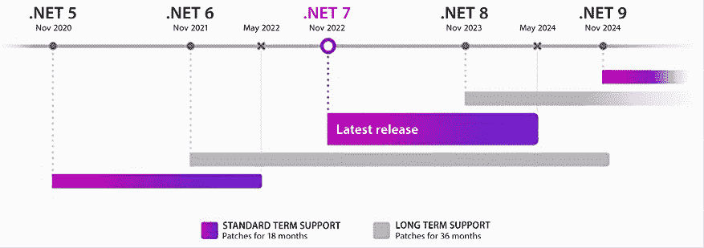
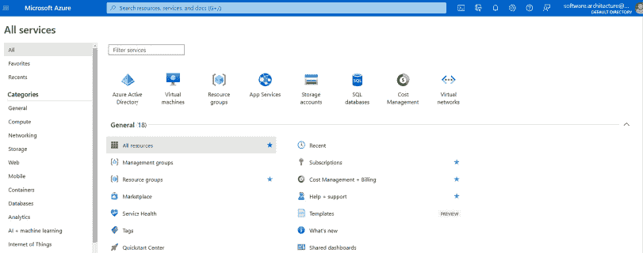
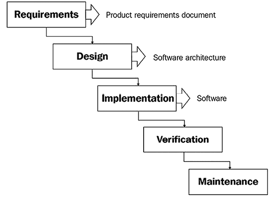
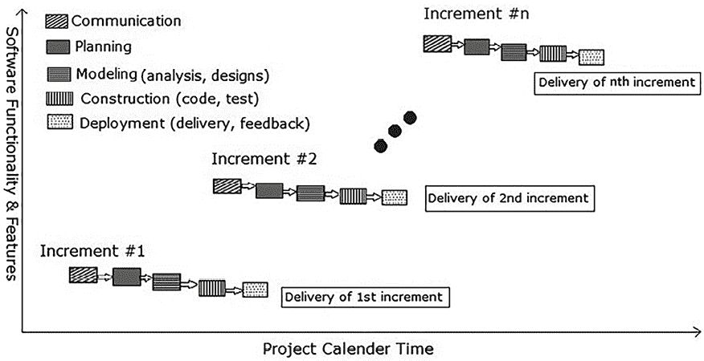
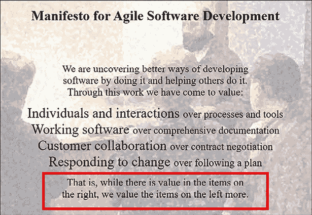
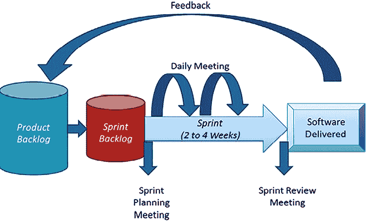
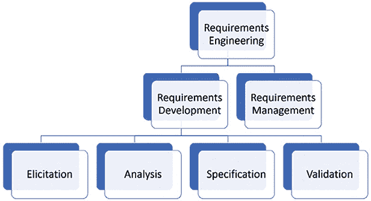
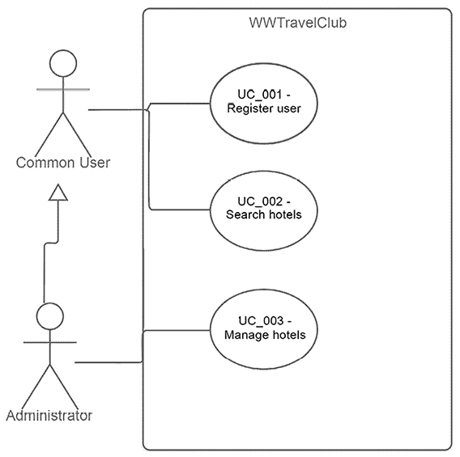

# 1

# 理解软件架构的重要性

我们于 2018 年开始编写这本书。自第一版出版以来已有五年，为满足客户需求而创建的企业应用程序（**EAs**）的**软件架构**的重要性日益增长。此外，技术本身也在以难以跟上速度发展，因此，新的架构机会不断涌现。因此，我们不断强调，我们构建的解决方案越复杂、越神奇，我们就越需要伟大的软件架构来构建和维护它们。

我们确信这就是您决定阅读这本书新版本的原因，这也是我们决定编写它的原因。这不仅仅是因为.NET 8 与.NET 6 的不同，因为还有其他采用这种方法的令人难以置信的书籍。真正目的是向社区提供一本能够支持开发人员和软件架构师在设计解决方案时做出困难决策的组件选择的书。因此，在本版中，我们重新构思了呈现所有内容的方式。

在阅读本版章节时，您会发现您将获得理解在设计企业应用程序时不可避免的基础和科技主题的支持，这些主题使用.NET 8、C#和云计算。大多数示例将使用 Microsoft Azure，但我们始终以不使您局限于特定云平台的方式呈现此内容。

重要的是提醒您，撰写关于这个重要主题并非易事，它提供了如此多的替代技术和解决方案。本书的主要目标不是构建一个详尽无遗且永不结束的技术和解决方案列表，而是展示各种技术家族之间的关系，以及它们在实际中如何影响构建可维护和可持续的解决方案。我们希望你们都能享受这次新的旅程！

具体来说，在*第一章* *理解软件架构的重要性*中，我们将讨论为什么我们需要持续关注创建有效的企业解决方案的需求不断增加；用户总是需要他们应用程序中的更多新功能。此外，由于市场变化迅速，需要交付频繁的应用程序版本（版本），这增加了我们拥有复杂软件架构和开发技术的义务。

本章将涵盖以下主题：

+   软件架构是什么

+   一些可能对您作为软件架构师有帮助的软件开发过程模型

+   收集设计高质量软件所需正确信息的过程

+   帮助开发过程的设计技术

+   影响系统结果的需求案例

对于这个新版本，我们还将重新制定我们展示本书案例研究的方式。你将在书的最后一章找到一个单独的章节，那里将很容易理解其实施的整个目的。

本书的研究案例将带你通过为名为**World Wild Travel Club**（**WWTravelClub**）的旅行社创建软件架构的过程。这个案例研究的目的帮助你理解每一章中解释的理论，并提供一个如何使用 Azure、Azure DevOps、GitHub、C# 12、.NET 8、ASP.NET Core 和其他本书将介绍的技术开发企业应用的例子。

到本章结束时，你将确切了解软件架构的使命。你还将学会什么是 Azure 以及如何在平台上创建账户。你还将获得软件过程、模型和其他技术的概述，这些技术将使你能够领导你的团队。

# 软件架构是什么？

你今天之所以能阅读这本书，要归功于那些决定将软件开发视为一个工程领域的计算机科学家。这发生在上个世纪，更具体地说，是在六十年代末，当时他们提出我们开发软件的方式与建造建筑的方式非常相似。这就是为什么我们称之为**软件架构**。正如建筑师根据设计来设计建筑并监督其建造一样，软件架构师的主要目标是确保软件应用得到良好的实施；良好的实施需要设计一个优秀的架构解决方案。

在一个专业开发项目中，你必须做以下事情：

+   定义解决方案的客户需求。

+   设计一个优秀的解决方案以满足那些要求。

+   实施设计的解决方案。

+   测试解决方案的实施。

+   与客户验证解决方案。

+   在工作环境中交付解决方案。

+   在之后维护该解决方案。

软件工程将这些活动定义为软件开发生命周期的基本要素。所有理论上的软件开发过程模型（瀑布、螺旋、增量、敏捷等）都与这个周期有关。无论你使用哪种模型，如果你不在项目初期执行基本任务，你就不会提供可接受的软件解决方案。

关于设计优秀解决方案的主要观点是本书目的的基础。你必须理解，优秀的现实世界解决方案会带来一些基本约束：

+   解决方案需要满足用户需求。

+   解决方案需要按时交付。

+   解决方案需要遵守项目预算。

+   解决方案需要提供高质量。

+   解决方案需要保证安全和有效的未来演变。

优秀的解决方案需要是可持续的，你必须明白，没有优秀的软件架构就没有可持续的软件。如今，优秀的软件架构既依赖于现代工具，也依赖于现代环境，以完美满足用户需求。

因此，本书将使用微软提供的一些优秀工具。我们决定始终遵循**长期支持**（**LTS**）版本编写本书，这就是为什么我们现在正在使用.NET 8 的所有示例。这是作为软件开发统一平台的第二个 LTS 版本，这为我们创造了创建出色解决方案的绝佳机会。



图 1.1：.NET 支持

.NET 8 与 C# 12 一同发布。考虑到.NET 针对众多平台和设备的目标，C#现在已成为世界上使用最广泛的编程语言之一，它可以在从小型设备到大型服务器等各种**操作系统**（**OSs**）和环境上运行。

本书还将使用**Microsoft Azure**，这是微软的云平台，在那里你可以找到公司提供的所有组件，用于构建高级软件架构解决方案。

值得注意的是，使用.NET 8 与 Azure 的结合只是作者选择的一个选项。.NET 也可以通过其他云服务提供商正常工作，Azure 也能很好地处理其他编码框架。

要成为一名软件架构师，你需要熟悉这些技术，以及许多其他技术。这本书将引导你踏上旅程，作为团队中的软件架构师，你将学习如何使用这些工具提供最佳解决方案。让我们从创建你的 Azure 账户开始这段旅程。

# 创建 Azure 账户

Microsoft Azure 是目前市场上最好的云解决方案之一。重要的是要知道，在 Azure 内部，我们将找到一组可以帮助我们定义 21 世纪解决方案架构的组件。

如果你想以紧凑、易于消化的方式检查 Azure 的当前状态、结构和更新，只需访问由 Alexey Polkovnikov 开发的[`azurecharts.com/`](https://azurecharts.com/)，你可以在其中学习、评估，甚至只是享受这个 Azure 百科全书中所描述的数十个 Azure 组件。

本小节将指导你创建 Azure 账户。如果你已经有了账户，你可以跳过这部分。

1.  首先，访问[`azure.microsoft.com`](https://azure.microsoft.com)。在那里，你可以找到开始订阅所需的信息。通常情况下，语言翻译会自动设置。

1.  一旦您访问了这个门户，就有可能进行注册。如果您以前从未这样做过，有一个**免费开始**的选项，这样您就可以使用一些 Azure 功能而无需花费任何费用。请查看[`azure.microsoft.com/free/`](https://azure.microsoft.com/free/)上的免费计划选项。

1.  创建免费账户的过程相当简单，您将通过一个表格进行指导，该表格要求您拥有**Microsoft 账户**或**GitHub 账户**。

1.  在此过程中，您还将被要求提供信用卡号码以验证您的身份，并防止垃圾邮件和机器人。然而，除非您升级账户，否则您不会收费。

1.  要完成作业，您需要接受订阅协议、提供详细信息以及隐私声明。

1.  一旦您完成填写表格，您就可以访问 Azure 门户。正如您在下面的屏幕截图中所见，面板显示了一个您可以定制的仪表板，以及一个左侧菜单，您可以在其中设置您将在解决方案中使用 Azure 组件。在这本书的整个过程中，我们将回到这个屏幕来设置帮助我们创建现代软件架构所需的组件。要找到下一页，只需选择汉堡菜单图标并点击**所有服务**：



图 1.2：Azure 门户

一旦您创建了 Azure 账户，您就准备好了解软件架构师如何利用 Azure 提供的一切机会来领导团队开发软件。然而，重要的是要记住，软件架构师需要超越技术本身，因为他们需要定义软件的交付方式。

今天，软件架构师不仅设计软件的基础，还决定整个软件开发和部署过程是如何进行的。下一节将涵盖世界上一些最广泛使用的软件开发范例。我们将从描述社区所指的传统软件工程开始。然后，我们将介绍如今改变了我们构建软件方式的敏捷模型。

# 软件开发流程模型

作为一名软件架构师，了解目前大多数企业中常用的某些常见开发流程是很重要的。软件开发流程定义了团队中的人们如何生产和交付软件。一般来说，这个过程与一种称为**软件开发流程模型**的软件工程理论相关。自从软件开发首次被定义为一种工程过程以来，已经提出了许多软件开发流程模型。让我们回顾一下传统的软件模型，然后看看目前常见的敏捷模型。

## 回顾传统的软件开发流程模型

软件工程理论中介绍的一些模型已经被认为是传统且过时的。本书并不旨在涵盖所有这些模型，但在这里，我们将简要解释一些仍在某些公司中使用的模型——**瀑布**和**增量**模型。

### 理解瀑布模型原则。

这个主题在 2023 年的软件架构书中可能看起来很奇怪，但确实，你仍然可能找到一些公司，其中最传统的软件过程模型仍然是软件开发指南。这个过程按顺序执行所有基本任务。任何软件开发项目都包括以下步骤：

+   **需求**：创建产品需求文档，它是软件开发过程的基础。

+   **设计**：根据需求开发软件架构。

+   **实现**：软件被编程。

+   **验证**：在应用程序中进行测试。

+   **维护**：在交付后，周期再次开始。

让我们看看这个的图示表示：



图 1.3：瀑布开发周期([`en.wikipedia.org/wiki/Waterfall_model`](https://en.wikipedia.org/wiki/Waterfall_model))

通常，使用瀑布模型会导致问题，如软件功能版本交付延迟，以及由于期望与最终交付产品之间的距离而导致用户不满。此外，根据我的经验，只有在开发完成后才开始应用程序测试总是感觉非常紧张。

### 分析增量模型。

**增量开发**是一种试图克服瀑布模型最大问题的方法：用户只能在项目结束时测试解决方案。遵循此方法模型的理念是尽可能早地让用户与解决方案互动，以便他们可以提供有用的反馈，这将有助于软件开发过程中的开发。



图 1.4：增量开发周期([`en.wikipedia.org/wiki/Incremental_build_model`](https://en.wikipedia.org/wiki/Incremental_build_model))

在前面的图片中展示的增量模型被引入作为瀑布方法的替代方案。该模型的理念是为每个增量运行一系列与软件开发相关的实践（**沟通**、**规划**、**建模**、**构建**和**部署**）。尽管它减轻了与客户沟通不足相关的问题，但对于大型项目来说，增量仍然太长，因此更少的增量仍然是一个问题。

当增量方法被大规模使用时——主要在上世纪末——由于需要大量的文档，报告了许多与项目官僚主义相关的问题。这种笨拙的场景导致了软件开发行业中一个非常重要的运动的兴起——**敏捷**。

### 理解敏捷软件开发流程模型

在本世纪初，软件开发被认为是工程中最混乱的活动之一。失败的软件项目比例极高，这一事实证明了需要一种不同的方法来处理软件开发项目所需的灵活性。

2001 年，**敏捷宣言**被介绍给世界，从那时起，各种敏捷流程模型被提出。其中一些一直存活至今，并且仍然非常普遍。

敏捷宣言已被翻译成 60 多种语言。您可以在[`agilemanifesto.org/`](https://agilemanifesto.org/)查看。

敏捷模型与传统模型之间最大的区别是开发者与客户互动的方式。所有敏捷模型背后的信息是，你越快将软件交付给用户，就越好。这种想法有时会让软件开发者感到困惑，他们将其理解为——*让我们尝试编码，这就是全部，朋友们！*

然而，敏捷宣言的一个重要观察结果，很多人在开始使用敏捷时并没有阅读：



图 1.5：敏捷软件开发宣言

软件架构师始终需要记住这一点。敏捷流程并不意味着缺乏纪律。此外，当你使用敏捷流程时，你会很快明白，没有纪律就无法开发出好的软件。另一方面，作为一名软件架构师，你需要理解“软”意味着灵活性。一个拒绝灵活性的软件项目往往会随着时间的推移而自我毁灭。

敏捷背后的 12 项原则是这个灵活方法的基础：

1.  持续交付有价值的软件以满足客户需求必须是任何开发者的最高优先级。

1.  需要理解需求变更是一个让客户更具竞争力的机会。

1.  使用每周的时间尺度交付软件。

1.  软件团队必须由业务人员和开发者组成。

1.  软件团队需要被信任，并且应该拥有正确的环境来完成项目。

1.  与软件团队的最佳沟通方式是面对面。

1.  当软件真正在生产中运行时，您可以看到最伟大的软件团队成就。

1.  当敏捷交付可持续开发时，它才能正常工作。

1.  你在技术和良好设计上的投资越多，你就越敏捷。

1.  简单性是至关重要的。

1.  团队越自我组织，交付的质量就越好。

1.  软件团队倾向于不时地改善其行为，分析和调整其流程。

即使在敏捷宣言发布 20 年后，其重要性和与当前软件团队需求的联系依然存在。当然，有许多公司还没有完全接受这种方法，但作为软件架构师，你应该将其视为一个转变实践和进化你所工作的团队的机会。

有许多技术和模型被敏捷方法引入到软件社区中。接下来的小节将讨论**精益软件开发**、**极限编程**和**Scrum**，以便您作为软件架构师可以决定您可能使用哪些来改进您的软件交付。

#### 精益软件开发

在敏捷宣言之后，精益软件开发方法被引入社区，作为汽车工程中一个知名运动的适应，即丰田的汽车制造模式。精益制造方法即使在资源有限的情况下也能提供高质量。

玛丽和汤姆·波彭迪克为软件开发制定了七个精益原则，这些原则与敏捷以及本世纪许多公司的方法真正相连，以下列出：

+   **消除浪费**：你可能认为任何会干扰客户真实需求交付的东西都是浪费。

+   **在过程中建立质量**：一个想要保证质量的组织需要在流程的最初就推广它，而不仅仅是在代码测试时才考虑。

+   **创建知识**：所有取得卓越成就的公司都通过有纪律的实验、记录知识并确保知识在整个组织中传播来生成新知识。

+   **推迟承诺**：在尽可能晚的时刻做出决策，而不损害项目。

+   **快速交付**：你交付软件越快，你消除浪费的机会就越多。使用时间频率竞争的公司相对于其竞争对手有显著的优势。

+   **尊重人员**：为团队设定合理的目标，并制定指导他们自我组织日常工作的计划，这是尊重你一起工作的人。

+   **优化整体**：精益公司改善价值循环；从它接收新需求的那一刻起，到它交付软件的那一刻。

遵循精益原则有助于团队或公司提高交付给客户的功能质量。它还减少了客户不会使用的功能所花费的时间。在精益中，决定对客户重要的功能指导团队交付有意义的软件，这正是敏捷宣言旨在在软件团队中推广的。

#### 极限编程

在敏捷宣言发布之前，一些设计文档的参与者，特别是 Kent Beck，向世界介绍了软件开发的方法论——**极限编程**（**XP**）。

XP 基于简洁、沟通、反馈、尊重和勇气这些价值观。根据贝克关于这个主题的第二本书，它后来被认为是一种编程领域的社交变革。它无疑促进了开发流程的巨大变化。

XP 声明每个团队都应该只做被要求做的事情，每天面对面沟通，尽早展示软件以获取反馈，尊重团队每个成员的专业知识，并勇于讲述关于进度和估计的真实情况，将团队的工作视为整体。

XP 还提供了一套规则。如果团队发现某些事情没有正常运作，他们可以更改这些规则，但始终维护方法论的价值是非常重要的。

这些规则分为规划、管理、设计、编码和测试。唐·韦尔斯在 [`www.extremeprogramming.org/`](http://www.extremeprogramming.org/) 上绘制了 XP 的图。尽管许多公司和专家强烈批评了该方法论的一些想法，但仍有许多良好的实践至今仍在使用：

+   **使用用户故事编写软件需求**：用户故事被认为是一种敏捷的方法来描述用户需求，以及验收测试，这些测试用于确保正确实施。

+   **将软件划分为迭代并交付小版本**：除了瀑布模型之外，所有软件开发方法都实施了迭代的实践。交付更快版本的事实降低了未能满足客户期望的风险。

+   **避免加班并保证可持续的速度**：尽管这可能是软件架构师可能遇到的最困难的任务之一，但加班表明在过程中某些事情没有正常运作。

+   **保持简单**：在开发解决方案时，试图预测客户可能希望拥有的功能是很常见的。这种方法增加了开发的复杂性和将解决方案推向市场的时间。另一种方法将导致成本高昂，并且可能是在你开发的系统中使用率低的功能。

+   **重构**：持续重构代码的方法是好的，因为它使你的软件能够进化，并确保由于你使用的开发平台的技术变化而真正必要的改进。

+   **始终让客户可用**：如果你遵循 XP（极限编程），你应该在团队内部有一个专家客户。这当然是一件很难做到的事情，但这种方法的主要思想是确保客户参与开发的所有部分。作为另一个额外的好处，让客户靠近你的团队意味着他们了解团队面临的困难和专业知识，这有助于增进双方之间的信任。

+   **持续集成**：这种实践是当前 DevOps 方法的基础之一。你个人代码仓库和主代码仓库之间的差异越小，越好。

+   **先编写单元测试**：单元测试是一种编程特定代码以测试项目单个单元（类/方法）的方法。这在当前的开发方法论中被称为**测试驱动开发**（**TDD**）。这里的目的是确保每个业务规则都有自己的单元测试用例。

+   **代码必须按照既定标准编写**：确定编码标准的需求与这样一个观点相关联，即无论哪个开发者负责项目的特定部分，代码都必须编写得让任何开发者都能理解。

+   **结对编程**：结对编程是在软件项目的每一分钟都难以实现的方法之一，但这种方法本身——一个程序员编写代码，另一个程序员积极观察并提供评论、批评和建议——在关键场景中非常有用。

+   **验收测试**：采用验收测试来满足用户故事是确保新发布的软件版本不会损害其当前需求的好方法。更好的选择是将这些验收测试自动化。

值得注意的是，许多这些规则今天被认为是在不同的软件开发方法论中至关重要的实践，包括 DevOps 和 Scrum。我们将在本书的*第八章*，*理解 DevOps 原则和 CI/CD*中讨论 DevOps。现在让我们深入了解 Scrum 模型。

#### 进入 Scrum 模型

Scrum 是一种敏捷的软件开发项目管理模型。该模型源于精益原则，并且是目前软件开发中更广泛使用的方法之一。

请查看此链接以获取有关 Scrum 框架的更多信息：[`www.scrum.org/`](https://www.scrum.org/).

如下图中所示，Scrum 的基础是您有一个灵活的用户需求清单（**产品待办事项**），需要在每个敏捷周期中讨论，这被称为**冲刺**。冲刺目标（**冲刺待办事项**）由**Scrum 团队**确定，该团队由**产品负责人**、**Scrum 大师**和**开发团队**组成。产品负责人负责确定那个冲刺中将交付的内容。在冲刺期间，这个人将帮助团队开发所需的功能。在 Scrum 流程中领导团队的人被称为 Scrum 大师。所有的会议和流程都由这个人执行。



图 1.6：Scrum 流程

通常会将 Scrum 与另一种名为**看板**的敏捷技术一起应用，看板也是由丰田为制造汽车而开发的，通常用于软件维护。看板的主要目的是通过一个可视化系统确保每个人都了解正在开发的产品的情况。著名的看板板是一个实现这一点的绝佳方式，在那里你定义团队必须做什么，他们在做什么，以及已经完成的事情。

需要注意的是，Scrum 流程并没有讨论软件应该如何实现，也没有说明哪些活动将会被执行。再次强调，你必须记住软件开发的基础，这是在本章开头讨论过的；Scrum 需要与一个流程模型一起实施。DevOps 是可能帮助你结合 Scrum 使用软件开发流程模型的方法之一。查看*第八章*，*理解 DevOps 原则和 CI/CD*，以更好地理解这一点。

### 在整个公司范围内扩展敏捷

今天，在实践敏捷并取得良好进展的公司中相当普遍，考虑到前几节中介绍的技术成果。Scrum、看板和 XP 的混合使用，以及软件开发过程成熟度的演变，为公司带来了良好的结果，我们生活在一个软件开发是商业成功关键策略之一的世界。

一些公司自然需要增加团队的数量，但在这一过程中，重要的问题是如何在不失去敏捷性的情况下进行演变。你可以确信，这个问题可能会被作为一个软件架构师的你提出。你可能会在*SAFe® – 扩展敏捷框架*中找到对这个问题的良好答案：

> SAFe® for LeanEnterprises 是一个知识库，包含经过验证的、集成的原则、实践和能力，用于通过精益、敏捷和 DevOps 实现业务敏捷性。”
> 
> – 迪恩·莱夫林韦尔，创始人。
> 
> © 扩展敏捷，Inc.

基于对齐、内置质量、透明度和项目执行的核心理念，该框架为在拥有一个或多个价值流的公司中交付具有所需敏捷性的产品提供了详细的路径。其原则使敏捷和增量交付、系统思维、快速经济决策以及围绕价值组织成为可能。

作为一名软件架构师，你可能会在系统团队、敏捷发布列车中的系统架构师，甚至在公司中的企业架构师等职位上找到成长的机会。当然，这需要大量的学习和投入，但这就是你在大型公司中会遇到的架构。

就像在这本书中你将找到的每一个框架、技术或模型一样，向你们介绍 SAFe 的目的并不是涵盖内容的每一个细节。你可以在他们的网站上找到优秀的资料和培训。但作为一名软件架构师，了解如何扩大公司规模可能是你工具箱中的一项宝贵知识！既然你已经知道了，那么让我们回到设计高质量软件的阶段，讨论如何收集正确信息来设计它。

# 收集设计高质量软件的正确信息

太棒了！你刚刚开始一个软件开发项目。现在，是时候运用你所有的知识来交付最好的软件了。你第一个问题可能就是——*我该如何开始？* 好吧，作为一名软件架构师，你将是回答这个问题的那个人。而且你可以确信，你的答案会随着你领导的每一个软件项目而不断演变。

定义软件开发流程是第一项任务。这通常在项目规划过程中完成，或者可能在它开始之前发生。

另一个非常重要的任务是收集软件需求。无论你决定使用哪种软件开发流程，收集真实用户需求都是一项困难和持续的工作的一部分。当然，有技术可以帮助你完成这项工作，你可以确信，收集需求将帮助你定义软件架构的重要方面。

这两个任务被大多数软件开发专家视为开发项目旅程结束时的成功关键。作为一名软件架构师，你需要使它们成为可能，这样你就可以在引导你的团队的同时，尽可能避免可能出现的问题。

## 理解需求收集过程

表示需求的方式有很多。最传统的方法是在分析开始之前，你必须写出一个完美的规范。敏捷方法建议，你需要在准备好开始一个开发周期时立即编写用户故事。

记住，你不仅仅是为用户编写需求；你也是为你的团队和你自己编写它们。

事实是，无论你决定在项目中采用哪种方法，你都需要遵循一些步骤来收集需求。这就是我们所说的**需求工程过程**。



图 1.7：需求工程过程

在这个过程中，你需要确保解决方案是可行的。在某些情况下，可行性分析也是项目规划过程的一部分，在你开始需求收集时，你将已经完成了可行性报告。因此，让我们检查这个过程的其它部分，这将为你提供大量关于软件架构的重要信息。

## 检测精确的用户需求

有很多方法可以检测特定场景中用户的确切需求。这个过程被称为*收集*。一般来说，这可以通过帮助你理解我们所说的用户需求的技术来完成。这里有一个常见技术的列表：

+   **想象力的力量**：如果你在你提供解决方案的领域是专家，你可以使用自己的想象力来找到新的用户需求。头脑风暴可以协作进行，以便一组专家可以定义用户的需求。

+   **问卷调查**：这个工具对于检测常见且重要的需求很有用，例如用户数量和种类、系统高峰使用时间以及最常用的**操作系统**和网页浏览器。

+   **访谈**：与用户访谈可以帮助你作为架构师检测到问卷调查和你的想象力可能无法涵盖的用户需求。

+   **观察**：没有比观察用户一天更好的方式来理解用户的日常习惯了。

一旦你应用了其中一种或多种技术，你将拥有关于用户需求的大量有价值的信息。

记住，你可以在任何需要收集需求的情况下使用这些技术，无论是针对整个系统还是针对单个故事。

在那一刻，你将能够开始分析这些用户需求并检测用户和系统需求。让我们看看如何在下一节中这样做。

## 分析需求

当你检测到用户需求后，是时候开始分析需求了。为此，你可以使用以下技术：

+   **原型设计**：原型设计对于阐明和具体化系统需求非常出色。今天，我们有许多工具可以帮助你模拟界面。一个不错的开源工具是**Pencil Project**。你可以在[`pencil.evolus.vn/`](https://pencil.evolus.vn/)找到更多关于它的信息。**Figma**([`www.figma.com/`](https://www.figma.com/))也是一个很好的原型设计工具，并且他们提供了一套免费的启动包。

+   **用例**：如果您需要详细的文档，可以使用**统一建模语言**（**UML**）用例模型。该模型由详细规范和图表组成。**Lucidchart**（[`www.lucidchart.com/`](https://www.lucidchart.com/））是另一个可以帮助您的工具。您可以在*图 1.8*中看到创建的模型：



图 1.8：用例图示例

当您分析系统需求时，您将能够确切地了解用户的需求。当您不确定需要解决的真正问题时，这很有帮助，而且比开始编程系统并寄希望于最好的结果要好得多。在需求分析上投入的时间是以后编写更好代码的时间。

## 编写规范

在您完成分析后，将注册为规范非常重要。规范文档可以使用传统的需求或用户故事编写，后者在敏捷项目中常用。

需求规范代表了用户和团队之间的技术合同。这份文档需要遵循一些基本规则：

+   所有利益相关者都需要确切了解技术合同中写的内容，即使他们不是技术人员。

+   文档需要清晰。

+   您需要分类每个需求。

+   使用简单将来时来表示每个需求：

    +   **不良示例**：一个普通用户自行注册。

    +   **良好示例**：一个普通用户应自行注册。

+   避免歧义和争议。

+   一些额外的信息可以帮助团队理解他们将要工作的项目背景。以下是一些关于如何添加有用信息的提示：

    +   编写一个介绍章节，以全面了解解决方案。

    +   创建一个术语表以简化理解。

    +   描述该解决方案将覆盖的用户类型。

+   编写功能性和非功能性需求：

    功能性需求很容易理解，因为它们确切地描述了软件将做什么。另一方面，非功能性需求决定了与软件相关的限制，这意味着可扩展性、健壮性、安全性和性能。我们将在下一节中介绍这些方面。

+   附加有助于用户理解规则的文档。

如果您决定编写用户故事，一个很好的建议是写简短的句子，代表系统中的每个时刻以及每个用户，如下所示：

*作为<用户>，我想要<功能>，以便<原因>*

这种方法将确切地解释为什么将实现该功能。它也是帮助您分析最重要的故事并优先考虑项目成功的良好工具。它们还可以用于告知应构建的自动化验收测试。

## 理解可扩展性、健壮性、安全性和性能的原则

识别需求是一项任务，将帮助你理解你将要开发的软件。然而，作为软件架构师，你必须注意的不仅仅是该系统的功能性需求。理解非功能性需求很重要，这是软件架构师最早的活动之一。

我们将在第二章“非功能性需求”中更详细地探讨这个问题，但在此阶段，重要的是要知道可扩展性、健壮性、安全性和性能的原则需要应用于需求收集过程。让我们看看每个概念：

+   **可扩展性**：互联网为你提供了一个拥有全球大量用户的解决方案的机会。这是非常棒的，但作为软件架构师，你需要设计一个能够提供这种可能性的解决方案。可扩展性是指应用程序在必要时能够增加其处理能力，这是由于正在消耗的资源数量。

+   **健壮性**：无论你的应用程序有多大的可扩展性，如果它不能保证一个稳定且始终在线的解决方案，你将无法得到任何安宁。健壮性对于关键解决方案非常重要，在这些解决方案中，由于应用程序解决的问题类型，你无法在任何时候进行维护。在许多行业中，软件不能停止，当没有人可用时（如夜间、节假日等），会有很多程序运行。设计一个可靠的解决方案将使你能够在软件平稳运行的同时享受生活。

+   **安全性**：这是在需求阶段之后需要讨论的另一个非常重要的领域。每个人都担心安全问题，世界上不同地区的不同法律都在处理这个问题。作为软件架构师，你必须理解安全性需要通过设计来提供。这是应对目前安全社区讨论的所有需求的唯一方法。

+   **性能**：理解你将要开发的系统的过程可能会给你一个很好的想法，了解你需要做些什么才能从系统中获得期望的性能。这个话题需要与用户讨论，以确定你在开发阶段将面临的大部分瓶颈。

值得注意的是，所有这些概念都是世界所需的新一代解决方案的要求。区分优秀软件和卓越软件的是满足项目要求所付出的工作量。

## 审查规格说明

一旦你写好了规格说明，就需要与利益相关者确认他们是否同意。这可以通过审查会议来完成，或者可以使用协作工具在线完成。

这时，你需要展示你所收集的所有原型、文档和信息。一旦所有人都同意规格说明，你就可以开始研究实施项目这一部分的最佳方式了。

值得注意的是，你可以使用这里描述的过程来处理整个软件或其一部分。

# 使用设计技术作为有用的工具

定义一个解决方案并不容易。确定要使用哪种技术也很困难。确实，在你作为软件架构师的职业生涯中，你将发现许多项目，你的客户将带来一个*准备开发*的解决方案。如果你认为这个解决方案是正确的解决方案，那么这可能会变得相当复杂；大多数情况下，将会有架构和功能错误，这将在未来导致解决方案中的问题。

有一些情况下问题更为严重——当客户不知道问题的最佳解决方案时。一些设计技术可以帮助我们，我们在这里将介绍其中的两种：**设计思维**和**设计冲刺**。

你必须理解的是，这些技术可以是一个发现真实需求的绝佳选择。作为一名软件架构师，你致力于帮助你的团队在正确的时间使用正确的工具，这些工具可能是确保项目成功的正确选择。

## 设计思维

设计思维是一个允许你直接从用户收集数据的过程，专注于实现最佳结果以解决问题。在这个过程中，团队将有机会发现所有将与系统互动的*角色*。这将对解决方案产生美妙的影响，因为你可以通过关注用户体验来开发软件，这可以产生惊人的结果。

该过程基于以下步骤：

1.  **同理心**: 在这一步，你必须执行实地研究以发现用户的需求。这是你了解系统用户的地方。这个过程有助于你理解为什么以及为谁开发这款软件。

1.  **定义**: 一旦你了解了用户的需求，就是时候定义他们的需求以解决问题了。

1.  **构思**: 需求将提供机会来头脑风暴一些可能的解决方案。

1.  **原型**: 这些解决方案可以作为原型来开发，以确认它们是否是好的解决方案。

1.  **测试**: 测试原型将帮助你理解与用户真实需求最相关的原型。

这种技术的重点是加速辨别正确产品和考虑**最小可行产品**（**MVP**）的过程。当然，原型过程将帮助利益相关者理解最终产品，同时让团队参与提供最佳解决方案。

## 设计冲刺

设计冲刺是一个在五天冲刺中通过设计解决关键业务问题的过程。这项技术由谷歌提出，它允许你在寻找构建和推出市场解决方案时快速测试并从想法中学习。

该过程涉及专家花费一周时间解决手头的问题，在一个为此目的准备的作战室里。这一周看起来是这样的：

+   **星期一**：这一天的重点是确定冲刺的目标，并将挑战映射到实现目标上。

+   **星期二**：在理解了冲刺目标后，参与者开始绘制可能解决问题的解决方案草图。现在是时候找到客户来测试即将提供的新解决方案了。

+   **星期三**：这是团队需要决定最有可能解决问题的解决方案的时候。团队必须将这些解决方案绘制成故事板，为原型准备计划。

+   **星期四**：现在是时候将故事板上计划的想法原型化了。

+   **星期五**：在完成原型后，团队向客户展示它，通过获取他们对设计的反应来学习。

正如你所见，在这两种技术中，从客户那里收集反应的加速来自于将你的团队想法具体化为对最终用户更直观的东西的原型。

# 常见的情况，需求收集过程会影响系统结果

本章中讨论的所有信息，如果你想要按照良好的工程原则设计软件，都是非常有用的。我们并不主张传统的或敏捷的开发方法，而是强调以专业的方式构建软件。

了解一些案例也是好的，在这些案例中，未能执行你所阅读的活动可能会给软件项目带来一些麻烦。以下案例旨在描述可能出错的情况，以及前述技术如何帮助开发团队解决相关的问题。

在大多数情况下，非常简单的行动可以保证团队和客户之间更好的沟通，这种简单的沟通流程可以将大问题转化为真正的解决方案。让我们考察三个常见的案例，这些案例中需求收集可能会影响软件性能、功能和可用性。

## 案例 1 – 我的网站打开那个页面太慢了！

性能是你作为软件架构师在职业生涯中将要处理的最大问题之一。任何软件的这一方面之所以如此有问题，是因为我们没有无限的计算资源来解决问题。计算成本仍然很高，尤其是如果你在谈论具有大量同时用户的软件。

你不能通过编写需求来解决性能问题。然而，如果你正确地编写它们，你也不会陷入麻烦。这里的想法是，需求必须展示系统的预期性能。一个简单的句子可以帮助整个项目团队（用户、测试人员、开发人员、架构师、经理等）：

*非功能性需求：性能 – 任何该软件的网页都应在至少 2 秒内响应，即使有 1,000 个用户同时访问它*。

前面的句子只是让每个人（用户、测试人员、开发人员、架构师、经理等）知道任何网页都有一个目标要实现。这是一个好的开始，但还不够。一个良好的开发和部署应用程序的环境也很重要。这正是 .NET 8 可以大量帮助你的地方；特别是如果你在谈论 Web 应用程序，ASP.NET Core 被认为是当今提供解决方案最快的选项之一。

在谈到性能时，作为软件架构师，你应该考虑使用以下章节中列出的技术，并结合特定的测试来保证这一非功能性需求。还需要提到的是，ASP.NET Core 将帮助你轻松使用它们，以及一些由微软 Azure 提供的 **平台即服务**（**PaaS**）解决方案。

### 理解后端缓存

缓存是一种避免耗时和冗余查询的绝佳技术。例如，如果你是从数据库中获取汽车型号，数据库中的汽车数量可能会增加，但型号本身不会改变。一旦你有一个不断访问汽车型号的应用程序，一个好的做法是将这些信息缓存起来。

理解这一点很重要：缓存存储在后端，并且该缓存由整个应用程序共享（*内存缓存*）。需要注意的是，当你在开发可扩展的解决方案时，你可以使用 Azure 平台配置一个 *分布式缓存*。实际上，ASP.NET 提供了内存缓存和分布式缓存，因此你可以选择最适合你需求的一种。*第二章*，*非功能性需求*，涵盖了 Azure 平台的可扩展性方面。

还需要提到的是，缓存也可能发生在前端、通往服务器的代理、CDN 等地方。

### 应用异步编程

当你开发 ASP.NET 应用程序时，你需要记住你的应用程序需要设计为能够被许多用户同时访问。异步编程通过提供 `async` 和 `await` 关键字，让你可以简单地做到这一点。

这些关键字背后的基本概念是，`async` 允许任何方法异步运行。另一方面，`await` 允许你在不阻塞调用它的线程的情况下同步调用异步方法。这种易于开发的模式将使你的应用程序运行得更加流畅，没有性能瓶颈，并带来更好的响应性。本书将在 *第二章*，*非功能性需求* 中更详细地介绍这一主题。

### 处理对象分配

避免性能不佳的一个非常好的建议是了解垃圾回收器（**GC**）的工作原理。GC 是当你完成使用它时自动释放内存的引擎。由于 GC 的复杂性，这个主题有一些非常重要的方面。

如果你没有正确处理这些对象，某些类型的对象不会被 GC 收集。这些对象包括与 I/O 交互的对象，例如文件和流。如果你没有正确使用 C# 语法来创建和销毁这类对象，你将会有内存泄漏，这会降低应用程序的性能。

与 I/O 对象交互的不正确方式是：

```cs
System.IO.StreamWriter file = new System.IO.StreamWriter(@"C:\sample.txt");
file.WriteLine("Just writing a simple line"); 
```

与 I/O 对象交互的正确方式是：

```cs
using System.IO.StreamWriter file = new System.IO.StreamWriter(@"C:\sample.txt");
file.WriteLine("Just writing a simple line"); 
```

值得注意的是，这种正确的方法也确保文件被正确写入（它调用 `FileStream.Flush()` 来优雅地释放其资源）。在不正确的示例中，内容甚至可能没有被写入文件。尽管前面的做法对于 I/O 对象是强制性的，但强烈建议你在所有可处置对象上继续这样做。实际上，在你的解决方案中使用代码分析器，将警告视为错误，将防止你意外犯下这些错误！这将有助于 GC，并确保你的应用程序以正确的内存量运行。根据对象类型，这里的错误可能会累积，最终可能导致更大规模的不良后果，例如端口/连接耗尽。

你需要了解的另一个重要方面是，GC 收集对象所花费的时间将干扰应用程序的性能。因此，避免分配大对象，并小心处理事件处理和弱引用；否则，它可能导致你总是等待 GC 完成其任务。

### 提高数据库访问效率

最常见的性能阿基里斯之踵之一是数据库访问。这仍然是一个大问题，原因是在编写查询或 lambda 表达式从数据库获取信息时缺乏关注。本书将在 *第十三章*，*在 C# 中与数据交互 – Entity Framework Core* 中介绍 Entity Framework Core，但了解选择什么以及从数据库中读取正确的数据信息非常重要。对于想要提高性能的应用程序来说，过滤列和行是必不可少的。

好消息是，与缓存、异步编程和对象分配相关的最佳实践完全适用于数据库环境。这只是一个选择正确模式以获得性能更好的软件的问题。

## 案例 2 – 用户的需求没有得到适当实现

技术在广泛领域的应用越多，交付用户所需的确切内容就越困难。也许这句话听起来有些奇怪，但你必须理解，开发者通常研究如何开发软件，但他们很少研究如何满足特定领域的需求。当然，学习如何开发软件并不容易，但理解特定领域的特定需求更加困难。如今，软件开发将软件交付给所有类型的行业。这里的问题是*开发者，无论是否是软件架构师，如何才能足够进化，以交付他们负责领域的软件？*

收集软件需求将帮助你在这项艰巨的任务中；编写它们将帮助你理解和组织系统的架构。有几种方法可以最小化实现与用户真正需求不符的风险：

+   通过原型设计快速理解用户界面。

+   设计数据流以检测系统与用户操作之间的差距。

+   举行频繁会议以保持对用户当前需求的最新了解，并与增量交付保持一致。

再次强调，作为一名软件架构师，你将不得不定义软件将如何实现。大多数时候，你不会是编写它的人，但你将始终是负责这一点的。因此，一些技术可以用来避免错误的实现：

+   开发者将审查需求，以确保他们理解他们需要开发的内容。

+   通过代码审查来验证预定义的代码标准。我们将在*第四章*，*C# 编码最佳实践 12*中介绍这一点。

+   举行会议以消除障碍。

记住，确保实现符合用户需求是你的责任。使用你能用到的每一个工具。

## 案例 3 – 系统的可用性不符合用户需求

用户体验是软件项目成功的关键。软件的展示方式和解决问题的方法将决定用户是否愿意使用它。作为一名软件架构师，你必须牢记，如今交付具有良好用户体验的软件是强制性的。

这本书不打算涵盖用户体验的基本概念，但了解谁将使用该软件是满足用户体验需求的好方法。正如本章前面所讨论的，设计思维在这方面可以帮助你很多。

理解用户将帮助你决定软件是否将在网页、手机上运行，甚至是在后台。这种理解对软件架构师来说非常重要，因为如果你正确地映射了谁将使用这些元素，系统的元素将得到更好的展示。

另一方面，如果你不关心这一点，你将只会交付出能工作的软件。这可能在短期内是好的，但它不会完全满足让人请你设计软件的真实需求。你必须牢记这些选项，并理解好的软件是设计在许多平台和设备上运行的软件。

你会很高兴地知道.NET 8 是一个令人难以置信的跨平台选项。因此，你可以开发在 Linux、Windows、Android 和 iOS 上运行的应用程序解决方案。你可以在大屏幕、平板电脑、手机甚至无人机上运行你的应用程序！你可以在自动化板或 HoloLens 的混合现实设备上嵌入应用程序。软件架构师必须思想开放，以设计出用户真正需要的解决方案。

# 摘要

在本章中，你学习了软件架构师在软件开发团队中的目的。本章还涵盖了软件开发过程模型的基础和需求收集过程。你还有机会了解如何创建你的 Azure 账户，该账户将在本书的案例研究中使用。此外，你还学习了功能性和非功能性需求以及如何使用用户故事来创建它们。这些技术将帮助你交付更好的软件项目。

在下一章中，你将有机会了解功能性和非功能性需求对软件架构的重要性。

# 问题

1.  软件架构师需要具备哪些专业知识？

1.  Azure 如何帮助软件架构师？

1.  软件架构师如何决定在项目中使用哪种最佳软件开发过程模型？

1.  软件架构师如何贡献于需求收集？

1.  软件架构师在需求规范中需要检查哪些类型的需求？

1.  设计思维和设计冲刺如何帮助软件架构师在收集需求的过程中？

1.  用户故事如何帮助软件架构师在编写需求的过程中？

1.  开发高性能软件有哪些好的技术？

1.  软件架构师如何检查用户需求是否正确实现？

# 进一步阅读

在这里，我们列出了一些你可能考虑使用的书籍和链接，以获取有关本章涵盖主题的更多信息。

+   关于 Azure 的信息，请查看以下内容：

    +   [`www.packtpub.com/virtualization-and-cloud/hands-azure-developers`](https://www.packtpub.com/virtualization-and-cloud/hands-azure-developers)

    +   [`azure.microsoft.com/overview/what-is-azure/`](https://azure.microsoft.com/overview/what-is-azure/)

    +   [`azure.microsoft.com/services/devops/`](https://azure.microsoft.com/services/devops/)

    +   [`azurecharts.com/`](https://azurecharts.com/)

+   更多关于.NET 8 的信息可以在这里找到：

    +   [`docs.microsoft.com/dotnet/`](https://docs.microsoft.com/dotnet/)

    +   [`docs.microsoft.com/aspnet/`](https://docs.microsoft.com/aspnet/)

    +   [`docs.microsoft.com/aspnet/core/performance/performance-best-practices`](https://docs.microsoft.com/aspnet/core/performance/performance-best-practices)

+   软件开发过程模型链接列在这里：

    +   [`agilemanifesto.org/`](https://agilemanifesto.org/)

    +   [`www.amazon.com/Software-Engineering-10th-Ian-Sommerville/dp/0133943038`](https://www.amazon.com/Software-Engineering-10th-Ian-Sommerville/dp/0133943038)

    +   [`www.amazon.com/Software-Engineering-Practitioners-Roger-Pressman/dp/0078022126/`](https://www.amazon.com/Software-Engineering-Practitioners-Roger-Pressman/dp/0078022126/)

    +   [`scrumguides.org/`](https://scrumguides.org/)

    +   [`www.packtpub.com/application-development/professional-scrummasters-handbook`](https://www.packtpub.com/application-development/professional-scrummasters-handbook)

    +   [`en.wikipedia.org/wiki/Incremental_build_model`](https://en.wikipedia.org/wiki/Incremental_build_model)

    +   [`en.wikipedia.org/wiki/Waterfall_model`](https://en.wikipedia.org/wiki/Waterfall_model)

    +   [`www.extremeprogramming.org/`](http://www.extremeprogramming.org/)

    +   [`www.gv.com/sprint/`](https://www.gv.com/sprint/)

+   在这里您可以找到 SAFe®信息：

    +   [`www.scaledagileframework.com/`](https://www.scaledagileframework.com/)

    +   [`scaledagile.com/train-certify/`](https://scaledagile.com/train-certify/)

    +   [`docs.microsoft.com/azure/devops/boards/plans/safe-concepts`](https://docs.microsoft.com/azure/devops/boards/plans/safe-concepts)

# 在 Discord 上了解更多信息

要加入这本书的 Discord 社区——您可以在这里分享反馈、向作者提问，并了解新版本——请扫描下面的二维码：

[`packt.link/SoftwareArchitectureCSharp12Dotnet8`](https://packt.link/SoftwareArchitectureCSharp12Dotnet8)


