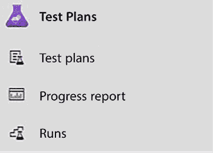
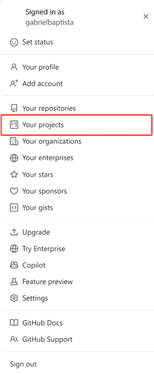
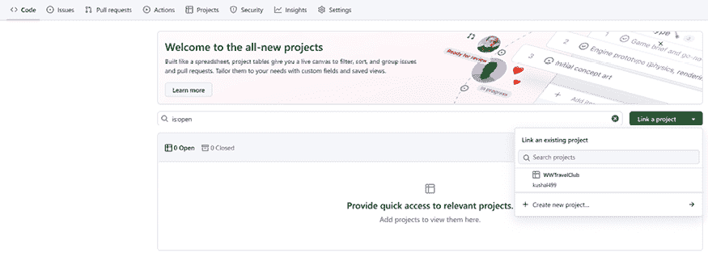

# 第三章：管理需求

根据 *第一章* 和 *第二章* 中所涵盖的内容，软件开发的第一步将指导您创建一个软件项目。当涉及到软件项目时，最大的挑战是如何以让每个参与者都能理解所需的方式组织它们。最好的办法是组织其需求。但不仅如此，将这些需求与代码仓库连接起来将为每个人提供一个快速且更协作的项目视图，该项目正在被工作。多年来，Microsoft 投资于帮助我们完成这项工作的工具。Team Foundation Server 和 Visual Studio Team Services 就是其中的例子。今天，我们有两种很好的方法可以在此章节中讨论：Azure DevOps 和 GitHub。Azure DevOps 是 Visual Studio Team Services 的发展，它提供了一系列新功能，可以帮助开发者文档化和组织他们的软件。GitHub 以在线代码仓库而闻名，但自从 Microsoft 收购它以来，许多用于应用程序生命周期管理的优秀工具已经集成其中。因此，我们现在可以找到许多不同的使用 GitHub 的方法。

本章将涵盖以下主题：

+   使用您的 Azure 账户创建 DevOps 项目

+   理解 Azure DevOps 和 GitHub 提供的功能以组织您的项目

+   使用 Azure DevOps 和 GitHub 组织和管理需求

本章的前两节总结了这些工具提供的所有功能，而其余部分则专注于文档化需求和支持整体开发流程的工具。第一和第二节中介绍的大部分功能将在其他章节中更详细地分析。

# 技术要求

本章要求您创建一个新的免费 Azure 账户或使用现有的账户。在 *第一章*，*理解软件架构的重要性* 中的 *创建 Azure 账户* 部分解释了如何创建账户。

# 介绍 Azure DevOps

Azure DevOps 是一个 Microsoft **软件即服务** (**SaaS**) 平台，它使您能够向客户持续交付价值。通过在那里创建账户，您将能够轻松地规划项目、安全地存储代码、测试它、将解决方案发布到预发布环境，然后将其发布到实际的生产基础设施。

自动化软件生产中涉及的所有步骤确保现有解决方案的持续增强和改进，以适应市场需求。

您可以通过访问 [`dev.azure.com`](https://dev.azure.com) 开始此过程。在那里，您可以使用新账户注册或甚至使用您的 GitHub 账户登录。一旦您获得访问权限，您将被要求创建一个组织，如图下所示。

图 3.1：创建 Azure DevOps 组织

组织创建后，您将能够创建一个新的项目，如下面的屏幕截图所示。

图 3.2：使用 Azure DevOps 创建项目

需要指出的是，只要您遵守 Azure DevOps 的行为准则，就可以使用公开项目。一旦您定义了项目的名称和可见性，您将在几秒钟内创建项目。

图 3.3：已创建的 Azure DevOps 项目

DevOps 本身将在*第八章*，*理解 DevOps 原则和 CI/CD*中详细讨论，但您需要将其理解为一个专注于向客户交付价值的哲学。它是人员、流程和产品的结合，其中**持续集成和持续部署**（**CI/CD**）方法用于将持续改进应用于交付到生产环境中的软件应用程序。Azure DevOps 是一个功能强大的工具，其应用范围涵盖了应用程序初始开发和随后的 CI/CD 流程中的所有步骤。

Azure DevOps 包含收集需求和组织整个开发过程的工具。您可以通过点击 Azure DevOps 页面上的**Boards**菜单选项来访问它们。

图 3.4：Azure DevOps Boards 菜单

Azure DevOps 中所有其他功能将在以下小节中简要介绍。它们将在其他章节中详细讨论。更具体地说，DevOps 原则和 CI/CD 将在*第八章*，*理解 DevOps 原则和 CI/CD*中讨论，而构建/测试管道可以在*第九章*，*测试您的企业应用程序*中查看。

## 在 Azure DevOps 中管理系统需求

Azure DevOps 使您能够使用工作项来记录系统需求。工作项以信息块的形式存储在您的项目中，可以分配给个人。它们被分类为各种类型，可能包含所需开发工作的度量、状态以及它们所属的开发阶段（迭代）。主要来说，它们是需要完成以交付产品或服务的任务或行动。

DevOps 通常与敏捷方法结合使用，因此 Azure DevOps 使用迭代，整个开发过程被组织为一组冲刺。可用的工项取决于您在创建 Azure DevOps 项目时选择的*工作项流程*。

您可以在 Azure DevOps 中检查项目类型，请参阅[`learn.microsoft.com/en-us/azure/devops/boards/work-items/guidance/choose-process`](https://learn.microsoft.com/en-us/azure/devops/boards/work-items/guidance/choose-process)。

以下小节包含了对在选择了**敏捷**或**Scrum**工作项流程时出现的最常见工作项类型的描述（默认为**敏捷**）。

### 经典工作项

假设您正在开发一个由各种子系统组成的系统。您可能不会在一个迭代中完成整个系统。因此，我们需要一个跨越多个迭代的伞形结构来封装每个子系统的所有功能。每个史诗工作项代表这些伞形结构中的一个，它可以包含在各个开发迭代中实现的多项功能。

在史诗工作项中，您可以定义状态和验收标准，以及开始日期和目标日期。除此之外，您还可以提供优先级和努力估计。所有这些详细信息都有助于利益相关者跟踪开发过程。这对于项目的宏观视角是有用的。

### 功能工作项

您在史诗工作项中提供的所有信息也可以放置在功能工作项中。因此，这两种类型的工作项之间的区别并不在于它们包含的信息类型，而在于它们各自的角色以及您的团队通过完成这些工作项希望实现的目标。功能是一个可交付的软件组件。史诗可能跨越多个迭代，并且在功能之上；也就是说，每个史诗工作项都链接到多个子功能，而每个功能工作项通常在几个冲刺中实现，并作为单个史诗工作项的一部分。

值得注意的是，所有工作项都有团队讨论的章节。在那里，您可以通过输入`@`字符（如在许多论坛/社交媒体应用程序中）来找到讨论区域中的团队成员。在每个工作项内部，您可以链接和附加各种信息。您还可以在特定章节中检查当前工作项的历史记录。

功能工作项是开始记录用户需求的地方。例如，您可以写一个名为**访问控制**的功能工作项来定义实现系统访问控制所需的所有完整功能。

### 产品待办事项/用户故事工作项

这些工作项中哪些可用取决于所选的工作项流程。它们之间有一些细微的差别，但它们的目的基本上是相同的。它们包含由与之相连的功能工作项描述的详细需求。更具体地说，每个产品待办事项/用户故事工作项指定了其父功能工作项中描述的行为的一部分功能的详细需求。

例如，在一个系统访问控制的功能工作项中，用户维护和登录界面的维护应该是两个不同的用户故事/产品待办事项。这些需求将指导创建其他子工作项：

+   **任务**：这些是描述为了满足在父产品待办事项/用户故事工作项中声明的需求而需要完成的任务的必要工作项。任务工作项可以包含时间估计，这有助于团队容量管理和整体调度。

+   **测试用例**：这些条目描述了如何测试需求中描述的功能。

考虑到你将在项目中有很多工作项，可视化它们并不是一件容易的任务。因此，你可能需要考虑**工作项可视化**来简化你的视图。在[`marketplace.visualstudio.com/items?itemName=ms-devlabs.WorkItemVisualization`](https://marketplace.visualstudio.com/items?itemName=ms-devlabs.WorkItemVisualization)查看。

你将为每个产品待办事项/用户故事工作项创建的任务和测试用例数量将根据你使用的开发和测试场景而有所不同。

### Azure DevOps 仓库

没有代码就没有软件，根据软件需求将要实现的代码需要放置在软件仓库中。**Repos**菜单项让你可以访问一个默认的 Git 仓库，你可以在这里放置你的项目代码：

图 3.5：Azure DevOps Repos 菜单

通过点击**文件**项，你进入默认仓库的初始页面。它是空的，并包含如何连接到此默认仓库的说明。

你可以通过页面顶部的下拉菜单添加更多仓库：

图 3.6：添加新的仓库

所有创建的仓库都可以通过相同的下拉菜单访问。

如前图所示，每个仓库的初始页面包含仓库地址和生成特定于仓库凭据的按钮，因此你可以使用你喜欢的 Git 工具连接到你的 DevOps 仓库。然而，你也可以通过一个非常简单的方式在 Visual Studio 内部连接：

1.  启动 Visual Studio 并确保你使用用于定义你的 DevOps 项目（或用于添加你为团队成员）的同一 Microsoft 账户登录。

1.  如果**Git 更改**窗口没有打开，请通过 Visual Studio 顶部的菜单转到**视图 -> Git 更改**来使其出现。

图 3.7：Git 更改窗口

1.  在 Git 更改窗口中点击**创建 Git 仓库**...按钮。

1.  在打开的窗口中，选择**现有远程**并插入你创建的 DevOps 仓库的 URL。然后，点击**创建并推送**：

图 3.8：连接到远程 DevOps 仓库

一旦连接到你的 DevOps 远程仓库，Git 更改窗口将显示几个 Git 命令：

图 3.9：Git 更改窗口

当你有要提交的更改时，你可以在窗口顶部的文本框中插入一条消息，并通过点击**提交所有**按钮在本地提交它们，或者你可以点击此按钮旁边的下拉菜单来访问更多选项：

图 3.10：提交选项

您可以提交并推送或提交并同步，但您也可以暂存您的更改。Git 更改窗口右上角的三个箭头分别触发获取、拉取和推送。同时，窗口顶部的下拉菜单负责处理分支的操作：

图 3.11：分支操作

### 包订阅

加速软件开发的一个好方法是重用满足用户需求的代码组件。通常，这些组件被放入包中。我们将在*第五章*，*在 C#中实现代码重用*中进一步讨论这个问题。**工件**菜单处理项目使用的或创建的软件包。在那里，您可以定义基本上所有类型的包的订阅，包括 NuGet、Node.js 和 Python。由于商业项目也使用私有包，因此需要私有订阅，所以您需要一个地方来存放它们。此外，构建过程中产生的包也放在这些订阅中，以便其他有它们作为依赖项的模块可以立即使用它们。

一旦进入**工件**区域，您可以通过点击**+ 创建订阅**按钮创建多个订阅，每个订阅可以处理多种类型的包，如图*3.12*所示。

图 3.12：订阅创建

如果您选择从公共源连接到包的选项，默认情况下，订阅会连接到`npmjs`、`nuget.org`、`pypi.org`和`Maven`。但是，您可以去**订阅**设置页面上的**搜索上游源**选项卡，删除或添加包源。设置页面可以通过点击订阅页面右上角的设置图标访问。

新创建的订阅的页面截图如下：

图 3.13：订阅页面

每个订阅的**连接到订阅**按钮会显示一个窗口，解释如何连接到每种包类型的订阅。

图 3.14：订阅连接信息

对于 NuGet 包，您应该将所有项目订阅添加到 Visual Studio 项目或解决方案的`nuget.config`文件中，以便本地机器也能使用它们；否则，您的本地构建将失败。

## 测试计划

**测试计划**部分允许您定义您想要使用的测试计划和它们的设置。测试将在*第九章*，*测试您的企业应用程序*中详细讨论，但在这里，我们想总结 Azure DevOps 提供的测试机会。测试相关的操作和设置可以通过**测试计划**菜单项访问。

图 3.15：测试计划菜单

在这里，您可以定义、执行和跟踪以下组成的测试计划：

+   手动验收测试

+   自动单元测试

+   负载测试

必须在 Visual Studio 解决方案中包含的测试项目中定义自动单元测试，并基于 NUnit、xUnit 和 MSTest 等框架（.NET SDK 为所有这些框架都提供了项目模板，因此您可以在 Visual Studio 中找到它们）。测试计划让您有机会在 Azure 上执行这些测试，并定义以下内容：

+   几个配置设置

+   何时执行它们

+   如何跟踪它们以及在哪里将结果报告到整体项目文档中

对于手动测试，你可以在项目文档中为操作员定义完整的指令，包括执行它们的环境（例如，操作系统）以及报告结果的位置。你还可以定义如何执行负载测试以及如何测量结果。

## 管道

管道是自动行动计划，它指定从代码构建到软件部署到生产中的所有步骤。它们可以在**管道**区域定义，该区域可通过**管道**菜单项访问：

图 3.16：管道菜单

在那里，你可以定义一个完整的任务管道，包括它们的触发事件，这些事件包括代码构建、启动测试计划以及在测试通过后要做什么。

通常，在测试通过后，应用程序会自动部署到预发布区域，在那里可以进行 beta 测试。您还可以定义自动部署到生产的标准。这些标准包括但不限于以下内容：

+   应用程序 beta 测试期间的天数

+   在 beta 测试期间发现的错误数量以及/或通过最后一段代码更改删除的错误

+   一位或多位经理/团队成员的手动批准

标准决策将取决于公司想要如何管理正在开发的产品。作为软件架构师，您必须理解，当涉及到将代码移至生产时，越安全越好。

## 使用方法

如您从前面的屏幕截图中所见，创建 Azure DevOps 账户的过程极其简单。值得一提的是，如果您团队中不超过五名开发者，以及任何数量的利益相关者，您就可以免费开始使用这个出色的工具。然而，值得一提的是，对于利益相关者角色的用户数量没有限制。

# 介绍 GitHub 项目

考虑到所展示的 Azure DevOps 的所有好处，你现在可能想知道为什么我们需要探索另一个工具。原因很简单：GitHub 在多年间已经成为开源世界的主要工具。因此，我们将在那里找到许多改变我们交付软件方式的倡议和项目。

GitHub 的主要目标是管理代码并确保其用户能够以协作的方式创建解决方案。为此，该平台提供了版本控制、拉取请求、代码审查、问题跟踪和 CI/CD 等功能。

然而，如果没有一个支持它们的平台，设计出伟大的项目是不可能的。这就是为什么我们推出了 GitHub 项目，这是一个提供灵活、可适应的工具，用于在 GitHub 上规划和工作跟踪的倡议。

您可以在[`docs.github.com/en/issues/planning-and-tracking-with-projects/learning-about-projects/about-projects`](https://docs.github.com/en/issues/planning-and-tracking-with-projects/learning-about-projects/about-projects)了解更多关于 GitHub 项目的信息。

在 GitHub 上设置项目相当简单。一旦您登录到平台，您可能会在用户菜单中找到项目。

图 3.17：访问 GitHub 项目

在那里，您将找到创建**新项目**的选项。当您决定创建它时，您会发现 GitHub 已经提供了不同的模板。

图 3.18：在 GitHub 上创建项目

项目需要链接到一个仓库。您可以通过访问您仓库中的**项目**选项卡来完成此操作。在那里，您还可以创建一个新的项目。

图 3.19：将 GitHub 仓库连接到项目

值得注意的是，GitHub 比 Azure DevOps 更灵活，因此您会发现像 Azure DevOps 上展示的工具，但名称/定义不同。例如，您需要定义的任何任务都将被称为**问题**。每个问题都可以放置在一个**里程碑**中，这是一个定义功能或用户故事的好方法，因为它将描述一个有截止日期的成就。

图 3.20：在 GitHub 仓库中设置里程碑

您可以在[`docs.github.com/en/issues/tracking-your-work-with-issues/about-issues`](https://docs.github.com/en/issues/tracking-your-work-with-issues/about-issues)了解更多关于使用问题的信息，以及在[`docs.github.com/en/issues/using-labels-and-milestones-to-track-work/about-milestones`](https://docs.github.com/en/issues/using-labels-and-milestones-to-track-work/about-milestones)了解更多关于里程碑的信息。

GitHub 项目中的想法是为每个将要使用的信息定义有用的信息，这些信息在问题中进行记录。默认情况下，只需要**标题**、**分配者**和**状态**。但您可以向它们添加标签、关联的拉取请求、审阅者、仓库和里程碑。您还可以定义自定义字段，如**迭代**。为此，您需要访问**项目设置**。

图 3.21：为 GitHub 项目创建自定义字段

在 GitHub 项目中，您还可以设置不同的**视图**，例如**表格**、**看板**或**路线图**。特别是表格视图，它提供了一种快速高效的方法，将包括您创建的自定义字段在内的项目相关信息输入到项目中。一旦您完成了设计阶段，您就可以为项目计划中的每个项目创建问题。

图 3.22：GitHub 项目表格视图

**看板**视图，结合与迭代相关的过滤器，是进行每日会议的完美方式，因为您将确切地看到项目正在发生什么。

图 3.23：GitHub 看板视图

最后，**路线图**视图将为您提供整个项目随时间发展的视角。

图 3.24：GitHub 路线图视图

如您所见，使用 GitHub 项目，您将获得与我们使用 Azure DevOps 时几乎相同的结果。

# 摘要

本章介绍了如何为软件开发项目创建 Azure DevOps 或 GitHub 账户，以及如何使用 Azure DevOps 或 GitHub 项目开始管理您的项目。

它还简要回顾了 Azure DevOps 的所有功能，解释了如何通过 Azure DevOps 主菜单访问它们。

最后，它展示了 GitHub 项目视图选项，用于规划和管理工作。

本章还更详细地描述了如何管理系统需求，以及如何组织与各种类型的工作项或问题相关的必要工作，以及如何规划和组织冲刺，以交付具有许多功能的史诗级解决方案。

在项目中是否使用 Azure DevOps 或 GitHub 的决定将根据团队的专业知识和项目本身的目标而有所不同。如果您正在设计开源解决方案，GitHub 将绝对是一个更好的选择。另一方面，如果您正在设计企业解决方案并且需要一切连接在一起，Azure DevOps 是一个实现这一目标的绝佳工具。

下一章将讨论编写代码时的重要方法。

# 问题

1.  Azure DevOps 是否仅适用于 .NET 项目？

1.  Azure DevOps 中有哪些可用的测试计划？

1.  DevOps 项目可以使用私有 NuGet 包吗？

1.  我们为什么使用工作项？

1.  Epic 工作项与功能工作项之间的区别是什么？

1.  任务与产品待办事项/用户故事工作项之间存在什么样的关系？

1.  GitHub 项目如何有用？

1.  哪个选项更好：Azure DevOps 还是 GitHub？

# 在 Discord 上了解更多信息

要加入本书的 Discord 社区——在那里您可以分享反馈、向作者提问以及了解新版本——请扫描下面的二维码：

[`packt.link/SoftwareArchitectureCSharp12Dotnet8`](https://packt.link/SoftwareArchitectureCSharp12Dotnet8)

