# 4

# C# 12 编码的最佳实践

当你是项目中的软件架构师时，你的责任是定义和/或维护一个编码标准，这将指导团队根据公司的期望进行编程。本章涵盖了编码的一些 **最佳实践**，这将帮助像你这样的开发者编写安全、简单和可维护的软件。它还包括在 **C#** 中编码的技巧和窍门。虽然编码可以被认为是一种艺术，但编写可理解的代码更接近于一种哲学。在本章中，我们还讨论了你作为软件架构师需要传播给开发者的实践，包括代码分析的技术和工具，以便你为项目拥有编写良好的代码。

本章将涵盖以下主题：

+   你的代码复杂性如何影响性能

+   使用版本控制系统的必要性

+   在 C# 中编写安全的代码

+   .NET 8 编码的技巧和窍门

+   识别编写良好的代码

**C# 12** 与 **.NET 8** 一起发布。然而，这里介绍的做法可以应用于许多版本的 .NET，因为它们涉及 C# 编程的基础。到本章结束时，你将能够定义你打算将哪些工具纳入你的软件开发生命周期以促进代码分析。

# 技术要求

本章至少需要 Visual Studio 2022 的免费 *Community Edition*。

# 你的代码越简单，你作为程序员的水平就越高

对于许多人来说，一个好的程序员是编写复杂代码的人。然而，软件开发成熟度的演变意味着对此有不同的思考方式。复杂性并不意味着工作做得好；它意味着代码质量差。一些令人难以置信的科学家和研究人员已经证实了这一理论，并强调专业代码需要关注时间、高质量和预算。

即使你手头有一个复杂的场景，如果你减少了歧义并澄清了你所编写的代码的过程，特别是通过使用好的方法名和变量名，这有助于使你的代码“自文档化”并尊重 SOLID 原则（**S**ingle Responsibility，**O**pen/Close，**L**iskov Substitution，**I**nterface Segregation，和 **D**ependency Inversion），你将把复杂性转化为简单的代码。

因此，如果你想编写好的代码，你需要关注如何编写它，考虑到你不会是唯一一个以后会阅读它的人。这是一个改变你编写代码方式的良好建议。这就是我们将如何讨论本章的每个要点。

如果你对编写良好代码重要性的理解与编写时的简洁性和清晰性理念一致，你应该看看名为 **Code Metrics** 的 Visual Studio 工具：

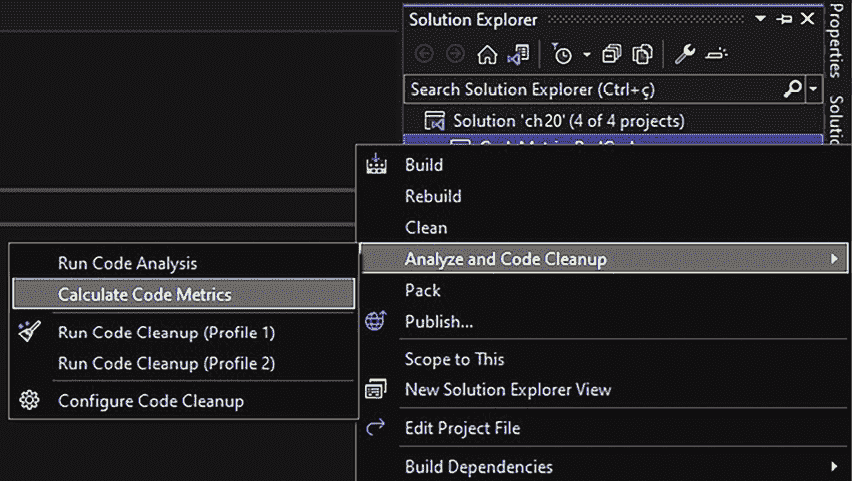

图 4.1：在 Visual Studio 中计算代码度量

**代码度量**工具将提供度量指标，这些指标将为你提供关于你交付的软件质量的洞察。该工具提供的度量指标可以在以下链接中找到：[`docs.microsoft.com/en-us/visualstudio/code-quality/code-metrics-values`](https://docs.microsoft.com/en-us/visualstudio/code-quality/code-metrics-values)。

一旦你运行了代码度量分析，你将需要解释每个展示的度量指标。以下小节将重点描述**可维护性指数**、**圈复杂度**、**继承深度**、**类耦合度**和**代码行数**在现实生活中的某些场景中是如何有用的。

## 可维护性指数

可维护性指数表示一个从 0 到 100 的数字，它表示维护代码的难易程度——代码越容易维护，指数越高。易于维护是保持软件健康的关键点之一。显然，任何软件在未来都需要更改，因为变化是不可避免的。

因此，如果你当前的代码可维护性指数较低，考虑重构代码以提高可维护性指数。编写专门负责单一职责的类和方法、避免重复代码以及限制每个方法的代码行数都是提高可维护性指数的例子。

## 圈复杂度

圈复杂度度量的创造者是托马斯·J·麦卡贝。他根据可用的**代码路径数**（**图节点**）来定义软件函数的复杂度。路径越多，函数越复杂。麦卡贝认为每个函数的复杂度得分必须小于 10。这意味着如果代码有更复杂的方法，你必须重构它，将代码的部分转换为单独的方法。有一些实际场景中这种行为的检测很容易：

+   循环嵌套

+   大量的连续`if-else`语句

+   在同一方法内部对每个情况执行代码处理的`switch`语句

例如，看看这个方法的第一版，用于处理信用卡交易的不同响应。正如你所看到的，圈复杂度大于麦卡贝作为基础的数字。这种情况发生的原因是主开关的每个情况中都有大量的`if-else`语句：

```cs
/// <summary>
/// This code is being used just for explaining the concept of
/// cyclomatic complexity.
/// It makes no sense at all. Please Calculate Code Metrics for
/// understanding
/// </summary>
private static void CyclomaticComplexitySample()
{
  var billingMode = GetBillingMode();
  var messageResponse = ProcessCreditCardMethod();
  switch (messageResponse)
    {
      case "A":
        if (billingMode == "M1")
          Console.WriteLine($"Billing Mode {billingMode} for " +
            $"Message Response {messageResponse}");
        else
          Console.WriteLine($"Billing Mode {billingMode} for " +
            $"Message Response {messageResponse}");
        break;
      case "B":
        if (billingMode == "M2")
          Console.WriteLine($"Billing Mode {billingMode} for " +
            $"Message Response {messageResponse}");
        else
          Console.WriteLine($"Billing Mode {billingMode} for " +
            $"Message Response {messageResponse}");
        break;
      case "C":
        if (billingMode == "M3")
          Console.WriteLine($"Billing Mode {billingMode} for " +
            $"Message Response {messageResponse}");
        else
          Console.WriteLine($"Billing Mode {billingMode} for " +
            $"Message Response {messageResponse}");
        break;
      case "D":
        if (billingMode == "M4")
          Console.WriteLine($"Billing Mode {billingMode} for " +
            $"Message Response {messageResponse}");
        else
          Console.WriteLine($"Billing Mode {billingMode} for " +
            $"Message Response {messageResponse}");
        break;
      case "E":
        if (billingMode == "M5")
          Console.WriteLine($"Billing Mode {billingMode} for " +
            $"Message Response {messageResponse}");
        else
          Console.WriteLine($"Billing Mode {billingMode} for " +
            $"Message Response {messageResponse}");
        break;
      case "F":
        if (billingMode == "M6")
          Console.WriteLine($"Billing Mode {billingMode} for " +
            $"Message Response {messageResponse}");
        else
          Console.WriteLine($"Billing Mode {billingMode} for " +
            $"Message Response {messageResponse}");
        break;
      case "G":
        if (billingMode == "M7")
          Console.WriteLine($"Billing Mode {billingMode} for " +
            $"Message Response {messageResponse}");
        else
          Console.WriteLine($"Billing Mode {billingMode} for " +
            $"Message Response {messageResponse}");
        break;
      case "H":
        if (billingMode == "M8")
          Console.WriteLine($"Billing Mode {billingMode} for " +
            $"Message Response {messageResponse}");
        else
          Console.WriteLine($"Billing Mode {billingMode} for " +
            $"Message Response {messageResponse}");
        break;
      default:
        Console.WriteLine("The result of processing is unknown");
        break;
    }
} 
```

如果你计算这段代码的代码度量，你将发现圈复杂度方面会有一个不良的结果，如以下截图所示。圈复杂度数值超过 10 表明代码难以阅读，开发者可能在未来代码更改中难以维护它。

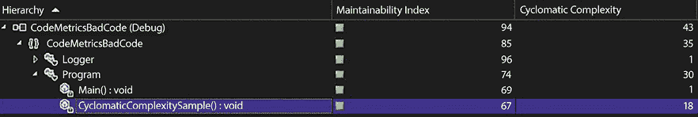

图 4.2：高圈复杂度

需要强调的是，本例中代码的目的并不是重点。这里的关键是要展示可以如何改进代码以编写更好的代码：

+   `switch-case` 中的选项可以用 `Enum` 来编写。

+   每个 `case` 处理可以完成：

    +   在一个特定的方法中。

    +   在一个特定的类中，从超类继承操作，使用多态概念。

    +   在一个特定的类中，实现一个接口来定义一个合同。

+   `switch-case` 可以用 `Dictionary<Enum, Method>` 替换，或者使用 `switch` 表达式。

通过使用前面提到的技术重构此代码，结果是代码更容易理解，如以下主方法代码片段所示：

```cs
static void Main()
{
    var billingMode = GetBillingMode();
    var messageResponse = ProcessCreditCardMethod();
    Dictionary<CreditCardProcessingResult, CheckResultMethod>
        methodsForCheckingResult = GetMethodsForCheckingResult();
    if (methodsForCheckingResult.ContainsKey(messageResponse))
        methodsForCheckingResultmessageResponse;
    else
        Console.WriteLine("The result of processing is unknown");
} 
```

自从 C# 8.0 以来，可以使用 `switch` 表达式使代码更加简洁！

```cs
static void Main()
{
    var billingMode = GetBillingMode();
    var messageResponse = ProcessCreditCardMethod();
    CheckResult(messageResponse, billingMode);
}
private static CreditCardProcessingResult CheckResult(CreditCardProcessingResult messageResponse, BillingMode billingMode) => messageResponse switch
{
    CreditCardProcessingResult.ResultA => CheckResultA(billingMode, messageResponse),
    CreditCardProcessingResult.ResultB => CheckResultB(billingMode, messageResponse),
    CreditCardProcessingResult.ResultC => CheckResultC(billingMode, messageResponse),
    CreditCardProcessingResult.ResultD => CheckResultD(billingMode, messageResponse),
    CreditCardProcessingResult.ResultE => CheckResultE(billingMode, messageResponse),
    CreditCardProcessingResult.ResultF => CheckResultF(billingMode, messageResponse),
    CreditCardProcessingResult.ResultG => CheckResultG(billingMode, messageResponse),
    CreditCardProcessingResult.Succeed => CheckResultSucceed(billingMode, messageResponse),
    _ => throw new ArgumentOutOfRangeException(nameof(messageResponse), $"Not expected value: {messageResponse}"),
}; 
```

完整的代码可以在本章的 GitHub 仓库中找到，网址为 [`github.com/PacktPublishing/Software-Architecture-with-C-Sharp-12-and-.NET-8-4E`](https://github.com/PacktPublishing/Software-Architecture-with-C-Sharp-12-and-.NET-8-4E)/tree/main/ch04，展示了如何实现低复杂度代码。以下截图显示了根据代码指标的结果：

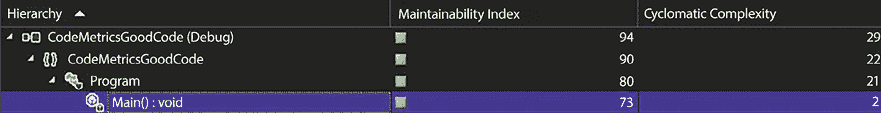

图 4.3：重构后的循环复杂度降低

如前一个截图所示，重构后复杂性有相当大的降低。在 *第五章*，*在 C# 12 中实现代码重用*，我们将讨论重构对于代码重用的重要性。我们在这里这样做的原因是相同的——我们想要消除重复。重要的是要记住，当你重构代码时，你正在以更好的方式编写代码，同时尊重此代码将处理输入和输出数据。

这里关键点是，通过应用的技术，我们对代码的理解增加了，复杂度指数降低了，从而证明了循环复杂度的重要性。

## 继承深度

这个指标表示正在分析的那个类继承的类数量。继承的类越多，这个指标就越差。这就像类耦合，表明在不影响其他类的情况下更改这个类的代码有多困难，这忽略了 SOLID 原则中提出的开放/关闭原则。例如，以下截图显示了四个继承的类：

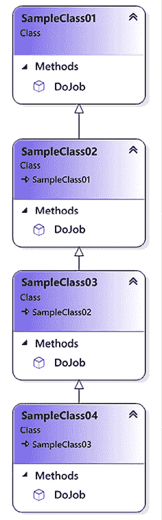

图 4.4：继承深度示例

你可以在以下截图看到，最深的类在考虑有三个其他类可以改变其行为的情况下，具有最差的指标：

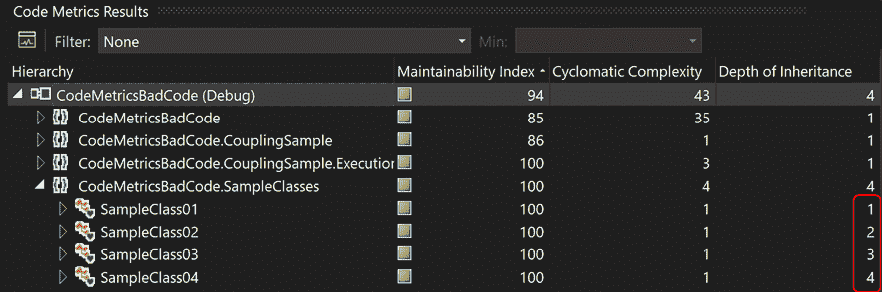

图 4.5：继承深度指标

继承是基本面向对象分析原则之一。然而，有时它可能会对你的代码造成不利影响，因为它可能会引起依赖。所以，如果这样做有意义，考虑使用组合或聚合而不是继承，正如我们将在下一节中解释的那样。

## 类耦合

当你在单个类中连接太多的类时，显然你会得到紧密耦合，改变一个参与者会导致其他参与者产生意外的后果。当然，这可能会造成你代码的糟糕维护，导致需要花费更多时间来尝试交付一个优秀的解决方案。例如，参考*图 4.6*。它显示了一个进行了大量聚合的设计。代码本身没有意义：

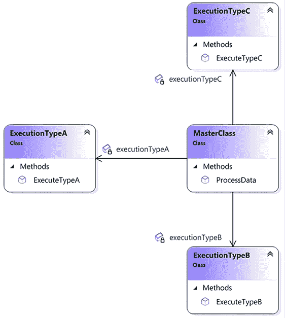

图 4.6：类耦合示例

一旦你计算了前一个设计的代码度量，你会发现调用`ExecuteTypeA()`、`ExecuteTypeB()`和`ExecuteTypeC()`的`ProcessData()`方法的类耦合实例数等于三个：

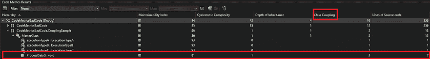

图 4.7：类耦合度量

微软建议类耦合实例的最大数量应该是九个，如[`learn.microsoft.com/en-us/visualstudio/code-quality/code-metrics-class-coupling?view=vs-2022`](https://learn.microsoft.com/en-us/visualstudio/code-quality/code-metrics-class-coupling?view=vs-2022)所示。

由于组合/聚合比继承是一种更好的实践，并且你将解耦从你的类编写的代码，使用接口将解决类耦合问题。例如，以下设计中的相同代码将给出更好的结果。尽管在这个例子中接口不是严格必需的，但其使用使我们能够为其他**执行类型**的解决方案进行演化，而不会影响已经编写的类，因为你没有使用继承来解决问题。

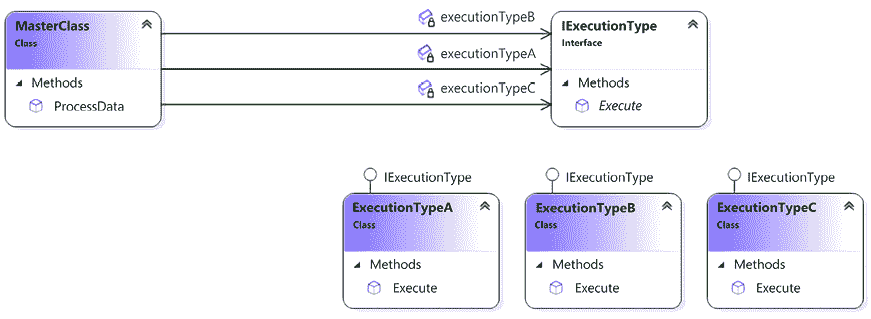

图 4.8：减少类耦合

注意，在设计中使用接口将允许你在不增加解决方案的类耦合的情况下增加执行类型：

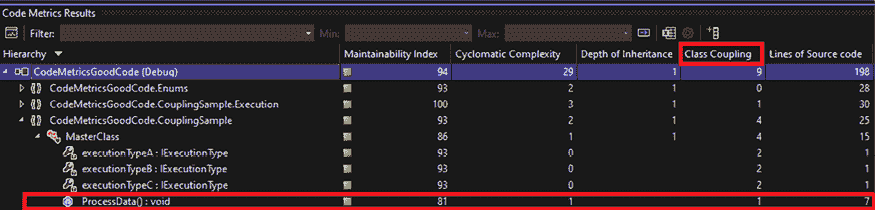

图 4.9：应用聚合后的类耦合结果

作为一名软件架构师，你必须设计你的解决方案，使其具有比耦合更高的内聚性。文献指出，好的软件具有低耦合和高内聚。在软件开发中，高内聚表示每个类都有其方法和数据，并且它们之间有良好的关系。相反，低耦合表示类之间没有紧密和直接的连接。这是一个基本原理，可以指导你到一个更好的架构模型。

## 代码行数

这个指标有助于你理解你正在处理的代码的大小。由于行数并不能直接反映复杂性，因此无法将代码行数与复杂性联系起来。相反，代码行数确实可以显示软件的大小和软件设计。例如，如果一个类中有太多的代码行（超过 1,000 行代码 – 1 KLOC），这表明它是一个糟糕的设计。此外，如果一个类有太多的方法，这显然违反了 SOLID 设计原则中的单一职责原则。

在 Visual Studio 2022 中，这个指标被分为**源代码行数**和**可执行代码行数**。前者表示确切的总源代码行数，包括空白行。相反，后者估计的是可执行代码的行数。

作为一名软件架构师，你的目标是向程序员提供一系列最佳实践，使他们能够提高开发优质软件的技术。确保他们了解在代码中未能实现良好指标结果的直接影响。上述指标无疑是实现这一目标的良好开端。但让我们看看使用版本控制系统如何能区分业余和专业的软件开发。

# 使用版本控制系统

你可能会觉得这个话题有点明显，但许多人和企业仍然不认为版本控制系统是软件开发的一个基本工具。版本控制系统不被视为优先事项的常见原因，尤其是在某些情况下，是认为它们对于单独编码项目或学习目的来说是不必要的。你可能认为版本控制系统仅适用于公司内部的团队。提出这个问题的目的是让你理解我们的观点。如果你不使用**版本控制系统**，就没有任何架构模型或最佳实践能够拯救软件开发。

在过去几年里，我们一直在享受在线版本控制系统带来的优势，例如 Azure DevOps、GitHub 和 Bitbucket。事实上，在你的软件开发生命周期中必须有一个版本控制系统，而且没有理由不再使用它，因为大多数提供商为小型团队提供免费版本。即使你独自开发，这些工具也有助于跟踪你的更改、管理你的软件版本，并保证代码的一致性和完整性。

## 团队中处理版本控制系统

当你独自一人使用版本控制系统工具的原因很明显。你希望确保你的代码安全。然而，这种系统是为了解决编写代码时的团队问题而开发的。因此，引入了一些功能，如分支和合并，以保持代码完整性，即使在开发者数量相当大的情况下也是如此。

作为一名软件架构师，你将不得不决定在你的团队中实施哪种分支策略。微软和 GitHub 建议了不同的方法来实现这一点，并且两者在某些场景中都很有用。

关于微软团队如何处理 DevOps 的信息可以在这里找到：[`learn.microsoft.com/en-us/devops/develop/how-microsoft-develops-devops`](https://learn.microsoft.com/en-us/devops/develop/how-microsoft-develops-devops)。本文中提出的分支策略描述了一种为每个发布创建分支的方法。他们将这称为 **发布流程**。这里的主要区别是主分支不会持续部署到生产环境。

相反，GitHub 在其[`guides.github.com/introduction/flow/`](https://guides.github.com/introduction/flow/)中描述了其流程。这个过程被称为 **GitHub flow**，可以被定义为一个轻量级的、基于分支的工作流程，其中每个开发都在一个特定的分支中进行，一旦创建了拉取请求以供反馈，协作者就会对其进行审查。一旦拉取请求被批准，新代码就会被合并到主分支，这样你就可以删除之前创建的开发分支。

这取决于你的选择；选择最适合你需求的一个，但我们确实希望你明白你需要有一个控制你代码的策略。在 *第八章*，*理解 DevOps 原则和 CI/CD* 中，我们将更详细地讨论这一点。但现在，让我们看看如何使用 C#编写安全代码，以便你可以制定一份最佳实践清单与你的开发者分享。

# 在 C#中编写安全代码

从设计上讲，C# 可以被认为是一种安全的编程语言。除非你强制使用，否则不需要指针，并且大多数情况下，内存释放由垃圾回收器管理。即便如此，也应该注意一些事项，以便你能从代码中获得更好的、更安全的成果。让我们看看一些常见的做法，以确保在 C#中编写安全代码。

## try-catch

编程中的异常如此频繁，你应该有一种方法来管理它们，无论何时发生。`try-catch` 语句被构建来管理异常，这对于保持代码安全非常重要。当它们发生时，要小心，因为它们可能会引起性能问题，正如我们在 *第二章*，*非功能性需求* 中讨论的那样。

有很多情况下应用程序崩溃，而其原因是没有使用 `try-catch`。以下代码展示了缺少 `try-catch` 语句使用的一个例子。值得注意的是，这只是一个理解未正确处理的异常抛出概念的一个例子。考虑使用 `int.TryParse(textToConvert, out int result)` 来处理解析失败的情况：

```cs
private static int CodeWithNoTryCatch(string textToConvert)
{
    return Convert.ToInt32(textToConvert);
} 
```

相反，错误的 `try-catch` 使用也可能对你的代码造成损害，尤其是因为你将看不到该代码的正确行为，并可能误解提供的结果。

以下代码展示了空`try-catch`语句的例子：

```cs
private static int CodeWithEmptyTryCatch(string textToConvert)
{
    try
    {
        return Convert.ToInt32(textToConvert);
    }
    catch
    {
        return default;
    }
} 
```

`try-catch`语句必须与日志解决方案连接，以便你可以从系统中获得响应，指示正确的行为，同时不会导致应用程序崩溃。以下代码展示了带有日志管理的理想`try-catch`语句。值得注意的是，在可能的情况下，应该捕获特定的异常，因为捕获通用异常会隐藏意外的异常：

```cs
private static int CodeWithCorrectTryCatch(string textToConvert)
{
    try
    {
        return Convert.ToInt32(textToConvert);
    }
    catch (FormatException err)
    {
        Logger.GenerateLog(err);
        return 0;
    }
} 
```

非常重要的是要注意，从计算的角度来看，异常是昂贵的。无论你是抛出它们来指示错误还是捕获它们来管理错误，都需要大量的计算处理。因此，依赖高级异常处理器而不是试图在各个地方处理所有事情是常见且更可取的，因为代码可能难以推理，尤其是在不知道在代码的这一部分如何处理异常的情况下，你可能会再次将其抛给更高层次的处理器。你应该优先处理可以在其中采取有意义操作的异常。

然而，也值得提到的是，传递给最终用户的异常错误可能会造成软件质量差的印象。作为一名软件架构师，你应该进行代码审查，以定义代码的最佳行为。系统中的不稳定性，如意外的崩溃和高内存使用，通常与代码中缺少`try-catch`语句有关。

## try-finally 和 using

*内存泄漏*可以被认为是软件行为中最糟糕的一种。它们会导致不稳定、计算机资源使用不当和应用程序崩溃。C#通过**垃圾回收器**来尝试解决这个问题，垃圾回收器会在意识到对象可以被释放时自动从内存中释放对象。垃圾回收器的触发机制在[`learn.microsoft.com/en-us/dotnet/standard/garbage-collection/fundamentals`](https://learn.microsoft.com/en-us/dotnet/standard/garbage-collection/fundamentals)中有详细解释。

与 I/O 交互的对象通常不是由垃圾回收器管理的：文件系统、套接字等。以下代码是`FileStream`对象使用不当的例子，因为它认为垃圾回收器会释放使用的内存，但实际上不会：

```cs
private static void CodeWithIncorrectFileStreamManagement()
{
    FileStream file = new ("C:\\file.txt", FileMode.CreateNew);
    byte[] data = GetFileData();
    file.Write(data, 0, data.Length);
} 
```

此外，垃圾回收器与需要释放的对象交互需要一段时间，有时你可能想自己来做这件事。在这两种情况下，使用`try-finally`或`using`语句是最佳实践：

```cs
private static void CorrectFileStreamManagementFirstOption()
{
    FileStream file = new ("C:\\file.txt",FileMode.CreateNew);
    try
    {
        byte[] data = GetFileData();
        file.Write(data, 0, data.Length);
    }
    finally
    {
        file.Dispose();
    }
}
private static void CorrectFileStreamManagementSecondOption()
{
    using (FileStream file = new ("C:\\file.txt", FileMode.CreateNew))
    {
        byte[] data = GetFileData();
        file.Write(data, 0, data.Length);
    }
}
private static void CorrectFileStreamManagementThirdOption()
{
    using FileStream file = new ("C:\\file.txt", FileMode.CreateNew);
    byte[] data = GetFileData();
    file.Write(data, 0, data.Length);
} 
```

上述代码展示了如何处理垃圾回收器未管理的对象。`try-finally` 和 `using` 都已实现。作为一名软件架构师，你需要注意这类代码。缺少 `try-finally` 或 `using` 语句可能会在运行时对软件行为造成巨大损害。值得一提的是，使用代码分析工具，如 **Sonar Lint** 和 **代码分析**，将自动提醒你这些问题。

## IDisposable 接口

就像如果你不使用 `try-finally`/`using` 语句来管理方法内部创建的对象，你将遇到麻烦一样，在未正确实现 `IDisposable` 接口的情况下创建的对象可能会导致你的应用程序出现内存泄漏。因此，当你有一个处理和创建对象的类时，你应该实现 `Disposable` 模式来保证释放由该类创建的所有资源：

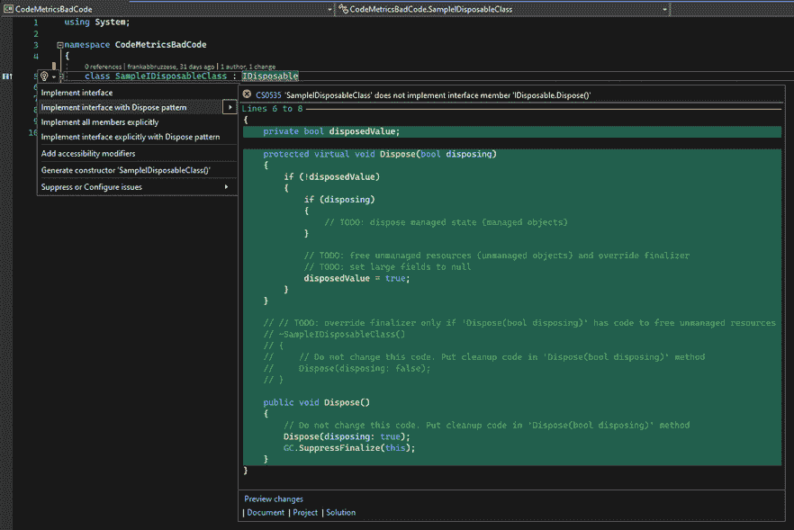

图 4.10：IDisposable 接口实现

```cs
your code, and then you right-click on the Quick Actions and Refactoring options, as you can see in the preceding screenshot.
```

一旦你插入了代码，你需要遵循待办指令，以确保正确实现了模式。

作为一名软件架构师，你不仅需要对系统中定义的架构负责，还要对系统的运行性能负责。内存泄漏和性能不佳通常是由与 `try-catch` 策略相关的错误、缺乏 `try-finally/using` 以及 `IDisposable` 的错误或未实现引起的。所以请确保你的团队知道如何处理这些技术。

既然我们已经介绍了一些关于如何在 C# 中编写安全代码的重要信息，那么获取一些关于这种编程语言的编程技巧和窍门将是非常有用的。让我们在本章的下一个主题中这样做。

# .NET 8 编程技巧与窍门

.NET 8 实现了一些有助于我们编写更好代码的良好功能。其中最有用的一个就是**依赖注入**（**DI**），它将在第六章，**设计模式和 .NET 8 实现**中讨论。考虑这一点有几个很好的理由。第一个是，如果你是注入对象的创建者，你只需担心注入对象的释放。

此外，DI 使你能够注入 `ILogger`，这是一个用于调试需要由 `try-catch` 语句管理的异常的有用工具。此外，使用 .NET 8 在 C# 中编程必须遵循任何编程语言的通用良好实践。以下列表显示了其中的一些：

+   **类、方法和变量应该有可理解的名字**：名字应该解释读者需要知道的一切。除非这些声明是公开的，否则不应需要解释性注释。

+   **方法不应具有高复杂度级别**：应检查循环复杂度，以确保方法中代码行数不要过多。

+   **成员必须具有正确的可见性**：作为面向对象编程语言，C#通过不同的可见性关键字支持封装。C# 9 引入了*只读设置器*，因此您可以使用`init`属性/索引访问器而不是`set`，在对象构造后定义这些成员为只读。

+   **应避免重复代码**：在像 C#这样的高级编程语言中，没有必要存在重复代码。

+   **在使用对象之前应检查对象**：由于可能存在 null 对象，代码必须进行 null 类型检查。值得一提的是，自从 C# 8 以来，我们有了可空引用类型来避免与可空对象相关的错误。您可以参考[`docs.microsoft.com/en-us/dotnet/csharp/nullable-references`](https://docs.microsoft.com/en-us/dotnet/csharp/nullable-references)了解更多关于可空引用类型的信息。

+   **应使用常量和枚举器**：避免在代码中使用魔法数字和文本的好方法是将此信息转换为常量和枚举器，这些通常更容易理解。

+   **应避免使用不安全代码**：不安全代码使您能够在 C#中处理指针。除非没有其他方法来实现解决方案，否则应避免使用不安全代码。

+   **try-catch 语句不能为空**：在没有处理`catch`区域的`try-catch`语句中很少有使用理由。此外，捕获的异常应尽可能具体，而不仅仅是“异常”，以避免吞咽意外的异常。

+   **如果创建了可释放的对象，则应释放它们**：即使垃圾回收器会处理已释放的对象，也应考虑释放自己负责创建的对象。

+   **至少公共方法应该有注释**：考虑到公共方法是用于您库外部的，它们必须解释其正确的外部使用。

+   **switch-case 语句必须具有默认处理**：由于`switch-case`语句可能接收到某些情况下未知的人口变量，默认处理将保证在这种情况下代码不会中断。

作为软件架构师，您可能考虑为您的开发人员提供一个代码模式，该模式将用于保持团队代码风格的一致性。您还可以将此代码模式用作编码检查的清单，这将丰富软件代码质量。

# 识别编写良好的代码

识别代码是否编写得很好并不容易。到目前为止所描述的最佳实践当然可以指导你作为一个软件架构师为你的团队定义一个标准。然而，即使有了标准，错误仍然会发生，你可能会在生产代码中才发现它们。仅仅因为代码没有遵循你定义的所有标准就决定在生产中重构代码，这是一个不容易做出的决定，尤其是如果相关的代码运行正常的话。有些人认为，编写得好的代码就是那些在生产中运行良好的代码。然而，这肯定会对软件的生命周期造成损害，因为开发者可能会受到那些非标准代码的影响。

因此，作为一个软件架构师，你需要找到方法来强制执行你定义的编码标准的遵守。幸运的是，如今，我们有许多工具可以帮助我们完成这项任务。它们被称为静态代码分析工具，使用它们提供了改进开发和团队编程知识的大好机会。

开发者会随着代码分析而发展，原因是在代码审查过程中，你开始在他们之间传播知识。我们现在拥有的工具具有相同的目的。更好的是，使用 Roslyn，它们在编写代码的同时完成这项任务。Roslyn 是.NET 的编译器平台，它使你能够开发一些用于分析代码的工具。这些分析器可以检查风格、质量、设计和其他问题。

例如，看看下面的代码。它没有任何意义，但你仍然可以看到其中有一些错误：

```cs
using System;
static void Main(string[] args)
{
    try
    {
        int variableUnused = 10;
        int variable = 10;
        if (variable == 10)
        {
             Console.WriteLine("variable equals 10");
        }
        else
        {
            switch (variable)
            {
                case 0:
                    Console.WriteLine("variable equals 0");
                    break;
            }
        }
    }
    catch
    {
    }
} 
```

这段代码的目的是向您展示一些工具的强大功能，这些工具可以帮助您改进交付的代码。让我们在下一节中逐一研究它们，包括如何设置它们。

## 理解和应用可以评估 C#代码的工具

Visual Studio 中代码分析的发展是持续的。这意味着 Visual Studio 2022 肯定比 Visual Studio 2019 有更多用于此目的的工具，依此类推。

你（作为一个软件架构师）需要处理的一个问题是团队的*编码风格*。这当然有助于更好地理解代码。例如，如果你去**Visual Studio 菜单**，然后**工具 -> 选项**，接着在左侧菜单中**文本编辑 -> C#**，你会找到处理不同代码风格模式的方法，而且不良的编码风格甚至在**代码风格**选项中被标记为错误，如下所示：

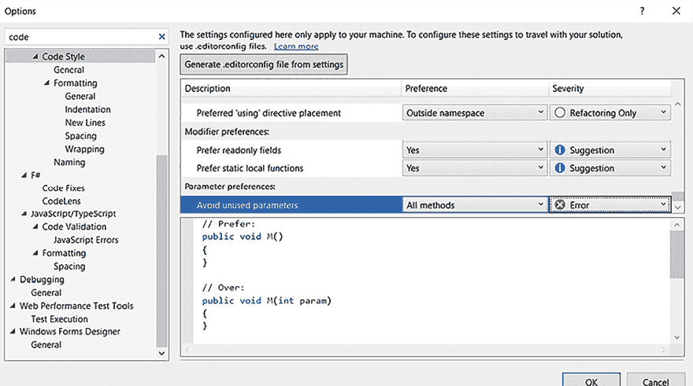

图 4.11：代码风格选项

上一张截图中的更改**避免未使用参数**被认为是一个错误。

在这次更改之后，本章开头展示的代码的编译结果不同，如下面的截图所示：

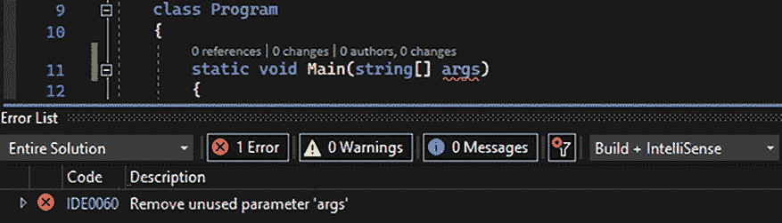

图 4.12：代码风格结果

您可以将您的编码风格配置导出并附加到您的项目上，这样它就会遵循您定义的规则。

Visual Studio 2022 提供的另一个好工具是**分析和代码清理**。使用此工具，您可以设置一些代码标准来清理您的代码。例如，在下面的屏幕截图中，它被设置为删除不必要的代码：

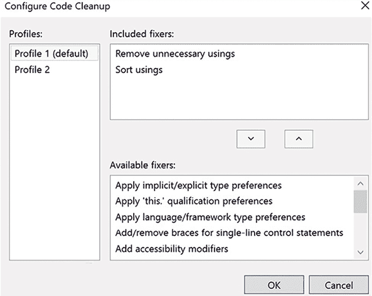

图 4.13：配置代码清理

运行代码清理的方式是通过在**解决方案资源管理器**区域中，在您想要运行它的项目上右键单击来选择它。之后，此过程将在您所有的代码文件中运行：

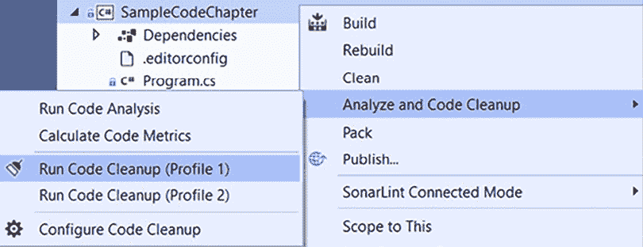

图 4.14：运行代码清理

在解决**代码风格**和**代码清理**工具指示的错误之后，我们正在处理的示例代码进行了一些最小化简化，如下所示：

```cs
using System;
try
{
    int variable = 10;
    if (variable == 10)
    {
        Console.WriteLine("variable equals 10");
    }
    else
    {
        switch (variable)
        {
            case 0:
                Console.WriteLine("variable equals 0");
                break;
        }
    }
}
catch
{
} 
```

值得注意的是，前面的代码还有许多需要解决的改进。Visual Studio 通过安装扩展到 IDE 中，使您能够为 IDE 添加额外的工具。这些工具可以帮助您提高代码质量，因为其中一些工具是为了执行代码分析而构建的。本节将列出一些免费选项，以便您可以选择最适合您需求的选项。当然，还有其他选项，甚至付费选项。这里的想法不是指出一个特定的工具，而是给您一个它们能力的概念。

要安装这些扩展，您需要在 Visual Studio 2022 中找到**扩展**菜单。以下是**管理扩展**选项的屏幕截图：

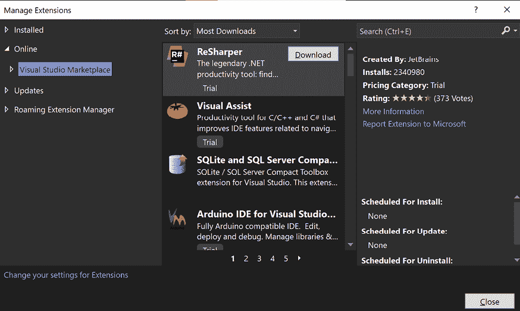

图 4.15：Visual Studio 2022 中的扩展

有许多其他优秀的扩展可以提升您代码和解决方案的生产力和质量。您可以在本管理器中搜索它们。

在您选择了将要安装的扩展之后，您需要重新启动 Visual Studio。大多数扩展在安装后都很容易识别，因为它们会修改 IDE 的行为。然而，它们需要在每个开发环境中进行设置。为了解决这个问题，Visual Studio 引入了将分析器作为 NuGet 包包含的选项，这样所有与项目合作的开发者都将对他们的代码进行分析。

## 将扩展工具应用于分析代码

尽管经过代码风格和代码清理工具处理后的示例代码比章节开头我们展示的代码要好，但它显然与迄今为止讨论的最佳实践相去甚远。

因此，Microsoft 将分析器分为三个组：

+   如前所述的代码风格

+   已包含在.NET 5+项目中的代码质量分析器

+   可以作为 NuGet 包或 Visual Studio 扩展安装的第三方分析器

您可以在 [`docs.microsoft.com/en-us/visualstudio/code-quality/roslyn-analyzers-overview`](https://docs.microsoft.com/en-us/visualstudio/code-quality/roslyn-analyzers-overview) 找到源代码分析概述。

让我们研究一下这些第三方分析器如何有用，以 **SonarAnalyzer** 包作为参考。

## 应用 SonarAnalyzer

SonarAnalyzer 是 Sonar Source 社区发起的一个开源项目，旨在在编码时检测错误和质量问题。它支持 C#、VB.NET、C、C++ 和 JavaScript。他们还提供了一个名为 **SonarLint** 的扩展。这个扩展的伟大之处在于它提供了解决检测到的问题的解释，这就是为什么我们认为开发者在使用这些工具时可以学会如何编写良好的代码。

此扩展可以指出错误，而且更好的是，每个警告都有解释。这对于发现问题以及培训开发者良好的编码实践都很有用。

在 Visual Studio 2022 中，SonarLint 扩展可用。除此之外，您还可以使用 NuGet 包，如下面的截图所示：

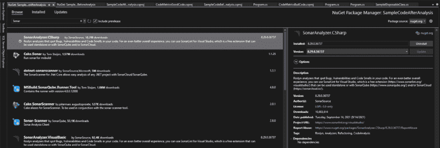

图 4.16：SonarAnalyzer.CSharp NuGet 包

产生的结果与使用 SonarLint 扩展得到的结果相同，但这个选项的好处是，任何需要为这个项目编码的开发者都会得到他们的代码分析。

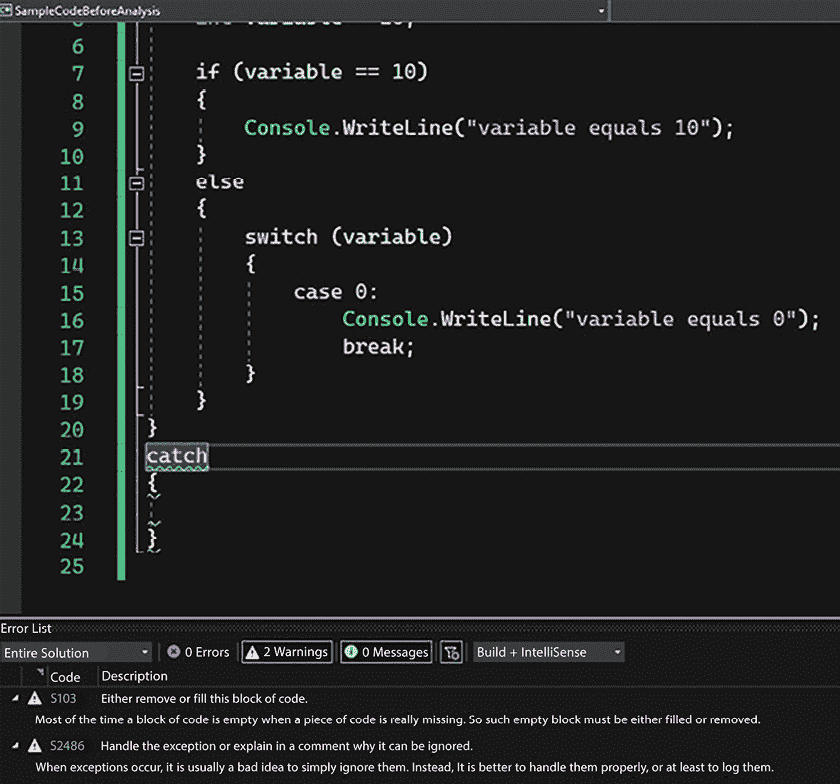

图 4.17：SonarAnalyzer.CSharp 分析结果

作为软件架构师，您将始终需要关注并采取行动，以确保项目使用相同的代码标准统一，因此 NuGet 选项可能有助于实现这一目标。

## 分析后的最终代码检查

在分析了两种选项之后，我们最终解决了原始代码中的所有问题。以下是最终代码：

```cs
using System;
try
{
    int variable = 10;
    if (variable == 10)
    {
        Console.WriteLine("variable equals 10");
    }
    else
    {
        switch (variable)
        {
            case 0:
                Console.WriteLine("variable equals 0");
                break;
            default:
                Console.WriteLine("Unknown behavior");
                break;
        }
    }
}
catch (Exception err)
{
    Console.WriteLine(err);
} 
```

如您所见，前面的代码不仅更容易理解，而且更安全，能够考虑不同的编程路径，因为已经为 `switch-case` 编程了默认值。这个模式在本章中已经讨论过，这让我们得出一个愉快的结论，即最佳实践可以通过使用本章讨论的（或所有）选项之一（或全部）来轻松遵循。

# 摘要

在本章中，我们讨论了一些编写安全代码的重要提示。本章介绍了一个分析代码指标的工具，以便您可以管理您开发的软件的复杂性和可维护性。最后，我们提出了一些保证您的软件不会因内存泄漏和异常而崩溃的好建议。在现实生活中，软件架构师总会被要求解决这类问题。

本章还推荐了一些可以用来应用我们讨论的编码最佳实践的工具体。我们探讨了 Roslyn 编译器，它允许在开发者编码时进行代码分析。

你将在第二十一章“案例研究”中找到一个在发布应用程序之前评估 C# 代码的方法，该方法在 Azure DevOps 构建过程中使用 SonarCloud 进行代码分析。

当你将本章所学的内容应用到你的项目中时，你会发现代码分析将为你提供改进交付给客户代码质量的机会。这是你作为软件架构师角色中非常重要的一个部分。

在下一章中，你将学习关于代码重用的知识，这是一种保证项目质量和速度的惊人技术！

# 问题

1.  为什么我们需要关注可维护性？

1.  什么是循环复杂度？

1.  列出使用版本控制系统的优势。

1.  什么是垃圾回收器？

1.  实现 IDisposable 接口的重要性是什么？

1.  使用 .NET 8 我们在编码方面获得了哪些优势？

1.  什么使得一段软件代码可以被描述为编写得很好？

1.  什么是 Roslyn？

1.  什么是代码分析？

1.  代码分析的重要性是什么？

1.  Roslyn 如何帮助进行代码分析？

1.  什么是 Visual Studio 扩展？

1.  可用于代码分析的可扩展工具有哪些？

# 进一步阅读

这些是一些书籍和网站，你可以在那里找到更多关于本章主题的信息：

+   *《代码整洁之道》：*敏捷软件开发工艺手册*，马丁，罗伯特·C·皮尔森教育，2012 年。

+   *《嵌入式系统设计艺术》，杰克·G·甘斯勒著。Elsevier，1999 年。

+   *《重构》，马丁·福勒著。Addison-Wesley，2018 年。

+   *《复杂性度量》，托马斯·J·麦卡贝著。IEEE 软件工程杂志，第 2 卷第 4 期，1976 年，第 308-320 页 ([`dblp.uni-trier.de/db/journals/tse/tse2.html`](https://dblp.uni-trier.de/db/journals/tse/tse2.html))。

+   代码度量信息：

    +   [`blogs.msdn.microsoft.com/zainnab/2011/05/25/code-metrics-class-coupling/`](https://blogs.msdn.microsoft.com/zainnab/2011/05/25/code-metrics-class-coupling/)

    +   [`docs.microsoft.com/en-us/visualstudio/code-quality/code-metrics-values?view=vs-2019`](https://docs.microsoft.com/en-us/visualstudio/code-quality/code-metrics-values?view=vs-2019)

+   版本控制系统：

    +   [`github.com/`](https://github.com/)

    +   [`bitbucket.org/`](https://bitbucket.org/)

    +   [`azure.microsoft.com/en-us/services/devops/`](https://azure.microsoft.com/en-us/services/devops/)

+   代码分支技术：

    +   [`guides.github.com/introduction/flow/`](https://guides.github.com/introduction/flow/)

+   日志基础：

    +   [`docs.microsoft.com/aspnet/core/fundamentals/logging/`](https://docs.microsoft.com/aspnet/core/fundamentals/logging/)

+   CSharp 有什么新内容？

    +   [`docs.microsoft.com/en-us/dotnet/csharp/whats-new/csharp-9`](https://docs.microsoft.com/en-us/dotnet/csharp/whats-new/csharp-9)

    +   [`docs.microsoft.com/en-us/dotnet/csharp/whats-new/csharp-10`](https://docs.microsoft.com/en-us/dotnet/csharp/whats-new/csharp-10)

    +   [`learn.microsoft.com/en-us/dotnet/csharp/whats-new/csharp-11`](https://learn.microsoft.com/en-us/dotnet/csharp/whats-new/csharp-11)

    +   [`learn.microsoft.com/en-us/dotnet/csharp/whats-new/csharp-12`](https://learn.microsoft.com/en-us/dotnet/csharp/whats-new/csharp-12)

+   源代码分析器：

    +   [`marketplace.visualstudio.com/items?itemName=SonarSource.SonarLintforVisualStudio2019`](https://marketplace.visualstudio.com/items?itemName=SonarSource.SonarLintforVisualStudio2019)

    +   [`marketplace.visualstudio.com/items?itemName=SonarSource.SonarLintforVisualStudio2022`](https://marketplace.visualstudio.com/items?itemName=SonarSource.SonarLintforVisualStudio2022)

    +   [`github.com/dotnet/roslyn-analyzers`](https://github.com/dotnet/roslyn-analyzers)

    +   [`docs.microsoft.com/en-us/visualstudio/ide/code-styles-and-code-cleanup`](https://docs.microsoft.com/en-us/visualstudio/ide/code-styles-and-code-cleanup)

    +   [`docs.sonarcloud.io/`](https://docs.sonarcloud.io/)

    +   [`www.guidgenerator.com/`](https://www.guidgenerator.com/ )

# 在 Discord 上了解更多信息

要加入这本书的 Discord 社区——在那里您可以分享反馈、向作者提问，并了解新版本——请扫描下面的二维码：

[`packt.link/SoftwareArchitectureCSharp12Dotnet8`](https://packt.link/SoftwareArchitectureCSharp12Dotnet8)


