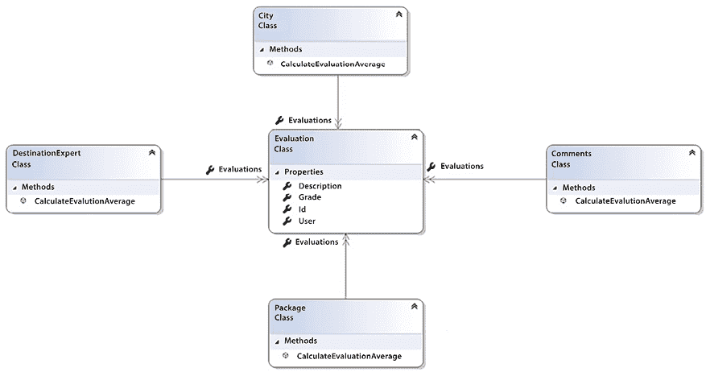
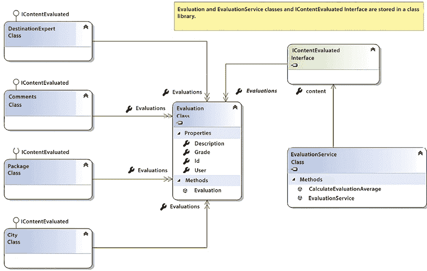
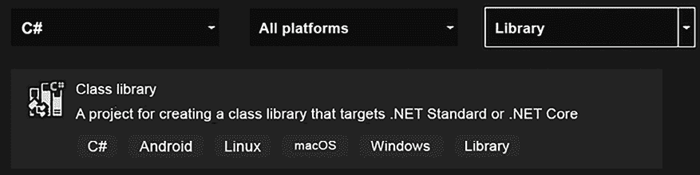
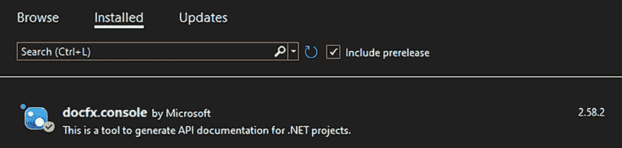

# 第五章：在 C# 12 中实现代码重用

**代码重用性**是软件架构中最重要的话题之一。本章旨在讨论实现代码重用的方法，以及帮助你理解.NET 8 如何解决管理和维护可重用库的问题。

本章将涵盖以下主题：

+   理解代码重用的原则

+   与.NET 8 合作的优势

+   使用.NET 8 创建可重用库

尽管代码重用是一种例外做法，但作为一名软件架构师，你必须意识到在处理的具体场景中何时这是重要的。许多优秀的软件架构师认为，由于试图使事物可重用，尽管它们通常是单次使用或理解不够充分，导致不必要的复杂性和开发过程缓慢，这导致了大量的过度设计。

# 技术要求

对于本章，你需要安装免费 Visual Studio 2022 Community Edition 或更高版本，以及所有数据库工具。

# 理解代码重用的原则

你可以始终用来证明代码重用合理性的唯一理由是——如果你在其他场景中已经运行良好，你就不能浪费宝贵的时间去重新发明轮子。这就是为什么大多数工程领域都基于可重用性原则，如模块化、标准化、抽象和文档。想想你家里的开关。你只能更换它们，而不必修改你房子的其他部分，因为它是基于一个标准建造的，根据规范抽象出开关的概念，从而提供了模块化。

你能想象使用相同的界面组件可以制作出多少应用吗？代码重用的基本原则是一样的。再次强调，这关乎于规划一个良好的解决方案，以便其中一部分可以在以后重用。

在软件工程中，代码重用是能够给软件项目带来一系列优势的技术之一，例如以下这些：

+   由于重用的代码部分已经在另一个应用程序中经过测试，因此对软件有信心。

+   软件架构师和高级团队有更高效的利用方式，因为他们可以专注于解决这类问题。

+   有可能将市场上已经接受的模式引入项目中。

+   由于已经实现了组件，开发速度会提高。

+   维护起来更简单。

这些方面表明，代码复用应该尽可能地进行。然而，创建可复用组件的初始成本会更高。这就是为什么你需要专注于在你能认识到这段代码将来真的会被复用的情况下创建它，或者在你试图复用尚未作为组件创建的代码的情况下。作为软件架构师，确保利用前面的优势是你的责任，而且更重要的是，激励你的团队在创建的软件中启用复用。

在下一节中，我们将讨论什么可以被认为是代码复用，什么不可以。讨论的主要目的是帮助你定义一个代码复用策略，这将改变你团队的效率。

## 代码复用不是什么

你必须理解的第一件事是，代码复用并不意味着从一个类复制粘贴代码到另一个类。即使这段代码是由另一个团队或项目编写的，这也不表明你正确地运用了复用原则。让我们想象一个场景，我们将在本书的使用案例中找到这个场景，即**WWTravelClub**评估。

在这个项目场景中，你可能想要评估不同类型的主题，例如**包**、**目的地专家**、**城市**、**评论**等等。无论你指的是哪个主题，获取评估平均值的流程都是相同的。正因为如此，你可能希望通过复制粘贴每个评估的代码来*启用*复用。结果可能如下所示：



图 5.1：糟糕的实现 – 这里没有代码复用

在前面的图中，计算评估平均值的流程是分散的，这意味着相同的代码将在不同的类中重复。这将造成很多麻烦，尤其是在其他应用程序中也使用了相同的方法。例如，如果有一个新的规范涵盖了如何计算平均值，或者即使只是计算公式中出现了错误，你也必须修复所有代码实例。如果你忘记在所有地方更新它，你可能会得到不一致的实现。

在下一节中，我们将重新组织这段代码，以尊重一些你作为软件架构师应该遵循的原则，以避免我们在这里提到的问题。

## 代码复用是什么

解决上一节中提到的问题的方案相当简单：你必须分析你的代码，并选择其中那些可以从你的应用程序中解耦的部分。

你应该解耦的最有力的理由与你如何确保这段代码可以在应用程序的其他部分或其他应用程序中复用有关。这正是 Andrew Hunt 和 David Thomas 提出的 DRY 原则（不要重复自己）：



图 5.2：专注于代码重用的实现

代码的集中化给你这样的软件架构师带来了不同的责任。你必须记住，如果这段代码中存在错误或问题，它可能会在应用程序的许多部分甚至使用它的其他应用程序中引起问题。另一方面，一旦你测试并运行了这段代码，你将能够无忧无虑地在新的项目中再次重用这段代码。此外，让我们记住我们在这里要实现的使用案例：你可能想要评估不同类型的主题，例如**包**、**目的地专家**、**城市**、**评论**等等。无论你指的是哪个主题，获取评估平均值的流程都是相同的。如果你需要进化平均计算过程呢？在设计现在提供的方案中，你将不得不在一个类中更改代码。考虑到我们已经学到的知识，我们还可以：

+   创建一个基类，实现方法的逻辑。

+   从新创建的基类继承所有其他类，并最终增强/修改方法的行为。

+   将继承转换为关联（如前一章所述）。

值得注意的是，你使用相同代码的次数越多，这种开发就越便宜。尽管最初开发可重用代码可能看起来成本更高，但随着使用次数的增加，开发过程在时间上变得越来越经济高效。需要提到成本，因为通常情况下，可重用软件的概念在开始时成本更高。

## 开发生命周期中的可重用性

如果你理解代码的可重用性将带你进入另一个层次的编码，改善你编写和使用代码的方式，那么是时候考虑如何使这项技术在你的开发生命周期中变得可用。

实际上，由于你将承担的责任以及缺乏支持现有组件搜索的良好工具，创建和维护组件库并不容易。

另一方面，有一些实践，你可能在每次启动新的软件开发时都考虑实施：

+   **使用**用户库中已经实现的组件，选择在软件需求规范中需要它们的特性。

+   **识别**软件需求规范中可以作为库组件设计的特性。

+   **修改**规范，考虑到这些特性将使用可重用组件开发。

+   **设计**可重用组件，并确保它们具有适用于许多项目的适当接口。

+   **构建**使用新组件库版本的项目架构。

+   **记录**组件库版本，以便每个开发者和团队都知道。

*使用-识别-修改-设计-构建* 过程是一种你可能每次需要启用软件重用时都考虑实施的技术。一旦你有了为这个库编写所需的组件，你将需要决定提供这些组件的技术。

在软件开发的历史中，有许多方法可以实现代码重用，从 **动态链接库** (**DLLs**) 到微服务，正如我们将在第十一章 *将微服务架构应用于企业应用程序* 中的 *微服务和模块概念的演变* 节所讨论的。该节中解释的方法可以由你，作为软件架构师，用来实施此策略以加速软件开发。现在，让我们看看 .NET 8 如何帮助我们实现这一点。

# 使用 .NET 8 进行代码重用

**.NET** 自第一版以来已经发展了很多。这种演变不仅与命令数量和性能问题有关，还与支持的平台有关。正如我们在第一章 *理解软件架构的重要性* 中所讨论的，你可以在运行 Linux、Android、macOS 或 iOS 的数十亿台设备上运行 C# .NET。因此，.NET Standard 首次与 .NET Core 1.0 一起宣布，但随着 .NET Standard 2.0 的推出，.NET Framework 4.7.2、.NET Core 和 Xamarin 与其兼容，.NET Standard 变得尤为重要。

关键点在于 .NET Standard 不仅仅是一个 Visual Studio 项目。更重要的是，它是一个对所有 .NET 实现都适用的正式规范。正如你可以在下表中所见，由微软推荐的 .NET Standard 2.0 覆盖了 .NET 中的所有内容。你可以在 [`docs.microsoft.com/en-us/dotnet/standard/net-standard`](https://docs.microsoft.com/en-us/dotnet/standard/net-standard) 找到完整的 .NET Standard 概览。

| **.NET 实现** | **版本支持** |
| --- | --- |
| .NET 和 .NET Core | 2.0, 2.1, 2.2, 3.0, 3.1, 5.0, 6.0, 7.0, 8.0 |
| .NET Framework 1 | 4.6.1 2, 4.6.2, 4.7, 4.7.1, 4.7.2, 4.8, 4.8.1 |
| Mono | 5.4, 6.4 |
| Xamarin.iOS | 10.14, 12.16 |
| Xamarin.Mac | 3.8, 5.16 |
| Xamarin.Android | 8.0, 10.0 |
| 通用 Windows 平台 | 10.0.16299, 待定 |
| Unity | 2018.1 |

表 5.1: .NET Standard 2.0 支持

这表明，如果你构建一个与该标准兼容的类库，你将能够在所展示的任何平台上重用它。想想如果你在所有项目中都这样做，你的开发过程会变得多快。

显然，一些组件不包括在 .NET Standard 中，但其演变是持续的。值得一提的是，微软的官方文档指出，*版本越高，可用的 API 越多*。

为了让所有平台都使用单个框架的倡议，我们来到了.NET 5。微软指出，从.NET 5.0 开始，框架将在任何地方运行。作为软件架构师的你可能会问，*.NET Standard 将会怎样？*

这个问题的答案在 Immo Landwerth 的 dotnet 博客中得到了很好的解释：[`devblogs.microsoft.com/dotnet/the-future-of-net-standard/`](https://devblogs.microsoft.com/dotnet/the-future-of-net-standard/)。基本的答案是，.NET 5.0（以及未来的版本）需要被视为未来共享代码的基础。考虑到.NET 8 是一个**LTS**（**长期支持**）版本，我们现在可以理解这个框架是分享新应用程序代码的最佳选择。

考虑到这个场景，现在是时候检查如何创建可重用类库了。因此，让我们进入下一个主题。

## 创建可重用类库

如果你想要创建可以被多个应用程序使用的有用功能，你需要创建一个**类库**项目。因此，使用.NET 创建类库是重用代码的最佳方式。创建**类库**相当简单。基本上，在创建库时，你需要选择以下项目：



图 5.3：创建类库

一旦你完成了这部分，你会注意到项目文件会保留关于**目标框架标识符**（**TFM**）的信息。TFM 的想法是定义将可用于库的 API 集合。你可以在[`docs.microsoft.com/en-us/dotnet/standard/frameworks`](https://docs.microsoft.com/en-us/dotnet/standard/frameworks)找到可用的 TFM 列表：

```cs
<Project Sdk="Microsoft.NET.Sdk">
  <PropertyGroup>
    <TargetFramework>net8.0</TargetFramework>
    <Nullable>enable</Nullable>
  </PropertyGroup>
</Project> 
```

一旦你的项目加载完毕，你就可以开始编写你打算重用的类。使用这种方法构建可重用类的优点是，你将能够在之前检查的所有项目类型中重用所编写的代码。另一方面，你会发现一些在.NET Framework 中可用的 API，在这个类型的项目中并不存在。

考虑到你已经选择了正确的项目类型来创建可重用代码，让我们在下一节中看看 C#是如何处理代码重用的。

## C#是如何处理代码重用的？

考虑到你正在使用 C#.NET 编写类库，有许多方法中**C#**帮助我们处理代码重用。我们之前所做的那样构建库的能力是其中之一。其中最重要的一个事实是，这种语言是**面向对象的**。除此之外，还值得提到泛型为 C#语言带来的便利。本节将讨论面向对象分析和泛型原则。

### 面向对象分析

面向对象分析方法使我们能够以不同的方式重用代码，从继承的便利性到多态的可变性。完全采用面向对象编程将使您能够实现抽象和封装。

重要的是要提到，在*第四章*，*C# 编码最佳实践 12*中，我们讨论了继承如何导致代码复杂化。尽管以下示例展示了一种有效的代码重用方法，但在实际应用中，考虑使用组合而非继承。

下图展示了使用面向对象方法如何使重用变得更加容易。正如您所看到的，考虑到您可以是该示例系统的基本用户或高级用户，计算评估成绩的方法有多种：


图 5.4：面向对象案例分析

在此设计中，代码重用有两个方面需要分析。第一个方面是，由于继承会为您完成，因此不需要在每个子类中声明属性。

第二个方面是使用多态的机会，它允许同一方法有不同的行为：

```cs
public class PrimeUsersEvaluation : Evaluation
{
    /// <summary>
/// The business rule implemented here indicates that grades
/// that came from prime users have 20% of increase
/// </summary>
/// <returns>the final grade from a prime user</returns>
public override double CalculateGrade()
    {
         return Grade * 1.2;
    }
} 
```

在前面的代码中，您可以看到多态原则的应用，其中高级用户的评估计算将增加 20%。现在，看看调用同一类继承的不同对象是多么容易。由于集合内容实现了相同的接口 `IContentEvaluated`，它也可以有基本用户和高级用户：

```cs
public class EvaluationService
{
    public IContentEvaluated Content { get; set; }
    /// <summary>
/// No matter the Evaluation, the calculation will always get
/// values from the method CalculateGrade
/// </summary>
/// <returns>The average of the grade from
/// Evaluations
/// </returns>
public double CalculateEvaluationAverage()
    {
            return Content.Evaluations
                .Select(x => x.CalculateGrade())
                .Average();
    }
} 
```

在使用 C# 时，考虑面向对象的使用是强制性的。然而，更具体的用法需要学习和实践。作为软件架构师，您应该始终鼓励您的团队学习面向对象分析。他们越抽象的能力，代码重用就越容易。

### 泛型

**泛型**在 C# 2.0 版本中引入，被认为是一种提高代码重用的方法。它还最大限度地提高了类型安全和性能。

泛型的基本原理是，您可以在接口、类、方法、属性、事件或甚至委托中定义一个占位符，该占位符将在使用前述实体之一时被替换为特定类型。由于您可以使用相同的代码运行不同版本的泛型类型，因此您利用此功能的机会是难以置信的。

以下代码是对上一节中介绍的 `EvaluationService` 的修改。这里的想法是使服务通用化，从而在创建时就定义评估的目标：

```cs
public class EvaluationService<T> where T: IContentEvaluated, new() 
```

此声明表明，任何实现 `IContentEvaluated` 接口的类都可以用于此服务。新的约束表明此类必须有一个公共的无参数默认构造函数。

该服务将负责创建评估内容：

```cs
public EvaluationService()
{
    var name = GetTypeOfEvaluation();
    content = new T();
} 
```

值得注意的是，这段代码之所以能工作，是因为所有类都在同一个程序集里。这次修改的结果可以在服务的实例创建中检查：

```cs
var service = new EvaluationService<CityEvaluation>(); 
```

好消息是，现在您有一个通用的服务，它将自动实例化您需要的`list`对象，并包含内容评估。值得一提的是，泛型显然需要更多时间来构建第一个项目。然而，一旦设计完成，您将拥有良好、快速且易于维护的代码。这就是我们所说的重用！

## 如果代码不可重用怎么办？

实际上，任何代码都可以是可重用的。关键点在于，您打算重用的代码必须编写良好，并遵循良好的重用模式。有几个原因说明为什么代码应该被视为不可重用：

+   **代码之前未经过测试**：在重用代码之前，确保它能够正常工作是一个很好的方法。

+   **代码重复**：如果您有重复的代码，您需要找到它被使用的每个地方，以确保只有一个版本的代码被重用。如果您发现代码的不同版本被重复，您需要定义最佳版本作为可重用版本，同时您还需要重新测试所有替换的重复代码，以确保软件的功能保持不变。

+   **代码过于复杂，难以理解**：在许多地方被重用的代码需要以简洁的方式编写，以便易于理解。

+   **代码有紧密耦合**：这是关于在构建单独的类库时，是使用组合还是继承的讨论。通常，具有接口的类比可以继承的基类更容易重用。

在任何这些情况下，考虑重构策略都可以是一个很好的方法。当您重构代码时，您会以更好的方式编写它，保证代码标准，减少复杂性，并尊重此代码将处理的数据输入和输出。这使您能够在适当的时候对代码进行更全面和成本更低的更改。马丁·福勒在他的 2018 年出版的《重构》一书中，指出了您应该考虑重构的一些原因：

+   **它改善了软件设计**：随着团队的专业技能不断提高，设计将变得更好。更好的软件设计不仅会带来更快的编码速度，还会给我们带来在更短的时间内处理更多任务的机会。

+   **它使软件更容易理解**：无论我们是在谈论初级还是高级开发者，好的软件需要让团队中的每个开发者都能理解。

+   **它帮助我们找到错误**：在重构代码的同时，您正在审查代码。在这个过程中，您可能会发现一些可能没有编写好的业务规则，因此您可能会发现错误。然而，不要忘记重构的基础是保持行为，所以请确保这是修复问题的正确时机。

+   **这使我们的程序更快**：重构的结果将是能够使未来开发更快的代码。

在重构时，我们可以通过遵循以下步骤来保证良好的结果并最小化在过程中发生的错误：

+   **务必确保有一套测试来保证正确的处理**：这套测试将消除破坏代码的恐惧。

+   **消除重复**：重构是消除代码重复的好机会。

+   **最小化复杂性**：鉴于一个目标是使代码更易于理解，遵循第四章中提到的编程最佳实践，即 *《C# 编程最佳实践 12》*，将有助于你减少代码的复杂性。

+   **清理设计**：重构是重新组织库的设计的好时机。不要忘记更新它们。这可以是一种消除错误和安全问题的极好方式。

作为软件架构师，你将收到来自你团队许多重构的要求。重构的激励必须是持续的，但你必须提醒你的团队，如果不遵循前面的步骤进行重构，可能会存在风险，一旦在过程中可能引起错误。因此，确保重构以既能够快速编程又能减少因重构过程引起的不必要错误的影响，从而提供真正的商业价值，这是你的责任。

## 我有我的库。我该如何推广它们？

一旦你付出了所有必要的努力来保证你拥有许多项目中可以重用的良好库，你将发现当启用可重用性时会出现另一个困难的情况：让程序员知道你有现成的库可供重用并不那么容易。

记录库有一些简单的方法。正如我们在讨论开发生命周期时提到的，记录是帮助开发者注意他们拥有的库的好方法。在接下来的小节中，我们将提到两个记录可重用代码的例子。

### 使用 DocFX 记录 .NET 库

DocFX 是使用代码中的注释来记录库的好选择。通过简单地添加 `docfx.console` NuGet 包，这个工具允许你创建一个任务，一旦你的库构建完成就会运行：



图 5.5：docfx.console NuGet 库

这个编译的输出是一个包含你的代码文档的时尚静态网站：

![图片 B19820_05_06.png]

图 5.6：DocFx 结果

这个网站很有用，因为你可以将文档分发给你的团队，以便他们可以搜索你拥有的库。你可以检查输出的自定义设置，并在 [`dotnet.github.io/docfx/`](https://dotnet.github.io/docfx/) 找到更多关于它的信息。

### 使用 Swagger 记录 Web API

毫无疑问，Web API 是促进和推动代码复用的技术之一。因此，确保良好的文档，更重要的是，尊重标准，是良好的实践，这表明你了解提供可重用 API 的方法。为此，我们有了 **Swagger**，它遵循 **OpenAPI 规范**。

OpenAPI 规范被认为是描述现代 API 的标准。在 **ASP.NET Core Web API** 中，用于记录 API 的最广泛使用的工具之一是 `Swashbuckle.AspNetCore`。

使用 `Swashbuckle.AspNetCore` 库的好处在于，你可以为你的 Web API 设置 **Swagger UI** 查看器，这是一种良好的、图形化的方式来分发 API。

我们将在第十五章“使用 .NET 应用服务架构”中学习如何在 ASP.NET Core Web API 中使用这个库。在此之前，了解这份文档不仅可以帮助你的团队，还可以帮助任何可能使用你正在开发的 API 的开发者，这一点非常重要。

# 摘要

本章旨在帮助你了解代码复用的优势。它还让你对哪些代码不适合复用有了概念。本章还介绍了代码复用和重构的方法。

考虑到没有流程的技术无法带你走得更远，我们提出了一种帮助实现代码复用的流程。这个流程与使用库中已经完成的组件相关，识别软件需求规格说明中可以作为库组件设计的候选功能，根据这些功能修改规格，设计可重用组件，并使用新的组件库版本构建项目架构。

在本章的结尾，我们介绍了 .NET Standard 库作为在不同 C# 平台上复用代码的方法，指出 .NET 8 和新版本允许跨平台复用代码。本章还强化了在复用代码时面向对象编程的原则，并介绍了泛型作为一种复杂的实现方式，以简化具有相同特性的对象的处理。

# 问题

1.  可以将复制粘贴视为代码复用吗？这种方法的有哪些影响？

1.  如何在不复制粘贴的情况下复用代码？

1.  有没有可以帮助代码复用的流程？

1.  .NET Standard 和 .NET Core 之间的区别是什么？

1.  创建 .NET Standard 库有哪些优势？

1.  面向对象分析如何帮助代码复用？

1.  泛型如何帮助代码复用？

1.  .NET Standard 将会被 .NET 6 取代吗？

1.  与重构相关的挑战有哪些？

# 进一步阅读

以下是一些书籍和网站，你可以在那里找到本章涵盖主题的更多信息：

+   *《敏捷软件开发工艺手册：Clean Code》*，作者：马丁，罗伯特·C·皮尔逊教育，2012 年。

+   *《整洁架构：软件结构与设计的工匠指南》* 由 Martin，Robert C. Pearson Education 著，2018 年。

+   *《设计模式：可复用面向对象软件元素》* 由 Eric Gamma [等] 著，Addison-Wesley，1994 年。

+   *《设计原则与设计模式》* 由 Robert C. Martin 著，2000 年。

+   *《重构》* 由 Martin Fowler 著，2018 年。

+   如果您需要更多关于 .NET Standard 的信息：

    +   [`devblogs.microsoft.com/dotnet/introducing-net-standard/`](https://devblogs.microsoft.com/dotnet/introducing-net-standard/)

    +   [`www.packtpub.com/application-development/net-standard-20-cookbook`](https://www.packtpub.com/application-development/net-standard-20-cookbook)

    +   [`devblogs.microsoft.com/dotnet/the-future-of-net-standard/`](https://devblogs.microsoft.com/dotnet/the-future-of-net-standard/)

    +   [`devblogs.microsoft.com/dotnet/the-future-of-net-standard/`](https://devblogs.microsoft.com/dotnet/the-future-of-net-standard/)

+   使用泛型概念进行编程的绝佳指南：[`docs.microsoft.com/pt-br/dotnet/csharp/programming-guide/generics/`](https://docs.microsoft.com/pt-br/dotnet/csharp/programming-guide/generics/)

+   一些可能有助于您编写库和 API 文档的链接：

    +   [`dotnet.github.io/docfx/`](https://dotnet.github.io/docfx/)

    +   [`github.com/domaindrivendev/Swashbuckle.AspNetCore`](https://github.com/domaindrivendev/Swashbuckle.AspNetCore)

    +   [`docs.microsoft.com/en-us/aspnet/core/tutorials/web-api-help-pages-using-swagger`](https://docs.microsoft.com/en-us/aspnet/core/tutorials/web-api-help-pages-using-swagger)

# 在 Discord 上了解更多

要加入这本书的 Discord 社区——在那里您可以分享反馈、向作者提问，并了解新版本——请扫描下面的二维码：

[`packt.link/SoftwareArchitectureCSharp12Dotnet8`](https://packt.link/SoftwareArchitectureCSharp12Dotnet8)


