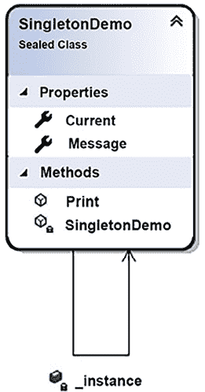

# 设计模式与 .NET 8 实现

设计模式可以被定义为针对你在软件开发过程中遇到的常见问题的现成架构解决方案。它们对于理解 .NET 架构至关重要，并且对于解决我们在设计任何软件时面临的普通问题非常有用。在本章中，我们将探讨一些设计模式的实现。值得一提的是，这本书并没有解释我们可以使用的所有已知模式。这里的重点是解释研究和应用它们的重要性。

在本章中，我们将涵盖以下主题：

+   理解设计模式及其目的

+   理解 .NET 中可用的设计模式

到本章结束时，你将了解一些可以使用设计模式实现的使用案例。

# 技术要求

要完成这一章，你需要免费的 Visual Studio 2022 Community Edition 或更高版本。

你可以在[`github.com/PacktPublishing/Software-Architecture-with-C-Sharp-12-and-.NET-8-4E`](https://github.com/PacktPublishing/Software-Architecture-with-C-Sharp-12-and-.NET-8-4E)/tree/main/ch06 找到本章的示例代码。

# 理解设计模式及其目的

决定系统的设计是一项挑战，与之相关的责任也非常重大。作为软件架构师，我们必须始终牢记，诸如高度可重用性、良好性能和良好可维护性等特性对于提供良好的解决方案至关重要。这就是设计模式发挥作用并加速设计过程的地方。

正如我们之前提到的，设计模式是已经被讨论和定义的解决方案，以便它们可以解决常见的软件架构问题。这种做法在《设计模式——可重用面向对象软件的元素》一书发布后变得流行起来，其中**四人帮**（**GoF**）将这些模式分为三种类型：创建型、结构型和行为型。

有一点时间后，Uncle Bob 将 SOLID 原则引入了开发者社区，给了我们有效地组织每个系统的函数和数据结构的机会。SOLID 设计原则指出了软件组件应该如何设计和连接。值得一提的是，与 GoF 提出的设计模式相比，SOLID 原则并不提供代码食谱。相反，它们在你设计解决方案时提供了遵循的基本原则，以保持软件结构的强大和可靠。它们可以被定义为如下：

+   **单一职责**：一个模块或函数应该只负责单一目的。

+   **开闭原则**：一个软件工件应该对扩展开放，但对修改封闭。

+   **Liskov 替换原则**：当你将程序的一个组件替换为另一个由原始对象的超类型定义的组件时，程序的行为需要保持不变。

+   **接口隔离**：根据你创建接口的方式，你将促进那些在构建它们的实际对象时可能不会发生的依赖，从而损害系统架构。

+   **依赖倒置**：最灵活的系统是那些对象依赖仅指向抽象的系统。

随着技术和软件问题的变化，更多的模式被构思出来。云计算的进步带来了一大批这样的模式，其中一些可以在 [`docs.microsoft.com/en-us/azure/architecture/patterns`](https://docs.microsoft.com/en-us/azure/architecture/patterns) 找到。内容被组织成三个不同的挑战领域：数据管理、设计和实现、以及消息传递。其中许多在本书的章节中都有描述，如下面的列表所示：

+   **异步请求-响应**：在讨论 Azure Durable Functions 时，这种模式在 *第十六章*，*使用无服务器 - Azure Functions* 中被提出；用于 **异步 HTTP API** 的编排函数解决了这个模式。

+   **隔离舱隔离**：在讨论 *第十一章*，*将微服务架构应用于您的企业应用* 中的微服务设计原则时，提出了这个模式。

+   **缓存旁路**：缓存在 *第一章*，*理解软件架构的重要性* 中被提出。它还展示了与 Azure Redis 一起使用的用法，在 *第十二章*，*在云中选择您的数据存储* 中也有介绍。

+   **断路器**：实现此策略的方法在 *第十一章*，*将微服务架构应用于您的企业应用* 中被提出。

+   **命令查询责任分离**（**CQRS**）：CQRS 在 *第七章*，*理解软件解决方案的不同领域* 中被描述。

+   **发布者/订阅者**：这个模式将在下面的子节中解释，并在 *第七章*，*理解软件解决方案的不同领域* 中进行讨论。

+   **重试**：*第十一章*，*将微服务架构应用于您的企业应用* 中的 *弹性任务执行* 子节展示了如何使用 Polly，这是一个用于应用重试的通用框架。

+   **基于队列的负载均衡**：在 *第十六章*，*使用无服务器 – Azure Functions* 中提出的场景使用了一个充当任务和服务之间缓冲区的队列。

新模式出现的原因与我们开发新解决方案时面临的挑战有关。今天，在交付云解决方案时，我们必须处理可用性、数据管理、消息传递、监控、性能、可伸缩性、弹性和安全性等方面。

您应该始终考虑在开发中使用设计模式的原因非常简单——作为一个软件架构师，您不能花时间重新发明轮子。然而，使用和理解它们还有一个很好的理由——您会发现许多这些模式已经在 .NET 中实现了。

在接下来的几个小节中，我们将介绍一些最著名的模式。本章的目的是让您知道它们的存在，并需要研究它们，以便您能够加速并简化您的项目。此外，每个模式都将通过一个 C# 代码片段来展示，这样您就可以在项目中实现它，同时始终记住我们谈论的是样本，而不是准备生产的代码。

## 建造者模式

有时候，您将有一个具有不同行为的复杂对象，这是由于其配置造成的。在您使用它时设置此对象，您可能希望将其配置与其使用解耦，使用已经构建的定制配置。这样，您就有您正在构建的实例的不同表示。这就是您应该使用建造者模式的地方。

下面的类图展示了本书用例中实现的一个场景的模式，该场景在*第二十一章*，*案例研究*中呈现。这种设计选择背后的想法是简化 WWTravelClub 中房间的描述方式。

`Room` 类中实现的 Fluent API 使我们能够更简单地构建每个在各个建造者（`SimpleRoomBuilder` 和 `FamilyRoomBuilder`）中定义的房间类型。


图 6.1：建造者模式

```cs
implemented in a way where the configurations of the instances are not set in the main program. Instead, you just build the objects using the Build() method. This example simulates the creation of different room styles (a single room and a family room) in WWTravelClub:
```

```cs
using DesignPatternsSample.BuilderSample;
using System;
namespace DesignPatternsSample
{
    class Program
    {
        static void Main()
        {
          #region Builder Sample
          Console.WriteLine("Builder Sample");
          var simpleRoom = new SimpleRoomBuilder().Build();
          simpleRoom.Describe();

          var familyRoom = new FamilyRoomBuilder().Build();
          familyRoom.Describe();
          #endregion
          Console.ReadKey();
        }
    }
} 
```

这种实现的成果相当简单，但阐明了您需要实现模式的原因：


图 6.2：建造者模式示例结果

一旦有了实现，代码的演进就变得简单。例如，如果您需要构建不同风格的房间，您只需为该类型的房间创建一个新的建造者，您就可以使用它。

这种实现变得相当简单的原因与链式方法的用法有关，正如我们在 `Room` 类中看到的那样：

```cs
 public class Room
    {
        private readonly string _name;
        private bool wiFiFreeOfCharge;
        private int numberOfBeds;
        private bool balconyAvailable;
        public Room(string name)
        {
            _name = name;
        }
        public Room WithBalcony()
        {
            balconyAvailable = true;
            return this;
        }
        public Room WithBed(int numberOfBeds)
        {
            this.numberOfBeds = numberOfBeds;
            return this;
        }
        public Room WithWiFi()
        {
            wiFiFreeOfCharge = true;
            return this;
        }
    ...
    } 
```

幸运的是，如果您需要添加产品的配置设置，您之前使用的所有具体类都将定义在 Builder 接口中，并存储在那里，这样您可以轻松地更新它们。

我们将在*理解 .NET 中可用的设计模式*部分看到 .NET 中 Builder 模式的一个很好的实现。在那里，您将能够理解如何使用 `HostBuilder` 实现了 Generic Host。

## 工厂模式

工厂模式在有多种来自同一抽象的对象且只在运行时知道需要创建哪个对象的情况下很有用。这意味着你将根据某种配置或根据软件当前所在的位置来创建实例。

例如，让我们看看 WWTravelClub 示例。在这里，有一个用户故事描述了该应用程序将拥有来自世界各地的客户支付他们的旅行费用。然而，在现实世界中，每个国家都有不同的支付服务可用。每个国家的支付过程相似，但这个系统将提供多个支付服务。简化这种支付实现的一个好方法是通过使用工厂模式。

以下图示展示了其架构实现的初步概念：


图 6.3：工厂模式

注意，由于你有一个描述应用程序支付服务的接口，你可以使用工厂模式根据可用的服务来更改具体的类：

```cs
static void Main()
{
    #region Factory Sample
// In this sample, we will use the Factory Method Pattern
      // to create a Payment Service to charge a Brazilian
      // customer
    ProcessCharging(
    PaymentServiceFactory.ServicesAvailable.Brazilian,
    "gabriel@sample.com",
     178.90m,
     EnumChargingOptions.CreditCard);
    // In this sample, we will use the Factory Method Pattern
    // to create a Payment Service to charge an Italian
// customer
     ProcessCharging(
     PaymentServiceFactory.ServicesAvailable.Italian,
    "francesco@sample.com",
     188.70m,
     EnumChargingOptions.DebitCard);
    #endregion
    Console.ReadKey();
}
private static void ProcessCharging
    (PaymentServiceFactory.ServicesAvailable serviceToCharge,
 string emailToCharge, decimal moneyToCharge,
    EnumChargingOptions optionToCharge)
{
    PaymentServiceFactory factory = new PaymentServiceFactory();
    IPaymentService service = factory.Create(serviceToCharge);
    service.EmailToCharge = emailToCharge;
    service.MoneyToCharge = moneyToCharge;
    service.OptionToCharge = optionToCharge;
    service.ProcessCharging();
} 
```

再次强调，由于实现了模式，服务的使用已经简化。如果你需要在现实世界的应用程序中使用此代码，你将通过在工厂模式中定义所需的服务的实例来更改实例的行为。

## 单例模式

当你在应用程序中实现单例时，你将在整个解决方案中实现该对象的单一实例。这是每个应用程序中最常用的模式之一。原因很简单——有许多用例需要某些类只有一个实例。单例通过提供比全局变量更好的解决方案来解决这个问题。

在单例模式中，类负责创建并传递一个将被应用程序使用的单一对象。换句话说，单例类创建一个单一实例：



图 6.4：单例模式

要做到这一点，创建的对象是`静态`的，并通过静态属性或方法传递。`??=`运算符如果其右操作数的值为 null，则将其值赋给左操作数。

以下代码实现了单例模式，它有一个`Message`属性和一个`Print()`方法：

```cs
public sealed class SingletonDemo
{
    #region This is the Singleton definition
private static SingletonDemo _instance;
    public static SingletonDemo Current => _instance ??= new
        SingletonDemo();
    #endregion
public string Message { get; set; }
    public void Print()
    {
        Console.WriteLine(Message);
    }
} 
```

其用法很简单——每次你需要使用单例对象时，只需调用静态属性即可：

```cs
SingletonDemo.Current.Message = "This text will be printed by " +
  "the singleton. Be careful with concurrency.";
SingletonDemo.Current.Print(); 
```

请注意，根据定义的使用方式，示例可能存在并发问题！请参阅*第二章*，*非功能性需求*，了解更多关于并发和多线程的信息。

你可以使用这种模式的情况之一是，当你需要以易于从解决方案的任何位置访问的方式提供应用程序配置时。例如，假设你有一些存储在表中且应用程序需要在几个决策点查询的配置参数。尽管我们有像`appsettings.json`或`web.config`这样的标准解决方案，其中缓存是开箱即用的，但你可能想使用这个自定义解决方案。在这种情况下，你不必直接查询配置表，可以创建一个 Singleton 类来帮助你：


图 6.5：Singleton 模式使用

此外，你还需要在这个 Singleton 中实现一个缓存，从而提高系统的性能，因为你可以决定系统是否每次需要时都会检查数据库中的每个配置，或者是否使用缓存。以下截图显示了缓存的实现，其中配置每 5 秒加载一次。在这种情况下读取的参数只是一个随机数：


图 6.6：Singleton 模式内的缓存实现

这对应用程序的性能大有裨益。此外，在代码的多个地方使用参数更简单，因为你不必在代码的每个地方都创建配置实例。

值得注意的是，由于.NET 中的依赖注入实现，Singleton 模式的使用已经变得不那么常见，因为你可以设置依赖注入来处理你的 Singleton 对象。我们将在本章后面的部分介绍.NET 中的依赖注入。

## 代理模式

当你需要提供一个控制对另一个对象访问的对象时，会使用代理模式。你应该这样做的一个最大的原因是与被控制对象的创建成本相关。例如，如果被控制的对象创建时间过长或消耗过多内存，可以使用代理来确保对象的大部分只有在需要时才会创建。

以下类图是一个**代理**模式实现，用于从**Room**（参见*图 6.1*）加载图片，但仅在请求时：


图 6.7：代理模式实现

这个代理的客户将请求其创建。在这里，代理将只从真实对象收集基本信息（`Id`、`FileName`和`Tags`），而不会查询`PictureData`。

只有在第一次调用中请求 `PictureData` 时，代理才会加载它，正如我们可以通过消息“现在图片已加载！”来确认。之后，在第二次图片数据请求中，代理将不会再次加载 `PictureData`，这会导致更好的性能，正如我们在 *图 6.8* 中可以看到：

```cs
static void Main()
{
    Console.WriteLine("Proxy Sample");
    ExecuteProxySample(new ProxyRoomPicture());
}
private static void ExecuteProxySample(IRoomPicture roomPicture)
{
    Console.WriteLine($"Picture Id: {roomPicture.Id}");
    Console.WriteLine($"Picture FileName: {roomPicture.FileName}");
    Console.WriteLine($"Tags: {string.Join(";", roomPicture.Tags)}");
    Console.WriteLine($"1st call: Picture Data");
    Console.WriteLine($"Image: {roomPicture.PictureData}");
    Console.WriteLine($"2nd call: Picture Data");
    Console.WriteLine($"Image: {roomPicture.PictureData}");
} 
```

如果再次请求 `PictureData`，由于图像数据已经就绪，代理将保证不会重复重新加载图像。以下截图显示了运行前面代码的结果：


图 6.8：代理模式结果

这种技术也可以被称为 **延迟加载**。实际上，代理模式是实现延迟加载的一种方式。实现延迟加载的另一种方法是使用 `Lazy<T>` 类型。例如，在 Entity Framework Core 中，如 *第十三章* 中所讨论的，*在 C# 中与数据交互 – Entity Framework Core*，你可以通过代理启用延迟加载。你可以在 [`docs.microsoft.com/en-us/ef/core/querying/related-data#lazy-loading`](https://docs.microsoft.com/en-us/ef/core/querying/related-data#lazy-loading) 上了解更多信息。

## 命令模式

有许多情况下，你需要执行一个将影响对象行为的 **命令**。命令模式可以通过封装这种请求为一个对象来帮助你处理这种情况。该模式还描述了如何处理请求的撤销/重做支持。

还有一个名为 Memento 的设计模式，它也有实现撤销动作的目的。然而，命令模式侧重于将请求封装为对象，而 Memento 侧重于捕获和外部化对象的内部状态，以便稍后恢复。

例如，让我们想象在 WWTravelClub 网站上，用户可以通过指定他们是否喜欢、不喜欢，甚至热爱他们的体验来评估套餐。

以下类图是一个示例，说明如何使用命令模式创建此评分系统：


图 6.9：命令模式

注意这个模式的工作方式——如果你需要一个不同的命令，比如 `Hate`，你只需基于 `ICommand` 接口实现一个新的类。你不需要更改其他动作类的代码。`Package` 类中的更改不会影响已实现的命令。除此之外，如果你想实现 `Redo` 方法，它可以用类似的方式添加到 `Undo` 方法中。这个完整的代码示例可以在本书的 GitHub 仓库中找到。

还可能有助于提到，ASP.NET Core MVC 使用命令模式来处理其 `IActionResult` 层次。*第七章* 中描述的业务操作，*理解软件解决方案中的不同领域*，将使用此模式来执行业务规则。

## 发布者/订阅者模式

在所有应用程序中，从对象向一组其他对象提供信息是很常见的。当有大量组件（订阅者）将接收包含由对象（发布者）发送的信息的消息时，发布者/订阅者模式几乎是强制性的。

这里的概念非常简单易懂，如下面的图所示：


图 6.10：发布者/订阅者示例案例

当你有不定数量的不同可能的订阅者时，将广播信息的组件与消费它的组件解耦是至关重要的。发布者/订阅者模式为我们做到了这一点。

实现这个模式很复杂，因为分布式环境不是一项简单任务。因此，建议您考虑使用现有的技术来实现连接输入通道和输出通道的消息代理，而不是从头开始构建。Azure Service Bus 是一个可靠的基础设施组件，您可以在其中找到提供的这个模式，所以您需要做的只是连接到它。

在*第十一章*，*将微服务架构应用于您的企业应用程序*和*第十四章*，*使用.NET 实现微服务*中提到的 RabbitMQ，是另一个可以用来实现消息代理的服务，但它是一个更底层的基础设施，需要手动实现几个功能，如错误重试。

## 依赖注入模式

依赖注入模式被认为是实现依赖倒置原则的好方法，指导您实现这个 SOLID 原则。

这个概念非常简单。您不需要创建组件所依赖的对象的实例，只需定义它们的依赖关系，声明它们的接口，并通过**注入**使对象能够接收。

有三种执行依赖注入的方法：

+   使用类的构造函数接收对象

+   标记一些类属性以接收对象

+   定义一个带有注入所有必要组件的方法的接口

下面的图展示了使用类构造函数接收对象的依赖注入模式的实现。在这种情况下，它接收`UserAddress`和`DestinationAddress`类，它们可以完全不同，但都实现了`IAddress`接口，这使得**距离计算器**能够工作：


图 6.11：依赖注入模式

除了上述三种方法之外，依赖注入还可以与**控制反转**（**IoC**）容器一起使用。这个容器使得在需要时自动注入依赖项成为可能。市场上有多款 IoC 容器框架可用，但使用.NET 8，在大多数情况下，不需要使用第三方软件，因为它包含了一组在`Microsoft.Extensions.DependencyInjection`命名空间中解决此问题的库。

此 IoC 容器负责创建和销毁请求的对象。依赖注入的实现基于构造函数类型。注入组件的生命周期有三种选择：

+   **瞬态**：每次请求时都会创建对象。

+   **作用域内**：对象是为应用程序中定义的每个作用域创建的。在一个 Web 应用程序中，**作用域**与一个 Web 请求相关联，除非你创建了一个自定义作用域。一个可以使用自定义作用域的好例子是多租户应用程序。在这种情况下，你可能希望按租户管理依赖项。

+   **单例**：每个对象都有相同的应用程序生命周期，因此单个对象被重用来服务给定类型的所有请求。如果你的对象包含状态，除非它是线程安全的，否则不应使用此对象。记得参考第二章“非功能性需求”，以了解更多关于多线程的信息。

你使用这些选项的方式取决于你正在开发的项目中的业务规则。这同样也是一个关于如何注册应用程序服务的问题。你需要小心地决定正确的选项，因为应用程序的行为将根据你注入的对象类型而改变。

# 理解.NET 中可用的设计模式

正如我们在前面的章节中所发现的，C#允许我们实现任何模式。.NET 在其 SDK 中提供了许多遵循我们讨论的所有模式的实现，例如 Entity Framework Core 代理懒加载。另一个自.NET Core 2.1 以来就可用的好例子是.NET Generic Host，它并不直接实现特定的模式，而是结合了许多模式，为.NET 应用程序提供了一个灵活且可扩展的主机环境。

在第十七章“展示 ASP.NET Core MVC”中，我们将详细介绍.NET 8 中可用的 Web 应用程序的托管情况。这个 Web 宿主帮助我们，因为应用程序的启动和生命周期管理都是与其一起设置的。.NET Generic Host 的思路是使这种方式适用于不需要 HTTP 实现的应用程序。使用这个 Generic Host，任何.NET 程序都可以有一个启动类，在那里我们可以配置依赖注入引擎。这对于创建多服务应用程序很有用，复合模式可以作为其基础。

你可以在[`docs.microsoft.com/en-us/aspnet/core/fundamentals/host/generic-host`](https://docs.microsoft.com/en-us/aspnet/core/fundamentals/host/generic-host)了解更多关于.NET 通用宿主的信息，其中包含一些示例代码，并且这是微软的当前推荐。

GitHub 仓库中提供的代码很简单，但它专注于创建一个可以运行监控服务的控制台应用程序。令人兴奋的是，控制台应用程序的设置方式，其中构建器配置了应用程序将提供的服务以及日志管理的方式。

这在以下代码中有所体现：

```cs
public static void Main()
{
    CreateHostBuilder().Build().Run();
    Console.WriteLine("Host has terminated. Press any key to finish the App.");
    Console.ReadKey();
}
public static IHostBuilder CreateHostBuilder() =>
    Host.CreateDefaultBuilder()
    .ConfigureServices((hostContext, services) =>
    {
          services.AddHostedService<HostedService>();
          services.AddHostedService<MonitoringService>();
    })
    .ConfigureLogging((hostContext, configLogging) =>
    {
          configLogging.AddConsole();
    }); 
```

上述代码让我们了解了.NET 是如何使用设计模式的。使用 Builder 模式，.NET 通用宿主允许你设置将被注入为服务的类。除此之外，Builder 模式还帮助你配置一些其他功能，例如日志的显示/存储方式。这种配置允许服务将`ILogger<outTCategoryName>`对象注入到任何实例中。

其他使用通用宿主的例子包括工作服务，这在*第十四章*，*使用.NET 实现微服务*中有所描述，以及 Blazor 的通用宿主，这在*第十九章，客户端框架：Blazor*中有所描述。

# 摘要

在本章中，我们了解了为什么设计模式有助于提高你正在构建的系统部分的维护性和可重用性。我们还探讨了你在项目中可以考虑的一些典型用例和代码示例，始终记住它们需要进化以达到专业交付。最后，我们介绍了.NET 通用宿主，这是.NET 如何使用设计模式来实现代码重用和强制最佳实践的良例。

所有这些内容都将帮助你进行新的软件架构或维护现有系统，因为设计模式是软件开发中一些现实生活问题的已知解决方案。

在*第七章*，*理解软件解决方案的不同领域*中，我们将介绍领域驱动设计方法。我们还将学习如何使用 SOLID 设计原则，以便我们可以将不同的领域映射到我们的软件解决方案中。

# 问题

1.  什么是设计模式？

1.  设计模式和设计原则之间的区别是什么？

1.  在什么情况下实现 Builder 模式是一个好主意？

1.  在什么情况下实现工厂模式是一个好主意？

1.  在什么情况下实现单例模式是一个好主意？

1.  在什么情况下实现代理模式是一个好主意？

1.  在什么情况下实现命令模式是一个好主意？

1.  在什么情况下实现发布/订阅模式是一个好主意？

1.  在什么情况下实现依赖注入模式是一个好主意？

# 进一步阅读

以下是一些书籍和网站，你可以从中了解更多关于本章所涵盖内容的信息：

+   *Clean Architecture*：*软件结构和设计的工匠指南*，作者：罗伯特·C·马丁，Pearson Education，2018 年。

+   *设计模式*：*可复用面向对象软件的元素*，Erich Gamma 等著，Addison-Wesley，1994。

+   *设计原则与设计模式*，Martin, Robert C.，2000。

+   如果你需要获取更多关于设计模式和架构原则的信息，请查看以下链接：

    +   [`www.packtpub.com/application-development/design-patterns-using-c-and-net-core-video`](https://www.packtpub.com/application-development/design-patterns-using-c-and-net-core-video)

    +   [`docs.microsoft.com/en-us/dotnet/standard/modern-web-apps-azure-architecture/architectural-principles`](https://docs.microsoft.com/en-us/dotnet/standard/modern-web-apps-azure-architecture/architectural-principles)

+   如果你想检查特定的云设计模式，你可以在以下位置找到它们：

    +   [`docs.microsoft.com/en-us/azure/architecture/patterns/`](https://docs.microsoft.com/en-us/azure/architecture/patterns/)

+   如果你想更好地理解通用宿主（Generic Host）的概念，请点击以下链接：

    +   [`docs.microsoft.com/en-us/aspnet/core/fundamentals/host/generic-host`](https://docs.microsoft.com/en-us/aspnet/core/fundamentals/host/generic-host)

+   在此链接中有一个关于服务总线（Service Bus）消息的非常好的解释：

    +   [`docs.microsoft.com/en-us/azure/service-bus-messaging/service-bus-dotnet-how-to-use-topics-subscriptions`](https://docs.microsoft.com/en-us/azure/service-bus-messaging/service-bus-dotnet-how-to-use-topics-subscriptions )

+   你可以通过查看以下链接来了解更多关于依赖注入（dependency injection）的信息：

    +   [`docs.microsoft.com/en-us/aspnet/core/fundamentals/dependency-injection`](https://docs.microsoft.com/en-us/aspnet/core/fundamentals/dependency-injection)

    +   [`www.martinfowler.com/articles/injection.html`](https://www.martinfowler.com/articles/injection.html)

# 在 Discord 上了解更多

要加入这本书的 Discord 社区——在那里你可以分享反馈、向作者提问，并了解新版本——请扫描下面的二维码：

[`packt.link/SoftwareArchitectureCSharp12Dotnet8`](https://packt.link/SoftwareArchitectureCSharp12Dotnet8)


