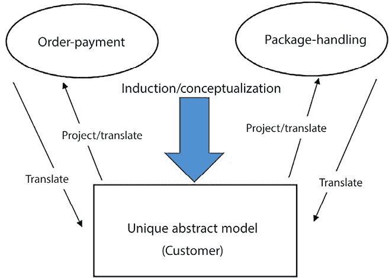
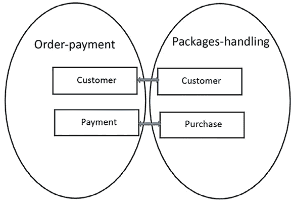
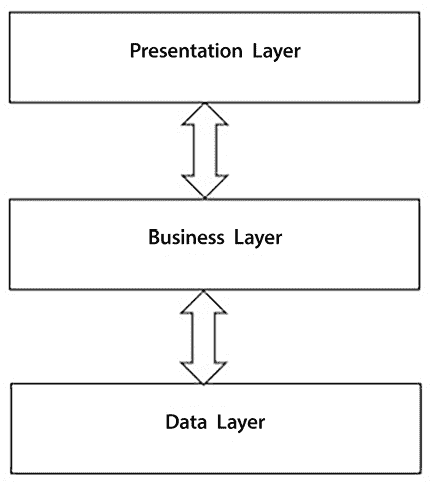
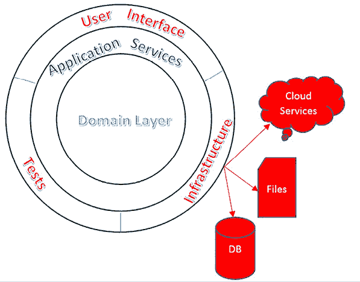
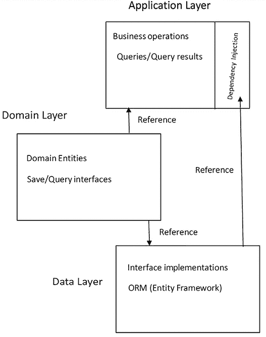
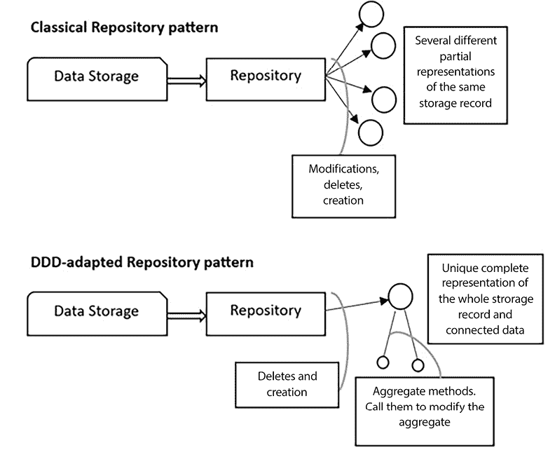
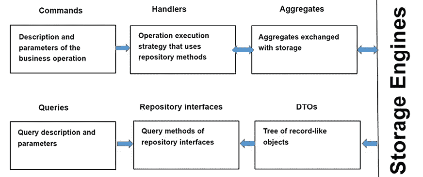

# 7

# 理解软件解决方案中的不同领域

本章致力于一种现代软件开发技术，称为**领域驱动设计**（**DDD**），它最初由埃里克·埃文斯（Eric Evans）提出（参见《领域驱动设计*》：[`www.amazon.com/exec/obidos/ASIN/0321125215/domainlanguag-20`](https://www.amazon.com/exec/obidos/ASIN/0321125215/domainlanguag-20)）。虽然 DDD 已经存在了 15 多年，但由于其解决两个重要问题的能力，它在过去几年取得了巨大的成功。

主要问题是对涉及多个知识领域的复杂系统进行建模。没有哪个专家对整个领域有深入的了解；这种知识被分散在几个人身上。第二个问题是每个专家都使用其专业领域的特定语言，因此为了专家和开发团队之间有效的沟通，对象、接口和方法必须模仿领域专家的语言。这意味着构成应用程序的不同模块必须为每个专业领域使用不同的词汇。因此，应用程序必须分割成反映不同知识领域的模块，并且处理不同知识领域的模块之间的接口必须精心设计，以执行必要的翻译。

DDD 通过将整个 CI/CD 周期分割成独立的部分，分配给不同的团队来解决这一问题。这样，每个团队只需与该领域的专家互动，就可以专注于特定的知识领域。

正是因为这个原因，领域驱动设计（DDD）的演变与微服务和 DevOps 的演变交织在一起。多亏了 DDD，大型项目可以被分割成几个开发团队，每个团队拥有不同的知识领域。项目被分割成几个团队的原因有很多，其中最常见的是团队规模以及所有成员拥有不同的技能和/或位于不同的地点。实际上，经验证明，超过 6-8 人的团队并不有效，显然，不同的技能和地点会阻碍紧密的互动。

相反，上述两个问题的重视程度在过去几年中有所增加。软件系统始终占据每个组织内部的大量空间，并且它们变得越来越复杂和地理上分散。

同时，对频繁更新的需求也在增加，以便这些复杂的软件系统可以适应快速变化的市场需求。

由于软件系统日益复杂和频繁更新的需求，我们现在面临一个常见的场景，即使用具有相关快速 CI/CD 周期的复杂软件系统，这通常需要更多的人来演进和维护它们。反过来，这创造了对适合高复杂度领域和多个松散耦合的开发团队协作的技术需求。

在本章中，我们将分析与领域驱动设计（DDD）相关的基本原则、优势和常见模式，以及如何在我们的解决方案中使用它们。

更具体地说，我们将涵盖以下主题：

+   软件领域是什么？

+   理解领域驱动设计（DDD）

+   常见的 DDD 模式和架构

让我们开始吧。

随着你阅读本书的第二部分，你可能会发现回顾这一特定章节是有益的。对这些概念进行更深入的理解可以提供新的见解并增强你的整体体验。当你以后遇到相关想法时，随时可以回到这一章节作为参考资料。

# 技术需求

本章需要免费安装所有数据库工具的 Visual Studio 2022 Community Edition 或更高版本。

本章中所有的代码片段都可以在本书相关的 GitHub 仓库中找到：[`github.com/PacktPublishing/Software-Architecture-with-C-Sharp-12-and-.NET-8-4E`](https://github.com/PacktPublishing/Software-Architecture-with-C-Sharp-12-and-.NET-8-4E)。

# 软件领域是什么？

如同我们在*第二章*，*非功能性需求*，和*第三章*，*需求管理*中讨论的那样，从领域专家到开发团队的知识转移在软件设计中起着根本的作用。开发者试图用领域专家和利益相关者也能理解的语言与专家沟通并描述他们的解决方案。然而，在组织的各个部分，同一个词可能有不同的含义，而在不同的背景下，看似相同的概念实体可能有完全不同的形态。

例如，在我们的 WWTravelClub 用例中，订单支付和包裹处理子系统为顾客使用完全不同的模型。订单支付子系统通过支付方式、货币、银行账户和信用卡来表征顾客，而包裹处理则更关注访问过的地点和/或购买过的包裹、用户的偏好以及他们的地理位置。此外，虽然订单支付使用我们可能粗略定义为**银行语言**的语言来指代各种概念，但包裹处理使用的是典型的旅行社/运营商语言。

应对这些差异的经典方式是使用一个独特的抽象实体，称为**客户**，它映射到两个不同的视图——订单-支付视图和包裹处理视图。每个投影操作都会从**客户**抽象实体中提取一些操作和属性，并更改它们的名称。由于领域专家只给我们提供投影视图，因此作为系统设计师，我们的主要任务是创建一个概念模型，可以解释所有这些视图。以下图表显示了如何处理不同的视图：



图 7.1：创建一个独特的模型

经典方法的主要优势是我们有一个独特且一致的数据域表示。如果这个概念模型构建成功，所有操作都将有一个正式的定义和目的，整个抽象将是对整个组织工作方式的合理化，可能突出和纠正错误，并简化一些程序。

然而，这种方法的缺点是什么？

当软件旨在服务于整个组织的一个小部分，或者当软件自动化的数据流比例足够小的时候，新单体数据模型的快速采用在小型组织中可能产生可接受的影响。然而，如果软件成为复杂、地理上分布的组织的主干，那么急剧的变化变得不可接受和不可行。一方面，大型结构化公司需要快速应对市场变化，但另一方面，由于组织复杂性，只有渐进式变化是可行的。因此，为了适应市场，它们组织和信息系统所需的变化必须是渐进的。反过来，只有当旧数据模型可以与新数据模型共存，并且组织的各个组成部分被允许以自己的速度改变——也就是说，如果组织的各个部分可以独立于其他部分发展时，这种渐进式过渡才是可能的。

此外，随着软件系统复杂性的增加，其他几个问题使得经典架构的独特数据模型难以维护：

+   **一致性问题**：由于我们无法在将这些任务分解成更小、松散耦合的任务时保留复杂性，因此达到唯一一致的数据视图变得更加困难。

+   **更新困难**：随着复杂性的增加，需要频繁的系统更改，但更新和维护一个独特的全局模型相当困难。此外，由于系统小部分更改引入的 bug/错误可能会通过唯一共享的模型传播到整个组织。

+   **团队组织问题**：系统建模必须在几个团队之间分配，并且只能将松散耦合的任务分配给不同的团队；如果两个任务强耦合，它们需要分配给同一个团队。

+   **并行性问题**：正如我们将在*第十一章*，*将微服务架构应用于您的企业应用程序*中更详细地讨论的那样，转向基于微服务的架构通常使得单一数据库的瓶颈不可接受。

+   **语言问题**：随着系统的增长，我们需要与更多的领域专家进行沟通，每位专家说不同的语言，并且对数据模型有不同的看法。因此，我们需要将我们独特模型的特点和操作翻译成更多语言，以便与他们沟通。

随着系统的增长，处理具有数百/数千个字段且投影到较小视图的记录变得越来越低效。这种低效源于数据库引擎处理具有多个字段的较大记录的方式不高效（内存碎片化、太多相关索引的问题等）。然而，主要的不效率发生在**对象关系映射**（ORMs）和业务层，它们被迫在其更新操作中处理这些大记录。实际上，虽然查询操作通常只需要从存储引擎检索的几个字段，但更新和业务处理涉及整个实体。ORMs 在*第十三章*，*在 C#中使用 Entity Framework Core 与数据交互*中详细描述。

随着数据存储子系统中的流量增长，我们需要在所有数据操作中实现读取和更新/写入并行性。正如我们将在*第十二章*，*在云中选择您的数据存储*中发现的那样，虽然读取并行性可以通过数据复制轻松实现，但写入并行性需要分片；也就是说，将数据库记录分布在几个分布式数据库中，而分片一个唯一、紧密连接的数据模型是困难的。

这些问题是领域驱动设计（DDD）在过去几年中取得成功的原因，因为它们代表了更复杂的软件系统，这些系统成为了整个组织的支柱。DDD 的基本原则将在下一节中详细讨论。

# 理解领域驱动设计（DDD）

根据 DDD，我们不应该构建一个独特的领域模型，该模型在每个应用程序子系统中的不同视图中投影。相反，整个应用程序领域被分割成更小的领域，每个领域都有自己的数据模型。这些独立的领域被称为**边界上下文**。每个边界上下文的特点是专家使用的语言，并用于命名所有领域概念和操作。

因此，每个边界上下文定义了一种由专家和开发团队共同使用的通用语言，称为**通用语言**。不再需要翻译，如果开发团队使用 C#接口作为其代码的基础，领域专家能够理解和验证它们，因为所有操作和属性都使用专家使用的相同语言表达。

在这里，我们正在摒弃一个繁琐的唯一抽象模型，但现在我们有了几个需要以某种方式关联的独立模型。DDD 建议我们如下处理所有这些独立模型（即所有边界上下文）：

+   **每当语言术语的含义发生变化时，我们需要添加边界上下文的边界**。例如，在 WWTravelClub 用例中，订单-付款和包处理属于不同的边界上下文，因为它们给“客户”这个词赋予了不同的含义。

+   **我们需要显式地表示边界上下文之间的关系**。不同的开发团队可能在不同边界上下文中工作，但每个团队都必须对其正在工作的边界上下文与其他所有模型之间的关系有一个清晰的了解。因此，这些关系在一个独特的文档中表示，并与每个团队共享。

+   **我们需要确保所有边界上下文与 CI 保持一致**。会议被组织和简化系统原型被构建，以便验证所有边界上下文是否协调一致地发展——也就是说，所有边界上下文都可以集成到期望的应用行为中。

下一个图显示了我们在上一节中讨论的 WWTravelClub 示例在采用 DDD 后的变化：



图 7.2：DDD 边界上下文之间的关系

每个边界上下文的客户实体之间存在关系，而包处理边界上下文的购买实体与付款相关。在各个边界上下文中识别映射到彼此的实体是正式定义表示上下文之间所有可能通信的接口的第一步。

例如，在上一个图中，由于付款是在购买之后进行的，我们可以推断出订单-付款的边界上下文必须有一个为特定客户创建付款的操作。在这个领域，如果新客户不存在，则会创建新客户。

付款创建操作是在购买后立即触发的。由于在购买商品后还会触发更多操作，我们可以使用我们在第六章“设计模式和.NET 8 实现”中解释的发布/订阅模式来实现与购买事件相关的所有通信。在 DDD 中，这些被称为**领域事件**。使用事件来实现边界上下文之间的通信非常常见，因为它有助于保持边界上下文松散耦合。

一旦在边界上下文接口中定义的事件或操作的实例跨越了边界，它立即被翻译成接收上下文的通用语言。在输入数据开始与其他领域实体交互之前执行这种翻译是很重要的，以防止接收领域通用语言被额外的上下文术语污染。通常，不充分的翻译会导致领域专家抱怨“奇怪的词语”。

每个边界上下文实现必须包含一个完全用边界上下文通用语言（类和接口名称以及属性和方法名称）表达的领域模型，没有任何其他边界上下文通用语言的污染，也没有技术编程内容的污染。这是确保与领域专家良好沟通并确保将领域规则正确翻译成代码，以便领域专家可以轻松验证的必要条件。

当通信语言与目标通用语言之间存在强烈不匹配时，会在接收边界上下文边界添加一个反腐败层。这个反腐败层的唯一目的是执行语言翻译。

## 边界上下文之间的关系

包含所有边界上下文表示、边界上下文相互关系和接口定义的文档称为**上下文图**。上下文之间的关系包含组织约束，指定在不同边界上下文上工作的团队之间所需合作类型。这些关系不约束边界上下文接口，但会影响它们在软件 CI/CD 周期中的演变方式。它们代表了团队合作模式。

最常见的模式如下：

+   **合作伙伴**：这是埃里克·埃文斯最初提出的模式。其想法是两个团队在交付上相互依赖。换句话说，他们在软件开发生命周期中共同决定边界上下文的相互通信规范。

+   **客户/供应商开发团队**：在这种情况下，一个团队充当客户，另一个团队充当供应商。在初步阶段，两个团队定义边界上下文客户侧的接口和一些自动化验收测试来验证它。之后，供应商可以独立工作。

    当客户的边界上下文是唯一的活动部分，调用其他边界上下文公开的接口方法时，这种模式是有效的。这对于订单-支付和包装处理上下文之间的交互来说是足够的，其中订单-支付作为供应商，因为它的功能从属于包装处理的需求。当这种模式可以应用时，它将两个边界上下文的实现和维护完全解耦。

+   **从众者**：这与客户/供应商模式类似，但在此情况下，客户方接受由供应商方强加的接口，而没有初步的谈判阶段。这种模式对其他模式没有提供任何优势，但有时我们被迫处于该模式所描述的情况，因为供应商的边界上下文是在一个无法过多配置/修改的现有产品中实现的，或者因为它是一个我们不希望修改的遗留子系统。

值得指出的是，边界上下文的分离只有在结果边界上下文松散耦合时才是有效的；否则，通过将整个系统分解成部分而获得的复杂性降低将被协调和通信过程的复杂性所淹没。

然而，如果边界上下文是根据语言标准定义的——也就是说，每当通用语言发生变化时，就添加边界上下文边界——这实际上应该是这种情况。事实上，由于组织各个部分的松散交互，可能会出现不同的语言，因为每个部分内部紧密交互的程度越高，与其他部分的松散交互越少，每个部分最终定义和使用的内部语言就越多，这与其他部分使用的语言不同。

此外，由于所有的人类组织只是通过演变成为松散耦合的子部分而成长，同样，复杂的软件系统也可以像松散耦合的子模块的合作一样实现：这是人类能够应对复杂性的唯一方式。从这个意义上说，我们可以得出结论，复杂组织/人工系统总是可以被分解成松散耦合的子部分。我们只需要理解“如何”做到这一点。

除了我们之前提到的基本原理之外，领域驱动设计（DDD）提供了一些基本原语来描述每个边界上下文，以及一些实现模式。虽然边界上下文原语是 DDD 的一个组成部分，但这些模式只是我们在实现中可以使用的有用启发式方法，因此，一旦我们选择采用 DDD，在某些或所有边界上下文中使用这些模式并不是强制性的。

在下一节中，我们将描述边界上下文原语，而各种模式将在本章的剩余部分进行描述。

## 实体

DDD 实体代表具有明确身份的领域对象，以及定义在其上的所有操作。它们与其他更经典的方法的实体差异不大。

主要区别在于，DDD 强调实体的面向对象特性，而其他方法主要将它们用作**记录**，其属性可以在没有太多约束的情况下写入/更新。

另一方面，DDD 强制实施强 SOLID 原则，以确保只有某些信息被封装在它们内部，并且只有某些信息可以从外部访问，以规定允许对它们执行的操作，并设置适用于它们的业务级验证标准。

换句话说，DDD 实体比基于记录的方法的实体更丰富。

在基于记录的方法中，操作实体是在代表业务和/或领域操作的类中定义的，这些操作在实体外部。在 DDD 中，这些操作被移动到实体定义中，作为它们的类方法。这样做的原因是这种方法提供了更好的模块化，并将相关的软件块保持在同一位置，以便可以轻松维护和测试。

关于基于记录的方法和 DDD 方法的区别的更多细节将在本章的*存储库模式*小节中给出。

同样出于这个原因，针对每个实体的特定业务验证规则被移动到 DDD 实体内部。DDD 实体验证规则是业务级规则，因此它们不应与数据库完整性规则或用户输入验证规则混淆。它们通过编码所表示对象必须遵守的约束，有助于实体表示领域对象。

例如，在网页上提供实体属性“送货地址”可能是强制性的（用户输入验证规则），尽管通常属性不是强制性的（没有相应的业务验证规则）。事实上，“送货地址”属性只有在需要发货时才是强制性的，所以如果网页的上下文是关于发货的，那么“送货地址”必须在该特定网页中作为用户输入是强制性的，但不是作为一般业务规则。

用户输入验证将在*第十七章*中更详细地讨论，*展示 ASP.NET Core*，它将实际展示用户输入验证和业务验证具有不同的和补充的目的。虽然业务级验证规则编码了领域规则，但输入验证规则强制执行每个单个输入的格式（字符串长度、正确的电子邮件和 URL 格式等），确保提供了所有必要的输入，强制执行所选的用户机器交互协议，并提供快速和即时的反馈，引导用户与系统交互。

值得注意的是，并非所有业务验证规则都可以编码在 DDD 实体内部。不特定于单个 DDD 实体但涉及多个实体交互的业务规则必须编码在处理和协调实体间交互的软件模块中。我们将在本章后面更详细地讨论协调实体交互的软件模块。

下一个子节将提供更多关于实体级验证规则的详细信息。

### .NET 中的实体级验证

在.NET 中，可以使用以下技术之一执行业务验证：

+   在所有修改实体的类方法中调用验证方法。

+   将验证方法连接到所有属性设置器。

+   使用自定义验证属性装饰类及其属性，并在每次修改实体时调用`System.ComponentModel.DataAnnotations.Validator`类的`TryValidateObject`静态方法。.NET 的`System.ComponentModel.DataAnnotations`命名空间包含预定义的验证属性（见[`learn.microsoft.com/en-us/aspnet/core/mvc/models/validation?view=aspnetcore-8.0#built-in-attributes`](https://learn.microsoft.com/en-us/aspnet/core/mvc/models/validation?view=aspnetcore-8.0#built-in-attributes)），但开发者也可以通过从`System.ComponentModel.DataAnnotations.ValidationAttribute`抽象类继承来定义自定义验证属性（见[`makolyte.com/aspnetcore-create-a-custom-model-validation-attribute/`](https://makolyte.com/aspnetcore-create-a-custom-model-validation-attribute/)）。

关于验证属性的更多细节将在第十七章“展示 ASP.NET Core”中给出。

一旦检测到验证错误，就必须以某种方式处理；也就是说，必须中止当前操作，并将错误报告给适当的错误处理器。处理验证错误的最简单方法是通过抛出异常。这样，两个目的都很容易实现，我们可以选择在哪里拦截和处理它们。不幸的是，正如我们在第二章“非功能性需求”的“在 C#编程时需要考虑的性能问题”部分中讨论的那样，异常意味着巨大的性能损失，并且必须仅用于处理“异常情况”，因此，通常需要考虑不同的选项。在正常流程中处理错误会破坏模块化，因为需要在导致错误的整个方法堆栈中传播处理错误所需的代码，并且在整个代码中都有一个无限的条件集。因此，需要更复杂的选择。

异常的一个好替代方案是将错误通知给每个处理请求的独特错误处理器。例如，它可以在依赖注入引擎中实现为一个作用域服务。由于作用域，在处理每个请求时返回相同的服务实例，这样控制整个调用堆栈执行的处理器可以在控制流返回时检查可能出现的错误，并适当地处理它们。不幸的是，这种复杂的技巧不能自动中止操作的执行并立即返回到调用堆栈中最合适的控制处理器。

这就是为什么尽管存在性能问题，异常通常用于这种情况。另一种选择是使用**结果对象**，在所有方法调用中通知调用者操作的成功。然而，结果对象有其缺点：它们在调用堆栈中涉及的方法之间引入了更多的耦合，因此在软件维护期间，每次更改可能都需要修改多个方法。

### .NET 中的 DDD 实体

由于 DDD 实体必须有一个明确定义的身份，它们必须具有作为主键的属性。通常，所有 DDD 实体都会覆盖`Object.Equals`方法，使得当两个对象具有相同的主键时，它们被认为是相等的。这可以通过让所有实体继承自一个抽象的`Entity`类来实现，如下面的代码所示：

```cs
public abstract class Entity<K>: IEntity<K>
{

    public virtual K Id { get; protected set; }
    public bool IsTransient()
    {
        return Object.Equals(Id, default(K));
    }
    public override bool Equals(object obj)
    {
        return obj is Entity<K> entity &&
          Equals(entity);
    }
    public bool Equals(IEntity<K>? other)
    {
        if (other == null ||
            other.IsTransient() || this.IsTransient())
            return false;
        return Object.Equals(Id, other.Id);
    }
    int? _requestedHashCode;
    public override int GetHashCode()
    {
        if (!IsTransient())
        {
            if (!_requestedHashCode.HasValue)
                _requestedHashCode = HashCode.Combine(Id);
            return _requestedHashCode.Value;
        }
        else
return base.GetHashCode();
    }
    public static bool operator ==(Entity<K> left, Entity<K> right)
    {
        if (Object.Equals(left, null))
            return Object.Equals(right, null);
        return left.Equals(right);
    }
    public static bool operator !=(Entity<K> left, Entity<K> right)
    {
        return !(left == right);
    }
} 
```

在代码中注意以下事项：

+   值得实现一个`IEntity<K>`接口，该接口定义了`Entity<K>`的所有属性/方法。当我们需要在接口后面隐藏数据类时，这个接口很有用。

+   `IsTransient`谓词在实体最近被创建且尚未记录在永久存储中时返回`true`，因此其主键仍然是未定义的。

+   在.NET 中，当您覆盖一个类的`Object.Equals`方法时，也覆盖其`Object.GetHashCode`方法是一个好的实践，这样类实例可以高效地存储在字典和集合等数据结构中。这就是为什么`Entity`类覆盖了它。

+   值得指出的是，一旦我们在`Entity`类中重新定义了`Object.Equals`方法，我们也可以覆盖`==`和`!=`运算符。

实体不是 DDD 的唯一数据成分。领域建模还要求具有无唯一标识的数据。这就是为什么提出了值对象。

## 值对象

与实体不同，值对象代表无法用数字或字符串编码的复杂类型。因此，它们没有标识符和主键。它们上没有定义操作，且是不可变的；也就是说，一旦它们被创建，所有字段都可以读取但不能修改。因此，它们通常使用具有受保护的/私有设置器的属性的类进行编码。

当所有独立属性都相等时，两个值对象被认为是相等的。有些属性不是独立的，因为它们只是以其他属性以不同的方式编码的数据的展示，例如`DateTime`的刻度和其日期和时间字段的表示。

由于所有`record`类型自动重写`Equals`方法以执行属性逐个比较，因此值对象可以用 C# 12 的`record`类型轻松实现。通过适当地定义它们的属性，记录类型也可以被定义为不可变的；一旦不可变对象被初始化，唯一改变其值的方法是创建一个新的实例。以下是如何修改`record`的一个示例：

```cs
var modifiedAddress = myAddress with {Street = "new street"} 
```

下面是如何定义`record`的一个示例：

```cs
public record Address
{
   public string Country {get; init;}
   public string Town {get; init;}
   public string Street {get; init;}
} 
```

`init`关键字使得`record`类型属性不可变，因为它意味着它们只能被初始化。

如果我们通过构造函数传递所有属性而不是使用初始化器，前面的定义可以简化如下：

```cs
public record Address(string Country, string Town, string Street) ; 
```

典型的值对象包括以数字和货币符号表示的成本、以经纬度表示的位置、地址和联系信息。

实体和值对象通常在.NET 应用程序中与数据存储交互的方式在*第十三章*中解释，即*在 C#中使用 Entity Framework Core 与数据交互*。

## 聚合

到目前为止，我们讨论了实体作为由基于 DDD 的业务层处理的**单元**。然而，几个实体可以被操作并合并成单个实体。一个例子是采购订单及其所有项目。实际上，独立于所属订单处理单个订单项是完全不合理的。这是因为订单项实际上是订单的子部分，而不是独立的实体。

没有任何交易可以单独影响一个订单项而不影响该订单项所在的订单。想象一下，同一家公司的两个不同的人试图增加水泥的总数量，但一个人增加了 1 型水泥（项目 1）的数量，而另一个人增加了 2 型水泥（项目 2）的数量。如果每个项目都被当作一个独立的实体来处理，这两个数量都会增加，这可能会导致一个不连贯的采购订单，因为水泥的总数量会被增加两次。

另一方面，如果整个订单及其所有订单项由两个人在每次交易中一起加载和保存，那么其中一个人将覆盖另一个人的更改，因此最后做出更改的人将设置他们的要求。

一个采购订单及其所有子部分（其订单项）被称为**聚合**，而订单实体被称为聚合的**根**。由于聚合是由子部分关系连接的实体层次结构，因此它们总是有根。

由于每个聚合代表一个单独的复杂实体，因此对其进行的所有操作都必须通过一个唯一的接口来暴露。因此，聚合根通常代表整个聚合，对聚合的所有操作都定义为根实体的方法。

当使用聚合模式时，在业务层和数据层之间传输的信息单元被称为聚合、查询和查询结果。因此，聚合取代了单个实体。

简而言之，聚合是存储信息的内存表示，需要作为一个单一对象来处理。作为一个基于面向对象范式的内存表示，它们充分利用了面向对象编程的所有好处。

## 领域事件

领域事件是 DDD 的主要通信成分。虽然 DDD 不对边界上下文之间通信的方式施加约束，但基于第六章、*设计模式和 .NET 8 实现* 中描述的发布/订阅模式进行的通信，最大化了边界上下文之间的独立性。每个边界上下文发布所有可能引起其他边界上下文兴趣的信息，感兴趣的边界上下文进行订阅。这样，发布者不需要了解每个订阅者及其工作方式，只需以通用格式发布其工作的结果。更多实现细节将在本章的 *命令处理器和领域事件* 子节中给出。

# 常见的 DDD 模式和架构

在本节和随后的章节中，我们将描述一些与 DDD 常用的模式和架构。其中一些可以在所有项目中采用，而其他一些则只能用于某些边界上下文。

在我们开始之前，我们应该注意，从概念上讲，每个应用程序的功能可以划分为三个组：

+   处理与用户的交互

+   执行与业务相关的处理

+   与存储引擎交互

上述每个组都使用不同的语言和技术。第一个组使用目标用户的语言和用户界面技术，第二个组使用领域专家的语言，专注于应用领域建模，第三个组则使用与数据库相关的语言和技术。

我们将要查看的每个架构都以不同的方式组织这些功能。我们将从经典的分层架构开始，因为它更容易理解，然后我们将描述更复杂的洋葱架构。

## 经典分层架构

经典分层架构将三个功能组组织为三个松散耦合的类/接口集合，称为 **层**，依次排列：

+   序列中的第一层负责用户交互，被称为 **表示层**。

+   序列中的第二层是执行与业务相关的处理的那一层，被称为**业务层**。

+   第三层是专门用于数据库交互的层，被称为**数据层**。

每一层可以直接与其前一层和后一层进行通信，如图下所示：



图 7.3：经典层架构

每个层调用都可以将数据传递给下一层的公共对象的方法，并接收返回的结果数据。

表示层不仅处理图形，还处理整个用户-机器交互协议。在其交互协议中，表示层使用业务层方法向用户展示数据或更新应用程序状态。

反过来，业务层使用数据层方法从数据存储中检索所有需要准备用户答案的数据，并更新应用程序状态。

每一层都向其前一层提供一个定义良好的接口，同时隐藏所有实现细节。

层架构促进了模块化，因为每一层不依赖于其前一层的实现方式，并避免了每种层使用的语言污染其他层使用的语言的可能性。

然而，在经典层架构中交换的数据是记录类型对象，没有包含任何处理逻辑的方法，因为整个处理逻辑都包含在组成三个层的对象和方法中。

由于经典层架构中使用的记录类型对象与 DDD 领域对象非常不同，DDD 领域对象是丰富的对象，其方法中包含了大部分业务逻辑，因此经典层架构与 DDD 不匹配。这就是为什么提出了对经典层架构的改进，称为洋葱架构。

## 洋葱架构

在洋葱架构中，层遵循不同的规则，并以稍微不同的方式定义。有：

+   最外层负责处理与应用程序环境的所有交互——即用户界面、测试软件以及与操作系统和数据存储的交互。

+   应用层

+   领域层

在这里，领域层是基于通用语言的经典数据层的抽象。它是定义 DDD 实体和值对象以及检索和保存它们操作抽象的地方。为了更好的模块化，所有或某些领域层类可以被设置为内部类，并隐藏在公共接口后面。

相反，应用层定义了使用领域层公共接口（公共接口和公共类）来获取 DDD 实体和值对象，并操纵它们以实现应用业务逻辑的操作。由于它通过一个完全独立于最外层的 API 公开其功能，DDD 应用层被称为**应用服务层**。这样，例如，任何用户界面层和测试套件都调用完全相同的方法来与应用逻辑交互。

最外层包含用户界面、功能测试套件（如果有）以及与托管应用程序的基础设施的应用程序接口。

基础设施代表了应用程序运行的环境，包括操作系统、任何设备、文件系统服务、云服务和数据库。基础设施接口放置在最外层，以确保没有其他洋葱层依赖于它。这最大化了可用性和可修改性。

基础设施层包含适应其环境的所有驱动程序。基础设施资源通过这些驱动程序与应用程序通信，而驱动程序则通过与其相关的接口将基础设施资源暴露给所有应用程序层，这些接口与在依赖注入引擎中实现它们的驱动程序相关联。这样，将应用程序适应不同的环境只需更改驱动程序即可。

下面是洋葱架构的草图：



图 7.4：洋葱架构

每个环代表一个层。从最外层向内是**应用服务层**，从应用服务层向内是**领域层**，它包含了在边界上下文中涉及到的实体的表示。

应用服务层和领域层都可以分为子层，并且所有层/子层都必须遵守以下规则：*每一层只能依赖于内部层*。

例如，领域层可以分成**领域模型**和**领域服务**，其中领域模型位于领域服务之下。*领域模型*层包含代表所有领域对象的类和接口，而*领域服务*层包含所谓的存储库，这些存储库在本章的*存储库模式*和*工作单元模式*部分中进行了说明。

正如我们将在本章后面看到的那样，通常通过在单独的库中定义并在域层中实现的接口与域层进行交互。因此，域层必须引用包含所有域层接口的库，因为它必须实现这些接口，而应用层则是每个域层接口通过应用层依赖注入引擎的记录与其实现连接的地方。更具体地说，应用层引用的唯一数据层对象是这些仅在依赖注入引擎中引用的接口实现。

实现下一内层定义的接口的外层是洋葱架构中常用的模式。

每个应用层操作都需要从依赖引擎中获取它需要的接口，使用它们来获取 DDD 实体和值对象，操作它们，并通过相同的接口可能保存它们。

下面是一个图表，展示了本节中讨论的三个层之间的关系：



图 7.5：层之间的关系

因此，域层包含域对象的表示、在它们上使用的函数、验证约束以及域层与各种实体之间的关系。为了增加模块化和解耦，实体之间的通信通常使用事件编码——即使用**发布者/订阅者模式**。这意味着实体更新可以触发已连接到业务操作的事件，并且这些事件作用于其他实体。

这种分层架构使我们能够在不影响域层的情况下更改整个数据层，域层仅依赖于域规范和语言，而不依赖于数据处理的详细技术细节。

应用层包含所有可能影响多个实体的操作定义以及所有应用程序需要的查询定义。业务操作和查询都使用在域层中定义的接口与数据层进行交互。

然而，虽然业务操作通过这些接口操纵和交换实体，但查询向它们发送查询规范并从它们那里接收通用的**数据传输对象**（**DTOs**）。实际上，查询的目的只是向用户展示数据，而不是对它们进行操作；因此，查询操作不需要包含所有方法、属性和验证规则的完整实体，而只需要属性元组。

业务操作可以通过其他层（通常是表示层）或通过通信操作来调用。

总结来说，应用层在域层定义的接口上操作，而不是直接与它们的数据层实现交互，这意味着应用层与数据层解耦。更具体地说，数据层对象仅在依赖注入引擎定义中提及。所有其他应用层组件都引用在域层中定义的接口，而依赖注入引擎注入适当的实现。

应用层通过以下一个或多个模式与其他应用组件通信：

+   **它在一个通信端点上公开业务操作和查询**，例如 HTTP Web API（见*第十五章*，*使用.NET 应用服务架构*）。在这种情况下，表示层可以连接到该端点或连接到其他端点，这些端点反过来又从该端点和其他端点获取信息。从多个端点收集信息并在唯一端点公开这些信息的应用组件称为**网关**。它们可以是定制的，也可以是通用目的的，例如 Ocelot。

+   **它被应用程序作为库引用，该应用程序直接实现表示层**，例如 ASP.NET Core MVC Web 应用程序。

+   **它不会通过端点公开所有信息，而是将处理/创建的一些数据通信给其他应用组件，而这些组件反过来又公开端点**。这种通信通常使用发布者/订阅者模式来实现，以增加模块化。

## 仓储模式

仓储模式是一种以实体为中心的方法来定义域层接口：每个实体——或者更好，每个聚合——都有自己的仓储接口，该接口定义了如何检索和创建它，并定义了涉及聚合中实体的所有查询。每个仓储接口的实现称为仓储。由于，如*聚合*子节所述，聚合代表了在每次数据操作中考虑的最小粒度，因此仓储与聚合相关联，而不是与实体相关联。

使用仓储模式，每个操作都有一个易于找到的地方来定义它：操作所操作的聚合的接口，或者，在查询的情况下，包含查询根实体的聚合。

仓储模式最初是为经典层架构及其记录样式的对象而设计的。然后，它被修改以与丰富的 DDD 实体/聚合一起工作。

经典存储库包含处理记录对象所需的所有方法——即修改、创建和删除方法，因为记录对象没有修改方法。而适应 DDD 的存储库则只包含创建和删除方法，因为所有修改每个聚合的方法都被定义为聚合方法。此外，基于经典存储库和记录对象的应用程序没有唯一代表每个领域聚合的记录对象，而是有多个记录对象，每个对象包含对整体领域聚合的不同视图。因此，经典存储库为多个不同的记录对象提供了修改方法。

经典和 DDD 适应的存储库都有方法检索要返回给用户的数据。在两种情况下，这些数据都由记录对象表示，因为聚合仅在领域实体必须修改或创建时才构建。

下面的图示总结了经典和 DDD 适应的存储库模式之间的差异。



图 7.6：经典和 DDD 适应的存储库模式

### 工作单元模式

虽然将事务限制在单个聚合设计边界内是首选的，但有时应用层事务可能跨越多个聚合，因此可能使用多个不同的存储库接口。

例如，购买旅行同时涉及以下实体的修改：

+   酒店/旅行可用场所

+   客户购物篮

这两个操作必须在单个事务中完成，因为要么它们都成功，要么它们都必须失败。因此，我们需要一种方式在单个事务中执行对多个实体/聚合的操作，同时根据面向对象编程的最佳实践保持涉及实体的方法/代码解耦。

**工作单元**模式是一种解决方案，它保持了领域层与底层领域层实现的独立性。它指出，每个存储库接口还必须包含对工作单元接口的引用，该接口代表当前事务的标识。这意味着具有相同工作单元引用的多个存储库属于同一事务。

工作单元模式可以与聚合和记录对象一起使用。

存储库和工作单元模式都可以通过定义一些种子接口来实现。

```cs
public interface IUnitOfWork
{
    Task<bool> SaveEntitiesAsync();
    Task StartAsync();
    Task CommitAsync();
    Task RollbackAsync();
}
public interface IRepository<T>: IRepository
{
   IUnitOfWork UnitOfWork { get; }
} 
```

所有存储库接口都继承自 `IRepository<T>` 并将 `T` 绑定到它们关联的聚合根或实体，而工作单元（Unit of Work）仅实现 `IUnitOfWork`。当调用 `SaveEntitiesAsync()` 时，所有对聚合或记录类对象进行的挂起修改、删除和创建都在存储引擎中作为一个事务保存。如果需要更广泛的交易，该交易在从存储引擎检索某些数据时启动，必须由应用程序层处理程序启动并提交/回滚，该处理程序通过 `IUnitOfWork` 的 `StartAsync`、`CommitAsync` 和 `RollbackAsync` 方法负责整个操作。`IRepository<T>` 从一个空的 `IRepository` 接口继承，以帮助自动存储库发现。

与本书相关的 GitHub 存储库包含一个 `RepositoryExtensions` 类，该类的 `AddAllRepositories` `IServiceCollection` 扩展方法自动发现一个程序集中包含的所有存储库实现，并将它们添加到依赖注入引擎中。

### 经典存储库模式与 DDD 聚合对比

到目前为止讨论的 DDD 模式，如聚合和 DDD 适配的存储库，确保了模块化和可修改性，并且由于整个领域聚合被加载到内存中，它们还防止了由于错误的局部更新而产生的各种类型的错误。然而，每次添加新功能都相当繁琐，因为它通常涉及复杂建模活动、整个聚合的重构或创建，以及定义几个类。

一方面，记录类对象更容易定义，我们可以为不同的用途定义不同的类。因此，添加新的功能只需定义一个独立的存储库方法，可能还需要定义一个新的记录类。

假设我们只需要维护旅行描述和特性。这是一个非常简单的领域，我们只需要执行 CRUD 操作——即创建和删除旅行以及修改它们的特性。在这种情况下，将整个聚合加载到内存中并作为唯一实体类的方法执行所有操作没有优势。

另一方面，使用经典的存储库模式，我们可以仅加载要修改的旅行的特性，例如在网页上的营销优化描述、在其他页面上的价格（在这些页面上，用户是具有决定价格权力的管理员）等等。这样，每个操作都使用一个特定且针对该操作优化的不同对象。

假设我们现在正在为工业应用设计一个复杂的资源分配软件。每个实体的所有属性都受复杂业务规则的约束，而且几个实体也受几个复杂业务规则的约束。因此，对少数几个属性的局部更新会产生影响，这些影响会传播到整个实体和其他相关实体。

在这种情况下，每个经典的仓储方法都不得不考虑每个属性变化的所有可能后果，从而导致复杂的乱糟糟的代码，并在不同的仓储方法中多次重新编码相同的操作。

在这种情况下，DDD 方法表现得更好。我们将涉及的完整聚合体加载到内存中，并让它们的方法在面向对象最佳实践的辅助下处理业务规则复杂性。每个聚合体只需要编码它所代表的真实世界对象的行为了，无需关心对其他实体的影响。

总结来说，当一个边界上下文非常简单，意味着只有少数实体以及它们之间的一些交互和一些不同的更新操作时，毫无疑问，经典的仓储模式更加方便。另一方面，当存在许多实体或复杂实体，并且添加了许多不同的更新操作时，仓储会变成一团糟的代码，有多个部分重叠的方法、代码重复，以及没有易于理解的交互规则。

在*第二十一章，案例研究*的*一个前端微服务*部分给出了一个展示 DDD 适配的仓储模式的完整示例，而在同一章节的*使用客户端技术*部分给出了一个展示经典仓储模式的完整示例。

此外，正如已经指出的那样，由多个记录投影的领域聚合体执行的局部更新可能会由于不同用户同时进行的修改而导致错误。

因此，当由于复杂的更新模式，类似错误的概率变得很高时，使用经典的仓储模式是非常危险的。

因此，再次强调，复杂性是我们使用 DDD 模式的主要驱动力。此外，需要集中触发用于同步边界上下文数据存储的领域事件（回顾之前的*理解领域驱动设计*部分），这迫使整个聚合体加载到内存中，并使用 DDD 模式。因此，当一个边界上下文需要在复杂情况下触发多个领域事件时，我们不能使用更简单的经典仓储模式。

现在我们已经讨论了 DDD 的基本模式，我们可以讨论一些更高级的 DDD 模式。在下一节中，我们将介绍 CQRS 模式。

## 命令查询责任分离（CQRS）模式

在其一般形式中，使用这个模式相当简单：*使用不同的结构来存储/更新和查询数据*。在这里，关于如何存储和更新数据的要求与查询的要求不同。这意味着查询和存储/更新操作的领域层和应用服务必须以完全不同的方式设计。

在 DDD 的情况下，存储的单位是聚合，因此添加、删除和更新涉及聚合。另一方面，与存储/更新不同，查询不执行业务操作，而是涉及从几个聚合（投影、求和、平均值等）中提取的属性的转换。

因此，虽然更新需要包含业务逻辑和约束（方法、验证规则、封装的信息等）的实体，但查询结果只需要属性/值对的集合，因此只有公共属性而没有方法的 DTOs 工作得很好。

在其常见形式中，该模式可以描述如下：



图 7.7：命令和查询处理

其中：

+   中间的框（处理器和存储库接口）代表操作。

+   最左侧和最右侧的框代表数据。

+   箭头简单地表示数据的方向。

从这个角度来看，查询结果的提取不需要通过实体的构建和聚合，但查询中显示的字段必须从存储引擎中提取并投影到临时的 DTOs 中。

然而，在更复杂的情况下，CQRS 可能以更强的形式实现。具体来说，我们可以使用不同的边界上下文来存储预处理的查询结果。

实际上，另一种选择是一个聚合器微服务，它查询所有必要的微服务以组装每个查询结果。然而，对其他微服务的递归调用以构建答案可能会导致不可接受的响应时间。此外，提取一些预处理确保更好地使用可用资源。

该模式如下实现：

+   查询处理委托给分离和专业的组件。

+   每个查询处理组件为其必须处理的每个查询使用一个数据库表。在那里，它存储查询将返回的所有字段。这意味着查询不是在每次请求时计算，而是在特定的数据库表中预先计算并存储。显然，具有子集合的查询需要额外的表，每个子集合一个。

+   所有处理更新的组件都将所有更改转发给感兴趣的查询处理组件。记录是分版本的，以便接收更改的查询处理组件可以按照正确的顺序将其应用于其查询处理表。实际上，由于通信是异步的以提高性能，更改的接收顺序可能不会与发送顺序相同。

+   接收到的每个查询处理微服务的更改在等待更改应用时被缓存。每当一个更改的版本号紧跟最后一个已应用的更改时，它就被应用到正确的查询处理表中。

值得注意的是，我们上面提到的“软件组件”作为独立进程在不同的机器上运行，被称为微服务。它们将在*第十一章*，*将微服务架构应用于您的企业应用*中详细讨论。

这种更强大的 CQRS 模式的使用将典型的本地数据库事务转换为复杂且耗时的分布式事务，因为单个查询预处理微服务中的失败应该使整个事务无效。正如我们将在*第十一章*，*将微服务架构应用于您的企业应用*中讨论的那样，出于性能原因，通常不接受实现分布式事务，有时甚至不支持，因此常见的解决方案是放弃数据库立即整体一致性的想法，并接受整体数据库将在每次更新后最终一致。

可以通过重试策略解决瞬态故障，我们将在*第十一章*，*将微服务架构应用于您的企业应用*中讨论这一点，而永久性故障则通过在已提交的本地事务上执行纠正操作来处理，而不是假装实现一个整体的全局分布式事务。

在这一点上，你可能会有以下疑问：

*“为什么我们一旦有了所有预处理的查询结果，还需要保留原始数据？我们永远不会用它来回答查询！”*

这个问题的部分答案如下：

+   它们是我们可能需要从失败中恢复的真相来源。

+   当我们添加新的查询时，我们需要它们来计算新的预处理结果。

+   我们需要它们来处理新的更新。实际上，处理更新通常需要从数据库中检索一些数据，可能展示给用户，然后进行修改。

例如，要修改现有采购订单中的项目，我们需要整个订单，以便我们可以展示给用户并计算更改，以便我们可以将其转发到其他微服务。此外，无论何时我们在存储引擎中修改或添加数据，我们都必须验证整个数据库的一致性（唯一键约束、外键约束等）。

下一个子节将专门讨论 CQRS 模式的极端实现。

## 事件溯源

事件溯源是 CQRS 更强形式的一种更高级的实现。当原始的边界上下文是**真相来源**——即用于从故障中恢复和进行软件维护时，它非常有用。在这种情况下，我们不是更新数据，而是简单地添加描述已执行操作的**事件**，例如*删除记录 ID 15*，*将 ID 21 中的名称更改为 John*，等等。这些事件立即发送到所有依赖的边界上下文，在出现故障和/或添加新查询的情况下，我们只需要重新处理其中的一些。出于性能考虑，除了表示所有更改的事件外，当前状态也被维护；否则，每次需要时，都需要重新计算，回放所有事件。此外，通常在每进行，比如说，*N*次更改之后，将完整状态缓存起来。这样，如果发生崩溃或任何类型的故障，只需要回放少量事件。

如果事件是**幂等的**——也就是说，处理相同的事件多次与处理一次具有相同的效果，那么回放事件不会引起问题。

正如我们将在*第十一章*中讨论的，*将微服务架构应用于您的企业应用程序*，幂等性是微服务通过事件通信的标准要求。

在下一节中，我们将描述一个用于处理跨越多个聚合和多个边界上下文的操作的常见模式。

## 命令处理器和聚合事件

根据命令模式，每个应用领域操作都由一个所谓的命令处理器处理。由于每个命令处理器编码了一个单一的应用领域操作，因此其所有操作都必须在同一个事务中完成，因为操作必须作为一个整体成功或失败。命令处理器通过调用聚合和存储库方法来完成其工作。然而，某些操作可能由聚合内部的状态变化触发，因此不能由命令处理器调用，而必须依赖于某种形式的直接聚合到聚合的通信。

为了保持聚合分离，通常，聚合之间以及与其他边界上下文之间的通信是通过事件完成的。我们已经在*领域事件*子节中讨论了用于与其他边界上下文通信的领域事件。然而，聚合之间的直接通信也可以利用发布/订阅模式来保持代码更模块化和易于修改。在处理每个聚合时，将触发的事件全部存储起来，而不是立即执行它们，以防止事件执行干扰正在进行的聚合处理，这是一种良好的实践。这可以通过向本章*实体*子节中定义的抽象`Entity`类添加以下代码轻松实现，如下所示：

```cs
public List<IEventNotification> DomainEvents { get; private set; }
public void AddDomainEvent(IEventNotification evt)
{
    DomainEvents ??= new List<IEventNotification>();
    DomainEvents.Add(evt);
}
public void RemoveDomainEvent(IEventNotification evt)
{
    DomainEvents?.Remove(evt);
} 
```

在这里，`IEventNotification`是一个空接口，用于标记作为事件的类。

事件处理通常在更改存储在存储引擎之前立即执行。因此，执行事件处理的好地方是在命令处理程序调用每个 `IUnitOfWork` 实现的 `SaveEntitiesAsync()` 方法之前（参见 *Repository 模式* 子节）。同样，如果事件处理程序可以创建其他事件，它们必须在处理完所有聚合之后处理它们。

事件 `T` 的订阅可以提供为 `IEventHandler<T>` 接口的实现：

```cs
public interface IEventHandler<T>: IEventHandler
where T: IEventNotification
{
    Task HandleAsync(T ev);
} 
```

类似地，命令模式通过一个 `command` 对象实现，该对象包含应用程序域操作的所有输入数据，而实现实际操作的实际代码可以通过一个实现 `ICommandHandler<T>` 接口的命令处理程序提供：

```cs
public interface ICommandHandler<T>: ICommandHandler
where T: ICommand
{
    Task HandleAsync(T command);
} 
```

在这里，`ICommand` 是一个空接口，用于标记类为命令。`ICommandHandler<T>` 和 `IEventHandler<T>` 是我们在 *第六章*，*设计模式和 .NET 8 实现* 中描述的 **命令模式** 的示例。

每个 `ICommandHandler<T>` 都可以在依赖注入引擎中注册，这样需要执行命令 `T` 的类就可以在其构造函数中使用 `ICommandHandler<T>`。这样，我们就将命令的抽象定义（实现 `ICommand` 的类）与其执行方式解耦。

同样的构造方法不能应用于事件 `T` 和它们的 `IEventHandler<T>`，因为当一个事件被触发时，我们需要检索几个 `IEventHandler<T>` 的实例，而不仅仅是其中一个。我们需要这样做，因为每个事件可能有多个订阅。然而，几行代码就可以轻松解决这个问题。首先，我们需要定义一个类，它为给定的事件类型托管所有处理程序：

```cs
public class EventTrigger<T>
    where T: IEventNotification
{
    private IEnumerable<IEventHandler<T>> handlers;
    public EventTrigger(IEnumerable<IEventHandler<T>> handlers)
    {
        this.handlers = handlers;
    }
    public async Task Trigger(T ev)
    {
        foreach (var handler in handlers)
            await handler.HandleAsync(ev);
    }
} 
```

在 `EventTrigger<T>` 构造函数中声明一个 `handlers` `IEnumerable<IEventHandler<T>>` 参数，允许 .NET 依赖注入引擎将依赖注入容器中可用的所有 `IEventHandler<T>` 实现传递给这个 `handlers` 参数。

想法是，每个需要触发事件 `T` 的类都需要 `EventTrigger<T>`，然后将要触发的事件传递给它的 `Trigger` 方法，该方法反过来调用所有处理程序。

然后，我们需要在依赖注入引擎中注册 `EventTrigger<T>`。一个好主意是定义我们可以调用的依赖注入扩展，以声明每个事件，如下所示：

```cs
 service.AddEventHandler<MyEventType, MyHandlerType>() 
```

这个 `AddEventHandler` 扩展必须自动生成 `EventTrigger<T>` 的依赖注入定义，并且必须处理每个类型 `T` 声明为 `AddEventHandler` 的所有处理程序。

以下扩展类为我们做了这件事：

```cs
public static class EventDIExtensions
{
    public static IServiceCollection AddEventHandler<T, H>
        (this IServiceCollection services)
 where T : IEventNotification
 where H: class, IEventHandler<T>
    {
        services.AddScoped<H>();
        services.TryAddScoped(typeof(EventTrigger<>));
        return services;
    }
    ...
    ...
} 
```

传递给 `AddEventHandler` 的 `H` 类型被记录在依赖注入引擎中，当第一次调用 `AddEventHandler` 时，`EventTrigger<T>` 也会添加到依赖注入引擎中。然后，当依赖注入引擎需要 `EventTrigger<T>` 实例时，所有添加到依赖注入引擎中的 `IEventHandler<T>` 类型都会被创建、收集并传递给 `EventTrigger(IEnumerable<IEventHandler<T>> handlers)` 构造函数。

当程序启动时，所有 `ICommandHandler<T>` 和 `IEventHandler<T>` 的实现都可以通过反射自动检索并注册。为了帮助自动发现，它们继承自 `ICommandHandler` 和 `IEventHandler`，这两个接口都是空的。

《这本书的 GitHub 仓库》中提供的 `EventDIExtensions` 类包含用于自动发现和注册命令处理程序和事件处理程序的方法。GitHub 仓库还包含一个 `IEventMediator` 接口及其 `EventMediator` 实现，其 `TriggerEvents(IEnumerable<IEventNotification> events)` 方法从依赖注入引擎检索与其参数中接收的事件关联的所有处理程序并执行它们。只要将 `IEventMediator` 注入到类中，就可以触发事件。`EventDIExtensions` 还包含一个扩展方法，用于发现实现空 `IQuery` 接口的所有查询并将它们添加到依赖注入引擎。

`MediatR` NuGet 包提供了一个更复杂的实现。

# 摘要

在本章中，我们分析了采用 DDD 的主要原因以及为什么以及如何满足市场需求。我们描述了如何识别领域以及如何使用领域图协调同一应用程序不同领域工作的团队。然后，我们分析了 DDD 如何使用实体、值对象和聚合来表示数据，并提供建议和代码片段，以便我们可以在实践中实现它们。

我们还描述了在基于 DDD 的项目中经常使用的洋葱架构，并将其与经典分层架构进行了比较。

我们还介绍了一些与 DDD 一起使用的典型模式——即仓库和单元工作模式、领域事件模式、CQRS 和事件溯源。然后，我们学习了如何在实践中实现它们。我们还展示了如何使用解耦处理实现领域事件和命令模式，以便我们可以将代码片段添加到现实世界的项目中。

# 问题

1.  什么提供了主要的提示，以便我们可以发现领域边界？

1.  用于协调独立边界上下文开发的主要工具是什么？

1.  是否每个组成聚合的条目都使用自己的方法与系统的其余部分进行通信？

1.  为什么只有一个聚合根？

1.  一个聚合可以管理多少个仓库？

1.  仓库如何与应用层交互？

1.  为什么需要工作单元模式？

1.  CQRS 轻量级形式的原因是什么？其最强形式的原因又是什么？

1.  主要允许我们将命令/领域事件与其处理程序耦合的工具是什么？

1.  事件溯源是否可以用来实现任何有界上下文？

# 进一步阅读

+   Eric Evans, 领域驱动设计: [`www.amazon.com/exec/obidos/ASIN/0321125215/domainlanguag-20`](https://www.amazon.com/exec/obidos/ASIN/0321125215/domainlanguag-20)

+   更多关于 DDD 的资源可以在以下链接找到：[`domainlanguage.com/ddd/`](https://domainlanguage.com/ddd/)

+   可以在这里找到对 CQRS 设计原则的详细讨论：[`udidahan.com/2009/12/09/clarified-cqrs/`](http://udidahan.com/2009/12/09/clarified-cqrs/)

+   更多关于 MediatR 的信息可以在 MediatR 的 GitHub 仓库中找到：[`github.com/jbogard/MediatR`](https://github.com/jbogard/MediatR)

+   在以下由 Martin Fowler 撰写的博客文章中可以看到事件溯源的良好描述及其示例：[`martinfowler.com/eaaDev/EventSourcing.html`](https://martinfowler.com/eaaDev/EventSourcing.html)

# 在 Discord 上了解更多

要加入这本书的 Discord 社区——在那里您可以分享反馈、向作者提问，并了解新版本——请扫描下面的二维码：

[`packt.link/SoftwareArchitectureCSharp12Dotnet8`](https://packt.link/SoftwareArchitectureCSharp12Dotnet8)


