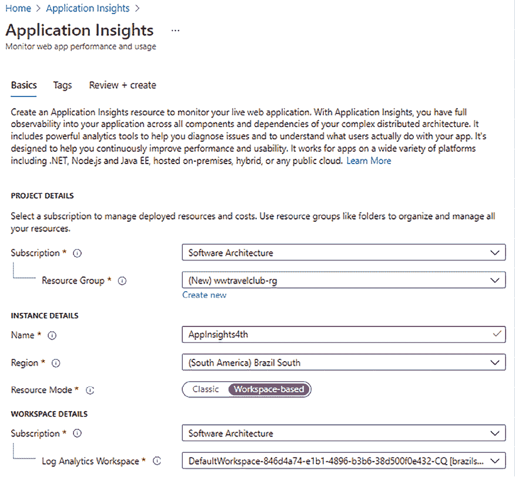
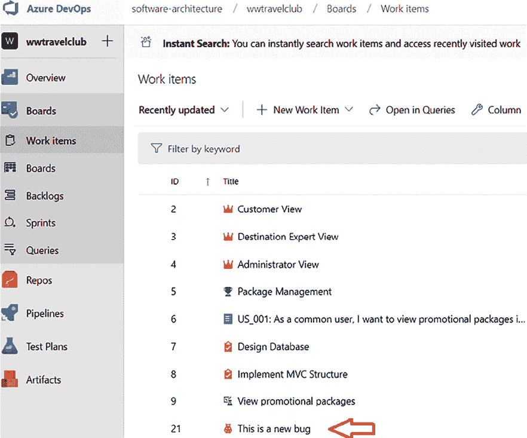

# 8

# 理解 DevOps 原则和 CI/CD

尽管许多人将 DevOps 定义为一种流程，但当你与它一起工作时，你会更好地理解它是一种哲学。本章将涵盖你需要开发和使用 DevOps 来交付软件的主要概念、原则和工具。

通过考虑 DevOps 哲学，本章将重点关注**服务设计思维**，即牢记你设计的软件是提供给组织或组织的一部分的服务。这种方法的核心理念是，最高优先级是软件为目标组织带来的价值。此外，你不仅提供可工作的代码和修复错误的协议，还提供满足软件构思的所有需求的解决方案。换句话说，你的工作包括满足这些需求所需的一切，例如监控用户满意度，并在用户需求因问题或新要求而变化时快速调整软件。

服务设计思维与**软件即服务**（**SaaS**）模型紧密相连，这在第十章“选择最佳云解决方案”中有讨论。事实上，提供基于 Web 服务的解决方案最简单的方法是提供 Web 服务的使用作为一项服务，而不是销售实现它们的软件。

**持续集成**（**CI**）和**持续交付**（**CD**）有时被列为 DevOps 的先决条件。因此，本章的目的也是讨论如何在实际场景中启用 CI/CD，考虑到作为软件架构师，你需要应对的挑战。

本章将涵盖以下主题：

+   理解 DevOps 原则：CI、CD 和持续反馈

+   理解如何使用 Azure DevOps 和 GitHub 实现 DevOps

+   理解使用 CI/CD 时的风险和挑战

在第二十一章“案例研究”中介绍的`WWTravelClub`项目案例将在这些主题中讨论，这将为你提供了解 DevOps 哲学如何实施的机会。所有展示 DevOps 原则的截图都来自本书的主要用例，因此你将能够轻松理解 DevOps 原则。

到本章结束时，你将能够根据服务设计思维原则设计软件，并使用 Azure Pipelines 部署你的应用程序。你将能够决定是否在你的项目环境中使用 CI/CD。此外，你将能够定义成功使用此方法所需的工具。

# 技术要求

本章需要 Visual Studio 2022 Community Edition 或更高版本，并安装所有 Azure 工具。你可能还需要一个 Azure DevOps 账户，如第三章*管理需求*中所述。还需要一个免费的 Azure 账户。如果你还没有创建一个，第一章*理解软件架构的重要性*中的*创建 Azure 账户*小节解释了如何创建。本章使用与第九章*测试你的企业应用*相同的代码。

# 描述 DevOps

DevOps 是一个由单词*开发（Development）*和*运维（Operations）*组合而成的术语，DevOps 过程简单地将这两个领域的行动统一起来。然而，当你开始更深入地了解它时，你会意识到仅仅连接这两个领域是不够的，无法实现这种哲学的真正目标。

我们也可以说，DevOps 是满足人们对软件交付当前需求的过程。

Donovan Brown 对 DevOps 有一个精彩的定义：*DevOps 是将人员、流程和产品结合在一起，以实现向最终用户持续交付价值的过程* ([`donovanbrown.com/post/what-is-devops`](http://donovanbrown.com/post/what-is-devops))。

使用流程、人员和产品持续地向我们的最终用户交付价值：这是对 DevOps 哲学的最佳描述。我们需要开发和交付面向客户的软件。一旦公司的所有领域都明白关键点是最终用户，作为软件架构师的你，任务就是展示将促进交付过程的技术。

本书中的所有内容都与这种方法相关联。这从来不是仅仅知道一堆工具和技术的问题。作为一名软件架构师，你必须明白，总有办法轻松地将更快解决方案带给最终用户，并与他们的实际需求相联系。因此，你需要学习 DevOps 原则，这些原则将在本章中讨论。

# 理解 DevOps 原则

将 DevOps 视为一种哲学，有一些原则使得这个过程在你的团队中能够良好地运作。这些原则是**持续集成（CI**）、**持续部署（CD**）和**持续反馈**。

微软有一个专门的网页来定义 DevOps 概述、文化、实践、工具及其与云的关系。请在此查看：[`azure.microsoft.com/en-us/overview/what-is-devops/`](https://azure.microsoft.com/en-us/overview/what-is-devops/)。

在许多书籍和技术文章中，DevOps 被表示为无限符号。这代表了在软件开发生命周期中持续方法的必要性。在这个过程中，你需要计划、构建、持续集成、部署、运营、获取反馈，然后从头开始。这个过程必须是协作的，因为每个人都有相同的焦点——为最终用户提供价值。与这些原则一起，“作为一名软件架构师”，你需要决定最适合这种方法的最佳软件开发流程。我们在*第一章*，*理解软件架构的重要性*中讨论了这些流程。

## CI

当你开始构建企业级解决方案时，协作是更快完成任务和满足用户需求的关键。正如我们在*第四章*，*C#编码最佳实践 12*中讨论的那样，版本控制系统对于这个过程至关重要，但这些工具并不能自行完成任务，尤其是如果它们没有良好配置的话。

作为一名软件架构师，你必须知道**持续集成（CI**）将帮助你采用具体的软件开发协作方法。当你实施它时，一旦开发者提交代码，主代码就会根据项目中的单元测试和功能测试自动编译和测试。

当你应用 CI 时，好处是你可以激励开发者尽可能快地合并他们的更改，以最小化合并冲突。他们还可以共享单元测试，这将提高软件的质量。这将使你的主分支在每次团队提交后都稳定且安全。

CI 的关键点是能够更快地识别问题。当你允许代码被他人测试和分析时，你将有机会这样做。DevOps 方法唯一能帮助的就是确保这一切尽可能快地发生。

## CD

一旦你的应用程序的每个提交都构建完成，并且这段代码已经通过单元测试和功能测试进行测试，你可能还想要启用**持续交付（CD**）。这样做不仅仅是配置工具的问题。作为一名软件架构师，你需要确保团队和流程已经准备好进入这一步。

持续交付的方法需要保证在每次新部署时生产环境的安全。为此，采用多阶段管道是一个很好的实践。

下面的屏幕截图展示了使用本书用例**WWTravelClub**作为演示的常见阶段的方法：


图 8.1：使用 Azure DevOps 的发布阶段

正如你所见，这些阶段是使用 Azure DevOps 发布管道配置的，这将在稍后解释。每个阶段都有自己的目的，这最终会影响交付产品的质量。让我们看看这些阶段：

+   **开发/测试**：这个阶段由开发人员和测试人员用来构建新功能。这个环境肯定会是暴露于错误和不完整功能最多的环境。

+   **预发布环境**：这个环境向与开发和测试无关的团队区域提供新功能的一个简短版本。项目经理、市场营销、供应商和其他人可以使用它作为研究、验证甚至预生产的区域。此外，质量保证团队可以确保新发布正确部署，考虑到功能和基础设施。

+   **生产环境**：这是客户运行解决方案的阶段。根据 CD 的观点，一个良好的生产环境的目标是尽可能快地更新。频率将根据团队规模而变化，但有一些方法，这个过程一天内会发生多次以上。

采用这三个部署应用阶段将积极影响解决方案的质量。它还将使团队能够拥有更安全的部署流程，风险更少，产品稳定性更好。这种做法一开始可能看起来有点昂贵，但如果没有它，不良部署的结果通常会比这个投资更昂贵。

## 使用 CI/CD 时的风险和挑战

既然我们已经了解了 CI/CD 的有用性，那么考虑在实施过程中可能遇到的风险和挑战将是个不错的选择。本节的目标是帮助你们作为软件架构师，通过良好的流程和技术来降低风险，找到克服挑战的更好方法。

本节将讨论的风险和挑战列表如下：

+   持续生产部署

+   生产环境中的不完整功能

+   测试中的不稳定解决方案

一旦你有了处理它们的技术和流程，就没有理由不使用 CI/CD。

记住，DevOps 并不依赖于 CI/CD。你可以使用一个基于人类操作的过程，其中代码集成和软件部署都是人工完成的。然而，CI/CD 确实可以使 DevOps 的工作更加顺畅。

现在，让我们来看看它们。

### 禁用持续生产部署

持续生产部署是一个过程，在该过程中，在提交新代码片段和一些管道步骤之后，您将在**生产**环境中拥有这段代码。这并非不可能，但很难且成本高昂。此外，您需要拥有良好建立、复杂的流程，以及一个经验丰富、专业知识丰富的团队来实现它。问题是，您在网上找到的大多数演示和示例都会展示 CI/CD 的快速部署路径。CI/CD 的演示使其看起来如此简单！这种**简单性**可能会让您认为应该尽快实施它。然而，如果您再思考一下，如果直接部署到生产中，这种场景可能会很危险！对于需要每天 24 小时、每周 7 天都可用的问题解决方案来说，这是不切实际的。因此，您需要担心这一点，并考虑不同的解决方案。

第一个方法是使用多阶段场景，正如我们之前所描述的。多阶段场景可以为您正在构建的部署生态系统带来更多安全性。此外，您将获得更多选项来避免错误地将部署部署到生产环境中，例如预部署审批。

您可以构建一个部署管道，其中所有代码和软件结构都将由这个工具更新。然而，如果您有这个场景之外的东西，比如数据库脚本和环境配置，错误的发布到生产中可能会对最终用户造成损害。此外，何时更新生产环境需要提前规划，在许多情况下，所有平台用户都需要被告知即将到来的变更。值得一提的是，在这些难以决定的案例中，使用基于**信息技术基础设施库**（**ITIL**）或 ISO 20000 的**变更管理**程序是个好主意。

因此，将代码交付到生产的挑战将使您考虑一个计划来执行它。无论是按月、按日，甚至每次提交，这都无关紧要。关键点在于您需要创建一个过程和管道，以确保只有良好且经过批准的软件处于生产阶段。然而，值得注意的是，您部署的时间越长，它们就越可怕，因为之前部署的版本和新的版本之间的偏差会更大，并且会有更多的更改一次性推出。您能更频繁地部署，那就越好。

### 不完整的功能

当您的团队中的开发人员正在创建新功能或修复错误时，您可能会考虑创建一个分支，这意味着他们可以避免使用为 CD 设计的分支。分支可以被视为代码库中的一项功能，它允许创建一个独立的开发线路，因为它可以隔离代码。

正如您在下面的屏幕截图中所见，使用 Visual Studio 为**wwtravelclub**创建分支相当简单：


图 8.2：在 Visual Studio 中创建分支

这似乎是一个好的方法，但让我们假设开发者已经认为实现准备就绪可以部署，并且刚刚将代码合并到主分支，尽管这也被认为是一种不好的做法。如果因为这个要求被遗漏，这个功能还没有准备好怎么办？如果这个错误导致了不正确的行为呢？结果可能是带有不完整功能或错误修复的发布。

避免在主分支中出现损坏的功能甚至错误的修复，一个好的做法是使用**拉取请求**（**PRs**）。PRs 将让其他团队成员知道你开发的代码已经准备好合并。以下截图显示了如何使用 Azure DevOps WWTravelClub 存储库为你所做的更改创建一个**新的拉取请求**。


图 8.3：创建 PR

一旦创建了 PR 并定义了审阅者，每个审阅者都将能够分析代码并决定它是否足够健康，可以放入主分支。

以下截图显示了使用比较工具分析**WWTravelClub**代码更改以检查代码的方法：


图 8.4：分析 PR

一旦所有审批完成，你将能够安全地将代码合并到主分支，正如你在下面的截图中所见。要合并代码，你需要点击**完成合并**。重要的是要提到，你也可以在 Visual Studio 中这样做，它有一个更好的用户界面。如果 WWTravelClub 项目启用了 CI 触发器，正如我们将在本章中展示的，Azure DevOps 将启动一个构建管道：


图 8.5：合并 PR

没有这样的流程，主分支中很可能会有很多糟糕的代码，并且这些代码部署到那里可能会与 CD 一起造成损害。代码审查在 CI/CD 场景中是一种优秀的实践，并且通常被认为是一种创建高质量软件的绝佳实践。

你需要关注这里的挑战是确保只有完整的功能会出现在你的最终用户面前。你可以使用**功能标志**原则来解决这个问题，这是一种确保只有准备就绪的功能呈现给最终用户的技巧。

在**功能标志**或**功能切换**技术中，你必须创建一个解决方案，在每个功能中都有可能在设置中测试它，以查看它是否启用。根据这一点，所有功能都将向用户展示。

值得注意的是，为了在一个环境中控制功能可用性，功能标志比使用分支/PRs 要安全得多。两者都有其位置，但 PRs 是关于在 CI 阶段控制代码质量，而功能标志是关于在 CD 阶段控制功能可用性。

再次强调，我们不是在谈论 CI/CD 作为一个*工具*，而是在谈论一个*过程*，每次你需要为生产交付代码时都需要定义和使用。

### 一个不稳定的测试解决方案

如果你已经缓解了本节中提到的其他两种风险，你可能会发现 CI/CD 之后出现糟糕的代码是不常见的。确实，如果你在推送到最后阶段之前与多阶段场景和 PRs 一起工作，之前提出的担忧肯定会减少。但即使你应用了我们后面将要讨论的所有建议，不稳定代码的风险，尤其是在业务逻辑规则方面，仍然存在。

但有没有一种方法可以在确保新版本已准备好供利益相关者测试的同时加速发布评估？是的，有！从技术上讲，你可以这样做的方法是通过自动化单元和功能测试。这种技术在第九章“测试您的企业应用程序”中进行了更详细的解释。

然而，值得指出的是，考虑到实现这一目标所需的努力，自动化的每一个部分都是不切实际的。此外，在用户界面或业务规则变化很大的场景中，自动化的维护可能更加昂贵。尽管这是一个艰难的决定，但作为一个软件架构师，你必须始终鼓励使用自动化测试。

为了举例说明，让我们看一下以下屏幕截图，它显示了由 Azure DevOps 项目模板创建的 WWTravelClub 的单元和功能测试样本：


图 8.6：单元和功能测试项目

在第六章中介绍了一些架构模式，如 SOLID，以及一些质量保证方法，如同行评审，这些方法可以比软件测试提供更好的结果。然而，这些方法并不否定自动化实践。事实是，所有这些都将有助于获得稳定的解决方案，尤其是在你运行 CI 场景时。在这种情况下，你能做的最好的事情就是尽可能快地检测错误和不正确的行为。正如之前所展示的，单元测试和功能测试都将帮助你做到这一点。

单元测试将在部署前，在构建管道期间帮助你大量发现业务逻辑错误。例如，在以下来自 WWTravelClub 构建过程的屏幕截图，你会找到一个模拟错误，它取消了构建，因为单元测试没有通过：

由于可能存在滥用风险，Azure 上的一些免费服务可能会被停用。然而，您可以通过提交请求来选择重新激活这些服务。


图 8.7：单元测试结果

获取这个错误的方法相当简单。您需要编写一些代码，这些代码不会根据单元测试进行检查。一旦您提交它，假设您已经开启了 CD 触发器，您将在管道中构建代码。因此，在代码构建之后，单元测试将会运行。如果代码不再匹配测试，您将得到一个错误。

以下截图显示了 WWTravelClub 项目在**开发/测试**阶段的**功能测试**中出现的错误。在这个例子中，**开发/测试**环境有一个错误，功能测试迅速检测到了这个错误：


图 8.8：功能测试结果

但在 CI/CD 过程中应用功能测试的好处不止于此。让我们看看以下从 Azure DevOps 的**发布**管道界面中的截图。如果您查看**Release-9**，您会意识到，由于这个错误是在**开发/测试**环境发布之后发生的，多阶段环境将保护错误部署的其他阶段，特别是 WWTravelClub 的生产阶段：


图 8.9：多阶段环境保护

CI 过程中成功的关键点是将其视为一个有用的工具，以加速软件的交付，并且不要忘记团队始终需要为其最终用户提供价值。采用这种方法，前面提出的技巧将提供实现团队目标结果的惊人方式。

## 持续反馈

一旦您拥有在前一节描述的部署场景中运行完美的解决方案，反馈对于您的团队理解发布结果以及版本如何为顾客工作至关重要。为了获取这些反馈，有一些工具可以帮助开发者和顾客，将他们聚集在一起以加速反馈过程。

持续反馈的主要目的是让开发者能够获取有关在生产环境中运行的应用程序的信息，使团队能够改进部署的环境基础设施，同时，检测出可以在源代码和用户界面中进行的改进。

# 便于 DevOps 实施的工具

考虑到 DevOps 是一种哲学，有许多工具可以帮助您实施它。以下主题将介绍在 Microsoft 环境中使用的一些最常用的工具。

## Azure DevOps

一旦您开始使用像 Azure DevOps 这样的平台，在点击相应的选项时开启 CI/CD 将变得容易。所以技术并不是实施这一过程的阿喀琉斯之踵。

以下截图显示了使用 Azure DevOps WWTravelClub 管道开启 CI/CD 的示例，非常简单。通过点击**管道**并编辑它，您将能够设置一个触发器，在几次点击后启用 CI/CD：


图 8.10：开启 CI 触发器

CI/CD 将帮助您解决一些问题。例如，它将迫使您测试您的代码，因为您需要更快地提交更改，以便其他开发者可以使用您正在编写的代码。

相反，您不会仅仅通过在 Azure DevOps 中开启 CI 构建来执行 CI/CD。当然，您会在提交完成并且代码完整后立即开启构建的可能性，但这远不能说明您在解决方案中已经有了 CI/CD。

作为软件架构师，您需要对此多加关注的原因与对 DevOps 的真正理解有关。向最终用户提供价值始终是决定开发生命周期如何运作的好方法。因此，即使开启 CI/CD 很简单，但这一功能对您的最终用户真正产生的业务影响是什么？一旦您对这个问题的所有答案都弄清楚了，并且您知道如何降低其实施的风险，那么您就可以说您已经实施了一个 CI/CD 流程。

CI/CD 是一个原则，它将使 DevOps 工作得更好、更快。然而，如果您的流程还不够成熟以启用代码的持续交付，DevOps 可以没有它而生存。

此外，如果您在一个不够成熟以处理其复杂性的团队中开启 CI/CD，您可能会在部署解决方案时产生对 DevOps 的误解，因为您将开始承担一些风险。关键是 CI/CD 不是 DevOps 的先决条件。

当您启用了 CI/CD，您可以在 DevOps 中使事情变得更快。然而，您可以在没有它的情况下实践 DevOps。

部署和其他发布工件被添加到不同的管道中，这些管道被称为发布管道，以将它们与构建相关工件解耦。使用发布管道，您不能编辑`.yaml`文件，但您将使用图形界面进行操作，如下所示：

1.  点击左侧菜单的**发布**选项卡以创建一个新的**发布管道**。一旦点击**添加新管道**，系统会提示您添加第一个管道阶段的第一个任务。实际上，整个发布管道由不同的阶段组成，每个阶段都包含一系列任务。虽然每个阶段只是一系列任务，但阶段图可以分支，我们可以在每个阶段之后添加几个分支。这样，我们可以部署到需要不同任务的不同平台。在我们的简单示例中，我们将使用单个阶段。

1.  选择**Azure App Service 部署**任务。一旦添加此任务，系统会提示您填写缺失的信息。

1.  选择您的订阅，然后，如果出现**授权**按钮，点击它以授权 Azure Pipelines 访问您的订阅。然后，选择**Windows**作为部署平台，并最后从**应用服务名称**下拉列表中选择您创建的应用服务。在您编写任务设置时，任务设置会自动保存，因此您只需点击**保存**按钮即可保存整个管道。

1.  现在，我们需要将此管道连接到一个源工件。点击**添加工件**按钮，然后选择**构建**作为源类型，因为我们需要将新的发布管道与构建管道创建的 ZIP 文件连接起来。会出现一个设置窗口：


图 8.11：定义要发布的工件

1.  从下拉列表中选择您之前的构建管道，并将版本保留为**最新**。接受**源别名**下建议的名称。

1.  我们的发布管道已准备就绪，可以直接使用。您刚刚添加的源工件图像在其右上角有一个触发图标，如下所示：


图 8.12：准备发布的工件

1.  如果您点击触发图标，您可以选择在新构建可用时自动触发发布管道：


图 8.13：启用持续部署触发器

1.  保持禁用状态；我们可以在完成并手动测试发布管道后启用它。

如我们之前提到的，为了准备自动触发，在应用程序部署之前，我们需要添加一个人工审批任务。让我们按照以下步骤添加它：

1.  点击**阶段 1**标题右侧的三个点：


图 8.14：将人工审批添加到阶段

1.  然后，选择**添加无代理作业**。一旦添加了无代理作业，点击**添加**按钮并添加一个**手动干预**任务。以下截图显示了**手动干预**设置：

    图 8.15：配置阶段的审批

    添加操作员的说明，并在**通知用户**字段中选择您的账户。

1.  现在，使用鼠标拖动整个**无代理作业**，并将其放置在应用程序部署任务之前。它应该看起来像这样：


图 8.16：设置人工审批部署任务列表

1.  完成！点击左上角的**保存**按钮以保存管道。

现在，一切准备就绪，可以创建我们的第一个自动发布版本。为此，可以按照以下步骤准备和部署新版本：

1.  点击**创建发布**按钮以开始创建新版本，如下面的截图所示：


图 8.17：创建新版本

1.  确认**源别名**是最后一个可用的，添加**发布描述**，然后点击**创建**。在短时间内，你应该会收到一个用于发布审批的电子邮件。点击其中的链接并转到审批页面：


图 8.18：批准发布

1.  点击**批准**按钮以批准发布。等待部署完成。你应该看到所有任务都成功完成，如下面的截图所示：


图 8.19：已部署的发布

1.  你已经成功运行了第一个发布管道！

在实际项目中，发布管道将包含更多任务。实际上，应用程序（在部署到实际生产环境之前）是在**预发布环境**中部署的，在那里它们进行 beta 测试。因此，在这次首次部署之后，可能会进行一些手动测试，手动授权生产部署，以及最终的生产部署。

考虑到多阶段场景，你可以设置管道，使得只有通过定义的授权才能从一个阶段移动到另一个阶段：


图 8.20：定义预部署条件

如前一个截图所示，设置预部署条件非常简单，并且有多种选项可以自定义授权方法。这允许你细化持续交付方法，正好满足你正在处理的项目需求。

下面的截图显示了 Azure DevOps 提供的预部署审批选项。你可以定义可以批准阶段的个人，并为他们设置策略，即在进行过程之前重新验证审批者身份。作为软件架构师，你需要确定适合你使用这种方法创建的项目配置：


图 8.21：预部署审批选项

值得注意的是，尽管这种方法比单阶段部署要好得多，但 DevOps 管道会引导你，作为软件架构师，进入另一个监控阶段。稍后将要介绍的 App Insights 是这一阶段的强大工具。

## GitHub

自从 GitHub 被微软收购以来，许多功能已经演变，并提供了新的选项，增强了这个强大工具的能力。这些集成可以通过 Azure 门户进行探索，尤其是 GitHub Actions。

**GitHub Actions**是一套帮助自动化软件开发工具的工具。它能够在任何平台上启用快速的 CI/CD 服务，使用 YAML 文件来定义其工作流程。您可以将 GitHub Actions 视为微软提出的一种新方法，作为 Azure DevOps Pipelines 的替代品。您可以使用 GitHub Actions 自动化任何 GitHub 事件，GitHub Marketplace 上有数千个动作可供选择：


图 8.22：GitHub Actions

通过 GitHub Actions 界面创建构建.NET Web 应用程序的工作流程相当简单。如您在先前的屏幕截图中所见，已经创建了一些工作流程来帮助我们。

下面的 YAML 是通过在**.NET**下的**配置**选项中点击**设置此工作流程**选项生成的：

```cs
name: .NET
on:
  push:
    branches: [ main ]
  pull_request:
    branches: [ main ]
jobs:
  build:
    runs-on: ubuntu-latest
    steps:
    - uses: actions/checkout@v2
    - name: Setup .NET
      uses: actions/setup-dotnet@v1
      with:
        dotnet-version: 8.0.x
    - name: Restore dependencies
      run: dotnet restore
    - name: Build
      run: dotnet build --no-restore
    - name: Test
      run: dotnet test --no-build --verbosity normal 
```

通过以下所做的调整，它可以构建专门为这一章创建的应用程序：

```cs
name: .NET 8 Chapter 08
on:
  push:
    branches:
    - main
env:
  DOTNET_CORE_VERSION: 8.0.x
jobs:
  build:
    runs-on: ubuntu-latest
    steps:
      - uses: actions/checkout@v2
      - name: Setup .NET 8
        uses: actions/setup-dotnet@v1
        with:
          include-prerelease: True
          dotnet-version: ${{ env.DOTNET_CORE_VERSION }}
      - name: Install dependencies
        run: dotnet restore ./ch08
      - name: Build
        run: dotnet build ./ch08 --configuration Release --no-restore
      - name: Test
        run: dotnet test ./ch08 --no-restore --verbosity normal 
```

如您所见，一旦脚本更新，就可以检查工作流程的结果。如果您想的话，也可以启用 CD。这只是一个定义正确脚本的问题：


图 8.23：使用 GitHub Actions 进行简单应用程序编译

微软提供了专门涵盖 Azure 和 GitHub 集成的文档。请查看[`docs.microsoft.com/en-us/azure/developer/github`](https://docs.microsoft.com/en-us/azure/developer/github)。

作为一名软件架构师，您需要了解哪种工具最适合您的开发团队。Azure DevOps 提供了一个出色的环境来启用 CI/CD，GitHub 也是如此。关键点是，无论您选择哪种选项，一旦启用 CI/CD，您都将面临风险和挑战。让我们在下一个主题中探讨这些问题。

## 应用程序洞察

**应用程序洞察**是任何软件架构师都必须拥有的功能，以便对他们的解决方案进行持续反馈。应用程序洞察是**Azure Monitor**的一部分，这是一个更广泛的监控功能套件，还包括警报、仪表板和工作簿。一旦您将应用程序连接到它，您就开始接收对每个软件请求的反馈。这使得您不仅可以监控请求，还可以监控数据库性能、应用程序可能遇到的错误以及处理时间最长的调用。

显然，您将会有与这个工具集成到您的环境中的相关成本，但这个工具提供的功能将是值得的。值得注意的是，对于简单的应用程序，这甚至可能是免费的，因为您只需为导入的数据付费，而对于这部分数据，有一个免费配额。除了财务成本之外，您还需要了解，由于所有存储在**应用程序洞察**中的请求数据都在一个单独的线程中运行，因此性能成本非常小。

几个服务，如应用服务、函数等，将为您提供在初始创建过程中添加应用程序洞察的选项，因此您可能已经在阅读这本书的过程中创建了它。

以下截图显示了您如何轻松地在环境中创建一个工具：



图 8.24：在 Azure 中创建应用程序洞察资源

例如，假设您需要分析应用程序中耗时较长的请求。将应用程序洞察附加到您的 Web 应用的过程相当简单：您可以在设置时立即完成。如果您不确定应用程序洞察是否已为您的 Web 应用配置，您可以使用 Azure 门户进行查找。导航到**应用服务**并查看**应用程序洞察**设置，如下面的截图所示：


图 8.25：在应用服务中启用应用程序洞察

界面将为您提供创建或附加已创建的监控服务到您的 Web 应用的机会。您可以将多个 Web 应用连接到同一个**应用程序洞察**组件。

以下截图显示了如何将一个 Web 应用添加到已创建的**应用程序洞察**资源中：


图 8.26：在应用服务中启用应用洞察

一旦您为您的 Web 应用配置了应用程序洞察，您将在 App Services 中看到以下屏幕：


图 8.27：应用服务中的应用洞察

一旦它连接到您的解决方案，数据收集将连续进行，您将在组件提供的仪表板上看到结果。您可以在两个地方找到这个屏幕：

+   在您配置应用程序洞察的同一位置，在 Web 应用门户内

+   在 Azure 门户中，导航到应用程序洞察资源后


图 8.28：应用洞察在实际中的应用

此仪表板为您提供了关于失败请求、服务器响应时间和服务器请求的概览。您还可以开启可用性检查，这将从 Azure 的任何数据中心向您选择的 URL 发送请求。

Application Insights 的美在于它如何深入分析你的系统。例如，在下面的截图中，它提供了关于网站请求数量的反馈。你可以通过按处理时间较长或调用频率较高的请求对反馈进行分析。


图 8.29：使用 Application Insights 分析应用程序性能

考虑到这个视图可以以不同的方式过滤，并且你可以在你的网络应用程序中立即收到信息，这确实是一个定义持续反馈的工具。这是你可以使用 DevOps 原则来实现客户确切需求的最佳方式之一。

## 测试和反馈

在持续反馈的过程中，另一个有用的工具是**测试和反馈**工具，由微软设计，旨在帮助产品所有者和质量保证用户分析新功能的过程。

使用 Azure DevOps，你可以通过在每个工作项内部选择一个选项来向你的团队请求反馈，如下面的截图所示：


图 8.30：使用 Azure DevOps 请求反馈

一旦有人收到反馈请求，他们可以使用**测试和反馈**工具来分析和向团队提供正确的反馈。他们可以将工具连接到你的 Azure DevOps 项目，在分析反馈请求的同时提供更多功能。

你可以从[`marketplace.visualstudio.com/items?itemName=ms.vss-exploratorytesting-web`](https://marketplace.visualstudio.com/items?itemName=ms.vss-exploratorytesting-web)下载此工具。

这个工具是一个需要在使用前安装的网页浏览器扩展。下面的截图显示了如何为**测试和反馈**工具设置 Azure DevOps 项目 URL：


图 8.31：将测试和反馈连接到 Azure DevOps 组织

工具非常简单。你可以截图、记录一个过程，甚至做笔记。下面的截图显示了如何在截图内轻松地写消息：


图 8.32：使用测试和反馈工具提供反馈

好处在于你可以在会话时间线中记录所有这些分析。正如你在下一个截图中所看到的，你可以在同一个会话中拥有多个反馈项，这对分析过程很有帮助：


图 8.33：使用测试和反馈工具提供反馈

一旦你完成了分析并且连接到 Azure DevOps，你将能够报告一个错误（如下面的截图所示），创建一个任务，甚至开始一个新的测试案例：


图 8.34：在 Azure DevOps 中打开一个错误

可以在 Azure DevOps 的**工作项**板上检查创建的错误的后果。值得一提的是，你不需要 Azure DevOps 开发者许可证就可以访问这个环境区域。这使得你，作为软件架构师，能够将这个基本而有用的工具与尽可能多的解决方案关键用户共享。

以下截图显示了将工具连接到你的 Azure DevOps 项目后创建的错误：



图 8.35：Azure DevOps 中新的报告错误

拥有这样一个工具来获取你项目的好反馈是很重要的。但是，作为一名软件架构师，你可能需要找到最佳解决方案来加速反馈过程。

# 摘要

在本章中，我们了解到 DevOps 不仅是一系列技术和工具的组合，用于持续交付软件，而且是一种哲学，旨在使你正在开发的项目的最终用户能够持续获得价值。

考虑到这种方法，我们看到了 CI/CD 和持续反馈对于 DevOps 目标的重要性。我们还看到了 Azure、Azure DevOps、GitHub 和 Microsoft 工具如何帮助你实现目标。

本章还涵盖了在软件开发生命周期中何时可以启用 CI/CD 的重要性，考虑到一旦你决定将其用于你的解决方案，作为软件架构师你将面临的风险和挑战。

此外，本章介绍了一些可以使此过程更简单的解决方案和概念，例如多阶段环境、PR 审查、功能标志、同行评审和自动化测试。理解这些技术和流程将使你能够在 DevOps 场景中引导你的项目朝着更安全的行为发展，进行 CI/CD。

我们还描述了*服务设计思维*原则。现在，你应该能够分析这些方法对于一个组织的影响，你应该能够调整现有的软件开发流程和硬件/软件架构，以利用它们提供的机会。

我们还解释了软件周期自动化、云硬件基础设施配置和应用程序部署的自动化需求和技术。

一旦你实现了所展示的示例，你应该能够使用 Azure Pipelines 来自动化基础设施配置和应用程序部署。本章以 WWTravelClub 为例阐述了这种方法，在 Azure DevOps 内部实现 CI/CD，并使用 Application Insights 和测试与反馈工具进行技术和功能反馈。在现实生活中，这些工具将使你能够更快地了解你正在开发的系统的当前行为，因为你将对其有持续的反馈。

在下一章中，我们将看到软件测试自动化的工作方式。

# 问题

1.  什么是 DevOps？

1.  什么是持续集成（CI）？

1.  什么是持续交付（CD）？

1.  没有 CI/CD 可以实施 DevOps 吗？

1.  在一个不成熟的团队中启用 CI/CD 有哪些风险？

1.  多阶段环境如何帮助 CI/CD？

1.  自动化测试如何帮助 CI/CD？

1.  PRs 如何帮助 CI/CD？

1.  PRs 是否仅与 CI/CD 一起工作？

1.  什么是持续反馈？

1.  构建和发布管道之间的区别是什么？

1.  在 DevOps 方法中，Application Insights 的主要目的是什么？

1.  测试和反馈工具如何帮助 DevOps 流程？

1.  服务设计思维的主要目标是什么？

1.  适用于整个应用程序生命周期自动化的首选 Azure 工具是什么？

# 在 Discord 上了解更多

要加入这本书的 Discord 社区——在那里您可以分享反馈、向作者提问，并了解新版本——请扫描下面的二维码：

[`packt.link/SoftwareArchitectureCSharp12Dotnet8`](https://packt.link/SoftwareArchitectureCSharp12Dotnet8)


