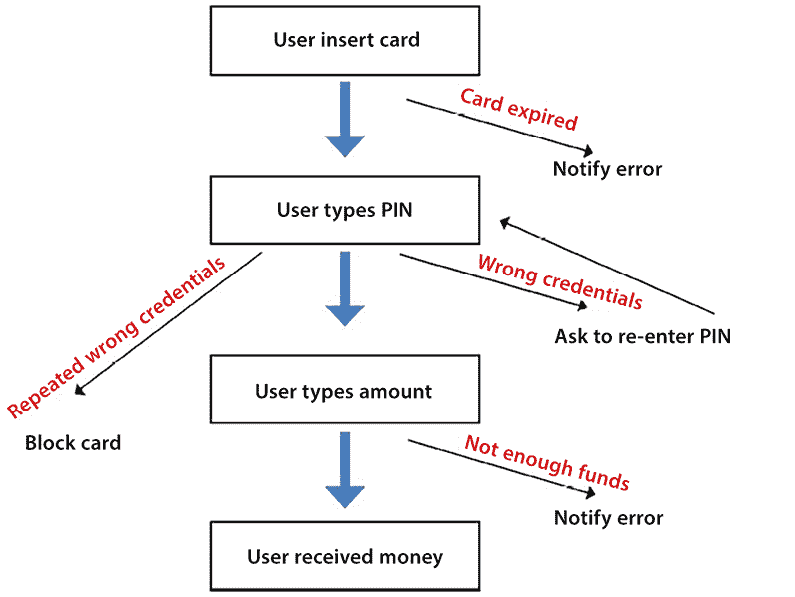
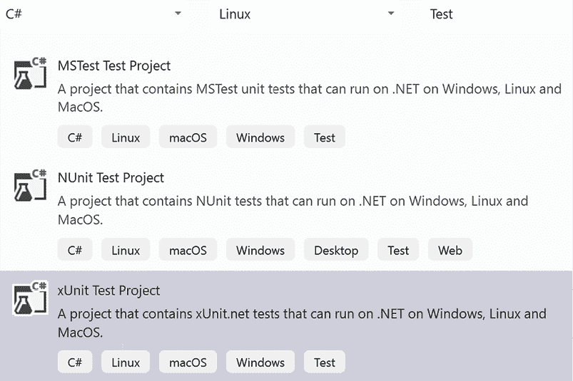
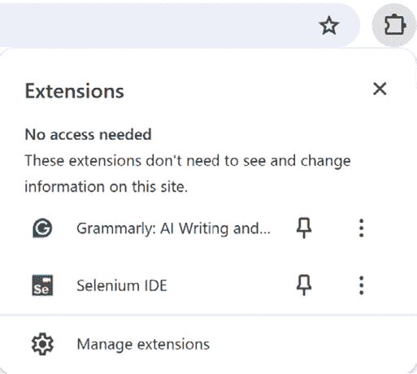

# 测试您的企业应用程序

在开发软件时，确保应用程序尽可能没有错误并满足所有要求是至关重要的。这可以通过在开发过程中测试所有模块或在整体应用程序完全或部分实现后进行测试来实现。在今天的敏捷和 DevOps 驱动的软件开发环境中，这种需求变得越来越迫切，因为在开发过程的每个阶段集成测试对于可靠软件的持续交付至关重要。

虽然本章涵盖的大部分关键概念适用于广泛的应用程序和环境，但本章重点介绍 C#和.NET 环境中企业级应用程序的必要测试策略。

手动执行所有测试不是一个可行的选择，因为大多数测试必须在每次修改应用程序时执行，正如本书中所述，现代软件是持续修改以适应快速变化市场的需求。因此，在今天的快速开发环境中，自动化测试是必不可少的。

本章讨论了交付可靠软件所需的最常见测试类型以及如何组织和自动化它们。更具体地说，本章涵盖了以下主题：

+   理解单元测试和集成测试及其用法，它们是确保软件可靠性和稳定性的主要工具

+   理解**测试驱动开发**（**TDD**）的基本原理以及它如何以及为什么可以显著降低未发现错误的概率

+   功能测试，这是强制执行软件规范的主要工具

+   在 Visual Studio 中定义 C#测试特定项目以充分利用.NET 生态系统中可用的测试工具

+   自动化 C#中的功能测试

本章不仅将教你不同类型的测试及其实现方法，还将教你如何有效地将这些技术应用于你的.NET 软件架构师角色，以构建健壮、可扩展的企业应用程序。

# 技术要求

本章需要 Visual Studio 2022 免费社区版或更高版本，并安装所有数据库工具。本章的代码可在[`github.com/PacktPublishing/Software-Architecture-with-C-Sharp-12-and-.NET-8-4E`](https://github.com/PacktPublishing/Software-Architecture-with-C-Sharp-12-and-.NET-8-4E)找到。

# 理解单元测试和集成测试

测试是软件开发的一个基本组成部分，因为它验证软件是否无错误以及是否符合约定的规范。在应用程序的大部分功能完全实现后立即进行应用程序测试的做法必须避免，以下是一些原因：

+   如果一个类或模块设计或实现不当，它可能已经影响了其他模块的实现方式。因此，在这个阶段，修复问题可能代价非常高。

+   需要测试所有可能执行路径的输入组合数量会随着测试的模块或类的数量呈指数增长。例如，如果一个类方法 `A` 的执行可以采取三条不同的路径，而另一个方法 `B` 的执行可以采取四条路径，那么同时测试 `A` 和 `B` 就需要 3 x 4 种不同的输入。一般来说，如果我们一起测试几个模块，需要测试的总路径数是每个模块测试路径数的乘积。如果模块分别测试，所需的输入数量只是测试每个模块所需路径的总和。这就是为什么所谓的单元测试会在每个类设计完成后立即以详尽的方式分别验证每个类方法。之后，可以通过接受的小数量所谓的 *集成测试* 来验证整体行为的正确性，因为集成测试只需要验证各种类的交互模式，而不需要分析所有方法的执行路径。

+   如果一个由 *N* 个模块组成的聚合体测试失败，那么在 *N* 个模块中定位错误源头通常是一个非常耗时的活动。

+   当一起测试 *N* 个模块时，我们必须重新定义涉及 *N* 个模块的所有测试，即使应用程序生命周期中只有一个 *N* 个模块发生变化。

这些考虑表明，我们需要尽快分别测试每个类方法，并且还需要测试正确的模块集成。

正因如此，测试被组织成三个阶段，如下所示：

+   **单元测试**：这些测试验证每个方法的所有或几乎所有执行路径的行为是否正常。它们应该没有外部依赖，例如存储和数据库，并且应该相当完整；也就是说，它们应该覆盖大多数可能的路径。这通常在可接受的时间成本内是可行的，因为与整个应用程序的可能执行路径相比，每个方法可能的执行路径并不多。

+   **集成测试**：这些测试在软件通过所有单元测试后执行。集成测试验证所有模块是否能够正确交互以获得预期结果。由于单元测试已经验证了每个模块的所有执行路径都正常工作，因此集成测试不需要完全覆盖。它们需要验证尽可能多的交互模式，即各种模块可能合作的各种方式。

+   **验收测试**：这些测试在每个冲刺的末尾以及/或发布应用程序之前执行。它们验证冲刺输出或最终应用程序是否满足功能性和非功能性要求。验证功能性要求的测试称为**功能测试**，而验证性能要求的测试称为**性能测试**。

通常，每个交互模式都与多个测试相关联：一个典型的模式激活和一些激活的极端情况。例如，如果一个完整的交互模式接收一个数组作为输入，我们将为典型大小的数组编写一个测试，一个`null`数组的测试，一个空数组的测试，以及一个非常大的数组的测试。这样，我们验证单个模块的设计方式是否与整个交互模式的需求兼容。值得注意的是，在我们的数组示例中，`null`、`0`、`1`和*许多*是等价类，它们以有效的方式代表了数组值的整个宇宙。

在实施上述策略的情况下，如果我们修改单个模块而不改变其公共接口，我们需要更改该模块的单元测试。

如果，相反，更改涉及某些模块交互的方式，那么我们也必须添加新的集成测试或修改现有的测试。然而，通常这并不是一个大问题，因为大多数测试都是单元测试，所以重写大部分集成测试并不需要太多的努力。此外，如果应用程序是根据**单一职责**、**开闭原则**、**里氏替换原则**、**接口隔离原则**或**依赖倒置原则**（**SOLID**）设计的，那么在单次代码修改后必须更改的集成测试数量应该很小，因为修改应该只影响直接与修改的方法或类交互的几个类。

## 自动化单元和集成测试

到这一点，应该很清楚，单元测试和集成测试在整个软件生命周期中都将被重用。这就是为什么自动化它们值得。单元和集成测试的自动化避免了手动测试执行可能出现的错误，并节省了时间。数千个自动化测试的整个系列可以在几分钟内验证软件的完整性，从而使得现代软件的 CI/CD 周期中需要的频繁更改成为可能。

随着新错误的发现，会添加新的测试来发现它们，以确保它们不会在未来版本的软件中再次出现。这样，自动化测试始终变得更加可靠，并使软件免受新更改导致的错误的影响。因此，添加新错误（未立即发现）的概率大大降低。

下一个子节将为我们提供组织和设计自动化单元和集成测试的基础，以及在“在 Visual Studio 中定义 C# 测试项目”部分中如何编写测试的实用细节。

## 编写自动化（单元和集成）测试

测试不是从头开始编写的；所有软件开发平台都有工具帮助我们编写测试并运行它们（或其中一些）。一旦选定的测试被执行，这些工具通常会显示报告并提供调试所有失败测试代码的可能性。

更具体地说，总的来说，所有单元和集成测试框架都由三个重要的部分组成：

1.  **定义所有测试的设施**: 它们验证实际结果是否与预期结果相符。通常，一个测试被组织成测试类，其中每个测试调用测试单个应用程序类或单个类方法。每个测试分为三个阶段：

    1.  **测试准备（**安排****）**: 准备测试所需的一般环境。此阶段仅准备测试的全局环境，例如注入到类构造函数中的对象或数据库表的模拟；它不准备我们将要测试的每个方法的个别输入。通常，相同的准备程序在多个测试中使用，因此测试准备被提取到专门的模块中。

    1.  **测试执行（**执行**/**断言****）**: 要测试的方法使用适当的输入（**执行**）被调用，并且它们的执行结果通过诸如 `Assert.Equal(x,y)` 和 `Assert.NotNull(x)` 等构造与预期结果（**断言**）进行比较。

    1.  **清理**: 整个环境被清理，以避免测试的执行影响其他测试。这一步是 *步骤 1* 的逆操作。

1.  **模拟设施**: 虽然集成测试使用所有（或几乎所有）参与对象合作模式的类，但在单元测试中，应避免使用其他应用程序类，因为它们的目的是测试每个独立的方法。因此，如果正在测试的类，例如 `A`，在其方法 `M` 中使用另一个应用程序类 `B` 的方法，该类通过其构造函数注入，为了测试 `M`，我们必须注入 `B` 的模拟实现。值得注意的是，只有执行某些处理的类不能被正在单元测试的其他类使用，而纯数据类可以。模拟框架包含定义接口及其方法实现的设施，这些实现可以由测试设计者定义的数据。通常，模拟实现也能够报告所有模拟方法调用的信息。这样的模拟实现不需要定义实际的类文件，而是在测试代码中通过调用如 `new Mock<IMyInterface>()` 等方法在线完成。

1.  **执行和报告工具**：这是一个基于视觉配置的工具，开发者可以使用它来决定要启动哪些测试以及何时启动它们。此外，它还以包含所有成功测试、所有失败测试、每个测试的执行时间以及其他依赖于特定工具及其配置的信息的报告形式显示测试的最终结果。通常，在开发 IDE（如 Visual Studio）中执行的和报告的工具还提供了在每个失败的测试上启动调试会话的可能性。

由于只有接口允许完全模拟所有方法，因此如果我们想在单元测试中模拟所有依赖项，我们应该在类构造函数和方法中注入接口或纯数据类（不需要模拟）。因此，对于每个我们想要注入到另一个类中并想要模拟的协作类，我们必须定义一个相应的接口。

此外，类应该使用在它们的构造函数或方法中注入的实例，而不是其他类公共静态字段中可用的类实例；否则，单元测试的结果可能看起来不是确定的，因为这些静态值可能在测试期间没有正确设置。

下一个部分将重点介绍功能和性能测试。

## 接受测试：编写功能和性能测试

接受测试定义了项目利益相关者和开发团队之间的合同。它们被用来验证开发的软件实际上表现如预期。接受测试不仅验证功能规范，还验证软件可用性和**用户界面**（**UI**）的约束。由于它们还有展示软件在真实计算机监视器和显示器上如何显示和表现的目的，因此它们永远不会完全自动化，主要由必须由操作员遵循的食谱和验证列表组成。

有时，自动**功能测试**被开发来仅验证功能需求，但其中一些测试也可能绕过 UI，直接将测试输入注入到用户界面后面的逻辑中。例如，在 ASP.NET Core MVC 应用程序的情况下（见*第十七章*，*展示 ASP.NET Core*），整个网站可以在一个包含所有必要存储并填充测试数据的完整环境中运行。输入不是提供给 HTML 页面，而是直接注入到 ASP.NET Core 控制器中。绕过用户界面的测试被称为皮下测试。ASP.NET Core 提供各种工具来执行皮下测试。

如果可能的话，大多数自动接受测试应该定义为皮下测试，以下是一些原因：

1.  自动化与用户界面的实际交互是一个非常耗时的工作。

1.  用户界面经常被修改以提升其可用性并添加新功能，单个应用程序屏幕上的微小更改可能迫使对该屏幕上运行的全部测试进行完全重写。

简而言之，用户界面测试成本很高且可重用性低，因此通常使用辅助测试来完全遵守规范，而完整的测试则涉及整个用户界面，仅用于测试更常见和/或更容易出错的情况。

测试用户界面的常见方法是在手动测试期间使用回放工具，如 **Selenium IDE** ([`www.selenium.dev/selenium-ide/`](https://www.selenium.dev/selenium-ide/))，这样每个手动测试都可以自动重复。这样的工具自动生成的代码可能不够健壮，无法抵抗 HTML 中的非平凡变化。Selenium IDE 的回放代码试图通过尝试多个选择器来识别每个 HTML 元素，以抵抗 HTML 变化，但这仅有助于小范围的变化。因此，通常，回放代码只能用于应用程序 UI 中不受变化影响的那些部分。

Selenium 软件也可以通过编程方式使用，即通过在代码中直接描述用户界面测试。Selenium 将在 *使用 C# 自动化功能测试* 部分中更详细地讨论，而功能测试通常在 *功能测试* 部分中讨论。

**性能测试**通过对应用程序施加模拟负载来查看其是否能够处理典型的生产负载，发现其负载限制，并定位瓶颈。应用程序部署在一个临时环境中，该环境在硬件资源方面是实际生产环境的副本。

然后，创建并应用模拟请求到系统中，并收集响应时间和其他指标。模拟请求批次应与实际生产批次具有相同的组成。如果可用，它们可以从实际生产请求日志中生成。

如果响应时间不令人满意，则会收集其他指标以发现可能的瓶颈（内存低、存储慢或软件模块慢）。一旦定位到，负责问题的软件组件就可以在调试器中进行分析，以测量典型请求中涉及的各个方法调用的执行时间。

性能测试中的失败可能导致重新定义应用程序所需的硬件，或者对某些软件模块、类或方法进行优化。

Azure 和 Visual Studio 都提供创建模拟负载和报告执行指标的工具。然而，它们已被宣布为过时，并将被停止使用，因此我们不会描述它们。作为替代，有开源和第三方工具可以使用。其中一些在 *进一步阅读* 部分中列出。

下一节将描述一种在测试中扮演核心角色的软件开发方法。

# 理解测试驱动开发的基本原理

**测试驱动开发**（**TDD**）是一种软件开发方法，其中单元测试扮演着核心角色。根据这种方法，单元测试是每个类规范的正式化，因此它们必须在类的代码之前编写。实际上，一个覆盖所有代码路径的完整测试明确定义了代码行为，因此它可以被视为代码的规范。这不是通过某种正式语言定义代码行为的正式规范，而是一种基于行为示例的规范。

测试软件的理想方式是编写整个软件行为的正式规范，并使用一些完全自动化的工具来验证实际产生的软件是否符合这些规范。在过去，一些研究工作被投入到定义用于描述代码规范的正式语言中，但用类似的语言表达开发者心中的行为是非常困难和容易出错的。因此，这些尝试很快就被基于示例的方法所取代。当时，主要目的是自动生成代码。

现在，自动代码生成已被大量放弃，仅在少数应用领域幸存，例如设备驱动程序的创建。在这些领域，用正式语言形式化行为所花费的努力值得在尝试测试难以复现的并行线程行为时节省的时间。

单元测试最初被构想为一种方式，以完全独立的方式将基于示例的规范编码为特定敏捷开发方法（**极限编程**）的一部分。然而，由于 TDD 被证明在防止错误方面非常有效，如今，TDD 被独立于极限编程使用，并作为其他敏捷方法中的强制性规定。

TDD 的实践证明，精心设计的初始单元测试足以确保软件达到可接受的稳定性水平，尽管通常初始测试并不是代码的“完美”规范。然而，无疑的事实是，在发现数百个错误后经过细化的单元测试作为可靠且实质上完美的代码规范。

精心设计的单元测试不能基于随机输入，因为你可能需要无限或至少是大量的示例来以这种方式明确地定义代码的行为。然而，如果你考虑到了所有可能的执行路径，行为可以用可接受的输入数量来定义。实际上，在这个点上，选择每个执行路径的典型示例就足够了。

那就是为什么在方法完全编码之后编写该方法的单元测试很容易：它只需要为现有代码的每个执行路径选择一个典型实例。然而，以这种方式编写单元测试并不能防止执行路径设计本身的错误。

因此，在方法完全编码之前必须编写单元测试，但在编写单元测试时，开发者必须通过寻找极端情况并可能添加比严格需要的更多示例来预测所有执行路径。

例如，在编写排序数组的代码时，我们可能会在编写任何有用的方法代码之前考虑所有可能预测的极端情况，即：

+   一个空数组

+   一个空数组

+   一个只有一个元素的数组

+   一个只有几个元素的数组

+   一个包含几个元素的数组

+   一个已经排序的数组

+   一个部分排序的数组

+   一个极度无序的数组

在算法的第一版编写并通过上述所有测试之后，通过分析所有执行路径可能会发现可能导致不同执行路径的其他输入。如果这种情况发生，我们将为发现的每个不同执行路径添加一个新的单元测试。

例如，在数组排序方法的情况下，假设我们使用像归并排序这样的分而治之算法，该算法递归地将数组分成两半，以递归地将问题简化为一个更简单的问题。当然，处理长度为偶数或奇数的数组的方式将不同，因此我们必须至少添加两个新的测试，一个用于偶数长度的数组，另一个用于奇数长度的数组。

然而，由于开发者在编写应用程序代码时可能会犯错，他们在设计单元测试时预测所有可能的执行路径时也可能犯错！

看起来我们已经识别了 TDD 的一个可能的缺点：单元测试本身可能是错误的。也就是说，不仅应用程序代码，而且与其相关的 TDD 单元测试可能与开发者的预期行为不一致。因此，在开始时，单元测试不能被视为软件规范，而是一种可能不正确和不完整的软件行为描述。

因此，我们有两种关于我们预期行为的行为描述：应用程序代码本身以及在其之前编写的 TDD 单元测试。然而，这不是问题，因为概率论帮助我们！

TDD 在实践中能够很好地工作的事实是，在编写测试和编写代码时犯完全相同错误的概率非常低。因此，每当测试失败时，测试或应用程序代码中就存在错误，反之亦然，如果应用程序代码或测试中存在错误，那么测试失败的概率非常高。也就是说，使用 TDD 确保大多数错误都能立即被发现！

现在我们已经了解了 TDD 如何有效地防止错误，并且已经学会了如何选择单元测试的输入，我们可以转向基于 TDD 的代码编写过程的描述。

使用 TDD 编写一个类方法或一段代码，比如用 TDD 找到整数数组的最大值，是一个由三个阶段组成的循环：

1.  **红色阶段**：在这个阶段，开发者编写一个空方法，比如`MaximumGrade`，它抛出`NotImplementedException`，并为这个方法编写新的单元测试。这些测试必然会失败，因为在这个时候，没有任何代码实现了它们所描述的行为：

    ```cs
    public int MaximumGrade(int[] grades)
    {
        throw new NotImplementedException();
    } 
    ```

1.  **绿色阶段**：在这个阶段，开发者编写最少的代码或对现有代码进行最少的修改，以确保所有单元测试通过。比如说，我们用空数组、包含`0`个元素的数组、只有一个元素的数组和包含多个元素的数组来测试`MaximumGrade`；通过所有测试的代码可能如下所示：

    ```cs
    int MaximumGrade(int[] grades)
    {
        if(grades == null) return 0;
        int result= 0;
        for(int i = 0; i < grades.Length; i++)
        {
            if (grades[i]> result) result= grades[i];
        }
        return result;
    } 
    ```

1.  **重构阶段**：一旦测试通过，代码就会重构以确保良好的代码质量、应用最佳实践和模式。特别是，在这个阶段，某些代码可以被提取到其他方法或其他类中。在这个阶段，我们可能会发现需要其他单元测试，因为发现了新的执行路径或新的极端情况。在`MaximumGrade`的情况下，在这个阶段，我们可能会注意到以下情况：

    +   当数组为`null`时，而不是返回`0`，定义一个新的异常并抛出它会更好。

    +   `foreach`比`for`更高效、更易读。

    +   如果所有数字都是负数怎么办？我们必须为负数数组创建一个新的测试：

    ```cs
    int MaximumGrade(int[] grades)
    {
        if(grades == null) throw new ArgumentException();
        int result= 0;
        foreach(int grade in grades)
        {
            if (grade > result) result= grade;
        }
        return result;
    } 
    ```

一旦所有测试通过，而无需编写新代码或修改现有代码，循环就会停止。

当我们重复红色阶段时，由于我们的初始化不足，新添加的针对负数数组的测试将会失败：

```cs
int result=0; 
```

因此，我们需要将其替换为：

```cs
int result= int.MinValue; 
```

到这一点，所有测试再次通过，我们再次进入绿色阶段。没有必要进行进一步的重构，所以重构阶段不会修改我们的代码，这意味着我们可以退出测试循环：我们完成了！

有时候，设计初始单元测试非常困难，因为很难想象代码可能如何工作以及它可能采取的执行路径。在这种情况下，你可以通过编写方法代码的初始草图来更好地理解要使用的特定算法。在这个初始阶段，我们只需要关注主要的执行路径，完全忽略极端情况和输入验证。一旦我们清楚地了解了应该工作的算法背后的主要思想，我们就可以进入标准的三个阶段的 TDD 循环。

下一个部分将详细讨论功能测试。

# 功能测试

这些测试使用与单元测试和集成测试相同的技巧和工具，但它们的不同之处在于它们只在每个冲刺的结束时运行。它们的基本作用是验证整个软件的当前版本是否符合其规范。

由于功能测试也涉及到用户界面（UI），因此它们需要额外的工具来模拟用户在 UI 中的行为。需要额外工具的挑战不仅仅是 UI 带来的，因为 UI 也经常发生频繁和重大的变化。因此，我们不应该设计依赖于 UI 图形细节的测试，否则我们可能被迫在每次 UI 更改时完全重写所有测试。我们将在“在 C#中自动化功能测试”部分讨论这两个工具以及优化 UI 测试的最佳实践。

无论如何，值得注意的是，有时放弃某些与 UI 相关的功能的自动化测试，转而进行手动测试会更好，因为 UI 代码的短暂生命周期并不能证明时间投入是合理的。

不论是自动的还是手动的，功能测试都必须是一个正式的过程，用于以下目的：

1.  功能测试代表了利益相关者和开发团队之间合同的最重要部分，另一部分是对非功能规范的验证。这个合同如何正式化取决于开发团队和利益相关者之间关系的性质。

1.  在供应商-客户关系的案例中，功能测试成为每个冲刺的供应商-客户业务合同的一部分，由为顾客工作的团队编写。如果测试失败，则该冲刺被拒绝，供应商必须运行一个补充冲刺来解决所有问题。

1.  如果由于开发团队和利益相关者属于同一家公司而没有供应商-客户业务关系，那么就没有商业合同。在这种情况下，利益相关者与团队一起编写一个内部文档，以正式化冲刺的需求。如果测试失败，通常不会拒绝冲刺，但测试结果将用于驱动下一个冲刺的规范。当然，如果失败率很高，冲刺可能会被拒绝并需要重做。

1.  在每个冲刺结束时运行的正式化功能测试可以防止之前冲刺中取得的结果被新代码破坏。

1.  当使用敏捷开发方法时，维护一个最新的功能测试库是获取最终系统规范正式表示的最佳方式，因为在敏捷开发过程中，最终系统的规范不是在开发开始之前就确定的，而是系统演化的结果。敏捷开发和冲刺将在*第一章*，“理解软件架构的重要性”中详细讨论。

由于在早期阶段，第一个冲刺的输出可能与最终系统有很大差异，因此不值得花太多时间编写详细的手动测试和/或自动化测试。因此，您可以将用户故事限制为仅几个示例，这些示例将同时用作软件开发输入和手动测试。

随着系统功能的日益稳定，值得花时间编写详细和正式的功能测试。对于每个功能规范，我们必须编写测试来验证其在极端情况下的操作。例如，在现金取款用例中，我们必须编写测试来验证所有可能性：

1.  资金不足

1.  卡片过期

1.  错误的凭证

1.  重复错误的凭证

以下图表概述了整个流程及其所有可能的结果：



图 9.1：取款示例

用户插入他们的卡，卡可能被接受或拒绝，因为已经过期。然后，用户尝试他们的 PIN 码，可能会出现错误，所以他们可能会重复输入 PIN 码，直到成功或达到最大尝试次数。最后，用户输入取款金额，可能会得到钱或“资金不足”错误。

在手动测试的情况下，对于上述所有场景，我们必须给出每个操作中涉及的每个步骤的所有细节，并且对于每个步骤，预期的结果。

一个重要的决定是您是否想自动化所有或部分功能测试，因为编写模拟与系统 UI 交互的人类操作员的自动化测试非常昂贵。最终的决定取决于测试实现的成本除以预期的使用次数。

在 CI/CD 的情况下，相同的功能测试可以执行多次，但不幸的是，功能测试严格绑定到 UI 的实现方式，而在现代系统中，UI 经常更改。因此，在这种情况下，测试最多只能与完全相同的 UI 执行几次。

为了克服与 UI 相关的多数问题，一些功能测试可以实施为**皮下测试**。皮下测试是一种特殊类型的功能测试，旨在绕过应用程序的 UI 层。这些测试不是像用户一样通过 UI 与应用程序交互，而是直接与应用程序的下层逻辑交互。例如，在一个 ASP.NET Core 应用程序中，皮下测试可能会直接调用控制器的方法——处理传入请求的应用程序部分——而不是通过浏览器发送这些请求的过程。这种方法有助于我们专注于测试应用程序的核心功能，而不必处理 UI 的复杂性。

在第二十一章的用例中，*案例研究*，我们将看到在实践中如何为 ASP.NET Core 应用程序设计皮下测试。

不幸的是，皮下测试无法验证所有可能的实现错误，因为它们无法检测 UI 本身的错误。此外，在 Web 应用程序的情况下，皮下测试通常还受到其他限制，因为它们绕过了整个 HTTP 协议。

特别是，在描述第十七章的*介绍 ASP.NET Core*时，如果我们直接调用控制器操作方法，我们将绕过整个 ASP.NET Core 管道，该管道在将请求传递给正确的操作方法之前处理每个请求。因此，身份验证、授权、CORS 以及其他中间件在 ASP.NET Core 管道中的行为将不会被测试分析。

一个完整的自动化功能测试应该做以下几件事情：

1.  在要测试的 URL 上启动一个实际的浏览器。

1.  等待，以便页面上的任何 JavaScript 完成其执行。

1.  然后，向浏览器发送模拟人类操作员行为的命令。

1.  最后，在与浏览器交互之后，自动测试应该等待，以便由交互触发的任何 JavaScript 完成其执行。

这些测试可以使用像**Selenium**这样的浏览器自动化工具执行，这将在本章的*使用 C#自动化功能测试*部分中讨论。

值得指出的是，并非所有用户界面测试都可以自动化，因为没有任何自动测试可以验证用户界面的外观及其可用性。

随着我们探索了功能测试和皮下测试的复杂性，我们已经清楚地认识到，全面的测试策略必须涵盖测试的执行方式，以及它们的构思和传达方式。这使我们来到了**行为驱动开发**（**BDD**），这是一种基于功能测试原则的方法，通过强调业务价值和客户端行为来构建。BDD 提供了一种结构化的方法来创建与用户需求和业务目标更紧密对齐的测试。

# 行为驱动开发（BDD）

BDD 遵循我们已描述的 TDD 规则，但主要关注业务价值和客户端行为。

我们讨论了单元测试的优势如下：“在用两种完全不同的方式描述一个行为时，即用代码和用示例，我们可能会犯完全相同的错误，因此错误被发现的概率接近 100%。”

BDD 使用相同的方法，但 TDD 中使用的示例必须不依赖于功能可能实现的具体方式。也就是说，示例必须尽可能接近纯规范。这样，我们可以确保测试不会影响功能实现的方式，反之亦然；我们在编写规范时不受纯技术设施或约束的影响，主要关注用户需求。

此外，测试应使用利益相关者能够理解的语言。出于这些原因，测试使用 Given-When-Then 语法进行描述。以下是一个示例：

```cs
Given the first number is 50
And the second number is 70
When the two numbers are added
Then the result should be 120 
```

`Given`、`And`、`When` 和 `Then` 是关键字，而其余文本只是包含示例数据的自然语言。

Given-When-Then 正式语言被称为 Gherkin。它可以手动或使用工具集（如 Cucumber [`cucumber.io/`](https://cucumber.io/)）或针对 .NET 项目的 SpecFlow 等工具进行转换。SpecFlow 是一个可以从 Visual Studio **扩展**菜单安装的 Visual Studio 扩展。一旦安装，它将添加一种新的测试项目类型，即 SpecFlow 项目。

在 SpecFlow 中，Given-When-Then 测试是在 `.feature` 文件中定义的，而描述中包含的自然语言子句则被转换成所谓的步骤文件中的代码。步骤文件是自动创建的，但其中的代码必须由开发者编写。以下是将 `"Given the first number is 50"` 子句转换成代码的方法：

```cs
[Given("the first number is (.*)")]
public void GivenTheFirstNumberIs(int number)
{
     _calculator.FirstNumber = number;
} 
```

方法顶部的属性是由 SpecFlow 自动创建的，但用于从自然语言子句中提取数据的 (.*) 正则表达式必须由开发者编写。

`_calculator` 是一个必须由开发者创建的变量，它包含一个用于测试的类：

```cs
private readonly Calculator _calculator = new Calculator(); 
```

一旦完全定义，SpecFlow 测试将通过利用 .NET 支持的底层测试框架来运行。在创建 SpecFlow 项目时指定要使用的底层测试框架。

虽然 BDD 和 Gherkin 语法可以在单元、集成和功能测试中使用，但将测试用自然语言编写并转换为代码的努力只对功能测试来说是值得的，因为功能测试必须易于被利益相关者理解。

在编写单元测试时，BDD 规则中测试独立于实现的规则提高了测试的质量和生命周期（较少的测试依赖于实现。因此，它们需要更新的频率较低）。然而，请记住，我们正在单元测试的类本身是实施选择的结果，因此过度关注测试独立性可能会导致时间的浪费。

在描述了测试背后的理论之后，我们准备转向 C# 中的实际实现。在下一节中，我们将列出 Visual Studio 中所有可用的测试项目，并详细描述 xUnit。

# 在 Visual Studio 中定义 C# 测试项目

.NET SDK 包含三种类型的单元测试框架的项目模板：MSTest、xUnit 和 NUnit。当在 Visual Studio 中启动新项目向导时，如果您想查看适用于 .NET C# 应用程序的这些测试框架的兼容版本，请将 **项目类型** 设置为 **测试**，将 **语言** 设置为 **C#**，将 **平台** 设置为 **Linux**。此配置将允许您识别并选择适合您项目的 MSTest、xUnit 和 NUnit 的适当版本。

下面的截图显示了应该出现的选项：



图 9.2：添加测试项目

所有前面的项目都自动包含用于在 Visual Studio 测试用户界面（Visual Studio 测试运行器）中运行所有测试的 NuGet 包。然而，它们不包含任何用于模拟接口的功能，因此您需要添加包含流行模拟框架的 `Moq` NuGet 包。

所有这些测试项目都必须包含对要测试的项目的引用。

在下一小节中，我们将描述 **xUnit**，但所有三个框架都非常相似，主要区别在于断言方法的名称以及用于装饰各种测试类和方法的属性的名称。

## 使用 xUnit 测试框架

在 xUnit 中，测试是带有 `[Fact]` 或 `[Theory]` 属性的装饰方法。测试由测试运行器自动发现，并在用户界面中列出所有测试，以便用户可以运行所有测试或仅运行其中的一部分。

在运行每个测试之前，都会创建测试类的新的实例，因此类构造函数中包含的 *测试准备* 代码会在类的每个测试之前执行。如果您还需要 *清理代码*，则测试类必须实现 `IDisposable` 接口，以便清理代码可以包含在 `IDisposable.Dispose` 方法中。

测试代码调用要测试的方法，然后使用 `Assert` 静态类中的方法测试结果，例如 `Assert.NotNull(x)`、`Assert.Equal(x, y)` 和 `Assert.NotEmpty(IEnumerable x)`。一些方法验证是否抛出特定类型的异常，例如：

```cs
 Assert.Throws<MyException>(() => {/* test code */ ...}). 
```

当断言失败时，会抛出异常。如果测试代码或断言抛出未捕获的异常，则测试失败。

以下是一个定义单个测试的方法的示例：

```cs
[Fact]
public void Test1()
{
    var myInstanceToTest = new ClassToTest();
    Assert.Equal(5, myInstanceToTest.MethodToTest(1));
} 
```

当一个方法仅定义一个测试时，使用 `[Fact]` 属性，而当同一个方法定义了多个测试，每个测试针对不同的数据元组时，使用 `[Theory]` 属性。数据元组可以通过几种方式指定，并作为方法参数注入到测试中。

可以修改前面的代码以测试 `MethodToTest` 的多个输入，如下所示：

```cs
[Theory]
[InlineData(1, 5)]
[InlineData(3, 10)]
[InlineData(5, 20)]
public void Test1(int testInput, int testOutput)
{
    var myInstanceToTest = new ClassToTest();
    	 Assert.Equal(testOutput,
        myInstanceToTest.MethodToTest(testInput));
} 
```

每个`InlineData`属性指定了一个要注入到方法参数中的元组。由于只需简单常量数据可以作为属性参数包含，xUnit 还允许您从实现`IEnumerable`的类中获取所有数据元组，如下面的示例所示：

```cs
public class Test1Data: IEnumerable<object[]>
{
    public IEnumerator<object[]> GetEnumerator()
    {
        yield return new object[] { 1, 5};
        yield return new object[] { 3, 10 };
        yield return new object[] { 5, 20 };
    }
    IEnumerator IEnumerable.GetEnumerator()=>GetEnumerator();  
}
...
[Theory]
[ClassData(typeof(Test1Data))]
public void Test1(int testInput, int testOutput)
{
    var myInstanceToTest = new ClassToTest();
    Assert.Equal(testOutput,
    myInstanceToTest.MethodToTest(testInput));
} 
```

提供测试数据的类类型是通过`ClassData`属性指定的。

还可以使用`MemberData`属性从类的静态方法中获取数据，该静态方法返回`IEnumerable`，如下面的示例所示：

```cs
[Theory]
[MemberData(nameof(MyStaticClass.Data),
    MemberType= typeof(MyStaticClass))]
public void Test1(int testInput, int testOutput)
{
    ... 
```

`MemberData`属性将方法名称作为第一个参数传递，将`MemberType`命名参数中的类类型。如果静态方法是同一测试类的一部分，则可以省略`MemberType`参数。

下一个子节将展示如何处理一些高级的测试准备和清理场景。

## 高级测试准备和清理场景

有时，准备代码包含非常耗时的操作，例如，在不需要在每次测试之前重复的数据库上打开连接，但可以在同一类中包含的所有测试之前执行一次。在 xUnit 中，这种测试准备代码不能包含在测试类构造函数中；由于在每次单个测试之前都会创建测试类的不同实例，因此必须将其提取到单独的类中，称为固定类。

如果我们还需要相应的清理代码，则固定类必须实现`IDisposable`。在其他测试框架中，如 NUnit，测试类实例仅创建一次，因此不需要将固定代码提取到其他类中。然而，像**NUnit**这样的测试框架，在每次测试之前不创建新实例，可能会因为测试方法之间的不期望交互而出现错误。

以下是一个 xUnit 固定类示例，该类打开和关闭数据库连接：

```cs
public class DatabaseFixture : IDisposable
{
    public DatabaseFixture()
    {
        Db = new SqlConnection("MyConnectionString");
    }
    public void Dispose()
    {
        Db.Close()
    }
    public SqlConnection Db { get; private set; }
} 
```

由于固定类实例仅在所有与固定类关联的测试执行之前创建一次，并且在测试之后立即销毁，因此数据库连接仅在创建固定类时创建一次，并在销毁固定对象后立即销毁。

通过让测试类实现空的`IClassFixture<T>`接口，将固定类与每个测试类关联，如下所示：

```cs
public class MyTestsClass : IClassFixture<DatabaseFixture>
{
    private readonly DatabaseFixture fixture;
    public MyDatabaseTests(DatabaseFixture fixture)
    {
        this.fixture = fixture;
    }
    ...
} 
```

固定类实例会自动注入到测试类构造函数中，以便使固定测试准备中计算的所有数据对测试可用。这样，例如，在我们的上一个示例中，我们可以获取数据库连接实例，以便类中的所有测试方法都可以使用它。

如果我们想在测试类集合中的所有测试上执行一些测试准备代码，而不是单个测试类，我们必须将固定类与代表测试类集合的空类关联起来，如下所示：

```cs
[CollectionDefinition("My Database collection")]
public class DatabaseCollection : ICollectionFixture<DatabaseFixture>
{
    // this class is empty, since it is just a placeholder
} 
```

`CollectionDefinition`属性声明了集合的名称，而`IClassFixture<T>`接口已被`ICollectionFixture<T>`所取代。

然后，我们通过将集合名称应用于`Collection`属性来声明测试类属于之前定义的集合，如下所示：

```cs
[Collection("My Database collection")]
public class MyTestsClass
{
    DatabaseFixture fixture;
    public MyDatabaseTests(DatabaseFixture fixture)
    {
        this.fixture = fixture;
    }
    ...
} 
```

`Collection`属性声明了要使用哪个集合，而测试类构造函数中的`DataBaseFixture`参数提供了一个实际的固定类实例，因此它可以在所有类测试中使用。

现在我们已经看到了如何利用固定类来在多个测试之间共享设置和清理代码，从而提高我们的测试组织和效率，我们将注意力转向测试工具箱中的另一个强大技术。下一节介绍了`Moq`框架的使用，这是一个工具，它允许我们通过模拟来模拟测试中复杂依赖项的行为。这种方法对于隔离我们正在测试的组件并在受控条件下验证其行为至关重要，而无需实际实现其依赖项。

## 使用 Moq 进行接口模拟

模拟是一种在单元测试中用来隔离类对其他类的依赖的技术，这样我们就可以将每个测试失败归因于正在测试的类。通过创建每个依赖项的模拟或假版本，类与其依赖项被隔离。

本节中列出的任何测试框架都没有包含模拟功能，因为它们都没有包含在 xUnit 中，所以我们必须添加另一个提供模拟功能的库。`Moq`框架是.NET 中流行的工具，使得模拟过程变得非常简单。

让我们探讨如何使用`Moq`来创建模拟并有效地设置我们的测试。在这里，我们将讨论如何使用`Moq`来创建模拟类。一个实际且完整的示例，展示了如何在实践中使用`Moq`进行测试，可以在第二十一章的*案例研究*部分的*测试 WWTravelClub 应用程序*部分中找到。

作为第一步，我们需要安装`Moq` NuGet 包。然后，我们需要在我们的测试文件中添加一个`using Moq`语句。模拟实现可以轻松定义如下：

```cs
 var myMockDependency = new Mock<IMyInterface>(); 
```

可以使用`Setup/Return`方法对来定义模拟依赖项对特定方法特定输入的行为，如下所示：

```cs
myMockDependency.Setup(x=>x.MyMethod(5)).Returns(10); 
```

我们可以为同一方法添加多个`Setup/Return`指令。这样，我们可以指定无限数量的输入/输出行为。

除了特定的输入值之外，我们还可以使用通配符来匹配特定类型，如下所示：

```cs
myMockDependency.Setup(x => x.MyMethod(It.IsAny<int>()))
                  .Returns(10); 
```

我们将`5`替换为其类型，`int`。

一旦我们配置了模拟依赖项，我们可以从其 `Object` 属性中提取模拟实例，并像使用实际实现一样使用它，如下所示：

```cs
var myMockedInstance=myMockDependency.Object;
...
myMockedInstance.MyMethod(10); 
```

然而，模拟方法通常是由被测试的代码调用的，所以我们只需要提取模拟实例并将其用作测试的输入。

我们还可以模拟属性和**异步**方法，如下所示：

```cs
myMockDependency.Setup(x => x.MyProperty)
                  .Returns(42);
...
myMockDependency.Setup(x => x.MyMethodAsync(1))
                    .ReturnsAsync("aasas");
var res=await myMockDependency.Object
    .MyMethodAsync(1); 
```

对于 `async` 方法，必须用 `ReturnsAsync` 替换 `Returns`。

每个模拟实例都会记录对其方法和属性的调用，因此我们可以在测试中使用这些信息。以下代码显示了一个示例：

```cs
myMockDependency.Verify(x => x.MyMethod(1), Times.AtLeast(2)); 
```

上述语句断言 `MyMethod` 至少被调用过两次带有给定的参数。还有 `Times.Never` 和 `Times.Once`（它断言方法只被调用了一次），以及其他选项。

到目前为止总结的 `Moq` 文档应该覆盖你测试中可能出现的 99%的需求，但 `Moq` 也提供了更复杂的选择。*进一步阅读*部分包含了完整文档的链接。

*第二十一章*的*案例研究*中的*测试 WWTravelClub 应用程序*部分展示了在复杂示例中 `Moq` 的实际用法。

在探索了 `Moq` 的功能以及它是如何通过有效的模拟实现来增强我们的单元测试之后，我们现在将注意力转向 C# 应用程序测试的不同方面——在 ASP.NET Core 应用程序中自动化功能测试。在接下来的部分，我们将深入了解各种测试工具和技术，包括我们刚刚讨论的一些，它们是如何被应用于确保我们的 ASP.NET Core 应用程序按预期工作，无论是独立运行还是与其他系统和接口集成。

# 使用 C# 自动化功能测试

自动化功能测试使用与单元和集成测试相同的测试工具。也就是说，这些测试可以嵌入到我们在上一节中描述的相同的 xUnit、NUnit 或 MSTest 项目中。然而，在这种情况下，我们必须添加可以与 UI 交互和检查的工具。

在本章的剩余部分，我们将专注于网络应用程序，因为它们是本书的主要焦点。因此，如果我们正在测试网络 API，我们只需要 `HttpClient` 实例，因为它们可以轻松地与 XML 和 JSON 格式的网络 API 端点交互。

对于返回 HTML 页面的应用程序，交互更为复杂，因为我们还需要解析和与 HTML 页面 DOM 树交互的工具。

*Selenium* 工具集是一个很好的解决方案，因为它为所有主流浏览器提供了模拟用户交互的驱动程序，并可以编程访问浏览器 DOM。

使用 `HttpClient` 类测试网络应用程序有两个基本选项：

1.  **预发布应用**: 一个 `HttpClient` 实例通过互联网/内网与实际的 *预发布* 网络应用连接，同时与其他所有进行软件测试的人类一起。这种方法的优点是你可以测试 *真实内容*，但由于在每次测试之前无法控制应用的初始状态，因此测试的构思更为困难。

1.  **受控应用**: 一个 `HttpClient` 实例连接到一个在每次单个测试之前配置、初始化和启动的本地应用。这种情况与单元测试场景完全类似。测试结果可重复，每次测试前的初始状态是固定的，测试设计更容易，实际数据库可以被一个更快且更容易初始化的内存数据库所替代。然而，在这种情况下，你离实际系统的操作还相当远。

一个好的策略是使用 **受控应用**，其中你可以完全控制初始状态，用于测试极端情况，然后使用 **预发布应用** 来测试真实内容上的随机平均情况。

下面的两个子节描述了这两种方法。这两种方法的不同之处仅在于你定义测试固定器的方式。

## 测试预发布应用

在预发布应用的情况下，你的测试只需要一个可以发出 HTTP 请求的类，在 .NET 中是 `HttpClient` 类。只需定义一个高效的固定器，提供所需的 `HttpClient` 实例，避免耗尽操作系统连接的风险。可以通过 `IHttpClientFactory` 接口实现底层操作系统连接的高效管理。

只需向用于测试的依赖注入容器中添加一个 `HttpClient` 管理工厂即可：

```cs
services.AddHttpClient(), 
```

其中 `AddHttpClient` 扩展属于 `Microsoft.Extensions.DependencyInjection` 命名空间，并在 `Microsoft.Extensions.Http` NuGet 包中定义。因此，我们的测试固定器必须创建一个依赖注入容器，调用 `AddHttpClient` 扩展方法，并最终构建容器。以下固定器类执行这项工作：

```cs
public class HttpClientFixture
{
    public HttpClientFixture()
    {
        var serviceCollection = new ServiceCollection();
        serviceCollection
            .AddHttpClient();
         ServiceProvider = serviceCollection.BuildServiceProvider();
    }
    public ServiceProvider ServiceProvider { get; private set; }
} 
```

在前面的定义之后，你的测试应该看起来如下：

```cs
public class MyUnitTestClass:IClassFixture<HttpClientFixture>
{
    private readonly ServiceProvider _serviceProvider;
    public UnitTest1(HttpClientFixture fixture)
    {
        _serviceProvider = fixture.ServiceProvider;
    }
    [Fact]
    public void MyTest()
    {
        var factory =
            _serviceProvider.GetService<IHttpClientFactory>())

            HttpClient client = factory.CreateClient();
    }
} 
```

在 `Test1` 中，一旦你获取了一个 HTTP 客户端，你可以通过发出 HTTP 请求并分析应用返回的响应来测试应用。

当 HTTP 端点返回数据时，例如，以 JSON 格式返回，可以通过数据序列化/反序列化器将其转换为 .NET 数据，然后与预期数据进行比较，上述方法就足够了。

下一个子节描述了如何测试返回 HTML 的端点。

## 使用 Selenium 测试预发布应用

大多数返回 HTML 的端点要么手动测试，要么使用回放工具，如 Selenium IDE，在各个浏览器上进行测试。回放工具记录在真实浏览器上执行的所有用户操作，并生成代码，通过浏览器驱动程序帮助重复相同的操作序列。

然而，回放工具生成的代码对每个页面的 DOM 结构过于敏感，因此，大多数测试在用户界面相关更改后都必须进行替换。

因此，创建重要且稳定的 UI 测试代码最好是手动进行，这样对 DOM 变化更加稳健。

为了这个目的，Selenium 工具集包含了 `Selenium.WebDriver` NuGet 包以及每个你想要采用的浏览器的驱动程序，例如，例如，用于 Chrome 浏览器的 `Selenium.WebDriver.ChromeDriver` NuGet 包。

基于 Selenium WebDriver 的手动测试看起来像这样：

```cs
using OpenQA.Selenium;
using OpenQA.Selenium.ChromeDriver;
public class MyUnitTestClass:IClassFixture<HttpClientFixture>
{
    [Fact]
    public void MyTest()
    {
        Using (IWebDriver driver = new ChromeDriver())
        {
            driver.Navigate().GoToUrl("https://localhost:5001/mypage");
            //use driver to interact with the loaded page here
            ...
            var title = driver.Title;
           Assert().Equal("My Application – My Page", title);
           ...
	   var submitButton =
		driver.FindElement(By.ClassName("confirm-changes"));
 	   submitButton.Clikck();
 	   ...
       }

    }
} 
```

一旦加载了要测试的页面，`driver` 就被用来探索页面内容并与页面元素交互，例如按钮、链接和输入字段。如前述代码所示，与浏览器交互的语法相当简单直观。`driver.FindElement` 可以通过 CSS 类名、通过 ID 以及通过通用的 CSS 选择器来查找元素。

使用 HTML 元素添加描述其角色的 CSS 类是一个构建稳健 UI 测试的好技术。

下一小节将解释如何测试在受控环境中运行的应用程序。

## 测试受控的应用程序

在这种情况下，我们在测试应用程序中创建一个 ASP.NET Core 服务器，并用 `HttpClient` 实例对其进行测试。`Microsoft.AspNetCore.Mvc.Testing` NuGet 包包含了我们需要创建 HTTP 客户端和运行应用程序的服务的所有内容。

`Microsoft.AspNetCore.Mvc.Testing` 包含一个 fixture 类，它负责启动本地 web 服务器并提供一个客户端与之交互。预定义的 fixture 类是 `WebApplicationFactory<T>`。泛型 `T` 参数必须用你的 web 项目的 `Program` 类实例化，即 web 应用程序的入口点。

测试看起来像以下类：

```cs
public class MynitTest
    : IClassFixture<WebApplicationFactory<MyProject.Program>>
{
    private readonly
        WebApplicationFactory<MyProject.Program> _factory;
    public UnitTest1 (WebApplicationFactory<MyProject.Program> factory)
    {
        _factory = factory;
    }
    [Theory]
    [InlineData("/")]
    [InlineData("/Index")]
    [InlineData("/About")]
    ....
    public async Task MustReturnOK(string url)
    {
        var client = _factory.CreateClient();
        // here both client and server are ready
var response = await client.GetAsync(url);
        //get the response
        response.EnsureSuccessStatusCode();
        // verify we got a success return code.
    }
    ...
    ---
} 
```

`Program` 类必须存在并且必须定义为公共的。否则，`WebApplicationFactory` 将没有启动应用程序的入口点。因此，如果 `Program.cs` 中的代码没有被包含在一个公共类中，就像 Visual Studio 默认生成的项目模板那样，你必须将 C# 编译自动生成的内部 `Program` 类转换为公共类。这可以通过在 `Program.cs` 文件末尾添加以下代码轻松实现：

```cs
public partial class Program { } 
```

如果你想要分析返回页面的 HTML，你也必须引用 **Selenium** NuGet 包，如前一小节所示。我们将在下一节中看到如何使用它们。

在此类测试中处理数据库的最简单方法是将它们替换为内存数据库，这些数据库更快，并且每当本地服务器关闭和重启时都会自动清除。

不幸的是，内存数据库与实际使用的数据库并不完全兼容，因此某些测试可能会失败。因此，至少一些测试可能需要实际数据库。

在使用实际数据库进行测试时，我们还必须在继承自`WebApplicationFactory<T>`的自定义固定构造函数中添加所有必要的指令来清除或从头创建一个标准数据库。请注意，删除所有数据库数据并不像看起来那么简单，因为存在完整性约束。您有多种选择，但没有一种是所有情况的最佳选择：

1.  删除整个数据库，并使用 SQL 脚本或 Entity Framework Core 迁移重新创建它，这些将在第十三章“在 C#中与数据交互 - Entity Framework Core”中进行分析。这总是可行的，但速度较慢，需要具有高权限的数据库用户。

1.  将测试数据库包含在 Docker 镜像中，并在每次新的测试中重新创建一个新的容器（Docker 将在第十一章“将微服务架构应用于您的企业应用”中讨论）。这比从头开始重新创建新数据库要快，但仍然较慢。

1.  禁用数据库约束，然后按任何顺序清除所有表。这种技术有时不起作用，需要具有高权限的数据库用户。

1.  按照正确的顺序删除所有数据，从而不违反所有数据库约束。如果在数据库增长的同时保持所有表的有序删除列表，并且向数据库添加表，这并不困难。这个删除列表是一个有用的资源，您还可以使用它来解决数据库更新操作中的问题，以及在生产数据库维护期间删除旧条目。不幸的是，这种方法在罕见的情况下也会失败，例如，有一个外键引用自身的表这种循环依赖的情况。

我更喜欢方法 4，只有在由于循环依赖导致的困难罕见情况下才回退到方法 3。

## 使用 Selenium IDE 记录测试

Selenium 工具集包含用于记录和回放浏览器测试的浏览器扩展。这些被称为 Selenium IDE。您可以从[`www.selenium.dev/selenium-ide/`](https://www.selenium.dev/selenium-ide/)下载 Chrome 和 Firefox 的扩展，而 Microsoft Edge 的扩展可以从[`microsoftedge.microsoft.com/addons/detail/selenium-ide/ajdpfmkffanmkhejnopjppegokpogffp`](https://microsoftedge.microsoft.com/addons/detail/selenium-ide/ajdpfmkffanmkhejnopjppegokpogffp)获取。

在 Chrome 中，一旦安装，可以通过点击扩展图标并从出现的菜单中选择 Selenium 扩展来运行 Selenium IDE，如下面的截图所示：



图 9.3：运行 Selenium IDE

您将收到提示，要求您执行的操作，例如创建新项目、访问现有项目等。

当您创建新项目时，您将收到项目名称的提示。此时，Selenium IDE 将打开，您可以将应用程序 URL 插入其中。

可以通过点击测试列表旁边的加号按钮来创建新的测试。

为了录制测试，请选择测试名称，然后点击录制图标。将打开一个新的浏览器窗口，其中包含应用程序 URL。从这一点开始，您在应用程序上执行的所有操作及其结果都将被记录。

您可以通过右键单击页面元素并从 **Selenium** **IDE > 断言**子菜单中选择适当的操作来对页面内容进行断言。例如，如果您在文本元素上选择 **Selenium IDE > 断言 > 文本** 命令，文本值将被存储。当测试执行时，同一文本元素的内容将与之前存储的值进行比较，如果两个值不同，则测试将失败。

一旦执行了所有期望的操作和断言，请返回 Selenium IDE 窗口，点击停止录制按钮，并保存项目。

Selenium IDE 提供了运行所选测试或所有测试的选项。

# 摘要

在本章中，我们解释了为什么自动化软件测试是值得的，然后我们关注了单元测试的重要性。我们还列出了各种测试类型及其主要功能，主要关注单元测试和功能测试。我们分析了 **TDD** 的优势以及如何在实践中使用它。有了这些知识，您应该能够生产出既可靠又易于修改的软件。

然后，本章分析了何时值得自动化某些或所有功能测试，并描述了如何在 `ASP.NET` Core 应用程序中自动化它们。

最后，我们分析了适用于 .NET 项目的各种主要测试工具，重点关注 xUnit、`Moq`、`Microsoft.AspNetCore.Mvc.Testing` 和 *Selenium*，并展示了如何借助本书的使用案例在实践中使用它们。

*第二十一章*，*案例研究*，将本章中描述的所有测试概念应用于本书的案例研究。

# 问题

1.  为什么自动化单元测试是值得的？

1.  TDD 能够立即发现大多数错误的主要原因是什么？

1.  `[Theory]` 和 `[Fact]` 属性的 xUnit 之间有什么区别？

1.  哪个 xUnit 静态类用于测试断言？

1.  哪些方法允许定义 `Moq` 模拟的依赖项？

1.  是否可以使用 `Moq` 模拟 `async` 方法？如果是，该如何操作？

1.  在快速 CI/CD 循环的情况下，是否总是值得自动化 UI 功能测试？

1.  对于 ASP.NET Core 应用程序，皮下测试的缺点是什么？

1.  建议使用什么技术来编写代码驱动的 ASP.NET Core 功能测试？

1.  建议如何检查服务器返回的 HTML？

# 进一步阅读

+   尽管本章包含的 xUnit 文档相当完整，但它不包括 xUnit 提供的一些配置选项。完整的 xUnit 文档可在[`xunit.net/`](https://xunit.net/)找到。MSTest 和 NUnit 的文档分别可在[`github.com/microsoft/testfx`](https://github.com/microsoft/testfx)和[`docs.nunit.org/`](https://docs.nunit.org/)找到。

+   要了解更多关于 BDD 和 SpecFlow 的信息，请参考 Cucumber 官方网站[`cucumber.io/`](https://cucumber.io/)和 SpecFlow 文档[`docs.specflow.org/`](https://docs.specflow.org/)。

+   完整的 Moq 文档可在[`github.com/moq/moq4/wiki/Quickstart`](https://github.com/moq/moq4/wiki/Quickstart)找到。

+   这里有一些关于网络应用程序性能测试框架的链接：

    +   [`jmeter.apache.org/ (免费和开源)`](https://jmeter.apache.org/)

    +   [`www.neotys.com/neoload/overview`](https://www.neotys.com/neoload/overview)

    +   [`www.microfocus.com/en-us/products/loadrunner-load-testing/overview`](https://www.microfocus.com/en-us/products/loadrunner-load-testing/overview)

+   [`www.microfocus.com/en-us/products/silk-performer/overview`](https://www.microfocus.com/en-us/products/silk-performer/overview)

+   更多关于 `Microsoft.AspNetCore.Mvc.Testing NuGet` 包的详细信息可在官方文档[`docs.microsoft.com/en-US/aspnet/core/test/integration-tests`](https://docs.microsoft.com/en-US/aspnet/core/test/integration-tests)中找到。

+   更多关于 Selenium IDE 的信息可在官方网站[`www.selenium.dev/selenium-ide/`](https://www.selenium.dev/selenium-ide/)找到。

+   更多关于 Selenium WebDriver 的信息可在官方网站[`www.selenium.dev/documentation/webdriver/`](https://www.selenium.dev/documentation/webdriver/)找到。

# 在 Discord 上了解更多信息

要加入本书的 Discord 社区——在那里您可以分享反馈、向作者提问以及了解新版本——请扫描下面的二维码：

[`packt.link/SoftwareArchitectureCSharp12Dotnet8`](https://packt.link/SoftwareArchitectureCSharp12Dotnet8)


