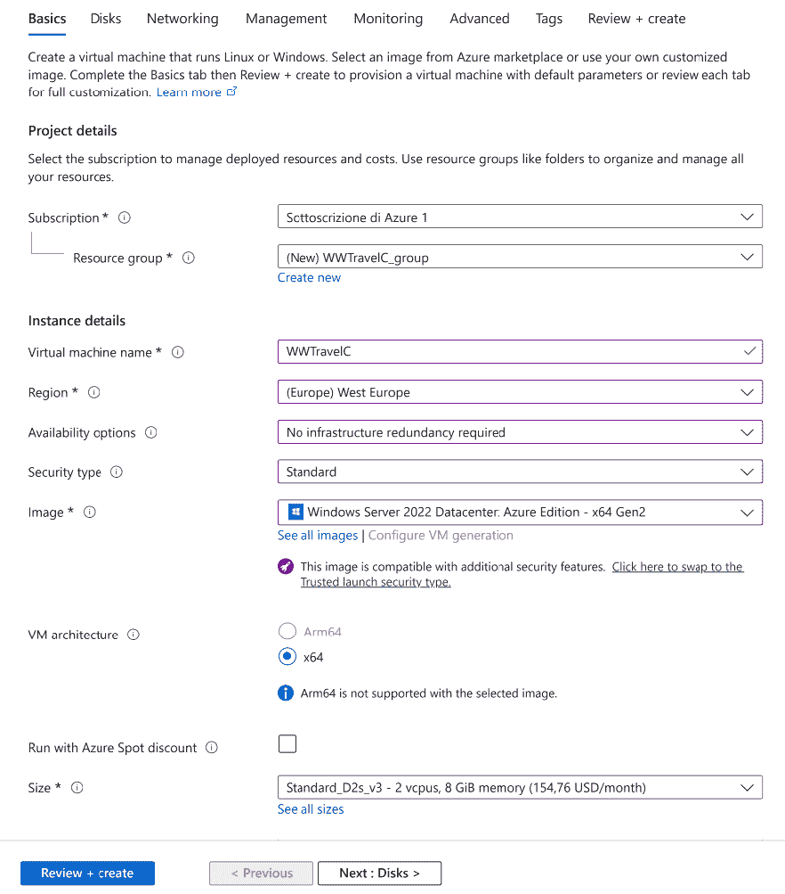
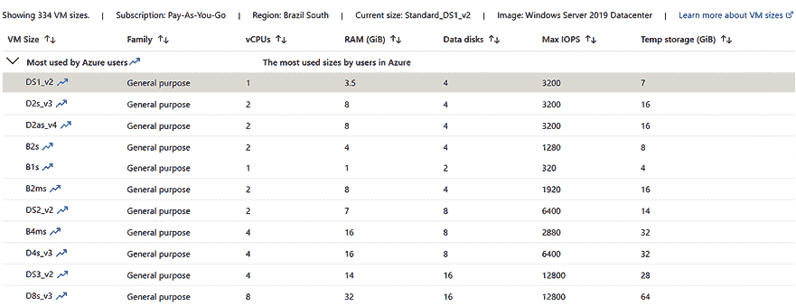
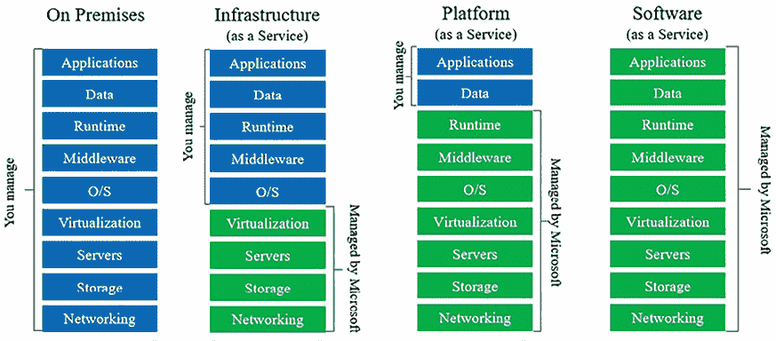
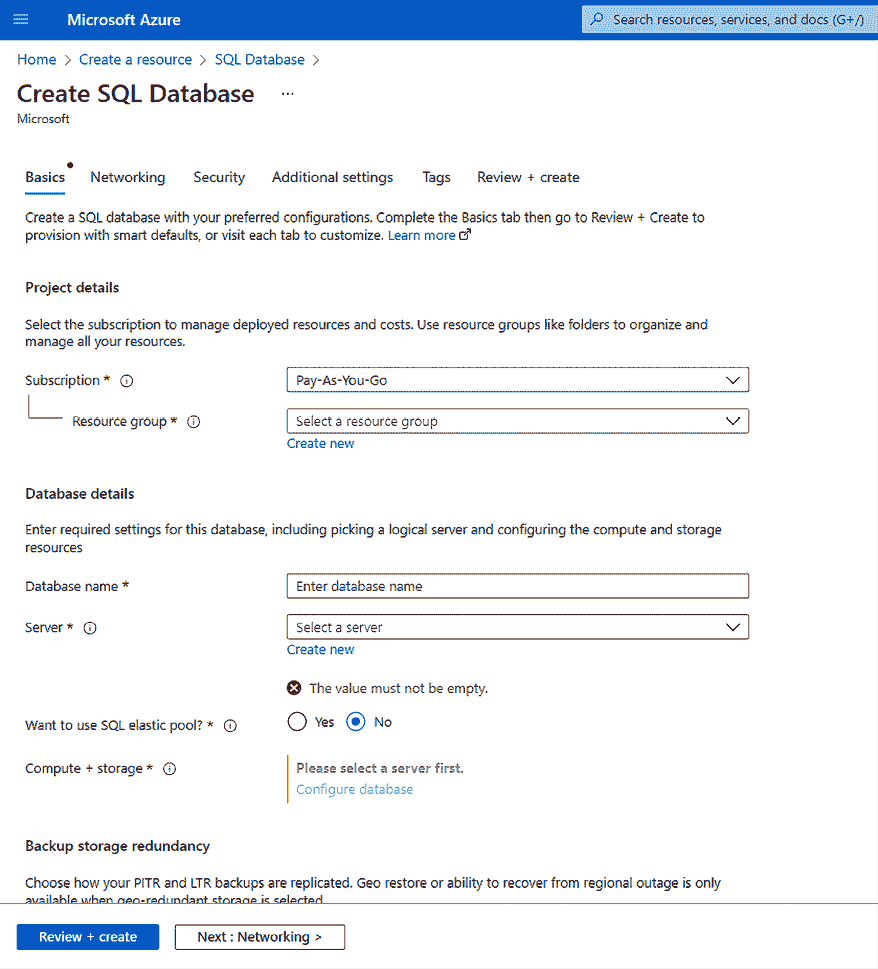
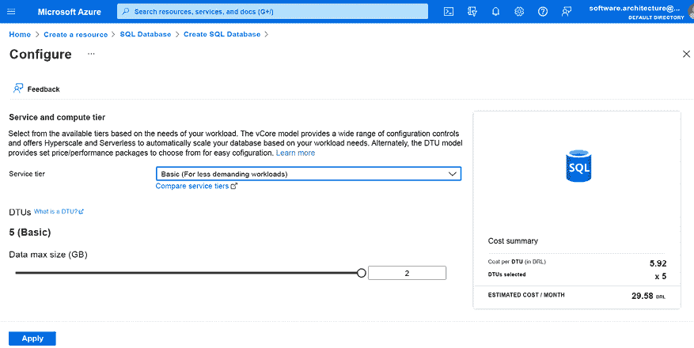
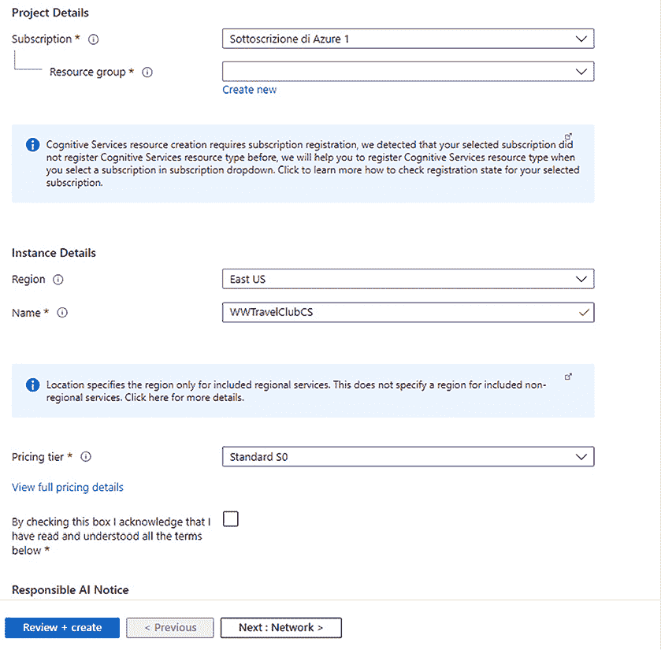

# 选择最佳云解决方案

当你设计应用程序使其成为云基础时，你必须了解不同的架构设计——从最简单的到最复杂的。事实上，云计算技术不仅能够实现成本优化，而且还能显著缩短将你的解决方案推向市场的时间。此外，它还能有效提高应用程序容错和扩展的能力。然而，为了优化成本、速度、弹性和可扩展性，通常需要在约束和灵活性方面做出权衡，因此你必须为你的需求选择正确的折衷方案。

本章讨论了不同的软件架构模型，并教你如何利用云提供的机遇来优化你的解决方案。本章还将讨论我们在开发基础设施时可以考虑的不同类型的云服务，理想的场景是什么，以及我们可以在哪里使用它们。

本章将涵盖以下主题：

+   基础设施即服务解决方案

+   平台即服务解决方案

+   软件即服务解决方案

+   无服务器解决方案

+   如何使用混合解决方案以及为什么它们如此有用

值得注意的是，在这些选项之间做出的选择取决于项目场景的不同方面，例如对灵活性和/或高度定制化解决方案的需求与简单性、低维护成本和低上市时间之间的权衡。这些权衡将在整章中讨论。

# 技术要求

对于本章的实践内容，你必须创建或使用一个 Azure 账户。我们可以在*第一章*，*理解软件架构的重要性*，的*创建 Azure 账户*部分找到创建 Azure 账户的详细步骤。

# 不同的软件部署模型

让我们从**基础设施即服务**（**IaaS**），云计算的基础层开始我们的探索。IaaS 提供了一种灵活且可扩展的基础设施，这对于有特定硬件要求或从本地解决方案过渡到云的企业至关重要。

在拥有基础设施工程师的公司中，你可能会发现更多的人在使用**IaaS**。另一方面，在 IT 不是核心业务的公司中，你会找到一大堆**软件即服务**（**SaaS**）系统。对于开发者来说，选择使用**平台即服务**（**PaaS**）选项或无服务器模式是很常见的，因为他们在这种情况下不需要提供基础设施。

作为软件架构师，你必须应对这种环境，并确保你在解决方案的初始开发阶段以及维护阶段都在优化成本和工作因素。此外，作为一名架构师，你必须了解你系统的需求，并努力将这些需求与一流的周边解决方案相连接，以加快交付速度，并使解决方案尽可能接近客户的规格。

## IaaS 和 Azure 机遇

IaaS 是许多不同云服务提供商提供的云服务的第一代。它的定义在许多地方都可以找到，但我们可以将其总结为“你的计算基础设施通过互联网交付，托管在你不管理的某个地方。”就像我们在本地数据中心中虚拟化服务一样，IaaS 也会为你提供虚拟化组件，如服务器、存储和防火墙，在云端。

简而言之，你需要的所有硬件都托管在云端，并由云服务提供商维护，而不是托管在你的私有数据中心中。这包括作为虚拟机提供的服务器，可能连接到私有网络，磁盘存储，以及防火墙。你不需要购买硬件，只需为其使用付费，并且可以在零成本的情况下扩展到更强大的配置。

你可以像它托管在你的私有数据中心一样访问你的云硬件，但硬件维护由云服务提供商负责。此外，随着你的应用程序流量增加，你可以逐步扩展你的硬件，无需安装和购买成本，也无需将数据迁移到新的硬件。扩展是通过简单的配置指令完成的。

在众多云服务提供商中，Azure 提供了最全面和多样化的服务，因此你可以轻松找到与任何硬件需求完美匹配的方案。大多数 Azure **IaaS** 解决方案都是付费的，在测试时请注意这一点。值得一提的是，本书并不旨在详细描述 Azure 提供的所有 IaaS 服务。然而，作为一名软件架构师，你需要了解你将找到以下这样的服务：

+   **虚拟机**：Windows Server、Linux、Oracle、数据科学和机器学习

+   **网络**：虚拟网络、负载均衡器和 DNS 区域

+   **存储**：文件、表格、数据库和 Redis

显然，这些并不是 IaaS 模型中可用的唯一选项，因此第一步是查看 Azure 中可用的服务选项。要在 Azure 中创建任何服务，你必须找到最适合你需求的服务，然后创建一个资源。以下截图显示了正在配置的 Windows Server 虚拟机。



图 10.1：在 Azure 中创建虚拟机

按照 Azure 提供的向导设置您的虚拟机后，您将能够通过使用**远程桌面协议**（**RDP**）连接到它。下一个截图展示了您部署虚拟机时可以选择的一些硬件选项。考虑我们可用的各种硬件选项来部署虚拟机是非常有趣的，尤其是在考虑到这些选项只需点击**选择**按钮即可访问时。



图 10.2：Azure 中可用的虚拟机大小

如果您将本地交付硬件的速度与云交付的速度进行比较，您将意识到在上市时间方面，没有比云更好的选择。例如，有 64 个 CPU、256 GB 的 RAM 和 512 GB 临时存储的机器。这可能是在本地数据中心中找不到的，例如，如果您有一个临时的工作负载，或者如果您有一个需要这种计算能力的新业务想法，这将需要很长时间才能交付。此外，在临时工作负载场景中，这台机器将利用率不足，因此在本地场景中购买它的理由将是不成立的。

当您希望对基础设施拥有完全控制权，同时还能享受云计算的优势，如冗余和可扩展性时，可以采用 IaaS。然而，IaaS 解决方案的上市时间与本地解决方案相似。因此，在短期内方便快速启动，可以考虑先从允许快速启动的选项开始，并考虑长期目标转向 IaaS。

### IaaS 中的安全责任

安全性是所有硬件解决方案的一个基本方面，因为黑客攻击可能会造成服务中断以及重要商业数据的泄露或丢失。

安全责任是了解 IaaS 平台时需要知道的另一件重要事情。许多人认为，一旦决定上云，所有的安全工作都由提供商完成。然而，这并不正确，如下面的截图所示：



图 10.3：云计算中的安全管理

IaaS 将迫使您从操作系统到应用程序都负责安全。在某些情况下，这是不可避免的，但您必须理解这将增加您的系统成本。

如果您只想将现有的本地结构迁移到云端，IaaS 可以是一个不错的选择。这得益于 Azure 提供的工具以及所有其他服务，从而实现了可扩展性。然而，如果您计划从头开发应用程序，您也应该考虑 Azure 上可用的其他选项。

将我们的重点转向**PaaS**，我们进入了一个以软件开发速度和效率为中心的领域。PaaS 提供了一个环境，企业可以在其中开发、运行和管理应用程序，而无需构建和维护基础设施的复杂性。

## PaaS – 开发者的机会世界

如果你正在学习或已经学习过软件架构，你可能会完美理解下一句话的含义。当涉及到软件开发时，世界对速度的要求非常高！这种对速度的需求正是**PaaS**变得无价的地方，它提供了快速开发和部署的能力。

如前一张截图所示，PaaS 允许你仅在更接近你业务的角度考虑安全问题：你的数据和应用程序。对于开发者来说，这意味着无需实施一大堆配置来确保解决方案的安全运行。

安全处理不是 PaaS 的唯一优势。作为一名软件架构师，你可以将这些服务视为快速交付更丰富解决方案的机会。上市时间可以肯定地证明在 PaaS 基础上运行的应用程序的成本。

PaaS 解决方案让你摆脱了管理解决方案部署中所有细节的烦恼，同时不会对 PaaS 供应商产生过度依赖。实际上，你的软件不需要过多依赖所选的 PaaS，小的依赖可以在适当设计的驱动程序中隔离。换句话说，如果软件设计有基于驱动程序的架构，如我们在第七章“理解软件解决方案的不同领域”的*层和洋葱架构*部分中描述的洋葱架构，那么迁移到不同的 PaaS 解决方案或 IaaS 解决方案总是很容易的。因此，当计划长期迁移到 IaaS 时，PaaS 可能是一个减少上市时间的良好选择。

深入探讨 PaaS，让我们来看看 Azure 如何通过其多样化的服务来实现这一模型。Azure 的 PaaS 服务旨在满足各种开发需求，从 Web 应用程序到复杂的数据处理。

现在，Azure 中提供了许多作为 PaaS 提供的服务，可用的服务种类不断扩展，反映了开发者和企业不断变化的需求。

再次强调，本书的目的不是列出所有这些服务。然而，其中一些确实需要提及。这个列表还在不断增长，这里的建议是尽可能多地使用和测试这些服务！确保你将这个想法放在心上，交付更好的设计方案。

另一方面，值得一提的是，使用 PaaS 解决方案，你将不会完全控制操作系统。实际上，在许多情况下，你甚至不需要连接到它的方式。这大多数时候是可以接受的，但在某些调试情况下，你可能会错过这个功能。好消息是，PaaS 组件每天都在进化，微软最大的关注点之一就是让它们广为人知。

以下小节介绍了 Microsoft 为 .NET 网络应用程序提供的最常见 PaaS 组件，即 Azure Web Apps 和 Azure SQL Server。我们还描述了 Azure 认知服务，这是一个非常强大的 PaaS 平台，展示了在 PaaS 世界中开发的奇妙之处。我们将在本书的剩余部分更深入地探讨其中的一些内容。

在众多 PaaS 服务中，网络应用程序因其多功能性和易用性而脱颖而出。Azure 的网络应用程序服务简化了各种类型应用程序的部署，展示了 PaaS 解决方案的实际性和可访问性。

### 网络应用程序

网络应用程序是一个你可以用来部署你的网络应用程序的 PaaS 选项。你可以部署不同类型的应用程序，例如 .NET、.NET Core、Java、PHP、Node.js 和 Python。这种例子在 *第一章*，*理解软件架构的重要性* 中有所展示。

好处在于创建网络应用程序不需要任何结构或/和 IIS 网络服务器设置。在某些情况下，如果你使用 Linux 来托管你的 .NET 应用程序，你甚至没有 IIS。网络应用程序在托管选项上的灵活性，例如不需要 IIS 进行基于 Linux 的部署，强调了它们对各种开发和部署环境的适应性。

此外，网络应用程序有一个计划选项，你无需为使用付费。当然，有一些限制，例如只能运行 32 位应用程序，并且无法启用可伸缩性。这个免费层非常适合学习和初始应用程序原型设计，提供基本功能而不需要财务承诺。

### SQL 数据库

想象一下，如果你不需要为部署这个数据库支付大服务器的费用，而只需拥有完整的 SQL 服务器功能，你可以多快地部署一个解决方案。这适用于 SQL 数据库。使用它们，你可以根据需要使用 Microsoft SQL Server – 存储和数据处理。在这种情况下，Azure 负责备份数据库。

在这里，我们将简要讨论将数据库放在云中的优势。数据库在 *第十二章*，*在云中选择你的数据存储* 和 *第十三章*，*使用 C# 与数据交互 – Entity Framework Core* 中有详细讨论。

假设你正在开发一个新的业务应用程序，最初你的数据存储和流量需求相当低，但你需要像数据复制这样的高级功能来保护你的数据，并为地理上分布的用户提供高性能。如果没有 Azure SQL 数据库，你就不得不购买多个 SQL 许可证，因为 SQL Server 免费版不涵盖类似场景。

使用 Azure SQL 数据库，你无需支付昂贵的许可证费用，只需为最初的小型存储和流量需求付费。

SQL 数据库甚至为你提供了自行管理性能的选项。这被称为自动调优——也就是说，你的流量需求会自动扩展，以保持响应时间在可接受范围内，随着请求的增加。这意味着你的成本可能会自动增加，但你也可以定义最大支出限制。

再次强调，使用 PaaS 组件，你将能够专注于对你业务重要的事情：非常快的上市时间。

创建用于测试的 SQL 数据库的步骤相当简单，就像我们看到的其他组件一样。然而，有两件事你需要注意：服务器的创建以及你将如何被收费。实际上，理解各种配置及其成本对于找到应用程序和最大成本需求之间最佳权衡是至关重要的。

当你创建资源时，你可以搜索`SQL Database`，你将找到这个向导来帮助你：



图 10.4：在 Azure 中创建 SQL 数据库

SQL 数据库依赖于一个 SQL 服务器来托管它。因此，正如你所见，你必须创建（至少对于第一个数据库）一个`database.windows.net`服务器，你的数据库将托管在这个服务器上。这个服务器将提供你使用当前工具（如 Visual Studio、SQL Server Management Studio 和 Azure Data Studio）访问 SQL 服务器数据库所需的所有参数。值得一提的是，你有一系列安全特性，例如透明数据加密和 IP 防火墙。

一旦你决定了数据库服务器的名称，你将能够选择你的系统将被收取费用的定价层。特别是在 SQL 数据库中，有几种不同的定价选项，如以下截图所示。你应该仔细研究每一个，因为根据你的场景，通过优化定价层你可以节省金钱：



图 10.5：配置 Azure SQL 数据库定价层

关于 SQL 配置的更多信息，你可以使用这个链接：[`azure.microsoft.com/en-us/services/sql-database/`](https://azure.microsoft.com/en-us/services/sql-database/)。

关于数据库解决方案的更多细节将在*第十二章*，*在云中选择你的数据存储*和*第十三章*，*使用 C#与数据交互 - Entity Framework Core*中讨论。

一旦你完成了配置，你将能够以与你的 SQL 服务器在本地安装时相同的方式连接到这个服务器数据库。你必须注意的唯一细节是 Azure SQL 服务器防火墙的配置，但这设置起来相当简单，并且是 PaaS 服务安全性的良好证明。

### Azure 认知服务

**人工智能**（**AI**）是软件架构中最常讨论的话题之一。我们离一个真正伟大的世界只有一步之遥，在那里人工智能将无处不在。

例如，人工智能在自动帮助中心、数据分析和基于自然语言的用户界面等领域越来越重要。人工智能为这些领域增加的经济价值巨大，无论是在服务成本降低还是在由于优化决策而增加的利润方面。

为了实现这一点，作为一个软件架构师，你不能总是把人工智能看作是需要从头开始发明的软件。

Azure 认知服务可以帮助你实现这一点。这些 API 使开发者能够轻松创建高级功能，如应用中的语音识别或客户服务工具中的语言翻译。

PaaS 的优势可以从这个场景中明显看出。开发内部人工智能解决方案的成本将需要巨大的投资和难以找到的技能。相反，使用 Azure 认知服务的 PaaS，你无需担心人工智能技术。相反，你可以专注于作为软件架构师真正关心的事情：解决你的业务问题。

在你的 Azure 账户中设置 Azure 认知服务也非常简单。首先，你需要像添加任何其他 Azure 组件一样添加认知服务。你可以选择一个特定的认知服务或一个多服务账户，这将使你能够访问所有认知服务。在下面的屏幕截图中，我们选择了一个多服务账户：



图 10.6：在 Azure 中创建认知服务 API 账户

一旦完成这些，你将能够使用服务器提供的 API。你将在你创建的服务中找到两个重要功能：端点和访问密钥。它们将在你的代码中用于访问 API。

以下代码示例展示了如何使用认知服务 API 翻译句子。这个翻译服务背后的主要概念是，你可以根据服务设置的关键和区域发送你想要翻译的句子。以下代码使你能够向服务 API 发送请求：

```cs
private static async Task<string> CSTranslate(string api, string key, string region, string textToTranslate)
{
    using var client = new HttpClient();
    client.DefaultRequestHeaders.Add("Ocp-Apim-Subscription-Key", key);
    client.DefaultRequestHeaders.Add("Ocp-Apim-Subscription-Region", region);
    client.Timeout = TimeSpan.FromSeconds(5);
    var body = new[] { new { Text = textToTranslate } };
    var requestBody = JsonConvert.SerializeObject(body);
    var content = new StringContent(requestBody, Encoding.UTF8, "application/json");
    var response = await client.PostAsync(api, content);
    response.EnsureSuccessStatusCode();
    return await response.Content.ReadAsStringAsync();
} 
```

值得注意的是，前面的代码将允许你向任何语言翻译任何文本的请求，只要你将其定义在参数中。以下是一个调用先前方法的程序：

```cs
static async Task Main()
{
    var host = "https://api.cognitive.microsofttranslator.com";
    var route = "/translate?api-version=3.0&to=es";
    var subscriptionKey = "[YOUR KEY HERE]";
    var region = "[YOUR REGION HERE]";
    if (subscriptionKey == "[YOUR KEY HERE]")
    {
        Console.WriteLine("Please, enter your key: ");
        subscriptionKey = Console.ReadLine();
    }
    if (region  == "[YOUR REGION HERE]")
    {
        Console.WriteLine("Please, enter your region: ");
        region = Console.ReadLine();
    }
    var translatedSentence = await PostAPI(host + route, subscriptionKey, region, "Hello World!");
    Console.WriteLine(translatedSentence);
    Console.WriteLine("Press any key to continue...");
    Console.ReadKey();
} 
```

更多信息，请访问[`docs.microsoft.com/en-us/azure/cognitive-services/translator/reference/v3-0-languages`](https://docs.microsoft.com/en-us/azure/cognitive-services/translator/reference/v3-0-languages)。

这是一个完美的例子，说明了你可以多么容易和快速地使用此类服务来构建你的项目。这种易用性不仅加速了项目开发，还开辟了新的创新和增强用户体验的可能性。

## SaaS——只需登录即可开始！

SaaS 可能是使用基于云的服务最简单的方式。您需要的应用程序已经在云上可用，您只需进行配置和使用！云服务提供商提供了许多针对其终端用户解决常见问题的优秀选项。从电子邮件服务到全面的企业管理工具，SaaS 提供了一系列的应用程序，您可以根据各种业务需求进行定制。

Office 365 是这类服务的良好例子。这些平台的关键点是您无需担心应用程序的维护。这在您的团队完全专注于开发应用程序的核心业务的情况下尤其方便。例如，如果您的解决方案需要提供良好的报告，也许您可以使用 Power BI（包含在 Office 365 中）来设计它们。因此，将 Office 365 集成到您的解决方案中，可以无缝地进行数据分析和管理报告，立即提高您业务运营的整体效率和生产力。

SaaS 解决方案可以通过多种方式进行定制。最强大的技术是添加自定义插件。例如，您可以通过添加公共存储库中可用的各种插件或开发您自己的自定义插件来定制您的 Office 365 租户。

还值得一提的是，如果您决定投资于自定义插件，您已经拥有了，比如说，90%的应用程序运行稳定，因此，初始投资和市场时间都大大减少。

总结来说，一方面，SaaS 提供即时的复杂和经过验证的解决方案，但另一方面，SaaS 提供的定制选项非常有限。那么，您如何决定是否使用 SaaS 解决方案？

1.  **评估现有解决方案**：首先，您需要验证是否已经存在符合您需求的 SaaS。

1.  **考虑定制和集成**：然后，您需要验证所选选项是否可以适应您的需求，以及适应它们所需的投入。

1.  **分析成本影响**：在此阶段，您必须分析您将被迫接受的不可避免妥协的影响，以及每个候选 SaaS 采用的整体成本，这包括它对您组织整体成本的影响。

1.  **审查安全和合规性**：您还需要验证 SaaS 使用的用户/安全模型是否与您的需求兼容，以及通常情况下，该应用程序是否满足您组织所需的所有约束。

1.  **评估供应商的可靠性和支持**：对 SaaS 供应商的强烈依赖对你的最终决策是一个关键因素。记住，一旦将 SaaS 解决方案纳入你的业务，可能很难转移到不同的解决方案——也就是说，供应商的合同权力可能会随着时间的推移而上升到不可接受的水平。出于同样的原因，不可靠的供应商（例如，一家年轻初创公司）或无法提供充分产品支持的供应商可能会造成不可接受的损害。

1.  **规划可扩展性和未来增长**：你还必须考虑你组织的未来。因此，你也必须验证候选选项是否可扩展，并且能否适应你不断增长的需求和流量。

1.  **测试解决方案**：最后，你需要在一个预演环境中实际测试所选的解决方案，以验证你的整体分析和预测是否正确。

另一个很好的 SaaS 平台例子是 Azure DevOps。作为一名软件架构师，在 Azure DevOps 之前，你需要为你的团队安装和配置**团队基础服务器**（**TFS**）（或者甚至更老的工具，如 Microsoft Visual SourceSafe），以便他们可以使用一个共同的存储库和应用生命周期管理工具。

我们过去花费大量时间要么在准备服务器以安装 TFS，要么在升级和持续维护已安装的 TFS。由于 SaaS Azure DevOps 的简单性，这不再需要。

## 理解无服务器意味着什么

无服务器解决方案是一种解决方案，其重点不在于代码运行的位置。即使在“无服务器”解决方案中，也始终存在服务器。问题是，你不知道或不在乎你的代码在哪个服务器上执行。无服务器的主要优势是，你没有任何固定月度成本，并且只需为你的流量付费。

然而，还有其他优势。例如，在无服务器解决方案中，你拥有非常快速、简单和敏捷的应用生命周期，因为几乎所有无服务器代码都是无状态的，并且与系统其他部分松散耦合。一些作者将此称为**函数即服务**（**FaaS**）。

当然，服务器在某处运行。这里的关键点是，你不需要为此或甚至可扩展性而担心。这将使你能够完全专注于你的应用程序的业务逻辑。再次强调，世界需要快速开发和良好的客户体验。你越关注客户需求，就越好！

FaaS 提供了最短的市场进入时间和最低的成本阈值，以及巨大的可扩展性可能性。因此，在难以预测应用程序工作量或当应用程序工作量有高且难以预测的波动时，它们非常方便。

假设，例如，你正在寻找一个解决方案来连接你的应用进行大量电子邮件发送。如果你的应用还处理营销活动，可能会有流量峰值，这些峰值可能是平均流量的 100 倍。FaaS 解决方案可能能够轻松覆盖这些巨大的峰值，而不会影响它们之外的正常成本。

相反，在类似情况下，如果你在平均期间不需要，只是在营销活动高峰期间需要，PaaS 或 IaaS 会迫使你升级到更高的价格层。

如果工作负载变得更加稳定，并且更容易确定可靠的下限和上限，由于在更高工作负载上的成本更高，FaaS 就变得不那么方便了。例如，亚马逊 Prime 最近公布了其通过从 FaaS 切换到 IaaS 而节省的费用。

不幸的是，从 FaaS 迁移到 PaaS 或 IaaS 并不容易，因为 FaaS 代码严格绑定到所选的 FaaS 解决方案。

通过避免过度碎片化的 FaaS 代码（由小型函数组成），而是使用少量触发执行更大传统软件模块的函数，可以部分缓解这个问题。这些软件模块被封装在 FaaS 解决方案中。这样，迁移到不同的 FaaS，或到 IaaS/PaaS，只需要重写几个 FaaS 主函数，而保持它们调用的更大软件模块不变。不幸的是，唤醒不活跃函数的性能惩罚与每个函数内使用复杂框架的使用不相容，因此碎片化是不可避免的。

根据我的经验，FaaS 在以下情况下证明是有用的：在预计高流量但低复杂性的应用早期阶段，或者对于像我们之前的邮件发送应用这样的低复杂度应用，这些应用专门设计来处理高且难以预测的峰值。事实上，在这些应用中，几乎完全重写代码是可以接受的，因为与几乎立即上市和有效处理大且难以预测的流量峰值相比，代码开发的投入较低。

在第十六章*与无服务器一起工作 - Azure Functions*中，你将探索微软在 Azure 中提供的最好的无服务器实现之一——Azure Functions。在那里，我们将关注你如何开发无服务器解决方案，并了解它们的优缺点。

下面的子节将沿几个轴比较 IaaS、PaaS、SaaS 和 FaaS。

## 比较 IaaS、PaaS、SaaS 和 FaaS

在前面的章节中，我们描述了所有主要云提供商提供的各种解决方案，包括它们的优缺点。下表总结了它们各自在五个轴上提供的主要优点，为每个轴分配了 1（较差）到 4（非常好）的评分。

|  | **上市时间** | **定制可能性** | **维护工作量** | **可扩展性** | **成本** |
| --- | --- | --- | --- | --- | --- |
| IaaS | 1 | 4 | 1 | 1 | 4 |
| PaaS | 2 | 3 | 2 | 2 | 3 |
| SaaS | 4 | 1 | 4 | 取决于应用 | 1 |
| FaaS | 3 | 2 | 3 | 4 | 2 |

# 为什么混合应用程序在许多情况下如此有用？

在其一般意义上，*混合*一词意味着其部分不共享统一架构选择的东西；每个部分都做出不同的架构选择。然而，在云解决方案的情况下，*混合*一词主要指的是混合云子系统与本地子系统的解决方案。然而，它也可以指混合 Web 子系统与特定设备子系统，如移动设备或其他运行代码的任何设备。

由于 Azure 可以提供的服务数量以及可以实施的设计架构数量，混合应用程序可能是本章解决的主要问题的最佳答案：如何在你的项目中利用云提供的机会。

现在，许多当前的项目正从本地解决方案迁移到云架构，而且无论你打算在哪里交付这些项目，你仍然会找到许多关于迁移到云端的错误先入为主的观念。其中大部分与成本、安全和服务的可用性有关。

你需要理解，这些先入为主的观念中确实有一些是真实的，但并非人们所想的那样。当然，作为软件架构师，你不能忽视它们。特别是在开发关键系统时，你必须决定是否可以将一切放在云端，或者是否最好将系统的一部分部署在边缘。因此，理解这些因素对于导航混合领域至关重要，这确保了你根据具体需求平衡成本、安全和可用性。

值得一提的一个现实生活中的例子可能有助于阐明混合解决方案的需求。最近，我们提供的 SaaS 解决方案的几位客户对我们无法将预留的和业务关键文档迁移到云端表示反对。我们的解决方案是为我们的 SaaS 配备了文件处理驱动程序，能够从位于客户私有内部网络中的内部文档服务器检索文件。

完全不同类型的混合解决方案是边缘计算范式。根据这种范式，系统的一部分必须部署在需要它们的位置附近的机器或设备上。这有助于减少响应时间和带宽。

移动解决方案可以被认为是混合应用程序的另一个经典例子，因为它们将基于 Web 的架构与基于设备的架构相结合，以提供更好的用户体验。有许多场景可以替换移动应用程序为响应式网站。然而，当涉及到界面质量和性能时，可能响应式网站无法满足最终用户真正需要的。

# 摘要

在本章中，你学习了如何利用云服务在你的解决方案中发挥优势，以及你可以选择的多种选项。

本章介绍了在基于云的结构中交付相同应用程序的不同方法。我们还注意到，微软正在迅速将这些选项提供给客户，因为您可以在实际应用程序中体验所有这些选项，并选择最适合您需求的一个，因为没有一种在所有情况下都适用的*万能药*。作为一名软件架构师，您需要分析您的环境和团队，然后决定在您的解决方案中实施的最佳云架构。

下一章将专门介绍构建一个由小型、可扩展的软件模块（称为微服务）组成的灵活架构。

# 问题

1.  为什么你应该在你的解决方案中使用 IaaS？

1.  为什么你应该在你的解决方案中使用 PaaS？

1.  为什么你应该在你的解决方案中使用 SaaS？

1.  为什么你应该在你的解决方案中使用无服务器架构？

1.  使用 Azure SQL Server 数据库的优势是什么？

1.  如何使用 Azure 加速您应用程序中的 AI？

1.  混合架构如何帮助您设计更好的解决方案？

# 进一步阅读

您可以通过以下网络链接深入了解本章涵盖的主题：

+   [`visualstudio.microsoft.com/xamarin/`](https://visualstudio.microsoft.com/xamarin/)

+   [`www.packtpub.com/application-development/xamarin-cross-platform-application-development`](https://www.packtpub.com/application-development/xamarin-cross-platform-application-development)

+   [`www.packtpub.com/virtualization-and-cloud/learning-azure-functions`](https://www.packtpub.com/virtualization-and-cloud/learning-azure-functions)

+   [`azure.microsoft.com/overview/what-is-iaas/`](https://azure.microsoft.com/overview/what-is-iaas/)

+   [`docs.microsoft.com/en-us/azure/security/azure-security-iaas`](https://docs.microsoft.com/en-us/azure/security/azure-security-iaas)

+   [`azure.microsoft.com/services/app-service/web/`](https://azure.microsoft.com/services/app-service/web/)

+   [`azure.microsoft.com/services/sql-database/`](https://azure.microsoft.com/services/sql-database/)

+   [`azure.microsoft.com/en-us/services/virtual-machines/data-science-virtual-machines/`](https://azure.microsoft.com/en-us/services/virtual-machines/data-science-virtual-machines/)

+   [`docs.microsoft.com/azure/sql-database/sql-database-automatic-tuning`](https://docs.microsoft.com/azure/sql-database/sql-database-automatic-tuning)

+   [`azure.microsoft.com/en-us/services/cognitive-services/`](https://azure.microsoft.com/en-us/services/cognitive-services/)

+   [`docs.microsoft.com/en-us/azure/architecture/`](https://docs.microsoft.com/en-us/azure/architecture/)

+   [`powerbi.microsoft.com/`](https://powerbi.microsoft.com/)

+   [`office.com`](https://office.com)

+   [`azure.microsoft.com/en-us/overview/what-is-serverless-computing/`](https://azure.microsoft.com/en-us/overview/what-is-serverless-computing/)

+   [`azure.microsoft.com/en-us/pricing/details/sql-database/`](https://azure.microsoft.com/en-us/pricing/details/sql-database/)

+   [`www.packtpub.com/virtualization-and-cloud/professional-azure-sql-database-administration`](https://www.packtpub.com/virtualization-and-cloud/professional-azure-sql-database-administration)

# 在 Discord 上了解更多

要加入这本书的 Discord 社区——在那里您可以分享反馈、向作者提问，并了解新版本——请扫描下面的二维码：

[`packt.link/SoftwareArchitectureCSharp12Dotnet8`](https://packt.link/SoftwareArchitectureCSharp12Dotnet8)


