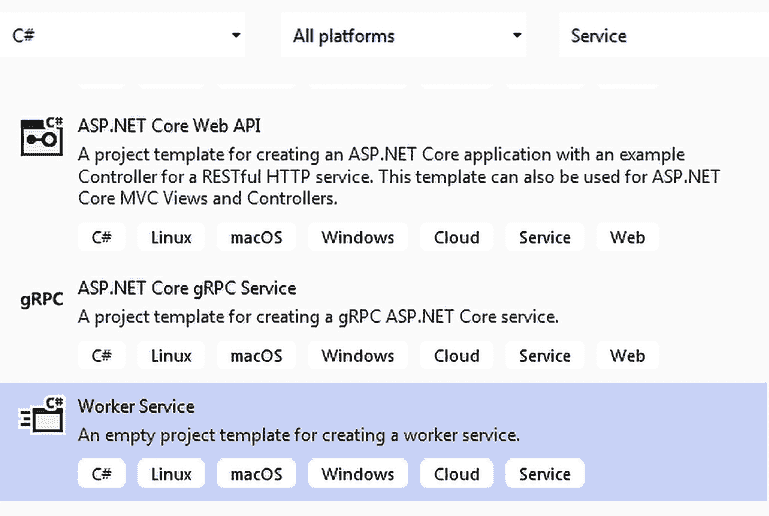

# 将微服务架构应用于您的企业应用

本章致力于描述基于称为微服务的小模块的高度可扩展架构。微服务架构允许进行细粒度的扩展操作，其中每个单独的模块都可以按需扩展，而不会影响系统的其余部分。此外，它们通过允许每个系统子部分独立于其他部分进行演变和部署，从而提供了更好的**持续集成/持续部署**（**CI/CD**）。

在本章中，我们将涵盖以下主题：

+   什么是微服务？

+   在什么情况下微服务有帮助？

+   .NET 如何处理微服务？

+   管理微服务需要哪些工具？

到本章结束时，你将学会如何在.NET 中实现单个微服务。“第二十章，Kubernetes”也解释了如何部署、调试和管理基于微服务的整个应用。“第十四章，使用.NET 实现微服务”和“第十八章，使用 ASP.NET Core 实现前端微服务”是使用.NET 实现微服务的实际应用的逐步指南。

# 技术要求

本章的代码可在[`github.com/PacktPublishing/Software-Architecture-with-C-Sharp-12-and-.NET-8-4E`](https://github.com/PacktPublishing/Software-Architecture-with-C-Sharp-12-and-.NET-8-4E)找到。

在本章中，你需要以下内容：

+   安装了所有数据库工具的 Visual Studio 2022 免费社区版或更高版本。

+   一个免费的 Azure 账户。在第一章“理解软件架构的重要性”中的“创建 Azure 账户”部分解释了如何创建一个。

+   如果你想在 Visual Studio 中调试 Docker 容器化的微服务，请使用**Windows Docker 桌面版**（[`www.docker.com/products/docker-desktop`](https://www.docker.com/products/docker-desktop)）。

相反，**Windows Docker 桌面版**至少需要安装了**Windows 子系统（WSL**）或**Windows 容器**的 Windows 10。

**WSL**允许 Docker 容器在 Linux 虚拟机上运行，可以按照以下方式安装（也请参阅[`learn.microsoft.com/en-us/windows/wsl/install`](https://learn.microsoft.com/en-us/windows/wsl/install)）：

1.  在 Windows 10/11 的搜索栏中输入`powershell`。

1.  当**Windows PowerShell**作为搜索结果出现时，点击**以管理员身份运行**。

1.  在出现的 Windows PowerShell 管理控制台中，运行命令`wsl --install`。

**Windows 容器**允许 Docker 容器直接在 Windows 上运行，但至少需要 Windows 专业版。它们可以按照以下方式安装：

1.  在 Windows 10/11 的搜索栏中输入`Windows 功能`。

1.  搜索结果将建议运行面板以启用/禁用 Windows 功能。

1.  点击它，在打开的窗口中，选择**容器**。

# 什么是微服务？

微服务本质上是由小而独立的单元组成的大型软件应用程序，每个单元都有其特定的角色和功能。将软件应用程序拆分为独立的微服务允许构成解决方案的每个模块独立于其他模块进行扩展，以实现最大吞吐量并最小化成本。实际上，对整个系统而不是其当前瓶颈进行扩展不可避免地会导致资源的显著浪费，因此对子系统扩展的精细控制对系统的整体成本有相当大的影响。

然而，微服务不仅仅是可扩展的组件——它们是可以独立开发、维护和部署的软件构建块。将开发和维护分配给可以独立开发、维护和部署的模块可以提高整体系统的 CI/CD 周期（CI/CD 在*第八章*，*理解 DevOps 原则和 CI/CD*中进行了详细描述）。

CI/CD 的改进归因于微服务的**独立性**，因为它能够实现以下功能：

+   在不同类型的硬件上扩展和分发微服务。

+   由于每个微服务都是独立于其他微服务部署的，因此不存在二进制兼容性或数据库结构兼容性约束。因此，没有必要对组成系统的不同微服务的版本进行对齐。这意味着它们中的每一个都可以根据需要发展，而不会受到其他微服务的限制。

    然而，必须注意通信协议和消息的选择及其版本，这些版本必须由所有参与的微服务支持。应优先考虑广泛支持且便于与旧版本消息向后兼容的协议。

+   将其开发分配给完全独立的较小团队，从而简化工作组织并减少处理大型团队时出现的所有不可避免的协调低效率。

+   使用更合适的技术和更合适的环境来实现每个微服务，因为每个微服务都是一个独立的部署单元。这意味着选择最适合您需求的工具和最小化开发努力/或最大化性能的环境。

+   由于每个微服务都可以使用不同的技术、编程语言、工具和操作系统来实现，企业可以通过将环境与开发者的能力相匹配来利用所有可用的人力资源。例如，所有可用的 Java 和.NET 开发者可以合作在同一应用程序中，从而利用所有可用资源。

+   可以将遗留子系统嵌入到独立的微服务中，从而使其能够与较新的子系统合作。这样，公司可以缩短推出新系统版本的时间。此外，通过这种方式，遗留系统可以缓慢地向更现代的系统发展，对成本和组织的影响是可以接受的。

下一个子节将解释微服务概念是如何产生的。然后，我们将通过探讨基本微服务设计原则和分析为什么微服务通常被设计为 Docker 容器来继续本介绍性章节。

## 微服务和模块概念的演变

为了更好地理解微服务的优势以及它们的设计技术，我们必须牢记软件模块化和软件模块的双重性质：

+   **代码模块化**指的是一种代码组织方式，使我们能够轻松修改代码块而不会影响应用程序的其余部分。它通常通过面向对象设计来实现，其中模块可以通过类来识别。

+   **部署模块化**取决于你的部署单元是什么以及它们具有哪些属性。最简单的部署单元是可执行文件和库。因此，例如，**动态链接库**（**DLLs**）肯定比静态库更模块化，因为它们在部署之前不需要与主可执行文件链接。

虽然代码模块化的基本概念已经达到稳定状态，但部署模块化的概念仍在不断发展，微服务目前在这一发展路径上处于最前沿。

作为对通向微服务之路上的主要里程碑的简要回顾，我们可以这样说，首先，单体可执行文件被分解为静态库。后来，DLLs 取代了静态库。

当.NET（以及其他类似框架，如 Java）改进了可执行文件和库的模块化时，发生了巨大的变化。实际上，由于.NET 是在库第一次执行时编译的中间语言中部署的，因此它们可以在不同的硬件和不同的操作系统上部署。此外，它们克服了先前 DLLs 的一些版本问题，因为任何可执行文件都可以携带一个与操作系统上安装的相同 DLL 版本不同的 DLL。

然而，.NET 不能接受使用不同版本的共同依赖项（例如，*C*）的两个引用 DLLs – 假设，*A*和*B*。例如，假设有一个带有许多新功能的新版本*A*，我们希望使用它，它反过来又依赖于一个不支持*B*的新版本*C*。在这种情况下，我们应该放弃*A*的新版本，因为*C*与*B*的不兼容性。这种困难导致了两个重要的变化：

+   包：开发世界从使用单个 DLLs 和/或单个文件作为部署单元转变为使用由 DLLs 和元数据组成的包作为部署单元。包由*包管理系统*（如 NuGet 和 npm）处理，这些系统使用包元数据通过语义版本化自动检查版本兼容性。

+   **面向服务架构**（**SOA**）：部署单元最初以基于 SOAP 的 Web 服务实现，后来过渡到 RESTful Web 服务。这解决了版本兼容性问题，因为每个 Web 服务都在不同的进程中运行，并且可以使用每个库的最合适版本，而不会与其他 Web 服务造成不兼容的风险。此外，每个 Web 服务暴露的接口是平台无关的；也就是说，Web 服务可以使用任何框架与应用程序连接，并在任何操作系统上运行，因为 Web 服务协议基于普遍接受的标准。SOA 和协议将在第十五章《使用.NET 应用面向服务架构》中更详细地讨论。

微服务是 SOA（面向服务架构）的演进，它增加了更多特性和约束，从而提高了服务的可扩展性和模块化，进而优化了整体的 CI/CD（持续集成/持续部署）周期。有时人们会说，微服务是做得好的 SOA。此外，正如我们将在下一节中看到的，微服务与第七章中描述的 DDD（领域驱动设计）方法紧密相连，即《理解软件解决方案中的不同领域》。

总结来说，微服务架构是一种最大化独立性和细粒度扩展的 SOA。现在我们已经阐明了微服务独立性和细粒度扩展的所有优势，以及独立的本质，我们现在可以查看微服务设计原则。

## 微服务设计原则

在本节中，你将了解微服务的基本设计原则。这些原则是设计每个微服务的代码和架构，以及设计整个应用程序架构的基础。

让我们从由独立性约束产生的原则开始。我们将分别在每个子节中讨论它们。

### 设计选择的独立性

一个基本的设计原则是“设计选择的独立性”，可以表述如下：

每个微服务的设计不应依赖于其他微服务实现中做出的设计选择。

这一原则使得每个微服务的 CI/CD 周期完全独立，并为我们提供了更多关于如何实现每个微服务的科技选择。这样，我们可以选择最佳的技术来实现每个微服务。

这一原则的另一个后果是，不同的微服务不能连接到相同的共享存储（数据库或文件系统），因为共享相同的存储也意味着共享所有决定存储子系统（数据库表设计、数据库引擎等）结构的设计选择。因此，要么微服务有自己的数据存储，要么它根本不存储任何数据，并与负责处理存储的其他微服务进行通信。

专用数据存储可以通过在微服务边界内物理包含数据库服务或使用微服务具有独家访问权限的外部数据库来实现。这两种设计选择都是可接受的。然而，通常采用外部数据库，因为出于性能原因，数据库引擎在专用硬件上以及具有针对其存储功能优化的操作系统和硬件特性上运行得更好。

通常，*设计选择的独立性*通过区分逻辑和物理微服务以较轻的形式被解释。更具体地说，逻辑微服务是将应用程序拆分为逻辑独立模块的结果。如果应用程序使用**领域驱动设计**（**DDD**）方法设计，则逻辑微服务对应于 DDD 边界上下文，我们在第七章“理解软件解决方案中的不同领域”中详细讨论了这一点。

反过来，每个逻辑微服务可能被拆分为各种物理微服务，这些微服务使用相同的数据存储，但独立负载均衡以实现更好的负载均衡。

例如，在案例研究中，旅行支付由第二十一章“案例研究”中“理解 WWTravelClub 应用程序的领域”部分中描述的支付边界上下文处理，这产生了一个独特的逻辑微服务。然而，其实际实现需要两个主要子模块：

+   一个客户信用卡验证和授权模块，负责处理所有信用卡验证

+   一个用户信用管理模块，处理用户已经购买的信用、平台中已经加载的卡信息以及新的信用卡信息加载

由于信用卡验证和授权的过程可能非常耗时，因此将上述两个子模块作为独立的物理微服务实现是方便的，这样它们就可以分别进行负载均衡。

### 独立于部署环境

在负载均衡过程中，微服务可以从非常繁忙的硬件节点移动到更空闲的节点。然而，每个微服务对目标硬件节点上其他软件/文件的依赖性限制了可能的节点。

因此，我们减少微服务依赖项越多，我们就越有自由将它们从繁忙的节点移动到空闲的节点，实现更好的负载均衡，并利用可用的硬件节点。

这是微服务通常被容器化并使用 Docker 的原因。容器将在本章的“容器和 Docker”小节中更详细地讨论，但基本上，容器化是一种技术，允许每个微服务携带其依赖项，以便它可以在任何地方运行。然而，这并不是必须的，因为在某些应用程序中，可能验证所有微服务的所有依赖项要求都可以很容易地由所有可用的节点满足。

当我们探索微服务在其容器化环境中的操作时，另一个关键架构原则开始发挥作用——松耦合的概念。

### 松耦合

每个微服务都必须与其他所有微服务松散耦合。这个原则有两个方面。一方面，这意味着根据面向对象编程原则，每个微服务暴露的接口不应过于具体，而应尽可能通用。然而，这也意味着微服务之间的通信必须最小化，以降低通信成本，因为微服务不共享相同的地址空间，并且运行在不同的硬件节点上。

例如，假设我们正在使用微服务架构实现一个分布式网络视频游戏。每个微服务可能负责不同的功能，如碰撞、可见性、用户输入处理等。一些模块，如碰撞和可见性模块，必须知道整个游戏状态，例如用户头像的位置、每个头像的状态，以及游戏中每个反应对象的状态（例如障碍物、由头像射出的子弹等）。因此，要么所有对整个游戏状态有硬依赖的模块都合并成一个唯一的微服务，要么我们必须找到一种高效的方法，通过仅几次消息交换在它们之间共享整个游戏状态。

这两种选择都有优点和缺点，并且实际上被现实世界的视频游戏所采用。较少的消息可能会引起暂时的不一致，但将太多模块合并成一个唯一的微服务可能会影响整体游戏性能，使得游戏对用户来说可能显得“太慢”。

这种最小化服务间通信的概念自然引导我们考虑另一个方面：在微服务架构中避免链式请求/响应。

### 无链式请求/响应

当一个请求到达微服务时，它不能导致对其他微服务的嵌套请求/响应链，因为类似的链会导致无法接受的反应时间。

例如，假设微服务 A 向微服务 B 发起请求并等待 B 的回答，然后 B 再对 C 做同样的事情，C 再对 D 做同样的事情，以此类推。结果，A 在整个请求首先传播到 B，然后到 C，再到 D 的过程中都处于阻塞状态，等待其回答。然后，回答从 D 传播回 C，再从 C 传播回 B，最后到达 A。也就是说，四个请求传播时间总和等于其他四个回答传播时间，得到 A 的整体等待时间。这样，用户等待从应用程序获得回答的时间可能会很容易变得无法接受。

如果所有微服务的私有数据模型在每次变化时都与推送事件同步，则可以避免链式请求/响应。换句话说，一旦微服务处理的数据发生变化，这些变化就会发送到所有可能需要它们的微服务，以便它们可以服务其请求。这样，每个微服务都可以在其私有数据存储中拥有它服务所有传入请求所需的所有数据，无需请求其他微服务提供它所缺少的数据。

*图 11.1*显示了更新是如何在一旦产生就发送到所有感兴趣的微服务的，以及每个微服务是如何在本地数据库中组合所有接收到的更新的。这样，每个查询微服务都有它需要在其本地数据库中回答查询的所有数据。


图 11.1：推送事件

总结来说，每个微服务必须包含它服务传入请求所需的所有数据，并确保快速响应。为了保持其数据模型最新并准备好处理传入请求，微服务必须在数据变化发生时立即通知其数据变化。这些数据变化应通过异步消息进行通信，因为同步嵌套消息会导致不可接受的性能，因为它们会阻塞调用树中所有涉及的线程，直到返回结果。

值得指出的是，*设计选择独立性*原则实质上是 DDD 的边界上下文原则，我们在第七章“理解软件解决方案中的不同领域”中详细讨论了这一点。在本章中，我们看到了，通常，完整的 DDD 方法对每个微服务的*更新*子系统是有用的。

一般而言，所有根据边界上下文原则开发的系统都更适合使用微服务架构来实现，这并非易事。事实上，一旦一个系统被分解为几个完全独立且松散耦合的部分，由于不同的流量和不同的资源需求，这些不同的部分很可能需要独立扩展。

在上述约束条件下，我们还必须添加一些构建可重用 SOA 的最佳实践。关于这些最佳实践的更多细节将在第十五章“使用.NET 应用服务导向架构”中给出，但如今，大多数 SOA 最佳实践都由用于实现 Web 服务的工具和框架自动执行。

精细粒度扩展是微服务架构的关键方面，涉及多个关键的软件和基础设施要求：

+   首先，微服务必须足够小，以便隔离定义良好的功能。

+   我们还需要一个复杂的基础设施，负责自动实例化微服务和在不同硬件计算资源上分配实例，通常称为**节点**。

+   相同的基础设施必须负责扩展微服务并在可用节点上对它们进行负载均衡。

这些结构将在本章的*需要哪些工具来管理微服务？*部分中介绍，并在第二十章*Kubernetes*中详细讨论。

此外，对于通过异步通信进行通信的分布式微服务的细粒度扩展，需要每个微服务都具有弹性。实际上，指向特定微服务实例的通信可能会因为硬件故障或简单的原因（例如，在负载均衡操作期间目标实例被杀死或移动到另一个节点）而失败。

可以通过指数重试克服临时故障。这就是在每个失败之后，我们都会以指数级增加的延迟重试相同的操作，直到达到最大尝试次数。例如，首先，我们会在 10 毫秒后重试，如果这次重试操作导致失败，那么会在 20 毫秒后进行新的尝试，然后是 40 毫秒，以此类推。

另一方面，长期失败往往会导致重试操作的爆炸性增长，这可能会以类似于拒绝服务攻击的方式耗尽所有系统资源。因此，通常，指数重试会与*熔断策略*一起使用：在给定数量的失败之后，假设发生了长期失败，并通过立即返回失败而不尝试通信操作来防止在给定时间内访问资源。

同样重要的是，由于故障或请求峰值导致的某些子系统的拥塞不应传播到其他系统部分，以防止整体系统拥塞。*隔离舱隔离*通过以下方式防止拥塞传播：

+   只允许有最大数量的类似同时出站请求；比如说，10 个。这类似于对线程创建设置上限。

+   超过先前界限的请求将被排队。

+   如果达到最大队列长度，任何进一步的请求都会引发异常以终止它们。

本章的*弹性任务执行子节*中描述了指数重试、熔断和隔离舱隔离的.NET 实际实现。

重试策略可能会导致相同的消息被接收和处理多次，因为发送者没有收到消息已被接收的确认，或者简单地因为操作超时而接收者实际上已经接收了消息。解决这个问题的唯一可能方法是设计所有消息，使它们是幂等的——也就是说，以这种方式设计消息，即多次处理相同的消息与处理一次的效果相同。

将数据库表字段更新为某个值，例如，这是一个幂等操作，因为重复一次或两次会产生完全相同的效果。然而，增加一个十进制字段并不是幂等操作。微服务设计者应该努力设计尽可能多的幂等消息的整体应用程序。

幂等消息也是一种消息，如果处理两次，不会引起故障。例如，修改旅行价格的消息是幂等的，因为我们再次处理它时，只是将价格设置回之前的价格。然而，旨在添加新的旅行预订的消息不是幂等的，因为我们处理两次时，会添加两个旅行预订而不是一个。

剩余的非幂等消息必须以下述方式或使用其他类似技术转换为幂等：

1.  为每个消息附加时间和一些唯一标识符，以唯一标识每个消息。

1.  将所有已接收的消息存储在一个字典中，该字典按前一点提到的消息的唯一标识符进行索引。

1.  拒绝旧消息。

1.  当收到可能重复的消息时，验证它是否包含在字典中。如果是，那么它已经被处理，因此拒绝它。

1.  由于拒绝旧消息，它们可以定期从字典中删除，以防止其指数级增长。

在*第十四章*，*使用.NET 实现微服务*中，我们将实际应用这项技术，并更详细地讨论通信和协调问题。

值得指出的是，一些消息代理，如 Azure Service Bus，提供了实现之前描述的技术的基础设施。然而，接收者必须始终能够识别重复消息，因为由于确认接收的超时，消息可能会被重新发送。Azure Service Bus 在*.NET 通信设施*小节中讨论。

在下一小节中，我们将讨论基于 Docker 的微服务容器化。

## 容器和 Docker

我们已经讨论了拥有不依赖于其运行环境的微服务的优势；微服务可以在繁忙的节点和空闲节点之间移动，不受限制，从而实现更好的负载均衡，进而更好地利用可用硬件。

然而，如果我们需要将遗留软件与较新的模块混合，为了使用每个模块实现的最佳堆栈，我们需要混合几个开发堆栈，等等，我们面临的问题是各种微服务有不同的硬件/软件先决条件。在这些情况下，可以通过在每个私有虚拟机上部署每个微服务及其所有依赖项来恢复每个微服务对其托管环境的独立性。

然而，启动带有其私有操作系统副本的虚拟机需要花费大量时间，而微服务必须快速启动和停止以减少负载均衡和故障恢复成本。实际上，新的微服务可能被启动是为了替换故障的微服务，或者因为它们从一个硬件节点移动到另一个节点以执行负载均衡。此外，将整个操作系统的副本添加到每个微服务实例中将会造成过度的开销。

幸运的是，微服务可以依赖一种更轻量级的技术：容器。容器提供了一种轻量级、高效的虚拟化形式。与传统虚拟机不同，虚拟机虚拟化整个机器，包括操作系统，而容器在操作系统文件系统级别进行虚拟化，位于宿主操作系统内核之上。它们使用宿主机的操作系统（内核、DLLs 和驱动程序）并使用操作系统的原生功能来隔离进程和资源，为它们运行的镜像创建一个隔离的环境。

因此，容器与特定的操作系统相关联，但它们不会遭受在每个容器实例中复制和启动整个操作系统的开销。

在每台主机上，容器由一个运行时处理，负责从*镜像*创建它们并为每个容器创建一个隔离的环境。最受欢迎的容器镜像格式是 Docker，它是容器镜像的*事实标准*。

镜像包含创建每个容器所需的文件，并指定哪些容器资源，如通信端口，需要暴露在容器外部。然而，它们不需要显式包含所有相关文件，因为它们可以是分层的。这样，每个镜像都是通过在另一个现有镜像之上添加新文件和配置信息来构建的，该现有镜像是从新定义的镜像内部引用的。

例如，如果你想将.NET 应用程序作为 Docker 镜像部署，只需将你的软件和文件添加到你的 Docker 镜像中，然后引用一个已经存在的.NET Docker 镜像即可。

为了便于引用镜像，镜像被分组到注册表中，这些注册表可以是公共的或私有的。它们类似于 NuGet 或 npm 注册表。Docker 提供了一个公共注册表([`hub.docker.com/_/registry`](https://hub.docker.com/_/registry))，在那里你可以找到大多数你可能需要在自己的镜像中引用的公共镜像。然而，每个公司都可以定义私有注册表。例如，微软提供了 Azure Container Registry，在那里你可以定义你的私有容器注册表服务：[`azure.microsoft.com/en-us/services/container-registry/`](https://azure.microsoft.com/en-us/services/container-registry/)。在那里，你还可以找到大多数你可能需要在代码中引用的.NET 相关镜像。

在实例化每个容器之前，Docker 运行时必须解决所有递归引用。由于 Docker 运行时有一个缓存，其中存储了与每个输入镜像相对应的完整组装的镜像，并且已经处理过，因此这项繁琐的工作不是每次创建新容器时都执行。

由于每个应用程序通常由多个模块组成，这些模块需要在不同的容器中运行，因此一个名为**Docker Compose**的工具还允许使用称为**组合文件**的`.yml`文件，这些文件指定以下信息：

+   部署哪些镜像。

+   每个镜像暴露的内部资源必须映射到宿主机的物理资源。例如，Docker 镜像暴露的通信端口必须映射到物理机的端口。

我们将在本章的*“.NET 如何处理微服务？”*部分中分析 Docker 镜像和`.yml`文件。

Docker 运行时在单台机器上处理镜像和容器，但通常，容器化的微服务是在由多台机器组成的集群上部署和负载均衡的。集群由称为**编排器**的软件组件来处理。编排器将在本章的*“需要哪些工具来管理微服务？”*部分中介绍，并在第二十章*“Kubernetes”*中详细描述。

现在我们已经了解了微服务是什么，它们可以解决哪些问题，以及它们的基本设计原则，我们准备分析在系统架构中何时以及如何使用它们。下一节将分析我们应该何时使用它们。

# 微服务何时有帮助？

这个问题的答案需要我们理解微服务在现代软件架构中扮演的角色。我们将在以下两个子节中探讨这一点：

+   层次架构和微服务

+   在什么情况下考虑微服务架构是有价值的？

让我们从对层次架构和微服务的详细分析开始。

## 层次架构和微服务

如在第七章*“理解软件解决方案中的不同领域”*中讨论的那样，企业系统通常组织在逻辑独立的层中。最外层是与用户交互的层，称为表示层（在洋葱架构中，最外层还包含驱动程序和测试套件），而最内层（洋葱架构中的最内层）负责处理应用程序的永久数据，称为数据层（洋葱架构中的领域层）。请求起源于表示层，穿过所有层直到达到数据层（然后返回，反向穿越所有层直到再次达到最外层）。

在经典分层架构的情况下（洋葱架构与第七章*理解软件解决方案中的不同领域*中讨论的有所不同），每一层从前一层数据，处理它，并将其传递到下一层。然后，它从下一层接收结果并将其发送回前一层。此外，抛出的异常不能跨越层——每一层都必须负责拦截所有异常，或者以某种方式*解决*它们，或者将它们转换成以前一层的语言表达的其他异常。分层架构确保了每一层的功能完全独立于所有其他层的功能。

例如，我们可以更改**对象关系映射**（**ORM**）软件，该软件作为数据库的接口，而不会影响数据层之上的所有层（ORM 软件在*第十三章*，*使用 C#与数据交互 – Entity Framework Core*中讨论）。同样，我们可以完全更改用户界面（即表示层），而不会影响系统的其余部分。

此外，每一层实现不同类型的系统规范。数据层负责系统*必须记住*的内容，表示层负责系统与用户交互的协议，而中间的所有层实现领域规则，这些规则指定了数据必须如何处理（例如，如何计算员工的工资）。通常，数据和表示层仅由一个领域规则层隔开，称为业务层或应用层。


图 11.2：经典架构的层

每一层*说*着不同的语言：数据层说着实体之间关系的语言，业务层说着领域专家的语言，表示层说着用户的语言。因此，当数据和异常从一个层传递到另一个层时，它们必须被翻译成目标层的语言。

话虽如此，微服务如何适应分层架构？它们是否适合所有层的功能，或者只是某些层的功能？单个微服务能否跨越多个层？

最后一个问题最容易回答：是的！事实上，我们之前已经提到，微服务应该在其逻辑边界内存储它们所需的数据。因此，确实存在跨越业务和数据层的微服务。

然而，由于我们提到每个逻辑微服务可以由几个物理微服务实现，纯粹是为了负载均衡的原因，一个微服务可能负责封装另一个微服务使用的、可能仍然局限于数据层的数据。

此外，我们还提到，虽然每个微服务都必须有自己的专用存储，但它也可以使用外部存储引擎。下面的图示展示了这一点：


图 11.3：外部或内部存储

值得注意的是，存储引擎本身可以作为一个物理微服务集实现，这些微服务与任何逻辑微服务无关，因为它们可能被认为是基础设施的一部分。

这种情况适用于基于分布式 Redis 内存缓存的存储引擎，其中我们利用基础设施提供的微服务设施来实现可扩展的单主/多只读副本，或者复杂的多主/多只读副本，这些副本在内存存储中分布。Redis 和 Redis Cloud 服务在*第十二章*的*选择云中的数据存储*部分中描述，而多主/多只读副本架构在*第二十章*的*Kubernetes*中描述。下面的图示展示了基于微服务的多主/多只读副本存储引擎的工作原理。


图 11.4：多主/多只读副本存储引擎

每个主节点都与其关联的只读副本相关联。存储更新只需传递给那些将数据复制到所有关联的只读副本的主节点。

每个主节点负责存储空间的一部分，例如，所有以“A”开头的所有产品，等等。这样，负载在所有主节点之间得到平衡。

因此，我们可能有业务层微服务、数据层微服务和跨越这两层的微服务。那么，展示层呢？

### 展示层

如果它在服务器端实现，这一层也可以适应微服务架构——也就是说，如果与用户交互的整个图形都是在服务器端构建的，而不是在用户客户端机器（移动设备、桌面等）上。

当有直接与用户交互的微服务时，我们称之为展示层的服务器端实现，因为 HTML 和/或用户界面的所有元素都是由前端创建的，前端将响应发送给用户。

这类微服务被称为前端微服务，而那些不与用户交互执行后台工作的微服务被称为工作微服务。下面的图示总结了前端/工作组织结构。


图 11.5：前端和工作微服务

当 HTML 和/或用户界面的所有元素在用户机器上生成时，我们称之为表示层的客户端实现。所谓的单页应用程序和移动应用程序在客户端机器上运行表示层，并通过由专用微服务公开的通信接口与应用程序交互。这些专用微服务与 *图 11.5* 中描述的前端微服务完全类似，被称为 *API 网关*，以强调它们公开公共 API 以连接客户端设备与整个微服务基础设施的作用。此外，API 网关与工作微服务的交互方式与前端微服务完全类似。

单页应用程序和移动/桌面客户端应用程序在 *第十九章*，*客户端框架：Blazor* 中讨论。

在微服务架构中，当表示层是一个网站时，它可以由一组多个微服务实现。然而，如果它需要重型网络服务器和/或重型框架，容器化它们可能不方便。这个决定还必须考虑容器化网络服务器时可能发生的性能损失以及在网络服务器和系统其余部分之间可能需要硬件防火墙的可能性。

ASP.NET Core 是一个轻量级框架，它在 Kestrel 网络服务器上运行，因此可以高效地容器化，并直接用于工作微服务。在 *第十四章*，*使用 .NET 实现微服务* 中详细描述了在实现工作微服务中使用 ASP.NET Core 的方法。

相反，前端和/或高流量网站有更紧迫的安全性和负载均衡需求，这些需求可以通过功能齐全的网络服务器得到满足。因此，基于微服务的架构通常提供专门组件来处理与外部世界的接口。例如，在 *第二十章*，*Kubernetes* 中，我们将看到在像 **Kubernetes** 集群这样的微服务专用基础设施中，这个角色由所谓的 **入口** 扮演。这些是与微服务基础设施接口的完整功能网络服务器。由于与微服务基础设施的集成，整个网络服务器流量自动路由到感兴趣的微服务。更多细节将在 *第二十章*，*Kubernetes* 中给出。下面的图表显示了入口的作用。


图 11.6：基于负载均衡网络服务器的入口

单体网站可以很容易地分解成负载均衡的小型子站点，而不需要特定的微服务技术，但微服务架构可以将微服务的所有优势带入单个 HTML 页面的构建中。更具体地说，不同的微服务可能负责每个 HTML 页面的不同区域。在构建应用页面 HTML 以及通常在构建任何类型的用户界面时协作的微服务被称为微前端。

当 HTML 在服务器端创建时，各种微前端创建 HTML 代码块，这些代码块可以在服务器端或直接在浏览器中组合。

相反，如果 HTML 直接在客户端创建，每个微前端都会向客户端提供不同的代码块。这些代码块在客户端机器上运行，每个都负责不同的页面/页面区域。我们将在*第十八章*，*使用 ASP.NET Core 实现前端微服务*中更多地讨论这种类型的微前端。

现在我们已经明确了系统哪些部分可以从采用微服务中受益，我们准备好陈述在决定如何采用它们时的规则。

## 在什么情况下值得考虑使用微服务架构？

微服务可以提高业务和数据层的实现，但它们的采用有一些成本：

+   将实例分配到节点并对其进行扩展在云费用或内部基础设施和许可证方面会产生成本。

+   将一个独特的流程拆分成更小的通信流程会增加通信成本和硬件需求，尤其是如果微服务是容器化的。

+   为微服务设计和测试软件需要更多时间，并增加工程成本，包括时间和复杂性。特别是，使微服务具有弹性并确保它们能够适当地处理所有可能的故障，以及通过集成测试验证这些功能，可以将开发时间增加一个数量级以上（即大约 10 倍）。

因此，微服务何时值得使用它们的成本？是否有必须作为微服务实现的函数？

对于第二个问题的粗略回答是：当应用在流量和/或软件复杂性方面足够大时。实际上，随着应用复杂性的增加和流量的增加，我们建议我们承担与扩展它相关的成本，因为这允许进行更多的扩展优化，并且在开发团队方面有更好的处理。我们为此付出的代价很快就会超过采用微服务的成本。

因此，如果细粒度扩展对我们应用来说是有意义的，并且如果我们可以估计细粒度扩展和开发带来的节省，我们就可以轻松计算出整体应用吞吐量限制，这使得采用微服务变得方便。

微服务成本也可以通过我们产品/服务的市场价值增加来证明。由于微服务架构允许我们使用针对其使用进行优化的技术来实现每个微服务，因此我们软件中增加的质量可能可以证明所有或部分微服务成本是合理的。

然而，扩展和技术优化并不是唯一需要考虑的参数。有时，我们被迫采用微服务架构，而无法进行详细的成本分析。

如果负责整个系统 CI/CD 的团队规模变得过大，这个大团队的组织和协调将导致困难和低效率。在这种情况下，转向一种将整个 CI/CD 周期分解为独立部分，这些部分可以由更小的团队来处理的架构是可取的。

此外，由于这些开发成本只有在高请求量的情况下才是合理的，我们可能正在处理由不同团队开发的独立模块的高流量。因此，进行扩展优化和减少开发团队之间的交互需求使得采用微服务架构变得非常方便。

从这个角度来看，如果我们系统和开发团队规模变得过大，有必要将开发团队拆分成更小的团队，每个团队负责一个高效的边界上下文子系统。在类似的情况下，微服务架构可能是唯一可行的选择。

迫使采用微服务架构的另一种情况是将基于不同技术的较新子部分与旧子系统集成，因为容器化微服务是实现旧系统与新子部分之间有效交互的唯一方式，以便逐步用较新的子部分替换旧子部分。同样，如果我们的团队由具有不同开发栈经验的开发者组成，基于容器化微服务的架构可能成为一项*必需*。

在下一节中，我们将分析可用于实现基于.NET 的微服务的构建块和工具。

# .NET 是如何处理微服务的？

新的.NET，它是由.NET Core 演变而来的，被构想为一个轻量级且快速的跨平台框架，足以实现高效的微服务。特别是，ASP.NET Core 是实现与微服务通信的文本 REST 和二进制 gRPC API 的理想工具，因为它可以与轻量级 Web 服务器如 Kestrel 高效运行，并且它本身也是轻量级和模块化的。

整个 .NET 堆栈是在以微服务作为战略部署平台的前提下演进的，并提供了构建高效且轻量级的 HTTP 和 gRPC 通信的设施和包，以确保服务的弹性并处理长时间运行的任务。以下小节将描述一些我们可以用来实现基于 .NET 的微服务架构的不同工具或解决方案。

## .NET 通信设施

微服务需要两种类型的通信通道。

第一个通信通道接收外部请求，无论是直接还是通过 API 网关。由于可用的 Web 服务标准和工具，HTTP 是外部通信的常用协议。.NET 的主要 HTTP/gRPC 通信设施是 ASP.NET Core，因为它是一个轻量级的 HTTP/gRPC 框架，这使得它非常适合在小型微服务中实现 Web API。我们将在*第十五章*，*使用 .NET 应用服务导向架构*中详细描述 ASP.NET REST API 应用，我们将在*第十四章*，*使用 .NET 实现微服务*中描述 gRPC 服务。.NET 还提供了一种高效且模块化的 HTTP 客户端解决方案，能够池化和重用重连接对象。此外，`HttpClient` 类将在*第十五章*中更详细地描述。

第二个通道是一种不同的通信通道，用于向其他微服务推送更新。实际上，我们之前已经提到，由于对其他微服务的复杂阻塞调用树会增加请求延迟到不可接受的水平，因此不能通过正在进行的请求来触发微服务内部的通信。因此，在它们被使用之前不应立即请求更新，而应该在状态发生变化时推送。理想情况下，这种通信应该是异步的，以实现可接受的性能。实际上，同步调用会在等待结果时阻塞发送方，从而增加每个微服务的空闲时间。然而，如果通信足够快（低通信延迟和高带宽），仅将请求放入处理队列并返回成功通信的确认而不是最终结果的同步通信是可以接受的。发布/订阅通信会更受欢迎，因为在这种情况下，发送方和接收方不需要相互了解，从而增加了微服务的独立性。实际上，所有对某种特定通信类型感兴趣的接收者只需注册以接收特定的*事件*，而发送方只需发布这些事件。所有连接的配置都是由一个负责排队事件并将它们分发给所有订阅者的服务来完成的。发布/订阅模式在*第六章*，*设计模式和 .NET 8 实现*中进行了描述，以及其他有用的模式。

虽然 .NET 没有直接提供可能有助于异步通信的工具，或者实现发布/订阅通信的客户端/服务器工具，但 Azure 提供了一个类似的服务，即 *Azure 服务总线* ([`docs.microsoft.com/en-us/azure/service-bus-messaging/`](https://docs.microsoft.com/en-us/azure/service-bus-messaging/))。Azure 服务总线通过 Azure 服务总线 *队列* 处理排队异步通信，并通过 Azure 服务总线 *主题* 处理发布/订阅通信。

一旦你在 Azure 门户上配置了 Azure 服务总线，你就可以通过包含在 `Microsoft.Azure.ServiceBus` NuGet 包中的客户端连接到它，以便发送消息/事件并通过接收消息/事件。

Azure 服务总线有两种通信类型：基于队列和基于主题。在基于队列的通信中，发送者放入队列的每条消息都由第一个从队列中拉取它的接收者从队列中移除。另一方面，基于主题的通信是发布/订阅模式的实现。每个主题都有多个订阅，并且可以从中每个主题订阅中拉取发送到主题的每条消息的不同副本。

设计流程如下：

1.  定义一个 Azure 服务总线私有命名空间。

1.  获取由 Azure 门户创建的根连接字符串，或定义具有较少权限的新连接字符串。

1.  定义队列和/或主题，发送者将用二进制格式发送他们的消息。

1.  对于每个主题，定义所有必需的订阅名称。

1.  在基于队列的通信情况下，发送者将消息发送到队列，接收者从同一个队列中拉取消息。每条消息都交付给一个接收者。也就是说，一旦接收者获得对队列的访问权限，它就会读取并移除一条或几条消息。

1.  在基于主题的通信情况下，每个发送者将消息发送到主题，而每个接收者从与其相关联的主题的私有订阅中拉取消息。

此外，还有其他商业和免费的开放源代码替代方案，如 NServiceBus ([`particular.net/nservicebus`](https://particular.net/nservicebus))、MassTransit ([`masstransit-project.com/`](https://masstransit-project.com/)) 和 Brighter ([`www.goparamore.io/`](https://www.goparamore.io/))。它们通过高级功能增强了现有的代理（如 Azure 服务总线本身）。

此外，还有一个完全独立的选项，可以在本地平台使用：RabbitMQ。它是免费和开源的，可以安装在本地、虚拟机或 Docker 容器中。然后，你可以通过包含在 `RabbitMQ.Client` NuGet 包中的客户端连接到它。

RabbitMQ 的功能与 Azure Service Bus 提供的功能类似，但您必须注意更多的实现细节，如序列化、可靠消息和错误处理，而 Azure Service Bus 则负责所有底层操作并提供一个更简单的接口。然而，有一些客户端在 RabbitMQ 之上构建了更强大的抽象，例如 EasyNetQ。Azure Service Bus 和 RabbitMQ 使用的基于发布/订阅的通信模式在*第六章*，*设计模式和.NET 8 实现*中进行了描述。RabbitMQ 将在*第十四章*，*使用.NET 实现微服务*中更详细地介绍。

## 弹性任务执行

使用名为 Polly 的.NET 库可以轻松实现弹性通信和弹性任务执行，该库的项目是.NET 基金会的成员。Polly 可以通过`Polly` NuGet 包获得。

在 Polly 中，您定义策略，然后在策略的上下文中执行任务，如下所示：

```cs
var myPolicy = Policy
  .Handle<HttpRequestException>()
  .Or<OperationCanceledException>()
  .RetryAsync(3);
....
....
await myPolicy.ExecuteAsync(()=>{
    //your code here
}); 
```

每项政策的第一个部分指定了必须处理的异常。然后，您指定在捕获到这些异常之一时应该执行的操作。在上面的代码中，如果报告失败是由`HttpRequestException`异常或`OperationCanceledException`异常引起的，则`Execute`方法会重试最多三次。

以下是实现指数重试策略的示例：

```cs
var retryPolicy= Policy
    ...
    //Exceptions to handle here
    .WaitAndRetryAsync(6,
        retryAttempt => TimeSpan.FromSeconds(Math.Pow(2,
            retryAttempt))); 
```

`WaitAndRetryAsync`的第一个参数指定在失败事件中最多执行六次重试。作为第二个参数传递的 lambda 函数指定在下次尝试之前等待的时间。在这个特定的例子中，这个时间随着尝试次数的指数增长，以 2 的幂次（第一次重试为 2 秒，第二次重试为 4 秒，依此类推）。

以下是一个简单的断路器策略：

```cs
var breakerPolicy =Policy
    .Handle<SomeExceptionType>()
    .CircuitBreakerAsync (6, TimeSpan.FromMinutes(1)); 
```

在六次失败后，由于返回了异常，任务将无法执行一分钟。

以下是实现隔离舱隔离策略（有关更多信息，请参阅*微服务设计原则*部分）：

```cs
Policy
  .BulkheadAsync(10, 15) 
```

`Execute`方法允许最多 10 个并行执行。进一步的任务将插入到执行队列中。这个队列的容量为 15 个任务。如果队列限制被超过，则会抛出异常。

为了使隔离舱隔离策略正常工作，以及在一般情况下，为了使每个策略正常工作，必须通过相同的策略实例触发任务执行；否则，Polly 无法计算特定任务的活动执行次数。

可以使用`Wrap`方法组合策略：

```cs
var combinedPolicy = Policy
  .Wrap(retryPolicy, breakerPolicy); 
```

Polly 还提供了一些其他选项，例如针对返回特定类型的任务的通用方法、超时策略、任务结果缓存、定义自定义策略的能力等等。此外，还可以将 Polly 配置为任何 ASP.NET Core 和.NET 应用程序依赖注入部分中的`HttpClient`定义的一部分。这样，定义健壮的客户端就变得相当直接了。

Polly 的官方文档可以在其 GitHub 仓库中找到：[`github.com/App-vNext/Polly`](https://github.com/App-vNext/Polly)。

Polly 的实际用法在*第二十一章*的*案例研究*部分*具有 ASP.NET Core 的 Worker 微服务*中解释。

工具如 Polly 提供的弹性和健壮性是微服务架构的关键组成部分，尤其是在管理复杂任务和流程时。

这使我们来到了微服务的另一个基本方面：通用宿主的实现。

## 使用通用宿主

每个微服务可能需要运行多个独立的线程，每个线程对收到的请求执行不同的操作。这些线程需要多种资源，例如数据库连接、通信通道、执行复杂操作的专业模块等等。此外，所有处理线程必须在微服务启动时得到适当的初始化，并在微服务由于负载均衡或错误而停止时优雅地停止。

所有这些需求促使.NET 团队构思并实现了*托管服务*和*宿主*。宿主为运行多个任务（称为**托管服务**）提供了一个适当的环境，并为它们提供资源、通用设置以及优雅的启动/停止。

网络宿主的概念最初是为了实现 ASP.NET Core 网络框架而构思的，但从.NET Core 2.1 版本开始，宿主概念被扩展到了所有.NET 应用程序。

在撰写本书时，任何 ASP.NET Core、Blazor 和 Worker Service 项目都会自动为您创建一个`Host`。测试.NET Host 功能的简单方法是在项目中选择**服务 -> 工作服务**项目。



图 11.7：在 Visual Studio 中创建 Worker Service 项目

与`Host`概念相关的所有功能都包含在`Microsoft.Extensions.Hosting` NuGet 包中。

`Program.cs`包含一些使用流畅接口配置宿主的框架代码，从`Host`类的`CreateDefaultBuilder`方法开始。此配置的最终步骤是调用`Build`方法，该方法将所有我们提供的配置信息组装成实际的宿主：

```cs
...
var myHost=Host.CreateDefaultBuilder(args)
 .ConfigureServices(services =>
    {
        //some configuration
        ...
    })
    .Build();
... 
```

宿主配置包括定义通用资源、定义文件的默认文件夹、从多个来源（JSON 文件、环境变量以及传递给应用程序的任何参数）加载配置参数，以及声明所有托管服务。

值得指出的是，ASP.NET Core 和 Blazor 项目使用的方法包括对 `Host` 的预配置，其中包括之前列出的几个任务。

然后，启动宿主，这将导致所有托管服务启动：

```cs
await host.RunAsync(); 
```

程序会阻塞在先前的指令上，直到宿主关闭。当操作系统终止进程时，宿主会自动关闭。然而，宿主也可以通过托管服务之一或通过外部调用 `await host.StopAsync(timeout)` 来手动关闭。在这里，`timeout` 是一个定义等待托管服务优雅停止的最大时间的时间跨度。在此之后，如果托管服务尚未终止，则所有托管服务都将被中止。我们将在本小节稍后解释托管服务如何关闭宿主。

当线程包含 `host.RunAsync` 并从另一个线程而不是 `Program.cs` 中启动时，可以通过传递给 `RunAsync` 的 `cancellationToken` 来表示宿主线程正在关闭：

```cs
await host.RunAsync(cancellationToken) 
```

当另一个线程通过 `cancellationToken` 进入取消状态时，这种关闭方式立即被触发。

默认情况下，宿主有 5 秒的关闭超时；也就是说，一旦请求关闭，它将等待 5 秒后才退出。这个时间可以在 `ConfigureServices` 方法中更改，该方法用于声明 *托管服务* 和其他资源：

```cs
var myHost = Host.CreateDefaultBuilder(args)
    .ConfigureServices(services =>
    {
        services.Configure<HostOptions>(option =>
        {
            option.ShutdownTimeout = System.TimeSpan.FromSeconds(10);
        });
        ....
        ....
        //further configuration
    })
    .Build(); 
```

然而，增加宿主超时不会增加协调器超时，所以如果宿主等待时间过长，整个微服务将被协调器杀死。

如果没有明确传递取消令牌给 `Run` 或 `RunAsync`，则会自动生成一个取消令牌，并且当操作系统通知应用程序它将要杀死它时，该取消令牌会自动被触发。这个取消令牌被传递给所有托管服务，以给它们提供优雅停止的机会。

托管服务是 `IHostedService` 接口的实现，它只包含 `StartAsync(cancellationToken)` 和 `StopAsync(cancellationToken)` 这两个方法。

这两种方法都传递了一个 `cancellationToken`。`StartAsync` 方法中的 `cancellationToken` 表示请求关闭。`StartAsync` 方法在执行启动宿主所需的所有操作时，会定期检查这个 `cancellationToken`，如果它被触发，则宿主启动过程将被终止。另一方面，`StopAsync` 方法中的 `cancellationToken` 表示关闭超时已过期。

托管服务可以在用于定义宿主选项的相同 `ConfigureServices` 方法中声明，如下所示：

```cs
services.AddHostedService<MyHostedService>(); 
```

`ConfigureServices` 内部的大多数声明都需要添加以下命名空间：

```cs
using Microsoft.Extensions.DependencyInjection; 
```

通常，`IHostedService`接口不是直接实现的，但可以继承自`BackgroundService`抽象类，该类公开了更容易实现的`ExecuteAsync(CancellationToken)`方法，我们可以在其中放置服务的全部逻辑。通过传递`cancellationToken`作为参数来发出关闭信号，这更容易处理。我们将在*第十四章*，*使用.NET 实现微服务*中更详细地查看`IHostedService`的实现。

要允许托管服务关闭整个宿主，我们需要将其构造函数参数声明为`IApplicationLifetime`接口：

```cs
public class MyHostedService: BackgroundService
{
    private readonly IHostApplicationLifetime _applicationLifetime;
    public MyHostedService(IHostApplicationLifetime applicationLifetime)
    {
        _applicationLifetime=applicationLifetime;
    }
    protected Task ExecuteAsync(CancellationToken token)
    {
        ...
        _applicationLifetime.StopApplication();
        ...
    }
} 
```

当托管服务被创建时，它会自动传递一个`IHostApplicationLifetime`的实现，其`StopApplication`方法将触发宿主关闭。这种实现是自动处理的，但我们可以声明自定义资源，其实例将被自动传递到所有声明它们为参数的宿主服务构造函数。因此，假设我们定义了一个这样的构造函数：

```cs
Public MyClass(MyResource x, IResourceInterface1 y)
{
    ...
} 
```

定义前面构造函数所需资源的方法有几种：

```cs
services.AddTransient<MyResource>();
services.AddTransient<IResourceInterface1, MyResource1>();
services.AddSingleton<MyResource>();
services.AddSingleton<IResourceInterface1, MyResource1>(); 
```

当我们使用`AddTransient`时，会创建一个不同的实例并将其传递到所有需要该类型实例的构造函数。另一方面，使用`AddSingleton`时，会创建一个唯一的实例并将其传递到所有需要声明类型的构造函数。具有两个泛型类型重载的版本允许你传递一个接口及其实现该接口的类型。这样，构造函数需要接口，并且与该接口的具体实现解耦。

如果资源构造函数包含参数，它们将自动以递归方式使用在`ConfigureServices`中声明的类型进行实例化。这种交互模式称为**依赖注入**（**DI**），已经在*第六章*，*设计模式和.NET 8 实现*中详细讨论过。

`IHostBuilder`还有一个我们可以用来定义默认文件夹的方法——即用于解析所有.NET 方法中提到的所有相对路径的文件夹：

```cs
.UseContentRoot("c:\\<deault path>") 
```

它还提供了我们可以用来添加日志目标的方法：

```cs
.ConfigureLogging((hostContext, configLogging) =>
    {
        configLogging.AddConsole();
        configLogging.AddDebug();
    }) 
```

之前的示例展示了基于控制台的日志源，但我们也可以使用足够的提供者将日志记录到 Azure 目标。*进一步阅读*部分包含了一些可以与已部署在 Azure 中的微服务一起工作的 Azure 日志提供者的链接。一旦你配置了日志，你就可以通过在它们的构造函数中添加一个`ILogger<T>`参数来启用你的托管服务并记录自定义消息。`ILogger<T>`有用于以多个严重级别记录消息的方法：跟踪（Trace）、调试（最低）、信息、警告、错误、关键和空（最高）。反过来，应用程序配置指定了实际输出日志消息所需的最低严重级别。所有通过严重性过滤器的消息都会同时发送到所有配置的目标。

类型 `T` 的唯一目的是通过其全名来分类消息。

开发者可以在配置文件中指定最小严重性级别。对于 `T` 的每种类型，我们可能有不同的严重性级别。

例如：

```cs
{
  "Logging": {
    "LogLevel": {
      "Default": "Information",
      "Microsoft.AspNetCore": "Warning"
    }
  }
} 
```

在上述配置文件中，默认严重性级别是“`Information`”，但所有名称以“`Microsoft.AspNetCore`”开头的类型都具有“`Warning`”严重性级别。

最后，`IHostBuilder` 有我们可以用来从各种来源读取配置参数的方法：

```cs
.ConfigureAppConfiguration(configHost =>
    {
        configHost.AddJsonFile("settings.json", optional: true);
        configHost.AddEnvironmentVariables(prefix: "PREFIX_");
        configHost.AddCommandLine(args);
    }) 
```

将在 *第十七章*，*展示 ASP.NET Core* 中更详细地解释如何在应用程序内部使用配置流中定义的参数，该章节专门介绍 ASP.NET。

当我们从 ASP.NET Core 的具体性过渡到更广泛的应用程序部署和环境设置领域时，一个重要的工具就派上用场了——Visual Studio Docker 支持。

## Visual Studio 对 Docker 的支持

Visual Studio 提供了创建、调试和部署 Docker 镜像的支持。Docker 部署需要我们在开发机上安装 *Docker Desktop for Windows*，这样我们才能运行 Docker 镜像。

下载链接可以在本章开头的 *Technical requirements* 部分找到。在我们开始任何开发活动之前，我们必须确保它已安装并正在运行（当 Docker 运行时正在运行时，你应该在窗口通知栏中看到 Docker 图标）。

将使用一个简单的 ASP.NET Core MVC 项目来描述 Docker 支持。让我们创建一个。为此，请按照以下步骤操作：

1.  将项目命名为 `MvcDockerTest`。

1.  为了简单起见，如果尚未禁用，请禁用身份验证。

1.  当你创建项目时，你会得到添加 Docker 支持的选项，但请不要勾选 **Docker support** 复选框。项目创建后，你可以测试如何将 Docker 支持添加到任何项目中。

1.  一旦你的 ASP.NET MVC 应用程序已经搭建并运行，在 **Solution Explorer** 中右键单击其项目图标，选择 **Add**，然后选择 **Container Orchestrator Support | Docker Compose**。如果你安装了 **WSL** 和 **Windows Containers**，将出现一个选择 **Linux** 和 **Windows** 的对话框。如果没有安装 **WSL** 和 **Windows Containers**，则如果只安装了 **WSL**，将自动选择 **Linux**；如果只安装了 **Windows Containers**，则选择 **Windows**。

1.  如果你安装了 **WSL**，请选择 **Linux**，因为当 WSL 可用时，它是 Docker 服务器默认使用的。

启用 Docker Compose 而不是仅启用 Docker 的优点是，你可以手动配置如何在开发机上运行镜像，以及如何通过编辑添加到解决方案中的 Docker Compose 文件将 Docker 镜像端口映射到外部端口。

如果你的 Docker 运行时已经正确安装并正在运行，你应该能够从 Visual Studio 运行 Docker 镜像。请尝试一下！

现在我们已经探讨了如何配置和运行 Docker 镜像，让我们更深入地了解这些镜像的结构和组成。理解由 Visual Studio 创建的 Docker 文件是掌握它如何编排这些镜像的创建和管理的关键。

### 分析 Docker 文件

让我们分析由 Visual Studio 创建的 Docker 文件。它是一系列创建镜像的步骤。每个步骤都通过`From`指令（它是对已存在镜像的引用）的帮助，在现有镜像上添加一些其他内容。以下是第一步：

```cs
FROM mcr.microsoft.com/dotnet/aspnet:x.x AS base
WORKDIR /app
EXPOSE 80
EXPOSE 443 
```

第一步使用了由 Microsoft 在 Docker 公共仓库中发布的`mcr.microsoft.com/dotnet/aspnet:x.x` ASP.NET (Core)运行时版本（其中`x.x`是在项目中选择的 ASP.NET (Core)版本）。

`WORKDIR`命令在即将创建的镜像中创建一个目录。两个`EXPOSE`命令声明了哪些端口将暴露在镜像外部并映射到实际托管机的端口。映射的端口在部署阶段决定，要么作为 Docker 命令的命令行参数，要么在 Docker Compose 文件中。在我们的例子中，有两个端口：一个用于 HTTP（80），另一个用于 HTTPS（443）。

这个中间镜像被 Docker 缓存，因为它不需要重新计算，因为它不依赖于我们编写的代码，而只依赖于所选的 ASP.NET (Core)运行时版本。

第二步生成一个不同的镜像，它不会用于部署。相反，它将用于创建将部署的应用程序特定的文件：

```cs
FROM mcr.microsoft.com/dotnet/core/sdk:x.x  AS build
WORKDIR /src
COPY ["MvcDockerTest/MvcDockerTest.csproj", "MvcDockerTest/"]
RUN dotnet restore MvcDockerTest/MvcDockerTest.csproj
COPY . .
WORKDIR /src/MvcDockerTest
RUN dotnet build MvcDockerTest.csproj -c Release -o /app/build
FROM build AS publish
RUN dotnet publish MvcDockerTest.csproj -c Release -o /app/publish 
```

这个步骤从 ASP.NET SDK 镜像开始，其中包含我们不添加到部署中的部分；这些部分是处理项目代码所需的。在`build`镜像中创建了一个新的`src`目录，并将其设置为当前镜像目录。然后，项目文件被复制到`/src/MvcDockerTest`。

`RUN`命令在镜像上执行操作系统命令。在这种情况下，它调用`dotnet`运行时，请求它恢复之前复制的项目文件中引用的 NuGet 包。

然后，`COPY..`命令将整个项目文件树复制到`src`镜像目录。最后，将项目目录设置为当前目录，并请求`dotnet`运行时以发布模式构建项目，并将所有输出文件复制到新的`/app/build`目录。最后，在名为`publish`的新镜像中执行`dotnet publish`任务，将发布的二进制文件输出到`/app/publish`。

最后一步从第一步中创建的镜像开始，该镜像包含 ASP.NET (Core)运行时，并添加了上一步中发布的所有文件：

```cs
FROM base AS final
WORKDIR /app
COPY --from=publish /app/publish .
ENTRYPOINT ["dotnet", "MvcDockerTest.dll"] 
```

`ENTRYPOINT` 命令指定执行镜像所需的操作系统命令。它接受一个字符串数组。在我们的例子中，它接受 `dotnet` 命令及其第一个命令行参数——即我们需要执行的 DLL。处理完这些之后，现在让我们发布我们的这个小项目！

### 发布项目

如果我们右键单击我们的项目并点击 **发布**，我们会看到几个选项：

+   将镜像发布到现有的或新的 Web 应用程序（由 Visual Studio 自动创建）

+   发布到多个 Docker 仓库之一，包括 Azure 容器注册表中的私有仓库，如果它还不存在，可以在 Visual Studio 中创建

Docker Compose 支持允许您运行和发布一个多容器应用程序，并添加更多图像，例如一个可在任何地方使用的容器化数据库。

以下 Docker Compose 文件指示 Docker 服务器运行两个容器化的 ASP.NET 应用程序：

```cs
version: '3.4'
services:
  mvcdockertest:
    image: ${DOCKER_REGISTRY-}mvcdockertest
    build:
      context: .
      dockerfile: MvcDockerTest/Dockerfile
  mvcdockertest1:
    image: ${DOCKER_REGISTRY-}mvcdockertest1
    build:
      context: .
      dockerfile: MvcDockerTest1/Dockerfile 
```

您可以通过将另一个名为 MvcDockerTest 1 的 ASP.NET Core MVC 应用程序添加到解决方案中，并启用其上的 docker-compose 来将另一个 ASP.NET Core MVC 应用程序添加到我们之前的 docker-compose 文件中。然而，您必须注意，新创建的项目文件夹被放置在与 MvcDockerTest 相同的解决方案文件夹中。

上述代码引用了现有的 Docker 文件。任何依赖于环境的信息都放置在 `docker-compose.override.yml` 文件中，当应用程序从 Visual Studio 启动时，该文件将与 `docker-compose.yml` 文件合并：

```cs
version: '3.4'
services:
  mvcdockertest:
    environment:
      - ASPNETCORE_ENVIRONMENT=Development
      - ASPNETCORE_URLS=https://+:443;http://+:80
    ports:
      - "80"
      - "443"
    volumes:
      -${APPDATA}/Microsoft/UserSecrets:/root/.microsoft/usersecrets:ro
      - ${APPDATA}/ASP.NET/Https:/root/.aspnet/https:ro
  mvcdockertest1:
    environment:
      - ASPNETCORE_ENVIRONMENT=Development
      - ASPNETCORE_URLS=https://+:443;http://+:80
    ports:
      - "80"
      - "443"
    volumes:
      - ${APPDATA}/Microsoft/UserSecrets:/root/.microsoft/usersecrets:ro
      - ${APPDATA}/ASP.NET/Https:/root/.aspnet/https:ro 
```

对于每个镜像，文件指定了一些环境变量（这些变量将在应用程序启动时在镜像中定义），端口映射和一些主机文件。

主机中的文件直接映射到镜像中。每个声明包含主机中的路径，路径如何在镜像中映射，以及所需的访问权限。在我们的例子中，使用 `volumes` 将用于应用程序所有加密需求的应用程序机器密钥和 Visual Studio 使用的自签名 HTTPS 证书映射。

当您在 Visual Studio 中启动应用程序时，只会打开浏览器窗口并显示 **MvcDockerTest** 应用程序。然而，两个应用程序都被启动了，所以您只需要发现 **MvcDockerTest1** 在哪个端口上运行，并打开另一个浏览器窗口。您可以通过在 Visual Studio 的容器选项卡中点击 **MvcDockerTest1** 并查看其 HTTPS **主机端口**（**60072**）来发现端口，如图下所示：


图 11.8：发现 MvcDockerTest1 主机端口

现在，假设我们想要添加一个容器化的 SQL Server 实例。我们需要像以下这样的指令，这些指令分布在 `docker-compose.yml` 和 `docker-compose.override.yml` 之间：

```cs
sql.data:
  image: mcr.microsoft.com/mssql/server:2022-latest
  environment:
  - SA_PASSWORD=Pass@word
  - ACCEPT_EULA=Y
  - MSSQL_PID=Express
  ports:
  - "5433:1433" 
```

在这里，前面的代码指定了 SQL Server 容器的属性，以及 SQL Server 配置和安装参数。更具体地说，前面的代码包含以下信息：

+   `sql.data` 是分配给容器的名称。

+   `image` 指定了从哪里获取镜像。在我们的例子中，镜像包含在公共 Docker 仓库中。

+   `environment` 指定了 SQL Server 所需的环境变量——即管理员密码、接受 SQL Server 许可证以及 SQL Server 版本。

+   如同往常，`ports` 指定端口映射。

+   `docker-compose.override.yml` 用于在 Visual Studio 内运行镜像。

如果你需要为生产环境或测试环境指定参数，你可以添加额外的 `docker-compose-xxx.override.yml` 文件，例如 `docker-compose-staging.override.yml` 和 `docker-compose-production.override.yml`，然后在目标环境中手动启动它们，如下面的代码所示：

```cs
docker-compose -f docker-compose.yml -f docker-compose-staging.override.yml up 
```

然后，你可以使用以下代码销毁所有容器：

```cs
docker-compose -f docker-compose.yml -f docker-compose.staging.yml down 
```

虽然 `docker-compose` 在处理节点集群方面功能有限，但它主要用于测试和开发环境。对于生产环境，需要更复杂的工具，称为编排器。生产环境的事实标准是 Kubernetes，它将在第二十章“Kubernetes”中详细分析。

## Azure 和 Visual Studio 对微服务编排的支持

Visual Studio 提供了用于调试单个微服务的扩展，同时它与其他在 Kubernetes 中部署的微服务进行通信。

此外，还有用于在开发机器上测试和调试多个通信微服务以及仅用最小配置信息自动将它们部署到 Azure Kubernetes Service 的工具。

所有针对 Kubernetes 的 Visual Studio 工具以及使用 Visual Studio 开发 Kubernetes 的整个过程将在第二十二章“为 Kubernetes 开发 .NET 微服务”中的实际示例中描述。

从 Visual Studio 的 Kubernetes 功能讲起，让我们深入了解所有像 Kubernetes 这样的微服务编排器通常提供的关键工具。

# 管理微服务需要哪些工具？

在 CI/CD 循环中有效地处理微服务需要私有 Docker 镜像仓库和先进的微服务编排器，后者能够执行以下操作：

+   在可用的硬件节点上分配和负载均衡微服务

+   监控服务的健康状态，并在硬件/软件故障发生时替换故障服务

+   记录和展示分析结果

+   允许设计者动态更改需求，例如分配给集群的硬件节点、服务实例数量等

下一个子节描述了我们可以使用的 Azure 设施来存储 Docker 镜像。Azure 中可用的微服务编排器在专门的章节中描述——即*第二十章*，*Kubernetes*。

在了解了微服务编排提供的基本功能之后，现在让我们将注意力转向 Azure 如何简化这些过程，从设置私有 Docker 注册表开始。

## 在 Azure 中定义您的私有 Docker 注册表

在 Azure 中定义您的私有 Docker 注册表很容易。只需在 Azure 搜索栏中输入`Container registries`并选择**Container registries**。在出现的页面上，点击**创建**按钮。

将出现以下表单：


图 11.9：创建 Azure 私有 Docker 注册表

您选择的名称用于组成整体注册表 URI：`<name>.azurecr.io`。通常，您可以指定订阅、资源组和位置。**SKU**下拉菜单允许您从具有不同性能、可用内存和其他一些辅助功能的各个级别中选择。

在 Docker 命令或 Visual Studio 发布表单中提及镜像名称时，您必须使用注册表 URI 作为前缀：`<name>.azurecr.io/<my imagename>`。

如果使用 Visual Studio 创建镜像，则可以按照发布项目时出现的说明进行发布。否则，您必须使用 Docker 命令将它们推送到您的注册表。

使用与 Azure 注册表交互的 Docker 命令的最简单方法是安装 Azure CLI 到您的计算机上。从[`aka.ms/installazurecliwindows`](https://aka.ms/installazurecliwindows)下载安装程序并执行它。一旦 Azure CLI 已安装，您就可以从 Windows 命令提示符或 PowerShell 中使用`az`命令。为了连接到您的 Azure 账户，您必须执行以下`login`命令：

```cs
az login 
```

此命令应启动您的默认浏览器，并引导您完成手动登录过程。

一旦登录到您的 Azure 账户，您可以通过输入以下命令登录到您的私有注册表：

```cs
az acr login --name {registryname} 
```

现在，假设您在另一个注册表中有一个 Docker 镜像。作为第一步，让我们在本地计算机上拉取该镜像：

```cs
docker pull other.registry.io/samples/myimage 
```

如果前面的镜像有多个版本，由于没有指定版本，将拉取最新版本。可以按以下方式指定镜像版本：

```cs
docker pull other.registry.io/samples/myimage:version1.0 
```

使用以下命令，您应该在本地镜像列表中看到`myimage`：

```cs
docker images 
```

然后，使用您想要分配到 Azure 注册表的路径标记镜像：

```cs
docker tag myimage myregistry.azurecr.io/testpath/myimage 
```

名称和目标标签都可能包含版本（`:<版本名称>`）。

最后，使用以下命令将其推送到您的注册表：

```cs
docker push myregistry.azurecr.io/testpath/myimage 
```

在这种情况下，您可以指定一个版本；否则，将推送最新版本。

通过执行以下命令，您可以从本地计算机中删除镜像：

```cs
docker rmi myregistry.azurecr.io/testpath/myimage 
```

# 摘要

在本章中，我们描述了微服务是什么以及它们是如何从模块的概念演变而来的。然后，我们讨论了微服务的优势以及何时值得使用它们，以及它们设计的一般标准。我们还解释了 Docker 容器是什么，并分析了容器与微服务架构之间的紧密联系。

然后，我们通过描述 .NET 中可用的所有工具来实施更实际的实现，这样我们就可以实现基于微服务的架构。我们还描述了微服务所需的架构以及 Azure 如何提供容器注册中心和容器编排器。

本章只是对微服务的一般介绍。接下来的章节将更详细地讨论这里介绍的大多数主题，同时展示实际的实现技术和代码示例。

这本书关于基础的第一部分到此结束。下一章，*在云中选择您的数据存储*，开始本书的第二部分，该部分专注于特定技术。

# 问题

1.  模块概念的双重性质是什么？

1.  微服务的优势仅仅是扩展优化吗？如果不是，请列出一些其他优势。

1.  什么是 Polly？

1.  Visual Studio 提供了哪些 Docker 支持？

1.  什么是编排器，Azure 上有哪些可用的编排器？

1.  为什么基于发布者/订阅者的通信在微服务中如此重要？

1.  什么是 RabbitMQ？

1.  为什么幂等消息如此重要？

# 进一步阅读

以下链接是 Azure 服务总线、RabbitMQ 和其他事件总线技术的官方文档：

+   **Azure 服务总线**：[`docs.microsoft.com/en-us/azure/service-bus-messaging/`](https://docs.microsoft.com/en-us/azure/service-bus-messaging/)

+   **NServiceBus**：[`particular.net/nservicebus`](https://particular.net/nservicebus)

+   **MassTransit**：[`masstransit-project.com/`](https://masstransit-project.com/)

+   **Brighter**：[`www.goparamore.io/`](https://www.goparamore.io/)

+   **RabbitMQ**：[`www.rabbitmq.com/getstarted.html`](https://www.rabbitmq.com/getstarted.html)

+   **EasyNetQ**：[`easynetq.com/`](https://easynetq.com/)

+   以下也是 Polly 和 Docker 的链接：

    +   可靠通信/任务的工具 Polly 的文档可以在这里找到：[`github.com/App-vNext/Polly`](https://github.com/App-vNext/Polly)

    +   更多关于 Docker 的信息可以在 Docker 的官方网站上找到：[`docs.docker.com/`](https://docs.docker.com/)

# 在 Discord 上了解更多

要加入本书的 Discord 社区——在那里您可以分享反馈、向作者提问以及了解新版本——请扫描下面的二维码：

[`packt.link/SoftwareArchitectureCSharp12Dotnet8`](https://packt.link/SoftwareArchitectureCSharp12Dotnet8)


