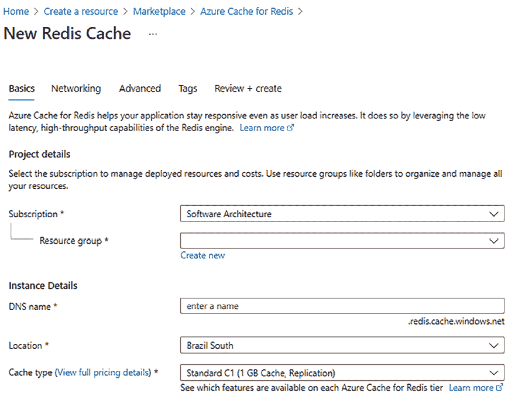

# 在云中选择您的数据存储

Azure，像其他云一样，提供了一系列的存储服务。我们可能考虑的第一种方法是在云中定义一组可扩展的虚拟机，我们可以在这些虚拟机上实现我们的自定义解决方案。例如，我们可以在云托管的虚拟机上创建一个 SQL Server 集群，以增加可靠性和计算能力。然而，通常，自定义架构不是最佳解决方案，也没有充分利用云基础设施的机会。可扩展性、快速设置、关注业务和安全性是在 Azure 上决定您的数据存储时可能考虑的一些标准。为了帮助您，许多**平台即服务**（**PaaS**）的数据存储选项可以是一个很好的解决方案。

因此，本章将不会讨论此类自定义架构，而将主要关注云和 Azure 中可用的各种 PaaS 存储服务。这些服务包括基于普通磁盘空间的可扩展解决方案、关系型数据库、NoSQL 数据库以及如 Redis 这样的内存数据存储。

选择更合适的存储类型不仅基于应用程序的功能需求，还基于性能和扩展需求。实际上，在处理资源进行扩展时会导致性能线性增长，但扩展存储资源并不一定意味着性能的合理增长。简而言之，无论您复制多少数据存储设备，如果多个请求影响相同的数据块，它们将始终排队相同的时间来访问它！

扩展数据会导致读取操作吞吐量线性增长，因为每个副本可以服务不同的请求，但并不意味着写入操作吞吐量有相同的增长，因为同一数据块的所有副本都必须更新！因此，需要更复杂的技术来扩展存储设备，并且并非所有存储引擎的扩展性都相同。

关系型数据库在所有场景下扩展性都不好。因此，扩展需求和地理分布数据的需求在存储引擎的选择以及 SaaS 服务的选择中起着根本的作用。

在本章中，我们将涵盖以下主题：

+   理解不同目的的不同存储库

+   在 SQL 和 NoSQL 文档型数据库之间进行选择

+   Azure Cosmos DB – 管理跨大陆数据库的机会

让我们开始吧！

# 技术要求

本章要求您具备以下条件：

+   Visual Studio 2022 免费社区版或更高版本，并安装所有数据库工具组件。

+   一个免费的 Azure 账户。*第一章*，“理解软件架构的重要性”中的*创建 Azure 账户*小节解释了如何创建一个。

+   为了获得更好的开发体验，我们建议您还安装 Cosmos DB 的本地模拟器，该模拟器可在[`aka.ms/cosmosdb-emulator`](https://aka.ms/cosmosdb-emulator)找到。

+   您可以在[`github.com/PacktPublishing/Software-Architecture-with-C-Sharp-12-and-.NET-8-4E`](https://github.com/PacktPublishing/Software-Architecture-with-C-Sharp-12-and-.NET-8-4E)找到该章节的示例代码。

# 理解不同目的的不同存储库

本节描述了最流行的数据存储技术提供的功能。我们将主要关注它们能够满足的功能需求。性能和扩展功能将在下一节中分析，该节专门用于比较关系型数据库和 NoSQL 数据库。

在 Azure 中，您可以通过在所有 Azure 门户页面顶部的搜索栏中输入产品名称来找到各种产品。

以下小节描述了我们可以用于我们的 C# 项目的各种数据库类型。

## 关系型数据库

这些数据库是最常见和被研究的数据存储类型。它们保证高服务水平并存储了无法衡量的数据量。数十个应用程序被设计用于存储此类数据库中的数据，我们可以在银行、商店、工业等领域找到它们。当您在关系型数据库中存储数据时，基本原则是定义您将在其中保存的实体和属性，并定义这些实体之间正确的关联关系。

几十年来，关系型数据库是设计优秀项目的唯一想象选项。世界上许多大公司都建立了自己的数据库管理系统。Oracle、MySQL 和 MS SQL Server 被许多人列为可以信赖来存储数据的数据库。

通常，云提供多种数据库引擎。Azure 提供了各种流行的数据库引擎，例如 Oracle、MySQL、PostgreSQL 和 SQL Server（Azure SQL）。

关于 Oracle 数据库引擎，Azure 提供了预装了各种 Oracle 版本的配置虚拟机，您可以通过在 Azure 门户搜索栏中输入`Oracle`后得到的建议轻松验证。Azure 费用不包括 Oracle 许可证；它们仅包括计算时间，因此您必须将许可证带到 Azure。

在 Azure 上使用 MySQL，您需要为使用私有服务器实例付费。您产生的费用取决于您拥有的核心数量、必须分配多少内存以及备份保留时间。

MySQL 实例是冗余的，您可以选择本地或地理分布式的冗余：


图 12.1：在 Azure 上创建 MySQL 服务器

Azure SQL 数据库是 Azure 上最早可用的 PaaS 选项之一，因此近年来它发展了很多，这使得它成为最灵活的提供之一。今天，它还包括一种无服务器定价模型，您将按每秒使用的计算量计费。在这里，您可以配置每个数据库使用的资源。当您创建数据库时，您可以选择将其放置在现有的服务器实例上或创建一个新的实例。

在定义解决方案时，您可以选择几种定价选项，Azure 会不断增加这些选项以确保您能够处理云中的数据。基本上，它们因您所需的计算能力而有所不同。

例如，在**数据库事务单元（DTUs）**模型中，费用基于已预留的数据库存储容量以及由参考工作负载确定的线性组合的 I/O 操作、CPU 使用率和内存使用率。考虑到理解 DTUs 精确计算方法的难度，Azure 还提供了基于**核心（vCore）**的模型，您在这里拥有灵活性、控制和透明度，可以单独监控资源消耗。

大概来说，当您增加 DTUs（数据库事务单元）时，数据库的最大性能会线性增加。

您可以在[`learn.microsoft.com/en-us/azure/azure-sql/database/purchasing-models?view=azuresql`](https://learn.microsoft.com/en-us/azure/azure-sql/database/purchasing-models?view=azuresql)找到有关您购买 Azure SQL 数据库的选项的详细信息。


图 12.2：创建 Azure SQL 数据库

您还可以通过启用读取扩展来配置数据复制。这样，您可以提高读取操作的性能。备份保留期对于每个提供级别（基本、标准和高级）是固定的。

如果您选择**是**以**是否要使用 SQL 弹性池？**，则数据库将被添加到弹性池中。添加到同一弹性池的数据库将共享其资源，因此未被数据库使用的资源可以在其他数据库使用 CPU 峰值期间使用。值得一提的是，弹性池只能包含托管在同一服务器实例上的数据库。弹性池是优化资源使用以降低成本的有效方式。

## NoSQL 数据库

关系型数据库给软件架构师带来的最大挑战之一与我们如何处理数据库结构模式变化有关。本世纪初所需的变化敏捷性带来了使用一种名为 NoSQL 的新数据库风格的机会。接下来的子主题将介绍几种类型的 NoSQL 数据库。

### 文档型数据库

最常见的数据库类型，其中包含键和复杂数据，被称为文档。

例如，在 NoSQL 文档型数据库中，关系型表被更通用的集合所取代，这些集合可以包含异构的 JSON 对象。也就是说，集合没有预定义的结构，也没有预定义的字段长度限制（在字符串的情况下），但可以包含任何类型的对象。与每个集合相关联的唯一结构约束是作为主键的属性名称。

更具体地说，每个集合条目可以包含嵌套对象和嵌套在对象属性中的对象集合，即相关实体，在关系型数据库中，这些实体包含在不同的表中并通过外部键连接。在 NoSQL 中，数据库可以嵌套在其父实体中。由于集合条目包含复杂的嵌套对象，而不是像关系型数据库那样简单的属性/值对，因此条目不被称为元组或行，而是*文档*。

在同一集合或不同集合的文档之间不能定义任何关系和/或外部键约束。如果一个文档在其属性中包含另一个文档的主键，那么它这样做是承担风险的。开发者负责维护和保持这些引用的一致性。这是你必须分析的一个权衡。如果你设计的是一个通常依赖于关系型数据库的系统，那么你将无法实现 NoSQL 的优势，同时你也在牺牲数据完整性和冗余。然而，如果你有一个需要灵活性的场景，你必须考虑将 NoSQL 作为一个选项。

最后，NoSQL 存储相当便宜。你可以将大量数据作为 Base64 字符串属性存储。开发者可以定义规则来决定在集合中索引哪些属性。由于文档是嵌套对象，属性是树路径。值得一提的是，你可以指定哪些路径集合和子路径被索引。

几乎所有的 NoSQL 数据库都使用 SQL 的子集或基于 JSON 的语言进行查询，其中查询是 JSON 对象，其路径表示要查询的属性，其值表示已应用于它们的查询约束。

在关系型数据库中，可以通过一对多关系使用嵌套子对象的可能性。然而，在使用关系型数据库时，我们被迫重新定义所有相关表的确切结构，而 NoSQL 集合不对它们包含的对象施加任何预定义的结构。唯一的约束是每个文档必须为主键属性提供一个唯一的值。

诚然，今天我们可以在像 Azure SQL 这样的关系数据库中定义 JSON 列，因此我们可以在定义我们的数据模型时采取混合方法，部分有模式，其他部分则灵活。然而，当我们的对象结构极其多变时，如社交媒体和**物联网**（**IoT**）解决方案，NoSQL 数据库仍然是最佳选择。

然而，它们通常是因为它们在扩展读写操作和更普遍地，在分布式环境中的性能优势而被选择的。它们与关系数据库相比的性能特性将在下一节中讨论。

### 图数据库

社交媒体网站倾向于使用这种类型的数据库，因为数据是以图的形式存储的。

图数据模型是完全非结构化文档的极端情况。整个数据库是一个图，查询可以在其中添加、更改和删除图文档。

在这种情况下，我们有两种类型的文档：节点和关系。虽然关系有一个定义良好的结构（通过关系连接的节点的主键，加上关系名称），但节点完全没有结构，因为属性及其值在节点更新操作中一起添加。

对于你作为软件架构师来说，决定这种在图数据库中展示的结构是否最适合你正在设计的系统的用例是很重要的，始终记住这样的决定可能会使系统比所需的更复杂。

图数据模型是为了表示人们及其操作的对象（媒体、帖子等）的特征以及他们在**社交应用**中的关系而设计的。Gremlin 语言是为了查询图数据模型而专门设计的。我们将在本章中不讨论这一点，但在**进一步阅读**部分有相关参考。

### 关键值数据库

这是一个有用的数据库，用于实现缓存，因为你可以存储键值对。Redis 是它的一个很好的例子，将在本章中详细说明。

### 宽列存储数据库

这是一种数据库，其中每行的相同列可以存储不同的数据。

在本章剩余的部分，我们将详细分析 NoSQL 数据库，这些部分专门用于描述 Azure Cosmos DB 并将其与关系数据库进行比较。

## Redis

Redis 是一种基于键值对的分布式内存存储，支持分布式队列。它可以作为永久性内存存储和数据库数据的 Web 应用程序缓存使用。或者，它可以用作预渲染内容的缓存。

Redis 也可以用来存储 Web 应用程序的用户会话数据。这最初是用 Microsoft SQL Server 完成的，但由于内存数据库提供的性能，Redis 现在是最佳替代品。

实际上，ASP.NET Core 支持会话数据以克服 HTTP 协议无状态的事实。更具体地说，用户数据在页面变化之间保持，存储在 Redis 等服务器端存储中，并通过存储在 cookie 中的会话键进行索引。

与云中的 Redis 服务器交互通常基于提供易于使用界面的客户端实现。.NET 客户端通过`StackExchange.Redis` NuGet 包提供。`StackExchange.Redis`客户端的基本操作已在[`stackexchange.github.io/StackExchange.Redis/Basics`](https://stackexchange.github.io/StackExchange.Redis/Basics)中记录，而完整文档可在[`stackexchange.github.io/StackExchange.Redis`](https://stackexchange.github.io/StackExchange.Redis)找到。

在 Azure 上定义 Redis 服务器的用户界面相当简单：



图 12.3：创建 Redis 缓存

**定价层**下拉菜单允许我们选择可用的内存/复制选项之一。有关如何使用 Azure Redis 凭据和`StackExchange.Redis` .NET 客户端的快速入门指南，请参阅[`docs.microsoft.com/en-us/azure/azure-cache-for-redis/cache-dotnet-core-quickstart`](https://docs.microsoft.com/en-us/azure/azure-cache-for-redis/cache-dotnet-core-quickstart)。

## Azure 存储账户

所有云都提供可扩展和冗余的通用磁盘内存，你可以将其用作虚拟机中的虚拟磁盘或作为外部文件存储。Azure *存储账户*磁盘空间也可以在**表**和**队列**中进行结构化。如果你需要廉价的 blob 存储，请考虑使用此选项。然而，正如我们之前提到的，还有更复杂的选择。根据你的场景，Azure NoSQL 数据库比表是一个更好的选择，而 Azure Redis 比 Azure 存储队列是一个更好的选择。


图 12.4：创建存储账户

在本章的其余部分，我们将重点关注 NoSQL 数据库以及它们与关系数据库的不同之处。接下来，我们将探讨如何选择其中之一。

# 在 SQL 和 NoSQL 面向文档的数据库之间进行选择

作为软件架构师，你可能需要考虑 SQL 和 NoSQL 数据库的一些方面，以决定最适合你的存储选项。在许多情况下，两者都将被需要。这里的关键点无疑将是你的数据组织程度以及数据库将变得多大。

在上一节中，我们提到，作为软件架构师，当数据几乎没有任何预定义结构时，你应该优先考虑使用 NoSQL 面向文档的数据库。它们不仅将可变属性与其所有者保持紧密，而且由于允许相关对象嵌套在属性和集合中，它们还将一些相关对象保持在一起。

非结构化数据可以通过将元组（`t`）的变量属性放置在一个包含属性名称、属性值和`t`的外部键的连接表中，在关系数据库中表示。然而，在这种场景下的问题是性能。实际上，属于单个对象的属性值会散布在可用的内存空间中。在一个小型数据库中，“散布在可用的内存空间中”意味着距离较远但位于同一磁盘上；在一个大型数据库中，意味着距离较远但位于不同的磁盘单元中；在分布式云环境中，意味着距离较远但位于不同——并且可能是地理上分布的——服务器上。

另一方面，在 NoSQL 文档型数据库设计中，我们总是试图将所有可能一起处理的关联对象放入单个条目中。访问频率较低的相关对象被放置在不同的条目中。由于外部键约束不是自动执行的，并且 NoSQL 事务非常灵活，开发者可以在性能和一致性之间选择最佳折衷方案。

重要的是要提到，今天，我们可以在关系数据库中将非结构化数据作为具有 JSON（或 XML）类型的列存储。这种方法允许在关系数据库中实现通常在文档数据库中实现的模式，例如通过在 JSON 列中插入完整对象来避免连接。然而，考虑到它是为此目的而设计的，采用 NoSQL 文档型数据库可以被认为是最佳选择。

因此，我们可以得出结论，当通常一起访问的表可以存储在一起时，关系数据库表现良好。另一方面，NoSQL 文档型数据库自动确保相关数据保持在一起，因为每个条目都将其相关的大部分数据作为嵌套对象包含在内。因此，当 NoSQL 文档型数据库分布到不同的内存和地理上分布的服务器时，它们的表现更好。

不幸的是，扩展存储写操作的唯一方法是根据分片键的值将集合条目分散到几个服务器上。例如，我们可以将所有以**A**开头的用户名记录放在一个服务器上，以**B**开头的用户名记录放在另一个服务器上，依此类推。这样，不同起始字母的用户名的写操作可以并行执行，确保写吞吐量随着服务器数量的线性增长。

然而，如果一个**分片**集合与几个其他集合相关联，不能保证相关记录会被放置在同一个服务器上。此外，在不使用集合分片的情况下，将不同的集合放在不同的服务器上，可以线性地增加写入吞吐量，直到达到每个服务器单个集合的限制，但这并不能解决被迫在多个服务器上执行多个操作以检索或更新通常一起处理的数据的问题。

如果必须以事务方式访问相关分布式对象，并且/或者必须确保结构约束（如外键约束）不被违反，这个问题在关系数据库中会对性能造成灾难性的影响。在这种情况下，所有相关对象必须在事务期间被阻塞，防止其他请求在整个耗时的分布式操作期间访问它们。

NoSQL 文档型数据库不会受到这个问题的影响，并且通过分片以及随之而来的写入扩展输出表现更好。这是因为它们不会将相关数据分布到不同的存储单元，而是将它们存储为同一数据库条目中的嵌套对象。另一方面，它们也面临着不同的问题，例如默认不支持事务。

值得注意的是，在某些情况下，关系数据库通过分片表现良好。一个典型的例子是多租户应用程序。在多租户应用程序中，所有条目集合可以被划分为非重叠的集合，称为**租户**。只有属于同一租户的条目可以相互引用，因此如果所有集合都根据它们的对象租户以相同的方式分片，所有相关记录最终都会落在同一个分片中，即同一个服务器上，并且可以有效地进行导航。

在本章中，我们没有讨论如何使用 Azure SQL 定义分片。如果您想了解更多信息，请参阅官方文档链接：[`docs.microsoft.com/en-us/azure/sql-database/sql-database-elastic-scale-introduction`](https://docs.microsoft.com/en-us/azure/sql-database/sql-database-elastic-scale-introduction).

在云中，多租户应用程序并不罕见，因为向多个不同用户提供相同服务的所有应用程序通常都作为多租户应用程序实现，其中每个租户对应一个用户订阅。因此，关系数据库，如 Azure SQL Server，旨在在云中工作，通常为多租户应用程序提供分片选项。通常，分片不是一个云服务，必须使用数据库引擎命令来定义。在这里，我们不会描述如何使用 Azure SQL Server 定义分片，但“进一步阅读”部分包含了一个指向官方微软文档的链接。以下表格展示了每种数据库方法的优缺点：

| **主题** | **SQL** | **NoSQL 文档型数据库** |
| --- | --- | --- |
| 架构 | 在结构良好的模式中易于处理。今天，可以通过设计具有 JSON/XML 列的混合解决方案来存储非结构化数据。 | 当数据几乎没有任何预定义结构时更受欢迎。 |
| 性能 | 通常在分布式环境中性能较差。 | 通常在读取和写入分布式数据时性能良好。 |
| 语言 | 使用声明性语言查询和更新数据，标准。 | 使用过程性语言查询和更新操作。 |
| 一致性 | 强制使用外键。 | 弱，留给开发者的决定。所有可能一起处理到单个条目中的相关对象。 |
| 事务 | 支持。 | 默认情况下，不支持。 |
| 缩放 | 垂直升级硬件。 | 水平扩展数据分片。 |

表 12.1：每种数据库方法的优缺点

总之，关系数据库提供了独立于存储方式的数据的纯粹逻辑视图，并使用声明性语言查询和更新它们。这简化了开发和系统维护，但在需要写入扩展的分布式环境中可能会引起性能问题。值得注意的是，*第十三章*中介绍的 Entity Framework 等工具有助于在对象和关系数据之间架起桥梁，使关系数据库的开发更加直观。

在 NoSQL 文档型数据库中，您必须手动处理有关如何存储数据的更多细节，以及所有更新和查询操作的一些过程性细节，但这允许您在需要读取和写入扩展的分布式环境中优化性能。另一方面，处理 NoSQL 数据，尤其是涉及 JSON 或 XML 等反序列化格式时，可能会很棘手。这通常需要仔细映射以确保数据完整性，这可能既具有挑战性又容易出错。在下一节中，我们将探讨 Azure Cosmos DB，这是 Azure 的主要 NoSQL 产品，幸运的是，它可以与 Entity Framework 集成，以获得更流畅的开发体验。

# Azure Cosmos DB – 管理跨大陆数据库的机会

Azure Cosmos DB 是 Azure 的主要 NoSQL 产品。Azure Cosmos DB 拥有自己独特的接口，它是 SQL 的子集，但可以配置为使用 MongoDB 接口、Table API 或 Cassandra API。它还可以配置为图数据模型，可以使用 Gremlin 进行查询。

您可以在官方文档中找到有关 Cosmos DB 的更多详细信息：[`docs.microsoft.com/en-us/azure/cosmos-db/`](https://docs.microsoft.com/en-us/azure/cosmos-db/).

Cosmos DB 允许进行复制以实现容错和读取扩展，副本可以地理分布以优化通信性能。此外，您可以指定所有副本放置在哪个数据中心。用户还可以选择启用所有副本的写入功能，以便在数据写入的地理位置立即可用。通过分片实现写入扩展，用户可以通过定义哪些属性用作分片键来配置。

## 创建 Azure Cosmos DB 帐户

您可以通过在 Azure 门户搜索栏中键入 `Cosmos DB` 并点击**创建**来定义 Cosmos DB 帐户。以下页面将出现：


图 12.5：创建 Azure Cosmos DB 帐户

例如，如果您选择**核心（SQL）**选项，您选择的帐户名称在资源 URI 中用作 `{account_name}.documents.azure.com`。然后，您可以决定主数据库将放置在哪个位置以及容量模式。您可以在[`docs.microsoft.com/en-us/azure/cosmos-db/throughput-serverless`](https://docs.microsoft.com/en-us/azure/cosmos-db/throughput-serverless)上查看有关可用容量模式的更多信息。

微软不断改进其许多 Azure 服务。了解任何 Azure 组件新功能的最佳方式是定期检查其文档。

在**全局分布**选项卡上，**多区域写入**切换按钮允许您在地理分布的副本上启用写入。如果您不这样做，所有写入操作都将路由到主位置。最后，您还可以在创建过程中定义网络连接性、备份策略和加密。

## 创建 Azure Cosmos DB 容器

一旦您创建了您的 Azure Cosmos DB – Core SQL 帐户，选择**数据资源管理器**以在它们内部创建数据库和容器。容器是配置吞吐量和存储的可扩展性单元，当您通过配置吞吐量容量模式决定时可用。

由于数据库仅有一个名称而没有配置，您可以直接**添加容器**，然后将数据库放置在您希望的位置：


图 12.6：在 Azure Cosmos DB 中添加容器

在这里，您可以决定数据库和容器的名称以及用于分片的属性（分区键）。由于 NoSQL 条目是对象树，属性名称指定为路径。您还可以添加值必须唯一的属性。

然而，ID 的唯一性是在每个分区内部进行检查的，因此此选项仅在特定情况下有用，例如多租户应用程序（其中每个租户都包含在单个分片中）。费用取决于您选择的集合吞吐量。

这就是您需要将所有资源参数针对您的需求进行定位的地方。吞吐量以每秒请求数量表示，其中每秒请求数量定义为每秒执行 1 KB 读取时的吞吐量。因此，如果您检查**配置数据库吞吐量**选项，所选的吞吐量是整个数据库共享的，而不是作为单个集合保留。

## 访问 Azure Cosmos DB

在创建 Azure Cosmos 容器之后，您将能够访问数据。要获取连接信息，您可以选择**密钥**菜单。在那里，您将看到连接到您的 Cosmos DB 账户所需的所有信息。连接信息页面将为您提供账户 URI 和两个连接密钥，这些密钥可以互换使用以连接到账户。


图 12.7：连接信息页面

还有一些具有只读权限的密钥。每个密钥都可以重新生成，每个账户都有两个等效的密钥，就像许多其他 Azure 组件一样。这种方法使得操作可以高效地处理；也就是说，当一个密钥更改时，另一个密钥会被保留。因此，现有的应用程序可以在升级到新密钥之前继续使用另一个密钥。

## 定义数据库一致性

考虑到您处于分布式数据库的上下文中，Azure Cosmos DB 允许您定义默认的读取一致性级别。通过在您的 Cosmos DB 账户主菜单中选择**默认一致性**，您可以选择应用于所有容器的默认复制一致性。

此默认设置可以在每个容器中覆盖，无论是通过数据资源管理器还是通过编程方式。读写操作中的不一致性问题是由数据复制引起的后果。更具体地说，如果读取操作在不同的副本上执行，而这些副本接收到了不同的部分更新，那么各种读取操作的结果可能是不连贯的。

以下是可以用的一致性级别。这些已按从最弱到最强的顺序排列：

+   **最终一致性**：经过足够的时间后，如果没有进一步的写入操作，所有读取将收敛并应用所有写入。写入的顺序也不保证，所以在写入正在处理时，您也可能读取到之前读取的较早版本。

+   **一致性前缀**：所有写入都在所有副本上以相同的顺序执行。因此，如果有 `n` 个写入操作，每个读取都与应用前 `m` 个写入的结果一致，其中 `m` 小于或等于 `n`。

+   **会话**：这与一致性前缀相同，但还保证每个写者在其所有后续读取操作中看到其自己的写入结果，并且每个读者的后续读取是一致的（要么是相同的数据库，要么是其更新版本）。

+   **有界陈旧性**：这与延迟时间`Delta`或多个操作`N`相关联。每次读取都会看到在时间`Delta`之前（或最后`N`个操作之前）执行的所有写操作的结果。也就是说，其读取与所有写操作的结果收敛，最大时间延迟为`Delta`（或最大操作延迟为`N`）。

+   **强一致性**：这是有界陈旧性与`Delta = 0`的结合。在这里，每次读取都反映了所有之前的写操作的结果。

可以以牺牲性能为代价获得最强的一致性。默认情况下，一致性设置为**会话**，这是在一致性和性能之间的一种良好折衷。在应用程序中处理较低级别的一致性很困难，并且通常只有在会话是只读或只写的情况下才可接受。

如果你选择数据库容器中的**数据探索器**菜单中的**设置**选项，你可以配置要索引哪些路径以及将哪种索引应用于每个路径的数据类型。该配置由一个 JSON 对象组成。让我们分析其各种属性：

```cs
{
"indexingMode": "consistent",
"automatic": true,
    ... 
```

如果你将`indexingMode`设置为`none`而不是`consistent`，则不会生成索引，并且可以将集合用作由集合的主键索引的键值字典。在这种情况下，不会生成二级索引，因此无法有效地搜索主键。

当`automatic`设置为`true`时，所有文档属性都会自动索引：

```cs
{
    ...
    "includedPaths": [
{
"path": "/*",
"indexes": [
{
"kind": "Range",
"dataType": "Number",
"precision": -1
},
{
"kind": "Range",
"dataType": "String",
"precision": -1
},
{
"kind": "Spatial",
"dataType": "Point"
}
]
}
]
},
... 
```

`includedPaths`中的每个条目指定了一个路径模式，例如`/subpath1/subpath2/?`（设置仅应用于`/subpath1/subpath2/property`）或`/subpath1/subpath2/*`（设置应用于所有以`/subpath1/subpath2/`开头的路径）。

当设置必须应用于集合属性中包含的子对象时，模式包含`[]`符号；例如，`/subpath1/subpath2/[]/?`，`/subpath1/subpath2/[]/childpath1/?`等等。设置指定要应用于每个数据类型（字符串、数字、地理点等）的索引类型。范围索引用于比较操作，而如果需要进行等价比较，散列索引则更有效。

可以指定一个精度，即所有索引键中使用的最大字符数或数字数。`-1`表示最大精度，并且总是推荐使用：

```cs
 ...
    "excludedPaths": [
{
"path": "/\"_etag\"/?"
}
] 
```

包含在`excludedPaths`中的路径根本不会被索引。索引设置也可以通过编程方式指定。

在这里，你有两种连接到 Cosmos DB 的选项：使用适用于你首选编程语言的官方客户端或使用 Cosmos DB 的 Entity Framework Core 提供程序。在接下来的小节中，我们将探讨这两种选项。然后，我们将通过一个实际示例描述如何使用 Cosmos DB 的 Entity Framework Core 提供程序。

## Cosmos DB 客户端

.NET 8 的 Cosmos DB 客户端可通过`Microsoft.Azure.Cosmos` NuGet 包获得。它提供了对所有 Cosmos DB 功能的完全控制，而 Cosmos DB Entity Framework 提供程序更容易使用，但隐藏了一些 Cosmos DB 的特性。按照以下步骤通过.NET 8 的官方 Cosmos DB 客户端与 Cosmos DB 交互：

以下代码示例展示了使用客户端组件创建数据库和容器。任何操作都需要创建一个客户端对象。不要忘记，当不再需要客户端时，必须通过调用其`Dispose`方法（或通过将引用它的代码放在`using`语句中）来释放客户端：

```cs
public static async Task CreateCosmosDB()
{
    using var cosmosClient = new CosmosClient(endpoint, key);
    Database database = await
        cosmosClient.CreateDatabaseIfNotExistsAsync(databaseId);
    ContainerProperties cp = new ContainerProperties(containerId,
        "/DestinationName");
    Container container = await database.CreateContainerIfNotExistsAsync(cp);
    await AddItemsToContainerAsync(container);
} 
```

在集合创建期间，你可以传递一个`ContainerProperties`对象，其中你可以指定一致性级别、如何索引属性以及所有其他集合功能。

然后，你必须定义与你要在集合中操作的 JSON 文档结构相对应的.NET 类。你也可以使用`JsonProperty`属性将类属性名称映射到 JSON 名称，如果它们不相等的话：

```cs
public class Destination
{
    [JsonPropertyName("id")]
    public string Id { get; set; }
    public string DestinationName { get; set; }
    public string Country { get; set; }
    public string Description { get; set; }
    public Package[] Packages { get; set; }
} 
```

NoSQL 意味着“不仅 SQL”，因此也可以映射属性。NoSQL 的伟大之处在于，你必须在不会损害你连接的文档中的其他属性或信息的情况下映射这些属性。

一旦你有所有必要的类，你可以使用客户端方法`ReadItemAsync`、`CreateItemAsync`和`DeleteItemAsync`。你还可以使用接受 SQL 命令的`QueryDefinition`对象来查询数据。你可以在[`docs.microsoft.com/en-us/azure/cosmos-db/sql-api-get-started`](https://docs.microsoft.com/en-us/azure/cosmos-db/sql-api-get-started)找到这个库的完整介绍。

## Cosmos DB Entity Framework Core 提供程序

Cosmos DB 的 Entity Framework Core 提供程序包含在`Microsoft.EntityFrameworkCore.Cosmos` NuGet 包中。一旦将其添加到项目中，你可以按照与你在*第十三章*，“使用 C#与数据交互 – Entity Framework Core”中使用 SQL Server 提供程序类似的方式进行操作，但有一些不同之处。让我们看看：

+   由于 Cosmos DB 数据库没有结构需要更新，因此没有迁移。相反，它们有一个确保数据库以及所有必要的集合被创建的方法：

    ```cs
    context.Database.EnsureCreated(); 
    ```

+   默认情况下，`DBContext`中的`DbSet<T>`属性映射到一个唯一的容器，因为这是最经济的选项。你可以通过以下配置指令显式指定你想要将某些实体映射到哪个容器来覆盖此默认设置：

    ```cs
    builder.Entity<MyEntity>()
         .ToContainer("collection-name"); 
    ```

+   实体类上唯一的实用注解是`Key`属性，当主键不命名为`Id`时，它成为强制性的。

+   主键必须是字符串，并且不能自动递增，以避免在分布式环境中的同步问题。可以通过生成 GUID 并将其转换为字符串来确保主键的唯一性。

+   在定义实体之间的关系时，你可以指定一个实体或一组实体属于另一个实体，在这种情况下，它将与父实体一起存储。

我们将在第二十一章的“如何在云中选择你的数据存储”部分中查看 Cosmos DB 的 Entity Framework 提供者的使用情况，*案例研究*。

# 摘要

在本章中，我们探讨了 Azure 中可用的主要存储选项，并学习了何时使用它们。然后，我们比较了关系型数据库和非关系型数据库。我们指出，关系型数据库提供自动一致性检查和事务隔离，但非关系型数据库更便宜，并且提供更好的性能，尤其是在分布式写入占平均工作负载很大比例的情况下。

然后，我们描述了 Azure 的主要非关系型选项 Cosmos DB，并解释了如何配置它以及如何与客户端连接。

最后，我们学习了如何使用 Entity Framework Core 与 Cosmos DB 交互。在这里，我们学习了如何决定在应用程序涉及的所有数据家族中，是使用关系型数据库还是非关系型数据库。因此，你可以选择确保在您的每个应用程序中数据一致性、速度和并行访问数据之间取得最佳折衷的数据存储类型。

在下一章中，我们将学习如何使用 C#和 Entity Framework Core 与数据交互。

# 问题

1.  Redis 是关系型数据库的有效替代品吗？

1.  非关系型数据库是关系型数据库的有效替代品吗？

1.  在关系型数据库中，哪种操作更难进行扩展？

1.  非关系型数据库的主要弱点是什么？它们的主要优势是什么？

1.  你能列出所有 Cosmos DB 的一致性级别吗？

1.  我们可以使用自动递增的整数键与 Cosmos DB 一起使用吗？

1.  哪种 Entity Framework 配置方法用于在相关的父文档中存储实体？

1.  使用 Cosmos DB 能否有效地搜索嵌套集合？

# 进一步阅读

+   以下是对 Gremlin 语言的引用，该语言由 Cosmos DB 支持：[`tinkerpop.apache.org/docs/current/reference/#graph-traversal-steps`](http://tinkerpop.apache.org/docs/current/reference/#graph-traversal-steps)。

+   以下是对 Cosmos DB 图数据模型的简要描述：[`docs.microsoft.com/en-us/azure/cosmos-db/graph-introduction`](https://docs.microsoft.com/en-us/azure/cosmos-db/graph-introduction)。

+   如何使用 Cosmos DB 的官方 .NET 客户端的详细信息可以在 [`docs.microsoft.com/en-us/azure/cosmos-db/sql-api-dotnetcore-get-started`](https://docs.microsoft.com/en-us/azure/cosmos-db/sql-api-dotnetcore-get-started) 找到。关于我们在本章中提到的 `MvcControlsToolkit.Business.DocumentDB` NuGet 包的良好介绍是 *DNCMagazine* 第 34 期中的 *Fast Azure Cosmos DB Development with the DocumentDB Package* 文章。这可以从 [`www.dotnetcurry.com/microsoft-azure/aspnet-core-cosmos-db-documentdb`](https://www.dotnetcurry.com/microsoft-azure/aspnet-core-cosmos-db-documentdb) 下载。

# 在 Discord 上了解更多信息

要加入这本书的 Discord 社区——在那里您可以分享反馈、向作者提问，并了解新书发布——请扫描下面的二维码：

[`packt.link/SoftwareArchitectureCSharp12Dotnet8`](https://packt.link/SoftwareArchitectureCSharp12Dotnet8)


