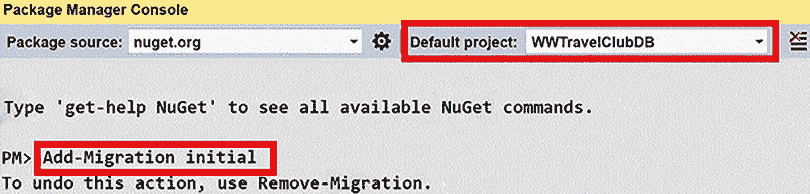
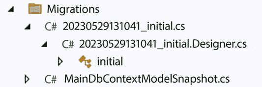

# 第十三章：在 C#中与数据交互 - Entity Framework Core

正如我们在第七章中提到的，*理解软件解决方案中的不同领域*，软件系统被组织成层，通过接口和类进行通信，这些接口和类不依赖于每个层的实现特性。当软件是商业/企业系统时，它通常至少包含三个层：数据层、业务层和表示层，如果软件基于经典层架构（参见第七章的*经典层架构*部分）。

如果应用程序基于洋葱架构，最外层包含表示逻辑、驱动程序和测试逻辑，那么就有一个应用层，最后是一个领域层（参见第七章的*洋葱架构*部分）。虽然，在洋葱架构中，层被定义的方式略有不同，但洋葱架构的三个层的功能基本上与经典层架构的三个层相同。

然而，尽管所有可能的架构选择之间都有所不同，但经验证明，处理数据所需的主要功能相当标准化。

更具体地说，在第七章中描述的所有架构中，数据处理层的主要目的是将数据从数据存储子系统映射到对象，反之亦然。

在经典数据层的情况下，这些对象是没有方法的普通对象，而在领域层的情况下，它们是具有实现应用程序领域逻辑的方法的丰富对象。相反，数据层在与其普通对象关联的仓储类中实现应用程序的领域逻辑（参见第七章的*仓储和单元工作模式*部分）。

这导致了通用框架的概念，以大量声明性方式实现数据层。这些工具被称为**对象关系映射**（**ORM**）工具，因为它们是基于关系数据库的数据存储子系统。然而，它们也与现代非关系存储（如 MongoDB 和 Azure Cosmos DB）很好地协同工作，因为它们的数据模型比纯关系模型更接近目标对象模型。

ORMs 通过将映射数据到对象以及反之亦然的负担分离出来，从而改进并简化了整个开发过程，因此开发者可以专注于业务领域的特性。

在本章中，我们将涵盖以下主题：

+   理解 ORM 基础

+   配置 Entity Framework Core

+   Entity Framework Core 迁移

+   编译模型

+   使用 Entity Framework Core 查询和更新数据

+   部署你的数据层

+   理解 Entity Framework Core 高级功能

本章将描述 ORM 及其配置方法，然后重点关注包含在.NET 8 中的 ORM：Entity Framework Core。

在深入研究 ORM 基础知识之前，让我们看看遵循本章中实际示例所需的技术要求。

# 技术要求

本章需要免费 Visual Studio 2022 Community Edition 或更高版本，并安装所有数据库工具。

本章中的所有概念都将通过实际示例进行阐明。您可以在[`github.com/PacktPublishing/Software-Architecture-with-C-Sharp-12-and-.NET-8-4E`](https://github.com/PacktPublishing/Software-Architecture-with-C-Sharp-12-and-.NET-8-4E)找到本章的代码。

# 理解 ORM 基础知识

ORM 将关系数据库表映射到内存中的对象集合，其中对象属性对应于数据库表列。来自 C#的类型，如布尔值、数值类型和字符串，都有对应的数据库类型。如果映射的数据库中没有 GUID，则 GUID 类型将映射到其等效的字符串表示形式。所有日期和时间类型都映射到 C#的`DateTime`，当日期/时间不包含时区信息时；映射到`DateTimeOffset`，当日期/时间包含显式时区信息时；映射到`DateOnly`，当类型仅包含日期信息时；或映射到`TimeOnly`，当类型仅包含时间信息时。任何数据库时间持续时间都映射到`TimeSpan`。最后，单字符不应映射到数据库字段。

由于大多数面向对象语言的字符串属性没有与之关联的长度限制（而数据库字符串字段通常有长度限制），因此在数据库映射配置中考虑了数据库限制。一般来说，当需要在数据库类型和面向对象语言类型之间指定选项时，这些选项在映射配置中声明。

整个配置的定义方式取决于具体的 ORM。Entity Framework Core 提供了三种选项：

+   数据注释（属性属性）

+   命名约定

+   基于配置对象和方法的流畅配置接口

虽然流畅式接口可以用来指定任何配置选项，但数据注释和命名约定可以用于其中较小的一部分。

个人而言，我更喜欢使用流畅式接口来设置大多数设置。我只使用命名约定来指定具有 ID 属性名的主体键，因为我发现依赖命名约定来设置更复杂的设置非常危险。实际上，在命名约定上没有编译时检查，因此重工程操作可能会错误地更改或破坏一些 ORM 设置。

我主要使用数据注释来指定属性可能值的约束，例如值的最大长度或属性是必需的且不能为 null 的事实。实际上，这些约束限制了每个属性中指定的类型，因此将它们放置在它们应用的属性旁边可以增加代码的可读性。

通过使用流畅接口更好地分组和组织所有其他设置，可以提高代码的可读性和可维护性。

每个 ORM 都通过称为**提供程序**或**连接器**的数据库特定适配器来适应特定的数据库类型（Oracle、MySQL、SQL Server 等）。Entity Framework Core 为大多数可用的数据库引擎提供了提供程序。

提供程序的全列表可以在[`docs.microsoft.com/en-US/ef/core/providers/`](https://docs.microsoft.com/en-US/ef/core/providers/)找到。

适配器对于数据库类型之间的差异、事务处理方式以及 SQL 语言未标准化的所有其他功能都是必要的。

表之间的关系通过对象指针来表示。例如，在一对多关系中，映射到关系一端的类包含一个集合，该集合填充了关系多端的相关对象。另一方面，映射到关系多端的类有一个简单的属性，该属性填充了与关系一端唯一相关联的对象。

在一对一关系的情况下，两个类都有一个填充了伴随对象的属性，而在多对多关系的情况下，两个类都包含一个填充了相关对象的集合。

整个数据库（或只是其中的一部分）由一个内存缓存类表示，该类包含每个映射的数据库表的集合。首先，在内存缓存类的实例上执行查询和更新操作，然后该实例与数据库同步。

Entity Framework Core 使用的内存缓存类称为`DbContext`，它还包含映射配置。

开发者可以通过从它继承并在重写的方法中添加他们的数据库映射指令来自定义 Entity Framework Core 提供的`DbContext`类。

总结来说，`DbContext`子类实例包含与数据库同步的 DB 的部分快照，以获取/更新实际数据。

使用内存缓存类的集合上的方法调用执行数据库查询。实际的 SQL 是在同步阶段创建和执行的。例如，Entity Framework Core 在映射到数据库表的集合上执行**语言集成查询**（**LINQ**）查询。

通常，LINQ 查询生成`IEnumerable`实例，即元素在查询结束时并未计算，而是在实际尝试从其中检索集合元素时才进行计算。这被称为延迟评估或延迟执行。其工作原理如下：

+   从`DbContext`的映射集合开始的 LINQ 查询创建了一个名为`IQueryable`的特定子类型`IEnumerable`。

+   `IQueryable`包含发出数据库查询所需的所有信息，但实际的 SQL 是在检索`IQueryable`的第一个元素时生成和执行的。

+   通常，每个 Entity Framework 查询都以`ToListAsync`或`ToArrayAsync`操作结束，该操作将`IQueryable`转换为列表或数组，从而在数据库上实际执行查询。

+   如果预期查询将返回单个元素或没有任何元素，我们通常执行一个`SingleOrDefaultAsync`操作，该操作返回一个元素（如果有），或`null`。当预期有多个结果但只需要一个时，也可以使用此操作。在这种情况下，我们可能还会使用`LastOrDefaultAsync`。

+   如果我们只需要计算总结果，例如，为了合理组织分页信息，我们可以使用`CountAsync()`。

此外，对 DB 表中的新实体进行更新、删除以及添加操作是通过模拟在表示数据库表的`DbContext`集合属性上执行这些操作来完成的。然而，实体只能通过在内存集合中通过查询加载后以这种方式进行更新或删除。通常，更新查询需要根据需要修改实体的内存表示，而删除查询则需要从其内存映射集合中删除实体的内存表示。在 Entity Framework Core 中，删除操作是通过调用集合的`Remove(entity)`方法来执行的。

添加新实体没有其他要求。只需将新实体添加到内存集合中即可。对各种内存集合进行的更新、删除和添加操作实际上是通过显式调用 DB 同步方法传递到数据库中的。

例如，当你调用`DbContext.SaveChangesAsync()`方法时，Entity Framework Core 会将`DbContext`实例上执行的所有更改传递到数据库中。

在同步操作期间传递到数据库中的更改是在单个事务中执行的。此外，对于具有显式事务表示的 ORM，如 Entity Framework Core，如果同步操作在事务的作用域内执行，则它将使用该事务而不是创建一个新事务。

本章的剩余部分解释了如何使用 Entity Framework Core，以及一些基于本书 WWTravelClub 用例的示例代码。

# 配置 Entity Framework Core

由于，正如在第七章，*理解软件解决方案中的不同领域* 中详细说明的，数据库处理被限制在专用应用程序层内，因此将 Entity Framework Core (`DbContext`) 定义在单独的库中是一种良好的做法。因此，我们需要定义一个 .NET 类库项目。

我们有两种不同类型的库项目：**.NET Standard** 和 **.NET Core**。请参阅第五章，*在 C# 12 中实现代码重用*，以了解各种库的讨论。

由于 .NET 库与特定的 .NET Core 版本相关联，.NET Standard 2.0 库具有广泛的应用范围，因为它们可以与任何大于 2.0 的 .NET 版本以及旧版的 .NET Framework 4.7 及以上版本一起工作。

由于我们的库不是通用库（它只是特定 .NET 8 应用程序的一个组件），我们不必选择 .NET Standard 库项目，而可以直接选择 .NET 8 库。我们的 .NET 8 库项目可以创建和准备如下：

1.  打开 Visual Studio，点击 **创建新项目** 然后选择 **类库**。

1.  将新项目命名为 `WWTravelClubDB` 并接受整个 Visual Studio 解决方案使用相同的名称。

1.  在接下来的窗口中，选择 .NET 8 作为目标框架。

1.  我们必须安装所有与 Entity Framework Core 相关的依赖项。安装所有必要依赖项的最简单方法是将我们打算使用的数据库引擎（在我们的例子中是 SQL Server）的 NuGet 包添加进来——正如我们在第十章，*选择最佳云解决方案* 中提到的。

1.  实际上，任何提供程序都会安装所有必需的包，因为它将它们作为依赖项。所以，让我们添加最新稳定的 `Microsoft.EntityFrameworkCore.SqlServer` 版本。如果您打算使用多个数据库引擎，您也可以添加其他提供程序，因为它们可以并行工作。在本章的后面部分，我们将安装其他包含我们需要的工具的 NuGet 包来处理我们的 Entity Framework Core 配置。

1.  让我们将默认的 `Class1` 类重命名为 `MainDbContext`。`Class1` 类会自动添加到类库中。现在，让我们用以下代码替换其内容：

    ```cs
    using System;
    using Microsoft.EntityFrameworkCore;
    namespace WWTravelClubDB
    {
        public class MainDbContext: DbContext
        {
            public MainDbContext(DbContextOptions options)
                : base(options)
            {
            }
            protected override void OnModelCreating(ModelBuilder
            builder)
            {
            }
        }
    } 
    ```

1.  我们从 `DbContext` 继承，并将 `DbContextOptions` 传递给 `DbContext` 构造函数。`DbContextOptions` 包含创建选项，例如数据库连接字符串，这取决于目标数据库引擎。

1.  所有已映射到数据库表的集合都将作为 `MainDbContext` 的属性添加。映射配置将在重写的 `OnModelCreating` 方法中定义，该方法通过参数传递的 `ModelBuilder` 对象进行帮助。

下一步是创建代表表的所有类。这些被称为实体。我们需要为每个我们想要映射的数据库表创建一个实体类。让我们在项目根目录中创建一个`Models`文件夹来存放它们。下一小节将解释如何定义所有必需的实体。

## 定义数据库实体

数据库设计，就像整个应用程序设计一样，是按迭代组织的（参见*第一章，理解软件架构的重要性*）。让我们假设在第一次迭代中，我们需要一个包含两个数据库表的原型：一个用于所有旅行套餐，另一个用于所有由套餐引用的位置。每个套餐只覆盖一个位置，而单个位置可能被多个套餐覆盖，因此这两个表通过一对一的关系连接。

因此，让我们从位置数据库表开始。正如我们在上一节末尾提到的，我们需要一个实体类来表示这个表的行。让我们称这个实体类为`Destination`：

```cs
namespace WWTravelClubDB.Models
{
    public class Destination
    {
        public int Id { get; set; }
        public required string Name { get; set; }
        public required string Country { get; set; }
        public string? Description { get; set; }
    }
} 
```

在上面的代码中，所有数据库字段都必须由可读/写的 C#属性表示。由于`Name`和`Country`属性都是必需的，但我们没有定义构造函数，所以我们添加了`required`关键字来指示编译器，每当创建一个未初始化它们的实例时，都会发出错误信号。

假设每个目的地就像一个城镇或地区，可以通过其名称和所在国家来定义，并且所有相关信息都包含在其`Description`中。在未来迭代中，我们可能会添加更多字段。`Id`是一个自动生成的键。

然而，现在，我们需要添加有关所有字段如何映射到数据库字段的信息。在 Entity Framework Core 中，所有原始类型都由特定于数据库引擎的提供程序自动映射到数据库类型（在我们的情况下，是 SQL Server 提供程序）。

我们唯一关心的是以下几点：

+   **字符串长度限制**：可以通过为每个字符串属性应用适当的`MaxLength`和`MinLength`属性来考虑。所有对实体配置有用的属性都包含在`System.ComponentModel.DataAnnotations`和`System.ComponentModel.DataAnnotations.Schema`命名空间中。因此，将它们都添加到所有实体定义中是一个好的实践。

+   **指定哪些字段是必需的，哪些是可选的**：如果项目没有使用新的**可空引用类型**功能，则默认情况下，所有引用类型（例如所有字符串）都被假定为可选的，而所有值类型（例如数字和 GUID）都被假定为必需的。如果我们想使引用类型成为必需的，那么我们必须用`Required`属性来装饰它。另一方面，如果我们想使`T`类型属性成为可选的，而`T`是值类型，或者可空引用类型功能已开启，那么我们必须将`T`替换为`T?`。默认情况下，.NET 8 项目已启用新的可空引用类型功能。

+   **指定哪个属性代表主键**：可以通过用`Key`属性装饰一个属性来指定键。然而，如果没有找到`Key`属性，则将名为`Id`的属性（如果有的话）视为主键。在我们的情况下，不需要`Key`属性。

由于每个目标都在一对一关系的**一侧**，它必须包含相关包实体的集合；否则，在 LINQ 查询的子句中引用相关实体将会很困难。这个集合在我们的 LINQ 查询中将扮演基本角色，并且将由 Entity Framework Core 填充。然而，正如我们将在本章后面看到的那样，在大多数数据库更新操作中必须忽略它。因此，为了避免编译器警告，最佳选项是将它们分配给 null 不可忽略的假默认值：`null!`。

将所有内容组合起来，`Destination`类的最终版本如下：

```cs
using System.Collections.Generic;
using System.ComponentModel.DataAnnotations;
using System.ComponentModel.DataAnnotations.Schema;
namespace WWTravelClubDB.Models
{
    public class Destination
    {
        public int Id { get; set; }
        [MaxLength(128)]
        Public required string Name { get; set; }
        [MaxLength(128)]
        Public required string Country { get; set; }
        public string? Description { get; set; }
        public ICollection<Package> Packages { get; set; } = null!
    }
} 
```

由于`Description`属性没有长度限制，它将使用不定长度的 SQL Server `nvarchar(MAX)`字段实现。我们可以以类似的方式编写`Package`类的代码：

```cs
using System;
using System.ComponentModel.DataAnnotations;
using System.ComponentModel.DataAnnotations.Schema;
namespace WWTravelClubDB.Models
{
    public class Package
    {
        public int Id { get; set; }
        [MaxLength(128)]
        Public required string Name { get; set; }
        [MaxLength(128)]
        public string? Description { get; set; }
        public decimal Price { get; set; }
        public int DurationInDays { get; set; }
        public DateTime? StartValidityDate { get; set; }
        public DateTime? EndValidityDate { get; set; }
        public Destination MyDestination { get; set; } = null!
        public int DestinationId { get; set; }
    }
} 
```

每个包都有持续的天数，以及可选的开始和结束日期，这些日期是包报价有效的。`MyDestination`通过它们与`Destination`实体之间的一对多关系将包与其目的地连接起来，而`DestinationId`是同一关系的外部键。

虽然指定外部键不是必需的，但这是一个好习惯，因为这是指定关系某些属性的唯一方式。例如，在我们的情况下，由于`DestinationId`是`int`（非可空类型），因此它是必需的。

因此，这里的关系是一对多，而不是（0，1）到多。将`DestinationId`定义为`int?`而不是`int`将使一对多关系变成（0，1）到多关系。此外，正如我们将在本章后面看到的那样，有一个外键的显式表示大大简化了更新操作和一些查询。

在下一节中，我们将解释如何定义表示数据库表的内存集合。

## 定义映射的集合

一旦我们定义了所有表示数据库行的面向对象实体，我们需要定义表示数据库表的内存集合。正如我们在*理解 ORM 基础*部分中提到的，所有数据库操作都映射到这些集合的操作（本章的*使用 Entity Framework Core 查询和更新数据*部分解释了这一点）。对于每个实体`T`，我们只需要在`DbContext`中添加一个`DbSet<T>`集合属性就足够了。通常，这些属性的名称是通过将实体名称复数化得到的。因此，我们需要向我们的`MainDbContext`添加以下两个属性：

```cs
public DbSet<Package> Packages { get; set; }
public DbSet<Destination> Destinations { get; set; } 
```

到目前为止，我们已经将数据库内容转换成了属性、类和数据注释。然而，Entity Framework 需要进一步的信息来与数据库交互。下一小节将解释如何提供这些信息。

## 完成映射配置

我们在实体定义中无法指定的映射配置信息必须通过基于流畅接口的配置代码添加。添加此类配置信息的最简单方法是通过使用`OnModelCreating DbContext`方法。与实体`T`相关的每一项配置信息都从`builder.Entity<T>()`开始，然后通过调用一个指定此类约束的方法继续。进一步嵌套的调用指定约束的进一步属性。例如，我们的多对一关系可以配置如下：

```cs
builder.Entity<Destination>()
    .HasMany(m => m.Packages)
    .WithOne(m => m.MyDestination)
    .HasForeignKey(m => m.DestinationId)
    .OnDelete(DeleteBehavior.Cascade); 
```

关系的两侧通过我们添加到实体的导航属性来指定。`ForeignKey`指定外部键。最后，`OnDelete`指定在删除目标时对包的处理。在我们的例子中，它执行与该目标相关的所有包的级联删除。

同样的配置也可以从关系的另一端开始定义，即从`builder.Entity<Package>()`开始。显然，开发者必须只选择这两种选项之一：

```cs
builder.Entity<Package>()
    .HasOne(m => m.MyDestination)
    .WithMany(m => m.Packages)
    .HasForeignKey(m => m.DestinationId)
    .OnDelete(DeleteBehavior.Cascade); 
```

唯一的区别是，由于我们从关系的另一端开始，之前的`HasMany-WithOne`方法被`HasOne-WithMany`方法所取代。在这里，我们也可以选择每个十进制属性在映射的数据库字段中的表示精度。默认情况下，十进制数由 18 位数字和 2 位小数表示。您可以使用类似以下内容为每个属性更改此设置：

```cs
...
.Property(m => m.Price)
        .HasPrecision(10, 3); 
```

`ModelBuilder builder`对象允许我们使用如下方式指定数据库索引：

```cs
builder.Entity<T>()
   .HasIndex(m => m.PropertyName); 
```

多属性索引的定义如下：

```cs
builder.Entity<T>()
    .HasIndex("propertyName1", "propertyName2", ...); 
```

从版本 5 开始，索引也可以通过应用于类的属性来定义。以下是一个单属性索引的例子：

```cs
[Index(nameof(Property), IsUnique = true)]
public class MyClass
{
    public int Id { get; set; }
    [MaxLength(128)]
    public string Property { get; set; }
} 
```

以下是一个多属性索引的例子：

```cs
[Index(nameof(Property1), nameof(Property2), IsUnique = false)]
public class MyComplexIndexClass
{
    public int Id { get; set; }
    [MaxLength(64)]
    public string Property1 { get; set; }
    [MaxLength(64)]
    public string Property2 { get; set; }
} 
```

针对实体的特定配置选项也可以分组到单独的配置类中，每个实体一个：

```cs
internal class DestinationConfiguration :
    IEntityTypeConfiguration<Destination>
{
    public void Configure(EntityTypeBuilder<Destination> builder)
    {
        builder
            .HasIndex(m => m.Country);
        builder
            .HasIndex(m => m.Name);
       ...
    }
} 
```

这些类必须实现`IEntityTypeConfiguration<>`接口，该接口的唯一方法是`Configure`。然后，可以使用类级别属性声明配置类：

```cs
[EntityTypeConfiguration(typeof(DestinationConfiguration))]
public class Destination
{
  ... 
```

配置类也可以从上下文类的`OnModelCreating`方法中调用：

```cs
new DestinationConfiguration()
         .Configure(builder.Entity<Destination>()); 
```

还可以通过以下方式添加在程序集中定义的所有配置信息：

```cs
builder.ApplyConfigurationsFromAssembly(typeof(MainDbContext).Assembly); 
```

如果我们添加所有必要的配置信息，那么我们的`OnModelCreating`方法将如下所示：

```cs
protected override void OnModelCreating(ModelBuilder builder)
{
    builder.Entity<Destination>()
        .HasMany(m => m.Packages)
        .WithOne(m => m.MyDestination)
        .HasForeignKey(m => m.DestinationId)
        .OnDelete(DeleteBehavior.Cascade);
    new DestinationConfiguration()
                .Configure(builder.Entity<Destination>());
    new PackageConfiguration()
                .Configure(builder.Entity<Package>());
} 
```

与两个配置类一起：

```cs
using Microsoft.EntityFrameworkCore;
using Microsoft.EntityFrameworkCore.Metadata.Builders;
namespace WWTravelClubDB.Models
{
    internal class DestinationConfiguration :
        IEntityTypeConfiguration<Destination>
    {
        public void Configure(EntityTypeBuilder<Destination> builder)
        {
            builder
               .HasIndex(m => m.Country);
            builder
                .HasIndex(m => m.Name);
        }
    }
}
using Microsoft.EntityFrameworkCore;
using Microsoft.EntityFrameworkCore.Metadata.Builders;
namespace WWTravelClubDB.Models
{
    internal class PackageConfiguration : IEntityTypeConfiguration<Package>
    {
        public void Configure(EntityTypeBuilder<Package> builder)
        {
            builder
                .HasIndex(m => m.Name);
            builder
                .HasIndex(nameof(Package.StartValidityDate),
                 nameof(Package.EndValidityDate));
        }
    }
} 
```

我更喜欢在上下文类中定义仅通用的配置和关系。使用数据注释仅用于限制属性值（最大和最小长度、必填字段等）也很方便。这样，实体不依赖于特定 ORM 的使用，如果需要，可以将其导出在数据层之外。

其他实体特定配置的最佳位置是配置类。我也避免使用`EntityTypeConfiguration`属性，并在上下文类内部调用实体配置类，因为这个属性将实体绑定到特定的 ORM。

之前的示例展示了单向多对多的关系，但 Entity Framework Core 8 也支持多对多关系：

```cs
modelBuilder
  .Entity<Teacher>()
  .HasMany(e => e.Classrooms)
  .WithMany(e => e.Teachers) 
```

在前面的例子中，连接实体和数据库连接表是自动创建的，但你也可以指定一个现有的实体作为连接实体。在先前的例子中，连接实体可能是教师在每个教室教授的课程：

```cs
modelBuilder
  .Entity<Teacher>()
  .HasMany(e => e.Classrooms)
  .WithMany(e => e.Teachers)
      .UsingEntity<Course>(
           b => b.HasOne(e => e.Teacher).WithMany()
           .HasForeignKey(e => e.TeacherId),
           b => b.HasOne(e => e.Classroom).WithMany()
           .HasForeignKey(e => e.ClassroomId)); 
```

一旦配置了 Entity Framework Core，我们就可以使用我们拥有的所有配置信息来创建实际的数据库，并将所有需要的工具放置到位，以便随着应用程序的发展更新数据库的结构。下一节将解释如何操作。

# Entity Framework Core 迁移

现在我们已经配置了 Entity Framework 并定义了我们的应用程序特定的`DbContext`子类，我们可以使用 Entity Framework Core 设计工具生成物理数据库并创建实体框架核心与数据库交互所需的数据库结构快照。

Entity Framework Core 设计工具必须作为 NuGet 包安装在每个需要它们的项目中。有两种等效选项：

+   **在任何操作系统控制台中工作的工具**：这些工具可以通过`Microsoft.EntityFrameworkCore.Design` NuGet 包获取。所有 Entity Framework Core 命令都采用`dotnet ef ......`格式，因为它们包含在`ef`命令行.NET Core 应用程序中。

+   **特定于 Visual Studio 包管理器控制台的工具**：这些工具包含在`Microsoft.EntityFrameworkCore.Tools` NuGet 包中。它们不需要`dotnet ef`前缀，因为它们只能从 Visual Studio 中的**包管理器控制台**启动。

Entity Framework Core 的设计工具用于设计/更新过程中。该过程如下：

1.  我们根据需要修改`DbContext`和实体定义。

1.  我们启动设计工具，要求 Entity Framework Core 检测和处理我们所做的所有更改。

1.  一旦发布，设计工具将更新数据库结构快照并生成一个新的*迁移*，即一个包含所有我们需要修改物理数据库以反映我们所做所有更改的指令的文件。

1.  我们启动另一个工具来更新数据库，使用新创建的迁移。

1.  我们测试新配置的数据库层，如果需要新的更改，我们回到*步骤 1*。

1.  当数据层准备就绪时，它将在预发布或生产环境中部署，此时所有迁移将再次应用到实际的预发布/生产数据库中。

这在各种软件项目迭代和应用程序的生命周期中重复多次。

如果我们在一个已经存在的数据库上操作，我们需要配置`DbContext`及其模型以反映我们想要映射的所有表的现有结构。这可以通过`Scaffold-DbContext`命令自动完成（有关更多详细信息，请参阅[`learn.microsoft.com/en-us/ef/core/managing-schemas/scaffolding/?tabs=vs`](https://learn.microsoft.com/en-us/ef/core/managing-schemas/scaffolding/?tabs=vs)）。

由 .NET 生成的所有类都是部分类，因此用户可以通过向具有相同名称的部分类添加新方法来丰富它们，而无需修改构建的类。

然后，如果我们想开始使用迁移而不是继续直接修改数据库，我们可以使用`IgnoreChanges`选项调用设计工具，以便它们生成一个空迁移。此外，这个空迁移必须传递到物理数据库，以便它可以同步与物理数据库关联的数据库结构版本与数据库快照中记录的版本。这个版本很重要，因为它决定了哪些迁移必须应用到数据库以及哪些已经应用。

然而，开发者也可以选择继续手动修改数据库，并在每次更改后重复构建操作。

整个设计过程需要一个测试/设计数据库，如果我们操作现有的数据库，这个测试/设计数据库的结构必须反映实际数据库——至少在我们想要映射的表方面。为了使设计工具能够与数据库交互，我们必须定义它们传递给`DbContext`构造函数的`DbContextOptions`选项。这些选项在设计时很重要，因为它们包含测试/设计数据库的连接字符串。如果我们创建一个实现`IDesignTimeDbContextFactory<T>`接口的类，其中`T`是我们的`DbContext`子类，设计工具就可以了解我们的`DbContextOptions`选项：

```cs
using Microsoft.EntityFrameworkCore;
using Microsoft.EntityFrameworkCore.Design;
namespace WWTravelClubDB
{
    public class LibraryDesignTimeDbContextFactory
        : IDesignTimeDbContextFactory<MainDbContext>
    {
        private const string connectionString =
            @"Server=(localdb)\mssqllocaldb;Database=wwtravelclub;
                Trusted_Connection=True;MultipleActiveResultSets=true";
        public MainDbContext CreateDbContext(params string[] args)
        {
            var builder = new DbContextOptionsBuilder<MainDbContext>();

            builder.UseSqlServer(connectionString);
            return new MainDbContext(builder.Options);
        }
    }
} 
```

`connectionString`将由 Entity Framework 用于在开发机器上安装的本地 SQL Server 实例中创建一个新的数据库，并使用 Windows 凭据进行连接。您可以根据需要自由更改它。

现在，我们已经准备好创建我们的第一个迁移了！让我们开始吧：

1.  让我们转到**包管理器控制台**并确保**WWTravelClubDB**被选为我们的默认项目。

1.  现在，输入`Add-Migration initial`并按*Enter*键执行此命令。在执行此命令之前，请验证您已添加了`Microsoft.EntityFrameworkCore.Tools` NuGet 包；否则，您可能会收到“未识别的命令”错误：

    图 13.1：添加第一个迁移

    `initial`是我们给第一个迁移起的名字。所以，一般来说，命令是`Add-Migration <迁移名称>`。当我们操作现有数据库时，我们必须将`-IgnoreChanges`选项添加到第一个迁移（仅针对该迁移）以创建一个空迁移。有关所有命令的引用可以在*进一步阅读*部分找到。

1.  在创建迁移之后但在将迁移应用到数据库之前，如果我们意识到自己犯了一些错误，我们可以使用`Remove-Migration`命令撤销我们的操作。如果迁移已经被应用到数据库中，纠正我们错误的最简单方法是对代码进行所有必要的修改，然后应用另一个迁移。

1.  一旦执行了`Add-Migration`命令，我们的项目中就会出现一个新的文件夹：



图 13.2：Add-Migration 命令创建的文件

`20210924143018_initial.cs`是我们用易于理解的语言表达的迁移。

您可以检查代码以验证一切是否正常。您还可以修改迁移内容（只有当您足够专业才能可靠地完成时），或者简单地使用`in` `Remove-Migration Remove-Migration`命令撤销迁移，这是我们发现错误时建议的进行方式。

每个迁移都包含一个`Up`方法和一个`Down`方法。

`Up`方法表示迁移，而`Down`方法则撤销其更改。相应地，`Down`方法包含`Up`方法中包含的所有操作的逆序操作。

`20210924143018_initial.Designer.cs`是 Visual Studio 设计器代码，您必须不要修改它，而`MainDbContextModelSnapshot.cs`是整体数据库结构快照。如果您添加了进一步的迁移，新的迁移文件及其设计器对应文件将出现，并且唯一的`MainDbContextModelSnapshot.cs`数据库结构快照将被更新以反映数据库的整体结构。

同样的命令可以通过在操作系统控制台中输入 `dotnet ef migrations add initial` 来发出。此命令必须在项目的根目录内（而不是在解决方案的根目录内）发出。

然而，如果使用 `dotnet tool install --global dotnet-ef` 全局安装了 `Microsoft.EntityFrameworkCore.Design`，那么我们可以在将其添加到项目后通过输入 `dotnet add package –-project <project path> Microsoft.EntityFrameworkCore.Design` 在项目中使用它。在这种情况下，可以通过指定 `--project <project path>` 选项从任何文件夹中发出命令。

可以通过在包管理器控制台中输入 `Update-Database` 来将迁移应用到数据库。等效的控制台命令是 `dotnet ef database update`。让我们尝试使用此命令来创建物理数据库！

下一个子节解释了如何创建实体框架无法自动创建的数据库内容。在那之后，在下一节中，我们将使用实体框架的配置和通过 `dotnet ef database update` 生成的数据库来创建、查询和更新数据。

## 理解存储过程和直接 SQL 命令

一些数据库结构，例如存储过程，无法通过我们之前描述的实体框架核心命令和声明自动生成。例如，可以将通用 SQL 字符串通过 `migrationBuilder.Sql("<sql command>")` 方法手动包含在 `Up` 和 `Down` 方法中。

做这件事最安全的方法是添加一个迁移，而不进行任何配置更改，这样在创建迁移时它就是空的。然后，我们可以将必要的 SQL 命令添加到这个迁移的空 `Up` 方法中，以及它们的逆命令在空 `Down` 方法中。将所有 SQL 字符串放在资源文件的属性（`.resx` 文件）中是一种良好的做法。

在以下情况下，存储过程应该替换 `Entity Framework` 命令：

+   当我们需要手动进行 SQL 优化以提高某些操作的性能时。

+   当 `Entity Framework` 不支持我们需要的 SQL 操作时。一个典型的例子是在所有预订操作（航空旅行、酒店等）中发生的数值字段的增加或减少。实际上，我们可能用数据库读取、内存中的增加/减少，最后在同一个事务范围内进行数据库更新来替换增加/减少操作。然而，这可能对性能来说过于冗余。

在开始与我们的数据库交互之前，我们可以执行一个进一步的可选步骤：模型优化。

# 编译后的模型

从版本 6 开始，Entity Framework Core 引入了创建预编译数据结构的功能，这可以通过将数据层项目编译在一起来提高 Entity Framework Core 的性能，对于具有数百个实体的模型，性能可以提高约 10 倍（有关更多详细信息，请参阅*进一步阅读*部分的参考）。此步骤是通过生成一些代码来完成的，这些代码一旦编译，就可以创建我们的上下文类可以使用以提高性能的数据结构。

建议在验证系统出现减速后以及非常简单的查询后使用预编译。换句话说，最好是先不使用预编译，然后在由于 EF 基础设施引起的减速情况下可能添加它。

代码是通过我们已安装的`Microsoft.EntityFrameworkCore.Tool` NuGet 包提供的`Optimize-DbContext`命令生成的。该命令接受放置代码的文件夹名称和放置所有类的命名空间。在我们的情况下，让我们选择`Optimization`文件夹和`WWTravelClubDB.Optimization`命名空间：

```cs
Optimize-DbContext -Context MainDBContext -OutputDir Optimization -Namespace WWTravelClubDB.Optimization 
```

在这里，必须将`–Context`参数传递给我们的上下文类名。`Optimization`文件夹会自动创建并填充类。

优化代码依赖于 ORM 配置，因此每次创建新的迁移时，都必须重复执行`Optimize-DbContext`命令。

通过在创建上下文类实例时将我们的优化模型根作为选项传递，可以启用优化。让我们打开`LibraryDesignTimeDbContextFactory.cs`文件并添加以下行：

```cs
builder.UseSqlServer(connectionString);
//Line to add. Add it after that the optimization model has been created
builder.UseModel(Optimization.MainDbContextModel.Instance);
return new MainDbContext(builder.Options); 
```

现在，你已准备好通过 Entity Framework Core 与数据库进行交互。

# 使用 Entity Framework Core 查询和更新数据

为了测试我们的数据库层，我们需要将一个基于与我们的库相同.NET Core 版本的控制台项目添加到解决方案中。让我们开始吧：

1.  让我们将新的控制台项目命名为`WWTravelClubDBTest`。

1.  现在，我们需要通过右键点击控制台项目的**依赖项**节点并选择**添加项目引用**，将我们的数据层作为控制台项目的依赖项添加。

1.  删除`Program.cs`文件的内容，并开始编写以下内容：

    ```cs
    Console.WriteLine("program start: populate database, press a key to continue");
    Console.ReadKey(); 
    ```

1.  然后，在文件顶部添加以下命名空间：

    ```cs
    using WWTravelClubDB;
    using WWTravelClubDB.Models;
    using Microsoft.EntityFrameworkCore;
    using WWTravelClubDBTest; 
    ```

现在我们已经完成了测试项目的准备工作，我们可以对查询和数据更新进行实验。让我们首先创建一些数据库对象，即一些目的地和包。按照以下步骤操作：

1.  首先，我们必须使用适当的连接字符串创建我们的`DbContext`子类的一个实例。我们可以使用设计工具使用的相同的`LibraryDesignTimeDbContextFactory`类来获取它：

    ```cs
    var context = new LibraryDesignTimeDbContextFactory()
    .CreateDbContext(); 
    ```

1.  通过简单地将类实例添加到我们的`DbContext`子类的映射集合中，可以创建新行。如果一个`Destination`实例与包相关联，我们可以简单地将其添加到其`Packages`属性中：

    ```cs
    var firstDestination= new Destination
    {
        Name = "Florence",
        Country = "Italy",
        Packages = new List<Package>()
        {
            new Package
            {
                Name = "Summer in Florence",
                StartValidityDate = new DateTime(2019, 6, 1),
                EndValidityDate = new DateTime(2019, 10, 1),
                DurationInDays=7,
                Price=1000
            },
            new Package
            {
                Name = "Winter in Florence",
                StartValidityDate = new DateTime(2019, 12, 1),
                EndValidityDate = new DateTime(2020, 2, 1),
                DurationInDays=7,
                Price=500
            }
        }
    };
    context.Destinations.Add(firstDestination);
    await context.SaveChangesAsync();
    Console.WriteLine(
     $"DB populated: first destination id is {firstDestination.Id}");
    Console.ReadKey(); 
    ```

没有必要指定主键，因为它们是自动生成的，将由数据库填充。实际上，在 `SaveChangesAsync()` 操作将我们的上下文与实际数据库同步后，`firstDestination.Id` 属性有一个非零值。对于 `Package` 的主键也是如此。对于所有整数类型，键自动生成是默认行为。

当我们通过将其插入父实体集合（在我们的例子中，是 `Packages` 集合）来声明一个实体（在我们的例子中，是 `Package`）是另一个实体（在我们的例子中，是 `Destination`）的子实体时，不需要显式设置其外部键（在我们的例子中，是 `DestinationId`），因为 Entity Framework Core 会自动推断它。一旦创建并与 `firstDestination` 数据库同步，我们可以通过两种不同的方式添加更多的包：

+   创建一个 `Package` 类实例，将其 `DestinationId` 外部键设置为 `firstDestination.Id`，然后将其添加到 `context.Packages`

+   创建一个 `Package` 类实例，无需设置其外部键，然后将其添加到其父 `Destination` 实例的 `Packages` 集合中

当两个实体不属于同一聚合时，应首选后者方法，因为在这种情况下，在操作之前必须将整个聚合加载到内存中，以确保所有业务规则都得到正确应用，并防止由于对同一聚合的不同部分同时操作而引起的矛盾（参见 *第七章，理解软件解决方案的不同领域* 中的 *聚合* 子节）。

此外，当子实体（`Package`）与其父实体（`Destination`）一起添加，并且父实体有一个自动生成的主键时，后者选项是唯一可能的选择，因为在这种情况下，外部键在我们执行添加操作时是不可用的。

在大多数其他情况下，前者选项更简单，因为后者选项需要将父 `Destination` 实体及其 `Packages` 集合（即与 `Destination` 对象关联的所有包）加载到内存中，也就是说，在操作之前必须确保整个聚合加载到内存中，以确保所有业务规则都得到正确应用，并防止由于对同一聚合的不同部分同时操作而引起的矛盾（参见 *第七章，理解软件解决方案的不同领域* 中的 *聚合* 子节）。

现在，假设我们想要修改 `Florence` 目的地，并将所有 `Florence` 包的价格增加 10%。我们该如何操作？按照以下步骤了解如何操作：

1.  首先，注释掉所有用于填充数据库的先前指令，同时保留创建 `DbContext` 的指令：

    ```cs
    Console.WriteLine("program start: populate database, press a key to continue");
    Console.ReadKey();
    var context = new LibraryDesignTimeDbContextFactory()
        .CreateDbContext();
    //var firstDestination = new Destination
    //{
    //    Name = "Florence",
    //    Country = "Italy",
    //    Packages = new List<Package>()
    //    {
    //        new Package
    //        {
    //            Name = "Summer in Florence",
    //            StartValidityDate = new DateTime(2019, 6, 1),
    //            EndValidityDate = new DateTime(2019, 10, 1),
    //            DurationInDays=7,
    //            Price=1000
    //        },
    //        new Package
    //        {
    //            Name = "Winter in Florence",
    //            StartValidityDate = new DateTime(2019, 12, 1),
    //            EndValidityDate = new DateTime(2020, 2, 1),
    //            DurationInDays=7,
    //            Price=500
    //        }
    //    }
    //};
    //context.Destinations.Add(firstDestination);
    //await context.SaveChangesAsync();
    //Console.WriteLine(
    //    $"DB populated: first destination id is {firstDestination.Id}");
    //Console.ReadKey(); 
    ```

1.  然后，我们需要通过查询将实体加载到内存中，修改它，并调用 `await SaveChangesAsync()` 以将我们的更改与数据库同步。

1.  如果我们只想修改其描述，如下的查询就足够了：

    ```cs
    var toModify = await context.Destinations
        .Where(m => m.Name == "Florence").FirstOrDefaultAsync(); 
    ```

1.  我们需要加载所有默认未加载的相关目的地包。这可以通过以下 `Include` 子句完成：

    ```cs
    var toModify = await context.Destinations
        .Where(m => m.Name == "Florence")
        .Include(m => m.Packages)
        .FirstOrDefaultAsync(); 
    ```

1.  之后，我们可以修改描述和包价格，如下所示：

    ```cs
    toModify.Description =
      "Florence is a famous historical Italian town";
    foreach (var package in toModify.Packages)
       package.Price = package.Price * 1.1m;
    await context.SaveChangesAsync();
    var verifyChanges= await context.Destinations
        .Where(m => m.Name == "Florence")
        .FirstOrDefaultAsync();
    Console.WriteLine(
        $"New Florence description: {verifyChanges.Description}");
    Console.ReadKey(); 
    ```

如果使用`Include`方法包含的实体本身包含我们想要包含的嵌套集合，我们可以使用`ThenInclude`，如下所示：

```cs
.Include(m => m.NestedCollection)
.ThenInclude(m => m.NestedNestedCollection) 
```

由于 Entity Framework 始终尝试将每个 LINQ 转换为单个 SQL 查询，有时生成的查询可能过于复杂和缓慢。在这种情况下，从版本 5 开始，我们可以允许 Entity Framework 将 LINQ 查询拆分为多个 SQL 查询，如下所示：

```cs
.AsSplitQuery().Include(m => m.NestedCollection)
.ThenInclude(m => m.NestedNestedCollection) 
```

通过检查 LINQ 查询生成的 SQL，可以使用`ToQueryString`方法来解决问题：

```cs
var mySQL = myLinQQuery.ToQueryString (); 
```

从版本 5 开始，包含的嵌套集合也可以使用`Where`进行过滤，如下所示：

```cs
.Include(m => m.Packages.Where(l-> l.Price < x)) 
```

到目前为止，我们执行了查询，其唯一目的是更新检索到的实体。接下来，我们将解释如何检索将显示给用户和/或用于复杂业务操作的信息。

## 将数据返回到表示层

为了保持层之间的分离并使查询适应每个*用例*实际需要的数据，DB 实体不会以原样发送到表示层。相反，数据被投影到包含所需信息的较小类中，这些类由表示层的`caller`方法实现。在层之间移动数据的对象被称为**数据传输对象**（**DTOs**）。

例如，让我们创建一个 DTO，其中包含在向用户返回包列表时值得显示的摘要信息（我们假设如果需要，用户可以通过点击他们感兴趣的包来获取更多详细信息）：

1.  让我们在`WWTravelClubDBTest`项目中添加一个 DTO，其中包含需要在包列表中显示的所有信息：

    ```cs
    namespace WWTravelClubDBTest
    {
        public record PackagesListDTO
       {
            public int Id { get; init; }
            public required string Name { get; init; }
            public decimal Price { get; init; }
            public int DurationInDays { get; init; }
            public DateTime? StartValidityDate { get; init; }
            public DateTime? EndValidityDate { get; init; }
            public required string DestinationName { get; init; }
            public int DestinationId { get; init; }
            public override string ToString()
            {
             return string.Format("{0}. {1} days in {2}, price: {3}",
                    Name, DurationInDays, DestinationName, Price);
            }
        }
    } 
    ```

1.  我们不需要在内存中加载实体然后将它们的数据复制到 DTO 中，但数据库数据可以直接投影到 DTO 中，这得益于 LINQ 的`Select`子句。这最小化了与数据库交换的数据量。

1.  例如，我们可以使用一个查询来填充我们的 DTO，该查询检查所有 8 月 10 日左右可用的包：

    ```cs
    var period = new DateTime(2019, 8, 10);
    var list = await context.Packages
        .Where(m => period >= m.StartValidityDate
        && period <= m.EndValidityDate)
        .Select(m => new PackagesListDTO
        {
            StartValidityDate=m.StartValidityDate,
            EndValidityDate=m.EndValidityDate,
            Name=m.Name,
            DurationInDays=m.DurationInDays,
            Id=m.Id,
            Price=m.Price,
            DestinationName=m.MyDestination.Name,
            DestinationId = m.DestinationId
        })
        .ToListAsync();
    foreach (var result in list)
        Console.WriteLine(result.ToString());
    Console.ReadKey(); 
    ```

1.  在`Select`子句中，我们还可以导航到任何相关实体以获取所需的数据。例如，前面的查询导航到相关的`Destination`实体以获取`Package`目的地的名称。

1.  程序在每个`Console.ReadKey()`方法处停止，等待您按任意键。这样，您就有时间分析所有添加到`Main`方法的代码片段所产生的输出。

1.  现在，在解决方案资源管理器中右键单击`WWTravelClubDBTest`项目，将其设置为启动项目。然后，运行解决方案。

现在，我们将学习如何处理无法有效地映射到表示数据库表的内存集合中直接操作的运算。

## 直接发出 SQL 命令

并非所有数据库操作都可以通过使用 LINQ 查询数据库并在内存中更新实体来高效执行。例如，计数器增加可以通过单个 SQL 指令更高效地执行。此外，如果我们定义了适当的存储过程/SQL 命令，一些操作可以以可接受的性能执行。在这些情况下，我们被迫直接向数据库发出 SQL 命令或从我们的 Entity Framework 代码中调用数据库存储过程。有两种可能性：执行数据库操作但不返回实体的 SQL 语句，以及返回实体的 SQL 语句。

不返回实体的 SQL 命令可以使用以下方式通过 `DbContext` 方法执行：

```cs
Task<int> DbContext.Database.ExecuteSqlRawAsync(string sql, params object[] parameters) 
```

参数可以在字符串中以 `{0}, {1}, ..., {n}` 的形式引用。每个 `{m}` 都用包含在 `parameters` 数组中 `m` 索引处的对象填充，该对象从 .NET 类型转换为相应的 SQL 类型。该方法返回受影响的行数。

返回实体集合的 SQL 命令必须通过与那些实体关联的映射集合的 `FromSqlRaw` 方法发出：

```cs
context.<mapped collection>.FromSqlRaw(string sql, params object[] parameters) 
```

因此，例如，一个返回 `Package` 实例的命令看起来可能如下所示：

```cs
var results = await context.Packages.FromSqlRaw("<some sql>", par1, par2, ...).ToListAsync(); 
```

在 `ExecuteSqlRaw` 方法中，SQL 字符串和参数是这样工作的。以下是一个简单的示例：

```cs
var allPackages = await context.Packages.FromSqlRaw(
    "SELECT * FROM Products WHERE Name = {0}",
    myPackageName).ToListAsync(); 
```

我们还可以使用字符串插值：

```cs
var allPackages = await context.Packages.FromSqlRaw(
  $"SELECT * FROM Products WHERE Name = {myPackageName}").ToListAsync(); 
```

如果 SQL 查询要返回的对象不是添加到 DB 上下文中的集合所表示的映射对象，例如 `context.Packages`，我们可以使用 .NET 7 中添加的新方法：

```cs
IQueryable<TResult> DbContext.Database.SqlQueryRaw<TResult> (string sql, params object[] parameters) 
```

`SqlQueryRaw` 是 `DbContext` 对象的 `Database` 属性的一个方法，它接受要返回的对象的类作为泛型参数 (`TResult`)。然而，在这种情况下，Entity Framework Core 能够将数据库返回的 SQL 元组转换为对象，前提是元组中的列名与 `TResult` 中的属性名相同。可以通过使用 `[Column("<column name")]` 属性装饰这些属性来克服某些属性中的名称不匹配问题，这些属性必须映射到它们必须从中映射的列的名称。这也可以使用流畅的 API 配置实现：`.HasColumnName(<column name")`。

将所有 SQL 字符串放入资源文件中，并将所有 `ExecuteSqlRawAsync` 和 `FromSqlRaw` 调用封装在您在 `DbContext` 子类中定义的公共方法内，这是一种良好的实践，以保持对特定数据库的依赖性在您的基于 Entity Framework Core 的数据层内部。

## 处理事务

对`DbContext`实例所做的所有更改都在第一次`SaveChangesAsync`调用时作为一个单一的事务传递。然而，有时有必要在同一个事务中包含查询和更新。在这些情况下，我们必须显式处理事务。如果我们将几个 Entity Framework Core 命令放在与事务对象关联的`using`块内部，那么这些命令可以包含在一个事务中：

```cs
using (var dbContextTransaction = context.Database.BeginTransaction())
try{
   ...
   ...
   dbContextTransaction.Commit();
 }
 catch
 {
   dbContextTransaction.Rollback();
 } 
```

在前面的代码中，`context`是我们`DbContext`子类的实例。在`using`块内部，可以通过调用其`Rollback`和`Commit`方法来中止和提交事务。任何包含在事务块中的`SaveChanges`调用都将使用它们已经所在的同一个事务，而不是创建新的事务。

# 部署数据层

当数据库层在生产或预发布环境中部署时，通常已经存在一个空数据库，因此你必须应用所有迁移以创建所有数据库对象。这可以通过调用`context.Database.Migrate()`来完成。`Migrate`方法应用尚未应用到数据库中的迁移，因此它可以在应用程序的生命周期中安全地多次调用。

`context`是我们`DbContext`类的实例，必须通过一个具有足够权限创建表和执行我们迁移中包含的所有操作的连接字符串来传递。因此，通常，这个连接字符串与我们在正常应用程序操作中使用的字符串不同。

在将 Web 应用程序部署到 Azure 的过程中，我们有权限使用我们提供的连接字符串来检查迁移。我们还可以在应用程序启动时通过调用`context.Database.Migrate()`方法手动检查迁移。这将在第十八章“使用 ASP.NET Core 实现前端微服务”中详细讨论，该章节专门介绍基于 ASP.NET Core MVC 的前端应用程序。

在某些生产环境中，由于负责部署的人员没有足够的权限创建新的数据库和/或创建和修改表，因此无法在应用程序部署期间应用迁移。在这种情况下，我们必须将迁移转换为 SQL 命令，并将它们传递给数据库管理员。数据库管理员在确认这些迁移不会损坏现有数据库和数据后，将它们应用。

我们可以使用`Script-Migration`命令（见[`learn.microsoft.com/en-us/ef/core/cli/powershell`](https://learn.microsoft.com/en-us/ef/core/cli/powershell)）将给定时间间隔内的所有迁移转换为 SQL：

```cs
Script-Migration -From <initial migration> -To <final migration> -Output <name of output file> 
```

对于桌面应用程序，我们可以在应用程序安装及其后续更新期间应用迁移。

在第一次应用程序安装和/或后续应用程序更新时，我们可能需要用初始数据填充一些表。对于 Web 应用程序，此操作可以在应用程序启动时执行，而对于桌面应用程序，此操作可以包含在安装过程中。

数据库表可以使用 Entity Framework Core 命令进行填充。首先，我们需要验证表是否为空，以避免多次添加相同的表行。这可以通过以下代码中的 `Any()` LINQ 方法完成：

```cs
if(!context.Destinations.Any())
{
    //populate here the Destinations table
} 
```

让我们看看 Entity Framework Core 有哪些高级功能可以分享。

# 数据和领域层如何与其他层通信

如在第七章“理解软件解决方案中的不同领域”中所述，经典层架构使用普通对象和存储库与其他层进行通信。

因此，定义 Entity Framework Core 配置的实体可以直接用于与其他层通信，因为它们只是按照普通对象的要求定义的具有公共属性的记录列表。

领域层和洋葱架构的情况稍微复杂一些，因为在这种情况下，领域层通过具有表示应用程序领域规则的方法的丰富对象与应用程序层进行通信。因此，通常，应用程序的其余部分无法访问所有领域层对象的属性，而是被迫通过它们自己的方法来修改它们，以强制执行领域规则。

换句话说，Entity Framework 实体是具有几乎无方法的记录列表的公共属性，而 DDD 实体应该具有编码领域逻辑、更复杂的验证逻辑和只读属性的方法。虽然可以添加进一步的验证逻辑和方法而不会破坏 Entity Framework 的操作，但添加必须映射到数据库属性之外的只读属性可能会引起必须适当处理的问题。防止属性映射到数据库相当简单——我们只需要用 `NotMapped` 属性装饰它们，或者使用流畅的 API，如 `.Ignore(e => e.PropertyName).`

只读属性存在的问题稍微复杂一些，可以通过三种基本方法解决：

+   **将 Entity Framework 实体映射到不同的类**：将 DDD 实体定义为不同的类，并在实体返回/传递到存储库方法时，在它们之间复制数据。这是一个最简单的解决方案，但需要编写一些代码以便在两种格式之间转换实体。DDD 实体在领域层中定义，而 Entity Framework 实体继续在数据层中定义。这是一个更干净的解决方案，但会在代码编写和维护方面造成非微不足道的开销。当您有包含多个复杂方法的复杂聚合时，我建议使用它。

+   **将表字段映射到私有属性**：让 Entity Framework Core 将字段映射到私有类字段，这样你就可以通过编写自定义的 getter 和/或 setter 来决定如何将它们暴露给属性。只需给出`_<属性名>`名称或`_<驼峰式属性名>`名称给这些私有字段，Entity Framework 就会使用它们而不是它们关联的属性。在这种情况下，领域层中定义的 DDD 实体也被用作数据层实体。这种方法的缺点主要是我们无法使用数据注释来配置每个属性，因为 DDD 实体不能依赖于底层数据层的实现方式。

    因此，我们必须在`OnModelCreating` `DbContext`方法中，或者在关联每个实体的配置类中配置所有数据库映射（参见 *第十三章*，*在 C#中使用 Entity Framework Core 与数据交互*）。在我看来，这两种选项的可读性都不如数据注释，所以我并不喜欢这种技术，但其他专业人士却在使用它。

+   **通过接口隐藏 Entity Framework 实体**：将每个具有所有公共属性的 Entity Framework 实体隐藏在接口后面，该接口在需要时仅公开属性 getter。实体被定义为`internal`，这样外部层就可以通过它们实现的接口来访问它们。这样，我们可以强制使用实现业务逻辑规则的方法来修改实体属性。此外，`DbContext`也被定义为`internal`，因此可以通过它实现的`IUnitOfWork`接口从外部层访问。接口可以在不同的库中定义，以更好地与外部层解耦。从洋葱架构的角度来看，定义所有接口的库是 Entity Framework 层外的一层。像往常一样，接口与其实现都在依赖注入引擎中耦合。当存在多个简单实体时，这是我更喜欢的解决方案。

假设我们想要为`Destination`实体定义一个 DDD 接口，称为`IDestination`，并且假设我们希望将`Id`、`Name`和`Country`属性公开为只读，因为一旦创建了一个目的地，它就不能再修改了。在这里，让`Destination`实现`IDestination`并在`IDestination`中将`Id`、`Name`、`Country`和`Description`定义为只读就足够了：

```cs
public interface IDestination
{
    int Id { get; }
    string Name { get; }
    string Country { get; }
    string Description { get; set; }
    ...
} 
```

DDD 与洋葱架构之间的另一个区别是，在经典数据层中，所有对数据的操作和查询都作为仓库方法公开，而在领域层中，仓库方法仅编码创建、删除和查询，而修改操作由丰富的领域层类的方法执行。

领域层实现的完整示例在 *第十八章*，*使用 ASP.NET Core 实现前端微服务* 中描述。

# 理解 Entity Framework Core 高级功能

值得注意的是，Entity Framework 的高级特性之一是全球过滤器，它们是在 2017 年底引入的。它们使诸如软删除和多租户表等技术成为可能，这些技术被多个用户共享，其中每个用户只是 *看到* 自己的记录。

全局过滤器是通过 `modelBuilder` 对象定义的，该对象在 `DbContext` 的 `OnModelCreating` 方法中可用。此方法的语法如下：

```cs
modelBuilder.Entity<MyEntity>().HasQueryFilter(m => <define filter condition here>); 
```

例如，如果我们向我们的 `Package` 类添加一个 `IsDeleted` 属性，我们可能可以通过定义以下过滤器来软删除一个 `Package` 而不将其从数据库中删除：

```cs
modelBuilder.Entity<Package>().HasQueryFilter(m => !m.IsDeleted); 
```

然而，过滤器包含 `DbContext` 属性。因此，例如，如果我们向我们的 `DbContext` 子类（其值在创建 `DbContext` 实例时设置）添加一个 `CurrentUserID` 属性，那么我们可以向所有引用用户 ID 的实体添加如下过滤器：

```cs
modelBuilder.Entity<Document>().HasQueryFilter(m => m.UserId == CurrentUserId); 
```

在前面的过滤器设置后，当前登录的用户只能访问他们拥有的文档（具有其 `UserId` 的那些文档）。类似的技术在多租户应用程序的实现中非常有用。

另一个值得提到的有趣特性是将实体映射到不可更新的数据库查询，该特性是在版本 5 中引入的。

当你定义一个实体时，你可以明确地定义映射的数据库表名称或映射的可更新视图名称：

```cs
 modelBuilder.Entity<MyEntity1>().ToTable("MyTable");
 modelBuilder.Entity<MyEntity2>().ToView("MyView"); 
```

当一个实体映射到视图时，数据库迁移不会生成任何表，因此数据库视图必须由开发者手动定义。

如果我们想要映射实体的视图不可更新，LINQ 不能使用它来传递更新到数据库。在这种情况下，我们可以同时将相同的实体映射到视图和表中：

```cs
modelBuilder.Entity<MyEntity>().ToTable("MyTable").ToView("MyView"); 
```

Entity Framework 将使用视图进行查询，使用表进行更新。这在我们要创建数据库表的较新版本，但希望所有查询都从旧版本表中获取数据时很有用。在这种情况下，我们可能定义一个视图，该视图从旧表和新表中获取数据，但只将所有更新传递到新表中。

设置属性默认值的选项也很有趣。这可以通过指定 `ConfigureConventions` `DbContext` 方法的覆盖来实现。例如，我们可以为所有十进制属性设置默认精度：

```cs
protected override void ConfigureConventions(
    ModelConfigurationBuilder configurationBuilder)
{
      configurationBuilder.Properties<decimal>()
          .HavePrecision(10, 3);
          ...
} 
```

为所有字符串属性指定默认最大长度也很有用：

```cs
protected override void ConfigureConventions(
    ModelConfigurationBuilder configurationBuilder)
{
      configurationBuilder.Properties<decimal>()
          .HavePrecision(10, 3);
      configurationBuilder.Properties<string>()
          .HaveMaxLength(128);
       ...
} 
```

另一个在 Entity Framework Core 的最新版本中逐渐引入的有趣特性是映射 JSON 数据库列。特别是，可以查询单个 JSON 列中包含的 JSON 数据，以及将 JSON 对象映射到 .NET 类型。

假设有一个必须映射到数据库表的 `Author` 类，它有一个包含复杂对象的 `Contact` 属性，并且假设我们希望将此对象存储在 `Author` 表的数据库 JSON 列中。我们可以使用 `OwnsOne` 配置方法来完成此操作，如下所示：

```cs
modelBuilder.Entity<Author>().OwnsOne(
            author => author.Contact, ownedNavigationBuilder =>
            {
                ownedNavigationBuilder.ToJson();
            }); 
```

在此配置之后，可以像标准导航属性一样查询 `contact` 对象：

```cs
 context.Authors
  .Where(m => m.Contact.Email == searchEmail).FirstOrDefaultAsync(); 
```

我们还可以递归地映射 `contact` 对象中包含的子对象，例如地址集合，但在此情况下，我们必须使用 `OwnsMany`：

```cs
modelBuilder.Entity<Author>().OwnsOne(
            author => author.Contact, ownedNavigationBuilder =>
            {
                ownedNavigationBuilder.ToJson();
		  ownedNavigationBuilder.OwnsMany(
			contactDetails => contactDetails.Addresses);
            }); 
```

之后，可以使用常规 LINQ 语法查询嵌套的 Addresses JSON 集合：

```cs
context.Authors
  .Where(m => m.Contact.Addresses.Any()).FirstOrDefaultAsync(); 
```

上述查询返回所有具有非空地址列表的作者。

# 摘要

在本章中，我们探讨了 ORM 基础的要点以及为什么它们如此有用。然后，我们描述了 Entity Framework Core。特别是，我们讨论了如何使用类注解和其他包含在 `DbContext` 子类以及与每个实体关联的配置类中的声明和命令来配置数据库映射。

然后，我们讨论了如何创建数据结构以改进 ORM 性能，以及如何通过迁移自动创建和更新物理数据库，以及如何通过 Entity Framework Core 查询和传递数据库更新。最后，我们学习了如何通过 Entity Framework Core 传递直接 SQL 命令和事务，以及如何基于 Entity Framework Core 部署数据层。

本章还回顾了在最新的 Entity Framework Core 版本中引入的一些高级功能。

在下一章中，我们将继续探讨微服务编排器，并学习如何在 Kubernetes 上部署和管理微服务。

# 问题

1.  Entity Framework Core 如何适应几个不同的数据库引擎？

1.  在 Entity Framework Core 中如何声明主键？

1.  在 Entity Framework Core 中如何声明字符串字段的长度？

1.  在 Entity Framework Core 中如何声明索引？

1.  在 Entity Framework Core 中如何声明关系？

1.  两个重要的迁移命令是什么？

1.  默认情况下，相关实体是否由 LINQ 查询加载？

1.  是否有可能在不是数据库实体的类实例中返回数据库数据？如果是，如何操作？

1.  生产环境和预览环境中如何应用迁移？

# 进一步阅读

+   关于迁移命令的更多详细信息可以在 [`docs.microsoft.com/en-US/ef/core/miscellaneous/cli/index`](https://docs.microsoft.com/en-US/ef/core/miscellaneous/cli/index) 以及其中的其他链接中找到

+   关于 Entity Framework Core 编译模型的更多详细信息可以在官方 Microsoft 文档中找到：[`docs.microsoft.com/en-us/ef/core/what-is-new/ef-core-6.0/whatsnew#compiled-models`](https://docs.microsoft.com/en-us/ef/core/what-is-new/ef-core-6.0/whatsnew#compiled-models)

+   关于 Entity Framework Core 的更多详细信息可以在官方 Microsoft 文档中找到：[`docs.microsoft.com/en-us/ef/core/`](https://docs.microsoft.com/en-us/ef/core/)

+   复杂 LINQ 查询的详尽示例集可以在这里找到：[`learn.microsoft.com/en-us/samples/dotnet/try-samples/101-linq-samples/`](https://learn.microsoft.com/en-us/samples/dotnet/try-samples/101-linq-samples/ )

# 在 Discord 上了解更多

要加入这本书的 Discord 社区——在那里您可以分享反馈、向作者提问以及了解新书发布——请扫描下面的二维码：

[`packt.link/SoftwareArchitectureCSharp12Dotnet8`](https://packt.link/SoftwareArchitectureCSharp12Dotnet8)


