# 第十六章：与无服务器架构一起工作 – Azure Functions

在*第十章*，*选择最佳云解决方案*中，我们探讨了不同云架构的基本原理和战略优势，而无服务器可以被认为是提供灵活云解决方案的最新的方式之一。我们深入探讨了无服务器系统如何提供可扩展性、成本效益和敏捷性——这些是驱动当今软件架构决策的关键因素。

在这个基础上，本章将进一步深入探讨无服务器架构的一个关键组件：Azure Functions。

Azure Functions 作为微软提供的无服务器架构行动的典范组件而脱颖而出。它提供了一种灵活的事件驱动方法，能够无缝集成到 .NET 生态系统，使其成为旨在构建高效、可扩展和响应式应用的架构师和开发者的首选。

我们将深入探讨 Azure Functions 的复杂性，强调其在复杂企业环境中的应用。本章将为您提供利用 Azure Functions 构建稳健应用架构的实用见解，讨论最佳实践、设计模式和针对 .NET 堆栈的特定高级功能。

本章提供了对 Azure Functions 的全面理解，侧重于提高您对该平台的技术掌握。我们深入探讨了 Azure Functions 的具体细节，包括其设置、使用 C# 进行编程以及各种托管计划，如消费、高级和应用程序服务计划。到本章结束时，您将全面了解 Azure Functions，并具备在项目中有效部署、维护和优化其函数的知识。

本章将涵盖以下主题：

+   理解 Azure Functions 应用

+   使用 C# 编程 Azure Functions

+   维护 Azure Functions

到本章结束时，您将了解如何使用 C# 中的 Azure Functions 加快您的开发周期。

# 技术要求

本章要求您具备以下条件：

+   免费的 Visual Studio 2022 Community Edition 或，更好的是，安装了所有 Azure 工具的版本。

+   一个免费的 Azure 账户。*第一章*，*理解软件架构的重要性*中的*创建 Azure 账户*部分解释了如何创建一个。

# 理解 Azure Functions 应用

Azure Functions 应用是一个 Azure **PaaS**（**平台即服务**）应用，您可以在其中构建代码片段（函数），将它们连接到您的应用程序，并使用触发器来启动它们。这个概念相当简单——您使用您喜欢的语言构建一个函数，并决定启动它的触发器。您可以在系统中编写尽可能多的函数。有些情况下，系统完全是用函数编写的。

创建必要环境的步骤与创建函数本身需要遵循的步骤一样简单。下面的截图显示了你在创建环境时必须决定的参数。在你选择 Azure 中的“创建资源”并按“函数应用”筛选后，点击“创建”按钮，你会看到以下屏幕：

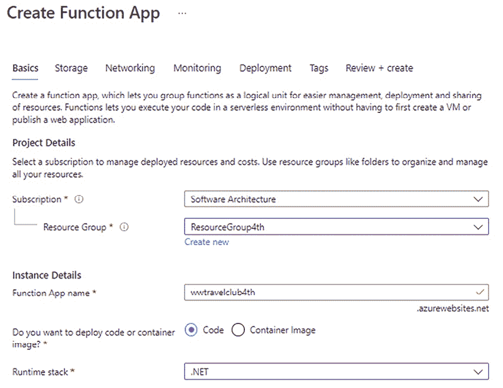

图 16.1：创建 Azure 函数应用

在创建你的 Azure 函数环境时，有几个关键点你应该考虑。运行函数的可能性、编程语言选项和发布样式都会随着时间的推移而增加。我们最重要的配置之一是托管计划，这是你将运行函数的地方。托管计划有三个选项：消费型（无服务器）、高级和应用程序服务计划。让我们来谈谈它们。

## 消费型计划

如果你选择消费型计划，你的函数只有在执行时才会消耗资源。这意味着你只有在函数运行时才会被收费。可扩展性和内存资源将由 Azure 自动管理。这正是我们所说的无服务器。

在这个计划中编写函数时，我们需要注意的一个问题是超时。默认情况下，5 分钟后函数将超时。你可以通过在 `host.json` 文件中使用 `functionTimeout` 参数来更改超时值。最大值是 10 分钟。

当你选择消费型计划时，你的收费将取决于你执行的内容、执行时间和内存使用情况。更多关于这方面的信息可以在[`azure.microsoft.com/en-us/pricing/details/functions/`](https://azure.microsoft.com/en-us/pricing/details/functions/)找到。

注意，当你环境中没有应用程序服务，并且以低周期性运行函数时，这可以是一个不错的选择。另一方面，如果你需要持续处理，你可能想要考虑使用高级计划或应用程序服务计划。下面我们来了解一下。

## 高级计划

根据你使用函数的目的，特别是如果它们需要持续或几乎持续运行，或者某些函数执行时间超过 10 分钟，你可能想要考虑使用高级计划。此外，你可能需要将你的函数连接到 VNET/VPN 环境，在这种情况下，你将被迫运行在这个计划中。

你可能还需要比消费型计划提供的更多 CPU 或内存选项。高级计划为你提供了一核心、两核心和四核心实例选项。

值得注意的是，即使你有无限的时间来运行你的函数，如果你决定使用 HTTP 触发函数，响应请求的最大允许时间是 230 秒。这个限制的原因与 Azure 负载均衡器的默认空闲超时值有关。

在这种情况下，您可能需要重新设计您的解决方案，以符合微软设定的最佳实践([`docs.microsoft.com/en-us/azure/azure-functions/functions-best-practices`](https://docs.microsoft.com/en-us/azure/azure-functions/functions-best-practices))。

虽然高级计划是一个很好的替代方案，但如果您想优化您的应用服务实例的使用，最佳选项是应用服务计划。让我们来看看它。

## 应用服务计划

应用服务计划是在您想要创建 Azure 函数应用时可以选择的选项之一。以下是一些原因（由微软建议），为什么您应该使用应用服务计划而不是消耗计划来维护您的函数：

+   您可以使用未充分利用的现有应用服务实例。

+   如果您想的话，可以在自定义镜像上运行您的函数应用。

在应用服务计划场景中，`functionTimeout` 的值根据 Azure 函数运行时版本而变化。然而，该值至少需要 30 分钟。

您可以在[`docs.microsoft.com/en-us/azure/azure-functions/functions-scale#timeout`](https://docs.microsoft.com/en-us/azure/azure-functions/functions-scale#timeout)找到每个消耗计划中超时时间的表格比较。

现在我们对 Azure 函数应用及其在无服务器架构中的作用有了基础的了解，让我们探索如何将这些概念付诸实践。在接下来的部分，我们将深入探讨使用 C# 编程 Azure 函数，将理论知识转化为实际应用。

# 使用 C# 编程 Azure 函数

在本节中，您将学习如何创建 Azure 函数。值得一提的是，有几种方法可以使用 C# 创建它们。第一种是通过在 Azure 门户本身中创建和开发这些函数。为此，让我们假设您已经创建了一个与本章开头截图中的配置相似的 Azure 函数应用。

通过选择创建的资源并导航到**函数**菜单，您将能够向此环境添加新的函数，如下面的截图所示：

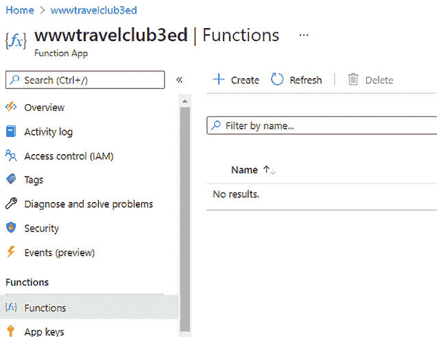

图 16.2：添加函数

在这里，您需要决定您想要使用的触发器类型来启动执行。最常用的有**HTTP 触发器**和**定时器触发器**。第一个允许创建一个 HTTP API，该 API 将触发函数。第二个意味着函数将由您设置的定时器触发。

当你决定使用哪个触发器时，你必须为函数命名。根据你选择的触发器，你可能需要设置一些参数。例如，**HTTP 触发器**需要你设置一个授权级别。有三个选项可供选择：**函数**、**匿名**和**管理员**。**函数**选项需要特定的密钥来访问每个 HTTP 触发器，而**匿名**则不需要任何东西。对于**管理员**选项，使用的密钥是主密钥，它与函数应用一起创建。

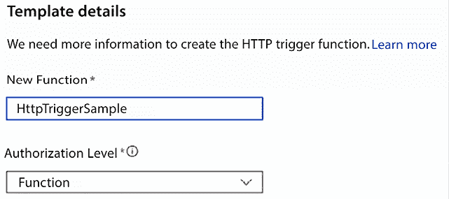

图 16.3：配置 HTTP 函数

重要的是要注意，这本书并没有涵盖构建函数时所有可用的选项。作为一名软件架构师，你应该了解 Azure 在函数方面为无服务器架构提供了一个良好的服务。这在几种情况下都可能很有用。这已在*第十章*，*选择最佳云解决方案*中进行了更详细的讨论。

结果如下。请注意，Azure 提供了一个编辑器，允许我们运行代码、检查日志和测试我们创建的函数。这是一个测试和编码基本函数的好界面：

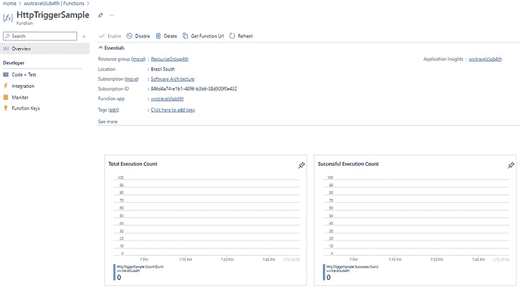

图 16.4：HTTP 函数环境

然而，如果你想创建更复杂的函数，你可能需要一个更复杂的开发环境，以便更有效地进行编码和调试。这就是 Visual Studio Azure Functions 项目能帮到你的地方。此外，使用 Visual Studio 来执行函数的开发将使你朝着为函数使用源代码控制和 CI/CD 的方向发展。

在 Visual Studio 中，你可以通过访问**创建新项目**来创建一个专门用于 Azure Functions 的项目：

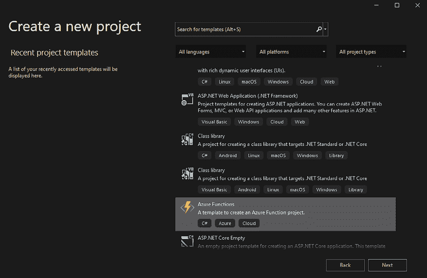

图 16.5：在 Visual Studio 2022 中创建 Azure Functions 项目

创建完项目后，Visual Studio 将询问你使用的触发器类型以及函数将运行的 Azure 版本。值得一提的是，在某些情况下，在创建函数应用时需要存储账户，例如管理触发器和记录执行。

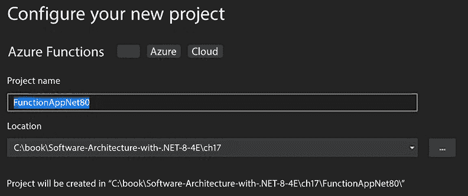

图 16.6：创建新的 Azure Functions 应用程序

值得注意的是，Azure Functions 支持不同的平台和编程语言。在撰写本文时，Azure Functions 提供了两个可用的运行时版本，并提供了支持。第一个版本（v1）与.NET Framework 4.8 兼容。v2 和 v3 版本不再受支持，因此对于.NET 8，你应该使用版本 4（v4）。

你可以始终在[`learn.microsoft.com/en-us/azure/azure-functions/functions-versions`](https://learn.microsoft.com/en-us/azure/azure-functions/functions-versions)上检查有关它的最新信息。

作为一名软件架构师，你必须考虑到代码的可重用性。在这种情况下，你应该注意你决定用于构建函数的 Azure Functions 的版本。然而，一旦运行时达到通用可用状态，始终建议你使用最新版本的运行时。

默认情况下，生成的代码与你在 Azure 门户中创建 Azure Functions 时生成的代码类似：

```cs
using System.Net;
using Google.Protobuf.WellKnownTypes;
using Microsoft.AspNetCore.WebUtilities;
using Microsoft.Azure.Functions.Worker;
using Microsoft.Azure.Functions.Worker.Http;
using Microsoft.Extensions.Logging;
namespace FunctionAppSampleIsolated
{
    public class AzureFunctionHttpSampleNet8
    {
        private readonly ILogger _logger;
        public AzureFunctionHttpSampleNet8(ILoggerFactory loggerFactory)
        {
            _logger = loggerFactory.CreateLogger<AzureFunctionHttpSampleNet8>();
        }
        [Function("AzureFunctionHttpSampleNet8")]
        public HttpResponseData Run([HttpTrigger(AuthorizationLevel.Function, "get", "post")] HttpRequestData req)
        {
            _logger.LogInformation("C# HTTP trigger function processed a request.");
            string responseMessage = "This HTTP triggered function executed successfully. Pass a name in the query string or in the request body for a personalized response.";
            var queryDictionary = QueryHelpers.ParseQuery(req.Url.Query);
            if (queryDictionary.ContainsKey("name"))
                responseMessage = $"Hello, {queryDictionary["name"]}. This HTTP triggered function executed successfully.";
            var response = req.CreateResponse(HttpStatusCode.OK);
            response.Headers.Add("Content-Type", "text/plain; charset=utf-8");
            response.WriteString(responseMessage);
            return response;
        }
    }
} 
```

既然你已经了解了使用 C# 创建 Azure Functions 的基础知识，那么了解可用于 Azure Functions 的触发器模板数量也同样重要。让我们来看看吧。

## 列出 Azure Functions 模板

Azure 门户中有几个模板可供你创建 Azure Functions，你可以选择的模板数量会持续更新。以下只是其中的一些：

+   **Blob 触发器**：你可能希望在文件上传到你的 Blob 存储后立即处理某个文件。这可能是 Azure Functions 的一个很好的用例。

+   **Cosmos DB 触发器**：你可能希望将到达 Cosmos DB 数据库的数据与处理方法同步。Cosmos DB 在 *第十二章*，*选择你的云数据存储* 中有详细的讨论。

+   **事件网格触发器**：这是一种管理 Azure 事件的好方法。函数可以被触发以管理每个事件。

+   **事件中心触发器**：使用这个触发器，你可以构建与任何向 Azure 事件中心发送数据的系统链接的函数。

+   **HTTP 触发器**：这个触发器对于构建无服务器 API 和 Web 应用程序事件非常有用。

+   **IoT Hub 触发器**：当你的应用程序通过 IoT Hub 连接到设备时，你可以在接收到设备的新事件时使用此触发器。

+   **队列触发器**：你可以使用函数即服务解决方案来处理队列处理。

+   **服务总线队列触发器**：这是另一种可以作为函数触发器的消息服务。Azure Service Bus 在 *第十一章*，*将微服务架构应用于企业应用程序* 中有更详细的介绍。

+   **定时器触发器**：这是与函数一起常用的触发器，你可以在这里指定时间触发器，以便可以持续处理来自你系统的数据。

你可以在 [`docs.microsoft.com/en-us/azure/azure-functions/functions-triggers-bindings`](https://docs.microsoft.com/en-us/azure/azure-functions/functions-triggers-bindings) 找到适用于 Azure Functions 的所有触发器和绑定列表。

在对如何使用 C# 编程 Azure Functions 有了一个稳固的理解之后，现在让我们确保它们的长期性和性能。在接下来的部分中，我们将揭示有效管理和监控你的无服务器架构所需的最佳实践和工具。

# 维护 Azure Functions

一旦您创建并编程了您的函数，您就需要监控和维护它。为此，您可以使用各种工具，所有这些工具您都可以在 Azure 门户中找到。这些工具将帮助您解决由于您将能够收集的大量信息而引起的问题。

当您需要监控您的函数时，第一个选项是在 Azure 门户中 Azure Functions 界面内的**监控**菜单中使用。在那里，您将能够检查所有函数执行情况，包括成功结果和失败：

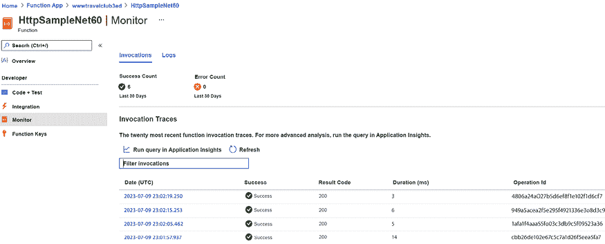

图 16.7：监控一个函数

结果大约需要 5 分钟才能可用。网格中显示的日期是 UTC 时间。

点击**在 Application Insights 中运行查询**，相同的界面允许您连接到这个工具。这将带您进入一个几乎无限选项的世界，您可以使用这些选项来分析您的函数数据。Application Insights 是**应用性能管理（APM**）的一个优秀选择：

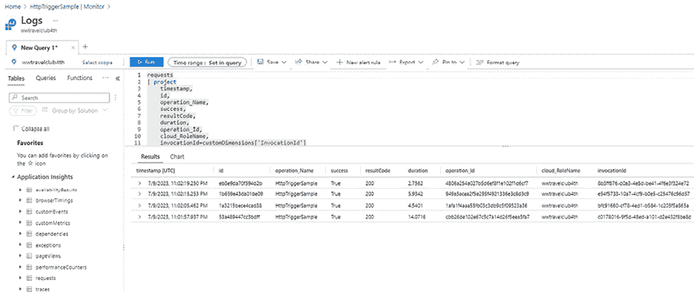

图 16.8：使用 Application Insights 进行监控

除了查询界面之外，您还可以使用 Azure 门户中的 Application Insights 界面检查您函数的所有性能问题。在那里，您可以分析和筛选您的解决方案接收到的所有请求，并检查它们的性能和依赖关系。当您的端点之一发生异常时，您还可以触发警报。

您可以通过在 Azure 门户中选择您的函数资源并搜索**Application Insights**来找到此资源。

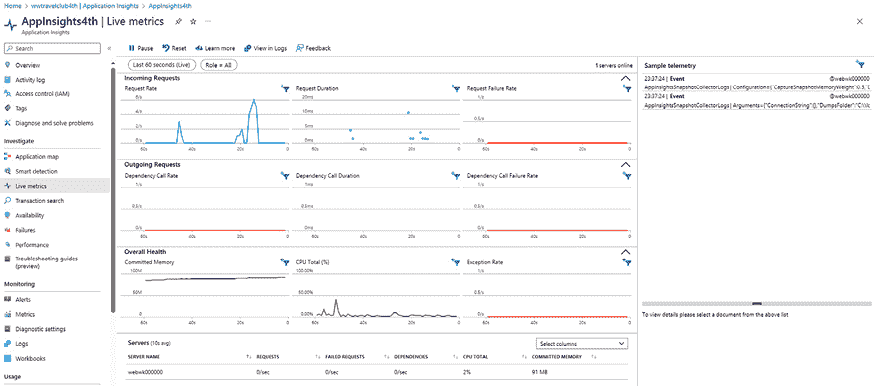

图 16.9：使用 Application Insights 实时指标进行监控

作为一名软件架构师，您将在项目中找到这个工具是一个很好的日常助手。请记住，Application Insights 在多个其他 Azure 服务上运行，例如 Web Apps 和虚拟机。这意味着您可以使用 Azure 提供的出色功能来监控和维护您系统的健康。

# Azure Durable Functions

如果您决定深入研究无服务器技术的使用，您可以考虑 Azure Durable Functions 作为设计编排场景的一个好选择。Azure Durable Functions 允许我们编写有状态的流程，管理幕后状态。为此，您将需要编写一个**编排函数**，这基本上是一个定义您想要运行的流程的流程。您可能还需要一些**实体函数**来启用对小块状态的读取。

以下是一些可以使用此解决方案的应用模式；然而，重要的是要记住，它并不适合所有应用：

+   **函数链式调用**：当您需要按特定顺序执行一系列函数时。

+   **异步 HTTP API**：一种解决与外部客户端的长运行操作的好方法，你将有机会由于编排函数而获取状态 API。一旦你在 Visual Studio 中创建编排函数，就会有这个模式的示例代码。

+   **扇出/扇入**：在并行运行多个函数并等待它们完成以在聚合函数中得出结论的能力。

+   **监控器**：一种在不使用计时器触发器的情况下监控进程的方式，允许配置间隔来监控多个进程实例。

+   **人工交互**：即使在需要人工交互的情况下自动化流程，但你需要监控一段时间后的响应。

+   **聚合器**：一种将一段时间内的事件数据汇总到单个实体的方式。

当涉及到定价时，我们应该记住 Azure Durable Functions 的计费方式与常见的 Azure Functions 相同。你必须考虑的唯一问题是编排函数可能会在整个编排生命周期中重放多次，并且你将为每次重放付费。

一旦我们了解了 Azure Durable Functions 所提供的可能性，评估 Azure Functions 的路线图也同样重要。我们之所以不断撰写关于这一点的内容，是因为自其创建以来 Azure Functions 经历了变化。考虑到基于 Azure Functions 的无服务器应用程序可能是你解决方案的核心，这是一个需要讨论的重要话题。现在让我们来看看。

# Azure Functions 路线图

自 2016 年推出以来，Azure Functions 的结构已经发生了变化。使用该工具的人数和与 .NET 相关的变化导致了一些兼容性问题，这促使微软找到了一种新的方法来交付函数的部署。这种新方法被称为隔离进程模型，它自 .NET 5 起就可用。还重要的是要提到，目前支持的 Azure Functions 可用运行时版本是 v1 和 v4。

根据当前的路线图，使用隔离进程模型是运行 .NET 8 和未来版本中 Azure Functions 的唯一方式。有一个计划为 .NET 8 提供进程内模型，但尚未确定日期。

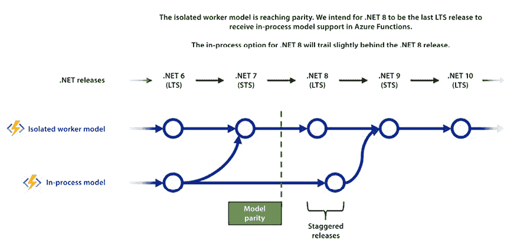

图 16.10：Azure Functions 路线图

作为一名软件架构师，你必须关注提供的路线图，以便你可以为你的解决方案选择最佳的实现方式。

当使用隔离进程模型实现 Azure 函数时，你将能够访问 `Program.cs` 文件中函数的启动。这意味着你将需要配置和创建你函数的实例：

```cs
 var host = new HostBuilder()
    .ConfigureFunctionsWorkerDefaults()
    .ConfigureServices(services =>
    {
        services.AddApplicationInsightsTelemetryWorkerService();
        services.ConfigureFunctionsApplicationInsights();
    })
    .Build(); 
```

值得注意的是，为了这样做，你需要`Microsoft.Azure.Functions.Worker.Extensions`包。你可以在[`docs.microsoft.com/en-us/azure/azure-functions/dotnet-isolated-process-guide`](https://docs.microsoft.com/en-us/azure/azure-functions/dotnet-isolated-process-guide)找到一个非常好的指南。

# 使用无服务器和 Azure Functions 的决定

即使在本章中介绍了这些好处，也总是有人会问为什么要在更大的 Web 应用程序中将其作为一部分而不是使用无服务器函数。

如果你只考虑 HTTP 触发函数，这个问题就更加难以回答，因为你可以创建一个 Web API 应用程序，通常可以解决这个场景中的问题。

然而，有些用例中，Azure Function 确实是最佳选择。让我们列出它们，以帮助你在你的场景中做出决定：

+   **当你需要执行周期性任务时**：Azure Functions 的*Timer Trigger*无疑是一个很好的选择。使用 Cron 表达式，你可以设置不同的周期来让函数运行。你可以在[`learn.microsoft.com/en-us/azure/azure-functions/functions-bindings-timer`](https://learn.microsoft.com/en-us/azure/azure-functions/functions-bindings-timer)了解更多详细信息。

+   **当你想在某些数据变化后执行任务时**：通过使用*Blob Trigger*、*Queue Trigger*或*CosmosDB Trigger*等触发器，你可以监控数据变化，并随后根据这些变化执行特定的任务，这在某些场景中可能很有用。关于如何使用它的一个很好的例子可以在[`learn.microsoft.com/en-us/azure/azure-functions/functions-create-cosmos-db-triggered-function`](https://learn.microsoft.com/en-us/azure/azure-functions/functions-create-cosmos-db-triggered-function)找到。

+   **当你想在设备或另一个系统上发生某些事件后执行任务时**：同样，无需池化数据，你可以使用*Event Grid Trigger*、*Event Hub Trigger*、*IoT Hub Trigger*或*Service Bus Queue Trigger*来跟踪事件，并使用它提供的信息启动任务。你可以在[`learn.microsoft.com/en-us/azure/azure-functions/functions-bindings-event-hubs-trigger`](https://learn.microsoft.com/en-us/azure/azure-functions/functions-bindings-event-hubs-trigger)了解更多相关信息。

为了使这个决定更容易，在*第二十一章*的*案例研究*中，你将找到实现以下架构的完整教程。

为了给用户提供良好的体验，应用程序发送的所有电子邮件都将异步排队，从而防止系统响应出现重大延迟。

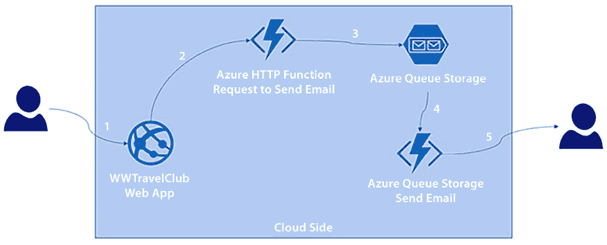

图 16.11：发送电子邮件的架构设计

这个设计的伟大之处在于，尽管你有一个由不同组件组成的解决方案，但你无法识别一些计算特性，比如使用的内存量、为该过程设计的 CPU 数量，甚至保证解决方案质量的存储需求。这就是我们所说的无服务器在本质意义上的含义——一个关注点不在代码运行位置的解决方案。

# 摘要

在本章中，我们探讨了使用无服务器 Azure Functions 开发功能的一些优点。你可以将其作为指南来检查 Azure Functions 中可用的不同触发器类型，并规划如何监控它们。我们还看到了如何编程和维护 Azure Functions。

在下一章中，我们将讨论与 ASP.NET Core MVC 相关的最新新闻。

# 问题

1.  Azure Functions 是什么？

1.  Azure Functions 的编程选项有哪些？

1.  可以与 Azure Functions 一起使用的计划有哪些？

1.  如何使用 Visual Studio 部署 Azure Functions？

1.  你可以使用哪些触发器来开发 Azure Functions？

1.  Azure Functions v1、v2、v3 和 v4 之间的区别是什么？

1.  Application Insights 如何帮助我们维护和监控 Azure Functions？

1.  Azure Durable Functions 是什么？

# 进一步阅读

如果你想了解更多关于创建 Azure 函数的信息，请查看以下链接：

+   Azure Functions 的扩展和托管：[`docs.microsoft.com/en-us/azure/azure-functions/functions-scale`](https://docs.microsoft.com/en-us/azure/azure-functions/functions-scale)

+   *《.NET 开发者的 Microsoft Azure [视频]，作者 Trevoir Williams：* [`www.packtpub.com/product/microsoft-azure-for-net-developers-video/9781835465059`](https://www.packtpub.com/product/microsoft-azure-for-net-developers-video/9781835465059)

+   *《Azure Serverless Computing Cookbook - 第三版，作者 Praveen Kumar Sreeram：* [`www.packtpub.com/product/azure-serverless-computing-cookbook-third-edition/9781800206601`](https://www.packtpub.com/product/azure-serverless-computing-cookbook-third-edition/9781800206601)

+   Azure Functions 运行时概述：[`docs.microsoft.com/en-us/azure/azure-functions/functions-versions`](https://docs.microsoft.com/en-us/azure/azure-functions/functions-versions)

+   Azure Event Grid 概述：[`docs.microsoft.com/en-us/azure/event-grid/`](https://docs.microsoft.com/en-us/azure/event-grid/)

+   Azure Functions 的定时器触发器：[`docs.microsoft.com/en-us/azure/azure-functions/functions-bindings-timer`](https://docs.microsoft.com/en-us/azure/azure-functions/functions-bindings-timer)

+   书籍《Azure for Architects》，作者 Ritesh Modi 中的*Application Insights*部分：[`subscription.packtpub.com/book/virtualization_and_cloud/9781788397391/12/ch12lvl1sec95/application-insights`](https://subscription.packtpub.com/book/virtualization_and_cloud/9781788397391/12/ch12lvl1sec95/application-insights)

+   《Azure Serverless Computing Cookbook》一书中关于*使用 Application Insights 监控 Azure Functions*的部分，作者 Praveen Kumar Sreeram：[`subscription.packtpub.com/book/virtualization_and_cloud/9781788390828/6/06lvl1sec34/monitoring-azure-functions-using-application-insights`](https://subscription.packtpub.com/book/virtualization_and_cloud/9781788390828/6/06lvl1sec34/monitoring-azure-functions-using-application-insights)

+   使用 .NET 开始使用 Azure 队列存储：[`docs.microsoft.com/en-us/azure/storage/queues/storage-dotnet-how-to-use-queues`](https://docs.microsoft.com/en-us/azure/storage/queues/storage-dotnet-how-to-use-queues)

+   Azure Functions 触发器和绑定概念：[`docs.microsoft.com/en-us/azure/azure-functions/functions-triggers-bindings`](https://docs.microsoft.com/en-us/azure/azure-functions/functions-triggers-bindings)

+   Azure Functions 的 Azure 队列存储绑定：[`docs.microsoft.com/en-us/azure/azure-functions/functions-bindings-storage-queue`](https://docs.microsoft.com/en-us/azure/azure-functions/functions-bindings-storage-queue)

+   用于本地 Azure 存储开发的 Azure 模拟器：[`docs.microsoft.com/en-us/azure/storage/common/storage-use-azurite`](https://docs.microsoft.com/en-us/azure/storage/common/storage-use-azurite)

+   Azure Durable Functions：[`docs.microsoft.com/en-us/azure/azure-functions/durable/`](https://docs.microsoft.com/en-us/azure/azure-functions/durable/)

# 在 Discord 上了解更多

要加入这本书的 Discord 社区——在那里您可以分享反馈，向作者提问，并了解新版本——请扫描下面的二维码：

[`packt.link/SoftwareArchitectureCSharp12Dotnet8`](https://packt.link/SoftwareArchitectureCSharp12Dotnet8)


