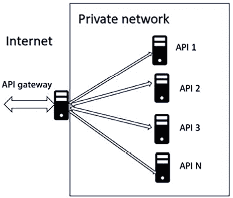
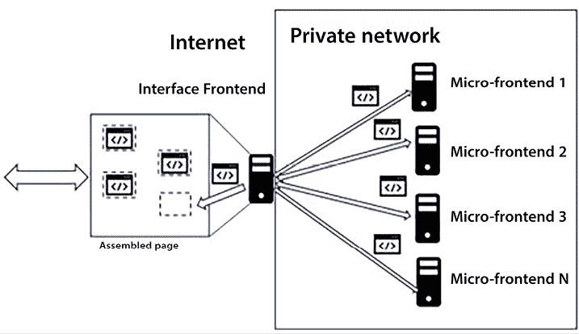
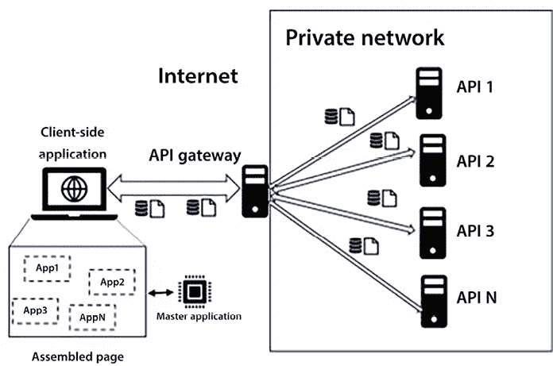
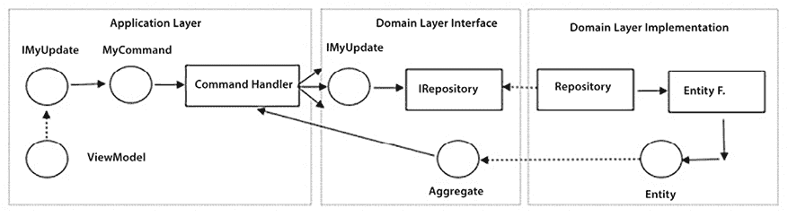

# 18

# 使用 ASP.NET Core 实现前端微服务

*第十四章，使用 .NET 实现微服务*描述了在 .NET 中实现微服务的一般技术，但主要关注工作微服务，即执行后台作业而不与应用程序外部的任何东西通信的微服务。

与应用程序外部世界通信的微服务带来了其他问题，需要进一步的技术。

更具体地说，与人类用户通信的微服务必须实现表示层，而公开 API 的微服务必须遵守既定的标准，并且最好有文档。此外，针对**单页应用**（**SPAs**）的 Web API 必须符合浏览器策略；也就是说，它们必须位于与 SPA 下载相同的域上，或者它们必须配置 CORS 策略。我们将在*第十九章，客户端框架：Blazor*中看到如何解决 CORS 和浏览器策略引起的问题。

值得一提的还有任何表示层带来的所有挑战，即确保与用户快速有效的交互，以及在不陷入面条代码的情况下，使用可维护的代码管理与用户的交互状态。在*第二章，非功能性需求*中讨论了通用可用性问题及其解决方案。我们将在本章和*第十九章，客户端框架：Blazor*中讨论更多与技术相关的可用性和状态管理问题。

最后，所有前端微服务都必须实施坚实的安全策略，以防御黑客攻击。一些技术对前端和 Web API 都适用，并且由所有主要 Web 服务器自动处理，例如针对路径穿越攻击和拒绝服务的对策。而另一些技术则特定于 HTML 页面，例如伪造。在*第二十一章，案例研究*中讨论了 ASP.NET Core MVC 对伪造的防御。

在*第十五章，使用 .NET 应用服务导向架构*中描述了实现公开自文档化 Web API 的技术，而在*第十七章，展示 ASP.NET Core*中涵盖了实现基于服务器的表示层的技术，而在*第十九章，客户端框架：Blazor*中将介绍实现基于客户端的表示层的技术。此外，在*第十一章，将微服务架构应用于您的企业应用*、*第七章，理解软件解决方案中的不同领域*和*第十四章，使用 .NET 实现微服务*中涵盖了实现微服务的通用技术。

因此，在本章中，在简短介绍前端微服务的特定概念和技术部分之后，我们将向您展示如何将这些概念和技术结合在一起，在前端微服务的实际实现中。更具体地说，我们将讨论各种实现选项以及如何构建前端微服务的整个层结构。一个完整的示例，展示了前端微服务的所有层在实际中是如何协同工作的，可以在第二十一章*案例研究*的*前端微服务*部分中找到。

更具体地说，本章涵盖了以下主题：

+   前端和微前端

+   定义域层接口

+   定义域层实现

+   定义应用层

+   定义控制器

我们将使用洋葱架构和第七章中描述的*理解软件解决方案中的不同域*的模式。

# 技术要求

本章需要免费 Visual Studio 2022 Community 版或更高版本，并安装所有数据库工具。

为了阐明本章中的概念，所需的代码示例将来自基于`WWTravelClub`用例的实际示例应用程序。完整的示例应用程序在第二十一章*案例研究*的*前端微服务*部分中详细描述。其代码可在[`github.com/PacktPublishing/Software-Architecture-with-C-Sharp-12-and-.NET-8-4E`](https://github.com/PacktPublishing/Software-Architecture-with-C-Sharp-12-and-.NET-8-4E)找到。

# 前端和微前端

前端微服务的主要特点是它们需要一个强大的 Web 服务器，能够优化所有请求/响应处理并确保所需的安全级别。此外，高流量应用程序还需要一个负载均衡器。

强大 Web 服务器（如 IIS、Apache 和 NGINX）提供的服务示例：

+   限制对某些文件类型和目录的访问，以防止访问私有文件和防止远程文件执行；即通过 Web 请求执行服务器命令/脚本。

+   阻止可能导致访问不受欢迎的文件或目录（路径遍历攻击）的危险请求。

+   阻止超过可自定义长度的请求，因为它们可能造成服务拒绝。

+   记录和 IP 地址阻止以发现和对比黑客攻击。

+   将请求重定向到与每个 URL 关联的应用程序。

+   队列请求并将它们分配给可用的线程。这种能力对于性能优化是基本的，因为与可用的处理器核心相比执行过多的请求可能会导致不可接受的性能。

+   确保运行在相同进程但不同线程上的应用程序之间的隔离，以及更多。

如果前端服务托管在 Kubernetes 集群上，可以通过**Ingress**提供适当的 Web 服务器和负载均衡。

否则，**Azure App Service**（请参阅*进一步阅读*部分）可能是一个不错的选择，因为它提供了可扩展的负载均衡级别、出色的安全性、监控服务等等。

前端微服务不需要直接与应用程序外部进行接口交互。实际上，在微前端架构中，没有唯一的客户端，但前端的作用被分散到几个微服务中。在这些架构中，通常，将流量引导到正确的客户端和/或合并多个响应为一个唯一响应的作用由一个负载均衡的接口前端承担，它承担着确保正确安全级别的负担。

使用微前端的原因与其他微服务相同。我们已在*第十一章*，*将微服务架构应用于您的企业应用程序*中详细讨论了它们，但在此重复一些更重要的事项：

+   通过仅扩展需要更多资源的微服务来优化硬件资源的利用率

+   每个微服务都有独立的软件生命周期，因此每个微服务可以独立于其他微服务发展，以满足用户需求，并且每个微服务开发团队可以独立于其他团队工作。

微前端架构在 HTML 网站（如 ASP.NET Core MVC 网站）和 Web API 方面使用相当不同的技术。实际上，“微前端”一词仅用于 HTML 网站/单页应用，而面向外部的 Web API 被称为公共 Web API。我们将在两个专门的子节中描述公共 Web API 和 HTML 微前端及其使用的技术，从公共 Web API 开始。

## 公共 Web API

在网络 API 的情况下，所有微服务都通过一个独特的负载均衡软件组件，称为**API 网关**，在客户端和各个 API 服务之间进行访问。API 网关的基本作用是从一个唯一的域名使整个 API 可访问，以避免浏览器独特的域名策略问题，并简化所有 API 服务的使用。



图 18.1：API 网关

然而，API 网关提供了集中其他对所有 API 服务都通用的功能的机会，例如：

+   **身份验证**，即验证和解码每个请求附带的身份验证令牌（请勿将身份验证与登录混淆）。

+   **缓存**，即根据可配置的缓存策略进行响应缓存。

+   **翻译**，即调整客户端看到的界面以适应各种 API 方法的实际签名。这样，每个 API 可以更改其界面而不会影响现有客户端。

+   **版本控制**，即将每个请求定向到每个 API 服务的兼容版本。

+   **文档**，即提供独特的文档端点。

API 网关一直在不断发展，吸收并提供越来越多的功能，从而产生了所谓的 **API 管理系统**，现在它们自动化并处理了处理公共 Web API 的大部分负担。

Azure，像所有云服务一样，提供良好的 API 管理服务。你可以在这里找到更多关于它的信息：[`azure.microsoft.com/en-us/services/api-management/#overview`](https://azure.microsoft.com/en-us/services/api-management/#overview)。

值得一提的是 **Ocelot** ([`docs.microsoft.com/en-us/dotnet/architecture/microservices/multi-container-microservice-net-applications/implement-api-gateways-ith-ocelot`](https://docs.microsoft.com/en-us/dotnet/architecture/microservices/multi-container-microservice-net-applications/implement-api-gateways-ith-ocelot))，这是一个用于轻松创建自定义 API 网关的库。你可以用它来填写配置文件，或者作为完全自定义 API 网关的基础。

现在，我们准备讨论 HTML 微前端，它也带来了将多个 HTML 片段组合成独特 HTML 页面的挑战。

## HTML 微前端

几个 HTML 微前端可以通过为每个提供不同的一组网页来在同一应用程序中协作。在这种情况下，协调它们只需要指向其他微前端的链接和一个共同的登录方式，这样用户在移动到不同的微前端时就不需要每次都登录。

然而，非常常见的情况是，几个微前端通过提供各种页面区域来共同构建同一个页面。在这种情况下，一个软件组件必须承担将各个部分组装成独特页面的负担。

将多个 HTML 片段组合成单个 HTML 页面的主要困难是提供给用户一致的用户体验，从而避免以用户难以理解的方式组装所有页面区域。另一个问题是避免每次新内容到达浏览器时连续的页面翻页和重组。在接下来的内容中，我们将讨论这些问题的解决方案。

在经典 Web 应用程序构建服务器端 HTML 的情况下，界面应用程序提供页面布局，然后调用各种微前端来填充不同的布局区域。



图 18.2：服务器端微前端

在这种情况下，由于整个 HTML 页面是在服务器端组装的，并且只有在准备就绪时才发送到浏览器，因此不存在浏览器页面翻页和重组的问题。然而，我们为此优势付出了整个页面组装过程中所需的内存消耗的代价。

要使用的布局以及需要调用哪些涉及到的微前端，都是通过根据规则处理请求 URL 来获得的，这些规则要么硬编码在代码中，要么更好，存储在一个或多个配置源中（在最简单的情况下，一个唯一的配置文件）。使用预定义的页面模式确保一致性和良好的用户体验，但我们在可维护性方面付出了代价，因为我们需要在提供页面区域的任何单个微前端发生任何非平凡变化时更新和测试接口应用程序。

在单页应用（SPA）的情况下，组装过程发生在客户端，即浏览器中：

1.  核心应用程序提供初始 HTML 页面。

1.  核心应用程序从每个微前端下载一个 JavaScript 文件。这些 JavaScript 文件中的每一个都是一个微 SPA，用于创建页面区域。

1.  核心应用程序基于当前 URL 决定传递给每个微 SPA 的 URL，然后将每个微 SPA 生成的 HTML 放置在正确的位置。



图 18.3：客户端微前端

各种微 SPA 之间不会相互干扰，因为它们各自运行在独立的 JavaScript 范围内。因此，例如，我们可以混合使用不同和不兼容版本的 Angular 和/或 React 实现的微 SPA。

微前端也可以使用 WebAssembly 框架，如 Blazor（见第十九章，客户端框架：Blazor）来实现，这些框架运行 .NET 代码。然而，在这种情况下，各种微 SPA 并不在单独的环境中运行，因此它们必须基于兼容的 .NET 版本。

SPA 微前端与基于服务器的微前端具有相同的维护成本，并且由于页面是动态创建的，当新内容或数据到达浏览器时，存在浏览器页面翻页和重组问题。这个问题可以通过为浏览器页面的每个内容区域预分配固定大小的 HTML 标签来解决。例如，我们可能预分配一个 300 像素 X 300 像素的区域来显示天气预报和一些图片或动画，而实际内容正在加载。

在下一节中，我们将介绍基于 ASP.NET Core MVC 构建前端微服务的架构方案。

# 定义应用程序架构

应用程序将使用第七章“理解软件解决方案中的不同领域”和第十三章“在 C# 中与数据交互 - Entity Framework Core”中描述的 **领域驱动设计**（**DDD**）方法和相关模式来实现，因此对那些章节内容的良好理解是阅读本章的基本先决条件。

应用程序基于 DDD 方法组织，并使用 SOLID 原则来映射您的领域部分。也就是说，应用程序被组织成三个层次，每个层次都作为不同的项目实现：

+   领域层包含存储库的实现和描述数据库实体的类。它是一个 .NET 库项目。然而，由于它需要一些接口，如 `IServiceCollection`，这些接口在 `Microsoft.NET.Sdk.web` 中定义，并且由于 `DBContext` 层必须从身份框架继承，以便也能处理应用程序的认证和授权数据库表，我们必须添加对 .NET SDK 的引用，同时也必须添加对 ASP.NET Core SDK 的引用。然而，实现自定义用户管理也是常见的。

+   此外，还有一个领域层抽象，它包含存储库规范；即描述存储库实现和 DDD 聚合的接口。在我们的实现中，我们决定通过隐藏根数据实体的禁止操作/属性来实施聚合，正如在 *第十三章，与 C# 中的数据交互* 部分的 *如何数据层和领域层与其他层通信* 节中讨论的那样。因此，例如，`Package` 数据层类，它是一个聚合根，在领域层抽象中有一个相应的 `IPackage` 接口，隐藏了 `Package` 实体的所有属性设置器。领域层抽象还包含所有领域事件的定义，而将订阅这些事件的处理器定义在应用层。

+   最后，是应用层——即 ASP.NET Core MVC 应用程序（ASP.NET Core MVC 在 *第十七章*，*展示 ASP.NET Core* 中进行了讨论）——在这里我们定义 DDD 查询、命令、命令处理器和事件处理器。控制器填充查询对象并执行它们以获取可以传递给视图的 ViewModels。它们通过填充命令对象并执行相关的命令处理器来更新存储。反过来，命令处理器使用来自领域层的 `IRepository` 接口和 `IUnitOfWork` 实例来管理和协调事务。

应用程序使用 **命令查询责任分离**（**CQRS**）模式；因此，它使用命令对象来修改存储，并使用查询对象来查询它。CQRS 在 *第七章，理解软件解决方案中的不同领域* 的 *命令查询责任分离（CQRS）模式* 子节中进行了描述。

查询的使用和实现都很简单：控制器填充它们的参数，然后调用它们的执行方法。反过来，查询对象有直接的 LINQ 实现，使用 `Select` LINQ 方法直接将结果投影到控制器视图使用的 ViewModels 上。你也可以决定在用于存储更新操作的相同存储库类后面隐藏 LINQ 实现，但这样会将简单查询的定义和修改变成非常耗时的工作。

在任何情况下，将查询对象封装在接口之后可能是有益的，这样在测试控制器时可以替换它们的实现为模拟实现。

然而，涉及命令执行的物体和调用链更为复杂。这是因为它需要构建和修改聚合体，以及定义多个聚合体之间以及聚合体与其他应用程序之间的交互，这需要通过领域事件提供。

下面的图示是存储更新操作执行过程的草图。圆圈表示在各个层之间交换的数据，而矩形表示处理这些数据的程序。此外，虚线箭头连接接口及其实现类型：



图 18.4：命令执行的示意图

下面是动作通过 *图 18.4* 的步骤列表：

1.  控制器的动作方法接收一个或多个 ViewModels 并执行验证。

1.  一个或多个包含要应用更改的 ViewModels 被隐藏在领域层中定义的接口 (`IMyUpdate`) 之后。它们用于填充命令对象的属性。这些接口必须在领域层中定义，因为它们将被用作在那里定义的仓库聚合方法中的参数。

1.  在控制器动作方法中通过 **依赖注入** (**DI**) 获取与先前命令匹配的命令处理器。然后执行处理器。在其执行过程中，处理器与各种仓库接口方法和它们返回的聚合体进行交互。

1.  在创建第 3 步中讨论的命令处理器时，ASP.NET Core DI 引擎会自动注入其构造函数中声明的所有参数。特别是，它会注入执行所有命令处理器事务所需的全部 `IRepository` 实现。命令处理器通过调用其构造函数中接收到的这些 `IRepository` 实现的方法来构建聚合体并修改已构建的聚合体来完成其工作。聚合体要么代表已存在的实体，要么代表新创建的实体。处理器使用包含在每个 `IRepository` 中的 `IUnitOfWork` 接口以及数据层返回的并发异常来组织其操作为事务。值得注意的是，每个聚合体都有自己的 `IRepository`，并且更新每个聚合体的全部逻辑都定义在聚合体本身中，而不是其关联的 `IRepository` 中，以保持代码更加模块化。

1.  在幕后，在数据层中，`IRepository` 实现使用 Entity Framework 来执行其工作。聚合体由领域层中定义的接口背后的根数据实体实现，而处理事务并将更改传递到数据库的 `IUnitOfWork` 方法是用 `DbContext` 方法实现的。换句话说，`IUnitOfWork` 是用应用程序的 `DbContext` 实现的。

1.  领域事件在每个聚合处理过程中生成，并通过调用其`AddDomainEvent`方法将其添加到聚合本身中。然而，它们不会立即触发。通常，它们会在所有聚合的处理结束时触发，并在更改传递到数据库之前；然而，这并不是一个普遍的规则。

1.  应用程序通过抛出异常来处理错误。一个更有效的方法是在依赖引擎中定义一个请求作用域对象，其中每个应用程序子部分都可以将其错误添加为领域事件。然而，虽然这种方法更有效，但它增加了代码和应用程序开发时间的复杂性。

Visual Studio 解决方案由三个项目组成：

+   有一个包含领域层抽象的项目，这是一个.NET Standard 2.1 库。当一个库不使用特定于.NET 版本的特性和 NuGet 包时，将其实现为.NET Standard 库是一个好的实践，因为这样，当应用程序移动到新的.NET 版本时，它不需要修改。

+   有一个包含整个数据层的项目，这是一个基于 Entity Framework 的.NET 8.0 库。

+   最后，还有一个包含应用程序和表示层的 ASP.NET Core MVC 8.0 项目。当你定义此项目时，选择**无身份验证**；否则，用户数据库将直接添加到 ASP.NET Core MVC 项目中，而不是数据层。我们将手动在数据层中添加用户数据库。

在接下来的部分中，我们将描述构成迄今为止所描述架构的每一层的实现，首先是领域层抽象。

# 定义领域层接口

一旦将`PackagesManagementDomain` Standard 2.1 库项目添加到解决方案中，我们将在项目根目录中添加一个`Tools`文件夹。然后，我们将所有与`ch7`相关的代码中包含的`DomainLayer`工具放置到该文件夹中。由于该文件夹中的代码使用数据注释并定义了 DI 扩展方法，我们还必须添加对`System.ComponentModel.Annotations`和`Microsoft.Extensions.DependencyInjection.Abstration` NuGet 包的引用。

然后，我们需要一个包含所有聚合定义的`Aggregates`文件夹（正如已经说过的，我们将实现为接口）。

下面是一个聚合定义的示例：

```cs
public interface IPackage : IEntity<int>
{
    void FullUpdate(IPackageFullEditDTO packageDTO);
    string Name { get; set; }
    string Description { get;}
    decimal Price { get; set; }
    int DurationInDays { get; }
    DateTime? StartValidityDate { get;}
    DateTime? EndValidityDate { get; }
    int DestinationId { get; }

} 
```

它包含与我们在第十三章中看到的`Package`实体相同的属性，即*交互式数据在 C# – Entity Framework Core*。唯一的区别如下：

+   它继承自`IEntity<int>`，这为聚合提供了所有基本功能。

+   它没有`Id`属性，因为它继承自`IEntity<int>`。

+   所有属性都是只读的，并且它有一个`FullUpdate`方法，因为所有聚合只能通过用户领域（在我们的情况下，是`FullUpdate`方法）中定义的更新操作进行修改。

现在，让我们也添加一个`DTOs`文件夹。在这里，我们放置所有用于将更新传递给聚合的接口。这些接口由用于定义此类更新的应用层 ViewModel 实现。在我们的案例中，它包含`IPackageFullEditDTO`，我们可以用它来更新现有包。

一个`IRepositories`文件夹包含所有存储库规范；以下是一个示例存储库接口：

```cs
public interface IPackageRepository:
        IRepository<IPackage>
{
    Task<IPackage> Get(int id);
    IPackage New();
    Task<IPackage> Delete(int id);
} 
```

存储库总是只包含几个方法，因为所有业务逻辑都应该表示为聚合方法——在我们的案例中，只是创建新包、检索现有包和删除现有包的方法。修改现有包的逻辑包含在`IPackage`的`FullUpdate`方法中。

最后，我们还有一个包含所有域事件定义的事件文件夹。我们可以将此文件夹命名为`Events`。每当聚合的更改对其他聚合或微服务有影响时，都会触发事件。它们是实现聚合和微服务之间弱交互的一种方式，同时保持聚合代码相互独立。

通过使用事件，我们可以使每个聚合的代码在涉及相同数据库事务的其他聚合的代码中保持高度独立：每个聚合生成可能引起其他聚合兴趣的事件，例如旅游包聚合中的价格变化，所有依赖于这个价格的其他聚合都订阅了这个事件，以便它们可以一致地更新它们的数据。这样，当在系统维护期间添加一个依赖于旅游包价格的新聚合时，我们不需要修改旅游包聚合。

当事件可能也引起其他微服务的兴趣时，该事件也会传递给消息代理，这使得事件也对其他微服务中的代码可用进行订阅。消息代理在*第十四章*，*使用.NET 实现微服务*中进行了讨论。

下面是一个事件定义的示例：

```cs
public class PackagePriceChangedEvent: IEventNotification
{
    public PackagePriceChangedEvent(int id, decimal price,
 long oldVersion, long newVersion)
    {
            PackageId = id;
            NewPrice = price;
            OldVersion = oldVersion;
            NewVersion = newVersion;
     }
    public int PackageId { get; }
    public decimal NewPrice { get; }
    public long OldVersion { get; }
    public long NewVersion { get; }
} 
```

当一个聚合将所有更改发送到另一个微服务时，它应该有一个版本属性。接收更改的微服务使用这个版本属性来按正确顺序应用所有更改。显式的版本号是必要的，因为更改是异步发送的，所以它们接收的顺序可能与发送的顺序不同。为此，用于在应用程序外部发布更改的事件具有`OldVersion`（更改前的版本）和`NewVersion`（更改后的版本）属性。与删除事件相关的事件没有`NewVersion`属性，因为实体在被删除后无法存储任何版本。

下一个子节解释了在域层定义的所有接口如何在数据层实现。

# 定义域层实现

领域层实现包含了在领域层接口中定义的所有仓储接口和聚合接口的实现。在 .NET 8 的情况下，它使用 Entity Framework Core 实体来实现聚合。在领域层的实际实现和应用层之间添加领域层接口可以将应用层从 EF 和实体特定细节中解耦。此外，它符合洋葱架构，而洋葱架构反过来又是构建微服务的一个建议方式。

领域层实现项目应包含对 `Microsoft.AspNetCore.Identity.EntityFrameworkCore` 和 `Microsoft.EntityFrameworkCore.SqlServer` NuGet 包的引用，因为我们正在使用与 SQL Server 的 Entity Framework Core。它引用了 `Microsoft.EntityFrameworkCore.Tools` 和 `Microsoft.EntityFrameworkCore.Design`，这是在 *第十三章* 的 *Entity Framework Core 迁移* 部分中解释的，*在 C# 中与数据交互 – Entity Framework Core*。

我们应该有一个包含所有数据库实体的 `Models` 文件夹。它们与 *第十三章* 中的类似。唯一的区别如下：

+   它们继承自 `Entity<T>`，其中包含所有聚合的基本功能。请注意，从 `Entity<T>` 继承仅适用于聚合根；所有其他实体都必须按照 *第十三章* 中所述的方式定义。

+   由于它继承自 `Entity<T>`，它们没有 `Id` 属性。

+   其中一些可能具有用 `[ConcurrencyCheck]` 属性装饰的 `EntityVersion` 属性。它包含发送更改到其他微服务所需的实体版本。`ConcurrencyCheck` 属性用于防止在更新实体版本时发生并发错误。这防止了因事务而导致的性能惩罚。

更具体地说，当保存实体更改时，如果带有 `ConcurrencyCheck` 属性的字段值与实体在内存中加载时读取的值不同，则会抛出一个并发异常，以通知调用方法，在读取实体之后但在我们尝试保存其更改之前，有人修改了此值。这样，调用方法可以重复整个操作，希望这次在执行过程中没有人会在数据库中写入相同的实体。

值得分析一个示例实体：

```cs
public class Package: Entity<int>, IPackage
{
    public void FullUpdate(IPackageFullEditDTO o)
    {
        if (IsTransient())
        {
            Id = o.Id;
            DestinationId = o.DestinationId;
        }
        else
        {
            if (o.Price != this.Price)
                this.AddDomainEvent(new PackagePriceChangedEvent(
                        Id, o.Price, EntityVersion, EntityVersion+1));
        }
        Name = o.Name;
        Description = o.Description;
        Price = o.Price;
        DurationInDays = o.DurationInDays;
        StartValidityDate = o.StartValidityDate;
        EndValidityDate = o.EndValidityDate;
    }
    [MaxLength(128)]
    public string Name { get; set; }
    [MaxLength(128)]
    public string? Description { get; set; }
    public decimal Price { get; set; }
    public int DurationInDays { get; set; }
    public DateTime? StartValidityDate { get; set; }
    public DateTime? EndValidityDate { get; set; }
    public Destination MyDestination { get; set; }
    [ConcurrencyCheck]
    public long EntityVersion{ get; set; }
    public int DestinationId { get; set; }
} 
```

`FullUpdate` 方法是更新 `IPackage` 聚合的唯一方式。当价格发生变化时，它会向事件列表中添加一个 `PackagePriceChangedEvent`。

`MainDBContext` 实现了 `IUnitOfWork` 接口。以下代码展示了开始、回滚和提交事务的所有方法的实现：

```cs
public async Task StartAsync()
{
    await Database.BeginTransactionAsync();
}
public Task CommitAsync()
{
    Database.CommitTransaction();
    return Task.CompletedTask;
}
public Task RollbackAsync()
{
    Database.RollbackTransaction();
    return Task.CompletedTask;
} 
```

然而，在分布式环境中，命令类很少使用它们。事实上，就像分布式事务一样，本地数据库阻塞事务也被避免，因为它们可能会长时间阻塞数据库资源，这与基于微服务应用程序典型的高流量最大化不相符。

很可能，如前所述，所有数据库都支持将某些行字段标记为 **并发检查**。在 Entity Framework Core 中，这是通过用 `ConcurrencyCheck` 属性装饰对应字段的实体属性来完成的。

并发检查检测在执行事务 A 时，另一个事务 B 对记录的干扰。这样，我们可以在不阻塞任何数据库记录或表的情况下执行事务 A，并且如果检测到干扰，我们将终止事务 A 并重试，直到在没有干扰的情况下成功为止。如果事务非常快，这种技术效果很好，因此干扰也很少。

更具体地说，如果在事务 A 中，更新操作指定的并发检查值与正在更新的记录中存储的值不同，则更新将被终止，并抛出并发异常。其理由是另一个事务 B 修改了并发检查，从而干扰了 A 正在执行的操作。

因此，将所有应用于 `DbContext` 的更改传递到数据库的方法会检查并发异常：

```cs
public async Task<bool> SaveEntitiesAsync()
{
    try
    {
        return await SaveChangesAsync() > 0;
    }
    catch (DbUpdateConcurrencyException ex)
    {
        foreach (var entry in ex.Entries)
        {
            entry.State = EntityState.Detached;

        }
        throw;
    }
} 
```

之前的实现只是调用 `SaveChangesAsync DbContext` 上下文方法，将所有更改保存到数据库中，然后拦截所有并发异常，并将所有涉及并发错误的实体从上下文中分离。这样，下次命令重试整个失败的操作时，它们的更新版本将重新从数据库中加载。

换句话说，当更新失败是因为事务 B 的干扰时，我们允许干扰事务 B 完成其过程。然后，EF 自动重新加载所有由 B 修改且包含 B 修改的并发检查值的实体。这样，当操作重试时，如果没有其他事务干扰，则并发检查将不会出现冲突。

并发检查的实际用法在 *第二十一章* 的 *案例研究* 中的 *前端微服务* 示例中详细说明。

所有仓储实现都定义在 `Repositories` 文件夹中，以确保更好的可维护性。

最后，所有仓储都被自动发现并添加到应用程序 DI 引擎中，调用定义在域层项目中添加的 DDD 工具中的 `AddAllRepositories` 方法。有关如何在应用程序启动时确保调用此方法的更多详细信息，请参阅 *第二十一章，案例研究* 中 *前端微服务* 部分的详细描述。

# 定义应用层

应用层包含所有业务操作的定义。这些业务操作使用用户提供的数据来修改领域层抽象聚合，例如旅游套餐。当当前用户请求中涉及的所有业务操作都已执行完毕后，执行`IUnitOfWork.SaveEntitiesAsync()`操作以将所有更改保存到数据库。

作为第一步，为了简单起见，让我们通过向 ASP.NET Core 管道添加以下代码将应用程序文化冻结为`en-US`：

```cs
app.UseAuthorization();
// Code to add: configure the Localization middleware
var ci = new CultureInfo("en-US");
app.UseRequestLocalization(new RequestLocalizationOptions
{
    DefaultRequestCulture = new RequestCulture(ci),
    SupportedCultures = new List<CultureInfo>
    {
        ci,
    },
     SupportedUICultures = new List<CultureInfo>
    {
        ci,
    }
}); 
```

作为第二步，我们可以创建一个`Tools`文件夹来放置`ApplicationLayer`代码，这些代码可以在与本书相关的 GitHub 仓库的`ch7`代码中找到。有了这些工具，我们可以在`Program.cs`中添加代码，自动发现并添加所有查询、命令处理器和事件处理器到 DI 引擎，如下所示：

```cs
...
...
builder.Services.AddAllQueries(this.GetType().Assembly);
builder.Services.AddAllCommandHandlers(this.GetType().Assembly);
builder.Services.AddAllEventHandlers(this.GetType().Assembly); 
```

然后，我们必须添加一个`Queries`文件夹来放置所有查询及其相关接口。作为一个例子，让我们看看列出所有包的查询：

```cs
public class PackagesListQuery:IPackagesListQuery
{
    private readonly MainDbContext ctx;
    public PackagesListQuery(MainDbContext ctx)
    {
        this.ctx = ctx;
    }
    public async Task<IReadOnlyCollection<PackageInfosViewModel>> GetAllPackages()
    {
        return await ctx.Packages.Select(m => new PackageInfosViewModel
        {
            StartValidityDate = m.StartValidityDate,
            ...
        })
            .OrderByDescending(m=> m.EndValidityDate)
            .ToListAsync();
    }
} 
```

查询对象会自动注入到应用数据库上下文中。`GetAllPackages`方法使用 LINQ 将所有所需信息投影到`PackageInfosViewModel`中，并按`EndValidityDate`属性降序排序所有结果。

`Commands`文件夹包含所有命令。作为一个例子，让我们看看用于修改包的命令：

```cs
public class UpdatePackageCommand: ICommand
{
    public UpdatePackageCommand(IPackageFullEditDTO updates)
    {
        Updates = updates;
    }
    public IPackageFullEditDTO Updates { get; private set; }
} 
```

命令处理器可以放置在`Handlers`文件夹中。分析更新包的命令是很有价值的：

```cs
private readonly IPackageRepository repo;
private readonly IEventMediator mediator;
public UpdatePackageCommandHandler(IPackageRepository repo, IEventMediator mediator)
{
    this.repo = repo;
    this.mediator = mediator;
} 
```

构造函数已自动注入了`IPackageRepository`仓库和一个`IEventMediator`实例，用于触发事件处理器。以下代码还展示了标准`HandleAsync`命令处理器方法的实现：

```cs
public async Task HandleAsync(UpdatePackageCommand command)
{
    bool done = false;
    IPackage model;
    while (!done)
    {
        try
        {
            model = await repo.Get(command.Updates.Id);
            if (model == null) return;
            model.FullUpdate(command.Updates);
            await mediator.TriggerEvents(model.DomainEvents);
            await repo.UnitOfWork.SaveEntitiesAsync();
            done = true;
        }
        catch (DbUpdateConcurrencyException)
        {
          // add some logging here
        }
    }
} 
```

命令操作会重复执行，直到没有并发异常返回。`HandleAsync`使用仓库获取要修改的实体实例。如果实体未找到（已被删除），则命令停止其执行。否则，所有更改都传递给检索到的聚合。更新后，立即触发聚合中包含的所有事件。特别是，如果价格已更改，则执行与价格变更相关的事件处理器。在`Package`实体的`EntityVersion`属性上使用`[ConcurrencyCheck]`属性声明并发检查确保包版本正确更新（通过将其前一个版本号增加 1），以及将正确的版本号传递给价格变更事件。

此外，事件处理器也放置在`Handlers`文件夹中。作为一个例子，让我们看看价格变更事件处理器：

```cs
public class PackagePriceChangedEventHandler :
    IEventHandler<PackagePriceChangedEvent>
{
    private readonly IPackageEventRepository repo;
    public PackagePriceChangedEventHandler(IPackageEventRepository repo)
    {
        this.repo = repo;
    }
    public Task HandleAsync(PackagePriceChangedEvent ev)
    {
        repo.New(PackageEventType.CostChanged, ev.PackageId,
            ev.OldVersion, ev.NewVersion, ev.NewPrice);
      return Task.CompletedTask;
    }
} 
```

构造函数已自动注入了`IPackageEventRepository`仓库，该仓库处理数据库表以及发送到其他应用的所有事件。`HandleAsync`的实现简单调用仓库方法，向该表添加新记录。

表中的所有记录都由`IPackageEventRepository`处理，可以通过 DI 引擎中定义的并行任务（例如`builder.Services.AddHostedService<MyHostedService>();`）检索并发送到所有感兴趣的微服务，如第十一章中“使用通用宿主”小节中详细说明的。然而，这个并行任务并未在本书的 GitHub 代码中实现。

值得回忆的是，事件的使用促进了代码解耦，当事件跨越微服务边界时，它们实现了微服务之间的高效异步通信，这提高了性能并最大化了硬件资源的使用。

下一小节将描述如何定义控制器。

# 定义控制器

每个控制器都通过其操作方法与在分析阶段出现的用例进行交互。操作方法通过从依赖注入引擎中要求命令处理程序和查询接口来完成其工作。

下面是一个如何要求和使用查询对象的示例：

```cs
[HttpGet]
public async Task<IActionResult> Index(
    [FromServices] IPackagesListQuery query)
{
    var results = await query.GetAllPackages();
    var vm = new PackagesListViewModel { Items = results };
    return View(vm);
} 
```

下面是一个命令处理程序使用的示例：

```cs
public async Task<IActionResult> Edit(
    PackageFullEditViewModel vm,
    [FromServices] ICommandHandler<UpdatePackageCommand> command)
{
    if (ModelState.IsValid)
    {
        await command.HandleAsync(new UpdatePackageCommand(vm));
        return RedirectToAction(
            nameof(ManagePackagesController.Index));
    }
    else
return View(vm);
} 
```

`ICommandHandler<UpdatePackageCommand>`从 DI 中检索与`UpdatePackageCommand`命令关联的命令处理程序。

如果`ModelState`有效，则创建`UpdatePackageCommand`，并调用其关联的处理程序；否则，将视图再次显示给用户，以便他们纠正所有错误。

# 摘要

在本章中，我们分析了前端微服务的特性以及实现它们的技巧。

然后，我们将本章和前几章学到的技术结合起来，在完整的前端微服务实现中应用。

我们使用了一个洋葱架构，其中包含数据层和领域层抽象，并将每个实现作为一个独立的项目。应用层和表示层在同一个 ASP.NET Core MVC 项目中实现。

该微服务使用了 CQRS 模式，并使用一个基于数据库表的队列来存储发送给其他微服务的事件。

下一章将解释如何使用基于客户端的技术实现表示层。我们将使用 Blazor 作为示例客户端框架。

# 问题

1.  前端和 API 网关之间的区别是什么？

1.  为什么所有前端和 API 网关都应该使用一个健壮的 Web 服务器？

1.  为什么应该避免复杂的阻塞数据库事务？

1.  并发技术何时能确保更好的性能？

1.  使用领域事件实现不同聚合之间的交互有什么优势？

# 进一步阅读

由于本章只是将其他章节（主要是 *第七章*，*理解软件解决方案中的不同领域*，*第十一章*，*将微服务架构应用于您的企业应用*，以及 *第十三章*，*在 C# 中与数据交互 – Entity Framework Core*）中解释的概念付诸实践，因此这里我们将仅包括一些关于如何使用 API 网关的链接以及关于在示例中提到的 MediatR 库的更多信息：

+   Ocelot GitHub 仓库：[`github.com/ThreeMammals/Ocelot`](https://github.com/ThreeMammals/Ocelot)

+   如何使用 Ocelot 实现您的 API 网关：[`docs.microsoft.com/en-us/dotnet/architecture/microservices/multi-container-microservice-net-applications/implement-api-gateways-with-ocelot`](https://docs.microsoft.com/en-us/dotnet/architecture/microservices/multi-container-microservice-net-applications/implement-api-gateways-with-ocelot)

+   Azure API 管理：[`azure.microsoft.com/en-us/services/api-management/#overview`](https://azure.microsoft.com/en-us/services/api-management/#overview)

+   Azure 应用服务：[`azure.microsoft.com/en-us/services/app-service/`](https://azure.microsoft.com/en-us/services/app-service/)

+   更多关于 MediatR 的信息可以在 MediatR 的 GitHub 仓库中找到：[`github.com/jbogard/MediatR`](https://github.com/jbogard/MediatR)

# 留下评价！

喜欢这本书吗？通过留下亚马逊评价来帮助像你这样的读者。扫描下面的二维码以获取 20% 的折扣码。


**限时优惠**
