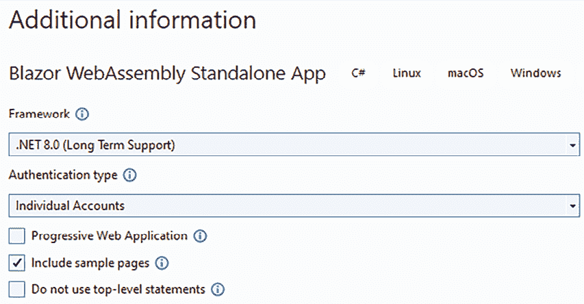
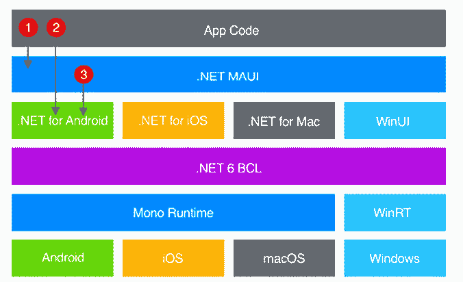
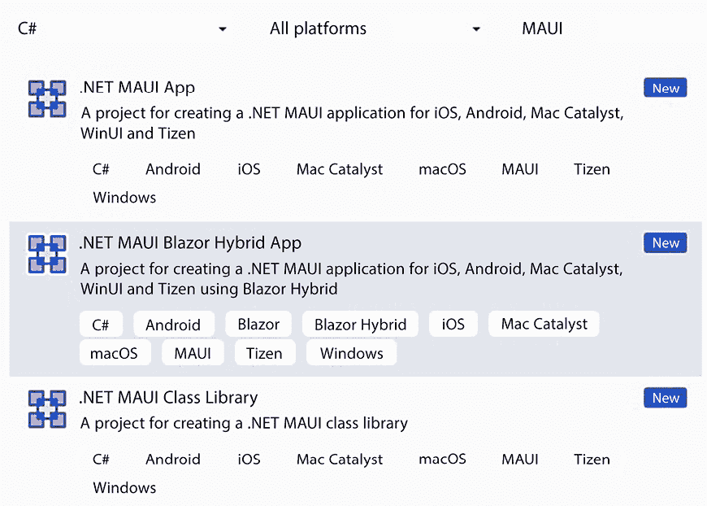
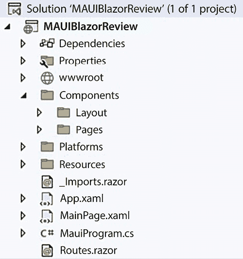
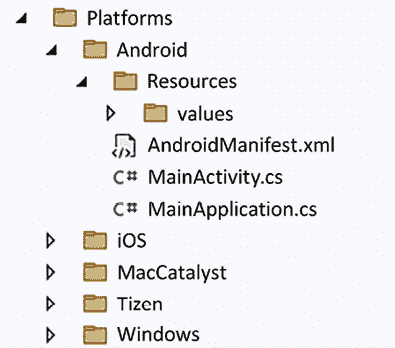

# 客户端框架：Blazor

在本章中，你将学习如何基于客户端技术实现表示层。基于服务器技术的应用程序，如 ASP.NET Core MVC，在服务器上运行所有应用程序层，因此也在服务器上创建 HTML，以编码整个 UI。相反，基于客户端技术的应用程序在客户端机器（移动设备、桌面计算机、笔记本电脑等）上运行整个表示层，因此仅与服务器交互以交换与 Web API 的数据。

换句话说，在基于客户端技术的应用程序中，整个 UI 都是由在用户设备上运行的代码创建的，它也控制着整个用户-应用程序交互。相反，业务层和领域层在服务器机器上运行，以防止用户通过破解其设备上运行的代码来违反业务规则和授权策略。

相反，基于客户端技术的应用程序可以分为单页应用程序，它们受益于 Web 标准，或者作为原生应用程序，它们与特定的操作系统和特定设备特性的优势相关联。

单页应用程序基于 JavaScript 或 WebAssembly，并在任何浏览器中运行。作为一个单页应用程序的例子，我们将分析 Blazor WebAssembly 框架

Blazor WebAssembly 应用程序是用 C# 开发的，并使用我们在第十七章“展示 ASP.NET Core”中已经分析过的许多技术，例如依赖注入和 Razor。因此，我们强烈建议在阅读本章之前学习第十七章“展示 ASP.NET Core”和第十八章“使用 ASP.NET Core 实现前端微服务”。

作为原生技术的例子，我们将分析原生 .NET MAUI Blazor，它与 Blazor WebAssembly 完全类似，但不是使用浏览器 WebAssembly，而是使用 .NET，它即时编译成目标设备的程序集。不受浏览器限制，.NET MAUI Blazor 可以通过适当的 .NET 库访问所有设备功能。

更具体地说，在本章中，你将学习以下主题：

+   各种客户端技术的比较

+   Blazor WebAssembly 架构

+   Blazor 页面和组件

+   Blazor 表单和验证

+   Blazor 的高级功能，例如 JavaScript 互操作性、全球化、身份验证等

+   Blazor WebAssembly 的第三方工具

+   .NET MAUI Blazor

虽然也存在服务器端 Blazor，它像 ASP.NET Core MVC 一样在服务器上运行，但本章仅讨论 Blazor WebAssembly 和 .NET MAUI Blazor，因为本章的主要重点是客户端技术。此外，服务器端 Blazor 无法提供与其他服务器端技术（如我们在第十七章“展示 ASP.NET Core”中分析过的 ASP.NET Core MVC）相当的性能。

第一部分总结了并比较了各种类型的客户端技术，而本章的其余部分详细讨论了 Blazor WebAssembly 和.NET MAUI Blazor。

# 技术要求

本章需要免费 Visual Studio 2022 Community 版或更高版本，并安装所有数据库工具。

所有概念都通过基于 WWTravelClub 书籍用例的简单示例应用程序进行了阐明，这些用例可以在第二十一章*案例研究*的*使用客户端技术*部分找到。

本章的代码可在[`github.com/PacktPublishing/Software-Architecture-with-C-Sharp-12-and-.NET-8-4E`](https://github.com/PacktPublishing/Software-Architecture-with-C-Sharp-12-and-.NET-8-4E)找到。

# 客户端技术类型比较

本节讨论了各种类型的客户端技术：

+   单页应用程序，在浏览器中运行，但受到所有浏览器限制

+   渐进式应用程序，在浏览器中运行但可以像常规应用程序一样安装，并且可以克服一些浏览器限制（在用户授权后）

+   原生应用程序，与特定设备/操作系统绑定，但可以充分利用所有设备/操作系统功能

+   跨平台技术，类似于原生应用程序，可以充分利用所有设备功能，但与多种设备/操作系统兼容

## 单页应用程序

近几十年来，网络开发之所以增长迅速，有许多原因，但最基本的一个原因是能够同时将任何新版本的应用程序部署给许多用户。此外，所有浏览器自动执行的安全策略鼓励了网络应用程序的使用和传播。

因此，这里的一个好问题是，为什么现在不使用网络开发？最好的答案可能是缺乏连接性。作为一名软件架构师，你需要对此保持警惕，正如我们在第二章*非功能性需求*中讨论的那样。

有时候，问题不仅仅是关于是否有连接性。有时候，一个大问题是稳定性，别忘了你将在网络应用一旦进入世界后遇到的不预期的场景中遇到的困难。

例如，在 WWTravelClub 案例中，有一个用户故事说：“作为一个普通用户，我想在主页上查看促销套餐，这样我可以轻松找到我的下一个假期。”乍一看，你可能会确定网络应用是唯一的选择，尤其是因为还有一个系统要求说：“系统将在 Windows、Linux、iOS 和 Android 平台上运行。”

然而，想象一下，一个用户浏览了很多目的地和套餐以找到他们理想的假期，当他们准备预订时，突然，由于网络连接问题，网络应用程序崩溃了。在这种情况下，用户将失去他们所有的浏览努力，并且一旦网络连接恢复，他们被迫重新从零开始搜索套餐。只需一个能够在网络连接问题时保存其状态而不是崩溃的应用程序，就可以解决这个问题。这样，用户就可以在恢复网络连接后立即完成任务，而不会浪费他们在网络连接问题之前已经投入的努力。

因此，也许对于解决方案的一些部分，一个已经下载了一些数据的原生应用会是一个更好的选择。然而，这个问题也可以通过一种特定的现代网络应用，即进步式应用来解决，我们将在下一小节中分析。

## 进步式应用

进步式网络应用是运行在浏览器中的单页应用，但可以像原生应用一样安装。此外，它们还可以离线运行。

进步式应用是所有主流浏览器都支持的新网络标准。如果你需要所有网络应用的优势，但同时也需要像原生应用一样离线工作的能力，进步式网络应用是你正确的选择。

然而，请注意，进步式网络应用无法保证与原生应用相同的性能和灵活性。

Blazor WebAssembly，正如我们将在本章下一节中描述的，支持进步式网络应用。当你创建 Blazor WebAssembly 项目时，请勾选出现的**进步式网络应用**复选框。这就是创建 Blazor 进步式网络应用所需的所有操作。

如果你将你的 Blazor 应用程序作为进步式应用程序发布，你就可以克服初始下载时间（4-8 秒）的问题，这是 Blazor 的主要缺点。

虽然进步式网络应用是已安装的应用程序，但它们会自动更新到最新版本，因为每次它们启动时，它们都会检查是否有更新的版本可用，如果有，它们会在运行前自动下载。也就是说，它们具有自动运行最新可用版本的优点，这是所有经典网络应用的特征。

在开发过程中，无法选择安装 Blazor 进步式网络应用，因为这会干扰常规的修改测试周期。因此，你需要发布你的应用程序以测试其进步式应用的特性。

值得指出的是，渐进式应用必须组织起来，以充分利用它们离线工作的能力。因此，在多次通信错误之后，应用应该在建立成功连接之前，将所有要发送到服务器的数据保存到浏览器的本地存储中。

还有可能在集中式服务中维护整个应用状态，这样用户在退出应用之前可以将它序列化并保存到本地存储中。这样，当应用离线时，要发送到服务器的数据不会丢失，因为它们保留在已保存到磁盘的应用状态中。

当渐进式网络应用无法满足你的要求，因为它无法使用你需要的特定设备功能，但你必须支持多个不同的设备时，你应该考虑跨平台原生应用，这些应用可以完全访问所有设备功能，但仍然可以支持多个硬件/软件平台。我们将在下一小节中讨论它们。

## 本地应用

原生开发可以被认为是 UI 开发的起点。当最初将软件生产任务分配给另一个人/公司时，并没有在具有不同硬件的机器之间共享代码的概念。

这是关于为什么本地应用有良好性能的第一个好答案。我们不能忘记，本地应用之所以运行得更好，仅仅是因为它们靠近硬件，大多数情况下直接连接到操作系统，或者通过使用框架，如.NET。请注意；我们不仅谈论原生移动应用，还在讨论在 Windows、Linux、Mac、Android 或任何其他可以运行应用的操作系统上交付的应用。

考虑到这种场景，最大的问题是——我什么时候必须使用本地应用？有些情况下，这样做是个好主意：

+   没有必要在不同的平台上部署。

+   与硬件有巨大的连接。

+   网页客户端提供的性能是不可接受的。

+   应用需要设备资源，而这些资源无法通过浏览器访问，因为浏览器的安全策略。

+   应用将运行的地方存在连接问题。

+   最坏的情况是你需要同时拥有两样东西：比网页客户端更好的性能和不同的平台。在这种情况下，你可能不得不交付两个应用程序，而你设计这个解决方案的后端方式将对于减少开发和维护成本至关重要。

在没有**概念验证**（**POC**）的情况下，决定是否开发本地应用可能会很困难。作为一名软件架构师，你应该推荐这种类型的 POC。

你可以使用 C#开发的本地应用示例包括经典的 Windows Forms 和 Windows Presentation Foundation，它们是针对 Windows 操作系统的。此外，还有 Xamarin，这是一个允许开发可在 Android 和 iOS 上发布的应用的平台。

## 跨平台应用

尽管性能可能是一个难以实现的要求，但在许多场景中，由于解决方案的简单性，这并不是应用的致命弱点。考虑到 WWTravelClub，虽然拥有之前提到的离线体验会有所帮助，但性能本身并不是最难以实现的一个。

在这些场景中，跨平台技术是完全有意义的。其中，值得提及的是 Xamarin.Forms 和新的.NET MAUI，它们可以发布到 Android、iOS 和 Windows 平台。

推荐的跨平台应用选择是.NET MAUI。然而，目前 MAUI 支持 Windows 和所有主要移动平台，但不支持 Linux。Uno Platform（[`platform.uno/`](https://platform.uno/)）也支持 Linux 以及所有主要移动平台，但它不是由微软维护的微软产品。无论如何，它可以作为 Visual Studio 扩展下载。

在本章中，我们不会分析 Uno 或.NET MAUI 提供的所有选项，而只是.NET MAUI Blazor，因为它与 Blazor WebAssembly 非常相似。因此，学习 Blazor 使我们能够开发单页应用、渐进式应用和跨平台应用。

本章的*.NET MAUI Blazor*部分描述了.NET MAUI Blazor，而下一节将介绍 Blazor WebAssembly 架构的基础。

# Blazor WebAssembly 架构

Blazor WebAssembly 利用新的 WebAssembly 浏览器功能，在浏览器中执行.NET 运行时。这样，它使所有开发者能够在任何 WebAssembly 兼容的浏览器中实现能够运行的应用程序，并使用整个.NET 代码库和生态系统。WebAssembly 被构想为 JavaScript 的高性能替代品。它是一个能够在浏览器中运行并遵守与 JavaScript 代码相同限制的汇编。这意味着 WebAssembly 代码，就像 JavaScript 代码一样，在具有非常有限访问所有机器资源的独立执行环境中运行。

WebAssembly 与过去的类似选项（如 Flash 和 Silverlight）不同，因为它是一个官方的 W3C 标准。更具体地说，它于 2019 年 12 月 5 日成为官方标准，因此预计它将有一个漫长的生命周期。事实上，所有主流浏览器都已经支持它。

然而，WebAssembly 不仅仅带来了性能；它还创造了在浏览器中运行与现代化和高级面向对象语言（如 C++（直接编译）、Java（字节码）和 C# (.NET)）相关的整个代码库的机会。

目前，微软提供了两个在 WebAssembly 上运行 .NET 的框架，即 Blazor WebAssembly 和 Unity WebAssembly，后者是 Unity 3D 图形框架的 WebAssembly 版本。Unity WebAssembly 的主要目的是实现运行在浏览器中的在线视频游戏，而 Blazor WebAssembly 是一个 **单页应用程序** 框架，它使用 .NET 而不是 JavaScript 或 TypeScript。

在 WebAssembly 之前，运行在浏览器中的表示层只能用 JavaScript 实现，这带来了与在非严格类型语言中实现的大代码库维护相关的问题。然而，我们必须考虑，一方面，TypeScript 的使用部分解决了 JavaScript 的严格类型缺乏问题，另一方面，.NET 带来了使用不同 .NET 版本实现的模块的二进制兼容性问题。

无论如何，使用 Blazor C#，开发者现在可以用他们最喜欢的语言实现复杂的应用程序，同时享受 C# 编译器和 Visual Studio 为这种语言提供的所有便利。

此外，使用 Blazor，所有 .NET 开发者都可以使用 .NET 框架的全部功能，唯一的限制是由浏览器安全策略强加的，用于实现运行在浏览器中并与服务器端运行的所有其他层共享库和类的表示层。

下面的子节描述了所有 Blazor 架构。第一个子节探讨了单页应用程序的一般概念，并描述了 Blazor 的特性。

## 什么是单页应用程序？

**单页应用程序**（**SPA**）是一个基于 HTML 的应用程序，其中 HTML 通过在浏览器中运行的代码进行更改，而不是向服务器发出新的请求并从头开始渲染新的 HTML 页面。SPA 可以通过用新的 HTML 替换完整的页面区域来模拟多页体验。

SPA 框架是专门设计用于实现 SPAs 的框架。在 WebAssembly 之前，所有 SPA 框架都基于 JavaScript。最著名的基于 JavaScript 的 SPA 框架是 Angular、React.js 和 Vue.js。

所有 SPA 框架都提供将数据转换为 HTML 以显示给用户的方法，并依赖于一个名为 *router* 的模块来模拟页面变化。通常，数据填充 HTML 模板的占位符，并选择渲染模板的哪些部分（`if-like` 结构）以及渲染它的次数（`for-like` 结构）。

Blazor 模板语言是 Razor，我们在 *第十七章*，*展示 ASP.NET Core* 中进行了描述。

为了提高模块化，代码被组织成组件，这些组件是一种虚拟的 HTML 标签，一旦渲染，就会生成实际的 HTML 标记。像 HTML 标签一样，组件有属性，通常称为参数，以及自定义事件。开发者需要确保每个组件使用其参数创建适当的 HTML，并确保它生成足够的事件。组件可以以分层的方式嵌套在其他组件内部。

组件可以与应用程序网络域中的 URL 关联，在这种情况下，它们被称为页面。这些 URL 可以在常规 HTML 链接中使用，并且跟随它们会导致页面通过框架服务（称为路由器）上传到应用程序区域。

一些 SPA 框架还提供预定义的依赖注入引擎，以确保组件一侧和运行在浏览器中的通用服务以及业务代码之间的更好分离。在本节列出的框架中，只有 Blazor 和 Angular 提供开箱即用的依赖注入引擎。

为了减少整体应用程序文件大小，基于 JavaScript 的 SPA 框架通常将所有 JavaScript 代码编译成几个 JavaScript 文件，然后执行所谓的摇树（tree-shaking），即删除所有未使用的代码。这种技术合理地减少了应用程序的加载时间。

目前，Blazor 将主应用程序引用的所有 DLL 分开保存，并对每个 DLL 分别执行摇树（tree-shaking）操作。

下一个子节描述了 Blazor 架构。我们挑战你创建一个名为 `BlazorReview` 的 Blazor WebAssembly 项目，这样你就可以检查本章中解释的代码和结构。为此，在创建新项目时选择 **Blazor WebAssembly Standalone Application** 选项。确保选择 **Individual Accounts** 作为身份验证类型，并确保勾选 **Include sample pages** 复选框，如图下所示。



图 19.1：创建 BlazorReview 应用程序

如果你启动应用程序，应用程序将正常工作，但如果你尝试登录，将会出现以下错误信息：“尝试登录时发生错误：‘网络错误’。” 这是因为你需要配置一个身份提供者认证用户。默认情况下，应用程序配置为使用基于 OAuth 的身份提供者网络应用程序。你只需在配置文件中添加提供者配置数据。我们将在 *身份验证和授权* 部分更详细地讨论这个问题。

## 加载和启动应用程序

Blazor WebAssembly 应用程序的文件夹结构始终包括一个 `index.html` 静态 HTML 页面。在我们的 `BlazorReview` 项目中，`index.html` 位于 `BlazorReview->wwwroot->index.html`。这个页面是 Blazor 应用程序创建其 HTML 的容器。它包含一个带有 `viewport meta` 声明的 HTML 头部，标题以及用于应用程序整体样式的 CSS。Visual Studio 默认项目模板添加了一个特定于应用程序的 CSS 文件和 Bootstrap CSS，具有中性风格。您可以用自定义样式或完全不同的 CSS 框架替换默认的 Bootstrap CSS。

主体包含以下代码：

```cs
<body>
<div id="app">
<svg class="loading-progress">
<circle r="40%" cx="50%" cy="50%" />
<circle r="40%" cx="50%" cy="50%" />
</svg>
<div id="loading-progress-text"></div>
</div>
<div id="blazor-error-ui">
        An unhandled error has occurred.
    <a href="" class="reload">Reload</a>
<a class="dismiss"> / </a>
</div>
<script
src="img/AuthenticationService.js">
</script>
<script src="img/blazor.webassembly.js"></script>
</body> 
```

初始的 `div` 元素，其 `app` 标识符是应用程序放置其生成的代码的位置。放置在此 `div` 内部的任何标记都将仅在 Blazor 应用程序加载和启动时显示，然后将被应用程序生成的 HTML 替换。默认情况下，它包含一个 `svg` 图像和显示加载进度的文本，这些都被负责加载框架的 JavaScript 代码控制。加载动画基于位于 `css/app.css` 主应用程序 CSS 文件中的 CSS 动画。然而，您可以替换默认内容和 CSS 动画。

第二个 `div` 通常不可见，仅在 Blazor 拦截未处理的异常时才会出现。

`blazor.webassembly.js` 包含 Blazor 框架的 JavaScript 部分。除了其他功能外，它负责下载 .NET 运行时以及所有应用程序 DLL。更具体地说，`blazor.webassembly.js` 下载 `blazor.boot.json` 文件，该文件列出了所有应用程序文件及其哈希值。

然后，`blazor.webassembly.js` 下载此文件中列出的所有资源并验证它们的哈希值。所有由 `blazor.webassembly.js` 下载的资源都是在应用程序构建或发布时创建的。定期加载 `blazor.webassembly.js` 会更新 `--blazor-load-percentage` 和 `--blazor-load-percentage-text` CSS 变量，分别以数值格式和文本格式显示加载百分比。

当项目启用身份验证时，会添加 `AuthenticationService.js`，并负责 Blazor 使用的 `OpenID Connect` 协议，以利用其他身份提供者，获取 bearer 令牌，这些令牌是客户端通过 Web API 与服务器交互时首选的认证凭证。

在本章稍后的 *身份验证和授权* 子节中更详细地讨论了身份验证，而 bearer 令牌在 *第十五章* 的 *REST 服务授权和身份验证* 部分中讨论。

Blazor 应用程序的入口点位于 `BlazorReview->Program.cs` 文件中。此文件不包含类，只包含在应用程序启动时必须执行的代码：

```cs
var builder = WebAssemblyHostBuilder.CreateDefault(args);
builder.RootComponents.Add<App>("#app");
builder.RootComponents.Add< HeadOutlet>("head::after");
// Services added to the application
// Dependency Injection engine declared with statements like:
// builder.Services.Add...
await builder.Build().RunAsync(); 
```

实际上，新的 Blazor WebAssembly 项目模板利用了从 .NET 7 开始引入的这种新方法来定义应用程序的入口点。

`WebAssemblyHostBuilder` 是创建 `WebAssemblyHost` 的构建器，它是第十一章 *将微服务架构应用于您的企业应用程序* 中 *使用通用主机* 子部分讨论的通用主机的 WebAssembly 特定实现（您被鼓励回顾该子部分）。第一个构建器配置指令声明了 Blazor 根组件（`App`），它将包含整个组件树，并指定在 `index.html` 页面的哪个 HTML 标签中放置它（`#app`）。更具体地说，`RootComponents.Add` 添加了一个托管服务，负责处理整个 Blazor 组件树。我们可以通过多次调用 `RootComponents.Add` 来在同一个 HTML 页面上运行多个 Blazor WebAssembly 用户界面，每次调用时使用不同的 HTML 标签引用。

默认情况下，仅添加了一个名为 `HeadOutlet` 的根组件，并将其放置在 `HTML Head` 标签之后。它用于动态更改 `index.html` 的标题（浏览器标签中显示的文本）。有关 `HeadOutlet` 组件的更多信息，请参阅 *从 Blazor 组件修改 HTML <head> 内容* 子部分。

`builder.Services` 包含了向 Blazor 应用程序依赖引擎添加服务的所有常用方法和扩展方法：`AddScoped`、`AddTransient`、`AddSingleton` 等。就像在 ASP.NET Core MVC 应用程序中（第十七章 *展示 ASP.NET Core* 和第十八章 *使用 ASP.NET Core 实现前端微服务*），服务是实现业务逻辑和存储共享状态的优选位置。虽然在 ASP.NET Core MVC 中服务通常传递给控制器，但在 Blazor WebAssembly 中，它们被注入到组件中。

Visual Studio 默认生成的项目包含两个服务，一个用于与服务器通信，另一个用于处理基于 OAuth 的身份验证。我们将在本章后面讨论这两个服务。

下一个子部分将解释根 `App` 组件如何模拟页面变化。

## 路由

主构建代码引用的根 `App` 类定义在 `BlazorReview ->App.razor` 文件中。`App` 是一个 Blazor 组件，就像所有 Blazor 组件一样，它在一个以 `.razor` 扩展名命名的文件中定义，并使用带有组件符号的 Razor 语法，即具有类似 HTML 标签的其他 Blazor 组件。它包含处理应用程序页面的全部逻辑：

```cs
<CascadingAuthenticationState>
<Router AppAssembly="@typeof(App).Assembly">
<Found Context="routeData">
<AuthorizeRouteView RouteData="@routeData"
 DefaultLayout="@typeof(MainLayout)">
<NotAuthorized>
         @*Template that specifies what to show
           when user is not authorized *@
        </NotAuthorized>
</AuthorizeRouteView>
<FocusOnNavigate RouteData="@routeData" Selector="h1">
</Found>
<NotFound Layout="@typeof(MainLayout)">
<PageTitle>Not found<PageTitle>
<LayoutView Layout="@typeof(MainLayout)">
<p>Sorry, there's nothing at this address.</p>
</LayoutView>
</NotFound>
</Router>
</CascadingAuthenticationState> 
```

前述代码中的所有标签都代表组件或特定的组件参数，称为模板。组件将在本章中详细讨论。目前，可以将它们想象成一种我们可以用 C# 和 Razor 代码定义的自定义 HTML 标签。模板则是接受 Razor 标记为值的参数。模板将在本节稍后的 *模板和级联参数* 子节中讨论。

`CascadingAuthenticationState` 组件仅具有将认证和授权信息传递到其内部的所有组件树组件的功能。Blazor 项目模板仅在创建项目时选择添加授权时才生成它。

`Router` 组件是实际的应用程序路由器。它扫描通过 `AppAssembly` 参数传入的程序集，寻找包含路由信息的组件，即可以作为页面的组件。在 Blazor 项目模板中，`Router` 组件接收包含 `App` 组件类的程序集，即主应用程序。其他程序集中的页面可以通过 `AdditionalAssemblies` 参数添加，该参数接受程序集的 `IEnumerable`。

之后，路由器拦截通过代码或通过指向应用程序基础地址内地址的常规 `<a>` HTML 标签执行的任何页面更改。可以通过从依赖注入中获取 `NavigationManager` 实例来通过代码处理导航。

`Router` 组件有两个模板，一个用于找到请求的 URI 对应的页面时的情况（`Found`），另一个用于未找到页面时的情况（`NotFound`）。当应用程序使用授权时，`Found` 模板由 `AuthorizeRouteView` 组件组成，这进一步区分用户是否有权访问所选页面。当应用程序不使用授权时，`Found` 模板由 `RouteView` 组件组成：

```cs
<RouteView RouteData="@routeData" DefaultLayout="@typeof(MainLayout)" /> 
```

`RouteView` 接收所选页面，并在由 `DefaultLayout` 参数指定的布局页面内渲染它。这种指定作为默认值，因为每个页面都可以通过指定不同的布局页面来覆盖它。在 Blazor 项目模板中，默认布局页面位于 `BlazorReview->Layout->MainLayout.razor` 文件中。

Blazor 布局页面与 *第十七章* 中描述的 *重用视图代码* 子节中的 ASP.NET Core MVC 布局页面类似，唯一的区别在于添加页面标记的位置是用 `@Body` 指定的：

```cs
<article class="content px-4">
      @Body
</article> 
```

如果应用程序使用授权，`AuthorizeRouteView` 与 `RouteView` 的工作方式相同，但它还允许指定用户未授权时的模板：

```cs
<NotAuthorized>
@if (!context.User.Identity.IsAuthenticated)
{
  <RedirectToLogin />
}
else
{
  <p role ="alert">You are not authorized to access this resource.</p>
}
</NotAuthorized> 
```

如果用户未认证，`RedirectToLogin` 组件将使用 `NavigationManager` 实例移动到登录逻辑页面；否则，它通知用户他们没有足够的权限访问所选页面。

Blazor WebAssembly 还允许懒加载程序集以减少初始应用程序加载时间，但在这里我们不会讨论它，因为篇幅有限。*进一步阅读* 部分包含了对官方 Blazor 文档的引用。

正如我们将在本章后面更详细地讨论的那样，`PageTitle` 组件允许开发者设置浏览器标签中显示的页面标题。而 `FocusOnNavigate` 组件则设置 HTML 上的焦点在满足其 `Selector` 参数中 CSS 选择器的第一个 HTML 元素上，页面导航后立即进行。

# Blazor 页面和组件

在本节中，你将学习 Blazor 组件的基础知识，包括如何构建组件、组件的结构、如何将事件附加到 HTML 标签上、如何指定组件的特性，以及如何在组件内部使用其他组件。我们将内容分为几个子部分：

+   组件结构

+   模板和级联参数

+   错误处理

+   事件

+   绑定

+   Blazor 如何更新 HTML

+   组件生命周期

## 组件结构

组件是所有主要客户端框架的核心。它们是构建模块化 UI 的关键成分，其部分易于修改和重用。简而言之，它们是类的图形对应物。实际上，就像类一样，它们允许封装和代码组织。此外，组件架构允许正式定义有效的 UI 更新算法，正如我们将在本章的 *Blazor 如何更新 HTML* 部分中看到的那样。

组件定义在扩展名为 `.razor` 的文件中。一旦编译，它们就变成了继承自 `ComponentBase` 的类。和所有其他 Visual Studio 项目元素一样，Blazor 组件可以通过 **添加新项** 菜单访问。通常，用作页面的组件定义在 `Pages` 文件夹中，或者其子文件夹中，而其他组件则组织在不同的文件夹中。默认的 Blazor 项目将所有非页面组件添加到 `Shared` 文件夹中，但你可以以不同的方式组织它们。

默认情况下，页面被分配一个与它们所在文件夹路径相对应的命名空间。因此，例如，在我们的示例项目中，所有位于 `BlazorReview->Pages` 路径中的页面都被分配到 `BlazorReview.Pages` 命名空间。

然而，你可以通过在文件顶部的声明区域放置一个 `@namespace` 声明来更改此默认命名空间。此区域还可以包含其他重要声明。以下是一个显示所有声明的示例：

```cs
@page "/counter"
@layout MyCustomLayout
@namespace BlazorReview.Pages
@using Microsoft.AspNetCore.Authorization
@implements MyInterface
@inherits MyParentComponent
@typeparam T
@attribute [Authorize]
@inject NavigationManager navigation 
```

前两个指令仅适用于必须作为页面工作的组件，而所有其他组件都可以出现在任何组件中。以下是每个声明的详细解释：

+   当指定 `@layout` 指令时，它将使用另一个组件覆盖默认布局页面。

+   `@page` 指令定义了页面在应用程序基本 URL 中的路径（**路由**）。因此，例如，如果我们的应用程序运行在 `https://localhost:5001`，那么这个页面的 URL 将是 `https://localhost:5001/counter`。页面路由也可以包含参数，例如在这个例子中：`/orderitem/{customer}/{order}`。参数名称必须与组件公开定义的参数属性匹配。匹配不区分大小写。参数将在本小节稍后进行解释。

+   实例化每个参数的字符串被转换为参数类型，如果转换失败，则会抛出异常。可以通过为每个参数关联一个类型来防止这种行为，在这种情况下，如果转换到指定类型失败，则与页面 URL 的匹配也会失败。仅支持基本类型：`/orderitem/{customer:int}/{order:int}`。默认情况下，参数是必需的；也就是说，如果找不到它们，匹配将失败，并且路由器将尝试其他页面。然而，你可以通过在参数后附加一个问号来使参数可选：`/orderitem/{customer?:int}/{order?:int}`。如果一个可选参数没有被指定，则使用其类型的默认值。

+   从版本 6 开始，参数也可以从查询字符串中提取：`/orderitem/{customer:int}?order=123`。

+   `@namespace` 覆盖了组件的默认命名空间，而 `@using` 等同于常用的 C# `using`。在特殊文件夹 `{project folder}->_Imports.razor` 中声明的 `@using` 会自动应用于所有组件。

+   `@inherits` 声明该组件是另一个组件的子类，而 `@implements` 声明它实现了接口。

+   如果组件是泛型类，则使用 `@typeparam` 并声明泛型参数的名称。`@typeparam` 还允许使用与类中相同的语法指定泛型约束：`@typeparam T where T: class`。

+   `@attribute` 声明应用于组件类的任何属性。属性级别的属性直接应用于代码区域中定义的属性，因此不需要特殊标记。应用于用作页面的组件类的 `[Authorize]` 属性阻止未经授权的用户访问页面。它的工作方式与在 ASP.NET Core MVC 中应用于控制器或操作方法时完全相同。

+   最后，`@inject` 指令需要依赖注入引擎的类型实例，并将其插入在类型名称后面的字段中；在上一个例子中，在 `navigation` 参数中。

组件文件的中部包含将由组件使用 Razor 标记渲染的 HTML，并可能调用子组件。

文件的底部部分被 `@code` 构造包围，包含实现组件的类的字段、属性和方法：

```cs
@code{
 ...
 private string myField="0";
 [Parameter]
 public int Quantity {get; set;}=0;
 private void IncrementQuantity ()
 {
         Quantity++;
 }
 private void DecrementQuantity ()
 {
        Quantity--;
        if (Quantity<0) Quantity=0;
 }
 ...
} 
```

装饰有 `[Parameter]` 特性的公共属性作为组件参数工作；也就是说，当组件被实例化为另一个组件时，它们用于将值传递给装饰的属性，并且这些值在 HTML 标记中传递给 HTML 元素：

```cs
<OrderItem Quantity ="2" Id="123"/> 
```

值也可以通过页面路由参数或与属性名匹配的查询字符串参数传递给组件参数，匹配时不区分大小写：

```cs
OrderItem/{id}/{quantity}
OrderItem/{id}?quantity = 123 
```

然而，只有当属性也装饰有 `SupplyParameterFromQuery` 特性时，才会启用与查询字符串参数的匹配：

```cs
[Parameter]
[SupplyParameterFromQuery]
public int Quantity {get; set;}=0; 
```

组件参数还可以接受复杂类型和函数：

```cs
<modal title='() => "Test title" ' ...../> 
```

如果组件是泛型的，它们必须为使用 `typeparam` 声明的每个泛型参数传递类型值：

```cs
<myGeneric T= "string"...../> 
```

然而，编译器通常能够从其他参数的类型推断泛型类型。

最后，在 `@code` 指令中封装的代码也可以声明在具有相同名称和命名空间的局部类中：

```cs
public partial class Counter
{
  [Parameter]
  public int CurrentCounter {get; set;}=0;
  ...
  ...
} 
```

通常，这些局部类在组件所在的同一文件夹中声明，文件名与组件的文件名相同，但添加了 `.cs` 后缀。例如，与 `counter.razor` 组件关联的局部类将是 `counter.razor.cs`。

每个组件也可能有一个相关的 CSS 文件，其名称必须是组件文件名加上 `.css` 后缀。例如，与 `counter.razor` 组件关联的 CSS 文件将是 `counter.razor.css`。此文件中包含的 CSS 只应用于组件，对页面的其余部分没有影响。这被称为 CSS 隔离，目前它是通过向所有组件 HTML 根添加一个唯一属性来实现的。然后，组件 CSS 文件的全部选择器都被限制在这个属性上，这样它们就不能影响其他 HTML。

当然，我们也可以使用全局应用 CSS，实际上，Blazor 模板为此创建了 `wwwroot/css/app.css` 文件。

当 Blazor 应用程序打包时，无论是在构建过程中还是在发布过程中，所有隔离的 CSS 都会被处理并放置在一个名为 `<assembly name>.Client.styles.css` 的唯一 CSS 文件中。这就是为什么我们的 `BlazorReview` 应用的 `index.html` 页面包含了以下 CSS 引用：

```cs
<head>
    ...
    <link href="BlazorReview.Client.styles.css" rel="stylesheet" />
</head> 
```

值得注意的是，隔离的 CSS 也可以通过纯 CSS 技巧或使用 **Sass** 语言获得，Sass 编译成 CSS。

当组件使用 `[Parameter(CaptureUnmatchedValues = true)]` 装饰 `IDictionary<string, object>` 参数时，所有插入到标签中的不匹配参数（即没有匹配组件属性的参数）都作为键值对添加到 `IDictionary` 中。

此功能提供了一种简单的方法将参数转发到 HTML 元素或其他包含在组件标记中的子组件。例如，如果我们有一个 `Detail` 组件，它显示传递给其 `Value` 参数的对象的详细视图，我们可以使用此功能将所有常规 HTML 属性转发到组件的根 HTML 标签，如下例所示：

```cs
<div  @attributes="AdditionalAttributes">
...
</div>
@code{
 [Parameter(CaptureUnmatchedValues = true)]
 public Dictionary<string, object>
 AdditionalAttributes { get; set; }
 [Parameter]
 Public T Value {get; set;}
} 
```

这样，通常添加到组件标签的 HTML 属性（例如，`class`），都会转发到组件的根 `div` 并用于样式化组件：

```cs
<Detail Value="myObject" class="my-css-class"/> 
```

下一个子节解释了如何将标记生成函数传递给组件。

## 模板和级联参数

Blazor 通过构建一个称为 **渲染树** 的数据结构来工作，该结构在 UI 发生变化时更新。在每次更改时，Blazor 定位必须渲染的 HTML 部分，并使用 **渲染树** 中包含的信息来更新它。

`RenderFragment` 代理定义了一个函数，该函数能够向 **渲染树** 的特定位置添加更多标记。还有 `RenderFragment<T>`，它接受一个额外的参数，您可以使用它来驱动标记生成。例如，您可以将 `Customer` 对象传递给 `RenderFragment<T>`，以便它可以渲染特定客户的全部数据。

您可以使用 C# 代码定义 `RenderFragment` 或 `RenderFragment<T>`，但最简单的方法是在您的组件中使用 Razor 标记定义它。Razor 编译器将为您生成适当的 C# 代码：

```cs
RenderFragment myRenderFragment = @<p>The time is @DateTime.Now.</p>;
RenderFragment<Customer> customerRenderFragment =
(item) => @<p>Customer name is @item.Name.</p>; 
```

添加标记的位置信息通过 `RenderTreeBuilder` 参数传递，该参数作为参数接收。您可以通过如下示例所示的方式在组件 Razor 标记中使用 `RenderFragment`：

```cs
RenderFragment myRenderFragment = ...
  ...
<div>
  ...
  @myRenderFragment
  ...
</div>
  ... 
```

调用 `RenderFragment` 的位置定义了它将添加标记的位置，因为组件编译器能够生成正确的 `RenderTreeBuilder` 参数传递给它。`RenderFragment<T>` 代理调用如下所示：

```cs
Customer myCustomer = ...
  ...
<div>
  ...
  @myRenderFragment(myCustomer)
  ...
</div>
  ... 
```

作为函数，渲染片段可以像所有其他类型一样传递给组件参数。然而，Blazor 有一种特定的语法，使其更容易同时定义和传递渲染片段到组件：**模板** 语法。首先，在您的组件中定义参数：

```cs
[Parameter]
Public RenderFragment<Customer>CustomerTemplate {get; set;}
[Parameter]
Public RenderFragment Title {get; set;} 
```

然后，当您调用客户时，您可以执行以下操作：

```cs
<Detail>
<Title>
<h5>This is a title</h5>
</Title>
<CustomerTemplate Context=customer>
<p>Customer name is @customer.Name.</p>
  </CustomerTemplate>
</Detail> 
```

每个 `RenderFragment` 参数都由与参数同名的标签表示。您可以在其中放置定义 `RenderFragment` 的标记。对于具有参数的 `CustomerTemplate`，`Context` 关键字在标记中定义参数名称。在我们的示例中，选择的参数名称是 `customer`。

当一个组件只有一个渲染片段参数，如果它被命名为`ChildContent`，模板标记可以直接包裹在组件的开头和结尾标签之间：

```cs
[Parameter]
Public RenderFragment<Customer> ChildContent {get; set;}
……………
……………
<IHaveJustOneRenderFragment Context=customer>
  <p>Customer name is @customer.Name.</p>
</IHaveJustOneRenderFragment> 
```

为了熟悉组件模板，让我们修改`Pages->Weather.razor`页面，使其不再使用`foreach`，而是使用`Repeater`组件。

让我们在`Layout`文件夹上右键单击，选择**添加**然后**Razor 组件**，并添加一个新的`Repeater.razor`组件。然后，用以下代码替换现有的代码：

```cs
@typeparam T
@foreach(var item in Values)
{
  @ChildContent(item)
}
@code {
    [Parameter]
    public RenderFragment<T> ChildContent { get; set; }
    [Parameter]
    public IEnumerable<T> Values { get; set; }
} 
```

组件使用泛型参数定义，以便它可以与任何`IEnumerable`一起使用。现在让我们用以下内容替换`Weather.razor`组件的`tbody`中的标记：

```cs
<Repeater Values="forecasts" Context="forecast">
<tr>
<td>@forecast.Date.ToShortDateString()</td>
<td>@forecast.TemperatureC</td>
<td>@forecast.TemperatureF</td>
<td>@forecast.Summary</td>
</tr>
</Repeater> 
```

由于`Repeater`组件只有一个模板，并且我们将其命名为`ChildContent`，因此我们可以直接在组件的开头和结尾标签内放置模板标记。运行它并验证页面是否正常工作。你已经学会了如何使用模板，以及放置在组件内部标记定义了一个模板。

一个重要的预定义模板化 Blazor 组件是`CascadingValue`组件。它以不改变的方式渲染其内部放置的内容，但将类型实例传递给所有其子组件：

```cs
<CascadingValue Value="new MyOptionsInstance{...}">
……
</CascadingValue> 
```

所有放置在`CascadingValue`标签内及其所有子组件现在可以捕获通过`CascadingValue`参数传入的`MyOptionsInstance`实例。只要组件声明一个与`MyOptionsInstance`兼容类型的公共或私有属性，并用`CascadingParameter`属性装饰它就足够了：

```cs
[CascadingParameter]
private MyOptionsInstance options {get; set;} 
```

匹配是通过类型兼容性进行的。如果有与兼容类型的其他级联参数的歧义，我们可以指定`CascadingValue`组件的`Name`可选参数，并将相同的名称传递给`CascadingParameter`属性：`[CascadingParameter("myUnique name")]`。

`CascadingValue`标签还有一个`IsFixed`参数，出于性能原因，尽可能应该将其设置为`true`。实际上，传播级联值对于传递选项和设置非常有用，但它有很高的计算成本。

当`IsFixed`设置为`true`时，传播操作仅执行一次，即在涉及的内容首次渲染时执行，之后在内容的生命周期内不再尝试更新级联值。因此，`IsFixed`可以在内容的生命周期内级联对象的指针没有改变的情况下使用。

级联值的例子是我们遇到过的`CascadingAuthenticationState`组件，它在*路由*子节中将身份验证和授权信息级联到所有渲染的组件。

## 错误处理

默认情况下，当组件发生错误时，异常被.NET 运行时拦截，它自动使`index.html`中包含的错误代码可见：

```cs
<div id="blazor-error-ui">
        An unhandled error has occurred.
    <a href="" class="reload">Reload</a>
<a class="dismiss"> / </a>
</div> 
```

然而，组件错误可以被拦截并在 `ErrorBoundary` 组件内部本地处理。下面，对前一小节中的 `Repeater` 示例代码进行了修改，以本地处理可能发生在每一行的错误：

```cs
<Repeater Values="forecasts" Context="forecast">
<tr>
<ErrorBoundary>
<ChildContent>
<td>@forecast.Date.ToShortDateString()</td>
<td>@forecast.TemperatureC</td>
<td>@forecast.TemperatureF</td>
<td>@forecast.Summary</td>
</ChildContent>
<ErrorContent>
<td colspan="4" class="my-error">Nothing to see here. Sorry!</td>
</ErrorContent>
</ErrorBoundary>
</tr>
</Repeater> 
```

标准代码放置在 `ChildContent` 模板中，而 `ErrorContent` 模板在出现错误时显示。

## 事件

HTML 标签和 Blazor 组件都使用属性/参数来获取输入。HTML 标签通过事件将输出提供给页面的其余部分，而 Blazor 允许将 C# 函数附加到 HTML `on{事件名称}` 属性。语法在 `Pages->Counter.razor` 组件中显示：

```cs
<p role="status">Current count: @currentCount</p>
<button class="btn btn-primary" @onclick="IncrementCount">Click me</button>
@code {
private int currentCount = 0;
private void IncrementCount()
    {
        currentCount++;
    }
} 
```

函数也可以作为 lambda 表达式内联传递。此外，它接受 C# 中通常的 `event` 参数。*进一步阅读* 部分包含一个链接到 Blazor 官方文档页面，该页面列出了所有支持的事件及其参数。

由于 Blazor 组件被设计为 HTML 元素的增强版本——增加了功能——它们也可以有事件。然而，与标准 HTML 元素不同，Blazor 组件中这些事件的功能和实现都是由开发者定义的。

Blazor 事件还使组件能够返回输出。组件事件定义为类型为 `EventCallBack` 或 `EventCallBack<T>` 的参数。`EventCallBack` 是没有参数的组件事件类型，而 `EventCallBack<T>` 是具有类型为 `T` 的参数的组件事件类型。为了触发一个事件，比如 `MyEvent`，组件调用：

```cs
await MyEvent.InvokeAsync() 
```

或者

```cs
await MyIntEvent.InvokeAsync(arg) 
```

这些调用执行绑定到事件的处理程序，如果没有绑定处理程序则不执行任何操作。

一旦定义，组件事件可以像 HTML 元素事件一样使用，唯一的区别是无需在事件名称前加上 `@` 前缀，因为在 HTML 事件中 `@` 用于区分具有相同名称的 HTML 属性和 Blazor 添加的参数：

```cs
[Parameter]
publicEventCallback MyEvent {get; set;}
[Parameter]
publicEventCallback<int> MyIntEvent {get; set;}
...
...
<ExampleComponent
MyEvent="() => ..."
MyIntEvent = "(i) =>..." /> 
```

实际上，HTML 元素事件也是 `EventCallBack<T>` 事件。这就是为什么这两种事件类型的行为完全相同。`EventCallBack` 和 `EventCallBack<T>` 都是结构体，而不是委托，因为它们包含一个委托，以及一个指向必须通知事件已触发的实体的指针。正式来说，这个实体由 `Microsoft.AspNetCore.Components.IHandleEvent` 接口表示。不用说，所有组件都实现了这个接口。通知告知 `IHandleEvent` 发生了状态变化。状态变化在 Blazor 更新页面 HTML 的方式中起着基本的作用。我们将在下一小节中详细分析它们。

对于 HTML 元素，Blazor 还提供了通过向指定事件的属性添加 `:preventDefault` 和 `:stopPropagation` 指令来停止事件默认操作和事件冒泡的可能性，如下例所示：

```cs
@onkeypress="KeyHandler" @onkeypress:preventDefault="true"
@onkeypress:stopPropagation  ="true" 
```

## 绑定

通常，组件参数的值必须与外部变量、属性或字段保持同步。这种同步的典型应用是在输入组件或 HTML 标签中编辑的对象属性。每当用户更改输入值时，对象属性必须一致地更新，反之亦然。对象属性值必须在组件渲染后立即复制到组件中，以便用户可以编辑它。

相似的场景由参数-事件对处理。更具体地说，从一方面，属性被复制到输入组件的参数中。从另一方面，每次输入值发生变化时，都会触发一个更新属性的组件事件。这样，属性和输入值保持同步。

这种场景非常常见且有用，因此 Blazor 有特定的语法来同时定义事件并将属性值复制到参数中。这种简化的语法要求事件与参与交互的参数具有相同的名称，但后面加上`Changed`后缀。

例如，假设一个组件有一个`Value`参数。那么，相应的事件必须是`ValueChanged`。此外，每次用户更改组件值时，组件必须通过调用`await ValueChanged.InvokeAsync(arg)`来调用`ValueChanged`事件。有了这个，就可以使用以下语法将名为`MyObject.MyProperty`的属性与`Value`属性同步：

```cs
<MyComponent @bind-Value="MyObject.MyProperty"/> 
```

上述语法称为`绑定`。Blazor 会自动处理将更新`MyObject.MyProperty`属性的事件处理器附加到`ValueChanged`事件。

HTML 元素的绑定以类似的方式工作，但由于开发者不能决定参数和事件的名称，因此必须使用稍微不同的约定。首先，在绑定中不需要指定参数名称，因为它始终是 HTML 输入的`value`属性。因此，绑定简单地写成`@bind="object.MyProperty"`。默认情况下，对象属性在`change`事件上更新，但您可以通过添加`@bind-event: @bind-event="oninput"`属性来指定不同的事件。

此外，HTML 输入的绑定尝试自动将输入字符串转换为目标类型。如果转换失败，输入将恢复到其初始值。这种行为相当原始，因为在出现错误的情况下，不会向用户提供错误消息，并且文化设置没有得到适当的考虑（HTML5 输入使用不变的文化，但文本输入必须使用当前文化）。我们建议仅将输入绑定到字符串目标类型。Blazor 有专门处理日期和数字的组件，当目标类型不是字符串时应该使用这些组件。我们将在*Blazor 表单和验证*部分描述这些组件。

为了熟悉事件，让我们编写一个组件，当用户点击确认按钮时同步输入型文本的内容。让我们右键点击`Layout`文件夹，添加一个新的`ConfirmedText.razor`组件。然后替换其代码如下：

```cs
<input type="text" @bind="Value" @attributes="AdditionalAttributes"/>
<button class="btn btn-secondary" @onclick="Confirmed">@ButtonText</button>
@code {
    [Parameter(CaptureUnmatchedValues = true)]
    public Dictionary<string, object> AdditionalAttributes { get; set; }
    [Parameter]
    public string Value {get; set;}
    [Parameter]
    public EventCallback<string> ValueChanged { get; set; }
    [Parameter]
    public string ButtonText { get; set; }
    async Task Confirmed()
    {
        await ValueChanged.InvokeAsync(Value);
    }
} 
```

`ConfirmedText`组件利用按钮点击事件来触发`ValueChanged`事件。此外，组件使用`@bind`来同步其`Value`参数与 HTML 输入。值得注意的是，组件使用`CaptureUnmatchedValues`将应用于其标签的所有 HTML 属性转发到 HTML 输入。这样，`ConfirmedText`组件的用户可以通过简单地向组件标签添加`class`和/或`style`属性来对输入字段进行样式化。

现在，让我们在`Pages->Index.razor`页面中使用这个组件，将以下代码放置在`Home.razor`的末尾：

```cs
<ConfirmedText @bind-Value="textValue" ButtonText="Confirm" />
<p>
    Confirmed value is: @textValue
</p>
@code{
private string textValue = null;
} 
```

如果你运行项目并操作输入及其**确认**按钮，你会看到每次点击**确认**按钮时，不仅输入值被复制到`textValue`页面属性中，而且组件后面的段落内容也会连贯地更新。

我们通过`@bind-Value`显式地将`textValue`与组件同步，但谁负责保持`textValue`与段落内容的一致性？答案可以在下一个子节中找到。

## Blazor 如何更新 HTML

当我们使用类似`@model.property`的方式在 Razor 标记中写入变量、属性或字段的值时，Blazor 不仅会在组件渲染时渲染变量、属性或字段的实际值，还会尝试在每次该值发生变化时更新 HTML，这个过程称为**变更检测**。变更检测是所有主要 SPA 框架的一个特性，但 Blazor 实现它的方式非常简单且优雅。

基本思想是，一旦所有 HTML 都已渲染，变化可能仅由于事件内部执行代码引起。这就是为什么`EventCallBack`和`EventCallBack<T>`包含对`IHandleEvent`的引用。当组件将处理程序绑定到事件时，Razor 编译器创建一个`EventCallBack`或`EventCallBack<T>`，将绑定到事件的函数及其定义函数的组件（`IHandleEvent`）传递给结构构造函数。

一旦处理程序的代码执行完毕，Blazor 运行时会通知`IHandleEvent`可能已更改。实际上，处理程序代码只能更改处理程序定义的组件中变量、属性或字段的值。反过来，这会触发以组件为根的变更检测过程。Blazor 验证组件 Razor 标记中哪些变量、属性或字段已更改，并更新相关的 HTML。

如果更改的变量、属性或字段是另一个组件的输入参数，则该组件生成的 HTML 可能也需要更新。因此，从该组件根生的另一个更改检测过程被递归触发。

之前概述的算法只有在满足以下条件时才能发现所有相关更改：

+   事件处理器中不会引用属于其他组件的数据结构。

+   组件的所有输入都通过其参数传入，而不是通过方法调用或其他公共成员。

当由于前一个条件之一失败而未检测到更改时，开发者必须手动声明组件的可能更改。这可以通过调用`StateHasChanged()`组件方法来完成。由于此调用可能会导致页面 HTML 的变化，其执行不能异步进行，而必须在 HTML 页面的 UI 线程中排队。这是通过将要执行的功能传递给`InvokeAsync`组件方法来完成的。

总结来说，要执行的指令是`await InvokeAsync(StateHasChanged)`。

下一个子节通过分析组件的生命周期及其相关生命周期方法来结束对组件的描述。

## 组件生命周期

每个组件生命周期事件都有一个相关的方法。一些方法既有同步版本也有异步版本，一些方法只有异步版本，还有一些方法只有同步版本。

组件的生命周期从将传递给组件的参数复制到相关组件属性开始。您可以通过重写以下方法来自定义此步骤：

```cs
public override async Task SetParametersAsync(ParameterView parameters)
{
  await ...
  await base.SetParametersAsync(parameters);
} 
```

通常，自定义包括修改额外的数据结构，因此会调用基方法以执行在相关属性中复制参数的默认操作。

之后，还有与两个方法关联的组件初始化：

```cs
protected override void OnInitialized()
{
    ...
}
protected override async Task OnInitializedAsync()
{
  await ...
} 
```

它们在组件生命周期中只调用一次，在组件被创建并添加到渲染树之后立即调用。请在此处放置任何初始化代码，而不是在组件构造函数中，因为这将提高组件的可测试性。这是因为在那里，所有参数都已设置，未来的 Blazor 版本可能会池化和重用组件实例。

如果初始化代码订阅了一些事件或执行在组件销毁时需要清理的操作，则实现`IDisposable`，并将所有清理代码放在其`Dispose`方法中。每当组件实现`IDisposable`时，Blazor 都会在销毁它之前调用其`Dispose`方法。

在组件初始化之后，并且每次组件参数发生变化时，都会调用以下两个方法：

```cs
protected override async Task OnParametersSetAsync()
{
  await ...
}
protected override void OnParametersSet()
{
    ...
} 
```

它们是更新依赖于组件参数值的数组的正确位置。

之后，组件将被渲染或重新渲染。您可以通过覆盖`ShouldRender`方法来防止组件在更新后重新渲染：

```cs
protected override bool ShouldRender()
{
...
} 
```

只有当你确定组件的 HTML 代码将改变时，才重新渲染组件，这是一种在组件库实现中使用的先进优化技术。

组件渲染阶段还涉及到其子组件的调用。因此，只有当所有子组件都完成它们的渲染后，组件渲染才被认为是完整的。当渲染完成后，以下方法会被调用：

```cs
protected override void OnAfterRender(bool firstRender)
{
    if (firstRender)
    {
    }
...
}
protected override async Task OnAfterRenderAsync(bool firstRender)
{
    if (firstRender)
    {
        await...
        ...
    }
    await ...
} 
```

由于在调用上述方法时，所有组件的 HTML 都已更新，所有子组件都已执行它们的所有生命周期方法，因此上述方法是执行以下操作的正确位置：

+   调用操作生成的 HTML 的 JavaScript 函数。JavaScript 调用在 JavaScript 互操作性子部分中描述。

+   处理附加到参数或由子组件级联的参数的信息。实际上，类似于标签页的组件和其他组件可能需要在根组件中注册它们的一些子部分，因此根组件通常级联一个数据结构，其中一些子组件可以注册。在`AfterRender`和`AfterRenderAsync`中编写的代码可以依赖于所有部分都已完成注册的事实。

下一个部分描述了 Blazor 工具用于收集用户输入。

# Blazor 表单和验证

与所有主要的 SPA 框架类似，Blazor 提供了特定的工具来处理用户输入，同时通过错误消息和即时视觉提示向用户提供有效的反馈。

在经典的 HTML 网站上，HTML 表单用于收集输入、验证它并将其发送到服务器。在客户端框架中，提交表单时不会将数据发送到服务器，但表单保留了它们的验证目的。更具体地说，它们充当验证单元，即作为必须一起验证的输入的容器，因为它们属于一个独特任务。因此，当点击提交按钮时，会执行整体验证，并通过事件通知结果。这样，开发者可以定义在出现错误时该做什么，以及当用户成功完成输入时应采取哪些行动。

值得注意的是，在客户端执行的验证并不保证数据完整性，因为恶意用户可以轻易地破解所有客户端验证规则，因为他们可以完全访问他们浏览器中的客户端代码。客户端验证的目的只是向用户提供即时反馈。

因此，验证步骤必须在服务器端重复执行，以确保数据完整性。

服务器端和客户端验证可以使用在 Blazor 客户端和服务器之间共享的相同代码进行。实际上，ASP.NET Core REST API 和 Blazor 都支持基于验证属性的验证，因此只需将带有验证属性的 ViewModels 放在一个由两个项目引用的库中，就可以在 Blazor 和服务器项目之间共享相同的 ViewModels。ASP.NET Core 验证在 *第十七章*，*展示 ASP.NET Core* 的 *服务器端和客户端验证* 部分中讨论。

整个工具集被称为 **Blazor 表单**，它由一个名为 `EditForm` 的表单组件、各种输入组件、数据注释验证器、验证错误摘要和验证错误标签组成。

`EditForm` 通过在表单内部级联的 `EditContext` 类的实例来管理所有输入组件的状态。协调来自输入组件和数据注释验证器与该 `EditContext` 实例的交互。验证摘要和错误消息标签不参与协调，但会注册到某些 `EditContext` 事件以了解错误。

`EditForm` 必须传递一个对象，其属性必须在 `Model` 参数中渲染。值得注意的是，绑定到嵌套属性的输入组件不会被验证，因此 `EditForm` 必须传递一个扁平化的 ViewModel。`EditForm` 创建一个新的 `EditContext` 实例，将其在 `Model` 参数中接收到的对象传递给其构造函数，并级联它以便它可以与表单内容交互。

您也可以直接在 `EditForm` 的 `EditContext` 参数中传递一个自定义的 `EditContext` 实例，而不是在 `Model` 参数中传递对象，在这种情况下，`EditForm` 将使用您的自定义副本而不是创建一个新实例。通常，您这样做是为了订阅 `EditContext` 的 `OnValidationStateChanged` 和 `OnFieldChanged` 事件。

当 `EditForm` 与一个 **提交** 按钮一起提交且没有错误时，表单将调用其 `OnValidSubmit` 回调，您可以在其中放置使用和处理用户输入的代码。如果存在验证错误，它们将被显示，并且表单将调用其 `OnInvalidSubmit` 回调。

每个输入的状态都反映在自动添加到它们的某些 CSS 类中，即 `valid`、`invalid` 和 `modified`。您可以使用这些类为用户提供适当的视觉反馈。默认的 Blazor 模板已经为它们提供了某些 CSS。

下面是一个典型的表单：

```cs
<EditForm Model="FixedInteger"OnValidSubmit="@HandleValidSubmit" >
<DataAnnotationsValidator />
<ValidationSummary />
<div class="form-group">
<label for="integerfixed">Integer value</label>
<InputNumber @bind-Value="FixedInteger.Value"
 id="integerfixed" class="form-control" />
<ValidationMessage For="@(() => FixedInteger.Value)" />
</div>
<button type="submit" class="btn btn-primary"> Submit</button>
</EditForm> 
```

标签是一个标准的 HTML 标签，而`InputNumber`是 Blazor 特定的用于数字属性的组件。`ValidationMessage`是仅在验证错误发生时出现的错误标签。默认情况下，它使用`validation-message`CSS 类进行渲染。与错误消息关联的属性通过不带参数的 lambda 表达式传递到`for`参数中，如示例所示。

`DataAnnotationsValidator`组件添加了基于通常的.NET 验证属性（如`RangeAttribute`、`RequiredAttribute`等）的验证。您还可以通过从`ValidationAttribute`类继承来编写自定义验证属性。

您可以在验证属性中提供自定义错误消息。如果它们包含一个`{0}`占位符，则该占位符将被在`DisplayAttribute`中声明的属性显示名称填充，如果找到了，否则将使用属性名称。

与`InputNumber`组件一起，Blazor 还支持用于`string`属性的`InputText`组件、用于在 HTML`textarea`中编辑的`string`属性的`InputTextArea`组件、用于`bool`属性的`InputCheckbox`组件以及将`DateTime`和`DateTimeOffset`渲染为日期的`InputDate`组件。它们的工作方式与`InputNumber`组件完全相同。没有组件可用于其他 HTML5 输入类型。特别是，没有组件可用于渲染时间或日期和时间，或用于使用`range`小部件渲染数字。

如果您需要作为 Blazor 输入表单组件不可用的 HTML5 输入，您可以选择自行实现它们或使用支持它们的第三方库。

您可以通过从`InputBase<TValue>`类继承并重写`BuildRenderTree`、`FormatValueAsString`和`TryParseValueFromString`方法来实现渲染时间或日期和时间。`InputNumber`组件的源代码展示了如何做到这一点：[`github.com/dotnet/aspnetcore/blob/main/src/Components/Web/src/Forms/InputNumber.cs`](https://github.com/dotnet/aspnetcore/blob/main/src/Components/Web/src/Forms/InputNumber.cs)。您还可以使用*Blazor WebAssembly 第三方工具*部分中描述的第三方库。

Blazor 还有一个用于渲染`select`的特定组件，其工作方式如下面的示例所示：

```cs
<InputSelect @bind-Value="order.ProductColor">
<option value="">Select a color ...</option>
<option value="Red">Red</option>
<option value="Blue">Blue</option>
<option value="White">White</option>
</InputSelect> 
```

从.NET 6 开始，`InputSelect`也可以绑定到`IEnnumerable<T>`属性，在这种情况下，它被渲染为多选。

您还可以通过使用`InputRadioGroup`和`InputRadio`组件来使用单选组渲染枚举，如下面的示例所示：

```cs
<InputRadioGroup Name="color" @bind-Value="order.Color">
<InputRadio Name="color" Value="AllColors.Red" /> Red<br>
<InputRadio Name="color" Value="AllColors.Blue" /> Blue<br>
<InputRadio Name="color" Value="AllColors.White" /> White<br>
</InputRadioGroup> 
```

最后，Blazor 还提供了一个`InputFile`组件以及处理和上传文件的全部工具。这里不会详细介绍，但*进一步阅读*部分包含了指向官方文档的链接。

下一节描述了用于修改宿主页面`<head>`标签的 Blazor 工具。

## 从 Blazor 组件修改 HTML <head> 内容

由于整个组件树都放置在 `index.html` 主页的 `body` 中，组件标记无法直接访问 `index.html` 主页的 `<head>` 标签。当开发者想要将浏览器标签中显示的标题适配到实际显示的 Blazor 页面时，修改 `<head>` 标签的内容是必要的。实际上，这个标题包含在 `<head>` 标签中：

```cs
<head>
<title>This is the title shown in the browser tab</title>
    ...
</head> 
```

由于这个原因，.NET 6 版本的 Blazor 引入了从 Blazor 组件内部修改宿主页面 `<head>` 标签的特定结构。

首先，我们必须通知 Blazor 应用程序如何访问 `<head>` 标签内容。这通过 `Program.cs` 中与指定 Blazor 应用程序根相同的技巧来完成：

```cs
var builder = WebAssemblyHostBuilder.CreateDefault(args);
builder.RootComponents.Add<App>("#app");
// The line below adds support for modifying
// the <head> tag content
builder.RootComponents.Add<HeadOutlet>("head::after");
... 
```

之后，每个组件都可以通过在 `PageTitle` 组件实例中指定新的字符串来替换 HTML 标题：

```cs
<PageTitle>This string replaces the page title</PageTitle> 
```

此外，每个组件还可以通过将其放置在 `HeadContent` 实例中来向 `<head>` 标签追加其他 HTML 内容：

```cs
<HeadContent>
<meta name="description" content="This is a page description">
</HeadContent> 
```

在本节中，你学习了编写一个不与服务器交换数据的简单 Blazor 应用程序所需的所有内容。下一节将分析一些高级功能，并使你能够与服务器交互以处理身份验证、授权等。

# Blazor 高级功能

本节提供了关于各种 Blazor 高级功能的简短描述，并按子节组织：

+   对组件和 HTML 元素的引用

+   JavaScript 互操作性

+   全球化和本地化

+   身份验证和授权

+   与服务器的通信

+   AOT 编译

由于空间有限，我们无法提供每个功能的全部细节，但详细内容在 *进一步阅读* 部分的链接中有所涵盖。我们首先介绍如何引用在 Razor 标记中定义的组件和 HTML 元素。

## 对组件和 HTML 元素的引用

有时，我们可能需要一个组件的引用来调用其某些方法。例如，对于实现模态窗口的组件来说就是这样：

```cs
<Modal @ref="myModal">
...
</Modal>
...
<button type="button" class="btn btn-primary"
   @onclick="() => myModal.Show()">
   Open modal
</button>
...
@code{
private Modal  myModal {get; set;}
 ...
} 
```

如前例所示，引用是通过 `@ref` 指令捕获的。相同的 `@ref` 指令也可以用来捕获 HTML 元素的引用。HTML 引用具有 `ElementReference` 类型，通常用于在 HTML 元素上调用 JavaScript 函数，如下一小节所述。

## JavaScript 互操作性

由于 Blazor 并没有将所有 JavaScript 功能暴露给 C# 代码，并且利用庞大的 JavaScript 代码库很方便，有时需要调用 JavaScript 函数。Blazor 通过 `IJSRuntime` 接口允许这样做，该接口可以通过依赖注入将到组件中。

一旦我们有了 `IJSRuntime` 实例，就可以像下面这样调用返回值的 JavaScript 函数：

```cs
T result = await jsRuntime.InvokeAsync<T>(
   "<name of JavaScript function or method>", arg1, arg2....); 
```

不返回任何参数的函数可以像下面这样调用：

```cs
await jsRuntime.InvokeAsync(
   "<name of JavaScript function or method>", arg1, arg2....); 
```

参数可以是基本类型或可以序列化为 JSON 的对象，而 JavaScript 函数的名称是一个字符串，可以包含表示访问属性、子属性和方法名的点，例如 `"myJavaScriptObject.myProperty.myMethod"` 字符串。

因此，例如，我们可以使用以下代码在浏览器本地存储中保存一个字符串：

```cs
await jsRuntime
    .InvokeVoidAsync("window.localStorage.setItem",
myLocalStorageKey, myStringToSave); 
```

参数也可以是使用 `@ref` 指令捕获的 `ElementReference` 实例，在这种情况下，它们在 JavaScript 端作为 HTML 元素接收。

被调用的 JavaScript 函数必须在 `Index.html` 文件中定义，或者是在 `Index.html` 中引用的 JavaScript 文件中定义。

如果你正在使用 Razor 库项目编写组件库，JavaScript 文件可以与 CSS 文件一起作为资源嵌入到 DLL 库中。你只需在项目根目录中添加一个 `wwwroot` 文件夹，并将所需的 CSS 和 JavaScript 文件放置在该文件夹或其子文件夹中。之后，这些文件可以按照以下方式引用：

```cs
_content/<dll name>/<file path relative to wwwroot> 
```

因此，如果文件名为 `myJsFile.js`，DLL 名称是 `MyCompany.MyLibrary`，并且文件放置在 `wwwroot` 内的 `js` 文件夹中，那么它的引用将是：

```cs
_content/MyCompany.MyLibrary/js/myJsFile.js 
```

值得指出的是，我们在这章前面提到的所有添加到组件（CSS 隔离）中的 CSS 文件都被编译成一个唯一的 CSS 文件，该文件作为 DLL 资源添加。此文件必须在 `index.html` 页面上引用，如下所示：

```cs
<assembly name>.Client.styles.css 
```

如果你的 JavaScript 文件以 ES6 模块的形式组织，你可以避免在 `Index.html` 中引用它们，并可以直接加载这些模块，如下所示：

```cs
// _content/MyCompany.MyLibrary/js/myJsFile.js  JavaScript file
export function myFunction ()
{
...
}
...
//C# code
var module = await jsRuntime.InvokeAsync<JSObjectReference>(
    "import", "./_content/MyCompany.MyLibrary/js/myJsFile.js");
...
T res= await module.InvokeAsync<T>("myFunction") 
```

此外，还可以通过以下步骤从 JavaScript 代码中调用 C# 对象的实例方法：

1.  假设 C# 方法名为 `MyMethod`。使用 `[JSInvokable]` 属性装饰 `MyMethod` 方法。

1.  将 C# 对象封装在 `DotNetObjectReference` 实例中，并通过 JavaScript 调用将其传递给 JavaScript：

    ```cs
    var objRef = DotNetObjectReference.Create(myObjectInstance);
    //pass objRef to JavaScript
    ....
    //dispose the DotNetObjectReference
    objRef.Dispose() 
    ```

1.  在 JavaScript 端，假设 C# 对象存储在一个名为 `dotnetObject` 的变量中。然后，我们只需调用：

    ```cs
    dotnetObject.invokeMethodAsync("<dll name>", "MyMethod", arg1, ...).
    then(result => {...}) 
    ```

**Awesome Blazor** 项目（[`github.com/AdrienTorris/awesome-blazor`](https://github.com/AdrienTorris/awesome-blazor)）列出了许多使用 JavaScript 的互操作性来构建知名 JavaScript 库的 .NET 包装器的开源项目。在那里，你可以找到 3D 图形 JavaScript 库的包装器、绘图 JavaScript 库等。

下一个部分将解释如何处理内容和数字/日期本地化。

## 全球化和本地化

一旦 Blazor 应用程序启动，应用程序文化和应用程序 UI 文化都将设置为浏览器文化。然而，开发者可以通过将选定的文化赋值给`CultureInfo.DefaultThreadCurrentCulture`和`CultureInfo.DefaultThreadCurrentUICulture`来更改这两个设置。通常，应用程序允许用户选择其支持的文化之一，或者如果浏览器文化被支持，则接受浏览器文化；否则，将回退到支持的文化。实际上，只支持合理数量的文化是可能的，因为所有应用程序字符串都必须翻译成所有支持的文化。

如果应用程序必须支持单一文化，可以在构建宿主之后但在运行宿主之前，在`program.cs`中将此文化一次性设置。

这可以通过将`await builder.Build().RunAsync()`替换为以下内容来完成：

```cs
var host = builder.Build();
…
CultureInfo.DefaultThreadCurrentCulture = new CultureInfo(…);
CultureInfo.DefaultThreadCurrentUICulture = new CultureInfo(…);
…
await host.RunAsync(); 
```

如果应用程序必须支持多种语言，代码类似，但必须从浏览器本地存储中获取文化信息，用户必须在某些应用程序选项页中提供存储该信息的选项。

一旦设置了`CurrentCulture`，日期和数字将自动根据所选文化的约定进行格式化。对于 UI 文化，开发者必须手动提供包含所有支持文化中所有应用程序字符串的翻译的资源文件。Blazor 使用相同的本地化/全球化技术，因此请参阅第十七章“展示 ASP.NET Core”中的*ASP.NET Core 全球化*部分以获取更多详细信息。

使用资源文件有两种方式。使用第一种选项，您创建一个资源文件，例如`myResource.resx`，然后添加所有特定语言的文件：`myResource.it.resx`、`myResource.pt.resx`等。在这种情况下，Visual Studio 创建一个名为`myResource`的静态类，其静态属性是每个资源文件的键。这些属性将自动包含与当前 UI 文化对应的本地化字符串。您可以在任何地方使用这些静态属性，并且可以使用由资源类型和资源名称组成的对来设置验证属性或其他属性的`ErrorMessageResourceType`和`ErrorMessageResourceName`属性。这样，属性将使用自动本地化的字符串。

使用第二种选项，您只需添加特定语言的资源文件（例如`myResource.it.resx`、`myResource.pt.resx`等）。在这种情况下，Visual Studio 不会为资源文件创建任何关联的类，您可以使用资源文件，就像在 ASP.NET Core MVC 视图中使用它们一样，与注入到组件中的`IStringLocalizer`和`IStringLocalizer<T>`一起使用（参见第十七章“展示 ASP.NET Core”中的*ASP.NET Core 全球化*部分）。

## 认证和授权

在 *路由* 子节中，我们讨论了 `CascadingAuthenticationState` 和 `AuthorizeRouteView` 组件如何防止未经授权的用户访问带有 `[Authorize]` 属性保护的页面。让我们更深入地探讨页面授权的工作原理。

在 .NET 应用程序中，身份验证和授权信息通常包含在 `ClaimsPrincipal` 实例中。在服务器应用程序中，当用户登录时构建此实例，从数据库中获取所需信息。在 Blazor WebAssembly 中，此类信息必须由某个远程服务器提供，该服务器还负责处理 SPA 身份验证。由于有几种方法可以为 Blazor WebAssembly 应用程序提供身份验证和授权，Blazor 定义了 `AuthenticationStateProvider` 抽象。

身份验证和授权提供程序继承自 `AuthenticationStateProvider` 抽象类，并重写其 `GetAuthenticationStateAsync` 方法，该方法返回 `Task<AuthenticationState>`，其中 `AuthenticationState` 包含身份验证和授权信息。实际上，`AuthenticationState` 只包含一个具有 `ClaimsPrincipal` 的 `User` 属性。

一旦我们定义了 `AuthenticationStateProvider` 的具体实现，我们必须在应用程序的 `Program.cs` 文件中的依赖引擎容器中注册它：

```cs
builder.services.AddScoped<AuthenticationStateProvider,
   MyAuthStateProvider>(); 
```

在描述了 Blazor 如何使用由已注册的 `AuthenticationStateProvider` 提供的身份验证和授权信息之后，我们将回到 Blazor 提供的预定义 `AuthenticationStateProvider` 实现。

`CascadingAuthenticationState` 组件调用已注册的 `AuthenticationStateProvider` 的 `GetAuthenticationStateAsync` 方法，并将返回的 `Task<AuthenticationState>` 进行级联。您可以在组件中定义以下 `[CascadingParameter]` 来拦截此级联值：

```cs
[CascadingParameter]
private Task<AuthenticationState> myAuthenticationStateTask { get; set; }
……
ClaimsPrincipal user = (await myAuthenticationStateTask).User; 
```

然而，Blazor 应用程序通常使用 `AuthorizeRouteView` 和 `AuthorizeView` 组件来控制用户对内容的访问。

`AuthorizeRouteView` 阻止用户在不满足页面 `[Authorize]` 属性规定的情况下访问页面；否则，将渲染 `NotAuthorized` 模板的内容。`AuthorizeRouteView` 还有一个 `Authorizing` 模板，在检索用户信息时显示。

`AuthorizeView` 可以在组件中使用，以仅向授权用户显示其包含的标记。它包含与 `[Authorize]` 属性相同的 `Roles` 和 `Policy` 参数，您可以使用这些参数来指定用户必须满足的约束条件才能访问内容：

```cs
<AuthorizeView Roles="Admin,SuperUser">
//authorized content
</AuthorizeView> 
```

`AuthorizeView` 还可以指定 `NotAuthorized` 和 `Authorizing` 模板：

```cs
<AuthorizeView>
<Authorized>
    ...
  </Authorized>
<Authorizing>
    ...
  </Authorizing>
<NotAuthorized>
    ...
  </NotAuthorized>
</AuthorizeView> 
```

如果在创建 Blazor WebAssembly 项目时添加了授权，则将以下方法调用添加到应用程序依赖引擎中：

```cs
builder.Services.AddOidcAuthentication(options =>
{
    // Configure your authentication provider options here.
// For more information, see https://aka.ms/blazor-standalone-auth
    builder.Configuration.Bind("Local", options.ProviderOptions);
}); 
```

此方法添加了一个 `AuthenticationStateProvider`，它从 OAuth 提供程序的认证 cookie 中提取用户信息。使用 OAuth 协议与 OAuth 提供程序的交互是通过我们在此章的 *加载和启动应用程序* 子节中看到的 `AuthenticationService.js` JavaScript 文件来完成的。OAuth 提供程序端点以携带令牌的形式返回用户信息，然后这些令牌也可以用来认证与服务器 Web API 的通信。携带令牌在 *第十五章* 的 *REST 服务授权和认证* 和 *ASP.NET Core 服务授权* 部分中进行了详细描述。Blazor WebAssembly 通信将在下一子节中描述。

之前的代码从配置文件中获取 OAuth 参数，该配置文件必须添加为 `wwwroot/appsettings.json`：

```cs
{
"Local": {
"Authority": "{AUTHORITY}",
"ClientId": "{CLIENT ID}"
}
} 
```

如果您使用 Google 作为认证提供程序，`AUTHORITY` 是 `https://accounts.google.com/`，而 `CLIENT ID` 是您在将 Blazor 应用程序注册到 Google 开发者计划时收到的客户端 ID。

Google 需要一些额外的参数，即认证过程完成后返回的返回 URL 以及注销后返回的页面：

```cs
{
"Local": {
"Authority": "https://accounts.google.com/",
"ClientId": "2...7-e...q.apps.googleusercontent.com",
"PostLogoutRedirectUri": "https://localhost:5001/authentication/logout-callback",
"RedirectUri": "https://localhost:5001/authentication/login-callback",
"ResponseType": "id_token"
}
} 
```

其中 `https://localhost:5001` 必须替换为 Blazor 应用的实际域名。

在任何认证之前或认证失败时，会创建一个未认证的 `ClaimsPrincipal`。这样，当用户尝试访问由 `[Authorize]` 属性保护的页面时，`AuthorizeRouteView` 组件会调用 `RedirectToLogin` 组件，后者反过来导航到 `Authentication.razor` 页面，并通过其 `action` 路由参数传递登录请求：

```cs
@page "/authentication/{action}"
@using Microsoft.AspNetCore.Components.WebAssembly.Authentication
<RemoteAuthenticatorView Action="@Action"  />
@code{
    [Parameter] public string Action { get; set; }
} 
```

`RemoteAuthenticatorView` 充当与常规 ASP.NET Core 用户登录/注册系统的接口，并且每当它收到要执行的操作时，它将用户从 Blazor 应用程序重定向到适当的 ASP.NET Core 服务器页面（登录、注册、注销和用户资料）。

一旦用户登录，他们将被重定向到导致登录请求的 Blazor 应用程序页面。重定向 URL 是由 `BlazorReview.Layout->RedirectToLogin.razor` 组件计算的，它从中提取它并将其传递给 `RemoteAuthenticatorView` 组件。这次，`AuthenticationStateProvider` 能够从登录操作创建的认证 cookie 中获取用户信息。

您可以为您的 Blazor 应用程序设计一个自定义的 OAuth 提供程序，或者设计一种完全自定义的方式，通过内部登录 Blazor 页面获取携带令牌，而无需离开 Blazor 应用程序。在后一种情况下，您必须提供一个 `AuthenticationStateProvider` 的自定义实现。有关这些高级自定义场景的更多详细信息，请参阅 *进一步阅读* 部分的官方文档参考。

在学习了如何使用外部 OAuth 提供者进行身份验证以及如何在 Blazor 应用程序中处理授权之后，我们准备好学习如何交换数据和如何使用 REST API 进行身份验证。

下一个子节描述了 Blazor WebAssembly 特定的 `HttpClient` 类及其相关类型的实现。

## 与服务器的通信

Blazor WebAssembly 支持与 *第十五章* 中 *使用 .NET 应用服务架构* 部分的 *.NET HTTP 客户端* 中描述的相同的 .NET `HttpClient` 和 `HttpClientFactory` 类。然而，由于浏览器的通信限制，它们的实现不同，并且依赖于浏览器的 **fetch API**。

事实上，出于安全原因，所有浏览器都不允许直接打开通用的 **TCP/IP** 连接，但强制所有服务器通信通过 **Ajax** 或通过 **fetch API**。

这样，当您尝试与浏览器下载的 SPA 所在域不同的 URL 进行通信时，浏览器会自动切换到 CORS 协议，从而通知服务器通信是由下载自不同域的浏览器应用程序启动的，并且可能是一个钓鱼网站。

服务器反过来只接受来自预先在其代码中列出的知名域的 CORS 通信。这样，服务器可以确信请求不会来自钓鱼网站。

在 *第十五章*，*使用 .NET 应用服务架构* 中，我们分析了如何利用 `HttpClientFactory` 来定义类型化客户端。您也可以使用完全相同的语法在 Blazor 中定义类型化客户端。

然而，由于经过身份验证的 Blazor 应用程序需要在每个请求中将身份验证过程中创建的载体令牌发送到应用程序服务器，因此通常定义一个命名客户端，如下所示：

```cs
builder.Services.AddHttpClient("BlazorReview.ServerAPI", client =>
         client.BaseAddress = new Uri("https://<web api URL>"))
.AddHttpMessageHandler<BaseAddressAuthorizationMessageHandler>(); 
```

`AddHttpMessageHandler` 添加了一个 `DelegatingHandler`，即 `DelegatingHandler` 抽象类的子类。`DelegatingHandler` 的实现通过重写其 `SendAsync` 方法来处理每个请求和每个相关响应：

```cs
protected override async Task<HttpResponseMessage> SendAsync(
        HttpRequestMessage request,
        CancellationToken cancellationToken)
{
//modify request
   ...
HttpResponseMessage= response = await base.SendAsync(
   request, cancellationToken);
//modify response
   ...
return response;
} 
```

如果这个载体令牌已过期或根本找不到，它将尝试通过使用用户手动使用 OAuth 提供者登录时收到的身份验证 cookie 来获取一个新的载体令牌。这样，它可以在不请求新的手动登录的情况下获得一个新的载体令牌。如果这次尝试也失败，将抛出 `AccessTokenNotAvailableException` 异常。通常，这个异常会被捕获并用于通过调用其 `Redirect` 方法来触发对登录页面的重定向，如下所示：

```cs
try
{
        //server call here
}
catch (AccessTokenNotAvailableException exception)
{
        exception.Redirect();
} 
```

如果 Blazor 应用程序和 Web API 都部署在同一域的不同子文件夹中，Blazor 请求将不会使用 CORS 协议，因此它们会被服务器自动接受。否则，ASP.NET Core 服务器必须启用 CORS 请求，并且必须将 Blazor 应用程序 URL 列在允许的 CORS 域中，例如：

```cs
builder.Services.AddCors(o => {
    o.AddDefaultPolicy(pbuilder =>
    {
        pbuilder.AllowAnyMethod();
        pbuilder.WithHeaders(HeaderNames.ContentType, HeaderNames.Authorization);
        pbuilder.WithOrigins(https://<Blazor client url>, …, https://<Another client url>);
    });
 }); 
```

然后，你必须在 ASP.NET Core 管道中放置 `app.UseCors()` 中间件。

在 `ReviewBlazor` 应用程序的 `Weather` 页面上显示的示例数据是从同一 Blazor 应用程序的 `wwwroot/sample-data` 文件夹中的静态文件下载的，因此发出的是正常、非 CORS 请求，不需要携带令牌来请求。因此，`Weather` 页面使用在 `Program.cs` 中定义的默认 `HttpClient`：

```cs
builder.Services.AddScoped(sp => new HttpClient { BaseAddress = new Uri(builder.HostEnvironment.BaseAddress) }); 
```

下一个子节将解释如何使用 Blazor AOT 编译来提高计算密集型应用程序的性能。

## AOT 编译

一旦在浏览器中上传，.NET 程序集在其第一次执行时不会像其他平台那样进行 JIT 编译。相反，它们由一个非常快速的解释器进行解释。只有 .NET 运行时是预编译并直接上传到浏览器中的 WebAssembly。

JIT 编译被避免，因为这会显著增加应用程序的启动时间，而由于应用程序下载大小（约 10 MB）已经相当高，这个启动时间已经很高了。反过来，下载大小之所以高，是因为任何 Blazor 应用程序都需要 .NET 库才能正常运行。

为了减少下载大小，在发布模式下的编译过程中，Blazor .NET 程序集会进行树摇操作，以删除所有未使用的类型和方法。然而，尽管有这种树摇操作，典型的下载大小仍然相当高。通过 .NET 运行时的默认缓存，可以实现良好的下载改进，将下载大小减少到 2-4 MB。然而，当第一次访问 Blazor 应用程序时，下载大小仍然很高。

从 .NET 6 开始，Blazor 提供了 JIT 编译的替代方案：**提前编译**（**AOT**）。使用 AOT，所有应用程序程序集在应用程序发布期间编译成一个唯一的 WebAssembly 文件。

AOT 编译非常慢，可能需要 10-30 分钟，即使是小型应用程序也是如此。另一方面，它只需在应用程序发布时执行一次，因此编译时间不会影响应用程序的启动时间。

不幸的是，AOT 编译将下载大小增加了一倍多，因为编译后的代码比源 .NET 代码更冗长。因此，AOT 应仅用于性能关键的应用程序，这些应用程序可以以更高的启动时间为代价来换取更好的性能。

.NET WebAssembly AOT 编译需要一个额外的构建工具，必须将其作为可选的 .NET SDK 工作负载安装才能使用。第一次安装，可以使用以下 shell 命令：

```cs
dotnet workload install wasm-tools 
```

相反，当安装新的.NET 版本时，我们只需运行以下命令来更新之前安装的所有工作负载：

```cs
dotnet workload update 
```

一旦安装了 AOT 工作负载，就可以通过将 `<RunAOTCompilation>true</RunAOTCompilation>` 声明添加到 Blazor 项目文件中，按如下所示启用每个项目的 AOT 编译：

```cs
<Project Sdk="Microsoft.NET.Sdk.BlazorWebAssembly">
<PropertyGroup>
<TargetFramework>net8.0</TargetFramework>
<RunAOTCompilation>true</RunAOTCompilation>
</PropertyGroup>
  ... 
```

下一个部分简要讨论了一些最相关的第三方工具和库，它们完善了 Blazor 的官方功能，并有助于提高 Blazor 项目中的生产力。

# Blazor WebAssembly 的第三方工具

尽管 Blazor 是一个年轻的产品，但其第三方工具和产品生态系统已经相当丰富。在开源、免费产品中，值得提一下的是 **Blazorise** 项目 ([`github.com/stsrki/Blazorise`](https://github.com/stsrki/Blazorise))，它包含各种免费的基本 Blazor 组件（输入、标签页、模态框等），可以使用各种 CSS 框架进行样式化，如 Bootstrap 和 Material。它还包含一个简单的可编辑网格和一个简单的树视图。

值得一提的还有 **BlazorStrap** ([`github.com/chanan/BlazorStrap`](https://github.com/chanan/BlazorStrap))，它包含了所有 Bootstrap 4 组件和小部件的纯 Blazor 实现。

在所有商业产品中，值得提一下的是 **Blazor Controls Toolkit** ([`blazorct.azurewebsites.net/`](https://blazorct.azurewebsites.net/))，这是一个用于实现商业应用的完整工具集。它包含所有输入类型及其回退，以防浏览器不支持；所有 Bootstrap 组件；其他基本组件；一个完整、高级的拖放框架；以及高级可定制和可编辑的组件，如详细视图、详细列表、网格和树重复器（树视图的泛化）。所有组件都基于一个复杂的元数据表示系统，使用数据注释和内联 Razor 声明，使用户能够以声明性方式设计标记。

此外，它还包含额外的复杂验证属性、撤销用户输入的工具、计算更改并发送到服务器的工具、基于 OData 协议的复杂客户端和服务器端查询工具，以及维护和保存整个应用程序状态的工具。

值得一提的是 **bUnit** 开源项目 ([`github.com/egil/bUnit`](https://github.com/egil/bUnit))，它提供了测试 Blazor 组件所需的所有工具。

**Awesome Blazor** 项目 ([`github.com/AdrienTorris/awesome-blazor`](https://github.com/AdrienTorris/awesome-blazor)) 列出了数千个开源和商业 Blazor 资源，例如教程、文章、库和示例项目。

基于 WWTravelClub 书籍用例的 Blazor WebAssembly 应用程序的完整示例可以在 *第二十一章，案例研究* 的 *使用客户端技术* 部分找到。下一个部分将解释如何使用 Blazor 实现跨平台应用程序。实际代码包含在书籍 GitHub 仓库中与该章节相关的文件夹中。

# .NET MAUI Blazor

.NET MAUI 是微软推荐的实现跨平台应用程序的选择。实际上，.NET MAUI 应用程序可以即时编译为所有 Windows、Android、iOS 和其他基于 Linux 的设备。.NET MAUI 包含所有目标设备的通用抽象，同时通过提供包含特定平台特性的平台特定库来利用每个设备的独特性。

我们将不会详细描述 .NET MAUI，但在对 .NET MAUI 简短介绍之后，我们将专注于 .NET MAUI Blazor。这样，通过学习 Blazor，你将能够开发单页应用程序、渐进式应用程序和跨平台应用程序。

## 什么是 .NET MAUI？

.NET MAUI 扩展了 Xamarin.Forms 从 Android 和 iOS 到 Windows 和 macOS 的跨平台能力。因此，.NET MAUI 是一个用于使用 C# 创建原生移动和桌面应用程序的跨平台框架。

.NET MAUI 的基础是 Xamarin.Forms。实际上，微软提供了一份指南，用于将原始的 Xamarin.Forms 应用程序迁移到 .NET MAUI，如下链接所示：[`docs.microsoft.com/en-us/dotnet/maui/get-started/migrate`](https://docs.microsoft.com/en-us/dotnet/maui/get-started/migrate)。然而，.NET MAUI 是为了成为任何原生/桌面应用程序开发的新一代框架而设计的：



图 19.2：.NET MAUI 高级架构

Xamarin.Forms 和 .NET MAUI 之间存在一个特定的区别。在 Xamarin.Forms 中，为任何我们希望在应用程序中发布的设备都有一个特定的原生项目，而在 .NET MAUI 中，这种方法基于一个针对多个平台的项目。

下一个部分将解释如何使用 .NET MAUI 将 Blazor 应用程序作为原生应用程序运行。

## 使用 Blazor 开发原生应用程序

当你安装 Visual Studio 2022 时，.NET MAUI 并不是默认安装的，但你需要选择 Visual Studio 安装程序中的 .NET MAUI 工作负载。因此，如果你在 Visual Studio 安装中启动新项目时看不到 MAUI 项目，你需要运行 Visual Studio 安装程序并修改你的现有安装，添加 .NET MAUI 工作负载。

一旦安装了 MAUI 工作负载，在项目创建向导中，你应该能够选择 **C#/所有平台/MAUI**，然后选择 **.NET MAUI Blazor 混合应用程序**，如图所示：



图 19.3：创建一个 .NET MAUI Blazor 应用程序

创建一个名为 `MAUIBlazorReview` 的 MAUI Blazor 项目。MAUI Blazor 应用程序包含通常的 `Layout` 和 `Pages` 文件夹，你可以在这里放置你的 Blazor 组件和页面，但它们被放置在 `Components` 文件夹内部。它还包含一个包含通常的 `index.html` 页面以及你可能需要的所有 CSS 和 JavaScript 的 `wwwroot` 文件夹。最后，它还包含一个通常的 `_Imports.razor` 页面，你可以在这里放置所有默认的 `using` 语句。

MAUI Blazor 应用程序还使用可以放置在 `Shared` 文件夹中的布局页面，并且可以引用包含 CSS 组件和 JavaScript 文件的 Razor 库。



图 19.4：.NET MAUI Blazor 项目

唯一的区别是，服务不是在 `Program.cs` 文件中声明，而是在 `MauiProgram.cs` 文件中与特定于 MAUI 的代码一起声明：

```cs
 public static class MauiProgram
    {
        public static MauiApp CreateMauiApp()
        {
            var builder = MauiApp.CreateBuilder();
            builder
                .UseMauiApp<App>()
                .ConfigureFonts(fonts =>
                {
                    fonts.AddFont("OpenSans-Regular.ttf", "OpenSansRegular");
                });
            builder.Services.AddMauiBlazorWebView();
            #if DEBUG
            builder.Services.AddBlazorWebViewDeveloperTools();
 builder.Logging.AddDebug();
            #endif
//this is a service
builder.Services.AddSingleton<WeatherForecastService>();
            return builder.Build();
        }
    } 
```

在使用 `HttpClient` 类与服务器通信时必须注意。Blazor 网络应用程序可能会使用相对于它们下载域的 URL，而 MAUI Blazor 应用程序必须使用绝对 URL，因为它们与任何默认 URL 无关。因此，添加了一个类似于以下内容的 `HttpClient` 定义到服务中：

```cs
builder.Services.AddScoped(sp => new HttpClient
{ BaseAddress = new Uri("https://localhost:7215") }); 
```

`Platforms` 文件夹包含每个应用程序支持的平台的子文件夹，每个子文件夹包含特定于平台的代码。



图 19.5：平台文件夹

支持的文件夹可以通过编辑 `MAUIBlazorReview.csproj` 文件的 `TargetFrameworks` 元素进行更改：

```cs
<TargetFrameworks>net8.0-android;net8.0-ios;net8.0-maccatalyst</TargetFrameworks> 
```

你可以使用绿色 Visual Studio 运行按钮旁边的下拉菜单选择运行应用程序的平台。在 Windows 机器上，你可以选择仅 Windows 和 Android。如果你选择 Android，则会启动一个 Android 设备模拟器。

为了在 Windows 机器上调试 iOS/Mac 平台，你需要将 iOS/Mac 设备连接到你的计算机。

当你构建项目时，构建过程可能会要求你安装一个 Android SDK 版本。如果是这种情况，请按照错误消息中的简单说明操作。

# 摘要

在本章中，你学习了客户端技术。特别是，你学习了什么是单页应用程序（SPA）以及如何基于 Blazor WebAssembly 框架构建一个。本章首先描述了 Blazor WebAssembly 架构，然后解释了如何与 Blazor 组件交换输入/输出以及绑定的概念。

在解释了 Blazor 的一般原则之后，本章重点介绍了如何在提供用户足够的错误反馈和视觉线索的同时获取用户输入。然后，本章简要介绍了高级功能，例如 JavaScript 互操作性、全球化、授权认证和客户端/服务器通信。

最后，最后一节解释了如何使用 Blazor 实现基于 Microsoft MAUI 的跨平台应用程序，以及如何将 Blazor WebAssembly 项目转换为 .NET MAUI Blazor 项目。

基于 WWTravelClub 书籍用例的 Blazor 应用程序的完整示例可以在第二十一章 *案例研究* 的 *使用客户端技术* 部分找到。

# 问题

1.  什么是 WebAssembly？

1.  什么是 SPA？

1.  Blazor `router` 组件的用途是什么？

1.  什么是 Blazor 页面？

1.  `@namespace` 指令的用途是什么？

1.  什么是 `EditContext`？

1.  初始化组件的正确位置在哪里？

1.  处理用户输入的正确位置在哪里？

1.  `IJSRuntime` 接口的用途是什么？

1.  `@ref` 的用途是什么？

# 进一步阅读

+   Blazor 官方文档可在 [`docs.microsoft.com/en-US/aspnet/core/blazor`](https://docs.microsoft.com/en-US/aspnet/core/blazor) 查看。

+   惰性加载程序集的描述在 [`docs.microsoft.com/en-US/aspnet/core/blazor/webassembly-lazy-load-assemblies`](https://docs.microsoft.com/en-US/aspnet/core/blazor/webassembly-lazy-load-assemblies)。

+   Blazor 支持的所有 HTML 事件及其事件参数列表可在 [`docs.microsoft.com/en-US/aspnet/core/blazor/components/event-handling#event-arguments-1`](https://docs.microsoft.com/en-US/aspnet/core/blazor/components/event-handling#event-arguments-1) 查看。

+   Blazor 支持与 ASP.NET MVC 相同的验证属性，除了 `RemoteAttribute`：[`docs.microsoft.com/en-us/aspnet/core/mvc/models/validation#built-in-attributes`](https://docs.microsoft.com/en-us/aspnet/core/mvc/models/validation#built-in-attributes)。

+   `InputFile` 组件的描述及其使用方法可在此处找到：[`docs.microsoft.com/en-US/aspnet/core/blazor/file-uploads`](https://docs.microsoft.com/en-US/aspnet/core/blazor/file-uploads)。

+   更多关于 Blazor 本地化和全球化的详细信息请在此处查看：[`docs.microsoft.com/en-US/aspnet/core/blazor/globalization-localization`](https://docs.microsoft.com/en-US/aspnet/core/blazor/globalization-localization)。

+   更多关于 Blazor 身份验证及其所有相关 URL 的详细信息请在此处查看：[`docs.microsoft.com/en-US/aspnet/core/blazor/security/webassembly/`](https://docs.microsoft.com/en-US/aspnet/core/blazor/security/webassembly/)。

+   Blazorise 项目：[`github.com/stsrki/Blazorise`](https://github.com/stsrki/Blazorise)。

+   BlazorStrap: [`github.com/chanan/BlazorStrap`](https://github.com/chanan/BlazorStrap)。

+   Blazor 控件工具包：[`blazorct.azurewebsites.net/`](https://blazorct.azurewebsites.net/)。

+   bUnit: [`github.com/egil/bUnit`](https://github.com/egil/bUnit)。

+   Awesome Blazor 项目：[`github.com/AdrienTorris/awesome-blazor`](https://github.com/AdrienTorris/awesome-blazor)。

# 在 Discord 上了解更多

要加入此书的 Discord 社区——您可以在此处分享反馈、向作者提问以及了解新版本——请扫描下面的二维码：

[`packt.link/SoftwareArchitectureCSharp12Dotnet8`](https://packt.link/SoftwareArchitectureCSharp12Dotnet8)


