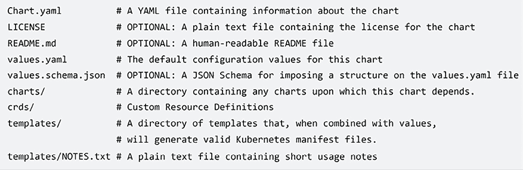

# 第二十章：Kubernetes

本章致力于描述 Kubernetes 容器编排器及其在 Azure 中的实现，称为 **Azure Kubernetes 服务**（**AKS**）。我们在第十一章“将微服务架构应用于您的企业应用”的“*哪些工具需要用于管理微服务？*”部分讨论了编排器的重要性和处理任务。在这里，值得回顾的是 Kubernetes 是编排器的既定标准。

我们还将展示如何在你的本地机器上安装和使用 minikube，这是一个单节点 Kubernetes 模拟器，你可以用它来尝试本章中的所有示例，也可以测试你自己的应用程序。模拟器在避免在实际基于云的 Kubernetes 集群上浪费太多钱，并为每个开发者提供不同的 Kubernetes 集群方面都很有用。

本章解释了 Kubernetes 的基本概念，然后重点介绍如何与 Kubernetes 集群交互以及如何部署 Kubernetes 应用程序。所有概念都通过简单的示例进行实践。我们建议在阅读本章之前先阅读第十一章“将微服务架构应用于您的企业应用”，因为我们将在本章中使用前面章节中解释的概念。

更具体地说，在本章中，我们将涵盖以下主题：

+   Kubernetes 基础

+   与 Azure Kubernetes 集群交互

+   高级 Kubernetes 概念

到本章结束时，你将学会如何使用 Azure Kubernetes 服务（AKS）实现和部署一个完整的解决方案。

# 技术要求

在本章中，你需要以下内容：

+   Visual Studio 2022 免费社区版或更高版本，已安装所有数据库工具，或任何其他 `.yaml` 文件编辑器，例如 Visual Studio Code。

+   一个免费的 Azure 账户。第一章“理解软件架构的重要性”中的“*创建 Azure 账户*”部分解释了如何创建一个。

+   可选的 minikube 安装。安装说明将在本章的“使用 minikube”部分提供。

本章的代码可在 [`github.com/PacktPublishing/Software-Architecture-with-C-Sharp-12-and-.NET-8-4E`](https://github.com/PacktPublishing/Software-Architecture-with-C-Sharp-12-and-.NET-8-4E) 找到。

# Kubernetes 基础

Kubernetes 是一种用于管理在计算机网络上运行的分布式应用程序的高级开源软件。Kubernetes 可以用于您的私有机器的集群，或者您可以使用所有主要云提供商的硬件可扩展 Kubernetes 产品。这种软件被称为**编排器**，因为它动态地将微服务分配给可用的硬件资源，以最大化性能。此外，像 Kubernetes 这样的编排器为它们在机器之间移动的微服务提供稳定的虚拟地址，从而改变它们的物理地址。在撰写本文时，Kubernetes 是最广泛使用的编排器，是集群编排的*事实标准*，可以与广泛的工具和应用程序生态系统一起使用。虽然 Kubernetes 不绑定到特定的语言或框架，但它是在基于微服务的 .NET 分布式应用程序中管理硬件资源和通信的基本工具。本节介绍了 Kubernetes 的基本概念和实体。

Kubernetes 集群是运行 Kubernetes 编排器的虚拟机集群。


图 20.1：配备 Kubernetes 的计算机网络

通常，Kubernetes 安装在称为**主节点**的特定机器上，而所有其他计算机仅运行一个连接到主节点上运行的软件的接口软件。

组成集群的虚拟机被称为**节点**。我们可以在 Kubernetes 上部署的最小软件单元不是一个单独的应用程序，而是一组容器化应用程序的集合，称为**Pod**。虽然 Kubernetes 支持各种类型的容器，但最常用的容器类型是 Docker，这在我们的第十一章*将微服务架构应用于您的企业应用程序*中进行了分析，因此我们将在这里仅限于讨论 Docker。Pod 是 Docker 图像的集合，每个图像都包含您的 .NET 微服务或使用其他技术实现的微服务。

更具体地说，Pod 是在应用程序的整体生命周期中必须放置在同一节点上的 Docker 图像集合。它们可以被移动到其他节点，但必须一起移动。这意味着它们可以通过 localhost 端口轻松通信。然而，不同 Pod 之间的通信更为复杂，因为 Pod 的 IP 地址是短暂的资源，因为 Pod 没有固定的运行节点，而是由编排器从一个节点移动到另一个节点。此外，Pod 可能会被复制以提高性能，因此，通常将消息发送到特定的 Pod 没有意义；相反，我们将它发送到同一 Pod 的任何相同副本。

集群节点和 Pod 由主节点管理，主节点通过 API 服务器与集群管理员通信，如下所示：


图 20.2：Kubernetes 集群

调度器根据管理员的约束将 Pod 分配到节点，同时控制器管理器将多个守护进程分组，这些守护进程监控集群的实际状态并尝试将其移动到通过 API 服务器声明的期望状态。有几个控制器用于 Kubernetes 资源，从 Pod 副本到通信设施。实际上，每个资源在应用程序运行期间都有一些需要保持的目标目标，控制器会验证这些目标是否真正实现，如果没有实现，可能会触发纠正措施，例如将运行速度过慢的一些 Pod 移动到更少拥挤的节点。

kubelet 管理每个非主节点与主节点之间的交互。

在 Kubernetes 中，Pod 之间的通信由称为**服务**的资源处理，这些服务由 Kubernetes 基础设施分配虚拟地址，并将它们的通信转发到一组相同的 Pod。简而言之，服务是 Kubernetes 为 Pod 副本集分配一致虚拟地址的方式。

Kubernetes 的所有实体都可以分配名为**标签**的键值对，这些标签通过模式匹配机制来引用。更具体地说，选择器通过列出它们必须具有的标签来选择 Kubernetes 实体。

因此，例如，所有从同一服务接收流量的 Pod 都会通过指定它们在服务定义中必须具有的标签来选择。

服务路由其流量到所有连接 Pod 的方式取决于 Pod 的组织方式。无状态 Pod 组织在所谓的`ReplicaSets`中。`ReplicaSets`为整个组分配一个唯一的虚拟地址，流量在组中的所有 Pod 之间平均分配。

状态化 Kubernetes Pod 副本组织成所谓的`StatefulSets`。`StatefulSets`使用分片来分割所有 Pod 之间的流量。因此，Kubernetes 服务为它们连接到的`StatefulSet`中的每个 Pod 分配不同的名称。这些名称看起来如下：`basename-0.<base URL>`，`basename-1.<base URL>`，...，`basename-n.<base URL>`。这样，消息分片就可以轻松完成如下：

1.  每次必须向由*N*个副本组成的`StatefulSet`发送消息时，你会在`0`和`N-1`之间计算一个哈希值，比如说`X`。

1.  在基础名称后添加后缀`X`以获取集群地址，例如`basename-x.<base URL>`。

1.  将消息发送到`basename-x.<base URL>`集群地址。

Kubernetes 没有预定义的存储设施，你不能使用节点磁盘存储，因为 Pod 会在可用节点之间移动，所以必须使用分片云数据库或其他类型的云存储来提供长期存储。虽然每个 StatefulSet 中的 Pod 都可以使用常规连接字符串技术访问分片云数据库，但 Kubernetes 提供了一种技术来抽象外部 Kubernetes 集群环境提供的类似磁盘的云存储。我们将在*高级 Kubernetes 概念*部分描述这种存储。

在这个简短的介绍中提到的所有 Kubernetes 实体都可以在 `.yaml` 文件中定义，一旦部署到 Kubernetes 集群，就会在文件中定义的所有实体被创建。接下来的子节描述 `.yaml` 文件，而之后的子节将详细描述迄今为止提到的所有基本 Kubernetes 对象，并解释如何在 `.yaml` 文件中定义它们。其他 Kubernetes 对象将在本章的其余部分进行描述。

## .yaml 文件

开发者使用一种名为 YAML 的语言来描述集群的期望配置和 Kubernetes 对象的结构，并将它们打包在具有 `.yaml` 扩展名的文件中。

`.yaml` 文件，类似于 JSON 文件，可以用一种易于阅读的方式描述嵌套对象和集合，但它们使用的是不同的语法。您有对象和列表，但对象的属性不是用 `{}` 包围，列表也不是用 `[]` 包围。相反，通过简单地使用空格缩进来声明嵌套对象。空格的数量可以自由选择，但一旦选择，就必须始终如一地使用。

列表项可以通过在它们前面加上破折号 (`-`) 来与对象属性区分开来。

下面是一个涉及嵌套对象和集合的示例：

```cs
Name: John
Surname: Smith
Spouse:
Name: Mary
Surname: Smith
Addresses:
- Type: home
Country: England
Town: London
Street: My home street
- Type: office
Country: England
Town: London
Street: My home street 
```

前面的 `Person` 对象有一个嵌套的 `Spouse` 对象和一个嵌套的地址集合。

在 JSON 中的相同示例将是：

```cs
{
Name: John
Surname: Smith
Spouse:
{
  Name: Mary
Surname: Smith
}
Addresses:
[
 {
  Type: home
Country: England
Town: London
Street: My home street
 },
 {
  Type: office
Country: England
Town: London
Street: My home street
 }
]
} 
```

如您所见，语法更易于阅读，因为它避免了括号的冗余。

`.yaml` 文件可以包含多个部分，每个部分定义不同的实体，它们之间由包含 `---` 字符串的行分隔。注释前有一个 `#` 符号，必须在每行注释中重复。

每个部分都以 Kubernetes API 组和版本的声明开始。实际上，并非所有对象都属于同一个 API 组。对于属于 `core` API 组的对象，我们只需指定 API 版本即可，如下例所示：

```cs
apiVersion: v1 
```

而属于不同 API 组的对象也必须指定 API 名称，如下例所示：

```cs
apiVersion: apps/v1 
```

在下一个子节中，我们将分析建立在它们之上的 ReplicaSets 和 Deployments。

## ReplicaSets 和 Deployments

Kubernetes 应用程序最重要的构建块是 ReplicaSet，即 Pod 被复制 *N* 次。然而，通常您会使用一个更复杂的对象，它是建立在 ReplicaSet 之上的——Deployment。Deployment 不仅创建 ReplicaSet，还监控它们以确保副本数量在硬件故障和其他可能涉及 ReplicaSet 的事件发生时保持恒定。换句话说，它们是定义 ReplicaSet 和 Pod 的声明性方式。

复制相同的函数，从而复制相同的 Pod，是优化性能的最简单操作：我们为相同的 Pod 创建的副本越多，就必须为该 Pod 编码的功能提供更多的硬件资源和线程。因此，当我们发现某个功能成为系统中的瓶颈时，我们可能只需增加编码该功能的 Pod 副本的数量。

每个部署都有一个名称（`metadata->name`），一个指定所需副本数的属性（`spec->replicas`），一个键值对（`spec -> selector-> matchLabels`），它选择要监控的 Pod，以及一个模板（`spec->template`），它指定如何构建 Pod 副本：

```cs
apiVersion: apps/v1
kind: Deployment
metadata:
name: my-deployment-name
namespace: my-namespace #this is optional
spec:
replicas: 3
selector:
matchLabels:
my-pod-label-name: my-pod-label-value
...
template:
... 
```

`namespace`是可选的，如果没有提供，则假定一个名为`default`的命名空间。命名空间是保持 Kubernetes 集群中对象分离的一种方式。例如，一个集群可以托管两个完全独立的应用程序的对象，每个应用程序都放置在单独的`namespace`中，以防止可能的重名冲突。简而言之，Kubernetes 命名空间与.NET 命名空间具有相同的目的：防止重名冲突。

在模板内部缩进的是要复制的 Pod 的定义。复杂的对象，如部署，也可以包含其他类型的模板，例如，外部环境所需的类似磁盘的内存模板。我们将在*高级 Kubernetes 概念*部分详细讨论这一点。

相应地，Pod 模板包含一个`metadata`部分，其中包含用于选择 Pod 的标签，以及一个`spec`部分，其中包含所有容器的列表：

```cs
metadata:
labels:
my-pod-label-name: my-pod-label-value
...
spec:
containers:
...
- name: my-container-name
image: <Docker imagename>
resources:
requests:
cpu: 100m
memory: 128Mi
limits:
cpu: 250m
memory: 256Mi
ports:
- containerPort: 6379
env:
- name: env-name
value: env-value
... 
```

每个容器都有一个名称，并且必须指定用于创建容器的 Docker 镜像的名称。如果 Docker 镜像不在公共 Docker 注册表中，名称必须是一个 URI，它还包括存储库的位置。

然后，容器必须指定它们在`resources->requests`对象中需要的内存和 CPU 资源才能被创建。只有当这些资源当前可用时，才会创建 Pod 副本。相反，`resources->limits`对象指定了容器副本可以使用的最大资源。如果在容器执行期间超过了这些限制，将采取行动来限制它们。更具体地说，如果 CPU 限制被超过，容器将被节流（其执行停止以恢复其 CPU 消耗），而如果内存限制被超过，容器将被重启。`containerPort`必须是容器暴露的端口。在这里，我们还可以指定其他信息，例如使用的协议。

CPU 时间以毫芯为单位表示；`1,000`毫芯表示`100%`的 CPU 时间，而内存以兆字节（`1Mi` `=` `1,024*1,024 bytes`）或其他单位表示。`env`列出所有传递给容器的操作系统环境变量及其值。

容器和 Pod 模板都可以包含其他字段，例如定义虚拟文件属性和定义返回容器就绪状态和健康状态的命令的属性。我们将在*高级 Kubernetes 概念*部分中分析这些字段。

以下子部分描述了旨在存储状态信息的 Pod 集。

## StatefulSets

StatefulSet 与 ReplicaSet 非常相似，但 ReplicaSet 中的 Pod 是不可区分的处理器，它们通过负载均衡策略并行贡献相同的工作负载，而 StatefulSet 中的 Pod 具有唯一的标识，只能通过分片来贡献相同的工作负载。这是因为 StatefulSet 是为了存储信息而设计的，信息不能并行存储，只能通过分片在几个存储之间分割。

由于同样的原因，每个 Pod 实例始终与其所需的任何虚拟磁盘空间保持关联（参见*高级 Kubernetes 概念*部分），这样每个 Pod 实例就负责写入特定的存储。

此外，StatefulSets 的 Pod 实例还附加了序号。它们根据这些序号按顺序启动，并按相反的顺序停止。如果 StatefulSet 包含*N*个副本，这些数字从`0`到`N-1`。此外，每个实例都有一个独特的名称，通过将模板中指定的 Pod 名称与实例序号链接在一起获得，如下所示 – `<pod name>-<instance ordinal>`。因此，实例名称将类似于`mypodname-0`、`mypodname-1`等。正如我们将在*服务*子部分中看到的那样，实例名称用于为所有实例构建唯一的集群网络 URI，以便其他 Pod 可以与 StateFulSet Pod 的特定实例通信。

由于 StatefulSet 中的 Pod 具有内存，每个 Pod 只能处理包含在其内的数据可以处理的需求。因此，为了利用 StatefulSet 中的多个 Pod，我们必须在易于计算的子集中共享整个数据空间。这种技术称为分片。例如，处理客户的 StatefulSet 的 Pod 可以根据其首字母分配不同的客户名称集。一个可以处理所有以 A-C 字母开头的客户，另一个可以处理以 D-F 字母开头的名称，依此类推。

这里是一个典型的 StatefulSet 定义：

```cs
apiVersion: apps/v1
kind: StatefulSet
metadata:
name: my-stateful-set-name
spec:
selector:
matchLabels:
my-pod-label-name: my-pod-label-value
...
serviceName: "my-service-name"
replicas: 3
template:
... 
```

模板部分与 Deployments 相同。StatefulSets 与 Deployments 之间的主要区别是`serviceName`字段。它指定了必须与 StatefulSet 连接的服务名称，以为所有 Pod 实例提供唯一的网络地址。我们将在*服务*子部分中更详细地讨论这个问题。此外，通常 StatefulSets 使用某种形式的存储。我们将在*高级 Kubernetes 概念*部分中详细讨论这一点。

还值得一提的是，可以通过指定`spec->podManagementPolicy`属性的显式`Parallel`值来更改 StatefulSets 创建和停止策略的默认顺序（默认值是`OrderedReady`）。

下表总结了 StatefulSets 和 ReplicaSets 之间的差异：

| **特性** | **StatefulSets** | **ReplicaSets** |
| --- | --- | --- |
| 整个集合的唯一地址 | No. 集合中的每个 Pod 都有一个不同的地址，并负责处理不同类型的请求。 | Yes. ReplicaSet 中的 Pod 是不可区分的，因此每个请求可以由其中的任何一个 Pod 处理。 |
| 应用生命周期内可以增加副本数量 | No. 由于每个 Pod 负责特定类型的请求并具有唯一的地址，因此我们无法添加更多的 Pod。 | Yes. 由于 Pod 是不可区分的，更多的 Pod 不会引起问题，但只会提高整个集合的性能。 |
| Pods 可以在其中存储永久数据 | Yes, they are designed for this. Requests are issued to Pods with the sharding technique. | No, because they are designed to be indistinguishable, and storing a specific datum in a specific Pod would make a Pod different from the others in the set. |

表 20.1：StatefulSets 与 ReplicaSets 对比

下一个子节将描述如何为 ReplicaSets 和 StatefulSets 提供稳定的网络地址。

## 服务

由于 Pod 实例可以在节点之间移动，它们没有附加到它们上的稳定 IP 地址。服务负责为整个 ReplicaSet 分配一个唯一且稳定的虚拟地址，并对所有实例的流量进行负载均衡。服务不是在集群中创建的软件对象，而只是实现其功能所需的各种设置和活动的抽象。

服务在协议栈的第 4 层工作，因此它们理解 TCP 等协议，但它们无法执行 HTTP 特定的操作/转换，例如确保安全的 HTTPS 连接。因此，如果您需要在 Kubernetes 集群上安装 HTTPS 证书，则需要一个能够与协议栈第 7 层交互的更复杂对象。`Ingress`对象就是为了这个目的而设计的。我们将在下一个子节中讨论这一点。

服务还负责为 StatefulSet 的每个实例分配一个唯一的虚拟地址。实际上，存在各种类型的服务；一些是为 ReplicaSets 设计的，而另一些是为 StatefulSets 设计的。

被分配了唯一集群内部 IP 地址的`ClusterIP`服务类型。它通过标签模式匹配指定它连接到的 ReplicaSets 或 Deployments。它使用 Kubernetes 基础设施维护的表来在它连接的所有 Pod 实例之间负载均衡它接收到的流量。

因此，其他 Pods 可以通过与此服务交互来与连接到服务的 Pods 进行通信，该服务被分配了稳定的网络名称 `<service name>.<service namespace>.svc.cluster.local`。由于它们只是分配了本地 IP 地址，因此 `ClusterIP` 服务无法从 Kubernetes 集群外部访问。

对于不与 Kubernetes 集群外部进行通信的 Deployments 和 ReplicaSets，ClusterIP 是通常的通信选择。

这里是典型 `ClusterIP` 服务的定义：

```cs
apiVersion: v1
kind: Service
metadata:
name: my-service
namespace: my-namespace
spec:
selector:
my-selector-label: my-selector-value
...
ports:
- name: http
protocol: TCP
port: 80
targetPort: 9376
- name: https
protocol: TCP
port: 443
targetPort: 9377 
```

每个服务可以在多个端口上工作，并将任何端口 (`port`) 路由到容器暴露的端口 (`targetPort`)。然而，`port = targetPort` 的情况非常常见。端口可以命名，但这些名称是可选的。此外，协议的指定也是可选的；当未明确指定时，允许所有受支持的四层协议。`spec->selector` 属性指定了所有用于选择要路由通信的服务的 Pods 的名称/值对。

由于 `ClusterIP` 服务无法从 Kubernetes 集群外部访问，我们需要其他服务类型来在公共 IP 地址上暴露 Kubernetes 应用程序。

`NodePort` 类型服务是将 Pods 暴露给外部世界的最简单方式。为了实现 `NodePort` 服务，在 Kubernetes 集群的每个节点上打开相同的端口 `x`，并且每个节点将接收到的此端口上的流量路由到一个新创建的 `ClusterIP` 服务。

反过来，`ClusterIP` 服务将其流量路由到服务所选的所有 Pods：


图 20.3：NodePort 服务

因此，您可以通过任何集群节点的公共 IP 地址上的端口 `x` 进行通信，以访问连接到 `NodePort` 服务的 Pods。当然，整个过程是完全自动的，并且对开发者隐藏，开发者的唯一关注点是获取端口号 `x`，以便知道如何转发外部流量。

`NodePort` 服务的定义与 `ClusterIP` 服务的定义类似，唯一的区别是它们为 `spec->type` 属性指定了 `NodePort` 的值：

```cs
...
spec:
type: NodePort
selector:
... 
```

默认情况下，为每个由 `Service` 指定的 `targetPort` 自动选择范围在 30000-32767 之间的节点端口 `x`。对于 `NodePort` 服务，与每个 `targetPort` 相关的 `port` 属性是无效的，因为所有流量都通过选定的节点端口 `x` 传递，并且按照惯例，将其设置为与 `targetPort` 相同的值。

开发者还可以通过 `nodePort` 属性直接设置 NodePort `x`：

```cs
...
ports:
- name: http
protocol: TCP
port: 80
targetPort: 80
nodePort: 30007
- name: https
protocol: TCP
port: 443
targetPort: 443
nodePort: 30020
... 
```

当 Kubernetes 集群托管在云上时，将一些 Pods 暴露给外部世界的更方便的方式是通过 `LoadBalancer` 服务，在这种情况下，Kubernetes 集群通过所选云提供商的第四层负载均衡器暴露给外部世界。

负载均衡器（LoadBalancer）通常是用于部署（Deployments）和副本集（ReplicaSets）的通信选择，这些部署和副本集在其 Kubernetes 集群外部进行通信，但不需要高级 HTTP 功能。

`LoadBalancer` 服务的定义与 `ClusterIp` 服务的定义类似，唯一的区别是必须将 `spec->type` 属性设置为 `LoadBalancer`：

```cs
...
spec:
type: LoadBalancer
selector:
... 
```

如果没有添加进一步的指定，将随机分配一个动态公共 IP。然而，如果需要特定的公共 IP 地址，可以通过在 `spec->loadBalancerIP` 属性中指定它来将其设置为集群负载均衡器的公共 IP 地址：

```cs
...
spec:
type: LoadBalancer
loadBalancerIP: <your public ip>
selector:
... 
```

在 **Azure Kubernetes 服务**（**AKS**）中，你还必须在注释中指定分配 IP 地址的资源组：

```cs
apiVersion: v1
kind: Service
metadata:
annotations:
service.beta.kubernetes.io/azure-load-balancer-resource-group: <IP resource group name>
name: my-service-name
... 
```

在 AKS 中，你可以保持使用动态 IP 地址，但你也可以获得一个公共静态域名，类型为 `<my-service-label>.<location>.cloudapp.azure.com`，其中 `<location>` 是你为资源选择的地理位置标签。《my-service-label》是一个你验证过的标签，使得上述域名唯一。《my-service-label》必须在你的服务注释中声明，如下所示：

```cs
apiVersion: v1
kind: Service
metadata:
annotations:
service.beta.kubernetes.io/azure-dns-label-name: <my-service-label>
name: my-service-name
... 
```

`StatefulSets` 不需要任何负载均衡，因为每个 Pod 实例都有自己的标识，但确实需要为每个 Pod 实例提供一个唯一的 URL 地址。这个唯一的 URL 由所谓的 **无头服务** 提供。无头服务的定义与 `ClusterIP` 服务类似，唯一的区别是它们将 `spec->clusterIP` 属性设置为 `none`：

```cs
...
spec:
clusterIP: none
selector:
... 
```

所有由无头服务处理的 `StatefulSets` 必须在其 `spec->serviceName` 属性中放置服务名称，正如在 *StatefulSets* 子节中已经说明的那样。

无头服务为它所处理的每个 `StatefulSets` Pod 实例提供的唯一名称是 `<unique pod name>.<service name>.<namespace>.svc.cluster.local`。

服务只理解低级协议，如 TCP/IP，但大多数 Web 应用程序都位于更复杂的 HTTP 协议上。这就是为什么 Kubernetes 提供了在服务之上构建的更高层次的实体，称为 **Ingress**。

入口对于所有需要 HTTP 支持的基于 Web 的应用程序的实施至关重要。此外，由于目前大量应用程序都是 Web 应用程序，入口对于所有微服务应用程序来说都是 **必需的**。特别是，所有基于 ASP.NET Core 的微服务都需要它们，我们将在本书的剩余部分讨论这一点。

下一个子节描述了这些内容，并解释了如何通过第 7 层协议负载均衡器公开一组 Pod，这可以用来访问典型的 HTTP 服务，而不是通过 `LoadBalancer` 服务。

## 入口（Ingresses）

入口（Ingresses）的概念是为了使运行在 Kubernetes 集群中的每个应用程序都能够暴露基于 HTTP 的接口。这对于任何编排器来说都是一个基本要求，因为如今所有微服务应用程序都是 Web 应用程序，它们通过基于 HTTP 的协议与客户端进行交互。此外，入口必须非常高效，因为所有与 Kubernetes 集群的通信都将通过它们进行。

因此，入口提供了由高级和高效的 Web 服务器提供的所有典型服务。它们提供以下服务：

+   HTTPS 终结。它们接受 HTTPS 连接，并以 HTTP 格式将它们路由到集群中的任何服务。

+   基于名称的虚拟主机。它们将多个域名与同一 IP 地址关联，并将每个域名或 `<domain>/<path prefix>` 路由到不同的集群服务。

+   负载均衡。

入口是部署（Deployments）和副本集（ReplicaSets）的常规通信选择，这些部署和副本集需要与 Kubernetes 集群外部进行通信，并且需要高级 HTTP 功能。

由于从头开始重写高级 Web 服务器的所有功能基本上是不可能的，入口依赖于现有的 Web 服务器来提供服务。更具体地说，Kubernetes 提供了添加一个名为入口控制器（Ingress Controllers）的接口模块的可能性，以将每个 Kubernetes 集群与现有的 Web 服务器（如 NGINX 和 Apache）连接起来。

入口控制器是自定义的 Kubernetes 对象，必须在集群中安装。它们处理 Kubernetes 与现有的 Web 服务器软件之间的接口，这可以是外部 Web 服务器，也可以是 Ingress 控制器安装的一部分 Web 服务器。

我们将在 *高级 Kubernetes 概念* 部分中描述基于 NGINX Web 服务器软件的入口控制器的安装，作为 Helm 使用的示例。然而，所有主要的 Web 服务器都有入口控制器。*进一步阅读* 部分包含有关如何安装一个与外部 Azure 应用程序网关接口的入口控制器的信息。

HTTPS 终结和基于名称的虚拟主机（有关这些术语的解释请参阅本小节开头）可以在入口定义中配置，方式独立于所选的入口控制器，而负载均衡的实现方式则取决于所选的具体入口控制器及其配置。一些入口控制器配置数据可以通过入口定义的 `metadata-> annotations` 字段传递。

基于名称的虚拟主机在入口定义的 `spec-> rules` 部分中定义：

```cs
...
spec:
...
rules:
- host: *.mydomain.com
http:
paths:
- path: /
pathType: Prefix
backend:
service:
name: my-service-name
port:
number: 80
- host: my-subdomain.anotherdomain.com
... 
```

每个规则指定一个可选的主机名，它可以包含 `*` 通配符。如果没有提供主机名，则规则匹配所有主机名。对于每个规则，我们可以指定几个路径，每个路径都重定向到不同的服务/端口对，其中服务通过其名称引用。匹配每个 `path` 的方式取决于 `pathType` 的值；如果此值为 `Prefix`，则指定的 `path` 必须是任何匹配路径的前缀。否则，如果此值为 `Exact`，则匹配必须是精确的。匹配区分大小写。

在特定主机名上指定 HTTPS 终止是通过将其与一个编码在 Kubernetes 机密中的证书相关联来实现的：

```cs
...
spec:
...
tls:
- hosts:
- www.mydomain.com
secretName: my-certificate1
- my-subdomain.anotherdomain.com
secretName: my-certificate2
... 
```

HTTPS 证书可以在 [`letsencrypt.org/`](https://letsencrypt.org/) 免费获得。该流程在网站上有所解释，但基本上，与所有证书颁发机构一样，您提供一个密钥，他们根据该密钥返回证书。还可以安装一个 **证书管理器**，它会自动安装和续订证书。密钥/证书对如何在 Kubernetes 机密字符串中编码在 *高级 Kubernetes 概念* 部分中详细说明。

整个 Ingress 定义如下：

```cs
apiVersion: networking.k8s.io/v1
kind: Ingress
metadata:
name: my-example-ingress
namespace: my-namespace
spec:
tls:
...
rules:
... 
```

在这里，`namespace` 是可选的，如果没有指定，则默认为 `default`。

在下一节中，我们将通过定义一个 Azure Kubernetes 集群并部署一个简单的应用程序来实践这里解释的一些概念。

# 与 Kubernetes 集群交互

在本节中，我们将解释如何创建一个 Azure Kubernetes 集群，以及如何在您的本地机器上安装 minikube，一个 Kubernetes 模拟器。所有示例都可以在 Azure Kubernetes 和您的本地 minikube 实例上运行。

## 创建 Azure Kubernetes 集群

要创建一个 AKS 集群，请执行以下操作：

1.  在 Azure 搜索框中输入 `AKS`。

1.  选择 **Kubernetes 服务**。

1.  然后点击 **创建** 按钮。

之后，将出现以下表单：


图 20.4：创建 Kubernetes 集群

值得注意的是，您只需将鼠标悬停在任何  上即可获得帮助。

如同往常，您需要指定一个订阅、资源组和区域。然后，您可以选择一个独特的名称（**Kubernetes 集群名称**）以及您希望使用的 Kubernetes 版本。对于计算能力，您需要为每个节点选择一个机器模板（**节点大小**）和节点数量。而对于实际应用，建议至少选择三个节点，但为了节省我们的免费 Azure 信用额度，我们这次只选择两个节点。

此外，默认的虚拟机也应设置为便宜的型号，因此点击 **更改大小** 并选择 **DS2 v2**。最后，将 **缩放方法** 设置为 **手动** 以防止节点数量自动更改，这可能会快速消耗您的免费 Azure 信用额度。

**可用区域**设置允许你将你的节点分散在几个地理区域，以提高容错能力。默认为三个区域。请将其更改为两个区域，因为我们只有两个节点。

实施上述更改后，你应该看到以下设置：


图 20.5：选择的设置

现在，你可以通过点击**审查 + 创建**按钮来创建你的集群。应该会出现一个审查页面。确认并创建集群。

如果你点击**下一步**而不是**审查 + 创建**，你也可以定义其他节点类型，然后你可以提供安全信息，即*服务主体*，并指定你是否希望启用基于角色的访问控制。在 Azure 中，服务主体是与你可能使用的服务关联的账户，你可以使用它来定义资源访问策略。你还可以更改默认的网络设置和其他设置。

部署可能需要一点时间（10-20 分钟）。在这段时间之后，你将拥有你的第一个 Kubernetes 集群！在章节结束时，当集群不再需要时，请务必删除它，以避免浪费你的免费 Azure 信用额度。

在下一个子节中，你将学习如何在你的本地机器上安装和使用 minikube，这是一个单节点 Kubernetes 模拟器。

## 使用 minikube

安装 minikube 最简单的方法是使用官方安装页面中可找到的 Windows 安装程序：[`minikube.sigs.k8s.io/docs/start/`](https://minikube.sigs.k8s.io/docs/start/)。

在安装过程中，你将提示选择要使用的虚拟化工具。如果你已经安装了 Docker Desktop 和 WSL，请指定 Docker。

如果你使用的是不同的操作系统，请遵循默认选项。

Docker Desktop 的安装说明在*第十一章，将微服务架构应用于你的企业应用程序*的技术要求中解释。请注意，WSL 和 Docker Desktop 都必须安装，并且 Docker 必须配置为默认使用 Linux 容器。 

一旦安装了 minikube，你必须将其二进制文件添加到你的计算机`PATH`中。最简单的方法是打开 PowerShell 控制台并运行以下命令：

```cs
$oldPath=[Environment]::GetEnvironmentVariable('Path', [EnvironmentVariableTarget]::Machine)
if ($oldPath.Split(';') -inotcontains 'C:\minikube'){ '
 [Environment]::SetEnvironmentVariable('Path', $('{0};C:\minikube' -f $oldPath), [EnvironmentVariableTarget]::Machine) '
} 
```

一旦安装，你可以使用以下命令运行你的集群：

```cs
minikube start 
```

当你完成与集群的工作后，可以使用以下命令停止它：

```cs
minikube stop 
```

在下一个子节中，你将学习如何通过 Kubernetes 的官方客户端 kubectl 与你的 minikube 实例或 Azure 集群进行交互。

## 使用 kubectl

一旦创建了你的 Azure Kubernetes 集群，你就可以通过 Azure Cloud Shell 与之交互。点击 Azure 门户页面右上角的控制台图标。以下截图显示了 Azure Shell 图标：


图 20.6：Azure Shell 图标

当提示时，选择**Bash Shell**。然后你将被提示创建一个存储账户，因此请确认并创建它。

我们将使用这个 shell 来与我们的集群交互。在 shell 的顶部有一个文件图标，我们将用它来上传我们的`.yaml`文件：


图 20.7：如何在 Azure Cloud Shell 中上传文件

也可以下载一个名为 Azure CLI 的客户端并将其安装到你的本地机器上（见[`docs.microsoft.com/en-US/cli/azure/install-azure-cli`](https://docs.microsoft.com/en-US/cli/azure/install-azure-cli)），但在此情况下，你还需要安装所有与 Kubernetes 集群交互所需的工具（kubectl 和 Helm），这些工具在 Azure Cloud Shell 中预先安装。

一旦你创建了一个 Kubernetes 集群，你就可以通过`kubectl`命令行工具与之交互。`kubectl`集成到 Azure Cloud Shell 中，所以你只需要激活你的集群凭据来使用它。你可以使用以下 Azure Cloud Shell 命令来完成此操作：

```cs
az aks get-credentials --resource-group <resource group> --name <cluster name> 
```

上述命令将自动创建的凭据存储在`/.kube/config`配置文件中，以启用你与集群的交互。从现在开始，你可以无需进一步认证即可输入你的`kubectl`命令。

如果你需要与你的本地 minikube 集群交互，你需要本地安装`kubectl`，但 minikube 会自动为你安装。

为了使用自动安装的`kubectl`，所有`kubectl`命令都必须以`minikube`命令开头，并且`kubectl`后面必须跟有--。例如，如果你想运行以下命令：

```cs
kubectl get all 
```

然后你需要编写以下内容：

```cs
minkube kubectl -- get all 
```

在本章的剩余部分，我们将编写在真实的 Kubernetes 集群（如 Azure Kubernetes）上工作的命令。因此，当使用 minikube 时，请记住在你的命令中将`kubectl`替换为`minikube kubectl` --。

如果你输入`kubectl get nodes`命令，你会得到所有 Kubernetes 节点的列表。通常，`kubectl get <对象类型>`会列出给定类型的所有对象。你可以用它来与`nodes`、`pods`、`statefulset`等一起使用。`kubectl get all`会显示你集群中创建的所有对象的列表。如果你还添加了特定对象的名称，你将只得到关于该特定对象的信息，如下所示：

```cs
kubectl get <object type><object name> 
```

如果你添加了`--watch`选项，对象列表将不断更新，因此你可以看到所有选定对象的状态随时间变化。你可以通过按*Ctrl* + *C*来离开监视状态。

以下命令显示特定对象的详细报告：

```cs
kubectl describe <object name> 
```

`.yaml`文件中描述的所有对象，例如`myClusterConfiguration.yaml`，都可以使用以下命令创建：

```cs
kubectl create -f myClusterConfiguration.yaml 
```

然后，如果你修改了`.yaml`文件，你可以使用`apply`命令将所有修改反映到你的集群中，如下所示：

```cs
kubectl apply -f myClusterConfiguration.yaml 
```

`apply` 与 `create` 执行相同的任务，但如果资源已存在，`apply` 将覆盖它，而 `create` 将以错误消息退出。

您可以通过将相同的文件传递给 `delete` 命令来销毁使用 `.yaml` 文件创建的所有对象，如下所示：

```cs
kubectl delete -f myClusterConfiguration.yaml 
```

`delete` 命令也可以传递一个对象类型和该类型对象名称的列表，以销毁这些对象，如下面的示例所示：

```cs
kubectl delete deployment deployment1 deployment2... 
```

前面的 `kubectl` 命令应该足以满足大多数实际需求。对于更多详细信息，*进一步阅读* 部分包含了对官方文档的链接。

在下一个子节中，我们将使用 `kubectl create` 来安装一个简单的演示应用程序。

## 部署演示 Guestbook 应用程序

Guestbook 应用程序是官方 Kubernetes 文档中使用的演示应用程序。我们将使用它作为 Kubernetes 应用程序的示例，因为其 Docker 镜像可在公共 Docker 仓库中找到，因此我们不需要编写软件。

Guestbook 应用程序存储访问酒店或餐厅的客户意见。

它由一个用户界面和一个基于 Redis 的内存数据库组成。此外，更新被发送到 Redis 数据库的主副本，该主副本自动复制为 *N* 个只读 Redis 副本。


图 20.8：Guestbook 应用程序的架构

UI 应用程序可以作为 Deployment 在 Kubernetes 中部署，因为它是无状态的。

Redis 主存储以单个 pod `Deployment` 的形式部署。我们不能使用 *N* 个 pod 的 `Deployment` 来实现它，因为我们需要分片以并行化更新。然而，我们可能已经使用了一个 `StatefulSet`，为每个不同的主 Pod 分配不同的数据分片。但是，由于这是你的第一个 Kubernetes 练习，并且由于写入操作不应占主导地位，在单个餐厅/酒店的实际情况中，单个主数据库应该足够了。

由于所有从副本都包含相同的数据，因此它们是不可区分的，也可以使用 `Deployment` 来实现。

整个应用程序由三个 `.yaml` 文件组成，您可以在与本书相关的 GitHub 仓库中找到这些文件（[`github.com/PacktPublishing/Software-Architecture-with-C-Sharp-12-and-.NET-8-4E`](https://github.com/PacktPublishing/Software-Architecture-with-C-Sharp-12-and-.NET-8-4E)）。

这里是包含在 `redis-master.yaml` 文件中的基于 Redis 的主存储代码：

```cs
apiVersion: apps/v1
kind: Deployment
metadata:
name: redis-master
labels:
app: redis
spec:
selector:
matchLabels:
app: redis
role: master
tier: backend
replicas: 1
template:
metadata:
labels:
app: redis
role: master
tier: backend
spec:
containers:
- name: master
image: docker.io/redis:6.0.5
resources:
requests:
cpu: 100m
memory: 100Mi
ports:
- containerPort: 6379
---
apiVersion: v1
kind: Service
metadata:
name: redis-leader
labels:
app: redis
role: master
tier: backend
spec:
ports:
- port: 6379
targetPort: 6379
selector:
app: redis
role: master
tier: backend 
```

该文件由两个对象定义组成，由仅包含 `---` 的行分隔，即 `.yaml` 文件的对象定义分隔符。通常，将相关的对象，如与其关联的服务一起的 Deployment，放在同一个文件中，通过 `---` 对象分隔符号来分隔，以提高代码可读性。

第一个对象是一个具有单个副本的`Deployment`，第二个对象是一个`ClusterIP`服务，它将`Deployment`在内部`redis-leader.default.svc.cluster.local`网络地址的`6379`端口上暴露。部署 Pod 模板定义了三个`app`、`role`和`tier`标签及其值，这些值用于服务`selector`定义中，以将服务与`Deployment`中定义的唯一 Pod 连接。

让我们将`redis-master.yaml`文件上传到 Azure Cloud Shell，然后使用以下命令在集群中部署它：

```cs
kubectl create -f redis-master.yaml 
```

一旦操作完成，你可以使用`kubectl get all`来检查集群的内容。

从机存储在`redis-slave.yaml`文件中定义，并且以相同的方式创建，唯一的区别是这次我们有两个副本，以及不同的 Docker 镜像。完整的代码在本书相关的 GitHub 仓库中。

让我们也上传此文件，并使用以下命令部署它：

```cs
kubectl create -f redis-slave.yaml 
```

UI 层的代码包含在`frontend.yaml`文件中。`Deployment`有三个副本和不同的服务类型。让我们使用以下命令上传并部署此文件：

```cs
kubectl create -f frontend.yaml 
```

分析`frontend.yaml`文件中的服务代码是值得的：

```cs
apiVersion: v1
kind: Service
metadata:
name: frontend
labels:
app: guestbook
tier: frontend
spec:
type: LoadBalancer
ports:
- port: 80
selector:
app: guestbook
tier: frontend 
```

再次强调，完整的代码在本书相关的 GitHub 仓库中。

此服务为`LoadBalancer`类型。由于此 Pod 是应用程序与 Kubernetes 集群外部的接口，其服务必须有一个固定的 IP，并且必须进行负载均衡。因此，我们必须使用`LoadBalancer`服务，因为这是唯一满足这些要求的服务类型。（有关更多信息，请参阅本章的*服务*部分。）

如果你使用 Azure Kubernetes 或任何其他云 Kubernetes 服务，为了获取分配给服务的公网 IP 地址，然后到应用程序，请使用以下命令：

```cs
kubectl get service 
```

前面的命令应显示所有已安装服务的详细信息。你应该在列表的`EXTERNAL-IP`列中找到公网 IP。如果你只看到`<none>`值，请重复此命令，直到公网 IP 地址分配给负载均衡器。

如果几分钟内没有分配 IP，请检查任何服务描述中是否有错误或警告。如果没有，请使用以下命令检查所有部署是否实际上正在运行：

```cs
kubectl get deployments 
```

如果你在 minikube 上，可以通过以下命令访问`LoadBalancer`服务：

```cs
minikube service <service name> 
```

因此，在我们的情况下：

```cs
minikube service frontend 
```

此命令应自动打开浏览器。

一旦获取到 IP 地址，使用浏览器导航到该地址。现在应该会显示应用程序的主页！

如果页面没有出现，请通过以下命令检查是否有任何服务出现错误：

```cs
kubectl get service 
```

如果不是这样，也请使用以下命令验证所有部署是否处于运行状态：

```cs
kubectl get deployments 
```

如果您发现问题，请检查 `.yaml` 文件中的错误，更正它们，然后使用以下命令更新文件中定义的对象：

```cs
kubectl update -f <file name> 
```

一旦您完成对应用程序的实验，请确保使用以下命令将应用程序从集群中移除，以避免浪费您的免费 Azure 信用额度（公共 IP 地址需要付费）：

`kubectl delete deployment frontend redis-master redis-slave`

`kubectl delete service frontend redis-leader redis-follower`

在下一节中，我们将分析其他重要的 Kubernetes 功能。

# 高级 Kubernetes 概念

在本节中，我们将讨论其他重要的 Kubernetes 功能，包括如何将永久存储分配给 StatefulSets；如何存储密码、连接字符串或证书等机密信息；容器如何通知 Kubernetes 其健康状态；以及如何使用 Helm 处理复杂的 Kubernetes 包。所有这些主题都组织在专门的子节中。我们将从永久存储的问题开始。

## 需要永久存储

由于 Pod 会在节点之间移动，因此它们不能存储在它们运行的当前节点提供的磁盘存储上，否则一旦它们被移动到不同的节点，就会丢失该存储。这给我们留下了两个选择：

+   **使用外部数据库**：借助数据库，ReplicaSets 也可以存储信息。然而，如果我们需要在写入/更新操作方面获得更好的性能，我们应该使用基于非 SQL 引擎的分布式分片数据库，例如 Cosmos DB 或 MongoDB（见 *第十二章*，*在云中选择您的数据存储*）。在这种情况下，为了最大限度地利用表分片，我们需要 StatefulSets，其中每个 Pod 实例负责不同的表分片。

+   **使用云存储**：由于不受物理集群节点的限制，云存储可以永久关联到 StatefulSets 的特定 Pod 实例。云存储在 *第十二章* 的 *Redis* 和 *Azure 存储帐户* 部分中讨论。

由于访问外部数据库不需要任何特定的 Kubernetes 技巧，只需使用常规的连接字符串即可完成，因此我们将专注于云存储。

Kubernetes 提供了一个称为 **PersistentVolumeClaim** （**PVC**）的存储抽象，它与底层存储提供商无关。更具体地说，PVC 是请求分配，这些请求要么与预定义的资源匹配，要么动态分配。当 Kubernetes 集群位于云中时，通常，您使用由云提供商安装的动态提供者执行的动态分配。有关云存储的更多信息，请参阅 *第十二章*。

云提供商，如 Azure，提供具有不同性能和不同成本的不同的存储类别。此外，PVC 还可以指定 `accessMode`，可以是：

+   `ReadWriteOnce`：卷可以被单个 Pod 以读写方式挂载。

+   `ReadOnlyMany`：卷可以被多个 Pod 以只读方式挂载。

+   `ReadWriteMany`：卷可以被多个 Pod 以读写方式挂载。

可以在 StatefulSets 中添加到特定的`spec->volumeClaimTemplates`对象中：

```cs
volumeClaimTemplates:
- metadata:
name: my-claim-template-name
spec:
resources:
request:
storage: 5Gi
volumeMode: Filesystem
accessModes:
- ReadWriteOnce
storageClassName: my-optional-storage-class 
```

`storage`属性包含存储需求。`volumeMode`设置为`Filesystem`是标准设置，意味着存储将以文件路径的形式可用。另一个可能的值是`Block`，它将内存分配为`未格式化`。`storageClassName`必须设置为云提供商提供的现有存储类。如果省略，则假定默认存储类。

可以使用以下命令列出所有可用的存储类：

```cs
kubectl get storageclass 
```

一旦`volumeClaimTemplates`定义了如何创建持久存储，那么每个容器必须指定在`spec->containers->volumeMounts`属性中将该持久存储附加到哪个文件路径：

```cs
...
volumeMounts
- name: my-claim-template-name
mountPath: /my/requested/storage
readOnly: false
... 
```

在这里，`name`必须与 PVC 给出的名称相匹配。

下一个子节将展示如何使用 Kubernetes 密钥。

## Kubernetes 密钥

一些数据，如密码和连接字符串，不能公开，需要通过某种加密来保护。Kubernetes 通过称为**密钥**的特定对象处理需要加密的私有敏感数据。**密钥**是一组加密以保护它们的键值对。可以通过将每个值放入一个文件中，然后调用以下`kubectl`命令来创建：

```cs
kubectl create secret generic my-secret-name \
  --from-file=./secret1.bin \
  --from-file=./secret2.bin 
```

在这种情况下，文件名成为键，文件的内容成为值。

当值是字符串时，可以在`kubectl`命令中直接指定，如下所示：

```cs
kubectl create secret generic dev-db-secret \
  --from-literal=username=devuser \
  --from-literal=password='$dsd_weew1' 
```

在这种情况下，键和值依次列出，由`=`字符分隔。在先前的例子中，实际密码被单引号包围以转义通常用于构建强密码的特殊字符，如`$`。

一旦定义，密钥就可以在 Pod（Deployment 或 StatefulSet 模板）的`spec->volume`属性中引用，如下所示：

```cs
...
volumes:
- name: my-volume-with-secrets
secret:
secretName: my-secret-name
... 
```

之后，每个容器可以指定在`spec->containers->volumeMounts`属性中挂载它们的路径：

```cs
...
volumeMounts:
- name: my-volume-with-secrets
mountPath: "/my/secrets"
readOnly: true
... 
```

在前面的例子中，每个密钥被视为一个与密钥同名文件。文件的内容是加密的密值，使用 base64 编码。因此，读取每个文件的代码必须解码其内容（在.NET 中，`Convert.FromBase64`将完成这项工作）。

当密钥包含字符串时，也可以在`spec->containers->env`对象中作为环境变量传递：

```cs
env:
- name: SECRET_USERNAME
valueFrom:
secretKeyRef:
name: dev-db-secret
key: username
- name: SECRET_PASSWORD
valueFrom:
secretKeyRef:
name: dev-db-secret
key: password 
```

在这里，`name`属性必须与密钥的名称匹配。当容器托管 ASP.NET Core 应用程序时，将密钥作为环境变量传递非常方便，在这种情况下，环境变量都立即在配置对象中可用（参见第十七章“展示 ASP.NET Core”中的*加载配置数据和使用选项框架*部分）。

秘密也可以使用以下 `kubectl` 命令来编码 HTTPS 证书的密钥/证书对：

```cs
kubectl create secret tls test-tls --key="tls.key" --cert="tls.crt" 
```

以这种方式定义的秘密可以用来在 Ingress 中启用 HTTPS 终止。您可以通过将秘密名称放置在 Ingress 的 `spec->tls->hosts->secretName` 属性中来做到这一点。

## 活跃性和就绪性检查

Kubernetes 自动监控所有容器以确保它们仍然存活，并且它们保持其资源消耗在 `spec->containers->resources->limits` 对象中声明的限制内。当某些条件被违反时，容器可能会被节流、重启，或者整个 Pod 实例在不同的节点上重启。Kubernetes 如何知道容器处于健康状态？虽然它可以使用操作系统来检查节点的健康状态，但它没有适用于所有容器的通用检查。

因此，容器本身必须通知 Kubernetes 它们的健康状况，否则 Kubernetes 无法验证它们。容器可以通过两种方式通知 Kubernetes 它们的健康状况：要么声明一个返回其健康状况的控制台命令，要么声明一个提供相同信息的端点。

这两个声明都包含在 `spec-> containers-> livenessProbe` 对象中。控制台命令检查声明如下：

```cs
...
livenessProbe:
exec:
command:
- cat
- /tmp/healthy
initialDelaySeconds: 10
periodSeconds: 5
... 
```

如果 `command` 返回 `0`，则容器被认为是健康的。在先前的例子中，容器中运行的软件将它的健康状况记录在 `/tmp/healthy` 文件中，因此 `cat /tmp/healthy` 命令返回它。`PeriodSeconds` 是检查之间的时间，而 `initialDelaySeconds` 是在执行第一次检查之前的初始延迟。初始延迟总是必要的，以便给容器启动留出时间。

端点检查相当类似：

```cs
...
livenessProbe:
exec:
httpGet:
path: /healthz
port: 8080
httpHeaders:
- name: Custom-Health-Header
value: container-is-ok
initialDelaySeconds: 10
periodSeconds: 5
... 
```

如果 HTTP 响应包含声明的带有声明的值的头，则测试成功。您也可以使用纯 TCP 检查，如下所示：

```cs
...
livenessProbe:
exec:
tcpSocket:
port: 8080
initialDelaySeconds: 10
periodSeconds: 5
... 
```

在这种情况下，如果 Kubernetes 能够在声明的端口上打开到容器的 TCP 套接字，则检查成功。

类似地，一旦容器安装完成，其就绪性通过就绪性检查进行监控。就绪性检查的定义方式与活跃性检查类似，唯一的区别是 `livenessProbe` 被替换为 `readinessProbe`。

下一个子节将解释如何自动扩展 Deployment。

## 自动扩展

我们不必手动修改 Deployment 中的副本数量以适应负载的减少或增加，我们可以让 Kubernetes 自己决定保持声明的资源消耗恒定所需的副本数量。因此，例如，如果我们声明目标为 10% 的 CPU 消耗，那么当每个副本的平均资源消耗超过此限制时，将创建一个新的副本。如果平均 CPU 消耗低于此限制，则销毁一个副本。用于监控副本的典型资源是 CPU 消耗，但我们也可以使用内存消耗。

在实际的高流量生产系统中，自动扩展是**必须的**，因为它是快速适应负载变化系统的唯一方式。

通过定义`HorizontalPodAutoscaler`对象来实现自动扩展。以下是一个`HorizontalPodAutoscaler`定义的示例：

```cs
apiVersion: autoscaling/v2beta1
kind: HorizontalPodAutoscaler
metadata:
name: my-autoscaler
spec:
scaleTargetRef:
apiVersion: extensions/v1beta1
kind: Deployment
name: my-deployment-name
minReplicas: 1
maxReplicas: 10
metrics:
- type: Resource
resource:
name: cpu
targetAverageUtilization: 25 
```

`spec-> scaleTargetRef->name`指定了要自动扩展的 Deployment 的名称，而`targetAverageUtilization`指定了目标资源（在我们的情况下，`cpu`）的百分比使用率（在我们的情况下，25%）。

下一个子节简要介绍了 Helm 包管理器和 Helm 图表，并解释了如何在 Kubernetes 集群上安装 Helm 图表。还提供了一个如何安装 Ingress Controller 的示例。

## Helm – 安装 Ingress Controller

Helm 图表是组织复杂 Kubernetes 应用程序安装的方式，这些应用程序包含多个`.yaml`文件。Helm 图表是一组组织成文件夹和子文件夹的`.yaml`文件。以下是从官方文档中摘取的典型 Helm 图表文件夹结构：



图 20.9：Helm 图表的文件夹结构

特定于应用程序的`.yaml`文件放置在顶层的`templates`目录中，而`charts`目录可能包含其他用作辅助库的 Helm 图表。顶层`Chart.yaml`文件包含有关包（名称和描述）的一般信息，以及应用程序版本和 Helm 图表版本。以下是一个典型的示例：

```cs
apiVersion: v2
name: myhelmdemo
description: My Helm chart
type: application
version: 1.3.0
appVersion: 1.2.0 
```

在这里，`type`可以是`application`或`library`。只有`application`图表可以被部署，而`library`图表是用于开发其他图表的工具。`library`图表放置在其他 Helm 图表的`charts`文件夹中。

为了配置每个特定的应用程序安装，Helm 图表`.yaml`文件包含在安装 Helm 图表时指定的变量。此外，Helm 图表还提供了一种简单的模板语言，允许在某些条件满足的情况下仅包含一些声明，这些条件依赖于输入变量。顶层`values.yaml`文件声明了输入变量的默认值，这意味着开发者只需指定那些需要与默认值不同的变量即可。我们不会描述 Helm 图表模板语言，因为它过于广泛，但您可以在*进一步阅读*部分中提到的官方 Helm 文档中找到它。

Helm 图表通常以类似于 Docker 镜像的方式组织在公共或私有存储库中。有一个 Helm 客户端，您可以使用它从远程存储库下载包并在 Kubernetes 集群中安装图表。Helm 客户端在 Azure Cloud Shell 中立即可用，因此您可以在不安装它的情况下开始使用 Helm 为您的 Azure Kubernetes 集群。

在使用其软件包之前，必须先添加远程仓库，如下例所示：

```cs
helm repo add <my-repo-local-name> https://charts.helm.sh/stable 
```

上述命令使远程仓库的软件包可用，并为该远程仓库指定一个本地名称。之后，可以使用如下命令安装远程仓库中的任何软件包：

```cs
helm install <instance name><my-repo-local-name>/<package name> -n <namespace> 
```

在这里，`<namespace>` 是安装应用程序的命名空间。像往常一样，如果没有提供，则假定使用 `default` 命名空间。`<instance name>` 是你为安装的应用程序指定的名称。你需要这个名称来使用以下命令获取安装应用程序的信息：

```cs
helm status <instance name> 
```

你也可以使用以下命令获取使用 Helm 安装的所有应用程序的信息：

```cs
helm ls 
```

删除集群中的应用程序也需要应用程序名称，如下述命令所示：

```cs
helm delete <instance name> 
```

当我们安装应用程序时，我们还可以提供一个包含所有要覆盖的变量值的 `.yaml` 文件。我们还可以指定 Helm 图表的特定版本，否则将使用最新版本。以下是一个同时覆盖版本和值的示例：

```cs
helm install <instance name><my-repo-local-name>/<package name> -f  values.yaml --version <version> 
```

最后，可以使用 `--set` 选项直接提供值覆盖，如下所示：

```cs
...--set <variable1>=<value1>,<variable2>=<value2>... 
```

我们也可以使用 `upgrade` 命令升级现有的安装，如下所示：

```cs
helm upgrade <instance name><my-repo-local-name>/<package name>... 
```

可以使用 `upgrade` 命令通过 `--f` 选项或 `--set` 选项指定新的值覆盖，并通过 `--version` 指定新版本。

让我们使用 Helm 为 Guestbook 演示应用程序提供 Ingress。更具体地说，我们将使用 Helm 安装基于 Nginx 的 Ingress 控制器。需要遵循的详细步骤如下：

1.  添加远程仓库：

    ```cs
    helm repo add gcharts https://charts.helm.sh/stable 
    ```

1.  安装 Ingress 控制器：

    ```cs
    helm install ingress gcharts/nginx-ingress 
    ```

1.  安装完成后，如果你输入 `kubectl get service`，应该能在已安装的服务中看到已安装的 Ingress 控制器的条目。该条目应包含一个公网 IP。请记下此 IP，因为这将作为应用程序的公网 IP。

1.  打开 `frontend.yaml` 文件，删除 `type: LoadBalancer` 行。保存并上传到 Azure Cloud Shell。我们将前端应用程序的服务类型从 `LoadBalancer` 改为 `ClusterIP`（默认）。此服务将连接到你即将定义的新 Ingress。

1.  根据 *部署演示 Guestbook 应用程序* 子节中的详细说明，使用 `kubectl` 部署 `redis-master.yaml`、`redis-slave.yaml` 和 `frontend.yaml`。创建一个 `frontend-ingress.yaml` 文件，并将以下代码放入其中：

    ```cs
    apiVersion: extensions/v1beta1
    kind: Ingress
    metadata:
    name: simple-frontend-ingress
    spec:
    rules:
    - http:
    paths:
    - path:/
    backend:
    serviceName: frontend
    servicePort: 80 
    ```

1.  将 `frontend-ingress.yaml` 文件上传到 Azure Cloud Shell，并使用以下命令部署它：

    ```cs
    kubectl apply -f frontend-ingress.yaml 
    ```

1.  打开浏览器，导航到你在 *步骤 3* 中记下的公网 IP。在那里，你应该能看到应用程序正在运行。

在 *步骤 3* 分配给 `Ingress-Controller` 的公共 IP 地址也列在 Azure 的 **Azure 公共 IP 地址** 部分。你可以在 Azure 搜索框中搜索此部分来找到它。一旦进入此部分，你应该能看到列出的此 IP 地址。在那里，你还可以将其分配为类型为 `<你选择的名字>.<你的 Azure 区域>.cloudeapp.com` 的主机名。

我们建议学习 [`letsencrypt.org/`](https://letsencrypt.org/) 上的文档，了解如何要求证书、为应用程序的公共 IP 分配主机名，然后使用此主机名从 [`letsencrypt.org/`](https://letsencrypt.org/) 获取免费的 HTTPS 证书。不幸的是，我们无法提供更多细节，因为要求证书的流程过于复杂。一旦你获得证书，你可以使用以下命令从它生成一个密钥：

```cs
kubectl create secret tls guestbook-tls --key="tls.key" --cert="tls.crt" 
```

然后，你可以通过添加以下 `spec->tls` 部分到 `frontend-ingress.yaml Ingress` 中，将前面的密钥添加到你的 `frontend-ingress.yaml Ingress`：

```cs
...
spec:
...
tls:
- hosts:
- <chosen name>.<your Azure region>.cloudeapp.com
secretName: guestbook-tls 
```

在更正后，将文件上传到你的 Azure Cloud Shell 实例，并使用以下内容更新之前的 Ingress 定义：

```cs
kubectl apply –f frontend-ingress.yaml 
```

到目前为止，你应该能够使用 HTTPS 访问 Guestbook 应用程序。

当你完成实验后，请不要忘记从你的集群中删除所有内容，以避免浪费你的免费 Azure 信用额度。你可以通过以下命令来完成此操作：

```cs
kubectl delete –f frontend-ingress.yaml
kubectl delete –f frontend.yaml
kubectl delete –f redis-slave.yaml
kubectl delete –f redis-master.yaml
helm delete ingress 
```

# 摘要

在本章中，我们描述了 Kubernetes 的基本概念和对象，然后解释了如何创建 AKS 集群。我们还展示了如何部署应用程序，以及如何使用简单的演示应用程序监控和检查集群的状态。

本章还描述了更多在实用应用程序中具有基本角色的 Kubernetes 高级功能，包括如何为在 Kubernetes 上运行的容器提供持久存储，如何通知 Kubernetes 容器的健康状态，以及如何提供高级 HTTP 服务，例如 HTTPS 和基于名称的虚拟主机。

最后，我们回顾了如何使用 Helm 安装复杂的应用程序，并对 Helm 及 Helm 命令进行了简要介绍。

接下来，我们将介绍本书的案例研究。

# 问题

1.  为什么需要服务？

1.  为什么需要 Ingress？

1.  为什么需要 Helm？

1.  在同一个 `.yaml` 文件中定义多个 Kubernetes 对象是否可能？如果是，该如何操作？

1.  Kubernetes 如何检测容器故障？

1.  为什么需要持久卷声明？

1.  ReplicaSet 和 StatefulSet 之间有什么区别？

# 进一步阅读

+   扩展本章所学知识的好书如下：[`www.packtpub.com/product/hands-on-kubernetes-on-azure-second-edition/9781800209671`](https://www.packtpub.com/product/hands-on-kubernetes-on-azure-second-edition/9781800209671)。

+   Kubernetes 和 `.yaml` 文件的官方文档可以在这里找到：[`kubernetes.io/docs/home/`](https://kubernetes.io/docs/home/)。

+   关于 Helm 和 Helm 图表的更多信息可以在官方文档中找到。这是一份非常优秀的文档，包含了一些很好的教程：[`helm.sh/`](https://helm.sh/).

+   Azure Kubernetes 的官方文档可以在此处找到：[`docs.microsoft.com/en-US/azure/aks/`](https://docs.microsoft.com/en-US/azure/aks/).

+   基于 Azure Application Gateway 的入口控制器的官方文档可在以下链接找到：[`github.com/Azure/application-gateway-kubernetes-ingress`](https://github.com/Azure/application-gateway-kubernetes-ingress).

+   入口证书的发布和续订可以自动化，具体说明请参阅此处：[`docs.microsoft.com/azure/application-gateway/ingress-controller-letsencrypt-certificate-application-gateway`](https://docs.microsoft.com/azure/application-gateway/ingress-controller-letsencrypt-certificate-application-gateway)。虽然该流程指定了基于 Azure Application Gateway 的入口控制器，但它适用于任何入口控制器。

# 留下您的评价！

喜欢这本书吗？通过留下亚马逊评价来帮助像您这样的读者。扫描下面的二维码以获取 20% 的折扣码。


**限时优惠*
