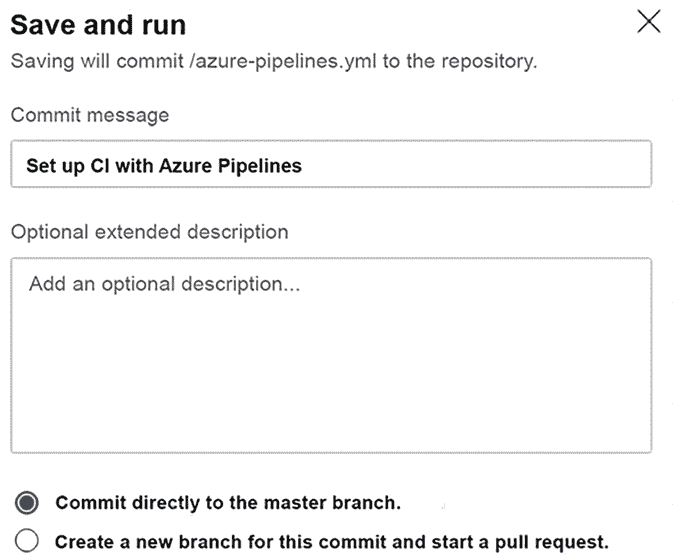

# 21

# 案例研究

如前几章所述，对于这个新版本，我们重新构思了本书的案例研究——**世界野生旅行俱乐部**（**WWTravelClub**）。这个案例研究将带你了解为旅行社创建软件架构的过程。

本案例研究的目的是不是为了提供一个现成的生产应用，而是帮助你理解每一章中解释的理论，并提供一个如何使用 Azure、Azure DevOps、C# 12、.NET 8、ASP.NET Core 以及本书中介绍的所有其他技术开发企业应用的示例。

让我们从描述我们的案例研究应用开始。然后，我们将逐步过渡到正式规范。

# 介绍世界野生旅行俱乐部

WWTravelClub 是一家旨在全球范围内革新度假规划和旅行体验的旅行社。为此，他们正在开发一个在线服务，其中每个旅行的方面都经过精心策划，并由一支专门针对特定目的地的专家团队支持。

这个平台的概念是你可以同时成为访客和目的地专家。你作为目的地专家参与的越多，你获得的积分就越多。这些积分可以用来兑换人们通过平台在线购买的门票。

WWTravelClub 项目的负责人为该平台带来了以下要求列表：

+   常见用户视图：

    +   首页上的促销包

    +   获得推荐

    +   搜索包

    +   每个包的详细信息：

        +   购买包

        +   购买包含专家俱乐部的包

        +   评论你的体验

        +   向专家提问

        +   评估专家

        +   注册为普通用户

+   目的地专家视图：

    +   与常见用户视图相同的视图

    +   回答询问你目的地专业知识的问题

    +   管理你通过回答问题获得的积分

    +   用积分兑换门票

+   管理员视图：

    +   管理包

    +   管理普通用户

    +   管理目的地专家

除了平台上要求的功能外，重要的是要注意，WWTravelClub 计划为每个包配备超过 100 位目的地专家，并将提供全球约 1,000 种不同的包。

重要的是要知道，通常，客户不会为开发准备好的要求。这就是为什么收集需求的过程如此重要，如*第一章，理解软件架构的重要性*中所述。这个过程将把上述列表转换成用户需求和系统需求。让我们看看在下一节中这将如何运作。

# 用户需求和系统需求

如*第一章，理解软件架构的重要性*中所述，为了总结用户需求，你可以使用用户故事模式。我们在这里采用了这种方法，以便你可以阅读以下针对 WWTravelClub 的用户故事：

+   `US_001`: 作为一名普通用户，我想在主页上查看促销套餐，以便我能轻松找到我的下一个假期。

+   `US_002`: 作为一名普通用户，我想搜索主页上找不到的套餐，以便我能探索其他旅行机会。

+   `US_003`: 作为一名普通用户，我想查看套餐的详细信息，以便我能决定购买哪个套餐。

+   `US_004`: 作为一名普通用户，我想注册自己，以便我能开始购买套餐。

+   `US_005`: 作为一名注册用户，我想处理支付，以便我能购买套餐。

+   `US_006`: 作为一名注册用户，我想购买包含专家推荐套餐，以便我能拥有独特的旅行体验。

+   `US_007`: 作为一名注册用户，我想请求一位专家，以便我能了解旅行中最佳的活动。

+   `US_008`: 作为一名注册用户，我想对我的体验进行评论，以便我能对我的旅行提供反馈。

+   `US_009`: 作为一名注册用户，我想评价帮助过我的专家，以便我能与他人分享他们多么出色。

+   `US_010`: 作为一名注册用户，我想注册为目的地专家，以便我能帮助前往我所在城市旅行的人。

+   `US_011`: 作为一名专家用户，我想回答关于我所在城市的问题，以便我能获得未来可兑换的积分。

+   `US_012`: 作为一名专家用户，我想用积分兑换机票，以便我能环游世界。

+   `US_013`: 作为一名管理员用户，我想管理套餐，以便用户能有机会享受精彩的旅行。

+   `US_014`: 作为一名管理员用户，我想管理注册用户，以便 WWTravelClub 能保证良好的服务质量。

+   `US_015`: 作为一名管理员用户，我想管理专家用户，以便所有关于我们目的地的问题都能得到解答。

+   `US_016`: 作为一名管理员用户，我想提供世界上超过 1,000 个套餐，以便不同国家能体验 WWTravelClub 的服务。

+   `US_017`: 作为首席执行官，我想让超过 1,000 名用户同时访问网站，以便业务能够有效扩展。

+   `US_018`: 作为一名用户，我想用我的母语访问 WWTravelClub，以便我能轻松理解提供的套餐。

+   `US_019`: 作为一名用户，我想在 Chrome、Firefox 和 Edge 网络浏览器中访问 WWTravelClub，以便我能使用我偏好的网络浏览器。

+   `US_020`: 作为一名用户，我想知道我的信用卡信息是安全存储的，以便我能安全购买套餐。

+   `US_021`: 作为一名用户，我想根据来自我所在城市的人的建议获得一个不错的旅游地点推荐，以便我能了解适合我风格的新地方。

注意，在编写故事时，可以包含与安全、环境、性能和可扩展性等非功能性要求相关的信息。

然而，在编写用户故事时，可能省略了一些系统要求，这些要求需要包含在软件规范中。这些要求可能与法律方面、硬件和软件先决条件有关，甚至可能涉及正确交付系统的注意事项。我们在*第二章，非功能性需求*中讨论了它们。因此，非功能性需求需要映射和列出，以及用户故事。以下列出了 WWTravelClub 的系统要求。请注意，要求是用将来时态写的，因为系统尚不存在：

+   `SR_001`：系统应使用云计算组件来提供所需的可伸缩性。

+   `SR_002`：系统应遵守**通用数据保护条例**（**GDPR**）的要求。

+   `SR_003`：在任何情况下，当 1000 个用户同时访问该系统时，任何网页的响应时间至少应为 2 秒。

列出这些用户故事和系统要求的想法是为了帮助你从架构的角度思考，了解平台开发可能有多复杂。

现在我们有了平台用例列表，是时候开始选择在 WWTravelClub 中将使用的.NET 项目类型了。让我们在下一节中检查它们。

# WWTravelClub 使用的.NET 项目的主要类型

本书用例的开发将基于各种类型的.NET Core Visual Studio 项目。本节描述了所有这些项目。让我们在 Visual Studio 的**文件**菜单中选择**新建项目**。

例如，你可以在搜索引擎中输入以下内容来过滤**.NET Core**项目类型：


图 21.1：在 Visual Studio 中搜索.NET Core 项目类型

在那里，你可以找到常见的 C#项目（控制台、类库、Windows Forms 和 WPF），以及各种类型的测试项目，每个项目基于不同的测试框架：xUnit、NUnit 和 MSTest。选择各种测试框架只是个人喜好问题，因为它们都提供了类似的功能。将测试添加到构成解决方案的每一块软件中是一种常见做法，这允许软件频繁修改而不会危及其可靠性。

你还可能想在**.NET Standard**下定义你的类库项目，这在*第五章，实现 C# 12 中的代码重用*中已有讨论。这些类库基于标准，使它们与多个.NET 版本兼容。例如，基于 2.0 标准的库与所有大于或等于 2.0 的.NET Core 版本、所有大于 5 的.NET 版本以及所有大于 4.6 的.NET Framework 版本兼容。这种兼容性优势是以牺牲更少的功能为代价的。

除了将**项目类型**过滤到**云**中，我们还有更多项目类型。其中一些将使我们能够定义微服务。基于微服务的架构允许将应用程序拆分为几个独立的微服务。可以创建相同微服务的多个实例，并将它们分布到多台机器上以微调每个应用程序部分的表现。如果您想了解微服务，我们已在以下章节中讨论了它们：

+   *第十一章*，*将微服务架构应用于您的企业应用*

+   *第十四章*，*使用.NET 实现微服务*

+   *第二十章*，*Kubernetes*

在*第二章*，*非功能性需求*中，我们在*使用.NET 8 创建可扩展的 Web 应用*子节中描述了一个 ASP.NET Core 应用程序项目。在那里，我们定义了一个 ASP.NET Core 应用程序，但 Visual Studio 还包含基于 RESTful API 和最重要的单页应用框架（如 Angular、React、Vue.js 以及基于 WebAssembly 的 Blazor 框架）的项目模板，这些框架在第十九章*客户端框架：Blazor*中进行了讨论。其中一些在标准的 Visual Studio 安装中可用，而其他则需要安装一个名为**ASP.NET 和 Web 开发**的工作负载的 SPA 包。

最后，在第九章*测试您的企业应用*中详细讨论了测试项目。我们建议您作为软件架构师，通过创建可能帮助您定义最佳项目类型的概念验证来尝试 Visual Studio 中所有可用的模板。

现在我们已经检查了这些不同的项目类型，让我们看看 Azure DevOps 以及它如何有助于管理 WWTravelClub 的需求。

# 使用 Azure DevOps 管理 WWTravelClub 的需求

如在第三章*管理需求*中讨论的，对于软件开发项目的一个重要步骤是团队将如何组织从用户需求映射过来的用户故事。在那里，正如在*在 Azure DevOps 中管理系统需求*部分中描述的，Azure DevOps 使您能够使用工作项来记录系统需求，这些工作项主要是需要完成以交付产品或服务的任务或行动。

还需要记住，可用的工项取决于您在创建 Azure DevOps 项目时选择的*工项流程*。

考虑到为 WWTravelClub 描述的场景，我们决定使用敏捷流程，并定义了以下三个史诗级工作项：


图 21.2：用户案例史诗

这些工作项的创建相当简单：

1.  在每个工作项内部，我们将不同类型的工作项相互关联，正如您在*图 21.3*中可以看到的那样。

1.  在软件开发过程中确定工作项之间的联系非常重要。因此，作为一名软件架构师，您必须向您的团队提供这些知识，而且更重要的是，您必须激励他们建立这些联系：


图 21.3：定义一个特性链接到选定的史诗

1.  一旦您创建了一个**特性**工作项，您将能够将其连接到多个详细说明其规格的用户故事工作项。以下截图显示了详细信息：


图 21.4：产品待办事项工作项

1.  之后，可以为每个用户故事工作项创建任务和测试用例工作项。Azure DevOps 提供的用户界面非常有效，因为它允许您跟踪功能链及其之间的关系。


图 21.5：看板视图

1.  考虑到我们以 Scrum 作为敏捷过程的基础，一旦您完成了用户故事和任务工作项的输入，您将能够与您的团队一起规划项目冲刺。计划视图允许您将用户故事工作项拖放到每个计划好的冲刺/迭代中：


图 21.6：待办事项视图

1.  通过点击右侧的特定冲刺，您将只看到分配给该冲刺的工作项。每个冲刺页面相当类似于待办事项页面，但包含更多标签页，例如，您可以定义**冲刺周期**和**团队容量**。


图 21.7：规划视图

左侧的**冲刺**菜单也非常有用，它允许每个用户立即跳转到他们参与的所有项目的当前冲刺。

这些工作项就是这样创建的。一旦您理解了这个机制，您将能够创建和规划任何软件项目。值得一提的是，工具本身并不能解决与团队管理相关的问题。然而，这个工具是激励团队更新项目状态的一个很好的方式，这样您就可以保持对项目进度的清晰视角。

既然我们已经定义了如何管理 WWTravelClub 的需求，那么是时候开始考虑开发者将遵循的代码标准了。让我们在下一节中查看。

# WWTravelClub 的代码标准 – 编写代码时的注意事项和禁忌

在*第四章，C# 12 编码最佳实践*中，我们了解到，作为一名软件架构师，您必须定义一个符合您所在公司需求的代码标准。

在本书的示例项目中，这一点并无不同。我们决定通过描述一系列“应该做”和“不应该做”的标准来展示这一标准。我们在编写示例时遵循了这个列表。值得一提的是，这个列表是一个很好的开始标准，并且作为一个软件架构师，你应该与团队中的开发者讨论这个列表，以便以实际和良好的方式发展它。

还重要的是要记住，在第四章“C# 编码最佳实践 12”的“理解和应用可以评估 C# 代码的工具”部分，我们讨论了一些可以帮助你为团队定义 *coding style* 的好工具*。

此外，以下语句旨在阐明团队成员之间的沟通，并提高你正在开发的软件的性能和维护性。

你可能会认为下面的列表在书中是浪费空间的，因为我们有很好的 C# 社区编码标准，无需强制执行标准。然而，没有它，你怎么能保证可维护性呢？如果定义编码标准不是必要的，我们就不会有那么多维护问题。所以，让我们检查为 WWTravelClub 项目定义的“应该做”和“不应该做”的列表：

+   用英语编写你的代码。

+   对于由多个单词组成的公共成员、类型和命名空间名称，始终使用 PascalCasing。

+   对于参数名称，始终使用 camelCasing。

+   用可理解的名字编写类、方法和变量。

+   对公共类、方法和属性进行注释。

+   在可能的情况下，始终使用 `using` 语句。

+   在可能的情况下，始终使用 `async` 实现。

+   不要编写空的 `try-catch` 语句。

+   不要编写复杂度得分超过 10 的方法。

+   不要在 `for/while/do-while/foreach` 语句中使用 `break` 和 `continue`。

这些“应该做”和“不应该做”的规则很容易遵循，而且比这更好，它们将为你的团队产生的代码带来很好的结果。值得一提的是，这些 DOs 和 DON’Ts 只是一个指南，而不是每个团队都必须遵循的硬性规则。在发送给团队成员之前，可以根据团队的具体需求进行调整。作为一个软件架构师，确保所有团队成员遵循相同的 DOs 和 DON’Ts 是至关重要的。

考虑到我们现在已经定义了编码标准，让我们学习如何将 SonarCloud 作为代码分析的工具来帮助我们。

# 将 SonarCloud 应用到 WWTravelClub API 上

现在我们已经创建了 WWTravelClub 仓库，我们可以提高代码质量，正如在第四章“C# 编码最佳实践 12”中讨论的那样。正如我们在那一章中看到的，Azure DevOps 允许持续集成，这很有用。在本节中，我们将讨论更多关于 DevOps 概念和 Azure DevOps 平台为何如此有用的原因。

目前，我们想介绍的唯一一件事是，在开发人员提交代码但尚未发布之前分析代码的可能性。如今，在 SaaS 应用程序生命周期工具的 SaaS 世界中，这仅可能是因为我们有一些 SaaS 代码分析平台。此用例将使用 SonarCloud。

SonarCloud 是 Sonar 提供的 SaaS 版本。还值得注意的是，SonarCloud 特别容易进行自托管；这样，敏感的安全信息可以保存在企业内部。对于开源代码是免费的，并且可以分析存储在 GitHub、Bitbucket 和 Azure DevOps 中的代码。用户需要在这些平台上进行注册。一旦登录，假设您的代码存储在 Azure DevOps 中，您就可以遵循以下文章中描述的步骤，在您的 Azure DevOps 和 SonarCloud 之间创建连接：[`docs.sonarcloud.io/`](https://docs.sonarcloud.io/)。

Sonar 还提供了一种自托管版本，这在 SonarCloud 无法使用的情况下可能很有用。请访问[`www.sonarsource.com/`](https://www.sonarsource.com/)获取更多详情。

在设置 Azure DevOps 项目与 SonarCloud 之间的连接后，您将拥有以下类似的构建管道：


图 21.8：Azure 构建管道中的 SonarCloud 配置

值得注意的是，C#项目没有 GUID 编号，而 SonarCloud 需要这个编号。您可以使用此链接轻松生成一个：[`www.guidgenerator.com/`](https://www.guidgenerator.com/)，或者使用 Visual Studio 中的**创建 GUID**工具（**工具** -> **创建 GUID**）。GUID 需要放置如下截图所示：


图 21.9：SonarCloud 项目 GUID

一旦完成构建，代码分析的结果将在 SonarCloud 中展示，如下面的截图所示。如果您想导航到该项目，可以访问[`sonarcloud.io/summary/overall?id=gabrielbaptista_wwtravelclub-4th`](https://sonarcloud.io/summary/overall?id=gabrielbaptista_wwtravelclub-4th)：


图 21.10：SonarCloud 结果

此外，到这个时候，所分析的代码尚未发布，因此这可以在发布系统之前获取下一阶段的质量。您可以将这种方法作为在提交代码时自动进行代码分析的参考。

考虑到我们已经实现了一种持续评估代码质量的方法，现在是时候设计可重用软件了。让我们在下一节中看看这个问题。

# 将代码重用作为快速交付良好且安全软件的方法

如同我们在第五章，第十二部分“在 C#中实现代码重用”中检查的那样，加速优质软件交付的一个好方法是创建可重用组件。下面图中可以查看为评估 WWTravelClub 内容而设计的最终解决方案。这种方法包括使用本章讨论的许多主题。首先，所有代码都放置在一个.NET 8 类库中。这意味着你可以将此代码添加到不同类型的解决方案中，例如 ASP.NET Core Web 应用和 Android 和 iOS 平台的 Xamarin 应用：


图 21.11：WWTravelClub 重用方法

此设计利用了面向对象原则，如继承，因此你不需要在许多类中多次编写可以重复使用的属性和方法。设计还利用了多态原则，这样你可以在不更改方法名称的情况下更改代码的行为。 

最后，设计通过引入泛型作为工具来抽象内容的概念，以简化类似 WWTravelClub 中存在的类似类的操作，以评估有关城市、评论、目的地专家和旅行套餐的内容。

鼓励代码重用的团队与不鼓励的团队之间的主要区别是向最终用户提供优质软件的速度。当然，开始这种方法并不容易，但请放心，经过一段时间的工作后，你将获得良好的结果。

既然我们已经讨论了使用面向对象原则实现代码重用的可能性，那么我们再来看看使用由**领域驱动设计**（**DDD**）创建的领域来组织应用程序如何？我们将在下一节中检查。

# 理解 WWTravelClub 应用程序的领域

在本节中，我们将对 WWTravelClub 系统进行 DDD 分析，试图识别所有其领域（也称为**边界上下文**），即由专家使用不同语言定义的子系统。一旦识别出来，每个领域可能被分配给不同的开发团队，并产生不同的微服务。

从*介绍世界野生旅行俱乐部*和*用户需求和系统需求*部分列出的需求中，我们知道 WWTravelClub 系统由以下部分组成：

+   可用目的地和套餐的信息。

+   预订/购买订单子系统。

+   与专家/审查子系统的通信。

+   支付子系统。我们在第七章开头，在*理解 DDD*部分简要分析了该子系统的功能和它与预订购买子系统的关系。

+   用户账户子系统。

+   统计报告子系统。

前面的子系统代表不同的有界上下文吗？某些子系统可以被分割成不同的有界上下文吗？这些问题的答案由每个子系统使用的语言给出：

+   子系统 1 使用的语言是**旅行社**的语言。这里没有客户的概念，只有地点、套餐及其特点。

+   子系统 2 使用的语言是所有服务购买中共同的，例如可用的资源、预订和采购订单。这是一个独立的有界上下文。

+   子系统 3 使用的语言与子系统 1 的语言有很多共同之处。然而，也存在典型的**社交媒体**概念，如评分、聊天、帖子分享、媒体分享等。这个子系统可以分为两部分：一个拥有新有界上下文的社交媒体子系统和一个属于子系统 1 有界上下文的一部分的可用信息子系统。

+   正如我们在第七章的*理解 DDD*部分所指出的，在子系统 4 中，我们使用的是**银行**的语言。这个子系统与预订/采购子系统通信并执行执行购买所需的任务。从这些观察中，我们可以看出它是一个不同的有界上下文，并且与购买/预订系统有客户/供应商关系。

+   子系统 5 是一个独立的有界上下文（就像几乎所有的 Web 应用一样）。它与所有具有用户或客户概念的有界上下文有关，因为用户账户的概念总是映射到这些概念上。你可能想知道这是如何实现的。好吧，这很简单——当前登录的用户被认为是社交媒体有界上下文的社会媒体用户、预订/采购有界上下文的客户以及支付有界上下文的付款人。

+   仅查询的子系统（即 6 号）使用的是分析和统计的语言，与其他子系统的语言有很大不同。然而，它几乎与所有有界上下文都有联系，因为它从它们那里获取所有输入。前面的约束迫使我们采用强 CQRS 形式，因此将其视为仅查询分离的有界上下文。

总之，列出的每个子系统定义了一个不同的有界上下文，但与专家/审查子系统通信的部分必须包含在可用的目的地信息以及套餐的有界上下文中。

随着分析的继续和原型的实现，一些边界上下文可能会分裂，而另一些可能会被添加，但立即开始建模系统并立即开始分析边界上下文之间的关系是至关重要的，因为我们所拥有的部分信息将推动进一步的调查，并帮助我们定义所需的通信协议和通用语言，以便我们可以与领域专家互动。

以下是对领域映射的基本初步草图：


图 21.12：WWTravelClub 领域映射图。细黑箭头表示边界上下文之间的数据交换，而粗蓝箭头表示边界上下文之间的关系（从众者、客户/供应商等）

为了简化，我们省略了**统计报告**边界上下文。我们只是说它收集每个包每日购买的统计数据。

在这里，我们假设**用户账户**和**社交**边界上下文与所有与之通信的其他边界上下文具有**从众者**关系，因为它们使用现有的软件实现，所以所有其他组件必须适应它们。

如我们之前提到的，**预订**和**支付**之间的关系是**客户/供应商**，因为**支付**提供用于执行**预订**任务的服务。所有其他关系都被归类为**合作伙伴**。大多数边界上下文都有的客户/用户的各种概念由**用户账户**的**授权令牌**箭头协调，它间接地负责在所有边界上下文之间映射这些概念。

**包/位置**子系统向**预订**子系统传达以下信息：

+   **选择的包信息**，包含执行预订/购买所需的包信息

+   **价格变动**，负责通知待处理的购买订单可能的定价变动

社交互动始于用户提供的现有评论（**包/位置**和**社交**之间的**评论**箭头）并由**包/位置**到**社交**的**位置/评论信息**通信支持。

最后，**预订**通过**价格/代码/描述**箭头将购买代码、描述和价格传达给**支付**。

在确定了我们的应用程序的边界上下文后，我们处于组织应用程序 DevOps 周期的位置。

# WWTravelClub 的 DevOps 方法

在*第八章，理解 DevOps 原则和 CI/CD*中，WWTravelClub 项目的截图展示了实施良好 DevOps 周期所需的步骤。WWTravelClub 团队决定使用 Azure DevOps，因为他们明白这个工具对于在整个周期中获得最佳的 DevOps 体验至关重要。实际上，它似乎是 GitHub 提供的工具中最完整的，因为它涵盖了从需求收集到在预生产和生产部署的整个 CI/CD 周期。此外，所有团队成员都已经非常熟悉它。

需求是用用户故事编写的，可以在 Azure DevOps 的**工作项**部分找到。代码放置在 Azure DevOps 项目的仓库中。这两个概念在*第三章，管理需求*中都有解释。

用于完成工作的管理生命周期是 Scrum，在第一章*理解软件架构的重要性*中介绍。这种方法将实施分为冲刺，这迫使每个周期结束时交付价值。使用我们在本章中学到的 CI 设施，每次团队将新代码合并到仓库的 master 分支时，代码都会被编译。

一旦代码编译并测试，部署的第一阶段就完成了。第一阶段通常被称为开发/测试，因为你是为了内部测试而启用它的。Application Insights 和测试与反馈都可以用来获取对新版本的第一反馈。

如果新版本的测试和反馈通过，那么就是时候进入第二阶段，即质量保证。Application Insights 和测试与反馈可以再次使用，但现在是在一个更稳定的环境中。

循环以在生产阶段部署的授权结束。这当然是一个艰难的决定，但 DevOps 表明你必须持续这样做，以便你能从客户那里获得更好的反馈。Application Insights 仍然是一个有用的工具，因为你可以在生产中监控新版本的演变，甚至将其与过去的版本进行比较。

这里描述的 WWTravelClub 项目方法可以用于许多其他现代应用开发生命周期。作为一名软件架构师，你必须监督这个过程。工具已经准备好了，而正确地使用它们取决于你！

因此，即使将 WWTravelClub 视为一个假设场景，在构建它时也考虑了一些担忧：

+   CI 已启用，但多阶段场景也已启用。

+   即使是多阶段场景，**PR（Pull Request**）也是一种保证在第一阶段只展示高质量代码的方式。

+   要在 PR（Pull Request）中做好工作，需要进行同行评审。

+   同行评审检查，例如，在创建新功能时是否存在功能标志。

+   同行评审检查了在创建新功能过程中开发的单元测试和功能测试。

上述步骤不仅适用于 WWTravelClub。作为软件架构师，您需要定义保证安全 CI/CD 场景的方法。您可以以此作为起点。值得注意的是，在 Azure DevOps 和 GitHub 中，我们可以完全禁用对 master 分支的推送，从而强制使用 PR 来合并 master 分支上的修改。

在下一节中，我们将从实际代码开始，展示如何从各种数据存储选项中进行选择。

# 如何在云中选择您的数据存储

在**第十二章**，*选择云中的数据存储*中，我们学习了如何使用 NoSQL。现在我们必须决定 NoSQL 数据库是否足够用于我们的书籍用例 WWTravelClub 应用。我们需要存储以下数据家族：

+   **关于可用目的地和包的信息**：这些数据的相关操作主要是读取，因为包和目的地不经常改变。然而，它们必须尽可能快地从世界各地访问，以确保用户浏览可用选项时的良好用户体验。因此，一个具有地理分布副本的分布式关系数据库是可能的，但不是必要的，因为包可以存储在其目的地中，使用更便宜的 NoSQL 数据库。

+   **目的地评论**：在这种情况下，分布式写入操作有不可忽视的影响。此外，大多数写入都是添加，因为评论通常不会被更新。添加操作从分片中受益很大，并且不会像更新那样引起一致性问题。因此，此数据最佳选项是一个 NoSQL 集合。

+   **预订**：在这种情况下，一致性错误是不可接受的，因为它们可能导致超订。读取和写入有相似的影响，但我们需要可靠的交易和良好的一致性检查。幸运的是，数据可以组织在一个多租户数据库中，其中租户是目的地，因为不同目的地的预订信息完全无关。因此，我们可以使用分片 Azure SQL 数据库实例。

最后，对于第一和第二点中的数据，最佳选项是 Cosmos DB，而对于第三点，最佳选项是 Azure SQL Server。实际应用可能需要对所有数据操作及其频率进行更详细的分析。在某些情况下，为各种可能的选项实现原型并进行典型工作负载的性能测试是值得的。

在本节的剩余部分，我们将迁移我们在**第十三章**，*使用 C#与数据交互 – Entity Framework Core*中查看的 destinations/packages 数据层到 Cosmos DB。

## 使用 Cosmos DB 实现目的地/包数据库

让我们继续到我们在**第十三章**，*使用 C#与数据交互 – Entity Framework Core*中构建的数据库示例，并按照以下步骤使用 Cosmos DB 实现此数据库：

1.  首先，我们需要复制 WWTravelClubDB 项目并重命名其根文件夹为 `WWTravelClubDBCosmo`。

1.  打开项目并删除 `Migrations` 文件夹，因为不再需要迁移。

1.  我们需要将 SQL Server Entity Framework 提供程序替换为 Cosmos DB 提供程序。为此，请转到 **管理 NuGet 包** 并卸载 `Microsoft.EntityFrameworkCore.SqlServer` NuGet 包。然后，安装 `Microsoft.EntityFrameworkCore.Cosmos` NuGet 包。

1.  然后，对 `Destination` 和 `Package` 实体执行以下操作：

    +   移除所有数据注释。

    +   由于这是 Cosmos DB 提供程序所必需的，因此需要将它们的 `Id` 属性添加 `[Key]` 属性。

    +   将 `Package` 和 `Destination` 以及 `PackagesListDTO` 类的 `Id` 属性类型从 `int` 转换为 `string`。我们还需要将 `Package` 和 `PackagesListDTO` 类中的 `DestinationId` 外部引用转换为 `string`。实际上，对于分布式数据库中的键，最佳选择是从 GUID 生成的字符串，因为当表数据分布在多个服务器之间时，维护身份计数器很难。

1.  在 `MainDBContext` 文件中，我们需要指定与目的地相关的包必须存储在目的地文档本身内。这可以通过在 `OnModelCreating` 方法中替换 **Destination-Package** 关系配置来实现以下代码：

    ```cs
    builder.Entity<Destination>()
        .OwnsMany(m =>m.Packages); 
    ```

1.  在这里，我们必须将 `HasMany` 替换为 `OwnsMany`。没有 `WithOne` 的等效项，因为一旦实体被拥有，它必须只有一个所有者，并且 `MyDestination` 属性包含对父实体的指针的事实可以从其类型中明显看出。Cosmos DB 也允许使用 `HasMany`，但在这个情况下，两个实体不是嵌套在一起的。还有一个 `OwnOne` 配置方法用于在实体内部嵌套单个实体。

1.  在关系数据库中，`OwnsMany` 和 `OwnsOne` 都是可用的，但在这个情况下，`HasMany` 和 `HasOne` 的区别在于子实体会自动包含在返回其父实体的所有查询中，无需指定一个 `Include` LINQ 子句。然而，子实体仍然存储在单独的表中。

1.  `LibraryDesignTimeDbContextFactory` 必须修改为使用 Cosmos DB 连接数据，如下面的代码所示：

    ```cs
    using Microsoft.EntityFrameworkCore;
    using Microsoft.EntityFrameworkCore.Design;
    namespace WWTravelClubDB
    {
        public class LibraryDesignTimeDbContextFactory
            : IDesignTimeDbContextFactory<MainDBContext>
        {
            private const string endpoint = "<your account endpoint>";
            private const string key = "<your account key>";
            private const string databaseName = "packagesdb";
            public MainDBContext CreateDbContext(params string[] args)
            {
                var builder = new DbContextOptionsBuilder<MainDBContext>();
                builder.UseCosmos(endpoint, key, databaseName);
                return new MainDBContext(builder.Options);
            }
        }
    } 
    ```

1.  最后，在我们的测试控制台中，我们必须显式地使用 GUID 创建所有实体主键：

    ```cs
    var context = new LibraryDesignTimeDbContextFactory()
        .CreateDbContext();
    context.Database.EnsureCreated();
    var firstDestination = new Destination
    {
        Id = Guid.NewGuid().ToString(),
        Name = "Florence",
        Country = "Italy",
        Packages = new List<Package>()
        {
        new Package
        {
            Id=Guid.NewGuid().ToString(),
            Name = "Summer in Florence",
            StartValidityDate = new DateTime(2019, 6, 1),
            EndValidityDate = new DateTime(2019, 10, 1),
            DurationInDays=7,
            Price=1000
        },
        new Package
        {
            Id=Guid.NewGuid().ToString(),
            Name = "Winter in Florence",
            StartValidityDate = new DateTime(2019, 12, 1),
            EndValidityDate = new DateTime(2020, 2, 1),
            DurationInDays=7,
            Price=500
        }
      }
    }; 
    ```

1.  在这里，我们调用 `context.Database.EnsureCreated()` 而不是应用迁移，因为我们只需要创建数据库。一旦数据库和集合创建完成，我们就可以从 Azure 门户调整它们的设置。希望 Cosmos DB Entity Framework Core 提供程序的将来版本将允许我们指定所有集合选项。

1.  最后，必须修改最终的查询（以 `context.Packages.Where...` 开始），因为查询不能以嵌套在其他文档中的实体（在我们的情况下，`Packages` 实体）开头。因此，我们必须从我们的 `DBContext` 中具有唯一根 `DbSet<T>` 属性开始我们的查询，即 `Destinations`。我们可以借助 `SelectMany` 方法从列出外部集合转换为列出所有内部集合，该方法执行所有嵌套 `Packages` 集合的逻辑合并。然而，由于 Cosmos DB SQL 不支持 `SelectMany`，我们必须使用 `AsEnumerable()` 在客户端强制模拟 `SelectMany`，如下面的代码所示：

    ```cs
    var list = context.Destinations
        .AsEnumerable() // move computation on the client side
        .SelectMany(m =>m.Packages)
        .Where(m => period >= m.StartValidityDate....)
        ... 
    ```

1.  查询的其余部分保持不变。如果您现在运行项目，应该看到与 SQL Server 的情况相同的输出（除了主键值）。

执行程序后，转到您的 Cosmos DB 账户。您应该看到如下内容：


图 21.13：执行结果

包已经按照要求嵌套在其目的地中，并且 Entity Framework Core 创建了一个与 `DBContext` 类同名的唯一集合。

如果你想在不用完所有免费的 Azure 门户信用额度的情况下继续进行 Cosmos DB 开发实验，你可以安装 Cosmos DB 模拟器，该模拟器可在以下链接中找到：[`aka.ms/cosmosdb-emulator`](https://aka.ms/cosmosdb-emulator)。

在学习了如何选择最佳数据存储选项之后，我们就可以开始编写我们的第一个微服务了。

# 一个基于 ASP.NET Core 的工作微服务

在本节中，我们将向您展示如何实现一个通过 gRPC 和基于数据库表的内部队列接收通信的微服务。第一个小节简要描述了微服务的规范和整体架构。我们鼓励您回顾 *第十四章*，*使用 .NET 实现微服务*，其中包含本例背后的所有理论。

## 规范和架构

我们示例微服务需要计算所有购买活动的每日总和。根据数据驱动方法，我们假设所有每日总和都是通过接收新购买活动完成时立即发送的消息预先计算的。微服务的目的是维护一个所有购买活动和所有每日总和的数据库，这些数据可以被管理员用户查询。我们将仅实现填充两个数据库表所需的功能。

本节中描述的实现基于一个托管 gRPC 服务的 ASP.NET Core 应用程序。gRPC 服务简单地填充一个消息队列并立即返回，以避免发送者在整个计算过程中被阻塞。

实际的处理是由与应用程序宿主关联的依赖注入引擎中声明的 ASP.NET Core 托管服务执行的。工作宿主服务执行一个无限循环，从中提取 `N` 条消息并传递给 `N` 个并行线程进行处理。


图 21.14：gRPC 微服务架构

当从队列中取出 `N` 条消息时，它们不会立即被删除，而是简单地标记为提取时间。由于只有在消息的最后提取时间足够远（比如说，时间 `T`）时才能从队列中提取消息，因此在处理期间，没有其他工作线程可以再次提取它们。当消息处理成功完成后，消息将从队列中删除。如果处理失败，则不对消息采取任何操作，因此消息将保持在队列中，直到 `T` 间隔过期，然后可以被工作线程再次取走。

微服务可以通过增加处理器核心和线程数 `N` 来垂直扩展。它也可以通过使用负载均衡器来水平扩展，将负载分割成几个相同的 ASP.NET Core 应用程序副本。这种类型的水平扩展增加了可以接收消息的线程数和工作线程数，但由于所有 ASP.NET Core 应用程序共享同一个数据库，因此它受限于数据库性能。

数据库层是在一个单独的 **DLL**（**动态链接库**）中实现的，所有功能都抽象在两个接口中，一个用于与队列交互，另一个用于将新的购买记录添加到数据库中。

下一个子节简要描述了数据库层。由于示例的主要重点是微服务架构和通信技术，我们不会给出所有细节。然而，完整的代码可以在与本书相关的 GitHub 仓库的 `ch15/GrpcMicroService` 文件夹中找到。

在定义了整体架构之后，让我们从存储层代码开始。

## 存储层

存储层基于数据库。它使用 Entity Framework Core，并基于三个实体及其关联的表：

+   一个表示队列项的 `QueueItem` 实体

+   一个表示单个购买的 `Purchase` 实体

+   一个表示给定一天内所有购买总额的 `DayTotal` 实体

以下是对操作队列的接口定义：

```cs
public interface IMessageQueue
{
    public Task<IList<QueueItem>> Top(int n);
    public Task Dequeue(IEnumerable<QueueItem> items);
    public Task Enqueue(QueueItem item);
} 
```

`Top` 从队列中提取 `N` 条消息以传递给最多 `N` 个不同的线程。`Enqueue` 向队列中添加一条新消息。最后，`Dequeue` 从队列中移除已成功处理的项目。

更新购买数据的接口定义如下所示：

```cs
public interface IDayStatistics
{
    Task<decimal> DayTotal(DateTimeOffset day);
    Task<QueueItem?> Add(QueueItem model);
} 
```

`Add` 向数据库添加一条新的购买记录。如果添加成功，则返回输入队列项，否则返回 `null`。`DayTotal` 是一个查询方法，返回单日总额。

应用层通过这两个接口与数据库层进行通信，通过三个数据库实体，通过 `IUnitOfWork` 接口（正如在第十三章的 *如何数据层和领域层与其他层通信* 部分中解释的，*在 C# 中与数据交互 – Entity Framework Core* 抽象了 `DbContext`），以及通过如下类似的依赖注入扩展方法：

```cs
public static class StorageExtensions
{
    public static IServiceCollection AddStorage(this IServiceCollection services,
 string connectionString)
    {
        services.AddDbContext<IUnitOfWork,MainDbContext>(options =>
            options.UseSqlServer(connectionString, b =>
b.MigrationsAssembly("GrpcMicroServiceStore")));
        services.AddScoped<IMessageQueue, MessageQueue>();
        services.AddScoped<IDayStatistics, DayStatistics>();
        return services;
    }
} 
```

此方法将在应用层依赖注入定义中被调用，它接收数据库连接字符串作为输入，并添加我们之前定义的两个接口抽象化的 `DbContext`。

该数据库项目，名为 `GrpcMicroServiceStore`，位于与本书相关的 GitHub 仓库的 `ch15/GrpcMicroService` 文件夹中。它已经包含了所有必要的数据库迁移，因此你可以按照以下步骤创建所需的数据库：

1.  在 Visual Studio **包管理器控制台** 中，选择 **GrpcMicroServiceStore** 项目。

1.  在 Visual Studio **解决方案资源管理器** 中，右键单击 **GrpcMicroServiceStore** 项目并将其设置为启动项目。

1.  在 Visual Studio **包管理器控制台** 中，执行 `Update-Database` 命令。

在拥有一个工作存储层之后，我们可以继续进行微服务应用层的开发。

## 应用层

应用层是一个名为 `GrpcMicroService` 的 **ASP.NET Core gRPC 服务** 项目。当项目由 Visual Studio 模板化时，它在其 `Protos` 文件夹中包含一个 `.proto` 文件。需要删除此文件并替换为名为 `counting.proto` 的文件，其内容必须如下：

```cs
syntax = "proto3";
option csharp_namespace = "GrpcMicroService";
import "google/protobuf/timestamp.proto";
package counting;
service Counter {
  // Accepts a counting request
rpc Count (CountingRequest) returns (CountingReply);
}
message CountingRequest {
  string id = 1;
  google.protobuf.Timestamp time = 2;
  string location = 3;
  sint32 cost =4;
  google.protobuf.Timestamp purchaseTime = 5;
}.
message CountingReply {} 
```

上述代码定义了带有其输入和输出消息的 gRPC 服务以及放置它们的 .NET 命名空间。我们导入 `google/protobuf/timestamp.proto` 预定义的 `.proto` 文件，因为我们需要 `TimeStamp` 类型。请求包含购买数据，请求消息创建时的 `time`，以及一个唯一的消息 `id`，该 `id` 用于强制消息幂等性。

在数据库层，`IDayStatistics.Add` 方法的实现使用此 `id` 来验证是否已经处理了具有相同 `id` 的购买，如果是，则立即返回：

```cs
bool processed = await ctx.Purchases.AnyAsync(m => m.Id == model.MessageId);
if (processed) return model; 
```

通过替换现有的 `protobuf` XML 标签来启用此文件的自动代码生成：

```cs
<Protobuf Include="Protos\counting.proto" GrpcServices="Server" /> 
```

将 `Grpc` 属性设置为 `"Server"` 启用服务器端代码生成。

在 `Services` 项目文件夹中，Visual Studio 预定义的 gRPC 服务模板必须替换为名为 `CounterService.cs` 的文件，其内容如下：

```cs
using Grpc.Core;
using GrpcMicroServiceStore;
namespace GrpcMicroService.Services;
public class CounterService: Counter.CounterBase
{
    private readonly IMessageQueue queue;
    public CounterService(IMessageQueue queue)
    {
	 If (queue == null) throw new 					ArgumentNullException(nameof(queue));
        this.queue = queue;
    }
    public override async  Task<CountingReply> Count(CountingRequest request,
        ServerCallContext context)
    {
            await queue.Enqueue(new GrpcMicroServiceStore.Models.QueueItem
            {
                Cost = request.Cost,
                MessageId = Guid.Parse(request.Id),
                Location = request.Location,
                PurchaseTime = request.PurchaseTime.ToDateTimeOffset(),
                Time = request.Time.ToDateTimeOffset()
            });
            return new CountingReply {  }; 
    }
} 
```

实际接收购买消息的服务继承自代码生成器从`counting.proto`文件创建的`Counter.CounterBase`抽象类。它通过依赖注入接收数据库层接口`IMessageQueue`，并重写从`Counter.CounterBase`继承的抽象`Count`方法。然后，`Count`使用`IMessageQueue`将每个接收到的消息入队。

在编译之前，还需要进行几个其他步骤：

1.  我们必须添加对数据库层`GrpcMicroServiceStore`项目的引用。

1.  我们必须将数据库连接字符串添加到`appsettings.json`设置文件中：

    ```cs
    "ConnectionStrings": {
    "DefaultConnection": "Server=(localdb)\\mssqllocaldb;Database=grpcmicroservice;Trusted_Connection=True;MultipleActiveResultSets=true"
    } 
    ```

1.  我们必须通过调用`AddStorage`数据库层扩展方法将所有必要的数据库层接口添加到依赖注入中：

    ```cs
    builder.Services.AddStorage(
    builder.Configuration.GetConnectionString("DefaultConnection")); 
    ```

1.  在`Program.cs`中，我们必须删除 Visual Studio 生成的 gRPC 服务的声明，并将其替换为：

    ```cs
    app.MapGrpcService<CounterService>(); 
    ```

到目前为止，编译应该成功。完成应用层基础设施后，我们可以转向执行实际队列处理的主托管服务。

## 处理队列中的请求

实际请求处理由一个与 ASP.NET Core 管道并行运行的 worker-hosted 服务执行。它是在第十一章的“使用通用宿主”部分中讨论的主托管服务实现的。值得回忆的是，主托管服务是依赖注入引擎中定义的`IHostedService`接口的实现，如下所示：

```cs
builder.Services.AddHostedService<MyHostedService>(); 
```

我们已经在《第十四章，使用.NET 实现微服务》的“使用 ASP.NET Core 实现工作微服务”部分描述了如何实现基于 ASP.NET Core 的工作微服务的托管服务。

下面，我们重复整个代码，包括我们示例中特有的所有细节。主托管服务定义在`HostedServices`文件夹中的`ProcessPurchases.cs`文件中：

```cs
using GrpcMicroServiceStore;
using GrpcMicroServiceStore.Models;
namespace GrpcMicroService.HostedServices;
public class ProcessPurchases : BackgroundService
{
    IServiceProvider services;
    public ProcessPurchases(IServiceProvider services)
    {
        this.services = services;
    }
    protected override async Task ExecuteAsync(CancellationToken stoppingToken)
    {
        bool queueEmpty = false;
        while (!stoppingToken.IsCancellationRequested)
        {
           while (!queueEmpty && !stoppingToken.IsCancellationRequested)
           {
             ...
           }
            await Task.Delay(100, stoppingToken);
            queueEmpty = false;
        }
    }
} 
```

下面是内部循环的内容：

```cs
using (var scope = services.CreateScope())
{
    IMessageQueue queue = scope.ServiceProvider.GetRequiredService<IMessageQueue>();

    var toProcess = await queue.Top(10);
    if (toProcess.Count > 0)
    {
        Task<QueueItem?>[] tasks = new Task<QueueItem?>[toProcess.Count];
        for (int i = 0; i < tasks.Length; i++)
        {
            var toExecute = ...
            tasks[i] = toExecute();
        }
        await Task.WhenAll(tasks);
        await queue.Dequeue(tasks.Select(m => m.Result)
           .Where(m => m != null).OfType<QueueItem>());
    }
    else queueEmpty = true;
} 
```

上述代码已在《第十四章，使用.NET 实现微服务》的“使用 ASP.NET Core 实现工作微服务”部分中解释过。因此，在这里，我们将仅分析我们示例中特有的`toExecute` lambda 表达式：

```cs
var toExecute = async () =>
{
    using (var sc = services.CreateScope())
    {
        IDayStatistics statistics = sc.ServiceProvider.GetRequiredService<IDayStatistics>();
        return await statistics.Add(toProcess[i]);
    }
}; 
```

每个任务创建一个不同的会话作用域，以便它可以拥有`IDayStatistics`的私有副本，然后使用`statistics.Add`处理其请求。

就这些了！现在我们需要一个购买数据的来源来测试我们的代码。在下一小节中，我们将创建一个模拟微服务，该微服务随机生成购买数据并将其传递给`Counter` `gRPC`服务。

## 使用模拟购买请求生成器测试 GrpcMicroservice 项目

让我们实现另一个微服务，该微服务使用随机生成的请求为之前的微服务提供数据。对于不基于 ASP.NET Core 的工作服务，合适的模板是 **Worker Service** 项目模板。这个项目模板自动生成一个包含一个唯一托管服务 `Worker` 的宿主。我们把这个项目命名为 `FakeSource`。为了启用 gRPC 客户端使用，我们必须添加以下 NuGet 包：`Google.Protobuf`、`Grpc.NET.Client` 和 `Grpc.Tools`。

然后，我们必须添加与之前项目相同的 `counting.proto` 文件。然而，这次，我们必须在 `FakeSource` 项目文件中放置以下代码以要求客户端代码生成：

```cs
<ItemGroup>
<Protobuf Include="..\GrpcMicroService\Protos\counting.proto" GrpcServices="Client">
<Link>Protos\counting.proto</Link>
</Protobuf>
</ItemGroup> 
```

将 `GrpcServices` 属性设置为 `Client` 的操作使得客户端代码生成而不是服务器代码生成成为可能。由于我们将 `GrpcMicroService` 项目的相同 `counting.proto` 文件作为链接而不是复制到新项目中，因此出现了 `link` 标签。

托管服务是用通常的无尽循环定义的：

```cs
using Grpc.Net.Client;
using GrpcMicroService;
using Google.Protobuf.WellKnownTypes;
namespace FakeSource;
public class Worker : BackgroundService
{
    private readonly string[] locations = new string[]
           { "Florence", "London", "New York", "Paris" };
    protected override async Task ExecuteAsync(CancellationToken stoppingToken)
    {
        Random random = new Random();
        while (!stoppingToken.IsCancellationRequested)
        {
          try
          {
             ...
             await Task.Delay(2000, stoppingToken);
          }
          catch (OperationCanceledException)
          {
             return;
          }
          catch { }
        }
    }
} 
```

`locations` 数组包含将被随机选择的地点。一旦 `ExecuteAsync` 方法开始执行，它就会创建一个用于所有随机生成的 `Random` 实例。

每个循环都被包含在一个 `try`/`catch` 中；如果生成了 `OperationCanceledException`，则方法退出，因为当应用程序正在关闭且线程被终止时，会创建类似的异常。在遇到其他异常的情况下，代码会尝试通过简单地移动到下一个循环来恢复。在实际的生产应用程序中，最后的 `catch` 应该包含记录拦截到的异常和/或更好的恢复策略的指令。在下一个示例中，我们将看到更复杂的异常处理，这对于实际的生产应用程序是足够的。

在 `try` 块内部，代码创建一个购买消息，将其发送到 `Counter` 服务，然后休眠 2 秒。

下面是发送请求的代码：

```cs
var purchaseDay = new DateTimeOffset(DateTime.UtcNow.Date, TimeSpan.Zero);
//randomize a little bit purchase day
purchaseDay = purchaseDay.AddDays(random.Next(0, 3) - 1); 
//message time
var now = DateTimeOffset.UtcNow;
//add random location
var location = locations[random.Next(0, locations.Length)];
var messageId = Guid.NewGuid().ToString();
//add random cost
int cost = 200 * random.Next(1, 4);
//send message
using var channel = GrpcChannel.ForAddress("http://localhost:5000");
var client = new Counter.CounterClient(channel);
//since this is a fake random source
//in case of errors we simply do nothing.
//An actual client should use Polly
//to define retry policies
try
{
    await client.CountAsync(new CountingRequest
    {
        Id = messageId,
        Location = location,
        PurchaseTime = Timestamp.FromDateTimeOffset(purchaseDay),
        Time = Timestamp.FromDateTimeOffset(now),
        Cost = cost
    });

}
catch {} 
```

代码只是用随机数据准备消息；然后，它为 gRPC 服务器地址创建一个通信通道，并将其传递给 `Counter` 服务代理的构造函数。最后，在代理上调用 `Count` 方法。调用被包含在 `try`/`catch` 中，如果发生错误，错误会被简单地忽略，因为我们只是发送随机数据。相反，实际的生产应用程序应该使用 **Polly** 来使用预定义的策略重试通信。**Polly** 在第十一章，*将微服务架构应用于您的企业应用程序*的 *弹性任务执行* 部分中进行了描述。在下一节中，我们将向您展示如何使用 **Polly**。

到此为止！现在到了测试一切的时候了。右键单击解决方案，选择 **设置启动项目**，然后将 `FakeSource` 和 `GrpcMicroService` 都设置为启动。这样，当解决方案运行时，这两个项目将同时启动。

启动 Visual Studio，然后让两个进程运行几分钟，然后转到 **SQL Server 对象资源管理器** 并查找名为 `grpcmicroservice` 的数据库。如果 **SQL Server 对象资源管理器** 窗口在 Visual Studio 左侧菜单中不可用，请转到顶部 **窗口** 菜单并选择它。

一旦找到数据库，显示 `DayTotals` 和 `Purchases` 表的内容。您应该看到所有计算出的每日总和以及所有已处理购买。

您还可以通过打开 `HostedServices/ProcessPurchases.cs` 文件并在 `queue.Top(10)` 和 `await` `queue.Dequeue(...)` 指令上设置断点来检查服务器项目中发生的情况。

您还可以将 `FakeSource` 移动到不同的 Visual Studio 解决方案中，这样您就可以同时在不同的 Visual Studio 实例中运行几个 `FakeSource` 的副本。也可以双击 `FakeSource` 项目，这将提供保存包含仅对 `FakeSource` 项目引用的新 Visual Studio 解决方案选项。

完整代码位于书籍 GitHub 仓库的 `ch15` 文件夹中的 `GrpcMicroService` 子文件夹中。下一节将向您展示如何使用 RabbitMQ 消息代理以队列通信方式解决相同的问题。

# 基于 RabbitMQ 的工作微服务

本节解释了使用消息代理而不是 gRPC 通信与内部队列所需的修改。这种解决方案通常更难测试和设计，但允许更好的水平扩展，并且几乎无需额外成本即可启用额外功能，因为这些功能由消息代理本身提供。

我们假设 RabbitMQ 已经安装并适当准备，如 *第十四章，使用 .NET 实现微服务* 中的 *安装 RabbitMQ 核心部分* 所述。

首先，必须将 ASP.NET Core 项目替换为另一个 **Worker Service** 项目。此外，该项目必须将其连接字符串添加到配置文件中，并调用 `AddStorage` 扩展方法以将所有数据库服务添加到依赖注入引擎中。以下是 `Program.cs` 文件的全部内容：

```cs
using GrpcMicroService.HostedServices;
using GrpcMicroServiceStore;
IHost host = Host.CreateDefaultBuilder(args)
    .ConfigureServices((hostContext, services) =>
    {
        services.AddStorage(hostContext.Configuration
            .GetConnectionString("DefaultConnection"));
        services.AddHostedService<ProcessPurchases>();
    })
    .Build();
await host.RunAsync(); 
```

我们不再需要 gRPC 服务和代理，只需要 ProtoBuf 用于二进制消息，因此 `FakeSource` 进程和 `GrpcMicroService` 项目都必须添加 `Google.Protobuf` 和 `Grpc.Tools` NuGet 包。两个项目都需要以下 `messages.proto` 文件，它仅定义了购买消息：

```cs
syntax = "proto3";
option csharp_namespace = "GrpcMicroService";
import "google/protobuf/timestamp.proto";
package purchase;
message PurchaseMessage {
  string id = 1;
  google.protobuf.Timestamp time = 2;
  string location = 3;
  int32 cost =4;
  google.protobuf.Timestamp purchaseTime = 5;
} 
```

在两个项目中都启用了消息类的自动生成，它们的项目文件中包含相同的 XML 声明：

```cs
<ItemGroup>
<Protobuf Include="Protos\messages.proto" GrpcServices="Client" />
</ItemGroup> 
```

两个项目都需要指定 `Client` 代码生成，因为不需要创建任何服务。

要与 RabbitMQ 服务器通信，两个项目都必须添加 `RabbitMQ.Client` NuGet 包。

最后，`FakeSource` 还添加了 `Polly` `NuGet` 包，因为我们将会使用 Polly 来定义可靠的通信策略。

客户端项目的`ExecuteAsync`方法略有不同：

```cs
protected override async Task ExecuteAsync(CancellationToken stoppingToken)
{
    Random random = new Random();
    var factory = new ConnectionFactory{ HostName = "localhost" };
    IConnection? connection =null;
    IModel? channel = null;
    try
    {
        while (!stoppingToken.IsCancellationRequested)
        {
        ...      
        }
    }
    finally
    {
        if (connection != null)
        {
            channel.Dispose();
            connection.Dispose();
            channel = null;
            connection = null;
        }
    }
} 
```

通信需要创建一个连接工厂，然后连接工厂生成一个连接，连接生成一个通道。连接工厂在主循环外部创建，因为它可以被多次重用，并且不会被通信错误所无效化。

对于连接和通道，在主循环外部，我们只需定义变量和它们放置的位置，因为它们在通信异常的情况下会被无效化，所以我们必须在每次异常后从零开始释放它们并重新创建它们。

主循环被包含在`try`/`finally`中，以确保在离开方法之前任何通道/连接对都被释放。

在主循环内部，作为第一步，我们创建购买消息：

```cs
var purchaseDay = DateTime.UtcNow.Date;
//randomize a little bit purchase day
purchaseDay = purchaseDay.AddDays(random.Next(0, 3) – 1);
var purchase = new PurchaseMessage
{
    //message time
    PurchaseTime = Timestamp.FromDateTime(purchaseDay),
    Time = Timestamp.FromDateTime(DateTime.UtcNow),
    Id = Guid.NewGuid().ToString(),
    //add random location
    Location = locations[random.Next(0, locations.Length)],
    //add random cost
    Cost = 200 * random.Next(1, 4)
}; 
```

然后，消息被序列化：

```cs
byte[]? body = null;
using (var stream = new MemoryStream())
{
    purchase.WriteTo(stream);
    stream.Flush();
    body = stream.ToArray();
} 
```

在执行通信之前，我们定义一个 Polly 策略：

```cs
var policy = Policy
    .Handle<Exception>()
    .WaitAndRetry(6,
        retryAttempt => TimeSpan.FromSeconds(Math.Pow(2,
        retryAttempt))); 
```

上述策略是指数重试，在异常的情况下，等待的时间呈指数增长。所以，如果尝试了六次，那么第二次尝试是在 2 秒后，第三次是在 4 秒后，第四次是在 8 秒后，依此类推。如果所有尝试都失败，异常会被重新抛出，导致消息丢失。如果消息不能丢失很重要，我们可以将这种策略与断路器策略（见第十一章中的*Resilient task execution*，*将微服务架构应用于您的企业应用程序*）相结合。

一旦我们定义了重试策略，我们就可以在这个策略的上下文中执行所有通信步骤：

```cs
policy.Execute(() =>
{
try
{
    if(connection == null || channel == null)
    {
        connection = factory.CreateConnection();
        channel = connection.CreateModel();
        channel.ConfirmSelect();
    }
    //actual communication here
    ...
    ...
}
catch
{
    channel.Dispose();
    connection.Dispose();
    channel = null;
    connection = null;
    throw;
} 
```

如果没有有效的连接或通道，则创建它们。`channel.ConfirmSelect()`声明我们需要确认消息已被安全接收并存储在磁盘上。如果在抛出异常的情况下，通道和连接都会被释放，因为它们可能已被异常损坏。这样，下一次通信尝试将使用新的通信和一个新的通道。释放后，异常被重新抛出，以便它可以由 Polly 策略处理。

最后，以下是实际的通信步骤：

1.  首先，如果队列尚不存在，则创建它。队列被创建为`durable`；也就是说，它必须存储在磁盘上，并且不是`exclusive`，这样多个服务器可以并行地从队列中提取消息：

    ```cs
    channel.QueueDeclare(queue: "purchase_queue",
        durable: true,
        exclusive: false,
        autoDelete: false,
       arguments: null); 
    ```

1.  然后，每个消息都被声明为持久化；也就是说，它必须存储在磁盘上：

    ```cs
    var properties = channel.CreateBasicProperties();
    properties.Persistent = true; 
    ```

1.  最后，消息通过默认交换发送，将其发送到特定的命名队列：

    ```cs
    channel.BasicPublish(exchange: "",
            routingKey: "purchase_queue",
            basicProperties: properties,
            body: body); 
    ```

1.  作为最后一步，我们等待消息安全地存储在磁盘上：

    ```cs
    channel.WaitForConfirmsOrDie(new TimeSpan(0, 0, 5)); 
    ```

如果在指定的超时时间内没有收到确认，则会抛出一个异常，触发 Polly 重试策略。当从本地数据库队列中取出消息时，我们也可以使用非阻塞确认来触发从本地队列中移除消息。

服务器托管进程的 `ExecuteAsync` 方法在 `HostedServices/ProcessPurchase.cs` 文件中定义：

```cs
protected override async Task ExecuteAsync(CancellationToken stoppingToken)
{
    while (!stoppingToken.IsCancellationRequested)
    {
        try
        {
            var factory = new ConnectionFactory() { HostName = "localhost" };
            using (var connection = factory.CreateConnection())
            using (var channel = connection.CreateModel())
            {
                channel.QueueDeclare(queue: "purchase_queue",
                                     durable: true,
                                     exclusive: false,
                                     autoDelete: false,
                                     arguments: null);
                channel.BasicQos(prefetchSize: 0, prefetchCount: 1, global: false);
                var consumer = new EventingBasicConsumer(channel);
                consumer.Received += async (sender, ea) =>
                {
                    // Message received even handler
                    ...
                };
                channel.BasicConsume(queue: "purchase_queue",
                            autoAck: false,
                            consumer: consumer);
                 await Task.Delay(1000, stoppingToken);
            }
         }
        catch { }
    }
} 
```

在主循环内部，如果抛出异常，它会被空的 `catch` 捕获。由于两个 `using` 语句都留在了那里，所以连接和通道都会被销毁。因此，在异常之后，会执行一个新的循环，创建一个新的新鲜连接和一个新的通道。

在 `using` 语句体内，我们确保我们的队列存在，然后将 `prefetch` 设置为 `1`。这意味着每个服务器一次只能提取一条消息，这确保了所有服务器之间负载的公平分配。然而，当服务器基于多个并行线程时，将 `prefetch` 设置为 `1` 可能不太方便，因为它牺牲了线程使用优化以换取服务器之间的公平分配。因此，可能存在可以成功处理后续消息（在第一条之后）的线程而处于空闲状态。

然后，我们定义一个 `消息接收` 事件处理器。`BasicConsume` 开始实际的消息接收。将 `autoAck` 设置为 `false`，当从队列中读取消息时，它不会被移除，而是被阻塞，因此它对从同一队列读取的其他服务器不可用。实际上，消息是在向 RabbitMQ 发送成功处理确认后移除的。我们还可以发送一个失败确认，在这种情况下，消息会被解除阻塞并再次可用于处理。

如果没有收到确认，消息会一直阻塞，直到连接和通道被销毁。

`BasicConsume` 是非阻塞的，因此在其后的 `Task.Delay` 会阻塞直到取消令牌被信号。在任何情况下，1 秒后，`Task.Delay` 会解除阻塞，并且连接和通道都会被替换为新的。这防止了未确认的消息永远处于阻塞状态。

让我们继续查看 *消息接收* 事件内部的代码。这是实际消息处理发生的地方。

作为第一步，代码会验证应用程序是否正在关闭，如果是，则销毁通道和连接并返回，不执行任何进一步的操作：

```cs
if (stoppingToken.IsCancellationRequested)
{
    channel.Close();
    connection.Close();
    return;
} 
```

然后，创建一个会话作用域以访问所有会话作用域的依赖注入服务：

```cs
using (var scope = services.CreateScope())
{
  try
  {
  // actual message processing
  ...
  }
  catch {
    ((EventingBasicConsumer)sender).Model.BasicNack(ea.DeliveryTag, false, true);
  }
} 
```

当消息处理过程中抛出异常时，会向 RabbitMQ 发送一个 `Nack` 消息，通知它消息处理失败。`ea.DeliveryTag` 是一个唯一标识消息的标签。第二个参数设置为 `false` 通知 RabbitMQ，`Nack` 只是对由 `ea.DeliveryTag` 标识的消息而言，并不涉及所有其他等待从该服务器确认的消息。最后，最后一个参数设置为 `true` 请求 RabbitMQ 重新入队处理失败的消息。

在 `try` 块内部，我们获取一个 `IDayStatistics` 实例：

```cs
IDayStatistics statistics = scope.ServiceProvider
    .GetRequiredService<IDayStatistics>(); 
```

然后，我们将消息体反序列化以获取一个 `PurchaseMessage` 实例并将其添加到数据库中：

```cs
var body = ea.Body.ToArray();
PurchaseMessage? message = null;
using (var stream = new MemoryStream(body))
{
    message = PurchaseMessage.Parser.ParseFrom(stream);
}
var res = await statistics.Add(new Purchase {
    Cost= message.Cost,
    Id= Guid.Parse(message.Id),
    Location = message.Location,
    Time = new DateTimeOffset(message.Time.ToDateTime(), TimeSpan.Zero),
    PurchaseTime = new DateTimeOffset(message.PurchaseTime.ToDateTime(), TimeSpan.Zero)
}); 
```

如果操作失败，`Add` 操作返回 `null`，因此我们必须发送一个 `Nack`；否则，我们必须发送一个 `Ack`：

```cs
if(res != null)
    ((EventingBasicConsumer)sender).Model
        .BasicAck(ea.DeliveryTag, false);
else
    ((EventingBasicConsumer)sender).Model
        .BasicNack(ea.DeliveryTag, false, true); 
```

就这些了！完整的代码位于本书 GitHub 仓库中 `ch15` 文件夹的 `GrpcMicroServiceRabbitProto` 子文件夹中。您可以通过将客户端和服务器项目都设置为启动项目并运行解决方案来测试代码。1-2 分钟后，数据库应该填充了新的购买和新的每日总计。在预发布/生产环境中，您可以运行客户端和服务器的好几份副本。

GitHub 仓库 `ch15` 文件夹中的 `GrpcMicroServiceRabbit` 子文件夹包含相同应用程序的另一个版本，该版本使用 *Binaron* NuGet 包进行序列化。它比 ProtoBuf 快，但作为 .NET 特定的，它不具有互操作性。此外，它没有便于消息版本化的功能。当性能至关重要，而版本化和互操作性不是优先事项时，它很有用。

*Binaron* 版本的不同之处在于它没有 `.proto` 文件或其他 ProtoBuf 内容，但它明确定义了一个 `PurchaseMessage` .NET 类。此外，ProtoBuf 序列化和反序列化指令被以下内容替换：

```cs
byte[]? body = null;
using (var stream = new MemoryStream())
{
    BinaronConvert.Serialize(purchase, stream);
    stream.Flush();
    body = stream.ToArray();
} 
```

与以下内容一起：

```cs
PurchaseMessage? message = null;
using (var stream = new MemoryStream(body))
{
    message = BinaronConvert.Deserialize<PurchaseMessage>(stream);
}. 
```

现在我们已经创建了一个连接到消息代理的微服务，学习如何使用 Web API 暴露 WWTravelClub 的包也同样重要。让我们在下一节中看看这个内容。

# 使用 Web API 暴露 WWTravelClub 包

在本节中，我们将实现一个 ASP.NET REST 服务，该服务列出给定假期开始和结束日期可用的所有包。为了教学目的，我们不会根据我们之前描述的最佳实践来构建应用程序；相反，我们将简单地使用 LINQ 查询生成结果，并将该查询直接放置在控制器操作方法中。一个结构良好的 ASP.NET Core 应用程序已在 *第十八章*，*使用 ASP.NET Core 实现前端微服务* 中介绍。

让我们复制 `WWTravelClubDB` 解决方案文件夹，并将新文件夹重命名为 `WWTravelClubWebAPI80`。`WWTravelClubDB` 项目是在 *第十三章*，*使用 C# 与数据交互 – Entity Framework Core* 的各个部分中逐步构建的。让我们打开新的解决方案，并向其中添加一个名为 `WWTravelClubWebAPI80` 的新 ASP.NET Core API 项目（与新的解决方案文件夹同名）。为了简单起见，选择 **无身份验证**。右键单击新创建的项目，并选择 **设置为启动项目**，使其成为在运行解决方案时启动的默认项目。

最后，我们需要将 WWTravelClubDB 项目添加为引用。

ASP.NET Core 项目将配置常量存储在 `appsettings.json` 文件中。让我们打开这个文件，并将我们为 WWTravelClubDB 项目创建的数据库连接字符串添加到其中，如下所示：

```cs
{
"ConnectionStrings": {
"DefaultConnection": "Server=
   (localdb)\\mssqllocaldb;Database=wwtravelclub;
Trusted_Connection=True;MultipleActiveResultSets=true"
},
    ...
    ...
} 
```

现在，我们必须将 WWTravelClubDB 实体框架数据库上下文添加到 `Program.cs` 中，如下所示：

```cs
builder.Services.AddDbContext<WWTravelClubDB.MainDBContext>(options =>
options.UseSqlServer(
builder.Configuration.GetConnectionString("DefaultConnection"),
            b =>b.MigrationsAssembly("WWTravelClubDB"))) 
```

传递给 `AddDbContext` 的选项对象设置指定了使用 SQL Server，其连接字符串是从 `appsettings.json` 配置文件的 `ConnectionStrings` 部分提取的，使用 `Configuration.GetConnectionString("DefaultConnection")` 方法。`b =>b.MigrationsAssembly("WWTravelClubDB")` lambda 函数声明了包含数据库迁移的程序的名称（参见 *第十三章*，*在 C# 中与数据交互 – Entity Framework Core*），在我们的情况下，是由 WWTravelClubDB 项目生成的 DLL。为了使前面的代码能够编译，你应该添加 `Microsoft.EntityFrameworkCore` 命名空间。

由于我们希望用 OpenAPI 文档丰富我们的 REST 服务，让我们添加对 `Swashbuckle.AspNetCore` NuGet 包的引用。现在，我们可以在 `Program.cs` 中添加以下非常基本的配置：

```cs
var builder = WebApplication.CreateBuilder(args);
...
builder.Services.AddSwaggerGen(c =>
{
    c.SwaggerDoc("v2", new() { Title = "WWTravelClub REST API - .NET 8", Version = "v2" });
});
var app = builder.Build();
...
app.UseSwagger();
app.UseSwaggerUI(c => c.SwaggerEndpoint("/swagger/v2/swagger.json", "WWTravelClub REST API - .NET 8"));
...
app.Run(); 
```

现在，我们已经准备好编码我们的服务。让我们删除由 Visual Studio 自动生成的 `WeatherForecastController`。然后，右键单击 `Controllers` 文件夹并选择 **添加 | 控制器**。现在，选择一个名为 `PackagesController` 的空 API 控制器。首先，让我们按以下方式修改代码：

```cs
[Route("api/packages")]
[ApiController]
public class PackagesController : ControllerBase
{
    [HttpGet("bydate/{start}/{stop}")]
    [ProducesResponseType(typeof(IEnumerable<PackagesListDTO>), 200)]
    [ProducesResponseType(400)]
    [ProducesResponseType(500)]
    public async Task<IActionResult> GetPackagesByDate(
        [FromServices] WWTravelClubDB.MainDBContext ctx,
        DateTime start, DateTime stop)
    {
    }
} 
```

`Route` 属性声明我们的服务的基本路径将是 `api/packages`。我们实现的唯一操作方法是 `GetPackagesByDate`，它在 `HttpGet` 请求上被调用，路径类型为 `bydate/{start}/{stop}`，其中 `start` 和 `stop` 是作为输入传递给 `GetPackagesByDate` 的 `DateTime` 参数。`ProduceResponseType` 属性声明以下内容：

+   当请求成功时，返回 200 状态码，并且正文包含一个 `IEnumerable` 的 `PackagesListDTO` 类型（我们很快将定义），其中包含所需的包信息。

+   当请求格式不正确时，返回 400 状态码。我们未指定返回的类型，因为不良请求会自动通过 `ApiController` 属性由 ASP.NET Core 框架处理。

+   在出现意外错误的情况下，返回 500 状态码，并带有异常错误信息。

现在，让我们在新的 `DTOs` 文件夹中定义 `PackagesListDTO` 类：

```cs
namespace WWTravelClubWebAPI80.DTOs;
public record PackagesListDTO
{
    public int Id { get; set; }
    public string Name { get; set; }
    public decimal Price { get; set; }
    public int DurationInDays { get; set; }
    public DateTime? StartValidityDate { get; set; }
    public DateTime? EndValidityDate { get; set; }
    public string DestinationName { get; set; }
    public int DestinationId { get; set; }
} 
```

最后，让我们将以下 `using` 子句添加到我们的控制器代码中，以便我们可以轻松地引用我们的 DTO 和 Entity Framework LINQ 方法：

```cs
using Microsoft.EntityFrameworkCore;
using WWTravelClubWebAPI80.DTOs; 
```

现在，我们已经准备好用以下代码填充 `GetPackagesByDate` 方法的正文。

```cs
try
{
    var res = await ctx.Packages
        .Where(m => start >= m.StartValidityDate
        && stop <= m.EndValidityDate)
        .Select(m => new PackagesListDTO
        {
            StartValidityDate = m.StartValidityDate,
            EndValidityDate = m.EndValidityDate,
            Name = m.Name,
            DurationInDays = m.DurationInDays,
            Id = m.Id,
            Price = m.Price,
            DestinationName = m.MyDestination.Name,
            DestinationId = m.DestinationId
        })
        .ToListAsync();
    return Ok(res);
}
catch (Exception err)
{
    return StatusCode(500, err.ToString());
} 
```

重要的是要记住，我们只关注使用 `Swashbuckle.AspNetCore` NuGet 包公开的 API 的结果展示。在 `Controller` 类中使用 `DbContext` 不是一个好的做法，作为软件架构师，你可能需要为你的应用程序定义最佳的建筑设计（多层、六边形、洋葱、清洁、DDD 等）。

LINQ 查询类似于我们在第十三章“与 C#中的数据交互 - Entity Framework Core”中测试的`WWTravelClubDBTest`项目中的查询。一旦结果被计算出来，它就会通过一个`OK`调用返回。该方法代码通过捕获异常并返回 500 状态码来处理内部服务器错误，因为不良请求是在`ApiController`属性调用`Controller`方法之前自动处理的。

让我们运行解决方案。当浏览器打开时，它无法从我们的 ASP.NET Core 网站接收任何结果。让我们修改浏览器 URL，使其为`https://localhost:<previous port>/swagger`。值得一提的是，你也可以配置你的本地设置文件，使其自动启动并转到 Swagger URL，或者让 Swagger 在根目录下运行。

OpenAPI 文档的用户界面将如下所示：


图 21.15：Swagger 输出

**PackagesListDTO**是我们定义的用于列出包的模型，而**ProblemDetails**是用于在发生错误请求时报告错误的模型。通过点击**GET**按钮，我们可以获取更多关于我们的`GET`方法的信息，我们还可以测试它，如下面的截图所示：


图 21.16：GET 方法详情

当插入数据库中由包覆盖的日期时，请注意；否则，将返回一个空列表。前面截图中的那些应该可以工作。

日期必须以正确的 JSON 格式输入；否则，会返回一个 400 Bad Request 错误，如下面的代码所示：

```cs
{
"errors": {
"start": [
"The value '2019' is not valid."
]
},
"title": "One or more validation errors occurred.",
"status": 400,
"traceId": "80000008-0000-f900-b63f-84710c7967bb"
} 
```

如果你插入正确的输入参数，Swagger UI 将以 JSON 格式返回满足查询的包。

就这样！你已经使用 OpenAPI 文档实现了你的第一个 API！现在让我们看看使用 Azure Functions 实现无服务器解决方案有多简单。

# 实现 Azure Functions 以发送电子邮件

在这里，我们将使用 Azure 组件的一个子集。WWTravelClub 的使用案例提出了全球实施该服务，并且有可能这个服务需要不同的架构设计来实现我们在第一章“理解软件架构的重要性”中描述的所有关键性能点。

如果你回顾本章中描述的用户故事，你会发现许多需求都与沟通相关。正因为如此，在解决方案中提供一些由电子邮件发出的警报是很常见的。本实现将专注于如何发送电子邮件。该架构将是完全无服务器的。使用这种架构的好处如下所述。

下面的图示显示了该架构的基本结构。为了给用户提供良好的体验，应用程序发送的所有电子邮件都将异步排队，从而防止系统响应出现重大延迟：


图 21.17：发送电子邮件的架构设计

基本上，当用户执行任何需要发送警报的操作（1）时，警报将被发布在**发送电子邮件请求函数**（2）中，该函数将请求存储在 Azure 队列存储（3）中。因此，对于用户来说，警报已经在此时执行，他们可以继续工作。然而，由于我们有一个队列，无论发送多少警报，它们都将由**发送电子邮件函数**处理，该函数在请求一发出就会触发（4），尊重处理请求所需的时间，但保证接收者会收到警报（5）。请注意，没有专门的服务器来管理从 Azure 队列存储中入队或出队消息的 Azure 函数。这正是我们所说的无服务器，如第十六章“使用无服务器 - Azure 函数”中所述。值得一提的是，这种架构不仅限于发送电子邮件——它还可以用于处理任何 HTTP `POST` 请求。

现在，我们将分三步学习如何在 API 中设置安全措施，以确保只有授权的应用程序可以使用给定的解决方案。

## 第一步——创建 Azure 队列存储

在 Azure 门户中创建存储相当简单。让我们来学习如何操作。首先，您需要通过点击 Azure 门户主页上的**创建资源**并搜索**存储帐户**来创建一个存储帐户。然后，您将能够设置其基本信息，例如**存储帐户名称**和**位置**。如以下截图所示，您也可以在此向导中检查有关**网络**和**数据保护**的信息。这些设置有默认值，我们将在演示中介绍：


图 21.18：创建 Azure 存储帐户

一旦您设置了存储帐户，您就可以设置一个队列。您可以通过点击存储帐户中的**概览**链接并选择**队列服务**选项，或者通过**存储帐户**菜单选择**队列**来找到此选项。然后，您将找到一个添加队列的选项（**+ 队列**），您只需提供其名称：


图 21.19：定义队列以监控电子邮件

创建的队列将为您展示 Azure 门户的概览。在那里，您将找到队列的 URL 并能够使用存储资源管理器：


图 21.20：队列已创建

注意，您还可以使用 Microsoft Azure Storage Explorer 连接到此存储（[`azure.microsoft.com/en-us/features/storage-explorer/`](https://azure.microsoft.com/en-us/features/storage-explorer/))：


图 21.21：使用 Microsoft Azure Storage Explorer 监控队列

如果您没有连接到 Azure 门户，此工具特别有用。让我们进入第二步，在那里我们将创建接收发送电子邮件请求的函数。

## 第二步 — 创建发送电子邮件的函数

现在，您可以开始认真编程了，通知队列有一封电子邮件等待发送。在这里，我们需要使用 HTTP 触发器。请注意，该函数是一个静态类，它异步运行。以下代码是在 Visual Studio 中编写的，它收集来自 HTTP 触发器的请求数据并将其插入到稍后处理的队列中。值得一提的是，环境变量 `EmailQueueConnectionString` 在函数应用设置中设置，并包含 Azure 队列存储连接字符串提供的信息。

下面是从本书 GitHub 仓库中可用的函数代码片段：

```cs
public static class SendEmail
{
    [FunctionName(nameof(SendEmail))]
    public static async Task<HttpResponseMessage>RunAsync( [HttpTrigger(AuthorizationLevel.Function, "post")] HttpRequestMessage req, ILogger log)
    {
        var requestData = await req.Content.ReadAsStringAsync();
        var connectionString = Environment.GetEnvironmentVariable("EmailQueueConnectionString");
        var storageAccount = CloudStorageAccount.Parse(connectionString);
        var queueClient = storageAccount.CreateCloudQueueClient();
        var messageQueue = queueClient.GetQueueReference("email");
        var message = new CloudQueueMessage(requestData);
        await messageQueue.AddMessageAsync(message);
        log.LogInformation("HTTP trigger from SendEmail function processed a request.");
        var responseObj = new { success = true };
        return new HttpResponseMessage(HttpStatusCode.OK)
        {
            Content = new StringContent(JsonConvert.SerializeObject(responseObj), Encoding.UTF8, "application/json"),
         };
    }
} 
```

在某些场景中，您可能尝试通过使用队列输出绑定来避免前面代码中指示的队列设置。有关详细信息，请参阅[`docs.microsoft.com/en-us/azure/azure-functions/functions-bindings-storage-queue-output?tabs=csharp`](https://docs.microsoft.com/en-us/azure/azure-functions/functions-bindings-storage-queue-output?tabs=csharp)。

您可以使用 Postman 等工具测试您的函数。在此之前，您只需在 Visual Studio 中运行应用程序，这将启动 Azure Functions Core Tools 和其模拟器：


图 21.22：Postman 函数测试

结果将出现在 Microsoft Azure Storage Explorer 和 Azure 门户中。在 Azure 门户中，您可以管理每条消息并解除每条消息的队列，甚至可以清除队列存储：


图 21.23：HTTP 触发器和队列存储测试

为了完成这个主题，让我们进入最终的第三步，在那里我们将创建处理发送电子邮件请求的函数。

## 第三步 — 创建队列触发函数

然后，您可以通过右键单击项目并选择 **添加 -> 新建 Azure Function** 来创建第二个函数。这个函数将由进入队列的数据触发。值得一提的是，对于 Azure Functions v4，您将自动添加 `Microsoft.Azure.WebJobs.Extensions.Storage` 库作为 NuGet 引用：


图 21.24：创建队列触发器

一旦你在`local.settings.json`内部设置了连接字符串，你将能够运行这两个函数并使用 Postman 测试它们。区别在于，当第二个函数运行时，如果你在它的开始处设置断点，你将能够检查消息是否已发送：


图 21.25：在 Visual Studio 2022 中触发的队列

从这个点开始，发送电子邮件的方式将取决于你拥有的电子邮件选项。你可能决定使用代理或直接连接到你的电子邮件服务器。

以这种方式创建电子邮件服务有几个优点：

+   一旦你的服务被编码和测试，你就可以使用它从你的任何应用程序发送电子邮件。这意味着你的代码可以始终重用。

+   使用此服务的应用程序不会因为 HTTP 服务异步发布的优势而停止发送电子邮件。

+   你不需要将队列池化来检查数据是否准备好处理。

最后，队列处理过程是并发运行的，这在大多数情况下提供了更好的体验。你可以通过在`host.json`中设置一些属性来关闭它。所有这些选项都可以在本章末尾的*进一步阅读*部分找到。

在本案例研究的这部分，我们检查了一个连接多个函数以避免池化数据并启用并发处理的架构示例。我们通过这个演示看到了无服务器架构和事件驱动架构之间是多么的契合。

现在，让我们稍微改变一下主题，讨论如何实现一个前端微服务。

# 前端微服务

在本节中，我们将以*第十八章，使用 ASP.NET Core 实现前端微服务*中描述的 ASP.NET Core MVC 前端微服务为例，实现`WWTravelClub`用例的目的地和包的管理控制台。该应用程序将使用*第七章，理解软件解决方案中的不同领域*中描述的 DDD 方法和相关模式进行实现。因此，对那章有良好的理解是阅读本章的基本先决条件。接下来的小节将描述整体应用程序规范和组织。示例的完整代码可以在与本书相关的 GitHub 仓库的`ch19`文件夹中找到。

如同往常，让我们首先明确我们的前端微服务规范。

## 定义应用程序规范

目的地和套餐在*第十三章*，*C#中的数据交互 – Entity Framework Core*中进行了描述。在这里，我们将使用相同的数据模型，并对其进行必要的修改以适应 DDD 方法。管理面板必须允许套餐、目的地列表以及对其的 CRUD 操作。为了简化应用程序，这两个列表将非常简单：应用程序将按名称排序显示所有目的地，而所有套餐将按有效期排序。

此外，我们做出以下假设：

+   向用户展示目的地和套餐的应用程序与行政面板使用的数据库相同。由于只有行政面板应用程序需要修改数据，因此将只有一个写数据库副本和几个只读副本。

+   价格修改和套餐删除会立即更新用户的购物车。因此，行政应用程序必须发送有关价格变化和套餐移除的异步通信。我们不会在这里实现所有通信逻辑，但我们会将所有此类事件添加到一个事件表中，该表应作为输入提供给一个负责将这些事件发送到所有相关微服务的并行线程。

在这里，我们将提供仅用于套餐管理的完整代码；大部分目的地管理的代码被设计成你的练习。完整的代码可在与本书相关的 GitHub 存储库的`ch16`文件夹中找到。在本节的剩余部分，我们将描述应用程序的整体组织并讨论一些相关的代码示例。我们从一个对应用程序架构的整体描述开始。

## 定义应用程序架构

应用程序的组织基于*第七章*，*理解软件解决方案中的不同领域*中描述的指南，同时考虑 DDD 方法和相关模式。也就是说，应用程序被组织成三个层次，每个层次都作为不同的项目实现：

+   有一个领域实现层，其中包含存储库的实现和描述数据库实体的类。它是一个.NET 库项目。然而，由于它需要一些接口，如`IServiceCollection`，这些接口在`Microsoft.NET.Sdk.web`中定义，并且由于`DBContext`层必须从身份框架继承以便也能处理应用程序的认证和授权数据库表，我们必须添加对.NET SDK 的引用，同时也需要添加对 ASP.NET Core SDK 的引用。这可以通过以下方式完成：

    1.  在解决方案资源管理器中的项目图标上右键单击，然后选择**编辑项目文件**，或者直接双击项目名称。

    1.  在**编辑**窗口中，添加：

        ```cs
        <ItemGroup>
        <FrameworkReference
         Include="Microsoft.AspNetCore.App" />
        </ItemGroup> 
        ```

此外，还有一个领域层抽象，其中包含存储库规范——即描述存储库实现和 DDD 聚合的接口。在我们的实现中，我们决定通过隐藏根数据实体的禁止操作/属性来隐藏聚合的实现。因此，例如，`Package`实体类，它是一个聚合根，在领域层抽象中有一个相应的`IPackage`接口，隐藏了`Package`实体中所有的属性设置器。领域层抽象还包含所有领域事件的定义，而将订阅这些事件的处理程序定义在应用层。`IPackage`还有一个相关的`IPackageRepository`存储库接口。

所有存储库接口都继承自空的`IRepository`接口。

这样，它们将其声明为一个存储库接口，所有存储库接口都可以通过反射自动发现，并与其实现一起添加到依赖注入引擎中。

最后，是应用层——即 ASP.NET Core MVC 应用程序——在这里我们定义 DDD 查询、命令、命令处理程序和事件处理程序。控制器填充查询对象并执行它们以获取可以传递给视图的 ViewModel。他们通过填充命令对象并执行相关的命令处理程序来更新存储。反过来，命令处理程序使用`IRepository`接口（即继承自空`IRepository`接口的接口）和来自领域层的`IUnitOfWork`实例来管理和协调事务。

值得注意的是，在更复杂的微服务中，应用层可能作为一个单独的库项目来实现，它将只包含 DDD 查询、命令、命令处理程序和事件处理程序。而 MVC 项目将只包含控制器、UI 和依赖注入。

该应用程序使用**命令查询责任分离**（**CQRS**）模式；因此，它使用命令对象来修改存储，并使用查询对象来查询它。

查询的使用和实现都很简单：控制器填充它们的参数，然后调用它们的执行方法。反过来，查询对象有直接的 LINQ 实现，可以直接使用`Select` LINQ 方法将结果投影到控制器视图使用的 ViewModel 上。你也可以选择将 LINQ 实现隐藏在用于存储更新操作的相同存储库类后面，但这样做会将简单查询的定义和修改变成非常耗时的工作。

在任何情况下，将查询对象封装在接口后面可能是有益的，这样在测试控制器时，它们的实现可以被模拟实现所替代。

然而，执行命令所涉及的对象和调用链更为复杂。这是因为它需要提供构建和修改聚合（以及定义多个聚合之间以及聚合与其他应用程序之间的交互通过领域事件）的操作。

以下图表是存储更新操作执行方式的草图。圆圈是各层之间交换的数据，而矩形是处理它们的程序。此外，虚线箭头连接接口及其实现它们的类型：  


图 21.26：命令执行图

下面是*图 21.26*中动作流程的步骤列表：

1.  控制器的动作方法接收一个或多个 ViewModel 并执行验证。

1.  包含要应用更改的一个或多个 ViewModel 隐藏在领域层中定义的接口（`IMyUpdate`）后面。它们用于填充命令对象的属性。由于这些接口将作为在该层定义的存储库聚合方法的参数使用，因此它们必须在领域层中定义。

1.  通过**依赖注入**（**DI**）在控制器动作方法中检索与先前命令匹配的命令处理器（通过我们在*定义控制器和视图*子节中描述的`[FromServices]`参数属性）。然后，执行处理器。在其执行过程中，处理器与各种存储库接口方法和它们返回的聚合进行交互。

1.  在创建*步骤 3*中讨论的命令处理器时，ASP.NET Core DI 引擎自动注入其构造函数中声明的所有参数。特别是，它注入执行所有命令处理器事务所需的全部存储库实现。命令处理器通过调用其构造函数中接收到的这些`IRepository`实现的方法来构建聚合并修改构建的聚合来完成其工作。聚合要么代表已存在的实体，要么代表新创建的实体。处理器使用包含在每个存储库接口中的`IUnitOfWork`接口以及数据层返回的并发异常来组织其操作作为事务。值得注意的是，每个聚合都有自己的存储库实现，并且更新每个聚合的整体逻辑是在聚合本身中定义的，而不是在其关联的存储库实现中，以保持代码的模块化。

1.  在幕后，在领域层实现中，存储库实现使用 Entity Framework 来执行其工作。聚合通过领域层中定义的接口隐藏的根数据实体来实现，而处理事务并将更改传递到数据库的`IUnitOfWork`方法则使用`DbContext`方法实现。换句话说，`IUnitOfWork`是用应用程序的`DbContext`实现的。

1.  领域事件在每个聚合过程中生成，并通过调用它们的 `AddDomainEvent` 方法添加到聚合本身中。然而，它们不会立即触发。通常，它们在所有聚合处理结束后、更改传递到数据库之前触发；然而，这并不是一个普遍的规则。

1.  应用程序通过抛出异常来处理错误。

    一种更有效的方法是在依赖引擎中定义一个请求作用域的对象，其中每个应用程序子部分都可以将其错误添加为领域事件。然而，尽管这种方法更有效，但它增加了代码和应用程序开发时间的复杂性。

Visual Studio 解决方案由三个项目组成：

+   有一个包含领域层抽象的项目，名为 `PackagesManagementDomain`，它是一个 .NET Standard 2.1 库。当一个库不使用特定于 .NET 版本的功能或 NuGet 包时，将其实现为 .NET Standard 库是一个好习惯，因为这样，当应用程序迁移到较新的 .NET 版本时，它不需要进行修改。

+   有一个包含整个领域层实现的项目，名为 `PackagesManagementDB`，它是一个 .NET 8.0 库。

+   最后，还有一个名为 `PackagesManagement` 的 ASP.NET Core MVC 8.0 项目，它包含应用程序和表示层。当您定义此项目时，请选择**无身份验证**；否则，用户数据库将直接添加到 ASP.NET Core MVC 项目中，而不是数据库层。我们将在数据层手动添加用户数据库。

让我们先创建 `PackagesManagement` ASP.NET Core MVC 项目，以便整个解决方案的名称与 ASP.NET Core MVC 项目的名称相同。然后，我们将添加其他两个库项目到同一个解决方案中。

最后，让 ASP.NET Core MVC 项目同时引用这两个项目，同时 `PackagesManagementDB` 引用 `PackagesManagementDomain`。我们建议您定义自己的项目，然后在阅读本节时将本书 GitHub 仓库中的代码复制到这些项目中。

下一个子节描述了 `PackagesManagementDomain` 领域层抽象项目的代码。

## 定义领域层抽象

一旦将 `PackagesManagementDomain` 标准版 2.1 库项目添加到解决方案中，我们将在项目根目录中添加一个 `Tools` 文件夹。然后，我们将所有与 `ch11` 相关的 `DomainLayer` 工具放置在这个文件夹中。由于这个文件夹中的代码使用了数据注释并定义了 DI 扩展方法，我们还必须添加对 `System.ComponentModel.Annotations` 和 `Microsoft.Extensions.DependencyInjection.Abstration` NuGet 包的引用。

然后，我们需要一个包含所有聚合定义的`Aggregates`文件夹（记住，我们将聚合实现为接口）——即`IDestination`、`IPackage`和`IPackageEvent`。在这里，`IPackageEvent`是与我们将事件传播到其他应用的表关联的聚合。 

例如，让我们分析一下`IPackage`：

```cs
public interface IPackage : IEntity<int>
{
    void FullUpdate(IPackageFullEditDTO packageDTO);
    string Name { get; set; } = null!;
    string Description { get;} = null!;
    decimal Price { get; set; }
    int DurationInDays { get; }
    DateTime? StartValidityDate { get;}
    DateTime? EndValidityDate { get; }
    int DestinationId { get; }

} 
```

它包含与我们在*第十三章*中看到的`Package`实体相同的属性，*交互 C#中的数据 - Entity Framework Core*。唯一的区别如下：

+   它继承自`IEntity<int>`，这为聚合提供了所有基本功能。

+   它没有`Id`属性，因为它继承自`IEntity<int>`。

+   所有属性都是只读的，并且它有一个`FullUpdate`方法，因为所有聚合只能通过用户领域（在我们的案例中是`FullUpdate`方法）中定义的更新操作进行修改。

现在，让我们也添加一个`DTOs`文件夹。在这里，我们放置所有用于将更新传递给聚合的接口。这些接口由定义此类更新的应用层 ViewModel 实现。在我们的案例中，它包含`IPackageFullEditDTO`，我们可以用它来更新现有包。如果您想添加管理目标地的逻辑，您必须为`IDestination`聚合定义一个类似的接口。

一个`IRepositories`文件夹包含所有仓库规范——即`IDestinationRepository`、`IPackageRepository`和`IPackageEventRepository`。在这里，`IPackageEventRepository`是与`IPackageEvent`聚合关联的仓库。例如，让我们看一下`IPackageRepository`仓库：

```cs
public interface IPackageRepository:
        IRepository<IPackage>
{
    Task<IPackage?> GetAsync(int id);
    IPackage New();
    Task<IPackage?> Delete(int id);
} 
```

仓库通常只包含几个方法，因为所有业务逻辑都应该表示为聚合方法——在我们的案例中，就是创建新包、检索现有包和删除现有包的方法。修改现有包的逻辑包含在`IPackage`的`FullUpdate`方法中。

最后，就像所有领域层项目一样，`PackagesManagementDomain`包含一个包含所有领域事件定义的`Events`文件夹。在我们的案例中，文件夹命名为`Events`，包含包删除事件和价格更改事件：

```cs
public class PackageDeleteEvent: IEventNotification
{
    public PackageDeleteEvent(int id, long oldVersion)
    {
        PackageId = id;
        OldVersion = oldVersion;
    }
    public int PackageId { get; }
    public long OldVersion { get; }

}
public class PackagePriceChangedEvent: IEventNotification
{
    public PackagePriceChangedEvent(int id, decimal price,
 long oldVersion, long newVersion)
    {
            PackageId = id;
            NewPrice = price;
            OldVersion = oldVersion;
            NewVersion = newVersion;
     }
    public int PackageId { get; }
    public decimal NewPrice { get; }
    public long OldVersion { get; }
    public long NewVersion { get; }
} 
```

当一个聚合将所有更改发送到另一个应用时，它应该有一个版本属性。接收更改的应用使用这个版本属性来按正确顺序应用所有更改。显式的版本号是必要的，因为更改是异步发送的，所以它们接收的顺序可能与发送的顺序不同。为此，用于在应用外部发布更改的事件既有`OldVersion`（更改前的版本）和`NewVersion`（更改后的版本）属性。与删除事件相关的事件没有`NewVersion`属性，因为实体在被删除后无法存储任何版本。

关于如何使用和处理版本信息以恢复传入消息的正确顺序的更多细节，请参阅本章的 *使用 ASP.NET Core 的工作微服务* 部分。

下一个子节将解释在领域层抽象中定义的所有接口是如何在领域层实现中实现的。

## 定义领域层实现

数据层项目包含对 `Microsoft.AspNetCore.Identity.EntityFrameworkCore` 和 `Microsoft.EntityFrameworkCore.SqlServer` NuGet 包的引用，因为我们使用的是与 SQL Server 的 Entity Framework Core。它引用 `Microsoft.EntityFrameworkCore.Tools` 和 `Microsoft.EntityFrameworkCore.Design`，这些是生成数据库迁移所需的，如 *第十三章*，*在 C# 中与数据交互 - Entity Framework Core* 中的 *Entity Framework Core 迁移* 部分所述。

我们有一个 `Models` 文件夹，其中包含所有数据库实体。它们与 *第十三章*，*在 C# 中与数据交互 - Entity Framework Core* 中的类似。唯一的区别如下：

+   它们继承自 `Entity<T>`，其中包含聚合的所有基本功能。请注意，从 `Entity<T>` 继承仅适用于聚合根；所有其他实体都必须按照 *第七章*，*理解软件解决方案中的不同领域* 中所述进行定义。在我们的示例中，所有实体都是聚合根。

+   由于它从 `Entity<T>` 继承而来，它们没有 `Id`。

+   其中一些具有带有 `[ConcurrencyCheck]` 特性的 `EntityVersion` 属性。它包含实体版本，这对于将所有实体更改传播到其他应用程序至关重要。`ConcurrencyCheck` 特性是防止在更新实体版本时出现并发错误的必要条件。这防止了因事务而导致的性能损失。

更具体地说，当保存实体更改时，如果带有 `ConcurrencyCheck` 特性的字段的值与在实体加载到内存时读取的值不同，则会抛出一个并发异常，以通知调用方法，在读取实体之后但在我们尝试保存其更改之前，有人修改了此值。这样，调用方法可以重复整个操作，希望这次在执行过程中没有人会在数据库中写入相同的实体。

`ConcurrencyCheck` 属性的唯一替代方案将是：

1.  开始一个事务。

1.  读取感兴趣的聚合。

1.  增加其 `EntityVersion` 属性。

1.  更新聚合。

1.  保存所有更改。

1.  关闭事务。

事务持续时间将是不可以接受的，因为事务应该保持各种数据库命令的时间——即从初始读取到最后更新——从而防止其他请求在太长时间内访问涉及的表/记录。

相反，通过使用`ConcurrencyCheck`属性，当聚合保存到数据库时，我们只打开一个非常短的单命令事务：

1.  阅读感兴趣的聚合。

1.  增加实体版本`EntityVersion`属性的值。

1.  更新聚合。

1.  使用快速的单命令事务保存所有更改。

值得分析`Package`实体的代码：

```cs
public class Package: Entity<int>, IPackage
{
    public void FullUpdate(IPackageFullEditDTO o)
    {
        if (IsTransient())
        {
            Id = o.Id;
            DestinationId = o.DestinationId;
        }
        else
        {
            if (o.Price != this.Price)
                this.AddDomainEvent(new PackagePriceChangedEvent(
                        Id, o.Price, EntityVersion, EntityVersion+1));
        }
        Name = o.Name;
        Description = o.Description;
        Price = o.Price;
        DurationInDays = o.DurationInDays;
        StartValidityDate = o.StartValidityDate;
        EndValidityDate = o.EndValidityDate;
    }
    [MaxLength(128)]
    public string Name { get; set; }= null!;
    [MaxLength(128)]
    public string? Description { get; set; }
    public decimal Price { get; set; }
    public int DurationInDays { get; set; }
    public DateTime? StartValidityDate { get; set; }
    public DateTime? EndValidityDate { get; set; }
    public Destination MyDestination { get; set; }= null!;
    [ConcurrencyCheck]
    public long EntityVersion{ get; set; }
    public int DestinationId { get; set; }
} 
```

`FullUpdate`方法是更新`IPackage`聚合的唯一方式。当价格变化时，将`PackagePriceChangedEvent`添加到实体事件列表中。

`MainDBContext.cs`文件包含数据库上下文定义。它不继承自`DbContext`，而是继承自以下预定义的上下文类：

```cs
IdentityDbContext<IdentityUser<int>, IdentityRole<int>, int> 
```

此上下文定义了用于身份验证的用户所需表。在我们的案例中，我们选择了`IdentityUser<T>`标准以及`IdentityRole<S>`用于用户和角色，并且对于`T`和`S`实体键都使用了整数。然而，我们也可以使用继承自`IdentityUser`和`IdentityRole`的类，然后添加更多属性。

在`OnModelCreating`方法中，我们必须调用`base.OnModelCreating(builder)`以便应用在`IdentityDbContext`中定义的配置。

`MainDBContext`实现了`IUnitOfWork`。以下代码显示了开始、回滚和提交事务的所有方法的实现：

```cs
public async Task StartAsync()
{
    await Database.BeginTransactionAsync();
}
public Task CommitAsync()
{
    Database.CommitTransaction();
    return Task.CompletedTask;
}
public Task RollbackAsync()
{
    Database.RollbackTransaction();
    return Task.CompletedTask;
} 
```

然而，在分布式环境中，它们很少被命令类使用。这是因为重复执行相同的操作直到没有返回并发异常通常比事务有更好的性能。

值得分析将所有应用到`DbContext`的更改传递到数据库的方法的实现：

```cs
public async Task<bool> SaveEntitiesAsync()
{
    try
    {
        return await SaveChangesAsync() > 0;
    }
    catch (DbUpdateConcurrencyException ex)
    {
        foreach (var entry in ex.Entries)
        {
            entry.State = EntityState.Detached;

        }
        throw;
    }
} 
```

上述实现只是调用`SaveChangesAsync` `DbContext`上下文方法，该方法将所有更改保存到数据库，但随后它拦截所有并发异常，并将所有涉及并发错误的实体从上下文中分离。这样，下次命令重试整个失败操作时，它们的更新版本将重新从数据库中加载。

`Repositories`文件夹包含所有仓库实现。值得分析`IPackageRepository.Delete`方法的实现：

```cs
public async Task<IPackage?> Delete(int id)
{
    var model = await GetAsync(id);
    if (model is not Package package) return null;
    context.Packages.Remove(package);
    model.AddDomainEvent(
        new PackageDeleteEvent(
            model.Id, package.EntityVersion));
    return model;
} 
```

它从数据库中读取实体，并正式将其从`Packages`数据集中删除。这将迫使实体在更改保存到数据库时从数据库中删除。此外，它将`PackageDeleteEvent`添加到聚合事件列表中。

`Extensions`文件夹包含`DBExtensions`静态类，它反过来定义了两个扩展方法，分别用于添加到应用程序 DI 引擎和 ASP.NET Core 管道中。一旦添加到管道中，这两个方法将数据库层与应用程序层连接起来。

`AddDbLayer`的`IServiceCollection`扩展接受（作为其输入参数）数据库连接字符串和包含所有迁移的`.dll`文件的名称。然后，它执行以下操作：

```cs
services.AddDbContext<MainDbContext>(options =>
                options.UseSqlServer(connectionString,
                b => b.MigrationsAssembly(migrationAssembly))); 
```

即，它将数据库上下文添加到 DI 引擎中，并定义其选项——即它使用 SQL Server、数据库连接字符串以及包含所有迁移的 `.dll` 文件名称。

然后，它执行以下操作：

```cs
services.AddIdentity<IdentityUser<int>, IdentityRole<int>>()
                .AddEntityFrameworkStores<MainDbContext>()
                .AddDefaultTokenProviders(); 
```

即，它添加并配置了处理基于数据库的认证和授权所需的所有类型。它添加了 `UserManager`，应用程序层可以使用它来管理用户。`AddDefaultTokenProviders` 添加了在用户登录时使用数据库中包含的数据创建认证令牌的提供者。

最后，它通过调用定义在添加到领域层项目的 DDD 工具中的 `AddAllRepositories` 方法，发现并添加所有仓库实现到 DI 引擎中。

`UseDBLayer` 扩展方法通过调用 `context.Database.Migrate()` 确保迁移应用到数据库中，然后它用一些初始对象填充数据库。在我们的例子中，它使用 `RoleManager` 和 `UserManager` 分别创建一个管理角色和初始管理员。然后，它创建一些示例目的地和包。

`context.Database.Migrate()` 对于快速设置和更新预发布和测试环境非常有用。在生产环境中部署时，如果我们没有创建新数据库或修改其结构的凭据，我们还可以使用迁移工具从迁移中生成一个 SQL 脚本。然后，在应用之前，应由负责维护数据库的人员检查此脚本，并最终使用其凭据应用。

要创建迁移，我们必须将前面提到的扩展方法添加到 ASP.NET Core MVC 的 `Program.cs` 文件中，如下所示：

```cs
 ...
    builder.Services.AddRazorPages();
    builder.Services.AddDbLayer(
        builder.Configuration.GetConnectionString("DefaultConnection"),
        "PackagesManagementDB");
    ...
    app.UseAuthentication();
    app.UseAuthorization();
    ... 
```

请确保已按正确顺序将授权和身份验证中间件添加到 ASP.NET Core 管道中；否则，身份验证/授权引擎将无法工作。

然后，我们必须将连接字符串添加到 `appsettings.json` 文件中，如下所示：

```cs
{
"ConnectionStrings": {
"DefaultConnection": "Server=(localdb)\\mssqllocaldb;Database=package-management;Trusted_Connection=True;MultipleActiveResultSets=true"
},
    ...
} 
```

最后，让我们将 `Microsoft.EntityFrameworkCore.Design` 添加到 ASP.NET Core 项目中。

现在，让我们打开 Visual Studio 的包管理器控制台，将 `PackageManagementDB` 设置为默认项目，然后运行以下命令：

```cs
Add-Migration Initial -Project PackageManagementDB 
```

上述命令将生成第一个迁移。我们可以使用 `Update-Database` 命令将其应用到数据库中。请注意，如果您从 GitHub 复制项目，由于迁移已经创建，因此不需要生成迁移，但您仍然需要更新数据库。

在下一个子节中，我们将定义包含操作聚合体的业务逻辑的应用程序层。

## 定义应用程序层

作为第一步，为了简单起见，让我们通过向 ASP.NET Core 管道中添加以下代码将应用程序文化冻结为 `en-US`：

```cs
app.UseAuthorization();
// Code to add: configure the Localization middleware
var ci = new CultureInfo("en-US");
app.UseRequestLocalization(new RequestLocalizationOptions
{
    DefaultRequestCulture = new RequestCulture(ci),
    SupportedCultures = new List<CultureInfo>
    {
        ci,
    },
     SupportedUICultures = new List<CultureInfo>
    {
        ci,
    }
}); 
```

然后，让我们创建一个 `Tools` 文件夹，并将 `ApplicationLayer` 代码放在那里，这些代码可以在与本书相关的 GitHub 仓库的 `ch11` 代码中找到。有了这些工具，我们可以添加代码，自动发现并添加所有查询、命令处理器和事件处理器到 DI 引擎中，如下所示：

```cs
...
...
builder.Services.AddAllQueries(this.GetType().Assembly);
builder.Services.AddAllCommandHandlers(this.GetType().Assembly);
builder.Services.AddAllEventHandlers(this.GetType().Assembly); 
```

然后，我们必须添加一个 `Queries` 文件夹来放置所有查询及其相关接口。例如，让我们看看列出所有包的查询：

```cs
public class PackagesListQuery(MainDbContext ctx) :IPackagesListQuery
{
    public async Task<IReadOnlyCollection<PackageInfosViewModel>> GetAllPackages()
    {
        return await ctx.Packages.Select(m => new PackageInfosViewModel
        {
            StartValidityDate = m.StartValidityDate,
            EndValidityDate = m.EndValidityDate,
            Name = m.Name,
            DurationInDays = m.DurationInDays,
            Id = m.Id,
            Price = m.Price,
            DestinationName = m.MyDestination.Name,
            DestinationId = m.DestinationId
        })
            .OrderByDescending(m=> m.EndValidityDate)
            .ToListAsync();
    }
} 
```

查询对象自动注入到应用程序 DB 上下文中。`GetAllPackages` 方法使用 LINQ 将所有必需的信息投影到 `PackageInfosViewModel` 中，并按 `EndValidityDate` 属性降序排序所有结果。

涉及多个属性的投影是耗时且容易出错的；这就是为什么有映射库可以自动使用命名约定和配置设置来生成这些投影。映射库还有助于在对象之间复制数据，例如，例如，从 ViewModel 到 DTO，反之亦然。

在所有映射软件中，至少值得提一下 AutoMapper ([`www.nuget.org/packages/AutoMapper`](https://www.nuget.org/packages/AutoMapper))。

`PackageInfosViewModel` 与所有其他 ViewModel 一起放在 `Models` 文件夹中。将 ViewModel 按控制器定义不同的文件夹进行组织是一种常见的做法。值得分析用于编辑包的 ViewModel：

```cs
public class PackageFullEditViewModel: IPackageFullEditDTO
    {
        public PackageFullEditViewModel() { }
        public PackageFullEditViewModel(IPackage o)
        {
            Id = o.Id;
            DestinationId = o.DestinationId;
            Name = o.Name;
            Description = o.Description;
            Price = o.Price;
            DurationInDays = o.DurationInDays;
            StartValidityDate = o.StartValidityDate;
            EndValidityDate = o.EndValidityDate;
        }
        ...
        ... 
```

它有一个接受一个 `IPackage` 聚合的构造函数。这样，包数据就被复制到用于填充编辑视图的 ViewModel 中。它实现了在领域层定义的 `IPackageFullEditDTO` DTO 接口。这样，它可以直接用于向领域层发送 `IPackage` 更新。

所有属性都包含客户端和服务器端验证引擎自动使用的验证属性。每个属性都包含一个 `Display` 属性，它定义了用于编辑属性的输入字段的标签。将字段标签放在 ViewModel 中比直接放在视图中更好，因为这样，相同的名称会自动在所有使用相同 ViewModel 的视图中使用。以下代码块列出了所有属性：

```cs
public int Id { get; set; }
[StringLength(128, MinimumLength = 5), Required]
[Display(Name = "name")]
public string Name { get; set; }= null!;
[Display(Name = "package infos")]
[StringLength(128, MinimumLength = 10), Required]
public string Description { get; set; }= null!;
[Display(Name = "price")]
[Range(0, 100000)]
public decimal Price { get; set; }
[Display(Name = "duration in days")]
[Range(1, 90)]
public int DurationInDays { get; set; }
[Display(Name = "available from"), Required]
public DateTime? StartValidityDate { get; set; }
[Display(Name = "available to"), Required]
public DateTime? EndValidityDate { get; set; }
[Display(Name = "destination")]
public int DestinationId { get; set; } 
```

`Commands` 文件夹包含所有命令。例如，让我们看看用于修改包的命令：

```cs
public class UpdatePackageCommand: ICommand
{
    public UpdatePackageCommand(IPackageFullEditDTO updates)
    {
        Updates = updates;
    }
    public IPackageFullEditDTO Updates { get; private set; }
} 
```

它的构造函数必须使用 `IPackageFullEditDTO` DTO 接口的实现来调用，在我们的例子中，是之前描述的编辑 ViewModel。命令处理器放在 `Handlers` 文件夹中。值得分析更新包的命令：

```cs
public class UpdatePackageCommandHandler(IPackageRepository repo, IEventMediator mediator) 
```

它的主要构造函数已自动注入 `IPackageRepository` 仓库和一个 `IEventMediator` 实例，用于触发事件处理器。以下代码还显示了标准 `HandleAsync` 命令处理器方法的实现：

```cs
public async Task HandleAsync(UpdatePackageCommand command)
{
    bool done = false;
    IPackage model;
    while (!done)
    {
        try
        {
            model = await repo.GetAsync(command.Updates.Id);
            if (model == null) return;
            model.FullUpdate(command.Updates);
            await mediator.TriggerEvents(model.DomainEvents);
            await repo.UnitOfWork.SaveEntitiesAsync();
            done = true;
        }
        catch (DbUpdateConcurrencyException)
        {
          // add some logging here
        }
    }
} 
```

`HandleAsync` 使用仓库来获取要修改的实体实例。如果实体未找到（已被删除），则停止执行命令。否则，所有更改都传递给检索到的聚合。更新后，立即触发聚合中包含的所有事件。特别是，如果价格已更改，则执行与价格变更相关的事件处理器。在 `Package` 实体的 `EntityVersion` 属性上声明的 `[ConcurrencyCheck]` 属性确保正确更新包版本（通过将其前一个版本号增加 1），以及将正确的版本号传递给价格变更事件。

此外，事件处理器放在 `Handlers` 文件夹中。以下是一个示例，让我们看看价格变更事件处理器：

```cs
public class PackagePriceChangedEventHandler( IPackageEventRepository repo) :
	IEventHandler<PackagePriceChangedEvent>
{
    public Task HandleAsync(PackagePriceChangedEvent ev)
    {
        repo.New(PackageEventType.CostChanged, ev.PackageId,
            ev.OldVersion, ev.NewVersion, ev.NewPrice);
      return Task.CompletedTask;
    }
} 
```

主要构造函数已自动注入 `IPackageEventRepository` 仓库，该仓库处理数据库表以及要发送到其他应用程序的所有事件。`HandleAsync` 实现简单地调用仓库方法，将新的 `IPackageEvent` 添加到要发送到其他微服务的队列中。

`IPackageEvent` 记录应由上述队列提取，并通过一个并行任务发送给所有感兴趣的微服务，但与该部分相关的 GitHub 代码中尚未实现这一点。它可以作为一个托管服务（从而继承自 `BackgroundService` 类）来实现，然后通过调用例如 `builder.Services.AddHostedService<MyHostedService>()` 来将其添加到 DI 引擎中，具体细节请参考第十一章 *将微服务架构应用于您的企业应用程序* 中的 *使用通用宿主* 子节。

我们几乎完成了！只是缺少表示层，在基于 MVC 的应用程序中，这包括控制器和视图。下一个子节定义了我们微服务所需的控制器和视图。

## 定义控制器和视图

我们需要向 Visual Studio 自动生成的控制器中添加两个额外的控制器——即 `AccountController`，负责用户登录/注销和注册，以及 `ManagePackageController`，处理所有与包相关的操作。只需在 `Controllers` 文件夹上右键单击，然后选择 **添加 | 控制器**。然后，选择控制器名称，并选择空 MVC 控制器以避免 Visual Studio 生成您不需要的代码。


图 21.27：添加 AccountController

值得指出的是，如果在一个创建 MVC 项目时选择自动添加身份验证，Visual Studio 可以自动生成所有用于管理用户的 UI。然而，生成的代码不尊重任何层或洋葱架构：它将所有内容插入到 MVC 项目中。这就是我们决定手动操作的原因。

为了简单起见，我们的`AccountController`实现仅包含登录和注销方法，因此您只需使用初始管理员用户即可登录。然而，您可以添加进一步的动作方法，这些方法使用`UserManager`类来定义、更新和删除用户。


图 21.28：登录、注销和身份验证

`UserManager`类可以通过 DI 提供，如下所示：

```cs
public AccountController(
  UserManager<IdentityUser<int>> userManager,
  SignInManager<IdentityUser<int>> signInManager) : Controller 
```

`SignInManager`负责登录/注销操作。`Logout`动作方法相当简单，如下所示（有关 ASP.NET Core 中身份验证的更多信息，请参阅第十七章“展示 ASP.NET Core”中的*定义 ASP.NET Core 管道*部分）：

```cs
[HttpPost]
public async Task<IActionResult> Logout()
{
    await signInManager.SignOutAsync();
    return RedirectToAction(nameof(HomeController.Index), "Home");
} 
```

它只是调用`signInManager.SignOutAsync`方法，然后将浏览器重定向到主页。为了避免通过点击链接调用它，它被装饰了`HttpPost`，因此只能通过表单提交来调用。

所有导致修改的请求绝不能使用`GET`动词；否则，有人可能会错误地通过点击链接或在浏览器中输入错误的 URL 来触发这些操作。由 GET 触发的动作也可能被钓鱼网站利用，该网站可能会充分“伪装”一个触发危险 GET 动作的链接。GET 动词应仅用于检索信息。

另一方面，登录需要两个动作方法。第一个是通过`GET`调用的，显示登录表单，用户必须在此处输入用户名和密码。如下所示：

```cs
[HttpGet]
public async Task<IActionResult> Login(string? returnUrl = null)
{
    // Clear the existing external cookie
//to ensure a clean login process
await HttpContext
         .SignOutAsync(IdentityConstants.ExternalScheme);
    ViewData["ReturnUrl"] = returnUrl;
    return View();
} 
```

当浏览器被授权模块自动重定向到登录页面时，它接收`returnUrl`作为其参数。这种情况发生在未登录的用户尝试访问受保护页面时。`returnUrl`存储在传递给登录视图的`ViewState`字典中。

登录视图中的表单在提交时将其连同用户名和密码一起传递给控制器，如下所示：

```cs
<form asp-route-returnurl="@ViewData["ReturnUrl"]" method="post">
...
</form> 
```

表单提交被具有相同`Login`名称但带有`[HttpPost]`属性的 action 方法拦截，如下所示：

```cs
[ValidateAntiForgeryToken]
public async Task<IActionResult> Login(
    LoginViewModel model,
 string? returnUrl = null)
        {
            ... 
```

前面的方法接收登录视图使用的`Login`模型，以及`returnUrl`查询字符串参数。`ValidateAntiForgeryToken`属性验证一个令牌（称为反伪造令牌），这是 MVC 表单自动完成的。然后将其添加到隐藏字段中，以防止 XSRF/CSRF 攻击。

伪造攻击利用存储在受害者浏览器中的身份验证 cookie 来向 Web 应用程序提交合法的已认证请求。他们通过诱导用户点击钓鱼网站上的按钮来实现这一点，该按钮导致向目标 Web 应用程序提交。由于一旦表单提交，浏览器就会自动发送目标 URL 的身份验证 cookie，因此欺诈请求被接受。对此类攻击有两种防御措施：

+   身份验证 cookie 被定义为同源——也就是说，只有在 GET 请求的情况下才从其他域发送。因此，当表单从钓鱼网站提交到目标应用程序时，它们不会被发送。

+   在表单中添加了反伪造令牌。在这种情况下，如果与提交的表单一起发送身份验证 cookie，应用程序会理解请求来自不同的网站，并由于缺少有效的反伪造令牌而阻止它。

作为第一步，如果用户已经登录，操作方法会注销用户：

```cs
if (User.Identity.IsAuthenticated)
{
      await signInManager.SignOutAsync();

} 
```

否则，它会验证是否存在验证错误，如果是的话，它会显示同一个视图，并用 ViewModel 的数据填充，让用户纠正错误：

```cs
if (ModelState.IsValid)
{
     ...
}
else
// If we got this far, something failed, redisplay form
return View(model); 
```

如果模型有效，`signInManager` 用于登录用户：

```cs
var result = await signInManager.PasswordSignInAsync(
    model.UserName,
    model.Password, model.RememberMe,
    lockoutOnFailure: false); 
```

如果操作返回的结果是成功的，操作方法会在 `returnUrl` 不为空的情况下将浏览器重定向到 `returnUrl`；否则，它将浏览器重定向到主页：

```cs
if (result.Succeeded)
{
    if (!string.IsNullOrEmpty(returnUrl))
        return LocalRedirect(returnUrl);
    else
return RedirectToAction(nameof(HomeController.Index), "Home");
}
else
{
    ModelState.AddModelError(string.Empty,
        "wrong username or password");
    return View(model);
} 
```

如果登录失败，它会在 `ModelState` 中添加一个错误，并显示相同的表单让用户再次尝试。

`ManagePackagesController` 包含一个 `Index` 方法，该方法以表格格式显示所有包（有关控制器、视图以及一般 MVC 模式的更多详细信息，请参阅第十七章“展示 ASP.NET Core”中的 *MVC 模式* 部分）：

```cs
[HttpGet]
public async Task<IActionResult> Index(
    [FromServices] IPackagesListQuery query)
{
    var results = await query.GetAllPackages();
    var vm = new PackagesListViewModel { Items = results };
    return View(vm);
} 
```

查询对象通过依赖注入（DI）注入到操作方法中。然后，操作方法调用它并将结果 `IEnumerable` 插入到 `PackagesListViewModel` 实例的 `Items` 属性中。在 ViewModels 中包含 `IEnumerable` 而不是直接传递给视图是一种良好的实践，这样，如果需要，可以添加其他属性而无需修改现有的视图代码。

此外，如果 `IEnumerable` 是只读的，则将 ViewModels 的可枚举属性定义为 `IReadOnlyCollection<T>`；如果可枚举可以修改或涉及模型绑定，则定义为 `IList<T>`。实际上，`ICollection<T>` 有一个 `Count` 属性，这在渲染视图中的 ViewModels 时可能非常有用，而 `IList<T>` 也具有索引器，这对于成功进行模型绑定是必要的（参见 Phil Haack 的这篇帖子：[`haacked.com/archive/2008/10/23/model-binding-to-a-list.aspx`](http://haacked.com/archive/2008/10/23/model-binding-to-a-list.aspx)）。只有在需要 `IEnumerable<T>` 的典型延迟评估时才应首选 `IEnumerable<T>`。

结果显示在 Bootstrap 表格中，因为 Bootstrap CSS 是由 Visual Studio 自动构建的。Bootstrap 是一个好的 CSS 框架选择，因为它相当简单且可扩展，并且与任何特定公司无关，而是由一个独立团队处理。

结果如下所示：


图 21.29：应用程序包处理页面

**新包**链接（它的形状类似于**Bootstrap**按钮，但它是一个链接）调用控制器`Create`动作方法，而每一行中的**删除**和**编辑**链接分别调用`Delete`和`Edit`动作方法，并将显示在行中的包的 ID 传递给它们。

这里是两个行链接的实现：

```cs
@foreach(var package in Model.Items)
{
<tr>
<td>
<a asp-controller="ManagePackages"
 asp-action="@nameof(ManagePackagesController.Delete)"
 asp-route-id="@package.Id">
            delete
        </a>
</td>
<td>
<a asp-controller="ManagePackages"
 asp-action="@nameof(ManagePackagesController.Edit)"
 asp-route-id="@package.Id">
            edit
        </a>
</td>
    ...
    ... 
```

值得描述的是`HttpGet`和`HttpPost`的`Edit`动作方法的代码：

```cs
[HttpGet]
public async Task<IActionResult> Edit(
 int id,
    [FromServices] IPackageRepository repo)
{
    if (id == 0) return RedirectToAction(
        nameof(ManagePackagesController.Index));
    var aggregate = await repo.Get(id);
    if (aggregate == null) return RedirectToAction(
        nameof(ManagePackagesController.Index));
    var vm = new PackageFullEditViewModel(aggregate);
    return View(vm);
} 
```

`HttpGet`的`Edit`方法使用`IPackageRepository`检索现有包。如果找不到包，这意味着它已被其他用户删除，浏览器将再次重定向到列表页面以显示更新的包列表。否则，聚合传递给`PackageFullEditViewModel`视图模型，该模型由`Edit`视图渲染。

用于渲染包的视图必须渲染一个包含所有可能的包目的地的 HTML `select`，因此它需要一个`IDestinationListQuery`查询的实例，该查询是为了辅助目的选择 HTML 逻辑而实现的。该查询直接注入到视图中，因为它是由视图负责决定如何使用户能够选择目的地。注入查询并使用它的代码如下所示：

```cs
@inject PackagesManagement.Queries.IDestinationListQuery destinationsQuery
@{
    ViewData["Title"] = "Edit/Create package";
    var allDestinations =
        await destinationsQuery.AllDestinations();
} 
```

处理视图表单 POST 的动作方法如下所示：

```cs
[HttpPost]
public async Task<IActionResult> Edit(
    PackageFullEditViewModel vm,
    [FromServices] ICommandHandler<UpdatePackageCommand> command)
{
    if (ModelState.IsValid)
    {
        await command.HandleAsync(new UpdatePackageCommand(vm));
        return RedirectToAction(
            nameof(ManagePackagesController.Index));
    }
    else
return View(vm);
} 
```

如果`ModelState`有效，则创建`UpdatePackageCommand`并调用其相关处理程序；否则，视图将再次显示给用户，以便他们能够纠正所有错误。

必须将指向包列表页面和登录页面的新链接添加到主菜单中，该菜单位于`_Layout`视图中，如下所示：

```cs
@if (User.Identity.IsAuthenticated)
{
	<li class="nav-item">
<a class="nav-link text-dark"
 asp-controller="ManagePackages"
 asp-action="Index">Manage packages</a>
</li>
<li class="nav-item">
<a class="nav-link text-dark"
 href="javascript:document.getElementById('logoutForm').submit()">
            Logout
        </a>
</li>
}
else
{
    <li class="nav-item">
<a class="nav-link text-dark"
 asp-controller="Account" asp-action="Login">Login</a>
</li>
} 
```

`logoutForm`是一个空表单，它的唯一目的是向`Logout`动作方法发送一个 POST 请求。它已被添加到页面的末尾，如下所示：

```cs
@if (User.Identity.IsAuthenticated)
{
    <form asp-area="" asp-controller="Account"
 asp-action="Logout" method="post"
 id="logoutForm" ></form>
} 
```

现在，应用程序已经准备好了！你可以运行它，登录，并开始管理包。

在本节中，我们学习了如何使用服务器端技术实现表示层，现在我们只需要学习如何使用客户端技术实现它。我们将在下一节中这样做。

# 使用客户端技术

在本节中，我们将实现一个针对 WWTravelClub 书籍用例的包搜索应用程序。下一小节解释了如何利用我们在本章前一小节中实现的 MVC 应用程序的领域层和数据层来设置解决方案。

## 准备解决方案

我们将修改 `PackagesManagement` 项目，以节省编码时间并展示如何将基于服务器端 MVC 技术的解决方案转换为基于 Blazor 客户端技术的解决方案。

首先，复制我们在上一节创建的 `PackagesManagement` 解决方案文件夹，并将其重命名为 `PackagesManagementBlazor`。

要打开解决方案，右键单击网页项目（命名为 `PackagesManagement` 的项目）并移除它（选择 `Remove` 菜单项）。然后，转到解决方案文件夹并删除整个网页项目文件夹（命名为 `PackagesManagement`）。

现在，右键单击解决方案并选择 **添加新项目**。添加一个名为 `PackagesManagementBlazor.Client` 的新 **Blazor WebAssembly 独立应用程序**项目。对于身份验证类型选择 **None**，**配置为 https**，并 **包含示例页面**。由于我们将要实现的位置搜索功能必须对未注册用户也可用，所以我们不需要身份验证。

现在，添加一个 `PackagesManagementBlazor.Server` **ASP.NET Core Web API** 项目。对于身份验证类型选择 **None**，**配置为 https**，**启用 OpenAPI 支持**，和 **使用控制器**。

最后，添加一个 `PackagesManagementBlazor.Shared` **类库**项目，删除 Visual Studio 创建的默认 `Class1` 类，并将此项目添加到 `PackagesManagementBlazor.Client` 和 `PackagesManagementBlazor.Server` 中作为引用。

服务器项目需要引用域实现（`PackagesManagementDB`）和域抽象（`PackagesManagementDomain`）项目，所以请将它们添加为引用。

`PackagesManagementBlazor.Client` 和 `PackagesManagementBlazor.Server` 必须同时启动，所以通过右键单击解决方案，选择 **配置启动项目**，并将它们定义为启动项目。

现在，启动解决方案以验证一切是否正常工作。应该打开两个浏览器窗口，一个用于测试 REST API 项目，另一个包含一个 Blazor 应用程序。

请注意 Blazor 应用程序的 URL（在我的情况下是 `https://localhost:7027/`），因为我们将会用到它。

Blazor 网站将与运行在不同域上的 REST API 网站交换数据（域由主机名和端口号共同标识）。来自运行在不同域上的浏览器的 REST API 调用是潜在钓鱼攻击的线索；因此，接收服务器只接受来自知名域的请求（这样，它们可以确信这些请求不是来自钓鱼网站）。

另一方面，当浏览器应用程序尝试与不同的 URL 进行通信时，浏览器会检测到它，并以称为 CORS 的不同协议发出调用。因此，一旦它检测到 CORS 协议，接收服务器就会理解它正在处理来自不同网站的请求，并且只有在其他域已注册所谓的 CORS 策略时才会服务该请求。

在 ASP.NET Core 中，CORS 策略通过 `Program.cs` 中的 `builder.Services.AddCors` 扩展方法注册。

因此，在我们的情况下，我们需要在 `PackagesManagementBlazor.Server` 网页应用程序中为 `PackagesManagementBlazor.Client` 网页应用程序的域注册 CORS 策略，因为 `PackagesManagementBlazor.Client` 的所有 REST API 调用都将发送到 `PackagesManagementBlazor.Server`。

因此，让我们打开 `PackagesManagementBlazor.Server` 项目的 `Program.cs`，并通过添加以下内容来启用 CORS：

```cs
builder.Services.AddCors(o => {
    o.AddDefaultPolicy(pbuilder =>
    {
        pbuilder.AllowAnyMethod();
        pbuilder.WithHeaders(HeaderNames.ContentType, HeaderNames.Authorization);
        pbuilder.WithOrigins("https://localhost:7027/");
    });
}); 
```

此外，在 `app.UseAuthorization();` 之前立即添加 `app.UseCors();` 到 ASP.NET Core 管道中。

现在，我们必须启用 Blazor 应用程序与该服务器进行通信。再次启动解决方案，并注意 REST API URL（在我的情况下，为 `https://localhost:7269/`），然后替换 Blazor 应用程序的 `Program.cs` 文件中 `HttpClient` 配置中的 URL：

```cs
builder.Services.AddScoped(sp => new HttpClient {
 BaseAddress = new Uri("https://localhost:7269/")}); 
```

让我们也把旧网页项目的相同连接字符串复制到 `PackagesManagementBlazor.Server` 的 `appsettings.json` 文件中：

```cs
"ConnectionStrings": {
"DefaultConnection": "Server=(localdb)\\mssqllocaldb;Database=package-management;Trusted_Connection=True;MultipleActiveResultSets=true"
}, 
```

这样，我们可以重用我们创建的数据库。我们还需要添加与旧网页项目相同的 DDD 工具。在项目根目录中添加一个名为 `Tools` 的文件夹，并将 GitHub 仓库中与书籍相关的 `ch07` -> `ApplicationLayer` 文件夹的内容复制到那里。

为了完成解决方案设置，我们只需将 `PackagesManagementBlazor.Server` 与领域层连接起来，在 `Program.cs` 文件中服务配置代码的末尾添加以下代码：

```cs
builder.services.AddDbLayer(Configuration
                .GetConnectionString("DefaultConnection"),
                "PackagesManagementDB"); 
```

这是我们添加到旧网页项目中的相同方法。最后，我们还可以添加 `AddAllQueries` 扩展方法，该方法可以查找网页项目中的所有查询：

```cs
builder.services.AddAllQueries(this.GetType().Assembly); 
```

由于这是一个仅查询的应用程序，我们不需要其他自动发现工具。

由于 Entity Framework Core 8 中存在一个错误，您还需要在服务器项目中更改一个设置，以防止使用 .NET 文化。您必须将 `InvariantGlobalization` 项目设置更改为 `false`：

```cs
<InvariantGlobalization>false</InvariantGlobalization> 
```

到目前为止，我们已经完全配置了项目。我们只需实现服务器端代码和实现我们的包搜索的客户端代码。

下一个子节解释了如何设计服务器端 REST API。

## 实现所需的 ASP.NET Core REST API

作为第一步，让我们定义服务器和客户端应用程序之间通信所使用的 ViewModels。它们必须在由两个应用程序引用的 `PackagesManagementBlazor.Shared` 项目中定义。

让我们从 `PackageInfosViewModel` ViewModel 开始，它将是 Blazor 应用程序用来与服务器端 REST API 交换包信息的数据结构：

```cs
using System;
namespace PackagesManagementBlazor.Shared
{
    public class PackageInfosViewModel
    {
        public int Id { get; set; }
        public required string Name { get; set; }
        public decimal Price { get; set; }
        public int DurationInDays { get; set; }
        public DateTime? StartValidityDate { get; set; }
        public DateTime? EndValidityDate { get; set; }
        public required string DestinationName { get; set; }
        public int DestinationId { get; set; }
        public override string ToString()
        {
            return $"{Name}. {DurationInDays} days in {DestinationName}, price: {Price}";
        }
    }
} 
```

然后，添加封装所有包的 ViewModel 以返回到 Blazor 应用程序：

```cs
using System.Collections.Generic;
namespace PackagesManagementBlazor.Shared
{
    public class PackagesListViewModel
    {
        Public required ReadOnlyCollection<PackageInfosViewModel>
            Items { get; set; }
    }
} 
```

现在，我们也可以添加我们的按位置搜索包的查询。让我们在 `PackagesManagementBlazor.Server` 项目的根目录中添加一个 `Queries` 文件夹，然后添加定义我们的查询的接口，`IPackagesListByLocationQuery`：

```cs
using DDD.ApplicationLayer;
using PackagesManagementBlazor.Shared;
using System.Collections.Generic;
using System.Threading.Tasks;
namespace PackagesManagementBlazor.Server.Queries
{
    public interface IPackagesListByLocationQuery: IQuery
    {
        Task<ReadOnlyCollection<PackageInfosViewModel>>
            GetPackagesOf(string location);
    }
} 
```

最后，让我们也添加查询实现：

```cs
public class PackagesListByLocationQuery(MainDbContext ctx):IPackagesListByLocationQuery
{

    public async Task<ReadOnlyCollection<PackageInfosViewModel>>
 GetPackagesOfAsync(string location)
    {
        Return new ReadOnlyCollection<PackageInfosViewModel>
	(await ctx.Packages
            .Where(m => m.MyDestination.Name.StartsWith(location))
            .Select(m => new PackageInfosViewModel
        {
            StartValidityDate = m.StartValidityDate,
            EndValidityDate = m.EndValidityDate,
            Name = m.Name,
            DurationInDays = m.DurationInDays,
            Id = m.Id,
            Price = m.Price,
            DestinationName = m.MyDestination.Name,
            DestinationId = m.DestinationId
        })
            .OrderByDescending(m=> m.EndValidityDate)
            .ToListAsync());
    }
} 
```

我们终于准备好定义我们的 `PackagesController`：

```cs
using Microsoft.AspNetCore.Mvc;
using PackagesManagementBlazor.Server.Queries;
using PackagesManagementBlazor.Shared;
using System.Threading.Tasks;
namespace PackagesManagementBlazor.Server.Controllers
{
    [Route("[controller]")]
    [ApiController]
    public class PackagesController : ControllerBase
    {
        // GET api/<PackagesController>/Flor
        [HttpGet("{location}")]
        public async Task<PackagesListViewModel>    
 GetAsync(string location,
            [FromServices] IPackagesListByLocationQuery query )
        {
            return new PackagesListViewModel
            {
                Items = await query.GetPackagesOf(location)
            };
        } 
    }
} 
```

服务器端代码已完成！让我们继续定义与服务器通信的 Blazor 服务。

## 在服务中实现业务逻辑

让我们在 `PackagesManagementBlazor.Client` 项目中添加一个 `ViewModels` 和一个 `Services` 文件夹。我们需要的多数 ViewModel 都在 **PackagesManagementBlazor.Shared** 项目中定义。我们只需要一个用于搜索表单的 ViewModel。让我们将其添加到 `ViewModels` 文件夹中：

```cs
using System.ComponentModel.DataAnnotations;
namespace PackagesManagementBlazor.Client.ViewModels
{
    public class SearchViewModel
    {
        [Required]
        public string? Location { get; set; }
    }
} 
```

让我们把我们的服务命名为 `PackagesClient`，并将其添加到 `Services` 文件夹中：

```cs
namespace PackagesManagementBlazor.Client.Services
{
    public class PackagesClient
    {
        private HttpClient client;
        public PackagesClient(HttpClient client)
        {
            this.client = client;
        }
        public async Task<IEnumerable<PackageInfosViewModel>>
            GetByLocationAsync(string location)
        {
            var result =
                await client.GetFromJsonAsync<PackagesListViewModel>
                    ("Packages/" + Uri.EscapeDataString(location));
            return result.Items;
        }
    }
} 
```

代码很简单！`Uri.EscapeDataString` 方法将参数进行 URL 编码，以便它可以安全地附加到 URL 上。

最后，让我们在依赖注入中注册服务：

```cs
builder.Services.AddScoped<PackagesClient>(); 
```

值得注意的是，在一个商业应用程序中，我们应该通过一个 `IPackagesClient` 接口注册服务，以便在测试中对其进行模拟（`.AddScoped<IPackagesClient, PackagesClient>()`）。

一切准备就绪，我们只需要构建用户界面。

## 实现用户界面

作为第一步，让我们删除我们不需要的应用程序页面——即 `Pages->Counter.razor` 和 `Pages->Weather.razor`。同时，我们也从 `Shared` -> `NavMenu.razor` 的侧菜单中移除它们的链接。

我们将把代码放在 `Pages` -> `Home.razor` 页面中。让我们用以下代码替换这个页面的代码：

```cs
@using PackagesManagementBlazor.Client.ViewModels
@using PackagesManagementBlazor.Shared
@using PackagesManagementBlazor.Client.Services
@inject PackagesClient client
@page "/"
<h1>Search packages by location</h1>
<EditForm Model="search"
 OnValidSubmit="Search">
<DataAnnotationsValidator />
<div class="form-group">
<label for="integerfixed">Insert location starting chars</label>
<InputText @bind-Value="search.Location" />
<ValidationMessage For="@(() => search.Location)" />
</div>
<button type="submit" class="btn btn-primary">
        Search
  </button>
</EditForm>
@code{
    SearchViewModel search { get; set; } = new SearchViewModel();
    async Task Search()
    {
        ...
    }
} 
```

上述代码添加了需要的 `@using` 语句，将我们的 `PackagesClient` 服务注入到页面中，并定义了搜索表单。当表单成功提交时，它将调用 `Search` 回调，我们将在这里放置检索所有结果的代码。

是时候添加显示所有结果和完成 `@code` 块的逻辑了。以下代码必须立即放置在搜索表单之后：

```cs
@if (packages != null)
{
...
}
else if (loading)
{
    <p><em>Loading...</em></p>
}
@code{
    SearchViewModel search { get; set; } = new SearchViewModel();
    private IEnumerable<PackageInfosViewModel> packages;
    bool loading;
    async Task Search()
    {
        packages = null;
        loading = true;
        await InvokeAsync(StateHasChanged);
        packages = await client.GetByLocationAsync(search.Location);
        loading = false;
    }
} 
```

在 `if` 块中省略的代码负责渲染包含所有结果的表格。我们将在注释完前面的代码后展示它。

在使用 `PackagesClient` 服务检索结果之前，我们删除所有之前的结果，并设置 `loading` 字段，以便 Razor 代码选择替换之前表格的加载消息的 `else if` 路径。一旦我们设置了这些变量，我们就必须调用 `StateHasChanged` 来触发更改检测并刷新页面。在检索到所有结果并且回调返回之后，不需要再次调用 `StateHasChanged`，因为回调的终止本身就会触发更改检测并导致所需的页面刷新。

这里是渲染包含所有结果的表的代码：

```cs
<div class="table-responsive">
<table class="table">
<thead>
<tr>
<th scope="col">Destination</th>
<th scope="col">Name</th>
<th scope="col">Duration/days</th>
<th scope="col">Price</th>
<th scope="col">Available from</th>
<th scope="col">Available to</th>
</tr>
</thead>
<tbody>
      @foreach (var package in packages)
      {
        <tr>
<td>
            @package.DestinationName
          </td>
<td>
            @package.Name
          </td>
<td>
            @package.DurationInDays
          </td>
<td>
            @package.Price
          </td>
<td>
            @(package.StartValidityDate.HasValue ?
              package.StartValidityDate.Value.ToString("d")
              :
              String.Empty)
          </td>
<td>
            @(package.EndValidityDate.HasValue ?
              package.EndValidityDate.Value.ToString("d")
              :
              String.Empty)
          </td>
</tr>
      }
    </tbody>
</table>
</div> 
```

运行项目并输入 Florence 的初始字母。由于我们在前面的章节中（见第十三章 *使用 Entity Framework Core 查询和更新数据*部分，*在 C# 中与数据交互 – Entity Framework Core*），将 Florence 作为同一数据库中的位置插入（），应该会显示一些结果。如果您插入了不同的数据，请尝试使用不同的起始字母。

通常，与基于 Web 的客户端一起，所有应用程序也提供移动原生应用程序，以在可能较慢的移动设备上获得更好的性能。因此，让我们也设计一个移动原生客户端应用程序！

## 添加 Blazor MAUI 版本

在本节中，我们解释如何将 Blazor MAUI 版本添加到上一个解决方案的应用程序中。

首先，在解决方案资源管理器中右键单击解决方案图标，并将新项目添加到解决方案中。选择一个 MAUI Blazor 应用程序，并将其命名为 `PackagesManagementMAUIBlazor`。

打开 `PackagesManagementMAUIBlazor` 项目文件，并移除您不想支持的 所有平台（我移除了 Android、iOS 和 Mac Catalyst，只保留了 Windows）：

```cs
<TargetFrameworks> Condition="$([MSBuild]::IsOSPlatform('windows'))">$(TargetFrameworks);net8.0-windows10.0.19041.0 </TargetFrameworks> 
```

然后，添加对 `PackagesManagementBlazor.Shared` 项目的引用。

现在，右键单击客户端 WebAssembly 项目并选择**在文件资源管理器中打开文件夹**。然后，将 `ViewModels` 和 `Services` 文件夹复制，并将它们粘贴在 Visual Studio 解决方案资源管理器中新建的 `PackagesManagementMAUIBlazor` 节点下。

然后，将这些文件夹中包含的文件的名空间分别更改为 `PackagesManagementMAUIBlazor.ViewModels` 和 `PackagesManagementMAUIBlazor.Services`。

现在，将新创建的项目中的 `Shared` 和 `Pages` 文件夹的内容替换为客户端 Blazor WebAssembly 项目的 `Layout` 和 `Pages` 文件夹的内容。

编辑新复制的 `Home.razor` 文件，并将其标题替换为：

```cs
@using PackagesManagementMAUIBlazor.Services
@using PackagesManagementBlazor.Shared
@using PackagesManagementMAUIBlazor.ViewModels
@inject PackagesClient client
@page "/" 
```

最后，将 WebAssembly 项目的相同 `HttpClient` 和 `PackagesClient` 配置添加到 `MAUIProgram.cs`：

```cs
builder.Services.AddScoped(sp => new HttpClient
    { BaseAddress = new Uri("https://localhost:7269/") });
builder.Services.AddScoped<PackagesClient>(); 
```

使用此方法，您必须将 `PackagesManagementMAUIBlazor` 添加到项目中以开始。右键单击解决方案并选择**配置启动项目**。

在打开的窗口中，选择新建的 MAUI Blazor 项目。

现在，您可以启动应用程序。应该打开三个窗口（两个浏览器窗口和一个 Windows 窗口），但是两个客户端项目窗口应该显示完全相同的应用程序。

在讨论了我们的 WWTravelClub 应用程序的所有组件之后，我们只需要描述如何测试它。

# 测试 WWTravelClub 应用程序

在本节中，我们将向本章*前端微服务*部分描述的`PackagesManagement`前端微服务添加一些单元和功能测试项目。如果您还没有它，您可以从与本书相关的 GitHub 仓库的`ch19`文件夹中的部分下载它。值得注意的是，在实际项目中，单元测试集通过集成测试得到增强，而验收测试将包括不仅功能测试，还包括各种类型的性能测试。

在继续本节之前，我们鼓励您回顾*第九章*，*测试您的企业应用程序*。

作为第一步，让我们创建解决方案文件夹的新副本，并将其命名为`PackagesManagementWithTests`。然后，打开解决方案并将其添加到名为`PackagesManagementTest`的 xUnit .NET C#测试项目中。最后，添加对 ASP.NET Core 项目（`PackagesManagement`）的引用，因为我们将会对其进行测试，并添加对最新版本的`Moq` `NuGet`包的引用，因为我们需要模拟功能。

值得记住的是`Moq`是一个模拟库，而模拟的目的是通过用完全受测试代码控制的模拟类替换实际类来解耦类之间的依赖关系。这样，每个类都可以独立于它引用的其他类的行为进行单元测试。有关`Moq`的更多详细信息，请参阅*第九章*，*测试您的企业应用程序*。

到目前为止，我们已经准备好编写我们的测试。

例如，我们将为`ManagePackagesController`控制器中带有`[HttpPost]`装饰的`Edit`方法编写单元测试，如下所示：

```cs
[HttpPost]
public async Task<IActionResult> Edit(
    PackageFullEditViewModel vm,
    [FromServices] ICommandHandler<UpdatePackageCommand> command)
{
    if (ModelState.IsValid)
    {
        await command.HandleAsync(
		new  UpdatePackageCommand(vm));
        return RedirectToAction(
            nameof(ManagePackagesController.Index));
    }
    else
return View(vm);
} 
```

在编写我们的测试方法之前，让我们将自动包含在测试项目中的测试类重命名为`ManagePackagesControllerTests`。

第一个测试验证了如果`ModelState`中存在错误，动作方法将渲染一个与它接收的参数相同的视图，以便用户可以纠正所有错误。我们需要测试所有可能性。让我们删除现有的测试方法，并编写一个空的`DeletePostValidationFailedTest`方法，如下所示：

```cs
[Fact]
public async Task DeletePostValidationFailedTest()
{
} 
```

该方法必须是`async`，并且返回类型必须是`Task`，因为我们必须测试的`Edit`方法本身就是`async`。在这个测试中，我们不需要模拟对象，因为没有注入的对象会被使用。因此，作为测试的准备，我们只需要创建一个控制器实例，并且我们必须按照以下方式向`ModelState`添加一个错误：

```cs
var controller = new ManagePackagesController();
controller.ModelState
    .AddModelError("Name", "fake error"); 
```

然后，我们调用该方法，注入`ViewModel`和一个`null`命令处理器作为其参数，因为命令处理器将不会被使用：

```cs
var vm = new PackageFullEditViewModel();
var commandDependency =
                new Mock<ICommandHandler<UpdatePackageCommand>>();
var result = await controller.Edit(vm, commandDependency.Object); 
```

在验证阶段，我们验证结果是否为`ViewResult`，并且它包含注入到控制器中的相同模型：

```cs
var viewResult = Assert.IsType<ViewResult>(result);
Assert.Equal(vm, viewResult.Model); 
```

现在，我们还需要一个测试来验证如果没有错误，命令处理器会被调用，然后浏览器会被重定向到`Index`控制器动作方法。我们调用`DeletePostSuccessTest`方法：

```cs
[Fact]
public async Task DeletePostSuccessTest()
{
} 
```

这次，准备代码必须包括命令处理器模拟的准备，如下所示：

```cs
var controller = new ManagePackagesController();
var commandDependency =
    new Mock<ICommandHandler<UpdatePackageCommand>>();
commandDependency
    .Setup(m =>
	m.HandleAsync(It.IsAny<UpdatePackageCommand>()))
    .Returns(Task.CompletedTask);
var vm = new PackageFullEditViewModel(); 
```

由于`HandleAsync`方法不返回任何`async`值，我们不能使用`ReturnsAsync`，但我们必须使用`Returns`方法仅返回一个完成的`Task (Task.Complete)`。要测试的方法是用`ViewModel`和模拟的处理程序一起调用的：

```cs
var result = await controller.Edit(vm,
    commandDependency.Object); 
```

在这种情况下，验证代码如下：

```cs
commandDependency.Verify(m => m.HandleAsync(
    It.IsAny<UpdatePackageCommand>()),
    Times.Once);
var redirectResult = Assert.IsType<RedirectToActionResult>(result);
Assert.Equal(nameof(ManagePackagesController.Index),
    redirectResult.ActionName);
Assert.Null(redirectResult.ControllerName); 
```

作为第一步，我们验证命令处理器实际上被调用了一次。更好的验证还应包括检查它是否使用传递给动作方法的`ViewModel`调用的命令。我们将将其作为一个练习来处理。

然后我们验证动作方法返回带有正确动作方法名称的`RedirectToActionResult`，并且没有指定控制器名称。

一旦所有测试都准备好了，如果测试窗口没有出现在 Visual Studio 的左侧栏中，我们只需从 Visual Studio 的**测试**菜单中选择**运行所有测试**项。一旦测试窗口出现，进一步的调用可以从该窗口内部启动。

如果测试失败，我们可以在其代码中添加一个断点，这样我们就可以通过在测试窗口中右键单击它并选择**调试选定的测试**来启动对其的调试会话。值得记住的是，失败不一定依赖于测试代码中的错误，也可能依赖于测试代码本身的错误。

在下一个子节中，我们将展示如何将我们的代码上传到共享的 Azure DevOps 仓库，以及如何使用 Azure DevOps 管道自动化我们的测试。

## 连接到 Azure DevOps 仓库

测试在应用程序 CI/CD 周期中扮演着基本角色，特别是在 CI 中。它们必须在至少每次修改应用程序仓库的 master 分支时执行，以验证更改不会引入错误。

以下步骤展示了如何将我们的解决方案连接到 Azure DevOps 仓库，在那里我们将定义一个 Azure DevOps 管道，该管道构建项目，并在每次构建时启动我们在`PackagesManagementTest`项目中定义的所有单元测试。

然而，我们在`PackagesManagementFTest`项目中定义的功能测试必须在发布冲刺之前执行。因此，它们必须放在不同的管道中，该管道负责交付应用程序。

这样，每天在所有开发者推送他们的更改后，我们都可以启动管道来验证仓库代码是否编译并通过所有单元测试：

1.  作为第一步，我们需要一个免费的 DevOps 订阅。如果您还没有，请通过点击此页面的**开始免费**按钮创建一个：[`azure.microsoft.com/en-us/services/devops/`](https://azure.microsoft.com/en-us/services/devops/)。在这里，让我们按照向导定义一个组织，然后是一个项目。

1.  在项目页面上，选择**文件**菜单，点击**仓库**菜单项，然后复制仓库 URL：


图 21.30：复制仓库 URL

1.  确保您使用 Azure 账户（与创建 DevOps 账户时使用的相同账户）登录到 Visual Studio。在**Git 变更**选项卡中，点击**创建 Git 仓库...**按钮：


图 21.31：打开连接窗口

1.  在打开的窗口中，从左侧菜单选择**现有远程**，并复制粘贴远程仓库 URL：


图 21.32：连接窗口

1.  然后，点击**创建并推送**按钮，等待 Visual Studio 左下角准备图标被勾选：


图 21.33：操作完成

1.  到目前为止，仓库已在本地创建，与所选远程仓库连接，并且所有更改都已提交并推送到远程仓库。

1.  现在，点击**管道**菜单项以创建一个 DevOps 管道来构建和测试您的项目。在出现的窗口中，点击按钮创建一个新的管道：


图 21.34：管道页面

1.  您将被提示选择您的仓库位置：


图 21.35：仓库选择

1.  选择**Azure Repos Git**然后选择您的仓库。然后，您将被提示关于项目的性质：


图 21.36：管道配置

1.  选择**ASP.NET Core**。将为您自动创建一个构建和测试项目的管道。通过将新创建的 `.yaml` 文件提交到您的仓库来保存它：



图 21.37：管道属性

1.  可以通过选择**队列**按钮来运行管道，但由于由 DevOps 标准化的管道在仓库的主分支上有触发器，因此每次提交此分支的更改以及每次修改管道时，它都会自动启动。可以通过点击**编辑**按钮来修改管道：


图 21.38：管道代码

1.  一旦进入编辑模式，可以通过点击每个步骤上出现的**设置**链接来编辑所有管道步骤。可以按照以下方式添加新的管道步骤：

    1.  在新步骤必须添加的位置写上 `- task:`，然后在输入任务名称时接受出现的建议之一。

    1.  一旦你写了一个有效的任务名称，一个**设置**链接就会出现在新步骤上方。点击它。

    1.  在出现的窗口中插入所需的任务参数，然后保存。

1.  为了让我们的测试工作，我们需要指定定位包含测试的所有程序集的准则。在我们的情况下，由于我们只需要执行`PackagesManagementTest.dll`中包含的测试，而不是`PackagesManagementFTest.dll`中包含的测试，我们必须指定确切的`.ddl`名称。

    点击`VSTest@2`测试任务的**设置**链接，并将自动建议的**测试文件**字段的内容替换为以下内容：

    ```cs
    **\PackagesManagementTest.dll
    !**\*TestAdapter.dll
    !**\obj\** 
    ```

1.  然后，点击**添加**以修改实际的管道内容。一旦你在**保存并运行**对话框中确认了你的更改，管道就会被启动，如果没有错误，测试结果就会被计算。在特定构建期间启动的测试结果可以通过在管道**运行**选项卡中选择特定的构建，并点击出现的页面上的**测试**选项卡来分析。在我们的情况下，我们应该看到以下截图类似的内容：


图 21.39：测试结果

总结起来，我们创建了一个新的 Azure DevOps 仓库，将解决方案发布到新仓库，然后创建了一个在每次构建后执行我们的测试的构建管道。一旦我们保存它，构建管道就会被执行，并且每次有人向主分支提交更改时，它都会被执行。

# 摘要

本章的主要目的是提供一些可以用于开始为企业交付软件解决方案挑战的实现片段。尽管我们没有展示 WWTravelClub 应用程序的完整实现，但我们相信这里提供的微服务和代码可以帮助你在你的专业项目中；这符合我们理解的软件架构师的主要目的——帮助团队开发满足用户需求的软件。

# 留下评论！

喜欢这本书吗？通过留下亚马逊评论来帮助像你这样的读者。扫描下面的二维码以获取 20%的折扣码。


**限时优惠**
