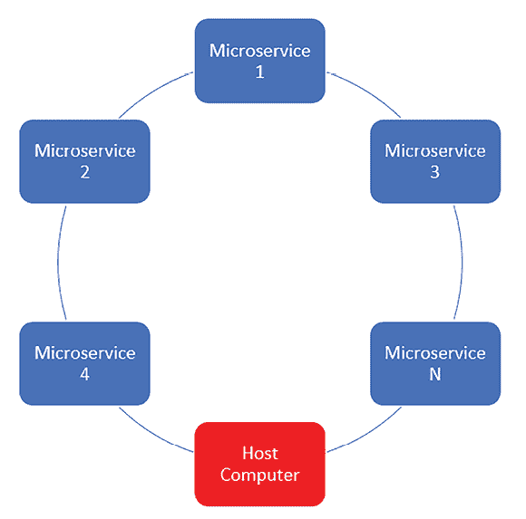
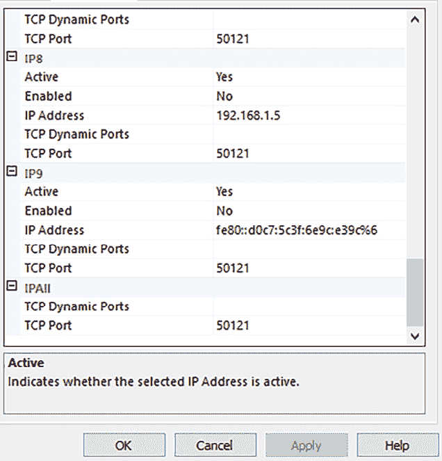
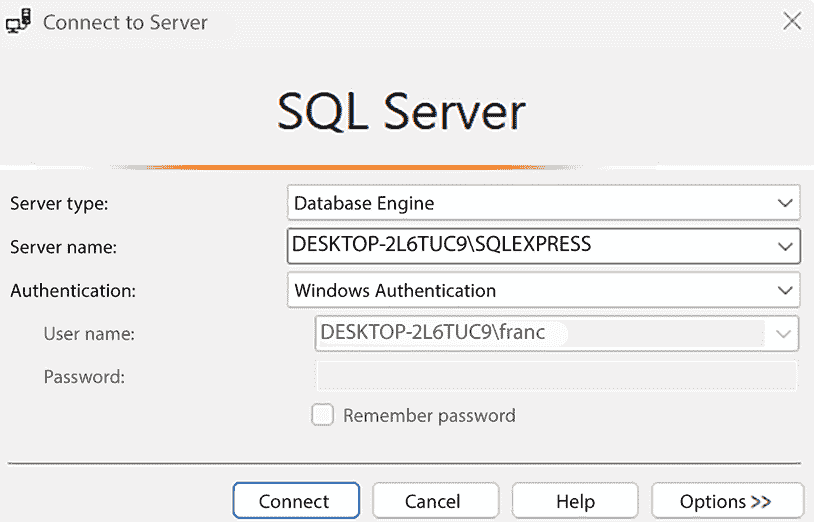
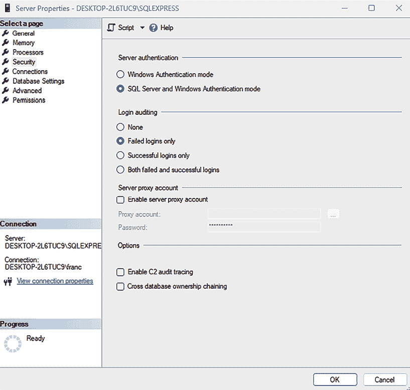
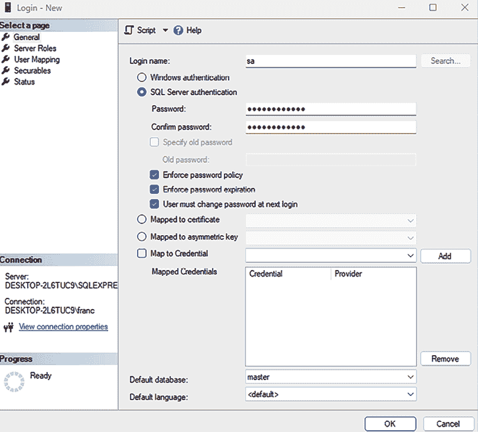
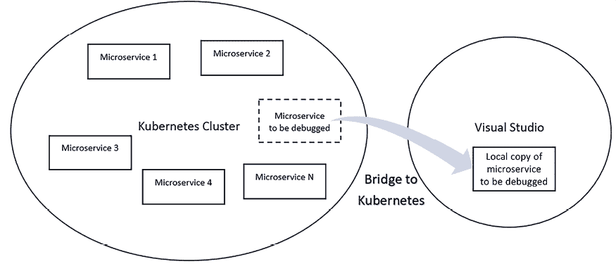
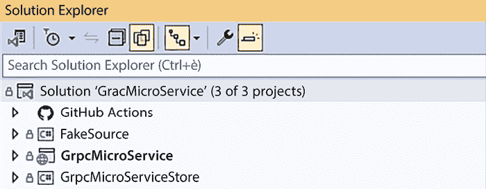
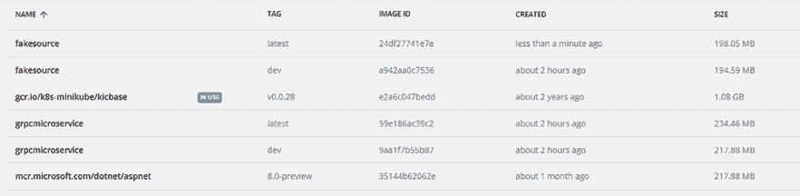
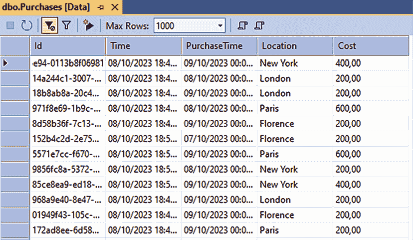
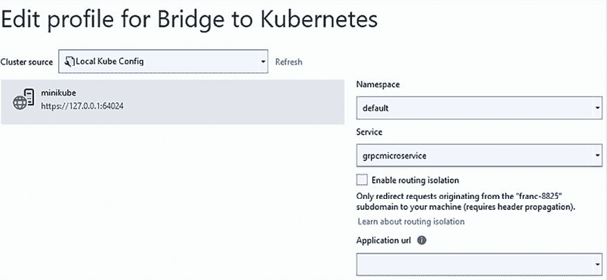

# 22

# 案例研究扩展：为 Kubernetes 开发 .NET 微服务

在本章中，我们将结合第二十一章 *案例研究* 中探讨的 .NET 微服务的实际实施见解，以及第二十章 *Kubernetes* 中介绍的 Kubernetes 的基础知识。我们的重点是准备 .NET 代码以无缝集成到 Kubernetes 中，涵盖整个开发周期——从编码到调试，甚至包括部署后的故障排除。

我们将引导您通过设置一个针对 Kubernetes 优化的开发工作站的过程，学习使用 Docker 打包代码的细节，并了解如何组织代码库以确保在各种环境中（如 Docker Desktop、本地 minikube 安装以及生产或预发布 Kubernetes 集群）无故障执行。

此外，本章还深入探讨了远程调试的细微差别，为您提供高效故障排除和调试应用程序所需的技能。在这里，您将学习如何准备每个开发工作站的配置，如何使用 Docker 打包代码，以及如何组织代码，使其可以立即在开发者的 Docker Desktop、开发者的本地 Minikube 安装以及生产/预发布 Kubernetes 集群上运行，无需修改。

到本章结束时，您将掌握生产或预发布环境中应用程序的远程调试技术，从而实现快速问题解决和系统可靠性。

更具体地说，您将学习以下主题：

+   .NET Kubernetes 开发所需的工具

+   组织开发流程

+   在 Minikube 中运行您的应用程序

+   Kubernetes 应用程序的远程调试

所有概念都将通过从 *第二十一章，案例研究* 中选取的先前示例进行解释，我们将对其进行修改以适应 Kubernetes 执行。

您将改编第二十一章 *案例研究* 中的 `GrpcMicroService` 微服务，亲眼看到真实世界应用程序如何过渡到 Kubernetes。

要充分利用本章内容，请加强您对 Docker 和 Kubernetes 的理解，这些内容在第十一章 *将微服务架构应用于您的企业应用程序* 和第二十章 *Kubernetes* 中有所阐述，它们构成了本章讨论的高级实践的基石。

# 技术要求

本章需要 Visual Studio 2022 免费社区版或更高版本，并安装所有数据库工具。

您还需要以下内容：

+   **WSL（Windows Subsystem for Linux**）和 *Docker Desktop for Windows*。关于如何安装这两个软件的详细说明见第十一章 *将微服务架构应用于您的企业应用程序* 中的 *技术要求* 部分。

+   指定 Docker 作为虚拟化工具的 Minikube 安装。Minikube 安装在 *第二十章，Kubernetes* 中的 *使用 Minikube* 部分进行了描述。

+   允许 TCP/IP 连接的 SQL Server 数据库。你不能使用随 Visual Studio 安装一起提供的 *SQL Server Express LocalDB*，因为它不允许 TCP/IP 连接。因此，你需要一个完整的 SQL Express 安装或一个 Azure SQL Server 数据库。关于如何满足这一要求的更多细节将在本章的 *.NET Kubernetes 开发所需工具* 部分中给出。

本章的所有代码都可以在本书关联的 GitHub 仓库中找到：[`github.com/PacktPublishing/Software-Architecture-with-C-Sharp-12-and-.NET-8-4E`](https://github.com/PacktPublishing/Software-Architecture-with-C-Sharp-12-and-.NET-8-4E)。

# .NET Kubernetes 开发所需工具

每个单独的微服务都可以使用你在 *第九章，测试你的企业应用程序* 中学到的技术独立于其应用程序的其余部分进行单元测试和调试。你不需要将其打包在 Docker 镜像中来做这件事。

然而，对整个应用程序或其部分进行调试和执行集成测试需要所有涉及的微服务进行交互，并打包成最终应用程序的形式。

你可以使用预发布环境来测试你的应用程序。在部署到预发布环境之前，确保你的应用程序在开发环境中的稳定性，以避免耗时的故障排除，因为预发布环境没有开发环境中所有可用的设施。否则，解决在预发布环境中发现的所有常见错误和崩溃可能意味着不可接受的时间成本。

因此，在将应用程序部署到预发布环境之前，最好先达到良好的应用程序稳定性。此外，为了更容易、更高效地进行调试-修复循环，最好所有微服务都在单个开发机器上运行。这就是为什么每个开发工作站都必须配备 Docker 和 Minikube。

此外，开发机器必须能够模拟微服务之间以及服务与其他存储媒体（如数据库）之间的所有通信。

很可能，Minikube 可以运行并模拟在真实 Kubernetes 集群中发生的所有通信，包括它在单个开发机器上运行时。

我们还可以在将它们加载到 Minikube 之前，让所有涉及的 Docker 镜像之间进行通信，因为 Docker Desktop 允许创建本地 Docker 镜像可以访问的虚拟网络。

最后，Docker 和 Minikube 虚拟网络自动包括托管它们的开发机器，因此我们可以将存储服务（如磁盘卷和数据库）放置在开发机器本身上。



图 22.1：Minikube 和 Docker 网络结构

然而，Docker 和 Kubernetes 的复杂虚拟网络功能不足以确保高效的开发和调试环境，还需要进一步的工具。

以下是我们需要解决的所有问题以及如何解决这些问题，以配置有效的开发调试环境：

+   默认情况下，Visual Studio 安装的是 *SQL Server Express LocalDB* 而不是 *SQL Server Express*，而 SQL Server Express LocalDB 无法通过实际或虚拟网络进行通信。因此，我们需要 SQL Server Express 的安装或外部数据库。

+   由于 Kubernetes 节点仅具有由 Kubernetes 引擎本身处理的虚拟地址，因此 Visual Studio 调试器可以通过 Kubernetes 引擎的 REST API 将其附加到正在运行的微服务。在撰写本文时，Visual Studio 可用的最佳工具是 *Bridge to Kubernetes*，它反过来使用 *kubectl* 与任何 Kubernetes 集群的 API 进行交互，包括 Minikube。不幸的是，我们无法使用在 Minikube 主机虚拟机上运行的 Kubectl 安装，就像我们在 *第二十章*，*Kubernetes* 中所做的那样，但我们需要一个直接在开发机器上运行的安装。

我们将在两个专门的子节中描述如何安装和配置上述提到的所有工具。

## 安装和配置 SQL Server Express

如果您有权访问在您的开发机器上运行的 SQL Server 实例，您可以使用该实例。否则，您可以根据 *第十二章*，*在云中选择您的数据存储* 中的说明在 Azure 中创建 SQL Server 数据库，或者安装 SQL Server Express 的本地实例：

1.  首先，从 [`www.microsoft.com/en-US/download/details.aspx?id=104781`](https://www.microsoft.com/en-US/download/details.aspx?id=104781) 下载 SQL Server 安装程序。

1.  您可以在 SQL Server Express 和 SQL Server Express Advanced 之间自由选择，但请选择一个包含 **SQL Server Management Studio** 和 **SQL Server 管理控制台** 的完整安装。

1.  选择将 SQL Server 作为默认实例安装到您的计算机上（安装过程中的默认选项）。

    安装完成后，您必须运行 SQL Server 管理控制台（只需在 Windows 搜索框中键入此名称）以启用基于 TCP/IP 的连接。为了正确配置 SQL Server，请遵循以下所有步骤。

1.  一旦进入 SQL Server 管理控制台，展开 **SQL Server 网络配置** 节点。

1.  选择 **<您的实例名称> 的协议**。

1.  在右侧详细窗格中，您应该看到所有可用的通信协议。

1.  右键单击 **TCP**/**IP** 并选择 **启用**。

1.  现在，TCP/IP 已启用，但使用动态端口。为了强制使用固定端口，右键单击相同的 TCP/IP 节点并选择 **属性**。



图 22.2：强制使用静态 IP 地址

1.  选择 **IP 地址** 选项卡。

1.  您应该看到几个 IP 地址。这些都是与您的计算机关联的 IP 地址，每个地址都会执行下一步。

1.  从**TCP 动态端口**中移除**0**，并保持此字段为空，然后在**TCP 端口**字段中写入`1433`。

1.  完成后，点击**确定**按钮。

1.  现在，你需要重新启动 SQL Server 服务。在左侧窗格中选择**SQL Server 服务**。

1.  最后，在右侧详细窗格中，右键单击**SQL Server <你的实例名称>**并选择**重启**。

1.  安装完成后，SQL Server 仅启用了 Windows 身份验证。为了在非 Windows 网络上使用实例，你必须启用基于用户名的身份验证并定义至少一个管理员用户。这是一个必要的步骤，因为 Windows 身份验证在 Docker 网络上和 Kubernetes 上都不会工作。

1.  你可以在 SQL Server Management Studio 中完成此操作。一旦 SQL Server Management Studio 打开，它会提示你连接的实例和身份验证信息。你刚刚安装的数据库的实例名称应该是类似于`<计算机名称>\SQLEXPRESS`的名称；选择它，并选择**Windows 身份验证**，如图下所示：



图 22.3：使用 SQL Server Management Studio 连接

一旦与数据库连接，你可以按照以下步骤启用基于用户名的身份验证：

1.  在对象资源管理器中右键单击你的服务器图标并选择**属性**。

1.  在打开的窗口中，在左侧窗格中选择**安全**。

1.  选择**SQL Server 和 Windows 身份验证模式**，如图下所示：



图 22.4：启用 SQL Server 身份验证

为了使你的更改生效，你必须重新启动 SQL Server。你可以通过在对象资源管理器中右键单击你的服务器图标并选择**重启**来完成此操作。

现在，你需要按照以下步骤定义至少一个用户：

1.  在对象资源管理器中展开你的服务器图标下的**安全**文件夹。

1.  右键单击**登录名**文件夹并选择**新建登录名**。

1.  在打开的窗口中，输入一个用户名。

1.  选择**SQL Server 身份验证**，输入一个密码，并在**确认密码**字段中重新输入相同的密码，如图下所示：



图 22.5：定义用户名和密码

1.  最后，在**服务器角色**上右键单击并启用**sysadmin**角色，以赋予新用户所有权限。

现在你已经完成了！现在，你的 SQL Server 实例既可以由 Docker 使用，也可以由 Minikube 使用。

下一个子节解释了如何为在 Minikube 或任何其他 Kubernetes 集群上运行的应用程序配置 Visual Studio 进行调试。

## 使用 Bridge to Kubernetes 启用 Kubernetes 应用程序调试

由于在 Kubernetes 上运行的微服务没有固定的 IP 地址和端口，只有 Kubernetes 在运行时解决的虚拟地址，我们无法直接将 Visual Studio 调试器附加到任何正在运行的微服务。这就是为什么我们需要像 Bridge to Kubernetes 这样的软件，它与 Kubernetes API 交互以启用调试。

Kubernetes 桥接器是一个易于安装的 Visual Studio 扩展，但它要求在你的开发机器上安装 Kubectl，这带来了一定的挑战，因为 Kubectl 没有直接的 Windows 安装程序。在本小节中，我们将指导你完成安装 Bridge to Kubernetes 和 Kubectl 的过程，克服后者缺乏直接 Windows 安装程序的问题。

Kubernetes 桥接器通过 Kubectl 与 Kubernetes API 交互，从而实现 Kubernetes 应用程序的调试。然而，它不是一个调试驱动程序或调试扩展。它做的是一项完全不同的工作；它要求你选择在 Kubernetes 集群中运行的服务，并将与此服务的所有通信重定向到本地运行的 Visual Studio POD 副本，而不是实际的集群 POD。



图 22.6：Kubernetes 桥接器的工作原理

因此，开发者调试的是 POD 代码的本地副本，但与原始 POD 完全相同的动态 Kubernetes 环境中。这样，你就有了一个通常本地调试会话提供的所有设施，同时在你调试时，你的代码与你需要修复的实际 Kubernetes 集群进行交互。

Kubernetes 桥接器不仅与 Minikube 一起工作；它与任何 Kubernetes 集群一起工作。因此，你可以用它来在开发机器上调试整个应用程序，也可以用于调试预发布应用程序或生产应用程序。

由于你只调试本地代码而不是已部署的代码，因此你不必在调试模式下编译应用程序来调试它。你可以部署应用程序，并使用你想要的任何编译优化，无需关心可能的调试需求；只需确保你想要调试的 POD 的本地副本已以调试模式编译即可。

你将在“Kubernetes 应用程序的远程调试”部分学习如何在实际中使用 Kubernetes 桥接器。本节的其余部分将解释安装 Bridge to Kubernetes 到开发机器上所需的所有步骤。

首先，你需要安装 Kubectl。最简单的方法是使用 Chocolatey 包管理器。

Chocolatey 是一个类似于 NuGet 的包管理器。同样，它由一个包含所有包的公共仓库和一个你必须安装到你的机器上的客户端组成，以便与公共仓库交互。

如果你还没有安装 Chocolatey，你可以从 PowerShell 提示符安装它，如下所示：

1.  在 Windows 搜索框中搜索**PowerShell**。

1.  右键单击 PowerShell 链接，并选择以管理员身份执行。

1.  最后，执行官方 Chocolatey 页面上的 PowerShell 命令：[`chocolatey.org/install#individual`](https://chocolatey.org/install#individual)。

以下是为你的方便而重复的 PowerShell 命令：

```cs
Set-ExecutionPolicy Bypass -Scope Process -Force; [System.Net.ServicePointManager]::SecurityProtocol = [System.Net.ServicePointManager]::SecurityProtocol -bor 3072; iex ((New-Object System.Net.WebClient).DownloadString('https://community.chocolatey.org/install.ps1')) 
```

安装完成后，运行 `choco -?` 以验证安装成功并且 Chocolatey 用户界面工作正常。

安装 Chocolatey 后，安装 Kubectl 非常简单；只需以管理员身份打开 Windows 命令提示符，并输入以下内容：

```cs
choco install kubernetes-cli 
```

你可以通过输入 `kubectl version –client` 来检查一切是否正常工作。

Kubectl 应配置为访问特定集群，但当你使用 `minikube start` 启动 Minikube 时，Minikube 会自动将其配置为访问本地 Minikube 集群，因此你不需要担心 Kubectl 的配置。

现在，你可以按照以下步骤安装 Bridge to Kubernetes：

1.  打开 Visual Studio 并选择 **扩展 -> 管理扩展**。

1.  搜索 `Bridge to Kubernetes`。

1.  选择它并安装。

现在就到这里！现在，你的开发机器已经准备好进行 .NET Kubernetes 开发了。下一节将详细介绍开发过程，并解释如何修改现有项目以同时使用本地 Docker 安装和任何 Kubernetes 集群。

# 组织开发过程

由于 Visual Studio 和其他 IDE 对 Docker 提供良好的支持，并与 Docker Desktop 有很好的集成，因此在大多数开发时间内，最佳选项是仅使用 Docker 化的镜像进行工作，而不在 Minicube 内运行它们。

事实上，正如我们很快就会看到的，一旦我们将 Docker 支持添加到我们的项目中，点击运行 Visual Studio 按钮就足够了，这样就可以启动所有 Docker 化的微服务，并使它们能够通过 Docker 网络进行通信。相反，在 Minikube 中运行我们的应用程序需要几个手动步骤，并且需要一些时间来在 Minikube 上加载 Docker 镜像以及创建所有必要的 Kubernetes 对象。

在 Visual Studio 中这样做非常简单。只需为你的解决方案中的所有微服务项目添加 Docker 支持，并在解决方案运行时选择同时启动多个项目的选项。然后，当你的解决方案运行时，Visual Studio 将自动执行所有必要的任务，即：

1.  编译和链接所有代码。

1.  构建所有微服务的 Docker 镜像。

1.  将 Docker 镜像插入 Docker Desktop 本地仓库。

1.  同时启动所有 Docker 镜像。

1.  将调试器附加到所有启动的 Docker 镜像。

你只需要通过定义一个 Docker Desktop 虚拟网络来关注微服务之间的通信。

我们将在下一小节中通过一个简单的示例解释开发过程的全部细节。

## 重新审视 gRPC 工作微服务

在与 *第十四章*，*使用 .NET 实现微服务* 和在第二十一章，*案例研究* 中描述的代码中，有一个名为 `GrpcMicroService` 的解决方案。该解决方案由两个微服务组成。第一个微服务通过生成随机数据来模拟购买，而第二个微服务使用这些数据来计算存储在数据库中的统计数据。整个代码在书籍相关的 GitHub 仓库的 `ch15->GrpcMicroService` 文件夹中可用。

让我们复制整个 `GrpcMicroService` 文件夹，并将其命名为 `GrpcMicroServiceDocker`。

下面的步骤描述了需要对 Docker 进行所有必要的修改，以启用所有微服务。

### 将 Docker 支持添加到 GrpcMicroServiceDocker

在 Visual Studio 中打开 `GrpcMicroServiceDocker` 解决方案。该解决方案包含两个微服务，分别称为 `FakeSource` 和 `GrpcMicroservice`。最后一个项目只是 `GrpcMicroservice` 项目的数据层。



图 22.7：GrpcMicroServiceDocker 解决方案

解决方案已经配置为在运行时启动两个微服务。在其他情况下，你可能需要通过右键单击解决方案节点并选择 **设置启动项目…** 来配置多个项目启动。

将 Docker 支持添加到两个微服务中非常简单。在 Visual Studio 中右键单击每个微服务项目。导航到 **添加**，然后选择 **Docker 支持**。如果提示，选择你的 Docker 环境的操作系统。如果你使用 Minikube，你必须选择 **Linux**。

所有必要的 Docker 文件都由 Visual Studio 自动创建和配置。就这样了！

现在，我们需要将数据库移动到新安装的 SQL Server 实例。

### 将 GrpcMicroServiceDocker 移动到 SQL Server Express

你需要更改所有连接字符串并配置将在运行时使用的字符串，以便它可以在 Docker 镜像内部使用。

首先，让我们更改 `GrpcMicroServiceStore-> LibraryDesignTimeDbContextFactory.cs` 中面的连接字符串。新字符串应该类似于以下内容：

```cs
@"Server=<your machine name>\<your instance name>;Database=grpcmicroservice;Trusted_Connection=True;Trust Server Certificate=True;MultipleActiveResultSets=true" 
```

其中实例名称应该是 `SQLEXPRESS`。你可以直接从 Visual Studio 中获取上述连接字符串，如下所示：

1.  打开 **SQL Server 对象资源管理器**窗口。

1.  右键单击 **SQL Server** 节点并选择 **添加 SQL Server**。

1.  在打开的窗口中，Visual Studio 应该列出所有可用的 SQL Server 实例。选择新安装的 SQL Server 实例。

1.  选择 **Windows 身份验证**并连接。

1.  在 **SQL Server** 节点下方应该出现一个新的服务器图标。选择它。

1.  在 **Visual Studio 属性**选项卡中，你应该能看到所有数据库连接属性。取 **通用-> 连接字符串** 的值。

现在，你必须运行所有迁移以在新的 SQL Server 实例中重新创建数据库。像往常一样，右键单击库项目并将其定义为启动项目。然后，在 Visual Studio 包管理器控制台 **默认项目** 中，选择 `GrpcMicroServiceStore` 并发出 `Update-Database` 命令。

新数据库创建后，将两个微服务作为同时启动项目恢复。

最后，更新 `GrpcMicroService -> appsettings.json` 中的运行时连接字符串。如果新安装的 SQL Server 实例已被定义为机器上的默认实例，以下连接字符串应该可以工作：

```cs
Server=host. Docker.internal;Database=grpcmicroservice;User Id=<your user name>;Password=<your user password>;Trust Server Certificate=True;MultipleActiveResultSets=true" 
```

其中 `host.docker.internal` 是 Docker Desktop 镜像用于与主机通信的 URL。如果你的 SQL Server 不是机器的默认实例，你必须将 `host.docker.internal` 替换为 `host.docker.internal\<your instance name>`。

如果，相反，你正在使用外部数据库，你可以使用其标准的连接字符串，无需修改。

### 使用 Docker 虚拟网络启用微服务之间的通信

在 Docker Desktop 中创建 Docker 虚拟网络非常简单；只需打开 Windows 控制台并运行以下命令：

```cs
docker network create test-net, 
```

其中 `test-net` 是虚拟网络名称。一旦我们在从镜像创建容器实例时定义了网络，我们就可以指定启动的容器必须连接到我们的网络及其主机名，如下所示：

```cs
docker run --rm --net test-net --name grpcmicroservice <microservice image name>, 
```

在这里，`rm` 选项指定容器停止运行时必须被销毁，`--net test-net` 指定连接创建容器的网络，而 `-name grpcmicroservice` 是创建的容器名称，它也将作为其在网络中的主机名。

我们需要将 `test-net` 虚拟网络中添加的容器仅限于必须作为服务器的容器——在我们的例子中，是 `GrpcMicroService` 微服务。

由于 Visual Studio 在启动解决方案时自动发出所有必要的 `run` Docker 命令，我们只需要指定要添加到 Visual Studio 原始命令的选项。它们必须在每个微服务项目文件中使用 `DockerfileRunArguments` 参数进行指定。以下是如何修改 `GrpcMicroService` 微服务项目文件的方法，这是唯一作为服务器运行的微服务：

```cs
<PropertyGroup>
<TargetFramework>net8.0</TargetFramework>
<Nullable>enable</Nullable>
<UserSecretsId>b4f03ff2-033c-4d5e-a33b-65f26786b052</UserSecretsId>
<DockerDefaultTargetOS>Linux</DockerDefaultTargetOS>
**<****DockerfileRunArguments****>**
**--rm --net test-net --name grpcmicroservice**
**</****DockerfileRunArguments****>**
</PropertyGroup> 
```

对于 `FakeSource` 项目不需要进行修改，因为它必须不作为服务器运行。

现在，`grpcmicroservice` 主机名必须由 `FakeSource` 用于与 `GrpcMicroService` 微服务进行通信。

因此，我们必须将 `FakeSource->Worker.cs` 文件中的 URL 替换为 `http://grpcmicroservice:8080`，如下面的代码片段所示：

```cs
…
using var channel = GrpcChannel.ForAddress("http://grpcmicroservice:8080");
var client = new Counter.CounterClient(channel);
… 
```

其中我们使用 `8080` 默认的 Kestrel `http` 端口与微服务进行通信。因此，我们需要在 `GrpcMicroService -> Program.cs` 中的 Kestrel 选项中强制 Kestrel 监听 `5000` 端口，通过替换下面的代码：

```cs
builder.WebHost.ConfigureKestrel(options =>
{
    options.ListenLocalhost(5000, o =>
        o.Protocols = Microsoft.AspNetCore.Server.Kestrel.Core.HttpProtocols.Http2);
}); 
```

现在，我们已经准备好运行我们的项目。为了确保两个微服务都使用 Docker 启动，请将每个微服务作为单个启动项目选中，然后在下图所示的运行解决方案 Visual Studio 按钮旁边的选择框中选择 **Docker**，如图所示：


图 22.8：选择 Docker 执行

之后，你可以恢复同时启动两个微服务。Visual Studio 将使用 Docker 启动它们。

现在，我们可以启动解决方案。为了验证服务器是否正确接收购买信息，在下面的 `if` 块中 `GrpcMicroService->HostedServices-> ProcessPurchases.cs` 文件内放置一个断点：

```cs
if (toProcess.Count > 0)
{
	…
} 
```

事实上，`GrpcMicroService` 只有在输入队列中找到某些内容时才会进入那个块。

你还可以检查 `dbo.Purchases` 数据库表的 内容，以验证它是否填充了购买统计信息。你可以通过在 **SQL Server Object Explorer** 中右键单击表并选择 **查看数据** 来完成它。

在理解了如何使用 Docker 网络测试我们的应用程序之后，我们现在必须了解何时以及如何使用 Minikube 进行测试。

## 何时使用 Minikube 测试应用程序

在应用程序开发中涉及的调试-修复周期的大部分工作都可以使用 Docker 虚拟网络完成。

Docker 网络通常运行良好，不会出现问题。因此，如果你遇到通信问题，它们可能是因为拼写错误的服务 URL。因此，请仔细检查所有调用微服务的 URL，这些微服务没有收到通信。

有时，我们需要以下原因使用 Minikube 测试应用程序：

+   无论是 ReplicaSets 还是 StatefulSets，都可以使用 Docker 和 Visual Studio 进行测试，但我们每个都限于一个 POD。

+   我们还必须测试 `.yaml` Kubernetes 配置文件，该文件可能包含更复杂的对象，如入口、持久存储、机密和其他复杂配置。

+   你可能需要将你的微服务与其他团队开发的模块集成。

因此，每个开发者应该花大部分时间测试几个相互之间有强烈交互的微服务，但有时，他们应该尝试与 Minikube 进行更广泛的集成。这可以在工作日结束时提交代码之前，或者在敏捷应用程序开发过程的开发迭代即将结束时进行。

在学习了如何使用 Minikube 测试应用程序的时间和方式之后，我们必须学习如何在 Minikube 上加载和运行我们的应用程序。

# 在 Minikube 上运行你的应用程序

当 Visual Studio 使用 Docker 运行您的微服务时，它创建包含 Visual Studio 调试器所需信息的特殊图像，并具有 `dev` 版本名称。这些特殊图像只能从 Visual Studio 运行，如果您尝试手动启动它们，将会出错。出于同样的原因，您不能在 Minikube 中使用它们。

因此，在 Minikube 中运行您的微服务的第一步是创建不同的“标准”图像。您可以通过在 Visual Studio 解决方案资源管理器中右键单击 `FakeSource` 和 `GrpcMicroService` Docker 文件，并选择**构建 Docker 图像**来完成此操作。

这样，您将创建一个 `grpcmicroservice` 和一个 `fakesource` 图像，它们都具有 `latest` 版本名称，如下面的图像所示：



图 22.9：创建 Minikube 准备好的 Docker 图像

作为下一步，您必须启动 Minikube：

```cs
minikube start 
```

现在，您必须使用以下命令在 Minikube 图像缓存中加载您的 Docker 图像：

```cs
minikube image load fakesource:latest
minikube image load grpcmicroservice:latest 
```

您可以通过列出 Minikube 中加载的所有图像来验证您的图像是否已正确加载：

```cs
minikube image ls 
```

现在，我们需要定义一个包含两个部署和一个将通信转发到作为唯一服务器微服务的 `grpcmicroservice` 的 `.yaml` Kubernetes 配置文件。让我们称它为 `minikubedeploy.yaml`。

`grpcmicroservice` 部署的定义很简单：

```cs
apiVersion: apps/v1
kind: Deployment
metadata:
  name: grpcmicroservice
  labels:
    app: statistics
spec:
  selector:
    matchLabels:
      app: statistics
      role: worker
  replicas: 1
  template:
    metadata:
      labels:
        app: statistics
        role: worker
    spec:
      containers:
      - name: grpcmicroservice
        image: grpcmicroservice:latest
        imagePullPolicy: Never
        resources:
          requests:
            cpu: 10m
            memory: 10Mi
        env:
        - name: ASPNETCORE_HTTP_PORTS
          value: "8080"
        ports:
        - containerPort: 8080
          name: http 
```

上面的代码只需要一个副本，但您可以尝试使用两个或三个副本。`ASPNETCORE_HTTP_PORTS` 环境变量是一个标准的 ASP.NET 设置，它通知 Kestrel 在哪个 HTTP 端口上监听。

`imagePullPolicy: Never` 设置指定了 Kubernetes 集群内的图像缓存策略。它阻止 Minikube 尝试从原始源下载图像的新版本到其缓存中。我们需要此设置，因为我们没有包含我们的图像的“原始源”，因为我们直接使用 `minikube image load` 命令将图像上传到 Minikube 缓存。

当共享图像库中没有图像，但图像直接从 Docker Desktop 本地库上传到 Minikube 缓存时，您必须始终指定此设置。相反，共享图像不需要手动上传到 Minikube 缓存，只需在 Kubernetes `.yaml` 文件中使用它们的完整 URL 进行引用即可。

所有其他设置都很标准。

`fakesource` 部署的定义完全类似，但不包含有关容器端口的任何信息，因为此微服务不作为服务器：

```cs
apiVersion: apps/v1
kind: Deployment
metadata:
  name: fakesource
  labels:
    app: sale
spec:
  selector:
    matchLabels:
      app: sales
      role: source
  replicas: 1
  template:
    metadata:
      labels:
        app: sales
        role: source
    spec:
      containers:
      - name: fakesource
        image: fakesource:latest
        imagePullPolicy: Never
        resources:
          requests:
            cpu: 10m
            memory: 10Mi 
```

将通信转发到 `grpcmicroservice` 的服务定义相当标准：

```cs
apiVersion: v1
kind: Service
metadata:
  name: grpcmicroservice
  labels:
    app: contract
    role: worker
spec:
  ports:
  - port: 8080
    name: http
    protocol: TCP
    targetPort: 8080
  selector:
    app: statistics
    role: worker 
```

您必须注意的只有必须在一切设置中保持一致的端口号以及服务名称，因为它们将被用于所有通信到 `grpcmicroservice` 的 URL 中。

如果服务名称与 Docker 虚拟网络中的主机名匹配，URL 将在 Kubernetes 和 Docker 虚拟网络中都有效。因此，你不需要修改任何代码或配置来适应在 Docker 虚拟网络中运行的代码以适应 Minikube 或任何其他 Kubernetes 集群。

整个 `minkubedeploy.yaml` 文件可在与本书相关的 GitHub 仓库的 `ch22` 文件夹中找到。

现在，让我们在包含 `minkubedeploy.yaml` 文件的文件夹中打开一个 Windows 命令提示符，执行以下命令，将在 Minikube 集群中加载应用程序配置：

```cs
kubectl create -f minkubedeploy.yaml 
```

然后，执行 `kubectl get deployment` 命令以验证所有部署是否已正确定义并正在运行。

你可以通过检查 `dbo.Purchases` 数据库表中的数据来验证应用程序是否正常运行，通过在 **SQL Server 对象资源管理器**中右键单击 `dbo.Purchases` 表并选择 **查看数据**：



图 22.10：dbo.Purchases 表

每次你点击表格刷新按钮时，你应该会看到数据库表中添加了新行。如果经过几次刷新后新行仍未出现，你的微服务可能遇到了一些通信问题，或者数据计算之前抛出了某些异常。

你可以通过调试应用程序来发现问题。下一节将解释如何借助 Bridge 到 Kubernetes 详细验证应用程序中发生的情况。请勿删除使用 `minkubedeploy.yaml` 创建的所有 Kubernetes 对象，因为我们需要运行中的应用程序来附加 Bridge 到 Kubernetes。

# 远程调试 Kubernetes 应用程序

作为最后一步，我们将使用 Bridge 到 Kubernetes 调试 `GrpcMicroService`。让我们将 `GrpcMicroService` 设置为起始项目，并将项目启动从 **Docker** 更改为 **Bridge** **到 Kubernetes**，如图所示：


图 22.11：使用 Bridge 到 Kubernetes 调试 GrpcMicroService

让我们在 `GrpcMicroService->HostedServices-> ProcessPurchases.cs` 文件中的 `if` 块内放置一个断点，如下所示：

```cs
if (toProcess.Count > 0)
{
	…
} 
```

然后，开始调试。一旦你点击**运行**按钮，就会弹出一个窗口，提示你配置 Bridge 到 Kubernetes：



图 22.12：配置 Bridge 到 Kubernetes

如果上面的窗口没有打开，或者你看不到任何 Minikube 节点，`Kubectl` 可能未为 Minikube 正常工作或配置。尝试执行一个 `Kubectl` 命令，如 `kubectl get all`。如果你遇到任何问题，尝试使用 `minikube stop` 停止 Minikube，然后使用 `minikube start` 重新启动。

Bridge to Kubernetes 提示我们选择一个命名空间——在我们的例子中是`default`——然后在该命名空间中选择一个特定的服务——在我们的例子中是`grpmicroservice`。所有对该服务的通信都将转发到运行在我们开发机器上的`GrpcMicroService`代码。让我们设置配置窗口，如上图所示。一旦你提交 Bridge to Kubernetes 的配置，调试将自动开始。在短时间内，断点将被触发，我们本地微服务的副本将开始与在 Minikube 中运行的其余代码进行交互！

在完成调试后，请将项目启动恢复到**Docker**，并恢复两个微服务的同时启动，以便你可以在 Docker 虚拟网络上继续工作。

在完成与 Minikube 的工作后，你需要使用以下命令删除由`minkubedeploy.yaml`创建的所有对象：

```cs
kubectl delete -f minkubedeploy.yaml 
```

重要的是，一旦不再需要资源，就应立即释放它们；否则，它们将继续浪费 CPU 时间和内存，如果你不断添加更多应用程序，迟早会在你的开发机器上遇到性能问题。

如果你想要释放 Minikube 磁盘空间，你也可以使用以下命令删除之前加载到 Minikube 缓存中的微服务镜像：

```cs
minikube image rm fakesource:latest
minikube image rm grpcmicroservice:latest 
```

最后，你需要使用以下命令停止 Minikube：

```cs
minikube stop 
```

# 摘要

在本章中，我们解释了如何为.NET Kubernetes 开发准备开发工作站以及如何组织代码测试和错误修复周期。

我们还解释了如何定义 Docker 虚拟网络以确保开发期间微服务之间的通信，以及主机名和 Kubernetes 服务的命名约定，使得相同的代码可以在 Docker 虚拟网络、Minikube 以及任何其他 Kubernetes 集群上运行。

最后，我们解释了在 Minikube 中运行应用程序所需的全部步骤以及如何使用 Bridge to Kubernetes 进行测试。

我们现在已经完成了在这本书中的旅程，这是一段多么精彩的旅程啊！

这本书充满了许多新颖和具有挑战性的想法，它必定会成为你在软件架构师旅程中的良师益友。

这些学习将不仅赋予你创造创新解决方案的能力，还将支持你在软件项目动态世界中的成长。我们真诚地希望，你享受这次冒险的程度与我们为你创建最新版本的程度一样。

# 问题

1.  为什么 Visual Studio 附带的 SQL Server 安装不能用于 Kubernetes 开发？

1.  什么是 Bridge to Kubernetes？

1.  Bridge to Kubernetes 是否仅与 Minikube 一起工作？

1.  你如何加载 Minikube 镜像缓存？

1.  我们如何将 Minikube 定义为 Kubectl 默认集群？

# 进一步阅读

本章中的大部分参考资料与之前在 *第十一章*，*将微服务架构应用于您的企业应用* 和 *第十四章*，*使用 .NET 实现微服务* 中列出的相同。在此，值得添加关于 Kubernetes 之桥的官方文档链接：[`learn.microsoft.com/en-us/visualstudio/bridge/`](https://learn.microsoft.com/en-us/visualstudio/bridge/)

# 在 Discord 上了解更多

要加入这本书的 Discord 社区——在那里您可以分享反馈、向作者提问，并了解新书发布——请扫描下面的二维码：

[`packt.link/SoftwareArchitectureCSharp12Dotnet8`](https://packt.link/SoftwareArchitectureCSharp12Dotnet8)


