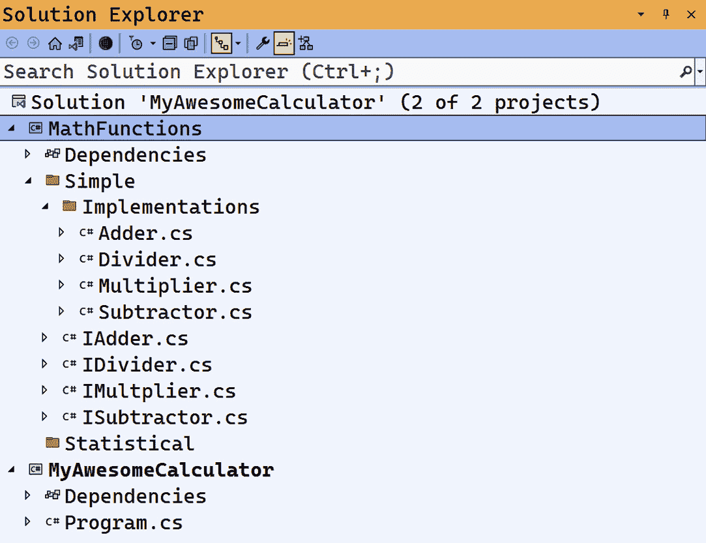
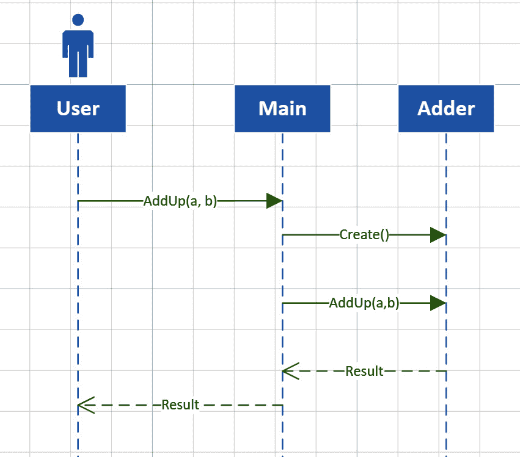
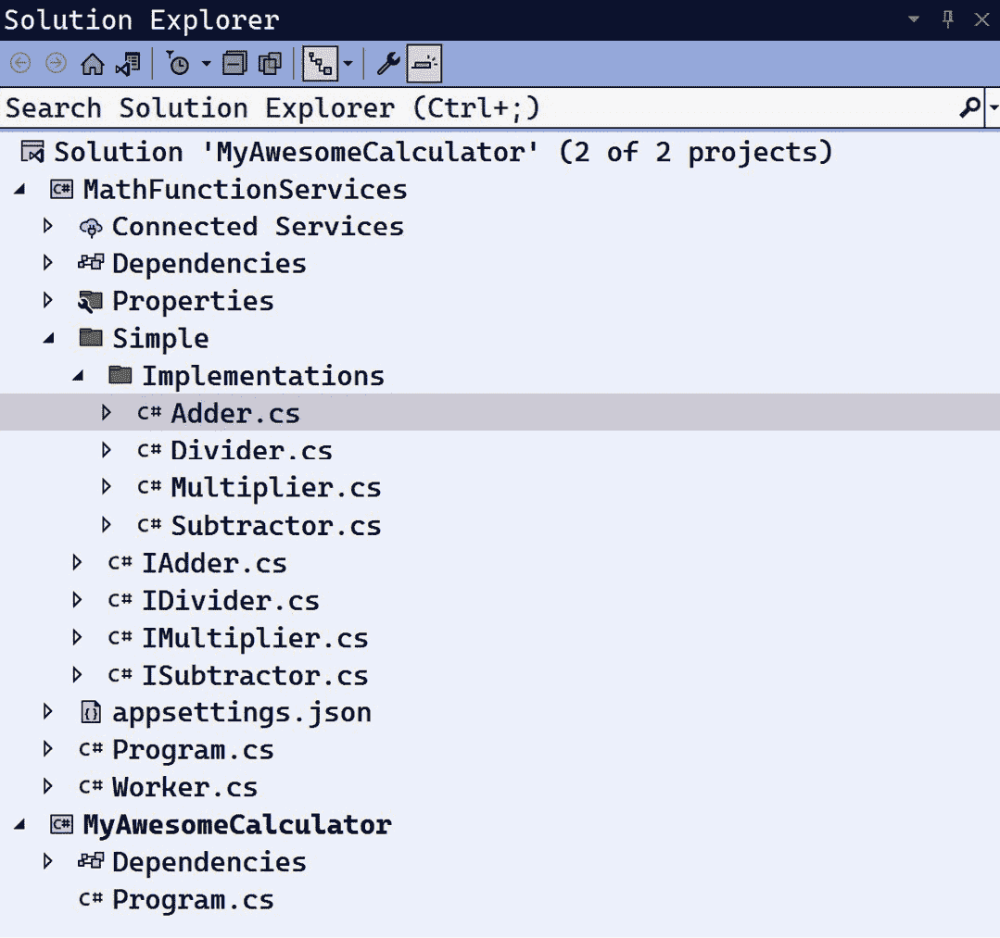
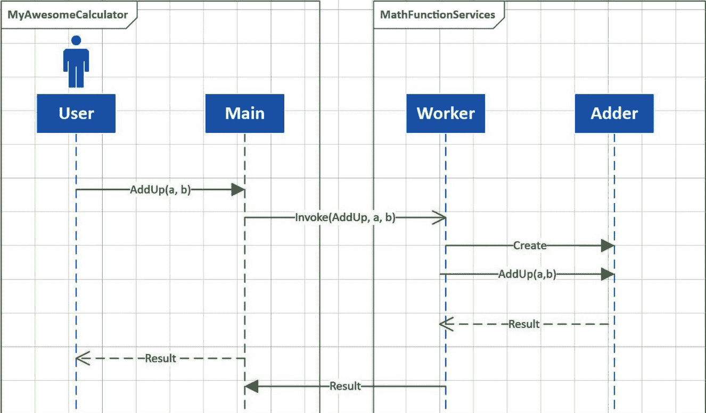
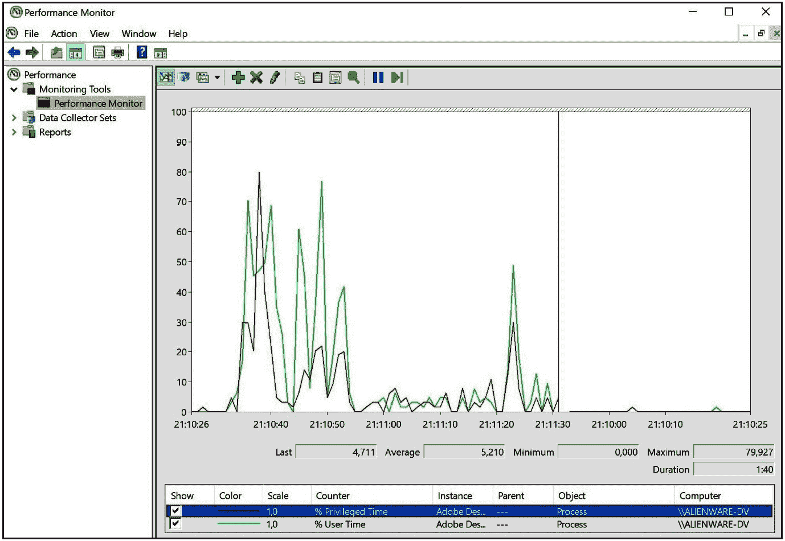
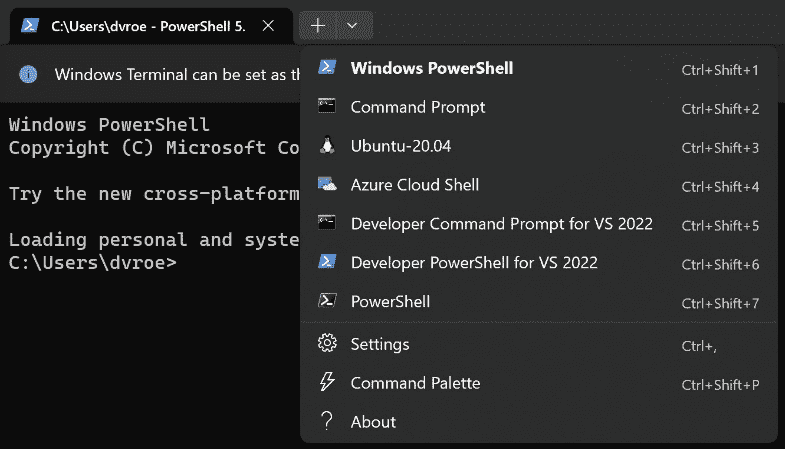

# 前言

当人们想到软件时，大多数人会想到**图形用户界面**（**GUI**）应用程序。软件是用户与之交互的代码。但如今，这已经不再是这样了。所有现代应用程序、网络服务器、网络应用和移动解决方案主要依赖于隐藏的、不可见的系统软件。这是为其他软件构建的软件。它在需要时才会活跃，完成工作后就会进入休眠状态。这些程序是我们生态系统的无名英雄，在后台默默工作。同时，GUI 系统处于聚光灯下。然而，不要低估这些勤奋的系统：它们必须非常快速、可靠和安全。因此，它们对于良好的系统运行至关重要，而且编写起来也很困难。这本书教你所有你需要知道的内容来编写这些应用程序。

# 这本书面向的对象

编写系统软件的人不是初级开发者。理想情况下，你应有几年使用 C#和.NET 开发软件的经验。我不会解释变量是什么，或者 while 循环与 for 循环有何不同。你知道如何使用 NuGet。如果我要求你在 Visual Studio 中将模式从 Debug 切换到 Release，你知道我在要求你做什么。

但我不期望你知道 CPU 使用哪些指令。当我们在书中达到那个点时，我会解释这些。所以现在没有必要深入到那个低层次。

这本书是为那些想要编写系统软件的人准备的。系统软件通常是普通用户看不到的软件。然而，它对于运行在您系统上的完整软件生态系统的良好运行至关重要。

这意味着你必须对运行速度快且稳定的程序充满热情。这也意味着我们编写的软件不是最容易维护的：随着性能的提高，可读性往往会降低。这不是给胆小的人准备的：编写这类软件是硬核开发。但如果你对程序在机器内部深处是如何真正工作的感到好奇，这本书就是为你准备的。

在这里学到的经验当然可以应用于各种项目。性能和稳定性可以惠及所有程序。所以，如果你准备好将你的 C#和.NET 技能提升到下一个层次，请继续阅读！

# 这本书涵盖的内容

*系统编程概述*为背景设定，并解释了系统编程究竟是什么。

*第一章*，*低级秘密那章*，深入探讨了低级 API、BCL 和 CLR，以及如何使用 Win32 API。

*第二章*，*速度至上那章*，探讨了如何使你的软件尽可能快地运行。

*第三章*，*记忆游戏那章*，讨论了内存处理、垃圾回收器以及如何尽可能提高内存效率。

*第四章*，*线程纠缠之处*，探讨了线程和异步编程。

*第五章*，*文件系统编年史之处*，教授输入/输出、文件处理、加密和文件压缩。

*第六章*，*进程低语之处*，讲述了如何在同一台机器或网络上使程序进行通信。

*第七章*，*操作系统探戈之处*，深入探讨了操作系统的服务和如何使用它们。

*第八章*，*网络导航之处*，讨论了您在应用程序中需要了解的所有关于网络的知识，无论是作为服务器还是客户端。

*第九章*，*硬件握手之处*，处理连接外部硬件和与其他设备通信。

*第十章*，*系统检查之处*，讨论了记录和监控您的软件。

*第十一章*，*调试舞蹈之处*，全部关于调试您的软件。

*第十二章*，*安全防护之处*，讨论了您软件的安全性。

*第十三章*，*部署戏剧之处*，教您如何将软件部署到生产机器。

*第十四章*，*Linux 跳跃之处*，讨论了我们大部分软件将运行的操作系统：Linux。

# 为了充分利用这本书

我在这本书中使用 Visual Studio 2022 作为主要的软件开发工具。建议您对此有实际了解，包括创建控制台应用程序、类库和工作者服务。只要您能创建一个默认的工作者服务，您就不需要了解工作者服务是什么。

每一章可能都有您可能想要尝试的软件。您将在相关章节的*技术要求*部分找到详细说明。

| **本书涵盖的软件/硬件** | **操作系统要求** |
| --- | --- |
| Visual Studio | Windows 10 或 11 |

**如果您使用的是这本书的数字版，我们建议您亲自输入代码或从书的 GitHub 仓库（下一节中有一个链接）获取代码。这样做将帮助您避免与代码复制和粘贴相关的任何潜在错误。**

# 下载示例代码文件

您可以从 GitHub 下载这本书的示例代码文件：[`github.com/PacktPublishing/Systems-Programming-with-C-Sharp-and-.NET`](https://github.com/PacktPublishing/Systems-Programming-with-C-Sharp-and-.NET)。如果代码有更新，它将在 GitHub 仓库中更新。

我们还有其他来自我们丰富图书和视频目录的代码包，可在[`github.com/PacktPublishing/`](https://github.com/PacktPublishing/)找到。查看它们吧！

# 使用的约定

在这本书中使用了多种文本约定。

`文本中的代码`: 表示文本中的代码单词、数据库表名、文件夹名、文件名、文件扩展名、路径名、虚拟 URL、用户输入和 Twitter 昵称。以下是一个示例：“其中一个选项是`Share`。我们将其设置为`FileShare.Delete`”。

代码块设置为以下格式：

```cs
using var serialPort = new SerialPort(
    "COM3",
    9600,
    Parity.None,
    8,
    StopBits.One);
serialPort.Open();
try
{
    serialPort.Write([42],0, 1);
}
finally
{
    serialPort.Close();
}
```

任何命令行输入或输出都按照以下方式编写：

```cs
docker tag image13workerfordocker:dev localhost:5000/image13workerfordocker:dev
```

**粗体**: 表示新术语、重要单词或您在屏幕上看到的单词。例如，菜单或对话框中的单词以**粗体**显示。以下是一个示例：“**紧凑对象表示法**：有时，您可以通过将数据智能地组合到其他数据结构中来节省一些内存”。

小贴士或重要提示

它看起来像这样。

# 联系我们

我们始终欢迎读者的反馈。

**一般反馈**: 如果您对这本书的任何方面有疑问，请通过电子邮件发送至 customercare@packtpub.com，并在邮件主题中提及书名。

**勘误**: 尽管我们已经尽最大努力确保内容的准确性，但错误仍然可能发生。如果您在这本书中发现了错误，我们非常感谢您能向我们报告。请访问[www.packtpub.com/support/errata](http://www.packtpub.com/support/errata)并填写表格。

**盗版**: 如果您在互联网上以任何形式发现我们作品的非法副本，我们非常感谢您能提供位置地址或网站名称。请通过 copyright@packt.com 与我们联系，并提供材料的链接。

**如果您有兴趣成为作者**：如果您在某个领域有专业知识，并且您有兴趣撰写或为书籍做出贡献，请访问[authors.packtpub.com](http://authors.packtpub.com)。

# 分享您的想法

一旦您阅读了《使用 C#和.NET 进行系统编程》，我们非常乐意听到您的想法！请[点击此处直接转到该书的亚马逊评论页面](https://packt.link/r/1-835-08268-8)并分享您的反馈。

您的评论对我们和科技社区非常重要，并将帮助我们确保我们提供高质量的内容。

# 下载这本书的免费 PDF 副本

感谢您购买这本书！

你喜欢在路上阅读，但又无法携带你的印刷书籍到处走吗？

您的电子书购买是否与您选择的设备不兼容？

别担心，现在，随着每本 Packt 书籍，您都可以免费获得该书的 DRM 免费 PDF 版本。

在任何地方、任何设备上阅读。直接从您最喜欢的技术书籍中搜索、复制和粘贴代码到您的应用程序中。

优惠不仅限于此，您还可以获得独家折扣、新闻通讯以及每天收件箱中的优质免费内容。

按照以下简单步骤获取优惠：

1.  扫描下面的二维码或访问以下链接


[`packt.link/free-ebook/978-1-83508-268-3`](https://packt.link/free-ebook/978-1-83508-268-3)

1.  提交您的购买证明

1.  那就足够了！我们将直接将您的免费 PDF 和其他优惠发送到您的电子邮件

# 系统编程概述

所以，你想学习.NET 中使用 C#的**系统编程**。至少，我假设你想学习这个；你很可能读了这个书的标题，并决定这是一个好选择。也许你已经涉足系统编程，并想提高这方面的技能。或者，也许你还没有接触过这个主题，并想开始。或者，也许你选错了书。如果是后一种情况，我希望你还有收据，这样你可以退回这本书并得到其他东西。对于所有人：欢迎！

# 让我们定义一下系统编程

在我们深入系统编程的细节之前，我们需要做好铺垫。我们需要对一些事情有一个共同的理解。例如，“系统编程”这个术语到底是什么意思？它是用来做什么的？它是为谁准备的？

让我从定义开始。

*系统编程是系统的编程。这在技术上可能是正确的，但我认为这并不能帮助我们前进。*

让我们分解一下：什么是**系统**？

那个很简单。我们构建系统已经有很多年了，所以我们知道我们所说的**系统**是什么意思。

让我给你展示一个定义：

*系统是一组或排列相关或连接的物品，以便形成一个统一体或有机整体。它是一组相互作用的组件或部分，以实现功能。这个术语在物理学、生物学、计算机科学和商业管理等各个领域都有使用，每个领域都有略微不同的含义。*

很好。但这个定义有点宽泛。我们可能想专注于计算机科学或软件开发。没问题；也有几个定义可以选择：

*系统是一组相互交互以执行特定功能或一系列功能的软件组件。*

这样就更好了。如果我们进一步深入探讨，我们可以区分不同的系统组：

+   **软件系统**：这是一个集成的软件组件集合，它们一起执行特定的功能或一系列功能。这些组件可以是数据库服务器、微服务和一个前端。这些组件构成了完整的系统，例如 CRM 系统、源代码控制系统和其他类似系统。

+   **操作系统（OSs）**：你可能知道什么是操作系统。我认为你看到这个术语太多次了，以至于你甚至没有意识到它是一个系统。但确实是一个包含许多部分和组件的操作系统，如驱动程序、工具、辅助工具和日志。它们共同提供了一个系统，你可以作为用户使用它来运行你的软件，而不依赖于硬件。

+   **分布式系统**：我们通常将网络上松散连接的组件称为分布式系统。每个部分都是相互隔离的，但它们必须协作以实现有价值的目标。例如，Azure DevOps 在 Azure 云中的许多不同服务器上运行。所有组件可能运行在不同的服务器和机器上，这些组件甚至可能运行在世界上的不同部分。然而，它们共同工作，为最终用户提供一个完整的解决方案。

+   **嵌入式系统**：嵌入式系统通常是由硬件和软件的组合。组件之间紧密耦合。开发者通常编写软件以匹配特定的规格，以便最好地使用硬件。例如，想想你车上的系统。如果你有一辆相当新的车，你无疑在车上有一个娱乐系统。在“娱乐系统”这个词中，“系统”这个词有点提示：它由许多不同的组件组成。很可能有一个设备可以从空气中收集电磁波（我们称之为收音机）。该设备连接到一些软件，这些软件解释这些波并将其转换为电信号以供扬声器使用。旁边，一个组件会向你，作为用户，显示你正在听的内容。我确信你可以在你的车上找到很多其他系统，也许在你的电视、手机或冰箱上也能找到。

有更多的例子，但我希望你能看到，一个系统总是由单独的组件组成，这些组件单独使用时没有用处，但结合在一起，可以解决一个问题。

但等等。我们还没有完成。

根据这些定义和例子，你可能会认为系统编程的艺术就是这些系统的编程，你不会错。但通常情况下，系统编程并不是这个意思。我所说的系统编程绝对不是这个意思。

大概、非常粗略地来说，我们可以将软件分为两种类型：

+   **面向用户的软件**：这是一种为人们编写的软件。它有一个用户界面（UI），包括按钮、列表、标签等。人们通过使用各种输入方式与软件进行交互。

+   **面向软件的软件**：这是一种为其他软件设计的软件。由于我们没有用户，所以没有用户界面（UI）。我们可以说是其他组件是用户，但当我提到用户时，我指的是人。面向软件的软件通过 API、RPC（远程过程调用）调用、文件传输以及许多其他方式与其他组件交互。在这个过程中不涉及任何人类。

这本书中我们最感兴趣的第二种类型——软件是为了被其他软件使用的。

## 系统何时是面向用户的，何时不是？

并非总是清楚人们是某些代码的主要用户还是其他进程。我们可以非常严谨地说，任何带有 UI 的东西都是面向用户的；其他一切都是面向系统的。如果我们想要一个明确的定义，这将使生活更容易。然而，在现实世界中，边界往往变得模糊。

让我给你举一个例子。看看这个 Visual Studio 解决方案：



图 0.1：带有计算器项目的解决方案资源管理器

在这里我们有一个非常、非常简单的解决方案。它有一个名为`MyAwesomeCalculator`的主程序，其中包含主代码。这是我们的应用程序的入口点，使用控制台作为 UI。所有逻辑都在`MathFunctions`类库中。这就是魔法发生的地方。

如果我们回到我们对系统编程的定义，我们可以说编写`MathFunctions`类库是系统编程的一部分。毕竟，没有用户会与该库中的类和接口交互。真正使用它的代码是`MyAwesomeCalculator`中的代码。

太棒了！这意味着编写`MathFunctions`库是系统编程！嗯，但别急。如果我们看看解释流程的序列图，我们可能会得出另一个结论。*图 0.2*展示了这个序列图。



图 0.2：我们的计算序列图

正如你在*图 0.2*中看到的，用户启动了一个操作：他们想要将两个数字相加。他们在`Main`类的 UI 中输入它。然后`Main`类实例化`Adder`类的一个实例。在创建之后，`Main`类调用`AddUp(a,b)`方法。结果被传回`Main`类并展示给用户。在这之后，我们可以丢弃`Adder`实例。

太棒了。边界在哪里？如果我们这样看，我们可以说`Adder`中的代码以及因此`MathFunctions`库中的代码与用户操作直接相关。所以，它是面向用户的代码，而不是面向系统的代码。

我仍然喜欢用谁在使用代码的问题来确定我们正在编写什么类型的软件。但显然，这还不够。我们需要深入一点。

`MyAwesomeCalculator`和`MathFunctions`中的代码在单独的组件中。用户与一个组件交互；另一个组件仅通过代码访问。但它们仍然可以被视为一个整体。如果我们运行应用程序，运行时将为我们创建`AppDomain`。

.NET 中的`AppDomain`与.NET Framework 中的`AppDomain`不同。后者有更多方式将代码彼此隔离。这很好，但它是一个典型的 Windows 功能。这不太适合其他平台。因此，为了使.NET 应用程序在其他平台上运行，它们需要重新设计这一点。这导致`AppDomain`比以前不那么限制性。尽管如此，`AppDomain`仍然是不同进程之间的逻辑边界。代码在一个应用程序域中运行，不能直接访问其他应用程序域。

这里，我们又有另一个线索：我们的`MyAwesomeCalculator`应用程序和相关的`MathFunctions`程序集都在同一个`AppDomain`中运行。对于操作系统来说，它们是同一个。由于我们决定实际的人使用`Main`方法，所以这也适用于该特定`AppDomain`中的所有其他代码片段。

让我们稍微重写一下我们的解决方案。请看下面的截图。



图 0.3：带有工作进程的我们的解决方案

我们移除了包含所有工作的代码的类库。相反，我们创建了一个新的项目。这个项目是一个**工作进程**。技术上，我应该保留那个类库并引用它，但我希望保持事情简单。

工作进程是一个始终运行的后台进程（在技术上并不完全正确，但就现在而言，这已经足够了）。它只是坐在那里什么也不做。然后，突然，发生了有趣的事情，它活跃起来，完成工作，然后再次进入空闲模式。

如*图 0**.4*所示，在这种情况下，序列图也有所不同。



图 0.4：新修订架构的序列图

`MyAwesomeCalculator`和`MathFunctionServices`工作进程现在是相互独立的。它们各自在自己的`AppDomain`中运行。当用户想要执行计算时，他们在 UI 中输入，这会调用服务。`Worker`类获取命令，创建`Adder`类的实例，调用`AddUp`方法，然后再次使用结果调用`MyAwesomeCalculator`。

如您所见，所有类之间的调用都是同步的（由实心箭头线表示），除了`Main`和`Worker`之间的调用。这是异步的（由线和开放箭头表示）。

这是有道理的；计算器无法知道命令是否到达或服务是否正在监听。它只是发射并忘记，交叉着数字手指，希望一切顺利。

这更接近了。这确实是编写供其他软件使用的软件（我在这里谈论的是`MathFunctionServices`，而不是`MyAwesomeCalculator`）。

我还没有向你展示`Main`中的代码是如何调用`Worker`的，以及结果是如何从`Worker`流回`Main`的。毕竟，它们位于不同的应用程序域中。因此，它们不能共享内存，对吗？这是正确的。我没有向你展示这一点。但不要担心，我有一些章节专门讨论这个问题。

重要的是要认识到`MathFunctionServices`在通常意义上并没有用户界面。没有用户会触摸这段代码。它在那里，处于休眠状态，直到需要其服务。如果我们将其与第一个例子进行比较，我们会看到差异。第一个例子中，所有代码都是在用户需求下加载的，并且它们以某种方式对用户的操作做出响应。

## 一个更好的定义

因此，如果我们结合所有这些，我们可以确定系统编程是编写能够执行功能或一系列功能但仅与其他组件交互的组件的艺术。

这正是本书的主题。我们将学习如何编写将被其他软件消费的软件。与面向人类的软件相比，这是一种完全不同的看待软件、需求、设计考虑等方面的方式。

为软件编写软件意味着以其他方式思考通信、性能、内存使用、安全性等问题。本书中涵盖了所有这些主题。现在，你可能会说：“等等，为用户编写的软件也应该考虑到性能！”你说得对，但与面向人类的软件相比，软件之间的通信有独特的需求。

后续章节将展示如何实现期望的性能，并解释为什么这一点很重要。让我们达成共识：一个可能每秒被调用数千次的组件，在性能方面需要比一个用户可能每小时点击一次的按钮屏幕投入更多的思考。我在这里夸张了，但我相信你明白了这个观点。

同样的情况也适用于内存消耗。我相信我们始终应该考虑到内存消耗来编写所有软件。然而，一个被许多其他系统频繁使用的组件，往往比其他软件程序更容易受到内存问题的困扰。

当我们思考编写嵌入式系统时，性能和内存压力是至关重要的。嵌入式软件通常在非常有限的硬件上运行，因此我们必须尽力利用书中所有的技巧，使其尽可能快地运行，并尽可能少地使用内存。

正如承诺的那样，我们将花大量时间研究与这类软件通信的方法。

对于我来说，系统编程是软件开发最纯粹的形式。它全部关乎算法、微调，以及尝试书中所有的技巧来最大限度地利用它。系统编程是软件开发的大联盟。当你掌握了这些，你编写的所有其他软件也将从你新获得的知识中受益。你在编写系统软件时所学的知识将变得习以为常，并且你会提高你的整体软件开发技能。这听起来令人兴奋吗？那么，让我们开始吧！

# 在系统编程中使用 C# 和 .NET

我们已经遇到了一个问题。你很可能是 C# 开发者。也许你是 VB.Net 开发者。但无论什么语言，你都是 .NET 开发者。毕竟，这本书就是关于这个的。

传统上，系统编程是在汇编语言、C 和 C++ 中完成的。系统编程一直是那些对所从事的系统了如指掌的硬核开发者的领域。在上个世纪的五十年代初期，人们使用开关编写系统软件。开关处于向上位置表示 1，而处于向下位置表示 0。这些早期的计算机有 8、16 或更多的开关，指向读取或写入的内存地址。然后，8 个开关代表该内存地址的字节中的所有位。在这些开关之上，有一些小灯（不，不是 LED：那个发明发生得晚些）。这些小灯，如果点亮，表示该字节中的 1（如果没有点亮，则表示 0）。这样，你就可以读取该内存地址的内容。

不要担心；这种低级编程不是这本书的主题。如果你感兴趣，有很好的 Altair 8800 复制品，它开启了一家名为微软的公司。你可以用这种方式编程这台计算机：使用前面板上的开关和灯来输入你的软件。这就是比尔·盖茨和保罗·艾伦编写他们第一份软件的方式。但我们有其他工具可以利用。

由于系统软件依赖于高效、快速和内存感知的代码，人们通常使用接近硬件的编程语言。这通常意味着使用机器代码之类的语言——例如我之前提到的开关。汇编语言是另一种使用的语言，尤其是在上个世纪的七十年代和八十年代。C 和后来的 C++ 是其他可以利用硬件特定功能的语言示例。例如，Windows 的大部分代码都是用 C 编写的。

然而，系统开发者并不局限于低级语言。让我给你举一个例子。

## 系统编程的高级语言

在 1965 年，IBM 发布了一本名为《PL/I 语言规范 C28-6571》的手册。这个相对冷门的书名读起来非常有趣：它概述了**PL/I 编程语言**的规范。**PL/I**，即**Programming Language One**的缩写，是一种高级编程语言。它包含块结构以允许递归，许多不同的数据类型，异常处理，以及我们今天视为理所当然的许多其他特性。它确实是一种高级语言。然而，他们用它来编写 IBM 早期操作系统的部分。记住，这是六十年代，当时每毫秒都很宝贵。与现在的系统相比，机器运行得非常慢，所以他们不得不利用书中的每一个技巧来使事情工作。然而，高级语言被认为是合适的。这意味着今天没有理由不使用高级语言，尤其是考虑到内存分析器和编译器的技术优势。

## 内核模式与用户模式

操作系统（OSs）和驱动程序通常不是使用.NET 构建的。原因是驱动程序和操作系统的绝大部分都在内核模式（kernel mode）下运行。

你电脑中的 CPU 可以运行在两种模式下：**内核模式**或**系统模式**和**用户模式**。用户模式是大多数应用程序运行的地方。CPU 通过将应用程序放置在沙盒中来保护应用程序，防止它们使用其他内存或进程空间。处理器通过这种方式处理这一级别的安全性。

然而，内核模式没有这些限制。在内核模式下运行的软件受到的限制较少，控制较少，且更受信任。这是有道理的：操作系统的某些部分应该能够在系统的所有部分运行，包括在其他应用程序的空间中。

然而，要在内核模式下运行，编译的代码需要设置某些标志，二进制文件的布局应该非常具体。这正是我们面临的问题。我们的 C#代码严重依赖于.NET 运行时，而这个运行时不是为在内核模式下使用而构建的。所以，即使我们能够编译我们的代码以便操作系统接受它，由于应用程序没有加载运行时，它仍然无法工作。

有一些方法可以绕过这个问题。有方法可以预编译并将运行时类包含到你的二进制文件中。然后，你可以修改这个二进制文件以在内核模式下运行。然而，结果可能会有所不同，整个过程将是不可靠的。不可靠的代码与设备驱动程序或操作系统部分应该具备的特性正好相反，所以我们不会在本书中涉及这一点。这是一个黑客行为，而不是一种标准的工作方式。

虽然这本书没有涉及内核模式应用程序，但我想要给你一些见解。特别是，因为系统编程通常可以称为“接近金属”的编程，也就是说，我们正在与在内核模式下运行的系统交互。

内核模式是 CPU 的一种模式。系统可以请求 CPU 打开内核模式。如果请求它的代码具有适当的权限，CPU 就会这样做，从而解锁之前不可用的内存部分。代码执行它需要执行的操作，然后 CPU 返回用户模式。由于代码仍然在内存中执行各种操作，所以说一个应用程序是内核或用户模式应用程序是非常错误的。一些应用程序可以将 CPU 切换到那种状态，但应用程序几乎总是以混合模式运行：大多数时间在用户模式，有时在内核模式。哦，当我提到 CPU 时，我指的是**逻辑 CPU**。这种切换发生在那个层面，而不是在芯片本身（但它也可以做到）。

我在我的机器上安装了 Adobe Creative Cloud。我们都知道 Photoshop、Illustrator 和 Premiere，但这些应用程序旨在通过 Creative Cloud 应用程序访问。此应用程序监控系统，并在需要时启动所需的任何应用程序。它还会更新背景，并跟踪您的字体、文件、颜色和其他类似事物。

每当您读到“在后台运行”这样的内容时，您可能会期望有一些系统编程在进行，确实如此。

例如，如果我启动 Adobe 桌面服务进程的`% Privileged Time`和`% User Time`计数器，我会得到这个图像。



图 0.5：性能监视器显示内核和用户时间

在*图 0.5*中，红线显示了 Adobe 桌面服务在用户时间中花费的时间。然而，绿色线显示服务在特权时间中运行的时间，而特权时间只是内核时间的另一种说法。

如您所见，此应用程序在内核时间中做了大量工作。虽然我必须承认，我对它在那里做什么一无所知，但我确信它肯定有很好的理由。

我们将在其他章节中遇到内核模式，但我们将不会构建在其中运行的应用程序。

## 为什么使用.NET？

因此，我们确定我们无法在.NET 中构建操作系统或设备驱动程序。这可能会引发问题：“我们能否使用.NET 进行系统编程？”答案是肯定的。否则，这将是一本非常薄且简短的书。

我们是否应该看看我们最近发现的系统编程的定义？“编写用于其他软件的软件，作为更大系统的一部分，共同实现某个目标。”我简化了这个定义，但它就是这个意思。

从这个角度来看，我们可以使用.NET 来编写这样的软件。更好的是：我敢打赌.NET 是做这件事的最佳选择之一。

.NET 相对于纯 C 或甚至 C++（不是托管类型的 C++，那种仍然是.NET）提供了许多优势。

在过去，当我们使用基于 .NET Framework 的应用程序时，将其用于系统编程是个糟糕的主意。然而，随着最新版本的 .NET 的引入，许多缺点都得到了解决。随着许多缺点被消除，基于 .NET 的系统成为这些类型系统的可行选择。

C 和 C++ 仍然是底层系统代码的优秀语言。然而，C# 和 .NET Core 也有其优势。

此表列出了差异。

| **主题** | **C# 和 .NET Core** | **C/C++** |
| --- | --- | --- |
| 性能 | 与 .NET Framework 相比，.NET Core 的性能有所提高，但由于其运行时，可能仍然存在开销。这对大多数应用程序来说不会是问题，但对于高度性能关键的系统来说可能很重要。 | C/C++ 提供了对硬件的直接控制，并且通过仔细优化，可以在性能关键系统中提供优越的性能。 |
| 内存管理 | .NET Core 仍然提供自动垃圾回收，减少了内存泄漏的机会，但给予开发者的控制较少。这更适合应用级编程。 | C/C++ 允许开发者直接控制内存分配和释放，使其更适合需要精细内存管理的系统编程。 |
| 系统级编程 | 由于其高级抽象和安全功能，某些系统级编程任务在 .NET Core 中可能仍然比较困难。 | C/C++ 通常用于系统级编程，因为它允许直接访问硬件和低级系统调用，这对于内核开发、设备驱动程序等至关重要。 |
| 可移植性 | .NET Core 应用程序可以在多个平台上运行而无需重新编译，但必须在目标机器上安装 .NET 运行时。这比 .NET Framework 有所改进。 | C 和 C++ 代码几乎可以在任何系统上编译和运行，但通常需要仔细管理平台特定的差异。 |
| 运行时要求 | .NET Core 应用程序仍然需要在目标机器上安装 .NET Core 运行时。这可能会限制其在资源有限的系统上的使用。 | C 和 C++ 应用程序编译成机器代码，不需要单独的运行时。这对于系统级应用程序或与资源受限系统一起工作时可能是有益的。 |
| 直接控制 | C# 和 .NET Core 仍然提供许多可以增加生产力的抽象，但这些抽象可能会限制对系统和代码运行方式的直接控制。 | C/C++ 提供了对系统的更多直接控制，允许进行精细调优的优化，并精确控制代码的运行方式。 |
| 社区和支持 | .NET Core 和 C#拥有不断增长的社区和丰富的支持资源，包括跨平台开发。 | C/C++拥有庞大且成熟的社区，许多开源项目以及大量的现有系统级代码。 |

表 0.1：C#和 C/C++的比较

如你所见，两种选择都有其优缺点。然而，大多数.NET Core 的缺点可以通过巧妙的方法和智能编程来消除。这些就是本书剩余部分要讨论的主题。

C#是一种非常成熟且设计精良的语言。其功能远超开发者在使用 C 语言构建，例如 Unix 操作系统时所能拥有的。

## 那么.NET 究竟是什么呢？

.NET Core 是旨在帮助开发者快速完成工作的二十多年老框架的下一个版本。

所有这一切都始于 2002 年的.NET Framework 1。微软将其作为解决开发者面临许多问题的终极解决方案。有趣的事实：该项目内部代号为 Project 42。如果你知道他们为什么选择这个名字，你会得到额外的分数。

在引入后的几年里，我们看到了.NET Framework 的许多不同功能。微软于 2019 年 4 月 18 日发布了.NET Framework 的最后一个版本。

在此之前，微软意识到他们需要支持其他平台。他们希望.NET 能够在任何地方可用，包括 Linux、Macintosh 以及大多数移动设备。这意味着他们必须对运行时和框架进行根本性的改变。他们决定不再为每个平台提供不同的运行时版本，而是选择了一个统一的版本。这成为了.NET Core。微软于 2016 年 6 月发布了这个版本。

.NET Standard 是一套规范。这些规范告诉所有开发者运行时在哪个版本中提供了哪些功能。大多数开发者并不理解.NET Standard 的目的，并假设它又是运行时的另一个版本。但一旦他们理解了其背后的理念，它就变得非常有意义。如果你需要一个特定的 API，查阅文档，看看它支持哪个.NET Standard 版本，然后检查你想要的运行时是否支持该版本的.NET Standard。

这里举一个例子可能会有所帮助。假设你构建了一个在屏幕上执行一些复杂绘图的程序。你之前已经使用过`System.Drawing.Bitmap`，所以你希望再次使用它。然而，你的新应用程序应该在.NET Core 上运行。你能重用你的代码吗？如果你查阅`System.Drawing.Bitmap`类的文档，你会看到以下内容：

| **产品** | **版本** |
| --- | --- |
| .NET 框架 | 1.1, 2.0, 3.0, 3.5, 4.0, 4.5, 4.5.1, 4.5.2, 4.6, 4.6.1, 4.6.2, 4.7, 4.7.1, 4.7.2, 4.8, 4.8.1 |
| .NET 平台扩展 | 2.1, 2.2, 3.0, 3.1, 5, 6, 7, 8 |
| Windows 桌面 | 3.0, 3.1, 5, 6, 7, 8 |

表 0.2：System.Drawing.Bitmap 的支持情况

真糟糕。这个类不是 .NET 标准的一部分。它不是所有运行时都有的。你需要找到另一种方式来绘制你的图像。

你的应用程序也与外部世界进行通信。它使用 `HttpClient` 类，该类位于 `System.Net.Http` 命名空间中。你能将其移动到其他平台吗？再次，我们需要查找该类的文档。在那里，我们看到这个表格：

| **产品** | **版本** |
| --- | --- |
| .NET | Core 1.0, core 1.1, core 2.0, core 2.1, core 2.2, core 3.0, core 3.1, 5, 6, 7, 8 |
| .NET framework | 4.5, 4.5.1, 4.5.2, 4.6, 4.6.1, 4.6.2, 4.7, 4.7.1, 4.7.2, 4.8, 4.8.1 |
| .NET standard | 1.1, 1.2, 1.3, 1.4, 1.6, 2.0, 2.1 |
| Uwp | 10.0 |
| Xamarin.ios | 10.8 |
| Xamarin.mac | 3.0 |

表 0.3: 对 Sstem.Net.Http.HttpClient 的支持

现在更像样子了。`HttpClient` 是 .NET 标准规范的一部分，这意味着所有支持提到的 .NET 标准版本的运行时都实现了这个类。你可以开始了！

## .NET、.NET Framework、.NET 标准——这些都是什么？

*表 0.3* 显示了 .NET Framework、.NET 标准和 .NET，但没有 .NET Core。我们确实看到了 .NET。这究竟是怎么回事？

.NET Core 的引入是为了与 .NET Framework 并行。微软原本打算让 .NET Framework 支持 Windows 设备。然而，正如我解释的那样，微软后来决定支持其他设备、操作系统和其他硬件架构；因此引入了 .NET Core。然后，他们意识到这使事情变得更加复杂。人们失去了对可以使用什么以及在哪里使用的跟踪。这个解决方案是引入 .NET 标准规范，但这使事情变得更糟——甚至那些最初没有困惑的人也失去了对正在发生什么的跟踪。

版本编号也是一个问题。我们有与 .NET Standard 2.1 匹配的 .NET Framework 版本 4.8.1。.NET Core 3.1 也支持 .NET Standard 2.1。许多人不知道发生了什么。他们无法理解为什么 .NET（Core）3.0 版本比 .NET 4.5 更新。

微软也看到了这个问题。他们也有内部问题：他们必须将库中的大量代码回溯，以便在所有地方都可以使用。为了彻底解决这个问题，他们宣布 .NET Framework 4.8 将是最后一个版本。.NET Core 3.1 也将是最后一个版本。从现在开始，所有内容都统一在称为 .NET 的东西中。然后，为了防止编号问题，.NET 从数字 5 开始。

他们还使跟踪新版本发布的时间变得更加容易。每年，都会有新的 .NET 版本。到目前为止，奇数版本处于**长期支持**（**LTS**）状态；偶数版本处于**标准期限支持**（**STS**）状态。STS 为 18 个月，LTS 为 3 年。

.NET 5 是一个短期支持版本，自 2020 年 11 月发布以来，支持已于 2022 年 5 月结束。.NET 6 是一个长期支持版本。于 2021 年 11 月发布，支持将于 2024 年 11 月结束。.NET 7 再次是一个短期支持版本，于 2022 年 11 月发布，生命周期结束于 2024 年 5 月。

在撰写这本书的时候，.NET 8 的预览版已经发布，并且它将是一个长期支持版本。

这本书中我使用的就是这个版本。

现在，版本号是清晰的。发布周期是可理解的。我们终于可以放手了。我们可以专注于构建酷炫的东西，而不是担心版本。

## 编程语言 – 一个需要做出的选择

我们还没有完成。我们已经确定了需要哪个版本的运行时。但是，运行时只是那样：一个运行时。一组我们可以使用的库。这些库提供了许多工具和预构建的类，因此我们不必自己编写这些。这真是太棒了。然而，我们仍然需要自己编写一些代码。我们用编程语言来做这件事，然后链接到库，编译代码，并拥有可以部署和运行的二进制文件。

我们应该使用哪种语言？

微软为我们提供了三种选择。其他人已经创建了他们自己的与 .NET 兼容的语言，但我们忽略它们。如今，编写 .NET 代码的主要语言是 C#、F# 和 Visual Basic。

F# 是一种用于函数式编程的语言。这是一种与大多数人习惯的编程方式不同的方法，但金融领域和数据密集型系统大量使用它。

Visual Basic 是一种非常适合刚开始开发的人使用的语言。在上个世纪的九十年代，它是人们快速构建 GUI 系统的少数几种选择之一。当 .NET 出现时，微软迅速将 Visual Basic 移植到支持这个框架，这样开发者就不需要那么陡峭的学习曲线。然而，随着微软停止与 C# 共同进化，Visual Basic 的使用正在减少。

这本书中我们使用的是 C# 语言。

虽然与可用的运行时不耦合，但微软似乎在发布新的 .NET 版本的同时发布新的语言版本。该语言的第 11 版于 2022 年 11 月发布。当撰写这本书时，C# 的第 12 版现在处于预览阶段。

语言的新版本都有改进，但许多都是语法上的。这意味着如果你不能使用最新的语言版本，你仍然可以使用运行时中的所有功能。它们是官方解耦的。有时，这仅仅需要更多的打字工作。

.NET 运行时是构建各种系统的优秀基础。围绕 .NET 的生态系统非常广泛。接下来，一大群人每天都在为框架做出贡献。很难想象一个不能用 .NET 或可用的数千个 NuGet 包完成的任务。

再次强调，对于真正的内核模式系统，例如设备驱动程序，最好使用非托管语言来构建。然而，对于所有其他用途，.NET 和 C# 是一个极好的选择。

# 现在又是什么呢？

恭喜！你已经迈出了成为系统程序员的第一个步骤。你现在知道什么是系统编程，以及它与你可能习惯的日常编程有何不同。

你了解编程的背景以及我们的前辈所面临的挑战，你也知道为什么.NET 是构建系统软件的如此出色的工具。

我们已经准备好迈出下一步。我们将深入探讨细节。然而，在我们这样做之前，我们需要讨论 API 和.NET 框架，它的优点和缺点。那么，让我们开始吧！

# 设置你的开发环境

我要求你跟我一起做。我要求你打开你的开发环境并做我做的事情。然而，为了做到这一点，你需要设置正确类型的开发环境，这样你才能真正做到我做的事情。

让我来帮你。

我使用**Visual Studio 2022 Enterprise**。我使用企业版的原因没有特别之处，只是因为我机器上有这个版本。还有两个版本：专业版和免费的社区版。所有三个版本都适合我们想要做的事情。然而，企业版确实有一些我们在讨论调试时可能需要的调试工具。当那个时候到来时，我会指出差异，并展示其他实现目标的方法。

其他替代品，如 JetBrains Rider 和 Visual Studio Code 也适用，但当我们进入性能调整和调试时，你可能需要自己做更多的工作。再次提醒，当我到达那里时，我会告诉你这些信息。

我对 Rider 的经验有限，所以不能确切地告诉你你需要做什么，但我确信当你成为一名经验丰富的开发者时，你可以将我展示的内容翻译成你熟悉和喜爱的工具。

使用你所拥有的和所知道的一切。我对此很满意。

如果你决定使用我强烈推荐的 Visual Studio，你应该使用 2022 版本而不是 2019 版本。.NET 和 C#的最新版本提供了许多与性能调整和内存优化相关的功能。这些版本仅在 Visual Studio 2022 版本中可用。所以，确保你的设备上有这个版本。

此外，我们还将进行大量的控制台操作。这意味着使用 PowerShell：使用`cmd.exe`的日子已经过去了。

我强烈推荐下载 Windows Terminal。有了终端，你可以拥有各种控制台。我们大部分时间会使用 PowerShell，但当我们谈到 Linux 时，我们会使用 WSL 功能来将我们的机器作为 Linux 机器使用。

下载和安装终端非常简单：你可以在 Microsoft Store 中找到它。

确保还安装了 Windows Subsystem for Linux。有关如何操作的说明在网上到处都是；我不会在这里重复。

一旦你安装了所有你喜欢的工具，你可以在你的终端中选择其中任何一个。我的看起来像这样：



图 0.6：不同壳的 Windows Terminal

如你所见，我已经安装了 **PowerShell**、**命令提示符**、**Ubuntu**、**Azure Cloud Shell** 以及一些其他的东西。选择其中之一只需点击一下。

在 Linux 和 Windows 之间切换从未如此简单！

我们稍后会使用的一个工具是 **WinDbg**。WinDbg 是一个功能极其强大的外部调试器。它可以提供大量关于你感兴趣进程的信息。它独立运行，因此你不需要将 Visual Studio 附加到进程上。它有 X86 和 ARM 两种版本，因此可以在许多设备上使用。你可以在微软网站上找到 WinDbg，网址是 [`learn.microsoft.com/en-us/windows-hardware/drivers/debugger/`](https://learn.microsoft.com/en-us/windows-hardware/drivers/debugger/)。下载并安装它。WinDbg 可能会成为你最新的最佳拍档之一。

接下来，你可能想安装 **PerfView**。这是一个来自微软的免费开源性能监控工具，专门为分析 .NET 应用程序的性能而构建。

你可以在 [`github.com/Microsoft/perfview`](https://github.com/Microsoft/perfview) 找到源代码。你可以下载源代码自行构建工具，或者获取预构建版本。这些版本也在同一个网站上。我建议你自己构建并查看源代码：这里有如何构建此类软件的一些极好的示例。我并不打算描述工具的内部工作原理，但我会讨论性能时使用它。

现在，你只需要一杯你最喜欢的饮料，我们就可以出发了！
