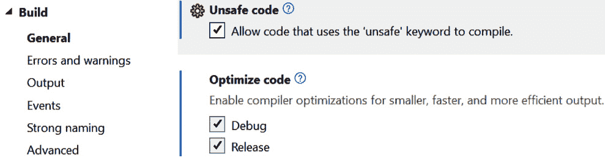

# 2

# 速度至上的那一章

*为性能而写作*

大多数用户都认为应用程序永远不会足够快。每次你与人谈论软件中的烦恼，无论是性能还是缺乏性能，它都是排在最前面的一个问题。

这是有道理的：我们都很忙，我们当然不希望浪费时间等待机器赶上我们。它必须反过来！

但如果你仔细想想，你会意识到计算机在合理的时间内做任何事情都是一个奇迹。如果你觉得自己很忙，看看计算机需要做的一切！你可以进行以下实验：

1.  重新启动你的电脑。

1.  登录。

1.  启动（如果你使用的是 Windows）任务管理器（提示：使用*Ctrl* + *Shift* + *Esc*组合键）。

1.  看看在“后台进程”部分有多少事情在进行。

所有这些进程都是系统编程的例子。它们都在那里帮助系统完成其工作或帮助面向用户的软件完成任务。而且有很多这样的进程。这些进程都占用一点 CPU 时间、一点网络资源和一些内存。大多数都是休眠状态，只是在等待有趣的事情发生，但它们仍然存在。它们从面向用户的软件中夺取资源。

我想这很清楚：系统软件需要尽可能小和快，以便为系统的其余部分——即用户关心的部分——留下足够的资源。下一章将讨论如何使其尽可能小（或内存效率尽可能高）。

在本章中，我们将涵盖以下主题

+   为什么速度很重要？

+   **公共类型系统**（**CTS**）是什么？

+   值类型和引用类型之间的区别是什么？

+   封箱与性能有什么关系，它到底是什么？

+   如何选择合适的数据结构和算法，以尽可能快地完成任务

+   字符串是如何工作的，我们如何使它们更快？

+   不安全代码是什么，我们如何安全地处理它？

+   一些有助于加速的编译器标志

总结来说，本章将向您展示如何使您的系统尽可能快。所以，系好安全带；我们即将加速！

# 技术要求

你可以在以下链接中找到本章的所有代码：[`github.com/PacktPublishing/Systems-Programming-with-C-Sharp-and-.NET/tree/main/SystemsProgrammingWithCSharpAndNet/Chapter02`](https://github.com/PacktPublishing/Systems-Programming-with-C-Sharp-and-.NET/tree/main/SystemsProgrammingWithCSharpAndNet/Chapter02)。

# 设置舞台

到目前为止，我们已经确定我们需要尽可能多的性能来允许其他系统完成它们的工作。但还有其他原因你可能想要优化你的代码：

+   可访问性

+   域名托管费用

+   计划性淘汰

+   能耗

让我们逐一检查这些内容。

## 可访问性

每当我提到软件的可访问性时，软件开发者通常都会想到使软件对有身体挑战的人可用。我喜欢更广泛地思考。并不是每个人都能负担得起最新和最快的硬件。许多人需要使用较旧、较慢的机器。假设您的代码使这台已经缓慢的机器变得更慢。在这种情况下，您可能要为这些人无法再使用设备负责。

其他人在共享设备上使用。这些设备通常在机构中找到，有多个人使用这些设备，每个人都添加他们的软件。如果您的软件使机器变慢，这会影响所有人。

## 域名托管费用

如今，越来越多的软件在云端运行，在这种情况下，您必须按使用量付费。如果您的软件需要大量的计算能力来运行，它可能会增加成本。当累积起来，每一次性能损失都会影响每月的云服务提供商账单。

## 计划性淘汰

机器有财务寿命和经济寿命。这些寿命决定了公司何时决定更换设备。财务寿命的计算很简单：当组织购买一台机器时，会计师会告诉您在多少年后其价值变得太低，不值得保留。他们会计算每年的折旧，并在他们的电子表格中记录下来。我在这里简化了一些事情，但我也不是会计师。

经济寿命的计算比较困难。这个寿命通常是指机器变得如此不可用，以至于不再值得升级或投资的时候。一台变得太慢无法使用的电脑应该被更换，即使其财务寿命尚未到期。

您的软件可能会导致这种情况发生。如果您的性能太低，组织可能会比预期更早地报废机器。这会导致大量的电子废物：性能良好的电脑仅仅因为软件编写得不够完美而被更换。

## 能耗

使用更多的 CPU 功率意味着使用更多的电力。您可能会认为这不会造成太大的差异，但最终，全球所有这些机器消耗了大量的能源。尽可能高效地编写您的代码可以节省电力消耗，并有助于环境保护。就这么简单。

性能可以在很多地方得到提升，甚至在您处理谦逊的整数时也是如此。让我们来讨论一下！

# 哪个整数是最快的？

选择正确的整数类型可能会影响您系统的性能。我并不会对此过于担心：CLR 在优化您的代码方面做得相当不错，并且对于遍历代码片段的 `for` 循环也是如此。如果我们有不到 255 次迭代，我们可能会倾向于使用字节。毕竟，一个字节只是 1 字节。如果您使用整数，它将是 4 字节。这意味着更多的内存，并且可能需要更长的时间来处理，对吧？

错误！

不要试图欺骗编译器。它对系统的了解比你多得多。

让我给您展示一下。

我们有以下四行 C# 代码：

```cs
var a = byte.MaxValue;
var b = UInt16.MaxValue;
var c = UInt32.MaxValue;
var d = UInt64.MaxValue;
```

我们将四个变量设置为一些值。下表描述了每种类型的详细信息：

| **C# 类型** | **简称** | **描述** | **MaxValue (十六进制)** |
| --- | --- | --- | --- |
| System.Byte | byte | 一个字节 | 0xFF |
| System.UInt16 | ushort | 无符号 16 位整数 | 0xFFFF |
| System.UInt32 | uint | 无符号 32 位整数 | 0xFFFFFFFF |
| System.UInt64 | ulong | 无符号 64 位整数 | 0xFFFFFFFFFFFFFFFF |

表 2.1：具有最大值的数值类型

让我们来看看编译器是如何处理这些代码的。如果你想亲自查看，请在 Visual Studio 中创建一个新的 C# 控制台程序（使用 .NET 7 或 .NET 8），使用顶层语句，并复制这四行。然后，在第一行设置一个断点并运行它。一旦你触发了断点，按 *Ctrl* + *K*，*G*。这样做会打开反汇编器。

你会得到类似这样的结果（我已经删除了一些对我们来说不是很有用的代码）：

```cs
01: # var a = byte.MaxValue;
02: 00007FFF956076EE  mov         dword ptr [rbp+3Ch],0FFh
03: # var b = UInt16.MaxValue;
04: 00007FFF956076F5  mov         dword ptr [rbp+38h],0FFFFh
05: # var c = UInt32.MaxValue;
06: 00007FFF956076FC  mov         dword ptr
[rbp+34h],0FFFFFFFFh
07: # var d = UInt64.MaxValue;
08: 00007FFF95607703  mov         eax,0FFFFFFFFh
09: 00007FFF95607708  cdqe
10: 00007FFF9560770A  mov         qword ptr [rbp+28h],rax
```

我知道我承诺我们不会进行汇编编程，但如果你想让你的代码尽可能快地运行，你需要知道发生了什么。让我带你了解一下。

第 1、3、5 和 7 行是注释行，显示了导致这些汇编代码的 C# 代码。

在第 2 行，我们可以看到当我们要将值设置到变量中时 CPU 处理的代码。实际的命令是 MOV，意思是移动。它然后接受两个参数。第一个是 MOV 的目标，第二个是值。有几种类型的 MOV 命令；这个特定的命令移动一个 DWORD。在 Win32 中，DWORD 代表 Double Word，我们知道它是一个无符号 32 位整数。我们将硬编码的值 `0FFh`（十进制中的 255）移动到 `[rbp+3Ch]`。如果你想知道，`rbp` 是栈指针。因此，我们将我们的值 `0xFF` 移动到我们的栈上的 3C 位置。

很好。我们应该知道值类型是放在栈上而不是堆上的。如果你没有意识到这一点，不要担心。下一章将全部关于内存。现在，只需接受我们有两种内存：一个小但快速的栈和一个慢但巨大的堆。这个字节将放在栈上。

第 4 行将 `0xFFFF` 移至 `[rbp+38h]`。再次强调，我们在这里移动的是一个 `DWORD`。

第 6 行大致做了同样的事情：我们将 `0xFFFFFFFF` 移至堆栈。再次强调，它是一个 `DWORD`。

当编译时，一个字节、一个 `UInt16` 和一个 `UInt32` 被视为一个 `DWORD`。它们之间没有区别。如果你查看汇编代码，你无法知道 C# 希望使用哪种类型。这意味着在使用 8 位字节或 32 位无符号整数时，性能上没有区别。如果你想知道，有符号 32 位整数看起来相同，区别在于 `Int32.MaxValue` 是 `UInt32.MaxValue` 的一半。然而，编译后的代码是相同的。

看看代码，将 64 位整数复制到栈上的操作完全不同。在第 8 行，我们将`0xFFFFFFFF`移动到一个寄存器（寄存器是 CPU 内部的一个特殊内存区域，用于存储临时变量）。然后，我们调用 CDQE。这会将 EAX 寄存器（可以存储 32 位）中的内容复制到`RAX`寄存器，它可以存储 64 位。然后，在第 10 行，它将内容的前 32 位复制到栈上。

正如你所见，将变量设置为`Int64.MaxValue`比其他三个变体要复杂得多。它要慢得多：CPU 需要做更多的工作。

然而——这很重要——这并不总是这种情况。这是我现代的、强大的 64 位 Windows 11 机器上的情况。在运行 Linux 的 ARM 处理器的低功耗 Raspberry PI 上，事情可能完全不同。这就是系统编程的一个挑战：你必须了解类型的行为才能获得最高的性能。

我认为现在是讨论 CTS 的时候了。

# CTS

CTS 是一组描述.NET 程序中使用的类型的规则。仅此而已。没有二进制操作正在进行；它只是一组规则——一个编译器、语言和运行时必须遵守的标准。

在.NET Framework 上可用的语言有多种。微软有 C#、VB.Net 和 F#。他们还提供了 J#，这是一个在 CLR 上运行的 Java 变体。你还可以用 C 或 C++编写.NET 程序。其他供应商也提供了你可以选择的语言和工具。例如，考虑 IronPython 或 Delphi.NET。

所有这些语言都必须遵守规则。编译器必须生成 IL 代码（再次强调，IL 看起来像汇编语言，但并不是）。然后 JIT 编译器将 IL 转换为 CPU 可以理解和运行的机器代码。

CTS 中有一组被称为`[assembly:` `CLSCompliant(true)]`属性的规则子集。

我们在这里的目标不是设计语言，所以我们不会深入探讨这个问题。

在.NET 语言中使用的所有类型都必须遵守 CTS 规则。这本书不是关于学习.NET 编程的。然而，如果你是系统程序员，了解内部工作原理是至关重要的。在这里，我们将仅介绍 CTS 的要点。

## 值类型和引用类型

在本章的后面部分，我会更详细地讨论值类型和引用类型。在这里，我只想简单地说，值类型直接持有它们的值。相比之下，引用类型是指向内存中其他位置的值的指针。

## 类和结构体

基于.NET 的语言应该是面向对象的。从这个意义上说，这些语言应该支持类。这些类也必须具有特定的特征。

**类**应该具有可见性。它们可以是公共的、内部的、受保护的或私有的。我们都知道这些分类符的含义。

类有方法、属性、字段、委托等。这些项可以是私有的、受保护的或公共的。你可能已经知道所有这些；我无需解释这些是什么。

然而，许多开发者都在**结构体**上遇到困难。对于旁观者来说，它们或多或少是相同的。是的，它们确实相似。它们都可以有方法、属性、字段等。它们都可以实现接口。它们都可以有静态成员。

类和结构体之间的区别更有趣。首先，类实例存在于堆上，你会得到一个存储在栈上的指针。然而，结构体存在于栈上。

由于“持有”类的变量是指向存储数据的堆内存的指针，因此该变量可以是 null。在这种情况下，它指向空；它只是该类未来实例的一个占位符。

结构体不能为 null。有一个边缘情况：可空类型，如`MyStruct?`可以是 null，但这正是可空类型的目的。结构体不能相互继承。尽管如此，它们可以像类一样实现接口。这也意味着你不能有一个“抽象”或“密封”的结构体。这两个修饰符是为了必须继承的类而设计的。由于我们不能从结构体中继承，这没有意义。

看到这里，你可能会认为类是一个更好的选择：与结构体相比，使用它们的缺点很少，优点很多。你并没有错。但是，结构体相对于类有一个显著的优势：它们在栈上初始化，而不是在堆上。正如我之前所说的，栈比堆快得多。由于我们追求最大性能，我们的应用程序中使用的结构体比其他地方多得多。

## 浮点数

我们已经看到，对于大多数情况，你使用的整数类型并不重要。UInt64、Int64、UInt128 和 Int128 通常比其他类型慢，所以只有在你经过深思熟虑并决定你需要它们时才使用它们。

然而，对于浮点数来说，情况略有不同。在 CLS 和 C#中，我们有三种浮点数类型。请查看以下表格，以了解它们是哪些：

| **类型** | **C# 类型** | **描述** |
| --- | --- | --- |
| float | `System.Single` | 32 位单精度浮点数 |
| double | `System.Double` | 64 位双精度浮点数 |
| decimal | `System.Decimal` | 128 位的十进制类型更精确，但范围比双精度浮点数小 |

表 2.2：浮点数类型

你选择哪种类型取决于你的场景。如果你需要比 float 更精确的精度，你必须选择十进制。这将是显而易见的。但是，如果你不需要十进制提供的 128 位精度，事情就会稍微复杂一些。

在 64 位机器上，双精度浮点数（`System.Double`）是最快的浮点数。CPU 可以原生理解它，因此不需要转换。从性能角度来看，这是你的最佳选择。然而，单精度浮点数（`System.Single`）在内存效率上更高。然而，这只在 64 位机器上成立。如果你针对其他平台，结果可能会有所不同。例如，如果你想在基于 ARM 的设备（如 Raspberry Pi）上运行你的代码，你会发现 CPU 优化了浮点类型。因此，如果你关心性能，最好使用单精度版本。再次强调，如果你的用例需要更高的精度，请使用其他类型之一。毕竟，它们的存在是有原因的。

# 类型存储的位置——值类型和引用类型之间的差异

CTS 中的类型可以是值类型或引用类型。了解这两种选项之间的差异至关重要。值类型在栈上操作，而引用类型在堆上存在。位于栈上的内容通常比堆上的操作要快得多。

从这个角度来看，你可能会认为在栈上使用值类型是获得期望的良好性能的最佳方式。不幸的是，事情并非如此。引用类型的存在是有原因的，如果使用得当，它们可以给你带来显著的性能提升！

## 栈和堆

在讨论值类型和引用类型之间的差异之前，我们需要快速看一下栈和堆之间的差异。我已经提到栈比堆快但更小。这是真的，但还有更多内容。

下表显示了两种内存类型之间的差异：

| **特性** | **栈** | **堆** |
| --- | --- | --- |
| 分配/释放 | 快速，编译时 | 慢速，运行时 |
| 生命周期 | 限于作用域 | 超出作用域 |
| 大小限制 | 较小，固定大小 | 较大，动态大小 |
| 数据类型 | 值类型（通常） | 引用类型 |
| 行为 | 确定性 | 非确定性 |
| 碎片化 | 无 | 可能 |
| 线程 | 线程特定 | 在线程之间共享 |

表 2.3：栈内存和堆内存之间的差异

栈变量的内存分配是在编译时完成的，内存被推入和弹出栈。这使得分配和释放非常快。对于堆变量，内存是在运行时动态分配的。

然而，栈上变量的生命周期仅限于函数的作用域或代码块。一旦你的代码不再需要该变量，例如，因为你到达了 `for` 循环的末尾，该变量的内存将自动释放。对于堆，当它不再需要时，由你或垃圾回收器来处理内存的释放。

栈较小，你更有可能耗尽栈内存而不是堆内存。堆内存可以非常大，尤其是与栈内存相比。

如果你想知道那个堆栈有多大，答案是，“这取决于。”你甚至可以自己指定它。由于堆栈与线程相关联，你可以在使用新线程时设置堆栈大小：

```cs
// Create a new thread with a stack size of 1 MB
var thread = new Thread(new ThreadStart(ThreadMethod), 1024 * 1024);
thread.Start();
```

在这里，我们创建了一个新的线程，并给它一个`1 MB`的堆栈。这很容易确定！如果你想限制线程使用的内存量，你可以估计你需要多少，并以此方式分配它。

顺便提一下，大多数开发者都知道[`StackOverflow.com`](https://StackOverflow.com)。奇怪的是，我遇到了很多不知道这个名字来源的开发者。

当你创建一个具有给定堆栈大小的线程，但尝试使用比可用更多的内存时，你会得到一个`StackOverflowException`错误。这就是这个名字的由来。

让我给你展示。哦——不要在生产代码中使用这个。这个示例只是为了说明目的：

```cs
try
{
    Recur();
}
catch (StackOverflowException e)
{
    Console.WriteLine($"Oh oh.. {e.Message}");
}
return;
static void Recur()
{
    Recur();
}
```

前面的代码调用了一个递归函数，它只做一件事：它调用自己。当你调用一个函数或方法时，系统会存储函数结束时返回的地址。系统将这个返回地址存储在堆栈上。毕竟，这是短暂的，需要快速。你希望在函数调用后继续你的常规流程。

但这段代码除了反复调用一个函数并且从不从中返回之外，什么也不做。因此，返回地址被添加到堆栈上数千次，直到内存耗尽，然后你会得到那个著名的`StackOverflowException`错误。

如果你想要尝试这个，请在单独的线程中运行前面的代码，并给它不同的堆栈大小。这样做将给你一个关于正确堆栈大小有多重要的影响的概念。

# 封箱和拆箱

到目前为止，事情看起来相当简单。值类型存在于栈上；引用类型存在于堆上。一个整数是值类型；因此，它在栈上。你定义的类在堆上，因为它是引用类型。如果你想使你的类运行得更快，你可以将其转换为结构体，并且可以更快地访问它，因为它位于栈上。你可能认为这很简单，但你会错的。事情可能比这复杂得多。

让我们看看我们的好朋友，整数。一个整数是一个整数，所以它没有小数点。正如我们之前看到的，我们有几种整数的变体。我们有 16 位、32 位、64 位，甚至 128 位版本。我们还有有符号和无符号版本。我们甚至有一个字节：从技术上讲，它不是一个整数，但由于它编译为 DWORD，我们可以将其归入同一类别。整数是值类型，所以它位于栈上。然而，如果你看*表 2.1*，你会看到整数的官方名称是`System.Int32`。我不知道你是否如此，但这看起来像是一个类或结构体的名称。

结构体仍然位于栈上，但与简单的整数相比，它的性能可能不如你预期的那么好。幸运的是，编译器帮助我们处理这个问题。正如我们之前看到的，编译器将我们的整数转换为 DWORD，所以没有性能损失。但有时，事情会有所不同。因此，我们需要讨论装箱和拆箱。

C# 是一种真正的面向对象的语言。这意味着一切都是对象，并且所有对象都从基类派生。在顶级，有一个基类是所有其他类的祖先。那就是 `System.Object`。我们的整数也不例外：`System.Int32` 结构体从 `System.ValueType` 类派生，而 `System.ValueType` 类又是 `System.Object` 的后代。所以，我们仍然遵循面向对象的原则。尽管如此，这里似乎有类和结构体的混合。不用担心；这些都是语义问题，编译器在需要时处理它们。

“处理”有时意味着运行时将值类型转换为引用类型，或者相反。这就是我们所说的装箱和拆箱。

当系统将值类型转换为引用类型时，就发生了装箱。将引用类型转换为值类型则称为拆箱。可以这样想，将我们的值类型放入一个形状为类的盒子中，或者如果你选择相反的方向，再将其从盒子中取出：

```cs
int i = 42;
object o = i; // Boxing
int j = (int)o; // Unboxing
```

第一行声明了一个简单的 32 位整数，并给它赋值。我们之前见过；这是一条相对简单且快速的指令。在汇编中，我们将一个硬编码的值移动到栈上的 DWORD 位置。

我们想要复制它，但这次我们使用对象而不是整数。由于 `System.Int32` 从 `System.Object` 派生（中间是 `System.ValueType`），你可能不会期望这需要太多工作。最终，我们仍然有一个整数。但事情更复杂。再次，让我们看看汇编代码。为了清楚起见，你不需要了解汇编，但如果你知道底层发生了什么，更容易理解如何获得最佳性能。

在这里，`object o = i` 翻译成相当多的代码：

```cs
1: object o = i; // Boxing
2: 00007FF9625E76F1  mov         rcx,7FF96254E8D0h
3: 00007FF9625E76FB  call        CORINFO_HELP_NEWSFAST (07FF9C20D0960h)
4: 00007FF9625E7700  mov         qword ptr [rbp+20h],rax
5: 00007FF9625E7704  mov         rdx,qword ptr [rbp+20h]
6: 00007FF9625E7708  mov         ecx,dword ptr [rbp+3Ch]
7: 00007FF9625E770B  mov         dword ptr [rdx+8],ecx
8: 00007FF9625E770E  mov         rdx,qword ptr [rbp+20h]
9: 00007FF9625E7712  mov         qword ptr [rbp+30h],rdx
```

我不会解释这里发生的每一件事，但这里有很多动作。然而，第 3 行是重要的：`CORINFO_HELP_NEWSFAST` 是 CLR 中的一个方法，它在堆上分配内存。是的，堆。不是栈。这就是我们所说的非常昂贵的操作：它需要相对较长的时间。之后，发生了很多复制，所有这些都需要时间。

将这个与不经过装箱将整数变量复制到另一个整数变量进行比较：

```cs
1: int j = i;
2: 00007FF9625B7716  mov         eax,dword ptr [rbp+3Ch]
3: 00007FF9625B7719  mov         dword ptr [rbp+2Ch],eax
```

这段汇编代码将变量 `i`（在 `[rbp+0x3C]` 内存位置中的值）移动到 eax 寄存器。然后，它将该寄存器的内容转移到 `[rbp+0x2C]`，那里是新的变量 `j`。

这只是两个快速移动调用，从栈到寄存器（非常快）和从寄存器回到栈。这几乎不花时间。

从堆到栈的转换似乎更快，因为这里进行的编码更少。在这里，`int j = (int)o`导致拆箱。这段代码的汇编代码如下：

```cs
1: int j = (int)o; // Unboxing
2: 00007FF9625F7726  mov         rdx,qword ptr [rbp+30h]
3: 00007FF9625F772A  mov         rcx,7FF96255E8D0h
4: 00007FF9625F7734  call        qword ptr [CLRStub[MethodDescPrestub]@00007FF9625EB8D0 (07FF9625EB8D0h)]
5: 00007FF9625F773A  mov         eax,dword ptr [rax]
6: 00007FF9625F773C  mov         dword ptr [rbp+2Ch],eax
```

这段汇编代码没有那个昂贵的内存分配调用。这是有道理的：栈不需要这个。栈有固定数量的内存，所以如果需要，你可以使用它。如果你用完了它，你会得到我们之前看过的`StackOverflow`异常。其余的只是移动数据。这里仍然有比我们复制两个整数时看到的更多的代码。但看起来并不那么糟糕，不是吗？

不要被骗：如果我们决定从现在开始使用`j`变量而不是再使用`o`，它可以从堆中移除。垃圾回收器会处理这件事，所以你不必担心。但是垃圾回收器也会带来很多性能损失。垃圾回收器是另一章的主题，但请放心，它可能会成为巨大的性能瓶颈。这一点从这段代码中并不明显。这里还涉及一些隐藏的成本。

## 隐藏的装箱和拆箱

将值类型，例如整数，复制到引用类型会导致装箱。如果你能避免这种情况，你应该这样做。但有时，装箱和拆箱会在你意想不到的时候发生。看看下面的代码：

```cs
internal void DoSomething()
{
    int i = 42;
    DoSomethingElse(i);
}
internal void DoSomethingElse(object o)
{
    Console.WriteLine(o.ToString());
}
```

这里，我们在`DoSomething()`中声明了一个整数`i`。然后，我们用这个整数调用`DoSomethingElse()`。`DoSomethingElse`的原作者试图编写可重用的代码。因此，他们决定接受`System.Object`作为参数。由于最终一切都是从这个派生出来的，这似乎是个好主意。但这并不正确。在这里，`i`在传递给`DoSomethingElse`之前会被装箱，并伴随着装箱时发生的性能损失。

如果开发者能像这样编写方法会更好：

```cs
internal void DoSomething()
{
    int i = 42;
    DoSomethingElse(i);
}
internal void DoSomethingElse<T>(T o)
{
    Console.WriteLine(o.ToString());
}
```

这里，我们不是接受一个对象，而是接受一个泛型类型。由于我们将其作为整数传递，编译器理解这是一个值类型，并且不会将其转换为对象。这里没有发生装箱。这段代码比之前的版本要快得多。

这行代码怎么样？

```cs
int i = 42;
string message = "Hello Integer " + i;
```

这看起来很简单。但再次强调，这里发生了装箱。在字符串连接之前，`i`变量首先被装箱为引用类型。

下一个也是不错的：

```cs
var list = new ArrayList();
list.Add(i); // boxing!
int j = (int)list[0]; // unboxing!
```

值类型是通常位于堆上的引用类型的一部分。因此，它们需要装箱。获取这些值将导致拆箱。

将值类型移动到引用类型会导致这种行为。看看下面的代码：

```cs
IComparable i = 42;
```

这看起来是安全的，对吧？我们并没有进行转换；我们只是声明我们对整数的一部分感兴趣，这部分属于`IComparable`接口。`System.Int32`结构体实现了很多接口，这恰好是其中之一。尽管如此，它仍然是一个结构体，所以一切应该都很好。

让我们快速看一下那个简单的 C#代码行的相关汇编代码：

```cs
1: IComparable i = 42;
2: 00007FF9625E76F1  mov         rcx,7FF96254E8D0h
3: 00007FF9625E76FB  call        CORINFO_HELP_NEWSFAST (07FF9C20D0960h)
4: 00007FF9625E7700  mov         qword ptr [rbp+20h],rax
5: 00007FF9625E7704  mov         rax,qword ptr [rbp+20h]
6: 00007FF9625E7708  mov         dword ptr [rax+8],2Ah
7: 00007FF9625E770F  mov         rax,qword ptr [rbp+20h]
8: 00007FF9625E7713  mov         qword ptr [rbp+30h],rax
```

你现在应该已经认识到了这一点，特别是对`CORINFO_HELP_NEWSFAST`的调用。这是装箱操作。当使用`IEquatable<int> = 42`行时，也会发生同样的事情。尽管我们现在使用泛型，但我们仍然会遇到装箱。

让我们再看一个例子。这个例子有点愚蠢：

```cs
object myString = "some string";
var stuff = true ? 42 : myString;
```

这里，我们有一个字符串，我们将其分配给一个对象，`myString`（这不是愚蠢的部分）。然后，我们根据`true`为真（它总是为真；这是愚蠢的部分）将某个东西分配给`stuff`。如果`true`为真，我们将`42`分配给`stuff`。如果不为真，我们将`myString`复制到`var`。乍一看，你可能会期望`stuff`是`int`类型，因为`true`总是为真。但静态类型语言并不是这样工作的。它需要在编译时知道`stuff`的类型。条件运算符`? :`期望两边是等效类型。因此，它决定一部分是对象，并将整型文字转换为对象。因此，它将`42`装箱到对象实例中，而这里的`stuff`是另一个对象实例。这就是你所看到的：更多的装箱。

装箱和拆箱允许你混合和匹配值类型和引用类型。否则编写可重用代码会很困难。但要注意这一点，并注意装箱和拆箱相关的成本。它发生在你可能没有意识到的地方。这导致性能不佳。

# 选择合适的数据结构和算法

面向对象编程的全部内容就是将数据和该数据上的操作在一个紧密且松散耦合的结构中放在一起。这正是类和结构体所做的事情：它们将两者结合起来。这样，你可以以对系统功能有意义的这种方式定义你的数据结构。

但是，当谈到性能时，其他因素也会发挥作用。拥有静态类通常是一个你必须避免的代码问题。然而，它们运行得很快。你不需要实例化任何东西，从而避免了分配堆内存的昂贵调用。而且，这些内存不需要由垃圾回收器稍后清理。

当然，如果你为那个类有成员变量，你不妨实例化它。最终，所有发生的事情就是那些变量最终出现在堆上（附带一点家务）。方法本身是应用程序代码的一部分，并且以不同的方式存储。

BCL（Base Class Library）也有许多类和数据结构可以用来存储数据。其中一些更适合高性能。你选择哪一个取决于你的用例，但我认为如果这意味着你可以使用更有效的类，写一点更多的代码是值得的。

## 数组、列表和链表

**数组**、**列表**和**链表**都是你可以用来按顺序存储数据的结构。这些数据也存储在堆上。是的，你读得对。看看以下两行代码：

```cs
int i = 42;
int[] r = { 42 };
```

第一行是一个简单的赋值操作。系统将硬编码的值`42`（十六进制中的`0x2A`）复制到一个 DWORD 中，并将其存储在栈上。第二行创建了一个新的数组，在堆上为它分配内存，初始化数组，然后将`42`复制到第一个位置。

再读一遍，并尝试猜测是否有任何装箱操作在进行。

你可能期望有，但这里没有装箱。数组持有指向堆中包含单个 DWORD 值的内存位置的指针。它知道每个值有多长（精确到 32 位），因此它可以直接移动值而不做任何改变。此外，从数组中取出一个元素并将其存储在局部变量中时，不会发生解箱。系统复制 DWORD 值并保持原样。

列表与数组相同。内部，数据存储在一个数组中。然而，列表提供了动态调整大小的选项。除此之外，它还有一些很好的方法，如`Add()`、`Remove()`和`IndexOf()`，这些方法可能非常有帮助。但没有什么是不需要付出代价的：这些方法需要时间来执行，动态重新分配在性能方面非常昂贵。你必须判断你是否需要这些额外的方法和动态重新分配。如果你需要，使用列表。如果你可以不使用它们，使用数组。

存在一个中间方案：你可以使用`List<T>`并用适当的大小初始化它。毕竟，你必须为数组做同样的事情：你需要知道它的大小。这样做会导致`List`类初始化它内部使用的数组到那个确切的大小，并且不会发生真正的重新分配——除非，当然，你发现你需要更多的空间。但那很好；你不会耗尽内存。是的，你会在那种情况下获得性能惩罚，但那没关系。如果你预先初始化`List`类，性能几乎与纯基本数组相同。

`LinkedList`类有一些很好的特性。它是一个双链表，这意味着每个项目都伴随着指向下一个和前一个对象的指针。这意味着需要更多的数据来存储东西：我们不仅需要存储项目本身，系统还必须添加那些指针。这导致行为变慢：那些指针也必须被计算和复制。所以，当你考虑性能时，你可能会认为`LinkedList`是错误的。

然而，如果你的用例需要插入和删除，`LinkedList`可能是一个很好的选择。插入一个项目只是意味着存储对象并调整一些指针。在数组或列表中，插入意味着当你想要某个项目位于中间时，需要在内部数组中向上移动一个位置。

再次，运用你的判断力。如果你可以，使用数组（或预先初始化的列表），选择未初始化的列表，然后才考虑`LinkedLists`。

## 栈和队列

**栈** 和 **队列** 看起来非常相似。它们在性能上或多或少相似，但有一个很大的区别：如果你需要访问最新添加的项目，栈会很快，而当你需要快速访问按进入顺序排列的项目时，队列会非常快。换句话说，栈优化了 **后进先出** (**LIFO**) 场景，而队列在 **先进先出** (**FIFO**) 场景中表现更好。

然而，如果你的代码可以通过使用栈而不是队列来运行得更快，那么你的代码会更快。栈在处理其工作方面比队列略有效率，至少足以使重写代码变得值得。

## HashSets 和列表

`HashSet`。当你在添加、删除或查找项目时，`HashSet` 可以非常高效。

`HashSet` 在性能上相对于列表有一个显著的优势：`HashSet` 的添加、删除和搜索操作的平均时间复杂度是常数时间。然而，列表的搜索时间复杂度是线性的。在日常英语中，`HashSet` 查找项目所需的时间总是相同的，无论它包含多少元素。当向列表中添加更多项目时，搜索所需的时间会更多。

但要注意：常数时间意味着时间不会改变。这并不意味着 `HashSet` 更快！恰恰相反：`HashSet` 可能相当慢。这很有道理：在将项目添加到 `HashSet` 之前，它需要计算该项目的唯一哈希值。这个哈希值是用于存储对象位置的键。然后，它必须检查是否已经添加了具有该哈希值的对象。

当然，一旦完成这些操作，查找项目就会非常快：它需要哈希值，然后可以轻松找到它。此外，当你拥有这些两个集合之一并需要添加项目时，在许多情况下 `HashSet` 比列表更快。

与大多数这些情况一样，查看你的需求并尝试进行一些基准测试，以查看你可以使用什么最佳。

## SortedList、SortedDictionary 和 Dictionary

`HashSet`，但最大的区别是你可以通过其键在 `Dictionary` 中检索项目。你可以在 `HashSet` 中检索数据，但必须使用 `foreach` 语句来获取所有项目或使用 `Linq` 语句，如 `Where()`。

`SortedList`、`SortedDictionary` 和 `Dictionary` 中的键必须是唯一的。如果你的用例允许这样做，这些集合可以发挥神奇的作用，但前提是你选择了正确的一个。以下表格比较了这三种类型在性能方面的差异：

| **属性** | **Dictionary** **<****TKey, TValue>** | **SortedList** **<****TKey, TValue>** | **SortedDictionary <TKey,TValue>** |
| --- | --- | --- | --- |
| 基础数据结构 | 哈希表。 | 键的数组，值的数组。键已排序。 | 平衡的二叉搜索树。 |
| 排序 | 元素无排序。 | 按键排序。 | 按键排序。 |
| 插入 | *O(1)* 平均时间复杂度。 | *O(n)* 时间复杂度，因为它可能需要移动元素以保持顺序。 | *O(log n)* 时间复杂度。 |
| 删除 | *O(1)* 平均时间复杂度。 | *O(n)* 时间复杂度，原因与插入相同。 | *O(log n)* 时间复杂度。 |
| 查找 | *O(1)* 平均时间复杂度。 | *O(log n)* 时间复杂度。 | *O(log n)* 时间复杂度。 |
| 内存 | 通常比 SortedList 内存效率低，但比 SortedDictionary 高。 | 由于它使用数组作为键，比 SortedDictionary 内存效率更高。 | 通常内存效率较低。 |
| 用例 | 当你不需要排序但需要快速插入、删除和查找时。 | 当你有一个相对较小的数据集，你希望保持排序并且将进行大量查找时。 | 当你有一个较大的数据集，你希望保持排序，并且需要比 SortedList 提供的更快的插入和删除操作时。 |

表 2.4：基于键的集合

再次，检查你的需求和基准测试，看看什么最适合你。

## 字典或最后的元组/对象

**List<Tuple>** 和 **Dictionary** 是不同的事物，但通过一些重写，你可以使用两者来实现你的目标。

`Dictionary` 中的查找速度非常快。由于你查找的是键而不是实际的项目，你可以比在列表中迭代整个列表以找到所需内容时实现更好的性能。此外，使用 Dictionary 进行插入和删除操作既快又恒定。

然而，使用 `Dictionary` 时，键必须是唯一的。使用列表则不必如此。再次强调，通过一些重写，你可能能够使用 `Dictionary` 而不是列表，并从中获得一些高度需要的性能提升。

## For 与 ForEach

**ForEach** 是惊人的。它帮助我们更快地编写代码。然而，它也可能使我们的代码变慢。

`ForEach` 非常有用，以至于构建编译器的人们添加了各种优化。`ForEach` 做了很多工作：它获取枚举器，然后使用 `MoveNext()` 等方法遍历集合。这些操作都需要时间，你可能会认为它比使用 `for` 循环要慢得多。然而，这些优化使得在数组或 `List<T>` 上使用 For 或 ForEach 时，差异微乎其微。

但假设你使用自己的集合，其中你实现了 `IEnumerable<T>` 和 `IEnumerator<T>`。在这种情况下，C# 团队可能没有在编译器中针对该操作进行优化。这可能会导致循环比常规的 `for` 循环慢。

如往常一样，基准测试使用更易读的 ForEach 是否比常规的 `for` 循环更好。

# 字符串

在过去，字符串很简单。你确定存储一个句子所需的长度，分配内存，然后在一行中复制每个字符的 ASCII 值。然后，你在末尾放一个 0（零），这样就完成了。很简单。但后来你意识到你需要更动态的东西，因为你不确定字符串会有多长。所以，你编写了代码来改变存储它的缓冲区大小。你也意识到你需要对这些字符进行一些操作。例如，你可能想知道字符串有多长，而不用每次都数字符，或者你可能想将所有字符转换为大写。所以，你也为此编写了代码。到那时，你有一些以字符形式存在的数据（末尾有一个零）和一些数据上的方法。这就是类的定义，所以在 C++中，你编写一个`String`类。

当你意识到其他文化使用其他字符时，事情变得更加复杂。幸运的是，其他人也意识到了这一点，所以他们创建了**Unicode 标准**。但现在，你必须存储一个 Unicode 字符，而不是每个字符一个字节。这可以是 8 位（在 UTF-8 中）到 4 个字节。然后，你了解到虽然单个字符可以占用 32 位，但这在技术上是不正确的：这适用于码点。码点通常*是*字符，但有时，它不是。在这些情况下，你想要显示的字符在字符串中有多个码点。这就是大多数人放弃的时候。

好消息是，你再也不必为此担心了，因为我们有.NET 中的`System.String`类。它负责所有这些细节，而且看起来欺骗性地简单。将一个句子赋值给`String`类的实例就像以下代码一样简单：

```cs
string someMessage = "Hello, World!";
string theSameEmoji = "\U0001F600";
string someEmoji = "😀";
```

第一行将`"Hello, World!"`赋值给`someMessage`变量。当我们这样做时，编译器会生成所有必要的代码来创建`System.String`类的一个实例，并用正确的文本初始化它。

以下两行包含相同的 Unicode 字符：一个友好的笑脸。第一行使用 Unicode 字符，而第二行使用实际的字符。是的，这是有效的 C#！

字符串是引用类型，所以它们存在于堆上。我们之前学到堆比栈慢，但在这个情况下我们没有选择。当我们复制引用类型到一个新变量时，指针会被复制。这意味着我们有两个变量指向相同的数据结构。当我们复制字符串时也会发生这种情况：创建一个新的指针并指向那个类的相同实例。

字符串是不可变的。你不能改变字符串的内容。如果你这样做，CLR 会创建一个新的字符串，而旧的字符串则准备好被垃圾回收。这再次可能导致不希望的性能问题。

当我们谈论字符串性能时，我们必须考虑一些其他的事情。让我们来看看它们。

## 使用 StringBuilder 进行连接

当谈到字符串性能时，这一点最受关注。而且有很好的理由：这个简单的“技巧”可以帮助你的应用程序更快。想法是在循环中，不要连接字符串。创建一个`StringBuilder`对象并使用它。性能差异是巨大的。这很有道理：字符串的更改是不可能的，所以每次添加到字符串时，都会创建一个新的字符串，内容是添加的字符串，并且旧的字符串被丢弃。

在循环中使用`StringBuilders`。你可以继续这样做。

## 字符串的内部化

字符串被内部化。如果你的代码中有一个字符串，并且实际的文本在编译时已知，任何具有相同内容的其他字符串都将指向同一个类。看看这段代码：

```cs
string str1 = "Hello Systems Programmers";
string str2 = "Hello Systems Programmers";
// Reference equality test
if (Object.ReferenceEquals(str1, str2))
    Console.WriteLine("Both strings point to the same         memory location.");
else
    Console.WriteLine("Strings do not point to the same         memory location.");
```

当你运行这段代码时，你会得到一条消息，说明这两个字符串指向相同的内存位置。

但如果你从控制台读取两个字符串的内容，使用`Console.ReadLine()`。如果你输入相同的字符串两次，它们将不会被内部化。这是因为内部化是在编译时发生的。

你可以自己调用`String.Intern`。这将检查你想要内部化的字符串是否已经存在，如果存在，它将使其指向那个位置，而不是拥有自己的副本。这可以节省大量的内存，但会有性能上的损失。所以，要明智地使用它。

## 使用`String.Concat`或`String.Join`

我说当你在循环中连接字符串时应该使用`StringBuilder`。但是如果你不在循环中，只想向字符串添加一次，创建一个`StringBuilder`对象就有点过度了。在这种情况下，你应该使用`String.Concat`或`String.Join`。

只为了清楚起见：如果你在循环中，使用`StringBuilder`。`StringBuilder`对象是连接字符串最快的方式。但是创建一个`StringBuilder`类的实例需要时间（它是一个类，因此位于堆上）。如果你只想向现有的字符串添加一个或两个字符串，`String.Concat`在整体上比使用`StringBuilder`对象更快。

它看起来像这样：

```cs
var startString = "Welcome to System ";
var longString = startString.Concat("Programmers!");
```

`String.Join`对象是构建字符串的另一种好方法。当你想要将一组项目组合成一个字符串时，可以使用这个方法。项目列表可以是任何东西，因为 CLR 会调用它们的`ToString()`方法。在这里，`ToString()`需要有意义；否则，你会得到一个长长的类名列表。

它看起来像这样：

```cs
string[] myElements = {"C#", "VB.Net", "F#", "Delphi.Net"};
string result = string.Join(",", myElements);
```

打印`result`将在你的屏幕上显示`C#,VB.Net,F#,Delphi.Net`。

注意你用作元素列表的内容。如果那些是`ValueTypes`，会发生大量的装箱。这抵消了我们使用合适的字符串方法时的性能提升。

## 比较

很有可能你需要在代码中比较字符串。在这样做时，有几个方法可以提高你的性能。例如，考虑到文化因素比不考虑文化因素要花费更长的时间。如果你不需要特定的文化检查，你应该指定这一点。同样，对于 casing：如果你在比较时不关心 casing，请不要使用那些处理 casing 的比较。

比较字符串有几种方法。最明显的是相等运算符：

```cs
string a = "my string";
string b = "my string";
var areTheyEqual = a == b; // true
```

在这种情况下，根本不需要比较。由于编译器会内联字符串，指针指向相同的数据。对于这种情况的相等检查会返回 `true`。

你也可以这样做：

```cs
string a = "my string";
string b = "my string";
var areTheyEqual = a.Equals(b); // true
```

这段代码做的是同样的事情，同样需要注意内联的问题。这里，`operator ==` 调用 `Equals()`，所以结果相同，性能也相同。

现在，看看这段代码：

```cs
string a = "my string";
string b = "my string";
var areTheyEqual = a.Equals(b,
StringComparison.InvariantCultureIgnoreCase); // true
```

这种比较方式比之前的例子慢得多。CLR 现在必须比较字符串的所有不同形式：在所有 sorts of cultures 和所有 casing 中。

如果你需要它，这种方法非常好，但如果你不需要，请省略选项！

我看到很多人编写这种代码：

```cs
string a = "my string";
string b = "my string";
var areTheyEqual = a.ToUpper() == b.ToUpper(); // true
```

这种比较方式是做这件事最糟糕的方式。调用 `ToUpper()` 并不会将字符串转换成全部大写。相反，它创建了一个包含所有大写字符的新字符串。再次强调，字符串是不可变的，所以每次你更改内容时，运行时都会创建一个新的字符串。这里我们做了两次，以便进行比较。

使用 `StringComparison.IgnoreCase` 比调用 `ToUpper()`（或 `ToLower()`）快五倍。

## 预先分配 StringBuilder

最后一点建议：当使用 `StringBuilder` 时，如果你知道结果的字符串长度，这会非常有帮助。预先分配有助于优化代码并减少许多分配，从而提高性能。

# 编写不安全代码

在我们开始讨论不安全代码之前，有一个警告。这就是为什么它被称为“不安全”。当你离开安全代码时，你可能会遇到很多麻烦。

当你运行代码时，CLR 会为你检查很多事情。例如，它确保类型安全，并确保你不会在内存中玩弄不属于你的空间。

在“旧”的日子里，当在 Windows 开发中使用 C++ 或 C 时，这是程序崩溃的主要来源。开发者们在指针运算中犯了一点小错误，最终读取或写入他们没有访问权限的内存。操作系统立即终止你的进程，你得到了那个令人讨厌的 `AccessViolationException` 错误。这是最后的警告：操作系统告诉你不要进入别人的内存。有时，情况会更糟：操作系统可能没有捕捉到它，而你搞砸了操作系统或另一个程序。这可能导致更糟糕的情况：整个机器可能崩溃。

.NET 中 CLR 的安全环境实际上完全消除了这一点。CLR 控制你做的每一件事，并确保你留在被允许停留的区域。

你可能已经意识到这很好，但检查所发生的事情总是会有性能损失。没有什么是免费的。我们为了稳定的系统而放弃了一些性能。

如果你想要恢复性能，你可以告诉 CLR 不要干涉你的方式。CLR 将会服从并将控制权交给你。再次强调，你现在完全独立，并负责不要搞砸事情。但现在运行得更快了！

让我们考虑一个例子。

数组是指向连续项目列表的指针。所以，`int[1000]` 只是指向一个由一千个整数组成的很长列表的指针，所有这些整数都整齐排列。

你可以通过给数组提供你想要的项目索引来访问列表中的这些项。首先，CLR 会检查数组是否已初始化并且没有指向内存中的某个奇怪随机位置。然后，它会检查你的索引是否在 CLR 为数组分配的范围内。如果检查无误，它会为你获取并返回项目。很好。

下面的代码示例遍历数组并计算所有值之和：

```cs
long sum = 0;
for (int i = 0; i < array.Length; ++i)
{
    sum += array[i];
}
```

这段代码运行得很好，但可以更快。所有这些检查都需要时间，我们可能决定我们不需要它们。我们告诉 CLR 休息一下，让它全部由我们来处理！

下面的代码片段展示了如何做到这一点：

```cs
unsafe
{
    long sum = 0;
    fixed (int* pArray = array)
    {
        int* pEnd = pArray + array.Length;
        for (int* p = pArray; p < pEnd; p++)
        {
            sum += *p;
        }
    }
}
```

我们使用 `unsafe` 关键字声明我们想要优化的代码块。该块中的所有内容现在将不再进行检查。

然后，我们检索数组的指针。我们将其标记为 `fixed`。这个关键字意味着垃圾收集器在我们完成之前不会移动数组。如果我们访问它时垃圾收集器将数组移动到内存中的另一个位置，那将是灾难性的。`fixed` 关键字防止这种情况发生。

然后，我们在内存中获取数组的末尾指针，以便我们知道何时结束。在 `for` 循环中，我们获取元素的指针，读取该内存位置的数据，并将 `sum` 变量相加。

这段代码运行正常。它也比安全版本要快。但为了好玩，我们可以稍微玩一下指针。不要让它结束在数组的末尾，让它结束在当前位置加上 `0xFFFF`。现在，没有办法知道会发生什么。它可能会继续读取数组末尾之后的内容，将所有这些字节加到 `sum` 上。这意味着你得到了错误的结果。更有可能的是，你会得到 `AccessViolationException` 错误，然后你的程序被终止。

我们使用不安全代码来提高性能，例如在前面示例中，以及当我们需要与用 C/C++ 编写的本地库交互时。但如果在不牺牲太多性能的情况下可以避免，请尽量避免。

# 编译器优化

我之前已经说过，现在再重复一遍：不要试图欺骗编译器。C# 编译器是一块非常出色的软件，可以做到我们甚至无法想象的事情。但有时，我们可以帮助编译器做出影响性能的良好选择。

## 侵略性优化

看看下面的方法：

```cs
private int AddUp(int a, int b)
{
    return a + b;
}
```

我相信你同意这并不是一个令人兴奋的方法。然而，调用它却需要花费很多时间：调用方法必须存储返回地址，将所有参数（整数值，`a` 和 `b`）移动到正确的位置，跳转到方法，检索参数，执行实际工作，将返回值存储在正确的位置，检索返回地址，跳转到那个返回地址，并将结果赋值给调用方法中的变量。

编译器知道这一点。所以，在这种情况下，它可能会优化它并“内联”它。但如果你认为编译器不知道这一点，你可以指示它更仔细地查看代码，并对此更加积极。你可以这样做：

```cs
[MethodImpl(MethodImplOptions.AggressiveOptimization)]
private int AddUp(int a, int b)
{
    return a + b;
}
```

这告诉编译器在优化代码时要积极。这是一个对编译器的提示：没有保证它会按照你的要求去做。但在这个例子中，它可能会尊重你的请求（再次强调，它可能已经这样做了）并内联方法。

内联意味着它将方法体直接注入到调用方法中。所以，现在它将执行代码内联，就像它是原始方法的一部分一样。这是之前我描述的所有复制和移动操作。

这当然要快得多。这也意味着你的原始方法变大了：它现在包含那额外的代码片段，所有使用这个 `AddUp()` 方法的其他方法也是如此。它被复制到各个地方。

这是个选择的问题：更多的性能与更高效的内存使用。

## 优化标志

编译器可以优化你的代码。但它并不总是这样做。你可以添加 `optimize` 标志到编译器来强制优化。

有几种方法可以做到这一点。首先，如果你使用命令行来构建你的代码，你可以将其添加到命令行中：

```cs
dotnet build -c Release -property:Optimize=true
```

或者，你可以使用 `MSBuild`：

```cs
msbuild /p:Configuration=Release /p:Optimize=true
```

它们两者都达到了相同的结果。

你也可以在`CSProj`文件中将它设置为选项。这样做最好的方式是将它添加到项目属性中：



图 2.1：显示优化代码选项的项目属性

如你所见，你可以为**调试**和**发布**设置**优化代码**。

这将在你的`.csproj`文件中添加或更改以下设置：

```cs
<PropertyGroup>
  <Optimize>True</Optimize>
</PropertyGroup>
```

好知道默认情况下，以**调试**配置编译的程序关闭了优化。相比之下，以**发布**配置编译的程序则开启了优化。

在调试时，使用非优化代码会更好。在发布时，情况则相反。

# 下一步

性能——这正是本章的主题。我们了解到为什么编写尽可能快和高效的软件对于系统编程至关重要。

首先，我们检查了 BCL 和 CLR，并看到了不同数据类型如何影响性能，但也看到了事情并不总是像预期的那样表现。

然后，我们检查了 CTS 中的类型，并确定了哪些类型能给我们带来最佳性能以及应该避免什么。我们在`Strings`类上花费了不少时间。我们还学习了如何重写我们的代码，以便使用这个类提供的最佳工具使其运行更快。

之后，我们深入到不安全类型的黑暗世界中，并看到它们可以给我们带来更多的性能，但代价是可能以最壮观的方式崩溃我们的应用程序，甚至我们的系统。

最后，我们探讨了帮助编译器使我们的系统更快的方法。在这里，我们了解到编译器足够智能，可以做出这些改变。值得重复的是，你不应该试图超越系统。你真的应该只在基准测试显示你有问题时才使用不安全代码和编译器技巧。否则，让这两者保持原样。然而，如果你确实需要它们，了解这些技巧是很好的。

然而，更好的性能往往会导致内存使用效率降低。这是一个权衡。有时，拥有一个更内存高效的系统比拥有一个快速的系统更好。有时，你必须混合使用。在下一章中，我们将考虑内存并更详细地探讨这些方面。
