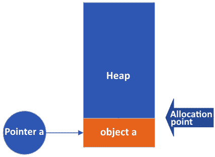
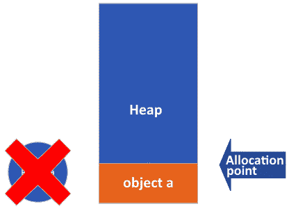
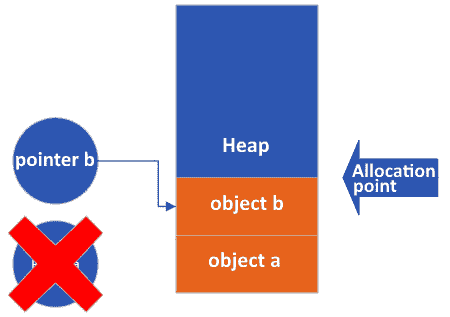
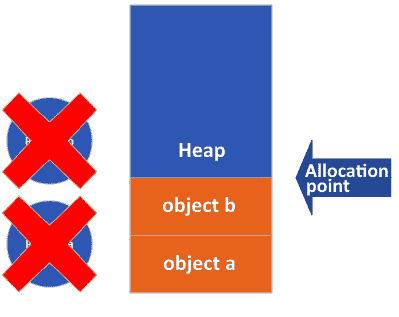

# 3

# 内存游戏

*高效* *内存管理*

性能对于系统编程至关重要。我们在上一章讨论了这一点，并概述了为什么它至关重要。内存消耗同样重要。问题是，更好的性能往往会导致更差的内存使用。而试图优化内存使用往往会导致性能更差。就像生活中的所有事情一样，这是一个权衡的问题。

话虽如此，你也可能遇到同时遇到两种情况的情况——例如，使用栈而不是堆（或值类型而不是引用类型）会导致代码运行更快，内存使用更少。

然而，在追求其中一种的同时，通常不会免费获得另一种。你必须做出明智的决定和正确的选择。这正是本章的主要内容。我希望当我们到达本章的结尾时，你能记住大部分内容！

本章我们将涵盖以下主题：

+   内存管理概述

+   垃圾回收器（**GC**）概述

+   如何正确使用 `IDisposable`

+   一系列关于如何节省内存的技巧和窍门

+   不安全代码和指针

# 技术要求

本章中的所有内容都可以在普通的 C# 安装中完成。如果你在跟随学习，可能需要额外的只是 NuGet `MessagePack` 包。你可以通过 Visual Studio Code 或使用以下 CLI 命令来安装：

```cs
dotnet add package MessagePack
```

GC 概述

.NET 是一个受管理的系统。正如之前所讨论的，许多开发者必须处理的问题现在都由 **公共语言运行时**（**CLR**）来处理。CLR 抽象掉了开发者面临的大部分繁琐任务，使他们能够专注于功能。

**内存管理**是一项棘手但非常重要的任务。做错通常会导致内存泄漏或软件不稳定。尽管没有软件应该有这种情况，系统编程需要避免这种情况。它可能导致系统不稳定，使整个计算机无法使用。因此，.NET 开发者不必担心这一点。GC 管理了大部分内存，并处理那些复杂的细节。

学习 GC 的工作原理是值得的，这样你的代码就会更加内存高效。这意味着了解内存分配在 .NET 中的工作方式。

我们已经讨论了栈和堆之间的区别。但为了提醒一下，栈是短期、较小但较快的内存部分，用于值类型，而堆是长期、更广泛但较慢的内存部分。

如果你在一个代码块中声明一个整数，CLR 会将其放在栈上。该内存会在该代码块的作用域结束时释放。堆的工作方式不同。由于堆上的项目可以存活更长时间，我们需要另一种处理这种内存的方法。这就是垃圾回收器（GC）的作用所在。

GC 过程可以在单独的线程上运行或在主线程或用户线程中运行。目前，假设 GC 在后台线程上运行是最简单的。我们稍后会处理现实世界的情况。

## GC 及其代数

GC 是一个代数系统。这意味着它与代数一起工作。这有帮助吗？我想没有。好吧，让我详细说明。

查看以下代码片段：

```cs
1: {
2:     object a = new object();
3: }
4: {
5:     object b = new object();
6: }
```

这段代码不是我们最激动人心的代码片段，但我们必须从某个地方开始。这里的括号是必要的。

上述代码片段产生的活动比预期的要少，尤其是如果你有 C 或 C++的背景。

以下图将帮助您理解在运行上述代码片段时发生的情况：


图 3.1：空的、已分配的堆

在程序启动期间，CLR 分配了一个连续的内存块。这个块不是很大，但足够容纳所有启动对象，以及它确定需要的任何其他东西。到那时，创建了一个指针，指向项目可用的第一个区域。

在第 1 行，我们开始一个代码块。然后，在第 2 行，我们创建一个`Object`类型的实例并将其存储在`a`变量中。属于该对象的所有数据内存都位于堆上。运行时初始化，计算`a`应该占用多少内存，并将分配指针移动到块中下一个可用的内存块。在栈上创建了一个指针（我们称之为`a`），该指针指向堆上存储其数据内存块：



图 3.2：创建对象 a 后的堆

在第 3 行，我们结束该变量的作用域。正如我们所学的，栈上的变量只在其所属的作用域内存在。因此，`a`指针被清除，其占用的内存被释放。但在堆上，没有任何变化。`a`的数据仍然存在，分配指针仍然指向相同的位置：



图 3.3：变量 a 超出作用域后的堆

然后，在第 4 行，我们创建一个新的作用域块；在第 5 行，我们创建一个新的`Object`实例并称之为`b`。整个表演又从头开始，但`b`的数据现在存储在`a`的上面。没有人知道这一点；`a`的数据已经变得不可达。但它仍然在那里！



图 3.4：分配对象 b 时的堆

当然，在第 6 行，作用域结束，因此栈变量`b`再次被移除。再次，堆上没有任何变化：



图 3.5：变量 b 也超出作用域后的堆

如你所见，我们在堆上不分配或释放内存。在这里，每当我们需要一个新对象时，指针就会向上移动。移动指针比分配和释放内存要快得多。在性能上，分配和释放，或者说释放内存，是非常昂贵的。尽可能避免这些操作是.NET 应用程序可以运行如此之快的原因之一。

然而，你可能已经看到了一个潜在的问题。当我们用完堆上的空间时会发生什么？分配指针不能移动到该块的末尾，那么接下来会发生什么？

很高兴你问了。这就是垃圾回收器（GC）发挥作用的时候。当我们用完最初分配的块中的内存时，GC 会查看该块中的所有项目。

首先，它会遍历堆中的所有对象，看看哪些仍然有活跃的指针指向它们。在我们的例子中，我们没有，但想象一下我们有一些其他对象分配了，这些对象仍然在作用域内。

GC 将这些孤儿内存位置标记出来，以便知道它可以回收这些内存。但 GC 无法移除的项目怎么办？

这个问题的答案涉及到 GC 是“代式的”。CLR 将每个对象放置在堆的一个特定部分，该部分用代数标记。所有新对象都在第 0 代。

当 GC 施展其魔法时，它会将所有仍然存活并在作用域内的对象移动到下一代。它们现在在第 1 代堆中。

有一点更详细

事实上，只有两个堆：一个用于所有代，一个用于**大型对象堆（LOH**）（我们将在后面更详细地介绍）。堆被分成几个部分，每个部分对应一个代。然而，我们可以将每个代视为有自己的堆。虽然这从技术上讲是不正确的，但这样思考会使理解正在发生的事情变得容易一些。

现在，所有在垃圾回收过程中幸存的对象都在第 1 代堆中；所有无法再到达的对象都准备好被清理。GC 清除内存并将分配指针设置回堆的起始位置。现在，一切都可以从头开始。

这相当不错，不是吗？但还有一个问题。如果我们的第 1 代堆填满了会怎样？

在这种情况下，我们看到类似的行为。第 1 代中所有不再可到达的项目（包括不是从其他代中的对象可达的项目）都被标记为删除；GC 将所有其他项目提升到第 2 代。

好的；让我们继续。当第 2 代填满时会发生什么？如果你猜测所有可到达的项目都移动到第 3 代，那你就错了。没有第 3 代。如果我们填满第 2 代，运行时将分配一个足够大的新块来容纳当前堆，并且足够添加更多对象。然后，它将所有对象移动到新的堆，并将旧堆返回给操作系统。

有时候，CLR 请求更多堆内存，但操作系统会对其进行惩罚，因为没有更多的内存可用。在这种情况下，我们会看到可怕的`OutOfMemoryException`错误。

处理 OutOfMemoryException 错误

处理异常的规则是，你应该只捕获你知道如何处理的异常，以便将系统恢复到稳定状态。对于`OutOfMemory`，你无法做到这一点。`OutOfMemoryException`错误是最好让它自行处理的异常之一。在这里你无法做太多来帮助。

## LOH

你可能可以想象，在内存中移动数据需要花费很多时间，这将阻碍你的性能。这是正确的：当 GC 运行时，性能会受到巨大打击。

GC 被优化以尽可能防止这种情况，但内存操作本身是昂贵的。特别是重新分配内存和将字节移动到所有不同位置需要花费大量时间。

CLR 设计者为了稍微缓解这个问题，声明了一个特殊的堆，称为 LOH。

如其名所示，这是一个用于大对象的堆。目前，它处理大对象——即大于 85,000 字节的对象。

那么大或更大的对象不会进入常规堆。它们不受系统其他部分的代际行为的影响。

GC 确实有助于保持 LOH 的清洁，但它运行的频率远低于其他堆。此外，LOH 没有代际。

当 GC 从大型对象堆（LOH）中清除对象时，内存会变得碎片化。这意味着过了一段时间后，我们的内存块看起来有点像瑞士奶酪：到处都是孔洞。曾经被对象占用、现在已被回收的内存区域现在是空的。过了一段时间，内存就由有效的对象和空空间组成。这意味着虽然技术上还有足够的内存来分配新的对象，但系统找不到一块连续的内存。如果发生这种情况，GC 将压缩 LOH，使内存再次连续。但这只会在非常罕见的情况下发生。这种方式意味着 LOH 比其他堆慢得多。

此外，LOH 没有预定义的大小。如果需要，它会增长。这又是一个昂贵且缓慢的操作。

好消息是，这些大对象在常规堆中不会妨碍你，所以它们不会减慢那里的 GC。

创建大对象时要小心。它们可能会让你的应用程序陷入停顿。

## 终结器

你可能已经用.NET 编程超过十年，从未见过或使用过终结器。如果是这样，做得好。我们不需要它们。嗯，我们大多数情况下不需要。有些边缘情况我们需要；其中一个是当你使用`IDisposable`模式时。这个模式在本章后面有专门的章节介绍。

我想向你展示，如果你在你的类中添加一个终结器（finalizer），垃圾回收器（GC）会发生什么。

有趣的事实！

终结器经常被误认为是析构函数。这很有道理：如果我们有一个构造函数在对象的生存期开始时，为什么不在结束时也有析构函数呢？毕竟 C++有它们。但我们没有。所以，永远不要将终结器当作析构函数来调用。它们不会销毁。它们是和平主义者，只想在它们之后进行清理。

让我简要解释一下什么是终结器。**终结器**是 C#类中的一个方法，运行时会在这个对象被清理和移除之前调用它。就像构造函数一样，它有一个特殊名称。下面的代码块提供了一个终结器的示例：

```cs
class MyClass
 {
     public MyClass()
     {
         // Initialize everything here...
     }
     ~MyClass()
     {
         // Clean up here
         // (well, don't. Use IDisposable for that).
     }
}
```

这个类，`MyClass`，既有构造函数也有终结器。构造函数具有类的名称，一个访问修饰符（在这种情况下为`public`），没有返回类型（因为它不是一个方法），并且可能有一些参数。这里我没有参数，但如果需要，我可以添加它们。

这个构造函数是在 CLR 分配内存之后调用的。你可以将其视为“new”操作的一部分。你知道它何时被调用：一旦你创建了一个实例，CLR 就会调用构造函数。很简单，对吧？

因此，一个类的实例可以创建如下：

```cs
var myClass = new MyClass();
```

终结器有点不同。它没有访问修饰符，没有返回类型，也没有参数。它是类名前加上波浪号（`~`）。你永远不会调用这段代码。CLR 会调用。你无法设置任何参数。

当然，问题是它何时被调用？答案是，我们不知道。

让我们回到 GC 运行过程。0 代空间已满，因此 GC 必须进行清理。它会寻找所有超出作用域的对象以释放内存。假设`myClass`也超出了作用域。

我之前解释了 GC 如何清理内存，但省略了 GC 也采取的两个步骤。

第一个额外步骤是，在它找到所有没有活跃变量指向它们的内存位置后，它会寻找那些区域具有终结器的对象。如果找到了一个，它将把对该内存结构的指针放入一个称为`FReachableQueue`的特殊队列中（F 代表终结器）。然后，它就不再管它了。该对象的堆内存不会被回收。它也不会移动到另一个代。它只是存活在清理过程中。现在，它再次静静地坐在那里。

好吧，直到 GC 再次运行。这就是第二个步骤发挥作用的地方。在清理代之前，它会遍历`FReachableQueue`。对于队列中的所有对象，CG 会调用终结器。然后，它从`FReachableQueue`中移除指针，现在对象最终准备好被垃圾回收。

这有一些深远的影响：

+   具有终结器的对象会经历额外的垃圾回收轮次。它们存在的时间更长，增加了内存压力。

+   具有终结器的对象将调用它们的终结器，但我们不知道何时调用。毕竟，我们不知道 GC 何时运行。

+   移动指针是垃圾回收器的一个额外步骤，使得事情变得更慢。

终结器是一个巨大的性能瓶颈。最好根本不用它。除非，当然，你使用 `IDisposable` 模式来清理。我们将在下一节讨论这个问题。

## `IDisposable`

.NET 是一个托管环境。我之前说过，我还会再次提到。我一直在重复这一点，因为许多人认为“托管”意味着“我不必担心这些事情。”正如我们所看到的，这根本不是真的。是的，CLR 去除了其他开发者所承受的许多痛苦，但仍然，还有很多事情你必须自己去做——尤其是如果你，就像我们一样，在编写系统软件。 

CLR 做的一件事是在我们之后清理资源。值类型位于堆栈上，不需要清理。引用类型需要清理，但垃圾回收器会处理。然而，正如我们所看到的，清理并不总是发生在我们期望它发生的时候。

并且还有一个问题：垃圾回收器不会清理所有已使用的资源。CLR 只清理托管对象。非托管对象是你的责任去清理和处置。大多数解释这种行为的例子都提到了文件和数据库连接等类。坦白说，对于大多数开发者来说，这些是他们处理非托管资源时唯一会遇到的现实生活中的情况。对于我们来说，这有点不同。当我们编写系统软件时，我们比平时更经常地遇到来自低级 API、外部硬件、与第三方软件接口、将我们的代码附加到外部调试器等情况。我们将在本书后面讨论文件系统、网络和与其他硬件接口时看到这些示例。

因此，你必须理解如果垃圾回收器没有为你做这件事，你应该如何清理。这就是 `IDisposable` 发挥作用的地方。

`IDisposable` 接口非常简单。它看起来是这样的：

```cs
public interface IDisposable
{
    void Dispose();
}
```

实现此接口的类必须确保它们有一个不带参数的 `void` 方法，名为 `Dispose`。

它是一个接口，所以它不做任何事情。如果你将它添加到一个类中，什么都不会发生。CLR 会忽略它。这个声明很重要。我会重复一遍：CLR 对实现此接口的类不做任何处理。

`IDisposable` 接口更像是一个合同。我们将其添加到处理非托管资源的类中。其他开发者看到类声明中的该接口，就会假设他们必须处理非托管资源。

就这样。

那么，我们如何实现它？让我们看看下面的示例：

```cs
class ResourceUser
{
    private readonly IntPtr _ptr;
    public ResourceUser()
    {
        // Allocate an 8 KB block of memory
        _ptr = Marshal.AllocHGlobal(8 * 1024);//
    }
    ~ResourceUser()
    {
        Marshal.FreeHGlobal(_ptr);
    }
}
```

在构造函数中，我们分配了一个 `8 KB` 的内存块。我们将该块的指针存储在 `ptr;` 中。

这块内存是不受管理的。因此，清理它也取决于我们。我们决定在终结器中完成这项工作。毕竟，它是保证要运行的，所以我们在这里做得很好！

但是，我们已经确定我们不确定这将在何时发生。我们不想在垃圾回收器决定运行之前（由于它位于终结器中，所以是两次！）分配一大块完美的内存。这只是在浪费内存和大量的 CPU 周期。

我们需要另一种清理方式。让我们重写代码：

```cs
class ResourceUser
{
    private IntPtr _ptr;
    public ResourceUser()
    {
        // Allocate an 8 KB block of memory
        _ptr = Marshal.AllocHGlobal(8 * 1024);//
    }
    ~ResourceUser()
    {
        //nothing to do here!
    }
    public void Cleanup()
    {
        if (_ptr == IntPtr.Zero) return;
        Marshal.FreeHGlobal(_ptr);
        _ptr = IntPtr.Zero;
    }
}
```

这段代码将清理代码移动到一个名为`Cleanup`的新方法中。如果我们想使用这个类，我们可以简单地创建一个实例，然后确保我们始终调用`Cleanup()`。我们可以通过使用`try-finally`块来确保这一点。让我们这样做：

```cs
var myClass = new ResourceUser();
try
{
    // Do something with myClass
}
finally
{
    myClass.Cleanup();
}
```

这很简单，对吧？说实话，这就是`IDispose`接口的全部内容。最显著的区别是，我们不再有一个名为`Cleanup()`的方法，而是有一个名为`Dispose()`的方法。我们用正确的接口标记我们的类，这是对其他开发者的一个礼貌。这样，他们就知道在使用我们的类之后必须进行清理。让我们使用以下代码块来做这件事：

```cs
class ResourceUser : IDisposable
{
    private IntPtr _ptr;
    public ResourceUser()
    {
        // Allocate an 8 KB block of memory
        _ptr = Marshal.AllocHGlobal(8 * 1024);//
    }
    ~ResourceUser()
    {}
    public void Dispose()
    {
        if (_ptr == IntPtr.Zero) return;
        Marshal.FreeHGlobal(_ptr);
        _ptr = IntPtr.Zero;
    }
}
```

这就是我们需要做的全部。在我们的调用代码中，我们应该调用`Dispose()`而不是`Cleanup()`，这样我们的代码才能编译。让我们这样做。我这里不会展示那段代码，因为我相信你知道如何做。然而，我会展示**中间语言（IL**）代码。作为一个提醒，IL 是一种既不是 C#也不是机器码的语言。它介于两者之间。但它确实给我们提供了一个很好的指示，说明编译器在将其转换为实际机器码之前对我们的代码做了什么。IL 代码看起来是这样的：

```cs
01: .method private hidebysig static void  '<Main>$'(string[] args) cil managed
02: {
03:   .entrypoint
04:   // Code size       21 (0x15)
05:   .maxstack  1
06:   .locals init (class ConsoleApp1.ResourceUser V_0)
07:   IL_0000:  newobj     instance void ConsoleApp1.ResourceUser::.ctor()
08:   IL_0005:  stloc.0
09:   .try
10:   {
11:     IL_0006:  nop
12:     IL_0007:  nop
13:     IL_0008:  leave.s    IL_0014
14:   }  // end .try
15:   finally
16:   {
17:     IL_000a:  nop
18:     IL_000b:  ldloc.0
19:     IL_000c:  callvirt   instance void ConsoleApp1.ResourceUser::Dispose()
20:     IL_0011:  nop
21:     IL_0012:  nop
22:     IL_0013:  endfinally
23:   }  // end handler
24:   IL_0014:  ret
25: } // end of method Program::'<Main>$'
```

IL 代码几乎与我们的 C#代码相同。对我们来说，关键部分在 15 到 23 行。这是包含对`Dispose()`方法调用的`finally`块。我们现在知道，无论如何，我们的资源都将被清理。

这太棒了。它非常有用（而且很重要），C#语言的背后的人给了我们一个新的结构，帮助我们做到这一点：他们给了我们`using`语句。

使用那个语句意味着当不再需要资源时，会调用`Dispose()`。这种调用可以通过两种方式完成：作为块语句或作为内联语句。

块语句看起来是这样的：

```cs
using (var myClass = new ResourceUser())
{
    // Do something with myClass
}
```

在这里，`using`开始一个新的作用域块。资源可以在作用域结束时被释放和清理。

内联版本甚至更简单：

```cs
using var myClass = new ResourceUser();
// Do something with myClass
```

编译器会自动检测`myClass`何时超出作用域。一旦发生这种情况，`using`语句的典型工作流程就会继续。

“但是，”我几乎能听到你说，“你刚才告诉我 CLR 对那个 IDisposable 接口没有任何操作，但在这里它理解如何处理它！”

这是一个聪明的观察，但关于`IDisposable`的知识并不在 CLR 中。编译器才是那个聪明的。如果我们取`using`的内部版本，构建我们的程序，并检查 IL，我们会看到以下代码：

```cs
 .method private hidebysig static void  '<Main>$'(string[] args) cil managed
 {
   .entrypoint
   // Code size       20 (0x14)
   .maxstack  1
   .locals init (class ConsoleApp1.ResourceUser V_0)
   IL_0000:  newobj     instance void ConsoleApp1.ResourceUser::.ctor()
   IL_0005:  stloc.0
   .try
   {
     IL_0006:  leave.s    IL_0013
   }  // end .try
   finally
   {
     IL_0008:  ldloc.0
     IL_0009:  brfalse.s  IL_0012
     IL_000b:  ldloc.0
     IL_000c:  callvirt   instance void [System.Runtime]System.IDisposable::Dispose()
     IL_0011:  nop
     IL_0012:  endfinally
   }  // end handler
   IL_0013:  ret
 } // end of method Program::'<Main>$'
```

这段代码和我们在自己调用`Dispose()`时的代码之间有一些细微的差别，但这些差别并不重要。重要的是编译器查看我们的代码，并将其转换为包含在`finally`部分调用`Dispose()`方法的`try-finally`块。换句话说，它确实做了完全相同的事情。

因此，`using`只是一个方便的简写，用来指示编译器。如果我们使用了`Cleanup()`而不是`Dispose()`，编译器就不会理解它。但最终，在处理器上运行的代码是相同的。没有差别。使用`IDisposable()`没有涉及任何魔法。

### `IDisposable`模式

很遗憾，我们还没有完成。前面的代码是有效的。它在我们不再需要资源时进行清理和执行这些操作。但我们依赖于我们的`ResourceUser`类的用户做正确的事情：他们必须使用`Dispose()`或`using`语句。如果他们不这样做，我们可能会出现内存泄漏。而且别忘了，那个未能做到这一点的开发者可能就是你，六个月后你可能会忘记你做了什么。

我们需要一种更好的方法来做这件事。

`IDisposable`模式是一个确保资源得到清理的方案，无论发生什么情况。

例如，如果我们的类的用户没有直接或通过`using`语句调用`Dispose()`，会发生什么？无论发生什么情况，我们都需要清理。幸运的是，我们可以做到这一点。我们有终结器。它总是运行，尽管它可能不是在最佳时间运行。但至少我们可以确信我们的资源最终会得到清理。

我们可以将清理代码复制到我们的终结器中。然而，我们不希望清理两次。确保我们的资源被处置的首选方式是编写一个`Dispose`的重载版本。整个实现看起来像这样：

```cs
01: class ResourceUser : IDisposable
02: {
03:     private IntPtr _ptr;
04:     private IDisposable? _someOtherDisposableClass;
05:     private bool _isDisposed;
06:     public ResourceUser()
07:     {
08:         // Allocate an 8 KB block of Memory
09:         _ptr = Marshal.AllocHGlobal(8 * 1024); //
10:     }
11:     public void Dispose()
12:     {
13:         Dispose(true);
14:         GC.SuppressFinalize(this);
15:     }
16:     ~ResourceUser()
17:     {
18:         Dispose(false);
19:     }
20:     private void Dispose(bool isDisposing)
21:     {
22:         if (_isDisposed)
23:             return;
24:         if (isDisposing)
25:         {
26:             _someOtherDisposableClass?.Dispose();
27:         }
28:         if (_ptr != IntPtr.Zero)
29:         {
30:             Marshal.FreeHGlobal(_ptr);
31:             _ptr = IntPtr.Zero;
32:         }
33:         _isDisposed = true;
34:     }
35: }
```

让我们看看这里会发生什么。

在第 3 行，我们有指向我们的非托管内存块的指针。在第 4 行，我添加了一个新字段，用于另一个实现`IDisposable`的类。这个字段可以是任何东西，比如一个文件或数据库。它是什么并不重要。我们在这里需要知道的是，它是一个在使用后必须清理的托管类。在第 5 行，我添加了一个布尔值，我们用它来查看这个类的实例是否已经被处置。

第 6 行到第 10 行构成了构造函数的主体，其中我们分配了我们的 8K 内存块。

在第 11 行，我们有我们的`Dispose`方法。在那里，我首先调用一个重载的`Dispose`方法，并给它一个`true`参数。我们使用这个参数来跟踪谁调用了重载的`Dispose`。这个参数的作用我在下面几行中解释，但在那之前，我必须解释`GC.SuppressFinalize(this)`这一行。这是魔法行。它告诉 GC 在执行其魔法时不要将这个实例移动到`FReachableQueue`。实际上，这从我们的类中移除了终结器代码，这样当 GC 运行时，它可以立即清理堆栈上的内存，而不是等待另一次运行。

然后，我们有终结器。终结器只有在类用户忘记调用`Dispose`（或`using`）并且由于`GC.SuppressFinalize(this)`调用而触发时才会被调用。这次，我们调用`Dispose(false)`。

让我们讨论我添加到`Dispose()`方法中的参数，并承诺要解释的。在第 20 行，我们有清理的实际代码。到现在为止，我希望你已经理解了`isDisposing`标志的作用。如果这个标志设置为`true`，我们就到了这里，因为类的用户调用了`Dispose()`。如果标志是`false`，开发者没有使用`Dispose()`，而是让它由终结器处理。

当然，我们首先检查是否已经清理，这是通过在第 22 行检查`_isDisposed`变量来完成的。

第 24 行是至关重要的。我们的类有一个需要清理的托管资源。但如果我们从终结器来，我们就不知道这段代码会在什么时候运行。可能会出现 GC 已经清理了由`_someOtherDisposableClass`分配的内存的情况。我们无法知道。如果它已经被释放，那么调用它的`Dispose()`将导致严重错误，并可能导致我们的系统崩溃。因此，我们必须确保只有在确定它仍然存在的情况下才调用该成员的`Dispose()`。如果我们通过终结器进入这个方法，我们就不能确定。事物被销毁的顺序是非确定性的。我们能确定的时间只有当我们通过调用`Dispose()`进入这里时。

然而，内存块是另一回事。那个块是未管理的，所以我们知道 GC 还没有清理它。它不能。这就是为什么我们称它为未管理。因此，我们在第 28 行到 32 行清理它，无论发生什么。

就这样。如果你有一个从这个类派生出来的派生类，但并不复杂到你自己无法理解（提示：使`void Dispose(bool isDisposing)`受保护的虚拟），事情会变得稍微复杂一些。

如果你想让你的代码尽可能高效地使用内存，`IDisposable`接口非常重要。在这里，你学习了如何正确实现它，以及如何编写代码以消除内存泄漏。再次强调，由于我们作为系统程序员更有可能需要处理未管理代码，而不是其他开发者，这是至关重要的知识。

但仅仅了解 `IDisposable` 是不够的。我还有许多关于在您的应用程序中节省内存的技巧和窍门想要与您分享。

# 节省内存的技巧和窍门

系统程序员需要意识到他们所编写的系统所使用的内存。因此，我想分享一些可以帮助您减少**内存压力**的建议。内存压力是一个术语，用来表示与可用内存相比使用的内存量。再次强调，一些这些建议可能会使您的系统变慢。作为系统程序员，您必须做出明智的选择，在快速和内存高效的代码编写之间进行权衡。有时，您会幸运地两者兼得。其他时候，您必须考虑选项，选择两个恶行中较轻的一个。以下将涵盖您可以采取的具体措施来减少系统上的内存压力。

+   **使用值类型而不是引用类型**：堆栈上的值类型通常比引用类型小。指向类的指针和堆本身中的指针的开销可能是转向值类型（如结构体）而不是使用引用类型（如类）的原因。然而，如果您的结构体变得太大，您可能会注意到性能损失。值类型在用作参数时按值复制，复制大结构体需要更长的时间。

+   `ObjectPool<T>` 类持有一个对象池，您可以在使用完毕后将其返回。您不需要创建类的实例并等待 GC 清理，而是可以创建几个实例并将它们存储在池中。最初，这可能会增加内存压力，但根据您的场景，这可能会节省一些内存使用。

+   `List<T>`。列表提供了很多功能。它可以非常灵活，但代价是更高的内存消耗。

+   `List<T>`，有时，使用它来存储一些项目可能会很有诱惑力。同样适用于 `Dictionary<TKey, TValue>`。但您并不总是需要它。如果您知道您想在类中存储什么，可能更有效的是声明更简单的变量来存储这些内容，并使用这些变量代替。

    我看到有人使用 `Dictionary<TKey, TValue>` 来存储用户名和电子邮件地址。使用两个固定的字符串会更简单、更快、更节省内存。做一个聪明的开发者吧！

+   **使用 Span<T> 和 Memory <T>**：假设您有一个整数数组。没有什么特别的，只是像这样：

    ```cs
    int[] myBuffer = new int[100];
    ```

数组是引用类型，因此这会在堆上分配一个内存块。这并没有什么问题。您可能出于某种原因想要将数组分成两部分。有多种方法可以做到这一点，但最简单（尽管不是最快的）方法是使用 Linq，如下所示：

```cs
int[] firstHalf = myBuffer.Take(50).ToArray();
int[] secondHalf = myBuffer.Skip(50).ToArray();
```

现在，我们在堆上有三个数组。一个是原始数组，其余的是两个新数组。这会消耗很多内存。即使我没有提到复制所有这些数据所带来的性能损失。

可能你需要一份副本。如果是这样，那么这是一个好的方法。然而，如果你只需要分割，那么你应该使用`Span<T>`。这个类是你给它提供的内存的视图。它不是复制；它只是原始数据的窗口。

那段代码看起来是这样的：

```cs
var firstHalf = new Span<int>(myBuffer, 0, 50);
var secondHalf = new Span<int>(myBuffer, 50, 50);
```

这个代码示例不会复制数据或分配新的数组。它只是给你一个数据的视图。

当然，如果原始数组被垃圾回收，span 将指向无效的内存。

在这里，`Memory<T>`大致相同，但当你使用异步操作时更好。此外，span 始终位于堆栈上。因此，你不能在类中将 span 作为字段（记住，类是引用类型，所以它们的所有数据都存储在堆上）。相比之下，`Memory<T>`可以在堆上使用，这样你就可以将它们作为类的字段使用。

+   **避免装箱**：值类型速度快且内存效率高，只要它们保持为值类型。正如我们之前讨论的，值类型突然有了变成引用类型的讨厌习惯。我们称这个过程为**装箱**。装箱比简单的值类型占用更多的内存。因此，尝试意识到这些情况并在可能的情况下避免它们。

+   **使用延迟初始化**：如果你创建了一个复杂类的实例，你可能不需要在构造函数中初始化所有字段。有时，只在需要时这样做更好。这种方式被称为**延迟初始化**：尽可能推迟初始化。

+   `System.IO.Compression`。这个命名空间包含许多帮助您压缩和解压数据的类。

+   **卸载不必要的数据**：你可以选择移除那些你不需要一直保留的数据。然后，当你需要它时，你可以按需重新加载它。如果你有大量数据集并且并不总是需要它们，那么这样做可能值得。

+   `WeakReference<T>`引用。这意味着你告诉 GC 如果需要就移除对象。让我给你展示一下我的意思：

    ```cs
    var myObject = new object();
    var myObjectReference = new
    WeakReference<object>(myObject);
    // Much further in the code, we might need myObject
    if (myObjectReference.TryGetTarget(out var retrievedObject))
    {
        // Do something with retrievedObject
    }
    else
    {
        // We need to recreate myObject
        myObject = new object();
        myObjectReference.SetTarget(myObject);
    }
    ```

    首先，我们创建一个名为`myObject`的对象实例。然后，我们获取它的弱引用。假设在我们的代码中稍后我们还需要`myObject`。首先，我们询问`WeakReference`对象是否仍然可用或 GC 是否已经收集了它。如果它可用，我们可以使用它。否则，我们重新创建它并将新的指针存储在`WeakReference`中。非常巧妙。

+   **紧凑的对象表示**：有时，通过将数据智能地组合到其他数据结构中，你可以节省一些内存。让我给你展示一下。我们可以用以下方式表达客户可能拥有的三种状态：

    ```cs
    bool customerHasPayed= false;
    bool customerHasCredit = true;
    bool customerPaymentIsLate = true;
    ```

    在这里，`bool`通常在内部用字节表示。因此，这需要 3 个字节。

我们可以将其重写如下。首先，我们创建一个新的`enum`值：

```cs
[Flags]
enum CustomerPaymentStatus : byte
{
    CustomerHasPayed = 1 << 0,
    CustomerHasCredit = 1 << 1,
    CustomerPaymentIsLate = 1 << 2
};
```

我用来分配值的表示法让我想起了我在序列中的位置：通过左移，我可以轻松地对项目进行编号（`0`、`1`和`2`）。

位移动

在系统编程中，我们经常处理位和字节。因此，你应该了解这种表示法。

`<<` 运算符将一个字节的全部位向左移动一位，实际上是将值乘以 2。所以，`1 << 0` 不移动任何位，`1 << 1` 将所有位移动一位，结果为值 2，而 `1 << 2` 将位移动两位，结果为 4。在二进制中，结果是 `00000001`、`00000010` 和 `00000100`。

我们可以这样设置一个变量：

```cs
CustomerPaymentStatus customerStatus =
    CustomerPaymentStatus.CustomerHasCredit &
    CustomerPaymentStatus.CustomerPaymentIsLate;
```

我们有与第一个例子中相同的信息，但这次我们只使用了一个字节。这减少了 66% 的内存使用率！

+   `null` 允许它们被清理。由于 CLR 将大对象存储在很少清理的 LOH 上，将它们设置为 `null` 可以使 GC 在那里清理它们。

+   **考虑使用静态类**：实例类在其成员和其数据之间有许多指针来回移动。这些指针和成员数据可能会占用额外的内存。使用静态类消除了这种开销。节省可以相当显著。

在这一点上，我想重申，对于系统开发者来说，尽可能提高内存效率非常重要。我刚才与您分享的技巧和窍门应该成为您开发风格的一部分。节省内存可以释放 GC 的时间，并使您的程序加载和通常执行得更快。这有助于为用户提供更好的体验。当然，这些技巧和窍门可以应用于各种 C# 编程。每个程序都可以使用更好的内存管理。然而，对于不安全代码和指针来说，情况并非如此。这些是大多数开发者很少会遇到的话题。然而，作为系统程序员，我们可能无法避免它们。因此，我认为我们应该花些时间来研究它们。

# C# 中的不安全代码和指针

如果您担心内存，您可以接管 CLR 和 GC，并自己完成所有操作。我不建议这样做，但有时您别无选择。尽管编译器、CLR 和 GC 做了惊人的事情，但它们并不能总是预测您试图实现什么或您的限制是什么。特别是对于系统开发者来说，这有时可能会阻碍您实现目标。在这种情况下，您可能不得不自己管理内存。我认为这里应该举一个例子。

让我们从一个非常简单的类开始：

```cs
[MessagePackObject]
public class SimpleClass
{
    [Key(0)]
    public int X { get; set; }
    [Key(1)]
    public string Y { get; set; }
}
```

`MessagePackObject` 和 `Key` 属性来自 `MessagePack` NuGet 库。

`MessagePack` 库是一个工具，它使您能够将类的实例序列化和反序列化成二进制表示。另一个流行的序列化格式是 JSON，它在内存效率方面远不如二进制格式。这就是为什么我们在这里使用二进制格式的原因。

我已经编写了两个方法：一个用于序列化，一个用于反序列化。序列化器先来：

```cs
public static byte[] SerializeToByteArray(SimpleClass simpleClass)
{
    byte[] data = MessagePackSerializer.Serialize(simpleClass);
    return data;
}
```

这相当简单。我们获取一个对象，并将其传递给 `MessagePackSerializer` 静态类的 `Serialize` 方法。这将返回一个 `byte[]` 值，我们将其返回给此方法的调用者。

当然，这也需要进行反序列化：

```cs
public static SimpleClass DeserializeFromByteArray(IntPtr ptr, int length)
{
    byte[] data = new byte[length];
    Marshal.Copy(ptr, data, 0, length);
    var simpleClass = MessagePackSerializer.        Deserialize<SimpleClass>(data);
    return simpleClass;
}
```

此方法稍微复杂一些：我们获取一个内存块的指针和我们的数据长度。我们创建一个正确大小的`byte[]`值。然后，我们将堆中的内存复制到字节数组中，以便我们可以使用`MessagePackSerializer`类进行反序列化。然后，返回我们得到的对象。

我们可以使用以下方式使用这些方法：

```cs
var simpleClass = new SimpleClass()
{
    X = 42,
    Y = "Systems Programming Rules!"
};
var memory = IntPtr.Zero;
try
{
    byte[] serializedData =
        MemoryHandler.SerializeToByteArray(simpleClass);
    memory = Marshal.AllocHGlobal(serializedData.Length);
    Marshal.Copy(serializedData, 0, memory,
        serializedData.Length);
    SimpleClass deserializedSimpleClass =
        MemoryHandler.DeserializeFromByteArray(
            memory,
            serializedData.Length);
}
finally
{
    Marshal.FreeHGlobal(memory);
}
```

在这里，我们创建了一个`SimpleClass`的实例并给它一些数据。

然后，我们使用我们之前讨论的新的`SerializeToByteArray`方法来序列化该对象。这给我们一个包含原始数据的`byte[]`值。然后，我们在堆上分配我们想要存储数据的内存。我们复制数据。然后，我们可以丢弃`simpleClass`实例：它可以被垃圾回收。

注意，GC 永远不会清理我们刚刚分配的内存。我们的数据存储在我们的内存中。

如果我们要使用它，我们需要再次进行反序列化，这可以通过调用`DeserializeFromByteArray`来实现。我们提供分配的内存的指针和占用的大小。

当然，我们还需要在完成时释放内存。GC 不会为我们做这件事。我们对此负责。

在这个例子中，我们只用了 29 字节来存储数据，这并不多。如果需要，我们可以分配这些内存，并在我们决定时释放它们。这是处理我们系统内存的一种非常快速和高效的方式。

警告

不要使用`BinaryFormatter`来做这件事。尽管使用`BinaryFormatter`要简单得多，但它本质上是不安全的。你最好使用我这里展示的`MessagePack`，或者使用基于 JSON 的序列化和反序列化器。更多信息，请参阅[`aka.ms/binaryformatter`](https://aka.ms/binaryformatter)。

我们可以更进一步。使用指针算术，我们可以手动将所有数据复制到我们的内存块中。由于指针算术是不安全的，我们需要通过使用`unsafe`关键字并将项目选项设置为`允许不安全`来告诉编译器我们想要这样做，正如我们在上一章末尾所讨论的。

序列化和反序列化保持一致。反序列化更简单。将比特存储到我们内存中的代码略有不同。然而，整个代码运行更快且更节省内存。下面是代码：

```cs
var pointer = IntPtr.Zero;
try
{
    byte[] serializedData = MemoryHandler.        SerializeToByteArray(simpleClass);
    pointer = Marshal.AllocHGlobal(serializedData.Length);
    unsafe
    {
        // copy the data using pointer arithmetic
        byte* pByte = (byte*)pointer;
        for (int i = 0; i < serializedData.Length; i++)
        {
            *pByte = serializedData[i];
            pByte++;
        }
        //deserialization is done here
        byte[] deserializeData = new byte[serializedData.Length];
        pByte = (byte*)pointer;
        for (int i = 0; i < serializedData.Length; i++)
        {
            deserializeData[i] = *pByte;
            pByte++;
        }
        var deserializedObject = MessagePackSerializer.        Deserialize<SimpleClass>(deserializeData);
    }
}
finally
{
    Marshal.FreeHGlobal(pointer);
}
```

我们以使用`MessagePack`获取我们对象的二进制表示的方式开始。但不是使用`Marshal.Copy()`，我们自行复制字节。我们有一个指向数据开始的指针；我们取第一个字节，将其复制到我们分配的内存块中，增加指针，然后重复此操作，直到复制整个数据。

反序列化工作方式相同。我们获取我们分配的内存块的指针，现在它包含我们的数据。我们读取第一个字节，将其复制到数组中，然后重复，直到完成。

然后，我们通过调用`MessagePackSerializer.Deserialize()`方法进行反序列化，该方法接受一个类型，我们给它一个包含所有字节的数组。

再次强调，这是一种快速且高效的内存处理方式，但它确实伴随着许多风险。记住，一个小错误可能会让你的日子变得一团糟。

不安全代码和在你的代码中使用指针可以大大加快速度。但我想要确保你理解其影响：你正在接管 CLR 的所有控制权。你需要负责确保你的程序运行良好且安全。确保当你选择这条路线时，你知道自己在做什么。如果你这样做，在速度和内存效率方面会有很多好处！

# 下一步

我希望你能记住我们讨论的大多数内容，但以防万一你忘记了，我们将再次过一遍最关键的点。

首先，我们讨论了 CLR 和 GC 如何协同工作以减轻内存管理的痛苦。我们探讨了 GC 的工作原理，世代的意义，以及 LOH 的作用。

我们还讨论了终结器以及为什么它们可能会影响你的性能。我们还看到，当你使用`IDisposable`模式时（只要你不忘记调用`GC.SupressFinalize(this)`来移除不必要的终结器），它们确实有存在的理由。

然后，我分享了一些你可以使用的技巧来优化你的内存使用，如果你需要你的系统中使用最少的内存量。

我想重申关于内存优化的一个关键点。在 99 个案例中，CLR 和 GC 都做得非常出色。试图超越它们并不总是能导致更好的系统。这些工具背后的团队在他们的领域里很擅长，他们使用了书中所有的技巧（以及一些书中没有的技巧！）来帮助你减轻内存压力。

作为系统程序员，你可能会遇到 GC 和 CLR 工作得不够好的情况，这时这里讨论的主题就能帮到你。但请务必非常小心。管理内存如果出错可能会导致奇怪甚至灾难性的后果。

在调整内存使用之前，你应该测试和基准测试你的代码。但如果你遵循我的建议和忠告，你可以得到非凡的结果！然而，一旦你的系统中有多线程，事情就会变得复杂得多。我们需要讨论线程。很多。这正是我们将在下一章中要做的！
