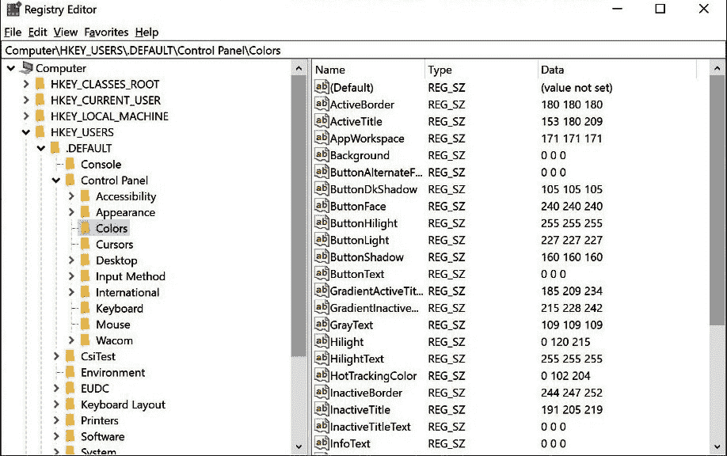
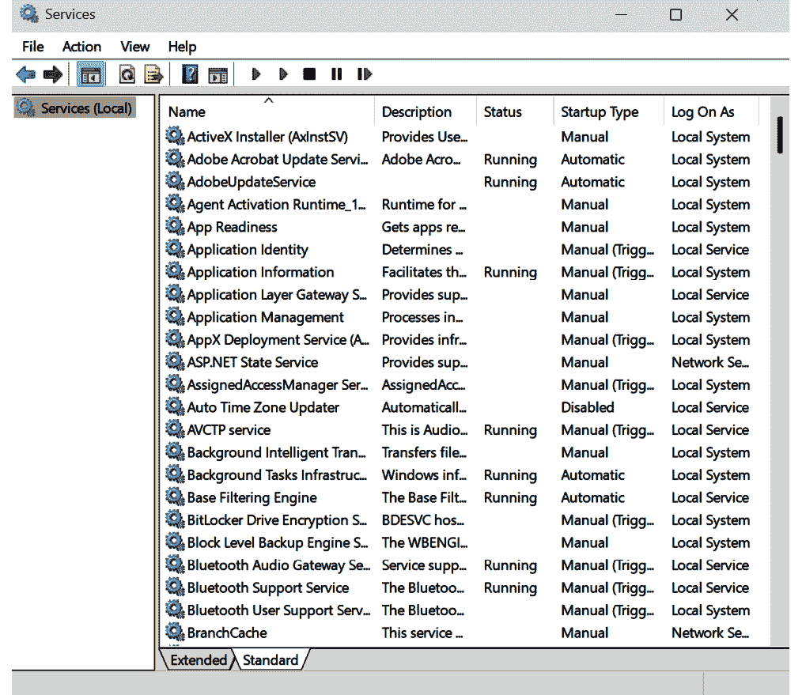
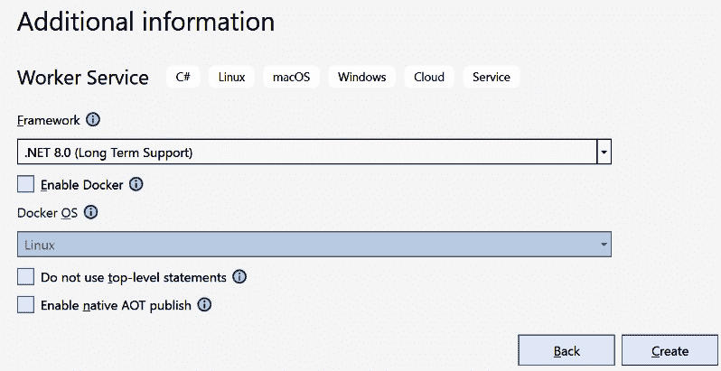
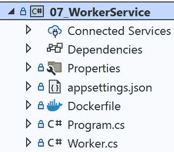
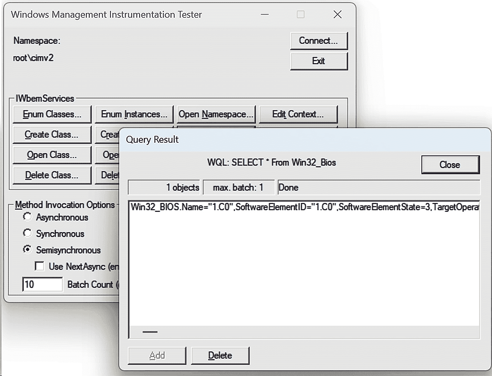
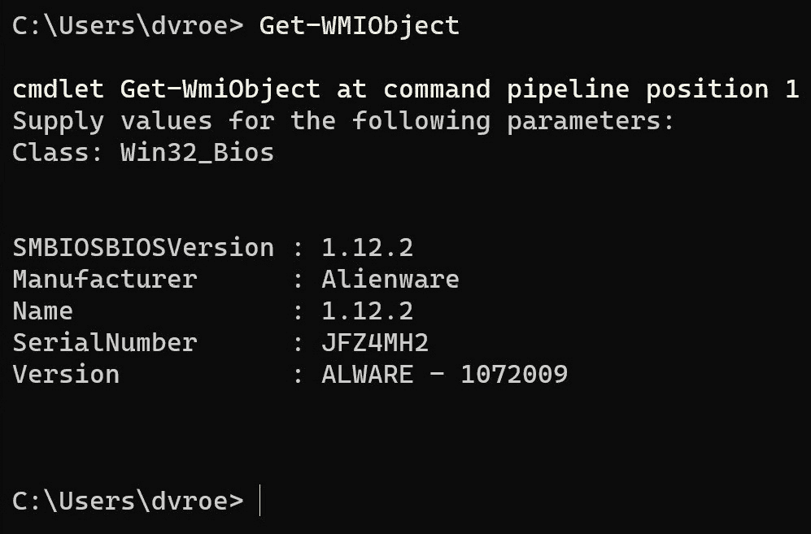

# 7

# 操作系统探戈篇

*与操作系统服务一起工作*

计算机是复杂的机器。它们可以有多种不同的形式，不同的外围设备，以及不同的功能。然而，许多不同的机器可以运行相同的软件。只要硬件符合相当广泛的边界（例如，运行特定的 CPU 架构），你的软件就不关心底层机器的外观。

所有这一切之所以能够工作，是因为我们有抽象。你几乎从不直接处理实际的硬件。总有一层层的软件需要通过，每一层都增加了一层抽象。这听起来很复杂，但这是好事。没有这个，我们就必须为所有可能的硬件组合重写我们的软件。想象一下，用户用一种带有旋转磁盘的老式硬盘驱动器换成了更现代、更快的 SSD。然后，他们必须来找你，以便你可以重新编译系统以适应这种情况。我相信，如果可能的话，你肯定不想在这方面浪费时间。

软件的最底层，即最接近硬件运行的，是**基本输入/输出系统**（**BIOS**）。这个系统在实际硬件和其上层级之间进行接口。BIOS 知道如何访问存储介质上的特定区域。它知道如何到达网络卡并获取位和字节传输到其上层的层级。它是实际硬件的看门人。

简而言之，下一层的抽象是**操作系统**（**OS**）。如今，操作系统和用户程序之间的区别已经不再非常明确了。例如，Windows 是一个操作系统。然而，它也附带了许多用户程序，例如图片查看器和计算器。然而，操作系统确实附带了许多我们作为系统程序员可以使用的实用程序。这些实用程序或操作系统中的系统帮助我们完成任务，而无需担心细节，同时仍然能够在许多不同的机器上运行。本章将解释 Windows 为我们提供的一些更实用的实用程序。

本章将探讨 Windows 为我们提供的一些服务。以下是本章我们将学习的内容：

+   Windows 注册表

+   工作者服务

+   Windows 管理规范（WMI）

+   注册表和 WMI – 风险及其避免方法

我们还将探讨涉及的风险以及如何最小化它们。毕竟，我们正在深入 Windows，当事情出错时，它们通常出错得很严重。

让我们从注册表开始吧！

# 技术要求

你可以在 GitHub 仓库中找到我们讨论的所有内容的所有源代码和完整示例：[`github.com/PacktPublishing/Systems-Programming-with-C-Sharp-and-.NET/tree/main/SystemsProgrammingWithCSharpAndNet/Chapter07`](https://github.com/PacktPublishing/Systems-Programming-with-C-Sharp-and-.NET/tree/main/SystemsProgrammingWithCSharpAndNet/Chapter07)。

如果你想要从头开始构建示例，你需要安装一些 NuGet 包。

对于 WMI 示例，你需要安装`System.Management`包。

# Windows 注册表

几乎所有系统都有设置。这些设置是持久的；系统关闭、重启或任何原因后它们仍然存在。这些设置的内容各不相同；它们可以是系统需要的任何内容。这可能是一个数据库的连接字符串，一个可以存储文件的地点，用于生成报告的字体，等等。任何在编写软件时无法预先知道的内容，或者用户或系统管理员可能想要更改的内容，都应该放在系统之外的一个单独位置。

在过去，Windows 应用程序和系统使用`[`和`]`字符。键/值数据是一行，例如`mykey=myvalue`。每个部分或数据行都在单独的一行上，就是这样。

我们将 INI 文件放置在已知的位置，通常在主应用程序文件所在的同一目录中。

这些天，我们不再那么频繁地使用 INI 文件了。.NET BCL 没有为它们提供类，尽管如果你决定使用 INI 文件，第三方 NuGet 包可以帮助你。

INI 文件最明显的替代品是设置文件。设置文件通常以 JSON 格式存储，这使得它易于处理。你可以在我们曾经放置 INI 文件的地方找到它们：我们通常将它们放置在主应用程序旁边。

JSON 允许在设置中有一个更复杂的结构，具有层次结构。JSON 对于人类来说仍然很容易阅读，就像 INI 文件一样。这可能对系统管理员需要更改设置时很有用。

然而，JSON 文件并不总是存储设置的最好方式。这种方法有一些缺点。基于文件的设置的替代方案之一是使用 Windows 注册表。让我先解释一下这是什么以及如何使用它，然后我将概述两种选项的优缺点。

## 什么是 Windows 注册表？

注册表是 Windows 中的一个分层数据库，系统可以读取和写入各种数据。数据本身是一系列键/值对。键是字符串；值可以是字符串、数字或二进制。

Windows 注册表中的二进制数据

是的，你可以在注册表中存储二进制数据。然而，这并不意味着这是一个好主意。理论上的限制是每个值 1 MB，但我强烈建议不要这样做。如果你只有几个字节，那么存储和读取二进制数据是一个很好的主意，但如果你想要存储大量数据，你最好使用不同的机制。在注册表中存储大量二进制数据可能会减慢整个机器的速度，而不仅仅是你的应用程序。微软建议每个条目使用最多 1 或 2 KB 的二进制数据。超过这个量，你应该将你的数据移动到另一个位置。

注册表以树状结构组织。每个条目可以是键、子键或条目。条目是注册表中的最低级别：条目不能有子条目。

我可以通过向您展示我机器上的一些注册表内容来澄清这一点。



图 7.1：Windows 注册表

*图 7**.1* 展示了我机器上 Windows 注册表的一部分。在左侧，您可以看到包含所有键的树结构；在右侧是当前选中键的内容。此图像显示了控制面板中使用的颜色设置。这些是默认设置；您可以为每个用户设置不同的设置。

这就是注册表的一个大优点：您可以按用户存储设置，并且系统会在需要时确定使用哪个设置。您不必处理这个问题。

有 5 个顶级键。以下表格中解释了这些键。

| **键** | **描述** |
| --- | --- |
| `HKEY_CLASSES_ROOT` | 这主要将文件连接到应用程序：例如，如果您在资源管理器中双击文件，Windows 应该启动哪个应用程序？ |
| `HKEY_CURRENT_CONFIG` | 这包含有关本地计算机启动时使用的硬件配置信息。 |
| `HKEY_CURRENT_USER` | 所有关于当前用户及其首选项的信息都存储在这里。如果您更改 Windows 的主题，它最终会在这里结束。 |
| `HKEY_LOCAL_MACHINE` | 包含特定于此计算机的配置信息，由所有用户共享。 |
| `HKEY_USERS` | 在这里，您将找到此计算机上所有已知的用户配置文件。对于每个用户，他们的首选项和信息均存储在此处。 |

表 7.1：顶级注册表键

我在这里并不诚实。我刚才提到的某些顶级键是其他键的便捷快捷方式。例如，`HKEY_CURRENT_USER` 将当前登录用户映射到 `HKEY_USERS` 中的 `HKEY_CURRENT_USER`，而 `HKEY_CLASSES_ROOT` 是 `HKEY_LOCAL_MACHINE\Software` 的子键。但这些根键是为了帮助您。例如，您不必查找当前用户的 ID，然后在 `HKEY_USERS` 中找到该条目，而是可以直接打开 `HKEY_CURRENT_USER` 键，并确信您会得到正确的数据。

每个顶级键都可以有子键。每个子键都可以有自己的子键。总共可以深入到 512 层。每个顶级和子级键都可以有一个或多个键/值数据对。

此数据有一个数据类型。以下表格显示了可用的数据类型。

| **Win** **32 类型** | **C#类型** | **描述** |
| --- | --- | --- |
| `REG_NONE` | `None` | 没有数据类型 |
| `REG_SZ` | `String` | 一个以空字符终止的字符串 |
| `REG_EXPAND_SZ` | `ExpandString` | 包含未展开的环境变量引用的字符串 |
| `REG_BINARY` | `Binary` | 任何形式的二进制数据 |
| `REG_DWORD` | `Dword` | 一个 32 位的二进制数 |
| `REG_MULTI_SZ` | `MultiString` | 一个以空字符终止的字符串数组，以双空字符终止 |
| `REG_QWORD` | `Qword` | 一个 64 位的二进制数 |
| `-` | `Unknown` | 一个不受支持的注册表数据类型 |

表 7.2: .NET 注册表数据类型

*表 7.2* 然而，可能需要一点解释。

Win32 API 支持许多数据类型。然而，CLR 可用的类型较少。我们可以使用的类型是 `RegistryValueKind` 枚举的一部分。这些枚举定义的是我在 C# 类型列中列出的那些。

提供的类型应该足够你使用。然而，有时你需要使用特定的类型。例如，Win32 API 支持一个名为 `REG_RESOURCE_LIST` 的数据类型。你使用这种类型来存储资源相关的数据。不幸的是，C# 枚举没有提供等效的类型。在这些情况下，你可以使用 `Unknown` 类型。

`ExpandString` 可以非常有价值。如果你想存储有关文件位置的详细信息，你可以使用一个宏，例如 `%PATH%`。这个宏是系统中的当前路径。然而，路径是以这样的字符串存储的：`%PATH%`。如果你指定 `ExpandString` 作为类型，操作系统会在读取数据时将那个字符串转换为实际值。

但说实话，你可能最常使用 `String`、`Binary` 和 `DWord`。其他的虽然也有，但只是以防万一需要它们。

## 如何使用 Windows 注册表访问和存储数据

当向注册表写入数据时，你必须首先决定在哪里存储那些数据。例如，如果你想为当前用户存储一些特定信息，你可能使用 `HKEY_CURRENT_USER` 作为你的根键。作为系统程序员，我们更有可能选择 `HKEY_LOCAL_MACHINE` 或 `HKEY_CURRENT_CONFIG` 这样的键。这些位置与当前用户独立，这更符合我们的情况。但当然，如果你的用例需要，你可以使用任何你想要的键。

由于注册表是一个分层数据库，你必须指定一个层次结构。换句话说，你必须考虑一个树状结构来存储你的数据。

我在我的机器的根键中看到几个子键：`HKEY_LOCAL_MACHINE`: `HARDWARE`、`SAM`、`SECURITY`、`SOFTWARE` 和 `SYSTEM`。在 `SOFTWARE` 子键中，我看到很多子子键，其中许多是我机器上软件供应商的名称。

如果你想要向注册表写入数据，你必须考虑这一点：位置并不重要，但对于维护我们软件运行的机器的管理员来说，放置东西的逻辑性很重要。

假设我们想要存储软件在特定机器上第一次运行的时间。如果它之前从未运行过，我们存储当前的日期和时间。如果它之前运行过，我们检索那些数据：我们永远不会更改 `first-run` 日期。

要存储该信息，我们需要采取以下步骤：

1.  找到 `HKEY_LOCAL_MACHINE\SOFTWARE` 键。

1.  创建一个名为 `SystemProgrammers` 的子键。

1.  创建另一个名为 `Usage` 的子键。

1.  在名为 `FirstAccess` 的键中以二进制形式存储日期和时间。

当然，如果那个键还不存在，我们才能采取最后一步。如果它已经存在，那么软件已经运行了。在这种情况下，我们检索属于那个键的值，并展示给用户。

这就是它的样子：

```cs
var key = Registry.LocalMachine.CreateSubKey(@"Software\SystemsProgrammers\Usage");
var retrievedKey = key.GetValue("FirstAccess");
if (retrievedKey == null)
{
    // create the value
    key.SetValue(
        name: "FirstAccess",
        value: DateTime.UtcNow.ToBinary(),
        valueKind: RegistryValueKind.QWord);
    "First access recorded now".Dump(ConsoleColor.Cyan);
}
else
{
    if (retrievedKey is long firstAccessAsString)
    {
        var retrievedFirstAccess =
            DateTime.FromBinary(firstAccessAsString);
        $"Retrieved first access:
              {retrievedFirstAccess}".Dump(ConsoleColor.Cyan);
    }
}
```

首先，我们创建子键。如果它已经存在，我们就获取它的引用。我们不需要逐个指定每个子键；我们可以给这个方法整个路径。在我们的例子中，`Software\SystemsProgrammers\Usage`，我们将其存储在`LocalMachine`根键中。

然后，我们尝试读取`FirstAccess`键的值。如果它是`null`，那么我们还没有创建它。因此，我们通过调用`key.SetValue`来完成这个操作。我指定类型为`QWord`，但 API 足够智能，可以自己推断出来：如果你想的话，可以省略它。我喜欢明确我的意图，所以我还是指定了它。

如果键确实存在，我们检索它。在我们得到`DateTime`之前，我们必须进行一些从`long`到`DateTime`的类型转换，但转换之后，我们可以显示结果。

运行这个示例

与注册表一起工作通常意味着你必须以提升的权限运行。这段代码只有在以管理员身份运行 Visual Studio 时才有效。但别担心：如果你忘记了，操作系统会很快通知你。作为普通用户，你无法在这个级别上写入注册表。

如果你想要更小心地处理你在注册表中存储的数据，你可以应用一些安全措施。毕竟，任何人都可以通过注册表编辑器应用程序打开注册表，你可能希望限制对特定键的访问。幸运的是，设计注册表的人也想到了这一点。因此，他们在上面启用了安全功能。

如果我们想让我们的键只对当前用户可访问，我们可以添加一些安全信息。

因此，在我们的示例代码中，在创建键之后，添加以下片段：

```cs
var currentUser = Environment.UserName;
var security = new RegistrySecurity();
var rule= new RegistryAccessRule(
          currentUser,
          RegistryRights.FullControl,
          InheritanceFlags.None,
          PropagationFlags.None,
          AccessControlType.Allow);
security.AddAccessRule(rule);
key.SetAccessControl(security);
```

首先，我们获取当前用户的名称，并将其存储在名为`currentUser`的相应变量中。我们需要这个信息来告诉注册表我们想要给哪个用户（或拒绝哪个用户）访问我们的键。

我们创建`RegistrySecurity`类的新实例。然后，我们创建一个新的`RegistryAccessRule`，给它指定用户的名称，并决定我们希望这个规则应用于所有内容（完全控制），它不会被子类继承，不会被传播到子类，并且我们希望允许这个用户拥有完全控制权（另一种选择是拒绝访问）。

然后，我们将访问规则添加到安全对象中，该对象应用于键。就这样——一个受保护的关键！

一点建议——限制你在注册表中存储的内容

与注册表一起工作很简单。然而，我想强调一点：如果您不需要，请不要填写注册表。另外，如果您有您服务的安装程序，请确保卸载程序会删除您创建的所有键。一个杂乱的注册表是减慢 Windows 的最佳方式之一。公司之所以能从销售注册表清理应用程序中赚钱，是有原因的。不要成为那些搞乱用户注册表的开发者之一！

当然，注册表并不是我们存储值的唯一地方。有时，开销实在太大，我们确实需要这样做来实现我们的目标。让我们看看使用注册表和使用纯 JSON 设置文件之间的区别。

## 比较 Windows 注册表和 JSON 设置文件

您可能会惊讶地发现与注册表一起工作是多么容易。只需几行代码，您就可以存储和检索所需的信息。您可以轻松地区分当前用户和其他用户的数据。或者，更可能在我们这个案例中，您可以确保数据对当前机器上的所有服务都是可访问的。

然而，拥有一个带有设置的本地文件并没有什么不妥。毕竟，如果你创建了一个新项目，微软会给你一个 `settings.json` 文件，这是隔离设置的最佳方式。您在应用程序中使用的设置就紧挨着可执行文件。任何需要更改它们的人都可以进入那个文件夹并在需要时进行更改。

您会选择什么？您在什么时候使用哪一个？

好吧，让我们进行比较。

### Windows 注册表

Windows 注册表有一些特定的功能，使其在某些场景下成为不错的选择。以下是它们：

+   **集中存储**：注册表是集中并由 Windows 控制的。人们通常会在这里寻找设置。

+   **用户和机器特定设置**：使用注册表，您可以针对当前用户、所有用户、本地机器或所有人设置特定的设置。您可以将设置放置在一个或多个这些位置，让操作系统确定何时使用哪一个。

+   **安全功能**：添加或撤销权限是内置在注册表中的。您可以在非常细粒度的层面上指定用户可以使用或不能使用您的密钥做什么。

+   **性能**：从注册表读取可能比读取文件更快，尤其是如果您处理的数据很小。

+   **支持复杂类型**：注册表可以处理不仅仅是字符串和数字。如果您的用例需要更复杂的数据类型，那么注册表很可能已经为您提供了支持。

### 本地 JSON 文件

JSON 文件被广泛使用。人们喜欢这种结构有几个原因。以下是一些原因：

+   **简洁性和便携性**：JSON 文件简单易懂。它们易于写入和读取。另一个优点是这些文件易于在不同系统之间传输。

+   **人类可读和可编辑**：你可以轻松编辑 JSON 文件：它们只是文本文件，结构易于理解。

+   **不依赖 Windows**：注册表仅适用于 Windows。JSON 文件无处不在。

+   **版本控制友好**：由于 JSON 文件是文本，像 Git 这样的系统可以处理和版本控制它们。

+   **避免系统损坏**：如果你搞乱了注册表，你可能会让 Windows 完全停止运行。或者，在稍微好一点的情况下，会对其他应用程序造成破坏。使用 JSON 文件，最坏的情况就是让你的应用程序变得无用。

因此，如果你的应用程序仅限于 Windows，你需要安全性和想要从集中式、多用户设置中受益，那么选择注册表。

如果你重视简洁性、跨平台兼容性和易于版本控制，本地 JSON 文件是一个更好的选择。

只要根据你的需求做出决定。

总结一下，大多数应用程序都需要访问设置。你可以将它们存储在本地 JSON 文件中，或者选择更灵活但稍微复杂一些的注册表。

我们已经了解了注册表的作用，如何从中读取数据，以及如何向其中写入数据。我们比较了注册表和本地 JSON 文件，现在我们可以决定何时使用哪一个。

# 工作服务

到目前为止，我给你们提供的所有示例都是控制台应用程序；简单直接，但针对读者你，以便你可以看到发生了什么。然而，在现实生活中，系统程序员不需要控制台来写入输出或读取输入。我们处理的是与其他软件交谈和监听的软件。系统软件通常没有用户界面。**控制台窗口**是一种用户界面，我们不需要它。

我将继续使用控制台，因为这是展示发生情况的直接方式，在这些应用程序中，我们可以专注于我试图展示的核心内容。

然而，在现实世界中，我们的应用程序主要在幕后工作。实现这一目标的一种方法就是构建服务。

**服务**是一个没有用户界面的独立应用程序。它在幕后默默工作。它确实会与外界通信，但它是通过前面章节中描述的许多方式之一进行的：通过网络连接、文件、管道等等。

传统上，如果你想获得一项服务，你必须创建一个**Windows 服务**。在你想说：“嗯，当然啦”之前，让我解释一下 Windows 服务在 Visual Studio 中是一种不同类型的应用程序和项目。就像控制台应用程序与 WPF 应用程序不同一样，Windows 服务是其自己的类型。

Windows 服务是一个没有用户界面的应用程序。启动和操作它们不是用户做的事情。Windows 负责这一点。在 Windows 机器上始终运行着数十个服务，控制着你的系统，并提供你需要的后台服务。

以下图像显示了在我机器上运行的服务列表的一部分。正如您通过滚动条所看到的，这只是总服务量的一小部分。



图 7.2：运行 Windows 服务

如您所见，服务有一个名称、描述、状态、启动类型和特定的用户，该用户控制它们。

名称和描述是显而易见的。状态可以是多种可能性之一，但在大多数情况下，它们要么是正在运行，要么是已停止。还有其他状态，但您几乎很少看到这些状态。

启动类型告诉我们服务是如何启动的。它可以自动完成，在 Windows 启动时立即进行。它也可以自动完成，但会有延迟，因此 Windows 会在启动它们之前等待一段时间。这允许您先让其他服务运行。它也可以是手动启动：Windows 根本不会启动它们。还有一些其他选项。最后，我们看到**登录为**列。此列定义了服务在哪个安全原则下运行。安全原则定义了服务拥有的权限。

Windows 服务功能强大，并且仍然存在。然而，在 Visual Studio 中，您不能再创建它们了。但这并不完全正确，请稍等片刻。

当前编写类似服务应用程序的方式是使用 Worker 服务模板。

Worker 服务是 Windows 服务的跨平台等效物。如果您在 Windows 上运行 Worker 服务，您仍然可以受益于 Windows 服务的功能。这就是为什么我说您不能再创建它们了并不完全正确。CLR 已经将 Windows 服务纳入了 Worker 服务中。

Worker 服务比 Windows 服务更容易构建和调试。由于 Windows 控制 Windows 服务，您必须进行技巧和魔法才能调试它们。然而，Worker 服务可以像控制台应用程序一样运行，尽管增加了额外的功能。

## Docker 支持

如果您在 Visual Studio 中创建一个新的`Worker Service 项目`，您首先会看到一个标准对话框，询问您项目的名称、项目位置和解决方案名称。这几乎不足为奇；您在每种类型的项目中都会得到这个。然而，如果您输入这些详细信息并点击**下一步**，您会看到一个不同版本的以下对话框。对于控制台应用程序，Visual Studio 会询问您想要哪个版本的运行时（以及是否想要使用顶级语句）。对于 Worker 服务，Visual Studio 会询问您是否想要一个 Docker 容器。您的屏幕可能看起来像以下图像：



图 7.3：创建 Worker 服务所需额外信息

如果你勾选了 **启用 Docker** 前面的复选框，你可以选择你想要使用的操作系统。如果你安装了 WSL2，这通常是在 Windows 和 Linux 之间进行选择。Visual Studio 会为你创建一个 Docker 文件，现在你可以在一个容器中运行你的服务了。这不是很酷吗？

在 Docker 上开发和运行你的服务非常强大。Visual Studio 允许你在 Windows 机器上编写源文件，然后将它们部署到 Docker 镜像，并启动一个运行你的代码的容器。调试器甚至允许你在 Docker 容器中运行时从 Visual Studio 调试你的服务。

不幸的是，我将在本书中不涉及这一点。这个主题值得一本自己的书。然而，为了展示你的选项，我们将编写一个裸骨工作服务并在安装 Docker 的情况下运行它。如果你没有安装，那也行：工作服务在 Docker 容器中在 Windows 和 Linux 上运行是一样的。所以，你选择你认为最适合你的策略。

## 拆解工作服务

在 Visual Studio 中，你可以将工作服务作为模板选择。如果你这样做，你会被问到我们之前讨论过的问题：你想要哪个框架版本，你想要 Docker 支持？如果你想要，它应该运行在哪个操作系统上？

在我的例子中，我启用了 Docker 支持，并选择了 Linux 作为操作系统。无论你决定做什么：无论什么情况下，C# 代码都是相同的。

一个工作服务的基本版本比一个常规控制台应用程序的代码要多一些，但主要文件是 `Program.cs` 和 `Worker.cs`。

我的应用程序在 Visual Studio 解决方案窗口中看起来是这样的：



图 7.4：Visual Studio 中工作服务的布局

`Program` 类甚至没有多么有趣。它除了包含命名空间声明外，还包含以下代码：

```cs
var builder = Host.CreateApplicationBuilder(args);
builder.Services.AddHostedService<Worker>();
var host = builder.Build();
host.Run();
```

让我概述一下我为了得到这些结果所采取的步骤：

首先，我们创建 `HostApplicationBuilder` 类的一个实例。我们通过在静态 `Host` 类上调用 `CreateApplicationBuilder` 来做到这一点。

`builder` 实例允许我们注册类。这样，我们可以使用依赖注入。模板为我们添加了一个服务：`Worker` 类。

接下来，我们构建 `host`（`IHost` 类型），最后运行它。

更有趣的是 `Worker` 类中的代码。正如其名所示，所有的工作都发生在这里。我们不是没有理由称之为工作服务！

让我们来看看那个 `Worker` 类：

```cs
public class Worker : BackgroundService
{
    private readonly ILogger<Worker> _logger;
    public Worker(ILogger<Worker> logger)
    {
        _logger = logger;
    }
    protected override async Task ExecuteAsync(CancellationToken       stoppingToken)
    {
        while (!stoppingToken.IsCancellationRequested)
        {
            if (_logger.IsEnabled(LogLevel.Information))
            {
                _logger.LogInformation("Worker running at: {time}",                   DateTimeOffset.Now);
            }
            await Task.Delay(1000, stoppingToken);
        }
    }
}
```

如果你想要重命名这个类，当然可以，只要你也在 `Program` 类中更改注册的类。此外，如果你想在 `Worker` 旁边构建多个类，你也可以这样做。再次提醒，不要忘记在 `Program` 类中将它们添加到 `builder` 中。

那么，这里发生了什么？

基类是 `BackgroundService`。这个类负责所有管道。它是一个具有 `ExecuteAsync(CancellationToken stoppingToken)` 抽象方法的抽象类。因此，你必须自己编写该方法（或者像我们在这里做的那样，让模板来做这件事。）

我们类的构造函数获取一个 `logger` 的默认实例，这允许我们在运行时将内容写入控制台。这个 `logger` 通过依赖注入的魔力对我们可用。

在 `ExecuteAsync` 方法中，我们持续循环，直到 `CancellationToken` 信号表示我们想要停止。在循环中，我们输出一条消息，然后等待一秒钟再进行下一次迭代。

如果你运行这个，你会看到输出。如果你正在运行 Docker Desktop，你还可以在 Docker 上运行它。只需选择 Docker 作为你想要运行的内容而不是你的应用程序。Visual Studio 构建镜像，部署它，启动一个容器，并将调试器连接起来以允许调试。

在 Visual Studio 和 Docker Desktop 本身的输出窗口中，你可以看到结果：我们的循环输出被打印在那里。

## 控制服务的生命周期

工作服务旨在永远运行。嗯，也许不是永远，但至少要长到你机器运行的时间。它在后台运行，完成其工作。它可能在进行一些有价值的工作，或者等待通过文件、网络或我们讨论的任何其他方式传入的消息。它完成工作后，然后返回等待下一个任务。

但如果你想在服务完成其目的后停止它怎么办？让我们稍微重写一下代码。在我们的工作服务 `WorkerService` 中添加一个私有变量 `call _counter`，其类型为 `int`。

然后，将 `ExecuteAsync` 中的循环更改为如下所示：

```cs
protected override async Task ExecuteAsync(CancellationToken stoppingToken)
{
    while (!stoppingToken.IsCancellationRequested)
    {
        if (_logger.IsEnabled(LogLevel.Information))
        {
            _logger.LogInformation("Worker running at: {time}",               DateTimeOffset.Now);
        }
        await Task.Delay(1000, stoppingToken);
        if (_counter++ >= 9)
        {
            break;
        }
    }
    _logger.LogInformation("Worker stopped at: {time}",       DateTimeOffset.Now);
}
```

等待一秒钟后，我们检查循环是否运行了 10 次。如果是，我们就跳出循环。然后，我们打印一条消息告诉你它已经完成了。

运行它并观察。你会注意到它按预期工作，但 Visual Studio 并没有恢复正常：它继续调试。然而，没有东西可以调试！如果你中断，你会看到 Visual Studio 仍然在 `Program` 中执行对 `Host.Run()` 的调用。显然，没有出路！

嗯，当然有。在这种情况下，我们只需要告诉 `Host` 我们想要它停止工作。我们可以非常容易地做到这一点。

我们再次使用依赖注入。我们可用的服务之一是一个实现了 `IHostApplicationLifetime` 接口类的实例。让我们将其添加到 `Worker` 类的构造函数中：

```cs
private readonly IHostApplicationLifetime _hostApplicationLifetime;
public Worker(
    ILogger<Worker> logger,
    IHostApplicationLifetime hostApplicationLifetime)
{
    _logger = logger;
    _hostApplicationLifetime = hostApplicationLifetime;
}
```

我们获取该实例并将其存储在局部字段中。

然后，在 `ExecuteAsync` 方法中，在记录我们完成循环之后，添加以下行：

```cs
_hostApplicationLifetime.StopApplication();
```

就这些了。`Host` 实例现在收到一条消息，告诉它停止工作并返回到操作系统。

## 总结工作服务

工作服务非常适合您想要在后台运行代码，没有用户界面，只供其他软件调用的场景。这听起来熟悉吗？这正是系统程序员所追求的。工作服务是您的最佳选择。它们可以做您想要做的任何事情。它们可以在 TCP 连接上打开端口，监视文件夹中的文件，拥有命名管道等待数据并处理它，等待网络连接，等等。

简而言之，它们是完成所有这些工作的比我们迄今为止编写的控制台应用程序更好的地方。您仍然可以将它们注册为 Windows 中的服务，这样它们就会在 Windows 启动时自动启动。

代码足够简单。确保您的代码是从`Worker`类启动的，这样您就可以开始了。

我们将在本书的其余部分坚持使用控制台应用程序。不是因为它们是做系统编程的更好方式（它们不是），而是因为它们非常简单，在我解释新主题时不会妨碍我。但现在您知道了：您在控制台应用程序中能做的所有事情都可以（并且应该）在工作服务中完成。如果您的代码是跨平台的并且不使用仅限 Windows 的 API，您可以将代码部署到 Linux 机器或 Docker 平台上。一切尽在您的掌握！

# WMI

系统程序员比其他更面向用户的程序员更接近操作系统。我们往往需要比其他人更多地了解操作系统的状态。我们可能需要跟踪内存使用情况、硬件状态和其他底层项目。幸运的是，Windows 允许我们做到这一点。我们可以打开一个窗口（无意中用了双关语），就像进入机房一样。

WMI 是您需要使用的工具。它就像管理 Windows 中项目的瑞士军刀。WMI 是 Windows 操作系统的一部分，允许您访问和操作各种系统信息和设置。当然，这仅限于 Windows。在 Linux 中，没有内置的、开箱即用的 WMI 替代品。如果您想在 Linux 机器上做这件事，请使用外部库和工具。

您可以用 WMI 做什么？您最好问，“您不能用 WMI 做什么？”让我向您展示一些 WMI 更常见的用途：

+   **监控系统健康**：您可以检查 CPU 负载、可用内存、磁盘使用情况等等。

+   **管理硬件和软件**：您可以获取有关已安装软件的信息，管理打印机，甚至可以玩弄 BIOS 设置。

+   **自动化任务**：您可以使用 WMI 来自动化任务，例如在必要时监控和重启服务。

+   **事件通知**：我们已经看到了监视文件夹或文件的可能性，但我们能做的远不止这些。我们可以为系统上发生的几乎所有事情获取通知。

使用 WMI，你可以做很多事情。然而，让我们先关注这些。在我们开始查看一些示例之前，你需要安装一个 NuGet 包：来自 Microsoft 的`System.Management`。这个包替换了.NET Framework 中的一部分较旧的`System.Management`程序集。

## 如何使用 WMI

与 Windows 交互的主要方式是通过查询它。`System.Management` NuGet 包为我们提供了一个名为`ManagementObjectSearcher`的类。这个类允许我们创建查询并在 Windows 上运行它们。搜索器通常会返回一个`ManagementObject`实例的集合，你可以与之交互。这些`ManagementObject`实例反映了你系统中的某些内容。这个类有一个索引器，因此你可以查询该对象以获取你正在搜索的信息。

`ManagementObjectSearcher`可以搜索很多不同类型的数据提供者。这意味着你可能需要先给它一个范围来限制搜索。

查询本身是一个以`SELECT`开头的字符串，就像数据库一样。

虽然要小心行事；我们正在打开引擎盖，在我们通常不应该乱动的地方乱摸。大多数在 WMI 上运行的查询都需要提升的权限。你需要是本地管理员才能进行一些更改或查看一些数据。这意味着所有的安全措施都失效了。你只能靠自己。权力越大，责任越大，对吧？

所有的以下示例都只能在 Windows 上运行。Visual Studio 足够智能，能够看到这一点：如果你跟着做，你会看到很多关于这个的警告。具体来说，你会经常收到`CA1416`警告。这个警告说：“这个调用在所有平台上都是可到达的。ManagementObjectSearcher 仅在以下平台上受支持：Windows”。

为了消除这一点，请在文件顶部添加一个 pragma：

```cs
#pragma warning disable CA1416
```

这个指令告诉编译器不要管：我们知道我们在做什么。现在，编译器不再妨碍你，让你负责所有可能发生的损害，即使你仍然尝试在 Linux 上运行此代码。

但不要吓唬人。在我们开始就本地管理员角色的利弊进行激烈辩论之前，我们必须稍微测量一下热度。让我们测量一下我们的 CPU 温度！

## 读取 CPU 温度

大多数 BIOS 实现都允许系统读取当前的 CPU 温度。其他主板供应商可能有其他读取系统温度的方法，其中之一可能是 CPU。这完全取决于供应商。然而，如果你的系统支持它，你可以轻松地读取当前的温度。如果你注意到 CPU 工作得太辛苦，你可以使用这些信息来降低系统中的工作量。但我们是怎样得到这个温度的呢？代码相对简单：

```cs
public void ReadTemperaturesUsingMsAcpi()
{
    var scope = "root\\WMI";
    var query = "SELECT * FROM MSAcpi_ThermalZoneTemperature";
    var searcher = new ManagementObjectSearcher(scope, query);
    try
    {
        foreach (var o in searcher.Get())
        {
            var obj = (ManagementObject)o;
            var temperature = Convert.              ToDouble(obj["CurrentTemperature"]) / 10 - 273.15;
            $"CPU Temperature: {temperature}°C".Dump();
        }
    }
    catch (ManagementException)
    {
        "Unfortunately, your BIOS does not support this             API.".Dump(ConsoleColor.Red);
    }
}
```

首先，我确定了查询的范围。在这个例子中，它是 `root\\WMI`。然后，我创建了查询字符串，其中我们选择了 `MCAcpi_ThermalZoneTemperature` 类中的所有内容。正如我之前所说的，这会产生一个 `ManagementObject` 实例的集合。在这种情况下，集合中只有一个项目。这个项目有一个索引器，如果我们请求 `CurrentTemperature` 字段，我们将得到 CPU 的当前温度，单位是千分之一开尔文。我们将该结果乘以十以得到实际的千分之一开尔文值，然后将其转换为摄氏度。如果你想转换成华氏度，请随意。

正如我说的，并不是所有供应商都提供这个选项。我经常使用一台 2018 年的老款笔记本电脑，但它没有提供这些信息。当我尝试获取结果时，我在那台机器上看到了 `ManagementException`。然而，在我的强大台式机上，我如预期地得到了结果。

你还可以使用另一个类来查询温度。那个查询是 `SELECT * FROM Win32_TemperatureProbe`，而那个查询的范围是 `root\\CIMV2`。

然而，你的机器中可能有多个探头。一些主板还支持测量其他组件的温度，例如 GPU。坦白说，`Win32_TemperatureProbe` 的实现甚至比 `MCAcpi_ThermalZoneTemperature` 更不常见。

## 读取 BIOS

BIOS 是您机器上抽象层次最低的部分。在这个层次，所有的逻辑都被转换成电压，并输入到硬件中。看到那里发生了什么不是很好吗？嗯，你可以，利用 WMI 的力量！

让我们从 BIOS 中获取一些基本信息并显示出来。下面是：

```cs
public void ReadBIOSDetails()
{
    // Create a management scope object
    ManagementScope scope = new ManagementScope("\\\\.\\ROOT\\cimv2");
    scope.Connect();
    // Query object for BIOS information
    ObjectQuery query = new ObjectQuery("SELECT * FROM Win32_BIOS");
    using ManagementObjectSearcher searcher = new       ManagementObjectSearcher(scope, query);
    foreach (var o in searcher.Get())
    {
        var queryObj = (ManagementObject)o;
        "----------------------------------
            ".Dump(ConsoleColor.Yellow);
        "BIOS Information".Dump(ConsoleColor.Yellow);
        "----------------------------------
            ".Dump(ConsoleColor.Yellow);
        $"Manufacturer:
            {queryObj["Manufacturer"]}".Dump(ConsoleColor.Yellow);
        $"Name:
            {queryObj["Name"]}".Dump(ConsoleColor.Yellow);
        $"Version:
            {queryObj["Version"]}".Dump(ConsoleColor.Yellow);
    }
}
```

对于这个例子，我使用了不同的构造函数。不是将范围和查询作为字符串传递，而是首先使用托管的 `ManagementScope` 和 `ObjectQuery` 包装类构建这两个项目。这种方式可以达到相同的结果，但可能对将来在此代码上工作的开发者来说更易于阅读。

结构与上一个例子类似。我们创建了一个 `ManagmentObjectSearchers` 类的实例，向其提供范围和查询，然后查询结果。在我们的例子中，我们得到了制造商、名称和版本。

你可以从 BIOS 中读取许多其他属性，例如功能。这些描述了在该机器上支持哪些硬件。作为一个系统程序员，你可能可以想象知道这些信息是多么有用。

## 控制 Windows 更新服务

我们在本章前面讨论了工作服务。然而，如果我们能够编写软件来监控这些服务的状态并在需要时对其采取行动，那不是很好吗？嗯，我们可以用 WMI 来做到这一点。

在以下示例中，我们查看一个通用服务的状态：Windows 更新服务。这个服务是操作系统的一部分，负责处理更新：监控、下载和安装。理想情况下，该服务应该始终处于运行状态。让我们看看 WMI 能做些什么来实现这一点：

```cs
public void ControlService()
{
    // Define the service. In this case,
    // we're using the Windows Update service
    string serviceName = "wuauserv";
    // Define the query to get the service
    string queryString = $"SELECT * FROM Win32_Service WHERE Name =     '{serviceName}'";
    // Create a query to get the specified service
    ManagementObjectSearcher searcher =
        new ManagementObjectSearcher(queryString);
    // Execute the query
    foreach (var o in searcher.Get())
    {
        var service = (ManagementObject)o;
        // Check the service state before trying to stop it
        if (service["State"].ToString().ToLower() == "running")
        {
            // Stop the service
            service.InvokeMethod("StopService", null);
            // Wait a bit for the service to stop
           System.Threading.Thread.Sleep(2000);
            // Start the service again
            service.InvokeMethod("StartService", null);
            $"{serviceName} service restarted                  successfully.".Dump(ConsoleColor.Cyan);
        }
    }
}
```

在这个例子中，我没有指定作用域。Windows 随后假定默认的作用域为`root\CIMV2`，就像我们之前看到的那样。通常，最好使用作用域。指定作用域限制了 WMI 执行查询的区域，这可以极大地提高速度。我只是想在这里展示这种方法，让你知道这是一个选项。

我们正在寻找一个名为`wuauserv`的服务，即 Windows 更新服务。如果我们找到它，我们获取当前状态。它应该是“正在运行”。如果是，我们停止它，等待两秒然后重新启动它。

就这样：你现在可以在代码中控制服务了！

## 观察 USB 设备

有时候，你可能会依赖于特定的硬件。假设你正在从 USB 设备读取数据。当用户移除设备时，你会不会希望得到通知？这可以防止你的代码中出现尴尬的错误，对吧？再次，WMI 来帮助我们！

这是实现这一点的代码：

```cs
public void StartListening()
{
    string wmiQuery = "SELECT * FROM __InstanceDeletionEvent WITHIN 2 " +
      "WHERE TargetInstance ISA'Win32_USBHub'";
    ManagementEventWatcher watcher = new       ManagementEventWatcher(wmiQuery);
    watcher.EventArrived += new EventArrivedEventHandler(USBRemoved);
    // Start listening for events
    watcher.Start();
    "Unplug a USB device to see the event.\nPress ENTER to        exit.".Dump(ConsoleColor.Cyan);
    Console.ReadLine();
    // Stop listening for events
    watcher.Stop();
}
```

查询告诉系统查看一个名为`__InstanceDeletionEvent`的事件。这是当计算机上删除某个东西时 Windows 引发的事件。在这种情况下，我们在`ISA'Win32_USBHub'`注册的设备列表中寻找某个东西。换句话说，我们希望当 USB 设备从系统中删除时得到通知。`WITHIN 2`意味着我们希望每 2 秒检查一次。所以，可能会有延迟。

这次，我们创建了一个新的对象。观察者（watcher）是`ManagementEventWatcher`类的一个新实例。我们给它一个查询，设置一个回调以备事件发生，然后开始观察。当我们完成时，我们再次停止观察。

事件处理器看起来像这样：

```cs
private void USBRemoved(object sender, EventArrivedEventArgs e)
{
    // Get the instance of the removed device
    ManagementBaseObject instance = (ManagementBaseObject)        e.NewEvent["TargetInstance"];
    // Extract some properties
    string deviceID = (string)instance["DeviceID"];
    string pnpDeviceID = (string)instance["PNPDeviceID"];
    string description = (string)instance["Description"];
    var message =
        $"USB device removed:" +
        $"\n\t\tDeviceID={deviceID}" +
        $"\n\t\tPNPDeviceID={pnpDeviceID}" +
        $"\n\t\tDescription={description}";
    message.Dump(ConsoleColor.Yellow);
}
```

一旦事件发生，这段代码就会被调用。`EventArrivedEventArgs`类型的`eventargs`包含了很多信息。其中之一是`TargetInstance`。`TargetInstance`包含我们可以显示的各种信息。

我们可以使用另一种方法：我们可以查询`Win32_DeviceChangedEvent`类。那会容易一些，但那给我们提供的信息比我们当前的方法要少。这是 WMI 的典型情况：通常有不止一种方法可以得到期望的结果。

试试看；启动代码，然后从你的机器上拔掉几个设备。看看会发生什么！

关于 WMI 的结束语

WMI 非常强大。你可以做很多通常对普通.NET 应用程序不可用的事情。然而，也有缺点：WMI 非常资源密集。我们在上一个示例中将事件观察者设置为每两秒运行一次，以稍微减轻这一点。

WMI 有些神秘。你必须自己找出查询；关于所有可用选项的信息并不多。当然，微软的文档有很多关于这个主题的内容，但它并不像你习惯的那样直接。如果你想要深入研究，学习曲线相当陡峭。这导致另一个风险：你可能会很快出错。

WMI 允许你与系统的较低部分进行交互，这可能导致灾难性的后果。另一个风险是它无意中显示敏感信息。所以，在使用它时要小心。一如既往，测试一下如果你使用这种技术会发生什么。

然而，如果你小心谨慎，你可以做很多酷的事情！

我们在这里看到了一些真正不错的东西。你可能会被诱惑在你的系统中添加大量的注册表和 WMI 代码。然而，在你这样做之前，让我们看看它的缺点：有一些潜在的风险我们应该讨论！

# 注册表和 WMI – 风险及如何避免

没有什么是免费的。这也适用于操作系统服务：你必须付出代价。代码的复杂性并不高；我确信你能跟上。不，你必须付出的代价在于：错误可能很难发现，甚至更难修复。风险相当高：一个错误可能导致机器出现不可预测的行为。如果你操作不当，可能会使整个服务器崩溃。

当然，我们都是杰出的开发者。我们不会犯错误，对吧？然而，以防万一我们有一瞬间的不坚定（我们都知道连续 14 小时开发软件并不是最佳选择），我想告诉你一些风险以及如何尽可能地避免它们。

在此之前，我们有一个完整的章节（第十一章，确切地说）是关于调试的。那是我们将深入探讨该主题的细节的地方。但在这里，我想关注的是在处理注册表和 WMI 时可能会出现的问题。

## Windows 注册表

如前所述，Windows 注册表是操作系统和大多数在其上运行的应用程序存储和读取其设置的地方。这些可能从关于用户偏好的简单值到关于已安装外围设备的详细信息。

在这里犯错误可能会导致应用程序无法按预期工作。然而，它也可能导致机器完全崩溃。所以，你在注册表周围摸索时最好要小心！

你可以采取几个步骤来减轻风险。让我们逐一来看。

### 备份

如果你开始对注册表进行实验，我能给出的最好建议是备份你的当前设置。你可以在注册表编辑器工具（Windows 目录中的`regedit.exe`）中导出和导入键和子键。这意味着当你犯错时，你可以轻松地回滚你的更改。如果你在应用程序中这样做，你可能需要考虑在应用更改之前读取你的应用程序设置并将它们存储起来。当然，当存储简单的设置时，你不需要这样做，但这可能会在你需要时救你一命。

### 正确的工具

最后，注册表本身是你计算机存储介质上的文件集合。毕竟，数据需要存储在某处。这些文件存储的位置并不保密。例如，你可以在`%UserProfile%\Local Settings\Application Data\Microsoft\Windows`文件夹中的`UsrClass.dat`文件中找到`HKEY_LOCAL_USER`设置。然而，我不建议你自己随意操作这些文件。使用工具。上述的注册表编辑器是读取和更改设置的好方法。如果你想在你的软件中这样做，请使用 BCL 和 Win32 API 提供的工具。如果你对运行时注册表发生的事情感到好奇，SysInternals 提供的免费 Process Monitor 工具是无价的。它可以实时查看所有与注册表协同工作的进程。可能会让你惊讶注册表被使用的频率有多高！

### 保持最小化

注册表不是为了存储大量数据而设计的。它是用于存储较小的项目，如设置和首选项。明智地使用它：不要在那里存储太多数据。一个好的解决方案是将大量数据存储在文件中，并在注册表中以一个已知的位置存储该文件的存储位置。这样，你可以区分不同的用户（因为注册表跟踪用户并向你展示正确的`HKEY_LOCAL_USER`实例），但仍然有一个地方可以存储更多数据。

### 记录日志是你的朋友

记录日志始终是调试代码时的一个好工具，但当你处理注册表时，这一点尤其正确。当出现问题的时候，日志可以救命。除此之外，日志可以帮助你理解你的软件流程，并阐明为什么你的代码中采取了特定的路径。在开发过程中，你永远不会拥有太多的日志文件。然而，当你进入生产环境时，你可能希望减少日志的数量和详细程度。

### 错误处理

错误处理应该是不言而喻的。尽可能多地使用 try-catch 块。不要捕获通用的`Exception`类，而要具体。毕竟，*只捕获你能处理的异常*规则仍然有效。

与注册表协同工作的软件可能会遇到诸如`SecurityException`、`IOException`和`UnauthorizedAccessException`等异常。请注意这些异常。在继续流程之前，捕获它们并使你的软件返回到一个已知的状态。

此外，请记录这些实例！

### 在隔离环境中进行测试

当处理注册表的更危险区域时，你可能想在不同于日常设备的另一台机器上操作。你不需要切换到另一台机器，但可以使用其他技术。你可以在本地或云中快速部署一个 **虚拟机**（**VM**）。使用 Azure，创建 VM、部署和运行你的代码非常简单。如果一切顺利，那就没问题。如果不顺利，你只需要删除 VM 再试一次。

另一个好方法是使用 Docker。如果你将 Docker 从 Linux 容器切换到 Windows 容器，你就可以将你的 Worker 服务部署到 Docker 中，然后在容器中的隔离、本地注册表中工作。如果出了问题，也不会造成伤害。如果你还记录到一个存储在容器外部的持久文件，以便在容器崩溃后它仍然存在，你可以方便地进行事后分析。

## 处理 WMI 时的潜在风险

WMI 可以非常强大。你可以查询你的系统而无需求助于注册表。你还可以更改设置、启动服务、配置网络设置等等。

然而，WMI 并不容易。文档是有的，但你必须自己寻找并拼凑起来。不过，我可以给你一些提示和技巧，帮助你快速掌握 WMI 并利用它。

### 从基础知识开始

了解你的 **WMI 查询语言**（**WQL**）。它有点像 WMI 系统的 SQL。由于你经常以字符串的形式将查询传递给 WMI，你应该小心不要犯拼写错误。它们很难被发现。了解 WQL 的语法可以帮助你解决这些问题。

常犯的一个错误是在查询系统时没有使用正确的命名空间。尽管大多数查询都是针对 `ROOT\CMIV2` 命名空间运行的，但并非所有都是。确保你使用正确的命名空间。

### 使用正确的工具

当你学习关于 WMI 的知识时，你可能想先玩一玩。Windows 中有一个几乎鲜为人知的小工具，叫做 `WBEMTest`。你可以在 Windows 的 **搜索** 字段中输入该术语来启动它。

这个工具是快速进入 WMI 的一个途径。用户界面看起来像是直接从 Windows 95 出来的，但它是调查 WMI 的好方法。例如，如果我想了解更多关于我的 BIOS 供应商的信息，我可以使用我们之前看过的代码，或者在 `WBEMTest` 中输入它。它看起来像这样：



图 7.5：WBEMTest 查询 BIOS

这张图片展示了 `WBEMTest` 的实际应用。在左上角，我将应用程序连接到了 `ROOT\CMIV2` 命名空间。然后，我点击了 `SELECT * FROM Win32_BIOS` 查询。你可以在右下角的窗口中看到结果。

PowerShell 也是在将 WMI 集成到系统之前与 WMI 交互的绝佳方式。你可以使用 `Get-WMIObject` cmdlets 来查询系统。例如，获取 BIOS 的信息会导致以下结果：



图 7.6：PowerShell 中的 Get-WMIObject

正如你所见，我可以输入`Get-WMIObject`，然后传递我想查询的对象的名称（`Win32_Bios`），然后我会得到所有格式良好的结果。

### 提高你的代码

我给出的处理注册表的技巧也适用于这里：捕获正确的异常并尽可能多地记录。

在使用 WMI 时最常见的异常是`ManagementException`。当然，我们也看到了在特定平台上不支持查询的情况。注意这些问题，并适当处理。

记录日志也是调试你的 WMI 代码的绝佳方式。在开发过程中尽可能多地记录，以便在事情出错时知道发生了什么。

### 性能和内存考虑

作为系统程序员，我们非常关注性能和内存使用。WMI 可能会显著减慢你的应用程序。特别是当频繁轮询时，你会看到性能的下降。避免频繁轮询。你根本不需要每毫秒都检查温度。

此外，别忘了妥善处理所有与 WMI 相关的 CLR 类。如果那些类的句柄保持打开时间过长，你可能会耗尽可用资源。这是让你的系统突然停止的绝佳方法。让我们不要这么做！

最后一点：WMI 依赖于 WMI 服务。是的，那是一个 Windows 服务。如果该服务没有运行，WMI 将无法工作。这种情况不太可能发生，但可能会发生。所以，如果事情没有按预期进行，请也检查那个服务。

当然，我在这本书中给出的所有其他技巧和窍门也适用。WMI、Worker Services 和注册表并没有什么神奇之处。只是它们可能需要更多的关注，以避免陷入奇怪的情况。

# 下一步

Windows 为你提供了许多工具。这些工具与系统深度集成。其中大多数工具用户的应用程序几乎从未使用过。但对我们这些系统程序员来说，情况就不同了。我们更接近底层工作，所以了解底层能提供什么是有好处的。

我建议你玩玩注册表编辑器，看看你能在那里找到什么隐藏的宝藏。在那旁边，学习 WQL。许多工具都提供了对 WMI 的友好界面，但最终，你会在你的应用程序中拥有 WQL 字符串。你不妨开始了解它们。

最后，学习 Docker。Docker 是打包应用程序的绝佳方式，也是一款宝贵的调试工具。你可以使用 Docker 来隔离可能危险的代码。如果出了问题，你只需要删除正在运行的容器并重新开始。当然，我们本章讨论的所有内容都仅在 Windows 上可用，所以你必须使用 Docker 上的 Windows 容器。当你确定你的代码运行正常时，你可以在真实的 Windows 机器上使用它。

在本章中，我们探讨了 Windows 为我们提供的所有工具；我们可以在代码中使用这些工具来完成如果我们必须自己编写一切时难以完成的事情。我们学习了被称为注册表的集中式设置存储机制。

我们还学习了我们可以通过使用 WMI 来查询操作系统甚至底层硬件的方法。我们讨论了如何使用它们，以及如何避免其中的一些风险。

现在，随着我们掌握了这些技能，是时候摆脱单机的限制，进入网络的世界了。现在的系统很少在单个机器上独立运行。它们会进行通信。它们会互相交谈。我们应该开始关注网络。所以，连接你的拨号调制解调器，跟随我们探索网络协议的道路！
