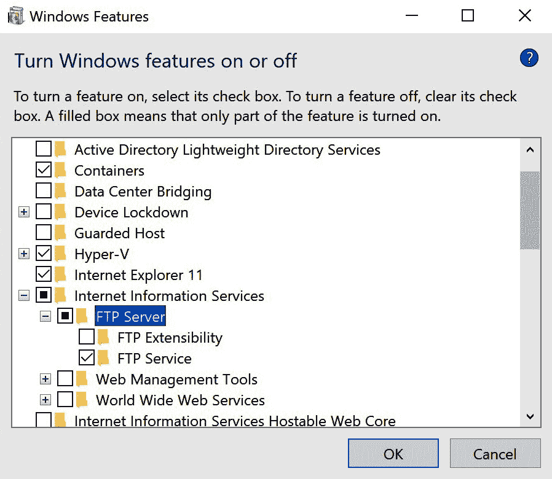

# 网络导航者

*构建高性能* *网络应用程序*

软件很少孤立存在。对于系统程序来说，这一点更是如此。由于这些程序不直接与用户交互，它们依赖于其他软件来提供输入，读取它们的输出，并被告知要做什么。那个“其他软件”通常位于同一台机器上，但同样经常，那个软件运行在其他地方。

到目前为止，我们已经讨论了如何将数据传输到我们的应用程序以及从我们的应用程序中传输数据，并简要地了解了网络。本章将专注于这个特定主题：网络。准备好深入到互联软件的世界吧！

在本章中，我们将探讨以下主题：

+   基础知识和 OSI 层

+   探索 System.Net 命名空间（包括最常用的协议）

+   使用 System.Net.Sockets 以获得更多控制

+   异步、非阻塞网络

+   如何提高网络性能

+   网络错误和超时，以及如何处理这些问题

我们即将跳出盒子，连接到外部世界。让我们出发吧！

# 技术要求

本章的所有代码示例都可以在[`github.com/PacktPublishing/Systems-Programming-with-C-Sharp-and-.NET/tree/main/SystemsProgrammingWithCSharpAndNet/Chapter08`](https://github.com/PacktPublishing/Systems-Programming-with-C-Sharp-and-.NET/tree/main/SystemsProgrammingWithCSharpAndNet/Chapter08)找到。

# 基础知识

我们已经讨论了 OSI 模型。但为了快速回顾，OSI 模型定义了构成系统的层，使我们能够与其他系统通信。这些层从最低层开始，描述网络适配器应该能够处理的电压，到最高层，描述使用网络的程序。

## OSI 层的漫步

我想再次带你们走过所有层，详细说明每一层发生的事情。为此，我想讨论一个用户使用 FTP 发送数据的情况。**FTP**，即**文件传输协议**，是一种较老的技术，几乎不再使用，用于向远程机器发送数据或从远程机器获取数据。

FTP 曾经是实现这一点的最佳方式，但由于缺乏安全功能，人们转向了其他方式。我们稍后会讨论其中的一些，但我们仍然可以使用 FTP 来了解 OSI 模型。这使得事情更容易理解。

一个 FTP 客户端可以简单到只是一个控制台应用程序。实际上，几乎所有的 FTP 客户端都是这样。也有基于 GUI 的客户端，但它们只是 FTP 命令的包装器。

要传输文件，用户启动 FTP 客户端，指定要连接的服务器，并可选地传递凭据。然后，用户使用 `GET` 和 `PUT` 等命令来传输文件。另一个命令是 `LS`，用于获取远程目录的内容。我们还有 `MKDIR` 命令来创建远程目录和其他类似命令。

因此，让我们假设用户正坐在他们的机器上，并想要登录到远程计算机。为此，用户在命令提示符中输入 `ftp username:password@127.0.0.1`。这会做几件事情：

1.  它启动了 FTP 的命令行版本

1.  然后它告诉它连接到地址为 127.0.0.1 的计算机（如您可能记得，这是本地主机）

1.  它提供服务器需要的用户名和密码。

几秒钟后，客户端列出请求位置中的所有文件。但是当用户按下 *Enter* 键时，计算机里会发生什么？

在启动应用程序后，FTP 客户端接管。

命令和数据通过 OSI 层流动。让我向您展示会发生什么：

+   **第 7 层**：应用程序在 OSI 第 7 层，即应用层运行。应用程序中的 FTP 协议随后建立连接。FTP 创建两个连接：一个用于控制命令，一个用于数据传输。

+   `open` 命令将字符串格式转换为 8 位 ASCII 格式。如果需要加密，这里也会处理。毕竟，第 6 层是关于如何呈现数据的问题。

+   **第 5 层**：会话层随后接管。这一层是实际连接到远程机器的地方。这一层会监控连接，确保其可靠性和稳定性。当不再需要时，它也会关闭连接。

+   **第 4 层**：之后，传输层确保包含命令的数据被分成更小的数据包，并按正确顺序发送出去。FTP 使用 TCP，这意味着第 4 层负责在接收数据时重新排列顺序错误的数据包。错误检查也在这里发生。

+   **第 3 层**：网络层是 **互联网协议**（**IP**）所在的地方。第 3 层的此协议负责找到到达远程机器的最佳路由。它还处理数据包转发和重新路由。

+   **第 2 层**：然后，我们到达数据链路层。这一层向数据包添加数据，例如数据需要到达的下一台机器的 MAC 地址。它负责节点到节点的通信。如果你使用 Wi-Fi，这一层会准备数据以便通过无线电波发送。

+   **第 1 层**：最后，我们到达物理层。这一层实际上是数据传输的地方。如果你使用 Wi-Fi，这一层会将数据转换为无线电信号。它处理所有硬件问题，例如使用的频率和信号的强度。

幸运的是，大部分工作都是在操作系统或 BIOS 层面上完成的。我们设置网络连接时不必担心频率。我们通常处理 **第 7 层** 和 **第 6 层**，有时还会处理 **第 5 层**。我们编写应用程序（**第 7 层**）。如果我们有自己的协议，我们会定义表示（**第 6 层**）。有时我们可能还需要担心实际连接，所以我们偶尔会处理 **第 5 层**。

小贴士

BCL 和 CLR 有许多类、工具和辅助工具，使我们能够专注于乐趣，而不必担心细节。但有时，作为系统程序员，我们必须担心这些细节。这些细节可能是伟大、快速和稳定的系统与平庸系统之间的区别。但不用担心：我们在这里的章节中涵盖了所有内容！

在我们能够做到这一点之前，让我们看看在网络上传输数据的常用方式。

# 探索 System.Net 命名空间

很有可能，如果你需要一种传输数据的方法，其他人已经想出了做这件事的最佳方式。

例如，你可以编写所有代码来在机器之间传输文件，或者使用 FTP 并依赖现有软件。

事实上，有很多种传输数据的方式。其中许多方式已经标准化到成为 BCL 的一部分。你可以使用它们而无需处理第三方 NuGet 包。让我们讨论 System.Net 命名空间中的一些提供项，看看我们能用它们做什么。

## 理解 HTTP/HTTPS

HTTP 是使数百万用户最终能够使用互联网的协议。在 HTTP 之前，交换数据的唯一方式是通过技术复杂的协议，其中大多数都需要通过命令行控制。当蒂姆·伯纳斯-李爵士发布了他关于万维网和伴随的**超文本传输协议**（**HTTP**）的想法时，那些技术背景很少或没有的人也可以使用网络。网络浏览器使四处走动和查找信息变得容易。当然，当我说容易时，我的意思是比以前更容易。在 20 世纪 90 年代初，我们没有 Google 或 Bing，所以与今天相比，找到有趣的网站是一种挑战。

*HTTP 使互联网民主化*。在此之前，它是科学家和军事人员的领域，还有一些为了平衡而加入的极客。是的，我就是那些极客之一：我第一次在 1987 年通过 SMTP、Gopher、FTP 和 Usenet 使用互联网。HTTP 和万维网使这一切变得容易得多。

为其编程并不那么容易。然而，随着当前的框架，从全球任何地方的任意网站获取数据只需要几行代码。让我给你看看：

```cs
using var client = new HttpClient();
try
{
    string url =
        "https://jsonplaceholder.typicode.com/posts";
    HttpResponseMessage response =
        await client.GetAsync(url);
    response.EnsureSuccessStatusCode();
    string responseBody =
        await response.Content.ReadAsStringAsync();
    responseBody.Dump(ConsoleColor.Cyan);
}
catch(HttpRequestException ex)
{
    ex.Message.Dump(ConsoleColor.Red);
}
```

在第一行，我们创建了一个`HttpClient`类的实例。这个类是一个有用的辅助工具：它减少了旧版`HttpWebRequest`的许多复杂性。尽管`HttpWebRequest`在`HttpClient`之上提供了一些优势（例如，对头部的更多控制、设置超时的选项，以及在需要时使用同步数据传输的能力），但`HttpClient`无疑是更好的选择。

使用虚拟服务器进行测试

如果你想要玩转 HTTP 和 HTTPS，你需要一个可靠且易于使用的网站来连接。[`jsonplaceholder.typicode.com/`](https://jsonplaceholder.typicode.com/) URL 是这种情况下的一个很好的网站。它提供了几个端点来连接、读取和发送数据。它使用简单，而且是免费的。请查看该网站，看看它提供了什么。

在声明 URL 之后，我们使用该 URL 调用`GetAsync`方法。这个异步操作返回`HttpResponseMessage`类的实例。这个类包含了我们读取远程服务器数据所需的所有内容。

下一个调用只是一个简单的错误检查的快捷方式。调用`EnsureSuccessStatusCode`除了查看服务器的返回代码之外几乎不做任何事情，如果它不在 200 范围内，它会抛出一个错误。正如你可能知道的，HTTP 请求返回一个数字状态码，告诉你调用结果是什么。200 到 299 之间的所有代码都表示你的调用成功了。例如，404 代码表示网站不可达，等等。

这种单一的方法可以使你的代码比`if`语句更易于阅读。

如果一切正常，我们继续读取实际数据。响应有几个属性，其中一个是`Content`。其他属性包括状态码、头信息等。

`Content`，类型为`HttpContent`，是`Stream`的包装器，它允许我们从服务器读取数据。在我们的例子中，我们调用`ReadAsStringAsync`，它接受服务器可以给出的所有数据，并将其作为字符串返回给我们。当然，所有这些都是在异步中发生的。

最后，我们在控制台上显示那个字符串。

这是我能想到的 HTTP 使用最简单的例子。这里展示的所有类都有许多更多的用例、方法和辅助工具，这些都可以为你带来好处。我建议你查看`HttpClient`、`HttpResponseMessage`、`HttpContent`和其他类的文档，看看你还能用它们做什么。同时，让我们看看其他协议。

## FTP

我们之前见过 FTP。我使用它来说明通过 OSI 模型的动作流程。但我们从未彻底探索过我们可以用它做什么。

FTP 是一种较老的技术。它现在不再被广泛使用，但它仍然有益。它是一种快速、易于理解的技术，可以在机器之间传输文件和控制远程文件系统，无论底层操作系统是什么。它是快速且可靠的。大多数操作系统都支持 FTP 作为客户端和服务器。

在 Windows 中，你可以通过访问控制面板设置中的**程序和功能**部分来启用 FTP 服务器，在那里，在**互联网信息服务**下，你可以看到安装 FTP 服务器的选项。或者，你可以按*Win* + *R*，然后输入可选功能。参见*图 8.1*了解其外观。



图 8.1：在 Windows 上安装 FTP 服务器

然而，请确保你知道你在做什么。我们不再那么频繁地使用 FTP 的一个原因是因为它默认不安全。为了传输文件，最好使用像 SFTP 这样的东西，它是一个安全的版本。

但如果你想在安全的环境中（例如在 Kubernetes 集群中）快速轻松地传输文件，那么古老的 FTP 仍然是你的朋友。

那么，你如何读取远程目录的内容呢？很简单：使用这段代码！

```cs
public static void FetchDirectoryContents(string ftpUrl, string username, string password)
{
    var request = (FtpWebRequest) WebRequest.Create(ftpUrl);
    request.Method = WebRequestMethods.Ftp.ListDirectoryDetails;
    request.Credentials = new NetworkCredential(username, password);
    try
    {
        using (var response = (FtpWebResponse) request.GetResponse())
        {
            using (var streamReader = new StreamReader(response.GetResponseStream()))
            {
                var line = string.Empty;
                while ((line = streamReader.ReadLine()) != null)                   Console.WriteLine(line);
            }
            $"Directory List Complete, status {response.               StatusDescription}".Dump(ConsoleColor.Cyan);
        }
    }
    catch (WebException ex)
    {
        var status = ((FtpWebResponse) ex.Response).StatusDescription;
        $"Error: {status}".Dump(ConsoleColor.Red);
    }
}
```

如你所见，这里的代码相当直接。我们创建了一个`WebRequest`的实例并将其转换为子类：`FtpWebRequest`。我们通过设置方法为`ListDirectoryDetails`来指定我们想要做什么。如果需要，我们添加一些凭据，并获取包含所需数据的流。当然，我们也会处理异常。

太好了！但是等等…这实际上并不那么好。

如果你在这款编辑器中这样做，你会看到警告：“`WebRequest`（以及因此`FtpWebRequest`）已被标记为过时。它们已被更好的`HttpClient`所取代。不幸的是，它不能用于 FTP 站点：它仅适用于 HTTP 流量。

我认为微软在这里犯了一个错误。但这是他们的框架，所以他们可以随心所欲。好消息是，有很多 NuGet 包可以做到我们想要的事情。一个是*FluentFtp*，你可以在[`github.com/robinrodricks/FluentFTP`](https://github.com/robinrodricks/FluentFTP)这个 URL 找到。在这里，我想提到的是，我与此书提到的任何 NuGet 包都没有关联；这些只是我使用的包。当然，有很多不同的选项可供选择，所以请选择对你有用的任何一种。

## 电子邮件协议

HTTP 是公共互联网上使用最广泛的协议，无论是处理它的服务器数量还是处理的数据百分比。但排在第二位的是 SMTP。**SMTP**，即**简单邮件传输协议**，用于电子邮件。SMTP 只是与电子邮件相关的协议之一。让我们来看看这些协议中的每一个：

+   **SMTP**：简单邮件传输协议用于在互联网上发送邮件。它是面向连接的，这意味着它的主要任务是确保发送邮件的客户机和处理邮件的服务器之间的连接。它是可靠的（这意味着如果传输过程中数据丢失，它可以恢复）。

+   **POP3**：POP3 是**Post Operation Protocol**的第三版。这个协议处理另一边：SMTP 确保邮件被发送到服务器，而 POP3 允许用户从服务器读取邮件。POP3 允许离线访问电子邮件，但一次只能访问一个邮箱。如果你想读取多个邮箱（或者说是账户），你需要设置多个 POP3 连接。

+   **IMAP**：IMAP 代表**互联网消息访问协议**。这个协议也是为了从服务器读取邮件。但这个协议可以一次性读取多个邮箱。IMAP 可以在不下载邮件的情况下访问、搜索、操作和删除您的电子邮件。它可以通过 RPC 方式（我们在*第七章*中广泛讨论了 RPC）将这些命令发送到服务器。

+   **MIME**：尽管缩写中没有 P，**MIME**也是一个协议。它是**多用途互联网邮件扩展**协议的缩写。正如其名所示，它是一个扩展，允许我们在邮件消息中包含附件、多媒体和非 ASCII 字符。

所有这些协议都使我们能够拥有一个功能齐全、完整的邮件体验。

### 发送电子邮件

话虽如此，大多数软件发送邮件消息；它们几乎从不读取它们。所以，让我们看看一个简单的代码示例，说明如何发送电子邮件。我提供的示例代码由三部分组成。让我们来看看它们：

```cs
using System.Net.Mail;
// Create the mail message
MailMessage mail = new MailMessage();
mail.From = new MailAddress("dennis@vroegop.org");
mail.To.Add("dearreader@thisbook.com");
mail.Subject = "Hi there System Programmer!";
mail.Body =
    "This is a test email from the System Programming
      book.";
```

显然，我们需要一个消息。否则，我们为什么要连接到 SMTP 服务器？

消息的类型是`MailMessage`。它需要一个发送者，并且可以有多个收件人。这些收件人可以在`收件人`、`抄送`或`密送`字段中。`收件人`、`抄送`和`密送`都是列表，因此您可以添加多个收件人。当然，您至少需要提供`收件人`。

我们可以提供一个`主题`字段。当然，我非常鼓励您这样做。然后我们有一个`正文`字段，它包含我们想要发送的消息。

一旦我们有了消息，我们就可以创建`SmtpClient`类的实例。

当然，您需要能够访问一个真实的 SMTP 服务器。大多数互联网服务提供商都有，所以请查阅他们的文档了解如何连接到它们。您通常需要一个用户名和密码来验证自己。在以前的日子里，有匿名服务器，但如今在垃圾邮件泛滥的时代，这些服务器非常难以找到。

我们必须指定服务器的地址和端口（端口`25`是旧端口；端口`587`是新端口，也是推荐使用的安全端口），并且您可以指定是否要使用 SSL。这段代码看起来是这样的：

```cs
// Set up the connection to the SMTP server
// And no, this is NOT a valid SMTP server. Use your own :)
SmtpClient client =
    new SmtpClient("smtp.vroegop.org");
client.Port = 587;
client.EnableSsl = true;
client.Credentials =
    new System.Net.NetworkCredential(
        "dennis@vroegop.org",
        "MySuperSecretPassword");
```

最后，我们可以发送消息！

```cs
// Send the email!
client.Send(mail);
```

一旦您设置了客户端，您可以使用相同的客户端实例发送多个消息。您不必担心设置连接。您只需调用`Send`，一切都会正常工作。

### 发送 HTML 消息

之前的例子工作得很好，但消息有点平淡。如今，消息要丰富多彩得多，看起来也更令人愉快。要做到这一点，就是发送一个 HTML 消息。您可以通过在`正文`字段中放入 HTML 并设置`MailMessage`的`IsBodyHtml`属性为 true 来实现。但这样做并不是最佳方式，以下有两个原因：

+   并非所有客户端都支持 HTML。如果他们的客户端不支持 HTML，读者必须解析 HTML 以找到正文文本。

+   只包含 HTML 的消息通常会被标记为垃圾邮件。

做这件事的最好方法是将你精心制作的 HTML 正文和更接地气的纯文本正文结合起来。你可以通过使用`AlternateView`类来实现这一点。创建邮件消息的代码如下：

```cs
var multipartMail = new MailMessage();
multipartMail.From = new MailAddress("dennis@vroegop.org");
multipartMail.To.Add("dearreader@thisbook.com");
multipartMail.Subject = "Hi there System Programmer!";
var htmlBody = "<html><body><h1>Hi there System Programmer!</h1></body></html>";
var htmlView =
    AlternateView.CreateAlternateViewFromString(
        htmlBody,
        null,
        "text/html");
var plainView =
    AlternateView.CreateAlternateViewFromString(
        "This is a test email from the System Programming book.",
        null,
        "text/plain");
multipartMail.AlternateViews.Add(plainView);
multipartMail.AlternateViews.Add(htmlView);
```

我们创建了一个常规的`MailMessage`类实例。大多数字段都是相同的。但我们没有指定正文。相反，我们通过调用`CreateAlternateViewFromString`静态方法创建了两个`AlternateView`类实例。该方法接受我们想要发送的内容（HTML 或纯文本）以及我们使用的编码（我们将其设置为`NULL`，因此使用机器的默认设置）。我们确实需要指定内容类型。第一个包含`"text/html"`，第二个包含`"text/plain"`。

我们然后将这两部分添加到`MailMessage`实例中，并发送它。

代码的其他部分保持不变。

这涵盖了部分高级类。现在是时候深入探究这个兔子洞了。

# 在使用`System.Net.Sockets`命名空间时

默认协议非常出色。它们减少了大量的手动工作。我们不必自己编写 HTTP 协议；我们可以专注于内容。同样适用于 SMTP、POP3 以及所有其他协议。如果你想要使用的协议足够流行，你可以找到一个类或 NuGet 包。

但当然，有时你找不到那个包。有时，你想编写自己的协议。在这种情况下，你必须自己完成所有艰苦的工作。但是，我必须诚实地说，我非常享受这个过程。编写自己的协议，将其部署在我的应用程序中，并看到它们协同工作，这很有趣。即使你不享受这个过程，也有时候你别无选择。

好消息是，编写 BCL 的善良的人们已经做了很多底层工作。

在*第六章*中，当我们讨论系统如何通信时，我们遇到了`Socket`类。套接字被提及为一种选项。我们编写了一个简单的聊天应用程序，该程序使用 TCP/IP 进行通信。TCP/IP 是套接字可以连接的方式之一。

在我提到的聊天示例中，我们创建了`TcpListener`和`TcpClient`类的实例。这些类是更通用的`Socket`类的包装器。它们专门用于 TCP/IP 连接，并处理了使这一切工作所需的大部分管道工作。

你当然可以使用套接字。这意味着你必须自己完成大部分工作，这让你对发生的事情有更多的控制。

你可以使用套接字进行 TCP 和 UDP 连接。我们在*第六章*中探讨了它们之间的差异，所以在这里我们不会再次比较。然而，如果你想使用 UDP，你应该使用`Socket`类：显然，`TCPClient`将不起作用。顺便说一下，还有一个`UdpClient`类，你可以用它达到相同的结果。但是，我想让你了解其内部工作原理。这就是为什么我选择使用`Sockets`的原因。

## 使用套接字时的步骤

当与套接字一起工作时，你需要采取一些步骤：

1.  选择正确的套接字。你可以使用流套接字。流套接字基于 TCP 协议。它是一个可靠、面向连接的协议。但你也可以选择数据报套接字。这些基于 UDP 协议。它们是无连接的、一次性通信方式。它很快，但你无法保证数据会到达预期的接收者。

1.  然后，你创建套接字。你指定你想要使用的地址类型（IPv4 或 IPv6）、套接字类型（流或数据报）和协议（TCP 或 UDP）。

1.  是时候连接了。你可以监听传入的连接或连接到某个服务器。当你连接到远程服务器时，你必须指定 IP 地址和端口。如果你在监听，你至少需要端口，如果你有更多的网络连接，你可能还想指定你正在监听的 IP 地址。

1.  发送和接收数据。毕竟，我们在这里就是为了这个，对吧？

1.  当你完成时，你必须确保关闭连接。你不希望长时间保持连接：你可能会妨碍其他应用程序。

就这些了。如果我这样说，看起来很简单，不是吗？嗯，魔鬼在细节中！

## IPv4 和 IPv6

我们需要稍微谈谈 IP 地址。IP 地址，即**互联网协议**地址，是一个唯一标识网络设备的数字。它在边界内是唯一的，但稍后我们将讨论这一点。我们可以使用两种类型的地址：IPv4 和 IPv6。正如你可能已经猜到的，这些缩写分别是互联网协议版本 4 和版本 6。

第一个公开使用的版本是 IPv4。IPv5 从未见过天日，留下了两个版本。我们一直的想法是完全用 IPv6 替换 IPv4，但看起来 IPv4 还会存在一段时间。

一个 IPv4 地址由 4 个字节组成，因此它有 32 位长。这个大小意味着理论上大约有 43 亿个唯一的地址。实际上，由于许多范围被保留，所以更少。我们已经遇到了其中之一：地址是`127.0.0.1`。这是设备的地址本身。

尽管不同的系统可以保留不同的端口范围，但我们对于应该避免使用哪些范围或可以使用哪些范围有一个共同的理解。这些范围是这样解释的：

+   **端口 0 – 1023**：知名端口。这些端口到处都在使用，你不应该自己使用它们。

+   `1433`，由 SQL Server 使用。然而，这些并不是像`0` – `1023`范围那样严格分配的。

+   **端口 49152 – 65535**：这个范围被称为动态或私有范围。它们通常用于临时或短暂的通信。它们通常由操作系统动态分配。

只确保你选择的端口在你打算使用的系统上尚未被占用！

IPv6 地址由 8 组 2 字节的结构组成，长度为 128 位。你可以在那个地址空间中放入大量地址：大约有 340 个十一万亿个唯一的地址。

大数字

与计算机打交道意味着你有时会遇到大数字。这是一个例子：一个十一万亿等于 10 的 36 次方。这意味着这个数字是 340 后面跟着 36 个零。这有很多地址。

IPv6 地址显示为 8 组 16 位十六进制值的序列。例如，一个有效的地址可能看起来像这样：`2001:0db8:85a3:0000:0000:8a2e:0370:7334`。

这也是一个有趣的地址：`0000:0000:0000:0000:0000:0000:0000:0001`。这是 127.0.0.1 的 IPv6 版本。换句话说，这就是 localhost。然而，它相当长：有 7 组`0000`。在 IPv6 中，我们可以通过两个冒号省略一系列的`0000`值。因此，我们可以将 localhost 的地址缩短为::1。

在 IPv4 和 IPv6 中，我们都预留了地址范围。例如，`192.168.0.0`到`192.168.255.255`范围内的所有地址都用于内部网络。然而，你不能将这些地址分配给面向公共网络的设备。对于地址`10.0.0.0`到`10.255.255.255`和`172.16.0.0`到`172.31.255.255`也是如此。

## 使用套接字查找时间

是时候看看如何真正地做这些了。

有些服务器充当时间服务器。这些服务器只有一个目的：等待你的连接，然后响应当前的日期和时间。他们这样做的方式非常有趣：他们计算发送响应所需的时间，并相应地调整时间，从而确保答案尽可能准确。

让我们看看一些代码：

```cs
public DateTime GetNetworkTime(string ntpServer = "pool.ntp.org")
{
    // NTP message size - 16 bytes (RFC 2030)
    var ntpData = new byte[48];
    // Setting the Leap Indicator, Version Number and Mode values
    ntpData[0] = 0x23; // LI, Version, Mode
    var addresses = Dns.GetHostEntry(ntpServer);
    var ipEndPoint = new IPEndPoint(addresses.AddressList[0], 123);       // NTP uses port 123
    using (var socket = new Socket(AddressFamily.InterNetwork,       SocketType.Dgram, ProtocolType.Udp))
    {
        socket.Connect(ipEndPoint);
        socket.Send(ntpData);
        socket.Receive(ntpData);
        socket.Close();
    }
    return ConvertNtpTimeToDateTime(ntpData);
}
```

这种方法从服务器的默认名称值开始。我们使用[pool.ntp.org](http://pool.ntp.org)作为我们的服务器，但还有许多其他服务器也能完成这项任务。它们都使用 NTP 协议（**NTP**意味着**网络时间协议**，以防你有所疑问）。NTP 是最古老的协议之一。早在 80 年代初，系统就使用这个协议来通过网络同步计算机的时钟！

我们使用的地址`pool.ntp.org`不是一个单独的计算机，而是一个包含数千个 NTP 服务器的池，确保每个人都能获取到时间。然而，我们可以将其视为一个单独的服务器。哦，有一点需要注意：该 URL 旨在由 NTP 客户端使用。它们使用端口`123`，正如你在代码中所见。如果你使用浏览器访问该地址，你将自动使用 HTTP，因此端口`80`（在那个地址上没有 HTTPS 服务器）。这意味着你将看到该池维护者想要放置的内容。不要使用浏览器访问该 URL；使用它应有的端口`123`！

向 NTP 服务器请求需要一个 48 字节的缓冲区来存储答案。当我们连接到服务器时，我们需要在缓冲区中添加一些数据，告诉它我们想要什么。在我们的情况下，我们给它值 0x23。这个字节由 3 组位组成，每组位告诉服务器我们想要什么。查看以下表格以了解这些位的含义：

| **位** | **名称** | **描述** |
| --- | --- | --- |
| 6-7 | 闰秒指示器 | 表示我们是否想要考虑一个月可能有的闰秒。0 表示没有调整，1 表示该月的最后分钟有 61 秒，2 表示该月的最后分钟有 59 秒，3 表示时钟未同步。 |
| 4-6 | 版本 | 我们想要使用的协议版本。最新版本是 4。 |
| 0-3 | 模式 | 0：保留 1：对称主动 2：对称被动 3：客户端 4：服务器 5：广播 6：NTP 控制消息 7：保留 |

表 8.1：NTP 服务器的设置

我们不想使用闰秒调整。我们感兴趣的是使用协议版本 4。我们在这里是客户端。这意味着我们必须做一些位运算。从最高有效位到最低有效位工作，我们得到位 6 和 7 为 00，位 4、5 和 6 为 100，最后位 0 到 4 为 011。如果我们组合这些，我们得到 0010 0011，或十进制的 23。

我们将这个值放在 48 字节长缓冲区的第一个字节中，我们将把这个缓冲区给服务器。

我们有 NTP 服务器的名称（`pool.ntp.org`），但我们需要该机器的实际 IP 地址。毕竟，套接字需要一个地址而不是一串文本。`var addresses = Dns.GetHostEntry(ntpServer);`，我得到了 4 个 IP 地址。

我们取回的第一个地址，并使用该地址和端口`123`创建一个`IPEndPoint`类的实例。

然后，我们可以创建一个`Socket`类的实例。我们给它`AddressFamily` `InterNetwork`，这意味着我们想要使用 IPv4 地址。我们还指定我们将使用数据报，因此我们使用 UDP。

混合流、数据报、TCP 和 UDP

您必须指定您想要使用的套接字类型和协议类型。然而，如果您使用`SocketType.Stream`，您还必须使用`ProtocolType.TCP`。如果您想使用`SocketType.DGram`，您也必须使用`ProtocolType.UDP`。如果您尝试混合这些（例如，您想要 TCP 上的数据报），则在运行时会出现异常。所以，请小心选择。

我们在套接字上调用`connect`，给它我们创建的端点。之后，我们向服务器发送一个包含关于`leap`、`version`和`mode`信息的 48 字节缓冲区。接下来，我们通过调用`Receive`来尝试获取答案，使用相同的缓冲区。

当然，当我们得到答案时，我们关闭连接。

一旦收到答案并安全地存储在我们的缓冲区中，我们就可以进行一些计算，将数据转换为我们可以在`DateTime`结构中使用的格式。我们称之为特定代码片段，它包含不同格式之间的转换、位交换等。它们与从服务器获取数据无关，所以我将其省略。GitHub 上的示例有这段代码，如果你想看看它是什么样子，请查看。

处理套接字的代码并不复杂。但这个代码存在一个问题。这就是我们所说的**阻塞代码**。它在调用 NTP 服务器期间会阻塞整个线程。让我们来修复它。

# 异步、非阻塞网络

到现在为止，你应该已经很明显，你必须确保你代码中的所有非即时操作都可能是性能问题。慢速操作可能会阻止进程继续。文件 I/O 是这种操作适用的一个领域。网络甚至比这还要慢。所以，我们可以异步执行的所有操作都应该以这种方式实现。

好消息是，大多数处理网络的类都有它们方法的异步版本。坏消息是，对于`Socket`来说，这并不像你希望的那样简单直接。但不用担心：我们很快就会解决这个问题！

## 进行异步调用

在之前的示例中，我们使用了静态的`Dns`类来获取 NTP 服务器的地址信息。我们调用了`GetHostEntry()`，这是一个同步阻塞调用。我们可以很容易地修复这个问题：`Dns`有这些方法的异步版本。我们可以重写调用，使其看起来像这样：

```cs
var addresses = await Dns.GetHostEntryAsync(ntpServer);
```

当然，方法签名也需要改变。而不是有这个方法声明：`public DateTime GetNetworkTime(string ntpServer = "``pool.ntp.org")`。

我们将其改为如下：

`public async Task<DateTime> GetNetworkTimeAsync(string ntpServer = "``pool.ntp.org")`

我们将其改为`async`，将返回类型改为`Task<DateTime>`而不是`DateTime`，并将方法重命名为带有`Async`后缀。

这很简单。我们可以对与`Socket`一起工作的代码做同样的处理。这是完整的方法：

```cs
public async Task<DateTime> GetNetworkTimeAsync(string ntpServer = "pool.ntp.org")
{
    // NTP message size - 16 bytes (RFC 2030)
    var ntpData = new byte[48];
    // Setting the Leap Indicator, Version Number, and Mode values
    ntpData[0] = 0x23; // LI, Version, Mode
    var addresses = await Dns.GetHostEntryAsync(ntpServer);
    var ipEndPoint = new IPEndPoint(addresses.AddressList[0], 123);       // NTP uses port 123
    using (var socket = new Socket(
               AddressFamily.InterNetwork,
               SocketType.Dgram,
               ProtocolType.Udp))
    {
        await socket.ConnectAsync(ipEndPoint);
        await socket.SendAsync(
            new ArraySegment<byte>(ntpData),
            SocketFlags.None);
        await socket.ReceiveAsync(
            new ArraySegment<byte>(ntpData),
            SocketFlags.None);
    }
    return ConvertNtpTimeToDateTime(ntpData);
}
```

这个版本利用了 async/await 模式，因此对服务器的调用不会阻塞线程。

小贴士

网络代码应始终使用异步方法而不是同步方法。与 CPU 和本地机器的原始速度相比，网络较慢，那么为什么还要浪费时间等待网络适配器缓慢的数据流呢？

然而，当使用网络时，有方法可以改进你系统的性能。让我们接下来看看那些方法。

# 网络性能

由于网络相对较慢，我们必须在提高数据吞吐量的方法上变得聪明。我们可以控制本地网络，确保我们到处都有光纤和超级快速的路由器，但这并不能解决问题。即使是最快的物理网络也比 CPU 处理的数据要慢得多。当然，拥有快速的硬件有帮助。但这只帮助我们的网络：我们无法控制其他网络上的硬件。我们必须在代码中变得聪明，以充分利用我们的网络。再一次，这都取决于我们，开发者！

## 连接池

连接代表客户端和服务器之间的开放线路。让我们看看以下代码行：

```cs
var client = new TcpClient("my.server.com", 123);
```

这行代码很简单：它创建了一个连接到名为 `my.server.com` 的服务器，端口为 `123`，并返回打开的连接。很好。我们之前见过。但是让我给你看看运行这行代码会发生什么：

+   将 `my.server.com` 字符串转换为我们可以使用的正确 IPv4 或 IPv6 地址。

+   实例化 `Socket` 类，为其分配内存并确保其可用。

+   向服务器发送 `SYN`。基本上，客户端在问：“嘿，我们可以交谈吗？”

+   当接收到 `SYN` 消息时，它会响应 `SYN-ACK`，表示它已准备好进行通信。

+   `SYN-ACK`，这表明网络工作正常，并且它们可以进行通信。

当这一切都发生后，通信线路就打开了，并准备好使用。我们可以开始发送和接收数据。

如你所见，那简单的一行代码涉及到很多工作。你可以想象客户端和服务器之间的握手过程需要花费很多时间。网络连接是昂贵的！

这一点无法回避。这些步骤必须执行。但是，没有必要做得比你需要的更多。如果你已经连接到服务器，你也可以重用它。我们称之为连接池。我们创建一个连接池，每当我们的系统需要与服务器通信时，我们返回已经创建的连接。

很不幸，BCL 没有为此提供类。但是自己写一个并不太难。你可以这样做。

我们创建了一个名为 `TcpClientConnectionPool` 的类。其签名如下：

```cs
internal class TcpClientConnectionPool : IAsyncDisposable{}
```

这个类中有三个方法：

```cs
public TcpClient? GetConnection(){}
public void ReturnConnection(TcpClient? client) {}
public async ValueTask DisposeAsync(){}
```

在我们查看这些方法之前，我们需要在类中创建两个私有字段：

```cs
private readonly ConcurrentBag<TcpClient?> _availableConnections = new();
private readonly int _maxPoolSize = 10; // Example pool size
```

当你创建一个用于存储对象的池时，你需要一个地方来存储它们。我们在这里使用 `ConcurrentBag<T>`。`ConcurrentBag` 是一个线程安全的集合，具有以下特性：

+   **线程安全**：你可以添加、访问和删除对象，而无需担心锁或其他线程的干扰。这个类为你处理这些细节。

+   **无序**：没有特定的顺序。在我们的情况下，这完全没问题。然而，如果你想使用类似 FIFO 的东西，你应该使用内置顺序的类。

+   **允许重复**：如果你想，可以将相同的对象添加到集合中。

+   **性能**：这个类针对同一线程添加或删除项目的情况进行了优化，但在混合场景中表现也相当不错。

`GetConnection()`方法如果池中有可用对象，则从中拉取一个对象。如果没有，它会为您创建一个。下面是这个方法：

```cs
public TcpClient? GetConnection()
{
    if (_availableConnections.TryTake(out TcpClient? client))
        return client;
    if (_availableConnections.Count < _maxPoolSize)
    {
        // Create a new connection if the pool is not full
        client = new TcpClient("my.server.com", 443);
    }
    else
    {
        // Pool is full; wait for an available connection or throw an         // exception
        // This strategy depends on your specific requirements
        throw new Exception("Connection pool limit reached.");
    }
    return client;
}
```

在这个示例中，当池达到最大允许对象数时，我会抛出一个异常。您希望在代码中限制`TcpClient`实例的数量：它们占用相当多的内存和底层句柄，因此让它们无限期地存在可能不是最好的主意。

如果池中有空间但没有可用项，我们创建一个新的并返回给调用者。这个想法是，在使用后，调用者将对象返回，我们将其存储在集合中，以便其他用户可以取用。在这里我们使用懒加载初始化：只有在需要时才创建`TcpClient`。

如果您愿意，可以在这个类的构造函数中创建所有 10 个实例。这使得类的初始化变慢，并且占用更多内存，但在对象的整个生命周期中运行得更快。

当连接用户调用此方法时，它会获得一个活跃和开放的连接。当用户不再需要`TcpClient`时，它需要返回以便存储在池中，并准备好供下一个用户使用。这个方法看起来是这样的：

```cs
public void ReturnConnection(TcpClient? client)
{
    // Check the state of the connection to ensure it's still valid
    if (client is { Connected: true })
    {
        _availableConnections.Add(client);
    }
    else
    {
        // Optionally, handle the case where the connection is no         // longer valid
        // e.g., reconnect or simply discard this connection
    }
}
```

当我们获取`TcpClient`时，我们可以进行一些检查。例如，我通常检查它是否仍然连接。这有点像图书馆：当你归还物品时，他们期望它们是完好的。我们在这里也这样做。如果有问题，我们可以修复它，或者甚至不将其放回池中。我将这个决定留给您。

最后，当连接池被释放时，我们进行一些清理工作：

```cs
public async ValueTask DisposeAsync()
{
    foreach (var client in _availableConnections)
    {
        if (client is { Connected: true })
        {
            await client.GetStream().DisposeAsync();
        }
        client?.Close();
        client?.Dispose();
    }
}
```

我们遍历集合中剩余的`TcpClient`实例，如果需要则关闭它们，释放底层流，并释放实例本身。这确保我们没有留下任何打开的连接。我的母亲在我很小的时候就教了我这一点：总是要清理自己的东西！

为了完成这部分，这是您将如何使用这个类的示例：

```cs
await using var connectionPool = new TcpClientConnectionPool();
TcpClient? myConnection = connectionPool.GetConnection();
try
{
    var myBuffer = "Hello, World!"u8.ToArray();
    // Use the connection
    await myConnection.Client.SendAsync(myBuffer);
}
finally
{
    connectionPool.ReturnConnection(myConnection);
}
```

我首先创建了一个`connectionPool`的实例。显然，您不会在每个需要连接的方法调用中都这样做，但在这个简单的示例中，这样做是可以的。

然后，我尝试通过调用`GetConnection()`来获取连接；

然后，我通过获取`Hello, World`字符串，在后面加上`u8`以确保它是 UTF-8，然后将其转换为字节数组。

我可以使用我的池化连接将这个字符串发送到服务器。最后，我可以将连接放回池中。

这个示例的功能有限，并且在将其投入生产之前缺少很多必要的代码。但我确信它将帮助您走上正轨。

我们正在缓存我们的连接。但缓存还可以以许多其他方式提供帮助。

## 缓存

缓存将数据存储在附近，以便你可以重用它，而不是每次都去服务器。这听起来很简单：它可以是一个巨大的性能提升器。从您机器上的内存位置获取对象，而不是每次都去远程服务器，这似乎是一个显而易见的选择，对吧？但有一些潜在的陷阱你需要考虑。以下是最重要的几点：

+   **过时数据**：数据可能会改变。例如，我们的 NTP 示例每毫秒都会改变。话虽如此，您可能从服务器检索一次，然后添加自您获取它以来经过的本地时间。它最终会失去同步（NTP 服务器比您的本地机器更精确），但我确信这不会很快成为一个大问题。但数据会过时。如果您在本地存储数据，您必须考虑这一点。数据会多久改变一次？我拥有最新版本的重要性有多大？

+   **内存开销**：在您的机器上本地存储项目会占用本地内存。存储大量（大）对象会占用大量数据，这可能会减慢您的整个应用程序。甚至可能导致内存不足异常。你必须决定你经常使用什么，什么可以留在服务器上。

+   **缓存失效的复杂性**：如果数据过时，你必须更新它。这需要代码来监控数据，并在需要时刷新它。这些代码可能会相当复杂。你可能有一个单独的线程来监控你的本地缓存，或者你可能决定在从缓存中拉取数据时进行。无论如何，你必须编写大量的监控代码。这可能会过度复杂化你的软件。

+   **安全顾虑**：您机器上的数据并不总是安全的。如果您在本地机器上存储敏感数据，它可能会容易受到窃听，尤其是如果您将缓存数据存储在存储介质上。请确保安全地处理敏感数据。

+   **缓存未命中成本**：当您的应用程序依赖于从缓存中获取数据，并且只有当您遇到缓存未命中（因此，项目尚未在缓存中）时才从远程服务器读取数据时，您可能引入了一个性能瓶颈。通过缓存进行逻辑操作，如果数据不可用，则转到服务器，这个过程需要时间。如果所需的数据不经常需要，这可能不是缓存的最佳案例。

+   **数据不一致**：假设您的应用程序使用缓存中的数据，但另一个系统或您的系统的一部分使用服务器中的数据。在这种情况下，数据之间可能会有差异。这不仅是不新鲜的数据，这意味着两个系统使用不同的数据——他们期望相同的数据。如果这可能是一个问题，缓存可能不是一个好主意。

缓存可以提高你的应用程序速度，但要注意其中涉及的风险。在实施之前，你应该考虑潜在的风险和收益。

## 压缩和序列化

如果通过电线传输数据较慢，传输或请求更少的数据可能会有所帮助。所以，压缩以及你如何序列化数据可能会有所帮助。在早期章节中，我们探讨了压缩和序列化，所以在这里我不会详细说明。但请记住：如果你使用压缩，这里是一个非常有帮助的地方。通过首先压缩来减少负载，你可以加快网络通信速度。当然，选择正确的序列化技术也有帮助。

由于我们已经讨论了如何进行压缩，所以我不会在这里再次展示。你已经知道如何在 `System.IO.Compression` 命名空间中使用 `GZipStream` 类（是的，这是一个提示）。

## 保持连接

创建一个 `TcpClient` 本身并不昂贵。然而，打开到服务器的连接却是昂贵的。尽量长时间保持连接打开是有帮助的。`HTTPClient` 类在这方面非常出色：它被设计成你可以长时间保持连接打开而不会妨碍你。如果你使用套接字，你也可以做类似的事情。然而，当你不再需要连接时保持连接打开并不是一个好主意。如果你不需要它，请关闭连接。否则，无论如何，保持它打开。当然，如果你保持连接打开，你也会影响到对方。一个紧紧抓住连接的客户也会限制服务器。你必须深思熟虑并做出正确的决定。

# 网络错误和超时

当处理网络时，有一条规则你必须牢记在心。那就是：*假设对方不会回应你的电话*。

服务器会宕机。连接可能会断开。网络不可达。会有很多问题（不是可能会发生的问题！）会发生。

你必须使用防御性编程来确保它不会过多地影响你的代码。当然，如果你依赖于外部机器来获取所需的数据，而这个机器不可用，你就有问题。但也许你可以绕过它。也许你可以缓存旧数据。或者，如果出现问题，你可以重试。

让我帮你提供一些你可以用来处理网络中断的策略。

## 智慧地使用 HTTPClient

`HTTPClient` 类有一些巧妙的技巧可以帮助你更稳定地使用它。例如，连接池在这个方便的类中是免费且开箱即用的。而且他们以一种相当巧妙的方式构建了这个连接池。

一般建议是创建一个 `HTTPClient` 实例并在整个系统中使用它。这个类足够智能，可以池化到服务器的连接。如果你使用同一个 `HTTPClient` 从另一个服务器获取数据，这个类会创建一个新的池，因此这些连接也会被池化。

当然，要小心你的行为：如果你不需要，不要生成到数百个服务器的连接。它们仍然会占用你的系统内存。

使`HTTPClient`更具弹性的另一种方法是使用默认配置来设置你的连接。我总是确保我设置了`DefaultRequestHeaders`，这样我知道我可以处理传入的数据。

我总是确保我的实例上有`TimeOut`。这样，我知道`HTTPClient`不会等待太久来从服务器获取数据。

我建议你使用类似`Factory`的东西来创建你的实例。我使用的一个看起来像这样：

```cs
internal static class HttpClientFactory
{
    private static HttpClient? _instance;
    public static HttpClient? Instance
    {
        get
        {
            if (_instance == null) CreateInstance();
            return _instance;
        }
    }
    private static void CreateInstance()
    {
        var handler = new HttpClientHandler()
        {
            UseCookies = true,
            CookieContainer = new CookieContainer(),
            UseProxy = false
        };
        _instance = new HttpClient(handler);
        _instance.DefaultRequestHeaders.Clear();
        _instance.DefaultRequestHeaders.Accept.Add(new           MediaTypeWithQualityHeaderValue("application/json"));
        _instance.DefaultRequestHeaders.Add("User-Agent",           "SystemProgrammersApp");
        _instance.Timeout = TimeSpan.FromSeconds(5);
    }
}
```

这个静态类在我需要时为我创建一个`HTTPClient`实例。它告诉处理程序它需要使用`Cookies`，并且我不希望在连接上使用代理。我还设置了`DefaultRequestHeaders`，并要求它接受`application/json`数据。我还添加了一个友好的用户代理，以便服务器知道它在和谁交谈。最后，我将`timeout`设置为 5 秒。

如果我需要一个`HTTPClient`实例，我可以这样获取它：

```cs
var client = HttpClientFactory.Instance;
var response = await client.GetAsync(
       "https://jsonplaceholder.typicode.com/posts");
if (response.IsSuccessStatusCode)
{
    string content = await response.Content.ReadAsStringAsync();
    $"Received: {content}".Dump(ConsoleColor.Yellow);
}
```

第一次我需要那个客户端时，它会构建它。但第二次以及之后，它将从连接池中提取它，这使得它更快，并且对错误更具弹性。

我还确保我不直接从`HTTPClient`使用`GetStringAsync()`方法或`GetStreamAsync()`。我首先获取`Response`（类型为`HttpResponseMessage`），以检查结果是否有效。正如我们所看到的，这就是`IsSuccessStatusCode`属性告诉我们的。

这样，你与 HTTP 服务器的通信将会更快，并且更加稳定。

## 使用 Polly 实现重试

当然，事情仍然可能会出错。服务器可能很忙，或者网络可能很拥挤。解决这个问题的最好方法是尝试再次尝试，然后再次尝试，直到它工作或者你放弃。

你可以自己编写那个逻辑，但使用标准库会更好。实现这个功能的常用库被称为**Polly**。

因此，让我们首先在我们的应用程序中安装那个 NuGet 包。你可以在 CLI 中使用以下命令来这样做：

```cs
Install-Package Polly
```

完成这些后，我们可以稍微修改一下我们的`HttpClientFactory`类。

首先，向那个类添加一个新的`private static`字段：

```cs
private static AsyncRetryPolicy<HttpResponseMessage> _retryPolicy;
```

这是我们的`RetryPolicy`，我们将将其应用于请求。

在`HttpClientFactory`类的`CreateInstance`方法末尾，添加对新方法的调用：`SetupRetryPolicy`。该方法看起来像这样：

```cs
private static void SetupRetryPolicy()
{
    _retryPolicy = Policy
        .Handle<HttpRequestException>()
        .OrResult<HttpResponseMessage>(r => !r.IsSuccessStatusCode)
        .WaitAndRetryAsync(
            3,
            retryAttempt => TimeSpan.FromSeconds(Math.Pow(2,               retryAttempt)),
            (outcome, timeSpan, retryCount, context) =>
            {
                $"Request failed with
                 {outcome.Result.StatusCode}.".Dump(ConsoleColor.Red);
                $"Waiting {timeSpan} before next
                 retry.".Dump(ConsoleColor.Red);
                $"Retry attempt
                 {retryCount}.".Dump(ConsoleColor.Red);
            });
}
```

在静态`Policy`类中，我们调用`Handle()`方法。我们给它`HttpRequestException`类型参数。这样，框架就知道触发重试的条件。我们还告诉它，如果`HttpResponseMessage.IsSuccesStatusCode`设置为 false，则进行重试。

如果出现这些条件之一，我们告诉策略使用`WaitAndRetryAsync`。我们要求它在第一次失败后进行三次重试。以下参数告诉`Policy`等待 2 秒、4 秒或 8 秒（2 的幂次方重试次数）。因此，每次等待的时间是前一次的两倍，以便给服务器时间来整理其数据。

我们还给它一个委托，框架将在开始重试时执行该委托。在这种情况下，我们打印一些消息到控制台，告诉它发生了什么失败，它将在尝试再次之前等待多长时间，以及它已经尝试了多少次。

在此基础上，我们可以重新编写我们请求 `HTTPClient` 数据的方式。在之前的例子中，我向你展示了如何从工厂中获取 `Instance` 并直接使用该实例。我想将这段代码移动到 `HttpClientFactory` 中。但调用服务器的请求必须被我们的新 `Policy` 包装。方法看起来是这样的：

```cs
public static async Task<HttpResponseMessage> GetAsync(string url)
{
    return await _retryPolicy.ExecuteAsync(
        () => _instance.GetAsync(url));
}
```

而不是让我们的类用户调用 `GetAsync(url)`，我们使用这个包装方法为他们做这件事。但我们把这个调用包装在 `_retryPolicy.ExecuteAsync()` 中。

将使用此工厂的原代码更改为如下所示：

```cs
var client = HttpClientFactory.Instance;
var response = await HttpClientFactory.GetAsync(
       "https://jsonplaceholder.typicode.com/posts2");
if (response.IsSuccessStatusCode)
{
    string content = await response.Content.ReadAsStringAsync();
    $"Received: {content}".Dump(ConsoleColor.Yellow);
}
```

我现在不再调用 `client.GetAsync()`，而是调用 `HttpClientFactory.GetAsync()`。其余的都没有改变。嗯，这并不完全正确。我还稍微修改了 URL。在那个 URL 中，我没有要求 `posts2` 而不是 `posts`。而且那并不存在。这应该会触发我们的重试机制。

运行它并看看会发生什么。就这样——正确地完成了重试！

## 断路器模式

类似模式的是断路器模式。这种模式检测连接是否处于故障状态，并防止系统在预定义的时间内对服务器进行调用。如果连接引发错误，断路器打开，并暂时停止与该服务器的所有通信。在那段冷却期之后，它会稍微打开一点，以便快速查看服务器。如果看起来工作正常，它将允许全流量。否则，它会放弃，并告诉你事情已经出错。

断路器也是 Polly NuGet 包的一部分。

## 验证网络可用性

尝试连接一个不存在的服务器会导致错误。但如果你自己的网络有问题会怎样？在这种情况下，它看起来就像全球的所有服务器都宕机了。

那种最后一种情况似乎不太可能，所以在责怪整个互联网之前，验证我们的网络是健康的会很好。

事实证明，这样做并不太难。你只需要一行代码：

```cs
bool isHealthy =     System.Net.NetworkInformation.NetworkInterface.GetIsNetworkAvailable();
```

这就是全部了。

你也可以这样查询你机器上的每个网络适配器：

```cs
foreach (NetworkInterface ni in NetworkInterface.GetAllNetworkInterfaces())
{
    $"Name: {ni.Name}".Dump(ConsoleColor.DarkYellow);
    $"Type:{ni.NetworkInterfaceType}".Dump(ConsoleColor.DarkYellow);
    $"Status: {ni.OperationalStatus}".Dump(ConsoleColor.DarkYellow);
}
```

我们可以遍历所有网络适配器并查看它们的状态。这可以帮助我们选择合适的适配器，从而在想要对错误和故障具有弹性时选择正确的 IP 地址。

## 监控和日志记录

这一点不言而喻：*解决问题的最佳方式是记录和监控正在发生的事情*。如果你有详细的日志记录，一旦出现问题，你更有可能找到问题。但现在我们不必过于担心这一点。

如果你遵循这些技巧和窍门，你仍然会遇到网络问题。这是不可避免的。但至少网络故障不会让你的系统崩溃。

# 下一步

在本章中，我们深入研究了网络。我们摆脱了本地机器的限制，并研究了 BCL 在连接到外部世界时为我们提供的所有好东西。

我们探讨了默认协议，如 HTTP、FTP 和 SMTP。我们还探讨了套接字，以防预定义的协议不够好，例如当你想从时间服务器查询当前时间时。我们深入研究了异步网络，并大量讨论了性能以及使我们的网络错误检测和更健壮的方法。

诚实地讲：如今几乎没有任何计算机是独立运行的。大多数机器以及运行在其上的软件，都以某种方式连接到外部世界。特别是我们作为系统程序员感兴趣的东西，并不是由用户使用，而是由其他软件使用。其中一些软件存在于其他机器上。这意味着你必须了解网络。现在你已经做到了！

我们没有讨论安全和日志记录。日志记录是我们简要提及的*第十章*的内容。安全是*第十二章*的主题。是的，这些话题如此重要，它们值得拥有自己的章节。

但在我们深入之前，让我们先去其他平台看看。由于系统编程与设备紧密相关，我觉得深入另一个设备并看看我们是否能与一些高级硬件进行通信会很有趣。所以，让我们继续前进吧！
