# 调试舞蹈篇

*调试与性能分析* *系统应用程序*

**调试**是寻找代码中的错误并确保你拥有所有知识来修复它们的艺术。这听起来很简单，不是吗？好吧，再想想。调试可能会很快变得复杂，你需要良好的策略来恢复。幸运的是，我在这里帮助你！在本章中，我们将涵盖以下主要主题：

+   调试是什么？什么是**性能分析**？

+   我们如何使用**断点**？

+   我们在 Visual Studio 中还有哪些其他调试工具？

+   我们如何处理多线程和异步系统？

+   我们如何分析和基准测试我们的代码以确保它尽可能快地运行？

调试可能会非常耗时。所以，我们不要浪费时间，开始吧。

# 技术要求

和往常一样，你可以在这个章节的 GitHub 仓库中找到所有示例的源代码，网址为[`github.com/PacktPublishing/Systems-Programming-with-C-Sharp-and-.NET/tree/main/SystemsProgrammingWithCSharpAndNet/Chapter11`](https://github.com/PacktPublishing/Systems-Programming-with-C-Sharp-and-.NET/tree/main/SystemsProgrammingWithCSharpAndNet/Chapter11)。

在这一章中，我只使用 Visual Studio；我并不是在提及任何可能做同样工作的第三方工具。然而，我将在本章末尾提供一系列替代工具的列表。

# 调试介绍

真事：我曾经为一位声称想要裁减我团队测试人员的管理者工作。他说：“如果你的团队能够表现得更好，他们就不会产生错误，因此我们可以节省测试人员的开支。”显然，他是错的。在这件事发生后不久，我就离开了那家公司。

开发软件是一项创造性的工作。人们认为软件开发是一项接近数学和物理学的精确科学，但并非如此。当然，根源看起来像是数学的，但我们作为软件开发者所做的事情是不同的。我们有一个想法，想到一些还不存在的东西，然后把这些想法变成可以帮助他人的东西。我们通过想象和独创力从无到有地创造东西。

然而，创造性思维是随意的。我们在流畅的状态下会走捷径。我们在试图实现我们的愿景时犯错误。测试人员和 QA 专业人员是我们的安全网；他们在那里捕捉我们忘记的事情。但是，拥有安全网并不意味着你可以随心所欲地做任何事情。一旦你的代码初稿准备好，就是时候从创造性开发者转变为深思熟虑的分析性开发者——那个会查看他们的代码并注意到改进区域的人；即便如此，你仍然会错过一些东西。所以，你测试自己。那时你会发现问题。或者，你可能发现系统运行得不如你预期的流畅。也许你会发现结果不是预期的。那时调试舞会就开始了：你运行系统，尝试定位出错的地方，修复问题，然后重复整个循环。

小贴士

调试可能是一次愉快的旅程，也可能是一次极其令人沮丧的经历。我在这里帮助你将调试体验转变为更加愉快的一种。如果调试意味着修复错误，那么开发意味着创建错误。这没有错，只要你意识到这一点，并且你可以在发货前解决这些问题。让我来帮助你吧！

# 调试和性能分析——概述

我记得他们在大学主机的 cobol 代码编写教学。说实话，那是一个挑战。主机是一台昂贵的机器，连接了许多终端。如果你不知道那是什么意思，想象一下你有一台电脑，连接了多个键盘和显示器，每个用户都可以使用他们的会话来做自己的工作，与其他用户隔离。

当你需要做一些简单的事情时，比如处理文档或电子表格，这工作得很好；主机可以很好地处理多个会话。然而，编译代码是另一回事：那需要大量的 CPU 功率。他们通过让学生将代码提交给编译器来解决，编译器会在夜间依次运行。你可以在第二天回来时看到你做错了什么。想象一下在某个地方忘记了一个分号，这意味着你必须再等 24 小时才能看到你修复的结果。这种方式让我学会了非常仔细地思考我的代码。

现在，当我输入 C#代码时，我可以看到编译器一直在为我工作。Visual Studio 会立即告诉我我犯了错误。

## 调试

**调试**是不可能的。我们所能做的就是往代码里填充日志消息，运行程序，然后查看输出。然后，我们可以尝试从日志文件中推断出我们代码中的错误。

现在，这要容易得多：你可以逐步执行你的代码，看到它们是如何执行的，并检查变量、内存、线程等等。

当然，软件的要求也变得更加复杂，所以编写软件本身并没有变得更容易。

但现代调试工具帮助很大。

*调试是识别、隔离和修复软件中问题或“错误”的过程。这些错误可能从简单的语法错误到更难以捉摸的逻辑错误，这些错误会产生错误的输出或流程。*

编译器帮助我们修复最明显的错误：一个语句中的拼写错误会被立即捕捉到。然而，编译通过的代码并不意味着程序完美无瑕。调试可以帮助解决这个问题。

## 性能分析

**性能分析**是调试的孪生兄弟。*虽然调试的目的是找到逻辑错误，但性能分析旨在帮助你找到性能错误。性能错误可能表明系统运行得太慢，使用太多的内存，或者其他阻止软件尽可能高效运行的事情。*

性能分析可以帮助你提高软件的效率。它显示了瓶颈所在。性能分析可以帮助你确定内存使用增加的地方以及逻辑在遇到性能问题时失败的地方。

性能分析可能只是记录一些时间信息，也可能像收集所有线程 24 小时的活动并对此数据进行统计分析那样复杂。这完全取决于你的需求。

调试和性能分析是相辅相成的。在性能分析会话中，你收集了某些事情没有按预期进行的证据。然后，你使用调试技术来查找和修复代码中的错误。

当然，这个过程更像是一个循环。你调试，然后性能分析，然后调试以发现问题，修复它们，然后调试修复，然后性能分析修复，如此循环。这是一个永无止境的舞蹈。然而，这可以非常令人满意：最终，你有了更好的代码和性能更好的系统，这肯定使这一切都值得了！

那么，让我们调查一下我们拥有的所有这些魔法工具！

# 调试 101

**Visual Studio**是一个伟大的工具。它有许多在开发和调试过程中帮助你的功能。因此，首先查看 Visual Studio 是很自然的。我不会在 Visual Studio 中的调试基础知识上花费太多时间。然而，我认为回顾我们最明显的工具是非常有说明性的。

## 调试构建与发布构建

让我们谈谈 Visual Studio 顶部那个下拉菜单，你可以在这里选择**调试**和**发布**。我确信你对这有什么感觉。当你还在编写代码并想要调试你的软件时，你选择**调试**。当你准备好发布你的产品时，你选择**发布**。

然而，还有一些关于这些选项的额外信息你应该知道。让我先说，即使代码是在发布模式下构建的，你仍然可以调试你的代码。只是稍微有点困难。

让我比较一下调试设置和发布设置的结果。以下表格显示了主要差异：

|  | **调试** | **发布** |
| --- | --- | --- |
| **目的** | 主要用于开发。 | 主要用于生产。 |
| **优化** | 最小或无优化。 | 高度优化以提升性能和效率。编译器会移除未使用的代码并应用各种优化。 |
| **符号** | 包含调试符号（`.pdb` 文件），它们提供了有关代码的详细信息（例如，变量名、行号等）。 | 没有或有限的符号。你仍然可以得到一个 `.pdb` 文件，但它将包含较少的信息。 |
| **断言** | 调试断言被启用。 | 调试断言被禁用。 |
| **性能** | 通常较慢，因为没有优化。 | 通常更快且更高效。 |
| **大小** | 由于额外的调试信息，文件更大。 | 由于优化和调试信息的移除，文件更小。 |

表 11.1：比较调试和发布构建

我建议你在调试时使用调试构建。这就是它的用途。

## 断点

Visual Studio 提供的最佳工具是强大的 **断点**。这是一个简单的结构，但它在我们试图理解应用程序内部发生的事情时非常有帮助。

在最简单的情况下，断点是一个代码点，当应用程序到达与之关联的代码语句时，程序会停止。只要它们是语句，你就可以将断点添加到各种事物上。你不能在代码注释上添加断点。

你不能在方法声明上设置断点，但你可以在标记方法开始的第一个 `{` 上设置断点。

此外，变量的声明不是有效的断点目标，除非你同时进行赋值操作。

例如，看看以下两行：

```cs
int x; // Cannot add a breakpoint
int j = 0; // Can add a breakpoint
```

我们不能在声明 `i` 的行上设置断点。我们可以在第二行上设置断点。技术上，该行由两部分组成：声明和赋值；断点设置在赋值部分。

命名空间声明和 `using` 语句也是无效的目标。接口不能有断点，就像属性声明被排除一样。

然而，除了这些明显的例子之外，你可以将它们放置在任何你想放置的地方。

### 当遇到断点时会发生什么？

我们有一些软件，放置了断点，并运行了软件。在某个时刻，执行点达到我们的断点。问题是：然后会发生什么？

首先，执行停止。程序被冻结在时间点上。在 Visual Studio 中，一些额外的工具开始活跃：

+   **局部变量**：此窗口打开或更新，显示当前作用域中可访问的所有变量

+   **自动监视**：此窗口显示当前行及其周围上下文中使用的变量

+   **监视器**：此窗口显示你可能添加到监视器的任何变量

+   **调用堆栈**：此窗口显示一系列导致当前断点的方法调用

+   **即时**：此窗口允许你即时输入命令、评估表达式或更改变量值

当程序暂停时，如果需要，你可以检查或修改变量值。

这有助于你理解程序中发生的情况。然而，如果你不小心，这可能会导致奇怪的情况。

让我们看看我的意思。想象你在这段代码的某个地方：

```cs
int sum = 0;
for (int i = 1; i <= 10; i++)
{
    sum += i;
}
$"The sum of the numbers from 0 to 9 is {sum}".Dump(ConsoleColor.Cyan);
```

这段代码遍历`i`变量，增加它的值并将其添加到`sum`变量中。如果你运行这个，你会得到`55`的结果。现在，在循环内部放置一个断点。再次运行代码，但在第九次迭代后，你决定你想再次查看该循环中发生的情况。所以，你将`i`的值从`9`改回`0`。`sum`变量将不再有任何意义：结果是截然不同的值。

这个示例很简单，但这些副作用可能会很快发生。更改变量可能会有意外的后果。所以，要注意这一点。

### 线程和断点

在本章的后面部分，我们将讨论调试多线程应用程序，但我想在这里讨论一个项目。我说当代码遇到断点时，调试器会停止执行。

看看这段代码：

```cs
ThreadPool.QueueUserWorkItem(_ =>
{
    int inThreadCounter = 0;
    while (true)
    {
        $"In the thread with counter {inThreadCounter++}".Dump(ConsoleColor.Yellow);
        Thread.Sleep(100);
    }
});
int outThreadCounter = 0;
while (true)
{
    $"In the main thread with counter {outThreadCounter++}".Dump(ConsoleColor.Cyan);
    await Task.Delay(200);
}
```

代码足够简单。首先，我们从`ThreadPool`获取一个`thread`。一个无限循环在`thread`中记录一条消息，增加一个`counter`，并等待 100 毫秒。

在代码的主要部分，我们做类似的事情，但时间不同。运行这个程序显示，对于外层线程的每条消息，我们都会从内层线程得到两条消息。现在，在最后一个`Task.Delay()`语句上放置一个断点。运行代码，让调试器遇到断点，等待几秒钟，然后继续运行。

假设你这样做几次。在这种情况下，你会注意到尽管发送到控制台的消息序列略有不同，但我们仍然从内层线程得到两倍多的消息。换句话说，如果我们暂停外层线程，内层线程也会暂停。

当然，这是好的。你不想其他线程继续，破坏程序流程。但让我们稍微改变一下：将创建线程的代码替换为以下内容：

```cs
var inThreadCounter = 0;
var timer = new Timer(100);
timer.Elapsed +=
    (_, _) =>
    {
        $"In the timer call with counter {inThreadCounter++}".Dump(ConsoleColor.Yellow);
    };
timer.Start();
```

我们现在有一个`timer`而不是`thread`。这段代码实现了我们之前代码相同的效果：当时间过去时，`timer`在单独的`thread`上工作。如果发生这种情况，我们将记录消息并增加计数器。

然而，如果我们重复我们在上一个循环中对代码设置的断点的小技巧，你会注意到完全不同的行为。计时器发出的消息数量不再是来自主循环的两倍；它要多得多。

断点不会停止计时器。它也不会停止像`Stopwatch`这样的类。基于时间的事件仍然会发生，所以你得到的结果与预期不同。使用计时器时要小心这一点！

### 断点的特性

断点不仅仅是向调试器显示停止执行位置的标记。它们有一些属性，如果您正确使用，可能会很有帮助。大多数这些设置都是通过在**断点**窗口中单击断点并选择**设置**来访问的。该窗口看起来像这样：

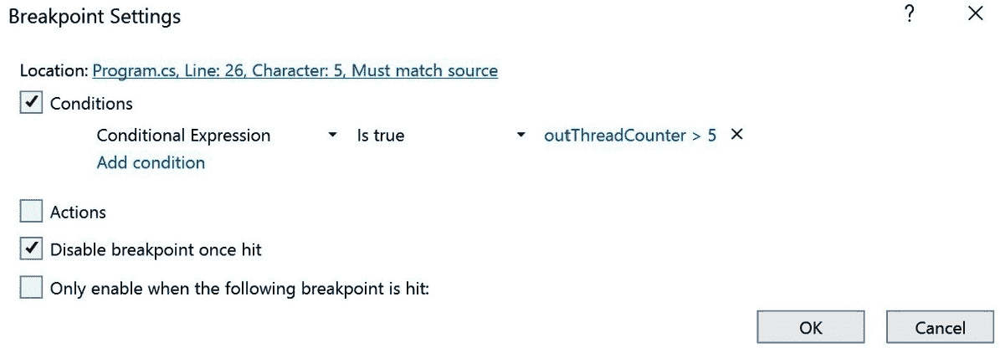

图 11.1：Visual Studio 中的断点设置窗口

您也可以通过在代码编辑器中右键单击断点项目并选择其中一个设置来获取此窗口。

#### 激活和未激活断点

默认情况下，断点是激活的，这意味着如果调试器到达包含断点的语句，则执行停止。但您也可以禁用断点：这意味着断点仍然存在，但它不会做任何事情。如果您正在调试某些代码但想跳过当前特定断点但又不想删除它，这个选项可能很有用。

#### 条件断点

条件断点仅在满足特定条件时才会中断。条件可以是一个条件或一组条件，所有这些条件都必须为真。条件还可以包括代码中的变量。让我们想象一下，我想在之前的代码示例中设置一个断点。我想断点在包含 `Task.Delay()` 代码的行上。然而，我只希望当 `outThreadCounter` 变量大于 `5` 且该断点已被触发 6 次时，该断点才处于活动状态。在我们的代码中，这应该是相同的（每次我们通过该循环时，`outThreadCounter` 都会增加），但如果这种情况没有发生，您可以使用此技术来验证。

您可以通过放置断点、右键单击它，然后选择**条件**来指定此设置。

#### 操作断点或跟踪点

**操作断点**可以是真正的断点或不会中断的断点。但除了中断（或不中断）之外，您还可以指定调试器应在**输出**窗口中写入某些内容。换句话说，这是一个非常轻量级且临时的日志系统。您可以输出静态文本或变量的内容。在指定输出的选项下方，您可以在表示**继续代码执行**的框中放置勾选标记。如果您勾选该框，调试器不会在此断点处停止，而只会在输出窗口中显示所需信息。当您不停止执行代码而只显示一些信息时，我们称这些断点为**跟踪点**。

#### 单次断点

**单次断点**只工作一次。当断点被触发时，它会停止代码执行并禁用自己。如果您想再次使用它，必须手动启用它。您可以通过选择**一旦触发禁用断点**来创建此断点。

#### 依赖断点

**依赖断点**只有在另一个断点被触发后才会启用。如果你有一个在代码中从不同地方调用的方法，这尤其有用。尽管如此，你可能只想调试特定的路径。在这种情况下，你可以在你感兴趣的流程中创建一个断点（你甚至可以将其设置为不可中断，使其仅作为触发器）然后，将你感兴趣的该方法中的断点连接到第一个断点。

结果是，断点在第一个断点被触发之前是禁用的。

要看到这个效果，请参考我们的最后一个示例。将 `1` 秒（1000 毫秒）的时间增加。然后，在写入消息到控制台的行上添加一个断点。勾选此断点的**操作**属性中的**动作**框，但不要在**消息**对话框中添加任何内容。然而，请确保勾选**继续代码执行**框。设置应该看起来像这样：

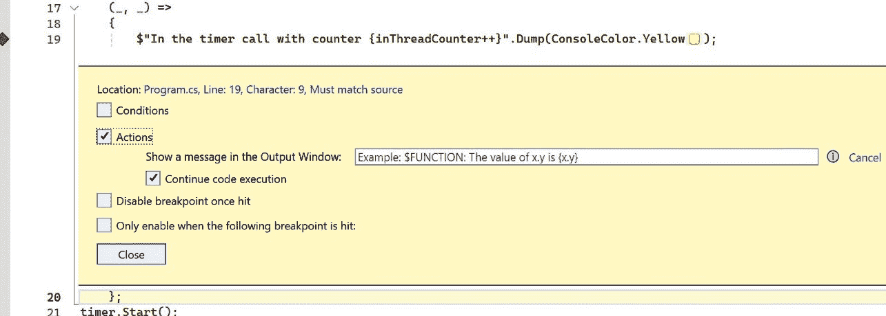

图 11.2：触发断点

然后，在写入 `outThreadCounter` 控制台值的行上添加另一个断点。这次，将设置更改为启用**仅在以下断点被触发时启用**选项，并在相应的下拉菜单中选择其他断点。它应该看起来像这样：

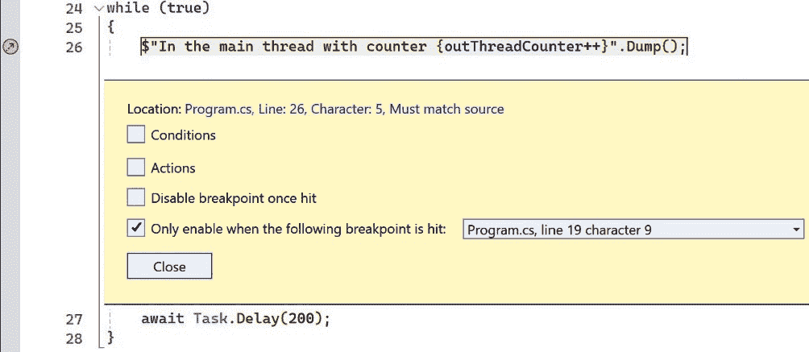

图 11.3：依赖断点

如果你运行程序，调试器在前一秒钟会忽略最后一个断点。然后，由于我们的第一个断点被触发，执行停止。

当然，你可以随意组合这些设置。

快速添加其他断点

你可能知道，你可以通过点击源代码左侧的所谓**空白区域**来添加断点到你的代码。如果你这样做，空白区域会出现一个红色项目符号，表示你已在那个位置添加了断点。但你是否知道你还可以在空白区域右键点击？如果你这样做，你会得到一个弹出菜单，可以快速添加之前提到的断点。从长远来看，这可能会节省你一些鼠标点击！

### 一些其他功能

断点还有一些其他可能很有用的功能。你通常通过在 Visual Studio 的**断点**窗口中右键点击选定的断点来访问这些功能。以下是一些例子：

+   **断点可以有标签**：这样，你可以给断点起更有意义的名字。

+   **你可以分组断点**：如果你创建了一个断点组，你可以将断点添加到其中。这样，你可以快速打开或关闭大量断点，而无需逐个处理。

+   **你可以搜索断点**：在断点窗口中，你可以搜索类名、行号、输出、标签等。如果你有一大批断点，这个功能可能很有帮助。

+   **你可以按名称、条件、命中次数、标签等对断点进行排序**：如果你仍然找不到你需要的东西，你可能需要重新考虑你的断点策略！

我遇到的大多数开发者从未接近所有这些选项：他们所做的只是在一行代码上切换断点以停止执行。但我希望你能开始欣赏这些工具能为你带来的力量。

## 调试窗口

Visual Studio 有很多窗口可以帮助你在调试时了解发生了什么。当编辑代码时，这些窗口大多数都是无用的，但一旦开始调试，它们就会变得活跃。让我们看看我们有什么！

### 断点

我们已经讨论了断点，但我想要指出**断点**窗口。这个窗口是你查看应用程序中所有断点的地方。它还显示了有关这些断点的附加信息。如果你需要更多信息，你可以向窗口添加列。以下是一个示例：

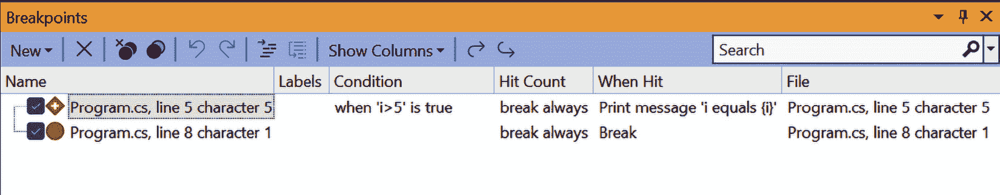

图 11.4：断点窗口

你可以自定义这个窗口以满足你的需求。

### 局部变量、自动变量和监视

在调试时，你可能想看到代码中变量的值。要查看值，你可以在代码编辑器窗口中悬停鼠标在变量上。然而，Visual Studio 中有一些窗口专门用于提供访问这些数据的方式。让我们来探索这些窗口。

**局部变量**窗口显示了当前作用域中的所有变量。这非常有用：你可以在不受到其他变量的干扰的情况下看到当前块中的所有变量。

**自动变量**窗口甚至更好：它试图猜测当你中断代码时哪些变量对你感兴趣，并显示它们及其值。

让我们来看看这个。我们有以下类：

```cs
internal class MyClass
{
    public int Counter { get; set; }
}
```

我们在以下代码中使用它（我添加了行号，这样我可以在以后引用这些行）：

```cs
1: MyClass myClass = new MyClass();
2: int myNumber = 0;
3: while (true)
4: {
5:     myClass.Counter++;
6:     Console.WriteLine($"Counter {myClass.Counter++}");
7: }
```

现在，在*第 3 行*设置一个断点。运行代码，看看你的输出是否与我的匹配。我将逐步执行从*第 3 行*到*第 7 行*的所有行，并展示**自动变量**窗口告诉我什么。

第一个断点在第*3 行*，所以调试器在那里停止。它在*第 3 行*中断，**自动变量**窗口中的以下结果是：

| **名称** | **值** | **类型** |
| --- | --- | --- |
| `myNumber` | `0` | Int |

表 11.2

现在，转到下一行。如果我们停在*第 4 行*，我们会得到以下结果：

| **名称** | **值** | **类型** |
| --- | --- | --- |
|  |  |  |

表 11.3

如你所见，我们没有得到任何结果。我们停在`{`上，现在没有变量可以影响代码的路径。所以，没有东西可以显示。让我们继续并逐步到下一行，*第 5 行*。

| **名称** | **值** | **类型** |
| --- | --- | --- |
| `myClass` | `{``myClass}` | MyClass |
| `Counter` | `0` | Int |
| `myClass.Counter` | `0` | int |

表 11.4

如果你单步执行到那一行，你会看到两个条目。上面的一个，`myClass`，可以展开，以便你可以看到可能对你感兴趣的性质。在我们的例子中，这是 `myClass.Counter`。我们还单独看到了 `myClass.Counter` 变量，因为编译器足够聪明，能够看到这在我们的代码中很重要。

让我们转到下一行，*第 6 行*。

| **名称** | **值** | **类型** |
| --- | --- | --- |
| `MyClass.Counter.get returned` | `0` | int |
| `myClass` | `{``myClass}` | MyClass |
| `Counter` | `1` | Int |
| `myClass.Counter` | `1` | int |

表 11.5

这很有趣：我们调用了 `MyClass.Counter.get`) 并得到了一个结果。还有一个图标来显示这确实是一个返回值。`get` 返回了零，但随后我们应用了 `++` 运算符来改变局部值。

下一个行，*第 7 行*，产生了这个：

| **名称** | **值** | **类型** |
| --- | --- | --- |
| `MyClass.Counter.get returned` | `1` | int |
| `System.Runtime.CompilerServices.DefaultInterpolatedStringHandler.ToStringAndClear returned` | `Counter 1` | string |

表 11.6

我们将文本行打印到控制台，并使用字符串前的 `$` 插值命令来完成。现在，你可以看到这样做触发了 `System.Runtime.CompilerServices.DefaultInterpolatedStringHandler.ToStringAndClear()` 方法，返回了结果字符串 `Counter 1`。哦，而且我们失去了 `myClass`（嗯，它并没有丢失；只是由于我们在这个作用域内不再使用它，所以不再显示）。正如你所见，**局部变量**窗口擅长显示局部变量的值，并帮助你找出隐式方法调用，例如字符串插值和属性获取器！

**局部变量** 窗口非常擅长确定你需要看到什么。当然，如果你不同意，总有 **监视** 窗口。

**监视** 窗口与前面的两个调试窗口做的是同样的事情，但它只显示你要求它显示的内容。一旦调试器停止了程序的流程，你可以在一个变量上右键单击并选择 **添加到监视**。然后变量将出现在 **监视** 窗口中，你可以像在 **局部变量** 和 **自动** 中一样执行相同的操作：检查变量并在需要时更改值。

然而，这次，变量会一直保留，直到你将其移除。假设它们超出作用域或不可达。在这种情况下，你会在 **监视** 窗口中得到一个错误，告诉你变量在当前上下文中不存在。但这并不会损害你的体验：它会一直保留，直到你需要它，如果变量再次进入上下文（在这个或随后的调试会话中），它将再次出现。

## 诊断工具

**诊断工具** 窗口几乎值得拥有它自己的书籍。它为我们做了很多事情！让我们深入了解一下。

与 Visual Studio 中的大多数其他调试工具一样，你不能在调试代码时使用**诊断工具**。我们将使用一个非常愚蠢的程序来展示一些**诊断工具**的可能性。它是一个**控制台应用程序**，代码看起来像这样：

```cs
var memoryBlock = new Dictionary<int, byte[]>();
var passCounter = 0;
while (true)
{
    passCounter++;
    var newBlock = new byte[1024 * 1024];
    memoryBlock.Add(passCounter, newBlock);
}
```

我还在`passCounter++`的行上放置了一个条件断点（因此，第一个语句是在 while 循环中）。这个条件看起来是这样的：

```cs
passCounter % 100 == 0
```

换句话说，断点每 100 次迭代就会停止。

如果我们运行这个，应用程序将在第一次迭代时中断。这是有道理的：100%的 0 等于 0。然后，你可以打开**诊断工具**窗口（如果它没有自动显示，你可以通过转到**调试**菜单，然后选择**窗口**，接着选择**显示诊断工具**来打开它）。我建议你将窗口放大，以便可以看到它给我们提供的所有好东西。我的看起来像这样：

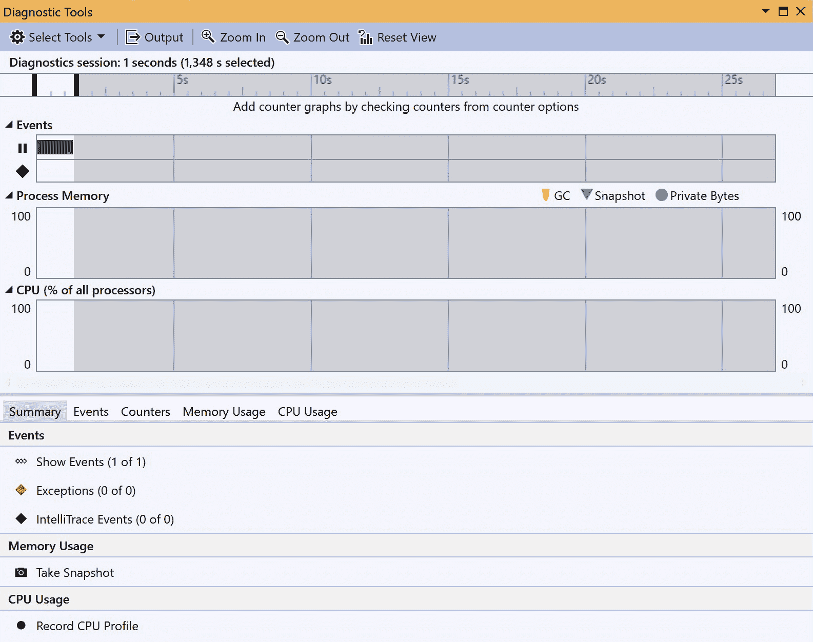

图 11.5：诊断工具窗口

在窗口顶部有一些图表。由于我们的程序还没有发生任何变化，这些图表并不很有趣。但那将会改变！在图表下方有一些标签页。最初，你看到的是**摘要**标签页，它总结了其他标签页的内容。

在**摘要**标签页中，点击**内存使用**标题下的**捕获快照**。你也可以在**内存使用**标签页本身这样做。这样做会保存当前的内存使用情况，并允许它在未来的某个时间点进行比较。由于我们的应用程序没有做很多事情，这可以给我们提供一个基线。所以，点击**捕获快照**。然后，继续运行程序。

如果你点击**捕获快照**，窗口应该显示**内存使用**标签页，它显示了快照。由于我们继续了程序，我们不在第 100 次迭代，所以我们可以再次捕获快照。这样做。这导致我的系统在这个视图下：

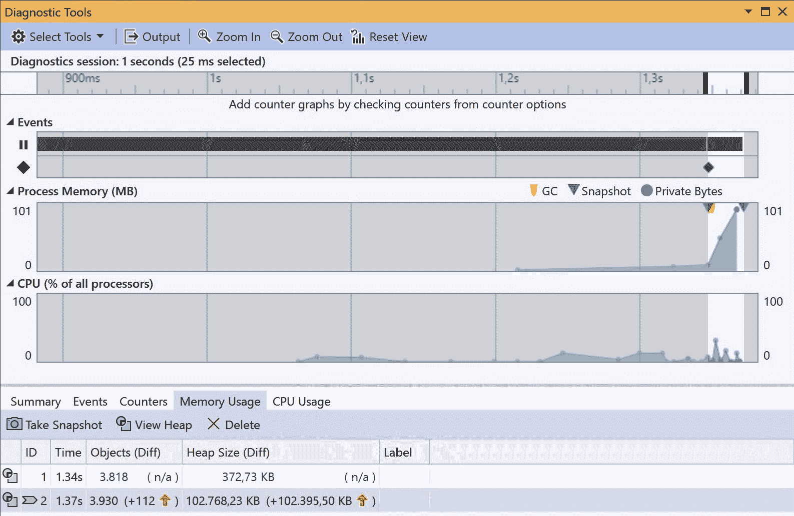

图 11.6：诊断工具窗口的第二遍

这变得越来越有趣。我们可以从**进程内存（MB）**图表中看到，我们已经开始分配更多的内存。但真正令人兴奋的事情发生在下面的**内存使用**标签页中。这里有很多内容：在第二个快照中，我们可以看到我们分配了更多的对象和内存。

你可以点击大多数值，例如`Count Diff.`列来按该列排序。)

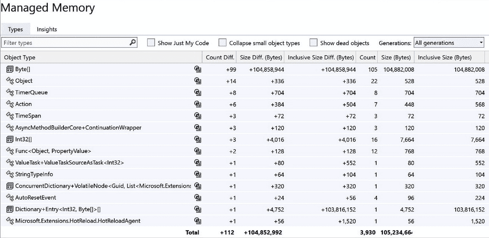

图 11.7：内存快照

我们在内存中有 99 个更多的`Byte[]`对象，导致内存增加了 104,858,955 字节。

你可以在这里做各种事情。你可以点击你想了解更多信息的行，然后钻入该对象的源代码。这样，你可能会发现为什么你的内存使用在增加。

在**诊断工具**中有很多事情在进行。我建议你尝试一下，看看它能告诉你关于你系统的一些什么信息！

# 调试多线程和异步代码

让我们加入超级调试员的行列。我们即将开始一段探索多线程系统深处的旅程，以及它们出错的地方。

多线程代码调试起来特别困难。想象一下，你有两个相互交互的线程，然后出了问题。然而，如果你在 Visual Studio 中逐步执行方法，一切都会正常工作，这是有道理的：一些错误只有在特定的时机条件下才会出现。

## 并行监视

那么，如果你有多个线程，并且出了问题。你想要检查那个线程中发生的事情。但如果你设置了一个断点，你怎么知道你是在正确的线程中呢？

不要害怕：Visual Studio 可以帮助你解决这个问题。让我们从以下代码开始：

```cs
var rnd = new Random();
for (int i = 0; i < 10; i++)
{
    int threadNumber = i;
    ThreadPool.QueueUserWorkItem(_ =>
    {
        var counter = 0;
        while (true)
        {
            $"Thread {threadNumber} with counter {counter++}".Dump(ConsoleColor.Yellow);
            Task.Delay(rnd.Next(1000)).Wait();
        }
    });
}
```

这段代码创建了 10 个线程。每个线程都有一个无限循环，显示一些文本并计数。然而，每个线程以不同的速度执行这些操作：它们都在每次迭代之间等待随机的时间。

在那个循环的某个地方放置一个条件断点，条件是它应该满足这个条件：`counter % 10 == 0`。现在，运行程序。

你可以在**Autos**或**Locals**窗口中看到`counter`值。这可能很有帮助；这个变量是你当前线程的局部变量。Visual Studio 为我们暂停了所有其他线程，但我们不知道那些线程中数据的状态。我们该如何找出答案呢？

这个问题的答案是：打开**并行监视**窗口。同样，你可以在**调试** | **窗口**菜单中找到它。在我的系统中，在断点中断后，它看起来像这样：

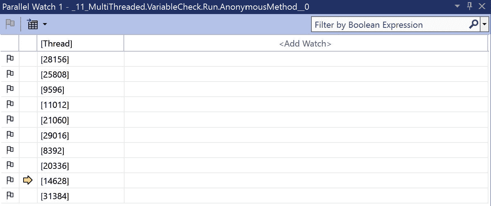

图 11.8：并行监视窗口

在这个特定的情况下，我显然是在线程 14628 处停止了执行。这并没有告诉我太多。

### 添加一个并行监视

但正如你所见，在窗口的顶部，它写着`counter`变量。当我这样做的时候，**监视**窗口就显示了这个变量的值，但它为每个线程都这样做：

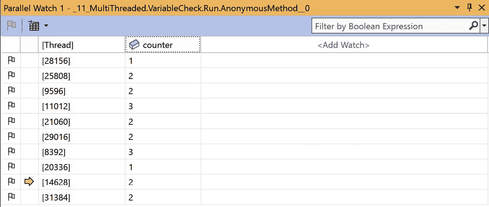

图 11.9：添加了计数器的并行监视

如截图所示，所有线程都有自己的`counter`版本，每个都有不同的值。这很有帮助！

### 跳转到帧

虽然这个窗口主要是**监视**窗口，意味着它显示你感兴趣的变量及其值，但在这里你还可以做其他事情。

由于我们在循环的某个地方停止了，你可以将鼠标悬停在代码中的变量上以查看其值。然而，正如我们所发现的，这些值仅适用于该线程。你可以将所有你感兴趣的变量添加到**并行监视**窗口中，但如果你只想查看一个变量一次怎么办？嗯，**并行监视**窗口可以帮助你。在窗口中选择其他线程，然后右键单击该行，你将看到一个上下文菜单。其中一个选项是**切换到帧**。如果你这样做，调试器将所选线程设置为当前线程，允许你调查该特定线程作用域内所有变量的值。

这样，你可以在所有活动线程之间跳转，并检查每个线程作用域内所有变量的值。

### 冻结和解冻线程

检查不同线程中变量的能力是一个强大的工具。你可能可以想象某些变量会影响其他线程。发现问题通常需要大量的日志记录和对这些日志的检查，以确定不希望的行为的结果。能够中断代码并查看正在发生的事情可以让你避免很多这样的工作。

但有时，所有这些同时运行的线程可能会造成干扰。在这种情况下，你可能想要单独关注一个或一些线程。**冻结**和**解冻**选项可以帮助你处理这种情况。

冻结线程不过是调试过程中暂停它。你暂时停止一个或多个线程的执行，以便你能专注于对你来说重要的事情。当你收集到所有需要的信息后，你可以解冻被冻结的线程，让它们恢复常规工作。你可以使用**线程**窗口，但也可以在**并行监视**窗口中这样做。你只需右键单击你想冻结的线程，并在上下文菜单中选择**冻结**即可。如果你继续程序，你选择的冻结线程将不再执行任何操作。

要查看这种行为，将我们代码中的线程数从 2 改为 2。重新运行程序，并查看断点触发时哪个线程是活动的。显然，其中一个线程将导致断点条件（该线程中的`counter`变量必须是 10 的倍数）得到满足。如果你然后继续程序，其他线程很可能是下一个停止的线程：它可能也接近满足条件（我说“可能”，因为`Wait()`语句的随机行为在理论上可能使其有可能采取其他行动）。

重新启动程序，等待断点第一次变为活动状态。这次，右键单击其他线程并选择**冻结**。继续程序。

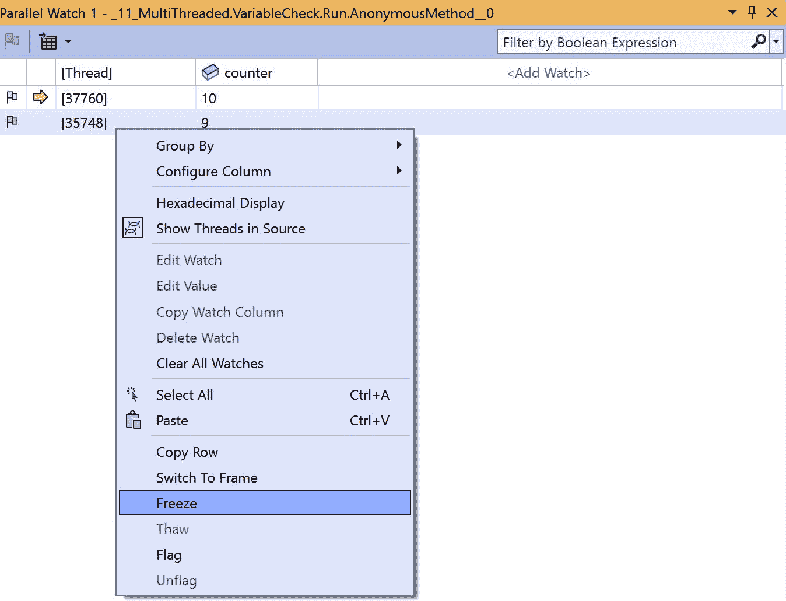

图 11.10：在并行监视中冻结线程

暂停符号应该位于所选线程之前。继续程序。当程序再次中断时，它将位于第一次执行此操作时的同一线程。如果你继续，第三次也将是在那个线程上。这很有道理：其他线程什么都没做，因此永远不会满足断点条件。

现在，你可以专注于那个正在运行的线程，以确保你了解发生了什么。当你准备好让线程加入程序的其他部分时，等待断点再次发生。然后，你可以右键单击冻结的线程并“解冻”它。继续程序，看看是否一切恢复正常：调试器将在任何线程满足条件时立即中断。

冻结和解冻：一句警告

如你所见，在解冻线程而没有调整任何东西之后，程序继续运行。通常，两个线程中的`counter`变量值应该相近。然而，在冻结一个线程后，它落后了，并且它无法弥补那个滞后。冻结和解冻线程可能会有不可预测的副作用：如果你的代码的其他部分以某种方式依赖于那个线程的运行，你可能会无意中改变了逻辑流程。所以，请注意这一点！

冻结和解冻可以成为你工具箱中的一项美好补充。所以，如果需要，请使用它们，但请明智地使用！

## 使用并行堆栈和线程窗口调试死锁

死锁相当讨厌。简单来说，**死锁**是两个线程相互等待，因此无法继续的情况。这就像你在狭窄的道路上开车，看到对面有人过来。你们其中一个人必须退后，否则你们将永远无法离开那条路。死锁就像这样，但你的应用程序因为涉及的线程都不愿意退后而冻结。我认为在代码中你肯定不希望这样。

然而，尽管问题听起来很简单，但调试和修复它可能具有挑战性。但 Visual Studio 在这里可以帮助你！

让我们从一个小程序开始。这是代码：

```cs
"Starting the threads".Dump(ConsoleColor.Cyan);
var lockA = new object();
var lockB = new object();
ThreadPool.QueueUserWorkItem(_ =>
{
    lock (lockA)
    {
        "Thread 1 acquired lock A".Dump(ConsoleColor.Yellow);
        Thread.Sleep(1000);
        lock (lockB)
        {
            "Thread 1 acquired lock B".Dump(ConsoleColor.Yellow);
        }
    }
});
ThreadPool.QueueUserWorkItem(_ =>
{
    lock (lockB)
    {
        "Thread 2 acquired lock B".Dump(ConsoleColor.Blue);
        Thread.Sleep(1000);
        lock (lockA)
        {
            "Thread 2 acquired lock A".Dump(ConsoleColor.Blue);
        }
    }
});
"Waiting for all threads to finish".Dump(ConsoleColor.Cyan);
Console.ReadLine();
```

我们在这里做什么？简单来说，我们创建了两个线程。它们各自使用一个`lock`语句。这意味着在没有拥有`lock`语句的线程完成之前，其他线程不能进入该作用域。在这段代码中这不是问题：两个线程使用不同的`lock`。然而，我们也试图在另一个线程中使用那个`lock`对象。因为我们每个线程都有一个`Thread.Sleep(1000)`，所以两个线程在访问另一个`lock`之前都有足够的时间获取`lock`。但这从未发生。没有线程可以释放`lock`，因为它在等待另一个线程——反之亦然。

运行它。你会看到两个线程打印出它们关于获取它们的`lock`s 的初始语句。然后：什么都没有。程序完全冻结了。它不再做任何事情。我们遇到了死锁。

在这种情况下，发生的事情很明显。尽管如此，我相信您可以想象在典型程序中找到这些情况可能会很棘手。好消息是 Visual Studio 通常知道发生了什么，并且可以告诉我们。

通过转到 **调试** 菜单并单击 **全部中断** 来停止程序执行。当 Visual Studio 获得焦点时，您也可以按 *Ctrl* + *Alt* + *Break*。

以这种方式中断会停止所有线程，就像调试器遇到了断点一样。Visual Studio 停在三个线程之一（主线程或行为不良的线程），您会收到如下警告：

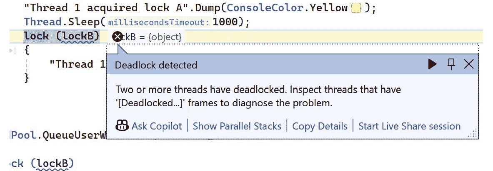

图 11.11：Visual Studio 检测到的死锁

因此，至少要知道导致冻结的原因：我们遇到了死锁。现在是时候找出发生了什么。

### 并行堆栈

在 *图 11.12* 中，您可以看到该对话框中的 **显示并行堆栈** 选项。您也可以通过 **调试** | **窗口** 菜单选项获取 **并行堆栈** 窗口。这样做会为您提供一个所有当前已知线程的直观表示。在我的机器上，它看起来像这样：

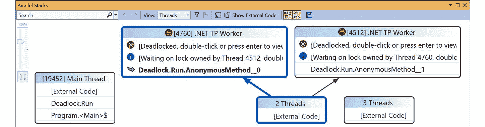

图 11.12：并行堆栈在行动中

由于我们运行的线程很少，找到问题很简单。有问题的线程用红色圆圈和白色线条标记：这是全球公认的停止标志符号。此符号表示当前处于死锁状态的线程。为了使其更加明显，下面的信息框中写着 **[死锁，双击或按 Enter 查看详细信息]**。您可以双击 **等待锁** 行以跳转到该线程的源代码。

此窗口帮助您非常快速地识别线程问题。您可以看到哪些线程正在运行，是否存在任何问题，以及这些线程的来源。

但如果这还不够，您可以通过查看 **线程** 窗口来深入了解。

### 线程窗口

如您从名称中猜测到的，**线程** 窗口显示了您可能感兴趣的线程。让我们继续我们的死锁示例。您已经查看了 **并行堆栈**，但找不到发生了什么。

因此，您打开 **线程** 窗口。在我的机器上，它看起来像这样：

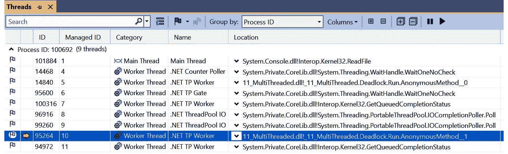

图 11.13：线程窗口

这些都是我应用程序中目前已知的所有线程。它们都在运行，当前线程的 ID 为 `95264`（或托管线程 ID `10`）。这是一个线程池中的线程，因为其名称为 `.NET TP Worker`。您还可以看到位置：它在我的应用程序中。

如果您单击名称旁边的向下箭头，您会获得更多详细信息：

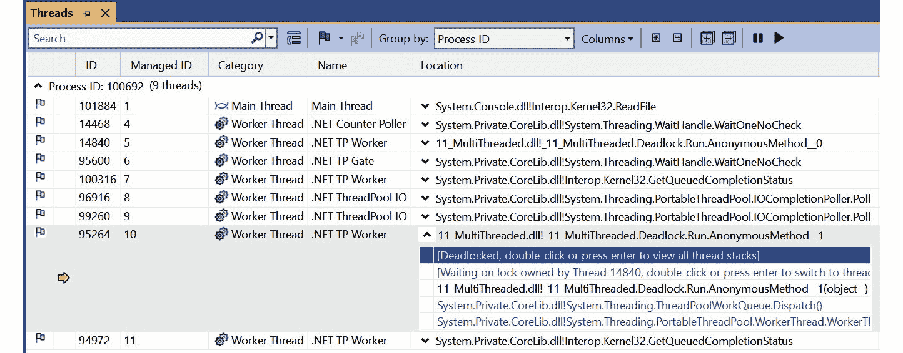

图 11.14：带有更多详细信息的线程窗口

如截图所示，这为我提供了更多信息，包括此线程已死锁并正在等待由线程 `14840` 拥有的锁。**线程**窗口也显示了有关该特定线程的信息，因此如果您想查看，可以打开它。双击位置将带您到源代码，在那里您可以调查在所有事情崩溃之前您做了什么。

调试线程问题并不容易。但如果没有这些工具，它们比以往任何时候都更容易被发现。当然，最好的做法是首先不犯错误，但正如我多年前向我的经理解释的那样，我们并不生活在一个那样的世界。

# 性能分析应用程序性能

到目前为止，我们已经确定系统程序员关心速度。应用程序需要尽可能高效和快速。但如果你认为你的应用程序可以更快，但不知道在哪里或如何改进，那么性能分析和基准测试就可以帮助。

性能分析是衡量和分析您应用程序的性能，包括 CPU 使用率、内存压力、网络性能等因素。这就像把您的应用程序放在显微镜下。在性能分析期间，我们关注的因素包括以下内容：

+   **CPU 使用率**：确定您的应用程序中哪些部分使用了最多的处理能力

+   **内存使用**：追踪使用了多少内存以及寻找内存泄漏或过度分配

+   **函数调用频率**：查看哪些方法被调用得最多以及它们耗时多久

+   **性能热点**：确定代码中比预期慢的区域

**基准测试**与之相关，但它不同。基准测试是在不同情况下衡量您的代码性能或比较不同方法。这个过程涉及运行预定义的测试并捕获指标。以下是一些指标：

+   **执行时间**：测量一段代码运行所需的时间

+   **吞吐量**：评估在给定时间内可以处理多少操作或事务

+   **延迟**：确定任务启动和执行之间的延迟

性能分析和基准测试是相辅相成的，通常一起使用来改进您的应用程序。

## **主要应用程序**

为了调查我们如何做到这一点，让我们从一个我们想要提高性能的程序开始。这是一个简单的程序，它计算 0 – 100,000 范围内的所有素数并将它们相加。它没有什么花哨的或有用的，但它需要 CPU 做很多工作。我们还想看看我们是否可以使事情变得更好。所以，让我们先看看代码。首先，我们创建一个名为 `PrimeCalculator` 的类。这很简单。这个类的主要方法是 `Run` 方法。它看起来像这样：

```cs
public void Run()
{
    var limit = 100000;
    var stopwatch = Stopwatch.StartNew();
    var sum = SumOfPrimes(limit);
    stopwatch.Stop();
    $"Sum of primes up to {limit}: {sum}".Dump();
    $"Time taken: {stopwatch.ElapsedMilliseconds} ms".Dump();
}
```

这里没有什么特别的事情发生。我们创建一个`Stopwatch`来计时持续时间，然后调用执行所有实际工作的`SumOfPrimes()`方法。最后，我们显示结果和持续时间。

让我们看看`SumOfPrimes()`：

```cs
private long SumOfPrimes(int limit)
{
    long sum = 0;
    for (var i = 2; i <= limit; i++)
        if (IsPrime(i))
            sum += i;
    return sum;
}
```

这段代码也很基础。我们循环遍历从`2`到给定限制（`2`，因为从技术上讲`1`不是一个质数）之间的所有值，并检查该数字是否为质数。如果是，我们就将其加到总和中。让我们转到`IsPrime()`：

```cs
private bool IsPrime(int number)
{
    if (number < 2) return false;
    for (var i = 2; i <= Math.Sqrt(number); i++)
        if (number % i == 0)
            return false;
    return true;
}
```

这个方法是一个糟糕的实现，用于判断一个数字是否为质数，但它足够简单，易于理解。我们通过检查我们给出的数字是否可以被小于该数字平方根的任何数字整除来实现这一点。如果它可以被整除，那么它就不是质数。

例如，如果我在我写这段文字的机器上运行这个程序，我得到的结果是 454,396,537，总耗时为 21 毫秒。我不知道这个总和是否正确；我无意在我的手机上的计算器应用程序中手动计算它。这无关紧要：我们在这里是为了看看我们是否可以找到瓶颈。

21 毫秒听起来像是一段很短的时间，但实际上相当长。毕竟，现在的计算机速度很快，所以我确信我可以改进它。我们可以使用 Visual Studio 的剖析工具来查看瓶颈在哪里。

## Visual Studio 中的分析

在 Visual Studio 中，在主**调试**菜单下，您会找到**性能分析**选项。该选项的默认快捷键是*Alt* + *F2*，如果您经常运行此操作（您会的！）可能会很有帮助。

如果您选择该选项，您将看到以下屏幕：

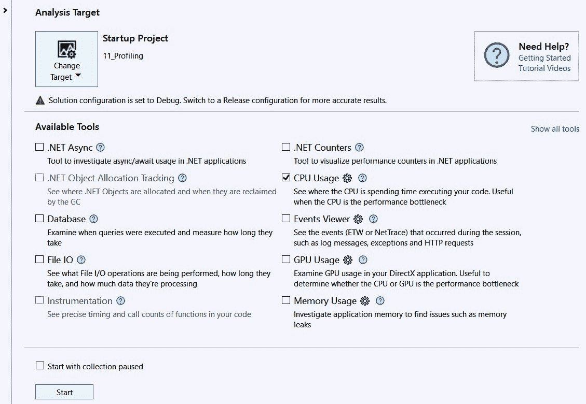

图 11.15：分析会话的开始

分析可以在许多不同的层面上进行。然而，最重要的选择是您想要分析的内容。默认情况下，这个工具选择当前的应用程序。正如您所看到的，在我的情况下，那就是`11_Profiling`项目。您可以选择其他项目或正在运行的过程，浏览应用程序，等等。如果需要，点击那个大型的**更改目标**按钮进行更改。按钮下面还有一个警告：我们可能想要从调试配置文件切换到发布配置文件。发布模式与您在生产环境中运行的内容更为紧密相关，因此您得到的数字更像是您在部署应用程序时预期看到的数字。然而，发布模式优化了您的代码，使得查找编程错误变得更加困难。所以，我倾向于在开发期间将其保留为调试模式。

然后，您必须决定您想查看什么。这里有许多选项：您可能想查看异步/等待，或者您可能对数据库通信感兴趣。在我的情况下，我想了解**CPU 使用率**。我还勾选了**.NET 计数器**和**内存使用率**；它们可能很有帮助。

如果您点击**开始**按钮，您的程序将构建并运行。在后台，Visual Studio 开始收集信息。

在我们的例子中，程序运行并结束，向 Visual Studio 发出停止收集的信号。如果你的应用程序继续运行，你必须手动停止程序或点击 Visual Studio 中的**停止收集**按钮。

一旦你这样做，Visual Studio 就会向你展示它收集的概览。

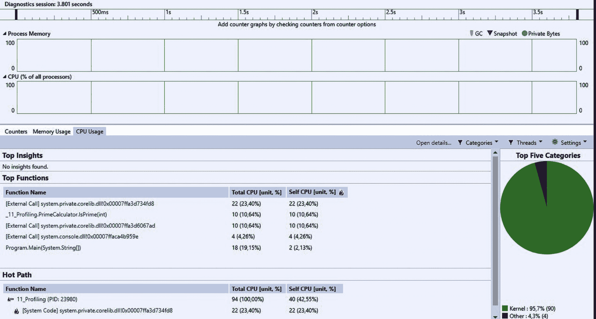

图 11.16：分析会话的第一批结果

由于我们的程序很简单，所以结果并不那么令人印象深刻。然而，你可以看到在`_11_Profiling.PrimeCalculator.IsPrime(int)`方法中花费了很多时间：10 微秒，占总时间的 10.64%。

这很好，但我们想看看是否可以获得更多信息。点击那一行，你会得到另一个视图。你可以在视图的顶部选择你想看到的内容。默认情况下，你看到的是按**函数**分组的所有数据，但我想看到调用路径。如果你这样做，你会得到这个结果：

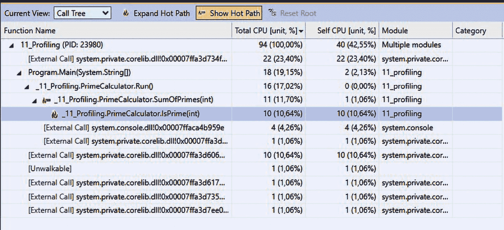

图 11.17：导致最慢函数的热路径

你可以点击**显示热路径**和**展开热路径**来查看过程是如何导致最慢函数的。

最后，你可以双击一行来查看源代码。所以，如果你双击`IsPrime()`方法，你会得到这个：

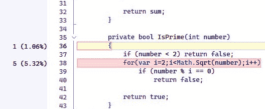

图 11.18：突出显示的代码慢行

现在，很明显，循环是`IsPrime()`函数中最慢的部分。这很有道理：为了让这个循环工作，CPU 每次都必须计算`Math.Sqrt(number)`。这需要时间。如何改进这一点是显而易见的：预先计算这个平方根，并在`for`语句中使用这个变量。这应该能加快速度！

如你所见，有了适当的工具，你可以识别出应用程序中的瓶颈。一旦找到它们，你可以重构代码或用更快的部分替换。但你怎么知道该使用哪种算法来加速呢？答案是：基准测试它们！

## 对不同解决方案进行基准测试

我知道`number % i == 0`这一行不是查看一个数是否能被另一个数整除的最快方式。然而，我并不确定其他方法能快多少。为了找出答案，我可以使用一些基准测试来解决这个问题。

你有几种方式可以从基准测试开始，但在像这种情况一样，我有几个特定算法的选项时，我喜欢使用`Benchmarkdotnet` NuGet 包。这个免费包使基准测试变得简单。

要做到这一点，请启动一个新的控制台应用程序。将`Benchmarkdotnet`包添加到项目中。然后，创建一个新的类。我称这个类为`ModuloTesters`，因为我想要测试`Module`运算符的性能以及我能找到的任何替代方案。

我添加了一个名为`TestModulo`的方法。这个方法看起来像这样：

```cs
[Benchmark]
public void TestModulo()
{
    var numberOfMatches = 0;
    for (var i = 3; i < numberOfLoopCount; i++)
        if (testNumber % i == 0)
            numberOfMatches++;
}
```

如您所见，这很简单。我只是进行几次迭代（`numberOfLoopCount`在我的类中定义为常量，我将其设置为 100,000）并计算模数（`testNumber`再次是一个常量；它实际上并不重要，但我将其设置为 400）。使这个方法区别于典型方法的唯一因素是`[Benchmark]`属性。这告诉基准测试工具需要测量这个方法。

在主程序文件中，我们需要启动基准测试。这非常简单：只需添加以下代码行：

```cs
var summary = BenchmarkRunner.Run<ModuloTesters>();
```

将构建模式设置为`发布`，并运行不带调试。`Benchmark`工具将运行标记为`Benchmark`的方法几次（好吧，不止几次）并展示结果。

但在我们查看这些结果之前，我们需要添加一些内容。基准测试的目的是比较解决问题的方案。目前，我们只有一个解决方案：取模运算符。所以，没有什么可以比较的。让我们来解决这个问题。向`ModuloTesters`类添加一个新方法，如下所示：

```cs
Benchmark]
public void TestMultiplicationAndDivision()
{
    var numberOfMatches = 0;
    for (var i = 3; i < numberOfLoopCount; i++)
        if (testNumber - i * (testNumber / i) == 0)
            numberOfMatches++;
}
```

这是一种计算模数的新方法。但它更快吗？唯一找到答案的方法是运行基准测试！如果您这样做，您会看到结果。在我的机器上，它看起来像这样：

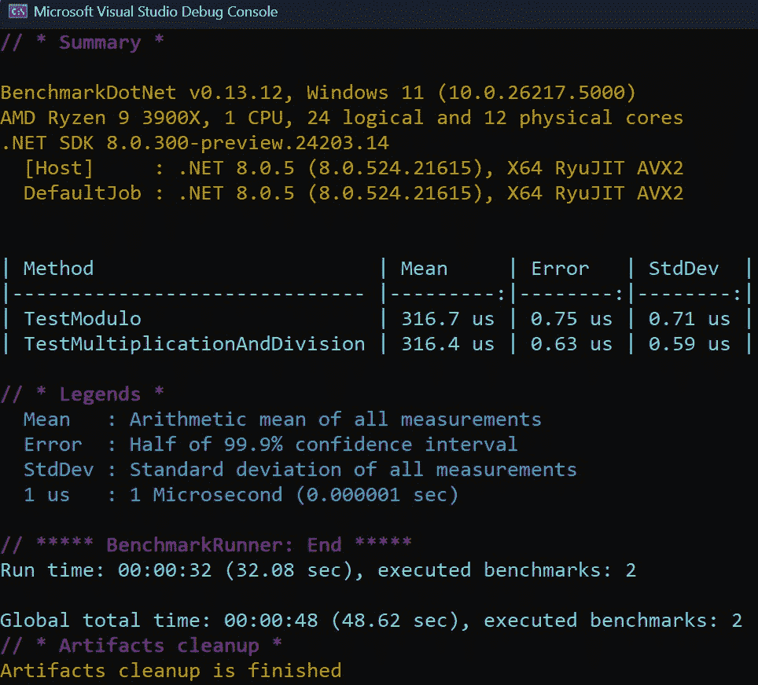

图 11.19：基准测试结果

因此，新的算法更快：它只需要 316.4 微秒，而不是 316.7 微秒。好吧，我承认这并没有快多少。也许我们可以做得更好。你知道吗？我们可以。让我们添加第三个基准测试：

```cs
[Benchmark]
public void TestMultiplicationAndDivisionInParallel()
{
    var numberOfMatches = 0;
    var localNumberOfLoopCount = numberOfLoopCount;
    var localTestNumber = testNumber;
    var lockObj = new object();
    Parallel.For(3, localNumberOfLoopCount, i =>
    {
        var div = localTestNumber / i;
        if (localTestNumber == i * div)
            lock (lockObj)
            {
                numberOfMatches++;
            }
    });
}
```

由于所有计算都可以独立完成，我们可能可以并行地完成它们。所以，这就是我在这里所做的事情：我使用`Parallel.For()`语句将工作分成同时运行的作业。我需要一个锁来更新`numberOfMatches`，这可能会减慢循环的速度。但这只是一个猜测：让我们来测试一下。运行基准测试。这是我得到的结果：

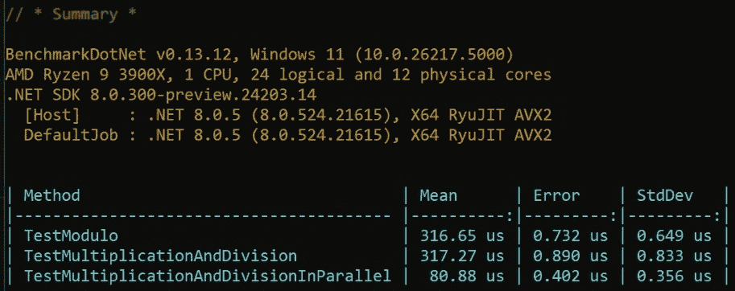

图 11.20：新的基准测试结果

现在，这很有趣。添加了`Parallel.For()`之后，该方法所花费的时间有了巨大的变化。

如果您认为这可以改善您的代码，您可以将这些发现应用到您正在工作的实际应用程序中。当然，我会在进行更改之前先进行性能分析，然后再进行性能分析以查看是否没有添加新的瓶颈。但总的来说，我认为我们已经使我们的主要计算器变得更快了！

# 其他工具

Visual Studio 是一个用于调试和性能分析系统的优秀工具。然而，它并非唯一的选择。还有许多其他解决方案可以帮助您调试和性能分析代码。其中一些是付费的，其他是免费的。有些容易使用，有些则相当难以掌握。我不会讨论其他工具，但我想给您提供一个小的列表，以便您可以自己调查它们。

请先看看 Visual Studio 给您提供了什么。很可能您需要的东西已经在那里了！

## 调试工具

现在有许多调试工具。这只是一个你可以尝试的样本。

| **工具名称** | **描述** | **公司** |
| --- | --- | --- |
| **Visual Studio 调试器** | 集成到 Visual Studio 中，支持 .NET、C++ 和其他语言，具有断点、监视变量等功能。 | 微软 |
| **WinDbg** | Windows 的多用途调试器，适用于调试用户模式和内核模式代码，以及分析崩溃转储。 | 微软 |
| **Visual Studio Code 调试器** | 集成到 Visual Studio Code 中，通过扩展支持各种语言和平台，具有断点和变量检查功能。 | 微软 |
| **托管调试器 (MDbg)** | .NET 应用程序的简单命令行调试器，为托管代码提供基本的调试功能。 | 微软 |
| **调试诊断工具 (DebugDiag)** | 帮助诊断应用程序崩溃、挂起、内存泄漏和用户模式进程的性能问题。 | 微软 |
| **ProcDump** | 命令行实用程序，用于监视应用程序的 CPU 峰值并生成用于分析的崩溃转储。 | 微软 |
| **Microsoft 性能工具 (PerfView)** | 用于收集和分析 ETW 数据的性能分析工具，对于 .NET 应用程序的性能和内存问题非常有价值。 | 微软 |
| **Son of Strike (SOS) 调试扩展** | WinDbg 的扩展，提供对 .NET 运行时内部结构的洞察，有助于深入调试 .NET 应用程序。 | 微软 |
| **Windows 性能记录器 (WPR)** | 用于记录和分析 Windows 系统性能数据的工具，捕获详细的系统和应用程序行为。 | 微软 |
| **远程调试工具** | 用于调试在不同机器或环境中运行的应用程序的工具，支持托管和本地代码。 | 微软 |
| **GNU 调试器 (GDB)** | 用于各种编程语言的强大调试器，特别是 C 和 C++，可以查看程序内部发生的情况。 | GNU 项目 |
| **LLVM 调试器 (LLDB)** | LLVM 项目的现代、高性能调试器，支持 C、C++ 和 Objective-C 等语言。 | LLVM 项目 |
| **Valgrind** | 内存调试、内存泄漏检测和性能分析编程工具，包括 Memcheck 等工具。 | Valgrind 开发者 |
| **Strace** | Linux 的诊断、调试和教学工具，用于跟踪系统调用和信号。 | 开源 |

表 11.7：调试工具

我不推荐任何这些产品；我仅仅在这里列出它们以供您方便参考。

## 性能分析工具

性能分析工具也容易找到。许多公司都在微软旁边提供解决方案。它们各自都有其优势和劣势。因此，请参考以下表格作为指南，以帮助您找到最适合您的工具。

| **工具名称** | **描述** | **公司** |
| --- | --- | --- |
| **Visual Studio 分析器** | 集成到 Visual Studio 中，为 .NET 和 C++ 应用程序提供详细的性能和内存使用数据。 | 微软 |
| **WPR** | 捕获 Windows 系统上的详细性能数据，以便进行深入分析。 | 微软公司 |
| **Windows 性能分析器 (WPA)** | 分析 WPR 收集的性能数据，帮助识别性能问题。 | 微软 |
| **PerfView** | 收集和分析 ETW 数据，对于调查 .NET 应用程序中的性能和内存问题很有用。 | 微软 |
| **.NET 内存分析器** | 用于在 .NET 应用程序中查找内存泄漏和优化内存使用的强大工具。 | SciTech 软件 |
| **ANTS 性能分析器** | 提供 .NET 代码分析，以查找性能瓶颈，包括内存使用和执行时间分析。 | Redgate |
| **JetBrains dotTrace** | 针对 .NET 的性能、内存和覆盖率分析分析器，与 Visual Studio 集成。 | JetBrains |
| **VTune 分析器** | 针对 C、C++ 和 Fortran 应用程序的性能分析工具，提供对 CPU 和 GPU 性能的深入洞察。 | 英特尔 |
| **Valgrind** | 包含一系列工具，如 Cachegrind 用于缓存分析，Massif 用于堆分析，主要用于 C 和 C++ 程序。 | Valgrind 开发者 |
| **Google 性能工具 (gperftools)** | 一套用于性能分析和堆分析的实用程序，提供对 CPU 和内存使用的洞察。 | 谷歌 |
| **YourKit 分析器** | 针对 Java 和 .NET 应用程序的分析器，提供全面的 CPU 和内存分析功能。 | YourKit |
| **Perf** | Linux 中的性能分析工具，提供有关 CPU 性能的详细信息，有助于识别瓶颈。 | Linux 社区 |
| **GlowCode** | 针对 Windows 的性能和内存分析器，专注于 C++ 和 .NET 应用程序。 | 电软公司 |
| **AQtime** | 针对各种编程语言的先进性能和内存分析工具，与 Visual Studio 集成。 | SmartBear |
| **Perfino** | 针对生产环境的 Java 分析器，专注于性能监控和问题解决。 | EJ 技术公司 |

表 11.8：分析工具

这些表格并不包含所有可用的工具。新工具会定期添加，而其他工具则会被淘汰。我建议你尝试一些，并坚持使用最适合你的工具。也许你更喜欢 CLI 解决方案。也许你想要使用图形工具。无论你的偏好如何，总有适合你需求的工具。

# 下一步

编写代码不可避免地意味着会犯错误。我认为这是工作乐趣的一部分。提出新想法，从无到有，然后让它工作并改进是一个伟大的过程。然而，你只能在你拥有正确的工具并且知道如何使用它们的时候做到这一点。

在本章中，我们探讨了 Visual Studio 提供的调试工具。我们了解了调试和性能分析究竟是什么，发现了断点的可能性，并查看了一些其他有用的调试窗口。

我们还研究了如何处理多线程应用程序及其带来的调试挑战。我们查看了一些可以帮助我们的窗口，并研究了死锁问题。

更重要的是，我们讨论了性能分析和基准测试，以揭示性能瓶颈及其解决方法。

因此，我们现在知道了如何应对代码中的大多数问题。然而，我们还有另一个重要的话题要讨论：我们如何确保代码的安全性？这究竟意味着什么？这是一个很大的话题。它如此之大，以至于我为此专门写了一整章，这就是接下来的内容。请继续关注！
