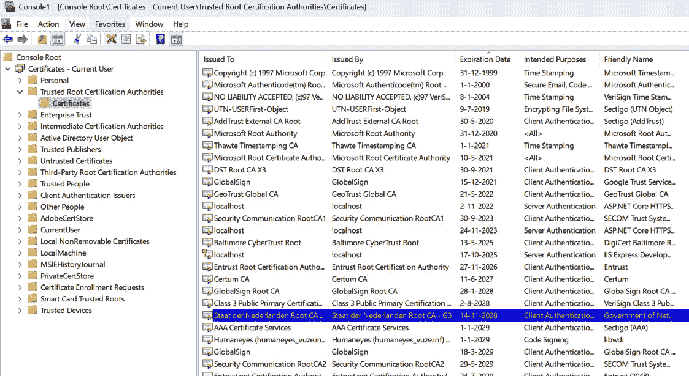

# 具有安全防护措施的人

*系统编程的安全要素*

安全性在当今比以往任何时候都更加关键。软件永远不会独立存在；它总是与硬件和其他软件包一起工作。攻击者会尽其所能找到链条中最薄弱的环节。作为开发者，我们必须确保我们的软件不是最薄弱的环节。

安全不是一个“东西”，而是一种心态和过程。它是一个永无止境的寻找最佳解决方案的过程，同时考虑到可维护性和可用性。作为系统程序员，我们必须在安全性与性能和内存使用之间进行权衡。

这使得构建安全的软件成为一个挑战。但让我们说实话——难道这种挑战不是我们选择这个职业的原因吗？

在本章中，我们将涵盖以下主题：

+   为什么作为系统程序员我们需要关心安全性？

+   如何安全地处理字符串

+   如何在你的系统中处理密钥

+   关于凭证和权限的要求是什么？

+   你如何安全地在网络上传输数据？

安全是一个重要但复杂的话题。我不会涵盖关于安全性的所有内容。然而，作为一个系统程序员，我会涉及到你应该知道的最重要的事情。但让我们不要太过大声——我们必须保守我们的秘密！所以，确保没有人正在监听，然后跟我来。

# 技术要求

你可以在这个 URL 中找到本章中所有的代码：[`github.com/PacktPublishing/Systems-Programming-with-C-Sharp-and-.NET/tree/main/SystemsProgrammingWithCSharpAndNet/Chapter12`](https://github.com/PacktPublishing/Systems-Programming-with-C-Sharp-and-.NET/tree/main/SystemsProgrammingWithCSharpAndNet/Chapter12)。

如果你想要在我讨论 Azure Key Vault 时跟上来，你需要一个 Azure 订阅。你可以在这里创建一个：[`azure.microsoft.com/en-us/free`](https://azure.microsoft.com/en-us/free)。

# 系统程序员的网络安全

当我开始编程时，安全性并不是一个问题。想象一下——我的电脑只有一个连接，那就是墙上的电源插座。当然，电脑还连接到电视上，以显示它需要显示的内容。是的，一台电视。我没有显示器；当时我买不起。我启动了这台机器，它会从 ROM 中加载操作系统和基本的编程环境。这就是全部。这种设置极其安全——没有任何东西可以干扰我的机器和数据。我把电脑放在我的卧室里，因此物理安全也得到了保障（没有人会自愿进入一个青少年的卧室；那混乱是难以置信的）。

快进到今天。我的台式电脑总是开启并始终连接到互联网。我编写的一些系统在云提供商的虚拟机上运行；其他的是无服务器系统，等待连接。

我的防火墙和应用网关告诉我，其他系统不断尝试连接到所有这些环境和机器。我有一种感觉，所有这些机器都处于持续的威胁之下。

安全是软件行业中的每个人都必须时刻关注的事情。只在开发周期结束时添加安全措施是确保攻击者无法访问你的系统的最佳方式。你肯定会忘记一些事情。安全必须在每个步骤中考虑，从最初的设计到维护运行中的系统。

正如我在本章第二段所说，安全是一种心态。你需要不断地问自己，“有人可以利用我正在做的事情吗？”

## 如果我们有一个漏洞会发生什么？

我几乎能听到你这么说，“嘿，我编写的是底层代码，不是一些花哨的客户网站。我为什么要关心所有这些？”这是一个合理的回应，但作为系统程序员，你应该非常清楚这些风险。如果你不这样做，结果可能是灾难性的。让我概述一下可能会发生的一些事情：

+   **权限提升**：我们编写的许多代码都带有提升的权限。利用漏洞的黑客可以从普通用户提升到管理员权限，从而获得对系统的广泛控制。

+   **数据盗窃**：获得系统访问权限的黑客可以使用这些信息窃取敏感信息，如下所示：

    +   用户数据，例如个人信息和信用卡信息

    +   商业机密数据，包括商业机密、知识产权和内部通讯

    +   系统日志和配置，可能包含有关其他系统的信息，因此它们也可以被针对

+   **代码注入**：黑客可能会利用诸如缓冲区溢出或输入验证不足等漏洞，将恶意代码注入进程。这一行为可能使他们能够执行以下操作：

    +   **执行任意命令**：它们可以运行任何代码，可能安装恶意软件、勒索软件或其他恶意软件

    +   **改变系统行为**：改变系统的行为，导致系统不稳定或隐藏他们的活动

+   **拒绝服务或分布式拒绝服务**：攻击者可以通过以下方式干扰系统的正常运行：

    +   **过载进程**：发送过多的请求或数据，导致系统崩溃或无响应。

    +   **资源耗尽**。消耗系统资源，如 CPU、内存或磁盘空间，导致性能下降或系统崩溃

+   **后门和持续访问**：一旦他们控制了后台进程，黑客可以执行以下操作：

    +   **安装后门**：创建隐藏的入口点，即使在初始漏洞被修补后也能重新访问系统

    +   **建立持续性**：修改进程以在重启或重启后重新启动或保持其在系统上的存在

+   **间谍活动和监控**：黑客可以使用受损害的系统在较长时间内监控和收集数据。

    +   **键盘记录**：捕获用户输入的内容，可能窃取密码和其他敏感信息。

    +   **屏幕截图**：定期截图以监控用户的活动。

    +   **网络流量监控**：捕获发送到和接收自其他系统的数据。

+   **传播恶意软件**：受损害的系统可以用作进一步攻击的跳板。

    +   **横向移动**：使用受损害的系统在网络内的其他系统之间移动。

    +   **传播**：将恶意软件传播到其他设备或进程，创建更大的攻击面。

+   **操纵数据**：黑客可以更改后台进程处理的数据。

    +   **数据损坏**：向数据引入错误或恶意修改。

    +   **篡改日志**：修改或删除日志条目以掩盖他们的行踪，使得检测到入侵变得更加困难。

正如你所见，如果我们让我们的系统存在漏洞，会有很多事情可能出错。为了强调这一点，想象一个后台进程，它监控串行端口并处理外部设备的数据。该进程全天候运行，因为它处理的是低级的 Win32，所以我们以管理员身份运行它。但我们在某个地方犯了错误，黑客访问了我们的进程。以下是一个可能发生的潜在场景：

1.  **利用漏洞**：黑客发现并利用了进程中的缓冲区溢出漏洞。

1.  **权限提升**：他们提升权限以获得管理权限。

1.  **数据盗窃**：他们提取整个用户凭证和个人信息数据库。

1.  **安装后门**：他们安装后门以保持访问并监控用户活动。

1.  **数据操纵**：他们更改账户余额和应付账款账户的银行信息。

1.  **破坏**：最后，他们发起 DDoS 攻击，使整个公司陷入瘫痪。

如果你认为这被夸大了，我建议你上网查找有关安全黑客的文章。如果你足够仔细，你会找到很多例子。大多数公司都不愿意分享他们的经验，但数据是存在的。

## 如何保护自己

如果我让你有点害怕，那很好。这可能会很可怕。但不要过于担心——遵循一些良好的安全实践可以避免许多这些风险。实际上，本章的其余部分都是关于作为开发人员，你应该做什么来保护你的系统。然而，除了安全方面的编码，还有几件事情你应该做：

+   **定期进行安全审计**：持续审查和审计你的代码和系统以发现漏洞。我真心建议为此聘请外部机构。他们有更多的经验，并且不太可能像开发系统的人那样有相同的盲点。

+   **输入验证**：确保所有输入都经过适当的验证和清理。绝对不要相信来自外部源的内容。

+   **最小权限原则**：以最低必要的权限运行进程，以限制潜在的损害。

+   **采用现代安全实践**：使用加密、安全的编码实践和最新的第三方库。

+   **监控和记录活动**：保持详细的日志并监控可疑活动，以便快速检测和应对违规行为。

所以，现在你知道为什么安全很重要。现在，让我们调查如何在我们的代码中实现这一点。

# 与字符串一起工作

你的应用程序很可能有**字符串**。其中大部分与外界无关；如果你向控制台写入“Hello World”，攻击者可能根本不在乎这一点。但其他字符串对这些人的吸引力要大得多。例如，考虑数据库的连接字符串。它们可能对黑客来说是一个极好的资源。然后，还有其他数据，例如用户信息、密码和信用卡信息。

我们可以区分两种类型的字符串：

+   作为你代码一部分的字符串，因此被编译到二进制文件中

+   在你的代码中处理并由外部进程产生或发送到外部进程的字符串

让我们看看我们是否可以保护这些敏感数据。

## 保护设置

首先，我们处理你应用程序中作为代码库一部分的字符串。想想密码和连接字符串等事情。在理想的世界里，你将此信息存储在外部文件中。这样做的原因是，由于它们不在源代码中，你可以更改它们而无需重新编译代码。

假设你的组织内部某个地方检测到了安全漏洞。安全部门告诉每个人更新他们的密码。在你的情况下，这意味着打开 Visual Studio，加载解决方案，更改数据库服务器的密码，重新编译，最后重新部署系统。或者，再想想，你可以在配置文件中更改密码。我知道我会选择做什么！

然而，在配置文件中保留密码是一个相当糟糕的主意。如果你将密码作为代码的一部分，攻击者必须反编译你的汇编代码来找到它。如果我们把密码存储在文本文件中，攻击者只需打开该文件并读取密码即可。为了应对这种情况，我们加密密码。

我们之前已经多次讨论过加密，所以我确信你能想出如何做这件事。但到目前为止，我们所查看的所有技术都需要密码作为源代码的一部分，而我们刚刚确定这是一个坏主意。将密码存储在配置文件中以启用解密其余文件听起来更糟糕。一定有更好的方法。确实有。

让我们调查这个问题。

我有一个包含一些敏感信息的示例应用程序。我将这些信息放在一个名为`appsettings.json`的文件中。你知道的——一个典型的基于.NET 的配置文件。它看起来像这样：

```cs
{
  "MyPublicSettings": {
    "Setting1": "Value1",
    "Setting2": "Value2",
    "Setting3": "Value3"
  },
  "MySecretSettings": {
    "MySecretSetting1": "SecretValue1",
    "MySecretSetting2": "SecretValue2"
  }
}
```

我们有两个部分——不敏感数据和我们不希望其他人读取的数据。我们需要保护后者。现在，我们处理这个问题有点不方便。我们必须在编写使用此文件的代码之前编写一个单独的程序来加密数据。

启动一个新的**控制台应用程序**并添加以下 NuGet 包：

`Microsoft.Extensions.Configuration`

`Microsoft.Extensions.Configuration.FileExtensions`

`Microsoft.Extensions.Configuration.Json`

`Microsoft.Extensions.DependencyInjection`

`Microsoft.AspNetCore.DataProtection`

这些包用于读取和使用配置文件，而`Microsoft.AspNetCore.DataProtection`用于保护我们的数据。

首先，我们必须设置依赖注入基础设施。数据保护工具使用它；它们在需要时需要注入包。所以，我们代码的前几行看起来是这样的：

```cs
var serviceCollection = new ServiceCollection();
serviceCollection.AddDataProtection();
var serviceProvider = serviceCollection.BuildServiceProvider();
var dataProtector = serviceProvider.GetDataProtector("MySecureData");
```

我们首先创建一个`ServiceCollection`实例。然后，我们调用`AddDataProtection()`到该集合，以便所有必需的包都被加载并准备好使用。在获取`serviceProvider`之后，我们通过调用`GetDataProtector()`获取一个`IDataProtector`接口的实例。此方法期望一个参数——一个描述目的的字符串。这个字符串可以是任何你想要的；它作为一个标签，以便你可以分组项目。想想看，就像给你的加密数据贴上标签，这样你就可以稍后跟踪哪些属于哪些。

然后，我们将配置文件读取到配置基础设施中：

```cs
var configuration = new ConfigurationBuilder()
    .SetBasePath(Directory.GetCurrentDirectory())
    .AddJsonFile("appsettings.json")
    .Build();
```

不要忘记在解决方案资源管理器中将你的`appsettings.json`文件标记为“当较新时复制”；否则，你的代码将无法加载它。

好的，现在来说说有趣的部分——我们再次读取配置文件，但这次是以文本的形式。我们这样做是因为我们将用加密版本替换敏感字符串。这是读取它的代码：

```cs
var json = File.ReadAllText("appsettings.json");
```

`json`字符串现在包含了我们的完整设置文件。是时候开始加密了！

首先，我们读取要保护的章节，遍历该章节中的所有项目，加密值，然后更改`json`变量中的字符串。最后，我们将新的字符串写入配置文件。这看起来是这样的：

```cs
var secretSection = configuration.GetSection("MySecretSettings");
foreach (var key in secretSection.GetChildren())
{
    var originalValue = key.Value;
    var encryptedValue = dataProtector.Protect(originalValue);
    var oldValue = $"\"{key.Key}\": \"{originalValue}\"";
    var newValue = $"\"{key.Key}\": \"{encryptedValue}\"";
    json = json.Replace(oldValue, newValue);
}
File.WriteAllText("appsettings.json", json);
```

对`dataProtector.Protect()`的调用为我们做了所有艰苦的工作。它接受一个字符串并将其加密。我们用新值替换旧值，并将其写入文件。

如果你打开`appsettings.json`文件（调试构建所在的文件夹中的那个，不是原始的那个！），你会看到秘密字符串不再是人类可读的。所以，任何打开该文件的人都无法访问我们的秘密！

## 读取加密数据

在一个打算使用秘密字符串的应用程序中，你可以简单地从配置文件中读取数据并解密它们。这看起来是这样的：

```cs
configuration.Reload();
var encryptedSection = configuration.GetSection("MySecretSettings");
var someSecretValue = encryptedSection["MySecretSetting1"];
var decryptedValue = dataProtector.Unprotect(someSecretValue);
$"Encrypted value was: {someSecretValue}\nDecrypted this becomes: {decryptedValue}".Dump();
```

首先，我重新加载配置以确保对象具有加密的字符串。然后，我获取部分并读取第一个设置及其值。最后，我使用`dataProtector`来解密字符串。结果是可爱的、未加密的可读字符串。

当然，你不应该在生产系统中使用与加密和解密相同的程序。你需要将它们分开。当你这样做的时候，记得使用相同的字符串作为目的。如果你不这样做，你会得到一个异常，告诉你解密没有工作。试试这个：

```cs
var secondProtector = serviceProvider.GetDataProtector("AnotherSection");
var decryptedValue = secondProtector.Unprotect(someSecretValue);
```

我使用新的目的字符串调用`GetDataProtector()`，并使用它来解密字符串。这不会起作用。如果我使用`"MySecureString"`而不是`"AnotherSection"`，它就会再次起作用，即使我有一个新的`DataProtector`。

## 密钥在哪里？

你可能会想知道我为什么从未指定一个密码来加密和解密。答案是框架为我生成了一个。它或多或少地隐藏在`"%LocalAppData%\ASP.NET\DataProtection-Keys"`文件夹中。这个特殊文件夹是运行时存储和读取密钥的地方。打开这个文件夹，选择一个 XML 文件，然后打开它，看看它包含什么。

你可以指定另一个系统存储密钥的文件夹。更改程序的起始部分，我们将`AddDataProtection()`调用添加到`serviceCollection`中，使其看起来像这样：

```cs
serviceCollection
    .AddDataProtection()
    .PersistKeysToFileSystem(new DirectoryInfo(myKeyFolder));
```

这行代码告诉系统使用`myKeyFolder`中指定的文件夹来存储密钥。

在生产系统中，你可以分发密钥文件并将其存储在已知位置。当然，任何可以访问你的`appsettings.json`文件的攻击者可能没有问题找到密钥文件。必须找到更好的处理方法。确实有，但我将在下一部分处理。首先，我想谈谈内存中的字符串。这些可能是代码中的硬编码字符串或从设置文件中解密的字符串。这些都是潜在的安全风险吗？让我们找出答案！

## 处理内存中的字符串

你可能会认为配置文件中的加密字符串是安全的。毕竟，没有人能读取它们。只有你的程序可以访问它们，前提是它能够访问密钥文件。程序可以读取并解密内存中的设置，使一切安全可靠。不幸的是，情况并非如此。在运行程序中找到这类信息并不困难。

### 在你的应用程序中泄露字符串

假设我们有以下代码：

```cs
var myOpenString = "This is my Open String";
Console.ReadLine();
```

我同意。这不是你见过的最令人兴奋的代码片段，但它确实完成了它需要做的事情。它将字符串加载到内存中，然后等待用户按下一个键来终止程序。

假设我在发布模式下编译此代码并启动方便的**WinDbg**工具（你可以通过访问 Microsoft Store 并搜索它来安装）。在这种情况下，我可以对运行中的程序进行各种检查。经过一番挖掘，我终于找到了这个结果：

```cs
Name:        System.String
MethodTable: 00007ffaf832ec08
EEClass:     00007ffaf830a500
Tracked Type: false
Size:        66(0x42) bytes
File:        C:\Program Files\dotnet\shared\Microsoft.NETCore.App\8.0.5\System.Private.CoreLib.dll
String:      This is my Open String
Fields:
              MT    Field   Offset                 Type VT
Attr            Value Name
00007ffaf82b1188  400033b        8         System.Int32  1 instance               22 _stringLength
00007ffaf82bb538  400033c        c          System.Char  1 instance               54 _firstChar
00007ffaf832ec08  400033a       c8        System.String  0   static 000001ee80000008 Empty
```

WinDbg 给我提供了关于在特定内存位置找到的`System.String`对象的所有 sorts of 信息。其中一部分信息是那个字符串的内容——“这是我的`Open String`”。

我的示例程序很简单，所以找到信息并不难。但事实上，我可以通过将其附加到正在运行的程序上来做到这一点，这展示了黑客能做什么。如果你的程序从`appsettings.json`文件中获取加密数据并将该字符串保留在内存中，那么你甚至可以不加密你的数据。

一定有更好的方法。猜猜看——确实有！

### 使用 SecureStrings

我们发现内存中的字符串并不安全。BCL 背后的那些人也想到了这个问题，并给了我们一个替代方案——`SecureString`。

这个想法听起来很美好，但`SecureString`比“真正的”字符串不太方便。远不止这样。然而，它确实有一个优点——其中的数据是加密的。

创建`SecureString`很容易：

```cs
using var secureString = new SecureString();
```

但这并没有真正帮助我们。我们想要一些数据在其中。这不难，但你必须逐个字符复制数据：

```cs
var sourceString = "This is a big secret";
foreach (var c in sourceString)
{
    secureString.AppendChar(c);
}
secureString.MakeReadOnly();
```

现在，`secureString`包含了一些数据。好事是数据被加密了，并且不再可读。对`MakeReadOnly()`的调用很重要。通过使其只读，你确保字符串不再可更改，这有助于性能。

`SecureString`主要用于存储密码。BCL 中许多需要密码的类都接受`SecureString`作为它们的参数。例如，以下是可以与`SecureString`实例一起工作的类的一些例子：

+   `ProcessStartInfo`：在启动新进程时，你可以使用`ProcessStartInfo`结构或通过调用接受`SecureString`的重载版本的`Process.Start()`来提供密码作为`SecureString`。

+   `NetworkCredential`：当你需要用网络资源标识一个资源时，你可以使用`NetworkCredential`来传递所需的参数，例如用户名、密码和域。密码可以是`SecureString`类的实例。

+   `CspParameters`和`X509Certificate`：如果你在处理证书，这些非常重要，它们还允许`SecureString`实例。

所以，现在我们有一个安全的字符串。太好了。但我们仍然有一个问题。你能发现吗？在你查看我们刚才讨论的代码的同时，我会给你一分钟时间。

当然，问题是我们在哪里播种安全字符串。我们创建了一个包含`"This is a big secret"`内容的字符串并将其传输到安全字符串中。但原始字符串仍然在内存中。

如果我们从配置文件中读取一个加密的字符串，将其解密，并将其复制到安全字符串中，我们会有同样的问题。原始的解密字符串仍然在内存中，并且可以从外部读取。

要绕过它的唯一方法是尽快删除那个临时字符串。未加密的字符串应该在内存中尽可能长时间地保留。技术上，它仍然容易受到攻击，但攻击者必须在字符串在内存中时恰好打破运行的应用程序。攻击窗口仍然存在，但非常非常小。

删除字符串与分配新值不同——字符串是不可变的。当你尝试更改字符串时，你会得到一个新的实例，而旧数据仍然可读。要从内存中完全删除它，唯一的方法是删除构成字符串的字符。你可以使用类似以下代码的方式从内存中删除字符串：

```cs
void OverwriteAndClearString(ref string str)
{
    if (str == null) return;
    unsafe
    {
        fixed (char* ptr = str)
        {
            for (int i = 0; i < str.Length; i++)
            {
                ptr[i] = '\0'; // Overwrite with null characters
            }
        }
    }
    str = null; // Dereference the string
}
```

你必须设置 `'0'`。由于 `0` 表示字符串的结尾，因此很难看到字符串的原始长度。

我并不是说你需要为每个字符串调用此方法。但假设你正在处理你绝对不希望泄露的字符串。在这种情况下，这可能会解决将数据复制到安全字符串的中间问题。

但我们从哪里获取解密密钥呢？我们可以像之前那样分发它们，但还有其他方法。让我们来讨论那些！然而，在这样做之前，让我们思考一下我们学到了什么。这是一个复杂的话题；处理内存中的字符串不是许多 C# 开发者会考虑的事情。但问题就在这里——由于人们没有考虑它，他们没有意识到任何风险。

相反，现在你已经了解了风险，如果需要这种级别的安全性，你将准备好应对。

# 使用密钥管理

密钥是应用程序的最佳保密信息。密钥用于加密和解密大量敏感数据。这意味着密钥本身更加敏感；它们拥有解锁所有秘密的权力。将密钥存储在可执行文件旁边的文本文件中可能不是处理这块宝贵数据的最佳方式。

你如何以及在哪里存储密钥取决于你的程序运行的位置。如果你的应用程序运行在云端，你应该使用基于云的密钥管理系统。如果你在可以触摸的机器上运行你的系统，你需要另一个解决方案。

## 使用 Azure 密钥保管库

**Azure 密钥保管库**是一个集中式、基于云的秘密和密钥管理系统。它设置简单，使用方便。其主要目的是保护基于 Azure 的应用程序的秘密和密钥。然而，它也可以由本地运行的应用程序使用。

我不会在这里教你如何创建密钥保管库；有很多资源可以帮助你。例如，这是来自微软本身的一个很好的资源：[`learn.microsoft.com/en-us/azure/key-vault/general/quick-create-portal`](https://learn.microsoft.com/en-us/azure/key-vault/general/quick-create-portal)。

一旦你部署了密钥库并添加了密钥，检索该密钥就很简单了。但在我们查看获取该密钥的代码之前，我们必须确保对资源的访问。这意味着我们需要记录以下项目：

| **项目名称** | **值** | **描述** |
| --- | --- | --- |
| 密钥库名称 | `mykeyvault` | 创建时指定的密钥库的名称 |
| 密钥名称 | `MySecretValue` | 密钥的名称 |

表 12.1：查找 Azure 密钥库密钥的值

显然，你应该更改这些值以匹配你的配置。

在 C#应用程序中，我们需要添加几个 NuGet 包：

+   `Azure.Identity`以启用身份验证

+   `Azure.Security.KeyvaultSecrets`

安装了这些包之后，从密钥库中获取密钥的代码就非常直接了。例如，你可以使用这个辅助方法：

```cs
public async Task<string> GetSecretAsync(string keyVaultUrl, string secretName)
{
    var client =
        new SecretClient(
            new Uri(keyVaultUrl),
            new DefaultAzureCredential());
    var secret =
        await client.GetSecretAsync(secretName);
    return secret.Value.Value;
}
```

这个代码片段展示了如何使用之前安装的包中的`SecretClient`类来访问密钥库中的密钥。为了验证这个请求，我使用了`DefaultAzureCredential`类。使用这个类意味着我使用当前用户的凭据对 Azure URL 进行身份验证。

在生产系统中，你不会这样做。相反，你可能需要为你的系统创建一个注册，并使用它进行身份验证。Azure 中的身份验证是一个值得单独一本书来讨论的话题，但以下 URL 应该能帮助你入门：[`learn.microsoft.com/en-us/dotnet/azure/sdk/authentication/?tabs=command-line`](https://learn.microsoft.com/en-us/dotnet/azure/sdk/authentication/?tabs=command-line)。

## 使用环境变量

即使在使用 Azure（且不使用默认凭据）时，你也需要在能够使用资源之前存储某种访问密钥、密钥 ID 或用户 ID 和密码。当你将数据加密存储在`appsettings.json`文件中时，这也适用——你需要一个密钥来解密。正如我们在之前的示例中看到的，你可以要求.NET 运行时为你创建一个密钥并将其存储在已知位置。这是解决这个问题的方法之一，但还有一个更简单的方法。我们可以使用环境变量。

警告

环境变量很方便，但它们并不安全——远远不够安全。如果有人能够物理访问这台机器，他们就可以查看到这些变量的值。除非你能够确信虚拟或物理机器是安全的，否则永远不要在环境变量中存储敏感信息。

环境变量简单来说就是存在于 Windows 中的一个键值对。它通常用于包含来自进程外部的设置。这就是为什么它们对于保存我们需要用来识别资源的那些数据很有用；它们可以在不改变或重启我们的应用程序的情况下动态更改。

### 环境变量作用域

这些变量确切地存储在哪里以及它们持续多久取决于环境变量的类型。这些变量可以有一个影响它们持久性的作用域（以及它们持续多久）。以下是我们的选项：

+   **进程作用域**：这些变量仅对定义它们的进程或主进程所派生的任何子进程可用。对于可以丢弃的临时值，它们可能很有用。

+   **用户作用域**：它们是针对当前登录用户的特定变量。它们对所有在该用户凭据下运行的进程都可用。这些变量在登录之间持续存在。

+   **机器作用域（或系统作用域）**：这些变量对所有机器上的用户和进程都可用。它们需要管理员权限来设置和修改，但不用于读取。

+   **会话作用域**：这些变量的作用域是用户会话。这个范围与用户作用域大致相同，但变量在会话结束时会被丢弃。例如，如果用户注销，就会发生这种情况。

+   **易失性环境变量**：这是一个主要用于系统的特殊类别。它们旨在是临时的。用户通常不会处理或甚至访问这些变量。一个例子是在启动时设置的设置，一旦登录过程结束就可以删除。

如您所见，有很多不同的作用域，其中一些大多数用户甚至从未听说过。确保你选择正确的一个！

### 设置环境变量

当然，我们可以使用我们的 C# 代码来设置变量。然而，我们通常不会这样做；在我们的情况下，我们想在应用程序外部设置一些秘密数据，然后在代码中使用它。这意味着我们必须从外部设置数据。通常，设置值是在我们的软件安装期间完成的。然而，在开发过程中，你必须手动完成。

从 PowerShell 会话中设置这些变量非常容易，并且确切的语法取决于你想要实现的作用域。

#### 进程作用域

我只在这里添加这个是为了完整性。毕竟，如果我们设置一个变量以便在我们的应用程序中读取它，使用**进程作用域**就没有意义了。变量是在 PowerShell 会话的作用域中设置的，因此在我们的应用程序中不可读。但无论如何，下面是如何做到这一点的。在 PowerShell 中，输入以下命令：

```cs
$env:MY_SECRET_ID = 12345678
```

此命令在内存中创建了一个名为 `"MY_SECRET_ID"` 的新变量，并将其赋值为 `12345678`。

如果你读取数据，你会惊讶地发现它设置起来几乎和读取一样简单：

```cs
Write-Host $env:MY_SECRET_ID
```

此命令应返回 `12345678` 字符串。

在设置和读取数据后，你可能想将其擦除。同样，这非常容易做到：

```cs
$env:MY_SECRED_ID = $null
```

注意，最后一个命令在关闭 PowerShell 会话时会自动发生。

#### 用户作用域

**用户作用域**是我们目的的第一个可用的作用域。在 PowerShell 中设置此变量的方式如下：

```cs
setx MY_SECRET_ID 87654321
```

此命令创建一个新变量并设置数据。该变量存储在 Windows 注册表中的`HKEY_CURRENT_USER\Environment`键下。Windows 会在重启之间保持此值。由于数据存储在`HKEY_CURRENT_USER`中，你只能读取属于该用户的进程中的数据。这意味着你可以在**Visual Studio**（**VS**）的调试期间读取它，但前提是你必须以相同的凭据运行 VS。

#### 机器范围

最广泛的范围是**机器范围**。设置数据与使用用户范围一样简单，只需添加一个小的改动：

```cs
setx MY_GLOBAL_SECRET_ID 87654321 /m
```

在末尾使用 `/m` 使得这个变量成为机器范围的。这意味着它还存储在不同的位置；你现在可以在 Windows 注册表中的`HKEY_LOCAL_MACHINE\SYSTEM\CurrentControlSet\Control\Session Manager\Environment`键下找到这个变量。这个变量会在重启之间持续存在，并且对该机器上的所有用户和进程都是可访问的。

### 读取你代码中的变量

如果无法读取，存储数据在某个地方几乎没有什么用处。所以，让我们调查一下我们如何在 C#应用程序中使用这些数据。

要读取数据，你只需要一行代码，就是这一行：

```cs
string mySecretdId =
   Environment.GetEnvironmentVariable("MY_SECRET_ID");
```

然而，请记住，`MY_SECRET_ID` 是使用用户范围设置的。所以，如果你以管理员身份运行你的 PowerShell 命令，你也必须以管理员身份运行 VS。否则，代码将返回一个空字符串。

你想看看如何读取机器范围的变量吗？我想你可能会的。这就是方法：

```cs
var mySecretdId =
 Environment.GetEnvironmentVariable("MY_GLOBAL_SECRET_ID");
```

是的，这就是相同的代码，唯一的变化是我们正在寻找的变量名。这本书中的所有代码并不都是难以理解的！

处理键有许多方法，但你现在已经看到了最常用的两种。你现在知道如何使用 Azure Key Vault，并且对环境变量有了很多了解。让我们继续前进！

# 使用正确的权限级别

大多数系统不需要以管理员身份运行。要求你的应用程序具有管理员权限是一个潜在的安全风险。最好确保你的应用程序在可能的最低安全级别上运行，以避免潜在的安全漏洞。

然而，有时你不得不这样做。在某些情况下，需要管理员级别的权限。坏消息是，在我们这些系统程序员生活的世界里，这种情况经常发生。我们的系统比普通程序需要更多的管理员级别。

## 管理员级别场景

让我们调查一些需要提升权限的区域，如果我们想让我们的系统完成它需要做的事情：

+   `C:\Windows\System32` 目录是一个很好的保护目录示例。如果你想从该文件夹中读取内容，你需要提升权限。

+   `HKEY_LOCAL_MACHINE` 键。没有适当的权限级别是无法访问该区域的。

+   **服务管理**：

    启动、停止或配置 Windows 服务是另一个需要管理员级别权限的好例子。同样，安装和卸载这些服务也需要这种信任水平。由于我们与后台进程打交道很多，我们可以想象出需要从其他进程控制这些进程的场景。这意味着需要再次提升权限级别。

+   **网络配置**：

    修改网络设置也可能是你需要提升权限的原因之一。这些任务包括更改 IP 地址、配置网络适配器和调整防火墙规则。

+   **系统监控** **和诊断**：

    一些性能计数器或诊断工具需要提升权限。此外，在事件或其他日志中读取系统日志也需要管理员访问权限。

这不是一个详尽的列表；还有其他区域。如果你遇到这些区域之一，你很快就会知道——你的系统将无法工作并崩溃，出现一个漂亮的异常。

## 模拟管理员身份

如果你的系统执行了前面列表中的任何操作，你可能会想用管理员凭据安装你的系统。这样，你可以确保它总是正常工作。但正如我们之前讨论的，这并不一定是好主意。更好的做法是在需要时才提升到管理员级别。完成后，回到常规的、权限较低的账户。

我们如何做到这一点？首先，我们必须在我们的软件将运行的机器上创建一个具有管理员级别权限的账户。我不会使用机器上找到的通用管理员账户；你最好使用一个专用账户。

在我的机器上，我创建了一个名为`MySecureAdmin`的账户。我给了它一个非常安全的密码`P@ssw0rd!`。不，这不是我会在现实生活中使用的密码，但在这个演示中，它足够了。这个账户是本地管理员。最后，我的机器名为`DennisMachine`。如果你想以管理员身份登录，你需要这些信息。

在你的应用程序中临时充当另一个用户的技巧被称为模拟。让我向你展示如何做到这一点。

我创建了一个控制台应用程序，并添加了一个名为`ImpersonationHelper`的新类。该类从 Win32 API 中导入了两个方法——`LogonUser`和`CloseHandle`。这是它们的签名：

```cs
[DllImport("advapi32.dll", SetLastError = true, CharSet = CharSet.Auto)]
public static extern bool LogonUser(
    string lpszUsername,
    string lpszDomain,
    string lpszPassword,
    int dwLogonType,
    int dwLogonProvider,
    out SafeAccessTokenHandle phToken);
[DllImport("kernel32.dll", CharSet = CharSet.Auto)]
public static extern bool CloseHandle(IntPtr handle);
```

`LogonUser` API 位于“`advapi32.dll`”DLL 中，而`CloseHandle` API 可以在“`kernel32.dll`”中找到。

接下来，我声明两个我们稍后会用到的常量：

```cs
private const int LOGON32_LOGON_BATCH = 4;
private const int LOGON32_PROVIDER_DEFAULT = 0;
```

这就是我们开始模拟所需的所有内容。这是执行该操作的代码：

```cs
public static void RunAsAdmin(
    string userName, string domain,
    string password, Action action)
{
    var returnValue = LogonUser(
        userName, domain,
        password, LOGON32_LOGON_BATCH,
        LOGON32_PROVIDER_DEFAULT,
        out var safeAccessTokenHandle);
    if (!returnValue)
    {
        var ret = Marshal.GetLastWin32Error();
        throw new Win32Exception(ret);
    }
    try
    {
        WindowsIdentity.RunImpersonated(safeAccessTokenHandle, () => {           action(); });
    }
    finally
    {
        safeAccessTokenHandle.Dispose();
    }
}
```

让我来解释这里发生了什么。

该方法获取登录 Windows 所需的所有信息——用户名、密码和域。我们还以`Action`的形式给它提供了在这些凭据下运行的代码。

我们调用`LogonUser()`并给它用户名、域和密码。然后，我们指定登录类型；我们给它`LOGON32_LOGON_BATCH`。这种类型用于批处理服务器。批处理服务器代表用户执行代码而不需要他们的干预。相比之下，标准登录会使用`LOGON32_LOGON_INTERACTIVE`。`BATCH`选项导致性能更高，这对我们来说非常方便。之后，我们给它登录提供者，并指示它使用默认提供者，通过传递`LOGON32_PROVIDER_DEFAULT`。

如果一切顺利，我们将在`SafeAccessTokenHandle`中得到一个指针。如果它不起作用，我们会得到一个错误。

使用这个句柄，我们可以调用`WindowsIdentity.RunImpersonated()`，它反过来调用我们的操作。

不要忘记在句柄上调用`Dispose()`！

使用此代码很简单：

```cs
var userName = Environment.UserName;
$"Current user: {userName}".Dump();
var adminUserName = "MySecureAdmin";
var domain = "dennismachine";
var password = "P@ssw0rd!";
ImpersonationHelper.RunAsAdmin(
    adminUserName, domain, password, () =>
{
    var otherUserName = Environment.UserName;
    $"Username {otherUserName}".Dump();
});
```

这段代码使用我们新的类临时以另一个用户的身份登录。但在那之前，它显示了当前的用户名。我在`Action`中也做了同样的事情，但结果会有所不同。我们现在以新用户登录，这应该也会显示在屏幕上。

没有必要注销——对`LogonUser()`的调用不会改变该用户的登录状态；它只是获取句柄所必需的。当我们销毁句柄时，模拟也会终止。这意味着我们现在正在使用标准凭据进行操作。运行这个示例并看看会发生什么。

模拟是您工具箱中的另一个好工具，但请谨慎使用。只有在绝对需要的情况下才提高您应用程序的信任级别。哦，我相信我肯定不需要提醒你，在您的应用程序中以明文形式存储用户名和密码是可怕的，尤其是如果它们属于管理员级别的用户。对吧？

许多开发者默认认为他们的代码需要管理员级别的权限。在阅读本节之后，你现在应该更清楚。我们讨论了需要管理员级别权限的情况，但请记住，少即是多，尤其是在权限级别方面！如果您需要在代码中拥有管理员级别的权限，您知道如何在返回到正常级别之前临时处理它。

# 如何安全地传输网络数据

正如我们所见，在您的机器上保持数据敏感是困难的。但一旦我们离开我们控制的机器的安全避风港，进入网络的荒野，事情就变得更加复杂。

我可能不需要提醒你，永远不要使用使用 HTTP 连接而不是 HTTPS 连接的公共网站。毕竟，“S”代表“Secure”（安全）。这正是我们想要的——我们希望我们的数据被加密，并且我们希望确信我们与之交谈的服务器是安全的，并且属于我们认为它属于的那一方。

这同样适用于我们的代码——如果我们与外部系统通信，我们希望确保我们的数据没有被篡改或拦截。这也适用于其他系统当我们连接到它们时——我们希望给那些用户提供相同的安全感。我们如何实现这一点？答案是简单的——我们与那些 HTTPS 服务器做同样的事情。下一个问题是，我们如何实现这一点？这稍微复杂一些。但别担心——我会一步一步地带你走过这个过程。

## HTTPS 是如何工作的

让我问你一个问题。你怎么知道你可以信任你访问的网站？仅仅因为地址栏里写着 HTTPS 吗？但这究竟意味着什么？这能作为保证吗？为了回答这个问题，我们需要看看 HTTPS 实际上是什么意思。

**HTTPS** 代表 **超文本传输协议安全**。这是常规 HTTP 流量的一个变体——它增加了安全性。让我们看看流程：

1.  在你的浏览器中，你输入一个 URL：[`www.microsoft.com`](https://www.microsoft.com)。

1.  浏览器将域名解析为 IP 地址。

1.  客户端使用三次握手（SYN、SYN-ACK 和 ACK）与服务器建立 TCP 连接。

1.  客户端向服务器发送一个 `"ClientHello"` 消息。此消息包括以下内容：

    +   支持的 TLS 版本

    +   支持的加密套件

    +   支持的压缩方法

    +   一个随机生成的值（客户端随机）

    +   会话 ID 和扩展（可选）

1.  服务器随后响应一个 `"ServerHello"` 消息，其中包含以下内容：

    +   选择的 TLS 版本

    +   选择的加密套件

    +   选择的压缩方法

    +   一个随机生成的值（服务器随机）

    +   会话 ID（如果支持且需要）

1.  服务器从受信任的证书机构发送其数字证书，包括其公钥和数字签名。

1.  然后，如果需要，服务器可能会发送一个 `"ServerKeyExchange"` 消息。

1.  之后，服务器请求客户端证书以进行相互认证。

1.  最后，服务器发送一个 `"ServerHelloDone"` 消息，表示握手结束。

1.  然后，客户端可以选择发送自己的证书（如果请求）。

1.  客户端发送一个 `"ClientKeyExchange"` 消息。内容取决于选择的算法。例如，如果选择 RSA，客户端将使用服务器的公钥加密预主密钥并发送给服务器。

1.  客户端发送一个 `"CertificateVerify"` 消息来证明它拥有客户端证书。这涉及到使用客户端的私钥对握手消息的哈希进行签名。

1.  双方随后使用预主密钥和之前交换的随机值生成会话密钥（对称密钥）以进行加密和认证。

1.  然后，客户端向服务器发送一个 `"ChangeCipherSpec"` 消息，通知服务器从现在开始，所有消息都将使用协商的密钥和算法进行加密。

1.  服务器还发送一个 `"ChangeCipherSpec"` 消息。

1.  客户端发送一个 `"Finished"` 消息，这是一个使用会话密钥加密的所有握手消息的哈希值。

1.  服务器以相同的格式响应其 `"Finished"` 密钥。

从现在起，客户端和服务器可以使用密钥和算法来加密和解密数据流。

如果你认为这听起来很复杂，你是对的。好消息是，我们不必担心这个问题。BCL 中处理 HTTP 的所有类都为我们处理了这些问题。你所要做的就是连接到安全的服务器，指定你想使用 SSL，然后就可以开始了。

## 证书和证书颁发机构

前面的步骤概述了客户端和服务器如何安全地交换密钥。然而，一个关键问题仍然存在——他们如何知道可以相互信任？

这个问题的答案在于证书的使用。证书是一个包含有关证书所有者信息的数字文档。它包括以下信息：

+   **主题**：证书代表的实体（例如，网站的域名）

+   **颁发者**：谁颁发的证书

+   **公钥**：实体的公钥

+   **有效期**：证书有效的日期范围

+   **序列号**：证书的唯一标识符

+   **签名**：颁发者的数字签名，验证证书的真实性，并确保未被篡改

如果你从一个网站获取证书，你可以使用它来验证你连接到的网站确实是它所声称的那个。如果证书上的信息与预期不符，你最好不要使用该网站。

但你如何确保证书是有效的？这个问题引导我们来到 SSL 基础设施的最后一部分——证书颁发机构。

证书必须从第三方获取。这些公司出售证书，但只有在他们验证请求证书的人确实是他们所声称的人之后才会这样做。我们称这些公司为**证书颁发机构**（**CAs**）。这些机构会定期接受审计，以确保它们可以信赖。这启动了一个整个链条——CA 有自己的证书。然而，那个证书是根证书；它是隐含受信任的。没有组织保证 CA 的证书是有效的。但如果我们信任那个根证书，我们可以假设所有使用该根证书签发的证书也都是安全的。然后，我们可以使用二级证书来签发另一个证书。我们可以构建一个整个受信任的证书树，所有这些证书都可以追溯到颁发原始证书的 CA。

Windows 跟踪所有受信任的根证书，并将它们存储在本地计算机上。这样，软件可以将哈希值与从 HTTPS 服务器接收到的数据进行比较，确保证书的安全性。

要查看这些根证书，请在您的机器上运行`mmc.exe`命令。然后，按*CTRL* + *M*添加**证书**插件。展开左侧的树形结构以查看所有受信任的根证书权威机构。这是我机器上的样子：



图 12.1：Windows 中的根证书

您的列表无疑会与我的不同，但这些都是受信任的根证书。Windows 会定期更新这个列表，以确保其仍然有效。

您必须从这些 CA 机构之一获得证书才能设置 HTTPS 服务器。它们的过程略有不同，所以我建议您调查其中一些，看看它们是否适合您。您使用哪个 CA 都无关紧要；所有证书都适合您的目的。有些比其他更快，有些比其他更便宜。只需选择您认为最适合您的选项即可。

注意免费证书！

我会非常明确地说明这一点——在撰写本文时，没有免费的证书可以获得。一些 CA 机构发行了免费证书，但这已经不再发生了。验证的需求显著增加；CA 需要比以往任何时候都要更加彻底，以对抗网络犯罪。这需要花钱。如果您看到提供免费证书的 CA，请不要上当。记住，如果某件事听起来好得令人难以置信，那么它可能就是真的。一些 CA 组织提供免费证书，但它们有其他要求。您必须在他们的管道上构建您的软件，或者您必须与他们一起托管。最终，您仍然需要为此付费。

因此，现在我们知道了证书是什么以及如何获取一个。但让我们说实话——如果您想玩证书或者还在开发中，您可能还没有准备好购买证书。如果这是您的情况，那么我有好消息。有一个免费的选择——您可以自己创建证书！

## 创建开发证书

是的，您可以创建自己的证书。但这只是为了实验或开发目的。您不能在生产系统中使用它；验证将失败，因为您的证书没有得到 CA 的背书。

创建证书的工具是随 VS 安装的 SDK 的一部分。让我们来创建一个证书吧！

在开发命令提示符或 PowerShell 终端中，输入以下命令：

```cs
MakeCert -r -pe -ss PrivateCertStore -n "CN=localhost" -sv testcer.pvk testcer.cer
```

`MakeCert`是 SDK 的一部分，是创建证书的工具。有很多选项，但我们不需要大多数它们。我已经为您提供了我们所需的最小选项。让我们通过查看参数来调查我们做了什么：

| **参数** | **描述** |
| --- | --- |
| `-r` | 这意味着证书是自签名的，没有由 CA 签名。 |
| `-pe` | 这将私钥标记为可导出。私钥和公钥都是证书的一部分，因此如果您想要私钥的副本，则需要此选项。 |
| `-ss PrivateCertStore` | 这指定了将放置生成的证书的证书存储。在我们的情况下，我们使用`PrivateCertStore`，这是我们在早期查看的管理控制台中的条目之一。 |
| `-n "CN=localhost"` | 这是`localhost`（**CN**表示**通用名称**），这样客户端就知道这个证书属于哪个域名。 |
| `-sv testcer.pvk` | 我们将私钥标记为可导出；此选项执行导出。私钥存储在`testcer.pvk`文件中。 |
| `testcer.cer` | 证书的文件名 |

表 12.2：MakeCert 的参数

如果你运行`MakeCert`命令，你将被要求输入密码。请确保你记住它们并将它们存储在安全的地方！

这个命令会生成两个文件——`testcer.cer`（证书）和`testcer.pvk`（私钥）。请确保将这些文件视为机密文件；它们包含你的私钥。

证书现在可以使用了，但并非适用于我们想要使用的所有情况。稍后，我们将使用证书来加密数据流，但这需要不同的格式。这些工具需要`pfx`格式。幸运的是，将`.cer`文件转换为`.pfx`文件足够简单。只需输入以下命令：

```cs
pvk2pfx -pvk .\testcer.pvk -spc .\testcer.cer -pfx testcer.pfx -po "password"
```

`pvk2pfx`工具将导出的私钥和证书转换为`.pfx`文件。参数不言自明。

我们创建的证书现在存储在证书存储的`PrivateCertStore`部分。但我们也需要将新生成的`.pfx`文件存储在证书存储中，以供以后使用。为此，请输入以下命令：

```cs
certutil -importpfx testcer.pfx
```

在这种情况下，`certutil`命令调用了另一个有用的工具，将新的`testcer.pfx`文件存储在正确的位置。

就这么简单。我们现在有了自己的证书，所以让我们保护一些网络流量！

## 保护 TCP 流

如果你有一个 Web 服务器，例如 IIS，你可以在那里导入`.pfx`文件。这样，你可以在本地网络上使用 HTTPS。再次强调，这不是 SSL；其他客户端不会接受这个自签名证书。这仅用于开发。

然而，我现在对设置 HTTPS 服务器不感兴趣。我更关心我们之前讨论的其他网络通信类型。例如，我们如何保护简单的直接 TCP 通信？如果我们想使用套接字，我们该如何保护？答案是使用 SSL，就像我们在 HTTPS 中看到的那样。让我们构建一些安全代码！

我创建了两个控制台应用程序。一个是等待传入 TCP 连接的服务器；另一个是连接到该服务器的客户端。

让我们先看看服务器代码。我创建了一个名为`SecureServer`的新类。这个类有一个构造函数，用于设置服务器所需的信息。它看起来是这样的：

```cs
public SecureServer(int port,
    string certificatePath,
    string certificatePassword)
{
    _port = port;
    _serverCertificate = new X509Certificate2(
        certificatePath,
        certificatePassword);
}
```

我们传递刚刚创建的证书的文件路径和监听 TCP 套接字的端口的密码（我告诉你要记下来，对吧？）。我们将端口号存储在一个局部变量中，并使用其他两个变量来创建 `X509Certificate2` 类的实例。

接下来是启动服务器的那个方法。我们之前已经调查过这个方法了（在 *第八章*，*网络导航那章*），所以这里不应该有任何惊喜。下面是它：

```cs
public async Task StartAsync()
{
    "Server is starting...".Dump();
    var listener = new TcpListener(IPAddress.Any, _port);
    listener.Start();
    $"Server is listening on port {_port}...".Dump();
    while (true)
    {
        var clientSocket = await listener.AcceptSocketAsync();
        _ = HandleClientConnection(clientSocket);
    }
}
```

我们创建了一个 `TcpListener` 的实例，告诉它使用机器上的任何 IP 地址，并给它正确的端口。然后，我们调用 `Start()` 来接受传入的连接。在一个永无止境的循环中，我们等待客户端连接。如果发生这种情况，我们通过调用 `AcceptSocketAsync()` 接受连接，并将连接的处理传递给名为 `HandleClientConnection()` 的方法。让我们看看下一个方法。

方法的前半部分看起来是这样的：

```cs
private async Task HandleClientConnection(Socket clientSocket)
{
    try
    {
        await using var sslStream =
            new SslStream(
                new NetworkStream(clientSocket),
                false);
        await sslStream.AuthenticateAsServerAsync(
            _serverCertificate,
            false,
            SslProtocols.Tls12,
            true);
        $"Client connected: {clientSocket.RemoteEndPoint}".Dump();
```

我们不是使用普通的流，而是使用一个称为 `SslStream` 的专用流。这个流接受 `NetworkStream` 和一个参数，表示我们完成时是否应该保持流打开（我们不想这样，所以我们给它一个 `False`）。

然后，我们在那个 `SslStream` 上调用 `AuthenticateAsServerAsync()`，给它证书，告诉它我们不需要客户端证书，也告诉它我们想使用 TLS 版本 1.2，最后，通知该方法我们想检查证书吊销（因此是 `True`）。这一行代码确保服务器完成所有必要的步骤来设置安全连接。

方法的其余部分很简单——我们读取传入的数据并显示。这是该方法的其余部分：

```cs
        var buffer = new byte[1024];
        var bytesRead =
            await sslStream.ReadAsync(
                buffer,
                0,
                buffer.Length);
        var receivedString =
            Encoding.UTF8.GetString(
                buffer,
                0,
                bytesRead);
        $"Received from client: {receivedString}".Dump();
    }
    catch (Exception ex)
    {
        ex.Message.Dump();
    }
}
```

就这些！嗯，几乎是这样——我们还需要使用这个方法。但那甚至更简单。在 `Main()` 方法中，使用以下代码：

```cs
var certificatePath = @"d:\Certificate\testcer.pfx";
var certificatePassword = "password";
var server = new SecureServer(
    8081,
    certificatePath,
    certificatePassword);
await server.StartAsync();
```

所有这些，我们就有了一个工作且安全的套接字服务器！

接下来是客户端！对于客户端，我做了类似的事情。我添加了一个名为 `SecureClient` 的新类，其构造函数如下：

```cs
public SecureClient(
    string server,
    int port)
{
    _server = server;
    _port = port;
}
```

这个构造函数接受两个参数——服务器的名称和它想要连接的端口。

接下来，我们定义一个名为 `ConnectAsync()` 的方法，允许客户端连接：

```cs
public async Task ConnectAsync()
{
    using var clientSocket = new TcpClient(_server, _port);
    await using var networkStream = clientSocket.GetStream();
    await using var sslStream =
        new SslStream(
            networkStream,
            false,
            ValidateServerCertificate);
    try
    {
        await sslStream.AuthenticateAsClientAsync(_server);
        "SSL authentication successful".Dump();
        var message = $"Hello, server! {DateTime.Now.TimeOfDay}";
        var messageBytes = Encoding.UTF8.GetBytes(message);
        await sslStream.WriteAsync(messageBytes, 0, messageBytes.Length);
    }
    catch (Exception ex)
    {
        ex.Message.Dump(ConsoleColor.Red);
    }
}
```

这个方法从熟悉的代码开始——我们创建了一个 `TcpClient` 的实例，并给它服务器和端口。然后，我们从那个 `TcpClient` 打开 `NetworkStream`。但接下来事情变得更有趣——我们创建了一个新的 `SslStream` 类的实例，给它 `NetworkStream`，同样的 `False` 表示我们完成时不想保持流打开，以及一个名为 `ValidateServerCertificate` 的回调方法。之后，我们调用 `AuthenticateAsClientAsync()` 来确保客户端和服务器交换消息，如之前所述。

这个方法的其余部分没有什么特别之处——我们只是将字节写入流。

让我们来看看 `ValidateServerCertificate()` 回调方法：

```cs
private static bool ValidateServerCertificate(
    object sender,
    X509Certificate certificate, X509Chain chain,
    SslPolicyErrors sslPolicyErrors)
{
    if (sslPolicyErrors == SslPolicyErrors.None)
    {
        "Server certificate is valid".Dump();
        return true;
    }
    "Server certificate is invalid".Dump(ConsoleColor.Red);
    return false;
}
```

当我们创建 `SslStream` 时会调用此方法，它是验证服务器证书的一部分。该方法本身很简单——我们只是检查 `SslPolicyErrors` 枚举中是否有任何错误。如果有，我们返回 `false`。这会被 `SslStream` 类捕获，它将引发异常。

开发者的技巧——简化你的开发

如果你正在开发这样的解决方案但没有有效的证书，你可以使用一个快速黑客技巧。将验证方法更改为始终返回 `True`。这样，你的客户端将接受所有类型的证书，无论其有效性如何。但请记住，不要在生产代码中使用这种技术！

使用这个类很简单。这是代码：

```cs
var secureClient = new SecureClient("localhost", 8081);
await secureClient.ConnectAsync();
```

只提醒一下——这只是为了开发目的。代码本身适用于任何场景，但我们创建的证书不行。我们亲自签名，所以没有任何真正的客户端应该接受它。接下来，我们指定服务器的名称是 `"localhost"`。显然，这只能在你的机器上工作，不能在网络中工作。当然，你可以在创建证书时更改它。

由此，你得到了一个使用安全通道工作的 TCP 客户端。你让黑客窃听和监听你的通信变得非常困难，甚至不可能！

# 下一步

我必须对你坦诚。我们只是简要地触及了安全这个主题。关于这个主题有成百上千，甚至可能成千上万的书籍。但我提供给你的信息应该能帮助你进入正确的思维模式。记住，一个系统只有在其最薄弱的环节上才是安全的。而且，安全是你从一开始就应该考虑的事情，而不是事后才添加的。

最后一个警告——不要试图重新发明轮子，提出你自己的算法。你的解决方案永远不如成百上千的加密和安全专家团队所能提出的那么好。相信他们能做好他们的工作，这样你就可以专注于你的工作了。

话虽如此，我们确实覆盖了很多内容。我们讨论了以下内容：

+   现代应用程序中安全的必要性

+   数据如何在内存中表示以及如何保护它

+   如何在 Azure Key Vault 中处理密钥，以及在简单事物如环境变量中处理密钥

+   如何处理适当的权限级别

+   如何确保你的网络通信安全

然而，我们只是简要提及但未详细说明的一件事——如何安全地从我们的开发机器将凭据传递到生产环境。我们如何确保在部署我们的解决方案时环境变量被设置？这些问题是我们可以使用的一些部署策略的一部分，恰好也是下一章的主题！
