# 13

# 部署戏剧篇

*部署* *和分发*

让我坦白一下：我喜欢编写代码。从模糊的想法开始，然后编写第一行代码，接着发现问题和调试代码，这个过程让我感到兴奋。从无到有创造东西，并亲眼看到它在我眼前变得生动，这有一种神奇的感觉。

但总有那么一刻，软件变得“足够好”，需要进入生产环境。毕竟，我们编写软件是有目的的：它需要被使用。这通常意味着将软件从你的开发机器转移到生产环境中。

在这个过程中有许多挑战。但不用担心：我们将一一解决它们！我们将讨论以下主题：

+   部署是什么意思？

+   如何使用 Visual Studio 中的发布向导？

+   CI/CD 是什么，我如何在 Azure DevOps 或 GitHub 中使用它？

+   我如何构建安装程序？

+   我如何使用 Docker 进行部署？

所以，如果你准备好让世界看到你劳动的成果，但又不确定如何将其推广出去，那么这一章就是为你准备的。

# 技术要求

你可以在我们的仓库中找到本章的所有代码：[`github.com/PacktPublishing/Systems-Programming-with-C-Sharp-and-.NET/tree/main/SystemsProgrammingWithCSharpAndNet/Chapter13`](https://github.com/PacktPublishing/Systems-Programming-with-C-Sharp-and-.NET/tree/main/SystemsProgrammingWithCSharpAndNet/Chapter13)。

如果你想要跟随 Azure 中的 CI/CD 示例，你需要一个 Azure 订阅。你可以在以下链接注册 Azure 的免费试用：[`azure.microsoft.com/en-us/free/`](https://azure.microsoft.com/en-us/free/)。

要尝试 GitHub Actions，你需要注册一个 GitHub 账户。你可以在以下链接免费注册：[`github.com/signup`](https://github.com/signup)。

如果你想在我们讨论设置项目时跟随，你必须安装**Visual Studio 扩展 Microsoft Visual Studio Installer Projects 2022**。你可以在**扩展**菜单项中选择**管理扩展**来找到它。从那里，在**在线**选项卡中搜索该扩展。

使用这个工具，你可以跟随步骤并构建自己的安装程序。

如果你想要使用 Docker 示例，请安装 Docker Desktop。你可以在以下链接找到它：[`www.docker.com/products/docker-desktop`](https://www.docker.com/products/docker-desktop)。

这里提到的所有软件都是免费的或提供免费试用。

# 从开发到生产

在开发应用程序的过程中，总会有那么一刻，你决定是时候让其他人尝试你劳动的成果了。这意味着将你的应用程序从你的开发机器转移到另一个环境。这可能是一个开发者的机器或是一个生产系统。

根据您系统的复杂性，将位移动开可能涉及从简单的文件复制到构建复杂的安装程序应用程序的任何事情。您还必须考虑从他们的系统中删除您的应用程序的方法以及更新或升级您应用程序的方法。所有这些任务都汇集在术语 *部署* 之下。

部署应尽可能无缝。用户应该能够轻松地将您的应用程序准备好使用。这意味着所有艰苦的工作都由我们来承担。

创建部署场景需要考虑以下方面：

+   复制您的二进制文件

+   复制您的系统依赖的二进制文件

+   复制附加文件

+   设置用户权限

+   复制设置并修改它们

+   创建和复制密钥

+   修改系统设置，如路径

+   在宿主环境中注册您的应用程序

卸载您的应用程序意味着逆转此过程：在理想世界中，卸载不会在宿主机器上留下您的应用程序和相关文件的痕迹。

升级和更新是这些场景的混合：部署新代码、更改设置以及从最新版本中删除不再需要的项目。

如果您只有一个简单的独立控制台应用程序，部署将变得非常简单：只需复制所需的文件。假设您正在部署一个复杂的系统，例如后台工作者；这需要配置设置以连接到外部系统。在这种情况下，您有更多的工作要做。但有好消息：对于这些和其他场景，都有可遵循的策略。这正是本章剩余部分的内容。因此，进行最终构建您的应用程序，进行快速本地测试，然后让我们部署我们的工作！

# 发布和文件复制

部署应用程序最简单的方法是使用 Visual Studio 的发布机制。假设我有一个简单的控制台应用程序。我没有在运行生产环境时需要更改的任何配置设置。因此，我只需复制我所拥有的。

假设我们有一个简单的控制台应用程序。您已经测试了它，并准备交付。有两种选择：使用 **Visual Studio** 或使用 **CLI**。

## 使用 Visual Studio 发布

在 Visual Studio 中，在 **解决方案资源管理器** 区域中，右键单击您的项目并选择 **发布**。您将看到以下对话框：

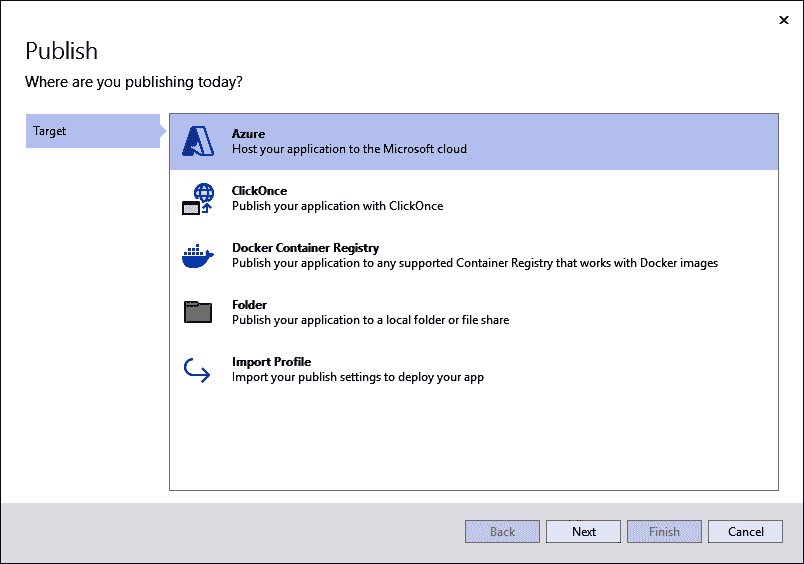

图 13.1：通过 Visual Studio 发布

有几个选项可供选择：

+   **Azure**：这意味着将您的系统部署到 Azure，以便在那里运行。

+   **ClickOnce**：ClickOnce 是构建简单安装程序的技术。更新和卸载是机制的一部分。然而，ClickOnce 是为用户启动的 Windows 应用程序设计的。因此，这不是我们系统程序员的解决方案。因此，我将在此处不涉及 ClickOnce。

+   **Docker 容器注册库**：这是一种打包和部署系统的绝佳方式。我们将在稍后讨论这一点。

+   **文件夹**：这是发布的最简单方式，因为它只是将所有必要的文件复制到一个文件夹中。

+   **导入配置文件**：如果您已经定义了部署方法，您可以通过导入它们来使用这些设置。

在此情况下，我们将选择**文件夹**。这样做之后，您将得到一个新的对话框，询问您是否希望使用**ClickOnce**进行文件夹部署，或者是否希望部署到文件系统。选择**文件夹**以选择后者。此时，您可以输入您想要发布的路径。目前，请将其保留为默认设置。点击**完成**。

虽然您点击了`FolderProfile.pubxml`，并且您可以在项目的**解决方案资源管理器**区域下的**属性** > **发布配置文件**中找到它。

Visual Studio 将打开配置文件并显示其外观。从这里，我们可以点击大的**发布**按钮；然而，我们可能想在这样做之前调整配置文件。点击**更多操作**并选择**编辑**。这将导致以下对话框：

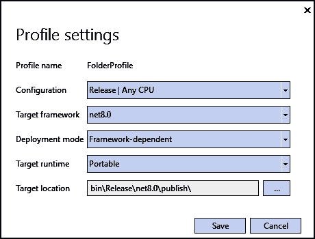

图 13.2：配置设置对话框

您可以在这里大量调整配置文件。让我们看看选项：

+   **配置**：您可以选择在项目中定义的任何配置。默认情况下，这些是**调试**和**发布**配置。我建议您使用**发布**进行部署。

+   **目标框架**：在这里，您可以为您的应用程序选择任何兼容和已安装的框架。只需将其设置为构建系统时使用的设置即可。

+   **部署模式**：在这里，您可以选择**框架依赖**和**自包含**之间的选项。如果您选择**框架依赖**，应用程序将假定目标机器上已安装.NET 运行时。然而，如果您选择**自包含**，所有需要的程序集都将包含在发布中。由于它包含从.NET 运行时所需的所有内容，因此您的包将变得更大。但是，它不依赖于其他人安装.NET 运行时。

+   **目标运行时**：这是您决定目标架构的地方。如果您知道那台机器的架构是什么，您可以从下拉菜单中选择它。这将导致代码更加优化，但限制了您可以使用它的地方。例如，如果您决定使用 Win-X64，您就不能将代码部署到 Linux 机器上。如果您不想做出这个决定，请将其设置为**便携式**。

+   **目标位置**：这是文件将被复制到的位置。

假设您决定选择**自包含**选项。在这种情况下，您将获得三个额外的选择：**生成单个文件**、**启用 ReadyToRun 编译**和**删除未使用代码**。

第一个选项是显而易见的：你得到一个大的文件，而不是几十个小文件。**ReadyToRun** 是一种 **提前编译**（**AOT**）的形式。这意味着代码是预编译的，因此启动更快。它不是真正的 AOT 编译：生成的文件包含编译后的代码和 IL。尽管如此，它节省了启动时间。**删除未使用代码**选项从运行时中删除你不需要的所有代码。选择此选项会使最终包的大小大大减小。

保存你的更改，然后点击 **保存**。之后，点击 **发布**。当 Visual Studio 完成后，转到你选择的文件夹，检查发生了什么（提示：你可以在 **发布配置文件** 对话框中点击 **目标位置** 值来打开 **资源管理器** 窗口并直接转到该位置）。

剩下的就是将生成的文件复制到目标机器上。然后，你可以在该机器上运行它，看看一切是否正常工作，你准备好了。

恭喜：你刚刚部署了你的应用程序！

## 使用 CLI 发布

Visual Studio 向导在帮助你构建配置方面非常出色。尽管如此，如果你已经知道自己在做什么或者想要将发布作为管道的一部分，你可以使用 CLI 来完成同样的操作。

基本命令很简单——在你有 `.csproj` 文件所在的目录中，只需运行以下命令：

```cs
dotnet publish
```

此命令使用对话框中的所有默认设置并将它们用于发布你的应用程序。当然，你可以更改 `publish` 的行为：你只需要提供正确的参数。以下表格显示了最常见的参数及其可能值。大多数参数有两个变体——一个完整的参数名称（通常以两个连字符开头）和一个缩写（通常以一个连字符开头）：

| **参数** | **描述** | **可能值** |
| --- | --- | --- |
| `-o`/`--output` | 放置已发布工件的目标目录 | 你想要放置已发布应用程序的目录 |
| `--sc`/`--self-contained` | 将运行时包含在你的应用程序中 | - |
| `-f`/`--framework` | 你想要部署到的目标框架 | `net6.0` `net7.0` `net8.0` |
| `-r`/`--runtime` | 要发布的目标运行时 | `win-x64` `linux-x64` `linux-arm` |
| `-c`/`--configuration` | 构建配置 | `Release` `Debug` |

表 13.1：dotnet publish 选项

如果你决定构建一个自包含的部署，你可以添加三个额外的参数：

| **参数** | **描述** |
| --- | --- |
| `-p:PublishSingleFile=true` | 创建单个文件 |
| `-p:PublishReadyToRun=true` | 编译为 Ready To Run AOT 二进制文件 |
| `-p:PublishTrimmed=true` | 从二进制文件中删除所有不必要的代码 |

表 13.2：自包含额外选项

你可以通过将它们设置为 `False` 来指定你不想使用这些选项，但我建议你省略该参数。

因此，要将您的控制台应用程序发布到特定文件夹，创建一个包含单个可执行文件的独立部署，并删除所有不必要的代码以适应在 `net.80` 上运行的 `win-x64` 架构。为此，请执行以下代码（所有内容都在一行上）：

```cs
dotnet publish
  -o d:\temp\publish
  --self-contained
  -f net8.0
  -r win-x64
  -c Release
  -p:PublishSingleFile=true
  -p:PublishReadyToRun=true
  -p:PublishTrimmed=true
```

现在，如果您转到 `d:\temp\publish` 文件夹，您可以取那里的文件，将其复制到您的生产机器上，并运行它。在这个时候，您可以坐下来，知道您辛勤的工作终于被使用了。

# 使用 Azure DevOps 和 GitHub

如果您的代码打算在云中使用，例如在 Azure 或 AWS 上，您可以使用 Azure DevOps 和 GitHub。您选择哪一个取决于您当前源代码的位置。DevOps 和 GitHub 都允许进行 **持续集成和持续部署**（**CI/CD**）场景。

CI/CD

CI/CD 的想法是，当您更改源代码时，系统会注意到这一点并构建您的软件。然后，它可以选择性地运行测试（在我看来，这不是可选的，而是强制性的）。之后，它会自动将新的二进制文件部署到生产环境。这种工作方式意味着您可以对系统进行许多小的、增量更新，并尽早获得关于您所做工作的反馈。如果这符合您的用例，这是一个伟大的工具！

让我们先看看 Azure DevOps。

## 部署到 Azure

假设您已经设置了一个 Azure DevOps 项目，定义了工作流程，并且有一个用于托管代码的仓库。

如果您已经将 Visual Studio 连接到该项目，您可以将它连接到该项目。在我的情况下，我创建了一个简单的 Function App。Function App 是在 Azure 中运行的服务。在这种情况下，我决定使用一个简单的基于 HTTP 的触发器。换句话说，该函数响应 REST API 调用并返回一个包含友好问候语的字符串。本章不是关于编写 Azure Functions，而是关于部署，所以我不会深入探讨代码的工作原理。目前，它是一个您可以通过名为 `name` 的参数调用的 REST API；它返回包含该名称的友好问候。就是这样。

但为了使事情更有趣，我给我的程序命名为 `MyFileConverterFunctionApp`。相信我：它并不做任何有趣的事情。

如果您已经在本地运行了代码，那么现在是时候为部署准备您的系统了。我们需要执行两个步骤。

+   创建发布配置文件

+   将系统发布到 Azure

让我们开始吧。

### 为 Azure DevOps 构建发布配置文件

在向您展示如何将应用程序部署到 Azure 之前，让我们回顾一下如果您想跟随操作所需的先决条件。首先，您需要一个要部署的项目。但除了这个明显的先决条件之外，您还需要以下这些：

+   一个 Azure 账户。

+   一个资源组（我的叫做 `SystemsProgrammingRg`）。

+   一个密钥保管库来存储机密。

+   一个存储账户。我们稍后需要这个账户进行部署。

一旦您有了这些，您就可以开始部署过程了。

在 Visual Studio 中，右键单击您的项目名称，然后选择**发布**。您将被带到以下屏幕：


图 13.3：默认发布对话框

是的，这是我们之前看到的同一个对话框。然而，这次，选择**Azure**作为您的目标。

以下对话框将询问您想要部署哪种类型的服务。我选择了**Azure Function App (Windows)**。您可以选择 Linux 部署。现在不用担心容器选项；我们将在本章后面讨论 Docker 和容器。

然后，我们需要告诉 Visual Studio 我们的应用程序的最终位置。很可能您没有可以使用的函数应用（毕竟，这并不是先决条件的一部分），因此您现在可以创建一个。您将看到一个对话框，询问您关于您的环境和首选项。我的看起来像这样：

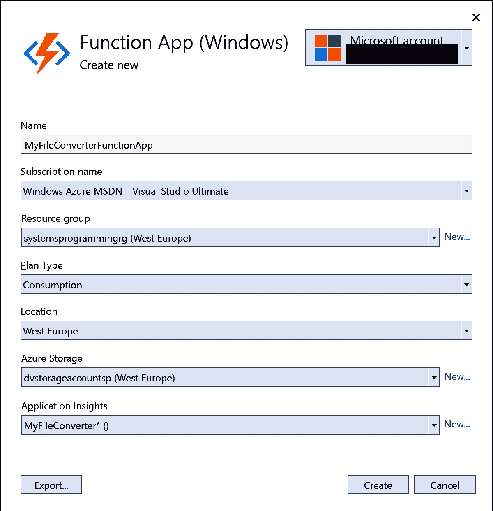

图 13.4：在 Visual Studio 中创建新的函数应用

我已经将我的 Azure 账户详情隐藏起来，因为我希望您使用自己的账户。您需要选择最适合您的选项。此对话框也是您必须指定我告诉您创建的存储账户的地方（在我的情况下，它是`dvstorageaccountsp`）。我还决定添加**应用程序洞察**。使用**应用程序洞察**可以帮助我在需要时监控和调试我的应用程序。

当您点击**创建**时，系统将构建您的环境。这需要一些时间，但完成之后，我们可以转到下一个屏幕。下一个屏幕提供了给定资源组中所有应用程序服务和所有部署槽位的概览。由于我们还没有部署，这个列表是空的。点击**下一步**：

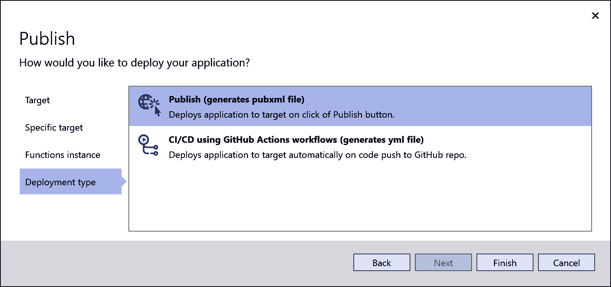

图 13.5：选择作为发布机制要生成的内容

我们可以在这里选择是否使用发布配置文件或 GitHub Actions。我们很快就会看到 GitHub Actions，所以现在让我们选择**发布**。Visual Studio 将为我们生成发布配置文件。

完成这些后，我们会看到一个概览，包括一个漂亮的大、吸引人的**发布**按钮：

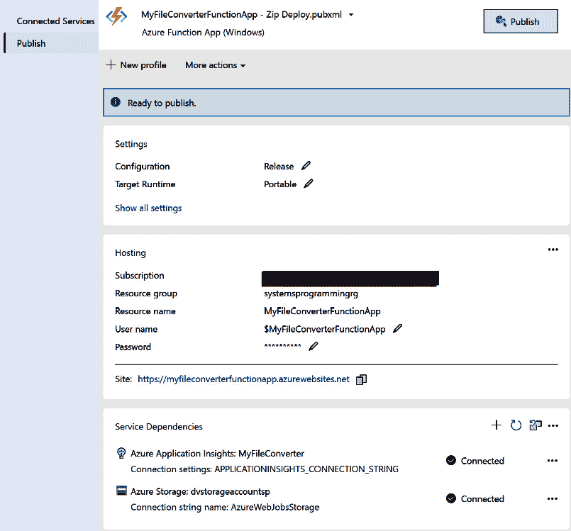

图 13.6：发布配置概览

让我们点击那个**发布**按钮！

再次强调，这需要一点时间，但您的代码发布后，您将获得一个超链接，允许您访问资源。您可以点击它，但不会有什么激动人心的东西。它只是一个网页，说明您的函数应用正在运行。

要查看发生了什么，请转到 Azure 门户，找到您的资源组，并定位到我们创建的函数应用。在那里，您可以直接在 Azure 网页门户中测试函数。或者更好的是，如果您已安装 Visual Studio Code，创建一个名为`test.http`的新文件，并添加以下代码：

```cs
GET https://myfileconverterfunctionapp.azurewebsites.net/api/Function1
Content-Type: application/json
{
     "name": "dennis"
}
###
```

用您的 URL 替换我的 URL，并点击第一行顶部的**发送请求**链接。这将调用服务器。您会得到一些结果，应该看起来类似于以下内容：

```cs
HTTP/1.1 200 OK
Connection: close
Content-Type: text/plain; charset=utf-8
Date: Mon, 17 Jun 2024 07:07:01 GMT
Content-Encoding: gzip
Transfer-Encoding: chunked
Vary: Accept-Encoding
This HTTP triggered function executed successfully.
```

您的数据可能不同，但重要的是我们得到了`HTTP/1.1 200 OK`的结果。这表明我们的应用程序工作正常！

## 在 Azure DevOps 中启用持续集成

直接从您的开发环境将代码推送到 Azure 很方便。一旦您设置了发布配置文件，右键单击您的程序并点击**发布**，将您的更改移动到 Azure。

虽然有更好的方法来做这件事：您可以通过启用 CI/CD，使得任何您做出的更改都会自动部署。

分支和 CI/CD

在我所有的示例中，我使用单个分支：`main`。我将机器上的`main`分支更改直接推送到在线源仓库，并让系统从那里构建。在现实世界的场景中，这是一个糟糕的想法。您应该选择一种分支策略，以便在日常工作与部署之间有良好的分离。您需要像拉取请求和合并策略这样的东西来保持工作的质量。请不要像我这里做的那样，只有一个分支。

那么，我们如何实现这个魔法？我们如何让我们的更改“自动魔法般”地出现在我们的生产环境中？答案是使用管道。

在您的 Azure DevOps 环境中，转到项目。您会在左侧侧边栏中看到一个**管道**标签。点击它。您会看到一个页面，说明您还没有任何管道。让我们改变这一点。点击**创建管道**按钮。您将被带到以下屏幕：

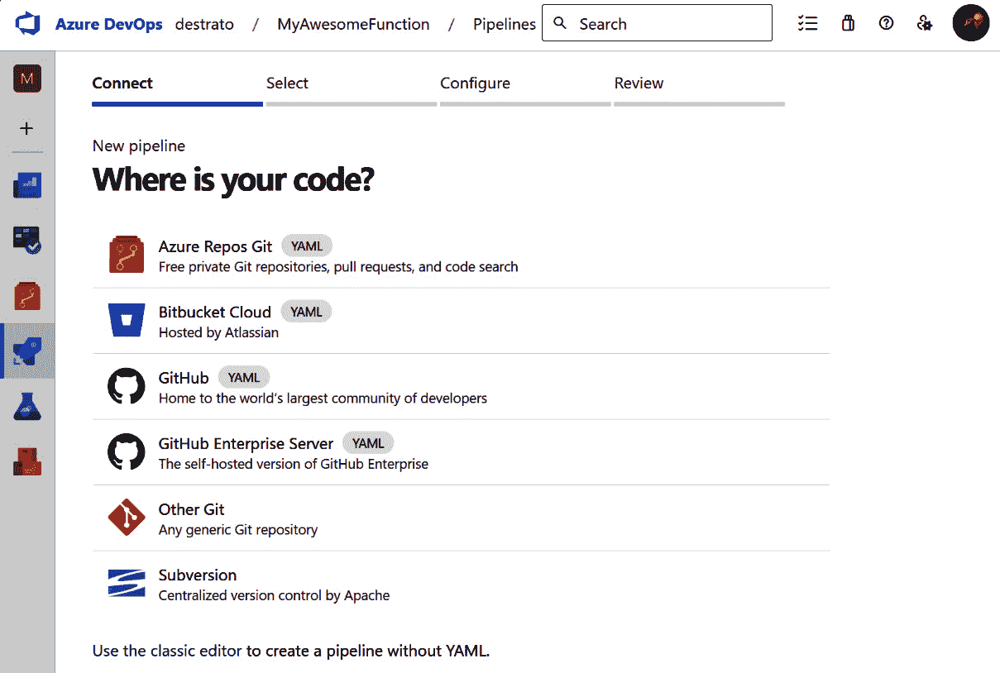

图 13.7：创建 Azure DevOps 管道

在此情况下，选择**Azure Repos Git**。点击它后，会弹出一个对话框要求选择项目。选择包含您想要自动部署的代码的仓库。

一旦您这样做，您就完成了。是的——它就是这么简单。

您现在可以手动运行管道以查看一切是否正常工作。构建您的解决方案需要几分钟，但完成后，您会看到如下内容：

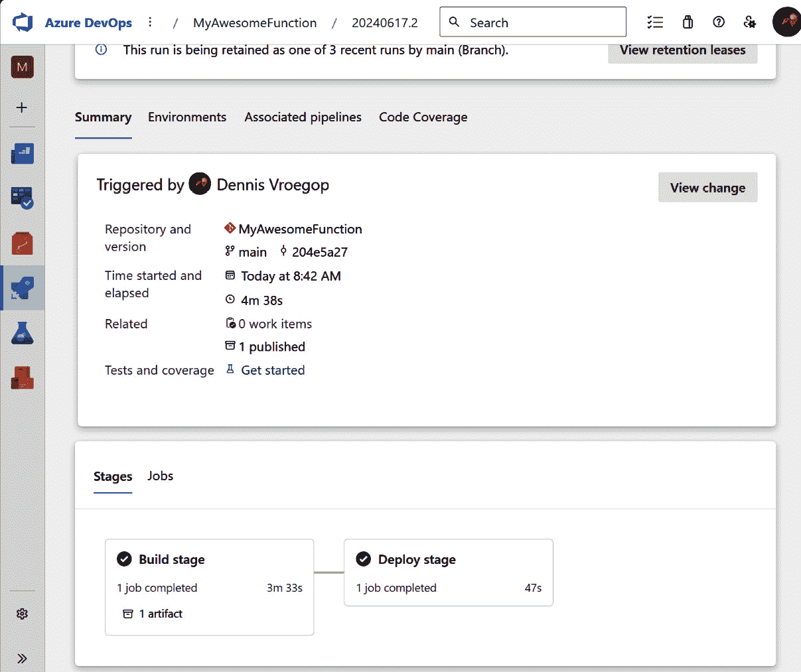

图 13.8：成功的管道运行

要测试您的代码是否已发布，请从 Visual Studio Code（或您用于测试 REST 调用的任何工具）重新运行测试。

现在，是时候做一些酷的事情了。

在 Visual Studio 中，对代码进行更改。您可以做一些简单的事情，比如更改函数返回的文本。

保存您的更改并将它们推送到您的仓库。一旦您这样做，转到 Azure DevOps 并找到管道——您会看到它已经开始运行了！只需等待几分钟，直到它完成并重新运行您的测试。您应该会看到您的结果已经传播到生产环境中。

这就是我所说的简单部署！

如果你有所怀疑，管道会从你的发布配置文件中获取所有必要的信息。记得我之前说过，如果你先手动发布，这样做会更简单吗？现在你知道为什么了！你应该查看生成的 YAML 文件，看看事情是如何工作的。如果你准备好将你的部署技能提升到下一个水平，我建议你在网上搜索。关于这个主题已经写了几十本书，所以我相信你可以找到你想要的东西。

## 启用 GitHub 的 CI

Azure DevOps 是与同一组织内的人协作的好方法。然而，如果你想与不同组织的人合作，GitHub 可能是一个更好的选择。GitHub 更倾向于开放协作，如开源项目。但这并不意味着你不能像在 Azure DevOps 中那样拥有相同的持续集成：你可以通过 GitHub Actions 实现相同的事情。

我们不是在 Azure DevOps 中保留源代码，而是在 GitHub 上托管它。最初，GitHub 不过是一堆仓库，但自那时起它们已经扩展了很多。他们添加的更令人惊讶的事情之一是 GitHub 动作。

行动相当于我们刚才查看的管道。语法不同，并且它们支持比 Azure 默认管道更多的环境，但理念保持一致。

GitHub 提供向导来帮助你编写动作，但有一个简单的方法可以快速启动我们的第一个动作。

在 Visual Studio 中创建一个新的 Azure Function 项目，但这次将其存储在你的 GitHub 账户中。一旦完成，就在本地测试并发布到 Azure。我总是这样做以确保它工作。

一旦发布完成，使用 Visual Studio Code 或你喜欢的测试工具为你的代码创建一个测试。

现在，让我们从 GitHub 设置 CI/CD！

在 Azure 门户中，导航到你的函数。然后，在左侧边栏中，选择**部署中心**。然后，在**源**下，选择**GitHub**。完成这些后，你可以输入你的详细信息。你必须登录到 GitHub 并选择正确的组织、仓库和你要发布的源分支。

你还需要指定你希望如何进行身份验证。GitHub 动作需要登录到 Azure 以部署你的代码，因此向导会为你创建一个账户。使用用户分配的标识来实现这一点。标识将自动创建。一旦发生这种情况，点击**保存**。

就这样——你刚刚设置了你的第一个 GitHub 动作！如果你不相信我，去你的 GitHub 账户，选择你的项目，然后转到**动作**。你应该在那里看到动作，并且它应该显示它已经运行过！

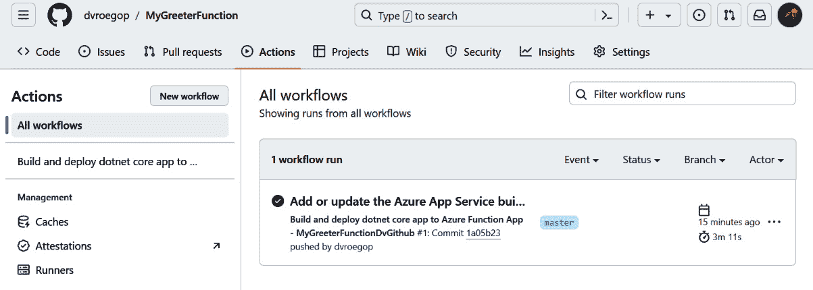

图 13.9：第一个动作

要检查它是否按预期工作，您可以更改代码，将更改提交到存储库，并查看操作是否生效。您可以通过点击运行来查看详细信息。完成后，它将更新您 Azure 环境中的代码。测试它并查看更改！

当然，我们的大部分代码在 Azure 上无法运行。作为系统程序员，我们经常必须部署到本地硬件。在这种情况下，这些技术将不起作用。我们必须找到更好的方法。而且有：使用安装程序！

# 使用 Visual Studio 构建安装程序

安装程序并不是什么新鲜事物——在很长的一段时间里，它是将应用程序安装到您系统上的唯一方式。安装程序主要用于在用户的机器上安装基于 Windows 的应用程序。由于这已经过时，因此不再经常使用。但如果您希望安装后台工作进程并需要进行一些自定义工作，安装程序是一个非常好且简单的方法来完成这项工作。

安装程序和 Wix

标准的 Microsoft Installer 项目工作得很好。尽管如此，许多开发者已经转向使用 Wix。Wix 是用于构建安装程序的第三方解决方案。它非常灵活，因此，开始使用它相当困难。有许多书籍、文章和教程可以帮助您入门。但就我们而言，我们不需要这种复杂性。标准的安装程序对大多数系统程序员来说就足够了。但如果您想要更多控制权，我强烈建议您深入研究 Wix，看看它能为您做什么。

假设您在 Visual Studio 中安装了**Microsoft Visual Studio Installer Projects 2022**扩展。在这种情况下，您可以将安装程序项目添加到您的解决方案中。

让我们这样做！

## 构建简单的安装程序

在**新项目**对话框中，选择**设置向导**模板。这将启动一个典型的“下一步，下一步，完成”类型的向导。需要遵循五个步骤。

第一个看起来像这样：

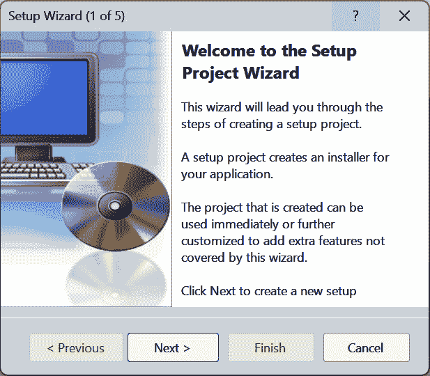

图 13.10：设置向导（第 1 页，共 5 页）

其余的屏幕都是自我解释的。第一个真正的问题是询问您是否想为 Windows 应用程序构建设置程序、为 Web 应用程序构建设置程序，或者您是否想创建一个可分发的包。我们想要第一个选项：为 Windows 应用程序的设置，因为后台工作系统仍然是这个。

然后，向导将询问您想安装什么。从下拉菜单中选择**从…发布项目**选项。这些都是所有可执行文件和依赖项，因此我们想要这些。

之后，您将被询问是否还有其他文件要包含。没有，所以只需点击**下一步**。最后一步是之前步骤的总结。查看此页面并点击**完成**。

就这样！

在我们能够测试它之前，我们需要设置一些属性。在**解决方案资源管理器**区域中选择你的项目，并查看**属性**窗口。在这里，你可以填写你认为重要的所有详细信息。我的看起来像这样：

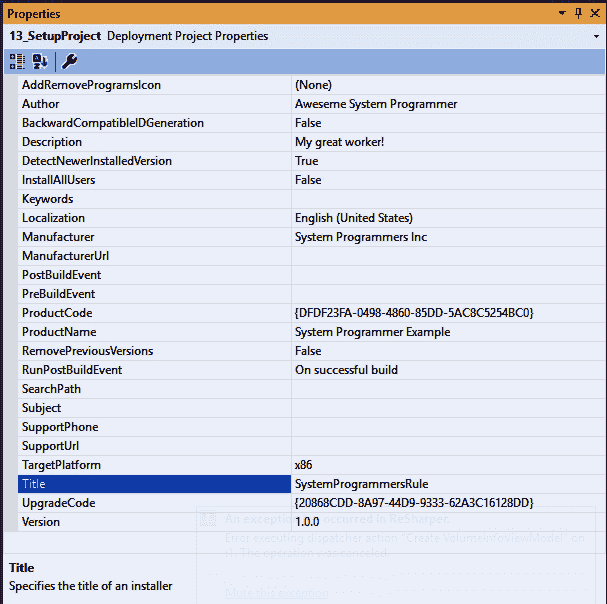

图 13.11：设置项目属性

你至少应该更改`C:\Program Files (x86)`文件夹。如果你不想要这个，将`TargetPlatform`属性从默认文件夹`C:\Program Files`更改。当然，你应该只在你的应用程序确实是 64 位（**x64**选项）而不是较旧的 32 位（**x86**）格式时这样做。

为什么 64 位是 X64，而 32 位是 X86？

有时候，人们会被这些名称搞混。人们似乎明白 X64 代表 64 位，但为什么 32 位被称为 X86 呢？答案相当简单：X64 确实只是 64 位，但 X86 指的是很久以前的原始英特尔 8086 处理器，当时机器运行的是 16 位或最多 32 位的软件。这只是一个你现在知道并且可以向朋友吹嘘的奇怪事情！

是时候测试一切了！

右键单击你的**安装**项目，选择**构建**，看看是否一切构建成功。如果成功了，你可以再次右键单击项目，但这次选择**安装**。如果一切顺利，你的系统将被安装！你可以导航到安装过程中选择的文件夹，并看到那里的文件。

为了清理，你只需要在 Visual Studio 中点击**卸载**。

## 编写自定义操作

这很好，但还不够。特别是对于我们系统程序员来说，在安装期间或之后还需要做几件事情。例如，工作进程必须注册为 Windows 服务以自动启动。或者让我们假设我们有一个必须在存储到设置文件之前加密的秘密。我们该如何做呢？答案是，我们编写一个自定义操作。

*自定义操作是外部程序集中的一个代码片段，它在安装程序部署时在正确的时间被调用。*

编写它们并不难：它们都是用 C#编写的。而且我们知道这门语言！

首先，让我们讨论一下我们想要做什么。

在上一章中，我们讨论了秘密。我们发现我们可以使用.NET 系统生成密钥来加密和解密数据。这个密钥只会在这个机器上工作，因为它与特定用户的安装的 Windows 版本相关联。这意味着我们必须加密目标机器上的`appsettings`文件中的任何秘密。

假设我们在设置文件中部署了一个未加密的秘密。在这种情况下，我们必须确保在安装过程中加密目标机器。

在我的示例中，我只是用一个新的`GUID`替换了一个占位符来展示如何操作。但原则是相同的。

将一个新的类库添加到解决方案中。然而，有一个注意事项：选择类库的**.NET Framework**版本。MSI 安装程序使用的是“旧”的.NET 框架，因此任何附加组件都必须使用该技术构建。

将对**System.Configuration.Install**的引用添加到类库项目中，就像我这里做的那样：

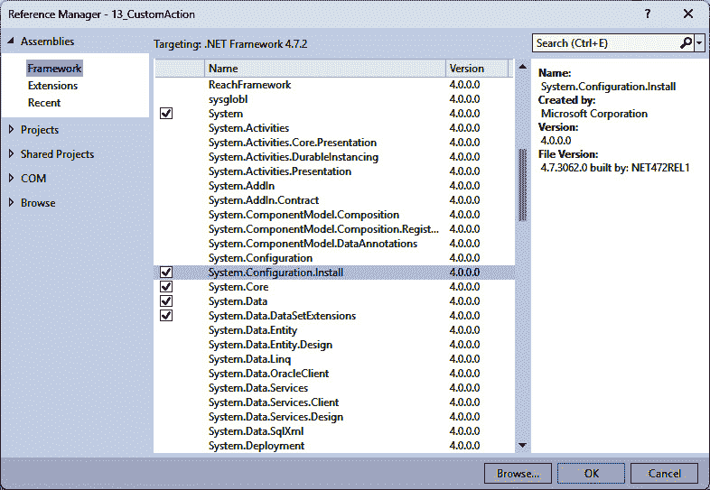

图 13.12：添加 System.Configuration.Install 引用

向类库添加一个新的`Installer`类型的项目。你可以通过右键单击项目并选择`Installer`来实现。命名为`SecretsInstaller`。这可以在下面的屏幕截图中看到：

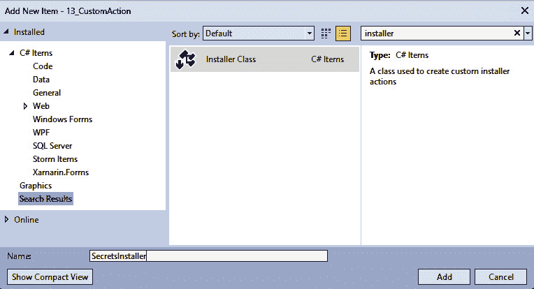

图 13.13：添加安装类

修改代码，使其看起来像这样：

```cs
[RunInstaller(true)]
public partial class SecretsInstaller : Installer
{
     public override void Install(IDictionary stateSaver)
     {
           base.Install(stateSaver);
           var secret = Guid.NewGuid().ToString();
           var targetDir =
                 Context.Parameters["targetdir"];
           var appSettingsPath =
                 Path.Combine(targetDir, "appsettings.json");
           if (File.Exists(appSettingsPath))
           {
                 var appSettingsContent =
                       File.ReadAllText(appSettingsPath);
                 appSettingsContent =
                       appSettingsContent.Replace(
                             "SECRET_PLACEHOLDER",
                             secret);
                 File.WriteAllText(
                       appSettingsPath,
                       appSettingsContent);
           }
     }
}
```

这段代码会被`Installer`调用。在这里，我找到了`appsettings.json`文件，将其加载到内存中，找到了`SECRET_PLACEHOLDER`字符串，并将其替换为`Guid`值。最后，我将它写回文件。

有趣的部分是我获取文件路径的行。我稍后会回到那里，所以请记住这一点。

我们需要使用`Installer`注册这个类。将一个新的`Installer`类添加到我们的类库中，`ProjectInstaller`，并更改构造函数。这段代码甚至比上一个还要简单：

```cs
[RunInstaller(true)]
public partial class ProjectInstaller : Installer
{
     public ProjectInstaller()
     {
           InitializeComponent();
           var secretsInstaller = new SecretsInstaller();
           Installers.Add(secretsInstaller);
     }
}
```

在构造函数中，我们创建了一个`SecretsInstaller`类的实例并将其添加到我们的`Installer`中。这是一个安装系统会查看并调用`Install`方法的类列表。

这就是我们需要编写的所有代码。让我们来使用它！

## 在设置中集成自定义操作

返回到**设置程序**。右键单击项目，选择**添加…**，然后**项目输出**。选择**自定义操作**项目的输出。这确保我们的 DLL 是目标机器上正在安装的文件之一。

再次右键单击**设置程序**，但选择**查看**，然后**自定义操作…**。

你应该会看到一个包含四个类别的屏幕。这决定了自定义操作应该在何时被调用。这些选项如下：

+   **安装**：这是所有文件都被安装的时候

+   **提交**：这是设置完成所有事情的时候

+   **回滚**：当设置失败时，这被称为

+   **卸载**：当用户决定安装时，这些操作会被执行

在我们的情况下，我们需要使用**Install**。右键单击它并选择**添加自定义操作**。再次，你将看到一个显示目标机器文件结构的对话框。这些都是我们的文件可能最终到达的位置。由于我们将自定义操作的项目输出添加到了常规安装中，我们可以在**应用程序文件夹**区域找到它。选择自定义操作的主要输出并点击**确定**：

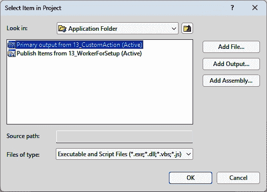

图 13.14：添加自定义操作组件

不要离开自定义操作视图。点击**安装**部分中的新项目，查看**属性**区域。在这里，你可以添加各种项目，但最重要的是**CustomActionData**。

这是来自外部传递给我们的自定义操作参数的数据。记得我之前说过我会回到如何获取目标目录路径的方法吗？这就是我做到这一点的地方。将以下行添加到该属性中：

```cs
/targetdir="[TARGETDIR]\ "
```

是的。那一行的末尾有一个“反斜杠，空格，关闭引号”。不要遗漏这些。相信我：我花了好几个小时确定为什么我的操作不起作用。原因是：我忘记了那个额外的斜杠和空格。没有它根本不起作用。

就这么简单！

你现在可以构建并运行**安装**。

查找安装发生的文件夹，并惊叹于 JSON 文件中的变化！

# 使用 Docker

开发者当有人抱怨系统不符合预期时最常用的借口是“但是在我的机器上它工作得很好！”当然，唯一的合适回应是，“我们不发货机；我们发货软件。”

Docker 旨在解决那个问题。

Docker 是一个高度复杂的话题。如果你不了解它能做什么，请在熟悉它之前跳过本章的这一部分。简而言之，Docker 可以像完整的虚拟机一样运行。这个原则意味着你可以在那个虚拟机上开发，在那个虚拟机上测试，然后部署那个虚拟机。换句话说，如果它在那个机器上工作，它将在任何地方工作。它之所以能在任何地方工作，是因为有了 Docker，我们发货你的机器。好吧，至少是虚拟的。

Visual Studio 完全拥抱了 Docker。IDE 内置了实用的附加组件和向导，以帮助您使用 Docker。

## 将 Docker 支持添加到你的后台工作进程

如果你创建了一个新的项目，例如后台工作进程，你可以选择添加 Docker 支持。但如果你已经有一个项目，你必须稍后添加支持。这并不难做：只需右键单击项目，选择**添加**，然后点击**Docker 支持**。你可以在**Windows**和**Linux**之间选择：

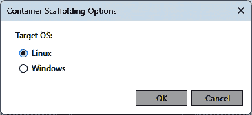

图 13.15：将 Docker 添加到现有项目

Docker – 使用 Windows 还是 Linux？

如果你已经使用 Visual Studio 了一段时间，你可能会选择 Windows 而不是 Linux。毕竟，你可能非常了解那个平台。为什么你要迁移到 Linux 呢？然而，容器化来自 Linux 世界：它被嵌入到操作系统的核心中。Linux 是比 Windows 更好的容器平台。如果你不需要 Windows 功能，我建议你以 Linux 为基础容器。如果你决定使用 Docker，你的应用程序将从中受益。

当你这样做时，会发生很多事情：

+   项目中添加了一个名为`Dockerfile`的新文件

+   `launchSettings.json`文件被更改以添加 Docker

+   在后台，安装所有必要的支持镜像

+   默认启动操作设置为**容器**（Dockerfile）

如果你开始调试，Visual Studio 将会使用你的二进制文件构建 Docker 镜像并启动一个容器。你可以在代码中添加断点，Visual Studio 也会确保调试器被部署在容器中。因此，它知道如何来回隧道调试信息。整个过程都是简化的：你几乎不会注意到你是在 Docker 镜像上运行而不是在主机机器上。

## 部署你的 Docker 镜像

一旦你完成对代码库的工作并准备部署它，你必须弄清楚在哪里部署它。有三个选项：

+   使用 Docker Hub。这是你可以存储你的镜像的标准存储库。

+   使用 Azure/AWS/Google Cloud 来存储你的镜像。这些存储库要安全得多，因为你控制这些环境。例如，你可以在 Azure 中创建一个容器注册库，然后上传你的镜像。你组织中的每个人都可以拉取那个镜像并在本地运行它。

+   使用你自己的存储库。假设你不想依赖云提供商，但想完全控制你的镜像存储位置。在这种情况下，你可以构建自己的存储库。

第三个选项是我们场景中最常用的一个。当然，你也可以使用 Docker Hub 或 Azure。没有任何东西会阻碍你的道路。只是对于我们构建的东西来说，第三个选项可能是最合适的。

构建实际的存储库是困难的。但好消息是，其他人已经完成了这项工作。他们已经将其放入了一个 Docker 镜像中。所以，我们只需要下载那个镜像并启动它。

但在我们这样做之前，我们需要考虑安全性。有许多方法可以保护存储库，但最简单（也是最不安全）的方法是分配一个用户名/密码。你需要一些代码来生成这些，但不用担心：有一个 Docker 镜像可以做到这一点。

首先，创建一个名为`C:\Auth`的文件夹。然后，运行以下命令：

```cs
docker run --rm --entrypoint htpasswd httpd:2 -Bbn yourusername yourpassword > C:\auth\htpasswd
```

这个命令下载了`http:2`镜像并运行它，给它一个用户名为`yourusername`和密码为`yourpassword`（我建议你使用其他值作为这些参数），并将结果存储在`c:\auth`文件夹中的`htpasswd`文件中。

现在，我们可以启动存储库。运行以下命令，全部在一行中：

```cs
docker run -d -p 5000:5000
  --name registry
  -v c:\auth:/auth
  -e "REGISTRY_AUTH=htpasswd"
  -e "REGISTRY_AUTH_HTPASSWD_REALM=Registry Realm"
  -e "REGISTRY_AUTH_HTPASSWD_PATH=/auth/htpasswd"               registry:2
```

这个命令从 Docker Hub 拉取`registry:2`镜像并启动它。它将内部文件夹`/auth`连接到我们的`c:\auth`目录，并给它一些参数。

就这么简单。

要使用存储库，你必须登录：

```cs
docker login localhost:5000
```

现在，你可以在那里标记和推送你的镜像。在我的例子中，我的从 Visual Studio 来的 C#工作进程镜像被称为`image13workerfordocker`。

你可以通过运行以下命令来标记它：

```cs
docker tag image13workerfordocker:dev localhost:5000/image13workerfordocker:dev
```

再次强调，这是一整行。现在，我可以将其推送到我的本地存储库，如下所示：

```cs
docker push localhost:5000/image13workerfordocker:dev
```

如果我想重用我的镜像，我可以拉取它：

```cs
docker pull localhost:5000/imagework13fordocker:dev
```

我可以使用这个存储库，就像我可以在 Docker Hub、Azure、AWS 或 Google 上的那些存储库中一样。

## 生产就绪的 Docker 存储库

我在这里展示的只是让你看到最基础的开始。这个仓库并不安全或不稳定，甚至无法在重启后存活。

如果你想在真实的生产环境中使用它，你需要做几件事情：

+   通过使用 TLS 来加强安全性

+   安装一个卷，以便你可以存储镜像而不是使用容器（提示：将卷映射到 `/var/lib/registry`）

+   使用实际的认证方式，而不是我刚刚展示给你的单个用户名/密码

+   在像 Kubernetes 这样的故障安全环境中部署仓库

但即使有这个设置，你仍然可以拥有自己的仓库。这将确保如果代码在你的机器上工作，它将在任何地方工作！

# 下一步

在本章中，我们讨论了许多将你的软件从你的机器传输到其他机器的方法。有些很简单，有些则很复杂。说实话，本章更多的是帮助你开始思考部署。每个主题都可以填满数百页。例如，我提到了 Wix。好吧，仅关于 Wix 就有数十本书籍。我们在 Azure 中讨论了 CI/CD，只用了几页。结果发现，人们可以从这个主题中完全建立起自己的职业生涯。我们还研究了 Docker：人们可能需要花费数周甚至数月的时间来掌握这个主题。

你有多种方式可以将你的代码发布出去，而这章只是触及了表面。

我想向你展示最常见的一些适合我们最可能遇到场景的方法。确定哪种最适合你的用例，然后深入探索，这取决于你。

在我让你们离开之前，我需要说一些关于 Docker 对话的内容。对话询问你是否想使用 Linux 或 Windows。我建议你尽可能选择 Linux。如果你认为，“但我对 Linux 了解很少”，请不要担心。下一章将告诉你所有你需要知道的关于那个操作系统的内容。那么，让我们看看，好吗？
