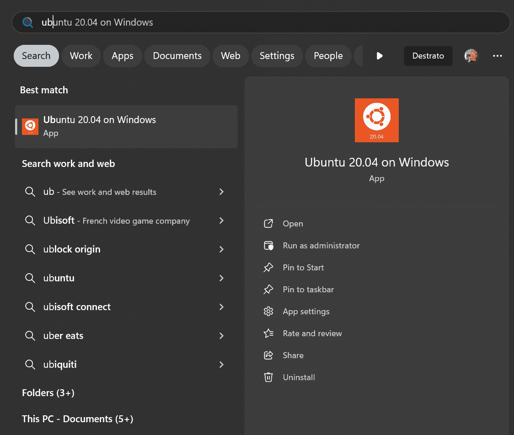
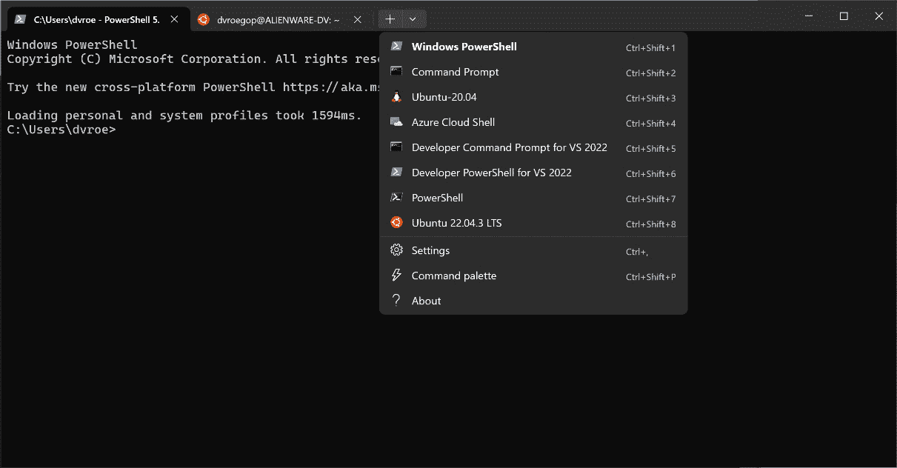
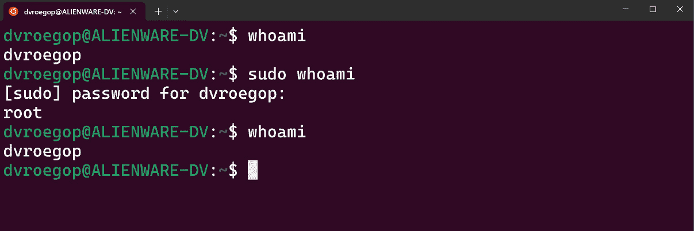
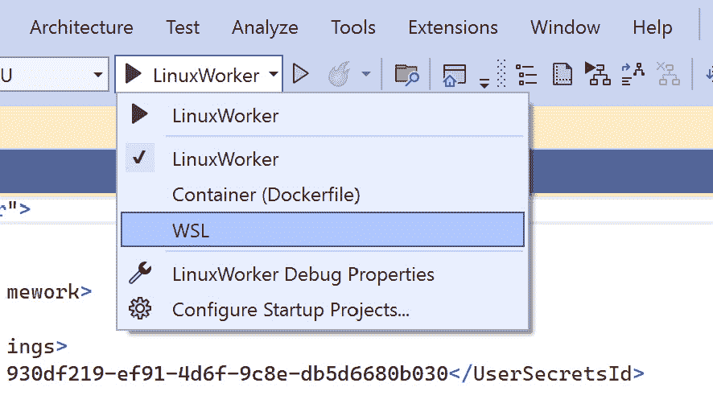
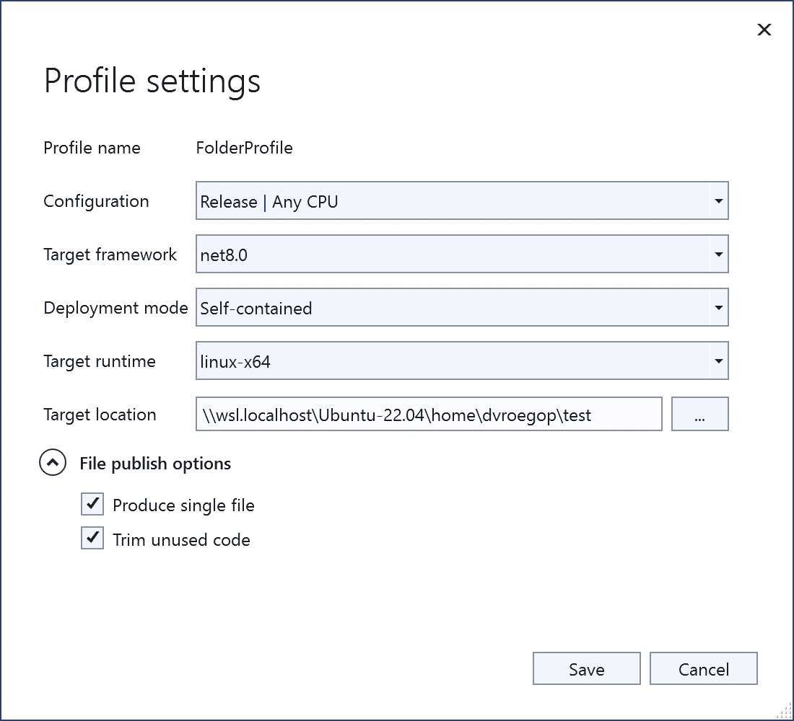

# Linux 飞跃篇

*在 Linux 上使用 C#进行系统编程*

我记得只有真正酷炫的孩子才会使用 Linux。Windows 是严肃人士的选择。那里才是工作的场所。当然，许多服务器运行 Unix 或 Linux，但那些平台上工作的人被认为有些奇怪。他们通常有胡须，穿凉鞋，说一种其他人从未听过的语言。

好吧，也许我有点夸张。这可能表明了我对 Linux 的感受，或者我有多么被那个操作系统及其用户吓到。Linux 一直被认为是一个更成熟但更复杂的操作系统。它更安全，速度更快，维护性更好。但使用起来也更复杂。大部分工作都是在命令行中完成的，尽管也存在图形用户界面。

这些天，情况不同了。Linux 无处不在。而且有很好的理由——在当前这个在线、互联的世界中，Linux 是一个出色的操作系统来运行你的系统。

随着**.NET Core**和**.NET 5**的引入，那些传统上只使用 Windows 的开发者也可以将他们的代码编译在 Linux 上运行。这开辟了一个全新的世界。

当然，也有缺点。Linux 比 Windows 复杂，尤其是如果你长时间在 Windows 上工作。尽管.NET 可以在 Linux 上运行，但并不是你习惯的所有类和工具都可用。

这章旨在帮助你入门，如果你想在 Linux 上运行你的.NET 应用程序。别担心——我不想让你开始穿凉鞋或成为一个典型的 1970 年代类型的开发者。这完全是可选的。所以，让我们释放你内心的企鹅，开始在 Linux 上编程！

在本章中，我们将提出以下问题：

+   什么是 Linux？

+   我如何在 Linux 中做基本的事情？

+   我该如何为 Linux 进行开发？

+   我该如何部署到 Linux？

+   我该如何为 Linux 编写后台服务？

本章包含一些历史，一些理论，以及大量的实用信息和示例。你准备好了吗？

# 技术要求

你可以在以下 URL 的我们的仓库中找到本章的所有代码：[`github.com/PacktPublishing/Systems-Programming-with-C-Sharp-and-.NET/tree/main/SystemsProgrammingWithCSharpAndNet/Chapter14`](https://github.com/PacktPublishing/Systems-Programming-with-C-Sharp-and-.NET/tree/main/SystemsProgrammingWithCSharpAndNet/Chapter14)。

如果你想跟上，你需要一台 Linux 机器。但在开发过程中，你实际上并不需要。你只需要 WSL。**WSL**代表**Windows Subsystem for Linux**。官方名称是 WSL2，因为我们现在处于版本 2，但在这里我们还是用 WSL。

WSL 是一个轻量级的虚拟机，可以在你的 Windows 机器上运行 Linux 发行版（我稍后会解释这是什么）。你可以快速切换到这台机器，就像使用“真正的”Linux 机器一样。你甚至可以直接从 Visual Studio 部署并调试你的应用程序在 WSL 上。

要安装 WSL，请按照以下步骤操作：

1.  在 Powershell 中，使用 `wsl --install` 命令（你必须是一位管理员才能这样做）。请注意，这可能会占用你机器上几吉字节的空间。

就这样。没有 *第二步*。你现在可以进入 `Ubuntu`。看起来是这样的：



图 14.1：从 Windows 开始菜单运行 Ubuntu

或者，你可以安装其他版本的 Linux，但在这本书中，我将使用 **Ubuntu 20.04**。你选择什么并不重要；只要做你感到最舒服的事情即可。

或者，你可以使用 HyperV 创建虚拟机，部署带有 Linux 的 Docker 容器，获取第二台安装 Linux 的机器，或者从可启动的 USB 驱动器运行 Linux。选择权在你。

# Linux 概述

在讨论如何为 Linux 编程之前，我们应该讨论它是什么。简短的答案是它是一个操作系统。虽然这是绝对正确的，但它并没有充分解释 Linux 可以做什么。我可以说自行车是一种交通工具，但这同样适用于将宇航员送往月球的土星 5 号火箭。我们需要更多的信息。

## Linux 简史

Linux 的历史非常引人入胜。了解其开发的时间和背景可以帮助你欣赏一些设计决策和选择。因此，以下是 Linux 历史的简要时间线：

1.  **早期开始**

    +   在 1983 年，Richard Stallman 宣布了 GNU 项目。想法是创建一个免费的类 Unix 操作系统。Unix 是当时领先的操作系统。GNU 项目开发了众多组件，但一个关键部分，内核，是缺失的。

    +   在 1987 年，Andrew S. Tanenbaum 创建了 Minix。Minix 是一个类 Unix 系统。它旨在教育目的，并且在学生中非常受欢迎。其中之一是一个名叫 Linus Torvalds 的年轻人。

1.  **Linux 的诞生**

    +   在 1991 年，芬兰赫尔辛基大学的 Linus Torvalds 学生开始开发他的内核。这只是个爱好；他想要有事情做。1991 年 8 月 25 日，他在一个新闻组帖子中宣布了他的项目，寻求他人的意见。这就是后来成为 Linux 内核的东西。

    +   在 1991 年 10 月 5 日，Torvalds 发布了 Linux 的 0.02 版本。它可以运行 Bash（一个终端）和 GCC（一个 C 编译器）。

1.  **发展和增长**

    +   在 1992 年，Linux 在 GNU **通用公共许可证**（**GPL**）下发布，允许任何人使用、修改和分发该软件。

    +   在 1990 年代中期，Linux 的受欢迎程度迅速增长。Slackware 和 Debian 这样的发行版都在 1993 年发布。

    +   在 1994 年，Linux 1.0 版本发布。这是一个重要的里程碑；这是第一个稳定版本。

1.  **商业和** **社区扩展**

    +   在 1996 年，Tux 企鹅被选为官方 Linux 图标。

    +   1990 年代末，像红帽和 SUSE 这样的公司开始提供商业 Linux 发行版。由于这些发行版还包括支持，这是企业纷纷加入的时刻。

    +   1999 年，IBM 宣布支持 Linux。

1.  **21 世纪和** **主流采用**

    +   2001 年，内核的 2.4 版本发布，包括 USB、PC 卡和其他硬件支持。

    +   2002-2003 年，惠普和戴尔等大型公司开始在他们的服务器上提供 Linux。

    +   2004 年，Canonical 发布了其 Linux 发行版，它更加用户友好。这使得普通公众也能使用它。

    +   2005 年，林纳斯·托瓦兹发布了一个名为 Git 的侧项目。是的，就是那个 Git。你可能每天都在使用的工具。Git 是 Linux 开发的一个关键工具。

1.  **现代时代**

    +   2011 年，Linux 成为服务器市场的主导操作系统。它为包括谷歌、亚马逊和 Facebook 等大型公司的多数网站服务器提供动力。

    +   2013 年，谷歌发布了 Android，这是一个基于 Linux 的移动智能手机操作系统。

    +   在 2020 年代，Linux 继续主导服务器空间、云基础设施、超级计算和物联网设备。

导致 Linux 成功的关键因素之一是其开源性质。每个人都可以查看源代码，下载它们，采用它们，并做他们想做的事情。而且它始终是免费的。

考虑到所有这些，我们作为系统程序员，也需要了解 Linux，这毫不奇怪。

## 什么是 Linux？

Linux 这个名字有时可能会让人困惑。让我来澄清一下，并帮助你弄清楚。

### Linux 内核

**Linux 内核**是我们所说的 Linux 的核心。它是操作系统的核心。内核管理系统的硬件和资源，如内存和 CPU。内核的一些关键职责如下：

+   **进程管理**：它决定哪个进程运行以及运行多长时间

+   **内存管理**：它跟踪系统内存中的每一个字节，并管理内存空间的分配和释放

+   **设备管理**：它管理与系统连接的所有设备的通信

+   **系统调用**：它还提供了一个上述系统和希望使用它们的应用程序之间的接口

内核可以与**Windows NT 内核**相媲美。

### 其他组件

Linux 通常还附带一系列其他组件。以下是一些最常见的组件：

+   **系统库**：这些是程序可以用来执行任务（如文件处理和数学计算）的必要函数集合。一个好的例子是 GNU C 库，它是大多数 C 或 C++程序的基础。

+   `init`程序。这个程序管理系统启动。其他例子包括 Bash，一个 shell 程序，以及各种命令行工具。

+   **守护进程**：这些是在后台执行各种任务的背景服务，例如处理打印作业、管理网络连接或安排任务。

Bash 是什么？

Linux 中软件或部分的名称与你在 Windows 中找到的名称不同。Windows 在命名上更为严肃，而 Linux 则更为俏皮。例如，**Bash** 代表 **Bourne Again Shell**，以其创造者 Stephen Bourne 命名。他希望创造一个比当时最常用的 shell（Thompson shell）更好的 shell。因此，他将“再生”与自己的姓氏合并，得出了这个新名字。当你与 Linux 一起工作时，你会经常发现这类名称。

有很多更多的组件，有时，选择放置组件的位置可能看起来是随意的。但总的来说，这种区分是有效的。

### 添加的软件

当你安装 Linux 时，你通常会获得很多软件。这些是面向用户的程序以及用户与之交互的软件。有基于命令行的程序和基于图形用户界面的程序。哪些被分发取决于你下载或购买的是哪个软件包。

### 发行版

在 Windows 商店中找到 Linux `Ubuntu` 并点击 **获取**。

有数百个发行版可供选择，大多数是免费的，但有些需要付费。以下表格是按使用类别分组的最常用发行版的列表：

| **类别** | **发行版** | **描述** |
| --- | --- | --- |
| **通用** **桌面使用** | Ubuntu | 以其用户友好性、庞大社区和强大的支持而闻名 |
|  | Linux Mint | 基于 Ubuntu，因其易用性和传统的桌面环境而受欢迎 |
|  | Fedora | 以其前沿特性和与 Red Hat 的紧密关系而闻名 |
| **轻量级** | Lubuntu | Ubuntu 的一个更轻、更快、节能的变体，使用 LXQt |
|  | Xubuntu | 一种官方的 Ubuntu 变体，使用 XFCE 桌面环境 |
|  | Puppy Linux | 极其轻量级，设计用于在较旧的硬件上运行 |
| **隐私** **和安全** | Tails | 以保护隐私和匿名性为目标，基于 Debian |
|  | Qubes OS | 通过隔离来关注安全性，使用虚拟机 |
|  | Kali Linux | 设计用于渗透测试和安全审计 |
| **服务器** **和企业** | CentOS/AlmaLinux/Rocky Linux | 由社区支持的 Red Hat Enterprise Linux (RHEL) 的重建版本 |
|  | Ubuntu Server | Ubuntu 的服务器版本，以其易用性和广泛的支持而闻名 |
|  | Debian | 以其稳定性和健壮性而闻名，常用于服务器 |
| **开发** | Arch Linux | 开发者因其简洁性和控制性而青睐 |
|  | Fedora | 提供前沿的软件和技术 |
|  | openSUSE | 以其开发者友好的工具和 YaST 配置工具而闻名 |
| **媒体** **制作** | Ubuntu Studio | 专门针对音频、视频和图形设计定制 |
|  | AV Linux | 为多媒体内容创作者定制构建 |
|  | Fedora Design Suite | 随带一系列开源创意应用程序 |
| **教育** | Edubuntu | 一种为教室和教育环境设计的 Ubuntu 版本 |
|  | Kano OS | 为 Kano 电脑套件设计，旨在教授孩子们如何编程 |
|  | Debian Edu/Skolelinux | 一种定制的 Debian 纯净混合版本，专为教育用途设计 |
| **游戏** | SteamOS | 由 Valve 公司为游戏机开发 |
|  | Ubuntu GamePack | 预装了许多游戏和模拟器 |
|  | Lakka | 一种轻量级的 Linux 发行版，可以将小型计算机转变为完整的游戏机 |
| **特殊用途** | Raspberry Pi OS（以前称为 Raspbian） | 优化用于 Raspberry Pi 硬件 |
|  | Clear Linux | 由英特尔开发，针对英特尔硬件的性能和安全性进行优化 |
|  | Tiny Core Linux | 一种极小、高度模块化和灵活的 Linux 发行版 |

表 14.1：一些可用的 Linux 发行版

正如你所见，有一个针对你定制的发行版。然而，请记住，内核对于所有这些可能都是相同的，或者至少非常相似。发行版之间最大的区别是提供的软件和开箱即得的配置。

# 使用 Linux 的快速入门指南

在我的职业生涯早期，我知道我对电脑非常在行。它们对我来说没有惊喜。我知道如何控制它们；我是机器的主人。这种情况一直持续到我第一次坐在 Linux 机器后面。那时我意识到我只了解 Windows 以及如何使用该平台。我感到迷茫。我甚至无法在屏幕上获取目录的内容。

为了自我辩护，这发生在 20 世纪 90 年代初。Linux 刚刚发布，我们没有今天这样丰富的在线信息。万维网刚刚被发明，搜索引擎不存在，信息很难找到。今天，事情更加简单——有大量的资源可以帮助你快速掌握新事物。

我将帮助你学习一些基础知识，这样你就可以在 Linux 系统上随意操作而不会感到烦恼。我不会讨论任何可用的图形用户界面系统。它们有很多，其中一些非常好。但是使用它们就像使用 Windows 一样简单。说实话，真正的工作是在命令行上完成的。所以，从现在开始，我将专注于这一点。

我还假设你已经知道了如何在你的机器上安装 WSL 并可以打开一个终端。我还有一个建议——从 Windows Store 安装 Windows Terminal。Windows Terminal 是一个打开不同 shell（包括 Linux shell）的出色工具。它看起来是这样的：



图 14.2：一个终端应用程序打开新的 Linux shell

你可以打开多个窗口，每个窗口都有自己的 shell。你可以在 Ubuntu 窗口旁边打开一个 PowerShell 窗口，甚至还可以打开旧式的命令提示符。你需要的一切都随时可用。

大小写——小心！

在我们深入命令之前，有一件事你应该知道——*Linux 是大小写敏感的；Windows 不是*。相信我——这曾经让很多人陷入困境，将来可能会让更多的人感到困惑。所以，请记住这一点。一个目录可以有两个大小写不同的同名文件。在同一个地方可以有 `MyAwesomeApp` 和 `myAwesomeApp` 文件。如果你来自 Windows 背景，你经常会犯这个错误；你找不到你知道存在的文件，我经常看到这种情况。检查你的大小写。

如果你选择了终端，打开 Linux 的 shell。现在，你准备好尝试一些命令了！

## 基本命令

我想给你一个最常用 Linux 命令及其在 Windows 上的等价命令的列表。但在深入这些列表之前，我想分享最好的命令——`man`。这个关键字可以打开任何你想要了解更多信息的命令的手册页面。例如，Windows 上 `dir` 的等价命令是 `ls`。输入 `man ls` 并按 *Enter* 键来了解更多信息。这样做会产生关于命令、参数和示例的页页信息。这几乎适用于所有命令。

### 基本导航和文件管理

在使用操作系统时，导航文件系统可能是必不可少的。对于 Linux，你应该知道这些命令：

| **任务** | **Windows 命令** | **Linux 命令** | **描述** |
| --- | --- | --- | --- |
| **列出目录内容** | `dir` | `ls` | 列出当前路径中的文件和目录 |
| **更改目录** | `cd` | `cd` | 更改当前目录 |
| **打印** **工作目录** | `cd` | `pwd` | 显示当前目录 |
| **复制文件** | `copy` | `cp` | 复制文件 |
| **移动/重命名文件** | `move` | `mv` | 移动或重命名文件 |
| **删除文件** | `del` 或 `erase` | `rm` | 删除文件 |
| **删除目录** | `rmdir` 或 `rd` | `rmdir` 或 `rm -r` | 删除目录 |
| **创建目录** | `mkdir` | `mkdir` | 创建目录 |

表 14.2：导航和文件管理命令

命令的工作方式大致如你所期望。所以，试试它们！

### 文件查看和编辑

如果你想要了解更多关于文件内容的信息或编辑文件内容，这些命令正是为此而设计的：

| **任务** | **Windows 命令** | **Linux 命令** | **描述** |
| --- | --- | --- | --- |
| **查看文件内容** | `type` | `cat` | 显示文件内容 |
| **编辑文件** | `notepad` | `nano`, `vi`, 或 `vim` | 编辑文件 |
| **分页查看文件内容** | `more` | `less` | 分页查看文件内容 |

表 14.3：文件查看和编辑

有一点警告——如果你第一次开始使用 VI 或 VIM，确保你有一个打开的网页，上面有这些工具中要使用的命令。如果你没有这些工具的经验，使用这些工具可能会相当复杂！

### 系统信息和进程

如果你想了解更多关于你所使用的系统或对正在运行的过程感兴趣，可以尝试以下命令：

| **任务** | **Windows 命令** | **Linux 命令** | **描述** |
| --- | --- | --- | --- |
| **显示** **系统信息** | `systeminfo` | `uname -a` | 显示系统信息 |
| **显示** **进程信息** | `tasklist` | `ps` | 列出正在运行的进程 |
| **终止进程** | `taskkill` | `kill` | 终止进程 |
| **显示** **磁盘使用情况** | `dir` `或 chkdsk` | `df` | 显示磁盘空间使用情况 |
| **显示** **文件大小** | `dir` | `du` | 显示文件和目录大小 |

表 14.4：系统信息和进程命令

当你开始在 Linux 上编写自己的软件时，这些命令非常有价值。运行这些命令会给你提供很多你可能以后需要的信息！

### 网络命令

作为系统程序员，我们经常与网络一起工作，或者让我们的软件通过网络进行通信。在这些情况下，了解我们系统上的网络情况是很好的。以下是一些可以帮助你的命令：

| **任务** | **Windows 命令** | **Linux 命令** | **描述** |
| --- | --- | --- | --- |
| **Ping** | `ping` | `ping` | 检查网络连接 |
| **IP 配置** | `ipconfig` | `ifconfig` 或 `ip` | 显示或配置 IP 网络设置 |
| **跟踪路由** | `tracert` | `traceroute` | 跟踪到网络主机的路径 |

表 14.5：网络命令

大多数这些命令与 Windows 的对应命令类似，所以你应该没有问题记住并使用它们。

### 包管理

许多发行版都预装了软件，但你的发行版可能缺少一些你可能认为非常有价值的东西。但别担心——Linux 有工具可以安装它们。以下是一些简短的列表：

| **任务** | **Windows 命令** | **Linux c****ommand** | **描述** |
| --- | --- | --- | --- |
| **安装软件** | 多种方式（例如，`msiexec`） | `apt-get install`，`yum install` 或 `dnf install` | 安装软件包 |
| **更新软件** | Windows Update | `apt-get update` 或 `apt-get upgrade` | 更新软件包 |
| **卸载软件** | 多种方式（例如，控制面板） | `apt-get remove`，`yum remove` 或 `dnf remove` | 卸载软件包 |

表 14.6：包管理命令

你将在本章后面遇到这些命令更多。

## 提升权限

Linux 围绕安全性构建。其中一个影响是，你或多或少被迫以普通用户身份运行所有命令。即使你以管理员身份登录，你也不是管理员。你不能做你想做的所有事情。

你可以轻松地改变这一点。你可以使用`su`命令给自己赋予 root 权限，意味着**超级用户**。这里的**root**意味着你处于所有用户权限的最高级别；你可以做任何你想做的事情。然而，不要这样做。我很少有过成为系统 root 的理由。在 Linux 社区中，成为 root 是不受欢迎的。

如果你需要提升权限来做某事，请使用 `sudo` 命令。这个命令代表 `sudo`。如果是这样，你一次就给了命令可能需要的根权限，然后系统立即返回到正常权限。只有那一行的命令可以使用这些提升的权限。

在会话中第一次使用 `sudo` 时，你必须提供你在安装你的发行版时输入的管理员密码。你的系统会记住这些凭证，直到会话结束，所以你不必每次都这样做。

让我展示一下它是如何工作的。我使用 `whoami` 命令，该命令提供有关当前登录用户的信息。如果我使用该命令，它会返回我的名字。然而，当我再次这样做时，我在它前面添加了 `sudo`，它会返回 `root`。紧接着，它又恢复到返回我的名字。这个截图显示了这一过程：



图 1.4.3：Sudo 在行动

如你所见，它也会要求我输入密码。如果我发出相同的或另一个命令并使用 `sudo`，它将使用缓存的凭证。但请记住，这仅在当前会话中有效。如果我打开另一个终端窗口并重复相同的练习，系统将再次要求我输入密码。

使用 `sudo` 是 Linux 如何使事情尽可能安全的另一个例子。

了解更多命令很有用，但这至少给你提供了一个起点。记住，`man` 是你的好朋友！

现在你可以在你的 Linux 发行版中自信地找到自己的位置，是时候看看我们作为开发者如何与操作系统一起工作了。

# 为 Linux 开发

为 Linux 编写的第一个软件之一是 GCC，它于 1991 年创建。在终端中输入 `python3` 命令，你就可以开始了。但我们不做 Python；我们做 .NET。这意味着我们还有另一条路要走。

## 在 Linux 上安装 .NET

我之前提到 Linux 通常预装了很多开发工具。然而，.NET 不是这些预装环境之一。好消息是安装它并不难。

在我告诉你如何将 .NET 安装到系统之前，我想讨论一下我选择开发机器的选择。

我爱 Visual Studio。我认为它是目前最好的 IDE。当然，还有其他 IDE，我知道很多人更喜欢 Visual Studio 以外的工具，但我不属于他们。

许多人使用的 IDE 之一是 **Visual Studio Code**。我同意他们的看法，**VS Code**（使用其简称）是一个伟大的工具。然而，当我处理现实世界系统时，我更喜欢 Visual Studio 完整版的丰富性。

如果你更喜欢 VS Code，当然可以使用它。你可以在许多不同的平台上安装 VS Code，包括 Linux。网上有许多教程告诉你如何做到这一点。

如果你想要继续使用 Visual Studio，我有一个好消息和一个坏消息。

坏消息是您不能在 Linux 机器上安装 Visual Studio。好消息是您不必这样做。您可以在 Windows 机器上安装它，然后直接在 Linux 系统上部署和调试。这正是本章剩余部分我们将要做的。

然而，要在您的 Linux 系统上运行.NET 应用程序，您必须拥有运行时。运行时包含运行您的.NET 应用程序所需的一切。如果您想为您的应用程序准备生产系统，这真是太好了。但如果您想在 Linux 机器上调试和测试您的应用程序，您还需要**.NET SDK**。SDK 包含运行时，因此您不需要安装两者。

### 安装.NET 运行时

让我们先讨论安装运行时。同样，您只需要在将运行您的软件的机器上安装运行时。如果您想编译您的代码，您需要 SDK。

在您的 Linux 发行版上打开一个终端（或在 Windows 机器上的 Ubuntu 终端）。

输入以下命令：

```cs
sudo apt-get update
sudo apt-get install -y wget apt-transport-https
```

第一个命令更新了您系统上的所有包。第二个命令如果尚未安装，则安装 HTTPS 传输软件。它可能已经在您的系统上，但这样做确保了这一点。我们需要`https`来下载软件。

微软确保他们所有的软件都是签名的，因此您可以信任它。但是，为了验证这个签名，您需要拥有他们的公钥。这是我们在系统上获取这个密钥的方法：

```cs
wget https://packages.microsoft.com/config/ubuntu/$(lsb_release -rs)/packages-microsoft-prod.deb -O packages-microsoft-prod.deb
sudo dpkg -i packages-microsoft-prod.deb
```

这些命令获取密钥并将它们安装到我们的系统上。现在，我们可以使用它们来验证从微软的下载。

这一切只是准备工作。现在，我们终于可以安装运行时了。这是我们的做法：

```cs
sudo apt-get update
sudo apt-get install -y dotnet-runtime-8.0
```

首先，我们确保一切都已经更新。然后，我们获取运行时包。

就这些了。如果这个命令执行完毕，我们可以通过运行以下命令来测试它：

```cs
dotnet --list-runtimes
```

您应该在运行时列表中看到.NET 8 运行时。

### 安装 SDK

如果您想构建和调试您的 Linux 发行版，您需要更多的软件。您必须安装 SDK。幸运的是，这个过程几乎与安装运行时相同。如果您已经安装了运行时，您可以输入以下命令：

```cs
sudo apt-get update
sudo apt-get install -y dotnet-sdk-8.0
```

这组命令首先更新所有包，然后安装 SDK。

如果您还没有安装运行时，您首先必须重复我在运行时安装过程中向您展示的所有步骤，除了最后一个步骤（运行时的安装本身）。您仍然需要更新、获取和安装密钥。

通过调用以下命令来测试 SDK 的安装：

```cs
dotnet --list-sdks
```

您现在应该看到一个 SDK 列表——好吧，我说是列表，但您可能只会看到一个条目。

您可以通过进行快速测试来进一步测试安装，例如：

```cs
dotnet new console
```

这个命令创建了一个新的控制台应用程序。当完成时，执行以下操作：

```cs
dotnet build .
```

这将在当前文件夹中构建 `.csproj` 文件。结果最终位于 `/bin/Debug/net8.0` 文件夹中。程序名称与您放置项目的文件夹名称相同。如果您没有创建目录，则名称为您的用户名。在我的情况下，程序名为 `dvroegop`，所以我可以像这样运行它：

```cs
./dvroegop
```

我可以看到友好的 `Hello, World` 消息，所以显然一切正常！

## 在 Linux 上运行 .NET 后台工作进程

我想我们现在已经足够理论了。让我们来点实际的。启动 Visual Studio 并开始一个新的后台工作进程项目。在向导中，接受所有默认设置，直到项目准备就绪。在代码中，我们保留一切原样，包括默认模板每秒打印一条消息。运行它以查看是否一切正常。

如果一切顺利，您将在 Windows 上运行一个新的后台工作进程。太棒了！但我们已经看到了很多这样的例子。让我们将我们的程序移到 Linux。为此，我们必须做一些事情。

### 在 WSL 中运行您的应用程序

我们可以直接从 Visual Studio 发布到您的 WSL 安装。为此，请执行以下操作。

打开您的项目，转到运行菜单。在下拉菜单中，您应该看到部署到 WSL 的选项。这看起来像这样：



图 14.4：在 Visual Studio 中使用 WSL 作为调试环境

在下拉菜单中选择 **WSL** 选项。

如果您在 WSL 中安装了多个发行版，您可能会在 Visual Studio 中收到警告，默认的 WSL 没有安装正确的 SDK。如果是这种情况，只需点击 **安装** 按钮即可修复。

您的项目 `Properties` 文件夹中的 `launchSettings.json` 文件也应包含 WSL 选项。这决定了 Visual Studio 将启动哪个发行版。如果没有指定，它将使用默认设置。在我的情况下，我安装了 Ubuntu 20 和 Ubuntu 22，所以我必须做出选择。我可以指示 Visual Studio 使用版本 22，通过将我的 `launchSettings.json` 修改如下：

```cs
"WSL": {
  "commandName": "WSL2",
  "environmentVariables": {
    "DOTNET_ENVIRONMENT": "Development"
  },
  "distributionName": "Ubuntu-22.04"
```

发行版名称默认为空字符串，导致 Visual Studio 使用默认环境来运行您的系统。由于我已经指定了我的期望发行版名称，它将使用该发行版。

您可以通过打开命令提示符或使用 PowerShell 终端来更改默认的发行版。然后，使用此命令获取已安装的发行版列表。

```cs
wsl –-list
```

您将看到机器上安装的发行版列表。在我的机器上，这看起来像这样：

```cs
Windows Subsystem for Linux Distributions:
Ubuntu-22.04 (Default)
docker-desktop-data
docker-desktop
Ubuntu-20.04
```

然后，您可以通过发出此命令来选择一个作为默认选项：

```cs
wsl –-set-default Ubuntu-22.04
```

当然，您可以指定您想要的任何发行版。我恰好喜欢 `Ubuntu-22.04`。

发生的事情非常有趣。Visual Studio 做了很多工作以确保我们不必担心部署。以下是您选择 WSL 作为环境后点击 **运行** 时发生的事情的简化概述：

1.  Visual Studio 将您的项目构建为一个跨平台系统。

1.  Visual Studio 随后使用 WSL 启动子系统的一个实例。

1.  使用 WSL，Visual Studio 随后将所有输出文件复制到子系统。

1.  Visual Studio 将远程调试器 VSDBG 复制到 WSL。

1.  它设置了 VSDBG，给它适当的权限并启用网络通信。

1.  Visual Studio 随后在 WSL 中启动 VSDBG 并附加你的应用程序。

1.  最后，Visual Studio 会附加到正在运行的 VSDBG 实例。

结果是你可以像使用习惯的 IDE 一样使用它。你可以设置断点、中断应用程序、检查变量、读取系统信息等等。你在本地运行你的应用程序和在 WSL 上运行它之间几乎看不到任何区别。

### 将你的应用程序部署到 Linux 环境中

直接从 Visual Studio 运行你的应用程序非常酷。然而，最终，你希望将你的应用程序部署到系统中。这并不难做到。

在 Visual Studio 中，右键单击你的项目，并选择发布。

像你通常做的那样创建一个新的发布配置文件，只有一个细微的差别——将目标运行时设置为**linux-x64**。设置此框架将确保你的应用程序在 Linux 上运行！

如果你愿意，你也可以将你的应用程序部署到你的 WSL 发行版。你可以在 Windows 资源管理器中使用一个方便的快捷方式——导航到`\\wsl.localhost\Ubuntu-22.04\home\[username]\`文件夹。确保将`[username]`替换为你的 WSL 用户名。你可以创建一个新的文件夹作为发布配置文件接收者。

你可以将该文件夹输入配置文件的目标位置——这样，Visual Studio 就会自动将所有工件发送到正确的位置。我的配置设置看起来像这样。



图 14.5：Linux/WSL 目标的发布配置文件

如果你这样做，然后按下**发布**按钮，你的代码最终会到达它需要的位置。现在，你可以从 WSL 发行版运行程序。当然，如果你有另一个正在运行的 Linux 系统，你可以使用相同的机制。如果你不能创建共享，你总是可以本地发布，然后使用如 SCP 之类的工具复制文件。

我想我们已经足够讨论这个问题了。接下来，让我们讨论 Linux 开发！

# 使你的代码跨平台

.NET 的美丽之处在于它是跨平台的。IL 几乎在所有地方都可以运行。如果你构建一个应用程序，它将在你的 Windows 和 Linux 机器上运行。

在 Linux 上运行 exe 文件？

不，你不能在 Linux 上运行你的 Windows `exe`文件。EXE 文件是典型的 Windows 结构。文件布局特定于该平台，而 Linux 系统有另一种处理可执行文件的方式。然而，如果你构建你的系统，编译器也会生成一个 DLL 文件。你可以使用`dotnet`命令运行该文件。所以，如果你的系统名为`MyAwesomeApp.exe`，你也会在`Build`目录中找到一个`MyAwesomeApp.dll`。在所有支持的平台上，你可以使用`dotnet MyAwesomeApp.dll`命令运行你的应用程序，这在 Windows 和 Linux 上都有效。

但这并不意味着您可以复制您的二进制文件，运行它们，并期望一切都能正常工作。有一些注意事项您应该知道。但别担心——我们在这里会逐一介绍它们。

Linux 中的权限

这里有一个首要的注意事项——脚本和应用程序默认情况下无法运行。它们没有正确的权限。每个文件都有一组权限，告诉操作系统它可以对它做什么。这些权限按类别不同。有针对用户、组和其它人的权限。权限本身可以是读取、写入或执行。您使用`chmod`命令（使用`man chmod`获取所有内部信息，但请记住，为了使您的应用程序可运行，您必须使用`chmod +x [yourapplicationname]`命令。`+x`部分告诉 Linux 您可以执行它。

一旦您掌握了它，您会发现切换到 Windows 和 Linux 之间非常容易。但说实话，我知道我曾在我的 Windows 机器上尝试过`chmod`命令。不要告诉任何人我承认了这一点！

## 代码如何帮助您

创建.NET 的人已经尽力让那些需要支持多个平台的人尽可能容易。在“旧时代”，您需要很多编译器指令，甚至不同的代码版本，而现在您可以在代码中做很多事情，让系统找出如何处理这些事情。让我们看看其中的一些。

### 查找您运行的位置

有时，您想知道系统运行在哪个平台上。有一个叫做`OperatingSystem`的类可以帮助您做到这一点。这是一个非常简单的类，但它可以非常强大。看看下面的代码片段：

```cs
if(OperatingSystem.IsWindows())
    _logger.LogInformation("Worker running on Windows");
else if(OperatingSystem.IsLinux())
    _logger.LogInformation("Worker running on Linux");
```

`OperatingSystem`类有更多这样的方法，但我相信您已经明白了这个意思。如果您需要知道软件的特定平台版本，您也可以使用这个类来确定。所以，您需要的信息都在这里。

### 路径和目录

如果您在本章前面给出的命令在 WSL 中尝试过，您可能会注意到路径看起来与您可能习惯的不同。

例如，当我在 Windows 中浏览时，我的家目录路径看起来是这样的：

```cs
C:\Users\dvroe
```

我的主要驱动器是 C 驱动器，有一个`Users`文件夹，其中有一个子文件夹`dvroe`。

在我的 Linux 发行版中，我的`home`文件夹可以在以下位置找到：

```cs
/home/dvroegop
```

显然，可以通过进入根目录，然后是`home`子文件夹，最后是`dvroegop`文件夹来找到它。

没有提到驱动器。此外，所有的斜杠方向都是相反的。

驱动器可用，但它们的位置不同。Linux 有一个根路径叫做`/mnt`。您可以在该文件夹中找到一个包含您机器上所有驱动器的文件夹。所以，在 Windows 中，驱动器是所有路径的根；在 Linux 中，它是`/mnt`的子文件夹。

在您的代码中，您永远不需要担心使用哪种斜杠或如何构建路径以包含正确的驱动器。`Path`类包含了您需要的所有工具。看看下面的代码：

```cs
var directorySeparatorChar = Path.DirectorySeparatorChar;
var pathSeparator = Path.PathSeparator;
var currentPath = Directory.GetCurrentDirectory();
var newPath = currentPath + directorySeparatorChar + "newFolder";
var betterWay = Path.Combine(currentPath, "newFolder");
var twoPaths = currentPath + pathSeparator + newPath;
$"DirectorySeparatorChar: {directorySeparatorChar}".Dump(consoleColor);
$"PathSeparator: {pathSeparator}".Dump(consoleColor);
$"Current Path: {currentPath}".Dump(consoleColor);
$"newPath: {newPath}".Dump(consoleColor);
$"betterWay: {betterWay}".Dump(consoleColor);
$"twoPaths: {twoPaths}".Dump(consoleColor);
```

在这个示例中，我合并了路径的两个部分。你永远不应该这样做。我只是想展示如果你使用`DirectorySeparator`会发生什么。更好的方法是使用`Path.Combine()`，就像我在代码中也展示的那样。这样，你可以确保始终得到正确的结果。

路径分隔符与目录分隔符

我在示例中展示了路径分隔符和目录分隔符。许多开发者将路径分隔符和目录分隔符互换使用，但在这个情况下它们是不同的事物。目录分隔符是一个字符，用于分隔整个目录名的不同部分。例如，`c:\users\yourname\mydata`路径包含三个`\`目录分隔符。路径分隔符用于当你需要在字符串中包含多个目录时。 

一个很好的例子是`%PATH%`环境变量，它显示了 Windows 用于搜索可执行文件的所有目录。它们以路径分隔符分隔的长列表出现。在 Windows 和 Linux 中，所有这些字符都不同。

行结束符的问题也会发生类似的情况。Windows 使用两个字符——回车和换行`('\r\n')`。Linux 只使用换行符`('\n')`。如果你想确保你的代码在所有地方都能工作，请使用以下代码：

```cs
$"End of the output: {Environment.NewLine}".Dump(consoleColor);
```

这就解决了你的问题。

# 为 Linux 编写服务

这本书已经多次提到了后台进程。我们看到了如何编写它们以及如何部署它们。但在 Linux 上是如何工作的呢？让我们找出答案！

Linux 中的后台服务被称为**守护进程**。这种软件在后台运行，不会立即与用户交互。这听起来就像是我们作为系统程序员应该认识的东西。

我们可以在 Visual Studio 中创建一个 Worker Service 来编写这样的软件。构建它，然后将其部署到 Linux 发行版上的一个文件夹中。

## 服务描述

在你做那之前，向项目中添加一个新文件；这是 Linux 需要注册你的服务的系统描述。

我将我的文件命名为`crossplatformservice.service`。它看起来像这样：

```cs
[Unit]
Description=My .NET Core Worker Service
After=network.target
[Service]
WorkingDirectory=/home/dvroegop/service
ExecStart=/usr/bin/dotnet /home/dvroegop/service/14_CrossPlatformService.dll
Restart=always
# Restart service after 10 seconds if the dotnet service crashes:
RestartSec=10
KillSignal=SIGINT
SyslogIdentifier=crossplatformservice
User=dvroegop
Environment=ASPNETCORE_ENVIRONMENT=Production
[Install]
WantedBy=multi-user.target
```

显然，你应该确保这个文件中的路径与你的一致。我怀疑你的机器上没有名为`dvroegop`的文件夹。让我们调查一下这个文件的作用。

`Unit`部分包含服务的元数据和依赖项。`Description`是一个可读的描述。

`After`指定了服务应该何时启动。在这里，我们声明服务应该在网络初始化后启动。

`Service`部分配置了服务应该如何运行和管理。本节各部分的解释如下表所示：

| **元素** | **描述** |
| --- | --- |
| `WorkingDirectory` | 这是应用程序将被执行的位置。可用于相对路径解析。 |
| `ExecStart` | 这是启动服务的命令。 |
| `Restart` | 定义重启策略。`always`表示在崩溃或意外停止后总是重启。 |
| `RestartSec` | 这是重启服务前的延迟时间。 |
| `KillSignal` | 定义用于终止服务的信号。`SIGINT`是最常用的一个；我们稍后会探讨这个问题。 |
| `SyslogIdentifier` | 为服务的日志条目设置一个名称。 |
| `User` | 以指定用户运行服务。 |
| `Environment` | 设置服务所需的环境变量。 |

表 14.7：服务描述的服务元素

最后，我们有`Install`部分。这表明服务应该如何以及何时安装和启动。`WantedBy`元素指定了此服务应链接到的目标。在我们的例子中，我们使用了`multi-user.target`，这意味着它在多用户、非图形环境中运行。这对我们这样的服务来说是典型的。

确保将此文件添加到您的部署中。

## 安装服务

一旦您在 Linux 发行版上有了二进制文件和服务描述文件，我们就可以安装服务。在终端中，执行以下操作。

将服务描述文件移动到正确的目录。如果您在您的发行版的发布目录中，请发出以下命令：

```cs
sudo mv crossplatformservice.service /etc/systemd/system
```

您需要使用`sudo`；普通用户没有权限访问该文件夹。

现在，我们必须重新启动系统管理器配置。使用以下命令执行此操作：

```cs
sudo systemctl daemon-reload
```

一旦配置重新加载并读取了我们的服务描述文件，我们就可以启用服务：

```cs
sudo systemctl enable crossplatformservice
```

名称`crossplatformservice`是在描述文件中的`SyslogIdentifier`设置中使用的。

如果 Linux 系统重启，我们的服务也将启动。但您不必重启——您也可以手动启动服务来查看一切是否正常。使用以下命令执行此操作：

```cs
sudo systemctl start crossplatformservice
```

结果可能令人失望；您什么也看不到。但您可以使用此命令来验证一切是否按预期进行：

```cs
sudo systemctl status crossplatformservice
```

此命令返回状态，确认一切按预期进行。

如果您想了解更多信息，可以查看日志文件。所有日志都由 Linux 收集，使用以下命令获取：

```cs
sudo journalctl -u crossplatformservice
```

此命令显示日志中的最后条目。由于许多应用程序使用日志，我们可以过滤结果，只显示属于我们服务的条目。这正是`-u`参数的作用。

您应该在屏幕上看到预期的数据以确认服务正常工作！

## 卸载服务

您可能想从您的开发机器上删除服务。这并不太难；只需逆转我们刚才采取的步骤即可。

1.  首先，停止服务：

    ```cs
    sudo systemctl stop crossplatformservice
    ```

1.  然后，禁用服务：

    ```cs
    sudo systemctl disable crossplatformservice
    ```

1.  删除服务描述文件：

    ```cs
    sudo rm /etc/systemd/system/crossplatformservice. Service
    ```

1.  之后，重新加载守护进程配置：

    ```cs
    sudo systemctl daemon-reload
    ```

1.  就这样。为了验证服务是否真的被删除，使用此命令：

    ```cs
    sudo systemctl status crossplatformservice
    ```

最后一条命令应该返回错误，因为我们的服务已经不再存在。

## 处理信号

在服务描述文件中，我们告诉系统我们的应用程序可以通过`SIGINT`信号停止。但那其实并不准确，因为我们还没有做任何处理信号的操作。

什么是信号？

信号可以与 Windows 机器上的事件相比较，或者如果你还记得前面的章节，Windows 消息的实例。换句话说，它们是发送到您的应用程序的消息。有些是预定义的，而有些是用户定义的，这意味着您也可以使用它们在程序之间进行通信。在这种情况下，我们正在讨论 Linux 中最常用的两个消息。就是这样。

信号是操作系统向您的应用程序或服务发送消息的方式。最常用的两个信号是`SIGINT`和`SIGTERM`。第一个，`SIGINT`请求中断——操作系统想要停止服务。第二个，`SIGTERM`旨在立即停止应用程序。我同意很难看出这两个之间的区别，但这里是有逻辑的——`SIGINT`通常是用户做出某种操作的响应，例如按*Ctrl* + *C*。你可以说是用户负责发送`SIGINT`。如果操作系统或其他服务认为我们的服务需要终止，则`SIGTERM`信号来自操作系统或其他服务。

我们必须编写代码来处理这些信号，并使我们的应用程序表现得更好。

要做到这一点，我们必须导入一个 NuGet 包。在这种情况下，我们需要`Mono.Posix.NETStandard`。

一旦你完成了这些，就去`Worker`类中，并添加以下方法到该类中：

```cs
private void RegisterSignalHandlers()
{
    // This is the default behavior for SIGTERM
    AppDomain.CurrentDomain.ProcessExit +=
        (sender, eventArgs) => $"Process exit".Dump();
    // Handle the signals
    UnixSignal[] signals =
    {
        new(Signum.SIGINT),
        new(Signum.SIGTERM)
    };
    var signalThread = new Thread(() =>
    {
        while (true)
        {
            var index = UnixSignal.WaitAny(signals);
            SignalHandler(signals[index].Signum);
        }
    })
    {
        IsBackground = true
    };
    signalThread.Start();
}
```

这种方法做了两件事。首先，它为“正常”的`ProcessExit`事件注册了`eventhandler`。当进程需要终止且是.NET 运行时的一部分时，会调用此事件。在 Linux 中，当使用`SIGTERM`时，会调用此事件。

接下来，我们告诉系统监听`SIGINT`和`SIGTERM`信号。我们创建一个包含这些值的数组并启动一个新的后台线程。线程所做的只是等待这些信号的到来。当它们到来时，它调用`SignalHandler()`方法。这个方法看起来是这样的：

```cs
private void SignalHandler(Signum signal)
{
    switch (signal)
    {
        case Signum.SIGINT:
            _logger.LogInformation("Received SIGINT");
            break;
        case Signum.SIGTERM:
            _logger.LogInformation("Received SIGTERM");
            break;
        default:
            _logger.LogInformation($"Received signal {(int)signal}");
            break;
    }
    Environment.Exit(0);
}
```

这种方法足够简单——我们写入日志表示我们已接收并终止程序。

在`Worker`类的构造函数中，我们添加了对`RegisterSignalHandlers()`的调用，然后我们就可以开始了。

在 Linux 上运行程序（不是作为服务，而是作为常规程序），按*Ctrl* + *C*，并注意显示的消息，告诉我们我们已经成功捕获了信号。酷吧，不是吗？

# 总结一下

现在，你应该有了开始编写 Linux 程序所需的所有知识。Linux 是许多服务的首选平台。服务，当然，是我们作为系统程序员经常打交道的东西。虽然是一个伟大的平台，但 Linux 的学习曲线很陡峭。许多事情与你在 Windows 上习惯的相似，但略有不同，而其他事情则是全新的或该平台独有的。

学好它需要时间。但通过本章我们讨论的内容，你已经走在熟悉 Linux 的道路上了。我们探讨了该平台的历史，并讨论了一些最常用的命令。我们讨论了开发，并查看如何为 Linux 编写守护进程。

## 让我们回顾一下

休息一下。深呼吸。你已经做到了。你已经到达了这本书的结尾。我希望你学到了一些东西。

不要低估我们所做的事情。我们已经回答了这么多问题：

+   系统编程是什么？

+   我们如何使用底层 API？

+   我们如何使用 Win32 API？

+   我们如何让我们的软件运行得更快？

+   我们如何让我们的软件内存高效？

+   I/O 是什么？我们如何使用它？

+   在网络上进行系统通信的最佳方式是什么？

+   我们如何监控和记录系统正在做什么？

+   调试这些底层系统的最终方法是什么？

+   我们该如何部署所有这些内容？

+   我们如何与 Linux 合作？

这里有大量的信息！但你接受了挑战。你可以称自己为擅长编写快速执行、内存高效、网络感知、安全且跨平台的底层系统软件的专家。这是一个很长的头衔，但你当之无愧！

并且不要忘记——这些新获得的技能使你成为了一名更好的开发者。这些技能可以应用于各种项目，而不仅仅是系统编程。基本原理是站得住脚的，并且适用于任何地方。我期待着听到你的消息，了解你打算如何利用你所学的知识。学习新技术的最佳方式是尝试它们。所以，我敦促你尝试这些示例，编写出色的系统软件。我对你有信心！
