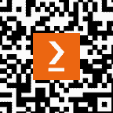

# 前言

这本书详细介绍了使用 Unity 制作的 3D 环境解谜游戏的设计和开发过程。我们探讨了设计、创建和实现角色、环境、UI、声音和游戏机制。

# 这本书是为谁而写的？

这本书特别适合对制作 3D 游戏感兴趣但尚未开始旅程的人。我们涵盖了从基础到一些高级主题的所有内容。

其次，这本书可以帮助任何已经开始他们的旅程但想学习游戏开发其他部分的人，因为我们将在整本书中涵盖广泛的技术和知识。

# 本书涵盖的内容

## 第一部分 – 规划和设计

*第一章*，*三维基础入门*，通过 3D 术语和本书将涉及的基础术语进行了一次旅行。

*第二章*，*设计和原型*，引导用户进入设计迷宫，并以安装 Unity 来创建第一个项目结束。

*第三章*，*编程*，奠定了编程的基础。这一章节侧重于 C#（C Sharp）的力量，通过解释逻辑的基础和 Visual Studio 的初始使用来阐述。

## 第二部分 – 构建

*第四章*，*角色*，讨论了设计 3D 角色时需要考虑的内容，以及它们将如何用于绑定和动画。

*第五章*，*环境*，引导你思考游戏的环境以及我们是如何设计和构建环境的。

*第六章*，*交互和机制*，花时间分析机制需要如何思考以及交互对用户的意义，同时涵盖我们项目中交互所需的编程。

*第七章*，*刚体和物理交互*，增加了与物理和更高级编程概念的交互复杂性。

*第八章*，*用户界面和菜单*，介绍了 Unity 的画布组件以及如何在任何项目中开发整体游戏界面。

## 第三部分 – 精炼和优化

*第九章*，*视觉效果*，深入探讨了如何与视觉效果系统合作，以在你的世界中增加更深的情感联系。这是通过解释渲染的基础和围绕它的系统来实现的。

*第十章*，*声音效果*，以解释 Unity 中的声音系统以及建立坚实的声音设计基础开始。

*第十一章*，*构建和测试*，教你 Unity 如何构建最终的可执行游戏，并解释了测试方法，以根除你可以消除的 bug，从而制作出更好的产品。

*第十二章*，*收尾工作*，看起来像是一个工具箱，用于使你的游戏尽可能完美。我们回顾了我们用来完善项目的内容。这包括特定的粒子系统、照明、艺术定义和高级声音处理。

*附加章节*，*其他 Unity 工具*，是介绍 Unity 提供的一些服务的一章，以防这本书激发你去做我们尚未涵盖的项目，例如多人游戏或混合现实需求。

# 要充分利用本书

+   不要将本书视为教程，而应将其视为开发 3D 游戏时使用的许多工具。我们只介绍了一些简单的示例。尽可能地将逻辑应用到你的项目中。

+   准备好就所涉及的主题做自己的笔记。在物理部分，我们将编程难度提升了很多。

+   在 Discord 上提问，Discord 通过二维码与本书相连。

## 下载示例代码文件

该书的代码包托管在 GitHub 上，网址为[`github.com/PacktPublishing/Unity-3D-Game-Development`](https://github.com/PacktPublishing/Unity-3D-Game-Development)。我们还有其他来自我们丰富图书和视频目录的代码包，可在[`github.com/PacktPublishing/`](https://github.com/PacktPublishing/)找到。查看它们吧！

## 下载彩色图像

我们还提供了一份包含本书中使用的截图/图表的彩色图像的 PDF 文件。您可以从这里下载：[`static.packt-cdn.com/downloads/9781801076142_ColorImages.pdf`](https://static.packt-cdn.com/downloads/9781801076142_ColorImages.pdf)。

## 使用的约定

本书使用了多种文本约定。

`CodeInText`：表示文本中的代码单词、数据库表名、文件夹名、文件名、文件扩展名、路径名、虚拟 URL、用户输入和 Twitter 昵称。例如：“将下载的`WebStorm-10*.dmg`磁盘映像文件作为系统中的另一个磁盘挂载。”

代码块设置如下：

```cs
void OnStartGameButtonPressed()
    {
        SetPlayerEnabled(true);
        Cursor.lockState = CursorLockMode.Locked;
        Cursor.visible = false;
        this.gameObject.SetActive(false);
    } 
```

**粗体**：表示新术语、重要单词或屏幕上看到的单词。例如，菜单或对话框中的单词，也以这种方式出现在文本中。例如：“从**管理**面板中选择**系统信息**。”

警告或重要注意事项看起来像这样。

小贴士和技巧看起来像这样。

# 联系我们

读者的反馈总是受欢迎的。

**一般反馈**：请通过电子邮件`feedback@packtpub.com`发送反馈，并在邮件主题中提及本书的标题。如果您对本书的任何方面有疑问，请通过电子邮件`questions@packtpub.com`联系我们。

**勘误表**：尽管我们已经尽最大努力确保内容的准确性，但错误仍然可能发生。如果您在这本书中发现了错误，我们将非常感激您向我们报告。请访问[`www.packtpub.com/submit-errata`](http://www.packtpub.com/submit-errata)，点击**提交勘误**，并填写表格。

**盗版**：如果您在互联网上以任何形式发现我们作品的非法副本，我们将非常感激您提供位置地址或网站名称。请通过电子邮件`copyright@packtpub.com`与我们联系，并提供材料的链接。

**如果你有兴趣成为作者**：如果你在某个领域有专业知识，并且有兴趣撰写或为书籍做出贡献，请访问[`authors.packtpub.com`](http://authors.packtpub.com)。

# 分享你的想法

一旦你阅读了《Unity 3D 游戏开发》，我们很乐意听听你的想法！扫描下面的二维码直接进入此书的亚马逊评论页面并分享你的反馈。



[`packt.link/r/1801076146`](https://packt.link/r/1801076146)

你的评论对我们和科技社区都很重要，并将帮助我们确保我们提供高质量的内容。

## 目录

1.  贡献者

    1.  关于作者

    1.  关于审稿人

1.  前言

    1.  这本书适合谁？

    1.  本书涵盖的内容

        1.  第一部分 – 规划和设计

        1.  第二部分 – 构建

        1.  第三部分 – 精炼和改进

    1.  为了充分利用这本书

    1.  联系我们

    1.  分享你的想法

1.  第三维度的入门

    1.  本书的目标

    1.  转向 3D

        1.  坐标系

        1.  向量

        1.  相机

        1.  面、边、顶点和网格

        1.  材质、纹理和着色器

        1.  刚体物理

        1.  碰撞检测

    1.  Unity 界面

        1.  场景视图和层次结构

        1.  检查员

        1.  项目窗口

        1.  游戏视图

        1.  包管理器

    1.  Unity 基本概念

        1.  资产

        1.  场景

        1.  游戏对象

        1.  组件

        1.  脚本

        1.  预制体

        1.  包

    1.  总结

1.  设计和原型

    1.  游戏设计基础

        1.  游戏设计文档

        1.  深思熟虑的决定

        1.  迭代生产

        1.  构思

    1.  你的第一个 Unity 项目

        1.  Unity Hub

        1.  选择版本

        1.  选择模板

        1.  可脚本化渲染管线

            1.  内置渲染

            1.  通用渲染

            1.  高清晰度渲染

    1.  原型设计

        1.  线框图或纸面创建

        1.  灰盒测试

        1.  概念验证 (PoC)

        1.  最小可行产品 (MVP)

        1.  垂直切片

    1.  总结

1.  编程

    1.  设置环境

        1.  Unity 环境

    1.  基础

        1.  变量

        1.  数据类型

            1.  Int

            1.  浮点数

            1.  字符串

            1.  GameObject

        1.  编程逻辑

            1.  if 语句

            1.  循环语句

            1.  循环语句

            1.  选择 for 和 while 的区别

        1.  方法

    1.  总结

1.  字符

    1.  设计和概念

        1.  提问为什么

        1.  概念时间！

    1.  绑定

        1.  以动画为先的思考方式

        1.  变形

        1.  层次结构

        1.  骨骼或关节

        1.  正向运动学/逆向运动学

        1.  约束

        1.  变形器

        1.  控制

        1.  基于物理的动画

        1.  人类逆向运动学 (HIK) 系统

        1.  动画

    1.  角色控制器

        1.  内置角色控制器

        1.  刚体角色控制器

    1.  编写角色的移动脚本

        1.  Unity 中的初始设置

        1.  空闲状态

        1.  代码入口点

        1.  RequireComponent

        1.  更新代码

        1.  方法

    1.  总结

    1.  加入我们的 Discord！

1.  环境

    1.  草图绘制

        1.  情绪板

        1.  舞台

    1.  排除它

        1.  Unity 地形

            1.  创建地形

            1.  地形设置

            1.  地形绘制

            1.  树木绘画

            1.  绘制细节

        1.  三维几何

            1.  ProBuilder

            1.  预制基本形状

    1.  总结

1.  交互和机械

    1.  游戏循环

    1.  机械工具箱

        1.  资源管理

        1.  风险与回报

        1.  空间意识

        1.  集合

        1.  研究

        1.  局限性

    1.  设计和实现

    1.  我们的项目

        1.  楼梯

            1.  设计

            1.  实现

        1.  环形

            1.  设计

            1.  实现

        1.  狭窄空间

            1.  设计

            1.  实现

        1.  交互体积

            1.  设计

            1.  实现

    1.  总结

1.  刚体与物理交互

    1.  刚体组件

        1.  质量

        1.  角动量拖拽

        1.  使用重力布尔值

        1.  是运动布尔值

        1.  插值

        1.  碰撞检测

            1.  连续

            1.  连续推测

        1.  约束

        1.  信息

    1.  心灵感应与物理交互

        1.  岩石坠落

            1.  设计

            1.  实现

        1.  破碎的基石

            1.  设计

            1.  实现

        1.  最后的谜题

            1.  设计

            1.  实现

    1.  摘要

1.  用户界面和菜单

    1.  用户界面

        1.  叙事 – 叙事是，内部是

        1.  非叙事 – 叙事否，内部否

        1.  空间 – 叙事否，内部是

        1.  元 - 叙事是，内部否

    1.  UI 元素

        1.  主菜单

        1.  库存系统

        1.  健康表示

        1.  物品交互系统

    1.  我们项目中的 UI

        1.  主菜单

        1.  退出菜单

        1.  空间提示

    1.  Unity UI

        1.  Unity 画布系统

            1.  矩形变换

            1.  画布组件

            1.  画布缩放器

            1.  图形射线投射器组件

        1.  Unity UI 对象

        1.  实现

            1.  主菜单实现

            1.  日志实现

            1.  交互 UI 实现

    1.  摘要

1.  视觉效果

    1.  视觉效果概述

    1.  着色器图

        1.  设置

        1.  创建

            1.  光照着色器图

            1.  精灵光照着色器图

            1.  精灵非光照着色器图

            1.  非光照着色器图

        1.  着色器图界面

            1.  主堆栈

            1.  黑板

            1.  图形检查器

            1.  主预览

            1.  节点

        1.  常用节点

            1.  添加

            1.  颜色

            1.  Lerp

            1.  乘法

            1.  样本纹理 2D

            1.  饱和度

            1.  分割

            1.  UV

            1.  向量

    1.  粒子系统

        1.  Shuriken

        1.  VFX 图

            1.  节点

    1.  总结

1.  音效

    1.  声音…设计？

    1.  声音设计的五个要素

        1.  源

        1.  包络

            1.  攻击

            1.  发布

        1.  音调

        1.  频率

        1.  分层

    1.  设计可扩展性

    1.  我们项目的声音设计和实现

        1.  播放我们的第一个声音

            1.  组织

            1.  音乐

        1.  2D 声音

        1.  3D 声音

            1.  使用 3D 声音

            1.  音频监听器第一部分

        1.  3D 声音设置

            1.  音频监听器第二部分

            1.  将 3D 环境音添加到游戏中

            1.  填充我们的环境音

            1.  2D 环境音

    1.  通过玩家交互触发声音

        1.  通过 Unity 事件触发声音

            1.  旋转谜题声音

            1.  树形谜题

    1.  总结

1.  构建和测试

    1.  使用 Unity 构建

        1.  目标平台

        1.  架构

        1.  服务器构建

        1.  复制 PDB 文件

        1.  创建 Visual Studio 解决方案

        1.  开发构建

        1.  自动连接分析器

        1.  深度分析支持

        1.  脚本调试

        1.  仅脚本构建

        1.  压缩方法

    1.  测试

        1.  功能测试

        1.  性能测试

            1.  Unity 分析器

            1.  内存分析器

            1.  帧调试器

            1.  物理调试器和分析器模块

        1.  游戏测试

        1.  浸泡测试

        1.  本地化测试

    1.  用户体验，或 UX

        1.  品牌

        1.  设计

        1.  可用性

        1.  初始问题

        1.  第一个谜题

        1.  介绍一个二级机制

        1.  最终谜题

    1.  总结

1.  收尾工作

    1.  概述

    1.  资产最终化

        1.  风格化资产上的通行证

        1.  详细法线

        1.  架构清理

        1.  纹理混合

        1.  环境杂乱

        1.  详细网格

        1.  效果

            1.  楼梯阻挡器

            1.  飞镖系统 – 楼梯阻挡器粒子层

            1.  VFX 图 – Myvari 的意念移物

        1.  电影

        1.  二级动画

    1.  光照

        1.  3D 形状

        1.  提供情绪

        1.  游戏设计

        1.  Unity 光照

            1.  混合光照

            1.  光照探针

            1.  反射探针

    1.  声音润色

        1.  通过动画事件触发声音

        1.  使用事件为动画添加标签以产生声音

            1.  随机声音

            1.  随机音调

    1.  总结

1.  奖励：其他 Unity 工具！

    1.  Unity 游戏服务

        1.  多人工具

            1.  创建

            1.  连接

            1.  沟通

        1.  XR 插件

        1.  机器学习代理

        1.  Bolt 可视化脚本

            1.  流程图

            1.  状态图

            1.  实时编辑

            1.  调试和分析

            1.  代码库兼容性

    1.  总结

1.  你可能喜欢的其他书籍

1.  索引

# 地标

1.  封面

1.  索引
