# 1

# 第三维度的入门指南

欢迎加入！

很高兴您能加入我们，一起学习 3D 游戏开发的基础知识之旅。首先，我们将向您介绍编写这本书的团队。

+   **特拉维斯·巴皮斯特**（3D 艺术家）负责艺术指导，为游戏中的每个模型建模，为角色绑定，并帮助定义故事的设计。

+   **拉塞尔·克雷格**（高级软件工程师）负责编写游戏机制脚本。

+   **瑞安·斯图克尔**（声音设计师）在整个项目中创建并实现了所有声音。

+   **安东尼·戴维斯**（高级技术艺术家）撰写了本书，管理了项目，构建了效果和着色器，并完善了项目。

确保我们能够发挥我们 50 多年集体经验的最佳水平（这本书每一页背后都有 4 个大脑），每一天都是过山车般的体验（而且非常有趣！）我们花了超过六个月的时间，对整本书进行了两次修订（以及在这个过程中交换的数百个 GIF），以包含最合适的用例来解释新概念，最重要的是，提供一种有效的教学方法。最终，我们相信我们成功地创造了一本书，这本书将塑造我们在游戏开发领域的职业轨迹，并至少推动我们前进 3-5 年。

本书将为您提供开始构建所需的所有工具；然而，在将您的想法转化为作品的过程中，您可能需要更多的支持和建议。

这就是我们的 Discord 服务器发挥作用的地方。它为我们引入了互动元素，让我们能够一起阅读本书，并就您的 3D 游戏项目进行讨论。我在 Discord 上的时间比以往任何时候都要多，以确保您能够轻松地完成本书，所以请随时过来打个招呼，提出任何问题！

加入时，别忘了在*#introduce-yourself*频道中发个简短的自我介绍：[`packt.link/unity3dgamedev`](https://packt.link/unity3dgamedev)

好吧，让我们开始吧！

# 本书的目标

我们编写本书的目标是使每位读者都能够建立正确的思维方式来思考 3D 游戏，然后展示我们创建游戏所采取的所有步骤。即使是游戏开发领域的绝对初学者也可以通过这本书，尽管主题的难度可能会迅速增加。虽然困难，但如果您坚持下去，您将朝着游戏开发精通迈出多个步骤。本书的主要目标受众是那些在游戏开发方面有一定知识的人，尽管无论您的经验如何，我们都希望为您创造一个愉快的学习之旅。我们将涵盖的概念很快就会变得复杂，包括角色、编程、设计模式等，我们将学习这些内容。

为了最大限度地利用本书，我建议您遵循以下方法：

+   仔细阅读章节，故意停下来思考这些概念。

+   当某件事物全新时，检查我们的 GitHub 项目，看看观看它的实际操作是否能进一步解释它。如果不行，就去 Google 上自己研究。

+   如果项目中没有提供某些内容，请通过 Discord 发消息给我，或在社区服务器中寻求同伴的帮助——链接已在上文分享。

+   进入下一节并重复！

这种方法将使你能够掌握你感到困难的部分；一旦你完成了这个过程，你可以向同伴寻求帮助。你遇到的问题也可能被其他人遇到。解决这些问题并将它们带到 Discord 或让同伴帮助解决问题，可以增强整个社区的知识。

这本书是为了让你阅读我们的方法，然后查看项目以了解所有的基础。首先理解我们为什么这样做的设计是非常重要的。我们也花时间讲解 Unity 界面的基础知识，但技术可以通过在线的大量资源随着时间的推移而学习。

在这里你找不到的一些内容是如何建模角色、绑定或动画化它们。我们对这个过程讲得很少，因为那需要单独的训练。我们**确实**会解释为什么我们以这种方式设计角色，以帮助你走上同样的道路。项目包含了所有的动画和电影特效，所以最终产品可以让你看到我们工作的成果。这种方法是学习的一个强有力的方式，我们教你为什么事情会以这种方式完成。这样，你可以看到最终的结果，并且允许你发挥创意，对设计提出自己的想法，同时在工作过程中独立使用新工具，逐步通过章节。

最后，在我们深入内容之前，我们想建议你打开 GitHub 仓库，导航到`Builds`文件夹，亲自试玩。这将帮助你看到我们的小团队完整构建的内容。试玩后，你可以想象我们在构建这个项目的过程中经历了什么。

让我们深入探讨本章我们将涵盖哪些主题：

+   进入 3D 世界

+   必要的 Unity 概念

+   Unity 界面

让我们从熟悉 3D 游戏开发的基本组件开始。

# 进入 3D 世界

在本节中，我们将探讨 3D 工作的基本理解。从坐标系统到 3D 模型的渲染构成，我们只会进行表面层的讲解，以确保你在这一旅程中完全理解基础。通过阅读这些内容，你将获得 Unity 如何显示物品的强烈理解。

## 坐标系统

3D 坐标系在每种 3D 应用程序中并不完全相同！如 *图 1.1* 所示，Unity 是一个左手坐标系，*+y* 方向向上。看着 *图 1.1*，你可以可视化左手系和右手系之间的差异。

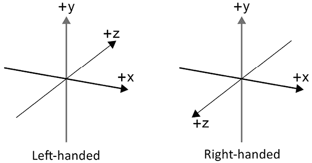

图 1.1：坐标系

当我们在这些坐标系中工作时，你会看到物体的位置以括号内的三个值组成的数组形式表示，如下所示：

*(0, 100, 0)*

这分别代表 (*x, y, z*)。这是一个好习惯，因为编程在脚本中编写位置时使用非常相似的语法。当我们谈论位置时，通常指的是你使用的任何 **数字内容创建者** (**DCC**) 中的 `transform`。在 Unity 中，`transform` 包含位置、旋转和缩放。

现在我们理解了世界坐标 *(x, y, z)*，以及这些坐标每个都是从 0 开始，由 *(0, 0, 0)* 表示。在下面的 *图 1.2* 中，彩色线条相交的地方在世界上是 *(0, 0, 0)*。立方体有自己的 `transform`，它包含该对象的位置、旋转和缩放。记住，`transform` 包含局部位置、旋转和缩放。世界 `transform` 是从这个基础上根据其层次结构计算出来的。

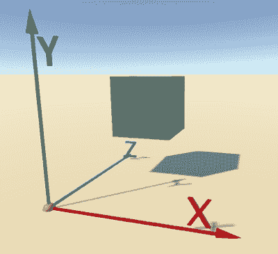

图 1.2：3D 坐标系

*图 1.2* 中的立方体位于 *(1, 1.5, 2)*。这被称为 **世界空间**，因为项目的 `transform` 是通过从 *(0, 0, 0)* 开始的世界坐标来表示的。

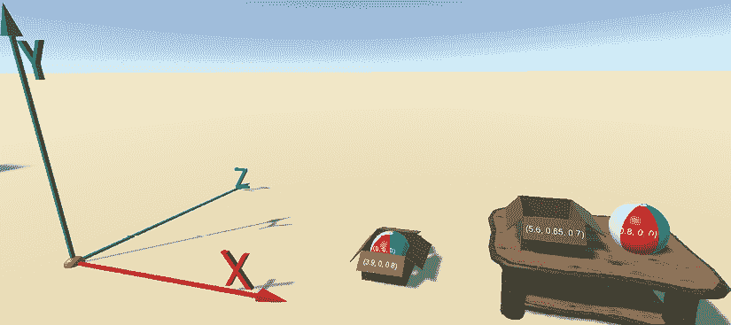图 1.3：世界空间与局部空间

现在我们知道立方体的 `transform` 是相对于世界 *(0, 0, 0)* 的，我们将讨论描述局部空间的父子关系。在上面的 *图 1.3* 中，球体是立方体的子项。球体的局部位置是相对于立方体的 *(0, 1, 0)*。有趣的是，如果你现在移动立方体，球体将跟随，因为它只是从立方体偏移，并且其 `transform` 将相对于立方体保持 *(0, 1, 0)*。

## 向量

传统上，向量是一个具有多个元素和方向的单位。在 3D 环境中，`Vector3` 将与我们迄今为止所使用的内容非常相似。*(0, 0, 0)* 就是一个 `Vector3`！向量被用于许多游戏元素和逻辑的解决方案中。通常，开发者会规范化向量，这样其大小始终等于 1。这允许开发者轻松地处理数据，因为 0 是起点，0.5 是中间点，1 是向量的终点。

## 摄像机

摄像机是极其有用的组件！它们谦逊地展示它们的视角，这允许我们的玩家体验我们试图传达给他们的内容。正如你可能已经猜到的，摄像机也像所有 GameObject（我们将在本章后面描述）一样有一个 `transform`。摄像机还有几个可以更改的参数，以获得不同的视觉效果。

不同的游戏元素和类型使用相机的方式不同。例如，游戏 *生化危机* 使用静态相机来营造紧张感，不知道窗外或拐角处有什么，而 *古墓丽影* 在玩家角色劳拉穿过洞穴时将相机拉近，给人一种亲密感和情感理解，她的脸在狭窄的空间中显得不舒服。

相机对于你将为用户创建的体验至关重要。花时间玩弄它们，并学习构图概念，以最大化玩家体验中的情感推动。

## 面、边、顶点和网格

3D 对象由多个部分组成，如 *图 1.4* 所示。顶点，用绿色圆圈表示，是相对于世界 *(0, 0, 0)* 的空间中的点。每个对象都有一个顶点的列表及其相应的连接。

两个顶点相连形成一个边，用红线表示。当三个或四个边连接形成一个三角形或四边形时，就形成了一个面。有时当四边形没有连接到其他任何面时，它们被称为平面。当所有这些部分组合在一起时，你就有了网格。

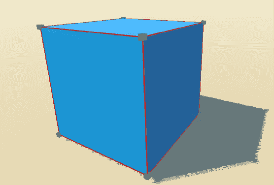

图 1.4：顶点、边、面和网格

## 材料、纹理和着色器

现在你已经知道了在所有 DCC 工具中网格由什么组成，让我们来看看 Unity 如何将网格显示给你。在基础级别是着色器。着色器可以被视为小程序，它们有自己的语言并在 GPU 上运行，因此 Unity 可以在你的屏幕上渲染场景中的对象。你可以把着色器想象成创建材料的模板。

更高级的是材料。材料是一组由着色器定义的属性，用于操作，有助于展示对象的外观。每个渲染管线都将有单独的着色器：**内置**、**通用渲染管线**（**URP**）或**高清渲染管线**。对于这本书，我们使用第二种选项，也是最广泛使用的：URP。

*图 1.5* 展示了使用 URP 的 **标准光照** 着色器的材料示例。这允许我们操作表面选项、该表面的输入以及一些高级选项。现在，让我们只谈谈 **基础图**，这是 **表面输入** 部分中的第一个项目。在这里使用 **基础图** 是将 **漫反射/阿尔贝托** 和 **着色** 结合起来。**漫反射/阿尔贝托** 用于定义将应用于表面的基础颜色（红色）——在这种情况下，白色。

如果你通过将纹理拖放到基础地图（绿色）左侧的方块或点击方块和名称之间的圆形（蓝色）将纹理放入此图，之后，你可以根据需要调整颜色来着色表面。

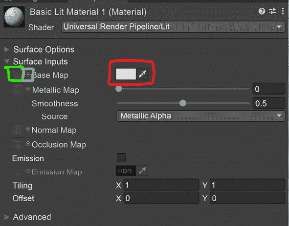

图 1.5：基础材料属性

*图 1.6* 展示了一个简单的例子，展示了立方体在着色、纹理以及纹理着色改变后的样子。随着我们阅读本书的深入，我们将解锁更多关于材质、着色器和纹理的功能。

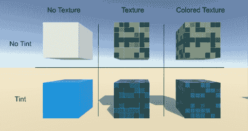

图 1.6：着色和纹理基础颜色

纹理可以为你的 3D 模型提供惊人的细节。

在创建纹理时，分辨率是一个重要的考虑因素。需要理解分辨率的第一部分是“2 的幂”大小。2 的幂如下所示：

2, 4, 8, 16, 32, 64, 128, 256, 512, 1024, 2048, 4096 等。

这些数字代表宽度和高度的像素大小。在某些情况下，你可能需要混合大小，只要它们符合 2 的幂比例即可。例如：

+   256×256

+   1024×1024

+   256×1024（这种情况较少见，但也是有效的）

关于分辨率的第二个考虑因素是大小本身。处理这个考虑因素的最简单方法是考虑 3D 对象在你的屏幕上的大小。如果你有一个 1920x1080 的屏幕分辨率，那么它有 1920 像素宽和 1080 像素高。如果所讨论的对象只占据屏幕的 10%，并且很少被看到更近的距离，你可能考虑一个 256x256 的纹理。相比之下，如果你正在制作一个情感驱动、以角色为中心的游戏，其中情感和面部表情很重要，那么在这些场景中，你可能想在面部使用 4096x4096 或 4K 纹理。

## 刚体物理

Unity 假设每个 GameObject 不需要在每一帧都进行物理评估。Unity 使用 Nvidia 的 PhysX 引擎进行物理模拟。为了获得任何计算出的物理响应，GameObject 需要添加刚体组件。

通过将刚体组件添加到 GameObject 中，你将在下面的 *图 1.7* 中看到的一些 GameObject 属性将出现在检查器中。

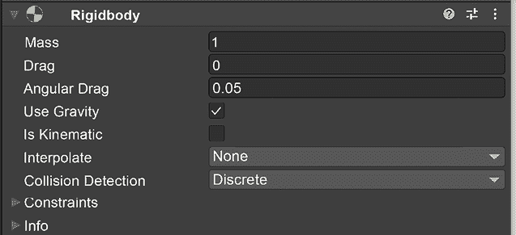

图 1.7：刚体

一个 Unity 单位的质量等于 1 千克的质量。这会影响碰撞时的物理决策。**阻力** 单位增加摩擦，随着时间的推移减少速度。**角阻力** 类似，但仅限于旋转速度。**使用重力** 可以打开或关闭重力，等于标准地球重力 *(0, -9.81, 0)*，这样质量才有意义！有时你可能不想使用地球重力，因此你可以更改物理设置以使重力符合你的需求。

在 *第七章*，*刚体和物理交互* 中，我们将详细解释刚体的概念。我们将在创建角色、环境以及交互式游戏玩法时使用刚体。

## 碰撞检测

没有任何碰撞器的 Rigidbody GameObject 将无法充分利用物理特性，当开启重力时，它将直接穿过世界。有相当多的碰撞器可供选择，以最好地满足您游戏的需求。在下面的*图 1.8*中，您可以看到为 2D 提供的独立碰撞器。这些使用与 3D 不同的物理系统。如果您只为游戏使用 2D，请确保使用 2D 碰撞器。

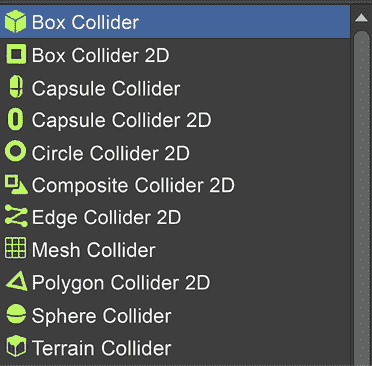

图 1.8：碰撞器组件选项

您也可以添加多个碰撞器——如上图中*图 1.8*所示的基本选项——以最好地适应 GameObject 的形状。在空 GameObject 上看到碰撞器是很常见的，这些 GameObject 是主对象的子对象，以便于轻松变换碰撞器。我们将在*第四章*，*角色*和*第五章*，*环境*中看到这一点。

# Unity 界面

Unity 的界面被分为几个主要组件。在下图的*图 1.9*中，我们将介绍场景（红色）及其界面中的项目，以及如何在检查器（橙色）中操纵它们的属性。然后我们将讨论场景中未激活但可在项目窗口中添加的项目（黄色）。最后，我们将介绍游戏视图（绿色）和包管理器（与*图 1.9*分开）。

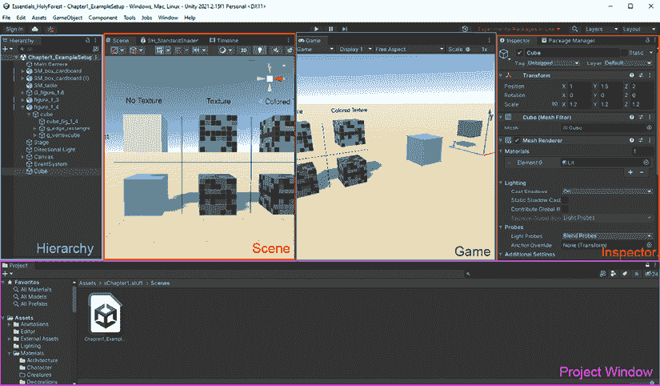

图 1.9：整体界面

## 场景视图和层次结构

场景视图和层次结构协同工作。层次结构是游戏运行时场景的渲染方式。场景视图允许您实时操纵 GameObject 及其值。此外，当编辑器处于**播放**模式时，游戏可以对层次结构中的 GameObject 进行更改。

当 GameObject 在**播放**模式下被操纵时，包括您在场景视图中自行更改它们，在停止游戏后，GameObject 将恢复到游戏开始前的原始状态。

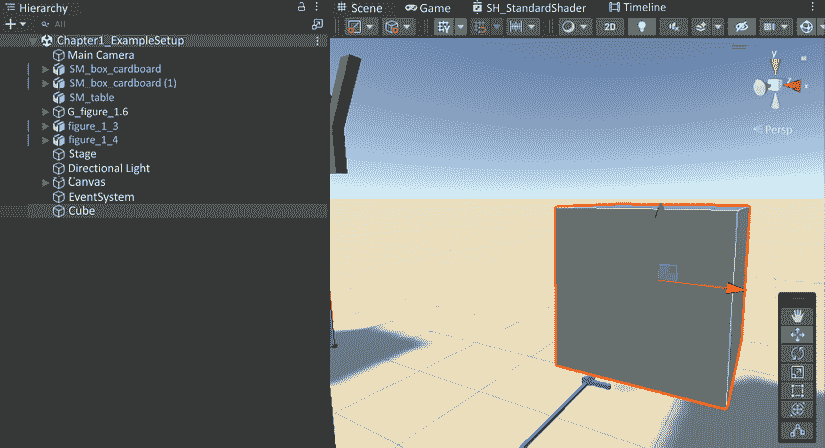

图 1.10：场景和层次结构

在上图的*图 1.10*中，您可以立即看到很多信息。在左侧的层次结构中，您可以看到场景中的对象。这些对象都有一个`transform`，它们将对象放置在世界上。如果您双击一个项目或单击一个项目，将鼠标放在场景视图中，然后按*f*，您将聚焦于那个 GameObject，这将使项目在场景视口的中心。

当您选择一个项目时，您可以看到在对象的旋转中心点——通常是对象的中心——有一个显示彩色箭头的工具。该工具允许您在空间中定位 GameObject。您还可以通过选择两个轴之间的一个小正方形来在平面上定位对象。

在*图 1.10*的右上角，你会看到一个相机 Gizmo。这个小 Gizmo 将允许你通过单次点击轻松地将视口相机定位到前面、侧面、顶部、底部，或者将其更改为等轴测相机或透视视图。

现在你已经看到了场景中的项目，通过在场景或层次结构中左键单击选择，你可能想要更改一些属性或向该 GameObject 添加组件。这就是检查器发挥作用的地方。

## 检查器

要操纵 GameObject 的值，当你选择场景或层次结构中的 GameObject 时，检查器将更新以显示每个 GameObject 可用的更改选项。

![img/B17304_01_13.png]

图 1.11：检查器窗口

*图 1.11*中的检查器窗口显示已经选择了大量此类项目。在顶部，名称是**Cube**，左侧的蓝色立方体表示预制件数据类型。你可以通过点击名称下方仅有的**打开**按钮来更改预制件本身。这将创建一个新的场景视图，仅显示预制件。当你更改预制件时，它将更改任何引用它的场景中所有实例化预制件的设置。

**变换**组件显示了场景中预制件的位置、旋转和缩放。

**网格过滤器**显示了构成该多边形的顶点、边和面。

在下面是**网格渲染器**。此组件将允许渲染网格过滤器组件中渲染的网格。我们可以在这里设置材质以及其他与该项目的特定光照和探针相关的选项，这些将在*第十二章*，*最终润色*中介绍。

现在，下面是一个碰撞器和 Rigidbody。这些组件协同工作，帮助该对象根据组件上的设置实时响应物理效果。

我们已经讨论了很多场景中的项目及其属性，但它们如果只是引用项目，那么在场景之外它们存储在哪里？**项目**窗口将回答这个问题。

## 项目窗口

在这里，你可以找到将在场景中实例化或在游戏中作为组件使用以完全实现你正在构建的游戏的资产。

![img/B17304_01_14.png]

图 1.12：项目窗口

此窗口是引用的 GameObject 的物理表示。在*图 1.12*中看到的资产文件夹中的所有项目都物理地存储在你的硬盘上。Unity 会创建元文件来存储这些项目的所有属性。

在**项目**窗口中保留原始文件的好处是，你可以更改项目，并且当你聚焦于 Unity 项目（点击 Unity 应用）时，它将重新调整元文件并重新加载场景中的项目。这使得你可以更快地迭代脚本和艺术作品！

我们已经查看场景中的 GameObject，通过操作变换来放置它们，并知道 GameObject 的引用位置。现在我们应该查看游戏视图，以了解游戏本身的外观。

## 游戏视图

游戏视图类似于场景视图；然而，它遵循场景视图内构建的规则。除非您定义了一个不同的相机进行渲染，否则游戏将通过主相机自动渲染场景内容。

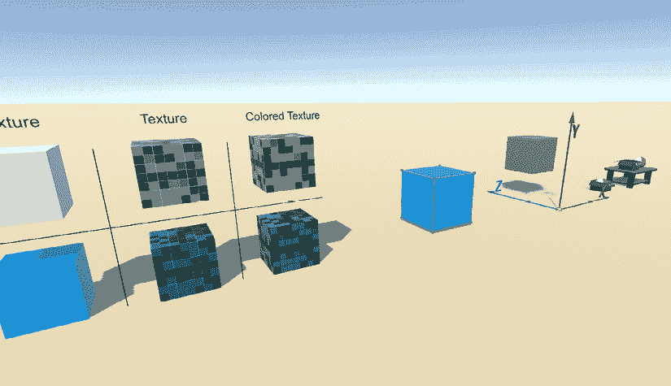

图 1.13：游戏视图

您可以看到这看起来非常类似于场景窗口，但顶部有不同的选项。在左上角，我们可以看到**显示**下拉菜单。这允许我们在场景中有多个相机时更改相机。比例位于其右侧，这有助于查看以针对特定设备。屏幕比例右侧的**缩放**有助于快速调整窗口大小或放大以进行调试。**播放时最大化**将在播放时最大化屏幕以充分利用全屏。**静音音频**将静音游戏音频。**统计信息**将在游戏视图中提供一个小概览。

在本项目的后期，在优化过程中，我们将通过更深入的分析来查看可能影响游戏玩法中内存使用和其他优化机会的问题。

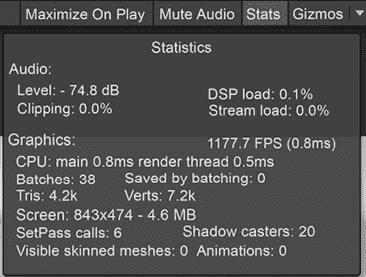

图 1.14：游戏统计信息

继续向右是**Gizmos**。这是一组在*图 1.14*中游戏视图中显示的项目。根据您的需求，您可以在该菜单中打开或关闭它们。

## 包管理器

您的 Unity ID 将存储您从 Unity 资产商店购买的包以及您可能已在硬盘或 GitHub 上的包！您可以使用包管理器将包导入到项目中。

您可以在**窗口 > 包管理器**下找到这些包，如下面的*图 1.15*所示。

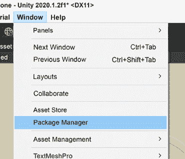

图 1.15：包管理器路径

打开包管理器后，您最初会看到项目中包含哪些包。您可以通过更改左上角的下拉菜单来查看 Unity 中的标准内容或您在 Unity 资产商店购买的包。

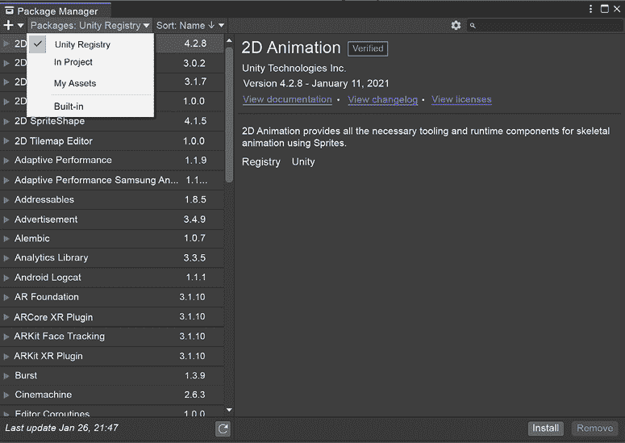

图 1.16：包管理器

通过选择**Unity 注册表**，您将看到一系列由 Unity 测试的免费包，它们是 Unity 平台的一部分，如果您需要它们，则可用。您可以通过点击左侧的包并查看右侧带有**查看文档**标签的链接提供的文档来了解每个包。

如果您选择**项目内**，它将显示当前加载的项目中已安装的包。当您想要卸载可能不需要的包时，这很有帮助。

**我的资产**是您购买或正在进行的项目的资产以及与您的 Unity ID 相关的之前付费的资产。

**内置**是任何项目的标准配置。您可能需要根据您的需求启用或禁用内置包。探索它们并禁用不需要的包；一个整洁的项目现在将导致以后的优化更少。

# 必要的 Unity 概念

在第一部分，我们已经介绍了一些 Unity 的概念。在这里，我们将更详细地讲解它们，因为您之前已经阅读过，其中一些可能会被用到。Unity 对游戏开发环境中的项目有着非常模块化的关注。

## 资产

Unity 将每个文件都视为一个资产；包括 3D 模型、纹理文件、精灵、粒子系统等等。在您的项目中，您将有一个**Assets**文件夹作为基础文件夹来存放所有项目项。这些可能包括纹理、3D 模型、粒子系统、材质、着色器、动画、精灵等等。随着我们向项目中添加更多内容，**Assets**文件夹应该是有序的，并准备好扩展。强烈建议您保持文件夹结构有序，这样您或您的团队就不会浪费时间试图找到那个不小心被遗留在随机文件夹中的纹理项。

## 场景

一个场景包含了所有的游戏逻辑、游戏对象、电影场景以及游戏中将引用以渲染或与之交互的所有其他内容。

场景也被用来分割游戏部分以降低加载时间。如果您想象一下每次加载现代游戏时都要加载所有单个资产，这将占用太多的宝贵游戏时间。

## 游戏对象

在场景中引用的大多数资产都将是一个**GameObject**（**GO**）。在某些情况下，一个资产只能是一个 GO 的组件。所有 GO 的共同因素是它们都有**Transform**组件。正如我们在本章开头所读到的，`transform`包含局部位置、旋转和缩放。世界变换是从这个基础上根据它们的层次结构计算出来的。GOs 可以连接一个长长的组件列表，以提供功能或数据，用于在脚本中实现机制的增长。

## 组件

GOs（游戏对象）能够容纳多个附加的功能组件。每个组件都有其独特的属性。您可以在下面的*图 1.17*中看到，您可以添加的组件列表相当广泛。

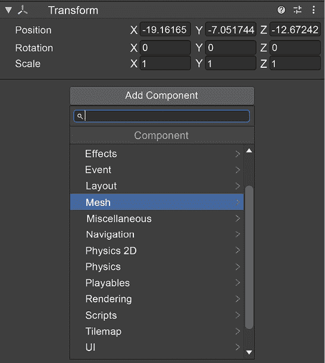

图 1.17：组件列表

这些每个部分都有更小的子部分。在这本书中，我们将详细讲解其中的一些。当您向场景层次结构中添加需要组件的资产时，Unity 会默认添加它们。一个这种默认操作发生的例子是，当您将一个 3D 网格拖入层次结构时，GOs 会自动附加一个网格渲染器组件。

## 脚本

在 GameObject 上经常使用的一个组件是脚本。这是所有逻辑和机制将被构建到您的 GameObject 上的地方。无论您是想改变颜色、跳跃、改变白天的时间，还是收集物品，您都需要在对象上的脚本中添加该逻辑。

在 Unity 中，主要使用的语言是**C#**（发音为“C sharp”）。这是一种强类型编程语言，意味着任何被操作的变量都必须有一个类型分配。

我们将以多种方式使用脚本，我知道你迫不及待地想要开始编码，但首先，我们需要了解其他 Unity 标准流程。

## 预制件

利用 Unity 模块化和强面向对象的特点，我们可以将一组具有默认组件值的物品组合在一起，这些物品可以在场景中的任何时间实例化，并拥有它们自己的值。

要创建一个预制件，你只需将场景中的 GameObject 从层次结构拖动到资产浏览器中。它将创建一个新的预制件，并将该 GameObject 转换为新创建的预制件。默认情况下，它将在层次结构中变为蓝色，如图*1.18*所示。

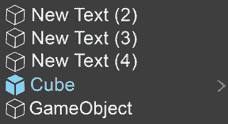

图 1.18：层次结构中的预制件

## 包

为了将模块化组件提升到全新的水平，Unity 可以将包含所有依赖关系的包导出，以便你将其带入其他项目中！更好的是，你还可以通过 Unity Asset Store 将你的包卖给其他游戏开发者！

现在你已经对 3D 和 Unity 术语有了坚实的基础，让我们打开它并回顾界面本身。下一节将探讨 Unity 所有最常见界面组件。

# 概述

我们一起回顾了几个关键领域，以开始你的游戏开发之旅。在本章中，我们通过探讨三个主要主题的一些基本特性，为即将到来的内容奠定了基础。对于三维空间，我们回顾了坐标系、向量、摄像机、3D 网格以及 Rigidbody 物理和碰撞检测的基础。这些基础知识足以让我们进入 Unity 的概念，例如资源和 GameObject，然后是 C#脚本编写和预制件基础。为了结束本章，我们进行了一次 Unity 界面的虚拟游览——场景、层次结构、检查器和包管理器。

在下一章中，我们将探讨设计和原型设计的基础知识。这将使我们能够在描述本书中创建的项目时，跟随我们的思维过程。它还将为你创建自己的项目奠定基础知识，在你完成本书后继续使用。
