# 设计和原型

现在我们已经了解了游戏开发的全部主要术语，并对 3D 空间有了更深入的理解，我们需要讨论游戏本身。在这本书中，我们正在构建一个垂直切片——游戏的一个完全功能的部分。对于这一章，我们将进入项目启动的初期。主要话题包括：

+   游戏设计基础

+   您的第一个 Unity 项目

+   原型设计

首先，让我们从顶部开始，更详细地讨论游戏设计基础。花点时间阅读这部分内容，因为它充满了知识要点，将帮助你将游戏提升到下一个层次。

# 游戏设计基础

游戏设计是一门年轻的技艺。在艺术中，有一些非常基本的原则必须在探索之前考虑。我们将探讨开发者如何喜欢在“文档”中捕捉他们的想法。然后，我们将从如何尽可能细致地故意做出每个决策的微观讲座开始。然后，我们将通过迭代构建这些决策。最后，我们将解释概念化。让我们从设计文档的讨论开始。

## 游戏设计文档

曾经有一段时间，我们的团队在开发冲刺之间有一段空闲时间，我们所有人都想尝试一个新的工具。我们的项目管理正在使用 Atlassian 套件（*Jira*，*Confluence* 等），但我们想看看还有什么更好的选择，所以我们查阅了多种不同的软件。这包括 *Hack N’ Plan*，*Trello*，*Notion* 和其他一些工具。我们使用所有这些工具来查看哪些会在我们的休息之后被使用。最终，我们发现我们喜欢 *Jira* 用于项目管理任务，但对于其他所有事情，我们坚持使用 *Miro*。*Miro* 最终成为了我们的概念板和设计/工作流程头脑风暴工具。这是通过其他工具没有被团队大多数成员使用而自然发生的。

无论你的游戏看起来有多小，都可能会有某种形式的文档需要制作。制作文档有很强的组织原因，但最强大的原因是当我们把某事写在纸上或在协作空间中绘制出来时，我们往往会花更多的时间来认真考虑其优点。这种暂停有时被称为启发式设计。这可以单独完成或协作完成。

一些设计师希望在文字处理软件或在线协作工具中绘制一份书写精美、结构清晰的文档。这提供了一个整洁的概要，并能够精确地写出每个细节。当游戏范围较大时，这种方法效果很好。作者往往是技术作家，精通文档化流程的艺术。这种方法是确保游戏的任何部分都有一个单一的真实来源，任何人都可以在开发过程中参考，但这样做可能不是对你或你的团队最好的方法。

另一种制作游戏设计文档的选项是通过协作头脑风暴软件。这允许用户以创造性的方式一起工作，制作流程图、绘图和概要。这种方式是上述书面文档方法精心策划形式的直接对立面，但满足不同的需求。创造性的形式往往更加亲密和艺术化。一些预概念草图被绘制出来，快速绘制流程图以提出关于游戏元素的问题，想法可以迅速被采纳、丢弃或保留。这种方式的设计对于大型团队来说可能不太适用，因为没有真正的组织结构。新成员在这些情况下可能会有困难融入。

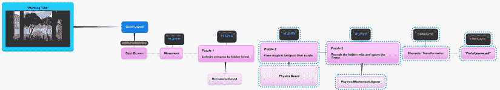

图 2.1：流程图示例

这两种选择都不是制作游戏设计文档的灵丹妙药，但请放心，你的团队需要某种形式的文档来记录你的想法。想法在脑海中是短暂的，一些最好的想法如果没有被记录下来保存，就会消失在虚空中。与你的团队进行实验，找到最适合他们的选项。设计团队中有一句俗语：“最好的工具是团队真正会使用的工具”。

我们已经讨论了许多游戏设计文档的选项，并展示了它们的优缺点。尽管一开始并没有完美的方法，但一个很好的起点是从更视觉化和协作的方法开始。如果你在一起，这可能是一个干擦板和便利贴。干擦板允许非永久性的思考，而便利贴则是需要完成的任务。将它们放在左侧表示“需要完成”，当它们完成时，将它们移动到右侧。

我建议你花些时间在我们的 GitHub 仓库中查看我们为这本书创建的仓库。我在那里为你添加了一个`GDD 图像`文件夹，你可以查看大量示例，看看我们将在下一组章节中处理的内容。

[`github.com/PacktPublishing/Unity-3D-Game-Development`](https://github.com/PacktPublishing/Unity-3D-Game-Development)

现在我们已经开始记录我们的游戏设计，我们需要对我们的想法进行深思熟虑的选择，使它们具体化。

## 故意决策

尽管本章的这一部分可能比其他部分略短一些，但请将这一节铭记在心：成为一名设计师意味着构建一个即使在没有意义时也具有沉浸感的虚拟世界。玩家会无意识地以惊人的速度进行观察。玩家能看到的与游戏环境或角色不协调的拼图碎片越多，沉浸感就会越被破坏。解决任何破坏沉浸感问题的最佳方式是做出深思熟虑的决定。

为了给出一个非常简单的解释，以门把手为例。你一生中见过它们，并本能地使用它们。事实上，当你不得不处理一个设计糟糕的门把手时，你真正的、现实生活中的沉浸感就会被破坏。如果你曾经抓住门把手试图拉门，却发现门是设计成要推的，你就遇到了这个问题。如果门只允许向一个方向移动，那么出口的正确设计就是一个门把手所在位置的平面板。这立即暗示了“推”。

每个级别、网格、纹理、概念和感觉都需要经过深思熟虑并尝试实施。只有在你有充分的理由将某物放置在特定位置而不屈服于陈词滥调时，你才能探索其他独特的方面，从而构建真正独特的东西。

在本书中，你将制作并与之互动的项目已经经过了长时间的深思熟虑。为了强调这一点，在每个部分，你都会看到一系列问题，这些问题将以简洁的方式尽可能详细地回答。

## 迭代生产

游戏开发对沉浸感的需求非常有趣，需要将其置于游戏体验的前沿。为了使沉浸感尽可能完整，开发团队需要不断询问当前的方向是否运作良好。非常常见的情况是，你开始开发的游戏最终可能并非你所期望的那样。这个周期被称为迭代设计或生产。

当你进行迭代设计时，你可以使用多种模式。这里将要描述的方法不是完成设计的唯一确定方法，但它是一个良好的起点，你的团队可以从这里根据需要分支发展。

游戏要想在易于理解方面得到成长，迭代需要频繁且尽早进行。有一个概念叫做**MVP**，即**最小可行产品**，游戏开发者制作出所需的最小游戏元素以供测试者测试。这应该花费很少的时间，并且反馈是无价的。当你将这个版本交给测试者时，你会得到一些反馈，这些反馈是你和你的团队无法看到的，因为你们非常接近产品。确保以开放的心态仔细倾听反馈，因为他们的经验可能在你的玩家中很常见。我们正在努力为尽可能多的玩家设计一个精心设计的体验。这种反馈迫使你和你的团队对设计进行迭代，并可能裁剪或添加游戏机制，以应对主要的测试反馈。

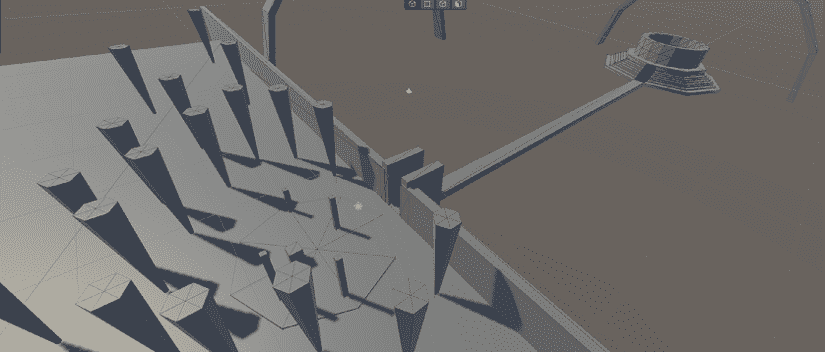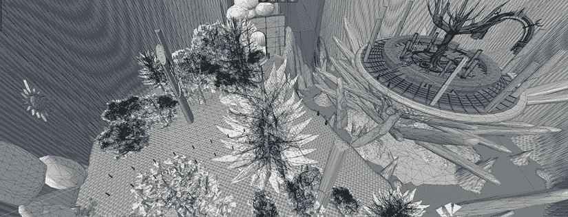

图 2.2 a, b：关卡设计中迭代的示例

在迭代解决了你设计中的主要漏洞之后，你然后进入游戏的垂直切片（将在本章的**垂直切片**部分中介绍）。这应该是一个你对自己在运动和主要游戏机制方面的基本感到舒适的迭代。你的团队将希望从开始到结束制作一个完整的游戏循环，使用一个包含胜利和失败条件的单个关卡。然后，你猜对了，再次测试，但这次是与从未见过这个游戏的新测试者。提出类似的问题，以及在内测期间出现的一些新问题。

开发循环应该看起来是重复的，它确实是这样的：

1.  思考和测试

1.  创建和测试

1.  更新和测试

然后，继续这种做法，直到你达到可以发布的产品的迭代次数。每个步骤最重要的部分是测试。确保将测试反馈作为改进所需的地方的强烈指示。我们将从这个概念化阶段开始这个周期。

## 构思

你需要制作一个游戏，并且你已经有一个准备就绪的团队。你习惯于有意识地做出细致的决策，并且了解迭代过程。现在你需要开始一个概念。

开始一个项目的第一步是探索你和你的团队希望玩家体验到的情感。鉴于我们的艺术形式如此年轻且可塑，我们可以以任何我们喜欢的方式追求这种情感。这是游戏开发者的力量。一旦你知道你关注的情感是关于玩家将体验到的体验，就开始思考你如何将其作为游戏体验来创造。

如果情感是恐惧，你可以让玩家处理黑暗的空间，只有手电筒作为他们的主要防御工具。这可能会让你探索声音设计作为你的开发重点，因为视觉将不会是主要体验工具。

如果情绪是悲伤，那么你可能可以通过叙事焦点来处理，在这个焦点中，你扮演一个失去家庭成员的孩子，玩家们在一个梦境世界中通过叙事驱动的游戏玩法来处理故事。这推动了叙事和节奏，通过儿童视角对色彩理论和悲伤阶段有紧密的理解。

关于概念，我们可以继续讨论，因为存在无限多的场景。选择你的主要目标，然后朝着这个目标努力。在此之后，你可能想要将这些想法写下来，以了解沉浸感的感觉，从艺术的角度来看。这可能是角色概念轮廓。也可能是建筑设计。

这也可能是一组你保存的图片，这些图片给你带来了想要唤起的情感，你可以从中获取灵感。

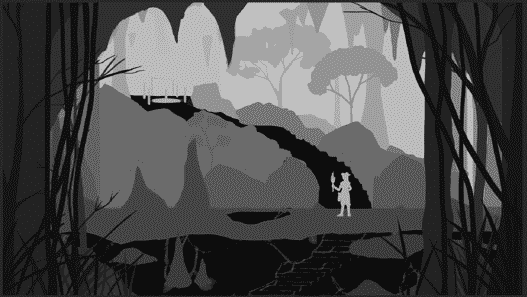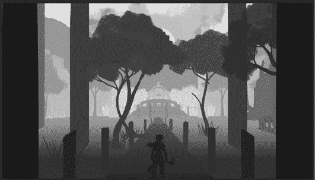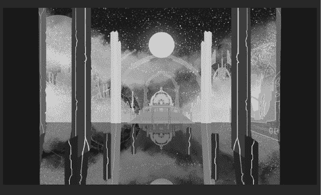

图 2.3 a, b, c：项目中使用的概念

无论哪种方式，突出的行动是视觉上开始这些想法。在你绘制了一些艺术画板并有了如何构建的视觉想法之后，我们然后创建一个 Unity 项目。

# 你的第一个 Unity 项目

你已经整理了一个想要开发的概念，现在我们需要获取 Unity 并创建一个项目。为此，我们需要获取 Unity Hub 并选择一个版本，然后选择一个模板开始。

## Unity Hub

Unity Hub 是一个小型应用程序，它将所有项目集中存储在一个位置，因此你可以轻松访问所有项目以及你安装的 Unity 版本。要获取 Unity Hub，你需要访问[unity.com](http://unity.com)并创建一个**UnityID**。在创建账户后，点击名为**开始**的蓝色按钮。根据你的需求和操作系统，遵循最合适的提示。下载并安装**Unity Hub**，然后开始创作！

## 选择版本

Unity 可以同时运行多个版本。有**Alpha**、**Beta**、**Official**和**LTS**发布版本。

Alpha 版本具有实验性功能，可能不完全完整或生产就绪，不建议用于构建，因为可能存在导致构建中断的错误。工作室和爱好者可以使用此版本进行测试机制、引擎功能或包。它们通常比官方发布提前一个版本。Beta 版本与 Alpha 版本类似；然而，它们是最当前官方发布的实验版本。官方发布是稳定的当前版本。LTS 代表**长期支持**。这些是版本的最终发布版本，如果发现错误，将包含一些小型的热修复。

通过**Unity Hub**可以轻松查看版本。*图 2.4*展示了其可能的样子：

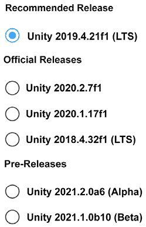

图 2.4：Unity 版本示例列表

对于生产应用，建议使用 LTS 版本。如果你的团队正在尝试或想要使用新功能进行原型设计，那么只能在预发布版本中实现。在为项目选择要构建的版本后，你需要在创建新项目时从 Unity 的选项中选择一个模板。

然而，这本书是版本无关的。如果你在 2022 年之后购买了这本书，这本书仍然具有相关性。截图可能会有轻微的 UI 变化，但基础仍然保持不变。

## 选择模板

当你在项目标签页上按下**新建**按钮时，Unity 会为你提供一些模板选择。这些选项包括**2D**、**3D**、**通用渲染管线（URP**）和**高清渲染管线（HDRP**）。这些模板之间有显著的渲染差异，以及一些可能对你和你的团队来说很有趣的功能。这些模板之间的差异是在**可脚本渲染管线（SRP**）出现时产生的！

## 可脚本渲染管线

渲染和计算机图形学是一个可以攻读博士学位的详细主题，因此我们将通过渲染管线探讨一下可能实现的内容。管线的顶层包括三个任务：**剔除**、**渲染**和**后期处理**。在这些类别中，许多任务按照特定的顺序和精度进行。所有这些的主要功能是优化视图，以便以高帧率向最终用户提供，同时保持用户期望的艺术风格。

随着 SRP 的出现，这些模板分为三大类：**内置**、**通用**和**高清**。为了更好地理解这三种模板，让我们将它们分别归类并进一步探讨。对于我们的项目，我们将使用通用渲染，因为我们将在渲染管线中利用多个功能。

### 内置渲染

这是一个较旧的管线，它不使用可脚本管线。内置渲染器有许多应用。2D 和 3D 模板都运行内置渲染系统。这也是在 SRP 出现之前，资产商店中大多数资产所采用的标准。你可以将“内置”视为 Unity 中的基础体验。有多个原因你可能不想使用内置渲染器。如果你想要使用体积光照、GPU 粒子或光线追踪，你将需要查看下面的可脚本渲染管线。

### 通用渲染

通用渲染管线（Universal Rendering Pipeline，简称 URP）恰如其名，因为它提供了最丰富的功能，并具有可脚本化的渲染管线。如果你想要制作 2D 游戏，这是最佳选择，因为它具有内置的像素级渲染、2D 光源和 2D 阴影。对于 3D 选项，这也是一个极好的选择。URP 和 HDRP 都提供了两个图表，分别是 ShaderGraph 和 VFXGraph。ShaderGraph 是一个视觉着色器创建工具，允许以视觉方式编写复杂的着色器。VFXGraph 的主要功能是作为一个专注于 GPU 粒子的粒子系统，允许你在屏幕上同时创建数百万个粒子，以实现惊人的视觉效果。

我们希望在项目中使用基于 GPU 的粒子，由 VFXGraph 负责处理，以及展示 ShaderGraph 的使用。有了这些要求，我们选择在 URP 中工作，作为我们的渲染管线。

如果你正在寻找一个更物理准确的渲染系统，具有光线追踪和体积云，那么 HDRP 正是你所需要的。

### 高清渲染

这个渲染管线有一个主要目的：在尽可能优化的同时，提供最佳的外观输出。是否使用 HDRP 是一个广泛讨论的话题。有几个主要原因表明 HDRP 可能是你的选择。这是如果你在寻找基于物理的天空，具有云层、体积云、多个方向光源、高度可定制的阴影选项，以及包括光线追踪反射、体积和多个高级着色器输出的光线追踪。HDRP 还可以提供许多其他高级渲染选项。这些概念是计算机图形世界中的深度话题，我们强烈建议你查找它们，以了解实时渲染正在成为什么样的美丽工作。

# 原型设计

现在你有了项目，你可以开始收集将创建游戏的资源。在这本书中，我们已经探讨了如何构建这个游戏，以便我们可以将每个主要部分划分到章节中。原型设计可以通过多种方式实现。我们无法详述每个工作室的原型设计方式，因为每个业务都有其独特的创作方式。我们将讨论整个行业中普遍存在的重大进展模式。将任何基于迭代的任务的生命周期分解，需要有一个循环来去除杂质。这通常被认为是分析、设计、实施和测试，然后迭代直到完成。原型设计阶段也要经过所有这些步骤。看看所有这些，并处理对你或你所在团队构建游戏有意义的每个部分。

## 线框图或纸面设计

在这种原型设计形式中，创作者将视频游戏分解为物理或数字系统中的阶段，以通过每个游戏循环或体验玩家在整个游戏中的感受。有时，这可能意味着创建一个纸板游戏来运行规则。有时，这可能涉及通过用户界面进行数字绘制游戏线框图，以直观地体验游戏玩法。

## 灰盒

这个名字就是你所想的含义！一堆未着色的形状，通常是灰色盒子，它们勾勒出你的环境，以确保可以通过其轮廓定义环境的叙事。这种原型设计版本特别有用，如果你需要一个非常直接的摄像机角度来展示，并且没有设置环境的资产。这也可以在概念艺术的发展中很有用，因为你可以将构图推给概念艺术家以获得更快的周转。

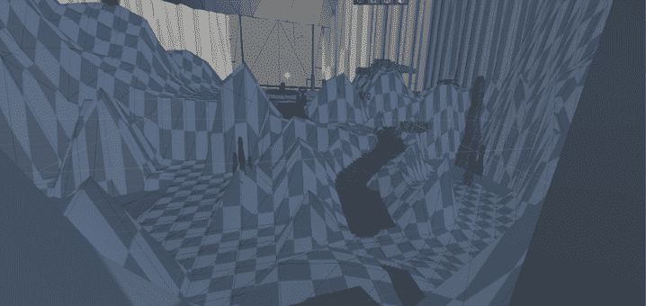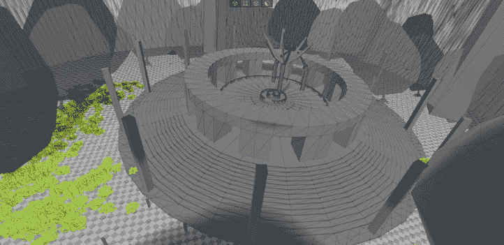

图 2.5 a, b：项目中的灰盒示例

从上面的*图 2.5*中，你可以看到概念艺术家如何在这些基础上绘制，以获得渲染的概念，从而为空间提供更多的设计想法，即使这意味着改变环境，因为这是一个快速的空间草图，以开始工作。

这些可以提供足够的细节来开始工作于一个概念验证，我们将在下一部分进行讨论。

## 概念验证 (PoC)

命名相当准确。这是你开始非常具体地进行测试的地方。你可能需要调整摄像机以获得对游戏玩法的非常具体的感受。这可能需要自身多次迭代，如果有一个团队，可能需要多个人尝试。

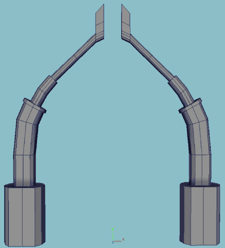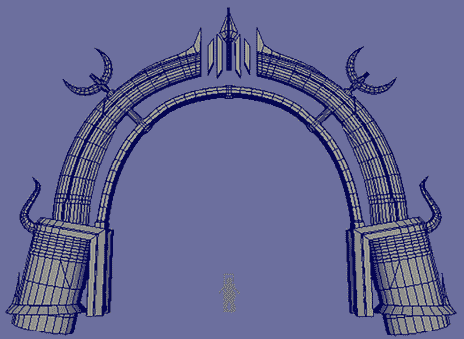

图 2.6 a, b：游戏资产迭代的示例

*图* *2.6 a* 和 *b* 上方展示了某些建筑的迭代。我们从一个简单的拱门开始，它有一种幻想的感觉，只是为了开始。在我们将其放入关卡后，我们有更多的时间来思考风格，并为拱门添加更多吸引人的部分。这是一个有用的概念，了解你的资产在开始时可能并不完美。要达到 MVP，你必须从某个地方开始，朝着伟大努力！

## 最小可行产品 (MVP)

这正如其名所暗示的那样：游戏的简化版。在平台游戏中，必须包含跳跃。也许你的游戏需要作为机制，有摇摆动作，那么无论你有多少资金，这个机制都不会被删减？你不需要精美的艺术资产，甚至不需要动画。最小可行产品（MVP）的目的是展示游戏玩法特性在可接受的范围内，以确保在 MVP 机制的基础上构建的任何内容都能正常工作。

## 垂直切片

有时候你对艺术方向、主要机制和叙事有很好的想法，但需要收集一些反馈或可能需要资金。垂直切片是指你从游戏中取一个非常薄的切片并对其进行润色，以产生炒作和最终产品的感觉。演示与垂直切片有相似的概念。这比 MVP 更复杂，因为艺术、动画、机制、照明等方面的润色是 MVP 所期望的，这需要大量的时间和对最终产品的理解，而这些可能在制作 MVP 时可能还没有可用。

这种原型制作风格是本书中我们项目需求的最佳用例。我们正在开发游戏的一小部分，以深入了解整个游戏可能是什么样子。这是我们最好的选择。

在制作原型时，你的游戏可能需要经历所有这些步骤才能达到令人愉悦的游戏体验。你可能也不需要所有这些。这在不同的发展团队中差异很大。

# 摘要

在本章中，我们讨论了一些深入的主题——游戏设计、为你的第一个项目选择哪些选项，以及原型制作的基础。我们讨论了你和你的团队如何在一个 Word 文档或更直观的流程图中协作，将你的游戏整合起来。这里的想法是将设计的想法变为现实。一旦你做到了这一点，你应该深入到你的第一个 Unity 项目中，选择要使用的模板，并利用符合你游戏概念设置的特效，例如 GPU 粒子。最后，我们讨论了原型制作，以启动你的项目并了解它是否传达了你希望传达给用户的体验。

在下一章中，我们将开始探讨编程，帮助你将所有游戏想法变为现实。
