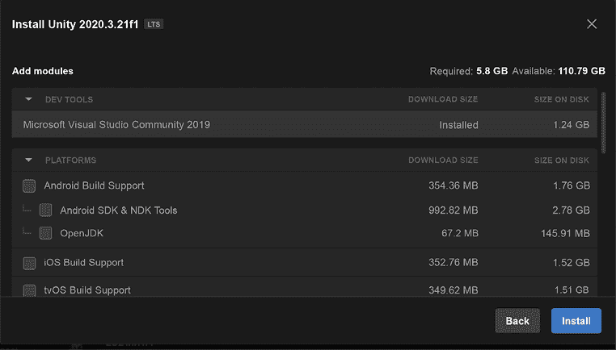
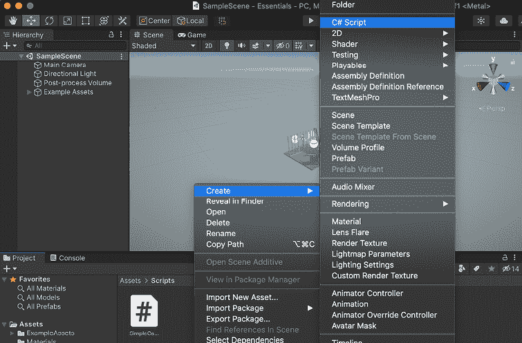
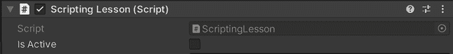
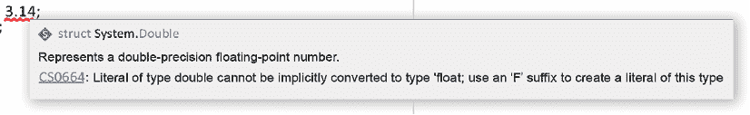

# 3

# 编程

欢迎来到第三章！我们将涵盖 C#的所有基础知识以及如何在 Unity 中使用它。我们将回顾大多数项目所需的编程知识的主要部分。当我们在每个未来的章节中进行脚本编写时，本章应作为可参考的章节。我们首先需要确保您的计算机环境已设置好，以便开始使用 Unity 进行编程，然后进入编程的基础知识。本章将作为您 Unity 项目的基石。包括以下主题：

+   设置环境

+   变量

+   数据类型

+   编程逻辑

+   方法

# 设置环境

编程环境特指您将使用的**集成开发环境**（**IDE**）以及与之相关的依赖项。C#是微软.NET 框架的一部分，需要在您的机器上安装才能工作。幸运的是，对于世界上的许多 IDE 来说，当您开始用 C#工作时会为您安装它。更幸运的是，如果您从 Unity Hub 安装，Visual Studio 将预先配置好，您可以立即开始开发您的项目！让我们一步步看看您如何设置您的环境。

## Unity 环境

微软 Visual Studio 是免费的，可以直接连接到 Unity，并附带一些工具，可以帮助您立即开始工作！这就像需要修理您的汽车，有人正好在你把手伸进引擎舱时给你正确的工具。

确保每个应用程序都能相互通信有一些步骤。让我们一起来了解一下，这样我们就可以确保我们在阅读本书以及本章的其余部分时处于同一页面上；我们将立即通过一些小的代码片段来工作。无需检查水温，让我们直接跳入！

1.  通过谷歌搜索`Unity Hub`并选择顶部链接来安装 Unity Hub。这将带您到官方 Unity 网页，您可以下载 Unity Hub。安装好 Hub 后，您需要安装一个 Unity 版本来使用。

如前一章所述，我们将推荐使用最新的 LTS 版本进行生产。在 Unity Hub 中，当您安装 Unity 版本且未安装 Visual Studio 时，将有一个选项为您预先配置安装。在下图 3.1 中，您可以看到我们已安装了 Visual Studio，但如果您没有安装，旁边将有一个复选框供您选择。然后它会为您安装好应用程序，准备使用！



图 3.1：Unity Hub 安装 Unity 模式

1.  如果你没有安装 Visual Studio，那么这将为你配置 Unity 和 Visual Studio。如果你已经安装了它，你需要检查以确保程序之间的连接已经准备好协同工作。让我们将 Unity 连接到它并开始学习。

首先，关闭 Visual Studio 并打开我们在上一章中创建的 Unity 项目。如果你没有创建，现在是一个好时机。

导航到这些相应的菜单以将 Visual Studio 连接到 Unity：

Mac: **Unity（屏幕左上角）-> 首选项 -> 外部工具选项卡**

PC: **编辑 -> 首选项 -> 外部工具选项卡**

在外部脚本工具下拉菜单中，选择 **Visual Studio**。选择后，转到项目窗口中的 **Assets** 文件夹，在灰色空白区域右键单击。根据 *图 3.2*，你可以通过选择：**创建 -> C# 脚本** 来创建一个脚本。将其命名为 `ScriptingLesson` 并双击它以打开。这应该会打开带有从 Unity 来的适当钩子的 Visual Studio。这意味着 Visual Studio 将读取项目文件，Unity 将根据任何更改保持其更新。



图 3.2：在编辑器中创建 C# 脚本

现在我们可以开始编写脚本了！在接下来的几节中，我们将学习基础知识。这些知识将伴随你，并成为你未来参与的所有项目的一部分。这是一个很好的地方放便利贴，以便于回来查阅。

在我们走得太远之前，我们想在这里强调一点。在这个章节和其他章节中，代码可能会变得杂乱无章。你的脚本可能因为单行差异或遗漏的分号而无法工作。这种情况非常常见。无需担心；我们将在项目中为所有脚本提供安全设置，以便你可以从中恢复。然而，需要注意的是，我们对代码行进行了大量的注释，以提高可读性。这可能会导致章节中陈述的行与你在代码中看到的不同。我们将尽力在书中保持准确，但有时单行注释可能会导致这种情况。请对我们保持灵活，因为注释可以在理解整个脚本的内部工作原理方面起到关键作用，比单行数字的准确性更重要。

# 基础知识

在安装并连接到 Unity 编辑器后，我们应该回顾一下基础知识。在本节中，我们将讨论数据类型、变量、逻辑或代码流程、方法、类和 `MonoBehaviour`。本章的这一部分包含了很多知识，但它的目的是为了查阅。如果你有便利贴，把它放在这一章里以便于查阅。当你打开文件时，会有自动填充的 C# 代码，这部分我们暂时不需要。现在，删除多余的部分，使其看起来像这样：

```cs
using UnityEngine;

public class ScriptingLesson : MonoBehaviour
{
// Data and Variables
// Logic and Flow
// Methods
} 
```

这里的代码正在执行两个主要任务。第一行导入`UnityEngine`库，这样我们就可以使用`UnityEngine`命名空间中的类型和方法来为我们的游戏服务。这被称为“使用指令”。在`UnityEngine`命名空间内部，我们可以访问我们所有的游戏类型，例如 GameObject。由于我们将在这个编辑器中工作以操作这些 GameObject，因此我们应该在我们的类中使用这个命名空间。

下一个部分是一个名为`ScriptingLesson`的类，它继承自`MonoBehaviour`。继承是面向对象编程的一部分。这个类需要继承自`MonoBehaviour`，因为它直接影响到游戏中的对象。在下面的编程逻辑部分，我们将解释我们如何利用从`MonoBehaviour`继承。

**//** 表示注释。该行上的任何内容都不会被 IDE 编译。你可以使用这个功能来帮助你编写伪代码，或者通过在代码中添加一些定义性词汇来帮助其他可能与你代码一起工作的程序员。我们使用它是为了组织目的。

在你对脚本进行更改后，通过按*Cmd + s*或*Ctrl + s*来保存它。

如果你然后回到 Unity，你会看到 Unity 会编译脚本。每次我们对脚本进行重大更改时，我们都会回到 Unity 并检查我们的进度。有时 Unity 编辑器可能不喜欢我们正在处理的代码，但 Visual Studio 不会收到这些编辑器警告或错误。

在**场景**中，添加一个空的**GameObject**。将其命名为`Scripting Lesson`，然后选择它。在**检查器**中，点击**添加组件**并在搜索栏中输入`scriptinglesson`。左键单击脚本将其添加到空 GameObject。还有另一种添加组件的方法。如果你已经选择了脚本课程，你也可以点击并拖动脚本到检查器中，以将其添加到 GameObject 的组件部分。两种方法都很常见。小型项目可能比大型项目拖动得更多。当有多个脚本并且你知道你想要添加的确切内容时，你可以使用**添加组件**按钮并输入脚本名称来添加它。现在，当我们进行更改时，你将在这个 GameObject 上看到它们。

在我们讨论任何数据类型之前，我们应该有一个关于变量的简短讨论。

## 变量

就像在代数中一样，变量是某种内容的命名容器。C#是一种强类型编程语言。这意味着在声明时，每个变量都需要与其自己的数据类型相关联。有一些关于如何命名变量以及在某些情况下使用哪种数据类型的指南。我们将在每个部分中详细介绍这一点。命名约定是区分大小写的，每种命名类型都有自己的规则集需要遵循。

## 数据类型

在 C# 中，有 10 种 Unity 数据类型被使用，然而，在 Unity 中，我们主要需要了解 4 种。它们是 **bool**、**int**、**float** 和 **string**。我们将在我们创建的 `ScriptingLesson.cs` 文件中创建这些数据类型。

Bool

这代表布尔数据类型，它设计用于 true 或 false 变量。这些值也由 `1`（True）或 `0`（False）表示。

例如，这可以在你的角色进入他们不应该触发任何事件的地方时使用，比如一个 SPIKE TRAP！

在第 5 行添加：

```cs
public bool isActive; 
```

这一行有四个部分，它们都有特定的用途：

+   `public` 允许 Unity 访问我们在编辑器中创建的项目。

+   `bool` 是我们创建的项目数据类型。

+   `isActive` 是我们创建的 `bool` 数据的名称。它的默认值将是 `false`。

+   在这里使用分号（`;`）是为了表示指令的结束。

如果你保存并回到 Unity 编辑器，你现在会看到检查器中有一个名为 **Is Active** 的复选框。它应该看起来像这样：



图 3.3：“Is Active” 复选框可见

### Int

整数，或 int，是一个完整的数字，例如 1、100、200、-234571 或 0。它不能有小数位。例如，如果你需要一个离散值来计数上升或下降，这会被使用。在游戏会话中收集了多少点是一个很好的使用 int 的地方。

在第 6 行添加：

```cs
public int myInt; 
```

这与 `bool` 非常相似。我们声明 `myInt` 是一个公开可访问的整数数据类型变量。当你保存并回到 Unity 编辑器时，你现在会注意到一个名为 `myInt` 的变量右侧有一个文本输入框。由于它是一个整数，你不能在那里输入小数点（`.`）来创建一个十进制数，因为它是一个 int，只允许整数。

### 浮点数

你可能会问，我如何在数字中获取小数位？你寻求的答案是万能的 float！使用 float，你可以得到小数位，如 1.3 或 100.454。

float 有一个小独特的因素。当你编写脚本时，你必须在值后加上一个小 `f` 来帮助编译器知道该值是一个 float。C# 假设任何没有 `f` 结尾的数字，如 3.14，都是 `double` 类型。我们不会在我们的脚本中使用 `double`，所以我们需要记住在 float 后面加上那个小 `f`。

在第 7 行添加：

```cs
public float myFloat = 3.14; 
```

当你尝试输入这个时，数字有问题，在 **3.14** 下面出现了一条红色横线，对吧？如果你将鼠标悬停在红色下划线区域，你会得到一个错误。它可能看起来像 *图 3.4*：



图 3.4：CS0664 错误显示

Visual Studio 正在试图告诉你你输入的数字将被视为 `double`，所以让我们做一点改变以帮助 IDE。

将第 7 行更改为：

```cs
public float myFloat = 3.14f; 
```

好了。现在我们声明并初始化了一个浮点数。我们将其声明为 `myFloat` 并将其值初始化为 `3.14`。默认的浮点数是 `0`，但当你告诉它在声明时分配一个值时，IDE 会用你设置的值覆盖那个默认的 `0`。当你进入 Unity 并查看检查器时，现在你会看到值从 **3.14** 开始。

### 字符串

我们一直在这个时间都在处理数字。现在轮到字母发光了。字符串持有字符的值。这个例子可以是角色的显示名称。

在第 8 行添加：

```cs
public string mystring = "Myvari"; 
```

这看起来也差不多，但现在你可以添加字母！这里有趣的一点是，这些公共值的输入看起来都一样，所以我们需要确保我们的变量名是唯一的。

### GameObject

这是一个有趣的数据类型，因为它对 Unity 来说是独特的。它的引用是从场景或预制件中放置在其内的 GameObject。这非常强大，因为放置在这里的项目有组件，我们可以从脚本中访问它们来执行许多事情。

在第 8 行添加：

```cs
public GameObject myGameObject; 
```

保存你的代码并返回到编辑器。这次，你会注意到，它想要的不是一个输入字段，而是一个要放置在这里的 GameObject。在我们的场景中有一个方向光。让我们从层次结构中将那个灯光拖动到那个位置。你现在有一个场景 GameObject 的引用！让我们继续一点逻辑和流程，看看我们可以用我们的初始变量做什么。

## 编程逻辑

我们创建了一些充满如此奇妙数据的变量。唯一的问题是，我们并没有对它们做任何事情。为什么我们不开始在我们的小脚本中添加一些逻辑，以开始了解为什么我们最初需要编程呢？为此，我们将进入 **if 语句** 和 **while 循环**。

在我们进行一些运行时工作之前，我们需要将 `MonoBehaviour` 添加到我们的类中。我们即将采取的行动术语是继承。我们将从 `MonoBehaviour` 派生我们的类，这将通过继承它们来给我们访问其类的方法！这样做非常简单。

记住第 3 行：

```cs
public class ScriptingLesson : MonoBehaviour 
```

我们通过在类名后添加 `: MonoBehaviour` 正确地进行了继承，现在我们可以访问 `MonoBehaviour` 类中的任何方法。我们可以从 `MonoBehaviour` 使用相当多的方法。现在，我们将使用从 `MonoBehaviour` 继承的 `Start()` 和 `Update()` 方法。

### 如果语句

我们现在将设置一些简单的代码，根据我们定义的 `isActive` bool 的状态来关闭和打开 GameObject。为此，我们需要在 `update` 方法中检查它，这是 `MonoBehaviour` 的一部分。

从第 13 行开始，我们做了以下更改：

```cs
private void Start()
{
    isActive = true;
}

private void Update()
{
        if (myGameObject != null)
        {
            if (isActive)
            {
                myGameObject.SetActive(isActive);
            }
            else
            {
                myGameObject.SetActive(isActive);
            }
        }
} 
```

在 `MonoBehaviour` 的 `Start` 方法中，我们将 `isActive` 设置为 true。这是在这里添加的，以便将 `Boolean` 设置为在编辑器中设置的任何内容都应考虑。

之后，有一个`update`方法。`MonoBehaviour`中的`update`方法会在每一帧检查花括号内的整个代码。最初，我们通过将其与一个**null**进行比较来检查我们定义的 GameObject。这是一个有效性检查。`Null`是一个特殊的关键字，表示类型或数据的缺失。如果你不执行这些检查，你的编辑器将无法播放，因为将会有一个空指针异常。一个例子是，如果你在检查器中有一个未分配的公共 GameObject，这将抛出一个空指针异常，因为 GameObject 是空的！

在有效性检查中，我们有一个 if/else 语句。它目前表示如果`isActive`变量为 true，则将`myGameObject`设置为活动状态。对于除了 true 之外的所有情况，将`myGameObject`设置为非活动状态。

如果你保存并按下播放，你将能够选择脚本课程 GameObject，然后取消选中`isActive`布尔复选框。这将关闭灯光。由于这是每一帧都在检查，你可以一直这样做，直到你满意为止。

在我们继续到`while`循环之前，我们想要对我们的上面的代码块进行一些重构。这也是学习这个的好时机。我们通过这个`if`块学习了语法，但我们可以做得更好！我们每帧都在运行这个检查，所以这里的`if`块是不需要的，因为我们有一个`Boolean`可以与之比较。你可以用以下代码重构这个代码，节省计算时间：

```cs
private void Update()
{
        if (myGameObject != null)
        {
            myGameObject.SetActive(isActive); 
        }
} 
```

这样读取的方式是，每一帧，如果`myGameObject`不为空，则根据`Boolean`的设置将其活动状态设置为 true 或 false。我们不需要询问它是否为 true 或 false，因为数据类型只有两种状态！这真是太棒了。

让我们继续到`while`循环，看看如何循环代码。

### `while`循环

`if`语句是一个简单的分支模式，用于检查 true 或 false 以执行某些操作。`while`循环将不断运行代码，直到语句为 true 或 false。这可能会引起问题——正如你可以想象的那样，一些任务可能会无限期地进行。这被称为无限循环，可能会无限期地挂起你的应用程序，或者直到它被强制关闭。大多数情况下，我们能够快速捕获无限循环，并且它们不会引起太大的麻烦。我们仍然应该在创建`while`循环时注意我们的标准。

在第 32 行，将这些行添加到`update`方法中：

```cs
while (MyInt > 0)
        {
            Debug.Log($"MyInt should be less than zero. It's currently at: {MyInt}");
            MyInt--;
        } 
```

在这个`while`循环中，我们正在做几件新的事情。我们正在执行一个**调试日志**、**字符串插值**和一个**递减器**。让我们逐一来看。

#### 调试日志

`Debug.Log`允许我们传入一个字符串，它将在 Unity 的控制台内输出。如果有奇怪的事情发生，并且你想要在控制台获取一些运行时信息，这非常有帮助。

#### 字符串插值

在日志内部，我们执行一个称为字符串插值的操作。这是一种非常方便的方法，可以将变量添加到字符串中。它从**$**符号开始，后跟双引号。在这个双引号内部是一个你想要写出的字符串。它是一个包含空格的文本字符串。有趣的是，字符串内部有花括号**{}**！如果你在花括号内放置变量名，你将得到传递到字符串中的数据。在上面的`while`循环中，你可以看到我们在`Debug`行中执行此操作。

#### 递减器

下一行是一个递减器。这是编写此行的有效方法：

```cs
MyInt = Myint – 1; 
```

如果你保存然后运行它，控制台将没有任何内容。这是因为我们没有设置`MyInt`的值，所以它默认为 0。由于`MyInt`不是大于 0（它是 0），`while`循环将不会运行。让我们进行以下更改：

在第 16 行，添加以下内容：

```cs
MyInt = 10; 
```

保存并运行游戏。现在如果你查看控制台，它将快速将`MyInt`递减到 0 并打印出显示其当前值的行。如果你查看检查器，你也会看到`MyInt`显示为 0。

现在我们对编程逻辑有了些了解，让我们添加一些功能。

### `for`循环

与`while`循环一样，`for`循环是对一组固定项的迭代。如果有一个迭代需要运行多少次的预期，那么`for`循环是最常用的。我们将执行一个简单的`for`循环来展示其语法，并在下面进行说明：

首先，让我们注释掉第 35 行，因为我们不需要`while`循环调试日志在我们的`for`循环调试行中造成混乱。

然后，在第 39 行，添加以下代码块：

```cs
for (int i = 0; i < 10; i++)
        {
            Debug.Log($"For Loop number: {i}");
        } 
```

`for`循环通常更常见，但让我们简要讨论一下为什么你可能想要使用其中一个。

### 选择`for`循环和`while`循环

`for`循环和`while`循环在功能上相似。它们被设计为遍历一组固定项。关于这些规则并没有一成不变的规定。技术上它们可以互换，但在可读性方面有一些细微差别。`for`循环看起来像是有固定数量的迭代。这个值不需要`for`循环知道，但一个例子是一组 GameObject。如果你需要遍历所有这些并对其执行逻辑，你不需要编写要迭代的项数，因为分组有一个计数。你可以遍历这个计数。我们将在*第六章*，*交互和机制*中看到这个例子。

这与`while`循环的区别在于，`while`循环的读法如下：在条件设置为真之前执行某些操作。无论需要迭代多少项，它都会一直执行，直到满足另一个条件。`while`循环在制作无限循环方面存在固有的问题。如果你不完全理解你正在循环的内容，或者意外地使用了错误的符号（<而不是>）作为你的条件，你可能会遇到`while`循环部分中解释的无限循环。`while`循环不像`for`循环那样常用，但在编程中也有其合适的位置。

## 方法

如果逻辑是编程的黄油，那么这就是面包。方法的目的是以简洁的方式执行操作。一个方法非常简单的例子是一个基本的计算器函数，称为`Add`。为了执行这个函数，我们将做三件事：创建一些公共变量来进行加法运算，有一种方式可以触发方法，以及方法本身。我们决定使用输入系统来处理所有输入。为了使它工作，这里还需要添加一些新的概念。之前，我们要求你将代码插入到特定的行中。现在，我们只要求你将代码插入到特定的部分。

在顶部，我们需要让程序知道我们想要使用输入系统。为此，我们将添加一个`using`语句：

```cs
using UnityEngine;
using UnityEngine.InputSystem; 
```

在类的变量部分，添加以下这些行：

```cs
public int addA;
public int addB;
public int totalAdd;
private InputAction testInput = new InputAction("test", binding: "<Keyboard>/b"); 
```

我们将`int`变量设置为公共的，这样我们就可以修改它们，并在运行时运行方法时看到它们是可以被修改的。输入系统是私有的，因为它不需要受到任何其他脚本的干扰。这是编写代码时需要考虑的良好实践。如果一个变量不会被其他脚本修改，那么就将其保持为私有变量。虽然它可能不会对小型项目的工作环境产生不利影响，但在项目更加完善时可能会出现冲突。我们希望从一开始就保持代码的整洁。

`InputSystem`需要输入具有开启的监听器，并在不使用时禁用。我们将创建两个原生于`MonoBehaviour`的方法；`OnEnable`和`OnDisable`。

```cs
private void OnEnable()
    { 
        testInput.performed += OnTestInput;
        testInput.Enable();
    }
private void OnDisable()
    {
        testInput.performed -= OnTestInput;
        testInput.Disable();
 } 
```

这些方法在运行时自动触发。`OnEnable`在初始化后直接位于`Awake`之后。不要担心这有点多，我们将在本书的不同章节中多次回顾它们，从不同的角度进行讲解。

目前，这些方法在这里的原因是当执行`testInput`时添加`OnTestInput`方法。我们在变量部分将字母**B**绑定到我们的输入，现在我们正在添加一个当按下时执行的方法。

在`update`方法下方和外部，让我们添加我们的添加方法。

```cs
 private int IntAdd(int a, int b)
    {
        totalAdd = a + b;
        return totalAdd;
    } 
```

这是一个私有方法，这意味着在这个类之外，我们无法访问这个方法。这个方法将返回一个`int`，其名称为`intAdd`。在名称之后括号内的参数是方法的参数。我们有两个整数：**a**和**b**。我们需要定义它们的数据类型和名称。当方法运行时，我们的方法会创建两个具有当时值的整数，并将它们分配给变量**a**和**b**。我们将`totalAdd`设置为它，这样我们就可以在检查器和控制台中显示值的变化，以便进一步调试。

为了将这些内容整合在一起，我们需要创建`OnTestInput`方法。这个方法包含了一些新术语，但在这个例子中，我们将把它们提供给你，以便开始对简单按钮点击进行测试。稍后，在本书的机械部分，我们需要在输入中包含更多的逻辑。在早期设置好这个系统，可以快速迭代和扩展新的输入方案，例如控制器。

在`intAdd`方法下方创建一个新的方法：

```cs
private void OnTestInput(InputAction.CallbackContext actionContext)
    	{
       // If the action was performed (pressed) this frame
            if (actionContext.performed)
            {
                    Debug.Log(IntAdd(addA, addB));
            }
   } 
```

这里的魔法在于，这个方法被放置在我们在脚本中启用的`testInput`的`performed`上。这个脚本会调用分配给该输入的动作。目前，我们只运行简单的逻辑，以便让调试日志打印出如果`actionContext`被执行。

在我们的情况下，当方法被调用时，这将是真的。如果我们需要其他逻辑，例如如果技能的冷却时间还没有完成，我们可以在该方法中告诉用户他们不能在这个方法中执行那个技能。这是一个非常强大的系统，可以构建得非常健壮。

在 Unity 中，点击层次结构中的脚本，然后在检查器中为`addA`和`addB`变量输入一些值。开始游戏并按**b**键。你应该会看到`totalAdd`的变化，以及控制台打印出`Debug`行中的数字。

# 摘要

这可能是你第一次阅读关于编程的任何内容。通过这些小例子，你将获得坚实的基础。花时间完全理解本章中我们讨论的内容，因为它将是连接其他章节的粘合剂。在后面的编程过程中，我们将使用所有这些特性，以及添加新的库和类的不同实现。这些都是编程的基础；我们将在整本书中彻底地构建在这些基础之上。如果你迷失方向，可以参考 GitHub，在那里你可以找到这些脚本的完整形式，如果你发现某些东西工作不正常，可以参考它们。

这是我们将要在接下来的五章中大力构建的基础的终结。**第二部分**：**构建与设计**将补充你迄今为止所学的所有内容，回答更多关于构建原型设计的问题，并展示 Unity 如何帮助你尽可能轻松地创建游戏。让我们继续构建角色，并将一些编程技能结合起来，让 Myvari 能够通过输入移动。
