# 第五章：环境

当玩家进入一个主要由环境驱动的叙事游戏时，你需要确保他们可能提出的大部分问题都能得到解答。我们将花费时间在环境发展的三个主要结构上——环境设计、布局和迭代。这应该听起来与我们之前在*第四章*中做的角色工作很熟悉！幸运的是，在环境方面与角色有关的一些差异，我们将在本章中详细讨论。到本章结束时，你将解决足够的环境问题，了解我们是如何设计叙事的，同时也能着手自己的工作。让我们分解这些主题，以便你能一窥本章内容：

+   设计——草图、情绪板和布局

+   布局——网格布局、Unity 地形、Unity Probuilder

+   迭代过程的工作

+   环境设计

游戏中的环境与角色一样重要。我们需要深入思考我们的选择，考虑环境如何与游戏的主题和叙事保持一致。这就是我们与概念艺术家和设计师坐下来提出困难问题的时刻。尽可能详细地工作，以发展环境各部分的目的。

构想一个环境需要从某个地方开始。我们是从草图开始的。一开始我们就有了想要的环境感觉，所以我们决定快速勾勒出一些概念草图。草图完成后，我们制作了一些情绪板，以更好地定义风格。

一旦我们对风格和总体概念感到满意，我们接下来想要在以下三个阶段工作，以设定关键点的基调：

+   草图

+   情绪板

+   布局

让我们详细看看这些阶段，从草图开始。

## 草图

你可能对想要的环境外观有一些强烈的想法。就像在其他概念阶段一样，你需要花费大量时间问“为什么？”。这个问题将帮助你定义环境的背景，以确保体验能够融合在一起。

要进行草图绘制，你可以采用几种方法。笔和纸非常适合快速绘制草图。有人可能会有一个很好的想法，在餐厅的餐巾纸上画！如果你在电脑前，如果你有订阅，可以使用 Photoshop，或者尝试免费的替代品，如 Krita 或 GIMP。花些时间绘制出建筑、大致形状和感觉。每一张草图都会让你更接近最终产品的样子。在每一张快速草图之后，与你自己或团队进行简短交谈，以确定你是否需要就环境相关的更多“为什么”问题进行提问。所需的草图数量将根据你传达玩家想要体验的情感的自信程度而有所不同。如果你不能完全描述每一部分的推理，那么继续绘制草图，并继续提问“为什么？”。随着时间的推移，细节将足够丰富，可以继续前进。

下面，在 *图 5.1* 中，是一系列图像，我将简要解释它们为我们的游戏垂直切片的环境设计带来了什么。我们真的想描绘环境的总体类型，这意味着我们在开发时不必担心细微的定义。我们不是在寻找遗迹的建筑或环境的植物。最初，我们 100%确信我们将在山上如何构建遗迹，但我们需要在我们的草图中进行搜索，以找出什么感觉是正确的。我们发现我们想要一个偏远的山区，植被茂密到几乎在整个过程中都感觉像洞穴。这逐渐形成了一种感觉，你实际上并不在地球上，而是在一个与地球相似度足够高的星球上，自然形状让你感到舒适。

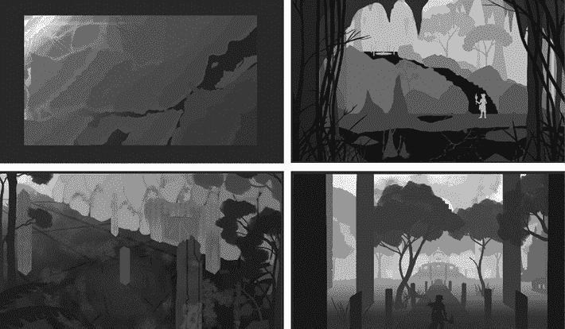

图 5.1：草图示例

当你在教程中前进时，我们希望当你揭示 Myvari 的过去时，最后一节能带来该区域感觉的巨大变化。这最初在 *图 5.1* 的右下角概念草图中有展示。从这个点开始，我们知道我们需要推动建筑问题，并定义出中等的形状。

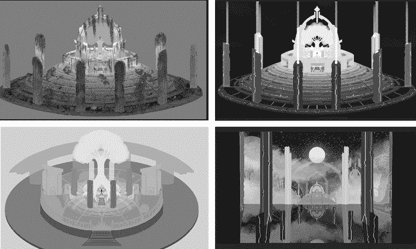

图 5.2：最后的谜题区域

通过进一步发展上一节的内容，我们知道当世界转移到 Myvari 的领域时，我们需要在主题视觉上有一个鲜明的对比。查看上一节中的 *图 5.2* 中的图像差异，主要差异在于白天与夜晚。这本身就是一个很大的变化，但我们还希望在地面上和树木消失的同时，将建筑恢复到其昔日的辉煌，并引入反射的静水，反射天空中的星星，从而真正地开辟这个空间作为一个新的维度。

在草图绘制出你的环境概念之后，你想要做的是利用从草图中学到的知识来构建一个**情感板**。在这里，你可以为未来作品的创作确立参考。

## 情感板

**情感板**是一组图像拼贴，可以描绘出一个地区的风格和情感。互联网上有成千上万的人绘制的、渲染的、草图或甚至摄影的图像，这些图像可能足够接近你的风格和基调，你可以将它们组合起来，为玩家提供更多体验的灵感。

如果你有一些明确的草图，那么这是你在情感板上大放异彩的时候。花些时间去寻找与建筑相似的特征和感觉，制作出反映环境情感应该感觉如何的拼贴。这将为你在这个环境旅程的建模部分定义色彩调色板。

对于我们的项目，我们有几个主要要求。我们想要一个多山的丛林，给游戏带来一种古老的魔法幻想文明的感觉。即使你搜索“魔法幻想古老丛林废墟”，也有很大可能性无法通过参考找到你需要的精确内容。相反，你应该分解每个区域的主要功能，并制作一个情感板。在我们的两个例子中，我们将讨论洞穴和废墟的情感板。

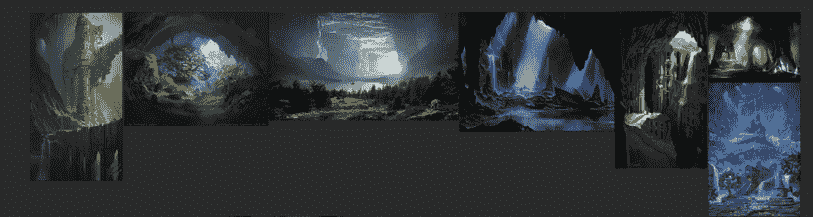

图 5.3：洞穴情感板示例

在上面的*图 5.3*中，我们关注了洞穴的主要功能。感觉渺小是怎样的？雾气和照明的氛围倾向是什么？这即使在地球上，也许是在我们地球的一个未开发区域，也能给人一种外星环境的感觉。

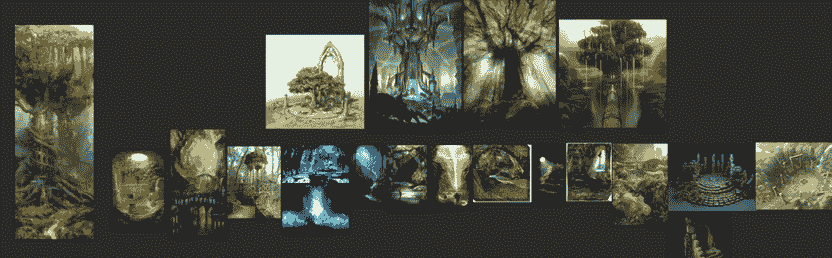

图 5.4：废墟情感板示例

在*图 5.4*中，我们想要将废墟在奇幻文明中的功能进行分解。一个以自然为中心的魔法生物会追求什么样的形状？颜色是如何相互融合的？

情感板需要回答情感和基调。当你完成对情感的搜索时，你会知道每个关键区域都有一个最适合该区域所需传达情感的马赛克。在我们的案例中，我们需要感受洞穴与废墟之间的区别。你会注意到，即使没有看到所有更细致的图像细节，两者在情感上也有很大的不同。

在草图之后开始这个步骤是有意义的，如果你可以通过这一步得到问题的答案。然而，如果你发现草图只是在提出更多问题，而不是定义你想要的风格，那么情感板应该是最先考虑的。寻找建筑图像往往能带来很多清晰度，关于你想要构思的内容。

## 场景布置

在快速勾勒出想法和感受以定义“为什么”的问题之后，你接着制作了一个情绪板来进一步巩固环境的感受。下一步是将之前定义的形状和情绪用于推动你的叙事和机制进入游戏的各个阶段。你带玩家去的第一个地点需要迅速回答很多问题。幸运的是，你在这一阶段之前花时间回答了尽可能多的问题。你现在可以自信地安排你的叙事设计了。对于我们这个项目，我们知道我们需要在每个你进步的区域尽可能多地解释 Myvari 的过去。

当你在构建一个场景时，尽可能将自己置于场景中。花时间通过场景，并确保你的主要问题在之前部分得到了你预期的回答。现在，让我们尝试一个新的实验：通过新玩家的视角想象你创造的经验。尝试感受他们作为 3D 游戏的新玩家可能会感受到什么。是否有足够的提示来描述他们的体验？然后从经验丰富的玩家的角度看待它；添加任何其他东西是否会损害这些高级用户？

这可能需要几个迭代。对这个步骤要有耐心，并完成这个阶段以确保你能解释角色的假设动作。

这是个好时机向别人展示你的设计，看看他们能提出哪些未经提示的问题；我们自己在没有过多思考的情况下能回答的问题真是令人惊讶。在每个阶段都有一双新的眼睛将揭示需要更多细节的地方。

经过一段时间，每个阶段你需要的东西的图片将更加清晰，然后你可以将你的阶段带入勾勒阶段。

# 勾勒

现在你已经尽可能多地处理了所有概念，你应该非常清楚什么会使你的环境适合叙事和角色。在这个时候，下一步将是尽可能多地完成“**勾勒**”；勾勒的目的是在 Unity 中将所有部件组合在一起，以实现我们在之前阶段努力定义的经验。

现在你已经熟悉并适应了整个级别的每个部分，你可以谈论每个部分的氛围和基调，并从概念中调整整体形状。为了勾勒出一个级别，我们将使用我们可用的几个工具；Unity 地形、基本形状和 Unity Probuilder 将帮助我们放下基本的环境部件。

## Unity 地形

在 Unity 中使用**地形**工具是非常有能力的。它非常容易上手，并能快速制作出美丽的景观。要开始，让我们创建一个地形实体。在创建地形实体之后，我们将浏览设置、绘画和 Unity 为我们提供的植被，这些都是我们创建地形的工具。

### 创建地形

与地形一起工作的第一步是创建一个。主要有两种方法可以做到这一点。

一种方法是点击**GameObject**菜单，然后**3D Object**，然后**Terrain**，如图*图 5.5*所示。

另一种开始的方法是在层次结构中右键单击一个空白区域，然后选择**3D Object**，然后选择**Terrain**。

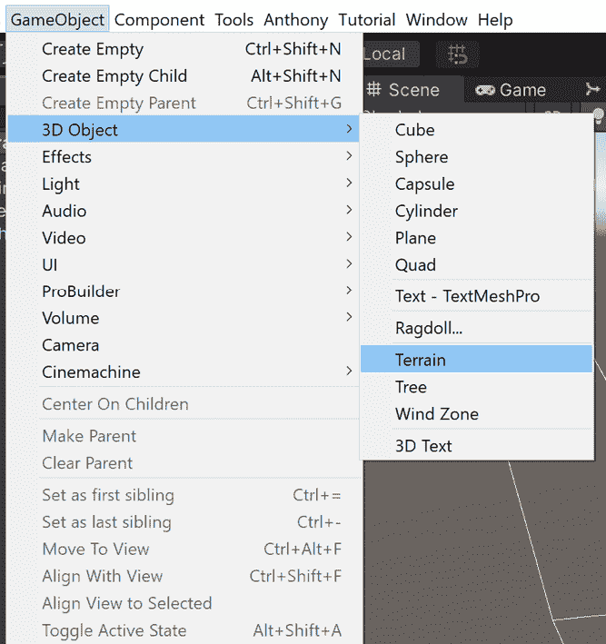

图 5.5：创建地形实体

这两种选项都会在场景中创建一个地形 GameObject，其全局坐标为*0*，*0*，*0*，默认情况下在*x*和*z*平面上向外扩展 1000 个单位。这个值可能不是你需要的，所以让我们来看看地形设置。

### 地形设置

在我们的垂直切片中，我们将使用默认的单位，因为这些是我们最终需要的用于感知尺寸的单位。这可能不适用于你的游戏。地形的一个很好的特点是它可以轻松地连接到相邻的地形地块。

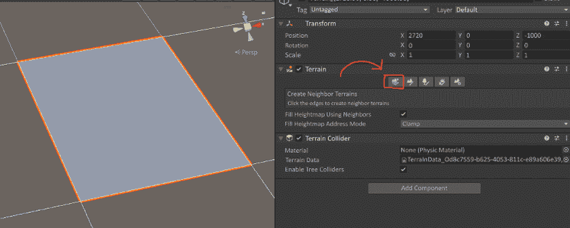

图 5.6：创建相邻的地形

**地形**组件中的第一个选项是**创建相邻地形**按钮。当选择此选项时，你将看到相邻地块的轮廓，如图*图 5.6*所示。如果你点击这些方块中的任何一个，地形将创建一个新的与主地形资产链接的地形资产。

现在你已经了解了**地形**工具如何轻松地连接到其他地形，你现在可以以每个地块的大小来考虑你的地形设置。可能你的地形只需要 500 个单位长度，200 个单位宽度。这些的公因数是 100 个单位，所以你可以按照下面的*图 5.7*中的设置来设置你的参数。

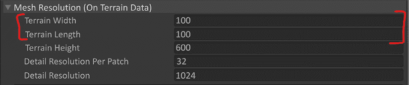

图 5.7：网格分辨率设置

如果你计划在你的地形上使用草地或细节，确保你的地形是正方形的。如果宽度与长度不同，**细节刷**将很难有序地放置广告牌。

点击开放的方块将用另一个地形地块填充它们。点击多个可能会得到类似于*图 5.8*的地形。

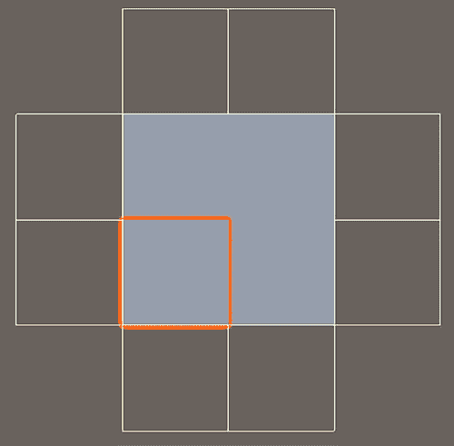

图 5.8：添加相邻的地块

这让你有自由添加一些不太大的分支，如果你只需要在你不期望需要它的地方多一点点地形。

在我们的例子中，我们知道我们只需要一个 1000x1000 的方块，所以我们坚持使用默认的大小。我们的整个垂直切片将在一个场景中完成，使用这个默认大小以方便设置。

一旦你的地形按所需的比例设置并设置了大小，你可能还需要给你的地形添加一些细节。尽管无限平坦的拉伸平面在其自身的方式中很有趣，但你的概念很可能确实有一些山丘或山脉。让我们开始在那里绘制这些。

### 地形绘制

要获得那些美丽的山脉和丘陵，我们需要影响地形的几何形状。**绘制地形**工具正是为此而设计的。你可以在**地形对象**检查器中找到这个工具按钮，它位于第二个可用选项中，如图 5.9 所示。

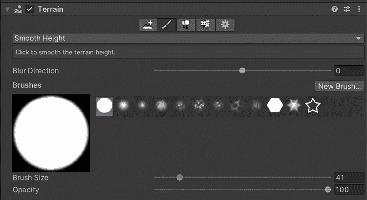

图 5.9：刷子选项

你的**刷子**选项位于**工具**选项下方，是一个下拉菜单，它将改变刷子的功能。要查看刷子选项列表，请点击如图 5.10 所示的下拉菜单。

图 5.10：绘制选项

我们将详细介绍它们的精确功能，但我建议你花点时间，通过尝试不同的刷子来制作一个你感到舒适的地形。没有什么比经验更能让你了解它们在地形上的作用了。

#### 升降地形

在制作地形时，这个工具将是你的得力助手。根据你地形的大小以及你需要对地形进行修改的规模，你的刷子大小将根据你的需求而有所不同。幸运的是，有一个很好的指示器，如图 5.11 所示，在你确认更改并点击之前，它会告诉你更改的大小和形状。

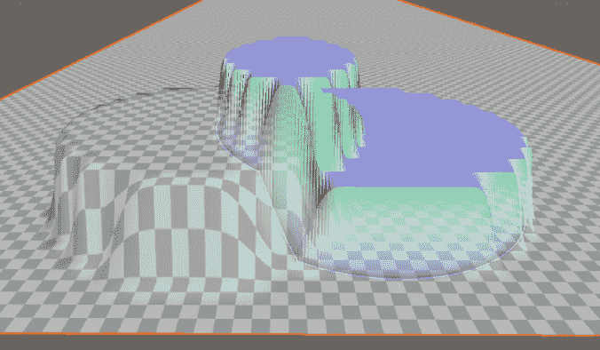

图 5.11：刷子在不同高度上的可视化

当你选择**升降地形**刷子时，它会显示一个描述框，解释如果你点击地形，刷子将根据刷子形状提升地形；如果你在点击刷子时按住**Shift**键，这将根据刷子形状降低地形。如果你尝试在平坦部分降低地形，你会注意到它不会低于 0。如果你计划在地形中制作凹痕以可能放入水，这可能会成为一个问题；有一种方法可以绕过这个问题，我们将在*设置高度*部分稍后介绍。

#### 绘制洞口

在选择**绘制洞口**工具并花一点时间用洞口进行点击后，这个工具可能不会立即显得是最有用的与地形相关的工具，因为它只是删除地形。除了它只是挖洞之外，它还产生了锯齿状的边缘，这些边缘与地形其余部分平滑的形状不太搭配！

但并非一切都已失去！如果你需要将洞穴作为地形建造，而这个地形没有设计来处理会导致地形顶点重叠的凹形形状，这个工具对你来说非常棒。

设计包含所需洞穴系统的 3D 网格并将其放置在地形下方，然后在地形中挖一个洞以进入，这是一种常见做法。

我们将在稍后的部分更详细地介绍 3D 网格，但这里有一个简单的解释：3D 网格是一组顶点，它们形成多边形，我们使用它们来可视化 3D 空间。

地形只是一个被操作的平坦区域；它不是你可以用铲子挖掘的地面。如果你想在地里挖洞，你需要挖一个洞，然后在地面下方构建一个网格。这将留下一些参差不齐的边缘，如图 5.12 所示。

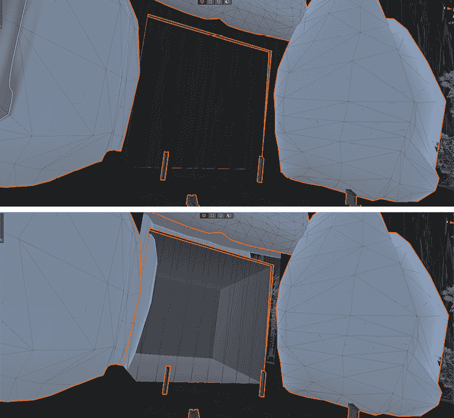

图 5.12：地形中涂鸦前后对比示例

你可以用岩石或其他通向洞穴系统的网格来覆盖那些参差不齐的边缘。

#### 涂鸦纹理

现在你可能已经玩得足够多了，以至于你有一些山丘、高原和其他各种灰色地形相关材料。你可能想在生活中添加一些色彩，幸运的是，有一个简单的方法可以做到这一点！你可以在网上搜索可重复使用的纹理，或者你可以使用项目中提供的纹理来设置这个。

当你第一次选择涂鸦纹理工具时，没有什么可以涂鸦的，因为你需要创建层来涂鸦。你的地形层将保持空白，直到你创建一个，所以让我们先做这个。

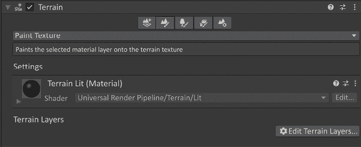

图 5.13：编辑用于涂鸦的地形层

在地形层的右下角，如*图 5.13*所示，有一个标有**编辑地形层**的按钮。如果你选择这个按钮，你可以创建或添加一个层。如果你之前没有创建过层，你可以点击**添加层**选项，但将没有选项来填充它。相反，让我们点击**创建层**。这将弹出一个对话框来选择纹理。这里的一个小技巧是给你的纹理起一个容易搜索的名字，以防你有很多纹理要筛选。例如，你可以用前缀`TT_`给你的地形纹理命名，比如`TT_Grass`代表草地。然后，当对话框打开时，你可以在搜索栏中输入`TT`，它将只显示地形纹理。这个技巧可以在整个项目中使用，因为大多数可用的选项中都有搜索栏来选择一个资产来填充角色。

当你选择纹理时，它将创建一个包含你选择的纹理和一些材质选项的**地形层**资产。

*图 5.14*显示了**地形层**的一个示例。

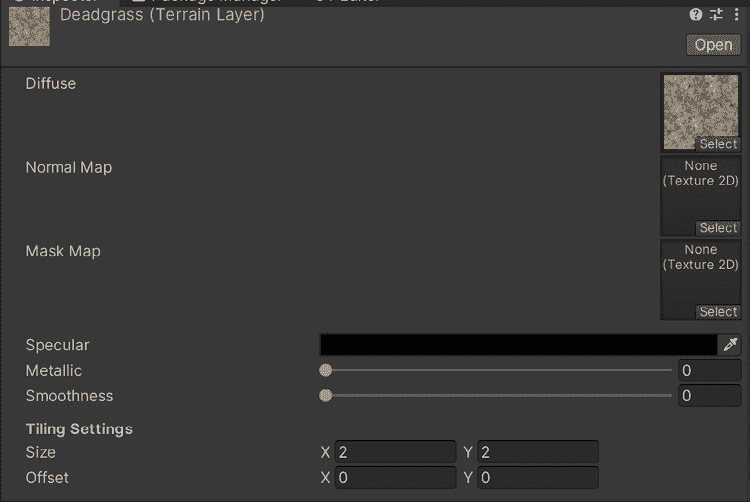

图 5.14：地形层示例

你在这里想要看到的首要属性是**平铺设置**。根据游戏规模的不同，你可能需要增加或减少缩放以避免看到纹理的平铺。如果你查看下面的*图 5.15*，你可以看到纹理是如何反复平铺的。从当前相机的位置来看，这看起来很糟糕，但在游戏中，它将更近，这使我们能够防止平铺变得过于明显。最有趣的部分是，它与地形没有连接，所以如果你对图层资产进行了更改，它将立即更新地形。这使得在快速工作并获得你想要的地形外观的想法方面变得很方便，而你可以在稍后添加法线贴图和金属或平滑度元素。

第二件事是整个地形将用这个纹理进行绘制。当你添加另一个图层时，你将能够利用相同的画笔形状和大小来绘制其他图层到地面上。

技术上有趣！

地形图层的工作方式是 Unity 为在地图上绘制的每个纹理创建一个纹理图。如果你有四个图层，每个图层对应于纹理中的四个通道：**红色**（**R**）、**绿色**（**G**）、**蓝色**（**B**）和**透明度**（**A**）。如果你有五个，地形将获得一个新的纹理，并将其添加到另一个纹理的 R 通道中。由于这种情况，出于性能原因，限制每个平铺为四个纹理！

在熟悉了通过图层工作之后，用你的角色测试小部分内容是个好主意，以确保图层的缩放对于游戏规模本身是有意义的，同时考虑到还有其他噪声因素会破坏纹理平铺，例如草地、岩石、树木或你环境中放置的任何其他东西。

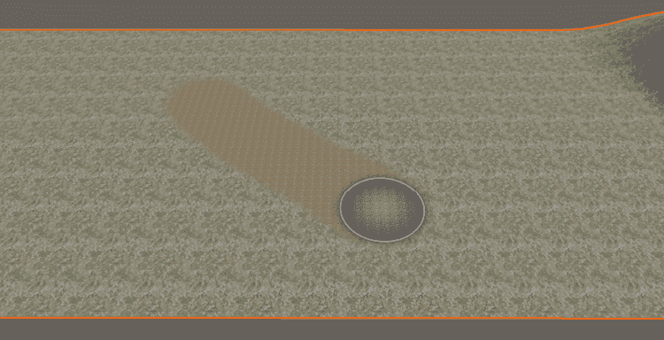

图 5.15：绘制时测试画笔强度

如果角色在这一点上关于纹理与缩放的关系看起来不错，让我们继续下一个选项。

#### 设置高度

当使用较低的高度工具工作时，你可能已经注意到它不会低于零点。如果你知道你将在零以下工作，这是非常常见的，那么开始的工作流程是：在做出任何更改之前，将地形的设置高度设置为可能适合你需要的低于零的高度。

你需要下降 200 个单位吗？如果是这样，将地形 GameObject 的位置*y*设置为*-200*，如图 5.16 中用红色突出显示的步骤*1*。然后选择**绘制地形**选项，同时选择**设置高度**下拉菜单，如图 5.16 中用红色标记的*2*。之后，值将是`-200`，所以将其设置为`0`，然后使用图 5.16 中用红色标记的**平整**按钮将其平整。

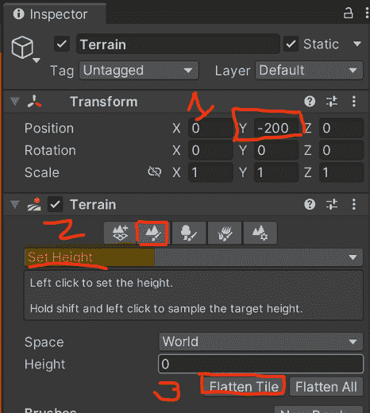

图 5.16：设置高度以允许低于世界 0

这将使地形在视觉上回到 *0*，*0*，*0* 的位置，并保持偏移量不变，以便您可以降低地形低于该标记。这对于制作沼泽、洞穴和河流非常有效。

#### 平滑高度

**平滑**是一个简单的工具。有时，您可能只需要稍微平滑地形，因为放置在上面的噪声可能已经失控，或者您需要平滑一条路径，以便玩家角色行走并帮助引导角色的移动。

作为简单的例子，请看下面的*图 5.17*。

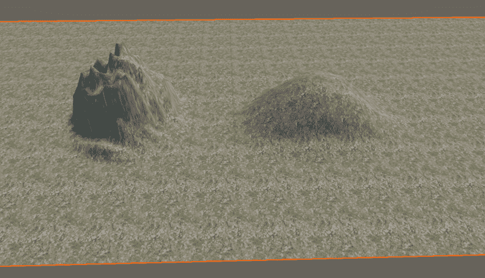

图 5.17：平滑地形

这是一种相当极端的平滑版本，但在平滑之前两者看起来是相同的。您还可以使用带有噪声笔刷的平滑来以非均匀的方式平滑地形，从而给地形带来侵蚀的外观。

#### 地形盖章

**盖章**工具被用作 3D 盖章！如果您需要特定的地形特征，您将编写一个高度图来盖章地形。您将高度图添加到笔刷中，然后将其用于地形。

此工具的主要用例之一是您可以获取已经证明在地形上看起来很好的预编写高度图。如果您想找到好的山脉和丘陵，您可以在资产商店中搜索它们，并将有示例供您开始。这将大大加快进程。这可能不是您需要的确切内容，但每一步都是进步。

### 绘制树木

当您选择**绘制树木**工具时，它将具有*图 5.18*中所示选项。

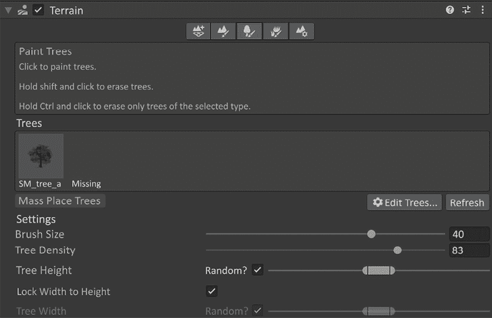

图 5.18：绘制树木地形模式

要开始，点击**编辑树木**按钮，并添加树木。即使您喜欢的网格不是树木，您也可以添加它！在*图 5.19*中可以看到一个警告，如果您的网格没有正确构建以在地面上的树木位置，则会弹出。它看起来像这样：

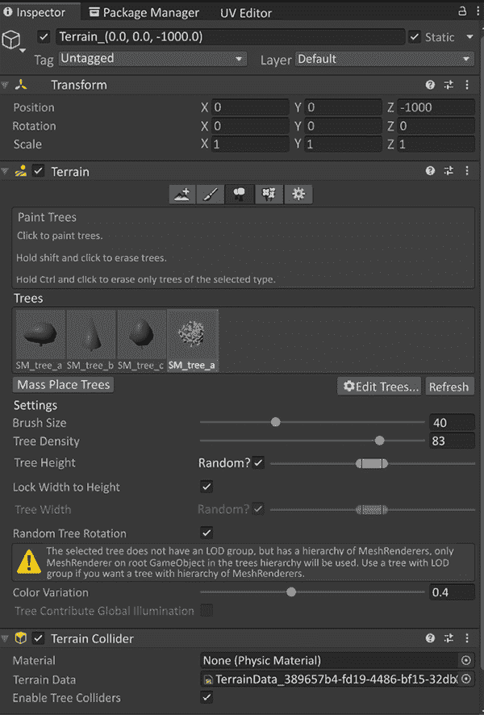

图 5.19：定义的树木和 LOD 组警告

幸运的是，在资产商店中有一个由*SpeedTree*提供的免费资产，您可以下载以获取如何正确组装用于**绘制树木**工具的树的绝佳示例。

### 绘制细节

最后，我们有绘制细节。在这里，您可以选择添加一个细节纹理，它将在四边形上渲染，或者您可以使用细节网格来创建自己的网格。以下是一个简单的草地纹理被用于并绘制在平坦地形上的示例：

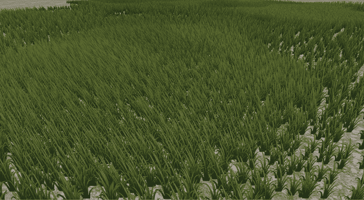

图 5.20：草地作为细节

绘制细节，如草地，有助于打破地面纹理，如上图*图 5.20*所示。这些项目也可能受到**风区**的影响，这是可以添加到地形对象中的另一个组件。如果您想更进一步，请查阅*第十章*，*声音效果*，我们将添加环境声音和其他小的抛光细节，以及*第十二章*，*收尾工作*，为地形注入生命。

## 3D 几何

现在您已经设置了地形，您将需要增强地形以用于建筑设计或构建洞穴系统。您需要利用 **3D 数字内容创作**（**3D DCC**）工具来构建您环境的网格。还有一个构建块状阶段的选择，那就是 Unity 的 ProBuilder。在我们的案例中，我们将使用 ProBuilder 并创建我们自己的几何形状以定义自定义形状，以表示环境的特定建筑部分。

让我们深入探讨 ProBuilder 和自定义网格对您的环境块状建模意味着什么。

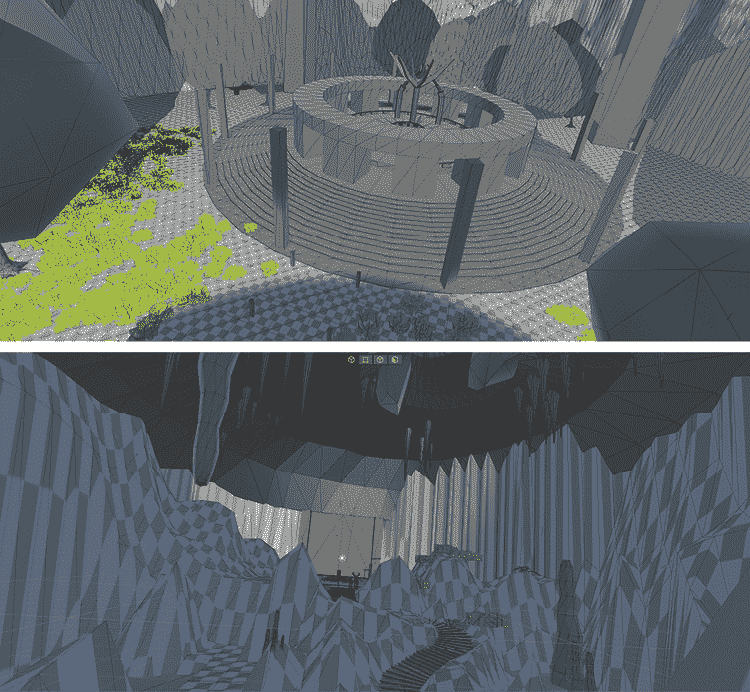

图 5.21：Unity 的 ProBuilder 和自定义网格的示例，来自我们的 3D DCC

### ProBuilder

根据 Unity 文档，ProBuilder 定义如下：

您可以使用 ProBuilder 包中提供的操作和工具在 Unity 中构建、编辑和纹理自定义几何形状。您还可以使用 ProBuilder 帮助进行场景级别设计、原型设计、碰撞网格和游戏测试。

ProBuilder 可以快速设置您的场景，带有可碰撞表面，以便轻松可视化您的环境。要开始使用此工具，我们将介绍一些起始步骤，您可以在其中创建自己的场景以便熟悉。我们将介绍安装、创建 ProBuilder 形状、编辑，以及 ProBuilder 中的一些常用工具。

#### 安装 ProBuilder

要安装 ProBuilder，请打开包管理器并转到 *图 5.22* 中显示的 **Unity 注册表**。选择 **ProBuilder**，然后下载并安装它。

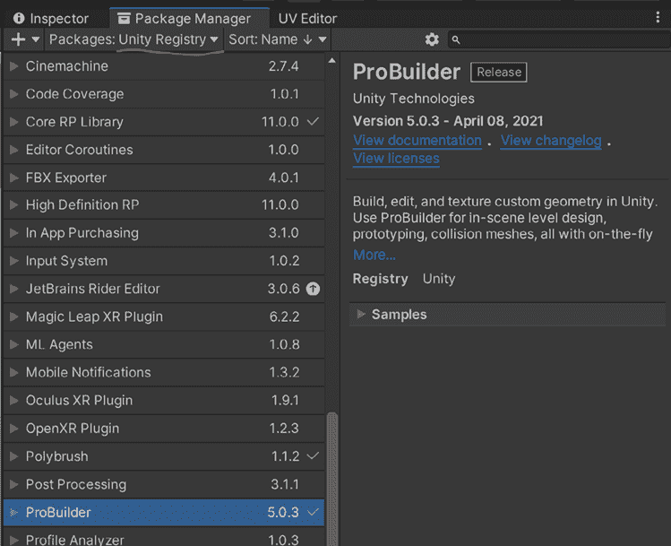

图 5.22：Unity 注册表包管理器

安装后，您需要访问 **工具** 菜单以打开 *图 5.23* 以下显示的 **ProBuilder 窗口**。

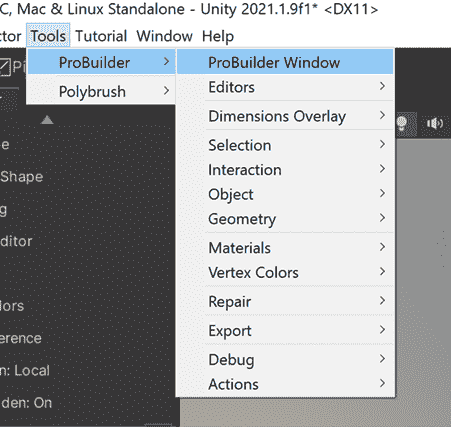

图 5.23：Probuilder 窗口路径

这将打开一个带有许多选项的浮动窗口。要开始，让我们将窗口停靠在场景窗口的左侧。这是一个个人偏好，但我们喜欢能够使用 ProBuilder 并轻松选择层次结构中的项目。现在我们已经设置好了，让我们来看看菜单中的颜色。

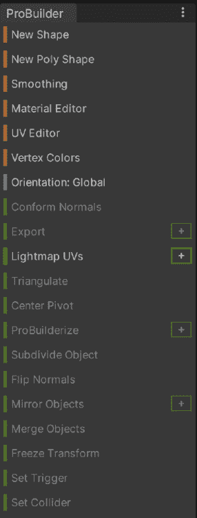

图 5.24：Probuilder 对象模式

在 *图 5.24* 上，我们目前正在查看 ProBuilder 的 **对象** 模式，在这个菜单中只有三种颜色可用，但有一个第四种颜色，我们将在 *常用 ProBuilder 工具* 部分中介绍。我们目前看到的这三种颜色以特定方式使用，以帮助轻松处理所有选项。它们是这样工作的：

+   **橙色**：对象和窗口工具

+   **蓝色**：基于选择的函数

+   **绿色**：影响所选整个形状的网格编辑工具

现在我们已经了解了这些工具的用途，让我们开始构建我们的第一个形状。

#### 创建 ProBuilder 形状

打开一个新的场景，并从 ProBuilder 菜单创建一个新的形状。这将揭示 **场景** 视图窗口右下角的一个小窗口，如 *图 5.23* 所示。你将有几个关于你想要创建的形状类型的选项。我们将选择 **平面** 选项，以便我们有一个可以附加到形状上的东西。你可以在下面的 *图 5.25* 中找到它。

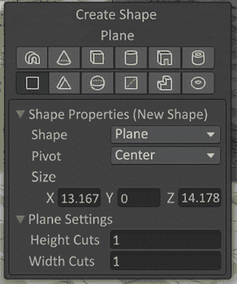

图 5.25：创建形状子菜单

选择平面后，在场景中左键单击并拖动以创建一个平面。暂时不用担心它的大小；只需创建平面，我们将在下一步进行编辑。

现在，在层次结构中，如果平面没有被选中，请继续选中它。在检查器中，我们将变换设置为 *0*，*0*，*0*，使其在场景中居中于 *0*。然后，转到 ProBuilder 脚本并更改大小为 *80*，*0*，*80*。这将为我们提供足够的空间来在场景中玩任何我们想要的形状。完成这些步骤后，检查器应该看起来与 *图 5.26* 类似。

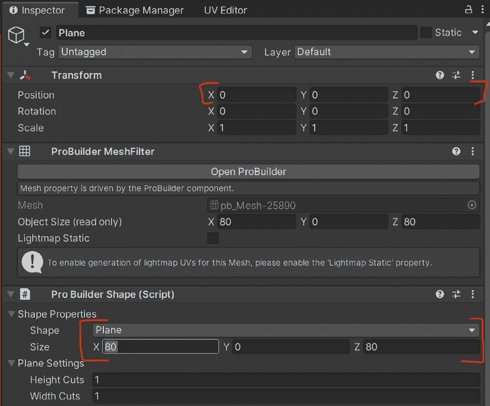

图 5.26：位置和形状属性检查器窗口

创建平面后，让我们制作一个立方体。创建一个新的形状，并在场景中的交互式工具中选择一个立方体形状。左键单击并拖动以创建你想要的任何基础形状。释放左键，然后你可以向上拖动以给立方体其高度。现在，点击你想要的高度，完成制作立方体。一旦完成，让我们向立方体添加一个额外的形状，楼梯。目标是制作一组楼梯，使角色能够爬到立方体的顶部。如果你的楼梯看起来很奇怪，不要担心；只需删除它们并再次尝试，直到接近为止。不用担心做得完美；我们将在下一步进行形状编辑。

#### 编辑形状

有可能当你制作楼梯时，它们看起来像下面的 *图 5.27*。

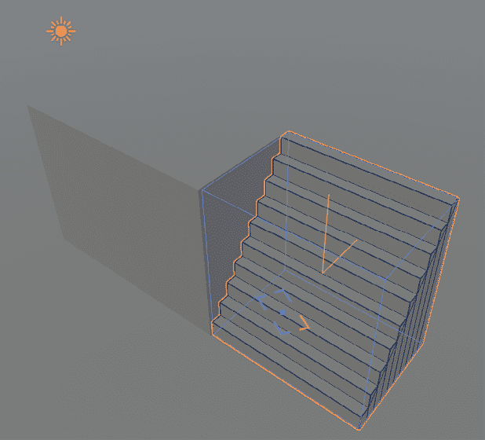

图 5.27：楼梯放置问题

虽然你可能不希望这样，但它就是这样出现的。幸运的是，ProBuilder 的编辑部分非常强大。如果你将鼠标悬停在楼梯的面上，应该有一个指向上、下、左、右的蓝色箭头，分别对应于该面的中心正方形，如前图所示。

如果你悬停时没有这个，这意味着你可能已经取消选择了楼梯，而 ProBuilder 认为你不再需要编辑基础形状。这可以通过在场景中选择另一个项目然后重新选择楼梯来轻松修复。然后，在检查器和 ProBuilder 脚本中，有一个**编辑形状**按钮。选择这个按钮将再次为你提供基本编辑功能。

点击并拖动中间的正方形将允许您移动形状的这个面。点击箭头将重新定位整个形状。这对我们的楼梯非常有用。*图 5.27*中突出显示的黄色箭头将形状定位在楼梯的后面，这将使最上面的楼梯面与立方体接触。这正是我们想要的，所以我们选择了它，然后使用中间的正方形重新定义形状，使其在这个例子中看起来最好。

尽管这些工具在绘制块时非常强大，但我们还可以进一步讨论组件操纵工具。

#### 常见 ProBuilder 工具

我们已经创建了一些形状，并编辑了它们的整体状态和形状，以获得结构的基本构建块。为了获得更多中等形状，我们需要对这些形状的组件进行工作。回顾*第一章*，*三维入门*，3D 对象的组件结构是顶点、边和面。当安装 ProBuilder 时，这些组件在场景视口顶部的图标形状表示，如图*图 5.28*所示。

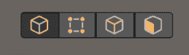

图 5.28：组件选择工具

从左到右，我们有**对象**、**顶点**、**边**，最后是**面**选择。如果您选择其中之一，您将能够选择在层次结构中选择的 ProBuilder 形状的这些组件类型。这也会改变 ProBuilder 工具集中的可用选项。将此与*图 5.29*中的选项以及*图 5.24*中的选项进行比较，您会看到我们添加了红色到我们的可用选项，其他颜色在其选项中也有所变化。

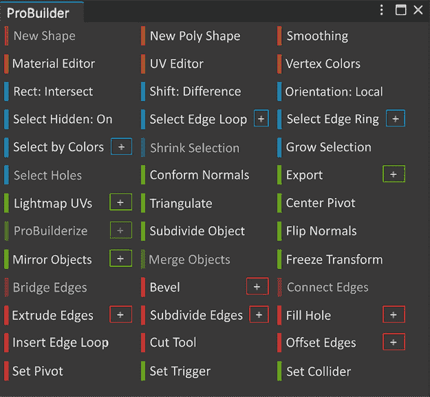

图 5.29：组件菜单选项

可用的红色选项是针对每个组件的。在这种情况下，我们选择了顶点操纵器；组件工具的选项与顶点相关。关于选择边或面，情况也相同。花些时间循环查看每个组件的可用选项。当您到达面时，让我们停下来，因为有一个非常常用的工具——**挤出**工具。

将面挤出会复制顶点并保持面与挤出几何体连接，从而从选定的面中挤出几何体。这是一个非常强大且快速的工具体现，可以构建许多形状或添加细节。我们将执行两种版本，以展示其工作原理。这些是**挤出**和**内嵌**。

要进行**挤出**，在场景窗口顶部选择**面**组件选项，然后选择楼梯旁边的盒子上的一个面。按*W*键进入变换工具。在按住*Shift*键的同时，左键单击并拖动向上的箭头。你应该会得到一个向上的挤出！它应该看起来像下面的*图 5.30*。

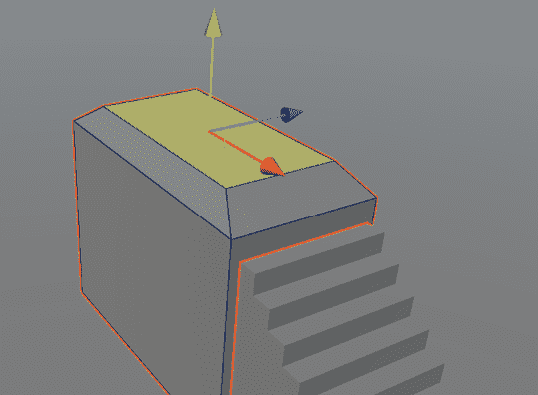

图 5.30：挤出工具

拉伸是拉出所选面的顶部盒子。你现在可以操纵这个面，使其成为你想要的任何形状。我们并不是特别喜欢所有的 90 度角，所以我们按了*R*键并从中部缩放，给它增添一点个性。

现在，**内嵌**很有趣，因为它们是一组特定的拉伸，将面拉回当前形状。这对于添加快速细节非常棒。我们将通过选择面对摄像机的侧面面，按字母*R*键使用缩放工具，同时按住*Shift*键，左击中心灰色盒子从所有方向进行缩放来实现这一点。完成之后，我们将按*W*键回到变换工具，再次按住*Shift*键，拉动蓝色箭头以拉入内嵌。以下**图 5.31**包括了在同一面上创建内嵌的步骤。

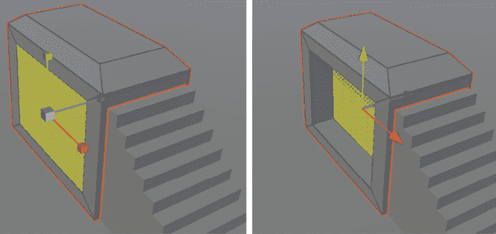

**图 5.31**：内嵌示例

玩转每个组件的工具。你会发现它们都是为了帮助加快工作流程，让你尽可能快地完成布局。有时，你可能知道需要特定的形状，但无法使用 ProBuilder 工具实现。在这种情况下，你可能需要使用外部工具，如 Autodesk Maya 或 Blender 来达到所需的视觉效果。我们通常将这些对象称为**预制形状**。

### 预制基本形状

如果你已经对你的环境所需的形状有了很好的想法，你可能已经设置了正确比例的连接环境部件。ProBuilder 在基本形状方面非常出色，但你可能需要一些特定于你游戏的建筑。如果你有条件，直接创建它并使用网格可能更容易，而不是使用 ProBuilder。

在某些情况下，你可能已经创建了可以与 ProBuilder 一样好的形状，你只需要将它们导入 Unity 并放置到你想要的位置。这可能会在加速布局阶段非常有用。

在我们的场景中，你会看到我们使用了所有三种（地形、ProBuilder 和预制形状）来构建一个连贯的集成场景。这主要是因为我们的艺术家在 DCC 和 ProBuilder 中创建某些模型的速度。然而，有时，我们可能只需要一个基本的拉伸块来使场景在布局上显得合理。

迭代

**迭代**的过程是通过循环工作的一部分，以达到足够精细的状态，以便继续进行游戏的其它部分。我们将以下**图 5.32**作为简单的跟踪。这是过程的高级概述，在你多次经历之后，你会为自己和团队创建更多步骤来遵循。现在，让我们先处理一下重点。

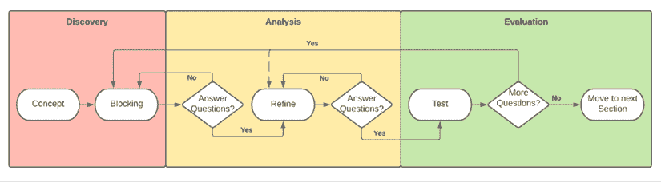

图 5.32：迭代过程

我们在上面的过程中已经讨论了几个阶段，例如构思和布局。我们只需要进行细化和测试。细化是在细粒度层面上尽可能接近回答动作所采取的行动。以我们的项目为例，我们需要细化每个谜题与 Myvari 文化的接近程度。我们需要将这一点从布局细化到架构，并确保谜题本身在机制风格上是有意义的，这一点我们将在*第六章*，*交互* *和* *机制*中讨论。如果细粒度层面的答案是有意义的，那么你可以扩大范围进行测试。在测试中，你将全面审视游戏。如果你能的话，通过四处走动来测试游戏的感觉，看看是否还有其他在细化过程中出现的高层次问题。

这就是时间很容易溜走的地方。你需要明确你游戏中的“足够好”是什么意思。游戏开发中最困难的部分之一是意识到发布游戏比让一切都完美更重要。在发布和让它看起来和感觉足够好的过程中保持警惕，然后继续前进。你还有更多的事情要做！

我们在本章的环境章节中只讨论了布局阶段。这是因为布局非常重要，需要花时间通过游戏来感受它。快速失败并根据你或你的朋友玩游戏时的反馈进行修改。当你认为每个部分都足够好时，然后你可以开始导入最终网格，这些网格的形状或位置是你认为正确的空间。一旦完成，再次运行游戏，因为你可能会看到最终网格带来的变化，这些变化在布局网格中之前并不明显。

在场景的多个部分移动时，仔细观察一致性。一旦在场景中移动感觉良好，那么你需要更多地深入到游戏本身的机制中，并进入更多的发展阶段，而不仅仅是艺术方面。未来还会出现更多问题。首先认真对待这些迭代将为你进入游戏下一部分打下坚实的基础。

# 摘要

我们在本章中已经介绍了很多 Unity 工具。请花些时间熟悉地形工具和 ProBuilder 工具，以便更好地理解它们的工作原理。

从本章中，您获得了多种工具来构建环境的知识。我们花了时间解释如何迭代整个流程，以在您的环境中获得强大的结构感。您学习了如何从设计思维开始构建一个概念。然后，您将这个概念分解成各个部分，并开始逐一展示，最终将环境组合起来，并对其进行迭代，以获得全面的清晰视图。

接下来，我们将探讨如何将您游戏的机制适应到您的环境中。在放置机制交互时，请记住这一章节，因为在开发过程中会有更多的迭代。
