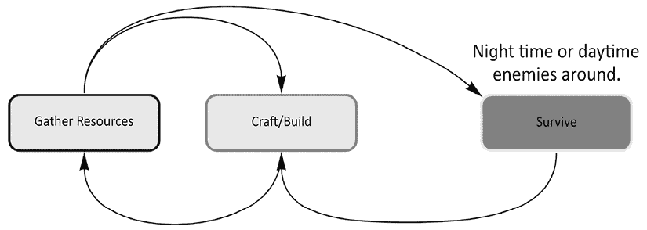
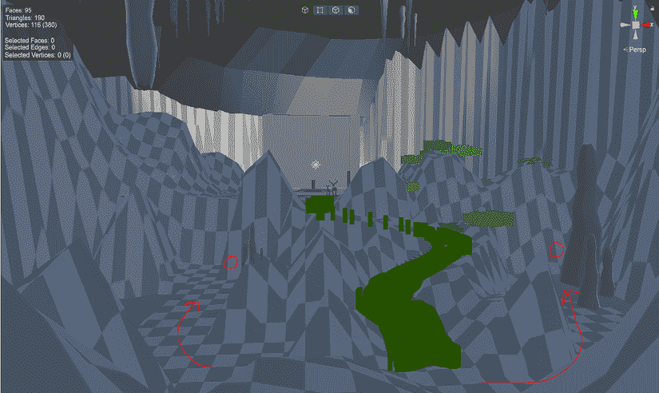
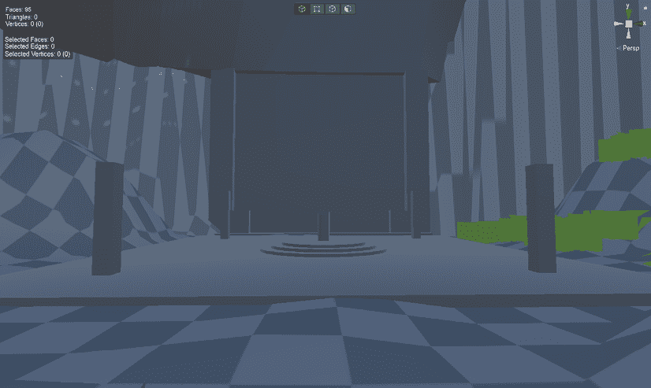
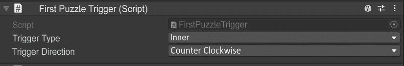
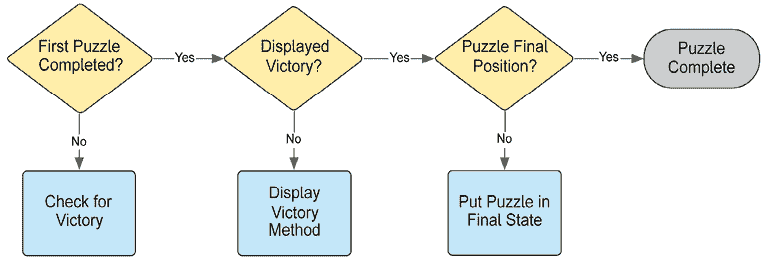

# 交互和机制

现在我们有一个具有基本移动能力和可以与之交互的环境的角色，让我们看看这个角色应该如何与这个环境交互。Unity 允许我们使用 C#围绕玩家可以与之交互的 GameObject 构建逻辑。这是游戏设计的基础，并有助于通过实际交互讲述故事或体验。

在本章中，你将了解更多关于可以使用 Unity 实现的具体交互和机制。我们将涵盖：

+   游戏循环

+   机制工具箱

+   项目内的交互

+   楼梯

+   环形谜题

+   狭小空间

+   交互体积

+   设计与实现

# 游戏循环

视频游戏有一个独特的概念，称为**游戏循环**。正如你可能猜到的，它是在整个体验过程中执行的一系列机制循环。游戏循环本身可能非常短，例如《使命召唤》的多玩家团队死亡匹配。循环看起来可能像这样，目标是杀死比死亡次数更多的敌人：

1.  杀死敌人

1.  死亡并重生

这不仅仅是那样，如果你是一个职业的《使命召唤》玩家，你可能认为这是对游戏玩法的一种过度概括。然而，最终，这真的是 90%的情况。现在让我们看看 Minecraft 的游戏循环：

1.  白天收集资源

1.  白天建造

1.  夜间生存

我们将简化这一点：有一些特定的情况不在这个循环中，例如白天的爬行者以及降雨，这降低了光照水平，使得实际上变成了夜晚。让我们假设这两个因素不包含在这个研究中。这很有趣，因为这个循环尤其复杂。我的意思是，生存并不总是在这个循环中发生。游戏的大部分时间是 1，然后是 2。只有在夜晚，3，**夜间生存**，才成为游戏玩法的重要组成部分，这在*图 6.1*中有视觉表示。核心游戏循环需要尽可能简洁。



图 6.1：Minecraft 游戏循环

看看你最喜欢的游戏，并分析它们的主要游戏循环。你可能会发现存在游戏循环的层级。有时这被称为**元进度**。在游戏《Hades》中，游戏循环如下：

1.  （可选）与 NPC 交谈

1.  （在大厅中）选择升级的技能

1.  （大厅中）为下一次运行选择武器

1.  （在游戏中）战斗

1.  （在游戏中）为大厅升级赚取货币

1.  （游戏中）升级以增强这次游玩

1.  在大厅中死亡并重生

元进度发生在步骤 2。基础生命值和伤害升级使进一步进步变得稍微容易一些。这在以技能掌握和通过死亡进行游戏进度的 roguelike 流派中是一个常见因素。

你会注意到在《使命召唤》循环中，我们没有提到元进度，尽管这款游戏中存在大量的元进度。这是因为元进度本质上**只是装饰性的**。在《使命召唤》中，你不需要在比赛之间做任何改变。在《使命召唤》中获得的任何装备都将与拥有相同模组的其他玩家的装备相同。如果你让一个玩了 1000 小时的玩家与一个装备完全相同的玩家对战，那结果将只取决于技能。然而，在《冥界神殿》中，你必须花费点数来升级，才能真正完成游戏。

这些循环很有趣，但我们应该花些时间深入研究构成这些循环的交互。在下一节中，我们将单独介绍一系列游戏机制。

# 机制工具箱

交互是通过机制采取的行动。例如，`使用物品`的机制可以用来拉动杠杆、按按钮或使用电话。这三个例子都是交互；机制允许玩家通过按钮点击与物品交互。如果我们只能以这种方式与某物交互，我们将只有很少的游戏类型可以玩。幸运的是，我们有广阔的机制世界可供我们使用来创造交互。通过使用交互，我们可以设计出惊人的体验！

为了开始这一章，我们认为提供一个来自这些机制的机制列表和一些交互列表是个好主意。我们无法涵盖每一个机制，但我们将探讨一些主要概念，以获得对机制景观的良好感觉。

我们在这里提供的是对机制及其如何被看待的理解。如果你对此感兴趣，花些时间阅读几位不同作者关于这个主题的作品，因为他们对机制的看法可能与我们解释的不同。我们看待机制的方式是它们是体验运动的层次。有一些核心概念可以叠加在一起形成交互。这些包括：

+   资源管理

+   风险与回报

+   空间意识

+   收集

+   研究

+   局限性

继续阅读，以了解这些游戏设计的模块化核心概念。

## 资源管理

你可能知道这是**实时策略**游戏的主要机制，或者称为**RTS**。例如，《星际争霸》、《帝国时代》和《全面战争》都是流行的以资源管理为重点的游戏。这里的理念是，你需要收集和花费有限的资源在能帮助你赢得比赛的东西上。这可能是一支军队的士兵或使你的士兵变得更强大的实验。一个非战斗相关的场景是城市建设者。你需要监控你城市的人民，并为他们建造东西以使他们快乐，同时管理从他们那里流入的钱。

## 风险与回报

这种机制在许多以战斗为导向的游戏中被使用。它通常以冷却时间的形式出现。以流行的游戏《英雄联盟》为例，你想现在就使用你的终极技能吗？这可能会消灭一个敌人并给你带来重大优势。然而，如果你失误，这也可能让你处于劣势，因为敌人会知道你少了一个可以使用的力量。这是风险与回报的概念。这种概念最简单的形式体现在《超级马里奥兄弟》中。你应该尝试那些难以触及的硬币吗？你想要这些分数来获得额外生命，但与此同时，如果你不正确跳跃，你可能会掉进坑里。

## 空间意识

在第一人称射击游戏中，这种情况很常见。使命召唤和守望先锋以几种方式利用这一点。首先，你需要对屏幕上的敌人有空间意识。你需要能够将光标放置在屏幕上他们的位置来射击他们。其次，你需要对整个地图有空间意识。如果你对地图没有空间意识，你很容易被突然袭击。这也是平台游戏的核心。在 2D 空间中理解你的位置并能够灵活操作是任何动作平台游戏中的游戏名称。Celeste 通过提供玩家每次都按预期移动的紧密控制方案充分利用了这一点。动作编排得如此之好，以至于当你犯错时，你会觉得自己是错的。

这很有趣：如果你在一个需要紧密控制的游戏中拥有松散的控制，玩家可能会感到被游戏欺骗，并可能停止游戏。这是不可取的！

## 收集

有没有玩过任何 CCG（可收集卡牌游戏）的玩家？这个名字就说明了这一点！可收集卡牌游戏。万智牌、炉石传说、游戏王和宝可梦只是几个例子。尽管这种机制并不显眼，但收集的概念被用于各种游戏中。

技能可以收集，同样还有武器、法典条目、盔甲，清单可以一直列下去。人类喜欢收集东西。可能你想要收集该季节中的每一张卡牌以解锁成就。这是双重收集，因为你不仅想要这些卡牌，还想要收集那些成就。可能你想要收集游戏中所有的法典，例如在《质量效应》中，游戏的背景知识来自于尽可能多地与独特事物互动，你的日志更新法典，其中包含关于独特物品、角色、种族、历史等信息。

## 研究

研究是进行调查以建立事实和规则的能力。我们可以以几种独特的方式使用研究的概念。一个想法是玩家应该是进行研究的那个，而不是角色。这意味着玩家看到的是角色的环境。正因为如此，玩家可以了解角色可能不知道的主题和事物。我们作为设计师可以利用这些知识，并通过概述可交互对象或使可攀爬的边缘具有特定颜色来更容易地向玩家传达信息。

另一方面，研究的概念可能指的是角色本身。游戏中的角色通过研究，在自己的世界中得出新的结论，并在身体和精神上变得更强大，同时扩展他们的意识。这看起来可能类似于收集和资源管理；然而，如果它涉及到从角色到玩家的知识转移，或者事物本质上是通过游戏学到的，那么它应该被视为研究。

## 限制

压力使钻石。与其被视为一种独立的机制，限制可以被视为其他/所有机制的修饰符，但我们喜欢将其作为一个独立的机制单独列出，因为并非每个交互都需要有严格的限制。可以有影响整体游戏的整体限制。例如，给整个游戏添加计时器就是一个限制。另一个例子是玩家只有 3 次生命，游戏会结束。在一个卡牌游戏中，你可能看到对牌库有硬性上限。这限制了可以进行的回合数。

当你花时间去弄清楚这些机制如何组合在一起以构建交互和体验时，你就已经设计了一个完整的机制。所有这些部件如何组合在一起是机制和交互设计的核心。让我们花点时间来探讨一些细微差别。

# 设计与实现

在良好的设计风格中，我们需要分解我们将要使用的力学和交互的原因。一般来说，你希望在游戏中尽量减少力学数量，同时将它们的应用扩展到许多独特的交互中。Mega Man 是一个很好的例子，展示了如何以优雅的方式使用最少的力学来实现细微的变化。移动、跳跃和射击是你唯一需要担心的事情。在击败敌人后，你将获得不同的射击能力或技能，但你仍然会使用相同的按钮来激活射击机制。这个机制一直保持为单个按钮按下，直到 Mega Man 4；当角色能够充电他的武器并且按钮分配改变以适应技能变化时。

这是一个有趣的想法：游戏玩法只涉及对机制非常有限的变化，只是改变图形和叙事。当你开始设计游戏这部分时，考虑玩家应该采取的最小行动以推进游戏，并将其分解为其最小的组成部分。

如果你正在考虑设计一个以战斗为主的游戏，你需要问自己一些问题：

+   它是哪种类型的战斗风格？

+   战斗风格是否与周围环境的主题历史相符？

+   战斗风格是否与角色相符或与其道德观形成对比？

所有上述问题的答案如何与你要让玩家感受到的情感体验相一致？这些问题绝不是详尽的。每个问题都应该进一步阐明游戏机制，并塑造你希望为玩家提供的体验。

很容易在制作的游戏中陷入舒适区的陷阱，只是沿着你正在开发的类型的其他游戏走。如果你发现自己正在设计某物，并想，“这就是一直以来的做法”，你需要评估这种交互。**第一人称射击游戏**（**FPS**）是这一点的绝佳例子，因为第一人称视角的限制。

在 FPS 领域有一个非常独特的例外，那就是《半条命》。Valve 创造了一个基于物理谜题机制的 FPS 游戏，并高度重视叙事。与之前 FPS 游戏以跑酷和超破坏为主的特点相比，这非常独特。

由于我们正在从设计角度讨论交互和机制，我们需要谈谈《Undertale》这款游戏。《Undertale》是一款以低图形保真度的角色扮演游戏开始的。游戏玩法叙事一开始感觉正常；然后战斗发生了！你很快就会学会你需要赢得战斗的战斗机制，战斗游戏感觉很好。然而，伤害事物并不总是你想要关注的。游戏颠覆了玩家的期望，其中游戏看到你要求角色伤害角色可能在游戏中与角色有情感联系的人。这种情感差异被引入视野，以展示标准的使用方式，从而颠覆了玩家的期望。这只有在设计师你研究了并深入了解游戏设计的情况下才可行。

整个章节可以很容易地用来讨论其他游戏机制和交互的设计。与其分析大量游戏，不如让我们处理我们自己的项目，并调查一些简单的机制和交互的例子，这些例子可以用于其中。

在各个部分中，我们还将探讨各种游戏设计的实现。从比喻的角度来说，我们在这里的希望是，我们将从上到下分解交互中的谜题块，以展示开发游戏就是关于在保持整体图景的同时分解每一块。

在阅读这些部分时的一些建议是，这些游戏交互的实现并非一成不变，也不是使用这些交互的唯一方式。它们只是我们方法的一个例子。试着想象你可能会如何改变每一块的设计。

# 我们的项目

我们正在构建一个 3D 解谜冒险游戏。我们的初始机制将使用研究作为主要组成部分。在本书的后面，在第七章“刚体与物理交互”中，关于我们对心灵感应的设计，我们将在其基础上叠加空间感知。有了这个理解，我们将构建我们的游戏循环。为了使体验值得一玩，我们可以将游戏循环定义为以下内容：

1.  在环境中寻找线索

1.  从线索中解决谜题

在定义了游戏循环并理解我们专注于研究作为主要机制之后，我们现在需要构建交互来创造体验。

为了开始我们的交互，我们将通过几个简单的非物理聚焦的动作进行工作。角色 Myvari 需要能够与环境交互以完成谜题并进入区域以到达她的目的地。从主题上讲，环境是她种族过去的废墟。通过我们的演示垂直切片，Myvari 将遇到多个环境谜题，她需要观察周围环境并克服障碍。这款游戏的玩家，通过控制器引导 Myvari，需要关注环境的细节并学习如何解决环境谜题。角色将面临的第一交互是楼梯。让我们深入设计这个楼梯，以真正了解其他交互在定义方面需要什么。 

## 楼梯

在这个演示级别中，环境中存在一组供角色穿越的楼梯。理解这些楼梯向玩家传达的信息有助于建立早期交互能力的基础感，这意味着你的环境将成为玩家导航级别的首要指导因素。让我们一起来设计这个初始交互，因为这是玩家真正能够参与的第一体验。

### 设计

当玩家进入游戏时，Myvari 将从树林中进入一个看似正常的洞穴。进入洞穴后，你会进入一个通往一个陡峭斜坡的小走廊，这个斜坡太陡峭以至于无法爬上去。在这个斜坡的两侧各有一个池塘。每侧都有一个杠杆。所有需要发生的事情就是每个层级都需要进行交互。*图 6.2*显示了这种流程的预览。



图 6.2：初始交互，楼梯概述

在第一次开阔空间遭遇中，你可以感受到一种惊奇。这里有一个有手工特征的洞穴。在远处，有一个门和通往它的路径的轮廓。当你朝着门走去时，你会注意到前面的路径变得非常陡峭。四处走动，你研究这个区域，并找到杠杆。这些杠杆将楼梯带到路径上，这样你就可以爬到被看起来像是废墟所包围的门那里。

这里需要有一个简单的环境设计，包括“灯光聚集”。这是当你向一个区域添加灯光以吸引玩家注意的时候。我们倾向于走向光线更充足的地方。因此，我们需要玩家与场景中的特定模型进行交互。为了使玩家注意到这些指定的模型，你需要在这些模型上添加玩家可及性。例如，当你足够接近杠杆时，它们会略微突出。突然，一个工具提示会显示出来，告诉你需要按哪个按钮来与之交互。

与两个杠杆交互会产生点击声。从你的当前摄像机移动开，会播放一个小型电影，展示楼梯升起并就位。从这一点开始，你可以沿着楼梯移动到 Rings 区域。Rings 将是初始的谜题，其中包含环境研究。我们有一种感觉，知道应该如何进行，但实施总是给我们带来一些问题。我们需要将事物付诸实践，看看设计是否可行。让我们进入 Unity 看看感觉如何！

### 实现

首先，我们需要一些可以与之交互的东西。让我们稍微分析一下。这个实现有三个要点。我们需要一个交互块，一个楼梯阻挡器，以及一个管理这两个元素的管理器。

#### 交互块

我们知道我们有两个交互点，这两个点都需要交互以满足楼梯的成功。这意味着我们应该构建一个可以多次使用的触发器。这个立方体需要有一个盒子碰撞器，因为我们将会使用碰撞来帮助设置状态。

现在，我们将查看一些代码。与**第四章**，**角色**一样，我们不会逐行检查每一行代码——只有在我们之前没有检查过或者由于某种原因对之前解释过的代码进行了更改时，我们才会仔细查看代码。我们正在查看`InteractionTrigger.cs`，它可以在项目的*Assets/Scripts*文件夹中找到。如果您还没有设置 GitHub，请参阅本书的开头部分，了解如何设置 GitHub 的说明。在第一次实现某事时，可能有一些关键区域您无法设计，因此通过一些视觉调试代码来工作是一个好主意，这样可以使您更容易实现。我们想要实现一个简单的立方体，当您进入它时，您可以与之交互。通过使用一些颜色来识别不清的措辞和注意到我们与之交互的方式。

```cs
public Color idleColor = new Color(1f, 0f, 0f, 0.5f);
public Color occupiedColor = new Color(1f, 1f, 0f, 0.5f);
public Color interactColor = new Color(0f, 1f, 0f, 0.5f); 
```

我们在开头定义这些，以便稍后定义状态时可以引用它们。我们使用来自我们在**第四章**，**角色**中定义的输入系统的输入动作`interact`。在这种情况下，我们需要注意这个输入，所以我们将其放在`Update`上。

```cs
void Update()
    {
        interactPressed = interactInput.action.ReadValue<float>() > 0f;
    } 
```

这里的输入是 0 或 1，但我们要将其用作布尔值。这允许我们在想要改变状态时进行简单的`if`检查。为此，我们检查值是否大于 0。如果分配的交互按钮正在按下，则值为 1，这将`interactPressed`设置为`true`；否则，它被设置为`false`。

在接下来的几节中，我们将使用一些我们还没有讨论过的`MonoBehaviour`方法。这些是`OnTriggerEnter`、`OnTriggerStay`和`OnTriggerLeave`。正如名称所暗示的，这些方法在处理进入、停留或离开碰撞盒的碰撞状态时非常有用。

我们将从`OnTriggerEnter`开始。我们只使用这个来设置盒子的颜色，这样我们就可以看到我们已经进入了它。这从机械上讲没有用处，但从视觉上是有帮助的。也许在后续的抛光阶段，我们可能想要生成一些粒子或改变一些灯光，以向玩家显示他们处于可以交互的区域。现在，让我们只改变立方体材质的颜色来进行视觉调试。

```cs
void OnTriggerEnter(Collider other)
{
   MyvariThirdPersonMovement player = other.GetComponent<MyvariThirdPersonMovement>();
   if (player != null)
   {
      mat.SetColor("_BaseColor", occupiedColor);
   }
} 
```

这里发生的情况是，当玩家与盒子的碰撞盒发生碰撞时，我们正在查看是否碰撞的另一个组件具有`MyvariThirdPersonMovement`脚本。由于没有其他可以碰撞的项目应该具有该组件，这是一个很好的检查。我们将它分配给`player`变量，然后进行一个小检查，询问`player`值是否不是`null`，然后将颜色更改为占用颜色。现在我们需要处理`OnTriggerStay`，这将是我们允许玩家与之前碰撞过的对象交互的地方。

```cs
void OnTriggerStay(Collider other)
    {
        MyvariThirdPersonMovement player = other.
GetComponent<MyvariThirdPersonMovement>();
        if (player != null)
        {
            if (interactPressed)
            {
                mat.SetColor("_BaseColor", interactColor);
                OnInteract?.Invoke();
                Debug.Log($"Interacted with {gameObject.name}");
                if (disableOnInteract)
                {
                    this.enabled = false;
                    this.GetComponent<BoxCollider>().enabled = false;
                }
            }
        }
    } 
```

在到达等待交互按钮被按下的`if`块之前，所有这些都应该看起来与进入触发器相似。当按下交互按钮时，我们会做几件事：

1.  将颜色设置为交互颜色

1.  调用一个动作

1.  登出以进行另一个调试检查

1.  禁用它，这样我们就不可以再次与之交互

我们之前已经设置了一种颜色，所以这里应该看起来很熟悉。我们在这里使用的是交互颜色，这也很有道理！

下一个部分是调用一个动作。这有两个部分的解释。我们的管理器将监听动作被调用的信号。当我们到达管理器时，我们将全面介绍这是如何工作的。现在，理解另一个项目将等待一个信号来完全执行动作。

我们将调试设置为控制台，这样我们就可以看到逻辑中发生了什么。当我们移除调试颜色时，控制台调试将成为我们未来遇到 bug 时的指南。

最后的部分是禁用它，这样我们就不可以再次与之交互。我们需要禁用对象和碰撞器。我们这样做是因为这种交互只需要在每一侧按一次。

就这样！在我们进入管理器之前，我们需要检查楼梯阻挡器。

#### 楼梯阻挡器

我们知道这将阻止楼梯的进一步效果，但我们已经完成了这种阻挡机制的外观。目前，它是一个带有碰撞器的调试红色方块。这不是问题，因为我们知道我们想要体验如何进行，所以我们需要制作一个阻挡器，它不允许玩家通过到达楼梯。我们将在*第十二章，最终润色*中添加这个视觉部分。这可能表现为楼梯是平的，玩家无法走上它们，我们使其看起来很滑，或者可能有一个岩石阻挡楼梯，在正确交互后会消失。

这里不需要编写脚本。我们将把任何逻辑都卸载到管理器上。我们需要这个管理器的一个原因是，我们不能在楼梯本身上放置脚本来自动开启或关闭。如果你有一个禁用的 GameObject，脚本将无法在没有一些外部对象（该对象具有对禁用 GameObject 的引用）启用它的前提下被激活。所以我们需要通过管理器来做这件事。现在让我们来做吧。

#### 交互管理器

如果你在某种管理器中为交互项有一个父对象，那么将脚本拼接在一起会容易得多。在编辑器中，这通常是通过创建一个父预制体来完成的，该预制体包含一个脚本以保持交互的状态。我们在这里所做的确保楼梯在没有两个按钮都按下时不能被打开。如果没有 GameObject 知道每个项目的状态，这将很难完成。进入代码，我们定义我们的公共变量和类变量，就像我们通常做的那样设置，然后我们进入我们之前在 *交互块* 部分讨论的事件的第二部分。在 `Awake` 和 `OnDestroy` 部分中，我们需要处理事件监听。

```cs
void Awake()
{
   leftTrigger.OnInteract.AddListener(OnLeftTriggerInteract);
   rightTrigger.OnInteract.AddListener(OnRightTriggerInteract);
}
void OnDestroy()
{
   leftTrigger.OnInteract.RemoveListener(OnLeftTriggerInteract);
   rightTrigger.OnInteract.RemoveListener(OnRightTriggerInteract);
} 
```

我们公开定义了每个触发器，并且它们都有自己的事件。在 `Awake` 中，我们监听 `OnInteract` 事件，如果它被调用，我们将运行作为监听器参数的函数。在这种情况下，对于左侧是 `OnLeftTriggerInteract`。右侧的类似命名。我们只将详细查看左侧，因为右侧非常相似。

```cs
void OnLeftTriggerInteract()
{
   leftTriggerFired = true;
   if (rightTriggerFired)
   {
      stairsRaised = true;
      OnStairsRaised?.Invoke();
      stairsBlocker.SetActive(false);
      Debug.Log("RAISE STAIRS HERE");
   }
} 
```

如果左侧被触发，我们立即将 `leftTriggerFired` 设置为 `true`。这会检查右侧是否已经被触发。如果没有，则不会发生任何事情。如果已经触发，那么我们将 `stairsRaised` 设置为 `true`，调用另一个动作，将楼梯阻隔的 GameObject 设置为非活动状态，并记录一个字符串以帮助后续调试。

`OnStairsRaised` `UnityAction` 将会被触发，但目前还没有任何东西附加到这个动作上。在我们完成这个区域并确定确切需要什么之后，我们将添加更多到这个动作中。

有趣的是，这个设置允许玩家从左侧或右侧开始而不会出现问题。它也为我们未来的开发奠定了基础。我们不需要把所有东西都安排好，但我们确实需要理解总体想法，这样我们才能相应地编写架构。

这完成了当前楼梯谜题的实现。现在 Myvari 已经上了楼梯，我们需要解决我们的第一个主要谜题，即环状谜题。

## 环状物

通过楼梯，我们现在面对一扇门和环状物。

这扇门象征着对谜题的第一个以叙事驱动的答案，而不是通过灯光引导它们到一个区域。只有当你注意门上的图像并将其与谜题环相关联时，才能解开这个谜题。让我们分析一下环状谜题的设计。

### 设计

玩家需要解决的第一个谜题是环状谜题。当你进入谜题的平台时，你的项链会在你面前动画化，项链和中间的柱子会先发出柔和的蓝色光芒，然后逐渐消失。在门上，将有一个时间久远的铭文，描述如果正确操作，柱子应该是什么样子。

玩家需要做的是推动环中的柱子，以匹配门上找到的星体图像。这允许在小场景中进行多层次的科研和互动。玩家已经从之前给出的提示中知道环境中存在互动，一个小轮廓将指示按下按钮与柱子互动。新的信息收集将是门上图像的形状以适应地面的形状。*图 6.3*展示了该区域的概念。后面的一个大空白区域是门。柱子位于中间柱子外的圆圈中。总共有三个环。



图 6.3：环与环境研究谜题

解决这个谜题将打开门，但时间对这个门或周围废墟区域并不友好。当尝试打开时，走廊中有碎片会倒塌，进一步通向洞穴。我们将利用这个机会解决另一个简单的互动，即穿越狭窄的空间。

### 实现

我们思考了很多如何组合这个项目。每个环两侧各有一个柱子。总共有三个环。我们需要一个特定的配置来结束，这将符合我们的星座设计理念。这个问题还有一个是如何处理 Myvari 移动这些物体。起初，我们考虑了推和拉，但为了简化，我们选择了只推。这允许我们只关注一个方向的旋转以及切割动画。Myvari 不是一个大角色，拉可能没有太多意义。我们需要想出两个脚本。第一个脚本将类似于我们之前一起工作的视觉体积脚本。我们将使用这个来告诉 Myvari 在柱子的哪一侧。这告诉我们旋转的方向。在我们将其旋转到正确的位置后，我们需要有一个谜题管理器来知道最初放置柱子的位置，胜利旋转值看起来像什么，以及如何处理谜题的结束。让我们先看看简单的那个，并查看谜题触发体积。

#### 谜题触发器

这个项目很简单。我们需要一个盒子，我们将为调试而改变它的颜色，就像之前为楼梯所做的那样，然后我们需要在游戏开始前有一些选择，这些选择是检查器中的属性。这些选择（外圈、中圈和内圈）将是它们所在的环以及它们应该移动的方向。方向是逆时针或顺时针。

尽管我们之前已经见过，但在这种颜色变化实现中，我们做了一些不同的事情，涉及到谜题访问这个类的方法。

```cs
public void SetColor(Color color)
{
    meshRenderer.material.color = color;
} 
```

这里需要注意的一个细节是公共访问修饰符。它接受一个颜色。记住这一点，当我们接下来讨论谜题脚本的管理器时。接下来，定义了两个枚举。我们将它们都放在下面：`FirstPuzzleTriggerType`和`FirstPuzzleTriggerDirection`。

```cs
public enum FirstPuzzleTriggerType
{
    Outer = 0,
    Middle,
    Inner
}
public enum FirstPuzzleTriggerDirection
{
    Clockwise = 0,
    CounterClockwise
} 
```

我们在这个类的顶部部分公开了枚举，并且在这里定义了它们。这些定义将允许我们为每个触发器选择环和方向。请看下面的*图 6.4*，以了解枚举在检查器中的样子。



图 6.4：检查器中公共枚举的显示

如果你选择其中任何一个，它们都会显示上面代码中看到的选择项。代码中的一个额外细节是枚举中的第一个值，我们将其赋值为 0。这将是默认行为；然而，明确地这样做可能是一个好习惯。当有人查看这段代码时，他们可以确信枚举值将从 0 开始。

#### 谜题碎片

打开位于`scripts`文件夹中并附加到层次结构中`FirstPuzzle`游戏对象的`FirstPuzzle.cs`文件。我们像往常一样开始，定义我们想要使用的变量。对于这个谜题管理器，它需要有一个对支柱部分每个变换的引用，中心支柱，它负责完成谜题，以及谜题的时间属性。在我们在检查器中分配的公共变量之后，我们有一些不是公共的变量，但它们在类的逻辑中被分配和使用。花几分钟时间阅读它们的注释。我们将在本节的其余部分引用这些类变量。

虽然我们已经见过几次，但这比我们之前看到的定义更大。我们将引入整个初始化过程，并逐一讲解。

```cs
void Start()
    {
        // Cache references to the trigger volumes and the player
        triggers = GetComponentsInChildren<FirstPuzzleTrigger>();
        playerController = FindObjectOfType<CharacterController>();
        // Random starting positions
        outerPillars.eulerAngles = new Vector3(0f, Random.Range(-180f, 180f), 0f);
        middlePillars.eulerAngles = new Vector3(0f, Random.Range(-180f, 180f), 0f);
        innerPillars.eulerAngles = new Vector3(0f, Random.Range(-180f, 180f), 0f);
        // Starting center spire position
        centerSpire.position = new Vector3(centerSpire.position.x, centerSpireStartHeight, centerSpire.position.z);
    } 
```

关于我们继承的`MonoBehaviour`类，我们在游戏开始时使用`Start`方法初始化支柱的缓存引用和起始位置。首先，我们需要缓存每个触发器体积的引用。我们使用一个`UnityEngine.Component`方法，这是由于我们在文件顶部有`using UnityEngine;`指令。这个方法是`GetComponentsInChildren<FirstPuzzleTrigger>();`。在这个方法中使用的是一种称为泛型类型。你可以在代码中将任何类型放在`FirstPuzzleTrigger`的位置。在上面的代码中，这可以是`Image`或`Transform`。在这种情况下，我们只想获取每个触发器。我们将在稍后解释为什么我们需要以这种方式获取它们。只需知道它们都在一个桶里，等待被调用。

接下来，我们需要使用`FindObjectOfType`，这是另一个`UnityEngine`方法，但它位于`Object`类上。它是`UnityEngine`库的一部分，我们已经在请求访问其方法。它将找到角色控制器并将其返回到`playerController`变量。

接下来的三行用于设置环的旋转。我们希望它们是独特的，所以如果有人玩过游戏多次，每次都会有一点不同。

最后，我们设置了拼图的位置。我们使用这一行来设置中心尖塔的高度。拼图完成后，中心尖塔将升起以便交互。这将带你进入下一个部分。我们希望它在完成拼图时动画化，以揭示前进的道路。

现在，我们将继续到`Update`方法。这同样来自`MonoBehaviour`。这个拼图的有趣之处在于有很多地方我们并没有做什么。我们主要只需要等待角色将支柱移动到正确的位置。我们运行更新部分的方式就像水道中的锁系统。你必须完成第一步才能进入下一步。我们为这个系统有一个非常简化的逻辑流程。你可以在*图 6.5*中看到它。



图 6.5：拼图管理器的基本锁流程

在我们完成拼图管理器时，让我们记住*图 6.5*。这里的第一个步骤是检查胜利。让我们深入到这个流程块。胜利依赖于三个支柱足够紧密地与期望的旋转值对齐。

```cs
outerAligned = CheckAlignment(outerPillars, correctRotationOuter); 
```

我们每帧都在检查正确的对齐。因为我们正在检查三个独立项目的对齐，所以我们不应该在所有三个环上写代码。让我们写一次，然后让它为每个支柱调用一个方法。这被称为重构。进一步挖掘，我们应该分解它是如何检查对齐的。

```cs
bool CheckAlignment(Transform pillarGroup, float correctRotation)
{
    return Mathf.Abs(pillarGroup.eulerAngles.y - correctRotation) < correctThreshold;
} 
```

首先，我们需要它返回一个布尔值。当你想要对响应运行条件时，这非常有帮助。我们要求当前的支柱和正确的旋转值。我们查看当前旋转在*y*值上的绝对值减去正确的旋转值。我们取这个值并检查它是否小于我们允许的“接近”阈值。如果是，那么`outerAligned`将返回`true`。如果所有三个支柱都返回`true`，那么`CheckForVictory`将返回`true`，这允许我们进入锁的下一个块。

下一个块是显示胜利。这似乎是一个无辜的块，只是用于调试的显示；然而，这里有一小段逻辑帮助我们处理结束块。

```cs
 victoryStartTime = Time.time;
        outerStartVictory = outerPillars.eulerAngles;
        middleStartVictory = middlePillars.eulerAngles;
        innerStartVictory = innerPillars.eulerAngles; 
```

这四个设置的值很重要。在继续到下一个块之前，我们需要设置这些值。我们可能已经在最后一个块中完成了这个操作；然而，有时在锁中设置每一点逻辑是一个好主意，这样你可以轻松调试，并确切地知道你在逻辑中的位置以及在那个确切点你需要的数据。为了完成最后一个块，我们知道我们需要记录柱子的当前信息。我们对柱子的放置位置有一定的容忍度，所以这并不意味着谜题的解决方案总是相同的。现在我们已经存储了柱子的值并在控制台显示胜利信息以供调试，我们可以继续到最后一个块。

最后的块位于 `PerformVictoryLerp` 方法中。花点时间仔细查看整个方法。我们下面会分解一个单独的 Lerp。有趣的是，这个方法主要只是为最终作品动画化一些环境物品，并允许我们完成这个块，所以我们在这个谜题中不再检查旋转。

```cs
outerPillars.eulerAngles = Vector3.Lerp(outerStartVictory, outerEndVictory, lerpVal); 
```

我们在具有使用 Slerp 方法的角色中看到过类似的情况。那个更适合球面需求。Lerp 是线性插值。你在一个时间段内将一个值转换到另一个相同类型的值。在这种情况下，它是柱子的旋转值到预定的最终胜利旋转值，因为我们对每个部分都给予了一小部分余量。处理这个方法可能会让你感到有些困难。如果你感到不知所措，只需查看一行，并慢慢地处理它。每一行都有一个任务，它提供了 Lerp 时间或在该时间段内将自身插值到另一个值的上下文。

在最后，我们还有一个位于锁系统之外的 `PrintDebug` 方法。这允许我们在任何给定时刻检查谜题中正在发生的事情。花点时间研究这个方法，并推测它可能会显示什么，然后运行游戏以查看你的假设是否正确。控制台是否打印出了你意料之外的内容？尝试通过跟随游戏的逻辑并识别你看到控制台消息到达的时刻，在代码中找到它。

可能会出现的下一个问题是，“这是一个很好的方法，但我们如何*实际上*控制它？还有，为什么我们没有涵盖 `RotatePillar` 方法？”这些问题都很棒！让我们在下一节中探讨它们。

#### 谜题控制

我们是否应该将控制权放在谜题触发体积上？我们的想法是所有控制机制都应该放在包含控制的对象上。我们在 `scripts` 文件夹中创建了一个名为 `FirstPuzzleControl.cs` 的另一个脚本，它将被附加到 `Character` GameObjects 上。这个脚本负责设置触发体积的颜色以及从 `FirstPuzzle` 类中调用旋转。我们以这种方式编写它，因为我们想确保谜题的管理员会监督每个环的旋转。即使角色是使用输入启动 `RotatePillar` 方法的对象，谜题管理员也需要旋转玩家正在交互的任何柱子部分，因为它拥有那些 GameObjects。这样思考有点独特。试着想象一个拥有 GameObjects 并告诉它们做什么的管理员。我们已经在脚本中引用了它们；我们应该将它们保留在这个脚本中。另一种选择是将它们也引用到角色上的控制脚本中，然后你就有多个引用，可能会引起你无法看到的错误。尽量将 GameObjects 集中在单个脚本中，尽可能多地管理它们。

`RotatePillar` 方法稍微有些棘手。在这个方法中，我们不仅需要旋转环，还需要将角色与其一起推动。我们是如何做到这一点的呢？让我们来看看。

```cs
public void RotatePillar(FirstPuzzleTrigger trigger)
{
    // Rotate pillars
    float rot = (trigger.triggerDirection == FirstPuzzleTriggerDirection.Clockwise ? pushSpeed : -pushSpeed) * Time.deltaTime;
    trigger.transform.parent.parent.Rotate(Vector3.up, rot);
    // Keep player locked in trigger volume, facing the pillar. We need to disable the CharacterController here
    // when setting a new position, otherwise it will overwrite the new 
position with the player's current position
    playerController.enabled = false;
    float origY = playerController.transform.position.y;
    playerController.transform.position = new Vector3(trigger.transform.position.x, origY, trigger.transform.position.z);
    playerController.transform.forward = trigger.transform.forward;
    playerController.enabled = true;
} 
```

我们首先需要知道我们将旋转柱子 GameObjects 多远。我们将在方法的范围内将旋转角度分配给一个变量。我们将使用三元运算符来判断是顺时针还是逆时针旋转，并将其乘以 `deltatime` 来处理帧率变化。然后我们将使用 `parent.parent.Rotate` 沿其 `up` 向量旋转项目。旋转角度和方向在上面的行中定义，称为 `rot`。

一个问题是角色需要与它们交互的柱子一起移动。第二个问题是柱子会旋转，因此我们需要将角色面向她推动的柱子。为此，我们将关闭玩家的移动能力，然后直接将角色移动到触发器的位置，并在按下交互按钮时保持她在那里。我们还将使用触发体积的 `forward vector` 将角色指向柱子。最后，我们将控制权交还给玩家。这使得角色不会永远卡在推动柱子。

就这样！我们制作了第一个谜题。解决这个谜题之后会发生什么？门试图打开，但稍微断裂，只有一个小空间可以移动。让我们花点时间分析一下这可能会很有用。

## 狭窄的空间

有时候，你的游戏需要加载下一个场景，但你可能不希望加载屏幕将你的玩家从沉浸感中拉出来，或者你可能只是想增加一些环境紧张感。可能你想要两者兼得！狭窄的空间是达到这些情况的一个常用工具。让我们来看看我们如何在我们的工作中使用狭窄空间。

### 设计

狭窄空间的概念是一个有趣的设计用途。我们以两种方式使用它。第一种方式是增加探索和移动的紧张感。你有一个角色必须穿过一个非常狭窄的空间，她刚刚看到它塌陷到位。

第二点是，这是一个常用的设计，用于过渡。由于我们只在这个游戏的小垂直部分上使用这个设计概念，而且我们不需要加载地图的多个部分，因此从这个原因来看，它不是必需的，但它对你这个有抱负的设计师来说是一个很好的教学点。

这有助于为玩家设定期望，让他们知道将会有缓慢移动的部分，动画紧密，摄像机靠近玩家以增加紧张感。当这种较长的动画和动作发生时，系统将有时间将下一个区域加载到内存中，而无需加载屏幕。这个技巧很棒，因为它不会破坏沉浸感，同时允许保留细节。没有什么比在你面前看到物体加载成实体更能打破你的信念了。在你完成穿越封闭空间的工作后，岩石会自然落下，封闭通道。这不仅阻止了任何后退动作，还给人一种向前移动的必要性。

### 实现

这种实现的初始版本很简单。我们将让 Cinemachine 摄像机穿过空间，以获得电影所需的时机感，同时不允许玩家有任何输入。我们通过以下代码进行这种初始实现：

```cs
Void SetPlayerEnabled(bool enabled)
{
var cams = playerRoot.GetComponentsInChildren<CinemachineVirtualCamera>(true);
  foreach(var cam in cams)
  {
     cam.gameObject.SetActive(enable);
   }
   playerRoot.GetComponentInChildren<MyvariThirdPersonMovement>().enabled = enable;
} 
```

我们需要在子对象中找到虚拟摄像机，并在启用它们的同时禁用玩家角色。在*第十二章*，*最终润色*中，当我们触发电影时，我们将调用此代码。但我们将调用为电影制作的摄像机，而不是子对象中的虚拟摄像机。

这种实现非常适合设置逻辑，无需担心每个电影的细微差别，这非常耗时和动画密集。

## 交互式体积

这是机械领域的瑞士军刀。交互式体积的用途如此之多，我们无法在这本书中全部涵盖。这也并不合理，因为定义它会削弱可能设计的创造力。这不是一个应该在高粒度上详细说明的工具。相反，让我们来看看我们将如何使用它，以及一些关于它的总体想法。

### 设计

由于这是一个冒险解谜游戏，会有一些需要体积的地方，当角色进入时，会发生某些事情。这个定义是故意很宽泛的。我们也在使用 Cinemachine 作为我们角色的主摄像机。这允许我们在触发体积时在某些地方连接虚拟摄像机。以下是一些我们可以使用交互式体积执行的示例：

+   将摄像机移过悬崖，以产生更高的焦虑感

+   触发岩石坠落

+   当你穿过水时，改变行走动画以变得更慢

+   改变环境中的照明

+   生成 GameObjects

这个列表绝不是详尽的，因为体积是一种创意工具，允许进行交互。我们只以几种方式使用它们，但可能性是无限的。在设计时，让您的想象力自由驰骋，使用交互式体积。

对于许多游戏来说，这很强大，尤其是对于我们来说，因为我们有以环境驱动、研究为重点的机制。我们的交互需要环境向玩家解释正在发生的事情以及如何前进。在下面的脚本部分，我们将逐一介绍本章的每个交互式体积。你可以期待在未来的章节中看到更多体积的使用，尤其是在抛光阶段，因为我们可以通过许多小的交互来增强体验。这将有助于使环境和游戏玩法更具沉浸感。

### 实现

幸运的是，你已经看到了交互式体积的两个版本。回顾一下我们之前查看的实现，并仔细注意体积。它们在用途上独特，可以教你一些关于在没有所有艺术资源完成的情况下开发环境的宝贵经验。

考虑到我们到目前为止可能使用交互式体积的其他一些方法可能是个好主意。你有没有想要添加的体积？

我们为什么不简要回顾一下我们在游戏中使用它们的地方？

+   我们在可以使用输入动作的任何地方使用交互式体积。一个例子可能是用于访问楼梯的楼梯按钮。

+   我们添加了一个体积，以便知道玩家位于第一个拼图的区域内。这允许摄像机移动到一个更有利的位置，以便从视觉上理解拼图。

+   在拼图块上的触发器会让你知道你足够接近可以与之交互。

+   有一个体积可以告诉你已经进入了进入狭窄空间的触发点。

+   过桥时，有一个小体积可以改变摄像机角度，以获得更电影化的镜头。

+   在桥的尽头，有一个体积可以触发另一个狭窄空间的 cinematics。

+   当你在悬崖上时，有一个触发器会释放一块巨石落在你身上，这时你会举起手臂进行防御。这将触发你发现一种新的力量，这是一种新的机制。

+   更多触发器用于打开另一扇门。

+   在你可以使用心灵感应能力与之交互的物品上设置了触发器。

+   在最终谜题碎片上设置了触发器。

这是对我们核心游戏玩法中所有触发器的总结。还有一些其他触发器与周围环境和生物有关，但它们只是简单的碰撞触发器，负责引起小的变化或鸟类或鹿的简单移动。它们位于随机位置，用于美观目的。

# 摘要

在这一章中，我们讨论了交互和机制的设计与实现。尽管玩家的体验和交互看起来相当简单，但玩家便利性的设计深度使得玩家能够了解自己的限制并导航游戏玩法。我们花了大量时间讨论交互和机制。我们定义了游戏循环并分解了机制工具箱的部分。这是一次非常快速而简短的关于各种游戏体验的介绍。最后，我们分解了我们的一些游戏。

我们分析了楼梯交互及其管理方式。我们还讨论了楼梯问题存在的原因以及解决方案需要发生的地方。然后，在完成这些工作之后，我们讨论了第一个谜题的设计。在详细解释之后，我们分解了我们的实现版本。一旦这个谜题完成，接下来是一个紧凑的空间段，如果我们是一个更大规模的项目，可以用来加载剩余的关卡。最后，有一小节介绍了如何使用交互体积。由于我们在之前的实现中使用了两种不同的交互体积，我们也对它们进行了讨论。

总体来说，这一章信息量很大。请在这里稍作停顿，消化一下你刚刚学到的内容。即使你觉得可以继续前进，也让我们放松一下，让大脑处理所有信息。在下一章中，我们将讨论物理力学和交互。
