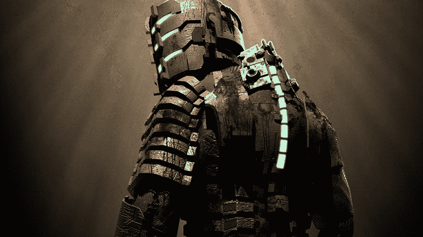
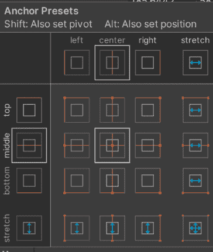

# 用户界面和菜单

视频游戏屏幕上排列的视觉信息和组件集合被称为**用户界面**（**UI**）。一个直观的用户界面和菜单系统为玩家提供了优质体验的机会。这种互动性和游戏可玩结果的直接影响被称为**玩家代理**。为这种代理设计是创建游戏世界中直观且成功的交互体验的关键。这种代理允许玩家与游戏的叙事互动，并准确地在游戏空间中参与。

您游戏中的用户界面和菜单系统也提供了玩家便利性。玩家便利性是与玩家沟通如何在游戏中使用对象，传达控制方式，并从游戏开始到结束导航游戏世界的方式。

游戏菜单系统特别赋予玩家对各种游戏模式的控制权。这些游戏模式向玩家表明何时开始，以及游戏开始前、进行中和结束后可用的选项和动作。让玩家进入游戏很重要，但在游戏过程中，您的界面可能对体验更为重要。

用户界面的四种形式是：**叙事性**、**非叙事性**、**空间性**和**元**。花一些时间来分解这些 UI 定义将更好地理解我们将在项目中如何使用它们。然后我们将查看每个的脚本编写，以提供一个正确实现它们的想法。

本章将涵盖以下主题。

+   定义 UI

+   UI 元素

+   我们项目中的 UI

+   Unity 画布系统

+   Unity UI 对象

让我们先解释一下用户界面。

# 用户界面

用户界面的需求是一把双刃剑。您需要设置用户界面功能以使体验继续进行，但如果不正确执行，这也可能很容易让玩家从该体验中分心。并不是总有一种机制可以用来教玩家如何与他们正在玩的世界互动。这可能会破坏沉浸感，这并不总是坏事，但需要理解如何在不破坏体验的情况下打破这种沉浸感。

我们将讨论 UI 的四种形式，这些形式被分为两个定义空间，**叙事**和**内部**。**叙事**适合 UI 驱动的叙事，而**内部**是游戏世界本身的功能性 UI。

当阅读用户界面的各种形式时，请记住，这些并不是详尽的解释，而更多的是作为一个工具来帮助设计适合您希望提供的体验的正确 UI。

当我们正在通过 **叙事界面**、**非叙事界面**、**空间界面** 和 **元界面** 形式时，我们将解释 UI 如何适应一个简单的 2x2 图表，该图表表示内部和叙事功能。下面的 2x2 网格，在 *图 8.1* 中，是 UI 整体视图的视觉表示，以及如何将其整合到整个游戏体验中。在接下来的段落中，UI 形式的每个部分标题也将补充一个“如果这样，那么就那样”的双答案响应。


图 8.1：2x2 用户界面设计

在上面的 2x2 网格上用 **是** 或 **否** 回答叙事和内部问题有助于我们了解需要哪种 UI 形式。随着我们详细描述这四种形式，请跟随我们的描述。

## 叙事 – 叙事是，内部是

将内部和外部空间融合的用户界面被称为 **叙事界面**。这种类型的界面承诺在提供玩家所需信息以理解内部游戏空间的同时，不会打破沉浸感。

你可能想要传达玩家需要前往的位置，但同时又想给人一种困难的感觉。在故事中，你可以给玩家一个方向并提供指南针。当你按下按钮拉起指南针时，这就是在不脱离内部空间的情况下给玩家提供信息。我们将在讨论剩余的四种类型时考虑这个指南针，看看我们能否将其转换为另一种类型。

现在我们已经解释了叙事界面形式，让我们来看一个在已发布游戏中存在的优秀例子。当解释叙事界面时，会想到一个令人毛骨悚然的电子游戏，名为 *Dead Space*。艺电（Electronic Arts，简称 EA）的 Visceral Games 工作室（于 2017 年 10 月 17 日解散并合并到 EA Vancouver 和 EA Montreal）创造了一款粗糙、生存宇宙恐怖视频游戏，该游戏从其他恐怖作品如 *Resident Evil 4* 和 *Silent Hill* 系列中汲取灵感。

Visceral Games 的游戏设计师需要考虑玩家如何能够将视线集中在屏幕的正中央，并尽可能多地集中注意力在那里。这样，玩家可以同时见证 *Dead Space* 世界的丑陋、跳跃惊吓、血腥和恐怖，并导航 Isaac Clarke 的叙事。Isaac 是 *Dead Space* 的主角，也是那位不幸的太空船系统工程师，在多年的时间里被卷入各种不幸的情况。

在一个角色扮演游戏中，你如何做到让玩家需要知道的大量信息得以呈现？你将重要的玩家信息放在角色本身上。这样做的话，信息就会变成屏幕上的第三人称视角，让玩家仍然能够看到屏幕及其环境。艾萨克的健康指示器位于他脊柱上发光的节点上，如*图 8.2*所示，而静止计则集成在他的右肩胛骨上，呈现为一个部分发光的圆形环。现在玩家不需要从主要角色上转移视线就能知道他的健康和角色统计数据。



*图 8.2*：死亡空间健康可视化

## 非叙事式 – 叙事否，内部否

看着网格，你可能想知道，如何拥有不在叙事或游戏空间中的 UI？这是一个很好的问题，而且比你想象的更常见！几乎每个菜单系统和不集成**抬头显示**（**HUD**）都是非叙事式的，如*图 8.3*所示。在游戏中按下播放键不是游戏叙事的一部分，但它确实是游戏的一部分，也是重要的一部分。


*图 8.3*：Forza 非叙事式 HUD

让我们思考一下罗盘，看看我们能否将其转换为一个非叙事式 UI 元素。它的目的是帮助玩家知道去哪里的方向。我们能否在不让游戏角色意识到它的情况下做到这一点？你可以制作一个迷你地图，显示玩家需要去的方向，并在屏幕上将其形状设计成罗盘。既然已经定义了这一点，我们就决定可以将罗盘转换成非叙事式形式。在生产的许多例子中，非叙事式 UI 元素有很多，但我们最喜欢的一个是在赛车游戏 UI 中。*Forza*有一个干净的 UI，显示了你的档位、速度和在世界中的位置，以帮助你沿着迷你地图上的路径前进。

## 空间 – 叙事否，内部是

这是一个有趣的用户界面设计案例。空间 UI 存在于游戏世界中，但游戏内的角色并没有意识到它们的存在。

再看看罗盘，也许我们希望它具有空间感。我们如何在角色没有意识到的情况下传达我们需要去的方向？

地面上可能有一个投影罗盘，显示下一个航点或目标的方向。它只有在玩家从角色上方俯视时才会出现，所以它不会总是干扰游戏的整体玩法。游戏中最好的空间 UI 元素之一在*暗黑破坏神*中。地面上放置的物品有一个彩色尖塔来表示特定的物品类型，而物品的名称则描述了该物品可能是什么，如*图 8.4*所示。


图 8.4：流放之路空间物品名称

游戏中的角色并不知道这个屏幕，但它位于游戏空间中，因为你需要将鼠标移过它才能查看。

## 元 – 叙事是，内部否

对于用户界面来说，元界面很有趣，因为我们不能在游戏世界中拥有界面，但角色需要了解它。如果我们看看我们的指南针示例，并尝试将其转换到元空间，我们需要更深入地思考。在角色意识到场景的同时直接与用户互动，打破第四面墙是相当独特的。让我们试试看。

屏幕的外围区域包含指南针度数，并跟随角色的旋转。角色查看他们的指南针，你可以看到由于屏幕 UI 的原因，方向是否接近正确的位置。这很麻烦，并且感觉不直观。

在第一人称射击游戏中，元界面的一个更好的例子。你有没有玩过 FPS 游戏并且被击中过？屏幕周围会出现血迹和红色的边缘。角色知道他们被击中了，通常会发出声音；元 UI 让玩家知道如果他们继续被击中，就有死亡的可能性。显示给玩家的摄像头不是玩家的视角，我们知道这一点，但我们的渲染通过带有血迹的边缘，使其变暗并增强，给人一种戏剧性的生命终结焦虑感。


图 8.5：使命召唤元界面 UI

我们刚才讨论的是设计方法，以了解您的 UI 元素向用户显示什么。如图所示，有几种方法可以分解 UI 元素。现在我们将讨论游戏 UI 开发中的一些常见术语。

# UI 元素

在任何游戏中都会使用到一些常见的 UI 元素。无论是主菜单、库存系统、生命值表示，还是空间物品交互系统，它们都只有一个目的：尽可能多地给玩家提供信息，同时不会过多地影响他们的沉浸感，以免让他们从体验中脱离出来。

在接下来的几节中，我们将涵盖之前提到的主题。这些是用户界面的通用术语，不应被固定化。这些是针对游戏开发用户界面部分现有常见主题的设计思路。

在考虑未来的游戏项目时，将这些部分用作设计参考。我们将从**主菜单**开始；巧合的是，这是玩家首先看到的菜单。

## 主菜单

当游戏加载完成后第一次弹出游戏菜单时，这是开发者第一次有机会创造情感反应。你的游戏是恐怖游戏吗？字体和图像应该反映这一点。有许多设置菜单的方法。在你选择角色登录之前，你需要一个新闻屏幕弹出吗？当你按下播放时，主菜单直接进入游戏吗？游戏是否专注于菜单系统，需要多层菜单？所有这些问题都是合法的。

建立菜单系统的最简单方法就是确保它不会使游戏难以以预期的难度或连接性进行游戏，如果它是多人游戏的话。我们倾向于称之为“**低门槛**”。如果玩家想进来按下播放而不查看设置，他们应该能够做到。这包括查看推荐规格并构建系统以允许这样做。

玩家的体验不应该依赖于他们理解自己的系统可以处理什么。思考这个问题的好方法是从街机或游戏机中的游戏体验。PlayStation 和 Xbox 要求游戏开发者确保帧率要高，以保证体验达到良好标准。PC 和移动设备也应该如此。

## 背包系统

还有其他类似但不是初始玩家体验一部分的菜单系统形式。**角色扮演游戏**（**RPG**）通常使用一种背包系统，以盔甲或装备的形式显示你存储在角色上的物品。这可以用作瓶颈系统，迫使玩家回到城市出售或升级他们的装备。它也可以用来帮助定义体验，因为角色在漫游世界时不可能同时携带 30 套盔甲和 200 件武器。这是试图在打破沉浸感和保持现实感之间找到平衡。

一些有趣的背包系统形式是任务日志和成就。任务日志只是可以完成或通过完成所需任务删除的任务清单。成就则相反，通过执行某些任务来获得。

## 健康表示

健康可以表示为“剩余生命”，例如在《超级马里奥兄弟》中。它也可以表示为你可以被击中的次数，例如在上述《死亡空间》的参考中。它甚至可能不是通过一个特定的值来表示，而是通过屏幕上的血量，如在《使命召唤》中看到的那样。更抽象的是，不是健康，而是一个屏幕上剩余时间的计时器，显示你完成任务或关卡还有多少时间。所有这些都可以被认为是健康表示，并且可以在屏幕上使用我们之前提到的任何形式来显示。

## 物品交互系统

在你的游戏中，可能会有一些物品需要玩家获得一些帮助才能知道它们是可以交互的。有两种主要的方法来处理这个问题，它们都可以是空间性的。有时这将是非叙事的，我们将在下一节中讨论。

一种方法是在屏幕上创建一个仅在鼠标或十字准星覆盖物品时才可用的工具提示。这通常是在你希望某物与特定物品相关时。这可以在工具提示在屏幕空间中完成时进行——这意味着它始终是相同的大小，更像是浮动窗口。这与上面 Path of Exile 图像中展示的概念相同。你也许还会看到在物品周围或上方浮动的一个图标。这可能是为了让玩家知道他们可以与之交互。这些在本质上相似，但屏幕空间表示它不是世界的一部分，角色也不知道它的存在。这使得它是非叙事的。第二个例子是图标在物品上方浮动，它是空间性的，因为它在世界中显示出来，但角色并不知道它的存在。

# 我们项目中的 UI

我们的项目不是用户界面密集型的。我们故意想要尽可能保持轻量，以在环境中创造紧密的沉浸感。为了尽可能保持轻量，我们有三大部分要讨论。

+   主菜单

+   退出菜单

+   空间 UI

首先，我们将讨论主菜单以及它是如何从游戏开始时就让我们沉浸其中的。

## 主菜单

我们的主菜单将主要是一个非叙事菜单系统。从应用程序开始，Myvari 将在森林中看着她的书。菜单将位于左侧，提供**标题**、**播放**和**退出**选项供选择。当按下**播放**按钮时，会有相机移动和一个小型电影动画，触发游戏的开始。从**播放**按钮按下后， cinematic 动画结束，Myvari 开始她的空闲动画，这时我们的角色就会获得控制权。这个系统给人一种感觉，就像是在这个世界中一样，因为相机在场景转换时不会变黑，但它既不是世界的一部分，也不是叙事的一部分。Myvari 并不知道菜单系统的存在，它也没有以任何方式影响游戏世界，因此它是非叙事的。下面我们展示的 *图 8.6* 是一个没有所有艺术作品的草稿，以说明逻辑。这在游戏开发中是一个常见的策略。在接下来的章节中，我们将讨论实际 UI 的实现。


图 8.6：主菜单草稿

我们喜欢这种 UI 的概念，它能让玩家感觉他们正在玩的游戏立即就能沉浸其中。当你点击**播放**时，菜单应该消失，摄像机应该移动到一个位置，然后你就可以控制主要角色。目标是不要有加载屏幕。尽可能让玩家保持参与。

## 逃脱菜单

为了尽可能提供沉浸感，我们希望利用我们角色个性的核心特征之一：探索。对我们来说，这意味着我们需要让她的右腰上的书成为她游戏体验中行进的一部分。我们也知道我们需要在游戏中设置某个地方，我们也可以把设置放在书中。这是空间性的，因为它打破了游戏的沉浸感，因为设置不是叙事的一部分。当 Myvari 翻到日记本的**选项**部分时，这会感觉足够不连贯，但对于习惯于玩游戏的人来说却是熟悉的。这部分将是空间性的，因为它属于世界的一部分，但 Myvari 不知道这是一个关闭游戏的菜单。当她处于左侧面板时，这些都是故事驱动的元素，是世界的组成部分，Myvari 和玩家都在用它作为前进游戏的线索。在这种情况下，我们将称这个菜单部分为“存在”，因为我们将会选择艺术作品，好像来自 Myvari 种族的人制作了这本书。

我们将如何实现这一点是通过一个小型的电影动画，Myvari 拉出书并打开到日记本，这会根据你在游戏中的位置进行小更新。这本书有艺术作品看起来像她没有在其中写东西，但她的种族中的另一个人写了。这本书很旧，并引导她来到这个洞穴。将会有带有小笔记的标记来帮助玩家指引，如果需要的话。这是一个线性进程游戏，所以我们将在每个里程碑或子里程碑时更新这个内容。如果她站着不动，我们也会让她拿出书并阅读，这将使书的沉浸感与她的日记更紧密地结合，以尽可能保持体验的一致性。


图 8.7：日记本 UI 原型

日记本对我们来说是一个有趣的菜单系统。它不仅作为逃脱菜单，还向玩家提供了更多关于 Myvari 正在经历的游戏参与度的线索。*图 8.7* 上方展示了我们的原型，我们用它来可视化它可能的样子。这有助于我们了解如何放置摄像机，同时也帮助动画师知道如何动画她从枪套中拿出书。

## 空间提示

在设计玩家反馈时，有相当多的选项，正如我们在指南针问题中看到的那样。在我们的案例中，我们考虑了如何最好地展示与环境交互的能力。我们决定采用一个空间系统。这个系统将以所谓的工具提示的形式出现。这个工具提示是一个小图标，位于玩家可交互的 GameObject 之上的世界空间中。我们选择使用空间系统来保持项目在世界的空间内，以便为 UI 元素提供空间上下文；然而，我们不想让它成为叙事的一部分。这允许我们使用一点沉浸感破坏，与游戏的其他部分形成鲜明对比。当玩家看到工具提示弹出时，这将很有趣。我们可以在整个垂直切片中使用这个系统！我们正在创建一个简单的关键物品示例，它将在游戏世界中漂浮，但 Myvari 不会知道它的存在。这允许我们创建一个健壮的系统；如果我们选择为不同类型的交互使用不同的按钮，我们只需更换正确的按钮图标即可。


图 8.8：空间 UI 原型

这个非常粉红色的圆圈只是一个物品占位符，稍后将成为我们的指示器。由于它是明亮的粉红色，所以后来不会将其误认为是“完成”的物品！

我们已经讨论了用户界面的定义，并解释了我们项目对 UI 的使用。现在我们需要花些时间来回顾我们是如何使 UI 工作的。

# Unity UI

在我们完全深入到我们项目中的 UI 实现之前，我们将回顾 Unity UI 系统的基本知识。这将让你了解我们在系统中使用哪些项目，以及一些我们未使用但在你以后的项目中可以使用的项目。使这个系统工作有两个主要部分：

+   Unity 画布系统

+   Unity UI 组件

在我们开始用代码实现 UI 之前，我们需要先详细了解一下 Unity 的画布系统，这样你就可以在尝试添加艺术之前对其内部工作有一个良好的基础。

## Unity 画布系统

Unity 将其 UI 放置在画布系统中。这是一个具有默认多个组件的 GameObject。要创建画布，在**层次结构**窗口中右键单击，然后选择**UI**，然后**画布**。这可以在下面的*图 8.9*中看到。


图 8.9：创建画布的菜单

当这个创建完成后，你将有一个`Canvas` GameObject 和一个`Event System` GameObject。如果在该级别上已经有一个`Event System`，则只会创建`Canvas`。

`Canvas`有一个`Rect`变换，它还有一个`Canvas`组件、一个`Canvas Scalar`组件和一个`Graphic Raycaster`组件。我们将详细探讨每个组件，以解释它们的作用。

如果场景层次结构中已经存在另一个，则还可以创建一个`Event System`。这将容纳对 UI 的输入消息。

如果你正在使用新的输入系统，请确保点击此处，并将`StandaloneInputModule`替换为`InputSystemUIInputModule`。这允许事件系统知道项目中正在使用哪些输入系统。

我们为什么不逐个查看组件，从`Rect`变换、`Canvas`、`Canvas Scalar`开始，然后更详细地查看`Graphic Raycaster`呢？

### Rect 变换

画布本身有一个`Rect`变换，但它的目的是作为其他 UI 的父级，所以它的`Rect`变换需要是只读的。在画布上右键点击，选择**UI** > **Button**，在画布内创建一个子按钮，这样我们就可以清楚地查看`Rect`变换。

在下面的*图 8.10*中，你可以在检查器中看到按钮的`Rect`变换组件，你可能期望看到常规的`Transform`组件。我们仍然在我们的`Rect`变换中有位置、旋转和缩放选项，但我们还有宽度、高度、中心点和锚点。

当与 UI 一起工作时，最好将缩放设置为*1*、*1*、*1*。这允许画布在需要时设置缩放。通过宽度值和高度值进行尺寸更改是最安全的。

旋转将从中心点位置旋转，这是一个小蓝色圆圈，可以通过**中心点**字段的值进行更改。


图 8.10：Rect 变换组件

位置字段将设置 GameObject 的本地位置。当你需要更改 UI 元素的尺寸时，最好使用`Rect`工具而不是缩放。在场景视图中，有一个`Rect`工具按钮，如图 8.11 所示，它允许你更改 UI 的尺寸，这将更新位置、宽度和高度。


图 8.11：在所选按钮上使用的 Rect 工具

UI 元素的中心点是一个*x*或*y*值，它是元素宽度和高度的归一化值。这意味着两个值都是 0.5 将中心点放置在宽度和高度的 50%，即项目的本地中心。

最后一个独特的项目是锚点。锚点设计用来允许 UI 元素保持位置不变，即使画布缩放。这可能会发生在你有多个设备或分辨率变化的情况下。有**锚点**选项**最小值**/**最大值**，这将设置每个锚点为其相应的归一化值，类似于中心点位置。手动这样做有时需要一点时间，所以我们有一个方便的工具来简化这个过程。如果你点击**Rect 变换**的左上角，它将打开一个有用的工具，允许你从常见的锚点选项中进行选择。

这看起来就像下面的**图 8.12**。



图 8.12：锚点常用选项

这个工具允许你选择你正在工作的 GameObject 最常用的锚点位置。主要有两种锚定类型：**位置**和**拉伸**。这个工具中间的 3x3 网格将确保相关的 UI 在屏幕分辨率不同于你构建的分辨率时不会拉伸或改变。只有在分辨率不会发生剧烈变化的情况下，这是一个好选项。第二种类型是拉伸，位于右侧和底部边缘。如果你的游戏是以 1920x1080 分辨率构建的，并且玩家选择在超宽显示器上玩游戏，你可能希望允许某些 UI 元素进行一些缩放。如果是一个 16:9 宽高比的 4k 显示器，那么你可能需要考虑拉伸所有元素；否则，UI 将显得非常小。

锚定是一种艺术形式。上面概述的技巧会对你大有裨益。正确锚定的最佳方法是使用编辑器玩游戏并调整大小。它可能不会给你每一个场景，但它会给你一个很好的视角，了解 UI 元素如何对分辨率变化做出反应。

### 画布组件

画布组件只包含一些选项，但它们至关重要！在下面的**图 8.13**中，你可以看到我们将要讨论的部分。


图 8.13：画布组件

我们有**渲染模式**，下面有一些选项：**像素完美**、**排序顺序**和**目标显示**。之后，我们有**附加着色器通道**。让我们逐一查看这些选项。

#### 渲染模式

可以选择三种渲染模式：**屏幕空间 - 覆盖**、**屏幕空间 - 摄像头**和**世界空间**。它们各自有特定的用途，游戏可以在其世界中拥有多个画布，以满足其需求。随着我们逐一介绍它们，考虑一下我们如何在我们的当前项目中使用它们。在描述完所有 Unity UI 的功能后，我们将进入实现阶段。

##### 屏幕空间 - 覆盖

这是一个常见的画布渲染模式。这个模式的好处是它可以在自己的场景中使用，并在运行时以增量方式加载到你的游戏中。这使得你可以轻松地创建与 PC 监视器菜单系统分开的移动菜单。这非常有效；然而，它应该只用于简单的 UI。如果你打算拖动 UI 元素或从鼠标上下文（如悬停）动画它们，那么最好使用**摄像头**选项。

这种类型画布的一个好例子是主菜单或 HUD，它不太具有交互性。

##### 屏幕空间 - 摄像头

与叠加选项一样，如果你将要制作利用`EventTrigger`类的函数，这是一个非常好的模式。你也不能像叠加模式那样实例化它。它必须已经在场景中，并且有一个它将引用边界范围的相机。它将附着到相机上，所以如果你做出这个更改而它从你那里消失，双击你的相机，它就会出现在那里！

这种模式的绝佳例子类似于 ARPG，你需要拖放装备来装备物品。

##### 世界空间

当你需要一个位于世界空间的菜单时，这种画布渲染模式会被使用。最好的解释方式是通过最佳用例。当你想在空间中角色的头上显示聊天气泡时，你会使用它。你可能希望在 UI 中可选择的标志，这可能会使用一个**世界空间**画布。如果这个标志有文本或其他形式的 UI 附加到它上，那就更好了。

#### 渲染模式选项

在**渲染模式**下方有三个选项：

+   **像素完美** – 仅在你在 2D 空间内工作，且 UI 需要精确到每个像素时使用。它有助于将 UI 开发到创建中的像素限制。

+   **排序顺序** – 默认排序顺序设置为在**画布**下的层次结构中工作。一个项目在层次结构中的位置越高，它将被渲染得越早。你可以通过输入一个值来覆盖它。较低的值将首先渲染。较高的值将被发送到列表的较低位置。如果你想让一个单独的项目始终在后面，只需将值设置为`999`，它将始终在其他人之后渲染，无论层次结构顺序如何。

+   **目标显示** – 如果你需要第二个显示器的另一个 UI，则应使用此选项。你可以将其设置为仅在第二个显示器上显示。这可以用于多达八个显示器。这种用例可能是类似于赛车游戏的游戏，这些游戏通常使用三个弯曲的显示器。

#### 额外的着色器通道

当处于叠加模式时，UI 通常不会包括法线、切线等。使用*图 8.14*中显示的下拉菜单来选择它们。


图 8.14：额外的着色器通道选项

如果你需要在 UI 元素中特别需要它们，则需要选择这些。否则，请将其保留为**无**。

### 画布缩放器

此组件负责确保具有此组件附加的 GameObject 下的所有子 UI 对象的比例正确。它不仅负责缩放 UI 本身，还负责字体大小和任何附加到图像上的图像边框。

Canvas Scaler 组件有几个独特的参数。它们根据选择的 UI 缩放模式放置在窗口中。有三种 UI 缩放模式。

#### 常数像素大小

当你需要保持像素大小不变，而屏幕发生变化时，会用到这个选项。这个用例是如果你知道你将使用单一分辨率来玩游戏。如果你的游戏可以缩放，那么你必须通过动态设置缩放因子，并确保每单位像素相同来工作。这些参数在下面的*图 8.15*中可以看到。


图 8.15：画布缩放组件常量像素大小 UI 缩放模式

如果你认为你的游戏在任何时候都会进行调整，那么请考虑使用**根据屏幕大小缩放**选项。

#### 根据屏幕大小缩放

当你选择**根据屏幕大小缩放**时，与**常量像素大小**选项相比，会出现不同的参数。如下面的*图 8.16*所示，我们有**参考分辨率**、**屏幕匹配模式**、**匹配**滑块和**每单位参考像素**。


图 8.16：画布缩放组件根据屏幕大小缩放模式

+   **参考分辨率** – 你期望最常用的屏幕分辨率。从那里，它将根据玩家可能使用的不同分辨率进行缩放或放大。

+   **屏幕匹配模式** – 包含三个选项：

    +   **匹配宽度和高度** – 当宽度和高度发生变化时，这将允许应用程序匹配宽度和高度的混合比例。整体来说，这个选项效果不错，直到你遇到超宽显示器。这也是唯一一个**匹配**滑块可用的选项。在接下来的两个选项中，这个滑块将不可见。

    +   **扩展** – 这意味着画布会放大，但不会小于参考分辨率。这对于扩展宽度和高度的需求来说非常出色。这是我最喜欢的选项之一。

    +   **缩小** – 这个选项与**扩展**选项类似，但它会缩小而不是超过**参考分辨率**。这效果很好，但你必须从高分辨率开始工作。

+   **每单位参考像素** – 这个选项指的是每厘米有多少像素（这是一个 Unity 单位）。当你使用精灵选项制作 2D 游戏时，这一点非常重要。如果你的精灵设置为每单位 100 像素，而此**每单位参考像素**设置为 50，则你的精灵将比预期大两倍。

#### 常量物理大小

这与**常量像素大小**模式类似；然而，它使用物理单位，如下面的*图 8.17*所示。你可能更习惯于使用这些单位而不是像素来设置大小。


图 8.17：画布缩放组件常量物理大小

如果这些单位更适合您使用，请确保您更改所有字体的缩放比例到这些刻度。物理选项的列表如下所示，在*图 8.18*中。


图 8.18：物理单位选项

使用这些选项中的任何一个都会迫使您更改所有 UI 项目，以适应相同类型的刻度单位。例如，以像素为单位的大小通常是 300 宽，而 300 厘米则非常巨大！刻度可能应该是 0.1。因此，我们建议您在您的系统中进行工作，并了解如果您想从一开始就使用这种缩放模式，您将使用哪种刻度。

最后一个组件是**Graphic Raycaster**。这是与画布一起提供的倒数第二个默认项目。让我们解释一下**Graphic Raycaster**是如何与画布一起工作的。

### Graphic Raycaster 组件

此组件是在画布上创建的。这样做的原因是，它是您鼠标点击的功能。以下是在*图 8.19*中**Graphic Raycaster**的可用参数：


图 8.19：GraphicRaycaster 组件

这里有三项参数需要快速浏览。

+   **忽略反转图形** – 此参数确保您不能点击被反转的对象。请记住，相机中裁剪了背面。您可以通过翻转它们来关闭 UI 的元素，但即使这样检查，它们仍然可以点击。

+   **阻挡对象** – 这允许在 UI 前面的 2D 或 3D 项目阻挡点击 UI。默认为`none`。

+   **阻挡遮罩** – 此参数允许您放置图层以阻挡 UI。由于 UI 是精灵，它们通常是矩形，并且可以相当容易地重叠。为了解决这个问题，您可以创建一个 UI 阻挡层，这将允许您放置对象在前面以阻挡点击，即使它是不可见的，alpha 值为 0。

我们花时间介绍了这些默认项目，因为它们是您开始使用 Unity 的 UI 时将看到的初级项目。随着您创建更多的 UI，您将有机会学习更多选项，但这个基础将帮助您开始。接下来，我们将探讨一些要添加到画布中的 UI 对象。

## Unity UI 对象

我们现在有一个画布了！这很好，因为我们已经了解了它是如何与动态分辨率一起工作的，以及如何为您的游戏需求设置它。现在我们需要添加一些对象，使其变得有用。Unity UI 对象分为两种类型：**视觉**和**交互**。

视觉元素正是您所期望的。它们是仅作为视觉元素的项目，但它们可以附加到交互元素上。以下是一些这些对象的示例，包括描述和视觉示例：

+   **图像** – 有两种图像类型：**原始图像**和**图像**。**原始图像**仅用于您不需要边框的地方；然而，通常最好只使用**图像**对象。**图像**可以接受精灵，并且可以为其添加边框。您还可以在检查器中的**图像**组件内着色精灵。还有一个名为**面板**的另一个 UI 选项。这是一个带有图像组件的 UI 对象，设计为 UI 面板。**图像**和**面板**之间的唯一区别是**面板**默认将设置为拉伸并填充整个画布。


图 8.20：默认图像和图像 UI 组件

+   **遮罩** – **遮罩**组件将剪除其下方的 GameObject。这对于遮罩掉可能不想看到的下方额外项目非常有用。下面，我们在图像上添加了一个遮罩，并在其下方添加了另一个图像。轮廓是遮罩；应该为正方形的图像由于遮罩而顶部和底部被裁剪。


图 8.21：来自图 8.20 的遮罩默认图像

+   **文本** – 这就是文本！有时这也被称为**标签**。如果您需要，您可以为您的 UI 添加特定的字体。当您创建它时，您将在文本选项后看到**TextMeshPro**。这是由于**TextMeshPro**（**TMP**）非常受欢迎，以至于它已被集成到 Unity 的核心功能中。


图 8.22：TextMeshPro UI 组件

交互式项目可以包含视觉元素，但它们带有交互`UnityEvents`。以下是一些示例，包括描述和视觉示例：

+   **按钮** – 这个交互对象在其层次结构中默认带有标签。它还带有点击时的`UnityEvent`。如果它被高亮、按下或禁用，它具有着色能力。这是 UI 交互的主要功能。


图 8.23：按钮 UI 组件

+   **下拉列表** – **下拉列表**是一个用户可以选择的预定义选项组字段。当用户更改此值时，它将触发`OnValueChanged` `UnityEvent`。


图 8.24：下拉列表 UI 组件

+   **输入字段** – 这是一个标准的输入字段，用户点击进入或“聚焦”到它。有一个我们想提到的有趣属性，称为**内容类型**。这允许开发者进行错误检查，而无需编写代码。例如，将其设置为**整数数字**将只允许用户输入数字。这个交互式对象有两个`UnityEvents`：

    +   `OnValueChanged` – 每次发生更改时，这将返回当前输入值中的字符串

    +   `EndEdit` – 当用户点击其他位置或失去对该输入字段的关注时，这将返回字符串

    图 8.25：输入字段 UI 组件

+   **滚动条** – **滚动条**通常与**滚动** `矩形`结合使用。其目的是在需要可能很大的字段时作为滚动条。无论滚动条有多大，值都是从 0 到 1。它可以垂直或水平。它还有一个`UnityEvent`，可以用来知道`OnValueChanged`，这样你就可以在移动滚动条时返回值。


图 8.26：滚动条 UI 组件

+   **滚动** **矩形** – 这也可以称为滚动视图。如果需要，可以与两个滚动条结合使用，以设置垂直和水平滚动。这还通过一个遮罩来隐藏遮罩本身之外的信息。它还在**滚动** `矩形`的滚动上有一个`OnValueChanged UnityEvent`。


图 8.27：滚动矩形 UI 组件

+   **滑块** – 这是一个带有可拖动对象的滑块，它将滑块的值从你设置的最低值和最高值设置。它还有一个`UnityEvent`，从那个最小值和最大值返回`OnValueChanged`。


图 8.28：滑块 UI 组件

+   **切换** – 这是一个带有标签的复选框。点击时，可以使用`OnValueChanged UnityEvent`来评估它是开启还是关闭。


图 8.29：切换 UI 组件

+   **切换组** – 如果你将切换添加到一组中，你可以设置该组只允许组内一个切换可被选择。如果你在分配的分组中选择了另一个切换，它将关闭之前开启的切换并开启所选的切换。有一个**允许关闭**选项，它允许你选择当前选中的切换以取消选择所有组。与该组本身连接的`UnityEvent`没有唯一性；然而，每个切换仍然有自己的`OnValueChanged`事件，这将触发。一个小提示，如果你要创建一个切换组，请确保每个切换在其**切换**组件中分配了该**组**。


图 8.30：切换组 UI 组件

这些都是 Unity UI 中可用的 UI 项的好例子。从这里，我们需要通过 Unity UI 的实现来适应我们的游戏。我们之前讨论了设计；现在我们需要查看代码以了解当玩家需要与之交互时它是如何工作的。

## 实现

我们现在需要查看我们的实现。了解所有 UI 对象的外观和它们的目的很有帮助，但我们现在需要看到它们在实际中的样子。我们将从游戏开始前玩家的**主菜单**开始。之后，我们将进入日志或逃生菜单。然后我们将完成与游戏机制交互的空间 UI。

在阅读这部分内容时，请记住，我们不会覆盖脚本的所有行，因为此时我们假设你已经习惯了查看我们在 GitHub 上的代码。

如果在任何时候你对本书如何布局来解释代码感到困惑，确保你调出被引用的脚本并重新调整你的方向。我们以这种方式解释代码的主要目标是尽可能简洁地说明我们在做什么以及为什么这样做。查看每一行代码并不能帮助达到这个目的！

话虽如此，让我们进入主菜单的实现。

### 主菜单实现

由于我们希望这个菜单是非叙事性的，但位于世界空间中以产生空间错觉，我们选择使用**世界空间**画布。在下面的*图 8.31*中是层次结构和带有未更改的折叠组件的检查器。


图 8.31：左，MainMenuCanvas 的层次结构；右，Canvas 的检查器

`MainMenuUIControl.cs`脚本是我们控制主菜单的方式。在处理 UI 时，你需要确保你导入了 UI 库：

```cs
using UnityEngine.UI; 
```

当你使用 UI 库时，你将能够访问所有 UI 对象及其方法。尽管下一行我想要放置在这里的不是 UI 的特定部分，但我想要向你展示我们还没有讨论过的东西。这个方法被称为`FindObjectOfType`。我们知道场景中永远只有一个`MyvariThirdPersonMovement`类，所以我们使用这个方法来获取它，然后请求它的父级，这样我们就知道玩家根。

```cs
playerRoot = FindObjectOfType<MyvariThirdPersonMovement>().transform.parent; 
```

我们还需要禁用角色并为事件系统设置监听器，这样它就知道当我们点击画布中的按钮时要做什么。

要禁用角色，我们有一个我们称之为`on awake`的方法来关闭我们需要关闭的东西。当使用 Cinemachine 时，你想要禁用所有可用的相机，否则 Cinemachine 会转到其中一个相机。然后我们只禁用玩家的控制脚本。这允许角色的动画在原地继续播放，但我们无法控制她。

在`awake`时：

```cs
SetPlayerEnabled(false); 
```

在第 50 行有一个独立的私有实现：

```cs
void SetPlayerEnabled(bool enable)
    {
        CinemachineVirtualCamera[] cams = playerRoot.GetComponentsInChildren<CinemachineVirtualCamera>(true);
        foreach (CinemachineVirtualCamera cam in cams)
        {
            cam.gameObject.SetActive(enable);
        }
        playerRoot.GetComponentInChildren<MyvariThirdPersonMovement>().enabled = enable;
    } 
```

我们之前已经设置了几次监听器，但让我们也看看它们：

```cs
startGameButton.onClick.AddListener(OnStartGameButtonPressed);
quitButton.onClick.AddListener(OnQuitButtonPressed); 
```

这里发生的事情是，对于`startGameButton`和`quitButton`中放置的相应按钮，当它们被点击时，将激活它们监听器中的方法。

`OnStartGameButtonPressed`方法看起来是这样的：

```cs
void OnStartGameButtonPressed()
    {
        SetPlayerEnabled(true);
        Cursor.lockState = CursorLockMode.Locked;
        Cursor.visible = false;
        this.gameObject.SetActive(false);
    } 
```

当它被按下时，将角色设置为启用，这样我们就可以使用输入来移动她，锁定并隐藏鼠标光标，并禁用主菜单，这样你就再也看不到它了。如果你点击退出按钮，你将关闭应用程序。Unity 有一个简单的方法来退出应用程序：

```cs
Application.Quit(); 
```

这就是整个主菜单！我们需要的最难的部分是锁定玩家。否则，当主菜单打开时，他们将是可移动的，而这在我们这个情况下不是我们想要的。接下来，我们需要处理日志。

### 日志实现

在大多数游戏中，有一个常见的概念，即逃生菜单。也就是说，当你按下*Escape*键时，你会遇到一个通常暂停游戏玩法的菜单。在我们的情况下，我们希望当你按下*Escape*时，我们的角色会打开她的书并查看。这将很好，因为它允许游戏暂停一下，当相机移动到书本附近时，我们可以放置正常的逃生菜单选项，如继续和退出游戏。在这里，主菜单中的一些类似概念也会出现，比如锁定和解锁光标。还有一个玩家启用方法，它与主菜单中的方法相同。

下面，在*图 8.32*中，是日志 UI 检查器中层次结构和脚本的另一种表示。在公共字段中，我们使用输入系统而不是仅仅依赖鼠标输入，这是其中独特的一项。

为了加载日志，我们可以按字母*B*或*Escape*键。


图 8.32：左，日志层次结构；右，书籍检查器面板

这本书对我们来说是一个有趣的转折点。与这个脚本相关的所有编码工作都已完成。我建议打开脚本并查看它，以帮助记住之前的编码课程。

最后一个 UI 元素是空间 UI，它帮助玩家知道他们正在查看的项目是可交互的。让我们分解这个实现。

### 交互 UI 实现

这项设置是独特的，因为没有画布用于此项目。我们将有一个单独的 GameObject，它位于场景中，我们将将其移动到所需的位置，并根据我们正在查看的内容打开或关闭它，如果它是不可交互的。我们有一个简单的 GameObject，它是一个没有材质的球体，因此它是明亮的粉色。

在`InteractiveHighlight.cs`脚本中，`on awake`我们找到这个 GameObject 并获取其渲染器。如果没有找到，则我们有一个错误，告诉我们我们找不到它。

我们获取网格渲染器，这样我们就可以在我们不需要看到它时禁用它。

```cs
void Awake()
    {
        highlightIndicator = GameObject.FindGameObjectWithTag("InteractionHighlight");
        if (highlightIndicator == null)
        {
            Debug.LogError("Highlight indicator not found in scene");
        }
        highlightIndicatorRenderer = highlightIndicator.GetComponent<MeshRenderer>();
    } 
```

现在我们有了高亮指示器，我们应该执行指示器的隐藏和移动。我们使用射线投射来知道我们是否击中了可交互的项目或游戏拼图的一部分。这是一个物理方法，所以我们将它放在固定更新中。这将确保代码按照我们在第七章“刚体和物理交互”中讨论的物理更新时间运行。

```cs
void FixedUpdate()
    {
        Ray ray = new Ray(transform.position, transform.forward);
        if (Physics.Raycast(ray, out RaycastHit hit, maxDistance, rayMask, QueryTriggerInteraction.Collide))
        {
            highlightIndicator.transform.position = hit.transform.position + new Vector3(0f, height, 0f);
            if (!highlightIndicatorRenderer.enable
d)
            {
                highlightIndicatorRenderer.enabled = true;
            }
        }
        else
        {
            if (highlightIndicatorRenderer.enabled)
            {
                highlightIndicatorRenderer.enabled = false;
            }
        }
    } 
```

如前所述，这里的固定更新在物理时间上运行，并检查从屏幕中心射出的光线是否击中了两个遮罩上的项目。如果是击中并且距离在最大距离内，则移动高亮的项目并打开其渲染器。如果不是，则关闭它！

# 摘要

本章内容丰富，信息量大。尽管我们只讨论了三个 UI 元素，但我们不得不将其分解成所有这些部分，以帮助您在未来的项目中。您现在也将对其他游戏开发者如何为他们的游戏设计 UI 有一个强烈的认识。在第十二章“最终润色”中，我们将讨论它的清理以及如何通过润色 UI 来改善玩家的体验。在下一章中，我们将讨论视觉效果和一些粒子系统。
