# 视觉效果

目前游戏还没有全部的功能。我们已经从概念到草图，然后将游戏开发到可玩的状态。但这并不意味着我们马上就完成了！我们需要考虑如何让玩家有更多的情感沉浸感。幸运的是，Unity 为我们提供了出色的资源和工具，让我们能够将游戏当前的状态提升到一个新的视觉层次。这是通过各种方式实现的，例如着色器、粒子和其他将在 *第十二章，最终润色* 中介绍的抛光工具。

这些主题非常复杂。目前，我们将通过查看着色器和粒子来概述视觉效果的主要焦点。然后，我们将进一步概述它们的更高级形式。因为我们在这个项目中使用的是 **通用渲染管线**（**URP**），我们将介绍一些重要工具，如着色器图形、VFX 图形和 Shuriken。着色器图形以视觉方式显示着色器的详细信息和编码。VFX 图形是为了帮助你理解 GPU 粒子的各种属性而创建的。Shuriken 是一个以 CPU 为重点的粒子创作工具，在所有渲染管线中都有提供。我们也会介绍这一点。

在本章中，我们将涵盖以下主题：

+   视觉效果概述

+   着色器图形

+   粒子系统：

    +   Shuriken

    +   VFX 图形

# 视觉效果概述

开始使用视觉效果可能会感到有些令人畏惧。我们目前有一个简单的场景。如果不花时间有意识地回答需要解决的问题，世界就不会感觉生动和沉浸。

在这本书中，你已经处理了许多通用的游戏设计问题。你能够自己回答这些问题，并且可以使用它们来完成任何你想要工作的项目。然后，你得到了我们在创建这个项目时自己发现的答案以及它将如何发展。我们对玩家的感受有了一个相当好的想法：用最简单的话说，就是幻想探险。我们现在需要能够遍历我们的场景，找到需要更多幻想的地方。探险是通过机制和叙事设计来完成的。

幻想是一个广泛的概念。我们实际上可以选择任何主题。我们决定克服这个模糊的起点，并找到了一个以古老种族为中心的轻科幻主题。这些生物紧握着他们周围自然空间中天体的力量。与自然合作，他们在某个时刻建造了一个玩家将探索的洞穴。我们需要想出一种方法来通过视觉游戏来体现这种叙事，而玩家接受自己作为这个世界的主角正是我们的目标。

为了执行这种视觉叙事，我们需要整合 Unity 中可用的多种视觉效果工具。Shader Graph 允许我们构建具有有趣属性的着色器，这些属性可以以各种方式与光线和闪烁效果互动。Shuriken 为我们提供了粒子系统，可以添加环境灰尘、围绕生物发光植物的发光粒子，以及其他幻想元素的简单细节。VFX Graph 允许我们将简单的粒子推向极限，并使 GPU 系统发挥作用。通过利用 GPU 系统，VFX Graph 将赋予我们使用许多粒子的能力。尽管这并不实用，但你可能可以生成数千万个粒子。最后，我们将使用 Unity 中的照明为玩家提供查看提示，并设定当前动作、系统或地点的氛围和基调。

为了开始这一章，我们将奠定术语的基础，并详细说明单个视觉效果工具。在这些解释之后，我们可以进一步探讨如何将 Unity 提供的工具整合到我们的工作空间中，以创建一个视觉沉浸式环境。向前推进，这一部分可能成为一个有用的参考点，以便回来重新熟悉工具及其用途。

# Shader Graph

Shader Graph 是一个视觉脚本工具，旨在允许艺术家驱动的着色器创建。着色器是脚本，它告诉图形管线如何渲染材质。材质是着色器的一个实例，它为 GameObject 中的某个网格设置了参数。一个简单的例子是皮革。如果你想到皮革，你可能会想到许多不同类型的皮革。它是哪种颜色？它是闪亮的吗？它有独特的纹理吗？所有这些选项都是着色器中的参数，可以在材质中设置以正确渲染对象。

在 Unity 中，着色器是用**高级着色器语言**（**HLSL**）编写的。正确编写此代码需要详细了解你计算机中的图形管线，这可能有点令人望而却步。图形管线是一个复杂的概念模型。简化来说，计算机通过多个层次和阶段来理解场景中的 3D 视觉图形，然后根据这些信息将那些视觉效果渲染到 2D 屏幕上。

实际上，仅仅阅读上面的段落可能显得有些困惑。这是自然的。这里有很多动态部分，我们将在本章的这一部分中对其进行分解。为了不深入 HLSL，我们将专注于 Shader Graph。如果你在 Shader Graph 中花费了一些时间后想要进入更技术性的职位，我们建议学习 HLSL 并手动编写着色器。一旦你学会了 HLSL 并手动编写着色器，你将拥有一个坚实的通用着色器创建基础。

让我们先通过 Shader Graph 的设置，然后介绍如何创建一个着色器。然后我们应该花一些时间讨论创建着色器时使用的常用基本节点。节点是代码块或代码片段的视觉表示。这些节点可以相互连接，以创建更大功能的视觉分层效果。

## 设置

我们一直在谈论使用**URP**项目，该项目应该已经自动安装了 Shader Graph。如果没有安装，你可以很容易地通过前往**包管理器**并从 Unity 注册表包中安装它来安装它。

*图 9.1* 以下展示了正确安装 Shader Graph 所需的步骤。

如果你像下面图中那样有一个绿色的勾选标记，那么它已经安装好了！

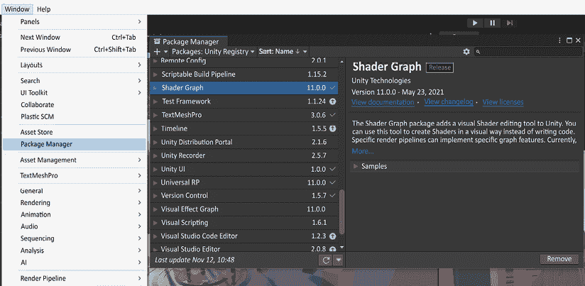

图 9.1：检查 Shader Graph 是否已安装

现在我们已经安装了 Shader Graph 或者验证了它已经安装，接下来让我们继续创建你的第一个着色器。

## 创建

在项目窗口的空白区域右键点击会给你该空间的标记菜单。我们想要创建一个新的着色器，所以我们将鼠标悬停在**创建** > **着色器** > **通用渲染管线**上，然后得到四个选项。这四个选项是 URP 的基本选项，会自动为你设置着色器设置。参考*图 9.2* 了解创建着色器的路径。

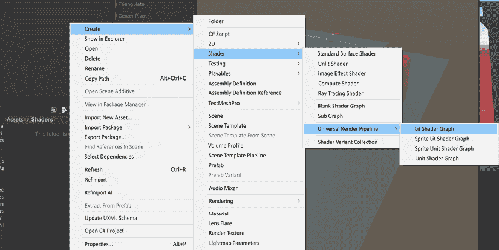

图 9.2：在 Unity 编辑器中创建着色器的路径

你可能想知道，“我应该选择哪一个？”如果是这样，那是一个很好的问题。让我们逐一介绍这四种类型，以防你在我们做出选择后想要尝试其他类型。从上到下，我们有**Lit**、**Sprite Lit**、**Sprite Unlit**和**Unlit**着色器图来使用。让我们按这个顺序逐一介绍这些类型。

### Lit Shader Graph

Lit Shader Graph 允许你使用现实世界的光照信息渲染 3D 对象。使用此着色器的着色器将使用**基于物理的渲染**（**PBR**）光照模型。PBR 模型允许 3D 表面在各种光照条件下具有像石头、木头、玻璃、塑料和金属等材料的照片级真实感。借助 Lit 着色器的帮助，这些对象的光照和反射可以准确地遵循动态变化，例如从明亮的光线到黑暗的洞穴环境。

### Sprite Lit Shader Graph

URP 自带一个 2D 渲染和光照系统。这个系统将用于这种图类型，因为着色器将要渲染的对象将是精灵。精灵是一个二维位图（一个表示每个像素颜色的二进制数据数组），它被集成到一个更大的场景中。这将允许精灵接收所需的光照信息。

### Sprite Unlit Shader Graph

这与上面的着色器光照着色器图类似，但与 Sprite 无光照着色器图的不同之处在于，它被认为是始终完全光照的，并且不会接收任何光照信息。此图也仅使用 URP 中的 2D 渲染和光照系统。

### 无光照着色器图

URP 的无光照类型图使用与光照着色器图类型相同的 3D PBR 光照模型。主要区别是它不会接收光照信息。这是 URP 中最高效的着色器。

## 着色器图界面

为我们的着色器图选择光照着色器图类型。当你右击项目窗口时，将创建一个新的着色器文件。双击此文件将打开**着色器图**窗口。

有一些内容我们需要讲解，以便你能够理解以下小节中涵盖的内容。我们需要讲解**主堆栈**、**黑板**、**图检查器**、**主预览**以及**节点**。在下面的*图 9.3*中，显示了这些部分中的四个。我们将在本章中详细讲解它们。

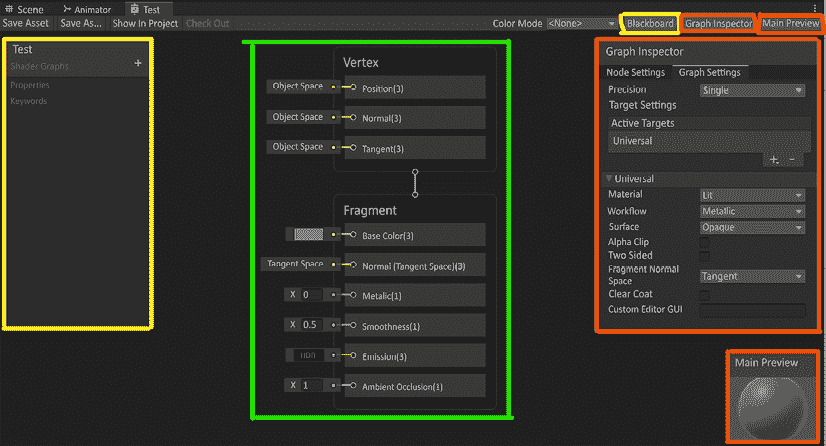

图 9.3：着色器图窗口分解

### 主堆栈

*图 9.3*中的绿色轮廓项是主堆栈。主堆栈分为两部分，**顶点**和**片段**。主堆栈的**顶点**块包含对具有此分配着色器的 3D 对象的实际顶点的指令。在此块中，你可以影响顶点的**位置**、**法线**或**切线**属性。这三个属性在二维和三维环境中无处不在。**位置**表示顶点在对象空间中的位置。**法线**用于计算光线从表面反射或从表面发出的方向。**切线**改变你表面上顶点的外观，以定义对象的水平（U）纹理方向。

在我们的案例中，我们不需要更改任何顶点属性，所以我们将继续到片段着色器部分，并保持对象空间不变。

片段指令可以被视为屏幕上可能的像素。我们可以根据对堆栈输入所做的更改来影响像素。片段着色器中列出的属性取决于我们在创建着色器时选择的着色器类型。

**片段**堆栈内部的块称为片段节点。如果你不需要特定的片段节点，可以通过右击**片段节点**单独选择**删除**来移除它。你也可以通过右击**片段**框架的底部并选择**添加节点**来向堆栈添加其他片段节点。

在*图 9.4*中，你可以看到所有要添加到堆栈中的节点选择。如果你的着色器没有设置为接受那些新的片段节点，它们将呈灰色且不可用。现在，让我们来看看光照着色器片段选项。

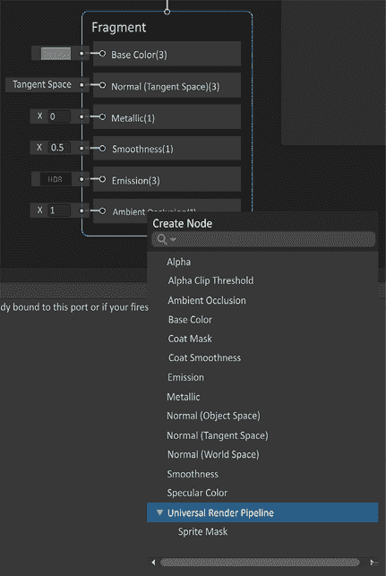

图 9.4：片段节点选项

片段堆栈中的片段节点代表将在裁剪空间或屏幕上潜在显示的像素。3D 对象也有其面的二维表示形式，即 UV。UV 是 3D 对象的二维纹理表示。UV 具有一个平坦的二维轴，从 0（U）到 1（V）的图表。这个特定的 UV 图表是表示在这个 UV 平面上拉伸到 3D 对象上的每个顶点的表示。UV 图表也称为 UV 纹理空间。

查看下面的图 9.5，您可以看到几何体已经被展开以使其扁平。这就像纸艺或折纸。了解这一点为着色器可以如何操纵网格的顶点以及面的颜色奠定了基础。

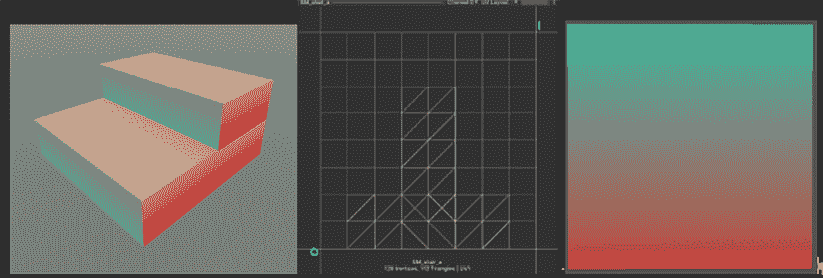

图 9.5：基本网格，UV 布局，基础颜色上的渐变

我们想向您展示我们如何在 Shader Graph 中实现图 9.5 中的渐变。虽然这并不是我们可以从最简单的图表开始的地方，但它很好地分解了一些关键概念。

如果您查看下面的图 9.6，您将看到我们构建渐变的图表，我们将其放置在**基础颜色**中。然后，将渐变应用于我们用此着色器分配的材料的 3D 对象的 0-1 空间。它不是一个复杂的着色器，因为它有从 UV 节点硬编码的渐变。

我们将在下一节中增加我们在**黑板**中设置的参数的复杂性。

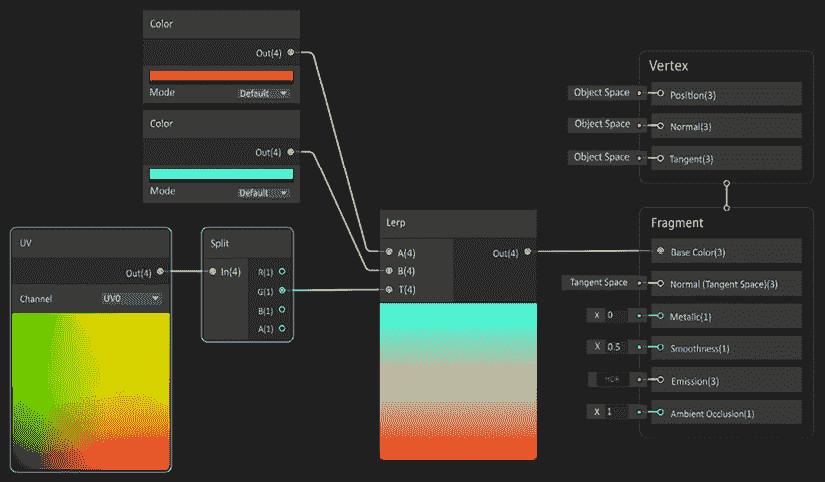

图 9.6：测试渐变着色器

我们将在本章下一部分分解常用节点。现在，快速解释我们所做的工作将有助于分解。

#### 基础颜色

我们正在使用两个渐变，*x*和*y*，在红色和绿色通道中代表 UV 的 0-1 空间。红色和绿色通道是颜色空间的一部分；有**红色**（**R**）、**绿色**（**G**）、**蓝色**（**B**）和**Alpha**（**A**）通道。RGB 代表颜色值。Alpha 通道表示每个像素的不透明度，从 0（完全透明）到 1（不透明）。

我们已经看到，在 Unity 中，0-1 空间从左下角开始，线性地延伸到右上角。这意味着绿色通道将是从下到上的线性渐变。分离该通道允许我们在 Lerp 节点中操作 0-1，用红色代替黑色，用青色代替白色。在接下来的几节中有很多事情要做，但请坚持下去！当我们分解节点时，将更容易逐个节点进行跟踪。

#### 法线

法线告诉每个片段它们应该如何对击中面的光线做出反应。

这对于在不改变轮廓的情况下增加面部细节非常有用，减少了用于更高细节所需的多边形数量。查看下面的*图 9.7*，你可以看到似乎有凸起从立方体中拉出。这不是颜色变化；这是光线对表面反应的结果。如果你仔细看，边缘上没有凸起。这是因为立方体的形状没有改变。这只是一个立方体，由于法线贴图的作用而表现出这样的效果。

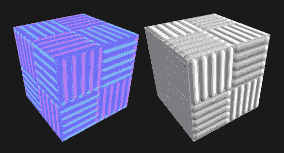

图 9.7：立方体上的法线

在*图 9.7*的左侧，左边的立方体由于法线贴图使用其从切线空间的 RGB 通道中的颜色方案而呈现蓝色。这意味着一个平坦的法线贴图将代表*0*，*0*，*1*。红色和绿色通道用于表示光线在*x*切线或*y*切线上的作用方式的变化。当我们处理*第十二章*中的材质时，*最终润色*，我们将更详细地介绍法线图的功能。 

#### 金属

金属材质听起来就是这样的。这就是这种材料的金属感！但这并不是一个很好的定义，所以让我们试着稍微分解一下。

金属字段是一个从 0 到 1 的标量浮点数，0 表示非金属，1 表示裸金属。金属材质会吸收其周围环境的颜色。在*图 9.8*中，我们有四个球体，它们的材质属性有四种不同的设置。我们只使用 URP/Lit 着色器来测试这些设置。对于这一部分，我们只查看左侧的两个球体。最左侧的球体是白色，金属设置为 0。这种材质没有吸收任何环境的颜色。它只吸收光照信息及其基础颜色白色。

第二个球体，尽管它仍然以白色为基础颜色，但金属设置为 1。平滑度设置为 0.5 以保持中性，你很快就会了解更多关于这一点。如果你仔细看，第二个球体有 Unity 默认的天空盒的颜色。现在我们需要在这个材质中加入平滑度。

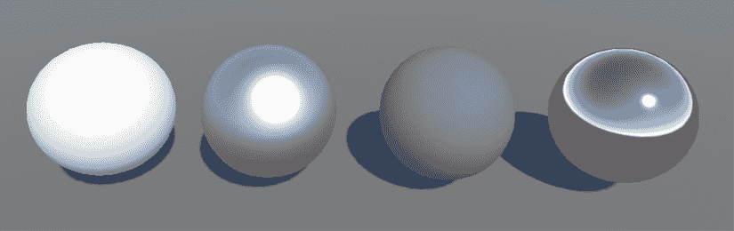

图 9.8：从左到右：无金属，全金属，全金属不光滑，全金属全光滑

#### 平滑度

继续查看*图 9.8*，我们将转向右侧的两个球体。从左数第三个球体非常有趣。这个球体的基础颜色是白色，金属设置为 1，平滑度设置为 0。这意味着整个球体是完全漫反射的！在这个例子中，漫反射意味着环境中的所有颜色在整个球体上混合，导致几乎完美的真正中性灰色。第四个球体也是一样的，但平滑度设置为 1。这意味着整个球体正在反射直接的环境。

#### 发光

为了使一个物体发出或辐射光线，你将目光投向一个**发射贴图**。发射贴图的作用是能够将颜色推到比 1 更亮的值。超过 1 的值允许物体的这部分发光。这对于熔岩、科幻灯光或任何你想发出亮度的东西很有用。否则，片段节点默认为黑色，不会创建发射。

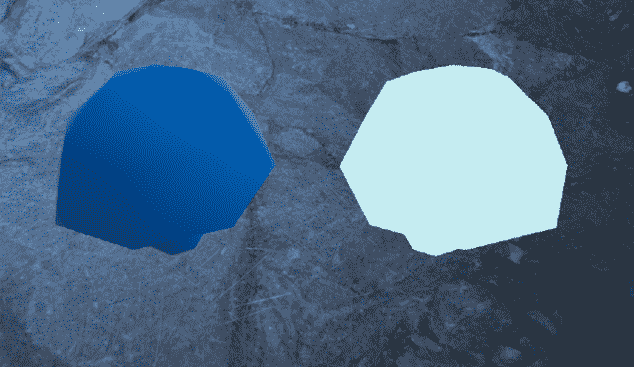

图 9.9：左无发射，右有发射，强度为 2.4，无辉光

这看起来不像一个发光的蘑菇！这是因为发射需要后处理体积。为此，创建一个空的 GameObject 并命名为`_PostProcess`。我们这样命名是为了给它一个独特的名字。使用下划线作为前缀，我们让我们的开发者知道这个对象只包含逻辑。在游戏中没有用于使用的 GameObject。然后添加一个**体积**组件，如下面的*图 9.10*所示。

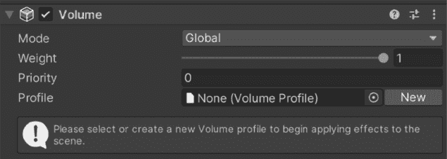

图 9.10：添加到后处理 GameObject 的体积

我们还没有完成！我们需要添加一个配置文件和一个覆盖来设置我们的辉光。按下**体积**组件右侧的**新**按钮将创建一个配置文件以添加你的设置。这允许你存储这些设置以供其他场景使用。当你添加一个配置文件时，你将能够添加一个覆盖。

我们想要点击**添加覆盖**，然后**后处理**，最后**辉光**。然后选择`强度`布尔复选框以允许更改强度。将其更改为`1`。设置如下在*图 9.11*所示。

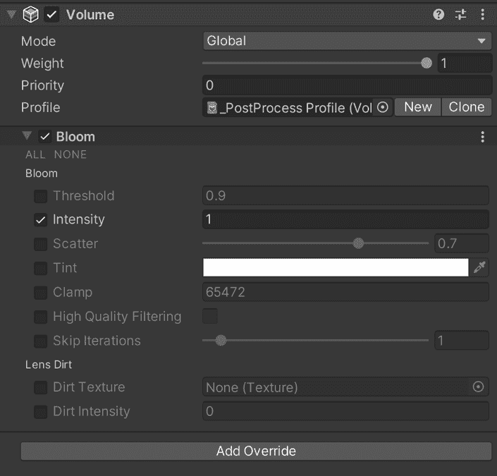

图 9.11：后处理体积的辉光覆盖

现在，我们看到它在屏幕上的蘑菇周围发出光线。这不是在场景中添加光线；它只是在网格外部添加一个亮度值到屏幕上的渲染中。

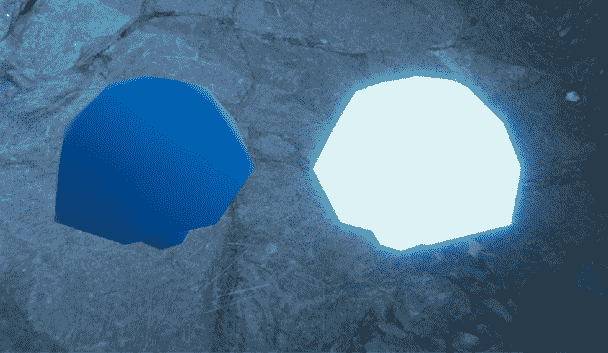

图 9.12：左无发射，右有发射和辉光设置

我们有一个闪亮的发光蘑菇！去添加发射吧！我们现在将探讨**环境光遮蔽**。

#### 环境光遮蔽

**环境光遮蔽**（**AO**）的作用是在某些部分添加暗点以显示皱褶。即使没有特定的光源产生阴影，这也能添加一个干净、美观的阴影效果。AO 是为所有角度的光设计的。这个属性期望的值在 0 到 1 之间。如果你没有为你的模型创建 AO 贴图，最好将其设置为 1。在*第十二章*，*收尾工作*中，我们将使用 Myvari 的材料，它将包含一个 AO 贴图来覆盖。

这就是总结中的主堆栈。堆栈上的每个属性都可以用来提供独特的着色器。有助于进一步定制的还有着色器图中的**黑板**部分。

### 黑板

**黑板**允许用户创建可以在着色器中使用的属性和关键词，这些属性和关键词可以以各种方式动态更改。属性可以在着色器内部使用，或者通过**暴露**复选框将其暴露给检视器中的材质。

您可以在**着色器图**窗口的右上角找到**黑板**按钮。一旦点击此按钮，**黑板**将打开其自己的独立 UI。

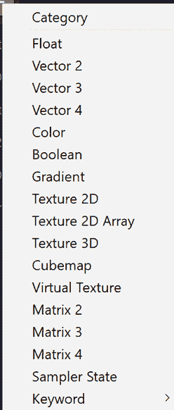

图 9.13：黑板中可用的变量类型

有 16 种可创建的数据类型。这些数据类型可以在运行时通过脚本进行更改。关键词设计为在运行时按材质实例进行更改。由于编译器需要考虑所有变体，因此此选项只有少数几个。这对于像移动规格这样的东西很有用。您可以为不同的系统创建枚举（用户定义的约束集）或列表，以更改着色器的保真度（感知质量），以适应平台限制。

### 图检视器

**图检视器**提供了对着色器类型的选项。我们选择从 URP/Lit 着色器作为基础开始，这会在**图检视器**中为我们设置特定的设置。下方的*图 9.14*显示了**图检视器**。这些是 URP/Lit 默认设置的设置。

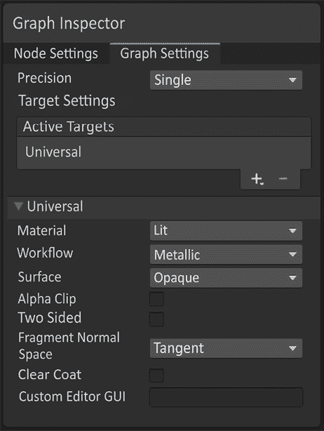

图 9.14：图检视器

我们构建的着色器中可用的每个属性在特定情况下都有很大的用途。当我们讨论在*完成细节*中使用它们时，我们将解释为什么我们要更改图设置。现在，了解我们选择的材质是**Lit**选项，它默认为金属不透明的工作流程。这意味着您看不到其后面的物品的颜色，因为它不透明。

### 主预览

**主预览**是对着色器在游戏中外观的整体查看。默认是一个球体。

您可以在窗口中右键单击以访问多个选项，例如在*图 9.15*中提到的包含自定义网格。

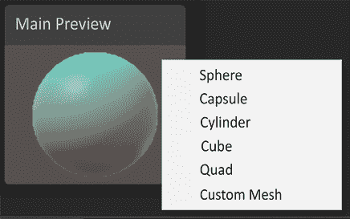

图 9.15：着色器图中的主预览及其选项截图

在将节点连接到主堆栈之前，此预览将默认为灰色球体。接下来，让我们谈谈节点！

### 节点

```cs
Figure 9.6 to play with the gradient yourself. 
```

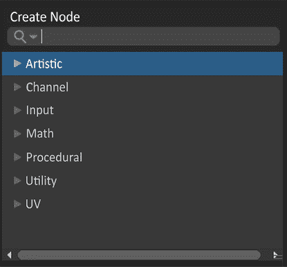

图 9.16：节点创建菜单

如果您花了一些时间来构建这个内容，您可能也打开了一些节点分组，并意识到有非常多的节点可供选择。这可能会引起一些焦虑。幸运的是，在下一节中，我们将介绍一些在许多着色器中常用的节点。

## 常用节点

以下是一个用于制作着色器的常用节点简单列表。我们想强调，这并不是节点的完整列表。实际上，在 Shader Graph 10+中现在有超过 200 个节点。详细地介绍它们可能相当于一本书或两本书的内容。这些节点集的有趣之处在于，它们可以被构建起来制作一些令人难以置信的着色器。在阅读这些内容时，请注意，前一个节点中可能包含有助于描述当前您正在阅读的节点的信息。即使您对如何添加等操作相当熟悉，也请通读所有内容。

### 添加

为了能够解释**添加**，我们需要确保您记得 0 代表缺席，或者在这个情况下是黑色。这意味着 1 的值是白色。我们在许多应用中在 0-1 的尺度上归一化我们的值。您可能记得 UV 坐标也是在 0 和 1 之间。这不是错误！所以，如果我有两个标量，或者`Vector1s`，并将它们相加，值会更大。

让我们通过一个快速示例来展示：0.4 + 0.4 = 0.8。

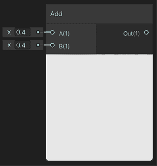

图 9.17：添加节点

0.4 是一个比中等灰色更暗的值。如果我们把它们加在一起，我们几乎可以得到白色！0.8 在值上是 80%的纯白色，如图*图 9.17*所示。

### 颜色

这个节点是一个带有良好视觉糖的 Vector4。Vector4 (*0*, *0*, *0*, *0*) 在着色器值中代表红色、绿色、蓝色和 Alpha。**颜色**提供了一个界面供您选择所需的颜色，并且它会为您设置 RGB 值，同时使用 Alpha 滑块设置该值，并输出一个 Vector4\。

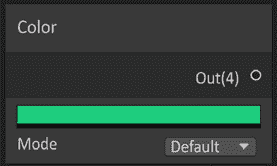

图 9.18：颜色节点

使用 Vector4 节点来做这个可能会很困难，因为没有颜色视觉来知道您的值需要是什么。

### Lerp

**Lerp**代表**线性插值**。Lerp 节点可以在许多应用中使用。一个例子是如何在*图 9.6*中设置用于基础颜色的渐变。它有三个输入：A、B 和 T。您可以将 A 视为 0，B 视为 1，T 是驱动器。驱动器（T）是一个 0-1 之间的值。然而，这个值将映射到 A、B 以及它们之间的值。如果 T 为 0，它将显示 A 的 100%值。如果 T 的值为 1，它将显示 B 的 100%值。现在，如果 T 为 0.4，那么它将在 A 和 B 的值之间：40%的 A 和 60%的 B。

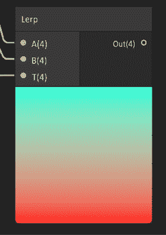

图 9.19：Lerp 节点

仅用数字很难可视化这一点。幸运的是，在 *图 9.19* 中，我们使用了 UV 将 T 作为渐变输入。这使我们能够看到从底部到顶部的 0-1 渐变。你看到的是从 A 到 B 的渐变，从底部到顶部。

### 乘法

我们已经看到了 **添加** 和 **线性插值** 节点；现在我们需要处理另一个操作，**乘法**。根据基本算术的性质，**乘法**会使值降低。

这是因为我们处于 0-1 的范围内。让我们在 *图 9.20* 中放一个例子。

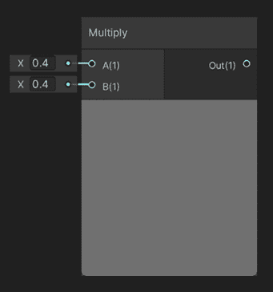

图 9.20：乘法节点

我们使用了与添加节点相同的示例，但我们使用乘法而不是加法。简单的数学运算表明 .4 * .4 = .16。

### 样本纹理 2D

这个节点允许你使用在其他 **数字内容创作** （**DCC**） 软件中创建的纹理，例如 Photoshop，并使用颜色信息来操纵主堆栈的属性。有两个输入，你想要采样的纹理和 UVs，如 *图 9.21* 所示。

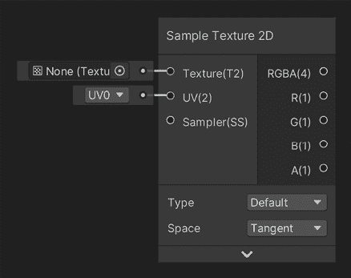

图 9.21：样本纹理 2D

UV 节点允许你操纵网格的 UV 坐标。这个节点的优点是它不仅输出 Vector4，还从节点本身输出每个浮点数。

### 饱和

有时候，你的值可能会超过 1。这可能是由于你正在处理多个节点，这些节点将你的值推到了 0-1 范围之外。

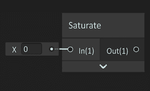

图 9.22：饱和节点

如果发生这种情况，你可以将数据输入到一个饱和节点中，它将返回所有值在 0-1 范围内。将浮点值放在 **输入** 部分，**输出** 值将被归一化到 0-1 范围。

### 分割

正如我们在 **样本纹理 2D 节点** 中看到的，Vector4 被分割成单独的输出。这并不总是这种情况。**颜色**节点只输出 Vector4。如果你只想从 **颜色** 中使用红色通道值，你该如何获取它？你猜对了，使用一个分割节点。输入一个 Vector2、3 或 4，并使用你想要的任何通道作为浮点数。

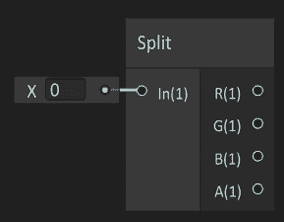

图 9.23：分割节点

这对于能够从你放置了四个灰度图像的图像中提取出来非常有帮助。我们称之为 **通道打包**，这样你就可以在一个纹理查找中放置三幅图像。

### UV

有时候你需要操纵你想要渲染的对象的 UVs。一个原因可能是因为你想要平铺 UVs，因为项目的比例比预期的要大或小。使用 UV 节点的另一个原因是它会自动创建水平和垂直渐变。

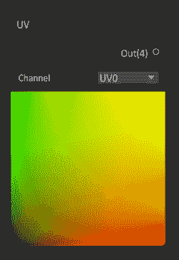

图 9.24：UV 节点

如果分割，R 通道是水平渐变，G 通道是垂直渐变。

### 向量

这些节点无处不在。你会注意到 Vector1 被命名为**Float**。Vector1 的另一个名字是 Scalar。你可能还注意到输出都是不同的颜色。Float 是青色，Vector2 是绿色，Vector3 是黄色，而 Vector4 是粉色。了解这些颜色在节点之间的连接线上是如何显示的非常有用。这些节点在无限的使用案例中都有应用。你需要三个数据点吗？Vector3！

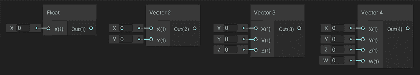

图 9.25：向量节点

使用所有这些基本节点，你可以制作一些强大的着色器，用它们来制作美丽的材质。在*第十二章*，*收尾工作*中，我们将介绍用于多种目的的着色器，并展示我们如何使用这些节点来创建一些漂亮的视觉效果。现在让我们从着色器图离开，开始处理粒子系统，以便我们可以为我们的体验添加一些漂亮的视觉效果。

# 粒子系统

当你想到视频游戏中的视觉效果时，最可能首先出现在你脑海中的可能是 ARPG 中传奇武器的尾迹或来自紧张的第一人称射击战役中的惊人爆炸。无论你脑海中浮现的是什么，都有系统可以允许这些效果发生。粒子系统允许根据特定规则生成网格，以创建这些效果。Unity 中有两个系统是 Shuriken 和 VFX 图。

## Shuriken

这个系统充满了帮助生成 3D 网格（定义 3D 对象的顶点、边和面的结构集合）的功能。你可以创建火花、尾迹、爆炸、烟雾以及所有其他有助于增强所定义体验的东西。正如你在*图 9.26*中看到的，有很多选项需要探讨。我们将把这个解释留给*第十二章*，*收尾工作*中创建基于 Shuriken 的效果时涵盖的例子。

一些关于 Shuriken 的高级知识是，它是一个使用 CPU 来引导粒子的粒子系统。

这限制了可以在该硬件上直接生成粒子的数量。

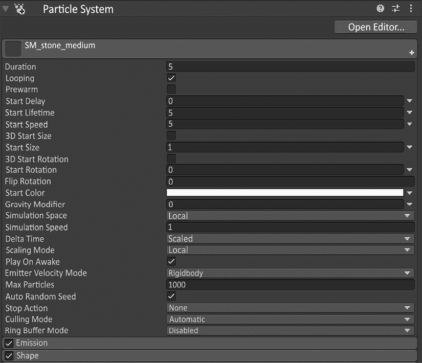

图 9.26：Shuriken 粒子系统

Shuriken 对于 CPU 上的粒子系统非常出色，但如果你想要有大量粒子四处移动，VFX 图就是最佳选择。这可以驱动 GPU 粒子，并且可以同时处理成千上万的粒子。

## VFX 图

首先，您很可能会需要安装 VFX 图。像之前一样打开**包管理器**，然后在**Unity 注册表**中找到**视觉效果图**并安装它！完成此操作后，您需要创建一个 VFX 图系统。在您的项目窗口中右键单击，然后选择**创建** > **视觉效果** > **视觉效果图**。

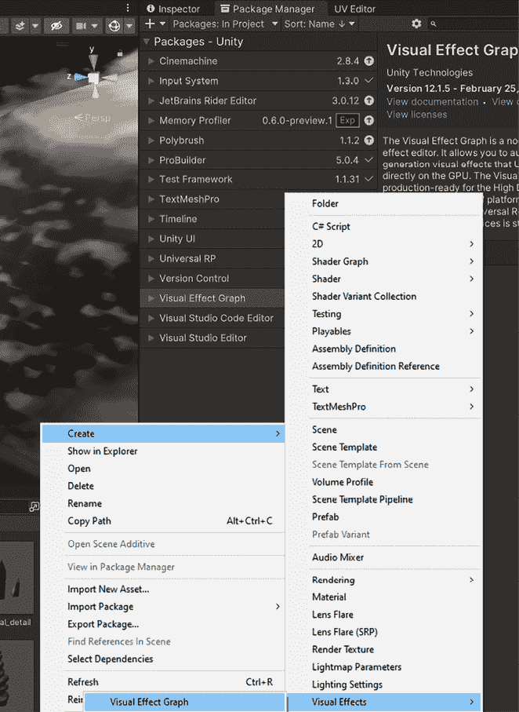

图 9.27：安装和创建您的第一个 VFX 图系统

打开 VFX 图将为您显示一个新窗口。这个窗口就像**着色器图**。您会注意到有一个**黑板**，我们可以用它来创建可以在运行时更改的参数，并在检查器中公开。

有一个独特的 UI 和几个特定术语：**上下文**、**块**、**节点**和**变量**。**上下文**是将系统分解的部分，例如**生成**、**初始化**、**更新**和**输出**。

这些**上下文**中每个都包含**块**，可以通过右键单击将它们添加到**上下文**中。**生成****上下文**控制有多少个系统的实例输入到**初始化****上下文**。**初始化****上下文**处理**生成事件**并启动一个新的粒子模拟。**更新****上下文**接收**已初始化**的粒子并在某些条件下执行显式行为。**输出****上下文**负责模拟数据，并根据**输出****上下文**配置渲染每个活着的粒子。然而，**输出****上下文**不会修改模拟数据。

第一个上下文是生成。这个上下文将允许您添加块来影响每个系统的生成逻辑。这里有一些应该考虑的问题：从这个系统中应该生成多少个粒子？这些粒子应该多快生成？它们何时生成？

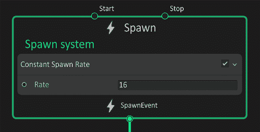

图 9.28：生成上下文

生成完成后，您需要有一些参数来初始化它们。这些块回答这些问题：粒子在哪里生成？它们是移动生成还是有速度？每个粒子能存活多久？

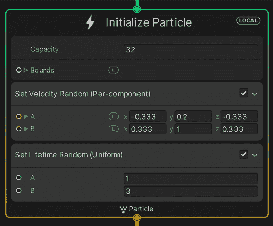

图 9.29：初始化上下文

现在您已经让它们开始生成，可能有必要在它们更新时添加一些独特的行为，否则它们将只是漂浮的球面渐变。您可以期待这回答一个终极问题：粒子将如何随时间变化？

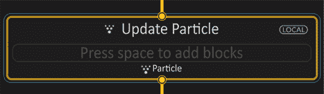

图 9.30：更新上下文

最后，当您了解了有多少粒子，粒子在哪里，以及粒子在做什么后，您现在可以决定它们的看起来会是什么样子。

问题是：粒子面向哪个方向？使用了哪种着色器？

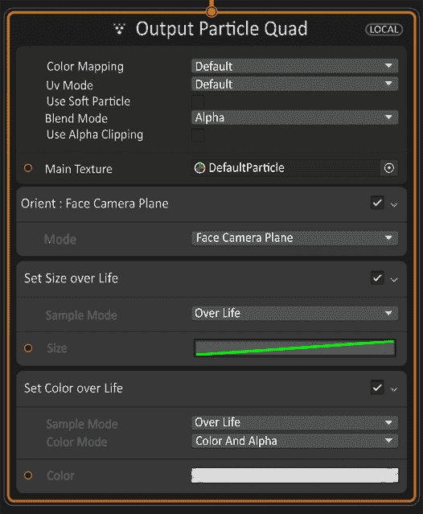

图 9.31：输出上下文

你可能已经注意到，块状图左侧有时会有类似着色器图的圆形输入。如果你认为你可以将这些输入放入其中，也许是从节点来的，那么你是对的！有一些节点你可以通过它们来获取正确流向每个上下文块的数据。

### 节点

由于这是在着色器图中，节点的作用是获取数据值并以某种方式操作它们，以获得期望的结果。在 VFX 图中，值被用来读入其中一个块，而不是从**主栈**中的一个属性。在大多数情况下，你将利用**运算符**节点和在**黑板**中创建的变量来完成复杂的数学运算。

# 摘要

我们通过 Unity 中的两个主要来源了解到视觉效果有重大的技术影响：着色器和粒子。我们花时间在着色器上，构建了一个 3D 对象上的材质示例，以便在有多种不同场景时，我们可以追踪着色器的创建过程。这是通过着色器图完成的。之后，我们深入探讨了粒子的概念。Shuriken 被用来获得对 CPU 粒子的简单理解，将在后面的章节中用来解释细节。GPU 粒子是通过 VFX 图创建的；我们讨论了 VFX 图的界面和一些词汇，以便在以后使用时，有一个理解来工作。

视觉效果是一个非常大的主题，要掌握它需要很长时间。当你处理这个主题时，请慢慢来，快速失败。这将帮助你理解视觉效果。

下一章将介绍游戏中声音的实现。声音通常在游戏快结束时才被注意到，但它们对于确保产品与环境和角色有吸引人的情感联系是至关重要的。下一章我们将讨论实现、一些声音设计和其他与声音相关的知识点。
