# 10

# 声音效果

声音效果！声音是唯一来自真实世界并进入游戏的部分。使用麦克风，声音设计师将录制常见的视频游戏声音，如配音、音乐、UI 声音、武器和环境声音，以帮助使游戏栩栩如生！声音往往对玩家对视频游戏质量的感知有非常微妙的影响。游戏中看起来不错的动画，其声音效果也只能与其声音一样好。

在本章中，我们将讨论选择或设计声音的五个要素。这些是**源**、**包络**、**音高**、**频率**和**分层**。理解这五个要素将为你提供一个坚实的基础，以确保你的声音适合我们迄今为止所工作的叙事、角色、环境和机制的整体设计。然后我们将讨论如何在游戏引擎中通过我们的代码和混音来扩展这些元素！声音在单个声音效果的基础上讲述故事，同时也共同讲述一个更大、更深入的故事。最后，我们将通过我们项目中的具体声音设计示例以及它们在 Unity 中的实现来探讨。这些示例包括魔法声音、脚步声和环境声音。以下是本章的简要总结：

+   声音设计的五个要素

+   规模化设计

+   我们项目的声音设计和实现

+   通过玩家交互触发声音

# 声音…设计？

声音设计！它是视频游戏中被遗忘的次子，但也是它们的灵魂和情感。

声音设计的简单解释是，声音被录制、处理，然后直接编码到游戏中。因此，这使得声音成为视频游戏中唯一直接来自真实世界的部分。

本章中提到的任何声音都可以在 `/Assets/Sounds/[Name]` 中找到。

# 声音设计的五个要素

我们将要讨论的声音设计要素包括源、包络、音高、频率和分层。这些适用于制作单个声音效果的过程，以及声音在游戏中的更广泛作用。

## 源

源可以是一个人、一个地方或一个事物，它是你灵感的来源或获取途径。你的源是帮助你的听众理解你声音的真实世界特性的东西。如果你录制了脚步声击打草地表面和混凝土表面的声音，这两种声音之间的细微品质和差异帮助我们区分它们。因此，我们可以利用源作为创造我们声音的真实性的创造性限制。

限制是艺术家用来从我们的大脑中剔除所有杂乱，以帮助创造他们愿景的工具。因此，在我们的录音过程中，如果我们需要在视频游戏中录制神奇的水声，我们会先录制一些水声作为基础层。或者，如果我们想要录制一只狗在泥地里打滚的动画声音，首先和最好的录制内容就是狗在泥地里打滚的声音。我们正在为哪些声音创作帮助我们选择要录制的内容！

录制声音可能是一个困难的过程，它背后有着完整的艺术形式；虽然它将有助于你作为声音设计师的成长，但我强烈建议使用现有的声音库。几乎你能想到的任何声音都已经有人录制过了，所以直接在网上购买或下载声音更有意义！这将极大地加快你的工作流程。如果你不想使用声音库，那么你可以使用麦克风！使用麦克风是一个非常深入的过程，我们在这本书中不会涉及，因为你可以真正地写整本书来介绍这门艺术。

这里有一些流行的免费网站和声音库：

+   Blipsounds: [`blipsounds.com/community-library/`](https://blipsounds.com/community-library/)

+   Andrew V Scott: [`www.andrewvscott.com/Building-A-Large-SFX-Library-for-Free`](https://www.andrewvscott.com/Building-A-Large-SFX-Library-for-Free)

+   SKYES Audio: [`www.skyesaudio.com/blog/2019/4/1/the-ultimate-free-sound-effects-list-free-to-download`](https://www.skyesaudio.com/blog/2019/4/1/the-ultimate-free-sound-effects-list-free-to-download)

+   Freesound: [`freesound.org/`](https://freesound.org/)

通过一些网络搜索，你还可以找到更多。不要害怕四处寻找适合你需求的东西。

在视频游戏中，声音效果来源通常由你视觉上看到的内容决定。对于一个施放冰风法术的冰法师，你会限制自己只使用风和冰的声音来开始。如果你有一把由果冻制成的枪，它用放射性屁的力量射出小马，你可能会利用果冻、马、放屁和枪的声音。

那么，如果我们拿一把带有金属纹理的魔法剑，以及沿着剑刃运行的紫色魔法 VFX 效果，我们将寻找什么样的声音呢？你可能已经想到，我们将使用魔法声音库和一些金属的叮当声。

另一种确定声音来源的方法是通过故事背景。同样的魔法剑可能看起来很神奇，但也许游戏的编剧决定剑使用的是未来魔法，因此你需要使用科幻声音元素。

应该提到的是，有许多游戏在声音上有限制，必须填补这些空白。一个模仿 Atari 2600 图形并具有真实声音设计的游戏可能需要一些想象力。玩家行走的绿色区域可能是草地或有毒垃圾场，这取决于游戏世界的背景。

## Envelopes

包络是声音设计师用来解释声音随时间变化的音量的方式（这里的音量是指分贝，而不是 3D 模型）。你将使用的包络的两个部分是“攻击”和“释放”。

攻击，如图 10.1 所示，是声音的开始，释放是声音的结束。我们通过速度（即快和慢）来描述声音的攻击和释放。

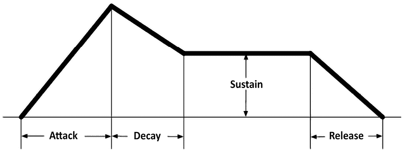

图 10.1：包络解释

### 攻击

具有慢攻击的声音的例子可以是当剑在空中挥舞时产生的“剑啸”声效果。声音一开始几乎听不见，在半秒内逐渐增加音量。我们可以通过让音量在几秒内增加来使攻击变得更慢。你可以在*图 10.2*中直接看到包络在波形中的样子。具有较慢攻击的声音往往对玩家来说显得更微妙和温柔。其他一些具有慢攻击声音的例子包括汽车经过或水壶准备鸣哨。

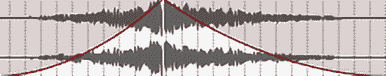

图 10.2：快速攻击声音

类似于*图 10.2*中快速攻击的例子，可以是击打声效果。声音一响起，几乎就是最大音量，创造出瞬态声音。瞬态声音是一种攻击速度较快的声音，对玩家来说似乎更具侵略性，通常用来传达力量或震惊玩家。其他一些具有快速攻击声音的例子包括枪声、如图 10.3 所示的钹声，或者锤子击打铁砧的声音。

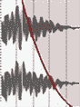

图 10.3：快速攻击的钹声示例

### 释放

然后是我们有声音的释放。正如你可能猜到的，我们将使用速度来确定释放的性质。具有较慢释放的声音的例子可以是汽车引擎关闭或爆炸声。大多数音效都将具有较慢的释放，因为它听起来更吸引人。

在视频游戏中，你将听到的具有短释放的例子并不多。在音效中，硬截止通常在大多数情况下听起来不自然且令人不快，除非是一些高级的样式化技巧。具有慢释放的声音可以是巨大的钟声响起，或者汽车驶入远处的声音，同时你听到声音的音量逐渐消失。为了举例说明，这里是一个慢释放的例子：

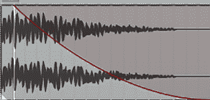

图 10.4：慢释放声音

这里是一个快释放的例子：

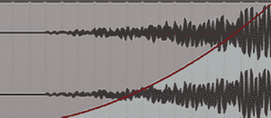

图 10.5：快释放声音

声音的另一个元素是音高。

## 音高

音高是决定声音“高低”的元素。

这可能是我们通过电影、视频游戏甚至日常生活中的体验，最容易理解的概念之一。在动画电影中，一个高大健壮的角色通常会有低沉的声音，而一个较小、可爱的角色可能会有尖细的声音。

上面给出的例子是控制声音效果音调的最常见原因之一——大小。另一个原因是速度。想象一辆慢慢行驶的汽车和一辆快速行驶的汽车。行驶速度较快的汽车发动机转速较高，而闲置或缓慢移动的汽车则会发出低频的风箱共鸣声。

要完全理解音调，了解频率会有所帮助，因为它们直接相关。

## 频率

频率是解释起来最复杂，但也是理解起来最重要的元素之一。你可能已经在汽车或立体声音响中听过音乐，并看到过控制“低音”或“高音”的选项。高音指的是“较高频率”，而低音指的是“较低频率”。人类的听觉范围是 20 Hz 到 20,000 Hz（赫兹），许多声音，无论听起来是高音还是低音，都会触及每一个频率。当你在你车里播放声音并降低“低音”时，你实际上是在降低较低频率。

最好的例子是白噪声。白噪声简单地说就是以相同音量播放每个频率的声音。如果你从未听过它，它听起来就像电视静电。你可以在`/Assets/Sounds/WhiteNoise.wav`中听到这个声音。你可以在 GitHub 上的项目中找到它，这本书的*前言*中有一个链接。

这个声音奇怪的地方在于，仅仅通过听，它感觉主要由高频组成。但我们可以使用一个叫做均衡器（或简称 EQ）的工具来可视化正在播放的频率，以及控制单个频率的音量。

通常，较高的频率会被感知为较响亮，这在为你的游戏制作声音时是一个重要的考虑因素。如果你想使某个声音突出，包括较高的频率会有很大帮助，而去除它们可能会帮助将声音融入背景。但如果你想让每个声音都突出，同时还想让它们有重量和力量，我们就必须利用我们的低频。因此，必须找到一个平衡点。

这张图上的黄色线条表示频率的冲击点，你可以看到在整个频谱上几乎处于相同的音量。这意味着每个频率通常具有相同的音量。

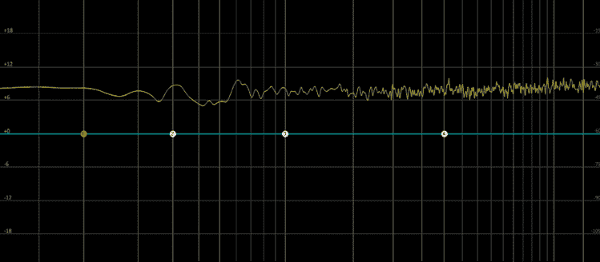

图 10.6：相似频率音量示例

我提供了一些声音，这样你们在移除高低频时可以听到差异，同时还有一个图表显示我们移除了哪些频率。当你听的时候，你会听到并看到每个声音似乎都覆盖了一定程度的高低频，我们可以控制这些频率，以每个声音唤起独特的感受。

听一下`Assets/Sounds/Explosion.wav`然后是`Assets/Sounds/ExplosionLP.wav`，以了解高频被截断后的声音效果。然后听一下`ExplosionHP.wav`，以了解低频被截断后的声音效果。

听一下`Assets/Sounds/BeamSword.wav`然后是`Assets/Sounds/BeamSwordLP.wav`，以了解高频被截断后的声音效果。然后听一下`BeamSwordHP.wav`，以了解低频被截断后的声音效果。

听一下`Assets/Sounds/MagicIceSpell.wav`然后是`Assets/Sounds/MagicIceSpellLP.wav`，以了解高频被截断后的声音效果。然后听一下`MagicIceSpellHP.wav`，以了解低频被截断后的声音效果。

听一下`Assets/Sounds/Footstep.wav`然后是`Assets/Sounds/FootstepLP.wav`，以了解高频被截断后的声音效果。然后听一下`Assets/Sounds/FootstepHP.wav`，以了解低频被截断后的声音效果。

频率之所以是最难掌握的概念之一，是因为你的耳朵没有经过训练去聆听它。我们只是听到一个声音，就知道它听起来好不好。

## 层次

层次是五个元素中最容易理解的概念。虽然视觉媒介几乎都是乘法关系，但声音媒介是加法关系。层次简单来说就是以独特的顺序同时播放多个声音的过程。接下来，我们有四个独特的音效，它们各自独立。我们有“冲击”、“绽放”、“尾音”和“低音”。如果你单独听每个音效，它们会感觉空洞，但当我们把它们全部加在一起时，我们就得到了一个美丽的爆炸声。

这是一个有用的过程，因为我们可以从“科幻能量”和“金属剑”这样的源文件中提取，将它们结合起来制作一个“科幻能量剑”。或者，我们可以拿我们的马屁枪，根据枪的描述和功能来选择我们的层次。听一下`Assets/Sounds/ScifiEnergySword01.wav`，然后是`Assets/Sounds/ScifiEnergySword02.wav`，然后是`Assets/Sounds/ScifiEnergySword03.wav`。

层次还允许我们将频率分解成更独立的部分。我们可以将主要包含低频的声音添加到常规声音中，以增加它的重量和力量。听一下`Assets/Sounds/Splash01.wav`，然后听一下添加到`Assets/Sounds/Splash02.wav`中的低频，以了解它如何变得更强大。

我们还可以将两个具有不同包络的音效叠加在一起，一个具有较长的攻击时间，另一个具有较快的攻击时间，以创建一个酷炫的累积效果，增加冲击力。在添加累积效果之前，请听一下`Assets/Sounds/EarthSpell01.wav`中的声音，然后听一下`Assets/Sounds/EarthSpell02.wav`，以了解添加累积效果后会发生什么，这样我们可以了解如何改变我们声音的故事！

现在我们已经了解了构成声音的要素以及它们如何应用于单个音效的创建，接下来我们将探讨这些五个要素在游戏更广泛的应用。

# 规模化设计

与艺术不同，制作音效是一个完全累加的过程。例如，如果我们有 100 个声音，但没有注意它们的音量或频率范围，这可能会导致很多杂音。在视频游戏的空间中，我们必须为任何声音做好准备，无论是剑挥舞声、环境音、管弦乐或旁白，都要同时播放。我们有工具可以单独控制这些声音，但我们必须确保我们有一个所谓的平衡混音。

如何为游戏制作声音

那么声音在你的游戏中应该放在哪里呢？声音往往会被忽视，因为从技术上讲，它们不是制作“游戏”所必需的。正因为如此，立即考虑哪些需要声音，哪些不需要是很困难的。

简单来说，我喜欢寻找游戏中任何移动的元素。甚至包括最小的细微之处。为 NPC 添加声音可以包括呼吸声、他们的脚步声击打地面的声音、衣服的沙沙声... 所有这些都可以是游戏中可行的声音。我们将在第十一章中讨论一些原因，说明为什么如此关注细节可能很难实现。

有时游戏中的艺术表现是简约的。你所看到的信息并不足以提供足够的信息，因此请发挥你的想象力，思考可能包含哪些声音！你添加的声音越多，效果越好。有时一个游戏可能仅仅是像素艺术，你可能会被鼓励添加较少的声音，但你应该始终思考你能听到的细节，而这些细节是看不到的！如果玩家掉入你无法看到的地方，创造一个可听到的体验可以讲述比视觉更详细的故事！也许有尖刺、无底洞或熔岩！我们希望玩家能听到熔岩的气泡声，尖刺刺穿玩家的冲击声，或者玩家从陡峭的山崖上掉落时的尖叫声！

# 我们项目的声音设计和实现

我们发现，最好的学习方法是全力以赴地投入其中，开始理解事物是如何运作的。现在我们已经了解了 Unity 引擎，这个过程相对简单。

## 播放第一个声音

首先，让我们将一些音频文件放入我们的项目中。我们将在 Unity 中创建一个名为`Audio`的文件夹，然后将`Assets/Sounds/TestTone.wav`文件拖入其中。

现在我们已经将音频文件放在了文件夹中，让我们在场景中为玩家创建一个空的 GameObject。我们将首先在场景中放置一个与我们的角色相邻的对象。暂时让我们称这个 GameObject 为`Sound Emitter`。

按照现状，这个 GameObject 不会做任何事情。所以，让我们点击并拖动我们的音频文件从其 Unity 文件夹直接到`Sound Emitter`GameObject 的 inspector 中。

这将在 GameObject 上自动创建一个**Audio Source**组件。这是允许我们在 Unity 中播放声音的组件！让我们继续并点击播放来查看会发生什么！

如果你正确地操作了，你很可能已经听到了你的第一个声音！恭喜！当然，这只是一个占位符声音，所以我们将更多地关注添加游戏中将使用的其他声音。在这个过程中，我们将讨论可以在**Audio Source**组件上更改的参数。

### 组织

为了更好地组织这个项目，让我们继续添加一个新的 prefab，名为`====SFX====`。我们将把场景中存在的所有音效放入这里。

除了这个之外，我们将在我们的 GitHub 项目中在`/Assets/Sounds/`目录下创建两个新的文件夹。我们将有一个`sources`文件夹和一个`prefabs`文件夹。

### 音乐

音乐是电子游戏的重要组成部分。音效通过详细的环境声音、玩家声音和表达性的旁白帮助游戏栩栩如生，但音乐是帮助推动玩家每一刻情绪的关键。

你可能对声音和音乐之间的区别有一些疑问。技术上它们是相同的，但为了更容易地交流，大多数专业音效设计师会将音乐视为配乐，或者是有音高的乐器，如钢琴、小提琴、吉他和大鼓，它们一起创作出一个连贯的歌曲或音乐轨道，作为背景音乐。与此同时，音效通常是现实生活中的实例，如脚步声、剑声、UI 声音等。

让我们在游戏中添加音乐！要添加音乐到我们的游戏，我们只需要将场景中的`SFX`GameObject 重命名为`Music`。

让我们听听`Assets/Sounds/Music_01.wav`。首先，在文件夹中选择音频文件，然后在 inspector 底部的循环按钮上点击。这是在下面的*图 10.7*中看到的，位于波形右侧的按钮上方。


图 10.7：inspector 中的波形播放 UI

现在，点击**播放**按钮，这是 inspector 中向右的侧向三角形，但在循环按钮的左侧。

如果你一直听到音乐结束，你会意识到音乐是一个无缝循环！为了在游戏中听到这个效果，让我们将场景中的`Sound Emitter`GameObject 重命名为`Music`。

接下来，让我们点击并拖动我们的音乐到新的`Music`游戏对象中。我们将将其放入*图 10.8*中看到的**Audio Source**组件的**AudioClip**空间。

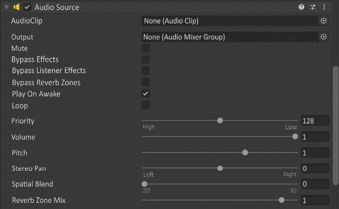

图 10.8：Audio Source 组件

如果我们现在测试玩游戏，我们能够听到声音，但最终它会停止。但我们按下了检查器中`.wav`文件的循环按钮，对吧？那么为什么它不起作用呢？

好吧，那个循环按钮只是为了在那个特定实例中播放。如果我们想在**Audio Source**组件上循环声音，我们必须在*图 10.8*中的**Play On Awake**下检查**Loop**。现在如果我们玩游戏，我们的音乐将会循环！多么令人兴奋！

在本章的后面部分，我们将调整游戏中所有声音的音量，这通常被称为“混音”或“游戏混音”。我们不会立即混音游戏，因为游戏中每个声音的音量完全取决于它相对于其他音效的声音。

## 2D 声音

到目前为止，我们只听到了 2D 声音效果。2D 声音效果是没有游戏位置的声音，将在任何地方为玩家播放。无论你在地图上移动到哪里，2D 声音都会作为一个一致的触发器播放。

以下是在玩电子游戏时可能听到的 2D 声音列表：

+   **音乐**：在按下播放按钮之前，在开场菜单中播放的介绍音乐

+   **用户界面（UI）**：按下按钮时听到的“咔哒”声

+   **旁白**：在游戏过程中说话的解说员

+   **环境声音**：在某个区域播放的通用声音，例如风声

上述所有类别都可以通过玩家操作、游戏事件、开始游戏或进入游戏的新区域来触发。但并非所有这些都会存在于游戏中的 3D 空间中。这使得它们成为 2D 声音效果。

因此，既然我们已经讨论了 2D 声音是什么，那么让我们来谈谈 3D 声音。

## 3D 声音

与 2D 声音不同，3D 声音存在于游戏的世界中。当你玩游戏时，你可以通过在世界中移动并听到哪些声音在哪个耳朵中发生来判断哪些声音是 3D 的。这被称为横滚。

横滚是指声音的立体声质量。你有没有在戴耳机听歌时，只摘下一只耳朵，结果听到的是部分乐器演奏而不是整首歌？这就是横滚的原理！制作那首歌的音乐制作人故意将那些乐器放在一只耳朵里，以创造更好的“立体声成像”（我保证不会深入探讨这个话题）。

因此，在现实世界中，如果有人在你的左边说话，你会在左耳听到他们，而右耳听到的声音会少一些。我们希望在电子游戏中重现这种感觉。因此，我们将位置声音定义为 3D 声音。

### 使用 3D 声音

让我们做一个实验。让我们将`Music`GameObject 的`Spatial Blend`选项从`0`调整到`1`。

现在我们有了空间音频！这意味着我们的声音将在 3D 中！

就目前而言，可能很难确切地指出音乐是从哪里播放的，因为没有视觉指示器。所以，为了解决这个问题，我喜欢创建一个作为音频源子对象的球体 GameObject 来可视化它确切的位置！

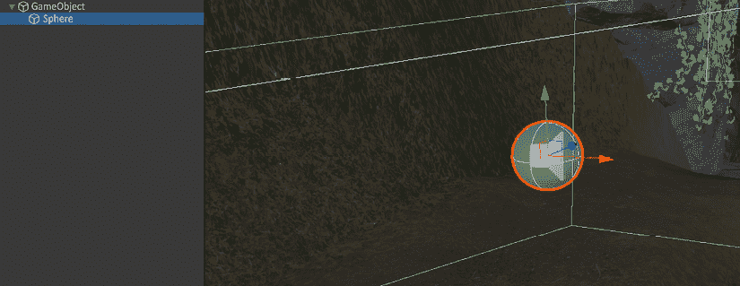

图 10.9：将球体 GameObject 设置为子对象

现在我们点击**播放**，我们可以确切地看到音频源是从哪里播放的！接下来，我们将讨论如何控制我们的 3D 音效参数。

### 音频监听器第一部分

我们如何在游戏中听到声音？我们是通过音频监听器来听到声音的。这是一个我们可以放置在任何 GameObject 上的组件，它充当一对虚拟的耳朵。在大多数情况下，放置这个监听器非常简单，但有时我们需要更复杂的集成。

在使用第一人称相机的游戏中，这很简单：我们只需将监听器添加到相机 GameObject 中，然后就算完成了。

我们在相机上使用音频监听器，因为它充当玩家的耳朵。但有时相机可能处于等距视图，并且相机离玩家太远，无法正确地平移并听到随着它们在世界中移动的声音，因此我们将在一个新的 GameObject 上偏移音频监听器，使其与相机偏移。

我们将在**音频监听器第二部分**中回到这个问题。现在，让我们设置一些 3D 音效设置。在我们设置好 3D 声音之前，我们无法在实际中利用音频监听器。

## 3D 音效设置

当你在现实生活中听到声音时，你通常可以靠近它，它就会变得更响，而当你远离它时，它就会变得 quieter，最终变得无声。我们可以通过在**音频源**组件上的 3D 音效设置来控制这种效果。

我们将专注于 3D 音效设置中的**最小距离**和**最大距离**。

在音频源组件中，将**最大距离**改为 10，然后点击**播放**。假设你还在你的 GameObject 上保留着球体，在游戏中靠近它再远离它。为了进一步可视化，让我们在 Unity 中将场景标签页取消停靠，并将其与我们的**游戏**标签页并排放置。

现在我们已经做了这些，我们可以在游戏中使用线框球体工具来可视化最小和**最大距离**！我们可以看到，当我们把玩家移动到球体范围之外时，我们将不再听到声音。

使用我们的**最大距离**滑块，我们可以控制我们能听到声音的距离。而使用**最小距离**，我们可以控制声音最响亮的位置。让我们将最小距离改为 3。你会注意到，在较大球体内部的较小球体会随之改变，如图 10.17 中所示。

当我们将玩家移动到这个球体内部时，你会注意到没有声像。这是因为声音已经达到最大音量，在较小的球体内部，声音将变成 2D 声音！

最后，我们只想将**音量衰减**设置为**线性衰减**，而不是**对数衰减**。我们这样做的原因是，当你在**对数衰减**模式下将最大距离更改为小于 500 的数字时，声音实际上并不会在那个距离被切断。所以如果我们把最大距离设置为 10，即使我们在地图上 400 个单位的位置，我们仍然会听到它，尽管我们设置的最大距离远小于这个值。

为了参考，这里是对数衰减的**对数**：


图 10.10：对数衰减

这里是**线性**：

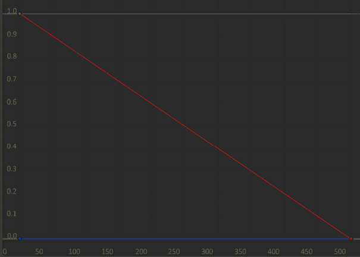

图 10.11：线性衰减

### 音频监听器第二部分

你可能已经注意到，当你的玩家在球体内部时，音频感觉有点不对劲。通常，当我们的玩家穿过球体时，它并不是最响的；它只有在摄像机靠近球体时才达到最响。这是因为 Unity 的音频监听器默认设置为在摄像机上。

在一个第三人称游戏中，就像我们正在制作的，我们希望将其添加到玩家身上，但有一个问题。我们希望它在玩家身上，而不随玩家旋转。我们希望它随摄像机旋转，如下面的*图 10.12*所示进行选择。

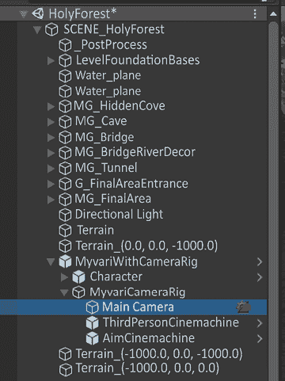

图 10.12：在层次结构中选择摄像机

如果我们打开我们的场景，我们可以看到`MyvariWithCameraRig`已经附加了`Main Camera`。在检查器中，我们会找到一个名为**音频监听器**的组件，如下面的*图 10.13*所示。

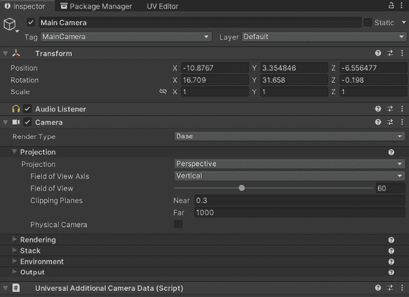

图 10.13：检查器中的主摄像机上的音频监听器

现在，作为一个实验，让我们在这里移除**音频监听器**，并将其直接移动到我们的主要角色上。只需将其放置在`Character`游戏对象上即可。

现在玩游戏，并在球体对象周围移动和远离，旋转它。你会注意到声像到处都是！从我们的视角观察角色，很难判断信息来自哪里，因为我们不是站在角色的位置；我们有一个第三人称视角。

在这样的游戏中，我们可能只需要将我们的**音频监听器**放置在摄像机上，但将它放在我们的角色模型上会很有帮助。但我们不能这样做，因为玩家没有被锁定在其旋转上。

但有一个解决方案！在大多数游戏中，我们可能需要将其作为子游戏对象添加到`MyvariWithCameraRig`游戏对象内部的`Main Camera`中。但在这里，我们已经做了大部分工作，因为根`MyvariWithCameraRig`变换已经与角色模型对齐了！

我们必须做的就是在一个根`MyvariWithCameraRig`内部创建一个新的游戏对象，将其重命名为`Listener`，如下面的*图 10.14*所示，然后我们可以向其添加**音频监听器**组件。


图 10.14：放置音频监听器的新游戏对象

接下来，我们可以将这个`Listener`游戏对象沿着*y*轴向上移动，使其正好位于我们角色的耳朵旁边，如下面的*图 10.15*中通过变换小工具看到的。

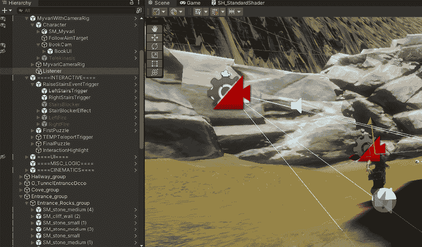

图 10.15：音频监听器游戏对象在 Myvari 头部高度对齐

我将其在*y*轴上向上移动了 1.5 个单位。现在当我们移动时，`Listener`游戏对象的`transform`将随着相机移动。我们的 3D 声音现在将相对于角色的位置播放，而不是相对于相机！

### 将 3D 环境声音添加到游戏中

在你的生活中，你有多少次经历过绝对的寂静？你可能认为在客厅里享受一个安静的夜晚就是绝对的寂静，但你仍然能听到空调、冰箱运行、窗户外的声音等。

当然，提到的这些声音非常微弱，但重点是，我们从未真正体验过绝对的寂静！

因此，即使在我们的视频游戏中，如果玩家处于空闲状态，没有移动，并且完全静止，那么始终有一些声音会很有帮助。这就是环境声音发挥作用的地方。

环境声音可以一般定义为“存在于 3D 空间中的声音，但不会移动。”在我们的 Holy Forest 项目中，我们可以添加树木沙沙声、洞穴内部、传送门嗡嗡声、从物体发出的魔法能量、河流等等的声音！

添加环境声音相当简单。实际上，我们已经在技术上做了这件事！我们在*3D 声音设置*部分听到的声音在技术上可以被视为环境声音。

让我们从场景中非常简单的树木沙沙声环境音效开始。

让我们将`Assets/Sounds`/`AMB_Trees3D.wav`文件拖放到一个游戏对象的**音频源**组件上。我们将**音量衰减**设置为**线性衰减**，并将**空间混合**设置为 1。接下来，我们将最小距离设置为 1，最大距离设置为 5。

完成这些后，我们可以将我们的游戏对象的变换值设置为以下图像所示。图像中的变换反映了*图 10.16*中看到的背景声音游戏对象，并且在场景中的**声音**部分，在`AMB_Trees3D`第一个游戏对象的层次结构中是物理存在的。

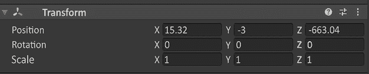

图 10.16：环境树 3D 声音转换

我们将把它放在玩家出生点左侧的大树上。在下面的图像中，你可以看到我们的声音小工具放置在场景中。

你也可以在下面的*图 10.17*以及场景中看到这一点。在层次结构中双击`AMB_Trees3D`游戏对象，你将物理地被带到场景中的那个位置。

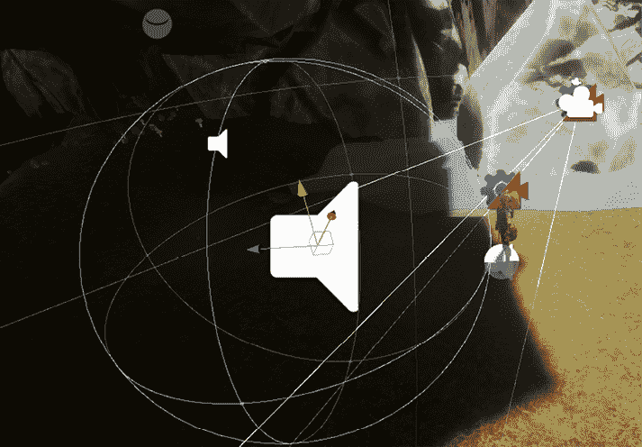

图 10.17：环境音频源的小工具

最后，我们只想确保**唤醒时播放**被勾选，这样声音在场景开始时就会立即播放，如图*图 10.18*所示。

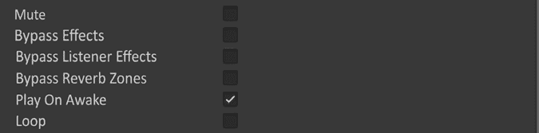

图 10.18：确保“唤醒时播放”设置为 True

现在我们按**播放**。在这里，我们将看到声音在游戏中正常播放！它将与我们之前的声音一样工作，我们可以听到它的方向性，当我们离开树的半径时，声音最终会消失！

### 填充我们的环境声音

对于剩余的环境声音，它将是我们刚刚所做事情的重复。我们将包括环境声音的最小/最大范围和位置，以及我们认为适合每个环境项目的音频文件。在场景中，我们将环境声音设置在`====AMB====`下，如图*图 10.19*所示。我强烈建议你听听环境声音，看看它们听起来如何！

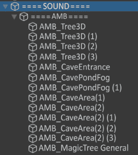

图 10.19：层次结构中环境声音的列表

### 2D 环境声音

如果你在我们刚刚填充的场景中四处走动，你会注意到它现在感觉更加生动了！然而，你会在某些地方注意到 silence，正如我们所学的，听到绝对的 silence 绝不是我们希望玩家在游戏中体验的事情！

让我们在`====SOUND====`父游戏对象中添加一个音频源，并扔进我们的`General2D_Amb.wav`。

# 通过玩家交互触发声音

我们迄今为止创建的所有声音都是在进入场景时立即播放的声音。这是因为我们在**音频源**组件中勾选了**唤醒时播放**。

如果我们没有勾选这个选项，声音将永远不会播放。但酷的是，我们可以以其他方式触发声音！

### 通过 Unity 事件触发声音

让我们为我们的第一个楼梯谜题获取一个声音。这个将会相当简单。我们添加声音的最简单方法是将**音频源**组件直接添加到触发区域游戏对象中。让我们找到`LeftStairsTrigger`，在**检查器**中向下滚动，直到我们找到**交互触发**脚本，如图*图 10.20*所示。

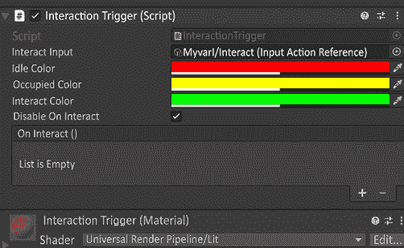

图 10.20：`LeftStairsTrigger` GameObject 上的交互触发脚本

如果你还记得，我们创建了一个名为`OnInteract`的`UnityEvent`，我们可以利用我们的**Audio Source**组件！继续在检查器底部点击**添加组件**并选择**Audio Source**。

接下来，将`StairsPuzzleSuccess.wav`文件拖放到**Audio Source**组件中。我们将保持**Audio Source**为 2D，因为我们播放的声音是一个奖励铃声。

现在，点击`OnInteract` `UnityEvent`中的**+**，并将`None (Object)`字段中的**Audio Source**组件拖放进去，如*图 10.21*所示。

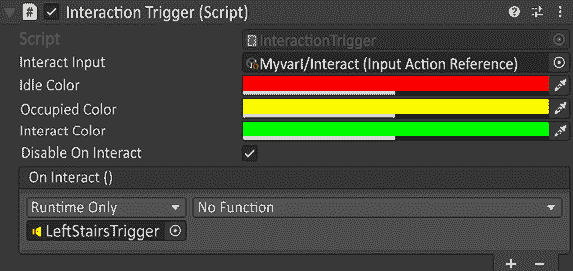

图 10.21：添加到交互触发的声音

接下来，你会看到一个当前标记为`No Function`的下拉菜单。让我们点击它，然后下拉到**AudioSource**，然后到**Play ()**，如下面的*图 10.22*所示。

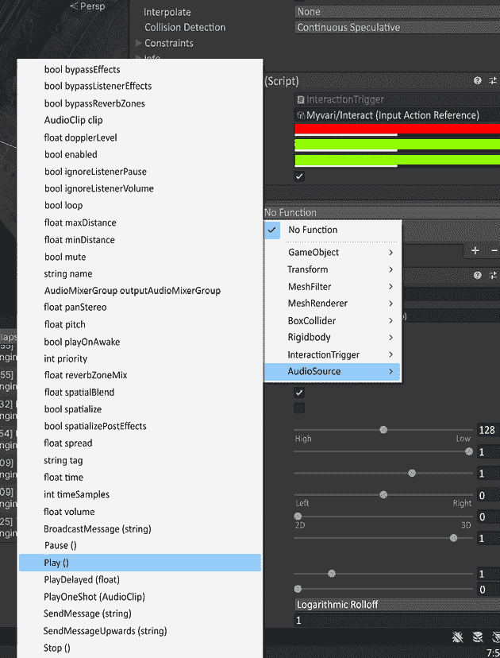

图 10.22：在交互时向声音对象添加 Play 方法

这将确保我们在激活`LeftStairsTrigger`时播放音频文件。请继续点击播放并导航到`LeftStairsTrigger`。一旦这样做，你将听到我们的声音！让我们继续重复相同的步骤来处理`RightStairsTrigger`。

### 旋转拼图声音

第一次，我们将直接在代码中触发声音。这将是一个相当简单的过程，通过代码使我们的**Audio Source**变量公开可用。然后我们只需触发它。

我们将添加以下声音：

+   当拼图完成时播放的声音

+   当尖塔开始移动时的声音

让我们从最简单的一个开始，我们的“拼图完成”声音。当所有尖塔对齐并且门打开时，这个声音将会播放。进入场景中的`First Puzzle`预制体，打开`FirstPuzzle.cs`脚本。这个脚本是我们将添加代码的地方，如*图 10.23*所示。在第 173 行，继续输入以下内容：

```cs
public AudioSource puzzleCompleteSFX; 
```

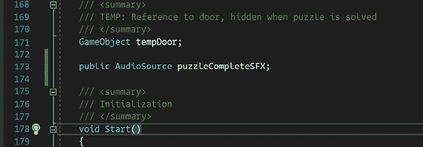

图 10.23：添加到第一个拼图脚本的公共 Audio Source

现在回到场景中的`First Puzzle`预制体，打开检查器，并添加一个**Audio Source**组件。在这个**Audio Source**上，我们将取消勾选**Play on Awake**并将`FirstPuzzleJingle.wav`拖放到它里面。

接下来，就像我们将音频组件拖放到`UnityEvent`中一样，我们将 Audio Source 拖放到新序列化的字段`Puzzle Complete` `SFX`上，如*图 10.24*所示。

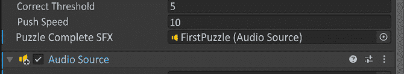

图 10.24：将音频文件拖放到 Audio Source 组件中

现在我们最后一步是进入`FirstPuzzle.cs`脚本中的`CheckForVictory()`函数，进入第 241 行的`if`语句。在`return true`之前，在第 245 行，在*图 10.25*中，我们将添加以下内容：


图 10.25：向音频源添加播放功能

现在，让我们进入游戏看看它是否工作。当我们进入游戏时，我们应该能够激活我们的谜题，并在成功旋转尖塔时听到声音！

### 树形谜题

使用之前相同的方法，让我们添加一个当我们将球放在桥上、解决谜题的一部分以及完成最终谜题时播放的声音。我们将打开`FinalPuzzle.cs`并添加：

+   第 31 行上的`IntroPuzzleSolved.wav`

+   第 38 行上的`FinalPuzzlePartial.wav`

+   第 41 行上的`FinalPuzzleSolved.wav`

# 概述

恭喜！我们刚刚迈出了理解游戏音频的第一步。我们已经了解了构成音效的要素，分解了声音设计的五个部分，了解了音频听众以及音乐与声音的区别，学习了如何使用 3D 声音，以及如何通过代码触发音频源组件！这是通过声音让我们的游戏充满活力的一个很好的开始。在*第十二章*，*最后的润色*中，当我们润色音频时，我们将介绍一些额外的技巧，让你的音频更进一步。

在下一章中，我们将继续构建我们的项目，这样你就可以与他人分享了。
