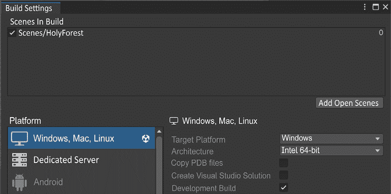
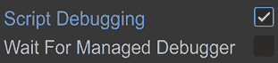
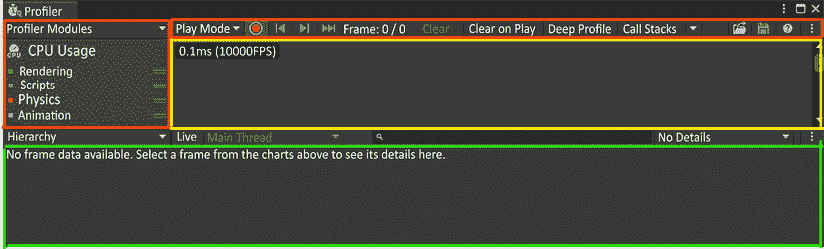
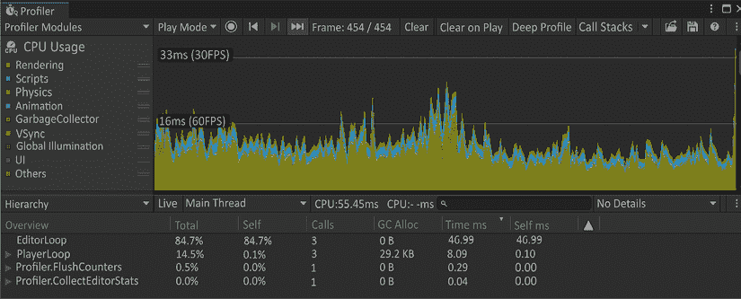
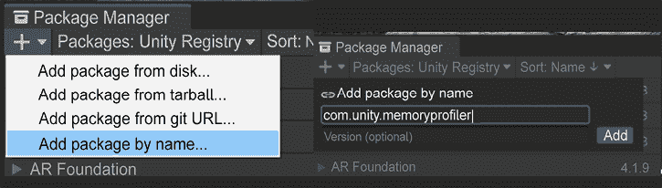
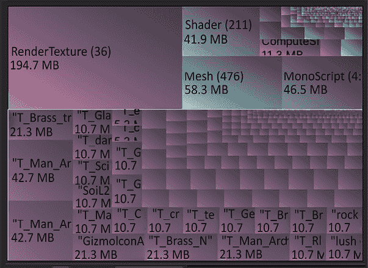
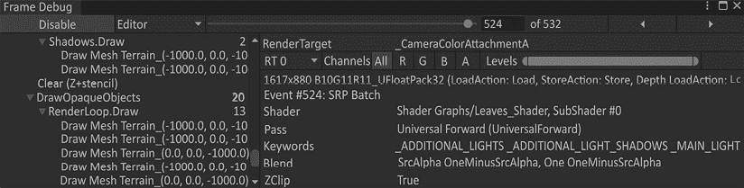
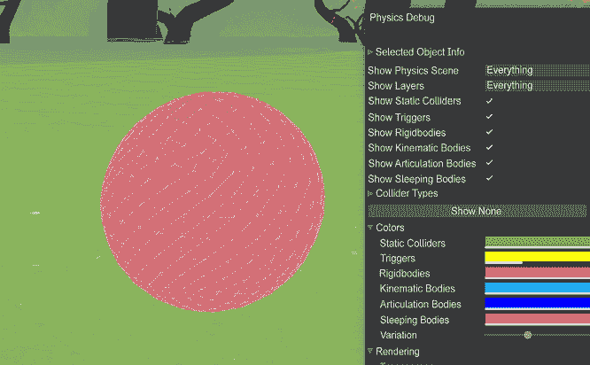
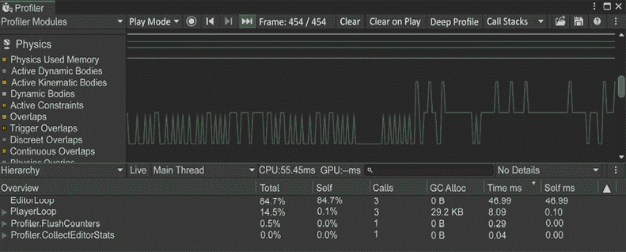

# 11

# 构建 & 测试

在开发旅程的这个阶段，我们已经一起完成了很多工作。现在，我们应该有一个游戏垂直切片，到目前为止，我们已经在 Unity 编辑器中能够玩到，并且它正在运行。这是很棒的，但你是否期望你的玩家下载 Unity 并打开包，然后在编辑器中玩游戏？我想不是！这就是我们想要将游戏项目构建成可执行文件的地方。在本章中，我们将介绍如何构建你的游戏，使其可以发布、测试，并最终让玩家能够玩到。

你将学习到：

+   从 Unity 构建

+   测试——功能测试、性能测试、游戏测试、浸泡测试和本地化测试

+   用户体验 (UX)

# 使用 Unity 构建

我们为了构建一个体验付出了很多努力。现在，我们需要能够将它带给人们。为了做到这一点，我们需要告诉 Unity 几件事情。它需要知道你正在为哪个平台构建，例如，哪些场景应该在应用程序中构建，哪个平台，以及影响构建输出可执行文件的其他选项。

在垂直切片的这个阶段，构建是一个很好的选择。在大多数项目中，这并不总是情况。在大多数情况下，与构建一起工作的最佳方式是：尽早构建，经常构建。在我们的情况下，我们需要等待我们有一些机制和两个主要谜题的标准游玩流程，然后我们才决定构建。

在*图 11.1*中，你可以看到**构建设置**菜单，它位于**文件** > **构建设置**下。在图片下方，我们将逐一解释这些设置。

图 11.1：构建设置

我们首先看到的是**构建场景**。由于它位于顶部，我们应该感觉到它很重要。这会自动将默认场景放入框中，但可能还有其他你想要的场景。你可能还有一个用于菜单系统的场景或另一个可能是教程级别的地图。这里的关键因素是要将你想要的场景放入这个框中；你可以直接将场景从项目窗口拖到**构建场景**框中。

列表顶部的场景将始终是第一个加载的场景。

在“**构建场景**”块下方，GUI 被分为两个部分，**平台**以及该平台的设置。在左侧，我们选择我们想要构建的平台。之后，该平台的设置将显示在右侧。我们将简要介绍**PC、Mac 和 Linux 独立版**选项。

如果你正在为任何其他平台构建，Unity 文档将帮助你了解构建过程。我们将描述大部分在下面可用的参数。控制台和移动设备的选择将有一些针对其目标平台需求的特定参数。

## 目标平台

这个选项很简单：你希望用这个构建针对哪个平台？这里的选项是 Windows、macOS 和 Linux。我们在这个垂直切片中为 Windows 构建应用程序。

## 架构

我们需要知道我们应该计划哪种 CPU 架构。32 位操作系统将要求你的游戏使用少于 4 GB 的 RAM。你可以这样做，但即使是小型游戏也可以使用 64 位；这对你的游戏没有坏处。一般来说，64 位应该是首选。

## 服务器构建

如果你正在开发多人游戏，Unity 可以为你创建一个游戏服务器。这将构建没有视觉元素的玩家设置。它还将构建为多人游戏定义的托管脚本。我们不会使用这个选项，但要知道这个选项是存在的。我们也不会用 Unity 讲解多人游戏开发，因为这将是一个从开始就完全不同的项目。

## 复制 PDB 文件

这是一个仅适用于 Windows 平台的设置。它将允许你在 Microsoft 程序数据库中进行构建以进行调试。我们也不会在我们的构建中使用这个选项。

## 创建 Visual Studio 解决方案

这也是一个仅适用于 Windows 平台的设置。启用此选项将允许你从 Visual Studio 而不是仅从**构建设置**菜单构建。如果你针对 macOS，则会有一个**创建 Xcode 项目**复选框。

## 开发构建

启用此选项将允许调试，包括分析器。分析器是一个分析器，用于了解在运行时正在执行什么操作。

我们将在本章的**测试**部分详细讲解这一点。这里还定义了一些将包含的设置。这对于当你需要测试你的应用程序并且担心性能时非常好。如果你有紧张的视觉预算，你尤其需要注意这一点。有一个术语叫做“基准测试”。这个术语指的是在目标机器上测试你的构建。如果你选择低端计算机进行测试，请注意其规格，并在开发模式下构建游戏，这样你可以在运行时运行分析器。一旦你有了基准测试，你就可以对它在高端和低端机器上的运行做出一些有根据的猜测。

## 自动连接分析器

如果你已经开启了**开发构建**，那么你可以启用此设置。它将自动连接我们在**开发构建**部分提到的分析器。

## 深度分析支持

这也要求启用开发构建。这将使 Unity 分析器能够记录更详细的数据。这不会是检查性能的最佳选项，因为执行脚本可能会有些减慢。深度分析构建的主要目的是通过记录所有函数调用来获取托管应用程序的具体原因。

由于每个方法都会单独记录，深度分析提供了对正在调用什么以及何时调用的非常清晰的视图。在游戏过程中，一些错误可以通过深度分析更容易地诱出和捕获。

## 脚本调试

启用此选项还需要启用**开发构建**，并且它会在脚本代码中添加调试符号。这将允许**IDE**（**集成开发编辑器**，例如 Visual Studio）在游戏运行时附加到游戏上，通过你的断点和调试系统进行调试。当你选择此选项时，将弹出另一个选项，如下图中所示：

图 11.2：等待托管调试器构建设置选项

如果启用**等待托管调试器**选项，它将等待 IDE 寻找构建并请求连接。在没有与调试器建立连接之前，不会执行任何脚本。

## 仅构建脚本

有时候你可能会发现一些错误并需要做出一些更改，但你不想构建一切。数据文件可能会变得非常大。我们在这本书中之前已经讨论过迭代的重要性几乎超过任何事情。这可以显著减少调试迭代之间的时间。

此选项将只构建脚本并保持所有数据文件完整。

## 压缩方法

这里有三个选项：**默认**、**LZ4**和**LZ4HC**。**默认**表示不进行压缩。不进行压缩的文件在 Windows、Mac 和 Linux 上可以直接运行。在 Android 构建中，它将构建为 ZIP 文件。

**LZ4**对于开发构建很有用，因为存储的数据将在运行时进行压缩和解压缩。场景和资产加载依赖于磁盘读取速度。这是一个可以用来帮助提高迭代速度的选项，因为构建时间比默认设置快。一个有趣的注意点是，Android 上的 LZ4 解压缩比默认的 ZIP 快。

**LZ4HC**是 LZ4 的高压缩版本，由于进一步压缩构建，构建时间会更长。这是一个在花费时间调试后用于发布构建的绝佳选项。

在游戏测试中从**默认**开始进行快速测试是个好主意。当你需要开发构建和调试时，使用 LZ4。然后当你准备好发布时，使用 LZ4HC 进行构建。

# 测试

游戏测试是一个广泛的概念。有一些更常见的测试部分和一些更小、更具体的部分。我们常见的测试模式包括：

+   功能测试

+   性能测试

+   游戏测试

+   浸泡测试

+   本地化

如果你研究游戏质量保证或游戏测试，你会找到几个其他测试的名称，一个工作室可能有他们自己的特定测试，这是他们的最佳实践形式。

以上内容均无错误。我们将从上面的列表中解释的测试在几乎每个工作室都能看到。让我们先分解列表中的第一个，功能测试。

## 功能测试

你的测试在你到达这一章之前就已经开始了。每次你按下播放来检查脚本是否按预期工作，你都在与游戏的其他部分一起测试那个脚本。这是游戏开发迭代性质的一部分，也被称为功能测试。

功能测试有一个非常直接的名字！它是测试游戏的功能。正在测试的功能范围的一些例子包括：

+   动画 – 寻找不兼容的动画或损坏的角色绑定。这是通过测试角色动画过渡到其他动画的机械和动作来完成的。

+   音频元素和质量 – 仔细聆听以在特定时间听到不完美之处。这类例子可能包括聆听听起来不正确的脚步声、不存在物体的环境噪音，以及声音放置不正确的地方。

+   电影场景 – 播放电影场景以查找任何不合适的声音、视觉效果、动画或整个电影场景的时序。

+   指令或教程 – 可能会有关于如何玩游戏的说明。这些说明应该写得恰当，并且对玩家使用的控制器方案有意义。

+   机械交互 – 通过体验所有机械操作来感受它们，检查它们是否按预期工作并且可以完成，如果存在完成条件的话。

+   分类 – 这是一个视觉检查，涉及透明度问题。屏幕上的图层需要知道它们在屏幕上的层级。一些效果和用户界面可能很难知道哪些在上面以便正确排序。这需要通过多种场景的测试来确保具有透明度的游戏对象能够正确排序。

+   用户体验 – 用户体验有其独立的工作线程，可以进行测试，但在这个案例中，我们寻找的是合理且有效的控制器方案。例如，**A** 按钮用于跳跃；这是如此常见，以至于如果使用其他按钮，就需要彻底解释为什么这样做。

+   用户界面（菜单结构、分辨率、纵横比、字体大小） – 用户界面需要彻底检查许多部分。缩放后看起来如何？颜色是否正确？能否理解菜单的流程？任何出现的小问题都会被大多数用户看到。这些问题需要被记录下来以便修复。

正如你所见，功能测试是彻底的，并且需要迭代以确保游戏的所有功能对玩家都有意义并且工作正常。当你玩游戏来测试单个机制时，这是一个很好的实践，但它只是在孤岛中检查那个机制。游戏的其他部分可能会受到你所做更改的影响。早期和经常进行强有力的功能测试将使你的项目最终更加干净和积极。

在进行功能测试时，您可能会遇到渲染中断，导致帧率降低。如果发生这种情况，请注意并将其添加到将要进行的性能测试列表中。既然我们提到了这个话题，让我们来看看如何在 Unity 中进行性能测试。

## 性能测试

在 Unity 内部，我们有四个分析来源：

+   Unity 性能分析器

+   内存性能分析器

+   帧调试器

+   物理调试器和性能分析器

这四个分析工具都有它们自己的特定用途，以帮助确定可能引起问题的原因。我们将简要介绍它们，以便熟悉每个工具。首先，我们需要了解最常用的一个，即 Unity 性能分析器。

### Unity 性能分析器

要进行性能分析，您需要使用 Unity 的分析工具，即 Profiler，其外观如下所示**图 11.3**：

**图 11.3**：Unity 性能分析器窗口示例

性能分析工具有助于识别 CPU 使用情况、内存使用情况和渲染时间。当您通过**窗口**>**分析**>**性能分析器**打开性能分析器时，您将看到四个部分，如上图中**图 11.3**所示。这四个部分是：

+   （红色）性能分析模块 – 此部分包含正在使用的性能分析模块，并使用颜色显示性能分析开始记录时的活动情况。

+   （橙色）性能分析控制 – 这些控制用于设置性能分析器正在执行的操作。在这里，您可以开始记录并更改模式或性能分析工具。

+   （黄色）帧图表 – 这显示了随时间堆叠的图表和渲染过程曲线的各个帧。

+   （绿色）模块详细信息面板 – 模块详细信息面板解释了所选帧的每个部分，并按请求的线程的使用百分比分解。**默认**是主线程。

例如，在下面的**图 11.4**中，我们在玩游戏时选择了帧；我在移动 Myvari 时记录了 7800 帧。您可以看到我们当前每秒运行接近 60 帧。我想知道**PlayerLoop**中占用最多 CPU 时间的是什么——在这种情况下，是编辑器中运行的游戏，大约占 80%。向下滚动**PlayerLoop**，我们看到前向渲染器是主线程上最重的任务。场景中目前没有太多活动，这就是为什么我们平均每秒运行 60 帧。

**图 11.4**：已选择帧的性能分析器

您可以看到性能分析器附带了多少信息。当您想查看可能造成游戏帧率较低的原因时，这些信息非常宝贵。

### 内存性能分析器

如预期，这个工具分析了编辑器的内存。您还可以在**构建设置**菜单中选择**开发构建**时在独立构建上运行内存分析器。这里的限制是您不能在发布构建上运行内存分析器，就像我们之前看到的 Unity 分析器一样。内存分析器也不是自动添加到 Unity 项目中的。它是一个可以添加的包。要添加它，请按照以下步骤操作。

要添加内存分析器，请转到您的**包管理器**并按名称添加一个包。这可以通过选择如图 11.5 所示的选项，然后将`com.unity.memoryProfiler`添加到**按名称添加包**字段中完成：

图 11.5：（左）按名称添加包，（右）添加内存分析器

安装后，您可以通过转到**Windows** > **分析** > **内存分析器**来访问内存分析器。当它首次加载时，您将看到一个空白的中部区域，并有一个创建快照的选项。如果您按下播放并然后拍摄快照，您将得到与我们这里相似的屏幕。在这个分析器中有很多信息需要查看。这个的主要用途是如果您有低帧率并且想要检查内存使用，或者在长时间测试期间看到崩溃。您可以通过多个时间点的快照看到正在使用的内存。

图 11.6：内存分析器

在查看快照时，中心区域会分解该快照中的所有内存。在底部区域，有用于组内的一切的块。你可以选择组来进一步分解它们。我们这样做是为了底部的紫色块，它用于显示`Texture2D`。我们已经知道这会有一个很大的内存占用，因为它是所有架构的纹理。它需要相当大。

如果内存看起来符合您的预期，那么查看帧调试器以检查可能引起问题的特定帧中加载了什么可能是个好主意。让我们接下来看看这个工具。

### 帧调试器

能够看到单个帧以及如何构建绘制调用以提供该帧的渲染，这对于调试视觉伪影非常有帮助。您可能在使用功能测试时使用过它，并发现了排序问题。现在您可以加载帧调试器并查看每个项目何时被渲染。从这个点开始，您将拥有知识来了解为什么它以错误的顺序被渲染。

图 11.7：帧调试器

帧调试器的另一个强大功能是您可以看到渲染项上设置了哪些 Shader 属性，如上图中*图 11.7*所示。这很有用，因为当您以程序方式设置 Shader 属性时，您可能期望 Shader 属性使用某些纹理或变量。如果它们不符合预期，那么检查帧并查看其设置将是一个很好的主意。这可能导致发现对于一帧，它被设置为预期的值，但随后被覆盖。这可能会帮助您找到在预期值设置后一帧或两帧更改您的 Shader 属性的脚本。

### 物理调试器和分析模块

对于物理，我们既有调试器也有分析模块。物理调试器是一个可视化工具，用于了解场景中有什么物理碰撞以及它们应该或不应该能够与之碰撞。如您在*第七章*，*刚体和物理交互*中看到的，刚体在物理属性的优化设置中很复杂。能够可视化哪种类型的碰撞器在哪里，以及它们在哪里，对于了解物体何时以及为什么这样做非常有帮助。在下图中，您可以看到场景中哪些对象是物理对象。

打开物理调试器的**颜色**部分，您可以根据需要调试的内容对它们进行着色：

图 11.8：物理调试器

在您通过物理调试器识别出由 GameObject 可视化的任何物理问题时，我们还有另一个工具来收集更多信息。幸运的是，我们还有物理分析模块，可以帮助我们处理任何正在可视化的物理问题，以便我们可以查找问题。物理分析模块位于 Unity 分析器中，将帮助您找到当调试器开启时可能看到的物理差异的答案。

要查看物理分析模块的外观，请参见下图的*图 11.9*：

图 11.9：物理分析模块

在这一点上，您可能不会理解这一点，因为我们没有与我们的物理力学相关的案例来展示直接的问题。我们没有快速移动的项目，这可能导致许多物理问题。如果您的游戏确实有快速移动的对象，当您记录分析器并注意到 GameObject 在它们不应该时穿过其他 GameObject 时，这个模块会很好，可以看到使用的总内存。可能使用的内存不允许物理更新得足够快，以获取活动体信息。

物理调试可能需要时间才能得到答案，因为这需要在物理工作正在进行时发生。对此调试要有耐心，并尽可能使用更多工具来获取您需要的答案。

现在我们已经讨论了所有的调试工具，我们需要用我们团队之外的人来测试游戏。这被称为游戏测试。让我们把游戏交给其他人来玩。

## 游戏测试

这是一个难以评估的问题。起初，对你和你的团队、朋友和盟友进行内部测试可能是个好主意。你让他们玩游戏，看看他们对它的感受如何。这并不是为了建立你的自尊。当他们玩游戏时，你需要在场，并要求他们大声说出他们对这次体验的感受。不要对他们进行任何提示。你希望他们给你真实的感受，如果他们针对预期的体验进行交流，你就走上了正确的道路。

即使游戏的艺术设计尚未到位，菜单系统是带有 Arial 字体占位符的方块物体，这些都丝毫没有减损核心游戏体验。一个例子是，当有人进入你想要激发的第一个情感触点时，产生的直观反应。对于我们项目来说，我们想要给人一种惊奇感。这接近于困惑，因此我们需要在放置和光线使用上谨慎，以鼓励玩家按照自己的意愿冒险。如果他们说诸如“我想知道那里有什么”之类的话，我们就是在追求那种惊奇感。

同时，他们可能会说出同样的句子，但你并没有计划任何内容。让他们探索他们认为可能存在的地方，并做好笔记。在那里放置一些东西是个好主意。让那种固有的好奇心将你的设计推进到你已经达到的范围之外。如果存在某种互动，那么那里有什么几乎无关紧要。一个例子是，一个与叙事无关的区域稍微偏离一侧，可供进入。当测试者进入你预料之外的地图上的位置时，把这视为一个互动的机会。你可以把它建成一个风景点。当你走过去时，摄像头会稍微向外移动，以摄入景色。这不是故事的补充，而是实现了对好奇心的满足。当你探索时，发生了某些事情。

探索可能不是你游戏的大部分内容；也许你的标题是一个以社交为中心的体验。在多人游戏中，任何玩家都需要高度互动。当你们一起玩游戏时，你们如何与朋友互动？一个极好的例子是 FromSoftware 的多人互动系统。FromSoftware 的游戏中的社交互动——例如*艾尔登法环*——允许你留下带有特定词语的简短信息，但你也可以使用表情符号，信息会播放你的角色作为幽灵，带着你的简短信息和表情符号。这允许你与可能找到的表情符号进行互动。这是在定义其让你感到孤独和脆弱的能力的游戏中允许互动的一种非常有趣的方式。

在他们玩完游戏后，记下所有笔记，并感谢他们花时间。你不需要实现他们测试中写下的一切，但当你有五个人测试它时，会出现趋势。首先关注这些趋势。

## 浸泡测试

浸泡测试不是一个直观的名字。我们不会把我们的电脑浸入浴缸；我们只是让游戏闲置运行 24 小时。你的角色在游戏中，是活着的，只是独自坐着，游戏在进行。这样做的原因是为了尝试找出游戏中可能存在的任何内存泄漏。

内存泄漏是指某些没有被妥善处理的内存。比如说，我们有一个粒子从树上落下，营造一些美好的氛围。粒子被设置为死亡，但是不小心多加了几个额外的 0，所以现在它不是持续 10 秒，而是持续 1000 秒。当你游戏中四处跑动时，这可能不是问题，因为当你离开时，粒子会被清除。但是如果你让游戏闲置，所有制造树叶的粒子系统都会堆积起来，地面上可能堆积数千片树叶，这可能会导致性能大幅下降。这需要修复，而且没有压力测试是无法实现的。

## 本地化测试

本地化是将游戏翻译成另一种语言以供体验的行为。这个测试可能比预期的要长，你需要有耐心。每个菜单项、对话行和描述都需要考虑这个测试部分。翻译也不只是逐字逐句的解释。一些语言需要更多的上下文来描述，如果不仔细注意，可能会导致非常混乱的翻译。

在本地化游戏时，要注意不要仓促行事。这可能会完全破坏另一种文化的体验，这将是件遗憾的事！

# 用户体验，或 UX

UX 可以被定义为品牌、设计和可用性中各个部分的和。就我们而言，我们将简要介绍品牌在 UX 角色中的作用。然后我们将只简单谈谈设计，因为我们已经覆盖了该项目基本部分的设计。在快速覆盖这些内容之后，我们就可以进入可用性部分。让我们开始吧！

## 品牌

为了广泛地涵盖这一点，通过 UX 视角的品牌化是关于用户在整个游戏旅程中体验的整体体验也需要在品牌中反映出来。用一个过于对比的例子来说，想想如果一个恐怖游戏的品牌使用了柔和的色调和粉彩，以及花朵和欢快的音乐作为他们的营销材料。这显然不符合游戏的品牌，会在用户的体验中造成不和谐。

UX 作为开发中定义的一部分的目的和要点是，要关注那些有意识的、连贯的行动。在 UX 上花费的时间应该确保所有设计部分，包括标志、营销材料和游戏部分，都是整体统一体验的一部分。

## 设计

到目前为止，这本书已经涵盖了大量的设计。有趣的是，我们以一种相对封闭的方式涵盖了所有的设计。有时这可能会引起问题，但幸运的是，对于我们的项目，我们真正专注于角色设计。其余的设计都是围绕她种族的过去构建的，这为视觉提示提供了答案。

游戏的节奏是通过游戏风格和机制专注于环境叙事来处理的。结合这三个部分，它已经是一个统一的项目了。这很好地验证了我们在每个部分上所花费的时间。做得好，坚持下来！

## 可用性

在通过您精美的品牌和智能而统一的设计吸引用户之后，他们应该能够使用该产品。对于游戏来说，可用性全部集中在交互上。这不应该让人感到惊讶，因为我们已经在*第六章*，*交互和机制*中将其定义为体验的支柱。我们已经与玩家进行了整体交互；然而，没有定义便利设施。我们需要弄清楚玩家如何知道他们可以执行这些交互。

我们将在这里概述垂直切片的主要部分，从到达第一个谜题的初始问题开始，然后转到第一个谜题本身。之后，我们需要介绍下一个机制——心灵感应，最后是最后一个谜题。

## 初始问题

在起始洞穴部分，我们有一个被封锁的楼梯，玩家需要与两个物体交互来解锁。我们将使用一些东西来给玩家提供便利，让他们知道如何执行所需的任务：

+   光池

+   世界空间 UI

+   满足动作

光池是环境或关卡设计的一个小部分，它让玩家感觉他们应该朝那个方向前进。如果一个隧道很暗，而隧道尽头有光，玩家往往会朝那个光走去。我们可以使用这种方法，在需要按下的按钮附近放置发光的物体或灯光。

现在他们已经接近了，当鼠标靠近足够近时，我们将弹出世界空间 UI 以进行交互。这个按钮应该与其他此类交互相同。对于这款游戏，我们的交互是键盘上的*E*键。

在使用交互按钮之后，需要有一些东西来满足该动作的使用。在这种情况下，它是一个岩石中的按钮。它将动画化以放置到位，发光以表示使用，并触发一个声音来完全指示用户已经使用了他们的便利设施。

## 第一个谜题

当你第一次来到第一个谜题时，可能不会立即理解玩家的目的是将石头移动到某个位置。我们使用了一个主要的关键可用性功能，以及其他一些看起来相似的功能。让我们再次列出它们：

+   光池

+   英雄艺术品

+   世界空间 UI

+   摄像机定位（之前提到的关键因素）

+   满足动作

我们之前已经讨论了光池化作为定位的概念。在这种情况下，我们将使用光池化来吸引视觉注意力到一个移动的地方。要注意的是门，因为它在你面前展示了谜题的答案。

我们光池化的艺术品是谜题的答案。它直接放置在你即将前往的下一个位置，当你从楼梯出来时，它就在你面前，并且是亮的。当你到达楼梯顶部时，没有障碍阻止你看到你应该看的地方。这就是我们为玩家所做的事情。让他们感受到探索的乐趣，但当他们这样做时，知道他们正在看对的地方。

我们的世界空间用户界面与之前相同，但我们使用它来让玩家知道当他们靠近可移动部件时可以与之交互。

在下一节移动的关键因素是摄像机移动。当你进入谜题的空间时，摄像机将缓缓上升到一个位置，这将代表当你第一次进入时，与门上的艺术品协调的柱子成功移动的位置。

当玩家将柱子移动到正确位置后，会听到岩石被放置到位的巨大声响，以及可能听起来像大锁芯落下的连接声。当最后一个柱子到位时，整个部件会移动到最终完成的位置，摄像机也会移回玩家的肩膀位置，同时中间的柱子升起，以便玩家按下“开门”按钮。

## 二级机制介绍

我们一直在解释玩家的可用性和如何引导他们执行动作。只要你小心地以故意的方式介绍它们，你就可以在不破坏体验的情况下添加新的机制。到目前为止，Myvari 只是一名探险者。我们希望她能从她古老的血液中获得轻微的心灵感应能力。我们只需让它们活跃并给她设置障碍，但这不是很有趣，体验也不够强烈。

为了给我们自己一个新的机制，并希望吸引玩家关注我们的主要角色，我们将采取两个最初不直接涉及玩家的动作，但它们确实涉及到 Myvari。我们首先会做的是，当 Myvari 在山的一侧狭窄地带行走时，一块大石头将从山上滚落。将发生一个电影般的场景，她会感到惊慌，并抬起手臂自卫，这会稍微触发她的心灵感应能力，她将稍微调整石头，使其从山上滚落，而不是落在 Myvari 自己身上。

接下来，在经过一些小范围的探索后，玩家会遇到一个他们无法进入的区域，但可以看到它。这里有一个柱子，看起来像第一个谜题中打开第一扇门的那个柱子，但它被分开了。我们将使用一种新的世界空间用户界面，当你悬停在破碎的部分上时，它会被勾勒出来，交互按钮会弹出。这个轮廓将与在心灵感应发生时用于岩石的颜色相似，当你与之交互时，你会伸出你的手并拿起它。当它靠近柱子足够近时，它会自动修复，这会触发你所在区域许多视觉上的变化。

总之，我们通过使用心灵感应的小例子来慢慢介绍，这种方式符合角色的特点。这是一个很好的可用性应用，因为玩家可以随着角色一起成长。现在我们可以将在这里学到的知识应用到最终的谜题中，该谜题将心灵感应作为主要的机制。

## 最终谜题

制作一个强大的体验需要付出多少努力真是令人惊讶！那些描述机制的前期努力是使体验成为沉浸式体验而不是仅仅按下一个按钮让角色做某事的粘合剂。

现在，我们进入了最后的谜题，这里有一些与之前看到的玩家操作手段相似的方法。我们将使用稍微不同的方法，因为用于机制中的物品不同，但整体概念是由环境驱动的。你将在最终的谜题区域看到这些用户体验功能：

+   光池

+   与英雄艺术品的连接

+   世界空间用户界面

+   满足动作

和往常一样，我们使用光照来帮助玩家微妙地理解下一步行动。有一个大光从我们的英雄艺术品（主要焦点）树后面发出，这意味着它有叙事含义，需要更多的作者处理，这显示了从连接到建筑的每根电缆中发出的光芒。如果你跟随电缆，它们会流经大柱子。

那些柱子与英雄艺术品（中心树）相连。问题是柱子本身缺少一些东西。那些东西就在树周围的多个位置的地面上。将鼠标移到这些较大的球形物体上，你会看到你可以与之交互。

在这种情况下，交互是世界空间用户界面。这是我们之前在拿起部件完成柱子时跨越水桥时看到的轮廓。拿起物体并将其移到相同形状的空位附近，会点亮电缆，需要按照一定的顺序完成，以便给树供电。这只会因为角色能够注意到一些电缆损坏或连接不正确而减慢速度。

满足动作来自于每次放置物体时从电缆流向树木的流畅能量。最终，树木将亮起，以电影般的方式打开一个区域，揭示一顶王冠。Myvari 抓住王冠，戴在她的头上，解锁了她作为她古老种族最后一位公主的位置。

当门户在完成拼图后开启，她兴奋地穿过它，这标志着垂直切片的结束。

# 摘要

你可能会想，“接下来是什么？”这是一个很好的问题。你有一个已经制作完成并经过一些测试的游戏，其中包含了一些错误修复。在这种情况下，它是一个可玩的项目，并且可以为投资者提供足够的背景信息，以继续获得游戏资助或发布的旅程。

我们接下来要讨论的是一些抛光技巧，旨在追求美观和用户体验。我们把这些最后的修饰称为“完成 touches”，因为我们知道垂直切片已经处于一个很好的状态，可以添加最后的修饰。在下一章中，我们将花时间查看所有可以推动我们的品牌和质量进入游戏的任务。
