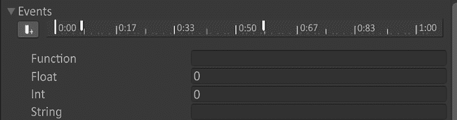

# 完美细节

欢迎来到**完美细节**章节！关于游戏制作所需时间和游戏开发的总体难度有一个误解。本章将作为一个工具箱，指导你完成你的项目。这不是一个直接的下一步，而是一个开放的盒子，让你看到我们用来打磨我们的垂直切片的东西。打磨过程的有趣之处在于，它涵盖了游戏开发的 80%左右。这听起来可能不太直观；然而，如果你在开发过程中一直关注截图，你将注意到，从消费者的角度来看，我们在这个阶段根本不可能有一个完整的游戏。机制是有效的，游戏现在是一个体验，只是还不完整。

本章将涵盖以下内容：

+   概述

+   资产最终化

+   灯光

+   声音打磨

# 概述

完美细节对于完整的体验至关重要。我们需要把现有的东西都整理好，把所有的针脚都缝紧。这可以通过几种方式来完成。

在此之前，灯光和声音的最终确定非常困难。可能会有**研究和开发**（**R&D**），但除非游戏的重点是这两个主题之一，否则你不会在游戏中获得最终的灯光或声音，正如以下章节列表中所见。你正确地想知道为什么我们在之前有一章关于声音。我们想概述声音的基本知识，并让你熟悉声音设计和在 Unity 中的实现概念。

灯光可以提前工作以设定氛围，但需要在环境和灯光池定义良好并固定后才能最终确定。再次强调，如果灯光和氛围将体现在体验中，那么在开发阶段的初步阶段就需要进行大量的灯光研究和开发。这里关于灯光的所有对话也将在这个阶段为你提供指导，如果需要的话。

这将是这样工作的：我们将在本章的三个主要部分中涵盖特定的动作。这些动作特定于我们的项目，但同样可以帮助你未来的项目。把它们看作是工具而不是教程。其中一些可能需要编程，而另一些可能不需要。

由于大多数机制已经编程到一定程度，我们首先将关注资产最终化。记住，正如我们所说，如果资产没有完成，那么灯光和声音就很难得到。让我们从这里开始吧！

# 资产最终化

本节将非常精彩。这里有如此多的优秀艺术资产和完美细节可以探讨。以下是我们在未来项目中可能帮助到你的工具列表：

+   资产上的风格化通道

+   细节法线

+   建筑清理

+   纹理混合

+   环境杂乱

+   细节网格

+   特效

+   动画

+   二级动画

我们将如何浏览这些部分是，我们将解释为什么我们要为我们的项目做这件事，这可能会帮助你决定你是否需要在未来的项目中自己进行这些抛光处理。之后，我们将涵盖我们实际采取的步骤，以便你可以看到它们是如何完成的。有趣的是，我们实际采取的步骤可能不是实现这些最终修饰的唯一方法。采取这些行动的最佳方式是将它们作为一个概念或起点，因为你的项目需求可能会有所不同。我们将从对我们资产的风格化处理开始我们的最终修饰。

## 资产的风格化处理

在定义艺术风格时，我们首先从大笔触开始。即使你花时间概述艺术方向，一旦你进入抛光阶段，你将需要对其进行处理以放置最终修饰。在我们的案例中，我们发现我们的资产缺乏足够的风格化外观，以适应我们的艺术方向。风格化这个词经常被使用，并且它有权利经常被用于游戏，因为它意味着不仅仅是看起来不真实。在我们的案例中，我们希望风格化使一切感觉更具插图性质。这意味着我们需要将所有对比鲜明的轮廓和颜色推入纹理中。我们还需要在纹理中拥有更宽的线条粗细。

在我们的项目中，一个很好的例子是 Myvari 的项链。这件艺术品需要脱颖而出，因为它是 Myvari 心灵感应的主要焦点。我们也知道在电影中我们会近距离看到它，所以我们需要确保我们在这件作品上投入时间。


图 12.1：Myvari 项链的风格化处理

这需要在所有艺术作品中发生，以在角色和世界中尽可能保持一致性。一旦风格化处理完成，一些模型可能需要添加一些小细节。我们称它们为“细节法线”。现在让我们来了解一下它们！

## 细节法线

有时，细节法线可以被认为是风格化处理的一部分。在我们的例子中，我们希望这成为整体艺术指导中的一个突出部分，所以我们将其从风格化处理中提取出来。我们希望强调模型轮廓的风格化特性；然而，我们希望材料本身有一种现实感。皮革需要看起来像皮革，树皮应该看起来像树皮。在下方的*图 12.2*中，我们对蘑菇进行了细节法线处理，以给它增添一些额外的细微差别。左边的图像有基础法线和纹理。右边的图像在基础法线之上添加了细节法线。


图 12.2：左，无细节法线；右，添加了细节法线

细节纹理也很有趣，因为它们通常是来自可平铺纹理的较小细节，由于模型的纹理尺寸，它们不会很好地放在纹理本身上。为了获得小细节，我们在着色器中分层了它们。


图 12.3：细节法线

上图是我们用于*图 12.3*中细节法线的着色器。我们将通过跟随数据连接点并逐节点解释推理来分解它。首先，我们从 UV 节点开始。

**UV 节点** – 此节点设置你将操作的 UV 空间。下拉菜单允许你选择要操作的 UV 图。由于我们使用主 UV 通道，我们将它保持在`UV0`。我们将 UV 节点的输出输入到一个 Swizzle 节点。

**Swizzle 节点** – Swizzle 节点允许用户取一个输入并混合通道以创建所需数据量的输出。你会注意到我们已将输出设置为`xy`。我们的输入是一个引脚线，它指的是一个`Vector4`，这也在 Swizzle 的输入中显示。在这种情况下，我们只需要红色和绿色通道，所以我们只请求`xy`或`rg`通道，我们得到一个输出绿色线的`Vector2`。Unity 的`Shader Graph`已经裁剪了其余的通道，所以我们不需要特别这样做，但只使用你需要与之工作的通道是一个好习惯。我们将这个输出输入到一个乘法节点。

**乘法节点** – 我们在这里使用一个浮点参数来提供 UV 的可定制性，以及 Swizzle 输入。`Detail Normal Scale`参数被公开，这样我们可以在检查器中稍后进行更改，调整以满足我们的需求。这个输出的结果将进入一个采样纹理 2D 节点的 UV 通道。

**采样纹理 2D 节点** – 此节点的另一个输入是我们的纹理 2D 参数细节法线。我们需要确保**空间**选项设置为**切线**，因为我们将在后面影响切线以重建法线。我们将输出取出来，再次得到一个`Vector2`，但使用的方法不同于 Swizzle。我们将使用采样纹理 2D 节点上的单独通道的合并节点。

**合并节点** – 从采样纹理 2D 节点的输出中获取 R 和 G，我们将它们合并以创建一个`Vector2`，它正在采样我们想要的纹理并遵循我们设置的 UVs。现在我们需要将这个`Vector2`输入到一个缩放节点并对其进行偏置以进入不同的范围。

**缩放和偏置节点（使用乘法和减法）** – 下两个节点是一个基本的数学函数，用于将`(0 到 1)`的范围转换为`(-1 到 1)`的范围。我们通过将 2 乘以并在 X 和 Y 向量上减去 1 来实现这一点。这对我们来说很重要，因为我们可能希望法线看起来是凹的，或者进入模型。在完成这个函数后，我们将输出输入到一个法线重建 Z 节点。

**正常重建 Z 节点** – 这个节点的目的是从我们在样本纹理 2D 节点中选择的正常图中推导出 R 和 G 的正确 Z 值。

之后还有三个更多步骤。我们将遵循这些后续步骤的单独图。我们将把这个节点的输出移动到正常强度节点中。

**正常强度节点** – 连接到正常强度节点的是我们从正常重建 Z 节点得到的法线。还有一个浮点值，我们为其创建了一个名为**详细法线强度**的参数。这可以在下面的*图 12.4*中看到。我们使用这个节点是为了如果法线图看起来可能细节过多或者视觉上不吸引人，我们可以稍微降低一些。我们在**强度**输入中设置的参数允许我们动态地为每种材料设置详细法线强度。


图 12.4：正常强度节点

我们将这个输出放入正常混合节点中。

**正常混合节点** – 我们最终希望这些详细法线与网格本身的法线分层。这就是我们将要执行的节点。


图 12.5：正常混合节点

它将输出一个包含数据内部法线的正常图。然后我们将输出放入布尔关键字参数中，我们将其命名为“详细法线？”。

**布尔关键字** – 这个布尔关键字设计成允许我们选择是否使用详细法线。由于这个着色器被用于许多材质中，我们需要一种方法来排除如果网格可能没有详细法线时不需要的情况。我们通过将“开启”的输入设置为网格的混合法线和详细法线来实现这一点。如果设置为“关闭”，则只接受网格法线。


图 12.6：详细法线布尔关键字

这个输出将随后进入**主堆栈正常**输入。当你创建一个材质时，如果你想有一个详细法线，你只需要通过“详细法线？”参数的复选框选择“开启”。

接下来，我们将清理架构。

## 建筑清理

当前建筑的轮廓可能看起来不错，但建筑本身是否合理？这是一个关于建筑形状的有趣设计问题。我们需要确保建筑看起来像是可能由一个活物建造的。这是一个很难做对的任务，因为我们试图模仿的生物并不存在！它们是虚构的生物，这意味着我们在为它们进行建筑规划时需要非常清楚我们所走的路径。

我们知道它们专注于天体和时间概念。空间、行星的形状和时间的概念需要参与到建筑的轮廓和材质中。这可能并不意味着对部件进行彻底的改造，而是更多地推动形状，使语言足够突出，以适应我们正在设计的文化。

我们还需要去除一些永远不会被看到的几何形状。这是为了优化游戏，并且非常重要。在游戏中，如果你看不到它，那么它就不需要渲染。因此，我们做了一些称为**背面裁剪**的事情。这意味着如果你从内部看球体的背面，它将是不可见的。

物体的背面不会被渲染，因为它看不见。如果你不这样做，球体将不得不渲染所有内部面，这将浪费宝贵的计算机时间；我们需要渲染其他所有东西。

## 纹理混合

当构建地形或需要连接的大物体时，总会有一些线条显示物体是 3D 网格。这是一个常见问题，如果不密切处理，可能会损害沉浸感或破坏体验。有几种方法可以使这个问题变得更好。你可以在分裂的上方添加另一个网格。你也可以层叠或重叠网格，在模型中制造一个断裂，让玩家认为它是故意稍微破损的。你也可以执行一种称为**纹理混合**的操作。

我们实现这一点的其中一种方式是通过 Y-up 材质。它们可能也有其他名称，但我之所以这样称呼它们，是因为它们使用 Y-up 轴来混合材质。我们所做的是要求着色器混合世界法线值的正 Y。我们在着色器中使用这个值，其中基础纹理位于 A 通道，B 是苔藓或雪纹理。让我们看一下下面的*图 12.7*至*12.9*，以查看 Shadergraph 图像的截图。在*图 12.7*中，我们展示了带有单个 UV 集和岩石纹理的一些岩石。这些岩石完全相同，除了我们复制了它们并将它们旋转以展示我们组合的着色器，该着色器将纹理放置在世界法线上。


图 12.7：应用了我们的 Y-up 着色器的岩石

应用到这些上的纹理不是最终的苔藓纹理，但它们被设计成与岩石形成对比，以分别显示纹理。这使得我们能够通过视觉轻松地处理这些差异。你会注意到岩石是相同的，但已缩放和旋转。这是在场景中的网格中提供重用的一种强有力的方式，这样你就不必建模那么多岩石！接下来让我们看看`Shadergraph`是如何实现这一点的。


图 12.8：Lerp 的 T 值的世界正常 Y-up

我们需要规划如何在网格上分割纹理的渲染。有趣的是，我们需要确保纹理无论如何旋转都能始终出现在网格的顶部。我们决定使用世界空间的法线向量，然后乘以一个我们命名为`Offset`的`Vector3`。我们想要正 Y，所以`Offset`参数的默认值将是`(0, 1, 0)`。我们还有两个额外的混合参数。它们是`Blend`和`Level`，它们都是浮点数。`Blend`参数是一个从 0 到 1 的硬值。当值为 0 时，没有混合，岩石是唯一的纹理；当值为 1 时，没有混合，其他纹理有一个硬的线条。这与`Level`参数相辅相成。`Level`参数应该设置为**滑动条**，最小值设置为 0，最大值设置为 100，默认值设置为 1；这些可以在**图检视器**的**节点设置**中设置。我们添加它在这个着色器中是为了展示你可以为你的艺术家添加更多工具。在这行数据的末尾是一个饱和度。

这确保了数据保持在 0-1 的范围内，这是我们需要的 Lerp 的 T 值，我们将在下一部分讨论。


图 12.9：纹理查找和 Lerp

如上图*图 12.9*所示，我们的 Lerp。值是基础纹理，B 是 Y-up 纹理。T 是*图 12.8*中饱和度的输出。Lerp 的输出将进入我们的基础颜色。这只是开始，你可以通过使用法线贴图和高度贴图来帮助混合通道，使它们更加无缝。我们目前在这个着色器中不使用额外的贴图，但这个概念使用的是完全相同的节点，只是增加了作为输入的贴图。

## 环境杂乱

这是一项完全独立的工作。那些与环境杂乱工作的人在该行业中被称为杂乱艺术家。他们的工作是放置物品，使环境看起来有人居住。目前，我们有一个机械设计的环境。我们知道 Myvari 需要在哪里触发电影。我们知道她将如何与物理谜题合作。但我们不知道人们以前是如何在这个空间中生活的。

在有谜题可以打开门之前，这些空间是用来做什么的？周围应该有破碎的东西，或者是不是很久以前就都破碎了？应该有蜘蛛网或者植物覆盖在某个部分上吗？

杂乱艺术家将有一套小物品来放置，以营造出这里曾经发生过一些事情的感觉。这就是我们有机会在每个部分讲述小故事的地方。

## 细节网格

Unity 地形可以容纳细节网格，以放置简单的网格，例如草地或小石头。我们在*第五章*，*环境*，*绘制细节*部分中简要解释了这一点。这个章节的主要原因是要解释还有更多的工作要做在细节上。这与杂乱艺术家的工作非常相似；然而，这并不是特定于空间是如何被居住的，而是为了发展自然。在我们的案例中，我们正在使用它来处理草地和石头。我们需要确保草地和石头位于一个有意义的地点。

这主要是通过清理场景的细节网格来工作的。

## 效果

抛光效果类似于抛光动画。它们需要经过精心调整以确保能够激发观众正确的情感。在这个垂直切片中的大多数效果都旨在营造氛围。我们将介绍两个效果。第一个将是洞穴第一部分楼梯的阻挡器。第二个将是 Myvari 的意念移物。我们选择这两个效果在书中进行介绍，因为它们彼此之间非常独特。

### 楼梯阻挡器

楼梯阻挡器是为了在玩家上楼梯时设置障碍。他们需要找到一种方法来禁用这个障碍，以便他们可以继续前进。我们决定使用在楼梯前方向上移动的神秘能量。这将完全通过着色器来完成，这意味着我们将介绍 Shader Graph 中的某些简单技术。

这里显示的图像，*图 12.10*中的效果是静态的，所以请进入项目并查看楼梯前面的第一个谜题区域。


图 12.10：楼梯阻挡效果

这个效果是通过利用一个包含三个独特云纹理的通道打包纹理来制作的。云纹理是 Adobe Photoshop 中的灰度 Perlin 噪声。我们将每个图层放置在红色、绿色和蓝色通道中，以便在一个图像中拥有三个纹理。这使我们能够在动画其 UVs 时使用多个不同的云来构建我们自己的噪声模式。为了使这个效果工作，我们需要一种方法来以多种方式动画这些 UVs。我们选择了一个 A 集和一个 B 集，我们在参数中创建了它们。让我们逐一介绍我们的所有参数，以确保我们处于同一页面上。随着我们从下面的*图 12.11*中看到的效果逐渐展开，我们将解释为什么我们有每个参数。

我们有**颜色**，这将设置神秘魔法的整体颜色。**云纹理**将是可用于此着色器的纹理。然后我们有**偏移**和**平铺**，两者都有 A 和 B 版本。我们很快就会介绍这两个参数。然后我们有两个用于 Smoothstep 节点的边缘。

我们首先需要弄清楚如何使我们的纹理动画化。我们将使用**平铺**、**偏移**和**云纹理**来执行这个着色器的初始部分。


图 12.11：来自 Blackboard 的 StairShield 参数

查看下方的*图 12.12*，我们之前已经看到了 Sample Texture 2D 和**Multiply**节点。现在让我们回顾一下**Time**节点。这个节点为您提供了游戏时间、游戏时间的正弦和余弦值、delta 时间和平滑的 delta 值。我们将使用游戏时间并将其乘以一个常数值来获得我们的速度。下一个新的节点是**Tiling And Offset**节点。这个节点是一个实用节点，用于帮助处理将材质应用到网格上的 UV 的平铺和偏移。我们将`Vector2`偏移量分配给时间的乘积。这将为我们提供移动的偏移值。这将使 UV 按照您希望它们移动的方向进行动画。

最后的部分是将 Tiling And Offset 节点连接到 Sample Texture 2D 节点的 UV 输入。您没有看到这张图中的偏移和 Tiling B 集，因为它们是具有不同参数的相同节点。我们想要多个集合的原因是我们想要有不同速度和 UV 平铺比例的独立纹理。这使得输出中的纹理具有动态效果。


图 12.12：云纹理的偏移和平铺

我们需要组合一个看似永无止境的平铺图案。所有这些噪声图案都在水平和垂直方向上平铺。有时这被称为四向平铺纹理。我们计划将偏移 A 在 Y 轴上以更快的速度移动，然后偏移 B 稍微慢一点。我们还会在 0.5 到 0.75 之间平铺 B 集。这将给我们提供一套完全不同的噪声，可以叠加在其他噪声之上。


图 12.13：通道交叉

在上方的*图 12.13*中，我们正在制作三个动态图像以组合在一起。两个 Sample Texture 2D 节点具有不同的平铺设置和随时间移动的不同偏移量。将它们通过乘法组合在一起，当它们交叉路径时不可避免地会形成一个活生生的云结构。我们用所有三个通道（R、G、B）来做这件事。接下来，我们将每个通道乘以 5，以强制整个图像通道高于它们的原始值。然后，我们通过将前两个乘法节点相加，然后再加上第三个节点，将三个通道相加到一个输出中，如下面的*图 12.14*所示。


图 12.14：乘法和加法

现在我们有一个带有运动的单个数据流，我们可以推送值来制作更有趣的效果。我们喜欢平滑步进数据，将接近 0 的任何东西推到 0，将接近 1 的任何东西推到 1。这使得分层数据在下面的*图 12.15*中呈现出有趣的外形。这个问题是，在这个过程中，整体云层感丢失了，因此我们想要添加之前的**添加**，然后饱和它以确保它在 0-1 的范围内，然后乘以一个颜色参数，以便在检查器中更改颜色。


图 12.15：平滑步进和颜色

颜色节点的输出将进入基础颜色。然后我们制作一个使用`SH_StairShield`着色器的材质，并将其应用到场景中的一个平面上，我们想要展示那里有东西阻挡楼梯。

### 飞镖系统 – 楼梯阻挡粒子层

我们喜欢楼梯阻挡的感觉，但效果需要层次感才能显得像精心制作的艺术作品。我们还花了一些时间研究飞镖本身。这个效果将覆盖飞镖的一些基本部分，以产生简单的效果并将其分层到您的世界中。我们将创建一个向上拉伸的精灵，以给楼梯阻挡者更多的能量。

首先，我们想要制作一个带有默认物品的东西来展示粒子系统的强大功能。我们使用的是`ParticlesUnlit`材质，它是一个从中心开始的简单径向渐变。我们有时称这些为“数学点”，因为它们可以不使用纹理创建。我们想要生成具有大量向上能量的粒子，但在生命周期的末尾减速并逐渐消失。我们将通过下面的设置来实现这一点；然而，我们鼓励您查看项目中的粒子系统并调整设置。尝试一些更改，看看您是否能制作出您觉得看起来更好的效果。在 Discord 上分享它！

飞镖系统在模块内部有大量的参数。我们只会讨论我们修改并需要启用以实现这个简单系统的参数。我们强烈建议您查阅 Unity 文档以了解所有参数和模块的解释。让我们首先看看主模块，如下面的*图 12.16*所示。


图 12.16：飞镖主模块

在这里我们更改的唯一参数是**开始生命周期**，将其更改为 1.4，以及**开始速度**，设置为 0。我们在做出所有其他更改后更改生命周期，因为我们不知道这个粒子系统需要存活多长时间。我们将**开始速度**设置为 0，因为我们知道我们想要控制速度。我们还修改了颜色，但稍后将在**颜色随生命周期变化**模块中覆盖颜色。接下来我们将讨论的是**发射**模块。


图 12.17：发射模块

如上图*图 12.17*所示，这是**发射**模块。我们将**随时间变化率**设置为 30，以确保有足够的粒子生成。你粒子的发射高度依赖于你需要传达的内容。对我们来说，我们希望有足够的粒子添加到楼梯屏障着色器中，但不要太多以至于压倒它。

现在我们有一群粒子正在生成，但我们知道我们希望它们在楼梯阻挡器的底部附近生成。我们将使用**形状**模块来限制生成到对效果目的有意义的地点。


图 12.18：形状模块和放置在游戏中的形状

我们选择形状为盒子，因为我们希望粒子从楼梯阻挡器的底部生成，并从那里向上移动以跟随运动的流动。然后我们需要让这些粒子移动。我们知道我们希望它们快速向上移动，因此在下面的*图 12.19*中设置**线性 Z**为 100。这把它们发射到太空中，但我们希望向我们的速度添加阻力成分以在顶部附近减慢它们的速度。这来自于限制**生命周期内速度**。


图 12.19：生命周期内速度模块

下面的*图 12.20*显示了我们将在哪里添加阻力到我们的粒子。我们将阻力保持在一个恒定值，并将其设置为 5。这个值给了它一个很好的阻力。这个值事先并不知道；我们只是随意调整，直到它感觉像是我们要找的东西。


图 12.20：生命周期内速度限制模块

接下来，我们需要给这些粒子上色，因为它们只是向上移动的白色数学点。启用下面的*图 12.21*中看到的**生命周期内颜色**模块，允许你定义一个渐变，其中左侧是粒子的开始生命周期，右侧是粒子的结束生命周期，包括粒子的 alpha 值，如果你的材质设置为接受 alpha 值。

![img/B17304_12_22.png]

图 12.21：生命周期内颜色

点击渐变将弹出渐变编辑器，如下面的*图 12.22*所示。渐变的顶部是 alpha 值，底部是颜色。尝试更改它们上的颜色，看看它如何改变粒子！


图 12.22：渐变编辑器

现在我们从 **Renderer** 模块设置渲染模式。因为我们从一开始就知道我们想要的粒子应该从速度拉伸出来，所以我们很早就将这个设置改为 **Stretched Billboard**。如果你决定跟随这个粒子创建过程，你的粒子将看起来像彩色点而不是条纹。

将 **Render Mode** 更改为 **Stretched Billboard** 将解决这个问题，如下面的 *图 12.23* 所示。我们还设置了 **Speed Scale** 为 0.1，因为它们移动得非常快，如果你将 0.1\ 以下设置得更高，它们会拉伸得更远。


图 12.23：Renderer 模块

通过这些示例，我们仅仅展示了一个拉伸粒子的简单例子，以展示一些可用的系统。当你给粒子添加着色器时，力量就显现出来了。精心设计的视觉效果可以触发动作发生的情感。虽然一开始这可能看起来有些令人畏惧，但如果你分解你需要的东西，它就变成了更多是享受与设置玩耍的时间，以获得满足你需求的感觉。当你进入项目时，你会在关卡周围看到其他 Shuriken 效果。请随意将它们拆分并重新组合，以了解设置的不同之处以及它们在视觉效果角色中的扮演。

我们将在下一节中介绍 VFX 图形。这是一个允许我们创建 GPU 粒子的另一个粒子系统创建器。这是一种不同的工作方式，因为它在检查器之外有自己的系统设计和 UI。让我们来看一下我们在项目中使用的示例。

### VFX 图形 – Myvari 的心灵感应

心灵感应可以看起来像任何东西。我们希望它看起来像是 Myvari 正在利用从她那里流向她所控制物体的天体能量。对于这部分，我们将介绍我们如何设置整个 VFX 图形、着色器和一些实现代码。

我们假设你已经安装了 VFX 图形包，并且已经打开了 `FX_BeamSetup` **视觉效果资产**。

**Spawn** 上下文默认情况下包含一个在此上下文中的恒定生成速率块。我们只想一次性爆发 32 个粒子，我们希望只要条带存在就操纵这些粒子。我们删除了恒定生成并放置了一个 **Single Burst** 块，如下面的 *图 12.24* 所示。


图 12.24：生成上下文

数字 32 最初并不是一个特殊的数字。我们不确定我们需要多少，但在创建条带的过程中添加更多是很简单的。下面的*图 12.25*是我们的**初始化**上下文。我们需要将**每条带粒子数**设置为与上面爆发的生成相同的数字。我们需要一个**设置大小**块和一个**设置自定义属性**块。这个属性块将是一个浮点数据类型，我们称之为`InterpolatedPosition`。

我们之所以这样称呼它，是因为我们想要每个粒子的索引，这样我们就可以将它们分别放置在我们想要的位置。


图 12.25：初始化上下文

我们可以在下面的*图 12.26*中看到，我们正在获取粒子索引，然后将其除以总数减一。索引从 0 开始，因此我们需要从生成的数字下面开始。这给我们一个可以工作的值，并将其存储在我们创建的浮点自定义属性中。


图 12.26：粒子索引节点

现在我们有一个需要定位的粒子条。我们将在黑板上创建两个变换参数，就像我们在 Shader Graph 中做的那样。我们给它们命名为`BeamStart`和`BeamEnd`。我们将根据我们初始化的插值位置浮点数将粒子的位置从光束起点插值到光束终点。查看下面的*图 12.27*，你可以看到我们是如何将它们连接在一起的。Lerp 的输出将进入**更新上下文**。


图 12.27：定位光束

在更新上下文中，我们有两个块，如下面的*图 12.28*所示：**设置位置**和**添加位置**。我们将把 Lerp 的输出位置添加到这个块中。有一个技巧会使一些奇怪的移动发生。在**设置位置**块中，中间有一个小的*w*。如果它是*L*，那么这意味着它在移动局部位置。这将在移动 GameObject 时导致双重变换。如果你点击*L*，它将变成*w*，代表世界空间。将**添加位置**留在局部空间是完全可以的。


图 12.28：更新上下文

目前我们有一个从起点到终点的直线光束。这对于测试来说很好，但我们需要一些更有趣的东西。让我们添加一些湍流，使其不那么僵硬。我们将使用添加位置块，其输入将是 3D 噪声的一些操作。这需要更多的节点来制作出漂亮湍流所需的数据，但我们将逐一介绍。

查看下面的**图 12.29**，我们需要的节点只有这五个。我们想要获取当前位置，然后将其添加到时间上。中间有一个**乘法**节点，因此我们可以加快或减慢时间值。这也可以是一个可调的变量。在**加法**之后是**Perlin 噪声 3D**。这里的值完全是主观的。将你的坐标放入**坐标**槽中，然后将输出导数放入**更新**上下文中的**添加位置**块输入。从那里，调整这些值，直到它给你想要的良好湍流。这种方法有一个问题。这将更新每个粒子，包括光束的起点和终点。这感觉有点奇怪，因为我们希望它从角色的手中发出。


图 12.29：用于湍流的 3D Perlin 噪声

为了确保光束的起点和终点与这个效果独立，我们采用了简单的渐变来告诉位置是否应该使用湍流。查看**图 12.30**，我们看到我们取插值的位置值，并使用时间进行插值采样。现在渐变充当了一个传递，决定了哪个粒子会受到影响的。条带开始和结束处的 0 值将使 0 值与噪声发生器的导数相乘。现在我们将这个值插入到**添加位置**块中。


图 12.30：湍流的遮罩

我们正在设置 VFX 图形部分的最后阶段。**输出**上下文在**图 12.31**中显示。默认情况下，这将是一个**输出粒子四边形**。这对我们没有任何好处，所以如果你在 VFX 图形中有它，请删除它，然后按空格键创建一个新的节点。然后输入`particlestrip`。你正在寻找的是**输出粒子条带四边形**。下面的是带有“unlit”名称的，这是由于使用的材质造成的。


图 12.31：输出粒子条带四边形上下文

该着色器是`SH_StairShield`的一个副本，但有一个改动。在**图形**检查器中，**支持 VFX 图形**布尔值设置为 true。这个着色器现在足够灵活，可以完成这项工作。我们可能在最终使用之前更改纹理，但就目前而言，它已经包含了我们启动所需的一切。然后我们将它分配到输出上下文中的 Shadergraph 属性。这将暴露着色器中的参数。

要最终完成这个效果，还有两个步骤。我们需要创建 GameObject 的光束起点和终点，然后在游戏过程中放置 GameObject 的位置来实现这个效果。

首先，让我们制作我们的预制件。在下方的*图 12.32*中，我们创建了一个空的 GameObject，并将其命名为`Telekinesis`。然后我们将光束设置对象作为子对象放置，并将其位置设置为`0, 0, 0`。然后我们创建了另外两个空的 GameObject，并将它们命名为`BeamStart`和`BeamEnd`。我们也将这些位置设置为`0, 0, 0`。


图 12.32：心灵感应预制件

你可以向 VFX Graph 资产添加一个名为**VFX Property Binder**的组件。将此组件添加到`FX_BeamSetup` GameObject。然后我们创建两个绑定属性并将其与变换绑定，并命名为 VFX Graph 中的属性（`BeamStart`和`BeamEnd`）。将 GameObject 拖入**目标**槽位以引用 GameObject 的变换。对`BeamEnd`也做同样的操作。这将在下方的*图 12.33*中看起来。


图 12.33：VFX Property Binder 组件

现在我们需要了解实现方法。这里的考虑是，光束的起点需要来自我们的角色的左手。我们还知道我们需要将终点连接到我们用物理控制的物品上。我们还需要在交互按钮与物理谜题物品交互时才打开和关闭视觉效果。我们将使用`DragRigidBody.cs`。

此脚本以屏幕中心作为参考点，如果你在可以与之交互的物理物品的范围内，它将通过我们在*第六章*，*交互和力学*中讨论的物理谜题部件脚本，将 Myvari 控制该 Rigidbody。

需要添加的字段：

```cs
public VisualEffect telekinesis;
public Transform leftWristLoc;
public Transform beamStart;
public Transform beamEnd; 
```

这些将在编辑器中分配，应该一目了然，除非可能是`leftWristLoc`。这个变换来自 Myvari 的关节层次结构。展开她的层次结构，并将左腕拖到检查器中的这个槽位。

在更新中，我们希望在交互按钮释放时关闭光束。

```cs
if (control.wasReleasedThisFrame)
    {
        //Release selected Rigidbody if there any
        selectedRigidbody = null;
        telekinesis.enabled = false;
    } 
```

在此之后，我们需要处理`FixedUpdate`。我们正在处理物理，因此我们需要程序检查我们是否有 Rigidbody，在`FixedUpdate`中，如果为真，我们将打开光束，并在每个`FixedUpdate`循环中用物理设置`beamStart`和`beamEnd`的位置。

```cs
if (selectedRigidbody)
    {
        telekinesis.enabled = true;
        …
        beamStart.position = leftWristLoc.position;
        beamEnd.position = selectedRigidbody.gameObject.transform.position;
    } 
```

就是这么简单！保存你的文件，回到编辑器，并将变换和视觉效果分配给脚本。此脚本位于`Main Camera`。下方的*图 12.34*显示了带有脚本的选定对象。


图 12.34：用于心灵感应脚本的 Main Camera 位置

粒子效果和着色器工作总是需要小心处理的有意思的问题。好事做过了头反而不好。在处理关卡时，花点时间思考一下细节，看看是否需要添加小动作来增强体验。

从上述两种效果来看，每个视觉效果都投入了大量的思考，无论效果的大小。花时间逐一分析游戏中的每个效果，分解其组成部分。

## 电影片段

在我们的项目中，我们使用电影片段有三个目的。第一个目的是解释这个区域已经存在很长时间了，所以这些区域很脆弱。第二个目的是向玩家展示 Myvari 拥有天生的力量，因为她通过自卫来对抗滚落的巨石。第三个电影片段是当她戴上王冠并通过传送门完成最终谜题后的结尾场景。

我们处理电影片段的方式是在它们在环境中就位时导出模型。这使我们能够确保我们的电影片段尽可能精确地与环境匹配。

## 二级动画

有时候需要额外的动画，这些动画比绑定和手动关键帧更容易模拟。头发就是一个很好的例子。头发所采取的动作是在获得动量之后的二级动画。手动关键帧是可能的，但需要大量的耐心，而使用物理方法则可以完成。我们将使用 Unity 的弹簧关节组件来完成这项工作。Unity 的 Asset Store 中也有一些资产被制作出来，以使这个过程更加稳健。如果你只需要简单的物理来处理二级动画，可以通过 Unity 的物理 Rigidbody 组件、弹簧关节组件和胶囊碰撞器来完成。

# 照明

我们已经决定在最终阶段添加照明效果，但这可能需要一本自己的书来详细阐述。这是那些可能变成巨大兔子洞的话题之一。我们在这里想概述一些照明的基础知识，以及为什么重视照明的重要性，同时还会介绍一些抛光工具以及如何在 Unity 中使用照明。

首先，我们需要解释照明是一门艺术。照明的目的包括定义 3D 模型、提供氛围以及设计游戏玩法的方法。在讨论了几个关于照明的构思之后，我们将游览 Unity 的混合照明、光照贴图、反射和光照探针。

## 3D 模型

没有照明，3D 模型看起来是平面的。实际上，我们大多数效果都使用未照明的着色器。一个原因是，我们不需要为那些只会在屏幕上短暂显示的小型闪亮效果添加阴影和照明。它们是平面的，不需要照明来定义它们；它们的纹理形状已经完成了这项工作。

## 营造氛围

这与区域设计相一致，但专注于光照。当你走过小巷时，小巷是否变得越来越暗？这可能会给你的玩家带来危险或紧张感。你希望某些区域周围有不自然的照明颜色，以在法师的家中营造出一种神秘感吗？完全可以实现！在放置光照时，应该考虑所有这些决定。与氛围一样，我们可能希望我们的灯光定义游戏玩法。

## 游戏玩法设计

游戏玩法可以通过多种方式通过光照来定义。实际上，你的整个游戏可以围绕光照来设计。

恐怖游戏经常使用光源作为推开敌人的方式，但它的限制是一个小计时器，因为你的电池不可避免地会耗尽！采取一条独特的路线，一款名为 Boktai 的老游戏使用 Game Boy 的光传感器外设来充电你的武器，如果你在黑暗中玩这款游戏，游戏会更难。

这些概念在游戏玩法元素中有点边缘。我们只需使用光照让玩家知道去哪里，或者避开哪里。我们现在可能已经对光照设计的通用概念以及它如何影响玩家的体验有了很好的了解。让我们深入了解 Unity 照明。

## Unity 照明

要达到一个光洁的状态，我们首先需要了解基础知识。这将是一个概述，说明你在 Unity 中可以进行哪些照明操作，然后我们将讨论我们项目中的设置和用途。内置渲染器、URP 和 HDRP 照明彼此不同。我们将具体讨论 URP 照明。我们还将推动一种特定的感觉，并解释帮助我们实现垂直切片中期望的外观的功能。每个照明资产都可以以不同的方式配置，这意味着这些步骤只会提供所需帮助，以使你对照明有所了解。在你了解这些并尝试我们所解释的内容之后，我们强烈建议阅读其他照明对象的文档，根据项目需求，针对不同的渲染管线。现在我们已经讨论了光照的结构，我们将从混合照明开始讨论。

### 混合照明

我们在这里采取了一种小捷径，直接从混合照明开始。要正确使用混合照明，你需要使用间接烘焙光照和动态光照。我们现在将讨论这两者，然后回到混合照明。

#### 间接烘焙光照

实时灯光，将光线投射到静态 GameObject 上，这些 GameObject 在世界的几何形状上反弹，将被烘焙到光照贴图上。这些术语是新的！静态游戏对象通过在检查器中选择**静态**复选框来定义，如下面的*图 12.35*所示。


图 12.35：静态复选框

当选中此选项时，当游戏将光图烘焙到光图 UV 中时，它将知道要将此添加到烘焙的物品中。只有当您确信您永远不会移动您将设置为静态的 GameObject 时，您才会选择此选项。我们相当确信这个混凝土栅栏在整个游戏中都将保持稳固，所以我们将其选为静态。下一个术语是光图。这是一组不允许与您想要烘焙光照的对象重叠的 UV。当您导入模型时，可以让 Unity 为您生成光图 UV，它在这方面做得相当不错。您可以通过选择 3D 模型的 FBX 并选择**生成光图 UV**来完成此操作，如下面的**图 12.36**所示。

当您选中复选框时，将显示光图 UV 设置。这些值是您场景中每个对象的平均值。这些设置将很好地设置基础，但您可能需要查看每个属性以确保每个对象以您期望的方式接收光照。


图 12.36：生成光图 UV 选项

这是对接收光照的物体而言。至于灯光，您可以将任何可用的灯光设置为烘焙光。方向光、聚光灯、点光源和区域光都可以在生成或烘焙光照时添加到光图中。

#### 动态照明

这也被称为实时照明。实时照明必须处理实时阴影以及与此相关的许多设置。实时照明应用于未被选为静态的任何物品。骨骼网格始终是实时的，因为它们不能是静态的。它们的本质就是移动！

在我们的 URP 资产中，我们可以看到在**阴影**设置中，我们可以设置阴影质量下降的距离。在下方的**图 12.37**中，您可以在**阴影**部分看到这个范围。


图 12.37：URP 阴影设置

每个实时灯光都将使用这些设置来处理阴影。**级联**是指灯光质量下降的次数。默认情况下，它以米为单位设置。这可以帮助我们设计限制，因为我们知道我们的角色通常有多高。默认情况下，1 个 Unity 单位是 1 米。您可以设置一个测试场景，以查看每个级联距离的阴影效果，以帮助做出这些决定。

实时灯光的独特之处在于有四种可用的灯光。

方向光、点光源和聚光灯都可用于实时照明信息。区域光不能创建实时阴影。

现在我们已经了解了实时和间接照明的基础知识，我们需要回到混合照明模式。首先，我们需要告诉你如何在场景中放置灯光。在下面的图 12.38 中，你可以看到灯光列表。你可以像创建任何 GameObject 一样访问这个菜单，通过在层次结构中右键单击或转到 GameObject 菜单，并将鼠标悬停在**灯光**选项上以获取图 12.38 中显示的子菜单。


图 12.38：灯光选项

现在我们需要回到混合照明。我们已经讨论了这两种照明模式。有些游戏可能只使用烘焙照明，而有些游戏可能只使用实时照明。大多数游戏在 URP 中都会使用这两种照明。当你选择你创建的任何灯光时，检查器有一个选项可以选择实时、混合或烘焙。记住，烘焙意味着烘焙的间接光。混合照明最好的部分是它允许灯光在它所在的位置烘焙，但与非静态 GameObject 结合时表现出动态效果。这对于方向光很有用。这种光的作用就像太阳，所以我们希望它为静态物品烘焙，但对于角色或任何非静态物品则是动态的。你可以在下面的图 12.39 中检查器中看到这一点。


图 12.39：设置为混合的方向光

即使你已经设置了所有需要的静态网格，放置了灯光并将它们设置为实时、烘焙或混合模式，你仍然需要在灯光窗口中设置你的灯光设置。要到达那里，请参考下面的截图，如图 12.40 所示。


图 12.40：灯光窗口的路径

在弹出的窗口中，你将拥有几个可调的设置。这些设置将针对每个项目都是独特的。我们知道我们想要一些很好的阴影保真度。这意味着我们需要更多的样本和更高分辨率的灯光贴图。我们还将非常接近游戏中的角色，在电影场景中，这仍然是实时。在考虑你的设置时，需要考虑这些因素。你可能会提高设置，并使用巨大的灯光烘焙获得很好的阴影，但你的实时阴影可能无法处理它，并且会变得块状，这会使游戏感觉奇怪。考虑你的游戏将在哪个系统上播放，并在添加更多灯光和灯光贴图后彻底测试性能是个好主意。

有另一个工具可以在 Unity 中获取更精确的实时照明信息，而无需拥有大量的实时灯光。它被称为光探针。让我们看看这个工具。

### 光探针

创建光探针就像进入你的 **Light** GameObject 组并选择 **Light Probe Group** 一样简单。

你可以在上面的三幅图中的 *图 12.38* 中看到这一点。这个工具的作用是在 3D 中的点采样光线信息，这些点在 *图 12.42* 中显示。即使光线是烘焙信息，这些信息也会实时使用。如果你想要使用区域光（仅烘焙）的颜色并将其添加到角色上，这将非常有帮助。想象一下墙上的灯光，你不需要它投射阴影或实时。而不是资源密集型，你只需在该区域周围使用光探针，它将帮助实时捕捉非静态几何形状。

要设置这个，你需要手动放置光探针。资产商店上有自动放置它们的资产，但请记住，娱乐行业中任何自动化都需要艺术家的输入才能达到所需的经验。

**光探针组**在编辑组时，在检查器中看起来像下面的 *图 12.41*。


图 12.41：检查器中的光探针组组件

你可以添加、删除、选择全部，以及复制选中的内容。当你放置光探针时，只需知道它们是多个颜色位置的平均值。这些并不是一个区域光线的完美表示，而是一种近似，以提供额外的提升，确保游戏中的实时演员能够保持情绪。因此，添加探针直到它们形成一个漂亮的晶格。你拥有的越多，所需的计算能力就越大。对于每个项目，像往常一样，它将取决于系统来知道允许多少光探针以保持性能。

放置好它们之后，你可以按下播放并四处走动，或者只需将你的非静态 GameObject 在场景中拖动，以看到光线略微偏移。

在 *图 12.42* 中，这是我们的垂直切片初始走廊的光探针晶格的一个示例。


图 12.42：光探针晶格

这可能需要一些时间，并且将在放置你的灯光之后完成。如果你更改了你的照明配置，确保之后也重新考虑你的光探针。在我们开始抛光声音之前，还有最后一件事。我们想要回顾一下反射。

### 反射探针

世界中有一些材料会反射环境的颜色。这些是金属和/或光滑的材料。问题是，它们会反射什么？我很高兴你问了这个问题，因为 Unity 最初会创建一个仅包含天空盒的反射贴图，这样那些材料中就有东西可以反射了。你可以添加到场景中的另一个工具是反射探测器，它允许你指定一个区域，该区域具有该区域的反射数据。你也可以有重叠的体积。

这是一个有趣的问题，因为它并不是完美的表示，因为探测器的反射位置是从该探测器位置的中心开始的。如果你有一个很大的区域，你需要非常接近反射，同时还需要反射非常准确，你需要多个反射探测器，每个探测器的体积只需你需要的那么大。体积越小，反射图像越清晰。这些类型的事情直到你在这个世界上四处走动并寻找这个或处理你游戏的镜头，看到奇怪的反射，才会变得非常清楚。这里有一个小的注意事项；你可以创建实时反射，但它们非常昂贵。这些应该谨慎使用。直到我们都在家里有了量子计算机。

要创建反射探测器，选项与所有其他照明选项相同，在 GameObject 菜单下的**照明**中。

当你创建探测器并将其放置在你想要反射的位置时，你将需要使用检查器来编辑体积，它看起来就像下面的*图 12.43*。


图 12.43：检查器中的反射探测器组件

顶部中间的两个图标用于编辑和移动体积。选择点图标可以让你访问体积的形状，以便根据需要缩小和放大它。类型可以是**烘焙的**、**实时的**或**自定义的**。**烘焙的**只会烘焙一次，在运行时无法更改。**实时的**会随着游戏的每一帧运行而改变。**自定义的**允许你放置自己的自定义立方体贴图，而不是采样环境。如果你想在反射中扭曲环境，这可能很有用！立方体贴图设置用于调整立方体贴图的缩放和参数，以在性能成本增加的情况下提高所需的保真度。

最重要的设置之一是**重要性**设置！这个设置是一个整数，你将其设置为告诉游戏在存在重叠反射体积时显示哪个反射探测器。

这种方法的工作原理是，数字越高，重要性就越高。如果你有两个重叠的音量，比如洞穴入口处与洞穴外面的音量，那么你就可以将走廊设置为重要性级别 2。这样，当你进入重要性更高的音量区域时，反射探头会切换到它。这可能会在非常接近的反射表面上引起一些爆裂声。玩你的游戏时，注意它们在过渡时的反射。

添加整体照明是一项有趣的任务。它可以大大提高你游戏的可视质量，并且有一些很好的技巧可以设置它。接下来是声音润色。

# 声音润色

我们可以在游戏中做一些事情来使声音更加逼真。声音润色主要涉及调整声音的音量、更改最小和最大衰减距离，甚至替换那些你觉得听起来不好的声音。

这些都是在项目过程中已经调整过的内容。例如，在我们的第一个环境音中，我们可以调整音量或音调，看看什么感觉合适。或者我们可以更改衰减的最小或最大距离，添加我们可能遗漏的声音，确保某些更重要声音的音量比其他声音大，等等。

总体来说，混音和声音润色是一个反复迭代的过程，只是操纵数值，用其他声音替换声音，以获得最佳感觉。除非你将其放置在游戏中，否则你永远不知道一个声音会如何与其他声音搭配。

### 通过动画事件触发声音

我们想展示如何将声音添加到动画事件中。这个过程相当简单，因为我们已经知道如何添加动画事件，以及如何使用 `AudioSource` 组件触发声音。我们将为我们的角色行走添加脚步声。

首先，让我们选择我们的角色，`MyvariWithCameraRig`：


图 12.44：MyvariWithCameraRig

然后，让我们进入其子对象中，找到 `SM_Myvari` GameObject。在这里，你会看到动画组件！我们这里只需要几个东西。

首先，让我们创建一个新的脚本，命名为 `AnimationSounds`，然后我们将它放在我们的 **Animator 组件** 下方。之后，我们将添加 `AudioSource` 组件。它应该看起来像下面的 *图 12.45*：


图 12.45：SM_Myvari 检查器窗口

在我们继续前进之前，让我们在我们的 `AnimationSounds` 脚本中添加一个函数。移除 **Start** 和 **Update** 函数，并添加一个新的函数，命名为 `PlaySound()`。在这个新函数上方，声明一个新的公共变量，名为 `public AudioSource` `AnimSound`。


图 12.46：我们的新 AnimationSounds.cs

现在，在我们的 `PlaySound()` 函数中，让我们添加 `AnimSound.Play()`。

接下来，在检查器中，我们可以将`AudioSource`组件添加到`AnimationSounds.cs`组件的序列化字段中，并添加脚步声效果！


图 12.47：检查器中的 AnimationSounds.cs 脚本

太棒了！现在我们可以继续给动画添加事件标签。

## 为声音事件标记动画

我们在添加动画事件时遇到的一个大问题是，我们无法直接通过动画窗口添加事件，所以我们需要在 Unity 中打开 FBX 文件。

最好的方法是进入**资产** > **动画**并选择`Myvari_Walk_Basic` FBX。


图 12.48：Unity 中“资产”>“动画”文件夹的项目资源管理器

接下来，我们在检查器中向下滚动，直到我们到达**事件**下拉菜单。


图 12.49：动画剪辑检查器窗口

打开那个**事件**下拉菜单，也打开检查器底部的**预览**窗口。

它可能隐藏在检查器的底部，但你可以点击并拖动从底部将其拉上来！它应该看起来像*图 12.50*：


图 12.50：动画剪辑检查器窗口预览

接下来，使用预览上方的时间轴，我们可以循环到动画的不同部分。特别是，我们正在寻找放置脚步的地方，所以我们会想要找到这样的地方，脚接触地面：


图 12.51：动画剪辑检查器窗口预览

一旦你的时间轴对齐，就可以添加一个动画事件。然后在说**函数**的地方输入`PlaySound`——*不要*包括你之前看到的括号（在`PlaySound()`中）！由于某种原因，包括括号不会正确触发我们的函数。

这里就是我们放置事件的位置。



图 12.52：带有事件的动画剪辑检查器窗口时间轴

现在，当你进入游戏并四处走动时，你会听到声音！恭喜！我们现在有了脚步声！

### 随机声音

你可能会注意到我们的脚步声相当重复。这就是为什么我们经常喜欢在游戏中添加随机声音！

这是一个从音效池中随机播放的过程，这样声音就不会那么重复了！在这个例子中，我们有五种不同的脚步声效果可供选择，它们位于`/Assets/Sounds`：

`MainFS_01.wav` – `MainFS_05.wav`

接下来，让我们打开我们的`AnimationSounds.cs`脚本，看看我们如何添加随机声音。在这个例子中，我们将使用一个`AudioClips`列表，如下所示：


图 12.53：Animation.cs 公共列表 soundPool

然后，在`PlaySound`内部，我们将从这个列表中随机选择一个剪辑，并将其加载到我们的`AudioSource`组件中。我们将使用`Random.Range`来完成这个任务：


图 12.54：Animation.cs PlaySound()函数

接下来，让我们打开我们的`AnimationSounds.cs`脚本，看看我们如何添加随机声音。在这个例子中，我们将使用一个`AudioClips`列表，如下所示：


图 12.55：Animation.cs 在检查器中

就这样！我们现在正在从随机声音池中播放！

### 随机音调

有时，通过随机化音调甚至可以增加更多的变化。这个过程也非常简单。我们首先必须定义我们将要影响的音调范围。

我喜欢直接播放声音，然后调整音调来听听哪里听起来不错。打开包含我们脚步声的`AudioSource`组件，切换**音调**滑块！这将实时更新。


图 12.56：`AudioSource`组件

你会听到音调过高或过低会产生相当不真实的声音。所以我喜欢保持在 0.3 和-0.3 的范围内。在我们的代码中，我们只需在针对`AudioSource`组件的音调时添加一个简单的`Random.Range()`即可。


图 12.57：`AudioSource`组件显示如何实现随机音调

这就是我们需要的全部！在游戏的声音景观中创建深度最重要的方法之一是添加尽可能多的来源。添加像随机变化、动画中的小细节声音和动态音频这样的东西可以走得很远！继续玩游戏，听听你的变化。

# 摘要

本章介绍了我们在项目中使用过的许多不同工具。我们花了一些时间来回顾我们的最终艺术和资产处理流程。我们不仅关注模型和纹理，还检查设计，以确保每个资产都符合预期。在这个过程中，我们还介绍了从 Shuriken 和 VFX 图粒子系统中添加效果。这包括实现显示心灵感应效果的效果。

然后，我们讨论了光照设计。我们将 Unity 光照分解为光照贴图、反射、光照探针和烘焙。光照可以为游戏增添很多，所以这部分不应该被轻视！

然后为了完善我们的游戏，我们进行了声音优化，通过动画触发声音，并为声音添加随机性，以使游戏玩法更加生动。

这就是本书的全部内容！非常感谢您一直阅读到最后，并希望它为您提供了大量的知识。请考虑加入我们的 Discord 服务器，在那里我们可以回答问题，并更详细地讨论项目。

在此之后，有一个附加章节，介绍了更多可以用于不同项目的 Unity 工具，以及 Unity 为多人游戏、XR 和视觉脚本提供的一些产品。如果您也想要关于这些主题的书籍，请告诉我们！
