# 第一章：AR 是什么以及如何设置环境

本书从一些关于**增强现实**（**AR**）的介绍性信息和理论开始。不幸的是，我们无法在不首先解决基础知识的情况下直接进入编程。如果不了解 AR 项目背后的基础知识和理论，我们就无法完全理解这项技术的工作原理或如何利用这项技术的某些更抽象的功能。这并不意味着您无法使用这项技术，只是说在更高级别上，有许多底层功能可能会难以掌握。

本书及其代码文件是为经验丰富的程序员设计的。其中采用了优化策略和某些难以理解的编程语言结构，初学者程序员可能无法立即理解。如果您在至少两年内没有学习编程，或者在那段时间内没有广泛使用 C#，我建议您手头备有一两本参考手册，以便澄清您不熟悉的任何编程术语或语法用法。真正深入研究 C#语言的最好资源之一是 C#语言规范（[`www.ecma-international.org/publications/files/ECMA-ST/Ecma-334.pdf`](https://www.ecma-international.org/publications/files/ECMA-ST/Ecma-334.pdf)）和《通过 Unity 2017 开发游戏学习 C#》（[`www.packtpub.com/game-development/learning-c-7-developing-games-unity-2017-third-edition`](https://www.packtpub.com/game-development/learning-c-7-developing-games-unity-2017-third-edition)）。

请注意，本书中至少有两个项目需要使用 Xcode，并且需要 macOS 和 iOS 设备才能正确编译和运行。如果您至少没有 2011 年款或更新的 macOS，您应该跳过实现涉及 ARKit 的章节和部分中的示例，因为您将无法跟随本书的内容。不过，您可以自由阅读这些部分，因为总有东西可以学习，即使您不能跟随示例。

我们将在本书中使用 Unity3D 的版本是 Unity 2017.2.0f3（64 位），适用于 Windows 10 和 macOS。我们将使用 Windows 10 版本 1703 构建号 15063.726 来构建 Android 版本，以及 macOS High Sierra（版本 10.13）来构建 iOS 版本，因为这些是撰写本书时的最新操作系统版本。

我们将讨论的核心信息如下：

+   可用的 AR 工具包有哪些

+   如何开始使用每个工具包

+   每个工具包的优缺点

+   开发 AR 应用和游戏的原因

# 可用的 AR 包

Unity3D 通过插件提供了几个创建 AR 应用和游戏的选项：

+   Vuforia AR 入门套件

+   ARCore (Tango)

+   ARToolKit

+   ARKit

应该注意的是，Vuforia Starter Kit 已经完全集成到 Unity3D 中，并且非常容易直接开始创建项目。然而，ARKit 和 ARCore 则略有不同。因为它们仍然处于实验和早期开发阶段，苹果和谷歌尚未发布完整且适当的 SDK，以便 Unity Technologies 将其纳入引擎。

对于苹果和 Android 设备，存在一个插件，您需要编译才能使其与项目一起工作，我们将在本章后面介绍如何编译并将其集成到 Unity3D 中，以便正确地使用它。现在，了解与 iOS 和 Android 一起使用 AR 需要一些额外的设置是有用的。

介绍完毕后，我们终于可以真正地讨论 AR 了，即它究竟是什么，以及如何设置 Unity3D 以利用可用的 SDK 来创建自己的 AR 游戏和应用。现在，让我们不再拖延，来定义 AR 实际上是什么。

# 定义 AR

AR 是增强现实。增强现实是以某种形式改变现实，以特定方式增强体验。增强现实通常指的是以下内容：

1.  声音：

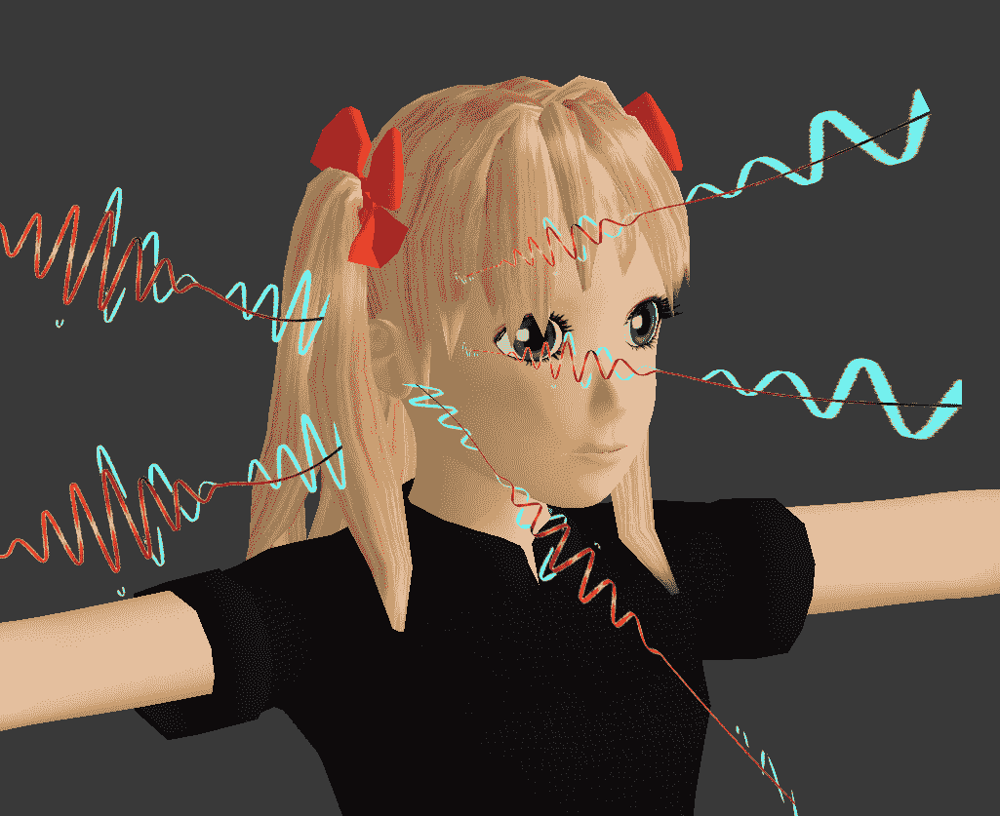

声音感知

1.  视频：

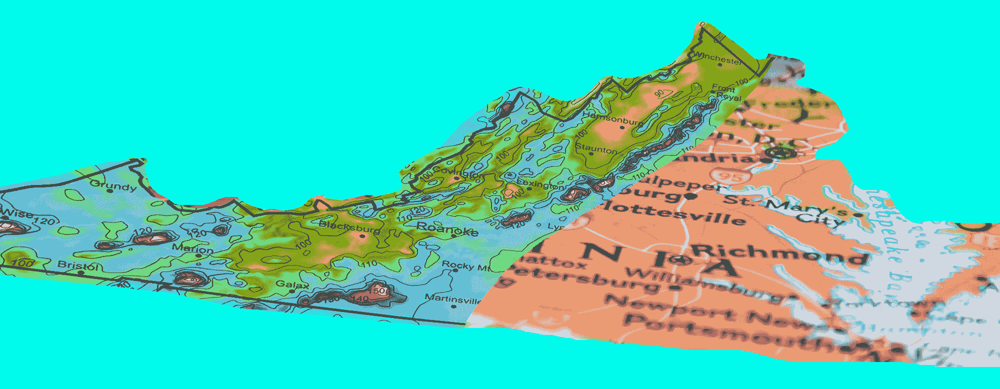

这张图片中的文字并不重要。我们只是展示视频感知叠加。

1.  图形：

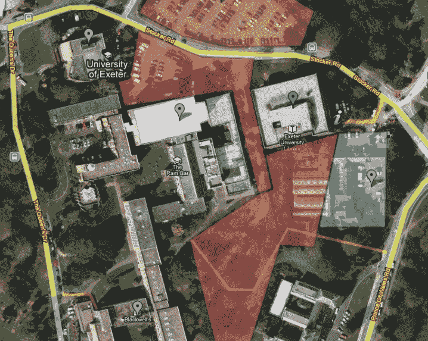

这张图片中的文字并不重要。我们只是展示图形感知叠加。

1.  触觉：


触觉感知

1.  GPS 数据：


GPS 感知

这意味着我们可以增强一个物体的视觉图形，并以不同于我们习惯的视角来观察它，或者我们可以添加一些原本不存在的东西。视频则略有不同，因为它需要软件与专用硬件（如眼镜、手机、HUD 和其他设备）进行交互。

我们可以增强我们周围世界的听觉方面。我们可以将我们看到的一种语言中的文字转换成另一种语言，或者我们可以捕捉那些我们总是听到但忽略的微弱声音，然后放大它们，真正地将它们带到前台。

触觉感知稍微困难一些，但可以通过模拟触觉的传感器来实现。我们可以使某些东西轻微或强烈地振动来模拟各种效果，或者我们可以使游戏或应用完全基于触觉或运动传感器。在应用或游戏中，我们可以使用许多其他东西来进行触觉感知。这是一个不断被研究和扩展的领域。

对于 GPS 数据，我们可以使用用户的位置来了解用户在应用或游戏世界中的位置。GPS 数据的另一个用途是确定用户感兴趣的内容是否应该显示给他们。

由于 Unity3D 喜欢为我们处理实现的大部分细节，我们不必太担心将 DLL（动态链接库）或编写包装类与大多数流行的 AR 和 VR 设备一起使用。根据平台和引擎是否已更新以专门用于这些设备，这个规则可能有例外。

Android 和 iOS 是最受欢迎的应用和游戏集成 AR 的设备，然而，各种技术巨头一直在努力将更多设备加入其中，效果各有不同。其中一些显然不会使用 Unity3D 进行实现，尽管你可以像之前提到的那样编写包装类，但这超出了本书的范围。

# AR 设备的不完全列表

让我们快速浏览一些具有 AR 功能的设备。这应该能让我们对可以使用和部署的不同类型设备有一个更清晰的认识：

+   **Meta 2** 是一款头戴式显示器，用于手部交互和位置跟踪，它具有 90 度的视野和 2560 x 1440 的分辨率：

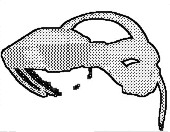

Meta 2

+   AR 显示可以渲染在类似眼镜的设备上，例如**Google Glass**：


Google Glass

+   另一种这样的设备是 HoloLens：

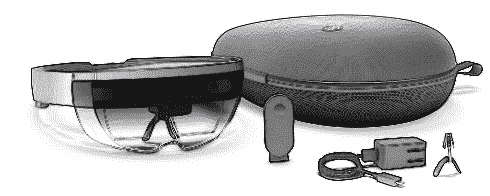

HoloLens

+   有一种称为**抬头显示**的东西，通常被称为**HUD**。它是 AR 显示的另一种实现方式：


HUD

+   正在研究和创建许多新的设备。增强现实仍然处于起步阶段。

在整本书中，我们将创建受 AR 定义启发的应用程序和游戏。由于 AR 有四个主要方面，我们将使用这四个方面并为每一章创建一个特定的应用程序或游戏。由于 Android 和 iOS 设备可用的传感器数量有限，一些传感器将在多个项目中使用。

# 不同 AR 工具包的优缺点

在本节中，我们将讨论 ARCore、Vuforia、ARToolKit 和 ARKit 的优缺点。

# ARCore

ARCore 是一个用于为 Android 设备构建增强现实应用的平台。ARCore 使用三种关键技术通过摄像头将虚拟内容与真实世界集成。它使用运动跟踪、环境理解和光照估计。ARCore 通过跟踪设备移动时的位置并构建对真实世界的理解来工作。它能够从手机的传感器中识别有趣的位置和读数，并且能够确定手机移动时的位置和方向。目前 ARCore 只支持少数设备，如下所示：

+   Google Pixel

+   Pixel XL

+   Pixel 2

+   Pixel 2 XL

+   Samsung Galaxy S8

如果你没有这些设备中的任何一个，你将不得不使用 Android 模拟器进行测试。这是一个非常明显的缺点，因为并非每个人都拥有这些特定的手机；此外，Android 模拟器是一个实验性软件，经常发生变化。优点是 ARCore 与 Unity3D 和 Unreal Engine 兼容，并且可以原生支持使用 Java 编程语言的 Android 设备。

# ARKit

ARKit，自 iOS 11 以来推出，是一个用于轻松创建适用于 iPhone 和 iPad 的增强现实项目的框架。ARKit 的功能包括：

+   TrueDepth 相机

+   视觉惯性里程计

+   场景理解

+   光照估计

+   渲染优化

ARKit 的缺点是它是一个实验性软件，经常发生变化，并且需要使用 Apple iPhone X 来充分利用 TrueDepth 相机。你不能在 Windows 上编译它用于 Mac，因此即使是测试代码也需要 macOS。然而，优点是 ARKit 与 Unity3D 和 Unreal Engine 兼容，并且可以利用 A9、A10 和 A11 Apple 处理器。换句话说，它与 iPhone 6S 及以上版本兼容。

# Vuforia

Vuforia 是最受欢迎的平台之一，可以帮助你进行增强现实开发。它支持以下功能：

+   Android

+   iOS

+   UWP

+   Unity3D 编辑器

Vuforia 能够执行许多不同的事情，例如识别不同类型的视觉对象（如盒子、圆柱体和平面），文本和环境识别，以及 VuMark，这是一种图片和二维码的组合。此外，使用 Vuforia Object Scanner，你可以扫描并创建对象目标。识别过程可以使用数据库（本地或云存储）实现。Unity 插件易于集成且功能强大。平台的所有插件和功能都可以免费使用，但包含 Vuforia 水印。

限制仅与 VuMark 的数量和云识别的数量有关：

+   无水印的付费计划

+   1,000 云识别

+   100,000 个目标

+   每月费用为 $99

显而易见的缺点是这并不是 100%免费的软件，尽管他们确实有一个开发者级别，每月免费提供 1,000 个云识别和 1,000 个目标。

# ARToolKit

ARToolKit 是一个开源的 AR 项目跟踪库。它支持 Android、iOS、Linux 和 macOS。ARToolKit 具有利用以下功能的能力：

+   单个或立体相机用于位置/方向跟踪

+   简单黑色方块的跟踪

+   平面图像跟踪

+   摄像机标定

+   光学立体标定

+   光学头戴式显示器支持

它足够快，可以用于实时 AR 应用。它也是免费的开源软件，有 Unity 和 OpenSceneGraph 的插件。这个软件的缺点是它有大量的功能，因此集成库很困难，探索所有可用选项和设置需要更多时间。

# 构建我们的第一个 AR 应用程序

这个部分将定义我们可用的每个不同 SDK 的主要点，我们将用它们构建我们的第一个程序。这将是一个逐步的、非常深入的教程设计方式，因为这是一些需要打包和压缩到小节中的大量信息，而不需要在后面的章节中重复信息。

# 设置 Vuforia

现在是时候为每个不同的 SDK 设置一个 Unity3D 项目了，这些项目将作为我们稍后章节的基础，当我们使用它们来构建应用程序或游戏时。让我们从 Vuforia 开始，因为它是最容易设置的：

1.  我们现在需要注册 Vuforia。导航到[`developer.vuforia.com/vui/user/register`](https://developer.vuforia.com/vui/user/register)以进入注册登录页面。如果你居住在 Google 被封锁的国家，你应该使用 VPN，因为注册页面使用了 Google 驱动的 reCAPTCHA，没有它你无法继续：


在 Vuforia 上注册

1.  一旦你可以登录，导航到“开发”标签页；或者，点击以下链接：[`developer.vuforia.com/targetmanager/licenseManager/licenseListing`](https://developer.vuforia.com/targetmanager/licenseManager/licenseListing)。

1.  你将看到两个主要项目，许可证管理器和目标管理器。许可证管理器将允许你创建一个免费的开发密钥或购买一个开发密钥。我们想创建一个免费的。点击获取开发密钥。为应用输入一个名称，你可以随时更改。我将称它为`VuforiaIntro`：

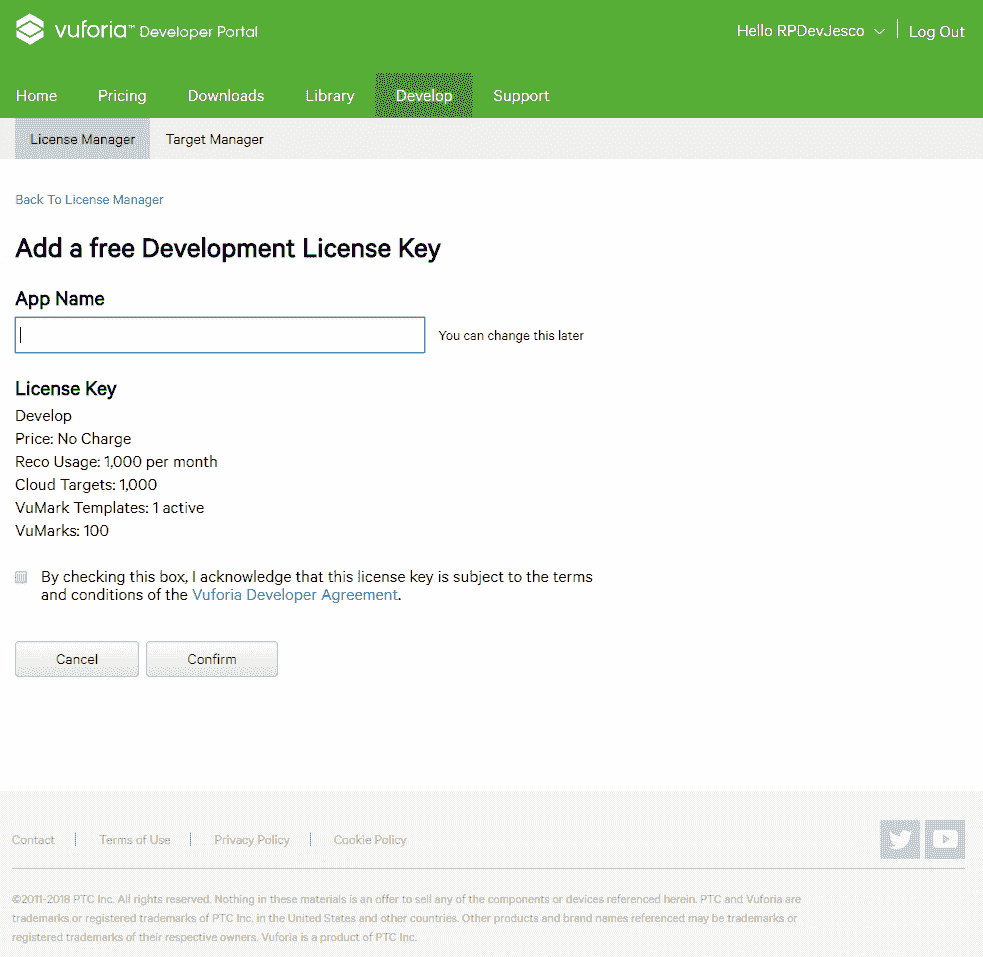

添加 Vuforia 密钥

1.  现在，我们有了 Vuforia 的密钥。为了查看许可证密钥，我们需要点击我们应用的名称：

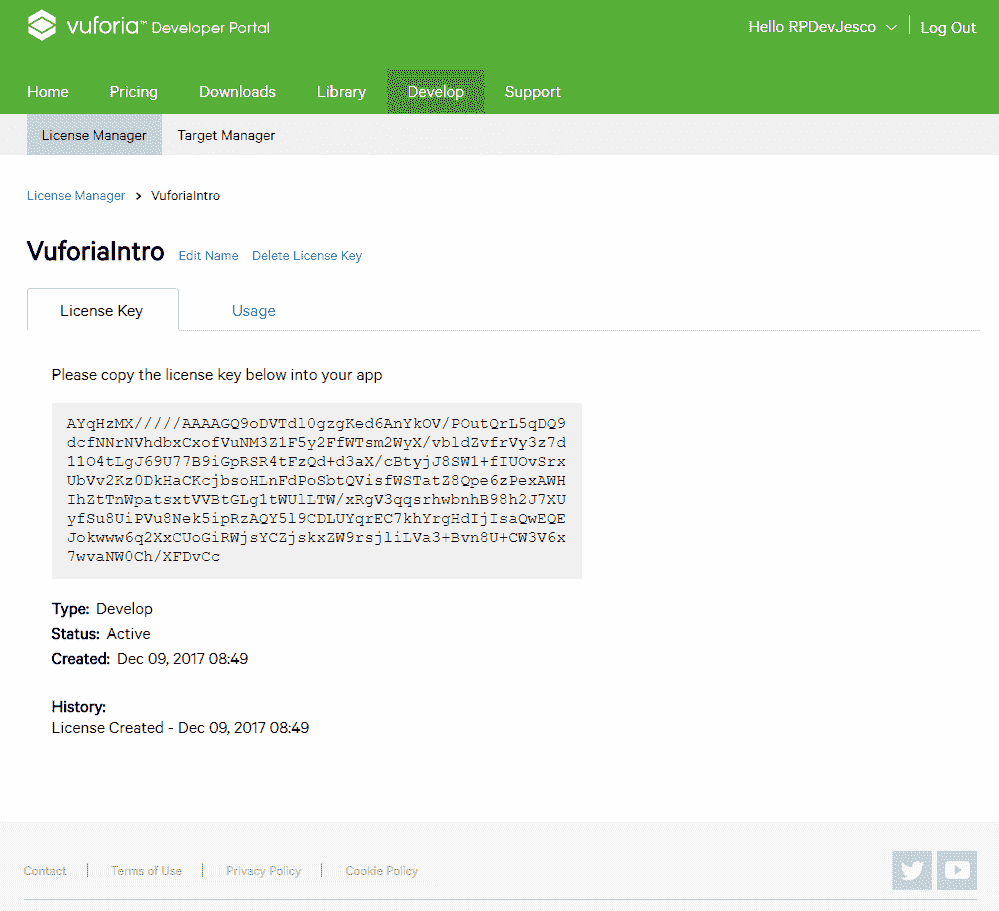

Vuforia 密钥信息

1.  下一页提供了两个非常重要的信息：许可证密钥和使用详情。使用详情告诉我们有多少云识别、云数据库、使用的识别、使用的云目标、生成的 VuMark、VuMark 数据库、VuMark 模板和使用的 VuMark，以及我们目前剩余的 VuMark 数量：

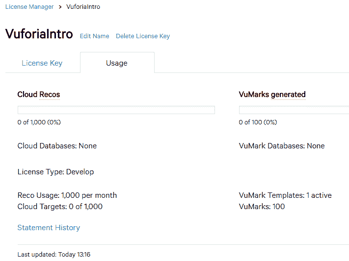

1.  许可密钥详细信息告诉我们我们的密钥（它很容易复制到剪贴板），密钥的类型，密钥的状态，创建日期以及密钥的历史。

现在，我们已经准备好设置 Vuforia 并使演示项目适当地工作。

如前所述，Vuforia 自 2017.2 版本起完全集成到 Unity3D 中，一旦你学会了 SDK 的基础知识，它就是一个梦想的工作。Vuforia 旨在严格处理 AR 的图形部分。它可以识别图像和对象，并且因为它使用计算机视觉，所以它能够与真实世界互动。由于 Vuforia 集成到 Unity3D 中，我们将一次性安装带有 Vuforia 的 Unity。

如果你现在电脑上没有安装 Unity3D，让我们先去安装它：

1.  导航到[`www.Unity3D.com`](http://www.Unity3D.com)并下载最新的个人版（或其他版本，如果你是高端用户）安装程序：


1.  当你到达安装程序的组件部分时，请确保选择你想要支持的所有平台。我通常选择 Android 构建支持、Linux 构建支持、SamsungTV 构建支持、Tizen 构建支持、WebGL 构建支持以及 UWP（通用 Windows 平台）构建支持。还有一个额外的选项你需要确保选择，那就是 Vuforia 增强现实支持：

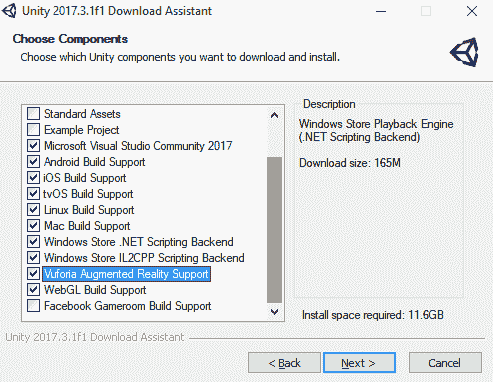

Vuforia Unity 安装

现在 Unity3D 已经安装完毕，让我们创建一个全新的 Unity 项目：

1.  Vuforia 建议你为他们的 AR 应用使用 3D 项目设置，所以，考虑到这一点，我将保持它作为一个 3D 项目，禁用启用 Unity 分析，并且项目的名称应该是`VuforiaIntro`：

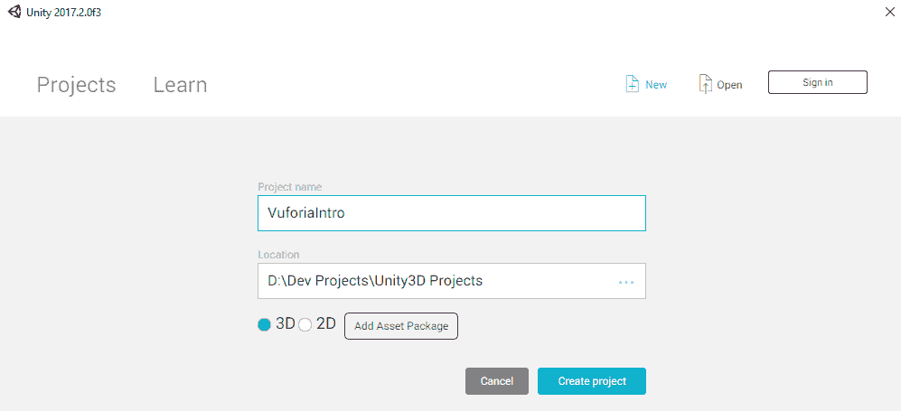

1.  一旦项目加载完毕，我们可以查看我们现在可以访问的一些额外的编辑器项目。在 Unity 编辑器顶部的工具栏中，我们将看到文件、编辑、资产、游戏对象、组件、窗口和帮助：

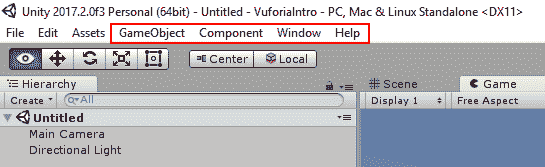

1.  游戏对象、组件、窗口和帮助中都有额外的项目被添加。看看游戏对象，我们可以看到额外的项目是 Vuforia。在 Vuforia 项目中，我们有 AR 相机、图像、多图像、圆柱形图像、云图像、相机图像、VuMark 和 3D 扫描：

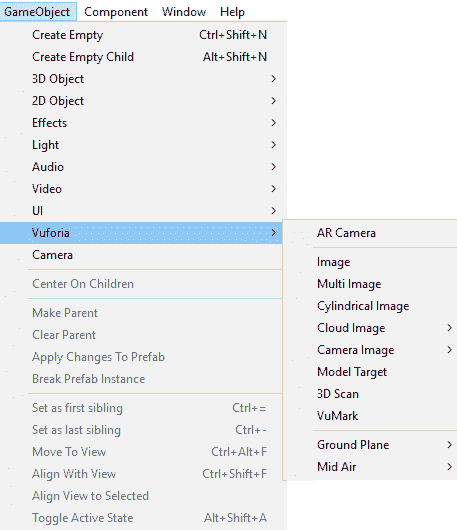

1.  云图像也有一些额外的项目，让我们看看那些。我们有云提供商和云图像目标可供我们使用：

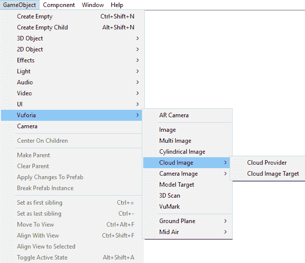

1.  相机图像也有一些额外的项目，因此我们也应该熟悉那些选项。可用的选项包括相机图像构建器和相机图像目标：

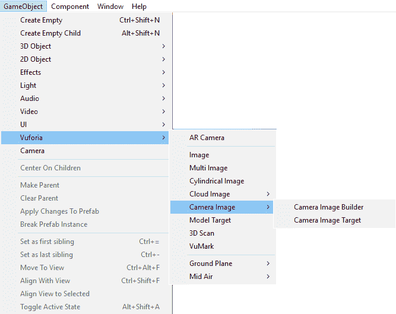

在我们继续之前，我们应该确切地知道这些选项的功能以及它们在应用许可证之前添加到项目中的样子。

AR Camera 替换了标准相机，因为它具有基础相机组件和音频监听器组件。我们还看到它附加了两个脚本，Vuforia Behavior 和 Default Initialization Error Handler：

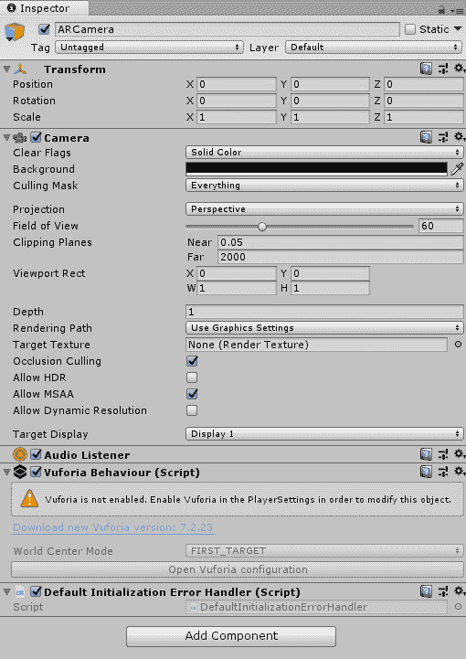

+   Image 允许你将可追踪的对象添加到你的 AR 项目中，并作为允许你在相机流中设置模型基点的依据。

+   Multi Image 允许你将多个可追踪对象添加到你的 AR 项目中，并作为将模型实时引入相机流的锚点。

+   Cylindrical Image 是一个锚点，用于将图像包裹在圆柱形物体上。

+   VuMark 是 Vuforia 团队制作的一种自定义条码。它允许你将其编码数据，同时充当类似于 Image、Multi Image 和 Cylindrical Image 的 AR 目标。

+   Cloud Provider 是直接链接到你的云端数据库的专用 AR 设计品牌链接。它应该用于出版物（目录、杂志、报纸等）、零售商（产品可视化和店内流量生成）、广告商（多品牌内容、优惠券和促销）以及产品识别（酒标/瓶子、谷物箱等）。

+   Cloud Image Target 允许你将可追踪的对象添加到 AR 项目中，并作为应用将识别数据发送到云端数据库以检索信息并按需显示的锚点。

+   Camera Image Builder 是一个允许你定义一个目标图像并将其存储在数据库中以供检索和在 AR 应用中使用的功能。

+   Camera Image Target 作为锚点使用，用于使用自定义目标图像在识别时在屏幕上显示你想要的内容。

接下来要讨论的一组项目位于组件工具栏中。特殊组件位于组件窗口的 AR、脚本和 XR 部分，如下面的截图所示以供参考。为了使用它们，你必须在场景中有一个游戏对象，并从工具栏中将组件添加到它。我们提供了 World Anchor、Tracked Pose Driver、Spatial Mapping Collider 和 Spatial Mapping Renderer。我们应该深入了解这些项目，以便确切了解它们的功能：

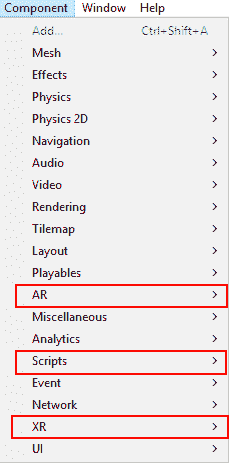

+   World Anchor 是一个组件，它代表物理世界中一个确切点与 World Anchor 的父 GameObject 之间的链接。一旦添加，带有 World Anchor 组件的游戏对象将锁定在现实世界中的位置。

+   Tracked Pose Driver 是一个组件，它将跟踪设备的当前姿态值应用于游戏对象的变换。

+   Spatial Mapping Collider 允许进行与空间映射网格的物理（或角色）交互，例如物理交互。

+   空间映射渲染器是一个组件，它为空间映射表面提供视觉表示。这对于在视觉上调试表面和在环境中添加视觉效果非常有用。

应该注意的是，在脚本部分有一些与 Vuforia 相关的项目，但是我们将不会在这里介绍它们。但是，为了确保项目被列出，它们如下：

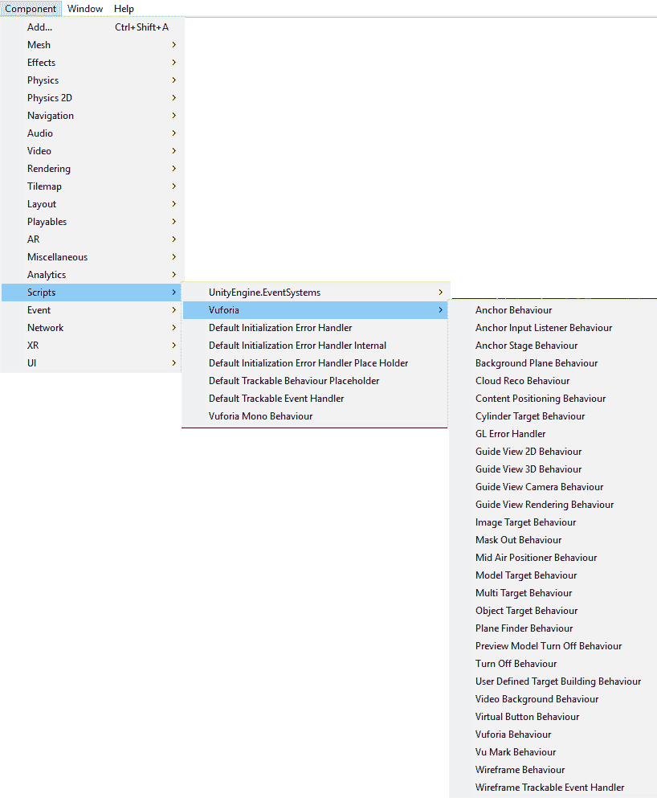

+   背景平面行为

+   云端识别行为

+   圆柱目标行为

+   GL 错误处理器

+   图像目标行为

+   遮罩排除行为

+   多目标行为

+   物体目标行为

+   属性行为

+   重建行为

+   从目标重建行为

+   表面行为

+   文字识别行为

+   关闭行为

+   关闭文字行为

+   用户定义的目标构建行为

+   视频背景行为

+   虚拟按钮行为

+   Vuforia 行为

+   Vuforia Deinit 行为

+   Vu Mark 行为

+   线框行为

+   线框可追踪事件处理器

+   文字行为

在检查器面板中，我们有 Vuforia 配置。以下是其截图；接下来，我们将定义它所做的工作：

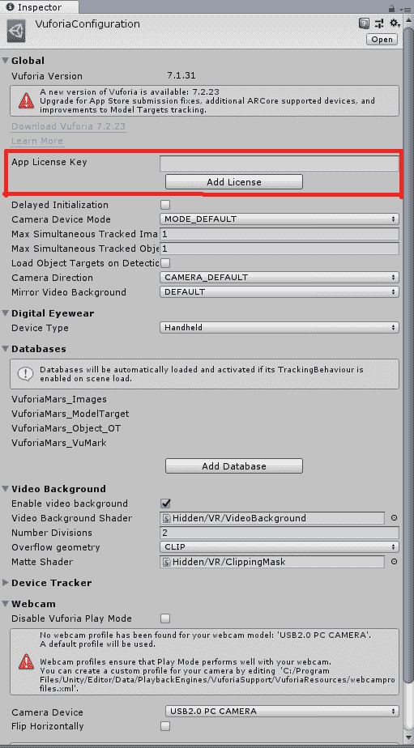

Vuforia 配置允许你输入你的许可证密钥。点击添加许可证将加载 Vuforia 开发者登录页面。它还允许你指定你想要 Vuforia 配置为工作的内容，例如 HUD、智能眼镜、摄像头或智能手机。

我还想指出，智能地形追踪器已被弃用，将在 Vuforia 的下一个版本中移除。如果你正在阅读这本书，并且截图看起来不一样，你现在知道原因了，所以不必担心。

由于我们在这里，让我们继续将我们的应用密钥添加到 Vuforia 中（参见 Vuforia 添加许可证以获取其位置）：

1.  你应该创建自己的应用密钥，因为我的应用密钥在本书发布时将不再有效。在将你的密钥复制粘贴到许可证密钥框中后，只需按下*Return*/*Enter*键即可完成：

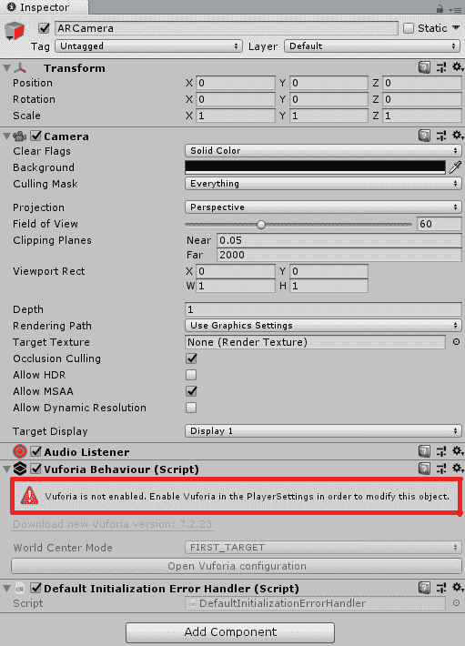

1.  由于我们正在 PC 上进行测试，如果你有适用于该 PC 的工作摄像头，请确保摄像头设备选择了正确的摄像头用于使用：

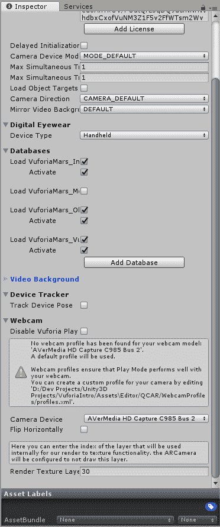

1.  接下来，我们需要进入 Unity 播放器设置并修复一些选项。导航到文件并点击构建设置。构建设置窗口应该会出现。确保将项目类型更改为构建到 Android，然后点击播放器设置：

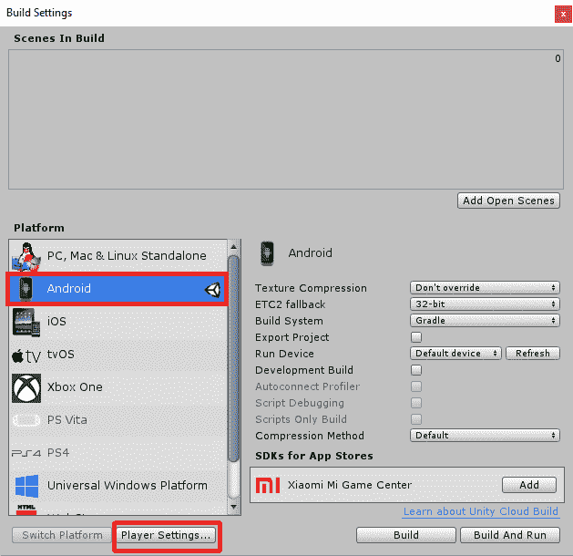

1.  Vuforia 不支持 FAT 设备过滤器或 Android TV，因此我们需要更改这两个选项。位于其他设置中的设备过滤器需要更改为 ARMv7，并且需要取消选中 Android TV 兼容性。

1.  现在，我们可以最终构建我们的“Hello World”AR 应用程序进行测试，以确保 Vuforia 和 Unity3D 一起工作良好。如果您还没有这样做，请从 Hierarchy 窗口中删除常规相机组件，并用 ARCamera 替换它：

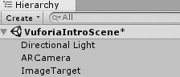

1.  下一步是将 Vuforia 图像添加到场景中，这同样也被称为 ImageTarget：

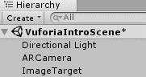

1.  现在，我们需要下载并将一个 3D 模型添加到场景中。所以，让我们走捷径，只需将一个球体添加到场景中，并将 *x*、*y* 和 *z* 缩放设置为 `0.3`。特别小心确保球体是 ImageTarget 的子对象。*这一点非常重要*：

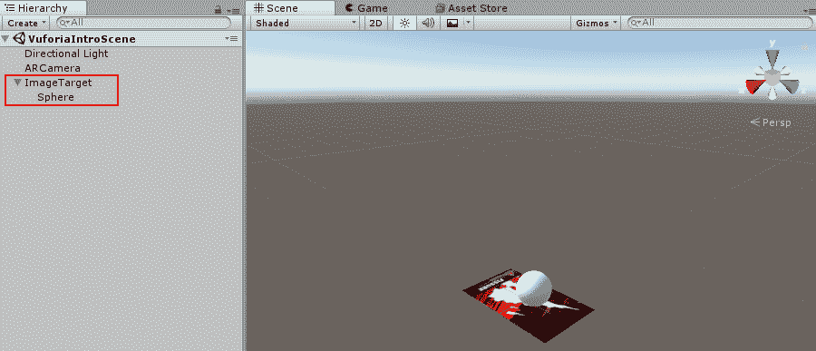

1.  下一步是导航到 Editor | Vuforia | ForPrint | ImageTargets，并在一张纸上打印出 `target_images_A4` 或 `target_images_USLetter`：

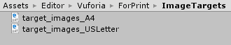

1.  一旦打印出来，我们就可以开始测试的最后部分，即运行程序并将打印出的无人机图像放在网络摄像头前：

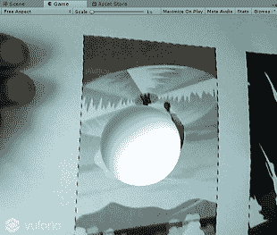

本截图中的文本并不重要。它显示了一个当图像被识别时出现在相机输入中的球体。

1.  Vuforia 已正确配置并经过适当测试，因此我们可以继续设置和配置下一个 SDK。

# 设置 ARToolKit

ARToolKit 的设置和开始使用稍微有些复杂。

ARToolKit 已被弃用，现在它是 Daqri Vos API 的一部分。您可以在[`developer.daqri.com/#!/content/develop`](https://developer.daqri.com/#!/content/develop)查看它。本节保留在此，以防您想从 github 链接[`github.com/artoolkit/arunity5`](https://github.com/artoolkit/arunity5)使用 ARToolkit。

您有两种不同的方式可以在项目中获取 ARToolKit 并准备开发。第一种选项是最简单的，那就是通过 Asset Store：[`assetstore.unity.com/packages/tools/artoolkit-6-unitypackage-94863`](https://assetstore.unity.com/packages/tools/artoolkit-6-unitypackage-94863)。这是 Asset Store 中 ARToolKit 的最新版本，它将直接导入到 Unity 中。另一种选项是访问 ARToolKit 的官方网站：[`github.com/artoolkit/artoolkit5`](https://github.com/artoolkit/artoolkit5)。这允许您获取额外的工具和实际的 SDK，以及 Unity 包。

对于 Unity3D 的安装，我们将选择第二种选项，因为它不如第一种选项直观：

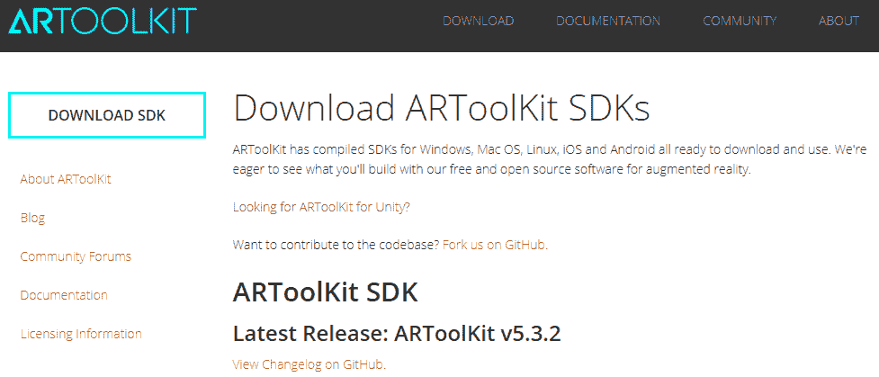

1.  导航到 ARToolKit 的官方网站，点击下载 SDK。macOS、Windows、iOS、Android、Linux、Windows 8.1 和源依赖项不需要下载，但如果你想深入了解 ARToolKit 的内部工作原理，或者你想在非 Unity 环境中使用它，则可以下载。相反，转到页面底部并点击下载 Unity 包按钮：

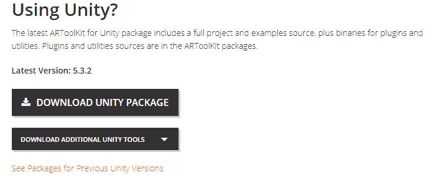

如果你目前没有进行更复杂的工作，那么如果你在 macOS 上，你不需要额外的 Unity 工具，但如果你在 PC 上，我建议获取 Windows 工具，因为 ARToolKit 需要它们在 PC 上进行调试，而无需使用 Android 模拟器或测试 Linux。

1.  现在包已经下载，我们需要打开 Unity3D 并创建一个新的项目。我将我的项目命名为 `ARToolKitIntro`。为了简单起见，保持默认设置：

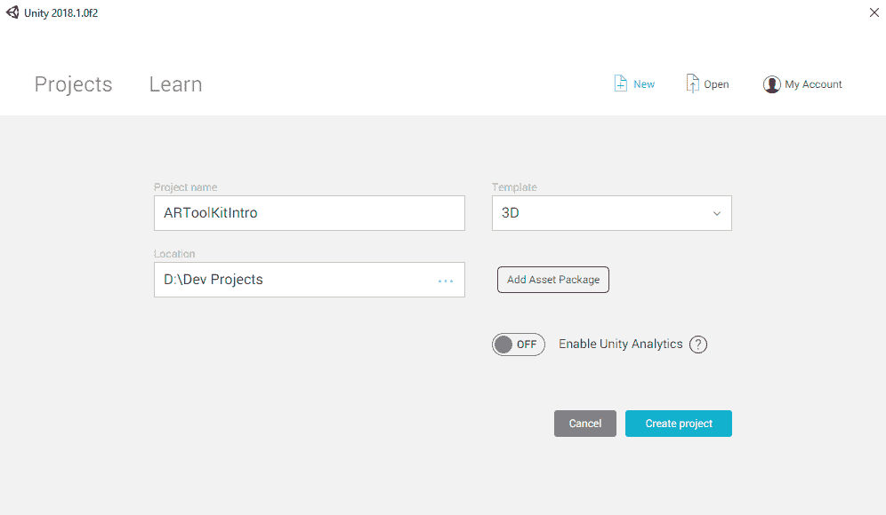

1.  现在，我们需要将 Unity 包导入到 Unity 中。这个过程非常直接。右键点击 `Assets` 文件夹，选择导入包，然后选择自定义包：

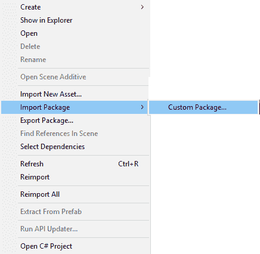

1.  导航到存放下载的 Unity 包的文件夹，点击它，然后选择打开。你应该会看到一个带有复选框的对话框。点击全选，然后点击导入：

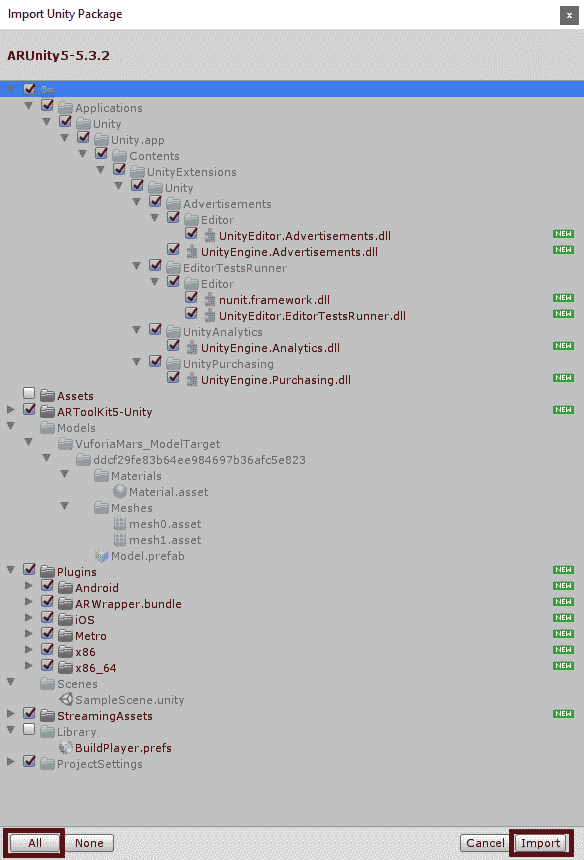

1.  导入完成后，你会看到三个文件夹（`ARToolKit5-Unity`、`Plugins` 和 `StreamingAssets`）：

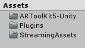

在 `ARToolKit5-Unity` 文件夹中，有 `Example Scenes`、`Examples`、`Materials`、`Resources`、`Scripts`、`Changelog` 和 `Readme` 文件和文件夹：

+   在 `Scripts` 中，我们有一个带有以下截图所示功能的 `Editor` 文件夹：

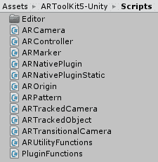

+   在 `Editor` 文件夹中，我们有以下内容：

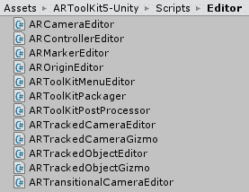

+   接下来是 `Plugins` 文件夹。它列出了以下文件夹：

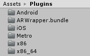

+   如果你查看 Unity 编辑器顶部的菜单栏，你会看到一个额外的工具栏项：ARToolKit。下拉菜单显示了几个选项：Unity 版本 5.3.2 的 ARToolKit、下载工具、构建、支持和源代码：

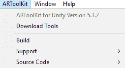

+   支持包括主页、文档和社区论坛：

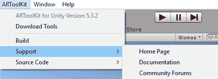

+   源代码有查看 ARToolKit 源代码和查看 Unity 插件源代码：

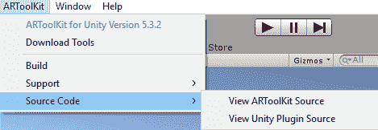

基本步骤完成，我们可以开始使用 ARToolKit 构建 "Hello World"：

1.  我们需要做的第一件事是在层次结构面板中创建一个空的游戏对象，并将其重命名为 `ARToolKit`。

1.  下一步是将 `ARController` 脚本添加到游戏对象中，并删除相机：

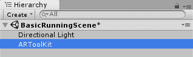

1.  `ARController`脚本处理 AR 跟踪的创建和管理。它在运行时自动添加一个摄像头，并由我们提供的用户层控制。

1.  使用 ARToolKit 的最新版本，已经为你提供了基本用户层：分别为用户层 8、9 和 10 提供了`AR 背景`、`AR 背景 2`和`AR 前景`：

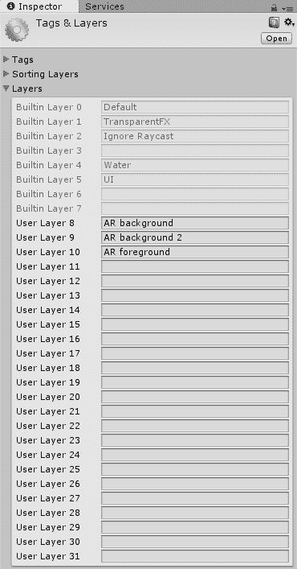

1.  AR 控制器脚本有一个视频选项下拉菜单：

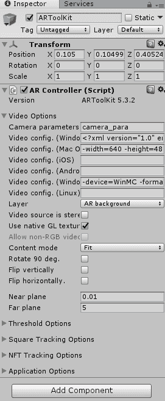

1.  由于我们有这么多不同的视频选项，我们需要正确设置：

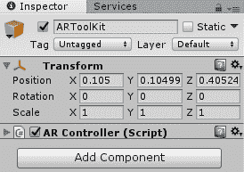

1.  如果你发现在 Unity 编辑器的控制台中出现错误，那么你使用的 ARToolKit 版本不是最新的，与本书中使用的 Unity 版本不匹配。

由于我正在为 Windows 构建，我将选择视频配置的第一个选项，并输入以下内容：

```cs
 <?xml version="1.0" encoding="utf-8"?>
 <dsvl_input>
 <camera show_format_dialog="false" frame_width="1280" frame_height="720" frame_rate="29.97">
 <pixel_format>
 <RGB32 flip_v="true"/>
 </pixel_format>
 </camera>
 </dsvl_input>
```

现在，由于我的电脑目前没有连接摄像头，我收到了游戏中的错误消息，但代码按预期编译并运行。如果你连接了摄像头并且它被正确识别，你应该有来自摄像头的直接视频流。

这就完成了 ARToolKit 的 Hello World 示例；我们稍后会再次访问这个示例，以便更深入和有趣地使用这个 SDK。

# 设置 ARCore

ARCore 和 ARKit 在本质上非常相似，但你不能在 Windows 环境中编译 ARKit，这正是我现在使用的环境。不用担心；当我们到达 ARKit 时，我会使用 macOS 来给你一个使用时的正确视图和感受。

话虽如此，现在是时候更深入地了解 ARCore 了。

ARCore 是由谷歌制作的，目前处于早期预览阶段；它甚至还没有达到 1.0 版本，因此肯定会发生许多变化，其中一些可能会对现有的应用程序或游戏造成极大的损害。

有两种方式可以获取 Unity 的 SDK 预览。第一种是通过 Unity 包文件（[`developers.google.com/ar/develop/unity/quickstart-android`](https://developers.google.com/ar/develop/unity/quickstart-android)），另一种是通过 GitHub（[`github.com/google-ar/arcore-unity-sdk`](https://github.com/google-ar/arcore-unity-sdk)）。现在，由于我最近从亚马逊网络服务下载时遇到了问题，我将使用第二个链接：

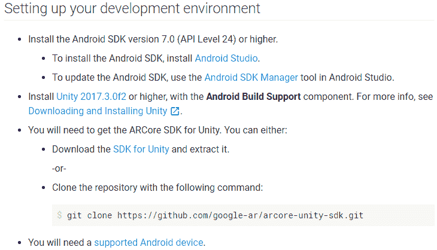

记住这一点至关重要，如果你没有三星 Galaxy 8 或谷歌 Pixel 手机，你将无法在设备上运行适当的测试。然而，如果你还安装了 Android Studio，你确实可以访问 Android 模拟器：

1.  首先，在 Unity 中创建一个新的项目，并将其命名为`ARCoreTutorial`：

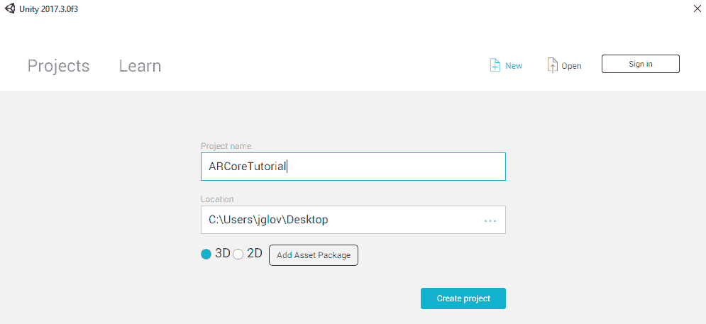

1.  在进行任何其他操作之前，我们需要将构建设置更改为 Android：

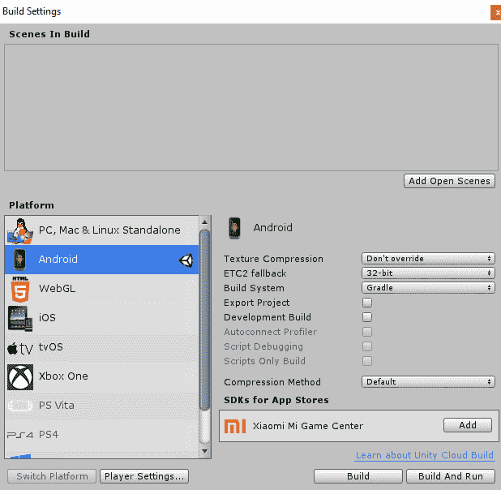

1.  接下来，我们需要更改玩家设置。我们需要更改的主要设置在“其他设置”标签页内，所以让我们看看需要更改什么。

1.  其他设置：我们希望取消勾选多线程渲染；最小 API 级别应为 Android 7.0 ‘Nougat’ API 级别 24；目标 API 级别应为 Android 7.0 ‘Nougat’ API 级别 24 或 Android 7.1 ‘Nougat’ API 级别 25：

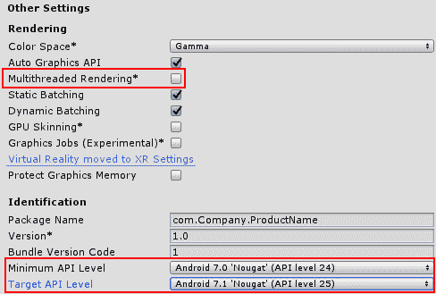

5. XR 设置：我们希望 ARCore Supported 被勾选：

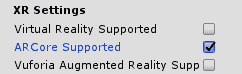

6. 接下来，我们想要解压 SDK 或将包导入 Unity3D：

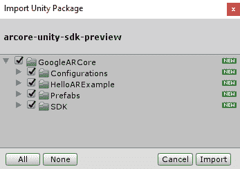

立即，我们应该看到`tango_client_api2`的 DLLNotFoundException。这是正常的，并且社区中广为人知。尽管如此，它不应该在运行时引起任何错误；它应该在后续版本中修复。

# 设置 ARKit

ARKit 需要使用 macOS High Sierra，因为编译和修改 API 本身需要 XCode 9 及更高版本。因此，我强烈建议使用 2011 年后期或更新的 macOS。我正在使用 2011 型号的 Mac Mini，拥有 8GB 的 RAM，尽管标准的 4GB 应该足够。Unity3D 广泛使用 OpenCL/OpenGL，这需要能够利用 Metal 的 GFX 卡。2011 年及更早的 macOS 没有这种原生能力；可以通过拥有外部 GPU（目前官方仅支持 Radeon RX 480）来解决这个问题。

在处理完这些之后，我们可以开始在我们的 macOS 上安装和配置 Unity3D 的 ARKit。

您有几种方式可以安装 ARKit：

1.  我们可以导航到 Asset Store 上的插件页面（[`www.assetstore.unity3d.com/en/#!/content/92515`](https://www.assetstore.unity3d.com/en/#!/content/92515)）：

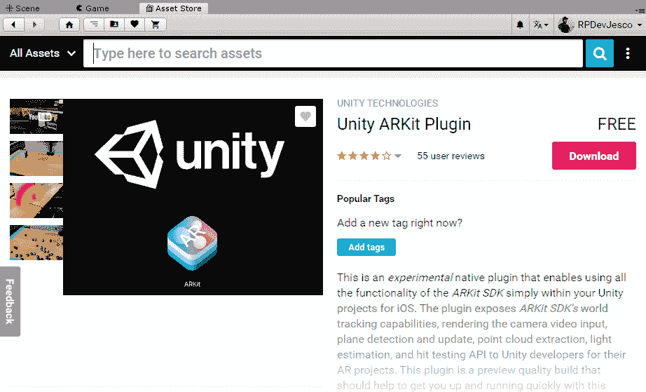

1.  或者我们可以直接从 Bitbucket 仓库下载插件（[`bitbucket.org/Unity-Technologies/unity-arkit-plugin/overview`](https://bitbucket.org/Unity-Technologies/unity-arkit-plugin/overview)）：

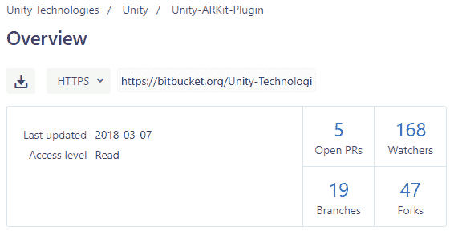

1.  如果我们选择第一种方式，从 Asset Store 安装，我们就不必担心自己将文件复制到我们的项目中，但无论如何，这样做都很简单，所以选择你想要的方法，创建一个名为`ARKitTutorial`的新项目：

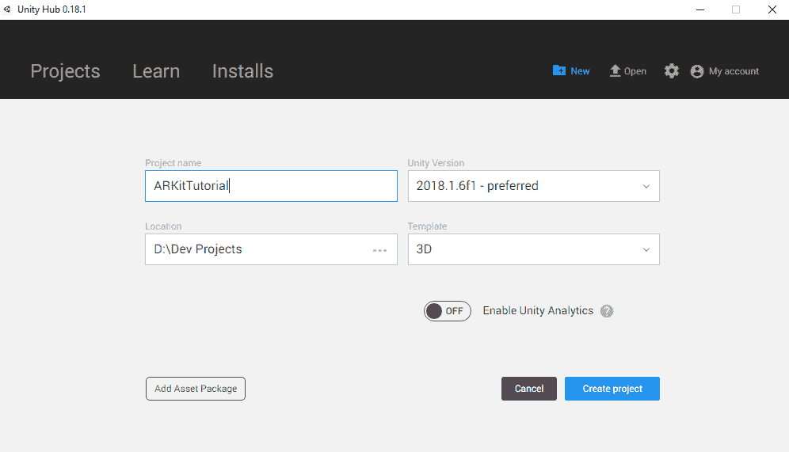

接下来，我们有很多东西要解开这个包实际上包含的内容：

+   `/Assets/Plugins/iOs/UnityARKit/NativeInterface/ARsessionNative.mm` – 这是与 ARKit SDK 实际接口的 Objective-C 代码。

+   `/Assets/Plugins/iOS/UnityARKit/NativeInterface/UnityARSessionNativeInterface.cs` – 这是将原生代码与 ARKit 粘合的脚本 API。

+   `/Assets/Plugins/iOS/UnityARKit/NativeInterface/AR*.cs` – 这些是 ARKit 公开的数据结构的等效物。

+   `/Assets/Plugins/iOS/UnityARKit/Utility/UnityARAnchorManager.cs` – 这是一个实用脚本，用于跟踪 ARKit 的锚点更新，并可以在 Unity 中为它们创建适当的相应 GameObject。

+   `/Assets/Plugins/iOS/UnityARKit/Editor/UnityARBuildPostprocessor.cs` – 这是一个在 iOS 构建时运行的编辑器脚本。

+   `/Assets/Plugins/iOS/UnityARKit/UnityARCameraManager.cs` – 这是应该放置在场景中 GameObject 上的组件，该 GameObject 引用您想要控制的相机。它将定位和旋转相机，并根据 ARKit 的更新提供正确的投影矩阵。此组件还作为 ARKit 会话初始化。

+   `/Assets/Plugins/iOS/UnityARKit/UnityARVideo.cs` – 这是应该放置在相机上的组件，用于获取渲染视频所需的纹理。它设置用于将内容写入后缓冲区的材质，并设置用于写入的命令缓冲区。

+   `/Assets/Plugins/iOS/UnityARKit/UnityARUserAnchorComponent.cs` – 这是根据添加到其上的 GameObject 的生命周期添加和删除 ARKit 锚点的组件。

在我们构建自己的“Hello World”示例之前，我们应该将`UnityARKitScene.unity`构建到 iOS 中，以了解 ARKit 的能力，因为它演示了该场景中 ARKit 的所有基本功能。

`UnityARKitScene`包含在插件中，以及几个其他示例项目。我们将编译`UnityARKitScene`作为我们的 Hello World 应用程序。

然而，在我们这样做之前，我们需要讨论文件结构，因为那些不熟悉编译到 iOS 的人在没有进一步说明的情况下编译会遇到一些严重问题。您可能已经注意到插件中有许多我们没有提到的事项，所以让我们在继续之前讨论它们的功能。

`\UnityARKitPlugin` 主目录文件：

+   `ARKitRemote` – 允许您从您的设备向 Unity3D 编辑器发送远程命令。

+   `Examples` – 此目录包含示例脚本和场景，以展示您可以使用 ARKit 和此插件完成的各种操作。

+   `Plugins` – 存储运行 ARKit 所需的目录。

+   `Resources` – 存储 ARKit 所需的资源文件。

`Plugins\iOS\UnityARKit\NativeInterface` cs 文件：

+   `ARAnchor` – 将对象锚定到来自相机流的世界上某个位置。

+   `ARCamera` – 跟踪相机的位置。

+   `ARErrorCode` – 错误代码。

+   `ARFaceAnchor` – 面部跟踪锚点。

+   `ARFrame` – 返回有关相机、锚点和光估计的数据。

+   `ARHitTestResult` – 返回任何碰撞结果。

+   `ARHitTestResultType` – 可用碰撞测试类型的枚举。

+   `ARLightEstimate` – 计算图像或视频中的亮度。

+   `ARPlaneAnchor` – 将平面锚定到特定的 4x4 矩阵。

+   `ARPlaneAnchorAlignment` – 使锚点相对于重力水平对齐。

+   `ARPoint` – 一个包含 x 和 y 值的点结构，以双精度表示。

+   `ARRect` – 一个结构体，以 `ARPoint` 作为原点，以 `ARSize` 作为大小

+   `ARSessionNative` – 用于指定框架依赖项和插件应针对哪些平台工作的原生插件

+   `ARSize` – 一个结构体，接受宽度和高度值作为双精度浮点数

+   `ARTextureHandles` – 一个用于相机缓冲区的原生 Metal 纹理处理程序，它为 `textureY` 和 `textureCbCr` 值都接受 `IntPtr`（`int 指针`）

+   `ARTrackingQuality` – 可用跟踪质量的枚举

+   `ARTrackingState` – 跟踪状态的枚举。选项有限制、正常和不可用

+   `ARTrackingStateReason` – 状态原因的枚举。选项有过度运动、特征不足和初始化

+   `ARUserAnchor` – 定义此锚点在世界坐标系中的旋转、平移和缩放变换矩阵

+   `UnityARSessionNativeInterface` – 原生插件包装代码

`\Plugins\iOS\UnityARKit\Helpers` cs 文件：

+   `AR3DOFCameraManager` – 一个用于 AR 摄像头的 3D 对象的辅助类

+   `ARPlaneAnchorGameObject` – 一个附加有 `ARPlaneAnchor` 的 GameObject 的类

+   `DontDestroyOnLoad` – 确保在加载时不会销毁 GameObject

+   `PointCloudParticleExample` – 创建一个点云粒子系统

+   `UnityARAmbient` – 一个用于环境照明的辅助函数

+   `UnityARAnchorManager` – `ARPlaneAnchorGameObjects` 的管理器

+   `UnityARCameraManager` – 一个用于 `ARCamera` 的辅助类

+   `UnityARCameraNearFar` – 设置摄像机的近远距离

+   `UnityARGeneratePlane` – 创建一个 `ARPlaneAnchorGameObject`

+   `UnityARHitTestExample` – 测试从少量到无限量的平面碰撞

+   `UnityARKitControl` – 一个用于创建测试 `ARSession` 的辅助类

+   `UnityARKitLightManager` – 一个用于管理各种照明可能的辅助类

+   `UnityARMatrixOps` – 一个将 4x4 矩阵转换为欧几里得空间以进行四元数旋转的类

+   `UnityARUserAnchorComponent` – 一个用于创建锚点添加和删除事件的辅助类

+   `UnityARUtility` – 一个用于将 ARKit 坐标转换到 Unity 的辅助类

+   `UnityARVideo` – 一个将视频纹理渲染到场景的辅助函数

+   `UnityPointCloudExamples` – 一个用于使用粒子效果绘制点云的辅助函数

`\Plugins\iOS\UnityARKit\Shaders` 着色器文件：

+   `YUVShader` – 用于渲染纹理的伽玛 Unlit 着色器

+   `YUVShaderLinear` – 用于渲染纹理的线性 Unlit 着色器

`\UnityARKitPlugin\Resources` 文件：

+   `UnityARKitPluginSettings.cs` – 一个可脚本化的对象，用于切换应用是否需要 ARKit 以及切换 iPhone X 的面部追踪

`UnityARKitPlugin\ARKitRemote` 文件：

+   `ARKitRemote.txt` – 一个文本文件，解释如何设置和使用 ARKitRemote

+   `EditorTestScene.unity` – 当运行 `ARKitRemote` 时应该运行的测试场景

+   `UnityARKitRemote.unity` – 应该在适用设备上编译和安装的场景

+   `ARKitRemoteConnection.cs` – 用于将设备数据发送到 UnityEditor

+   `ConnectionMessageIds` – 编辑器会话消息的 GUID

+   `ConnectToEditor.cs` – 在编辑器和设备之间创建网络连接

+   `EditorHitTest` – 从设备返回碰撞数据到编辑器

+   `ObjectSerializationExtension.cs` – 将对象转换为字节数组的扩展

+   `SerializableObjects.cs` – 序列化 Vector 4 数据和一个 4x4 矩阵

+   `UnityRemoteVideo.cs` – 连接到编辑器，并将设备视频流传输到编辑器

`UnityARKitPlugin\Examples`文件：

+   `AddRemoveAnchorExample` – 一个示例程序，用于添加和删除锚点

+   `Common` – 包含在各个项目中使用的通用材料、模型、预制体、着色器和纹理

+   `FaceTracking` – 面部追踪示例应用程序

+   `FocusSquare` – 一个示例场景，它找到了特定的锚点

+   `UnityARBallz` – 一个示例场景，你可以在这里玩球类游戏

+   `UnityARKitScene` – 一个带有最小脚本的简单场景，用于测试 ARKit 是否正常工作

+   `UnityAROcclusion` – 一个展示各种光照条件的示例项目

+   `UnityARShadows` – 一个处理低光照条件的示例项目

+   `UnityParticlePainter` – 一个示例项目，让你可以用粒子来绘画

现在我们已经对这个包内部的所有内容有了基本的理解，让我们用 ARKit 构建我们的 Hello World。

# 在 ARKit 中构建 Hello World

在我们打开 UnityARKitScene 之后，我们需要做的第一件事是设置构建设置：

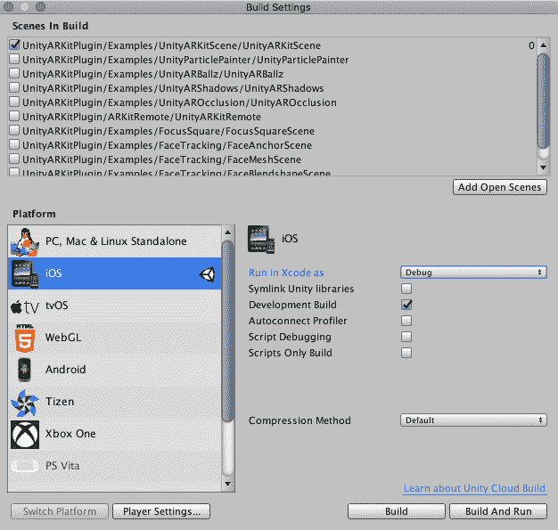

1.  点击构建设置并选择玩家设置。

1.  我们想要滚动到“识别”部分。包标识符应该设置为`com.unity.ARKitHelloTutorial`，版本为`0.1`，构建为`10.1`。自动签名复选框应该被勾选。自动签名团队 ID 设置留空：

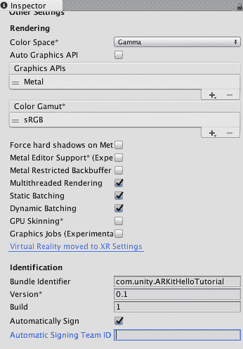

1.  仅构建 iOS 的`UnityARKitScene`。以调试模式运行 Xcode。

1.  仅勾选“开发构建”复选框；其他所有内容应保持默认设置。

1.  点击构建。我将把这个文件保存为`iOSTest`，保存在我的数据驱动器中名为`iOS`的文件夹里：

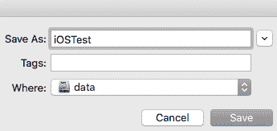

1.  构建过程不会花费很长时间，可能第一次构建只需要大约两分钟。

1.  下一步我们要做的是打开我们保存项目的文件夹，并在 Xcode 中打开`.xcodeproj`文件：

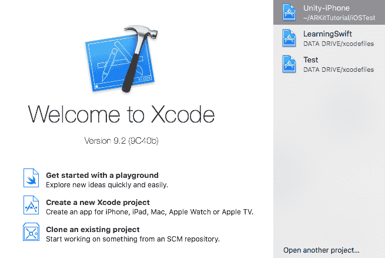

1.  让我们看看在 Xcode 中你会看到的基项目：

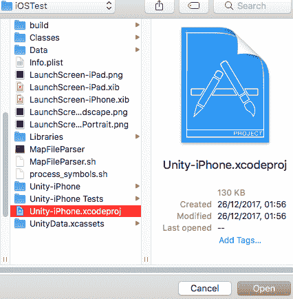

1.  我们首先想要检查的是“身份”选项卡，以确保这些设置与 Unity3D 中的设置相同：

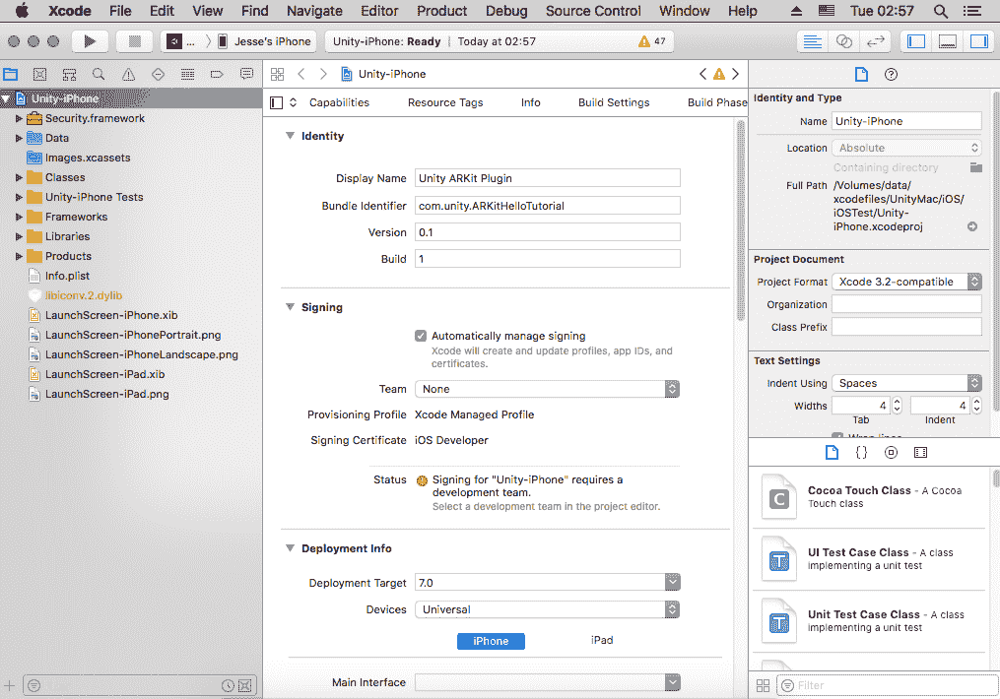

1.  现在，我们需要查看“签名”子部分：

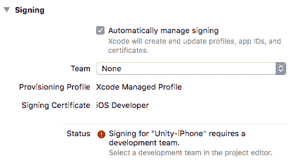

1.  我们需要确保添加我们的个人团队名称，你可以通过登录你的 Apple 开发者账户并点击你想要使用的团队的箭头来获取：

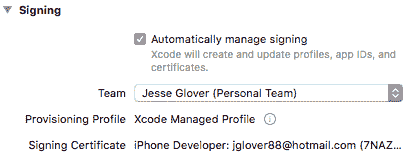

1.  部署信息接下来。部署目标需要更改为`11.2`。设备应设置为仅 iPhone。主界面是`LaunchScreen-iPhone.xib`：

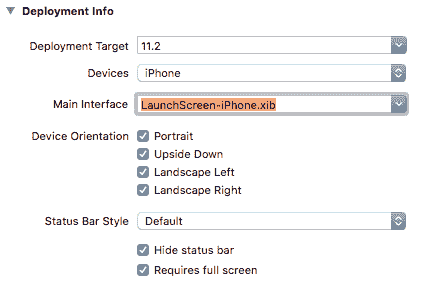

1.  点击顶部的构建设置，因为这里也有一些设置需要更改。

1.  在架构中，iPhone 的 ARCHS 应设置为标准。SDKROOT 应为最新 iOS（iOS 11.2）。SUPPORTED_PLATFORMS 应为 iOS：

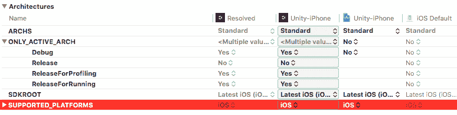

1.  接下来，向下滚动查看签名，值应该已经设置为正确的值：

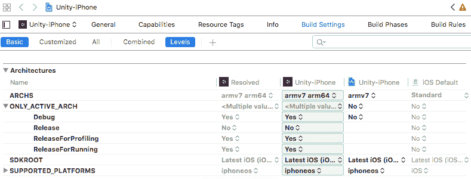

1.  现在，点击产品并构建：

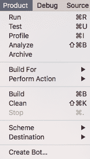

1.  构建应该成功完成，大约有 47 个警告，这是正常的：


1.  现在，我们可以在模拟器中构建和测试。我们想要做的是从 iPhone 切换到列表中的任何一个模拟器，所以点击你 iPhone 或任何你拥有的设备旁边的设备列表：


1.  你将看到一个你想使用的设备的大列表。这将从设备的模拟到连接到你的 macOS 的 iOS 设备：

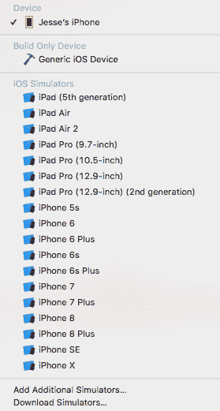

1.  点击你想要使用的模拟器，然后构建并运行应用程序。

恭喜！我们已经完成了这个 Hello World 应用程序。

# 摘要

我们学习了从许多公司提供的四个主要 AR SDK 的基本知识。我们只需付出最小的努力，就在每个 SDK 中安装并编译了一个工作示例，现在我们可以继续利用这些 SDK 的潜力，因为它们目前处于各自的发展阶段。

我们可以看到，所有四个 SDK 都足够简单易用，安装相对容易。在我看来，目前最好的 SDK 是 Vuforia。它具有最强大的 API，并且对于使用和进一步学习有非常详细的文档。

在下一章中，我们将专注于学习 GIS 的历史以及这段历史是如何塑造我们今天在 AR 应用程序和游戏中使用 GIS 的方式的。

# 问题

1.  ARView 是一个你可以用来在 Unity 中制作 AR 应用程序的 SDK：

A.) 正确

B.) 错误

1.  ARKit 是专门为 iOS 设备设计的：

A.) 正确

B.) 错误

1.  ARCore 是专门为 Windows 设备设计的：

A.) 正确

B.) 错误

1.  Vuforia 是为 iOS、Windows 和 Android 设备设计的：

A.) 正确

B.) 错误

1.  触觉感知完全是关于使用触觉：

A.) 正确

B.) 错误

1.  声音感知是你用眼睛看到的东西：

A.) 正确

B.) 错误

1.  GPS 数据让应用程序可以通过随机猜测来指定用户的位置：

A.) 正确

B.) 错误

1.  Unity 的 Windows 和 Android 插件需要 DLL 文件：

A.) 正确

B.) 错误

1.  Meta 2、HoloLens、抬头显示（HUD）和谷歌眼镜都被视为增强现实（AR）设备：

A.) 正确

B.) 错误

1.  Vuforia 并不是一个免费使用的 SDK：

A.) 正确

B.) 错误
