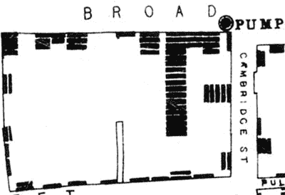
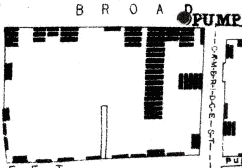
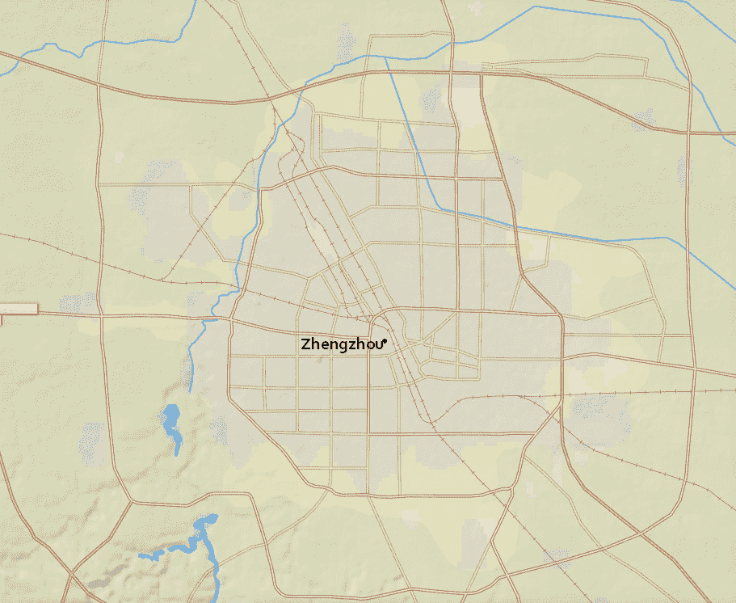
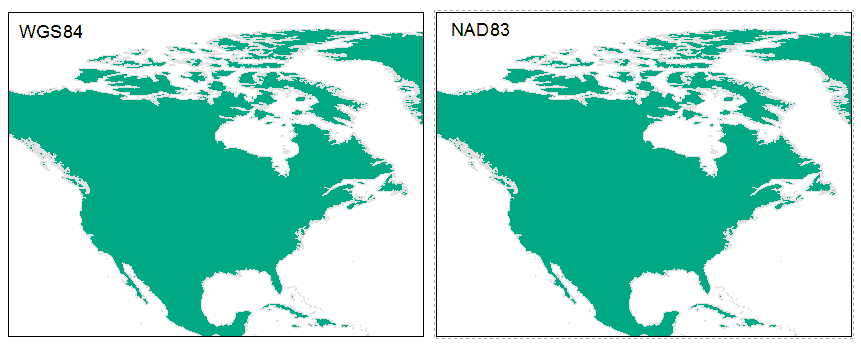
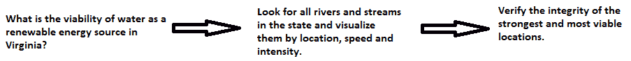
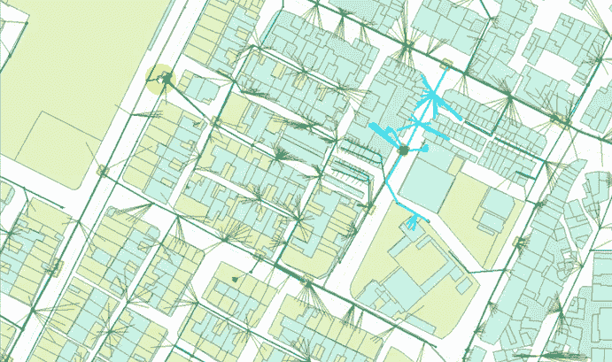
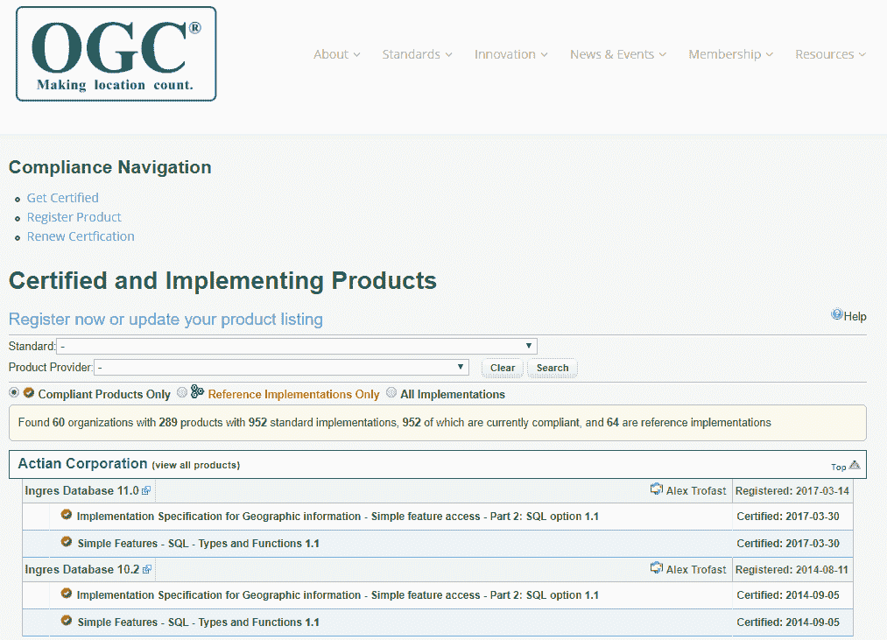

# GIS 基础 - 地图的力量

当谈到 **GIS**，即地理信息系统（Geographic Information Systems）的缩写，以及 AR 编程中的数据和用法时，它有多种风味和用途。然而，在我们深入探讨如何在 AR 游戏 和应用中使用 GIS 数据之前，我们首先必须了解 GIS 究竟是什么。因此，我们将讨论如下内容：GIS 是何时开发的，GIS 的创始人是谁，GIS 可以用于何处，以及 GIS 如何与游戏和应用开发相结合。这之所以重要，是因为 GIS 的历史直接影响到今天在 AR 应用和游戏中数据的使用方式；它还使我们能够欣赏那些在过去为我们利用在线可用数据做出贡献的人的辛勤工作。在本章的后面部分，我们将探讨如何从 GIS 的历史中学习，以创建应用和游戏的一些例子。本章将涵盖以下主题：

+   理解 GIS 是什么

+   GIS 和数据分析的历史

+   GIS 统计

+   GIS 的含义

+   GIS 和 AR

要了解 GIS 究竟是什么，我们必须深入挖掘以发现 GIS 的基本原理及其起源。GIS 和数据分析的历史非常迷人，将揭示许多让我们了解其设置和使用底层结构的事情。GIS 统计将使我们能够了解常用的数学方法，以便我们可以利用它们。GIS 的含义将向我们展示 GIS 的许多用途，不仅限于学术界，还包括教育和实际应用。

GIS 和 AR 将展示 AR 应用和游戏如何将 GIS 集成其中的许多必要示例。这将让我们对未来可以开发的内容有一个清晰的认识。

在本章中，我们将涵盖以下主题：

+   GIS 基础 – 地图的力量

+   GIS 和增强现实

# 什么是 GIS？

GIS 最常见的定义是地理信息系统。它由一个完整的软件和硬件系统组成，可以通过摄像头捕获地理数据和信息，通过数据库存储，通过软件进行操作，通过统计和可视化工具进行分析，以及管理和展示空间或地理数据。GIS 还有其他众所周知的定义，例如地理信息科学，尽管它已经不再普遍使用，因为它指的是研究地理信息系统的学术学科。它通常不用于 GIS 的定义，因为它是在更广泛的地理信息学学术学科中的一个大型领域。

这本质上归结为描述任何可以结合、保存以供未来使用、管理、检查、分发和展示地理信息的信息系统的能力。本质上，你可以创建工具，使用户或其他工具能够创建信息查询的双向流动，检查空间数据，操纵和检查地图数据，并以视觉或数据形式展示所有这些操作的结果。

与 GIS 相关的工具和不同应用非常丰富，包括工程、安排、管理、物流、保险、运输、电信和商业等，因此 GIS 和位置智能应用是许多位置服务的基础，如 Google Maps、Apple Maps、Bing Maps、Pokémon Go 等。

# GIS 的历史

“地理信息系统”这一术语的首次使用是在 1968 年由罗杰·汤姆林森提出的。它被用于他的论文《区域规划地理信息系统》，因此他通常被称为“GIS 之父”。

空间分析的第一种已知应用是在 1832 年由一位名叫查尔斯·皮凯特的法国地理学家提出的。他通过半色调颜色渐变来表示巴黎的 48 个区，这些颜色渐变反映了每 1000 名居民因霍乱爆发而死亡的数量。

约翰·斯诺在 1854 年决心找到霍乱爆发的源头。他试图通过在地图上标记点来描绘霍乱受害者的居住地，并通过连接他发现的集群，他将爆发的源头与附近的水源联系起来。这是已知最早有效使用地理程序来研究疾病传播的例子。

在他的地图上，他使用条形图来表示在指定家庭发生的死亡；然而，在他的第一张地图中，存在一些小错误。其中之一是 Broad Street 水泵的位置：

这张图片中的文字并不重要。它概述了约翰·斯诺的第一张地图

在他发布的第二张地图中，他纠正了他的错误，包括水泵的位置：

这张图片中的文字并不重要。它概述了约翰·斯诺的第二张地图

虽然在制图中之前就已经存在地质学的必要组成部分，但约翰·斯诺的指南极为引人注目。它之所以新颖，是因为他利用制图技术来描绘和检查地质上从属的奇观群体。正因为如此，约翰·斯诺被许多人视为疾病地图的先驱，他所确立的许多概念至今仍与许多其他 GIS 方面结合使用，由**疾病控制与预防中心**（**CDC**）。

到 20 世纪初，我们看到了照相锌版印刷术（也称为日锌版印刷术）的进步。照相锌版印刷术使地图能够分层。这意味着每一层只能包含与该特定层相关的信息，例如植被、树木或水道。它主要用于打印等高线，因为绘制这些等高线是一项非常劳动密集型的工作，因此这项技术对制图师来说非常有用。在独立层上有管道、树木或植被意味着它们可以被单独处理，而不会干扰其他层，或者当，比如说，建筑物阻挡了应该检查的东西时，不会引起问题。这种做法至今仍在使用；其中一种用途是在标记地下电线的位置时，或者为房屋标记水管的位置：

使用照相锌版印刷术，像这样的地图最初是在玻璃板上绘制的，但后来改为塑料薄膜，因为塑料相对于玻璃有许多优点。塑料更轻，需要的存储空间更少，更不易碎，等等。当大多数层完成时，它们通过一个大型过程相机被合并成一张单独的图片。当彩色印刷变得可用时，层的概念也被用于生成用于生成每种颜色的单独版面。

层的利用后来成为当代 GIS 的主要特性之一，而所描述的摄影过程并不被视为 GIS 本身的组成部分，因为地图只是图像，没有任何数据库与之关联。由原子武器推动的 PC 设备进步，在 20 世纪 60 年代中期促成了广泛应用的 PC 制图应用。在 1960 年，加拿大安大略省渥太华联邦林业和农村发展部创建了世界上第一个明显的运营 GIS。

这个第一个明显的运营 GIS 是由罗杰·汤姆林森博士创建的。这个 GIS 被称为**加拿大地理信息系统**（**CGIS**），它被用来存储、分解和控制为加拿大土地清查收集的信息。加拿大土地清查是一项行政管理推动，通过绘制有关土壤、园艺、娱乐、野生动物、水禽、森林服务以及土地利用的数据来决定省级加拿大的土地容量。由于规模和需要存储的信息量，创建了一个评级分类因子，以允许更简单、更有效的分析。

虽然当时还有其他计算机制图应用，但 CGIS 在提供叠加、测量、扫描和数字化地图数据的能力方面进行了重大改进。它还能够支持覆盖整个大陆的国家坐标系，使用编码线作为弧线。这意味着它具有真正的嵌入式拓扑结构，并且将属性和位置信息存储在单独的文件中。利用叠加来推进集中化地理信息的空间研究是汤姆林森被称为“GIS 之父”的动机。

在 1964 年，霍华德·T·费舍尔（Howard T. Fisher）在哈佛大学设计研究生院（Harvard Graduate School of Design）成立了计算机图形和空间分析实验室（LCGSA 1965 – 1991），在那里产生了大量处理空间信息的基本理论思想。到 20 世纪 70 年代，LCGSA 发布了开创性的软件代码和系统，包括 SYMAP、GRID 和 ODYSSEY；这些系统不仅为后续的商业开发提供了来源，而且它们自身也被分发到全球的大学、研究中心和企业集团。

MOSS 和 GRASS GIS 是两个在 20 世纪 70 年代末开发的公共 GIS 系统。大约几年后，在 20 世纪 80 年代初，新的商业 GIS 软件供应商出现了。这些商业供应商包括环境系统研究学院（Environmental Systems Research Institute）、CARIS、MapInfo 公司、ERDAS、M&S 计算公司，以及 Bentley Systems Incorporated（CAD）。这些销售商在融合众多新的 GIS 软件亮点和方式方面取得了丰硕的成果，例如将原始的空间和属性数据分割方法与第二代将属性信息组织到数据库结构中的方法相结合，以及融合 CGIS 功能。

第一个为 DOS 操作系统发布的知名桌面 GIS 产品被称为 Mapping Display and Analysis System，并于 1986 年公开发布。1990 年，MIDAS 被移植到 Microsoft Windows 平台，并在移植过程中更名为 MapInfo for Windows。这标志着 GIS 从研究领域转向商业领域的进程。

需要特别注意的是，CGIS 一直持续到 20 世纪 90 年代，并在加拿大建立了一个庞大的先进土地资产数据库。CGIS 被开发为一个基于集中式服务器的框架，作为政府的一个通用规划和管理系统。因此，它能够进行跨大陆的复杂数据集研究，但 CGIS 从未在商业市场领域提供。

在 20 世纪之交，用户开始通过互联网探索 GIS 数据。这需要数据传输标准化。所有这些都是由各种系统的快速增长所引起的，因此展示了这样一个缺陷：有许多不同的系统使用了非常少相似的方法或数据格式，需要整合。

近年来，开源 GIS 软件包的数量不断增加，它们可以在各种操作系统和软件上运行，并且可以非常容易地定制以执行特定任务。研究机构和爱好者通过互联网提供地图应用和地理空间数据。

# GIS 技术和技术

如前所述，地理信息系统（GIS）技术大量利用数字信息。使用了相当多的不同数字数据编制方法。然而，最常见的数据编制方法是数字化，这是显而易见的原因。让我们快速回顾一下，定义一下数字化。数字化是指你有一个地图或调查数据的物理副本，并通过具有地理参照功能的 CAD 或类似程序将其转换为数字介质。随着正射影像设备如卫星、飞机、直升机和无人机等的丰富，抬头数字化正成为提取地理数据的首选资源。

抬头数字化是通过在航空影像上直接追踪地理数据来复制。低头数字化是将地理形状追踪到单独的数字化平板上的过程，这是一种更传统的方法。

GIS 可以参照任何可以在时空定位的变量。地球时空中的区域或度可能记录为事件的时间日期，以及 x、y 和 z 坐标用于表示经度、范围和高度。这些 GIS 方向可以涉及其他时空参照的测量框架的信息。这些 GIS 坐标可以代表其他时空参照的量化系统的数据。时空参照的一些例子包括电影帧数、流量计站、公路里程标、测量员基点、建筑地址、入口大门、街道交叉口、水深测量、POS 或 CAD 原点或单位。

记录时空数据所应用的单位可能差异很大；这包括使用完全相同的数据，因此，所有基于地球的时空位置参照都是相互关联的。这使得所有这些参照最终都能代表时空中的真实物理位置或范围。

GIS 数据用数字数据表示真实对象，这些数据决定了混合。这些数据包括道路、土地利用、高程、树木、水道、高速公路等等。这些真实对象通常分为两种不同的抽象：离散对象和连续字段。离散对象如房屋，连续字段如降雨量和评估。在 GIS 中存储数据有两种广泛使用的方法，用于这两种抽象的映射引用，这些已经成为传统：栅格图像和矢量。点、线和多边形通常用于映射位置属性引用。

目前正在使用一种新的混合数据存储方法，它能够将每个点的三维点和 RGB 信息结合起来。这能够返回一个 3D 彩色图像。GIS 主题地图在展示或确定内容方面正变得更加逼真。

有些非常流行的 GIS 文件格式被不同的软件应用使用，如下所示：

+   Shapefiles

+   地理包

+   世界文件

+   AutoCAD DXF

+   笛卡尔坐标系

+   ADRG

+   二进制文件，如 BSQ 或 BIP

+   DRG

+   ECRG

+   GeoTiff

+   JPEG2000

+   RAW

# 捕获 GIS 的方法

捕获 GIS 数据消耗了 GIS 从业者大部分可用时间。因此，有各种方法用于将数据输入到 GIS 中，并存储为数字格式。所有现有的打印在纸张或 PET 薄膜上的数据都可以数字化或扫描以产生数字数据。现在是定义数字化仪是什么以及它做什么的好时机。

手动数字化仪是一种经过修改的图形平板，它使用一种特殊的磁性笔、笔尖或滚轮，将信息输入到计算机中，以创建数字地图。然而，这些设备相当昂贵，但它们对于 GIS 数字化非常有用 ([`www.digitizerzone.com/calcomp-db6.html`](http://www.digitizerzone.com/calcomp-db6.html))：

数字化仪可以从地图中产生矢量数据，如操作员跟踪点、线和多边形边界。扫描仪能够将结果扫描成栅格数据，这需要进一步处理以产生矢量数据：

[`largeformatscanners.com/large-format-technical-scanners.htm`](https://largeformatscanners.com/large-format-technical-scanners.htm)

使用测量仪器和称为坐标几何的技术，数据可以直接输入到 GIS 中。GPS（全球定位系统）的位置也可以收集并导入 GIS 软件。当前流行的数据收集方法允许现场计算机通过无线连接或离线编辑会话编辑实时数据。

更高可用性的低成本测绘级 GIS，具备实时厘米级精度的能力，增强了使用现场计算机编辑实时数据以及激光测距仪收集的位置的能力。使用这种技术的优势在于，它消除了野外工作后，在办公室进行的大部分后处理、导入和更新数据的工作。

越来越多的新技术正在被开发，这些技术允许用户在野外直接创建地图和进行数据分析，这使得项目和地图制作更加高效和准确。遥感数据在数据收集中扮演着重要甚至关键的角色，它由附着在平台上的传感器组成。这些传感器包括相机、数字扫描仪和激光雷达，而平台通常由飞机和卫星组成。

在 20 世纪 90 年代中期，英国创造了一种混合风筝和气球的 HeliKites。他们开创了使用紧凑型数码相机作为航空 GIS 数据收集的地理信息系统。飞机测量软件的精度达到 0.4 毫米，能够将照片与地面测量数据相连接。使用 HeliKites 的优势在于，它们可以在无人机（UAVs）被禁止使用的城镇、铁路和道路上使用。最近，微型无人机如无人机已被用于空中数据收集。目前，大多数数字数据都是从空中照片中收集的。

有软拷贝工作站用于从数字照片的立体对中数字化特征。数字照片的立体对允许在二维和三维中捕获数据。高程是通过摄影测量原理测量的。如果使用模拟的航空照片，它们必须在进入软拷贝工作站之前进行扫描，然而，如果使用高质量的数码相机，则可以跳过这一步骤。

来自卫星的遥感是用于空间数据的重要来源之一。卫星使用不同的传感器包来测量电磁波谱的一部分或/和无线电波的反射率。卫星遥感收集的栅格数据会经过不同频段的进一步处理；这有助于更好地识别物体和感兴趣的区域。

无论捕获数据来源如何，考虑数据是否以相对或绝对精度捕获都很重要。在相对或绝对精度之间进行选择会影响信息的解释以及捕获数据的直接成本。

在数据被输入 GIS 后，数据通常需要编辑。编辑确保可以移除错误或指定哪些数据部分需要进一步处理。扫描地图可能存在需要从栅格图像中移除的源图瑕疵。在使用高级分析之前，矢量数据必须制作成拓扑正确。

# 从栅格转换为矢量

通过 GIS 软件恢复的数据可以被转换成不同的格式。GIS 可以将卫星影像地图转换为矢量结构。这是通过在相同分类的单元格周围生成线条来实现的。它们还可以确定单元格的空间关系，例如相邻和包含关系。

图像处理可以进行更高级的数据处理。这项技术是在 20 世纪 60 年代由 NASA 开发的，并由私营部门进一步改进。它们可以进行二维傅里叶变换、对比度增强、假彩色渲染以及其他大量技术。由于数字数据以不同的方式存储和收集，数据源往往不兼容。为了解决这个兼容性问题，基于 GIS 技术的软件必须能够将地理数据从一个格式转换到另一个格式。GIS 能够做到这一点，因为它们采用了不同本体和分类背后的隐含假设，这些假设需要大量的分析。由于面向对象编程（**OOP**）的出现，对象本体变得更加突出，这使得它与游戏开发和 Barry Smith 及其同事的持续工作更加兼容。

# 投影和坐标系

地球可以用各种模型来表示，并且它们为地球表面的每一个点提供不同的坐标集。最简单的模型假设地球是一个完美的球体，尽管我们知道它不是。随着对地球的测量越来越多，地球模型变得越来越复杂和精确。有些模型具有适用于地球不同区域的不同数据，这提高了精度。NAD83 是一种美国测量，而 WGS84（世界大地测量系统）是全球测量。

NAD83 和 WGS84 之间有明显的但非常微小的差异，除了一个是全球性的，另一个是基于美国的。WGS84 使用 WGS84 椭球体，其质心误差小于 2 厘米，而 NAD83 使用大地测量参考系统（GRS80）椭球体，偏移量约为两米。NAD83 使用北美板块上的不变点，而 WGS84 使用全球所有站点的平均值，这些点不是固定的。NAD83 自创立以来没有变化；WGS84 已被修订，使用新的 EGM96 大地水准面偏差 105 米至+85。WGS84 被美国国防部（Department of Defense）使用，而 NAD83 被政府内的许多其他机构使用。

尽管 WGS84 和 NAD83 有不同的参数，但在测量过程中，结果的影响可以忽略不计。例如，WGS84 和 NAD83 的半次轴之间有 0.00010482 的差异，而扁率的倒数在两者之间有 0.000001462 的差异。为了更好地展示这一点，让我们看看 WGS84 和 NAD83 结果的美国地图比较：

# 使用 GIS 进行空间分析

空间分析使我们能够更好地理解空间关系和模式，这反过来又使我们能够更好地理解我们的世界。正因为如此，我们能够绘制出事物的位置，了解它们之间的关系，以及这一切对环境的影响，以及采取哪些措施来逆转我们可能造成的任何不利影响。我们还能找到最佳路线，为众多不同的建设项目选择地点，进行高级预测建模，以及更多。

我们可以利用预测建模方面来了解森林火灾根据植被、特定地区的干燥程度和风力如何蔓延。不仅如此，我们还可以用它来找到建立商店的最佳位置，这将可能吸引最多的顾客。

使用 GIS 的空间分析是一个快速发展的领域。GIS 软件包正在获得越来越多的分析工具，这包括标准内置库以及可选的工具集和附加组件。原始软件供应商在许多情况下已经提供了这些工具，然而，第三方也在不断增加地提供和开发这些工具。许多产品提供与特定编程语言兼容的 SDK（软件开发工具包），具有脚本能力，以及开发定制分析工具的能力。

网站“地理空间分析”（[`www.spatialanalysisonline.com/`](http://www.spatialanalysisonline.com/））以及由 Michael J de Smith、Michael F Goodchild 和 Paul A Longley 合著的相关书籍，能够提供关于该主题的相当全面的指南。可用性的大幅增加为商业和空间智能创造了一个新的维度，使地理和社会网络数据能够对每个人开放。通常被称为 GIS 空间分析的地理空间智能已成为现实世界中安全的关键要素。

# 使用 GIS 进行数据分析

当试图将湿地地图与不同地点记录的降雨量联系起来时，这可能很困难，尤其是在机场、学校和电视台等地方。GIS 可以用来可视化地球表面的二维和三维特征。这还包括从信息点获取的大气层和地下特征。GIS 可以从具有给出不同降水量指示能力的等高线快速生成地图数据。这种类型的地图被称为降雨等高线图。

许多方法能够从有限的点测量中估计地表的特征，并且需要高度复杂的技术才能准确完成。从表面建模降水点创建的二维等高线图可以与 GIS 中覆盖相同区域的任何其他地图叠加。这个派生地图能够提供额外的信息；在这种情况下，这将是水力作为可再生能源来源的潜在可行性。GIS 可以用来比较任何地理区域的许多其他可再生能源资源可行性选项。

此外，从一系列三维点中，可以通过坡度分析生成高程等高线，这可以通过计算从任何感兴趣点向上的所有区域来轻松定义流域位置。还可以从高程数据计算出连接山谷或河流沿线连续横截面最低点的预期线。

从所有这些中，我们可以确定数据分析过程有五个主要步骤：

1.  构建问题框架

1.  探索和准备数据

1.  选择分析和使用的工具方法

1.  执行分析

1.  检查和细化结果

**构建问题框架：** 构建问题框架是一个好主意，可以使后续步骤更容易进行，例如，以有助于确定将用于分析的空间信息系统（GIS）工具和方法的方式来构建问题。

**探索数据：** 这一阶段通常被认为是耗时最长的，并且不能保证拥有分析所需的所有数据。了解将要使用的数据格式、数据的时效性、数据的比例和细节、使用的坐标系、数据是否使用任何与分析相关的几何工作、数据是否具有所需的属性以及数据是否有任何访问或使用限制，这些都是一个好主意。

**准备数据：** 在这一步，了解将要使用的数据格式至关重要，因为它将决定需要使用哪些工具集。确保数据是有组织的，数据可以轻松提取，并且在使用将要使用的工具处理数据时没有错误发生。

**选择分析和使用的工具方法：** 方法和工具应该能够通过提出的问题轻松定义。通常，问题应该直接对应于方法和工具，并且为分析绘制一个简单的图示被认为是良好的实践。以下图像提供了一个简单的例子：

**执行分析：** 由于绘图被认为是良好的实践，这里需要做的只是按顺序执行任务。分析越复杂，可能就越有必要使用 ModelBuilder 创建一个模型来自动化过程，这将使更改参数并针对不同场景重新运行模型变得更加容易。

**检查和细化结果：** 这一步只是查看结果，看看是否遗漏了原始问题中的额外参数，并添加一些调整以更好地符合原始问题的愿景。

要更详细地了解，以及一些关于数据分析步骤的教程，请访问[`www.bcps.org/offices/lis/researchcourse/data_process.html`](http://www.bcps.org/offices/lis/researchcourse/data_process.html)。

# GIS 建模

GIS 能够识别存储在空间数据中的空间关系，并分析这些数据。这允许执行复杂的空间建模，研究几何形状的属性之间的关系，包括相邻性、包含性和邻近性。我们可以使用这些信息来更准确地建模和分析数据。

# 几何网络

所有这些都将我们引向几何网络。几何网络是由对象组成的线性网络，可以用来表示相互连接的特征并对它们进行空间分析。几何网络由在节点处相连的边组成。这与图论极为相似，图论在数学和计算机科学中被广泛使用：

如截图所示，网络可以分配权重和流量到边，这些边用于更准确地表示各种连接特征。几何网络的一般用途是建模道路网络和公共设施，如电力和水网络。它们也用于规划交通网络、基础设施建模和水文建模。

# 水文建模

GIS 中的水文模型提供了具有坡度、坡向和集水区等变量的空间元素和分析。这包括地形分析，因为水总是沿着坡度流动。坡度和坡向可以用来确定地表径流和河流、湖泊的流量积累的方向。

分流区域的面积也给出了关于集水区域的边界更清晰的指示。随着流向和积累矩阵的创建，可以执行查询以显示扩散区域。这允许向模型添加更多细节。这包括粗糙度、植被类型、土壤类型、蒸散率以及地表径流。所有这些都意味着水文建模非常适合用于环境污染研究。

# 地图建模

丹娜·汤姆林在 1983 年的博士论文中提出了“制图建模”这个术语，后来他在 1990 年出版的书籍《地理信息系统与制图建模》的标题中使用了它。

制图建模是产生、处理和分析同一区域主题层的过程。需要注意的是，汤姆林使用了栅格层，然而，叠加方法可以在大多数一般情况下使用。地图层上的操作然后可以与算法的使用相结合，以纳入模拟或优化模型中。

# 地图叠加

地图叠加是将几个空间数据集组合起来创建一个新的矢量输出数据集。你可以通过堆叠同一区域的几个地图来可视化这一点。另一种可视化方法是考虑数学中使用的维恩图叠加。有三种类型的叠加——并集、对称差集和交集叠加——用于不同的原因，这些原因不会在这里讨论，因为它们超出了本书的范围：

1.  并集叠加是为了将两个输入的地理特征和属性表合并，并将结果输出到一个单一的输出中。

1.  交集叠加是为了定义两个输入重叠的区域，并为每个输入保留一组属性字段。

1.  对称差集叠加是为了定义包含两个输入总面积的输出区域，但不包括重叠区域。

GIS 中的数据提取与矢量叠加类似，具有在矢量或栅格数据分析中使用的功能。而不是结合两个数据集的属性和特征，提取数据可能涉及使用裁剪或掩膜来提取与另一个数据集相关的某个数据集的特征。

栅格数据分析使用多个栅格数据集或地图代数中的局部操作。地图代数有一个函数可以结合每个栅格矩阵的值，并且可以通过反映地理现象内部各种因素影响的索引模型与另一个函数耦合，该函数可以通过索引模型将某些输入的权重高于其他输入。

# GIS 中使用的统计学

统计学在 GIS 中得到了广泛的应用，并且有一个专门处理实地数据的统计学分支。这个特殊的统计学分支使用具有连续索引的空間数据。它能够提供建模空间相关性和预测任意位置值的方法，这也就是所谓的插值。

当地理现象被测量时，观测方法可以决定任何分析的准确性。由于某些数据的性质，存在由数据收集的规模和分布决定的恒定或动态精度的限制，这种精度在测量过程中总是丢失。这种精度损失由数据收集的规模和分布决定。

在确定任何分析的统计相关性时，必须确定平均值，以便将任何测量之外的点包括到它们的预测行为中。应用统计学和数据收集方法在预测粒子、点和位置的行为方面存在局限性，这导致它们不能直接测量。

插值是通过在特定数量的样本点输入数据集来创建表面。然而，插值有几种不同的形式，并且它们各自以不同的方式处理数据，这取决于数据集的特性。当比较插值方法时，需要考虑几个点。首先，数据源是否会改变，以及是否使用精确或近似数据收集。接下来是方法是否主观，这本质上意味着是否使用人类解释或客观解释方法。接下来是点之间过渡的性质：是渐进的还是突然的？最后，检查方法是否局部或全局。

一种全局方法使用整个数据集来形成模型，而一种局部方法使用算法对小块地形进行重复。由于空间自相关规则，插值被用作估计的基本技术，该规则指出，在任何位置收集的信息将与其直接区域内的区域具有可比性或影响。

产生插值数据的数学方法如下：

+   数字高程模型

+   三角不规则网络

+   边缘查找算法

+   蒂森多边形

+   傅里叶分析

+   加权移动平均

+   反距离加权

+   克里金法

+   样条

+   趋势面分析

# 地理编码

地理编码是在空间区域中插入 *x* 和 *y* 坐标。这些可以是来自道路地址或其他空间参考信息，例如，邮政编码、分区和地址区域。需要一个参考主题来地理编码单个位置，例如，带有地址范围的街道中心线文档。

通过检查沿街道部分的道路地址，已验证性地添加或评估了各个地址区域。这些通常以表格或数据库的形式给出。然后产品将在中心线部分该地址所在位置放置一个点。同样，地理编码也可以与真实包裹信息相关联。

# 反向地理编码

反向地理编码是将预期的道路地址编号恢复到给定位置的过程。你可以将其想象成一个反向电话号码查询表。同样，类似于反向电话号码查询表，反向地理编码不会返回实际的街道地址，只是基于预定范围应该存在的估计。结合 GIS，多标准决策分析技术支持领导者分析一系列空间方案。MCDA 使用决策规则来汇总标准，这允许选择答案被定位或排序。GIS MCDA 可以减少识别潜在恢复地点所涉及的费用和时间。

# 开放地理空间联盟标准

**开放地理空间联盟**（**OGC**）是一个成立于 1994 年的非营利组织，拥有超过 384 家公司、大学、政府部门和个人参与，旨在发展公开可用的地理处理规范。

OpenGIS 规范定义了公约和接口，以帮助实现能够使网络、远程、位置服务、技术工程师和标准 IT 创建复杂空间数据和服务的系统，使其对各种用途类型有用和有价值。

网络地图服务和网络要素服务被纳入 OGC 公约。任何同意 OGC 的 OpenGIS 特定要求的产品项目被称为合规产品，当一个项目经过 OGC 测试计划的测试并获得确认后，它将自动在公开地理空间数据库中登记为一致。

成为“OGC 保证”的程序分为五个阶段：

+   前往测试网站并选择所需产品的标准

+   前往 OGC 在线认证系统，并提供有关产品、测试账户和所需认证标准的详细信息

+   OGC 将对许可费和新的或修订的商标许可协议进行审查和联系

+   收到证书后，OGC 合规标志即可用于使用

+   产品随后将出现在 OGC 实施数据库中的认证列表中

详细信息可以在官方网站[`www.opengeospatial.org/compliance/getCertified`](http://www.opengeospatial.org/compliance/getCertified)找到：

注意，并非所有规范都提供一致性测试。尽管如此，设计师可以将他们的产品注册为实施草案或批准规范，尽管 OGC 保留审查和检查每个部分的权力。

# 网络地图

最近，许多免费且易于使用的专有地图软件，例如 Google Maps、Bing Maps、Apple Maps 和 Baidu Maps，以及一些免费和开源的选项，如 OpenStreetMap、GMap.NET、Wikimapia、RMaps 和 uebermaps。这些服务为大量 GIS 注入的地图数据提供免费服务。

许多系统提供 API（应用程序编程接口），允许用户创建自定义应用程序或扩展现有应用程序。这些库或系统倾向于提供道路设计、卫星符号、航拍符号、地理编码、地理参照、地理围栏、搜索和导航功能。在诸如网络地图制作等项目中，众包地理数据已被发现是一种合作任务，旨在为所有需要使用该特定应用程序或数据库的人创建免费且可编辑的世界地图。

# GIS 和时间维度的结合

地球的状况，这包括地下、环境和地表，可以通过鼓励卫星信息进入 GIS 编程来分解。GIS 使专家能够利用创新来研究地球过程的变化，这些变化跨越了数日、数月、数年，甚至数十年。植被健康的变化可以通过生长季节进行模拟，以确定在特定地区干旱季节何时会有最严重的影响。这些结果可以提供一个粗略的衡量标准，以评估模拟区域植物的健康状况。仅仅使用两个因素并在一段时间后对其进行估计，研究人员就能决定降水衰减的差异以及这些差异对地区植被的影响。

高级数据在本地和全球范围内的可用性使 GIS 技术能够进行此类研究。卫星传感器每天为地球的特定区域提供两次图像。MODIS（中分辨率成像光谱仪）和 AVHRR（先进高分辨率辐射计）是用于地球表面分析的多传感器系统中的两个。这些传感器系统可以识别地球表面反射的能量在不同频率范围内的测量值，这些值适用于高达一平方公里的区域。

不仅时间正在通过 GIS 被纳入生态研究，而且跟踪和模拟人类和动物在其日常生活中的发展进程的能力也在被研究。这可以通过谷歌和 Facebook 的位置服务看到，这些服务在用户使用后可以跟踪一个人长达数天、数月甚至数年。这种数据创建和管理在没有 GIS 和这种类型的卓越分析的情况下是无法实现的。规划者还可以通过使用空间选择情感支持网络，利用模型将 GIS 内部包含的数据向前扩展来测试策略选择。

# 语义学

万维网联盟的语义网通过工具和技术的不断发展，在数据系统中整合信息问题变得非常有用。这些工具和技术被提议作为不同基于 GIS 的应用程序之间互操作性和信息重用的方法，并允许新的分析机制。

已经为此空间的一些概念和类别制定了一些安排，以表明它们的概念和关系的正式和机器清晰细节。这使得 GIS 能够关注信息本身，而不是信息的语言结构或结构。W3C Geo 孵化器小组建议了更简单的本体和语义元数据措施，特别是为了在互联网上表示地理空间信息。GeoSPARQL 就是其中之一，它是一种用于**资源描述框架**（**RDF**）数据的地理查询语言，其中有一些基于 RDF 的进步，为定义实际结构提供了语言，例如**网络本体语言**（**OWL**）和**简单知识组织系统**（**SKOS**）。

GeoSPARQL 是由**开放地理空间联盟**（**OGC**）开发的，并得到了众多领域专家的支持，而不仅限于英国测量局、美国地质调查局、加拿大自然资源部、工业研究组织以及澳大利亚联邦科学和工业研究组织。GeoSPARQL 为 OGC 提供了诸如**地理标记语言**（**GML**）和 WTK（肯定理解内容）等字面量，以及简单的突出显示，例如 RCC8（区域关联分析）和 DE-9IM（维扩展九交叉点演示），它们提供了拓扑关系和主观思维，此外，还有 SPARQL 扩展能力和用于查询转换和解释的**规则互交换格式**（**RIF**）中心推导规则。

这里有一些后续研究成果，可以在国际地理空间语义学网络研讨会和国际语义网会议上找到。

# GIS 在社会中的影响

近年来，GIS 在基本领导层中变得相当知名，研究人员开始深入研究 GIS 的社会和政治影响。同样，与任何框架和信息收集与分析一样，GIS 容易受到滥用，以扭曲现实以实现政治和个人主义的目标。地理数据的生成、传播、使用和描述被认为与社会环境密切相关，并且还持有增加对政府怀疑的潜力。

被深入研究的不同点涉及潜在的版权侵权、监管和保护。该领域的许多人更加乐观，他们相信许多人将采用的社会方法是策略性地将 GIS 利用作为一种开放合作的工具。

# 现实世界中的 GIS

GIS 不仅可以在学术领域使用，而且在实际生活中也能非常有效地应用。我们已经看到了 GPS 应用的兴起，这些应用在很大程度上取代了传统的地图，知道你确切位置的 APP，能找到丢失的设备或孩子的 APP，以及更多。通过获取所有可能获得的地理和统计数据，现代生活的几乎每个领域都已经被或可以用于 GIS 数据。

我们可以从历史事件中真正看到这一点；让我们以黑死病为例。与过去的人不同，我们拥有 20/20 的先见之明；我们知道是老鼠传播了这种疾病。假设我们拥有所有展示老鼠移动和旅行信息的数据，然后我们可以用来研究它们的模式，并对瘟疫的起始点和传播方式有一个更准确的描述。

这还不止于此，因为那更多是关于学术方法。假设我们想要追踪过去五年内的日常模式。我们可以使用位置数据以及 GIS 来准确描绘我们的日常活动。我们还可以进一步思考如何通过创建针对 IP 地址的 GIS 来跟踪我们的互联网使用情况，该 GIS 展示了网站访问的频繁程度和稀疏程度。

然后，还有电子游戏；我们可以以多种方式将 GIS 应用于电子游戏，从复制世界各地历史战场使用的地形，到混合来自不同行星和卫星的 GIS 数据来创造一个完全陌生的世界。但我们也可以通过将 GIS 数据注入摄像头来增强我们周围的现实，以转换或识别它实时读取的相似数据。

# 教育中的 GIS

在 20 世纪初，地理信息系统（GIS）开始被认可为课堂上的工具。在教育中使用的 GIS 具有专注于空间思维发展的优势。然而，由于缺乏统计数据显示全球 GIS 使用的范围，其缺点是几乎没有数据来证明这一点，尽管那些具体提到 GIS 的课程的国家发展速度更快。

# 地方政府中的 GIS

GIS 已被证明是一个组织范围内的企业级技术，它持续适应地方政府在许多任务上的运作方式。许多，如果不是所有，政府机构都已采用 GIS 技术作为更好地管理和改进其组织的方法，例如：

+   公共安全运营，如应急操作中心、防火、警察和治安官的移动技术和调度，以及天气风险制图

+   公园和娱乐部门及其在资产盘点、土地保护、土地管理和墓地管理中的职能

+   公共工程和公用事业，追踪水和暴雨排水、电气资产、工程项目以及公共交通资产和趋势

+   纤维网络管理用于部门间网络资产

+   学校分析和人口统计数据、资产管理以及改善/扩展规划

+   公共行政用于选举数据、财产记录和分区/管理

开放数据倡议促使地方政府利用这项技术，并按照开放数据和开放政府模型的透明度要求共享自己的数据。由于开放数据，地方政府机构可以实施在线门户，让公民查看和利用这些信息。来自政府内部和外部对开放数据的推动已成为地方政府 GIS 技术支出和数据库管理的一个巨大推动力。

# GIS 和增强现实

如前文所述，GIS 与增强现实的应用仅受限于你的想象力，尤其是当你考虑到你可以从 GIS 数据中利用的大量数据类型时。因此，在下一节中，我们将探讨并思考如何将 GIS 应用于增强现实应用和游戏。

# GIS 的应用

如 Esri 应用程序原型实验室的 Richie Carmichael 在在线文章（[`www.esri.com/news/arcuser/0311/augmented-reality-and-gis.html`](http://www.esri.com/news/arcuser/0311/augmented-reality-and-gis.html)）中对 Keith Mann 所说：

“想象一下，如果你能将手机摄像头对准地面，就能看到地下水管和电线的位置和方向，因为你的 AR 应用正在将 GIS 系统与你的位置交叉引用，给你一种 X 光般的视觉，让你能够可视化你下面的基础设施。”

这种思维方式被许多公司所反映，如谷歌、腾讯、微软、Facebook、Twitter、苹果等。中国的腾讯在增强现实和 GIS 方面做了很多事情。我认为回顾中国使用 AR 和 GIS 所做的事情是非常有价值的。

中国完全不使用谷歌的服务，不得不创建自己的搜索引擎，即百度。这也意味着他们必须开发能够充分利用 GIS 的地图软件。他们创建了百度地图，其工作原理与必应地图和谷歌地图类似，然而，他们在其中加入了一些微妙的改变。你可以为其添加一个单独的包，使其易于使用或集成到 AR 应用中。

通过佩戴智能眼镜，它会在你面前投射地图，显示你已经走过的步数，以及你到达目的地需要前往的第一人称覆盖位置。

他们还重度集成了社交媒体平台 QQ 和微信，以与他们的地图软件协同工作，这让我想到了微信的实时位置分享功能。它实时显示你的位置和你试图见的人的位置，并且每走一步都会更新。

当然，谷歌有谷歌地图，它显然与百度地图和必应地图非常相似。这留下了苹果地图，它是第一个将 AI 语音增强重度集成到其地图服务中的。AutoCAD 和 Blender 是两款能够读取和操作 GIS 数据的程序。它们可以导入 shapefile 并创建地形的三维表示，或者将其导出为指定的文件格式。在 AutoCAD 的情况下，它可以导出数据到 XML，然后可以用来提取所需的具体信息，例如人口密度，或类似的东西。

AuGeo 是由 Esri 制作的，它是一种开源编程形式。这款产品使你能够直接在手机上以第一人称视角控制、下载和查看信息。AuGeo 将增强现实与 GIS 结合，并在实时摄像头流上显示突出信息，以便你可以调查你的 GIS 信息。

由 Augview Limited 制作的 Augview，既是一款多功能的 GIS，使客户能够查看和修改他们在现场的利益信息，也是一款增强现实应用，使客户能够想象他们通常不会观察到的地下抗议活动。这些只是众多组织和应用中的一小部分，这些组织和应用被创建出来用于使用、查看和/或控制 GIS 信息。在我们继续之前，我们应该调查一些利用 GIS 和增强现实的应用。

EyeMaps 让您能够获取关于选定语言的信息。只需使用相机模式来获取关于您周围世界的想法。它会立即为您提供山脉、城市、城镇、博物馆等等的名称。通过链接到维基百科来获取更多信息。在 3D 地图上观看和分享您的照片。本应用的主要亮点是在提供数据检查的同时，为您创建一个周围环境的 3D 地图。

Vortex Planetarium 是一款关于天空一切的出色且简单的应用。存在大量信息，包括夜空物质的所有内容、成千上万颗星星、星群、梅西天体、卡德威尔项目等等。本应用的基本亮点在于高度可配置的内容。设置星群艺术作品的清晰度或点击您希望在夜空中找到的星星数量。

Plane Finder 让您能够实时查看全球范围内的所有航空活动。该应用在提供高度定制内容以满足您需求的同时，还允许您使用增强现实技术通过您的设备摄像头识别空中的飞机。该应用还允许您设置当飞机出现在您上空时发出警报。本应用的基本亮点在于它通过获取实时 ADS-B 信号来工作。这项技术比传统雷达更快！

iOnRoad 让您可以从手机中制作一个高度实用的工具。它通过 GPS、活动检查、视频和图片捕捉等功能为您提供帮助，并且功能相当多。本应用的亮点在于它利用您的设备本地摄像头、GPS 和传感器来识别您面前的车辆，在驾驶员处于危险时提醒他们。

在我的桌面上玩恐龙增强现实游戏让您可以尝试抚摸一只虚拟恐龙。来自远古时代的好奇而可爱的恐龙将在您的桌面上徘徊。您可以通过手动操作或在屏幕上点击它来玩耍。您甚至可以喂它。但无论您做什么——记住，它有一个贪婪的脾气！本应用的主要亮点是让您能够玩并了解恐龙的古老世界。

EmotionsAR 应用是为那些看过《哈利·波特》中的活照片并一直想为自己拥有一个的人设计的。EmotionsAR 为您提供了一种独特的拍摄方式，可以让照片栩栩如生。那会是什么样子？一个简短的动态照片，还是一个长视频故事？这由您决定。本应用的主要亮点是您可以使用 AR 视频内容创建自己的照片！

阿尔贝拉彩色活生生（Crayola Color Alive）使您能够通过从阿尔贝拉涂色页上升起的生动模型为您的阴影插图注入生命。将您最好的角色留给您的亲人，并随时使用它们。这个应用程序的主要特点是有大量的角色，允许您免费打印页面，或者购买套装，然后上色并赋予它们生命。

# 游戏和 GIS

游戏和地理信息系统（GIS）是一个非常有趣的话题，由于 AR（增强现实）有多种实现方式，因此有无数种方法将这一想法融入其中。要真正展示将 GIS 融入游戏并应用一种增强现实形式的典范，我们无需寻找比史上最著名的多人在线游戏《魔兽世界》更合适的例子了。

为了设定场景，我们首先需要解释一些《魔兽世界》的特点以及数据修改者需要处理的数据。在《魔兽世界》中，您可以选择许多不同的职业，所有这些职业都需要您收集制作物品所需的材料。有不同类型的布料、矿石、花朵、考古地点位置、烹饪食谱以及可以在整个世界中找到的许多不同的制作食谱。这还不包括盔甲、武器、随机生成的稀有怪物以及可以通过世界找到的世界 Boss 位置。

为了将 GIS 融入《魔兽世界》，人们绘制了世界地图的地形，或者从游戏中的数据文件中提取数据，绘制了整个世界中所有生成物的位置，并将它们抽象成不同的层，这些层与它们所参考的内容相对应。然后，他们将它们叠加在世界地图上，并附加到小地图上，以便在启用模组的情况下玩游戏时显示它们的位置。

正如您所看到的，增强现实不仅适用于现实世界，也适用于幻想世界。这使得 AR 非常灵活，尤其是在您能找到方法将 GIS 融入其中的时候。接下来，让我们看看一些专注于现实世界的纯 AR 游戏。我们将首先关注的游戏是 GeoGuessr。GeoGuessr 最初是一个小型的网络应用程序，它为您提供了一系列随机的街景图片的猜测区域测试。在您做出猜测后，它会揭示真实的位置，并根据您接近的程度给予分数。

接下来我们要介绍的游戏是 Pursued。这是一款由匈牙利游戏设计师 Nemesys Games 开发的非常受欢迎且有趣的街景游戏。游戏的基本主题如下：“你突然被绑架了。一个朋友正在试图帮助你，但你必须弄清楚你在哪里！”游戏的目标是尽快猜出你所看的城市的名字，并在文本框中输入。如果你不能通过街景中的视觉线索猜出答案，你可以通过点击街景图片来移动，并使用 '+' 和 '-' 键来放大和缩小。

在列表中排名第三的是 Smarty Pins。Smarty Pins 是由谷歌工程师开发的一款游戏。游戏的目标是发现问题的答案，并在指南上标记这个区域。例如，你会得到这样的问题“最古老的英国大学在哪里？”然后你需要把标记放在牛津。主要问题通常位于玩家的本国附近，或者与非常著名的地方或人物有关，但随着你的进步，游戏板会扩展到整个世界，难度也会增加。

Guide Race 在列表中排名第四。它的想法是向你展示一个地区的卫星照片和四个可能的答案。挑战是在最短的时间内选择正确的答案。如果你猜错了城市，你会得到更多机会来理解它，这是很糟糕的。

排名第五的是 MapsTD。MapsTD 是一款使用谷歌地图创建来自世界各地任何地区的关卡的最高峰防御游戏。你的任务是巧妙地放置和管理你的防御塔，以保护你的宫殿免受攻击者侵犯。这是一个非常标准的巅峰防御设置，但乐趣来自于在真实的街道和地区进行。

列表中排名第六的是 Build。这是谷歌和乐高合作展示谷歌 Chrome 潜在功能的一个项目。它允许用户使用虚拟乐高构建他们能想象到的一切，并将其放置在谷歌地图上，与世界分享他们的作品。正如其名所示，它只能在谷歌 Chrome 中运行。

Geo Guns 是一款坦克射击游戏，在我们的列表中排名第七。这款游戏充分利用了谷歌地图的 45°（鸟瞰）卫星视图。它将几辆坦克叠加在卫星图像上。你的任务是摧毁敌方坦克。你可以从预设的战区区域中选择坦克战斗，但你可以通过在屏幕顶部输入地区来选择任何地区。

Find Street 是一个基于 StreetView 的游戏，排名第八。它为你提供了一系列不规则的 Street View 场景。你的任务是理解每张图片的区域并选择正确的测试回复。正如你所见，你可以非常容易地在游戏中同时利用 GIS、地理参照和 AR，或者通过利用这些方面的各种方面来创建它们。

需要牢记和记住的关键点如下：

+   地图设计和玩家与地图的交互是创建视频游戏任务的一个基本部分。

+   因此，从图形上看，游戏的外观设定了其基调，就像控制体验、不安全感、探索或剧情一样。

+   在竞技类游戏中，地图代表的是竞技场。每一个角落，每一个细微的修改都是至关重要的，因为玩家们根据这些信息来定位自己的位置。对这种定位的监控对于获胜队伍来说是必须的。

+   在开放地图游戏中，游戏体验往往超过了地图提供的信息。

这些项目对于确定哪种方法最适合你想要实施的想法和结构至关重要。

# 摘要

在本章中，我们讨论了 GIS 的历史，GIS 数据的收集，GIS 数据的使用，GIS 应用，GIS 游戏，以及如何将 GIS 集成到增强现实应用和游戏中。提供了许多有趣的信息，例如数据格式及其随时间的变化；我们了解到 GIS 有许多应用，无论是过去还是现在，在统计和分析方面，都可能会继续在地球上和其他星球上使用，正如我们开始看到的水星、金星、火星和我们的月球一样。

GIS 是一个广泛的领域，具有以多种不同方式应用于各种目的的能力，在学习 GIS 的基本原理及其历史时，我们现在可以将这些信息应用于我们创建的游戏和应用中。在下一章中，我们将学习关于 Unity 中的传感器和插件。

# 问题

1.  GIS 的历史始于 1970 年：

A.) 正确

B.) 错误

1.  GIS 代表地理信息策略：

A.) 正确

B.) 错误

1.  克里斯托弗·皮凯特进行了已知的第一项空间分析应用：

A.) 正确

B.) 错误

1.  约翰·斯诺在 1854 年找到了霍乱爆发的准确来源：

A.) 正确

B.) 错误

1.  约翰·斯诺被许多人认为是疾病制图的先驱：

A.) 正确

B.) 错误

1.  现今，CDC 使用 GIS 进行疾病制图：

A.) 正确

B.) 错误

1.  头部数字化的数字化是通过在航空影像上直接追踪地理数据来复制的：

A.) 正确

B.) 错误

1.  流行的 GIS 文件格式包括 Shapefiles、AutoCAD DXF 和 GeoTiff：

A.) 正确

B.) 错误

1.  在应用中使用 GIS 时，GIS 不用于确定地理位置：

A.) 正确

B.) 错误

1.  GIS 在教育中没有被用于任何形式：

A.) 正确

B.) 错误
