# 保密 - 各种传感器数据和插件

希望您能原谅标题中的俏皮双关语。在本章中，我们将讨论我们可以通过提供的各种 SDK 访问的各种传感器。这包括 ARKit、Vuforia、ARCore、Swift API 和 Java API。现在，我们将采取这条路线的原因是，核心 API 中有一些内容在提供给 Unity 的 SDK 中没有暴露，但我们可以通过使用 C# 中的包装调用原生插件来利用这些内容。为了简化说明，不超出本书的范围，我将不会教授 Java 或 Swift 编程语言的语法；已经有其他 Packt 作者编写了一些关于这些材料的优秀书籍，例如 *《Swift 入门》* ([`www.packtpub.com/application-development/beginning-swift`](https://www.packtpub.com/application-development/beginning-swift)) 和 *《Java 编程入门》* ([`www.packtpub.com/application-development/java-programming-beginners`](https://www.packtpub.com/application-development/java-programming-beginners))。

本章将分为几个主要部分，具体如下：

+   利用插件利用传感器

+   编写 Unity 插件

+   C# 语言插件

+   C++ 语言插件

+   Swift 语言插件

+   Objective-C 语言插件

+   Java 语言插件

通过将这些章节划分为不同的部分，我们可以让您更容易找到您想要的特定部分。

# 项目概述

我们将使用 C#、C++、Swift、Objective-C 和 Java 创建基本的插件。每个插件都将是一个基本数学返回值的实现。使用原生代码编写插件，每个代码片段的完成时间不应超过 10 分钟。您必须在 Unity 中有一个可工作的测试。

# 入门

在处理 AR 应用程序和游戏时，必然会有先决条件，而本书也不例外。

以下是对 Apple Mac 计算机的要求：

+   macOS 11

+   Xcode 9

+   Mono 框架 **5.14.0**

+   Unity 2017

+   ARKit

建议您使用 2013 年或更晚的型号的 Mac 计算机，因为旧版本不支持图形的 Metal API。

当您在 Mac 上安装 Unity 时，它还会安装 Visual Studio for Mac；但要注意，它需要 Mono 框架才能运行，因此请确保下载并安装所有内容。

这里是 Windows 计算机的要求：

+   Windows 10

+   8 GB 或更多 RAM

+   Unity

+   ARCore

+   JDK 8 或更高版本

+   Visual Studio

+   Android Studio

更多信息，请点击以下链接：

[`store.unity.com/`](https://store.unity.com/)

[`developer.apple.com/arkit/`](https://developer.apple.com/arkit/)

[`www.mono-project.com/download/stable/#download-mac`](http://www.mono-project.com/download/stable/#download-mac)

[`www.visualstudio.com/`](https://www.visualstudio.com/)

[`developer.Android.com/studio/`](https://developer.android.com/studio/)

# 传感器

首先，我们需要对传感器是什么以及它们可以用于什么有一个良好的理解，然后我们才能进入与我们将要使用的每个 SDK 相关的各种小型项目。这个传感器列表绝对不是完整的列表，而是我们在 AR 应用和游戏中可以利用的一些最常见的传感器：

+   指纹传感器

+   辐射传感器

+   心率监测器

+   步数计

+   空气湿度传感器

+   温度计

+   气压计

+   光传感器

+   距离传感器

+   磁力计

+   陀螺仪

+   加速度计

+   环境光传感器

+   眼睛扫描仪

+   红外遥控发射器

+   触摸传感器

+   麦克风

+   摄像头

+   全球导航卫星系统（GNSS）

+   近场通信（NFC）

+   激光

+   空气手势传感器

+   信号接收器

+   LiFi

+   时钟

在本节中，我们将描述这些传感器各自是什么，以及除了它们的基本功能外，它们还可以用于什么。

**距离传感器**：距离传感器可以检测手机是否在特定范围内，并操纵软件或硬件以某种方式做出反应，一旦传感器被触发。它通常用于在手机达到用户耳朵或口袋的特定范围时降低电池消耗总量。在 AR 游戏和应用中的理论使用需要一点跳出思维定势。我们知道距离传感器不能检测物体之间的差异，因此我们可以做的是检测设备附近是否有多个物体，并基于此注册事件。

**陀螺仪**：陀螺仪是一种传感器，用于读取和输出安装了传感器的手机或设备的方向。它通常用于为应用程序供电并检测设备的方向，以确定 UI 是否应以横幅或纵向模式显示。在 AR 游戏和应用中的理论使用可以是使用设备作为穿越游戏世界的指南针。

**指纹扫描传感器**：指纹扫描传感器是一种传感器，用于检测是否对特殊板施加了压力，并从板上读取输入数据。

通常用于在登录密码之上增加一层额外的安全措施。与大多数标准密码相比，它更加安全且难以绕过，即使是在加盐的 AES 加密下也是如此。

**摄像头**：摄像头本身就是一个传感器。它能够将光波和发射的电磁辐射数字化，以便设备可以解释信息并以用户可理解的方式显示。它通常用于拍照存储和检索。

**气压计**：气压计传感器旨在检测大气压力的变化，这反过来意味着它可以有效地作为预测天气的手段。

它通常用于确定用户所在的一般地区的天气。

**温度计**: 温度计传感器是一种用于检测温度变化并将该信息存储/发送以供显示或处理的传感器。它通常用于跟踪和测量设备中敏感组件的温度。

**加速度计**: 加速度计是一种用于检测设备动量的传感器，并且通过扩展，可以检测用户的动量。它通常用于确定用户在持有设备时的移动速度。

**计步器**: 计步器是一种传感器，它设计为将用户的动量转换为步行步数。它通常用于计算用户的每日步数，并在特定时间显示给用户查看。

**触摸传感器**: 触摸传感器设计为检测用户的手指何时触摸设备的屏幕，并返回手指在该位置的位置和时间长度。

它通常用于激活和操作设备的所有基本和高级用法。

**麦克风**: 麦克风是一种传感器，设计为检测声波并将它们转换为设备可以理解和存储的数字信息。它通常用于在电话通话期间拾取声波并将这些数据传输到远程连接的设备。

**环境光传感器**: 环境光传感器设计为能够对各种光照条件做出反应，以模仿人类眼睛对这些不同光照场景的感知和反应。它通常用于通过调整背光亮度级别（使屏幕变亮或变暗）来节省电力，这取决于设备周围的光照。

**虹膜扫描传感器**: 虹膜扫描传感器设计为创建眼睛的高分辨率图像。它主要用于安全目的。它被认为是一种生物识别安全形式，因为它只会接受用于解锁设备的特定眼睛的数据。

**空气手势传感器**: 空气手势传感器能够通过红外传感器检测设备屏幕前的手势运动。它通常用于在不使用触摸屏的情况下添加对设备的基本控制，例如激活屏幕或应用程序。

**心率监测传感器**: 心率监测传感器是一种通过结合算法、绿色 LED 和加速度计来测量血流量并存储该信息的传感器。它通常用于在运动期间准确测量心率。

**空气湿度传感器**: 空气湿度传感器是一种热导率传感器，它利用温度传感器的某些方面来检测湿度。

**光传感器**: 存在许多不同类型的光传感器，可能是光敏电阻、光电二极管，甚至是光电晶体管。它们被设计用来检测特定区域是否存在光线，以及如果存在，有多少光线可用。光传感器通常与环境光传感器协同工作，以提供准确的拍照光线评估。

**磁力计**: 磁力计是一种用于测量磁力的传感器。磁力计通常用于寻宝应用。

**红外遥控发射器传感器**: 红外遥控发射器传感器是一种设计用来模拟红外遥控器的传感器。它通常用于为各种设备创建通用遥控器应用。

**GNSS**（**全球导航卫星系统**）：GNSS 是一种传感器，旨在接收来自多个卫星的信号，以实现更高的精度、可用性和冗余数据收集。

它通常用于轮询用户的位置，以便在 GPS 应用中提供更准确的结果。

**NFC**（**近场通信**）：NFC 传感器被设计为基于近距离通信的无线数据传输器。它们通常用于使用如 Apple Pay 和 Apple Wallet 支付等服务。

**信号接收器传感器**: 信号接收器传感器是一种设计用来接收无线电波并将它们转换为设备可以理解的数字形式的传感器。它通常用于电话通话或从收音机播放音乐。

**LiFi 传感器**: LiFi 传感器，也称为*光 fidelity 传感器*，使用**发光二极管**（**LEDs**）来传输数据。它们通常用于无法使用 Wi-Fi 的区域，如发电厂，以发送和接收数据。

**时钟**: **实时时钟**（**RTC**）被设计用来准确跟踪时间。

这是一个显示确切时间的时钟。

# 利用插件利用传感器

如前所述，我们可以访问任何暴露的硬件提供的信息，并将这些信息发送到我们在 Unity 中创建的应用程序和/或游戏中。问题是，如果 Unity 或我们用于 AR 应用的 SDK 中没有实现，我们需要创建一个带有包装器的插件来访问该传感器。

这也高度依赖于我们想要针对哪些设备，以及我们是否想要针对 iOS 和 Android 设备而不进行任何实现。如果是这样，那么我们需要自己创建插件。我们不能仅仅用 C#编写插件；我们需要本地插件来调用这些传感器以完成我们的任务。这意味着我们需要利用 Java 和 Swift 语言为它们各自的操作系统。对于 Android，本地级代码将是 Java 或 C++，而对于 iOS，本地级代码将是 Swift、Objective-C 或 C++。

极其重要的是，我们首先了解传感器值是如何从 JDK 和 Apple SDK 返回给我们的。JDK 将所有传感器分解为特定类别。加速度计、陀螺仪和计步器都属于运动传感器类别；温度传感器位于环境传感器类别中。

需要明确区分需要完全理解的类别。环境传感器类别为每个传感器事件返回单个传感器值；而运动传感器类别将返回每个发生的事件的多维数组。有了这些信息，让我们继续下一部分，我们将学习如何用 C++、C#、Java、Swift 和 Objective-C 编写和剖析基本的 Unity 插件。

# 编写 Unity 插件

我们首先需要了解 Unity 中插件是什么，这样我们才能创建并剖析一个非常简单的 Unity 插件。

**什么是插件？**

一个 *插件* 是一个 dll 文件，它存储了用不同编程语言编写的代码，这是某些需要执行的事件的基础实现，或者是在相同语言中提供核心代码基础实现，这些代码作为库或不可更改的事件。

现在，这是一个非常简单的定义，但我们可以通过解释它们能为开发者或想要利用你编写的代码的开发者做什么来做得更好。插件允许开发者通过访问对它们公开的方法和属性来扩展现有代码，而不必通过源库进行艰难的搜索，从而为游戏引擎添加不是原生存在的功能，分离特定操作系统的代码，并且可以减小应用程序的大小。

对于 Unity 来说，插件允许我们直接与本地调用进行接口交互，并在我们的应用程序或游戏中按需使用它们。许多开发者倾向于创建使用本地系统调用的插件来扩展渲染管线或增强着色器。

重要的是要注意，在 Unity 中有两种非常不同的插件类型可供使用。这两种类型是**本地插件**和**托管插件**。对本地插件和托管插件之间差异的非常简化的解释是，本地插件用于低级调用，而托管插件是隐藏源代码的一种简单方法。

然而，它们之间的区别比这个古老的谚语要微妙得多。

管理插件可以在开发者想在资产商店出售东西时轻松隐藏源代码。它还可以用于包含其他情况下无法轻易获得的库和框架。例如，开发者可以将 Entity Framework dll 文件导入 Unity，并利用 Entity Framework 在 Unity 中创建、管理和处理数据库代码。管理插件还能做的最后一件事是允许开发者利用 Unity 不支持的某些 .NET 语言和编译器，例如 F#、JScript、IronPython、ClosureCLR 或甚至 Powershell。例如，开发者可以为 Unity 创建一个插件，允许使用 IronPython 进行脚本编写，或者他们可以使用 IronPython 编写游戏代码，将其作为插件导入并使用而不会出现问题。

另一方面，本地插件的功能强大得多。本地插件通常由使用 Java、Swift、Objective-C 或 C++ 访问各自设备的直接硬件，并提供开发者在其他情况下无法在 Unity 中访问的功能。假设一个开发者正在与一个连接到智能手机的设备合作，而这个设备通常不在智能手机中；在这种情况下，我们将以 **BACtrack Mobile Pro** 作为我们的例子。

BACtrack Mobile pro 是一款警用级别的酒精测试仪，可以检测用户的血液酒精含量，并通过蓝牙连接将信息发送到设备。这位开发者想制作一款饮酒风格的 AR 游戏，并希望游戏难度随着最终用户血液酒精含量（BAC）水平的升高而增加。这位开发者需要使用本地插件来访问 BACtrack 设备传感器的结果。

现在应该已经从这一解释中获得了牢固的理解，我们最终可以开始查看 C++、Swift、C# 和 Java 插件的结构。我们将创建一个非常简单的插件，该插件将简单地相加两个数字。这是为了保持简单，并使整体工作流程的步骤更容易遵循。

Unity 会自动识别一系列文件类型作为插件。我们熟悉这些文件格式非常重要：

+   `.dll`

+   `.winmd`

+   `.so`

+   `.JAR`

+   `.aar`

+   `.xex`

+   `.def`

+   `.suprx`

+   `.prx`

+   `.sprx`

+   `.rpl`

+   `.cpp`

+   `.cc`

+   `.c`

+   `.h`

+   `.jslib`

+   `.jspre`

+   `.bc`

+   `.a`

+   `.m`

+   `.mm`

+   `.swift`

+   `.xib`

此外，还有一些文件夹类型被视为单个插件；它们如下所示：

+   `.framework`

+   `.bundle`

+   `` `.plugin` ``

使用 Unity 的本地插件时，可能会遇到导致称为 **名称混淆** 的现象的链接问题。名称混淆也称为 *名称装饰*，它本质上是一个为程序中的每个函数赋予唯一名称的过程；这样，链接器就可以区分语言中的常见名称。问题在于没有标准，它们通常与 C 编译器不兼容。

# C# 语言插件

让我们开始用 C# 创建我们的第一个插件：

1.  我们需要首先打开 Visual Studio 并创建一个新的项目。这个新项目类型将位于 Visual C# 的 Windows Desktop 子文件夹中，并且需要是一个类库 (.NET Framework)：

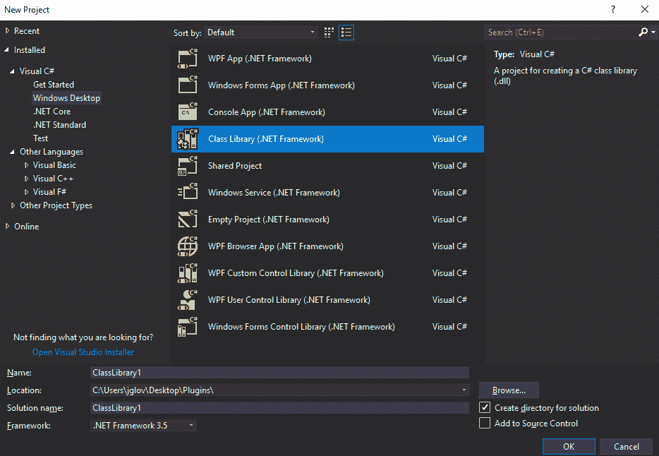

项目类型

1.  项目名称将是 `CSharpManagedPlugin`，框架版本将是 `.NET Framework 3.5`。选择 OK 按钮：

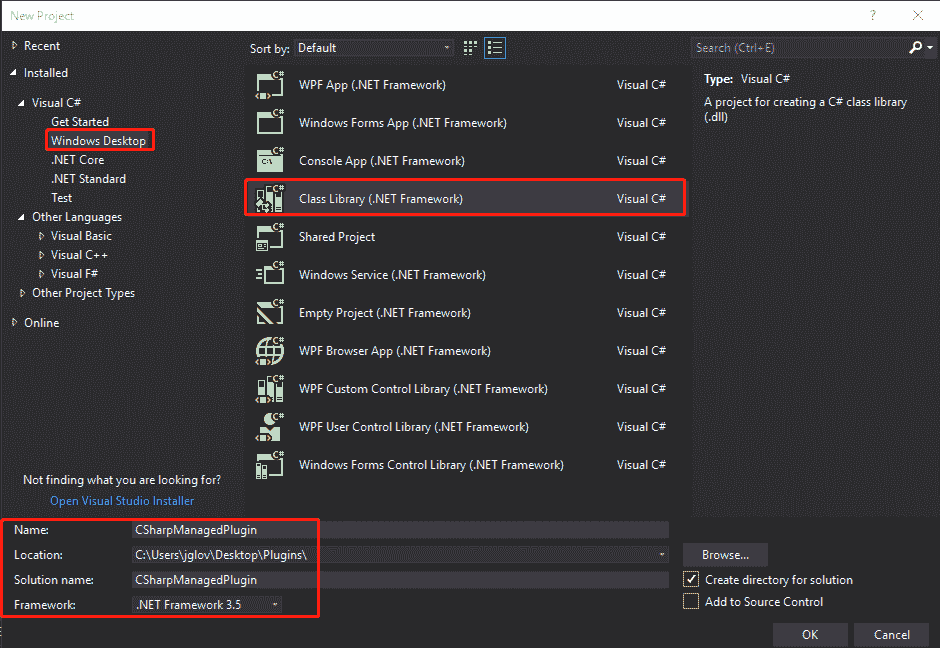

项目设置

确保将框架版本更改为 3.5 非常重要，因为我们需要确保 Unity 可以利用我们的插件而不需要实验性支持。

1.  现在我们已经创建了我们的解决方案，我们可以将类名从 `Class1` 改为 `Addition`。现在，添加一个名为 `addify` 的整数方法，参数为 `a` 和 `b`，然后返回 `a` 加 `b`。你的代码应该如下所示：

```cs
namespace CSharpManagedPlugin
{
    public class Addition
    {
        public int Addify(int a, int b)
        {
            return a + b;
        }
    }
}
```

我们现在可以构建解决方案，这将生成我们需要的 dll 文件。现在我们可以打开 Unity，看看我们如何使用这个插件：

1.  加载 Unity，让我们首先创建一个新的项目。项目类型将是 3D，我将给它命名为 `Packtpub`。我将首先创建两个文件夹；第一个将命名为 `Plugins`，另一个将命名为 `PluginWrappers`。这将使我们能够保持项目整洁：

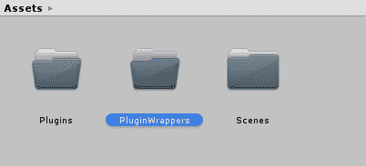

项目设置

1.  我们将首先将我们创建的 C# dll 文件拖放到 `Plugins` 文件夹中。我将我的 dll 文件命名为 `CSharpManagedPlugin`，以便在最后区分我们拥有的不同插件：

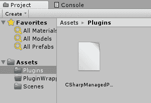

插件已添加

1.  如果你点击 `CSharpManagedPlugin`，在检查器中，你会看到更多信息：

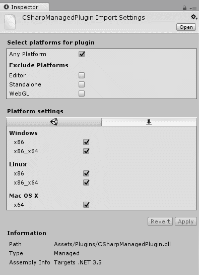

检查器

1.  只要目标 .NET 版本与 Unity 的相同或更低，你就不会收到错误，并且应该能够在编辑器、独立应用、WebGL、Linux、Windows 和 Mac OS 中使用它。

1.  我们现在可以转到我们的 `PluginWrappers` 文件夹，并让这个家伙运行起来。

1.  创建一个新的脚本；我的脚本将命名为 `CSharpWrapper`。现在我们可以用 Visual Studio 打开这个脚本：

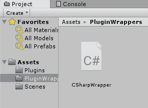

脚本

1.  管理插件是最简单的，我们只需要直接调用我们的插件，就像它是一个非 Monobehavior 脚本一样。你的代码应该如下所示：

```cs
using UnityEngine;
public class CSharpWrapper : MonoBehaviour
{
    private void Start()
    {
        var addition = new CSharpManagedPlugin.Addition();
        var add = addition.Addify(5, 2);
        print(add);
    }
 }
```

如你所见，我们像调用程序集中的另一个命名空间一样调用我们的插件。现在我们可以将这个 Unity 类附加到一个 GameObject 上，我们将在 Unity 编辑器的控制台中看到第 7 步的结果。

# C++ 语言插件

接下来，我们将使用 Visual Studio 再次创建这个项目：

1.  这个项目类型将在 Visual C++ | Windows Desktop | 动态链接库 (DLL)：

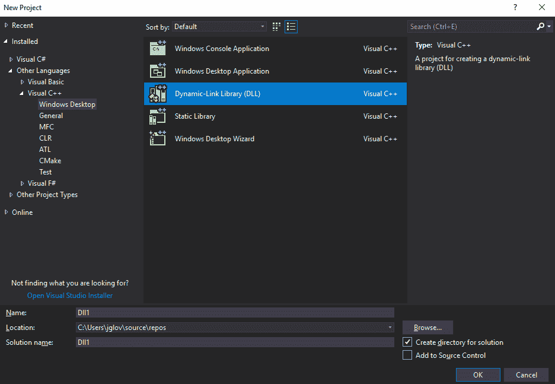

1.  这个项目的名称将是`NativeWindowsPlugin`，由于名称修饰，C++将与托管插件略有不同，我们将在下一部分学习如何避免这种情况。

1.  因此，为了解决名称修饰的问题，我们需要创建一个头文件和 cpp 文件。看看这段代码：

```cs
The header will have the extern c and a preprocessor win32 define along with __declspec, dllexport functions to make sure that name mangling does not occur. Again, we will define our public function of addify, which will be our addition function. Your header should look like this.

 #pragma once
extern "C" {
#if (defined(WIN32) || defined(__WIN32__))
       __declspec(dllexport) int addify(int a, int b);
#else
       int addify(int a, int b);
#endif
}
```

1.  实际上，当我们使用`__declspec, dllexport`调用时，我们是在避免使用`.def`文件。

1.  现在我们已经创建了头文件，我们需要填写 cpp 文件中的信息。

1.  确保包含本地 Windows 插件的头文件，并填写`addify`函数的详细信息。你的代码应该如下所示：

```cs
#include "stdafx.h"
#include "NativeWindowsPlugin.h"
int addify(int a, int b)
{
       return a + b;
}
```

1.  点击**构建解决方案**，我们将准备好跳入 Unity。

加载 Unity，然后打开我们的`Packtpub`项目：

1.  就像我们之前做的那样，我们将使用我们的`Plugins`和`PluginWrappers`文件夹来保持事物有序。将`CPlusPlusPlugin`复制到`Plugins`文件夹中：

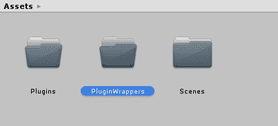

文件夹结构

如果你查看检查器中的插件，你会注意到它仅适用于 Windows。这是因为我们只设置了 if 指令针对 Windows，没有其他操作系统。当你想用 C++在多个操作系统上工作时应记住这一点。

1.  现在，我们可以在`PluginWrappers`文件夹中创建一个新的 C#类，名为`CPlusPlusWrapper`：

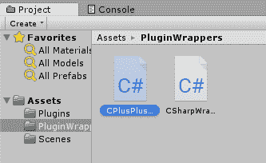

CPlusPlusWrapper

1.  这里的代码将与我们用于本地插件的代码不同。我们需要使用一个称为`DllImport`的非常特殊的属性来导入 dll 文件。这个属性需要我们使用的插件的字符串名称，然后在属性下面，我们需要确保它是一个**公共静态外部方法**。

1.  公共静态外部方法类型指定了我们想要使用的方法调用将是静态的、公共的，并且从外部程序集加载。要使用 DLL 导入属性，我们需要使用 System.Runtime.InteropServices 命名空间。你的代码应该如下所示：

```cs
using System.Runtime.InteropServices;
using UnityEngine;
public class CPlusPlusWrapper : MonoBehaviour {
    [DllImport("CPlusPlusUnManagedPlugin")]
    public static extern int Addify(int a, int b);
    private void Start()
    {
        var add = Addify(2, 4);
        print(add);
}
 }
```

在完成这些之后，后续的调用基本上是相同的。它有点不同，也稍微复杂一些，但一旦你理解了它是如何工作的，总体来说是非常简单的。你现在可以将这个 C#脚本附加到一个 GameObject 上并运行它来测试结果。

# Swift 语言插件

**Swift 语言插件**的扩展名为.swift，与 C#、Java 和 C++的结构完全不同，这是可以预料的，因为 Swift 仅在 macOS 设备上可用。这种语言本身融合了多种来源的元素，虽然我不会深入探讨语言的细微之处，但我可以说我喜欢他们融入语言结构中的方法。

Swift 和 Objective-C 需要使用 Xcode，尽管基本设置非常相似，但也有一些关键区别。Swift 插件要求你同时使用 Objective-C 和 Swift 来创建一个插件，该插件最终归结为 Swift 的实现，并在 Objective-C 中调用这些 Swift 代码。这超出了本节的内容，因为两种语言的细微差别需要进一步探索。

# Objective-C 语言插件

Objective-C 插件在某些方面与 Swift 插件相似，许多基本步骤都是相同的。Objective-C 已经存在很长时间了，它是苹果的 C 语言家族版本。虽然 Swift 被设计成 Objective-C 的继任者，但苹果并没有废弃这种语言，它仍然是一个强大且值得使用和了解的工具：

1.  首先，打开 Xcode，准备享受乐趣：

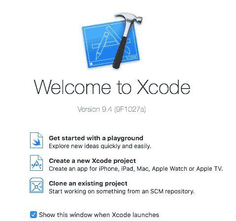

1.  点击“创建一个新的 Xcode 项目”，我们将有一个长长的项目列表可供选择。

1.  转到 macOS 并选择库。

虽然库在 iOS 项目中不可用，但你也可以选择使用 Bundle 或 Cocoa 框架库类型。

1.  选择库并点击下一步：

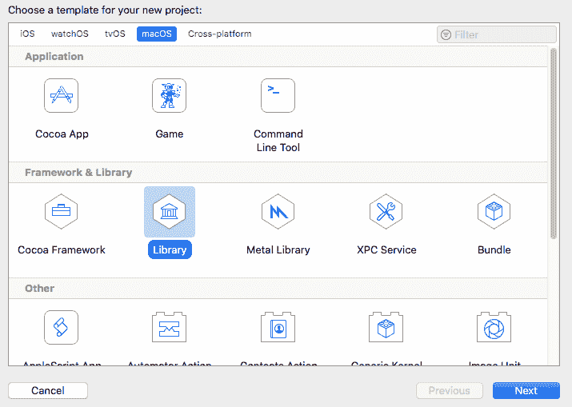

1.  将产品名称设置为 `ObjectiveCPlugin`；这使我们保持与迄今为止项目开发的方式一致：

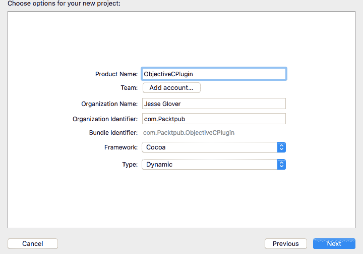

1.  现在，在我们继续之前，让我们看看下拉菜单中可用的各种框架：

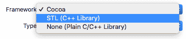

我们有 Cocoa、STL 和 None。Cocoa 为我们提供了 Objective C 和 Swift 所需的一切，**STL** 是 C++ 的 **标准模板库**，而 None 是一个不带标准库的空白 C++ 和 C 项目。我们将坚持使用 Cocoa。

接下来，我们应该看看类型选项中有什么可用：

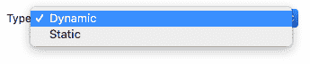

类型提供了动态和静态的选择，这将是一个 **动态库** 或 **静态库**。静态库是一个在编译时解析并复制到目标应用程序中的库，该应用程序生成一个目标文件和一个可执行文件。动态库则相反。它在运行时解析，只生成可以在其他应用程序或程序中调用的头文件和源文件。我们将坚持使用动态库。

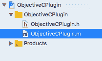

1.  我们的库基础文件已经为我们创建了一个 `.h` 和 `.m` 文件，所以我们只需填写所需的代码。让我们先填写头文件。看看这段代码：

```cs
#import <Foundation/Foundation.h>
@interface ObjectiveCPlugin : NSObject
int Addition(int a, int b);
@end
```

1.  立刻，我们可以看到它与 C++ 非常相似，只是语法略有不同。接下来，让我们看看 `.m` 文件：

```cs
#import "ObjectiveCPlugin.h"
@implementation ObjectiveCPlugin
int Addition(int a, int b)
{
 return a + b;
}
@end
```

1.  再次强调，它与 C++ 几乎相同，我们只需填写方法实际执行的内容。现在我们可以构建项目，并准备好将其导入到 Unity 中：

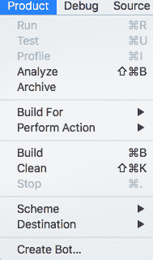

1.  现在，在项目构建完成后，我们可以打开 Unity 并准备好进入有趣的部分。在之前创建的`Plugins`文件夹中，创建一个名为`iOS`的新文件夹：

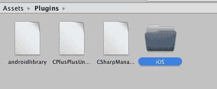

1.  在`iOS`文件夹中，复制创建的`.h`和`.m`文件：

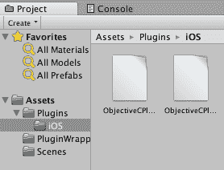

1.  现在，转到`PluginWrappers`文件夹并创建一个名为`ObjectiveCWrapper`的新脚本：


1.  现在，我们可以在 C#中打开类并添加我们的代码：

```cs
using System.Collections;
using System.Collections.Generic;
using System.Runtime.InteropServices;
using UnityEngine;
using UnityEngine.UI;
public class ObjectiveCWrapper : MonoBehaviour
{
 private Text text;
#if UNITY_IOS && !UNITYEDITOR
```

```cs

 [DllImport("__Internal")]
 public static extern int Addition(int a, int b);
#else 
 [DllImport("ObjectiveCPlugin")]
 public static extern int Addition(int a, int b);
 #endif
private void Start()
 {
 text = GetComponent<Text>();
 text.text = Addition(1,5).ToString();
 }
}
```

Objective-C 的好处是它没有 C++那样的名称混淆问题，所以我们不需要担心在之前做`extern`方法。相反，由于 iOS 设备编译代码的方式，我们必须调用`__internal`，而不是插件的名称。

最后，我们需要为 iOS 构建这个项目并在 Xcode 中打开它来完成编译过程，然后在 iPhone 或 iPhone 模拟器上运行以测试结果。

# Java 语言插件

对于 Java 语言插件，我们有两种选择都可以正常工作。我们有 Java 库，它编译成 JAR 文件，还有 Android 库，它编译成 AAR 格式。要访问 Android 特定的功能，我们需要创建 Android 库，而对于纯 Java 语言的使用，我们会创建 Java 库。

两者之间有一个主要区别，这一点应该被讨论。考虑以下内容：

+   Android 库项目包含本地和 Java 代码以及资源文件和 AndroidManifest。它们将包括需要预编译到 Android Studio 项目中的`.class`文件和`.jar`文件，然后导入到 Unity 中。

+   Java 库项目直接构建为 JAR 文件，并且可以导入到 Unity 中。

这两个插件都需要在 Android 设备上运行；这意味着你无法在编辑器中测试它们；你必须构建并在模拟器或实际设备上运行。如果你想从插件中获得最佳效果，使用 Java 语言。Android 库项目提供了最大的性价比。

话虽如此，让我们打开 Android Studio 并创建我们的基本库：

1.  点击文件，高亮显示新建，并定位到新建模块。模块选项窗口将在新窗口中打开：

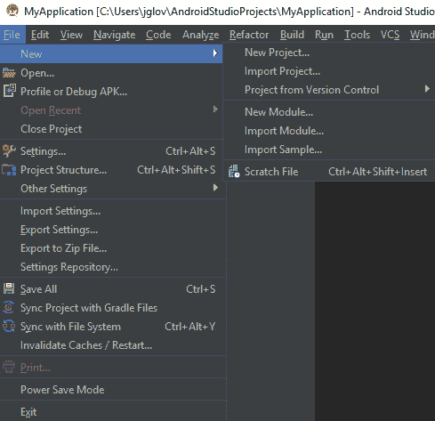

Android Studio

1.  在这里，我们有选择 Java 库或 Android 库的选项。正如之前讨论的那样，使用 Android 库更有优势，所以选择它并点击下一步：

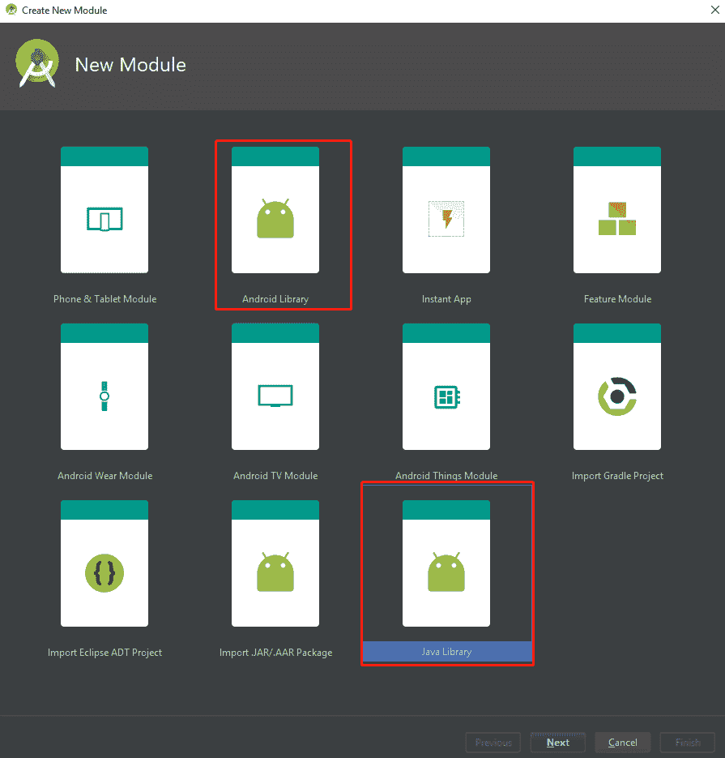

库选择

1.  现在，我们可以命名和配置我们的模块。我将设置库名为`AndroidLibrary`；模块名将自动设置为库的小写名称。

1.  包名将更改为`com.packtpub.Androidlibrary`，最小 SDK 版本为`API 21: Android 5.0 (Lollipop)`：

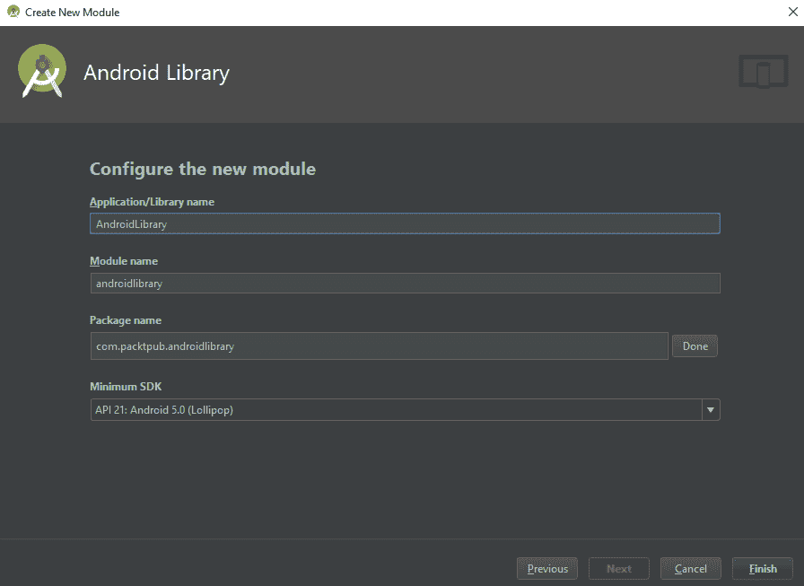

模块设置

1.  一旦设置好，点击“完成”。

1.  在 Android Studio 编辑器的左侧，我们可以看到项目的布局：

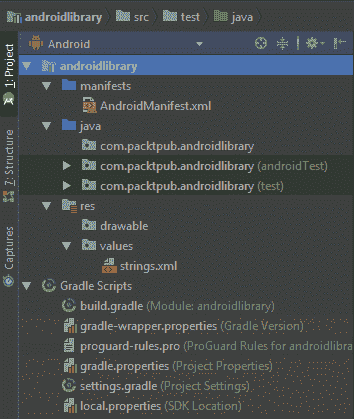

布局

1.  我们想要关注的主要区域是名为`com.packtpub.Androidlibrary`的`java`文件夹。我们需要右键单击这个特定的文件夹，并向其中添加一个新的 Java 类。这将打开一个全新的窗口来设置类：

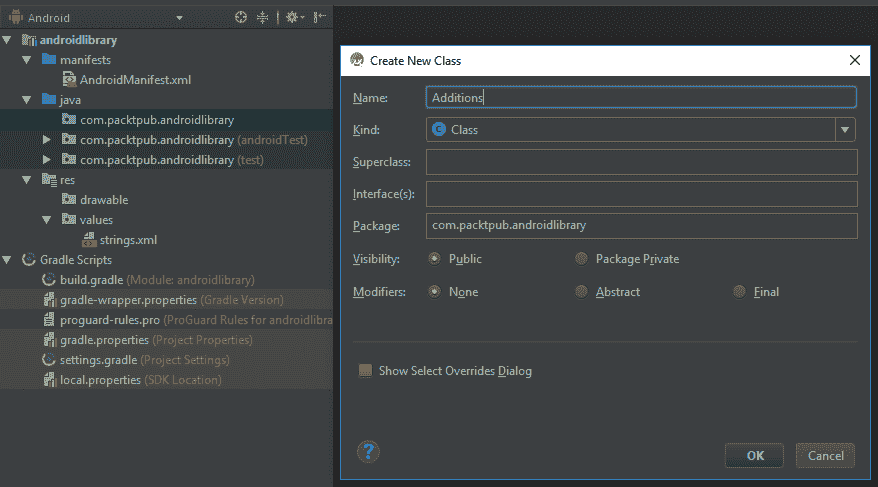

新类

1.  我将把类命名为`Additions`以指定我们只是创建一个简单的数学库，然后选择“确定”按钮。

1.  对于 C#，过程是相同的：我们只需添加一个名为`AddMe`的公共`int`，参数为`int a`和`int b`，返回值为`a + b`。你的代码应该如下所示：

```cs
package com.packtpub.Androidlibrary;
public class Additions {
    public int AddMe(int a, int b)
    {
        return a + b;
    }
}
```

1.  点击编辑器窗口顶部的“构建”按钮，然后点击“构建项目”。这将为我们构建项目。

1.  让我们快速查看一下项目的输出文件夹：

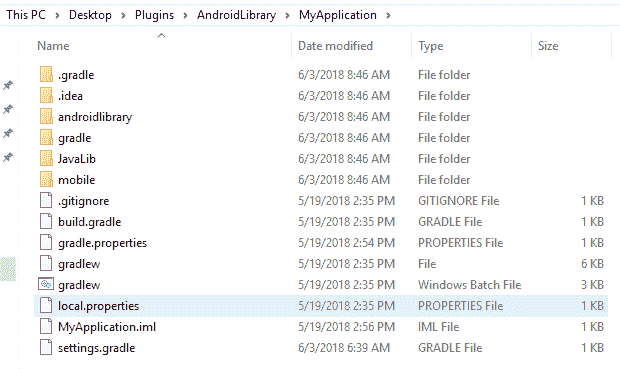

构建项目文件夹

我们可以看到这里有很多文件夹和其他杂项文件。我们需要的 AAR 文件位于`AndroidLibrary`文件夹中。确切的位置是 Android library，Build，Outputs，AAR。

AAR 文件在技术上是一个 zip 文件，因此你可以使用“7zip”解压并查看其内容；然而，这正是我们在 Unity 中需要使用的文件。现在，是时候打开 Unity，看看我们如何让 Unity 与这个文件交互了。

启动 Unity，并打开我们的`Packtpub`项目：

1.  就像我们之前做的那样，我们将使用我们的`Plugins`和`PluginWrappers`文件夹来保持组织有序。将 AAR 文件复制到`Plugins`文件夹：

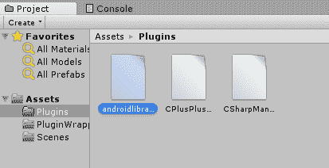

插件文件夹

1.  在`PluginWrappers`文件夹中，创建一个名为`JavaWrapper`的 C#类，然后在 Visual Studio 中打开它。

1.  代码与 C#和其他本地实现略有不同。我们需要一个预处理指令来检查此代码是否在 Android 上执行。

1.  然后，我们将创建一个新的 Android Java 对象，其字符串名称为我们创建的 Java 类中的字符串名称。

1.  我们将调用该类，使用我们想要的方法的字符串值，然后是参数。你的代码应该如下所示：

```cs
using System.Collections;
using System.Collections.Generic;
using UnityEngine;
public class JavaWrapper : MonoBehaviour
{
       // Use this for initialization
       void Start () {
#if UNITY_Android && !UNITY_EDITOR
        var javaClass = new AndroidJavaObject("Addition");
        javaClass.Call("Addification", 2, 9);
#endif
}
 }
```

现在，我们无法在 Unity 编辑器中测试这段代码，但我们可以构建项目并在连接到游戏对象后，在 Android 设备上测试它。

# 在 Java 中创建传感器驱动程序

现在，如果我们想从提供的硬件中实现自己的传感器呢？实际上，谷歌已经想到了这一点，并有一个非常深入的教程，关于创建和注册自己的驱动程序，可以在[`developer.Android.com/things/sdk/drivers/location`](https://developer.android.com/things/sdk/drivers/location)查看。我将简要介绍其中的一些项目，但最好阅读他们所写的内容。

简而言之，我们只需查看提供的示例代码，这样我们就可以将其作为插件转换 GPS 数据。其基本结构与我们在 Java 中创建基本插件时使用的结构完全相同。下一步将是编写我们的代码，以便它返回数据，这样它就可以从本地插件传递到 Unity。看看这个：

```cs
// Convert latitude from DMS to decimal format
private float parseLatitude(String latString, String hemisphere) {
 float lat = Float.parseFloat(latString.substring(2))/60.0f;
 lat += Float.parseFloat(latString.substring(0, 2));
 if (hemisphere.contains("S")) {
 lat *= -1;
 }
 return lat;
}
```

```cs
// Convert longitude from DMS to decimal format
private float parseLongitude(String longString, String hemisphere) {
 float lat = Float.parseFloat(longString.substring(3))/60.0f;
 lat += Float.parseFloat(longString.substring(0, 3));
 if (hemisphere.contains("W")) {
 lat *= -1;
 }
 return lat;
}
```

```cs
// Return a location from an NMEA GPRMC string
public Location parseLocationFromString(String rawData) {
 // Tokenize the string input
 String[] nmea = rawData.split(",");
```

```cs
Location result = new Location(LocationManager.GPS_PROVIDER);
 // Create timestamp from the date + time tokens
 SimpleDateFormat format = new SimpleDateFormat("ddMMyyhhmmss.ss");
 format.setTimeZone(TimeZone.getTimeZone("UTC"));
 try {
 Date date = format.parse(nmea[9] + nmea[1]);
 result.setTime(date.getTime());
 } catch (ParseException e) {
 return null;
 }
```

```cs
// Parse the fix information tokens
 result.setLatitude(parseLatitude(nmea[3], nmea[4]));
 result.setLongitude(parseLongitude(nmea[5], nmea[6]));
 result.setSpeed(Float.parseFloat(nmea[7]));
```

```cs
return result;
}
```

现在，你需要做的就是按照上一节中指定的方式编译插件，并将其以完全相同的方式添加到 Unity 中。

# 摘要

在本章中，我们讨论了通常可以从移动市场设备中获得的各种传感器。我们讨论了如何为不同平台创建基本插件的主要语言，我们现在拥有开始使用 Unity 制作 AR 应用程序和游戏所需的所有基本知识。

在下一章中，我们将把我们学到的东西应用到创建一个原型项目中，这个项目将使我们能够将声音作为 AR 应用程序的基础。

# 尝试一下，英雄

在继续下一章之前，我建议花时间阅读我在进一步阅读部分提供的参考资料，这些资料将为你提供有关如何访问 Android 和 Apple 设备上各种传感器的见解。

这将极大地帮助你解决以下提出的编码挑战：

+   创建一个简单的 C++ 插件，该插件与 Linux、Windows 和 Mac 桌面环境兼容

+   创建一个 Java 插件，允许设备主动读取 10 秒钟的温度并在你的设备屏幕上显示

+   创建一个 C# 插件，可以访问你的笔记本电脑上的网络摄像头，并将这些信息发送到 Unity 编辑器

以下挑战是为那些能够访问 Mac 计算机的人准备的（如果你没有，你可以修改这些以适用于 Windows 或 Android）：

+   创建一个 Swift 插件，该插件将读取屏幕上的手指按压，并通过文本或通过屏幕上的显示颜色记录手指按压的确切位置

+   创建一个 Objective-C 插件，该插件从摄像头传感器获取信息，并以二进制格式将其记录在文本文件中

# 问题

1.  Unity 能够使用从 C++ 插件：

A.) 正确

B.) 错误

1.  你为自己的传感器实现创建自己的实现，并通过插件注入到 Unity 中：

A.) 正确

B.) 错误

1.  你可以使用 ARKit 创建一个 Objective-C 插件用于 Unity：

A.) 正确

B.) 错误

1.  你可以构建针对 iOS 设备的 Java 插件，用于与 Unity 一起使用：

A.) 正确

B.) 错误

1.  Swift 插件比 Objective-C 插件更容易为 Unity 开发：

A.) 正确

B.) 错误

1.  指纹传感器仅在 Android 设备上可用：

A.) 正确

B.) 错误

1.  摄像头在技术上是一个传感器：

A.) 正确

B.) 错误

1.  在 iOS 和 Android 设备上始终使用陀螺仪：

A.) 正确

B.) 错误

1.  使用温度传感器来跟踪和测量敏感组件的温度：

A.) 正确

B.) 错误

1.  加速度计不是一种用于检测设备动量的传感器：

A.) 正确

B.) 错误

# 进一步阅读

官方文档始终是了解更多关于传感器的最佳地点。查看以下链接获取更多信息：

+   [`developer.Android.com/guide/topics/sensors/sensors_overview`](https://developer.Android.com/guide/topics/sensors/sensors_overview)

+   [`developer.apple.com/documentation/coremotion`](https://developer.apple.com/documentation/coremotion)

+   [`developer.apple.com/documentation/coremotion/cmsensorrecorder`](https://developer.apple.com/documentation/coremotion/cmsensorrecorder)
