# 花草丛中的声音

在本章中，我们将设计和创建我们的第一个 AR 应用程序，使用 macOS 和利用 ARKit。这将是一个利用触摸传感器和摄像头传感器协同工作，从各种文学来源中启动声音片段的应用程序。这将作为编程和设置 Unity 以使用我们可用的 AR 工具的绝佳介绍。这将使我们能够利用内置的用于使用摄像头传感器和触摸传感器的功能。

在本章中，我们将涵盖以下主题：

+   项目构思

+   设置 Unity 项目

+   代码实现细节

+   使用 XCode

# 项目概述

这个应用程序的概念是能够在摄像头的视频流中的任何地方进行选择，并且它将根据该区域的照明读取一首诗或书籍的随机段落。构建时间大约为 30 分钟。

# 入门

以下为软件先决条件：

+   XCode

+   Unity 2018 for Mac

+   ARKit

+   Visual Studio for Mac

+   MonoFramework

软件可以从以下网站下载：

+   [`store.unity.com/`](https://store.unity.com/)

+   [`developer.apple.com/arkit/`](https://developer.apple.com/arkit/)

+   [`www.visualstudio.com/`](https://www.visualstudio.com/)

+   [`www.mono-project.com/download/stable/`](http://www.mono-project.com/download/stable/)

以下是最小硬件要求：

+   2011 年或更新的 Mac 电脑

+   8 GB 的 RAM

# 项目构思

在构建任何游戏或应用程序之前，了解你确切想要构建的内容始终是第一步。你不需要知道确切的实现细节，只需知道你想要构建的内容以及你打算如何构建它。这应该包括以下内容：

+   基本想法/概念

+   要使用的编程语言

+   平台发布选择

+   要使用的游戏引擎或库/框架

+   设计文档/设计大纲

+   用于证明概念的书面或代码实现原型

现在，为什么这些点如此重要？它们之所以重要，是因为它有助于巩固想法，为你想要实现的内容提供清晰的路径，最重要的是，证明项目是可构建的。让我们深入每个点，并使用它们来构建我们的第一个 AR 应用程序。

# 基本想法/概念

应用程序或游戏的基本想法或概念不应超过一个段落，解释你想要创建的内容。它不是用来解释完整的功能或你希望在应用程序或游戏中包含的所有内容。相反，它只作为一个基本的起点，表明这是你想要工作的整体想法。

这很重要，因为它是应用程序或游戏想法的核心，你可以定义应用程序或游戏的主要功能，并为研究提供一个清晰的参考点。

我们的基本概念是能够在摄像头的视频流中的任何位置进行选择，然后根据该区域的光线读取一首诗或书籍的随机段落。现在，这并没有深入探讨应用程序将做什么，但我们可以以此为基础，在第四步中扩展基本想法，创建一个功能齐全且详细的解释。

# 选择合适的编程语言

在开发应用程序或游戏时，这个选择并不总是那么明显。虽然您自己的知识在选择要使用的语言时起着重要作用，但应用程序或游戏的需求以及您团队的知识也同样重要。在最终确定决策之前，这一步应该与下一步同时进行，因为您的研究可能会确定您偏好的语言可能没有为开发您想要的特定游戏或应用程序提供适当的库或功能。

幸运的是，我们的示例将使用 C#。

# 选择您的发布平台

这一点相当直接。您是想在 Android、iOS、Windows 还是其他平台上发布？这将决定您需要选择哪种语言以及我们需要哪种游戏引擎或库/框架——这引出了下一个部分。

# 选择您的游戏引擎、库和框架

如前所述，这一步应该与前面的步骤同时进行，因为它们本质上是相互关联的。这一步要求您对基本想法/概念进行深入和高度详细的研究。您不仅要查看您想要做的事情是否可行，还要了解您想要使用的语言、游戏引擎或库/框架是否支持它。这也要求您知道您想要在哪个平台上发布。

根据这个应用程序的基本想法，我们知道它将需要利用摄像头并处理触摸事件来检测某个区域是否光线充足，从而确定是否播放音频文件。

# 开发游戏设计和应用程序设计文档

设计文档更像是一个设计规范文档，它描述了整个应用程序。这意味着所有数据级、架构级、界面级和组件级的设计都为其进行了描述。以下示例展示了文档的样式。您可以从[`ec.europa.eu/idabc/servlets/Doc7e17.doc?id=18632`](http://ec.europa.eu/idabc/servlets/Doc7e17.doc?id=18632)下载模板的副本：

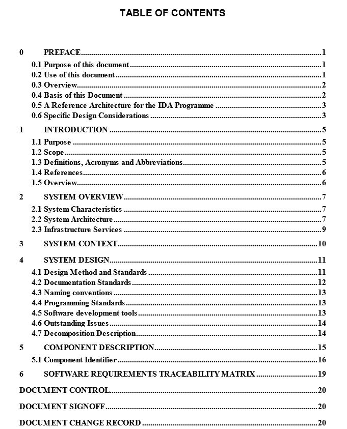

技术设计模板

对于游戏设计，设计文档可能比应用程序更复杂。典型的游戏设计文档将需要尽可能详细地填写所描述的章节。您可以从 [`docs.google.com/document/d/1-I08qX76DgSFyN1ByIGtPuqXh7bVKraHcNIA25tpAzE/edit`](https://docs.google.com/document/d/1-I08qX76DgSFyN1ByIGtPuqXh7bVKraHcNIA25tpAzE/edit) 下载模板的副本：

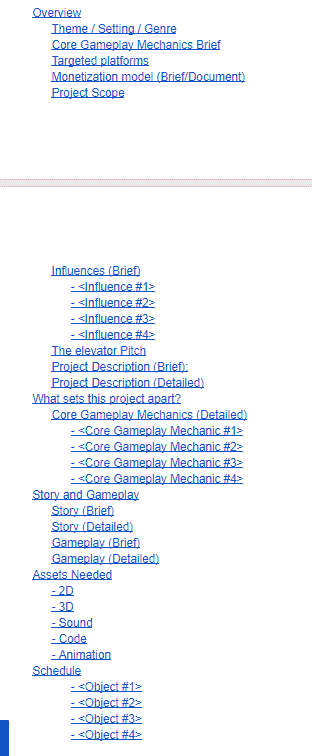

游戏设计模板

现在，您可能认为这对于应用程序或游戏来说工作量很大。成功的关键永远不会来自懒惰或纯粹的运气。在创建如此深入的文档时，您确保自己确切地知道需要做什么以及为什么需要这样做，如果您招募团队成员，他们可以阅读文档并充分理解您的目标和意图，而无需您提供太多输入。

这也意味着您可以确保自己始终与项目保持一致，迫使您不要添加任何小宠物功能，除非在项目达到完成标志后作为额外的里程碑。

# 奖励 – UML 设计

**统一建模语言**（**UML**）是可视化您应用程序或游戏设计的一种绝佳方式。NClass 是一个免费的 UML 编辑器，您可以下载并使用它。

您可以使用 UML 预先规划所有的方法、属性、属性、类和枚举——几乎与编程相关的所有内容。UML 真正有助于下一阶段，即实际实现原型：

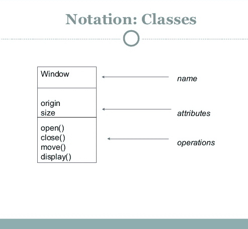

实现的进一步规划可以在以下屏幕截图中看到：

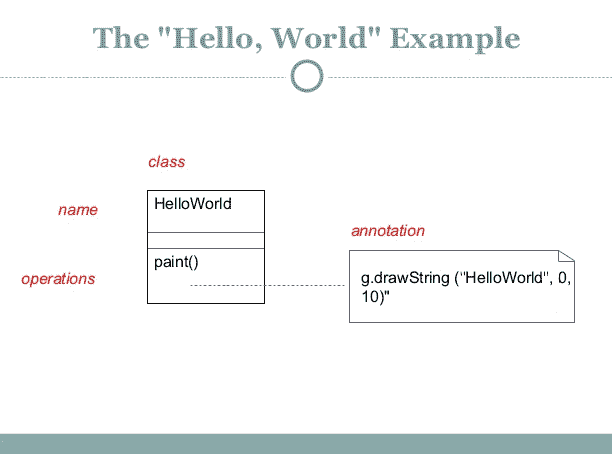

# 原型设计

现在，我们的概念验证实际上将是完整的项目，尽管对于您未来的项目，运行小规模实现以确保 100%必要的功能能够得到实现并适当工作。

这也意味着，如果由于任何原因您无法实现应用程序或游戏的主要功能，您在项目上浪费的时间和金钱将不会像在大规模实现上那样多。

# 设置 Unity 项目

我们将要做的第一件事是在我们的 Mac 计算机上设置 Unity，以便能够创建我们的项目。由于我们知道我们需要 ARKit，它只能在 macOS 上运行，我们将为不同的章节有不同的项目，因为我们不希望有任何编译问题：

1.  让我们创建一个新的项目，我们将称之为 `Chapter4` 或 `Sound of Flowery Prose`：


1.  接下来，我们需要点击商店并搜索 ARKit 以下载并将其添加到我们的项目中：

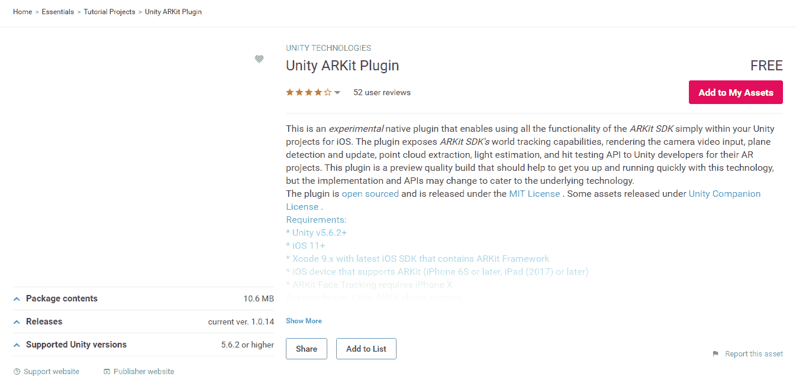

1.  我对组织有点挑剔，所以我们必须确保设置好所有必要的空游戏对象以保持事物有序。因此，我们将有四个空游戏对象，分别命名为`CameraParent`、`ARKitControl`、`ARCameraManager`和`HitCubeParent`。你的项目应该看起来像下面截图中的那样：

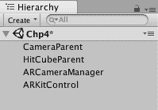

1.  将相机拖入`CameraParent`空游戏对象中：

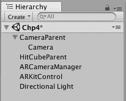

1.  创建一个`Cube`并将`Cube`拖入`HitCubeParent`对象中：

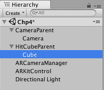

现在我们已经基本按照要求设置了 Unity，我们可以继续创建和附加项目所需的脚本：

1.  点击相机组件——我们需要向其中添加两个脚本。第一个脚本是 Unity AR Camera Near-Far，第二个是 Unity AR Video。

1.  Unity AR Video 也需要一个清晰的材质，所以让我们将其设置为`YUVMaterial`：


1.  `ARCameraManager`需要附加适当的脚本——在这种情况下，它被称为 Unity AR Camera Manager：

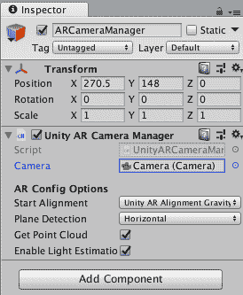

1.  `ARKitControl`也需要附加一个脚本，该脚本称为 Unity AR Kit Control：

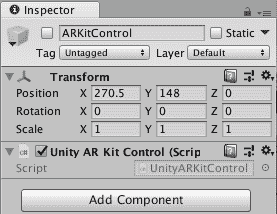

1.  我们需要做的最后一件事是在`HitCubeParent`对象内部设置我们的`Cube`，并为它创建一个新的脚本。

1.  点击`Cube`对象，选择添加组件 | 脚本 | 新脚本。名称应该是`ARHitCube`：

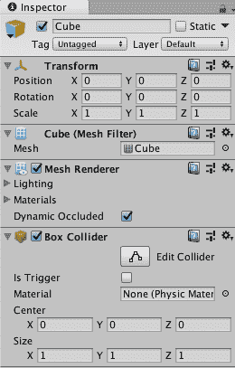

# 代码实现细节

显然，任何项目的最重要部分实际上是实现我们想要完成的事情。我们希望这个项目能够自动播放从音频样本列表中的文学引文。为此，我们需要一个音频源和音频剪辑。我们还希望这个项目利用 ARKit 来运行，因此我们需要编写一个 C#类，该类利用从 Objective-C 和 C++库中公开的 ARKit 插件的功能。

让我们打开`ARHitCube`类，填写详细信息，并同时在解释正在发生的事情。我应该注意的是，非常相似的代码已经提供在名为`UnityARHitTestExample`的脚本文件中；我创建了这个脚本，以便能够只显示所需的内容，并能够解释创建所需功能所需的工作流程/思想：

```cs
using System;
using System.Collections.Generic;
```

1.  如同往常，我们只会调用我们项目所需的特定命名空间。在这种情况下，是`System`和`System.Collections.Generic`：

```cs
namespace UnityEngine.XR.iOS
```

1.  我们将使用命名空间来组织我们的代码，以确保它与 ARKit 和 Unity 的 API 保持分离，这将避免命名冲突：

```cs
public class UnityARHitTestExample : MonoBehaviour
{
            public Transform m_HitTransform;
            public AudioClip[] clips;
            public AudioSource source;
```

1.  我们的这个类将继承自`MonoBehavior`，因为我们希望能够直接从对象中使用它（以及确保它可以附加到游戏对象上）。

1.  我们创建了一个公共变换以使我们能够更容易地跟踪位置，以及一个公共音频剪辑数组：

```cs
bool HitTestWithResultType (ARPoint point, ARHitTestResultType resultTypes)
{
    List hitResults = UnityARSessionNativeInterface.GetARSessionNativeInterface ().HitTest (point, resultTypes);
```

1.  我们创建了一个具有`ARPoint`和`ARHitTestResultType`参数的`Boolean`方法类型。这两个都是 ARKit 暴露的，你可以阅读它们的文档或查看 Unity 中的源代码以更好地理解它们。简而言之，`ARPoint`是从 Vector 3 值派生出的点坐标，而`ARHitTestResultType`是一个枚举，可能的返回值有`ARHitTestResultTypeFeaturePoint`、`ARHitTestResultTypeEstimatedHorizontalPlane`、`ARHitTestResultTypeEstimatedVerticalPlane`、`ARHitTestResultTypeExistingPlane`、`ARHitTestResultTypeExistingPlaneUsingExtent`和`ARHitTestResultTypeExistingPlaneUsingGeometry`。

1.  我们创建了一个名为`hitResults`的列表，它将被设置为`UnityARSessionNativeInterface.GetARSessionNativeInterface().HitTest`，参数为点和结果类型填充。这样做是每次注册原生接口碰撞测试时创建一个列表，并存储值：

```cs
if (hitResults.Count > 0) {
    foreach (var hitResult in hitResults) {
        Debug.Log ("Got hit!");
        m_HitTransform.position = UnityARMatrixOps.GetPosition (hitResult.worldTransform);
        m_HitTransform.rotation = UnityARMatrixOps.GetRotation (hitResult.worldTransform);
        return true;
    }
}
return false;
}
```

1.  接下来，我们进行一个`if`检查，以验证计数是否大于`0`。如果不是大于`0`，则返回`false`，否则进入`foreach`循环。在`foreach`循环内部，我们检查所有碰撞结果并记录结果。`HitTransform`的位置将始终设置为`UnityARMatrixOps.GetPosition`，参数为`hitresult.worldTransform`。

1.  `HitTransform`的旋转也将始终设置为`UnityARMatrixOps.GetRotation`，参数为`hitresult.worldtransform`。我们最后返回`true`。本质上，这个函数所做的只是检测是否有碰撞被注册，并将信息传递到需要这些信息的正确区域：

```cs
void Update () {
/* Let’s start the update method as it is probably the second most important aspect of the code.
*/
 if (Input.touchCount > 0 && m_HitTransform != null)
 {
 var touch = Input.GetTouch(0);
```

1.  我们首先要检查`input.touchcount`是否为`0`，以及`HitTransform`是否不等于`null`。如果这两个检查中的任何一个失败，我们就无法检索到所需的信息。

1.  我们将触摸变量设置为`input.gettouch`，参数为`0`。`0`是基本点击手势：

```cs
if (touch.phase == TouchPhase.Began)
{
var screenPosition = Camera.main.ScreenToViewportPoint(touch.position);
```

1.  这里`if`触摸阶段语句是一个检查以查看初始化的是哪种触摸阶段。开始触摸阶段是我们想要的，因为它是触摸事件的起始位置。

1.  我们创建了一个屏幕位置变量，并将其设置为相机屏幕到视口点，参数填充为触摸位置：

```cs
ARPoint point = new ARPoint 
{
    x = screenPosition.x,
    y = screenPosition.y
};
```

1.  ARPoint 点设置为一个新的 ARPoint，我们希望*x*值是屏幕位置的`x`值，而*y*值是屏幕位置的*y*值：

```cs
ARHitTestResultType[] resultTypes = {
    ARHitTestResultType.ARHitTestResultTypeExistingPlaneUsingExtent,
    ARHitTestResultType.ARHitTestResultTypeHorizontalPlane,
    ARHitTestResultType.ARHitTestResultTypeFeaturePoint
};
```

1.  `ARHitTestResultType`是一个名为结果类型的数组。我们想确保理解碰撞测试结果类型，在这种情况下，我们有三种类型可以使用：`ExistingPlaneUsingExtent`、`HorizontalPlane`和`FeaturePoint`：

```cs
foreach (ARHitTestResultType resultType in resultTypes)
    if (HitTestWithResultType (point, resultType))
      {
          source.PlayOneShot(clips[Random.Range(0, clips.Length)]);
          source.Stop();
          return;
      }
```

1.  我们现在可以对 `ARHitTestResultType` 执行最终的 `foreach` 循环，并创建一个 `if` 语句来检查带有参数的点 `HitTestWithResultType` 和 `resultType`。这实际上只是检查是否发生了适当的触摸事件，如果发生了，则激活播放方法。在另一个触摸事件之后，它将停止正在播放的媒体。随后，我们返回并跳出循环。

1.  我们可以回到 Unity 编辑器，查看附加在立方体对象上的脚本：

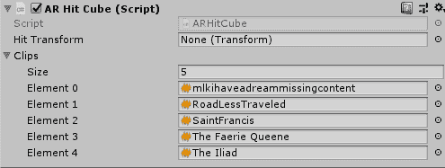

1.  我们可以将 `Cube` 附加为击中变换，因为我们点击时，这将是我们读取信息的注册对象：

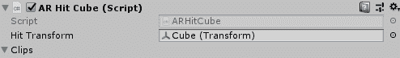

我们现在可以构建这个项目：

1.  要这样做，请点击文件并选择构建设置。我们将使用 iOS 作为平台：

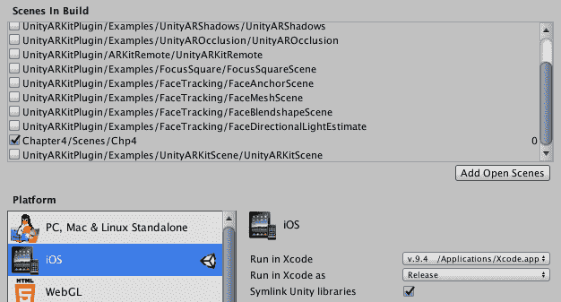

1.  在玩家设置中，我们需要在捆绑标识符区域更改我们应用程序的名称，并在相机使用描述中写一个简短的描述。

1.  我将命名这个应用为 `com.rpstudios.arkitscene`，描述将是 `AR BABY`：

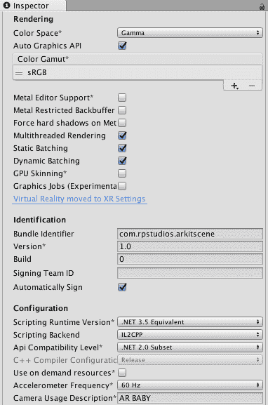

1.  一旦我们选择构建应用程序，Unity 将创建一个 XCode 项目，这是为 Android、Windows 和 Linux 构建时的主要区别：


主要工作已经完成；现在我们只需要熟悉 XCode 并完成那里的构建过程。

# 使用 XCode 进行工作

我们可以导航到应用程序的 `Build` 文件夹，并点击它以打开我们的 XCode 项目：

1.  在屏幕的左侧，你应该能看到 Unity-iPhone 是你可以选择的项目之一。点击它，你应该在中心看到 Unity-iPhone，在右侧看到身份和类型：

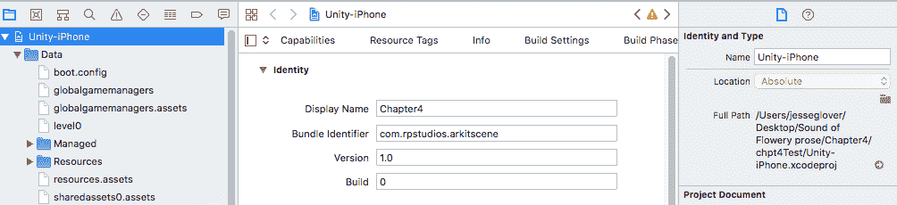

1.  确保身份信息正确。对我来说，显示名称是 `Chapter4`，捆绑标识符为 `com.rpstudios.arkitscene`：

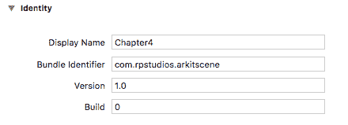

1.  现在，在签名部分，你需要确保自动管理签名的复选框被勾选，并且你的团队已经将你的电子邮件地址附加到它上。签名证书非常重要，因为如果没有它，你将无法正确编译或发送到模拟器。如果没有，你必须注册一个 Apple 开发者账户，请访问 [developer.apple.com](https://developer.apple.com/)：


1.  滚动并查找链接框架和库。AVFoundation 应该从可选更改为必需。我注意到，当它设置为可选时，链接器无法正常工作：


1.  定位到架构，因为我们需要从默认的架构更改为标准架构。这是由于存在不同的架构，iOS 已经不再使用 ARM 架构：

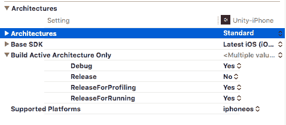

1.  现在，你可以点击构建，并将你的 iPhone 6 或更高版本连接到你的 Mac 电脑。构建并在设备上运行它。它会要求你信任手机上的应用程序，所以按照指示进行信任设置。

1.  点击你手机上的应用程序，然后就是！它会加载，你可以玩这个应用程序。

# 摘要

在本章中，我们学习了如何使用 ARKit 和 Unity 为 Mac 设备构建 AR 应用程序。虽然这是一个非常简单的实现，但它肯定为你将不同方面的声音融入自己的 AR 游戏和应用铺平了道路。

学习处理 AR 的基础可能是最困难的部分，同时弄清楚为什么为不同设备构建不按你最初期望的方式工作。调试和测试应该是开发每个方面的基本组成部分。我建议要么让某人测试每个构建，要么在有机会的时候进行自动化测试。

在下一章中，我们将创建一个面向儿童的具有教育风格的游戏原型，通过谜题的方式挑战他们的认知推理技能。

# 问题

1.  ARKit 与 Unity 标准捆绑：

A.) 正确

B.) 错误

1.  你可以在 Windows 上为 macOS 和 iPhone 进行构建：

A.) 正确

B.) 错误

1.  包标识符可以设置为`app.unity.test`：

A.) 正确

B.) 错误

1.  ARPoint 是什么？它有什么作用？

1.  设计文档对于大型项目不是必需的：

A.) 正确

B.) 错误

1.  UML 代表统一建模语言：

A.) 正确

B.) 错误

1.  ARKit 内置了 VR 支持：

A.) 正确

B.) 错误

1.  你能否在 Windows 机器上将 ARKit 导入 Unity 项目？

A.) 是

B.) 否

1.  如果你使用 Objective-C 插件与 Windows 配合使用会发生什么？

A.) 正确

B.) 错误

1.  你能否在同一项目中同时使用 Vuforia 和 ARKit？

A.) 正确

B.) 错误

# 进一步阅读

为了更好地理解不同的设计文档模板，以下是一个你可以下载和查看模板和示例的地方列表：

+   [`docs.google.com/document/d/1pgMutdDasJb6eN6yK6M95JM8gQ16IKacxxhPXgeL9WY/edit`](https://docs.google.com/document/d/1pgMutdDasJb6eN6yK6M95JM8gQ16IKacxxhPXgeL9WY/edit)

+   [`docs.google.com/document/d/1-I08qX76DgSFyN1ByIGtPuqXh7bVKraHcNIA25tpAzE/edit`](https://docs.google.com/document/d/1-I08qX76DgSFyN1ByIGtPuqXh7bVKraHcNIA25tpAzE/edit)

+   [`robotics.ee.uwa.edu.au/courses/design/examples/example_design.pdf`](http://robotics.ee.uwa.edu.au/courses/design/examples/example_design.pdf)

+   [`www.toptal.com/freelance/why-design-documents-matter`](https://www.toptal.com/freelance/why-design-documents-matter)

+   [`portal.unimap.edu.my/portal/page/portal30/BE8D43D77F7A6D38E04400212800D8CE`](http://portal.unimap.edu.my/portal/page/portal30/BE8D43D77F7A6D38E04400212800D8CE)

+   [`www.cs.drexel.edu/~dpn52/Therawii/design.pdf`](https://www.cs.drexel.edu/~dpn52/Therawii/design.pdf)

UML 是一个在许多领域都有讨论的话题，关于它的资源非常丰富，比我所涉及的深度要深得多。原因在于，关于 UML 可以写一本书来公正地对待它：

+   [`www.utdallas.edu/~chung/Fujitsu/UML_2.0/Rumbaugh--UML_2.0_Reference_CD.pdf`](https://www.utdallas.edu/~chung/Fujitsu/UML_2.0/Rumbaugh--UML_2.0_Reference_CD.pdf)

+   [`courses.cs.washington.edu/courses/cse403/11sp/lectures/lecture08-uml1.pdf`](https://courses.cs.washington.edu/courses/cse403/11sp/lectures/lecture08-uml1.pdf)

Unity 也有一些非常出色的教程，你可以通过它们学习如何使用 Unity 来学习 ARKit：

+   [`unity3d.com/learn/learn-arkit`](https://unity3d.com/learn/learn-arkit)

这些参考资料应该能让你对我在轻描淡写中提到的主题有更深的理解。
