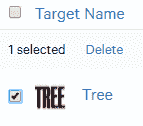

# 图片拼图 - AR 体验

在本章中，我们将创建另一个基于 AR 的应用程序。这次，重点将是一个可以用于教育的谜题，用于教授语言或词汇识别。这样做的原因是，基于 AR 的应用程序和游戏也是非常有前景的灵感来源和目标受众。

本章将向您介绍以下内容：

+   如何更新现有的 Unity 安装以添加 Vuforia 支持

+   Unity Hub

+   如何为 Windows、Android 和 iOS 构建基于教育的 AR 应用程序

让我们直接深入这个项目的背景，以及为什么它与 AR 相关。

# 项目背景

就像任何其他项目一样，最好从想法开始。当我第一次想到这个项目时，我想展示 AR 应用程序和游戏也能反映教育。我教育过孩子们英语，深知学习新语言的挫败感。

游戏和应用开发也应该教会用户一些东西；它不一定是历史、数学、语言、科学或地理；它也可以是某些无害的东西，比如反应训练或手眼协调。作为开发者，我们在世界上有一个独特的位置，能够以有趣的方式融入学习，而不会让用户觉得这是他们“必须”做的事情。

这并不意味着我们必须深思熟虑，试图将其纳入我们的应用程序和游戏中；它可能，并且通常就是这样，只是自然而然发生的事情。然而，在这个项目中，我特别针对学习方面，以展示它如何轻松地融入 AR 项目。

# 项目概述

本项目基于这样一个想法：通过为孩子们创建一个真正简单的现实世界谜题，让他们去解决，然后他们可以用这个应用程序来检查，看看他们是否解决了这个谜题，以此来教授孩子们词汇联想和拼写。

本项目的构建时间最多为 15 分钟。

# 开始学习

这里是 Unity 版本 2018.1.5 的系统要求：

+   **发布日期**：2018 年 6 月 15 日

+   **操作系统**：Windows 7 SP1+、8、10

+   **GPU**：具有 DX9（着色器模型 3.0）或具有 9.3 功能级别的 DX11 的显卡。

查看以下内容：

[`unity3d.com/`](https://unity3d.com/) [`www.turbosquid.com/FullPreview/Index.cfm/ID/967597`](https://www.turbosquid.com/FullPreview/Index.cfm/ID/967597)

# 安装 Vuforia

我知道我们在第一章，“什么是 AR 以及如何设置”中讨论过这个问题，但为了以防那一章被快速浏览或者 Unity 已经更新，这里需要简要回顾一下。

要在 macOS 和 Windows 上安装 Vuforia，步骤相当简单；然而，我想向您展示获取 Vuforia 软件和 Unity 的不同方法。

Unity 还有一种可以安装的类型，称为 Unity Hub，您可以从 Unity 网站获取，而不是 2018 安装程序文件。Unity Hub 的作用是允许您在单个位置拥有多个 Unity 安装，这是一种设置您首选 Unity 编辑器的方法，将您的项目合并到单个启动器中，轻松更新您想要安装的组件，并且它还提供了对项目预设类型模板的访问。按照以下步骤操作：

1.  导航到 Unity 网站并点击获取 Unity：


1.  您将看到一个选项，可以选择个人、高级或专业。如果您适合并需要个人版本，请点击尝试个人：


1.  这将带您到下载页面，在那里您需要勾选复选框以接受条款，并给您提供下载 Unity 应用程序本身或预览中的 Unity Hub 的选项。我们想要 Unity Hub：


1.  一旦您下载并安装了 Unity Hub，您就可以打开它，它将为您提供项目、学习或安装的选项。点击安装以查看可用的版本：


1.  我们想安装 Unity 的最新版本，即 2018.1.5f1：


1.  一旦您点击安装您想要的版本，点击您想要的组件，然后按完成安装 Unity 编辑器：


现在，假设您在安装 Unity 时忘记选择在此步骤中安装 Vuforia——没问题；您可以跳过前面的点，从这里继续操作。

1.  在 Unity 中打开一个项目；这可能是一个您不想要的虚拟项目，或者它可能是本章项目的起点。

1.  点击文件菜单中打开的构建菜单：


1.  我们想从窗口中选择玩家设置：


1.  应该会打开一个窗口，其中包含通常的检查器面板。找到 XR 支持安装程序并点击 Vuforia 增强现实：


1.  这将打开您的浏览器并要求您下载一个文件。点击保存以下载文件：


1.  关闭 Unity 编辑器并安装此文件。这将添加 Vuforia 支持到您的 Unity 安装中，而无需重新安装整个编辑器。

现在完成这些后，我们可以在 Windows 中创建此项目。

# macOS 和 Windows 设置之间的差异

在为各自平台构建之前，macOS 和 Windows 的基本设置之间几乎没有区别。我已经以完全相同的方式设置了项目，以便更容易地遵循流程。如果您同时拥有 macOS 和 Windows 计算机，那么当您进入 macOS 部分时，可以跳到构建部分。如果您只有 Windows，那么您只需遵循那里的说明。相反，如果您只有 macOS 设备，那么您将拥有完整的说明，并且可以跳过*Windows 项目设置*部分。

# Windows 项目设置

如果你还记得，在第一章，*什么是增强现实以及如何设置*，我们创建了我们的 Vuforia 开发者账户。我们将需要它，因为我们将会使用 Vuforia 来创建这个项目。导航到 Vuforia 开发者门户并登录您的账户。现在按照以下步骤操作：

1.  在 Vuforia 开发者门户中，点击开发，并确保子菜单已选择许可证管理器。我们需要创建一个新的开发许可证密钥，应用名称为`Chapter5`或`Picture Puzzle`：


1.  在创建新密钥后，您应该看到许可证管理器显示了我们所创建的`VuforiaIntro`和`Chapter5`密钥：


1.  点击`Chapter5`以访问您的许可证密钥。您应该将其复制并粘贴到记事本或 Notepad++中以备后用：


1.  点击目标管理器，因为我们将要为这个项目创建自己的图像目标：


1.  点击添加数据库以创建我们将要在项目中使用的全新数据库：


1.  您可以给数据库起任何名字；在我的情况下，我将称之为`Words_Pictures`，类型为设备，然后点击创建：


1.  应该带我们回到目标管理器页面，并展示我们的新`Words_Pictures`数据库：


1.  点击`Words_Pictures`以访问数据库，然后当您看到它时点击添加目标：


1.  现在，我们将能够向数据库添加一个新的目标。在这种情况下，我们想要一个单独的图像。

我强烈建议您创建并使用 JPG 格式，因为 PNG 格式需要一个 8 位灰度图像或 24 位 RGB。

1.  宽度应设置为与您的图像相同的宽度。名称应反映图像的内容：


1.  打开 Microsoft Paint，我们可以开始创建我们将用于目标的文件：


1.  下一步是找到我们想要用于这张图片的确切大小，我认为最好的方法是知道我们将会使用什么图片。在我们的例子中，它将是 72 磅的字体大小，字体名为 Bastion，并显示单词`TREE`：


1.  调整比例，使其接近单词的边缘：


1.  将文件保存为 JPG 格式，命名为`Tree`：


1.  如果你查看画图工具菜单的底部，它会告诉你我们刚刚创建的文件的尺寸。在这种情况下是`253`x`106`，这是我们想要的大小。

1.  导航回添加目标网页，并选择我们刚刚创建的`Tree`文件：


1.  将宽度设置为`253`，名称设置为`Tree`，然后点击添加：


1.  这将带你回到数据库，你应该看到名为`TreeWord`的条目，名称为`Tree`。类型应该是单张图片，并且应该有一个三星评级：


1.  评级系统旨在告诉你它是否是正确的尺寸，以便你的 AR 设备能够正确读取。我们目前有一个三星评级，这意味着它应该很好，但可以更好。我们能做什么来修复这个问题？我们可以放大图片。

1.  让我们删除数据库中的图片。为此，点击`Tree`旁边的复选框，上面将出现一个非常小的删除按钮：



1.  让我们回到画图工具并调整图片大小。`680`x`480`应该很完美，尽管`500`x`300`也可以：


1.  上传新的目标，结果应该有五星评级：


1.  点击下载数据库（全部）：


1.  这将打开一个新窗口，询问我们想要使用哪个开发平台。我们想要 Unity 编辑器。点击下载：


它将下载一个 Unity 文件，我们需要将其导入到我们的 Unity 项目中——现在，我们可以在 Unity 中开始工作，而无需离开编辑器去做其他工作。打开 Unity，让我们开始构建我们的项目。

# 构建 Windows 项目

创建一个新的 Unity 项目，如果你还没有的话，一开始就命名为`Chapter5`。然后加载项目。现在按照以下步骤操作：

1.  我们下载的`Words_Pictures`文件现在需要被定位并导入到项目中：


1.  在我们深入创建项目之前，让我们看看导入时创建的文件夹。

1.  我们的主要`Assets`文件夹现在将有一个`Editor`文件夹、一个`StreamingAssets`文件夹和一个`Scenes`文件夹：


1.  在`Editor`文件夹内，将有一个名为`Vuforia`的文件夹：


1.  在`Vuforia`文件夹内将有一个名为`ImageTargetTextures`的文件夹：


1.  在`ImageTargetTextures`文件夹内，将有一个名为`Word_Pictures`的文件夹：


1.  `Word_Pictures`文件夹将包含我们的树图像精灵：


1.  返回主`Assets`文件夹，让我们看一下，从`StreamingAssets`开始：


1.  在`StreamingAssets`文件夹内将有一个`Vuforia`文件夹：


1.  在`Vuforia`文件夹内将有两个文件：`Words_Pictures.xml`和`Words_Pictures.dat`文件：


1.  让我们深入查看 XML 文件，看看里面具体有什么。看看这段代码：

```cs
<?xml version="1.0" encoding="UTF-8"?>
<QCARConfig  xsi:noNamespaceSchemaLocation="qcar_config.xsd">
  <Tracking>
    <ImageTarget name="Tree" size="680.000000 480\. 000000" />
  </Tracking>
</QCARConfig>
```

XML 文件已经设置了默认的架构，主标签是`QCarconfig`。

下一个标签，包含我们的图像，是`ImageTarget`。它有名称，我们设置为`Tree`，以及用浮点值表示的大小。

XML 文件非常简短且直接。这个文件专门用于存放 Vuforia 需要知道的数据，我们使用图像的大小，以及如果有多张图像时能够引用正确的文件。继续按照步骤操作：

1.  前往 TurboSquid 网站下载我们将使用的免费`Tree`模型：


1.  你需要`Tree_FBX`和`Tree_textures`文件来完成下一部分：


1.  返回主`Assets`文件夹，创建一个名为`Models`的新文件夹：


1.  提取树模型和纹理。将模型和纹理复制粘贴到 Unity 内部的`Models`文件夹中：


1.  从层次面板中删除标准相机。

1.  右键点击层次面板，导航到 Vuforia；点击添加 AR 相机：


1.  在层次面板中点击`AR Camera`。转到检查器面板，点击打开 Vuforia 配置：


1.  Unity 会要求你导入和下载更多 Vuforia 项目，并接受 Vuforia 许可：


1.  将你的应用许可密钥复制粘贴到应用许可密钥部分：


1.  右键点击层次面板，创建一个名为`ImageTarget`的空游戏对象。

1.  右键点击`ImageTarget`对象，高亮显示 Vuforia 并点击图像：


1.  点击图像对象，查看检查器面板。图像目标行为应设置为预定义类型；数据库应为 Words_Pictures，图像目标应为 Tree：


现在，我们需要添加我们的模型。我假设您知道如何为模型设置材质，所以这里不会详细说明。

1.  将模型拖放到场景中。将*x*、*y*、*z*位置设置为`0`,`0`,`0`，比例设置为*x*、*y*、*z*坐标的`0.09`。最后一步是将它设置为 ImageTarget 对象内图像的子对象：


1.  打印出`Tree`文本，并将纸张剪成四条条带。

1.  通过点击“文件”|“构建设置”，为 PC、Mac 和 Linux Standalone 或 Android 构建项目，然后点击“构建”：


现在，使用您的 Android 设备或 PC 摄像头，将条带按正确顺序拼接在一起，Tree 模型将出现在纸张上方。

# macOS 项目设置

在 Mac 上设置项目的步骤几乎相同，主要区别在于我们将使用什么软件来创建文本文件，但无论如何，这里应该简要说明，因为预计 Mac 用户不会想阅读本章的 Windows 部分。我们将使用 Vuforia 来创建此项目。导航到 Vuforia 开发者门户并登录您的账户。现在按照以下步骤操作：

1.  在 Vuforia 开发者门户中，点击“开发”，并确保子菜单已选择许可证管理器。我们需要为名为`Chapter5`的应用程序创建一个新的开发许可证密钥：


1.  在创建新密钥后，您应该会看到许可证管理器显示了创建的`VuforiaIntro`和`Chapter5`密钥：


1.  点击`Chapter5`以获取您的许可证密钥。您应该将其复制并粘贴到记事本或 Notepad++中以备后用：


1.  点击目标管理器，因为我们将为这个项目创建自己的图像目标：


1.  点击“添加数据库”以创建我们将要在项目中使用的全新数据库：


1.  您可以命名数据库为任何您想要的名称；在我的情况下，我将称之为`Words_Pictures`，类型为设备，然后点击创建：


1.  这应该会带我们回到目标管理器页面，并展示我们的新 Words_Pictures 数据库：


1.  点击`Words_Pictures`以访问数据库，然后当您看到它时点击“添加目标”：


1.  现在，我们能够向数据库添加一个新的目标。在这种情况下，我们想要一个单独的图像。

我强烈建议您创建并使用 JPG 格式，因为 PNG 格式需要一个 8 位灰度图像或 24 位 RGB 图像。

1.  宽度应设置为与您的图片相同的宽度。名称应反映图片的内容：


1.  打开 Microsoft Paint，我们可以开始创建用于目标的文件：


1.  下一步是找到我们想要用于此图片的确切尺寸，我认为最好的方法是知道我们将要使用的图片。在我们的案例中，它将是 72 磅的字体大小，字体名为 Bastion，并显示单词`Tree`：


1.  将比例调整得接近单词边缘：


1.  将文件保存为 JPG 格式，并命名为`Tree`：


1.  如果您查看 Paint 菜单的底部，它会告诉您我们刚刚创建的文件尺寸。在这种情况下是`253`x`106`。

1.  返回到添加目标网页，并选择我们刚刚创建的`Tree`文件：


1.  设置宽度为`253`，名称为 Tree，然后点击添加：


1.  这将带您回到数据库，您应该看到单词`Tree`，名称为`Tree`，类型为单张图片，并且应该有一个三星级评分：


评分系统旨在告诉您它是否具有正确的尺寸，以便您的 AR 设备正确读取。我们目前有一个三星级评分，这意味着它应该很好，但可以更好。我们能做什么来修复它？我们可以放大图片。让我们继续按照步骤操作：

1.  让我们从数据库中删除这张图片。为此，点击`Tree`旁边的复选框，然后在其上方会出现一个非常小的删除按钮：


1.  让我们回到 Paint 并调整图片大小。`680`x`480`应该很完美：


1.  上传新的目标，结果应该有一个五星级评分：


1.  点击下载数据库（全部）：


1.  这将打开一个新窗口，询问我们想要使用哪个开发平台。我们想要 Unity 编辑器。点击下载：


它将下载一个 Unity 文件，我们需要将其导入到我们的 Unity 项目中——现在，我们可以在 Unity 中开始工作，而无需离开编辑器去做其他工作。打开 Unity，让我们开始构建我们的项目。

# 构建 macOS 项目

如果您还没有创建，请创建一个新的 Unity 项目，并首先将其命名为`Chapter5`。然后，加载项目。现在按照以下步骤操作：

1.  我们下载的 `Words_Pictures` 文件现在需要定位并导入到项目中。

1.  在我们深入创建项目之前，让我们看看导入时创建的文件夹。我们的主要 `Assets` 文件夹现在将有一个 `Editor` 文件夹，一个 `StreamingAssets` 文件夹，和一个 `Scenes` 文件夹：


1.  在 `Editor` 文件夹内，将有一个名为 `Vuforia` 的文件夹：


1.  在 `Vuforia` 文件夹内将有一个名为 `ImageTargetTextures` 的文件夹：


1.  在 `ImageTargetTextures` 文件夹内，将有一个名为 `Word_Pictures` 的文件夹：


1.  在 `Word_Pictures` 文件夹内，我们将有我们的树图像精灵：


1.  返回主 `Assets` 文件夹，让我们看看，从 `StreamingAssets` 开始：


1.  在 `StreamingAssets` 文件夹内将有一个 `Vuforia` 文件夹：


1.  在 `Vuforia` 文件夹内将有两个文件：`Words_Pictures.xml` 和 `Words_Pictures.dat`：


1.  让我们深入查看 XML 文件，看看里面具体有什么内容：

```cs
<?xml version="1.0" encoding="UTF-8"?>
<QCARConfig  xsi:noNamespaceSchemaLocation="qcar_config.xsd">
  <Tracking>
    <ImageTarget name="Tree" size="680.000000 480\. 000000" />
  </Tracking>
</QCARConfig>
```

XML 文件已经设置了默认的架构，主标签是 `QCarconfig`。

下一个标签，包含我们的图像，是 `ImageTarget`。它有名称，我们设置为 `Tree`，以及用浮点值表示的大小。

XML 文件非常简短且直接。此文件专门用于存放 Vuforia 需要知道的数据，我们使用的图像大小，以及如果我们要使用多个图像时能够引用正确的文件。让我们继续下一步：

1.  前往 TurboSquid 网站，下载我们将使用的免费 `Tree` 模型：


1.  你将需要 `Tree_FBX` 和 `Tree_textures` 文件来完成下一部分：


1.  返回主 `Assets` 文件夹，创建一个名为 `Models` 的新文件夹：


1.  提取树模型和纹理。将模型和纹理复制粘贴到 Unity 中的 `Models` 文件夹内：


1.  从层次结构面板中删除标准相机。

1.  在层次结构面板中右键点击，导航到 Vuforia；点击添加 AR Camera：


1.  在层次结构面板中点击 `AR Camera`。切换到检查器面板，并点击打开 Vuforia 配置：


1.  Unity 应该会要求你导入和下载更多 Vuforia 项目，并接受 Vuforia 许可协议：


1.  将你的应用程序许可证密钥复制并粘贴到应用程序许可证密钥部分：


1.  在层次结构面板上右键单击，创建一个名为 `ImageTarget` 的空游戏对象。

1.  在 `ImageTarget` 对象上右键单击，高亮显示 Vuforia，然后点击 Image：


1.  点击 `Image` 对象，查看检查器面板。Image Target Behavior 的类型应该是 Predefined。数据库应该是 Words_Pictures，Image Target 应该是 Tree：


现在我们需要添加我们的模型。我假设你知道如何为模型设置材质，所以这里不会详细说明。让我们继续下一步：

1.  将模型拖放到场景中。将 *x*、*y* 和 *z* 位置设置为 `0`,`0`,`0`，并将比例设置为 *x*、*y* 和 *z* 坐标的 `0.09`。最后一步是将它设置为 ImageTarget 对象内图像的子对象：


1.  打印出 `Tree` 文本，并将纸张剪成四条带。

1.  通过点击 File | Build Settings 来为 iOS 构建项目。确保选中 Development Build 复选框：


# 使用 Xcode

我们可以导航到应用程序的 `Build` 文件夹，并点击它以打开我们的 XCode 项目。按照以下步骤操作：

1.  在屏幕的左侧，你应该看到 `Unity-iPhone` 是你可以选择的项目之一。点击它，你应该在中心看到 Unity-iPhone，在右侧看到 Identity 和 Type：


1.  确认 Identity 是否正确。我的显示名称是 `Chapter5`，包标识符为 `com.rpstudios.Packtbook`：


1.  现在，在签名设置中，你需要确保自动管理签名的复选框被勾选，并且 Team 中附有你的电子邮件地址：


1.  滚动并查找 Linked Frameworks and Libraries。AVFoundation 应该从 Optional 设置为 Required。我注意到，当它设置为 Optional 时，链接器无法正常工作：


1.  定位到 Architectures，因为我们需要从默认的设置更改为 Standard。这是由于存在不同的架构，iOS 不再使用 ARM：


1.  现在你可以点击 Build，并将你的 iPhone 6 或更高版本连接到你的 macOS 计算机。构建并在设备上运行它。它将要求你在手机上信任该应用程序，所以按照指示进行信任设置。

1.  点击手机上的应用程序，——哇！——它将加载，你可以玩这个应用程序。

现在利用你的 iOS 设备，将条带按正确的顺序放在一起，Tree 模型将出现在纸张的上方。

# 摘要

在本章中，我们学习了如何为儿童创建教育游戏，使他们能够了解与他们相关的单词所指的对象。我们学习了如何使用 Vuforia 进行开发，适用于 macOS 和 Windows，以及 Android 和 iOS 设备。我们还了解到，在 Windows 和 macOS 设备上构建的基本构建块在代码上相当相似，唯一的重大区别是编译到 iOS 或 macOS 所需的额外步骤，使用 XCode。

在下一章中，我们将构建一个健身应用的原型，该应用允许用户随机选择他们想要散步的位置，以增添乐趣。

# 问题

1.  要为 Unity 安装 Vuforia，您必须访问 Vuforia 网站下载 SDK：

A.) 正确

B.) 错误

1.  您需要为 Unity 2017 版本安装旧版插件：

A.) 正确

B.) 错误

1.  Unity Hub 使得安装多个 Unity 版本变得容易：

A.) 正确

B.) 错误

1.  Microsoft Paint 可以创建 Vuforia 图像目标所需的 PNG 和 JPG 文件：

A.) 正确

B.) 错误

1.  Vuforia 图像目标可以接受 TIFF 文件格式：

A.) 正确

B.) 错误

1.  Vuforia 对 PNG 和 JPG 文件的文件大小限制为 5MB：

A.) 正确

B.) 错误

1.  Vuforia 在 macOS 上不可用：

A.) 正确

B.) 错误

1.  Unity Hub 在 macOS 和 Windows 上可用：

A.) 正确

B.) 错误

1.  Vuforia 数据库中的星级评分系统是用来衡量图像质量的：

A.) 正确

B.) 错误

1.  使用 Unity 时，您不需要 Vuforia 许可证密钥：

A.) 正确

B.) 错误
