# 娱乐健身 - 旅游和随意漫步

在本章中，我们将利用 Mapbox 创建一个 AR 健身应用程序原型。这样做的原因是，主要关注利用 GPS、地理位置和 Android/Apple 设备硬件与卫星通信并接收数据。Mapbox 是一个 SDK，旨在利用 Unity 中 Android 和 Apple 设备的地理位置功能。我们将与 Unity 一起使用的软件，以使这一切更加无缝，就是 Mapbox。Mapbox 处理了许多最困难的工作部分，因此我们只需专注于我们的游戏和应用，这些游戏和应用利用了该软件。我们将学习如何使用 Mapbox 与 Unity 一起创建一个促进在您居住区域周围散步的健身应用程序。基本上，用户将点击一个随机位置，它将目的地设置为该位置。然后用户必须走到那个位置，这将触发该标记的破坏。

在本章中，我们将涵盖以下主题：

+   了解 Mapbox

+   将 Mapbox 集成到 Unity 中

+   将 Mapbox 数据集成到 AR 应用程序中

# Mapbox 的背景信息

Mapbox 允许您创建基于位置的城市模拟器、桌面 AR 和世界级 AR 应用程序和游戏。对于任何可能需要地理位置的项目，Mapbox 是您应该使用的软件。Mapbox 从头开始构建，以与 Unity、Android 和 iOS 兼容。

Mapbox 对 Web 和移动 SDK 免费，每月最多可提供 50,000 次地图查看、地理编码请求、方向请求和矩阵元素。达到 50,000 的限制后，对于移动 SDK 和 Web 应用程序，每月每 1,000 次 Web 地图查看、地理编码请求、方向请求和矩阵元素收费 0.5 美分。免费版本还包括 5GB 的卫星和街道地图数据集存储、Mapbox Studio 的无限制样式，以及创建公共和免费 Web/移动应用程序的权限。

现在，应该注意的是，当你拥有付费的免费或订阅制网站、具有受限访问权限的私有网站或跟踪资产/监控人或事物的应用程序或网站时，需要选择商业选项。商业计划包括最多 250 个座位的私有或付费应用程序、最多 1,000 个不同资产的资产跟踪以及最多 50 个座位的路线导航应用程序。除了每月 499 美元的费用外，成本与免费计划相同：

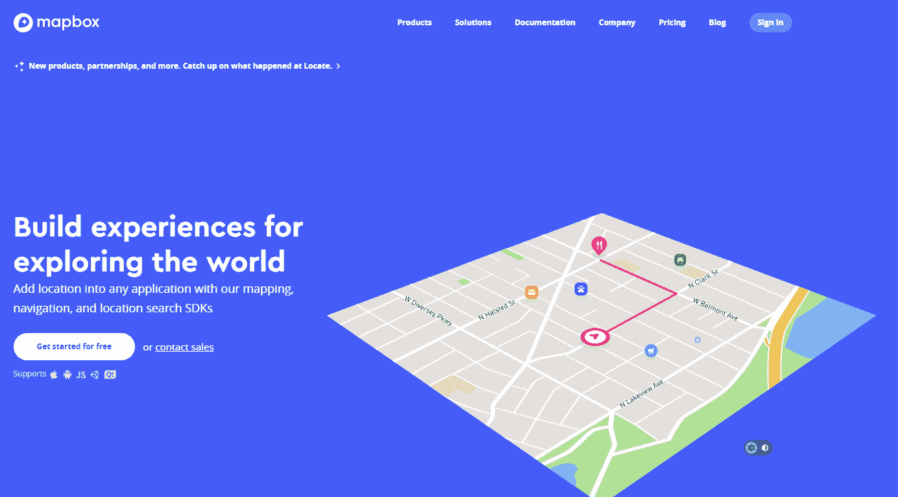

# 项目概述

我们将创建一个小应用程序，允许用户选择他们想要步行到的位置，并将该位置设置为目的地。构建时间大约为 20 分钟。

# 入门

此应用程序的技术要求如下：

+   内核版本为 24 或更高版本的 Android 设备

+   Unity 2018

+   Mapbox ([`www.mapbox.com/`](https://www.mapbox.com/))

# 设置 Mapbox

我们现在将看到如何设置 Mapbox：

1.  我们需要做的第一件事是注册 Mapbox。这需要一个用户名、电子邮件地址和密码：


1.  在注册并验证您的电子邮件地址后，它将带您到一个页面，以了解您需要哪个版本的 Mapbox。您可以选择 iOS、Android、Web 和 Unity：

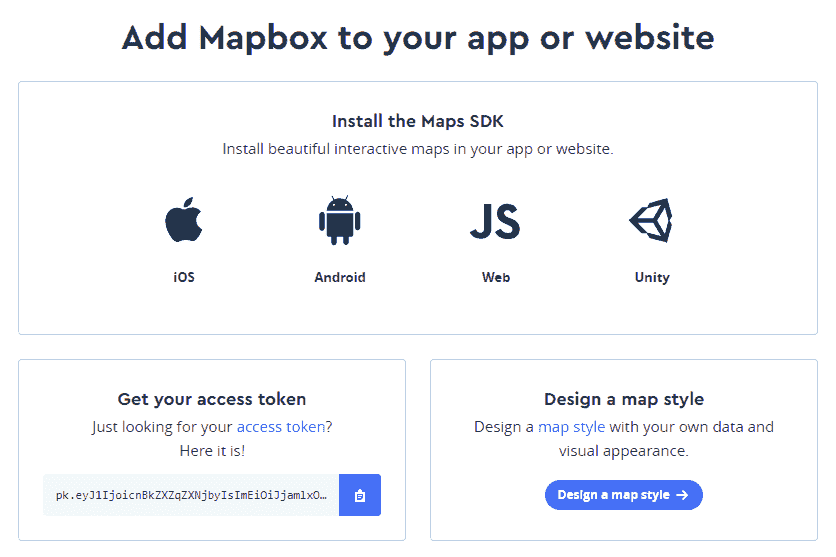

1.  我们想要的版本显然是 Maps SDK for Unity，所以在继续之前，请确保下载 Unity 包：


1.  根据以下截图，您将获得一个访问令牌，这是使用 Mapbox 软件所必需的。请确保复制此密钥并将其粘贴到记事本中以便以后使用：

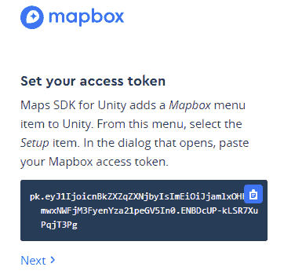

1.  创建一个新的 Unity 项目，并将其命名为 `Chapter6` 或 `Fitness for Fun`：

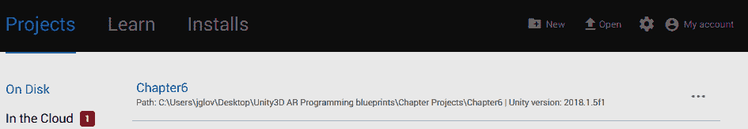

1.  将 Mapbox Unity 资产文件导入到项目中：

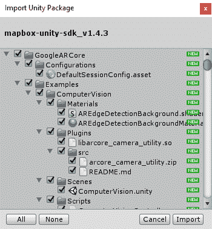

1.  这可能需要一些时间来安装：

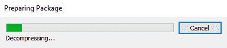

1.  立即安装后，你应该会注意到一个名为 Mapbox 的新菜单项。这为我们打开了许多新的功能，我们可以进行探索：

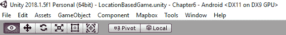

1.  Mapbox 为我们提供了 Atlas Template Generator、Clear File Cache、Setup 和 Map Editor 选项：

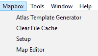

1.  Mapbox Atlas Template Generator 是一个允许您创建和测试自定义地图图集的工具：

在本节中查看每个项目后，立即退出，以便我们继续。我们将重新访问在构建项目时需要的项目。

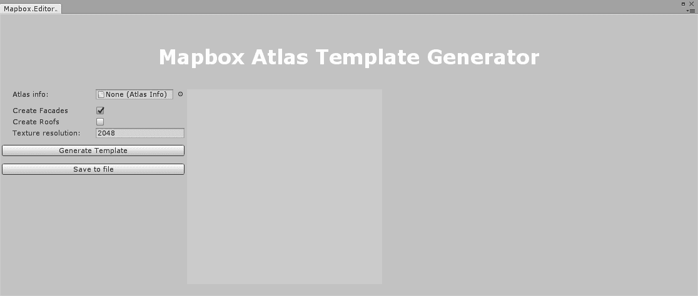

1.  地图编辑器允许您可视化您创建和使用的地图的底层数据结构：

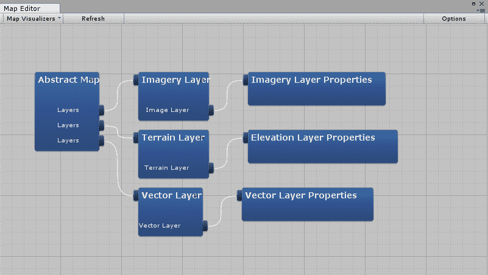

1.  此外，地图编辑器的数据直接关联到地图对象的抽象地图脚本。你对抽象地图脚本数据的任何更改都会反映在地图编辑器中，你在地图编辑器中的任何更改都会反映在抽象地图脚本的数据中：

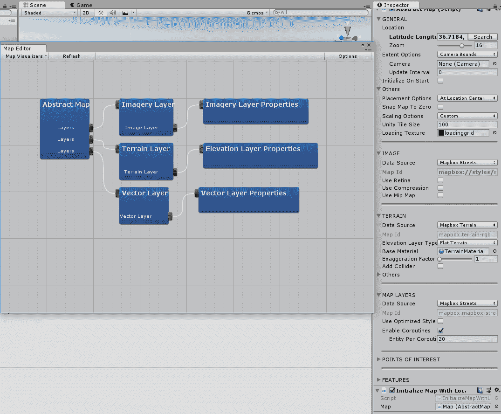

1.  Mapbox 设置选项允许您选择示例场景或地图预制件，但是，这只能在复制并粘贴您的访问令牌并提交信息后访问。这需要您连接到互联网进行验证：

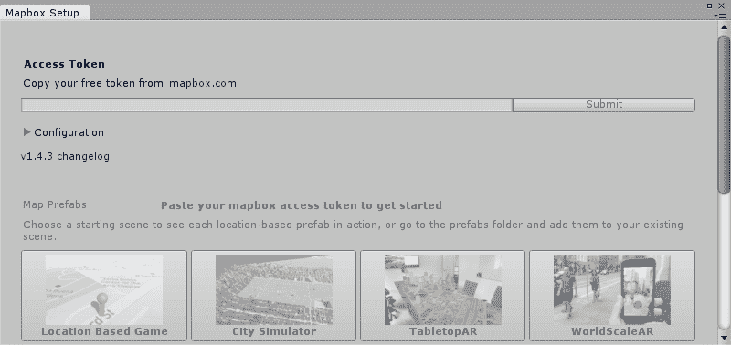

# 需要注意的重要事项

根据不同的项目类型，您将会有预制件会自动添加到活动场景中。在本节中，我们将介绍任何模板类型都会添加的主要对象，即地图对象。

地图是我们添加到任何模板中的最重要的对象，其中包含许多非常重要的项目，我们应该对其进行审查：

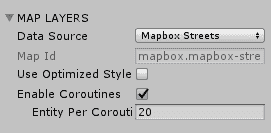

`Map`对象中的第一个项目是抽象地图脚本。其中最重要的项目是地图层、通用、位置和其他：

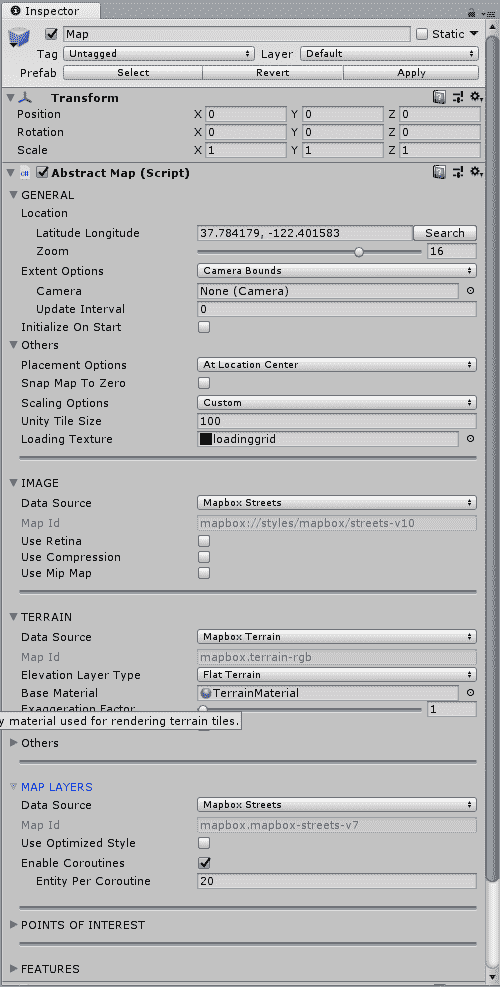

在通用选项卡中，我们有：

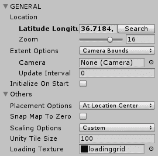

+   纬度经度：如果您点击搜索，您可以通过输入地址、国家城市，甚至城市和州来设置此选项，具体取决于您想要利用的位置。它将自动将其转换为纬度和经度值。

+   缩放：这是专门设置地图可以绘制多近或多远的距离；请注意，如果为它生成了适当的瓦片集，缩放功能才能正常工作。

+   范围选项：这些是您想要地图绘制多远的选项。默认情况下，它设置为摄像机的边界。

+   摄像头：这是您想要使用的摄像头，无论是带有 Vuforia、ARCore、ARKit 还是常规的 Unity 摄像头。

+   更新间隔：这是程序在更新位置和绘制之前应该等待多长时间。

+   初始化于开始时：这是一个布尔值，用于确定是否希望在场景开始时立即绘制地图：

在其他选项卡中，我们也有一些选项：

+   放置选项允许您在位置中心和对齐瓦片中心之间进行选择。这控制了瓦片的中心或根放置。位置中心可以由您定义，而瓦片中心是瓦片的中心。

+   将地图吸附到原点是一个布尔值，用于指定地图的根是否应该吸附到 0,0,0。

+   缩放选项允许您选择是否希望使用自定义或世界缩放。自定义由 Unity 使用墨卡托转换因子定义。世界缩放意味着实际缩放将被渲染，墨卡托转换将被忽略。

+   Unity 瓦片大小是以 Unity 单位为单位的瓦片大小。

+   加载纹理是在加载纹理时使用的纹理。

下一页签是图像选项卡：

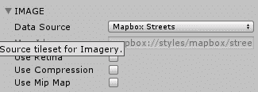

+   数据源：这是我们地图的来源。我们可以使用 Mapbox 街道、Mapbox 户外、Mapbox 暗色、Mapbox 亮色、Mapbox 卫星、Mapbox 卫星街道、自定义或无。这些基本上是您想要使用的地图的主题选项。

+   使用 Retina：这是一个布尔值，允许您选择是否启用使用更大的纹理图和更好的视觉质量以适应视网膜显示屏。

+   使用压缩：这是一个布尔值，允许您选择是否使用 Unity 压缩瓦片纹理。

+   使用 Mip 映射：这是一个布尔值，让您选择是否使用 Unity 生成的 Mip 映射。

下一页签是 TERRAIN，它为我们提供了修改 Mapbox 地图地形的能力：

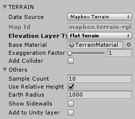

+   数据源：这是第一个选项，它让我们可以选择使用 Mapbox 地形、自定义或无。Mapbox 地形为我们提供全球覆盖的数字高程。自定义允许我们使用自定义的地形模型。无是平坦地形。

+   地图 ID：这是我们想要使用的对应瓦片集的 ID。

+   高程层类型：这为我们提供了选择平坦地形、有高程的地形、低多边形地形和地球地形之间的选项。这允许我们以指定的地高类型渲染地形。平坦地形渲染没有地高的平坦地形。有高程的地形渲染从指定源获得地高的地形。低多边形地形渲染从指定源获得地高的低多边形地形。地球地形渲染没有地高的地球地形。

+   基础材质：这是用于渲染地形瓦片的材质。

+   夸大因子：这个因子乘以垂直夸大地形地高的值，但是它不适用于平坦地形地高层类型。

+   添加碰撞器：这是一个布尔值，允许我们将 Unity 物理碰撞器添加到地形瓦片中，用于检测碰撞。

在**地形**标签页内的**其他**标签页也有几个可供我们选择的选项：

+   样本计数：这为我们提供了地形的分辨率，结果是一个 *n* x *n* 的网格。

+   使用相对高度：这是一个布尔值，它允许我们使用世界相对比例来缩放地形高度。

+   地球半径：这是我们想在 Unity 单位测量中使用的地球半径，即米。

+   显示侧墙：这是一个布尔值，它为地形网格添加侧墙，这减少了视觉伪影。

+   添加到 Unity 层：这会将地形瓦片添加到 Unity 层。勾选复选框后，你将可以选择将它们添加到哪个层——默认、透明 FX、忽略射线投射、水、UI、后期处理和添加层。

接下来是**地图层**标签页：

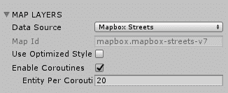

+   数据源：这是矢量数据的数据源。

+   地图 ID：这是我们正在使用的地图的 ID。

+   使用优化样式：这是一个布尔值，允许我们使用 Mapbox 风格的优化瓦片集，这些瓦片集移除了任何未由 Mapbox 样式表示的层或特征。样式优化的矢量瓦片更小，通过线传输，并且是减少离线缓存大小的绝佳方式。

+   启用协程：这是一个布尔值，允许我们使用协程。

+   每个协程实体数：这指定了在单个协程调用中可以组合在一起多少个实体。

**兴趣点**是下一个标签页。在这里，你可以为你的应用程序或游戏中的重要位置创建特殊标记：

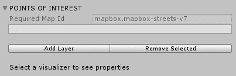

+   必需的地图 ID：这是我们正在使用的瓦片集的地图 ID，不能为空。

+   添加层：这允许我们添加兴趣点层。

+   删除选中项：这允许我们删除一个图层。

最后一个标签是“功能”，它提供了矢量图层可视化器，可以选择添加或删除可视化器。功能允许我们修改某些功能相对于我们创建的兴趣点的显示方式：

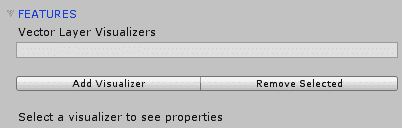

+   添加可视化器：这允许我们更改兴趣点图层可视化的方式

+   删除选中项：这允许我们删除选中的可视化器


最后，我们还有一个名为“使用位置提供者初始化地图”的脚本，它只提供将一个抽象地图对象添加到其中的选项。这个脚本做的正如其名——它会根据你是在 iOS、Windows 还是 Android 设备上注册，并选择最适合它的位置提供者。

# 设置项目

现在是时候设置我们的项目了：

1.  让我们创建一个新的场景并命名为`FitnessFun:`

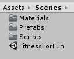

1.  点击 Mapbox 然后设置。这将打开一个设置菜单，你需要粘贴你的访问令牌以获取访问地图预制体模板的权限：

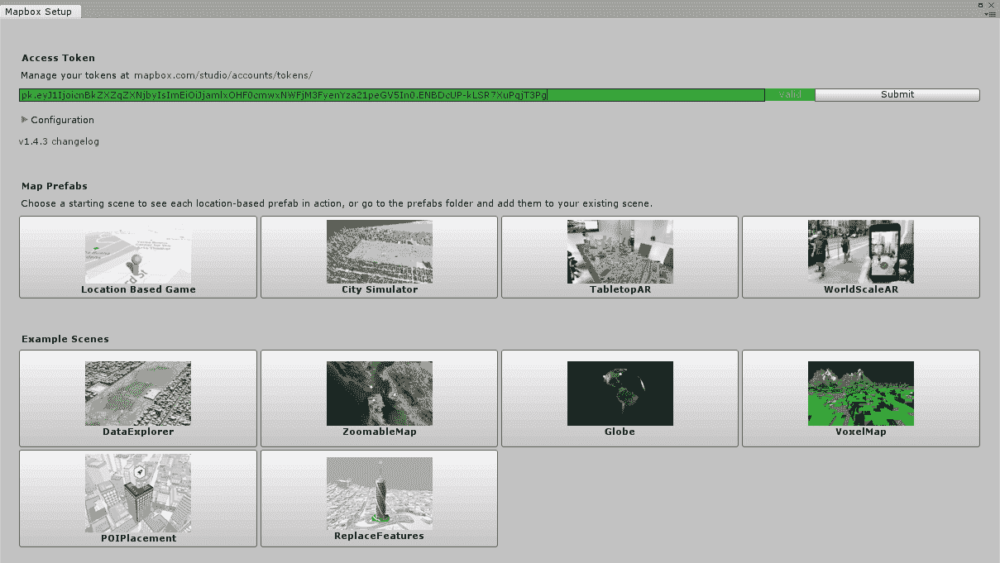

1.  我们想要使用的地图预制体模板是基于位置的游戏：

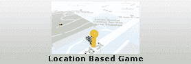

1.  它将在场景中添加一个预制体，看起来像场景编辑标签中的棋子：

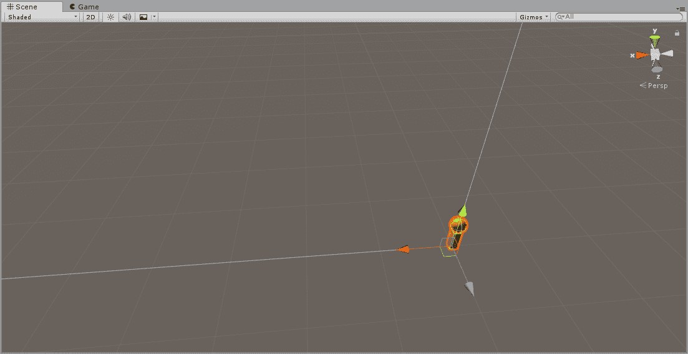

1.  如果你查看层次结构面板，你会注意到那里添加了一个`LocationBasedGame`预制体，如果你深入查看其中的对象，你会看到一个地图、玩家和位置提供者。你还会注意到自动添加到层次结构中的 Canvas 和 EventSystem：

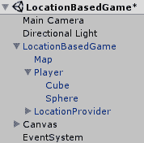

1.  在“场景”文件夹内，创建一个“脚本”文件夹：

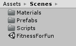

1.  在那个“脚本”文件夹内，创建一个名为`TargetLocationController`的 C#脚本：

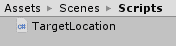

1.  创建另一个名为`DestroyTargetLocation`的脚本：


1.  返回到层次结构面板并复制 Player 组件：

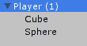

1.  删除带有位置和旋转的即时位置脚本，并将其重命名为`targetLocation`：

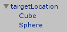

1.  在“场景”文件夹内，创建一个名为“预制体”的文件夹：


1.  将`TargetLocation`对象拖放到“预制体”文件夹中：

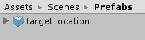

1.  导航到我们的“脚本”文件夹并打开 TargetLocationController 脚本。

我们需要编写脚本以创建一个`TargetLocation`对象的新实例，并在发生某些事情时销毁该对象。

# 脚本化项目

在本节中，我们将看到如何脚本化我们的项目：

1.  我们首先确保使用 Unity 引擎，因为我们需要访问`MonoBehaviour`：

```cs
using UnityEngine;
```

1.  我们的公共类将命名为`TargetLocationController`，这与我们在 Unity 编辑器中命名的脚本文件名相同。我们还将从`MonoBehaviour`继承：

```cs
public class TargetLocationController : MonoBehaviour
{
```

1.  我们将创建一个名为`targetObject`的公共`GameObject`，这样我们就可以将我们的预制体拖放到这个对象上，以便设置对其的引用：

```cs
private GameObject targetObject;
```

1.  在这一点上，我们将创建一个`Start()`方法。我们想要找到项目中带有`targetLocation`标签的对象，因为我们将在触摸事件发生时创建它：

```cs
private void Start()
{
    targetObject = GameObject.FindGameObjectWithTag("targetLocation");
}
```

1.  我们需要创建一个`SetLocation`方法并实例化一个新的射线投射，以便以我们想要的方式利用触摸事件来读取屏幕上的手指按压：

```cs
private void SetLocation()
{
RaycastHit hit = new RaycastHit();
```

1.  我们需要通过触摸事件循环检查我们的输入：

```cs
for (int i = 0; i < Input.touchCount; ++i)
```

1.  我们检查触摸次数是否大于`0`，并且我们的触摸阶段是否为移动：

```cs
if (Input.touchCount > 0 && Input.GetTouch(0).phase == TouchPhase.Moved)
{
```

1.  现在，我们将从屏幕上的当前触摸坐标构造一条射线：

```cs
Ray ray = Camera.main.ScreenPointToRay(Input.GetTouch(i).position);
```

1.  我们需要检查射线投射是否击中任何物体：

```cs
if (Physics.Raycast(ray, out hit))
```

1.  如果射线投射击中任何物体，我们将基于我们的触摸事件创建一个新的预制体实例：

```cs
Instantiate(targetObject, new Vector3(Input.GetTouch(i).position.x, 4.23f, Input.GetTouch(i).position.y), Quaternion.identity);
}
}
```

1.  在我们的`Update()`方法中，我们调用我们的`SetLocation`脚本：

```cs
private void Update()
{
SetLocation();
}
}
```

1.  现在，我们只需要一个简单的碰撞检测脚本，用于检查玩家对象是否与`targetlocation`对象发生碰撞。如果玩家对象与之碰撞，我们希望销毁我们的`targetLocation`对象。

1.  打开`Destroy Target Location`脚本。

1.  我们需要像往常一样使用`UnityEngine`命名空间，因为我们想要从`MonoBehaviour`继承：

```cs
using UnityEngine;
 using System.Collections;
```

1.  类的名称与我们所给的 C#脚本文件名相同，并从`MonoBehaviour`继承，因此我们可以将其附加到 Unity 编辑器中的游戏对象：

```cs
public class DestroyTargetLocation: MonoBehaviour
 {
```

1.  我们创建了一个带有`Collision col`参数的`OnCollisionEnter`方法：

```cs
void OnCollisionEnter (Collision col)
{
```

1.  我们将进行一个简单的`if`检查，以查看我们碰撞的是否是`targetLocation`对象，通过对象的标签名称：

```cs
if(col.gameObject.tag == "targetLocation")
{
```

1.  如果简单的`if`检查返回 true，那么我们将销毁`targetLocation`对象：

```cs
Destroy(col.gameObject);
}
}
}
```

我们已经拥有了完成项目所需的一切。

# 最终完成项目

我们现在将最终完成我们的项目：

1.  返回 Unity 编辑器，将`targetLocation`脚本附加到玩家对象，并将该对象设置为`targetLocation`对象：

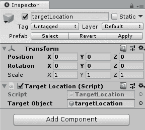

1.  将`DestroyTargetLocation`脚本附加到我们的`LocationBasedGame`对象：

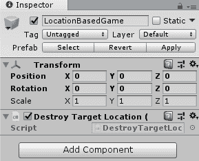

1.  现在，我们可以点击文件 | 构建：

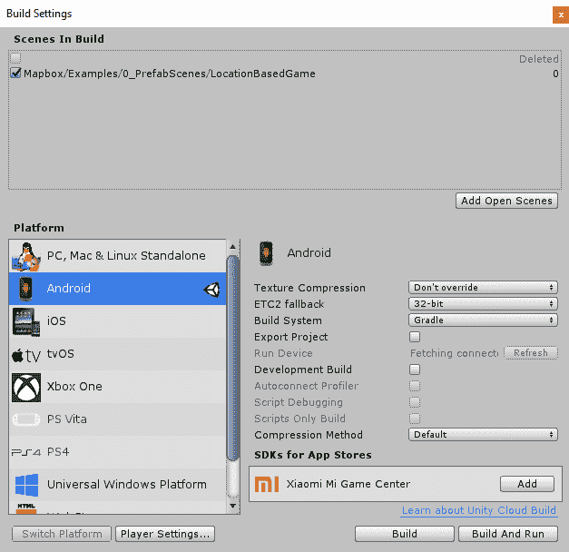

1.  设置 Android 的项目类型：


1.  确保为构建添加的唯一场景是`Chapter6`场景。如果场景列表为空，请点击添加当前场景：

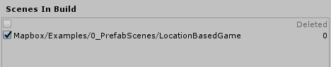

1.  现在，构建项目并将其安装到您的 Android 设备上以运行程序。

# 摘要

在本章中，我们构思并创建了一个健身应用程序原型，鼓励用户为了娱乐而前往不同的地点。我们了解了 Mapbox 及其功能，并学习了如何将其集成到 Unity 中。然后我们利用 Mapbox 创建了一个可查看的 AR 地图，能够使用地理定位技术跟踪用户的位置和目的地。

在下一章中，我们将介绍通过创建图片拼图游戏来帮助儿童学习的应用程序/游戏的制作。

# 问题

利用 Vuforia、ARCore 或 ARKit 来读取世界中的某些对象，以保存您的行踪或使此应用程序游戏化。为此，您需要创建 AR 标记，这些标记有大量的文档和在线示例，展示了如何为不同项目类型利用它们。

1.  您可以使用 Mapbox 与 ARCore、ARKit 和 Vuforia 一起使用：

A.) 正确

B.) 错误

1.  Mapbox 完全免费：

A.) 正确

B.) 错误

1.  Mapbox 完全集成以与 Unity 一起工作：

A.) 正确

B.) 错误

1.  Mapbox 提供基于网页的软件来创建自定义地图：

A.) 正确

B.) 错误

1.  Mapbox 预建了一个示例场景，允许您使用 UnityChan 作为您的玩家模型：

A.) 正确

B.) 错误

# 进一步阅读

Mapbox 对 Unity、iOS、Android、React Native 和 QT 进行了大量的文档记录。他们有关于如何使用 Mapbox Studio、如何直接利用他们的地图、路线和地理编码 API 的教程。访问他们文档的最快方式是访问 [`www.mapbox.com/developers/`](https://www.mapbox.com/developers/)。
