# 使用核心 UI 元素显示数据

在本章中，我们将涵盖：

+   显示“Hello World”UI 文本消息

+   显示数字时钟

+   显示数字倒计时计时器

+   创建一个逐渐消失的消息

+   显示透视 3D 文本网格

+   使用 TextMeshPro 创建复杂的文本

+   显示图像

+   使用 Fungus 开源对话框系统创建 UI

+   使用图像创建 Fungus 角色对话框

# 简介

对大多数游戏娱乐和享受贡献关键因素的是视觉体验的质量，而这其中重要的部分是**用户界面**（**UI**）。UI 元素包括用户与游戏交互的方式（例如按钮、光标和文本框），以及游戏向用户展示最新信息的方式（例如剩余时间、当前生命值、得分、剩余生命或敌人位置）。本章充满了 UI 食谱，为您提供一系列创建游戏 UI 的示例和想法。

# 整体概念

每个游戏都是不同的，因此本章试图完成两个关键角色。第一个目标是提供逐步指导，说明如何创建一系列 Unity 2018 基本 UI 元素，并在适当的情况下，将它们与代码中的游戏变量关联。第二个目标是提供丰富的示例，说明 UI 元素可以用于各种目的，以便您可以获得关于如何使 Unity UI 控件集为正在开发的游戏提供特定视觉体验和交互的灵感。

基本 UI 元素可以提供静态图像和文本，仅使屏幕看起来更有趣。通过使用脚本，我们可以更改这些图像和文本对象的内容，以便更新玩家的数字得分，或者我们可以显示棍人图像来指示玩家剩余的生命。其他 UI 元素是交互式的，允许用户点击按钮、选择选项、输入文本等。更复杂的 UI 类型可能涉及收集和计算有关游戏的数据（例如剩余时间的百分比或敌人击中伤害；或场景中关键游戏对象的位置和类型，以及它们与玩家位置和方向的关系），然后以自然、图形化的方式显示这些值（例如进度条或雷达屏幕）。

核心游戏对象、组件以及与 Unity UI 开发相关的概念包括：

+   **画布**：每个 UI 元素都是**画布**的子元素。单个场景中可以有多个**画布**游戏对象。如果一个**画布**尚未存在，那么在创建新的 UI 游戏对象时，将自动创建一个，该 UI 对象作为新**画布**游戏对象的子元素。

+   **事件系统**：需要一个**事件系统**GameObject 来管理 UI 控件的交互事件。当第一个 UI 元素被创建时，会自动创建一个。Unity 通常在任何场景中只允许一个**事件系统**（一些支持多个并发事件系统的代码可以在[`bitbucket.org/Unity-Technologies/ui/pull-requests/18/support-for-multiple-concurrent-event/diff`](https://bitbucket.org/Unity-Technologies/ui/pull-requests/18/support-for-multiple-concurrent-event/diff)找到）。

+   **视觉 UI 控件**：可见的 UI 控件包括**按钮**、**图像**、**文本**和**切换**。

+   **矩形变换组件**：UI GameObject 可以存在于与 2D 和 3D 场景渲染的相机不同的空间中。因此，UI GameObject 都拥有特殊的**矩形变换**组件，它具有与场景 GameObject 变换组件（具有其直接的 X/Y/Z 位置、旋转和缩放属性）不同的属性。与**矩形变换**相关的是中心点（缩放、调整大小和旋转的参考点）和锚点。

以下图表显示了 UI 控件的主要四个类别，每个类别都在一个**画布**GameObject 中，并通过一个**事件系统**GameObject 进行交互。UI 控件可以有自己的画布，或者几个 UI 控件可以在同一个**画布**中。这四个类别是：**静态**（仅显示）和**交互式 UI**控件、**不可见**组件（例如用于分组一组互斥的单选按钮的组件），以及通过程序代码中编写的逻辑来管理 UI 控件行为的**C#脚本**类。请注意，不是 Canvas 的子或后代的 UI 控件将无法正常工作，如果缺少**事件系统**，交互式 UI 控件也将无法正常工作。一旦将第一个 UI GameObject 添加到场景中，**画布**和**事件系统**GameObject 就会自动添加到层次结构中：

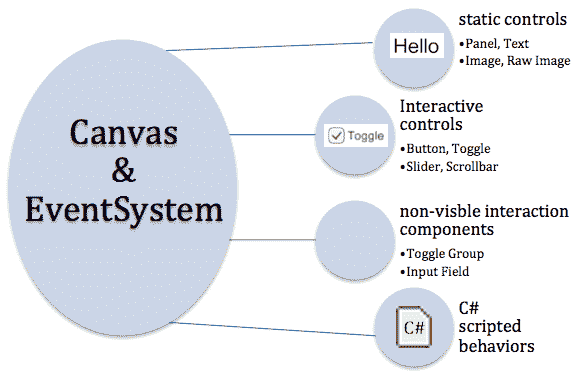

**Rect Transforms** 用于 UI 游戏对象表示一个矩形区域，而不是单个点，这与场景 GameObject Transforms 的情况不同。**Rect Transforms** 描述了 UI 元素相对于其父元素应该如何定位和大小。**Rect Transforms** 具有可以更改的宽度和高度，而不会影响组件的局部缩放。当更改 UI 元素的 **Rect Transform** 的缩放时，这也会缩放字体大小和切片图像的边框等。如果所有四个锚点都位于同一点，调整 **Canvas** 大小不会拉伸 **Rect Transform**。它只会影响其位置。在这种情况下，我们将看到 Pos X 和 Pos Y 属性，以及矩形的宽度和高度。然而，如果锚点不在同一点，**Canvas** 调整大小将导致元素矩形的拉伸。因此，我们将看到 Left 和 Right 的值——矩形的水平边相对于 **Canvas** 边的位置，其中宽度将取决于实际的 **Canvas** 宽度（同样适用于 Top/Bottom/Height）。

Unity 为枢轴和锚点提供了一套预设值，使得最常见的值可以非常快速和容易地分配给元素的 **Rect Transform**。以下截图显示了 3 x 3 的网格，它允许您快速选择左、右、上、下、中间、水平方向和垂直方向的值。此外，右侧的额外列提供了水平拉伸预设，底部额外的行提供了垂直拉伸预设。使用 *Shift*+*Alt *键在点击预设时设置枢轴和锚点：

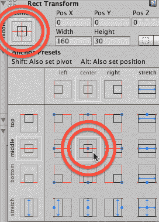

Unity 手册为 **Rect Transform** 提供了一个非常好的介绍。此外，Ray Wenderlich 的两篇 Unity UI 网络教程也提供了关于 Rect Transform、枢轴和锚点的有用概述。Wenderlich 教程的两部分都很好地使用了动画 GIF 来说明枢轴和锚点不同值的效应：

+   [`docs.unity3d.com/Manual/UIBasicLayout.html`](http://docs.unity3d.com/Manual/UIBasicLayout.html)

+   [`www.raywenderlich.com/78675/unity-new-gui-part-1`](http://www.raywenderlich.com/78675/unity-new-gui-part-1)

有三种 **Canvas** 渲染模式：

+   **屏幕空间：叠加**：在此模式下，UI 元素显示时无需参考任何相机（场景中不需要任何 **Camera**）。UI 元素显示在场景内容显示的任何类型的相机之前（叠加）。

+   **屏幕空间**：**相机**：在此模式下，**Canvas** 被视为位于 **Camera** 场景视锥体（观察空间）中的平面——其中此平面始终面向相机。因此，位于此平面之前的所有场景对象都将渲染在 **Canvas** 上的 UI 元素之前。如果屏幕大小、分辨率或相机设置发生变化，**Canvas** 将自动调整大小。

+   **世界空间**：在此模式下，**画布**作为**摄像机**场景视锥体内的一个平面——但该平面并非总是面向**摄像机**。**画布**的显示方式与场景中任何其他对象一样，相对于（如果有的话）在摄像机的视锥体内**画布**平面的位置和方向。

在本章中，我们专注于屏幕空间：叠加模式。但所有这些配方也可以与其他两种模式一起使用。

发挥创意！本章旨在作为想法、技术和可重用 C#脚本发射台，用于您的项目。了解 Unity UI 元素的范围，并尝试聪明地工作。通常，一个 UI 元素已经包含了您可能需要的所有组件，但您可能需要对其进行某种调整。一个例子可以在使 UI 滑动条非交互式的配方中看到，它使用它来显示倒计时计时器的红色-绿色进度条。请参阅*使用 UI 滑动条图形显示倒计时计时器*配方。

许多这些配方都涉及使用 Unity 场景启动事件序列的 C#脚本类，即`Awake()`对所有游戏对象，`Start()`对所有 GameObject，然后每帧对每个 GameObject 调用`Update()`。因此，您将在本章（以及整本书）中看到许多配方，我们在`Awake()`方法中缓存 GameObject 组件的引用，然后在场景启动并运行后，在`Start()`和其他方法中使用这些组件。

# 显示“Hello World”UI 文本消息

使用新计算技术要解决的第一个传统问题是显示 Hello World 消息。在这个配方中，您将学习如何创建一个简单的 UI Text 对象，带有此消息，以选定的字体显示大号白色文本，位于屏幕中央：


# 准备工作

对于这个配方，我们在`01_01`文件夹中的`Fonts`文件夹中准备了您需要的字体。

# 如何操作...

要显示“Hello World”文本消息，请按照以下步骤操作：

1.  创建一个新的 Unity 2D 项目。

1.  导入提供的`Fonts`文件夹。

1.  在层次结构面板中，向场景添加一个 UI | Text GameObject——选择菜单：GameObject | UI | Text。将此 GameObject 命名为`Text-hello`。

使用创建菜单：或者，使用位于层次结构标签下的创建菜单，选择菜单：创建 | UI | Text。

1.  确保在层次结构面板中已选择新的`Text-hello`GameObject。

    现在，在检查器中，确保以下属性已设置：

    +   文本设置为读取`Hello World`

    +   字体设置为`Xolonium-Bold`

    +   字体大小根据您的需求设置（大——这取决于您的屏幕——尝试`50`或`100`）

    +   对齐设置为水平和垂直居中

    +   **水平**和**垂直溢出**设置为**溢出**

    +   **颜色**设置为白色

以下截图显示了具有这些设置的**检查器**面板：

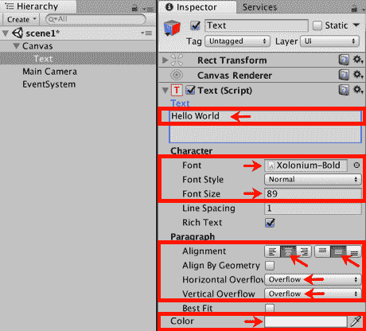

1.  在**Rect Transform**中点击锚点预设的方形图标，这将导致出现几行几列的预设位置方块。按住  *Shift*+*Alt *并点击中心的一个（中间行和 中心列）。

在*简介*中的**Rect Transform**截图突出了本菜谱所需的中间中心预设。

1.  您的 Hello World 文本现在将出现在游戏面板中，居中显示。

# 它是如何工作的...

您已将一个新的 `Text-hello` 游戏对象添加到场景中。同时，也会自动创建一个父级画布和**UI EventSystem**。

您设置了文本内容和展示属性，并使用 Rect Transform 锚点预设来确保无论屏幕如何调整大小，文本都将保持水平和垂直居中。

# 更多内容...

这里有一些您不想错过的更多细节。

# 使用富文本样式化子字符串

每个单独的**UI Text**组件都可以有自己的颜色、大小、粗体样式等。然而，如果您想快速为要显示给用户的字符串的一部分添加一些高亮样式，以下是一些不需要创建单独 UI Text 对象的 HTML 样式标记的示例：

+   使用“b”标记加粗文本：我是 `<b>加粗</b>`

+   使用“i”标记来斜体化文本：我是 `<i>斜体</i>`

+   使用十六进制值或颜色名称设置文本颜色：我是 `<color=green>绿色</color>` 文本 `</color>`, 但我是 `<color=#FF0000>红色</color>`

在 Unity 在线手册的富文本页面[`docs.unity3d.com/Manual/StyledText.html`](http://docs.unity3d.com/Manual/StyledText.html)了解更多信息。

# 显示数字时钟

不论是现实世界的时间，还是游戏中的倒计时时钟，许多游戏都通过某种形式的时钟或计时器显示来增强。最直接的时钟显示类型是由小时、分钟和秒的整数组成的字符串，这正是我们在本菜谱中要创建的。

以下截图显示了我们将在这个菜谱中创建的时钟类型：


# 准备工作

对于这个菜谱，我们在`01_01`文件夹中的`Fonts`文件夹中准备了您需要的字体。

# 如何操作...

要创建一个数字时钟，请按照以下步骤操作：

1.  创建一个新的 Unity 2D 项目。

1.  导入提供的`Fonts`文件夹。

1.  在**层次结构**面板中，将一个 UI | Text 游戏对象添加到场景中，命名为 Text-clock。

1.  确保在层次结构面板中选择了`Text-clock` GameObject。现在，在检查器中，确保以下属性已设置：

+   +   文本设置为随时间读取（此占位文本将在场景运行时被时间替换）

    +   字体类型设置为`Xolonium Bold`

    +   字体大小设置为`20`

    +   对齐设置为水平和垂直居中

    +   水平和垂直溢出设置设置为`Overflow`

    +   颜色设置为白色

1.  在 **Rect Trans****form** 中，点击锚点预设的方形图标，这将导致出现几行几列的预设位置方块。按住 *Shift*+*Alt *并点击顶部和中心的列行。

1.  创建一个名为 `_Scripts` 的文件夹，并在该新文件夹中创建一个名为 `ClockDigital` 的 C# 脚本类：

```cs
using UnityEngine; 
using System.Collections; 
using UnityEngine.UI; 
using System; 

public class ClockDigital : MonoBehaviour { 
  private Text textClock; 

  void Awake (){ 
    textClock = GetComponent<Text>(); 
  } 

  void Update (){ 
    DateTime time = DateTime.Now; 
    string hour = LeadingZero( time.Hour ); 
    string minute = LeadingZero( time.Minute ); 
    string second = LeadingZero( time.Second ); 

    textClock.text = hour + ":" + minute + ":" + 
 second; 
  } 

  string LeadingZero (int n){ 
     return n.ToString().PadLeft(2, '0'); 
  } 
} 
```

下划线前缀使项目按顺序首先出现

由于脚本和场景是最常访问的东西，因此使用下划线字符作为文件夹名称的前缀，即 `_as _Scenes` 和 `_Scripts`，意味着它们总是在项目面板的顶部。

尽管前面的代码对于说明如何单独访问 `DateTime` 对象的时间组件很有用，但 `String` 类的 `Format(...)` 方法可以用来在单个语句中格式化 `DateTime` 对象，例如，前面的代码可以更简洁地写成一个语句：

`String.Format("HH:mm:ss", DateTime.Now)`

想要查看更多示例，请参阅[`www.csharp-examples.net/string-format-datetime/`](http://www.csharp-examples.net/string-format-datetime/).

1.  确保在层次结构面板中选择 `Text-clock` GameObject。

1.  在检查器面板中，通过点击添加组件按钮，选择脚本，然后选择 `Clock Digital` 脚本类，添加 `ClockDigital` 脚本类的实例作为一个组件：

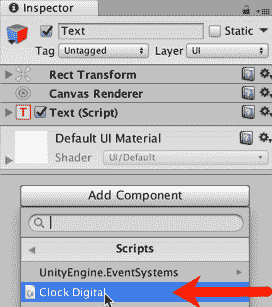

通过拖放添加脚本组件

脚本组件也可以通过拖放添加到 GameObject 中。例如，在层次结构面板中选择 `Text-clock` GameObject，将你的 `ClockDigital` 脚本拖放到它上面，以将此脚本类的实例作为组件添加到 `Text-clock` GameObject。

1.  当你运行场景时，你现在将看到一个数字时钟，显示在屏幕的顶部中央部分的小时、分钟和秒。

# 它是如何工作的...

你已经将一个 Text GameObject 添加到场景中。你已将 `ClockDigital` C# 脚本类的实例添加到该 GameObject。

注意，除了默认为每个新脚本编写的标准两个 C# 包（`UnityEngine` 和 `System.Collections`）之外，你还添加了两个额外的 C# 脚本包的 using 语句，即 `UnityEngine.UI` 和 `System`。**UI 包**是必需的，因为我们的代码使用了 UI 文本对象；而 `System` 包是必需的，因为它包含我们需要的 `DateTime` 类，以便访问运行游戏的计算机上的时钟。

有一个变量，`textClock`，它将是一个对 `Text` 组件的引用，我们希望在每一帧中用当前的小时、分钟和秒来更新其文本内容。

`Awake()` 方法（在场景开始时执行）将 `textClock` 变量设置为对添加了我们的脚本对象的 GameObject 中的 `Text` 组件的引用。以这种方式存储组件的引用称为缓存——这意味着稍后执行的代码不需要重复搜索 GameObject 层次结构以查找特定类型的组件的计算密集型任务。

注意，另一种方法是将 `textClock` 设置为公共变量。这将允许我们在检查器面板中通过拖放来分配它。

`Update()` 方法在每一帧执行。当前时间存储在时间变量中，通过为时间变量的小时、分钟和秒属性添加前导零来创建字符串。

此方法最终将文本属性（即用户看到的字母和数字）更新为字符串，通过冒号连接小时、分钟和秒。

分隔字符。

`LeadingZero(...)` 方法接受一个整数作为输入，并返回一个字符串，如果该值小于 `10`，则在左侧添加前导零。

# 更多内容...

有一些细节您不要错过。

# Unity 教程：如何动画模拟时钟

Unity 发布了一个关于如何创建 3D 对象并通过 C# 脚本动画它们以显示模拟时钟的精彩教程，请参阅 [`unity3d.com/learn/tutorials/modules/beginner/scripting/simple-clock`](https://unity3d.com/learn/tutorials/modules/beginner/scripting/simple-clock)。

# 显示数字倒计时计时器

此配方将向您展示如何显示一个数字倒计时时钟，如下所示：


# 准备中

此配方修改了之前的配方。因此，请复制之前配方的项目，并在此副本上工作。

对于此配方，我们在 `01_03` 文件夹中的 `_Scripts` 文件夹中准备了您需要的脚本。

# 如何实现...

要创建数字倒计时计时器，请按照以下步骤操作：

1.  导入提供的相关 `_Scripts` 文件夹。

1.  在检查器面板中，从 `Text-clock` GameObject 中移除脚本组件 `ClockDigital`。

1.  在检查器面板中，通过点击 `添加组件` 按钮，选择 **脚本**，然后选择 `CountdownTimer` 脚本类，添加 `CountdownTimer` 脚本类的实例。

1.  创建一个包含以下代码的 `DigitalCountdown` C# 脚本类，并将其实例作为脚本组件添加到 `Text-clock` GameObject 中：

```cs
using UnityEngine; 
using UnityEngine.UI; 

public class DigitalCountdown : MonoBehaviour { 
   private Text textClock; 
   private CountdownTimer countdownTimer; 

   void Awake() { 
         textClock = GetComponent<Text>(); 
         countdownTimer = GetComponent<CountdownTimer>(); 
   } 
   void Start() { 
         countdownTimer.ResetTimer( 30 ); 
   }  

   void Update () { 
         int timeRemaining = countdownTimer.GetSecondsRemaining(); 
         string message = TimerMessage(timeRemaining); 
         textClock.text = message; 
   } 

   private string TimerMessage(int secondsLeft) {    
         if (secondsLeft <= 0){ 
             return "countdown has finished"; 
         } else { 
             return "Countdown seconds remaining = " + secondsLeft; 
         } 
   } 
} 
```

1.  当您运行 **场景** 时，您现在将看到一个从 30 开始倒计时的数字时钟。当倒计时达到零时，将显示消息“倒计时完成”。

**使用 `[RequireComponent(...)]` 自动添加组件**

`DigitalCountdown` 脚本类要求同一个游戏对象也要有一个 `CountdownTimer` 脚本类的实例。而不是手动附加一个需要脚本的实例，您可以在类声明语句之前立即使用 `[RequireComponent(...)]` C# 属性。这将导致 Unity 自动附加所需的脚本类实例。

例如，通过编写以下代码，Unity 将在 `DigitalCountdown` 脚本类实例作为游戏对象的组件添加后立即添加 `CountdownTimer` 实例：

```cs
using UnityEngine;   
using UnityEngine.UI;   

[RequireComponent (typeof (CountdownTimer))]   
public class DigitalCountdown : MonoBehaviour {   
```

在 Unity 文档中了解更多信息，请访问 [`docs.unity3d.com/ScriptReference/RequireComponent.html`](https://docs.unity3d.com/ScriptReference/RequireComponent.html)。

# 它是如何工作的...

您已将 `DigitalCountdown` 和 `CountdownTimer` C# 脚本类实例添加到场景的 UI Text 游戏对象中。

`Awake()` 方法将 Text 和 `CountdownTimer` 组件的引用缓存到 `countdownTimer` 和 `textClock` 变量中。`textClock` 变量将是一个指向 **UI Text** 组件的引用，我们希望在每一帧中用剩余时间消息（或计时器完成消息）更新其文本内容。

`Start()` 方法调用计时器对象的 `CountdownTimerReset(...)` 方法，并传递一个初始值为 30 秒的值。

`Update()` 方法在每一帧中执行。此方法检索剩余的计时器秒数，并将其作为整数（整数）存储在 `timeRemaining` 变量中。此值作为参数传递给 `TimerMessage()` 方法，并将结果消息存储在字符串（文本）变量 `message` 中。此方法最终将 `textClock` UI Text 游戏对象的文本属性（即用户看到的字母和数字）更新为剩余秒数的字符串消息。

`TimerMessage()` 方法接受一个整数作为输入，如果值为零或更小，则返回一个表示计时器已完成的消息。否则（如果剩余时间大于零秒），则返回一个表示剩余秒数的消息。

# 创建一个逐渐消失的消息

有时，我们希望消息只显示一段时间，然后逐渐消失并消失。

# 准备工作

此配方修改了之前的配方。因此，请复制该项目的副本，并在此副本上工作。

# 如何实现...

要显示一个逐渐消失的文本消息，请按照以下步骤操作：

1.  在 **检查器** 面板中，从 `Text-clock` 游戏对象中移除脚本组件 `DigitalCountdown`。

1.  创建一个包含以下代码的 C# 脚本类 `FadeAway`，并将其作为一个脚本组件添加到 `Text-hello` 游戏对象中：

```cs
using UnityEngine; 
using UnityEngine.UI; 

[RequireComponent (typeof (CountdownTimer))] 
public class FadeAway : MonoBehaviour { 
   private CountdownTimer countdownTimer; 
   private Text textUI; 

   void Awake () { 
         textUI = GetComponent<Text>();       
         countdownTimer = GetComponent<CountdownTimer>(); 
   } 

   void Start(){ 
         countdownTimer.ResetTimer( 5 ); 
   } 

   void Update () { 
         float alphaRemaining = 
         countdownTimer.GetProportionTimeRemaining(); 
         print (alphaRemaining); 
         Color c = textUI.color; 
         c.a = alphaRemaining; 
         textUI.color = c; 
   } 
} 
```

1.  当您运行 **场景** 时，您现在将看到屏幕上的消息会逐渐消失，在五秒后消失。

# 它是如何工作的...

您将`FadeAway`脚本类的一个实例添加到了`Text-hello`游戏对象中。由于`RequireComponent(...)`属性，还自动添加了一个`CountdownTimer`脚本类的实例。

`Awake()`方法将`Text`和`CountdownTimer`组件的引用缓存到`countdownTimer`和`textUI`变量中。

`Start()`方法将倒计时计时器重置为从五秒开始倒计时。

`Update()`方法（每帧执行）通过调用`GetProportionTimeRemaining()`方法检索我们计时器剩余时间的比例。此方法返回一个介于`0.0`和`1.0`之间的值，这恰好也是 UI Text 游戏对象颜色属性 alpha（透明度）属性的值范围。

**范围灵活，从`0.0`到`1.0`**

通常将比例表示为 0.0 到 1.0 之间的值是个好主意。这将是我们要找的值，或者我们可以将最大值乘以我们的十进制比例，从而得到适当的值。例如，如果我们想要给定`0.0`到`0.1`比例的圆的度数，我们只需将其乘以 360 的最大值，依此类推。

然后`Update()`方法检索正在显示的文本的当前颜色（通过`textUI.color`），更新其 alpha 属性，并将文本对象重置为具有此更新的颜色值。结果是，文本对象中每一帧的透明度代表计时器剩余比例的当前值。当计时器达到零时，文本将完全透明。

# 显示透视 3D 文本网格

Unity 通过 Text Mesh 组件提供了一种在 3D 中显示文本的替代方法。虽然这非常适合场景中的文本（如广告牌、路标以及通常在可能近距离看到的 3D 对象旁边的文字），但它创建起来很快，是创建有趣菜单或指示场景的另一种方式。

在这个配方中，您将学习如何创建一个滚动 3D 文本，模拟电影《星球大战》著名的开场字幕，看起来就像这样：

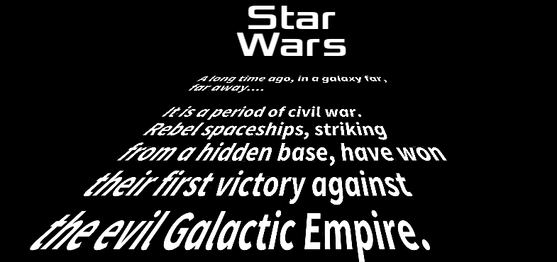

# 准备工作

对于这个配方，我们在`01_07`文件夹中准备了一个名为`Fonts`的文件夹，以及您需要的文本文件位于名为`Text`的文件夹中。

# 如何操作...

要显示透视 3D 文本，请按照以下步骤操作：

1.  创建一个新的 Unity 3D 项目（这确保了我们从一个**透视**相机开始，适合我们想要创建的 3D 效果）。

如果需要在项目中混合 2D 和 3D 场景，您始终可以通过**检查器**面板手动设置任何相机的**相机投影**属性为**透视**或**正交**。

1.  在层次结构面板中，选择主相机项目，然后在检查器面板中设置其属性如下：相机清除标志为纯色，视野为`150`，背景颜色为黑色。

1.  导入提供的 `Fonts` 和 `Text` 文件夹。

1.  在 Hierarchy 面板中，将 UI | Text 游戏对象添加到场景中 - 选择菜单：GameObject | UI | Text。将此 GameObject 命名为 Text-star-wars。

1.  将 UI Text Text-star-wars Text Content 设置为 Star Wars（每个单词占一行）。然后，将其字体设置为 `Xolonium Bold`，字体大小设置为 `50`，并将其 **颜色** 设置为白色。使用 Rect Transform 中的锚点预设将此 UI Text 对象定位在屏幕的顶部中心。设置垂直溢出为 `Overflow`。设置水平对齐为居中（垂直对齐保留为顶部）。

1.  在 Hierarchy 面板中，将一个 3D Text 游戏对象添加到场景中 - 选择菜单：GameObject | 3D Object | 3D Text。将此 GameObject 命名为 Text-crawler。

1.  在 Inspector 面板中，按照以下方式设置 Text-crawler GameObject 的 Transform 属性：位置 (`100, -250, 0`)，旋转 (`15, 0, 0`)。

1.  在 Inspector 面板中，按照以下方式设置 `Text-crawler` GameObject 的 **Text Mesh** 属性：

    +   将提供的文本文件 `star_wars.txt` 的内容粘贴到 Text 中。

    +   设置 Offset Z = `-20`，Line Spacing = `1`，和 Anchor = `Middle center`

    +   设置 Font Size = `200`，Font = `SourceSansPro-BoldIt`

1.  当 **场景** 开始运行时，星球大战的故事文本现在将很好地以 3D 视角显示在屏幕上。

# 它是如何工作的...

你已经模拟了星球大战的开场屏幕，屏幕顶部有一个平面的 UI Text 对象标题，以及具有看似消失在地平线上的 3D 视角“挤压”设置的 3D Text Mesh。

# 更多...

有一些细节你不希望错过。

# 我们必须使这段文本像电影中那样滚动

通过几行代码，我们可以使这段文本在水平方向上滚动，就像在电影中一样。将以下 C# 脚本类 `ScrollZ` 作为组件添加到 `Text-crawler` GameObject：

```cs
using UnityEngine; using System.Collections; public class ScrollZ : MonoBehaviour { public float scrollSpeed = 20; void Update () { Vector3 pos = transform.position; Vector3 localVectorUp = transform.TransformDirection(0,1,0); pos += localVectorUp * scrollSpeed * Time.deltaTime; transform.position = pos; } } 
```

在每一帧中，通过 `Update()` 方法，3D 文本对象的位置会移动到该 GameObject 的局部向上方向。

# 哪里可以了解更多

在 Unity 在线手册中了解更多关于 3D Text 和 Text Meshes 的信息，请访问 [`docs.unity3d.com/Manual/class-TextMesh.html`](http://docs.unity3d.com/Manual/class-TextMesh.html)。

实现类似这种透视文本的另一种方法是将 Canvas 与 World Space 渲染模式一起使用。

# 使用 TextMeshPro 创建复杂的文本

在 2017 年，Unity 购买了 **TextMeshPro Asset Store** 产品，目的是将其集成到 Unity 中作为一个免费的核心功能。**TextMeshPro** 使用 **Signed Distance Field** （**SDF**）渲染方法，在任何点大小和分辨率下都能产生清晰且轮廓鲜明的字符。因此，你需要 SDF 字体来使用此资源。

# 准备工作

在撰写本文时，**TextMeshpro**是免费的**Asset Store**下载和**Unity Essentials Beta**，所以第一步仍然是通过资产商店导入。当你阅读这篇文章时，你可能会发现**TextMeshPro**作为一个标准的 GameObject 类型，你可以在场景面板中创建，无需下载。所以，如果需要，打开资产商店面板，搜索**TextMeshPro**，导入这个免费资产包。

对于这个配方，我们在`01_08`文件夹中的 Fonts & Materials 文件夹中准备了所需的字体。

# 如何做到这一点...

要显示具有复杂的**TextMeshPro**视觉样式的文本消息，请按照以下步骤操作：

1.  创建一个新的 Unity 3D 项目。

1.  在场景中添加一个新的 UI TextMeshPro **Text** GameObject – 选择菜单：

    GameObject | UI | TextMeshPro **– text**. 将此 GameObject 命名为 Text-sophisticated。

**TextMeshPro** GameObject 不必是 UI Canvas 的一部分。你可以通过选择场景面板菜单**创建** | **3D 对象** | **TextMeshPro – text**直接将**TextMeshPro** GameObject 添加到场景中。

1.  确保在层次面板中选中了新的**Text-sophisticated** GameObject。在 Rect Transform 的检查器中，点击锚点预设的方形图标，按住*Shift* + *Alt*，然后点击顶部并拉伸行。

1.  确保以下属性已设置：

    **字体设置：**

    +   字体资产设置为`Anton SDF`

    +   材质预设设置为`Anton SDF - Outline`

    +   字体大小`200`

    +   对齐设置为水平居中

1.  **面：**

    +   颜色设置为`white`

    +   扩展设置为`0`

1.  **轮廓：**

    +   颜色设置为`Red`

    +   厚度设置为`0.1`

1.  **底纹（阴影）：**

    +   X 偏移量设置为`1`

    +   Y 偏移量设置为`-1`

    +   扩展设置为`1`

以下截图显示了具有这些设置的**检查器**面板：

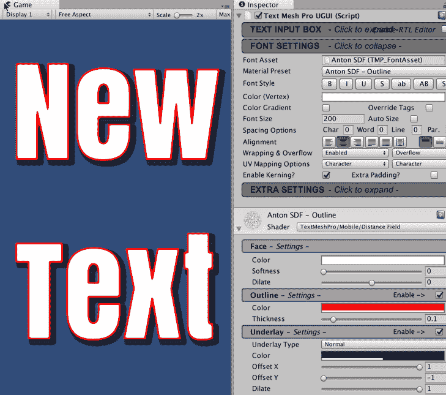

1.  **Text-sophisticated** GameObject 现在将显示为非常大，内部为白色，轮廓为红色，右下角有阴影。

# 它是如何工作的...

你已经向场景中添加了一个新的**UI TextMeshPro Text** GameObject。你选择了一个 SDF 字体和一个轮廓材质预设。然后调整了面（每个字符的内部部分）、轮廓和下阴影（底纹）的设置。

**TextMeshPro**组件有数百种设置，因此可能需要大量实验才能达到特定的效果。

# 更多内容...

这里有一些你不想错过的更多细节。

# 颜色、效果和精灵的富文本子串

**TextMeshPro**提供了超过 30 种 HTML 风格的标记来对子串进行标记。以下代码演示了一些，包括以下内容：

```cs
<sprite=5> inline sprite graphics 

<smallcaps>...</smallcaps> small-caps and colors 

<#ffa000>...</color> substring colors 
```

一个强大的标记是`<page>`标签，这允许一组文本成为交互式，并以一系列页面呈现给用户。

在[`digitalnativestudios.com/textmeshpro/docs/rich-text/`](http://digitalnativestudios.com/textmeshpro/docs/rich-text/)的在线手册富文本页面了解更多信息。

# 显示图像

有许多情况下我们希望在屏幕上显示图像，包括标志、地图、图标和启动图形。在这个食谱中，我们将显示屏幕顶部的图像。

以下截图显示了 Unity 显示的图像：


# 准备工作

对于这个食谱，我们在`01_07`文件夹中的`Images`文件夹中准备了您需要的图像。

# 如何操作...

要显示图像，请按照以下步骤操作：

1.  创建一个新的 Unity 2D 项目。

1.  将游戏面板设置为 400 x 300 的大小。首先显示**游戏**面板，然后在面板顶部的下拉菜单中创建一个新的**分辨率**。点击此菜单底部的加号符号，设置**标签** = **第二章**，**宽度** = **400**，**高度** = **300**。点击**确定**，**游戏**面板应设置为这个新分辨率：

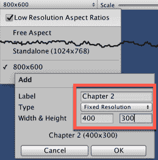

或者，您可以通过菜单**编辑** | **项目设置** | **玩家**来设置默认的**游戏**面板分辨率，然后在检查器中的分辨率和展示宽高（已关闭全屏选项）。

1.  导入提供的`Images`文件夹。在**检查器**选项卡中，确保`unity_logo`图像的**纹理类型**设置为**默认**。如果它有其他类型，则从下拉列表中选择**默认**，然后点击应用按钮。

1.  在**层次**面板中，将一个 UI | 原始图像 GameObject 命名为`RawImage-logo`添加到场景中。

1.  确保在**层次**面板中选择`RawImage-logo`GameObject。在**原始图像（脚本）**组件的**检查器**中，点击**纹理**属性右侧的文件查看器圆形图标，并选择**image unity_logo**，如图所示：

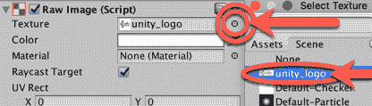

将此纹理分配的另一种方法是，从您的**项目**文件夹（图像）中拖动`unity_logo`图像到**原始图像（脚本）**公共属性**纹理**。

1.  点击**设置原生大小**按钮以调整图像大小，使其不再拉伸和扭曲。

1.  在**矩形变换**中，点击**锚点预设**方框图标，这将导致出现几行几列的预设位置方块。按住*Shift* + *Alt*并点击顶部行和中心列。

1.  现在，图像将整齐地定位在**游戏**面板的顶部，并且将水平居中。

# 它是如何工作的...

您已确保图像的**纹理类型**设置为**默认**。您已向场景中添加了一个**UI 原始图像**控件。**原始图像**控件被设置为显示`unity_logo`图像文件。

图像已定位在**游戏**面板的顶部中心。

# 还有更多...

有些细节您不应该错过：

# 与 2D 精灵和 UI 图像组件一起工作

如果你只想显示非动画图像，那么 Texture 图像和**UI RawImage**控件是最佳选择。然而，如果你想对图像的显示方式有更多选项（如瓦片和动画），则应使用 UI Image 控件。此控件需要将图像文件导入为 Sprite（2D 和 UI）类型。

一旦图像文件被拖入 UI Image 控制器的**Sprite**属性中，将会有额外的属性可用，例如**图像类型**，以及保留宽高比选项。

如果你希望防止 UI Sprite GameObject 的扭曲和拉伸，那么在**检查器**面板中，检查**保留宽高比**选项，在其**图像（脚本）**组件中。

# 参见

在第三章中，*库存 UI*的*通过改变瓦片图像的大小来显示多个对象拾取的图标*食谱中可以找到一个瓦片 Sprite 图像的示例。

# 使用 Fungus 开源对话系统创建 UI

而不是每次都从头开始构建自己的 UI 和交互，Unity 中有很多 UI 和对话系统可供选择。一个强大、免费且开源的对话系统叫做 Fungus，它使用可视流程图方法进行对话设计。

在本食谱中，我们将创建一个非常简单的一句对话，以说明 Fungus 的基本用法。以下截图显示了 Fungus 生成的句子**How are you today?**的对话：

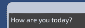

# 如何做到...

要使用**Fungus**创建一句对话，请按照以下步骤操作：

1.  创建一个新的 Unity 2D 项目。

1.  打开**资源管理器**面板，搜索**Fungus**，并导入这个免费的资源包（搜索 Fungus 和免费）。

1.  通过选择菜单：**工具** | **Fungus** | **创建** | **流程图**来创建一个新的**Fungus**流程图 GameObject。

1.  通过选择菜单：**工具** | **Fungus** | **流程图窗口**来显示并停靠 Fungus 流程图窗口面板。

1.  在**流程图窗口**中将有一个块。点击此块以选择它（块周围出现绿色边框以指示已选择）。在**检查器**面板中，将此块的**块名称**更改为开始：

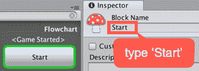

1.  **流程图**中的**每个块**都遵循一系列命令。因此，在**检查器**中，我们现在将创建一系列（说）命令，以便在游戏运行时向用户显示两个句子。

1.  确保在**流程图**面板中**开始**块仍然被选中。点击**检查器**面板底部的加号（**+**）按钮以显示**命令**菜单，并选择**叙事**| **说** **命令**：

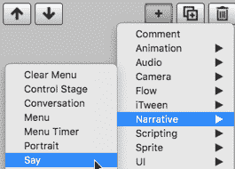

1.  由于我们只为这个块有一个命令，因此该命令将自动在**检查器**的顶部部分被选中（高亮绿色）。检查器的下半部分显示了当前选定的**命令**的属性，如下面的截图所示。在检查器的下半部分，对于**故事文本**属性，输入您希望向用户展示的问题文本，即**你今天怎么样？**：

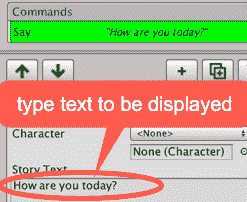

1.  创建另一个**说命令**，并为其**故事文本属性**输入以下内容：**非常好，谢谢**。

1.  当您运行游戏时，用户首先会看到**你今天怎么样？**的文本（在屏幕上逐字输入时会听到点击声）。在用户点击对话框窗口右下角的**继续**三角形按钮后，他们将看到第二句话：**非常好，谢谢**。

# 它是如何工作的...

您已创建一个新的 Unity 项目，并导入了**Fungus**资产包，其中包含**Fungus Unity**菜单、窗口和命令，以及示例项目。

您已将一个名为**开始**的**Block**添加到场景中，这是一个**Fungus 流程图**。当游戏开始时（因为第一个块的默认行为是在接收到游戏开始事件时执行），您的块开始执行。

在**开始**块中，您添加了一系列两个**说命令**。每个命令向用户展示一句话，然后等待点击继续按钮才能继续到下一个**命令**。

如所示，**Fungus**系统负责为用户创建一个展示良好的面板，显示所需的文本和继续按钮。**Fungus**提供许多其他功能，包括菜单、动画以及控制和音乐，这些细节可以在下一道菜谱中找到，并通过探索他们提供的示例项目和网站：

+   [`fungusgames.com/`](http://fungusgames.com/)

+   [`github.com/FungusGames/Fungus`](https://github.com/FungusGames/Fungus)

# 创建带有图像的 Fungus 角色对话

在之前的菜谱中引入的**Fungus**对话系统支持多个角色，其对话可以通过其名称、颜色、音效甚至肖像图像来突出显示。在这个菜谱中，我们将创建一个 Sherlock Holmes 和 Watson 之间的双角色对话来展示该系统：

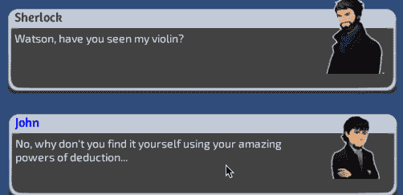

# 如何做到...

要使用 Fungus 创建带有肖像图像的角色对话，请按照以下步骤操作：

1.  创建一个新的 Unity 2D 项目。

1.  打开**资产商店**面板，并**导入****Fungus**对话资产包（这包括**Fungus**示例，我们将使用这些示例图像的两个角色）。

1.  通过选择菜单：**工具** | **Fungus** | **创建** | **流程图**，创建一个新的**Fungus 流程图** GameObject。

1.  通过选择菜单：**工具** | **Fungus** | **流程图窗口**来显示并停靠**Fungus 流程图**窗口面板。

1.  将**流程图**中唯一的**块**的名称更改为“失踪小提琴案”。

1.  通过选择菜单：**工具** | **Fungus** | **创建** | **角色**来创建一个新的角色。

1.  现在，你应该在**层次结构**中看到一个新**角色**GameObject。

1.  在**项目**面板中选择 GameObject **Character** 1 – **Sherlock**，然后在**检查器**中编辑其属性：

    +   将此 GameObject 重命名为**Character** 1 – **Sherlock**。

    +   在其**角色（脚本）**组件中，将**名称文本**设置为**Sherlock**并将**名称颜色**设置为绿色。

    +   在**检查器**中，点击**添加肖像**按钮（加号“**+**”），以获得一个可以添加肖像图像的“槽”。

    +   将适当的图像拖放到你的新肖像图像槽中（在这个屏幕截图中，我们使用了 Sherlock 示例项目中的“自信”图像：**Fungus Examples** | **Sherlock** | **Portraits** | **Sherlock**）：

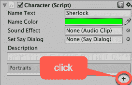

1.  重复上述 6-8 步来创建第二个角色 John，使用**名称颜色** = 蓝色和**肖像图像** = 恼怒。

1.  选择你的**流程图**中的**块**，以便你可以添加一些要执行的**命令**。

1.  创建一个**说**命令，为**Character 1 - Sherlock**，说“华生，你看到我的小提琴了吗？”并选择**自信**的肖像（因为这是我们为角色添加的唯一一个）：

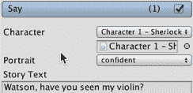

1.  添加第二个**说**命令，这次是为**Character 2 – John**，说“不，你为什么不自己用你惊人的推理能力去找呢...”并选择**恼怒**的肖像：

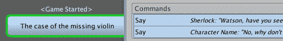

1.  运行场景，你应该会看到一系列陈述，清楚地显示谁在说（带有颜色的）名称文本**以及**为每个**说**命令所选的肖像图像（在 Sherlock 的文本出现完毕后，点击框开始 John 的句子）。

# 它是如何工作的...

你已经创建了一个包含**Fungus**资产包的新 Unity 项目。

你已经将**Fungus 流程图**添加到场景中，并且还添加了两个角色（每个角色都有一个文本颜色和肖像图像）。

对于添加到**说**命令中的**流程图**中的**块**，指定了哪个角色在说每句话，以及使用哪个肖像（如果你添加了更多肖像图像，你可以选择不同的图像来表示说话角色的情绪）。

# 更多...

有一些细节你不希望错过。

# 数据驱动对话

Fungus 提供了一种数据驱动的对话方法。角色和肖像（以及面向方向、舞台上的移动与否等）可以通过使用**说**命令的**叙事** | **对话**选项的简单格式中的文本来定义。此菜谱的带有肖像图像的对话可以用**对话**中的两行文本来声明：

```cs
Sherlock confident: Watson, have you seen my violin?
John annoyed: No, why don't you find it yourself using your amazing powers of deduction...
```

在他们的文档页面上了解更多关于真菌对话系统的信息：[`fungusdocs.snozbot.com/conversation_system.html`](http://fungusdocs.snozbot.com/conversation_system.html).
