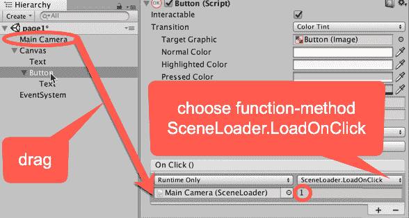
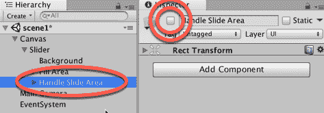
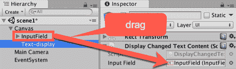

# 第二章：对交互式 UI 的用户事件做出响应

在本章中，我们将涵盖以下内容：

+   创建 UI 按钮在场景之间移动

+   在鼠标悬停时动画化按钮属性

+   通过按钮组织图像面板和更改面板深度

+   显示交互式 UI 滑块的值

+   使用 UI 滑块图形化显示倒计时计时器

+   为 2D 和 3D GameObject 设置自定义鼠标光标

+   为 UI 控件设置自定义鼠标光标

+   使用输入字段进行交互式文本输入

+   通过切换组使用切换和单选按钮

+   创建文本和图像图标 UI 下拉菜单

+   显示雷达以指示对象的相对位置

# 简介

本章中的几乎所有食谱都涉及不同的交互式 UI 控件。尽管有不同类型的交互式 UI 控件，但使用它们的基本方式以及脚本动作响应用户动作都是基于相同的概念：事件触发对象方法函数的执行。

然后，为了娱乐和展示一种非常不同的 UI 类型，最后的食谱演示了如何将一个复杂的实时通信添加到游戏中，该通信显示场景中对象的相对位置（即雷达！）。

# 整体概念

UI 可以用于三个主要目的：

1.  要显示**静态（不变）值**，例如游戏的名称或标志图像，或者如“等级”和“得分”之类的文字标签，这些标签告诉我们它们旁边的数字表示什么（这些食谱可以在第一章，*使用核心 UI 元素显示数据*中找到）。

1.  要显示**由于我们的脚本而变化的值**，例如计时器、得分或玩家角色与其他对象之间的距离（本章末尾的雷达食谱就是一个例子）。

1.  **交互式** UI 控件，其目的是允许玩家通过鼠标或触摸屏与游戏脚本进行通信。我们将在本章中详细探讨这些控件。

在 Unity 中处理交互式 UI 控件的核心概念是将对象的公共方法注册为特定事件发生时的通知。例如，我们可以将一个 UI 下拉菜单添加到名为“DropDown 1”的场景中，然后编写一个包含`NewValueAction()`公共方法的`MyScript`脚本类来执行某些操作。但除非我们做两件事，否则什么都不会发生：

1.  我们需要在场景中的 GameObject（在我们的例子中命名为`go1` - 虽然我们也可以选择将脚本实例添加到 UI GameObject 本身）上添加脚本类的**实例**作为组件。

1.  在 UI 下拉菜单的属性中，我们需要将脚本组件的 GameObject 的公共方法**注册**为响应`On Value Changed`事件消息：


`MyScript`脚本的`NewValueAction()`公共方法通常将检索用户在下拉菜单中选择的值并对其进行处理——例如，向用户确认，更改音量，或更改游戏难度。每当 GameObject go1 收到`NewValueAction()`消息时，`NewValueAction()`方法将被调用（执行）。在 DropDown 1 的属性中，我们需要将 GameObject go1 的脚本组件 MyScript 的`NewValueAction()`公共方法注册为 On Value Changed 事件的监听器。我们需要在**设计时**（即在 Unity 编辑器运行场景之前）完成所有这些操作：


在**运行时**（当构建的应用程序中的场景正在运行时），如果用户更改 UI Dropdown GameObject DropDown 1 的下拉菜单中的值（图中的步骤 1），这将生成一个 On Value Changed 事件。DropDown 1 将更新其屏幕上的显示，以向用户显示新选定的值（步骤 2a）。它还将向所有注册为**On Value Changed**事件监听器的 GameObject 组件发送消息（步骤 2b）。在我们的例子中，这将导致 GameObject go1 的脚本组件中的`NewValueAction()`方法被执行（步骤 3）。

注册公共对象方法是处理用户交互或网络通信等事件的一种非常常见的方式，这些事件可能按不同的顺序发生，可能永远不会发生，或者可能在短时间内发生多次。几种软件设计模式描述了如何处理这些事件设置，例如**观察者模式**和**发布-订阅**模式（我们将在第十六章设计模式中了解更多关于这种模式的信息）。

与交互式 Unity UI 开发相关的核心 GameObject、组件和概念包括：

+   **视觉 UI 控件**：可见的 UI 控件包括按钮、图像、文本和切换。这些是用户在屏幕上看到的 UI 控件，并使用鼠标/触摸屏与之交互。这些是维护已订阅用户交互事件的对象方法的列表的 GameObject。

+   **交互 UI 控件**：这些是非可见组件，它们被添加到 GameObject 中；例如，包括输入字段和切换组。

+   **面板**：UI 对象可以使用 UI Panels 进行分组（逻辑上和物理上）。面板可以扮演多个角色，包括为相关控制组提供 Hierarchy 中的 GameObject 父对象。它们可以提供视觉背景图像，以图形化地关联屏幕上的控件，并且如果需要，还可以添加脚本化的调整大小和拖动交互。

+   **兄弟深度**：UI 元素的从下到上的显示顺序（什么出现在什么上面）最初由它们在 Hierarchy 中的顺序决定。在设计时，可以通过将 GameObjects 拖动到 Hierarchy 中所需的顺序来手动设置。在运行时，我们可以向 GameObjects 的 Rect Transforms 发送消息，以动态更改它们的 Hierarchy 位置（因此，显示顺序），以满足游戏或用户交互的需求。这可以在 *通过按钮组织面板内的图像和更改面板深度* 菜谱中看到。

通常，一个 UI 元素已经包含了你可能需要的游戏中的大多数组件，但你可能需要对其进行某种调整。一个这样的例子可以在 *使用 UI 滑块图形显示倒计时计时器状态* 菜谱中看到，该菜谱将 UI 滑块变为非交互式，而是用它来显示倒计时计时器的红色-绿色进度条。

# 创建 UI 按钮在场景之间切换

除了玩家玩游戏时的场景外，大多数游戏还会有菜单屏幕，这些屏幕向用户显示有关说明、高分、他们已经达到的水平等信息。Unity 提供了 UI 按钮，为用户提供了一种简单的方式来表示他们的选择。

在这个菜谱中，我们将创建一个非常简单的游戏，由两个屏幕组成，每个屏幕都有一个按钮来加载另一个屏幕，如图所示：


# 如何做到这一点...

要创建一个按钮可导航的多场景游戏，请按照以下步骤操作：

1.  创建一个新的 Unity 2D 项目。

1.  在新文件夹 `_Scenes` 中保存当前（空）场景，命名为 scene page1。

1.  在场景顶部中心位置添加一个 **UI 文本** 对象，包含显示“主菜单（页面 1）”的大号白色文本。

1.  在屏幕中间位置添加一个 **UI 按钮**。在 **Hierarchy** 中，点击显示子对象三角形以显示此 GameObject 按钮的 **Text** 子对象。选择 **Text** GameObject，并在 **Inspector** 中为 Text（脚本）组件的 Text 属性输入文本“转到页面 2”：


1.  创建一个名为 page2 的第二个场景，UI 文本为“说明（页面 2）”，并添加一个带有“转到页面 1”文本的 **UI 按钮**。你可以重复前面的步骤，或者你可以复制 page1 场景文件，将其命名为 page2，并相应地编辑 UI 文本和 UI 按钮文本。

1.  将两个场景添加到构建中，这是 Unity 构建的实际应用程序中最终将包含的场景集。要将 scene1 添加到构建中，打开 scene page1，然后选择菜单：文件 | 构建设置... 然后点击添加当前按钮，使 page1 场景成为构建中场景列表中的第一个场景。现在打开 scene page2 并重复此过程，这样两个场景都已被添加到构建中。

我们不能告诉 Unity 加载一个尚未添加到构建场景列表中的场景。这很有道理，因为当应用程序构建时，我们永远不应该尝试打开不属于该应用程序的场景。

1.  确保你已经打开了场景 page1。

1.  在一个名为`_Scripts`的新文件夹中创建一个 C#脚本类，名为`SceneLoader`，包含以下代码，并将其作为一个脚本组件添加到主相机中：

```cs
using UnityEngine; 
using UnityEngine.SceneManagement; 

public class SceneLoader : MonoBehaviour { 
    public void LoadOnClick(int sceneIndex) { 
        SceneManager.LoadScene(sceneIndex); 
    } 
} 
```

1.  在层级窗口中选择按钮，然后在**Inspector**视图的**Button (Script)**组件的底部点击加号（+）按钮，为这个按钮创建一个新的`OnClick`事件处理程序（即当按钮被点击时执行的动作）。

1.  将主相机从层级窗口拖动到位于“仅运行时”菜单下方立即的“对象”槽位。这意味着当按钮接收到`OnClick`事件时，我们可以从主相机内的脚本对象中调用一个公共方法。

1.  从 SceneLoader 下拉列表中选择`LoadOnClick`方法（最初显示为“无函数”）。在方法下拉菜单下的文本框中输入 1（我们希望在点击按钮时加载的场景的索引）。这个整数 1 将在按钮接收到`OnClick`事件消息时传递给方法，如这里所示：



1.  保存当前场景（page1）。

1.  打开 page2，并按照相同的步骤来使 page2 按钮加载 page1。也就是说，将`SceneLoader`脚本类的实例添加到主相机中，然后为按钮添加一个`OnClick`事件动作，调用`LoadOnClick`，并传递整数 0，这样就可以加载场景 page1。

1.  保存场景 page2。

1.  当你运行 page1 场景时，你会看到主菜单文本和一个按钮，点击这个按钮会使游戏加载 page2 场景。在场景 page2 中，你会有一个按钮可以带你回到 page1。

# 它是如何工作的...

你已经创建了两个场景，并将这两个场景都添加到了游戏的构建中。你为每个场景添加了一个 UI 按钮和一些 UI Text。

注意，场景的构建顺序实际上是一个脚本数组，从 0 开始计数，然后是 1，依此类推，所以 page1 的索引是 0，page2 的索引是 1。

当一个 UI 按钮被添加到层级面板中时，也会自动创建一个子 UI Text 对象，并且这个 UI Text 子对象的文本属性内容就是用户在按钮上看到的文本。

你创建了一个脚本类，并将其作为一个组件添加到了主相机中。实际上，这个脚本实例添加的位置并不重要，只要它在场景中的某个 GameObject 中即可。这是必要的，因为按钮的`OnClick`事件动作只能执行场景中 GameObject 组件的方法（函数）。

对于每个场景的按钮，你随后添加了一个新的 `OnClick` 事件动作，该动作调用（执行）主摄像机中 SceneLoader 脚本组件的 `LoadOnClick` 方法。此方法输入场景在项目构建设置中的整数索引，因此页面 1 场景上的按钮给出整数 1 作为要加载的场景，而页面 2 的按钮给出整数 0。

# 还有更多...

有一些细节你不应该错过。

# 鼠标指针悬停在按钮上时的颜色渐变

有几种方式可以让我们在用户将鼠标光标移至按钮上时，从视觉上告知用户该按钮是交互式的。最简单的是添加一个当鼠标悬停在按钮上时出现的颜色渐变效果——这是默认的 **过渡**。在层次结构中选择按钮（脚本）组件，在检查器选项卡中为按钮（脚本）组件的 **高亮颜色** 属性选择一个着色颜色（例如，红色）：


另一种通知用户活动按钮的视觉过渡形式是 Sprite Swap。在这种情况下，**检查器** 面板中提供了针对目标/高亮/按下/禁用不同图像的属性。默认的目标图形是内置的 Unity **按钮（图像）**——这是当创建 GameObject 按钮时的灰色圆形矩形默认值。将一个看起来非常不同的图像拖入 **高亮** Sprite 是设置颜色渐变的有效替代方案。我们为这个菜谱提供了一个 `rainbow.png` 图像，可用于按钮鼠标悬停高亮 Sprite。截图显示了具有这种彩虹背景图像的按钮：


# 在鼠标悬停时动画按钮属性

在上一个菜谱的末尾，我们展示了两种向用户传达按钮的方法。按钮属性的动画可以是一种非常有效且视觉上吸引人的方式，以向用户强化他们当前鼠标悬停的项是一个可点击的、活动的按钮。一个常见的动画效果是当鼠标悬停在按钮上时，按钮变大，然后当鼠标指针移开时，它又恢复到原始大小。动画效果是通过为 `Button` GameObject 的过渡属性选择动画选项，并创建具有正常、高亮、按下和禁用状态触发器的动画控制器来实现的。

# 如何做到这一点...

要在鼠标悬停时（高亮状态）使按钮动画放大，请执行以下操作：

1.  创建一个新的 Unity 2D 项目。

1.  创建一个 **UI 按钮**。

1.  在 **检查器按钮（脚本）** 组件中，将 **过渡** 属性设置为 **动画**。

1.  点击 **自动生成动画** 按钮（位于 **禁用触发器** 属性下方）以针对 **按钮（脚本）** 组件：


1.  将新的控制器（在新的文件夹`Animations`中）保存，命名为**button-animation-controller**。

1.  确保在层次结构中选择**按钮**GameObject。在动画面板中，从下拉菜单中选择**高亮**剪辑：


1.  在**动画**面板中，单击红色记录圆圈按钮，然后单击**添加属性**按钮，选择记录 Rect Transform | 缩放属性的变化。

1.  将创建两个关键帧。在`1:00`删除第二个关键帧（因为我们不希望按钮有“弹跳”效果）：


1.  通过单击一个钻石（选择时两者都会变为蓝色）来选择`1:00`处的帧，然后按*退格键/删除键*。

1.  选择`0:00`处的第一个关键帧（现在只有一个！）！在检查器中，将**Rect Transform**组件的 X 和 Y 缩放属性设置为`1.2, 1.2`。

1.  第二次单击红色记录圆圈按钮以结束动画更改的录制。

1.  保存并运行你的场景，你会看到当鼠标悬停在按钮上时，按钮会平滑地放大，当鼠标移开后，它会平滑地恢复到原始大小。

# 它是如何工作的...

你已经创建了一个按钮，并将其过渡模式设置为动画。这使得 Unity 需要具有四个状态的动画控制器：正常、高亮、按下和禁用。然后你让 Unity 自动创建具有这四个状态的动画控制器。

然后，你编辑了高亮（鼠标悬停）状态的动画，删除了第二个关键帧，并将唯一的关键帧设置为将按钮放大到 1.2 倍大小的版本。

当鼠标不在按钮上时，它保持不变，并使用正常状态设置。当鼠标移到按钮上时，动画控制器平滑地在按钮的设置之间过渡，变为高亮状态的设置（即变大）。当鼠标从按钮移开时，动画控制器平滑地在按钮的设置之间过渡，变为正常状态的设置（即原始大小）。

以下网页提供了关于 UI 动画的视频和基于网页的教程：

Unity 按钮过渡教程可在[`unity3d.com/learn/tutorials/modules/beginner/ui/ui-transitions`](http://unity3d.com/learn/tutorials/modules/beginner/ui/ui-transitions)找到。Ray Wenderlich 的出色教程（第二部分），包括按钮动画，可在[`www.raywenderlich.com/79031/unity-new-gui-tutorial-part-2`](http://www.raywenderlich.com/79031/unity-new-gui-tutorial-part-2)找到。

# 通过按钮组织图像面板和更改面板深度

Unity 提供了 UI 面板，允许将 UI 控件分组并一起移动，并且还可以通过图像背景（如果需要）视觉上分组元素。兄弟深度决定了哪些 UI 元素将出现在其他元素之上或之下。我们可以在层次结构中明确看到兄弟深度，因为层次结构中 UI GameObjects 的从上到下的顺序设置了兄弟深度。因此，第一个项目深度为 1，第二个项目深度为 2，依此类推。具有较大兄弟深度（在层次结构中位置更低且绘制较晚）的 UI GameObjects 将出现在具有较小兄弟深度（深度较低）的 UI GameObjects 之上。

在这个食谱中，我们将创建三个 UI 面板，每个面板显示不同的扑克牌图像。我们还将添加四个三角形排列按钮来更改显示顺序（移至底部、移至顶部、向上移动一个和向下移动一个）：


# 准备工作

对于这个食谱，我们在`02_03`文件夹中的`Images`文件夹中准备了所需的图像。

# 如何做到这一点...

要创建可以通过点击按钮更改分层结构的 UI 面板，请按照以下步骤操作：

1.  创建一个新的 Unity 2D 项目。

1.  创建一个新的**UI 面板**GameObject，命名为**Panel-jack-diamonds**。对此面板执行以下操作：

    +   对于**图像（脚本）**组件，将**项目**面板中的`**jack_of_diamonds**`扑克牌图像资产文件拖动到**源图像**属性。选择**颜色**属性，并将**透明度**值增加到`255`（这样面板的背景图像就不再部分透明了）。

    +   对于**矩形变换**属性，将其放置在屏幕的中间中心部分，并使用**宽度** = `200`和**高度** = `300`进行缩放。

1.  创建一个名为**Button-move-to-front**的**UI 按钮**。在**层次结构**中，将此按钮作为子项添加到**Panel-jack-diamonds**。删除此按钮的**文本**子 GameObject（因为我们将使用图标来指示此按钮的功能）。

1.  在**层次结构**中选择**Button-move-to-front**GameObject 后，在检查器中执行以下操作：

    +   在**矩形变换**中，将按钮放置在玩家卡片图像的顶部中心，以便在扑克牌顶部可见。将图像大小调整为**宽度** = `16`和**高度** = `16`。将图标图像向下稍微移动，通过设置**Y 位置** = `-5`（以确保我们可以看到三角形上方的水平条）。

    +   对于**图像（脚本）**组件的**源图像**属性，选择排列三角形图标图像：`icon_move_to_front`。

    +   通过点击**按钮（脚本）**组件底部的加号（**+**）添加一个**OnClick**事件处理器。

    +   将**Panel-jack-diamonds**从**层次结构**拖动到**对象**槽（位于**仅运行时**菜单下方）。

    +   从下拉函数列表中选择`RectTransform.SetAsLastSibling`方法（最初显示为**无函数**）：


1.  重复步骤 2；创建一个名为**Panel-2-diamonds**的第二个面板，并为其自己的**移动到前面**按钮和`2_of_diamonds`的**源图像**。将这个新面板稍微向**Panel-jack-diamonds**的右侧移动，以便两个**移动到前面**按钮都能被看到。

1.  保存你的**场景**并运行游戏。你将能够点击任何一张卡片上的**移动到前面**按钮，将那张卡片的面板移动到前面。如果你以未最大化的游戏面板运行游戏，你实际上会看到**层次结构**中**Canvas**的子项列表中的面板顺序发生变化。

# 它是如何工作的...

你已经创建了两个**UI 面板**，每个面板包含一张玩牌的背景**图像**和一个**UI** **按钮**，该按钮的动作将使其父面板移动到前面。你将背景图像的**颜色**的**Alpha**（透明度）设置为`255`（无透明度）。

你为每个**UI** **面板**的按钮添加了一个`OnClick`事件动作。该动作向按钮的**面板**父级发送`SetAsLastSibling`消息。当接收到**OnClick**消息时，被点击的**面板**被移动到 GameObject 序列的底部（末尾），因此这个**面板**在**Canvas**对象中最后被绘制，因此看起来在所有其他 GameObject 之前。

按钮的动作说明了**OnClick**函数不必是调用对象脚本组件的公共方法，而是可以向目标 GameObject 的非脚本组件发送消息。在这个菜谱中，我们向按钮所在的**面板**的**Rect Transform**发送`**SetAsLastSibling**`消息。

# 还有更多...

有一些细节你不希望错过。

# 只通过一个位置上移或下移，使用脚本方法

虽然**矩形变换**提供了有用的`SetAsLastSibling`（移动到前面）和`SetAsFirstSibling`（移动到后面），甚至`SetSiblingIndex`（如果我们知道确切的位置），但在**层次结构**中 GameObject 的序列中并没有内置的方法来使一个元素只向上或向下移动一个位置。然而，我们可以用 C#编写两个简单的方法来做这件事，并且我们可以添加按钮来调用这些方法，从而提供对屏幕上 UI 控件从上到下排列的完全控制。要实现四个按钮（移动到前面/移动到后面/上移一个/下移一个），请按照以下步骤操作：

1.  创建一个名为`ArrangeActions`的 C#脚本类，包含以下代码，并将其作为脚本组件添加到每个面板中：

```cs
using UnityEngine; 

public class ArrangeActions : MonoBehaviour { 
   private RectTransform panelRectTransform; 

   void Awake() { 
         panelRectTransform = GetComponent<RectTransform>(); 
   }  

   public void MoveDownOne() { 
         int currentSiblingIndex = panelRectTransform.GetSiblingIndex(); 
         panelRectTransform.SetSiblingIndex( currentSiblingIndex - 1 ); 
   } 

   public void MoveUpOne() { 
         int currentSiblingIndex = panelRectTransform.GetSiblingIndex(); 
         panelRectTransform.SetSiblingIndex( currentSiblingIndex + 1 );           
   } 
}
```

1.  在每个卡片面板上添加第二个**UI 按钮**，这次使用名为`icon_move_to_front`的排列三角形图标图像，并将这些按钮的**OnClick**事件函数设置为`SetAsFirstSibling`。

1.  在每个卡片面板上添加两个带有向上和向下三角形图标图像的**UI 按钮**：`icon_down_one`和`icon_up_one`。将向下按钮的**OnClick**事件处理函数设置为调用`MoveDownOne()`方法，并将向上按钮的函数设置为调用`MoveUpOne()`方法。

1.  复制一个**UI 面板**以创建第三个卡片（这次显示红桃 A）。排列三个卡片，以便至少可以看到两张卡片的四个按钮，即使这些卡片位于底部（参见本食谱开头的截图）。

1.  保存**场景**并运行你的游戏。现在，你可以完全控制三个卡片面板的分层。

注意，我们应该避免**负**兄弟深度，因此在减去 1 之前，我们应该测试当前兄弟索引值：

`if(currentSiblingIndex > 0)` `      panelRectTransform.SetSiblingIndex( currentSiblingIndex - 1 );`

# 显示交互式 UI 滑块的值

本食谱说明了如何创建一个交互式**UI 滑块**，并在用户更改**UI 滑块**值时执行 C#方法：


# 如何做到这一点...

要创建**UI 滑块**并在屏幕上显示其值，请按照以下步骤操作：

1.  创建一个新的 2D 项目。

1.  在场景中添加一个**UI 文本**GameObject，字体大小为`30`，占位文本例如滑块值在此处（当场景开始时，此文本将被滑块值替换）。将**水平**和**垂直**溢出设置为**溢出**。

1.  在**层次结构**中添加一个**UI 滑块**GameObject 到场景中 - 选择菜单：GameObject | UI | Slider。

1.  在**检查器**中，修改**UI 滑块**GameObject 的**矩形变换**位置设置，使其位于屏幕的顶部中间部分。

1.  在**检查器**中，修改**UI 文本的矩形变换**的**位置**设置，使其位于滑块下方（顶部，中间，然后**Pos Y** = `-30`）。

1.  在**检查器**中，将**UI 滑块的最小值**设置为`0`，将**最大值**设置为`20`，并勾选**整数**复选框：


1.  创建一个名为`SliderValueToText`的 C#脚本类，包含以下代码，并将其作为脚本组件添加到**文本**GameObject 中：

```cs
using UnityEngine; 
using UnityEngine.UI; 

public class SliderValueToText : MonoBehaviour { 
   public Slider sliderUI; 
   private Text textSliderValue; 

   void Awake() {
         textSliderValue = GetComponent<Text>(); 
   } 

   void Start() { 
         ShowSliderValue(); 
   } 

   public void ShowSliderValue () { 
         string sliderMessage = "Slider value = " + sliderUI.value; 
         textSliderValue.text = sliderMessage; 
   } 
} 
```

1.  确保在**层次结构**中选择了**文本**GameObject。然后，在**检查器**中，将**滑块**GameObject 拖动到**滑块值到文本（脚本）**脚本组件的公共**滑块 UI**变量槽中：


1.  确保在**层次结构**中选择了**滑块**GameObject。然后，在**检查器**中，将**文本**GameObject 拖动到**滑块（脚本）**脚本组件的公共**None (Object)**槽中，在**单次值更改（单次）**部分，如图所示：

**注册对象以接收 UI 事件消息**

您现在已告诉 Unity 每次滑块改变时应该向哪个对象发送消息。

1.  从下拉菜单中选择**SliderValueToText**和`ShowSliderValue()`方法，如图下截图所示。这意味着每次滑块更新时，脚本对象中的`ShowSliderValue()`方法，在**Text**GameObject 中将被执行：


1.  当您运行**场景**时，您现在将看到一个**UI Slider**。在其下方，您将看到一个形式为`Slider value = <n>`的文本消息。

1.  每次移动**UI Slider**时，显示的文本值将（几乎）立即更新。值应从`0`（滑块的左侧）到`20`（滑块的右侧）。

# 它是如何工作的...

您已创建一个**UI Slider**GameObject，并将其设置为范围在`0`到`20`之间的整数。

您已将`SliderValueToText` C#脚本类的一个实例添加到**UI Text**GameObject 中。

`Awake()`方法将 Text 组件的引用缓存到 textSliderValue 变量中。

`Start()`方法调用`ShowSliderValue()`方法，以确保场景开始时显示正确（即，显示初始滑块值）。

`ShowSliderValue()`方法获取滑块的值，然后更新显示的文本，使其成为形式为`Slider value = <n>`的消息。

您将`SliderValueToText`脚本组件的`ShowSliderValue()`方法添加到**Slider**GameObject 的**On Value Changed**事件监听器列表中。因此，每次滑块值改变时，它会发送一个消息调用`ShowSliderValue()`方法，从而在屏幕上更新新的值。

# 使用 UI Slider 图形显示倒计时计时器

在许多情况下，我们希望通知玩家剩余时间的比例，或在某个时间点的某些值完成时，例如，一个加载进度条，剩余时间或健康与起始最大值的比较，或者玩家从青春之泉中装满水壶的程度。在这个菜谱中，我们将说明如何移除**UI Slider**的交互式“手柄”，并更改其组件的大小和颜色，以便我们有一个易于使用的通用进度/比例条。在这个菜谱中，我们将使用修改后的**UI Slider**来图形化地向用户展示倒计时计时器剩余的时间：


# 准备工作

对于这个菜谱，我们在`02_05`文件夹中的`_Scripts`和 Images 文件夹中准备了您需要的脚本和图像。

# 如何操作...

要创建一个带图形显示的数字倒计时计时器，请按照以下步骤操作：

1.  创建一个新的 2D 项目。

1.  将`**CountdownTimer**`脚本以及`red_square`和`green_square`图像导入到这个项目中。

1.  在场景中添加一个具有 **字体大小** 为 `30` 和占位文本，如 **UI S****lider** 值在这里（此文本将在场景开始时替换为滑块值）。设置 **水平** 和 **垂直** 溢出为 **溢出**。

1.  在 **层次结构** 中，将一个 **滑块** 游戏对象添加到场景中——选择菜单：`GameObject | UI | Slider`。

1.  在 **检查器** 中，修改 **滑块** 游戏对象的 **矩形变换** 的 **位置** 设置为屏幕的顶部中间部分。

1.  确保在 **层次结构** 中选择了 **滑块** 游戏对象。

1.  禁用 **滑动区域处理** 子游戏对象的激活（通过取消选中它）

1.  你会在 **游戏** 面板中看到“拖动圆圈”消失（用户不会拖动滑块，因为我们希望这个滑块仅用于显示）：



1.  选择 **背景** 子项：

    +   将 `red_square` 图像拖动到 **检查器** 中 **图像（脚本）** 组件的 **源图像** 属性。

1.  选择填充区域的子项：

    +   将 `green_square` 图像拖动到 **检查器** 中 **图像（脚本）** 组件的 **源图像** 属性。

1.  选择 **填充区域** 子项：

    +   在 **矩形变换** 组件中，使用 **锚点** 预设位置为左中：

    +   将 **宽度** 设置为 `155` 和 **高度** 设置为 `12`：


1.  创建一个名为 `SliderTimerDisplay` 的 C# 脚本类，包含以下代码，并将其作为脚本组件添加到 **滑块** 游戏对象中：

```cs
using UnityEngine; 
using UnityEngine.UI; 

[RequireComponent(typeof(CountdownTimer))] 
public class SliderTimerDisplay : MonoBehaviour { 
   private CountdownTimer countdownTimer; 
   private Slider sliderUI; 

   void Awake() { 
         countdownTimer = GetComponent<CountdownTimer>(); 
         sliderUI = GetComponent<Slider>(); 
   } 

   void Start() { 
         SetupSlider(); 
         countdownTimer.ResetTimer( 30 ); 
   } 

   void Update () { 
         sliderUI.value = countdownTimer.GetProportionTimeRemaining(); 
         print (countdownTimer.GetProportionTimeRemaining()); 
   } 

   private void SetupSlider () { 
         sliderUI.minValue = 0; 
         sliderUI.maxValue = 1; 
         sliderUI.wholeNumbers = false; 
   } 
} 
```

运行你的游戏，你会看到滑块每秒移动，逐渐显示更多的红色背景，以指示剩余时间。

# 它是如何工作的...

你隐藏了 **滑动区域处理** 子游戏对象，这样 **UI 滑块** 仅用于显示，用户无法与之交互。**UI 滑块** 的 **背景** 颜色被设置为红色，因此，随着计数器的下降，越来越多的红色被揭示——警告用户时间正在流逝。

**UI 滑块** 的 **填充** 被设置为绿色，这样剩余的比例就显示为绿色——显示的绿色越多，滑块/计时器的值就越大。

自动将提供的 **倒计时计时器** 脚本类的一个实例添加为滑块的组件，通过 `[RequireComponent(...)]`。

`Awake()` 方法将 `countdownTimer` 和 `sliderUI` 变量中 **倒计时计时器** 和 **滑块** 组件的引用缓存起来。

`Start()` 方法调用 `SetupSlider()` 方法，然后重置倒计时计时器，从 30 秒开始倒计时。

`SetupSlider()` 方法设置此滑块用于浮点（小数）值，范围在 `0.0` 到 `1.0` 之间。

在每一帧中，`Update()` 方法将滑块值设置为从运行中的计时器调用 `GetProportionRemaining()` 方法返回的浮点数。在运行时，Unity 调整滑块中显示的红色/绿色的比例，以匹配滑块的值。

# 为 2D 和 3D GameObject 设置自定义鼠标光标

光标图标通常用于指示可以使用鼠标进行的交互性质。例如，缩放可能由放大镜表示；另一方面，射击通常由一个风格化的靶子表示。在这个菜谱中，我们将学习如何实现自定义鼠标光标图标，以更好地说明你的游戏玩法——或者只是逃离 Windows、macOS 和 Linux 的默认 UI：


# 准备工作

对于这个菜谱，我们在`02_06`文件夹中准备了你需要用到的文件夹。

# 如何操作...

要在鼠标悬停在 GameObject 上时显示自定义光标，请按照以下步骤操作：

1.  创建一个新的 Unity 2D 项目。

1.  导入提供的名为`Images`的文件夹。在**项目**面板中选择`unity_logo`图像，并在**检查器**中将**纹理类型**更改为**Sprite (2D and UI)**。这是因为我们将使用这个图像作为**2D Sprite**GameObject，它需要这种**纹理类型**（使用**默认**类型将不起作用）。

1.  向场景添加一个**2D Object | Sprite**GameObject。如果创建时不是默认名称，请将其命名为**New Sprite**。

    +   在**检查器**中，将**Sprite**属性设置为**Sprite Renderer**组件的`unity_logo`图像。在 GameObject 的**Transform**组件中，设置缩放为`(3,3,3)`，并在必要时，当**场景**运行时将**Sprite**重新定位到**游戏**面板的中心。

    +   向**Sprite**GameObject 添加一个`Physics 2D | Box Collider`。这是必要的，因为这样这个 GameObject 才能接收`OnMouseEnter`和`OnMouseExit`事件消息。

1.  导入提供的名为`IconsCursors`的文件夹。在**项目**面板中选择所有三个图像，并在**检查器**中，将**纹理类型**更改为**Cursor**。这将允许我们使用这些图像作为鼠标光标而不会出现任何错误。

1.  创建一个名为`CustomCursorPointer`的 C#脚本类，包含以下代码，并将其作为一个脚本组件添加到**New Sprite**GameObject 中：

```cs
using UnityEngine; 
using System.Collections; 

public class CustomCursorPointer : MonoBehaviour { 
  public Texture2D cursorTexture2D; 
  private CursorMode cursorMode = CursorMode.Auto; 
  private Vector2 hotSpot = Vector2.zero; 

  public void OnMouseEnter() { 
    SetCustomCursor(cursorTexture2D); 
  } 

  public void OnMouseExit() { 
    SetCustomCursor(null); 
  } 

  private void SetCustomCursor(Texture2D curText){ 
    Cursor.SetCursor(curText, hotSpot, cursorMode); 
  } 
}
```

故意将事件方法`OnMouseEnter()`和`OnMouseExit()`声明为公共。这将允许这些方法在 UI GameObject 接收到`OnPointerEnterExit`事件时也能被调用。

1.  在**层次结构**中选择**New Sprite**项目，将`CursorTarget`图像拖放到**Customer Cursor Pointer (Script)**组件的**检查器**中的公共**Cursor Texture 2D**变量槽中。

1.  保存并运行当前**场景**。当鼠标指针移动到 Unity 标志 sprite 上时，它将更改为你选择的自定义**CursorTarget**图像。

# 它是如何工作的...

您创建了一个 **Sprite** 游戏对象，并将其分配给 Unity 标志图像。您导入了一些光标图像，并将它们的 **纹理** **类型** 设置为 **光标**，以便它们可以用来更改用户的鼠标指针的图像。您向精灵游戏对象添加了一个 **Box Collider**，以便它能够接收 `OnMouseEnter` 和 `OnMouseExit` 事件消息。

您创建了 `**CustomCursorPointer**` 脚本类，并将其实例对象添加到精灵游戏对象中 - 此脚本告诉 Unity 在接收到 `OnMouseEnter` 消息时更改鼠标指针，即当用户的鼠标指针移动到屏幕上正在渲染 Unity 标志精灵图像的部分时。当接收到 `OnMouseExit` 事件（用户的鼠标指针不再位于屏幕的立方体部分）时，系统被告知返回到操作系统的默认光标。此事件应在用户鼠标退出碰撞器后的几毫秒内接收到。

最后，您选择了图像 `CursorTarget` 作为用户在鼠标悬停在 Unity 标志图像上时看到的自定义鼠标指针图像。

# 为 UI 控件设置自定义鼠标光标

之前的菜谱演示了如何更改接收 `OnMouseEnter` 和 `OnMouseExit` 事件的 2D 和 3D 游戏对象的鼠标指针。Unity UI 控件不会接收 `OnMouseEnter` 和 `OnMouseExit` 事件。相反，如果我们在 UI 游戏对象中添加一个特殊的 **事件触发器** 组件，UI 控件可以响应 `PointerEnter` 和 `PointerExit` 事件。在这个菜谱中，我们将当鼠标移动到 **UI 按钮** 游戏对象上时，将鼠标指针更改为自定义放大镜光标。


# 准备工作

对于这个菜谱，我们将使用与上一个菜谱相同的资产文件和 `CustomCursorPointer` C# 脚本类，所有这些都可以在 `02_07` 文件夹中找到。

# 如何操作...

要在鼠标移动到 UI 控件游戏对象上时设置自定义鼠标指针，

执行以下操作：

1.  创建一个新的 Unity 2D 项目。

1.  导入提供的 `IconsCursors` 文件夹。在 **项目** 面板中选择所有三个图像，然后在 **检查器** 中将 **纹理类型** 更改为 **光标**。这将使我们能够使用这些图像作为鼠标光标而不会出现任何错误。

1.  导入提供的 `_Scripts` 文件夹，其中包含 `CustomCursorPointer` C# 脚本类。

1.  在场景中添加一个 **UI 按钮** 游戏对象，保留其名称为 **按钮**。

1.  将 `CustomCursorPointer` C# 脚本类的实例添加到 **按钮** 游戏对象中。

1.  在 **层次结构** 中选择 **按钮** 游戏对象后，将 `CursorZoom` 图像拖放到 **检查器** 中 **Customer Cursor Pointer (Script)** 组件的公共 **Cursor Texture 2D** 变量槽中。

1.  在 **检查器** 中，为 **按钮** 游戏对象添加一个 **事件触发器** 组件。选择菜单：添加组件 | 事件 | 事件触发器。

1.  在您的**事件触发器**组件中添加一个**PointerEnter**事件，点击加号（**+**）按钮以添加事件处理程序槽，并将 GameObject **按钮**拖入**对象**槽中。

1.  从**函数**下拉菜单中选择**CustomCursorPointer**，然后选择`OnMouseEnter`方法：


1.  在您的**事件触发器**组件中添加一个**Pointer Exit**事件，并在接收到此事件时调用**CustomCursorPointer**的`OnMouseExit()`方法。

1.  保存并运行当前**场景**。当鼠标指针移至**UI 按钮**上时，它将变为您选择的自定义`**CursorZoom**`图像。

# 它是如何工作的...

您已导入了一些光标图像，并将它们的**纹理类型**设置为**光标**，以便它们可以用于更改用户鼠标指针的图像。您还创建了一个**UI 按钮**GameObject，并为其添加了一个**事件触发器**组件。

您已将`CustomCursorPointer` C#脚本类的实例添加到**按钮**GameObject 中，并选择了放大镜风格的`CursorZoom`图像。

您创建了一个**PointerEnter**事件，并将其链接到调用**按钮**GameObject 中`CustomCursorPointer`脚本的`OnMouseEnter`方法（这将鼠标指针图像更改为自定义鼠标光标）。

您创建了一个**PointerExit**事件，并将其链接到调用`CustomCursorPointer` C#脚本类的实例的`OnMouseExit`方法，将其链接到**按钮**GameObject（这将鼠标光标重置为系统默认值）。

实质上，您已将**PointerEnter/Exit**事件重定向以调用`CustomCursorPointer` C#脚本类的**OnMouseEnter/Exit**方法，这样我们就可以使用相同的脚本方法来管理 2D、3D 和 UI GameObjects 的自定义光标。

# 使用输入字段的交互式文本输入

虽然我们通常只想向用户显示非交互式文本消息，但在某些情况下（如输入高分时的名字），我们希望用户能够将文本或数字输入到我们的游戏中。Unity 为此提供了 UI 输入字段组件。在此配方中，我们将创建一个输入字段，提示用户输入他们的名字：


除非我们能够*检索*输入的文本以用于游戏逻辑，否则在屏幕上显示交互式文本并没有多大用处，我们可能还需要知道每次用户更改文本内容时，并据此采取行动。此配方添加了一个事件处理程序 C#脚本，它检测每次用户完成文本编辑，并在屏幕上更新一条额外的消息以确认新输入的内容。

# 如何实现...

要创建一个交互式文本输入框供用户使用，请按照以下步骤操作：

1.  创建一个新的 Unity 2D 项目。

1.  在**检查器**中，将**主摄像机**的背景更改为纯白色。

1.  将一个**UI 输入字段**添加到**场景**中。将其定位在屏幕的顶部中央。

1.  在场景中添加一个**UI Text**游戏对象，命名为**Text-prompt**。将其放置在**Input Field**的左侧。将此游戏对象的**Text**属性更改为 Name:。

1.  创建一个新的**UI Text**游戏对象，命名为**Text-display**。将其放置在**Input Text**控制的右侧，并将文本颜色设置为红色。

1.  删除这个新游戏对象**Text**属性的**所有内容**（因此最初用户不会看到此游戏对象屏幕上的任何文本）。

1.  将`DisplayChangedTextContent`C#脚本类的一个实例添加到**Text-display**游戏对象中：

```cs
using UnityEngine; 
using UnityEngine.UI; 

public class DisplayChangedTextContent : MonoBehaviour { 
   public InputField inputField; 
   private Text textDisplay; 

   void Awake() { 
         textDisplay = GetComponent<Text>(); 
   } 

   public void DisplayNewValue () { 
         textDisplay.text = "last entry = '" + inputField.text + "'"; 
   } 
} 
```

1.  在**Hierarchy**中选择**Text-display**，从**Project**面板将**Input Field**游戏对象拖入**Display Changed Content (Script)**组件的公共**Input Field **变量中：



1.  在**Hierarchy**中选择**Input Field**，将**End Edit (String)**事件添加到**Input Field (Script)**组件的事件处理程序列表中。点击加号（**+**）按钮添加事件处理程序槽，并将**Text-display**游戏对象拖入**Object**槽。

1.  从**Function**下拉菜单中选择**DisplayChangedTextContent**，然后选择`DisplayNewValue`方法。

1.  保存并运行**Scene**。每次用户输入新文本然后按下 Tab 或 Enter 键时，End Edit 事件都会触发，您将在屏幕上看到一条新的内容文本消息以红色显示。

# 它是如何工作的...

Unity 中交互式文本输入的核心是**Input Field**组件的责任。这需要一个对**UI Text**游戏对象的引用。为了更容易看到文本可以输入的位置，**Text Input**（就像按钮一样）包括一个默认的圆角矩形图像，背景为白色。

通常有三个**Text**游戏对象与用户文本输入相关：

+   静态提示文本，在我们的配方中显示给用户文本 Name:。

+   淡化的占位文本，提示用户在哪里以及应该输入什么。

+   实际显示给用户的可编辑文本对象（带有字体和颜色设置），显示用户输入的字符。

您创建了一个**Input Field**游戏对象，它自动提供了两个子**Text**游戏对象，分别命名为**Placeholder**和**Text**。这些代表淡化的占位文本和可编辑文本，您将其重命名为**Text-input**。然后您添加了第三个**Text**游戏对象，**Text-prompt**，其中包含文本 Name:。

**Input Field**组件内置的脚本为我们做了很多工作。在运行时，会创建一个**Text****-Input**输入光标游戏对象——显示闪烁的垂直线以告知用户下一个字母将输入的位置。如果没有文本内容，将显示淡化的占位文本。一旦输入了任何字符，占位符将被隐藏，输入的字符将以黑色文本显示。然后，如果所有字符都被删除，占位符将再次出现。

然后，您添加了一个红色的第四个**文本**GameObject **Text-display**，以确认用户在**输入字段**中最后输入的内容。您创建了`DisplayChangedTextContent`C#脚本类，并将其作为组件添加到**Text-display**GameObject 中。您将**输入****字段**GameObject 链接到脚本组件的**输入字段**公共变量（因此脚本可以访问用户输入的文本内容）。

您注册了**输入字段**的**结束编辑**事件处理程序，以便每次用户完成文本编辑（通过按*Enter*键）时，您的`DisplayChangedTextContent`脚本对象的`DisplayNewValue()`方法被调用（执行），并将**Text-display**的红色文本内容更新，以告诉用户新编辑的文本内容。

# 还有更多...

有一些细节您不要错过。

# 限制可以输入的内容类型

**输入字段（脚本）**的**内容类型**可以设置为（限制）几种特定的文本输入类型，包括电子邮件地址、仅整数或小数数字，或密码文本（每个输入字符都显示为星号）。有关输入字段的更多信息，请参阅 Unity 手册页面：[`docs.unity3d.com/Manual/script-InputField.html`](https://docs.unity3d.com/Manual/script-InputField.html)。

# 通过切换组使用切换和单选按钮

用户做出选择，通常，这些选择有两种选项（例如，声音开或关），或者有时有几种可能性（例如，难度级别为简单/中等/困难）。Unity **UI 切换**允许用户打开和关闭选项；当与**切换组**结合使用时，它们将选择限制为组中的某个项目。在本示例中，我们将首先探索基本的切换，以及一个响应值变化的脚本。然后，我们将扩展示例以说明**切换组**，并使用圆形图像进行样式化，使其看起来更像传统的单选按钮。

截图显示了当场景运行时，按钮状态变化在**控制台**面板中的记录方式：


# 准备工作

对于本示例，我们在`02_09`文件夹中的`UI Demo Textures`文件夹中准备了您需要的图像。

# 如何操作...

要向用户显示开/关 UI 切换，请按照以下步骤操作：

1.  创建一个新的 Unity 2D 项目。

1.  在**检查器**中，将**主相机**的背景颜色更改为白色。

1.  将**UI 切换**添加到场景中。

1.  对于**切换**GameObject 的**标签**子项，将**文本**属性设置为“First Class”。

1.  将名为`ToggleChangeManager`的 C# 脚本类实例添加到**切换**GameObject 中：

```cs
using UnityEngine; 
using UnityEngine.UI; 

public class ToggleChangeManager : MonoBehaviour { 
   private Toggle toggle; 

   void Awake () { 
         toggle = GetComponent<Toggle>();     
   } 

   public void PrintNewToggleValue() { 
         bool status = toggle.isOn; 
         print ("toggle status = " + status); 
   } 
} 
```

1.  选择**切换**GameObject 后，将**On Value Changed**事件添加到**切换 (脚本)**组件的事件处理程序列表中，点击加号（**+**）按钮添加事件处理程序槽，并将**切换**拖入**对象**槽。

1.  从 **Function** 下拉菜单中选择 **ToggleChangeManager**，然后选择 `PrintNewToggleValue` 方法。

1.  保存并运行 **Scene**。每次检查或取消检查 **Toggle** GameObject 时，**On Value Changed** 事件都会触发，你将看到我们的脚本在 **Console** 窗口中打印出新的布尔值（真/假）的文本消息。

# 它是如何工作的...

当你创建一个 Unity **UI Toggle** GameObject 时，它会自动包含几个子 GameObject —— **Background**、**Checkmark** 和文本 **Label**。除非我们需要以特殊方式设计 **Toggle** 的外观，否则只需要简单地编辑文本 **Label**，以便用户知道这个 **Toggle** 将会开启/关闭哪个选项或功能。

`ToggleChangeManager` C# 类的 `Awake()` 方法在脚本实例所在的 GameObject 中缓存了对 **Toggle** 组件的引用。当游戏运行时，每次用户点击 **Toggle** 来更改其值时，都会触发一个 **On Value Changed** 事件。然后我们注册了 `PrintNewToggleValue()` 方法，该方法将在此类事件发生时执行。此方法检索，然后打印到 **Console** 面板，**Toggle** 的新布尔值（真/假）。

# 更多内容...

有一些细节你不应该错过。

# 添加更多 Toggles 和 Toggle Group 以实现互斥的单选按钮

Unity **UI Toggles** 也是实现一组互斥选项的基础组件，这些选项的风格类似于 *单选按钮*。我们需要将相关的单选按钮 **UI Toggles** 组合在一起，这样当其中一个开启时，组中的其他所有选项都会关闭。

如果我们想要遵循通常的圆形单选按钮样式，而不是默认的方形 **UI Toggle** 图像，我们也需要更改视觉外观：


要在创建的项目中创建一组以单选按钮视觉风格相关的切换，请执行以下操作：

1.  将 `UI Demo Textures` 文件夹导入到项目中。

1.  从 **Toggle** GameObject 中移除 C# 脚本类 `ToggleChangeManager` 组件。

1.  将 **Toggle** GameObject 重命名为 **Toggle-easy**。

1.  选择 **Canvas** GameObject，然后在 **Inspector** 中添加一个 **UI | Toggle Group** 组件。

1.  当选择 **Toggle-easy** GameObject 时，在 **Inspector** 中将 **Canvas** GameObject 拖动到 **Toggle (Script)** 组件的 **Toggle Group** 属性。

1.  将 **Label** 文本更改为 **Easy**，并给这个 GameObject 添加一个名为 `Easy` 的新标签。

1.  选择 **Toggle-easy** 的 **Background** 子 GameObject，并在 `Image (Script)` 组件中，将 `UIToggleBG` 图像拖动到 **Source Image** 属性（一个圆形轮廓）。

1.  确保检查**Toggle（脚本）**组件的**Is On**属性，然后选择**Toggle-easy**的**Checkmark**子 GameObject。在**Image（脚本）**组件中，将`UIToggleButton`图像拖动到**Source Image**属性（一个实心圆）中。

在我们提供给用户的三个选项（简单、中等和困难）中，我们将简单选项设置为默认选中项。因此，我们需要检查其 Is On 属性，这将导致其勾选图像被显示。

为了使这些切换看起来更像单选按钮，每个切换的背景都设置为`UIToggleBG`的圆形轮廓图像，而勾选标记（显示处于开启状态的切换）则填充了名为`UIToggleButton`的圆形图像。

1.  复制**Toggle-easy**GameObject，将副本命名为**Toggle-medium**。将**Rect Transform**属性的**Pos Y**设置为`-25`（因此，这个副本位于简单选项下方），并取消选中**Toggle（脚本）**组件的**Is On**属性。给这个副本添加一个新的标签名为`Medium`。

1.  复制**Toggle-medium**GameObject，将副本命名为**Toggle-hard**。将**Rect Transform**属性的**Pos Y**设置为`-50`（因此，这个副本位于中等选项下方）。给这个副本添加一个新的标签名为`Hard`。

1.  将`RadioButtonManager`C#脚本类的一个实例添加到**画布**GameObject 中：

```cs
using UnityEngine; 
using System.Collections; 
using UnityEngine.UI; 

public class RadioButtonManager : MonoBehaviour { 
  private string currentDifficulty = "Easy"; 

  public void PrintNewGroupValue(Toggle sender){ 
    // only take notice from Toggle just switched to On 
    if(sender.isOn){ 
      currentDifficulty = sender.tag; 
      print ("option changed to = " + currentDifficulty); 
    } 
  } 
}
```

1.  在**项目**面板中选择**Toggle-easy**GameObject。现在执行以下操作：

    +   由于我们基于**第一类**切换功能，因此已经有一个**值改变时**事件添加到了**切换（脚本）**组件的事件处理器列表中。将**画布**GameObject 拖动到目标对象槽中（在显示**仅运行时**的下拉菜单下）。

    +   从**函数**下拉菜单中选择**RadioButtonManager**，然后选择`PrintNewGroupValue`方法。

    +   在**Toggle**参数槽中，它最初是**None (Toggle)**，拖动**Toggle-easy**GameObject。您的**On Value Changed**设置在检查器中应如下所示：


1.  对于**Toggle-medium**和**Toggle-hard**GameObject 也执行相同的操作——这样每个切换对象都会调用**画布**GameObject 中名为`RadioButtonManager`的 C#脚本组件的`PrintNewGroupValue(...)`方法，并将自身作为参数传递。

1.  保存并运行**场景**。每次您选中三个单选按钮之一时，**值改变时**事件都会触发，您将看到我们的脚本在**控制台**窗口中打印出一条新的文本消息，指出刚刚设置为 true（**Is On**）的**Toggle**（单选按钮）的标签。

通过向**画布**添加**切换组**组件，并让每个**切换**GameObject 链接到它，三个单选按钮可以告诉**切换组**它们已被选中，然后组中的其他成员将被取消选中。如果你在同一场景中有多个单选按钮组，一种策略是将**切换组**组件添加到一个**切换**上，并让所有其他切换都链接到这个切换。

我们将当前单选按钮的值（最后被切换为开启的那个）存储在`currentDifficulty`类的属性中。由于在方法外部声明的变量会被记住，例如，我们可以添加一个公共方法，如`GetCurrentDifficulty()`，它可以将当前值告诉其他脚本对象，无论用户上次更改选项有多久。

# 创建文本和图像图标 UI 下拉菜单

在上一个配方中，我们使用**切换组**创建了单选按钮，向用户展示多个选项中的一个。提供一系列选择的一种另一种方式是使用下拉菜单。Unity 提供了**UI 下拉菜单**控件来实现此类菜单。在这个配方中，我们将为用户提供一个下拉菜单，用于选择一副扑克牌的花色（红心、梅花、方块或黑桃）。

注意，默认创建的**UI 下拉菜单**包含一个可滚动区域，以防没有足够的空间显示所有选项。我们将学习如何删除 GameObject 和组件，以减少在不需要此类功能时的复杂性。

然后，我们将学习如何为每个菜单选项添加图标图像，如图表所示：


# 准备工作

对于这个配方，我们在`02_10`文件夹中的 Images 文件夹中准备了你需要的图像。

# 如何操作...

要创建一个**UI 下拉菜单**控制 GameObject，请按照以下步骤操作：

1.  创建一个新的 Unity 2D 项目。

1.  将**UI 下拉菜单**添加到场景中。

1.  在**检查器**中，对于**下拉菜单（脚本）**组件，将**选项**列表从“选项 A”、“选项 B”和“选项 C”更改为“红心”、“梅花”、“方块”和“黑桃”。你需要点击加号（**+**）按钮为第四个选项“黑桃”添加空间。

1.  将名为`DropdownManager`的 C#脚本类实例添加到**下拉菜单**GameObject 中：

```cs
using UnityEngine; 
using UnityEngine.UI; 

public class DropdownManager : MonoBehaviour  { 
    private Dropdown dropdown; 

    private void Awake() { 
        dropdown = GetComponent<Dropdown>(); 
    } 

    public void PrintNewValue() { 
        int currentValue = dropdown.value; 
        print ("option changed to = " + currentValue); 
   } 
} 
```

1.  在选择**下拉菜单**GameObject 后，将一个**值改变**事件添加到**下拉菜单**（脚本）组件的事件处理程序列表中，点击加号（**+**）按钮添加事件处理程序槽，并将**下拉菜单**拖入**对象**槽中。

1.  从**函数**下拉菜单中选择**DropdownManager**，然后选择`PrintNewValue`方法。

1.  保存并运行**场景**。每次更改**下拉菜单**时，**值改变**事件都会触发，你将看到我们的脚本在**控制台**窗口中打印出一条新的文本消息，指出所选**下拉菜单**值的**整数**索引（第一个选项为`0`，第二个选项为`1`，依此类推）：


1.  在**Project**面板中选择**Dropdown**的**Template**子 GameObject，并在其**Rect Transform**中将其高度减少到`50`。当你运行**Scene**时，你应该看到一个可滚动区域，因为不是所有选项都适合在**Template**的高度内：


1.  删除**Template** GameObject 的**Scrollbar**子组件，并移除**Template** GameObject 的**Scroll Rect (Script)**组件。当你现在运行**Scene**时，你将只能看到前两个选项（**Hearts**和**Clubs**），无法访问其他两个选项。当你确定你的**Template**的高度足以容纳所有选项时，你可以安全地移除这些可滚动选项，以简化场景中的 GameObject。

# 它是如何工作的...

当你创建一个 Unity **UI DropDown** GameObject 时，它会自动包含几个组件和子 GameObject，例如 **Label**、**Arrow**和**Template**（以及**ViewPort**和**Scrollbar**等）。**Dropdowns**通过为**Dropdown (Script)**组件中列出的每个**Options**复制的**Template** GameObject 来工作。每个选项都可以提供**Text**和**Sprite**图像值。**Template** GameObject 的属性用于控制**Dropdown**的成千上万种可能的视觉样式和行为。

你首先替换了**Dropdown (Script)**组件中的默认选项（选项 A、选项 B 等）。然后你创建了一个 C#脚本类，`DropdownManager`，当它附加到你的**Dropdown**上，并且其`PrintNewValue`方法注册了**On Value Changed**事件，这意味着我们可以在用户更改选择时看到每个选项的**Integer**索引。项目索引值从零开始计数（如许多计算项目一样），所以第一个选项是`0`，第二个选项是`1`，依此类推。

由于默认创建的**Dropdown** GameObject 包含一个**Scroll Rect (Script)**组件和一个**Scrollbar**子 GameObject，当你减小**Template**的高度时，你仍然可以滚动选项。然后你移除了这些项目，这样你的**Dropdown**就不再有滚动功能了。

# 还有更多...

有一些细节你不希望错过。

# 将图片添加到下拉控制

Unity 使用两对项目来管理**Text**和**Images**的显示：

+   **Caption Text**和**Image** GameObjects 用于控制**Dropdown**当前选中项的显示方式——无论**Dropdown**是否被交互，我们总是能看到的部分。

+   **Item Text**和**Image** GameObjects 是**Template** GameObject 的一部分，它们定义了当**Dropdown**菜单项被显示时，每个选项如何作为一行显示——当用户积极与**Dropdown** GameObject 交互时显示的行。

因此，我们必须在两个地方（**标题**和**模板**项）添加一个**图像**，以便使**下拉菜单**能够完全使用图像图标为每个选项工作。

在**下拉菜单**中为每个**文本**项添加**精灵**图像，请按照以下步骤操作：

1.  导入提供的`Images`文件夹。

1.  在**检查器**中，对于**Dropdown (脚本)**组件，对于列表中的每个**选项** **Hearts**、**Clubs**、**Diamonds**和**Spades**，从**项目**面板中的`card_suits`文件夹（**Hearts**为`hearts.png`等）拖动相关的**精灵**图像。

1.  在**项目**面板中添加一个**UI 图像**，并将此**图像**作为**下拉菜单**游戏对象的子对象。

1.  将`hearts.png`图像从**项目**面板拖动到**Image (脚本)**组件的**源图像**属性中，对于**图像**游戏对象。在**矩形变换**中将此图像的大小调整为`25` x `25`，并将其拖动到**标签**游戏对象的“**Hearts**”中的“**H**”字母上。

1.  将**标签**游戏对象移动到心形图像的右侧。

1.  在**项目**面板中**选择**下拉菜单，将**图像**游戏对象拖动到**Dropdown (脚本)**组件的**标题图像**属性中。

1.  启用**模板**游戏对象（通常它是禁用的）。

1.  复制**下拉菜单**的**图像**游戏对象子对象，并将其命名为**项目图像**。将此**图像**放在**Dropdown-Template-Content-Item**中的**项目** **背景**和**项目勾选标记**游戏对象之间（**项目图像**需要出现在白色的**项目背景图像**下方，否则它将被背景覆盖而不可见）。

1.  由于**下拉菜单**中的项略小，请将项目图像的大小调整到其在**矩形变换**中的`20` x `20`。

1.  将**项目图像**放置在**项目文本**的“**Option A**”中的“**O**”上方，然后将**项目文本**向右移动，以便图标和文本不在同一位置。

1.  在**项目**面板中**选择**下拉菜单，将**项目图像**游戏对象拖动到**Dropdown (脚本)**组件的**项目图像**属性中：


1.  禁用**模板**游戏对象，然后运行场景以查看带有图标图像的每个菜单选项的**下拉菜单**。

Unity UI **下拉菜单**是强大的界面组件 - 在 Unity 手册中了解更多关于这些控件的信息，请参阅[`docs.unity3d.com/Manual/script-Dropdown.html.`](https://docs.unity3d.com/Manual/script-Dropdown.html)

# 显示雷达以指示对象的相对位置

雷达显示其他对象相对于玩家的位置，通常基于圆形显示，其中中心代表玩家，每个图形点表示对象距离玩家有多远以及相对方向。复杂的雷达显示将以不同颜色或形状的点图标显示不同类别的对象。

在截图中，我们可以看到两个红色的方块标记，指示玩家附近两个标记为 Cube 的红色立方体 GameObject 的相对位置，以及一个黄色圆圈标记指示标记为 Sphere 的黄色球体 GameObject 的相对位置。绿色的圆形雷达背景图像给人一种飞机控制塔雷达或类似的感觉：


# 准备工作

对于这个食谱，我们在`02_11`文件夹中准备了一个名为 Images 的文件夹，其中包含了您需要的图像。

# 如何操作...

要创建一个雷达以显示对象的相对位置，请按照以下步骤操作：

1.  创建一个新的 3D 项目，包含一个带有纹理的**地形**。通过选择菜单：资产 | 导入包 | 环境，导入**环境**标准资产包的内容。

    1.  通过导航到创建 | 3D 对象 | 地形菜单创建一个地形。

    1.  将**地形**的大小设置为 20 x 20，放置在`(-10, 0, -10)`的位置——这样其中心就在`(0, 0, 0)`：

    

    1.  使用**沙色**选项纹理绘制你的**地形**，如图所示。您需要在**地形**组件中选择**画笔**工具，然后点击**编辑纹理**按钮，并从导入的**环境**资产中选择**SandAlbedo**纹理：


1.  导入提供的文件夹`Images`。

1.  在**位置**`(2, 0.5, 2)`创建一个 3D 立方体 GameObject。创建一个名为`Cube`的标签，并将这个 GameObject 标记为这个新标签。使用从**项目**面板拖拽的红色图像`icon32_square_yellow`，将这个 GameObject 纹理化为这个图像。

1.  复制**立方体**GameObject，并将这个新立方体移动到**位置**`(6, 0.5, 2)`。

1.  在**位置**`(0, 0.5, 4)`创建一个 3D 球体 GameObject。创建一个名为`Sphere`的标签，并将这个 GameObject 标记为这个新标签。使用名为`icon32_square_yellow`的红色图像对这个 GameObject 进行纹理化。

1.  将**角色**标准资产包导入到您的项目中。

1.  从**项目**面板的`Standard Assets`文件夹中，将预制件`ThirdPersonController`拖拽到**场景**中，并将其放置在`(0, 1, 0)`的位置。

1.  将**第三人称控制器**GameObject 标记为`Player`（选择这个内置标签意味着我们将添加的摄像机将自动跟踪这个玩家对象，而无需我们手动设置摄像机的目标）。

1.  删除**主摄像机**GameObject。

1.  将**摄像机**标准资产包导入到您的项目中。

1.  从**项目**面板的`Standard Assets`文件夹中，将预制件`Multi-PurposeCameraRig`拖拽到**场景**中。

1.  在**层次结构**面板中，向场景添加一个 UI | 原始图像 GameObject，命名为**RawImage-radar**。

1.  确保在 **Hierarchy** 面板中选择 **RawImage-radar** GameObject。从 **Project** 面板中的 `Images` 文件夹，将 `radarBackground` 图像拖入 **Raw Image (Script)** 的公共属性 **Texture**。

1.  在 **Rect Transform** 中，使用 **Anchor Presets** 项将 **RawImage-radar** 定位于左上角。然后设置宽度和高度均为 `200` 像素。

1.  创建一个新的 **UI RawImage**，命名为 **RawImage-blip**。将其分配为从 **Project** 面板中的 `yellowCircleBlackBorder` 纹理图像文件。在 **Project** 面板中，创建一个新的空预制资产文件，命名为 `blip-sphere`，并将 **RawImage-blip** GameObject 拖入此预制以存储所有其属性。

1.  将 GameObject **RawImage-blip** 的纹理设置为从 **Project** 面板中的 `redSquareBlackBorder`。在 **Project** 面板中，创建一个新的空预制资产文件，命名为 `blip-cube`，并将 **RawImage-blip** GameObject 拖入此预制以存储所有其属性。

1.  从 **Hierarchy** 中删除 **RawImage-blip** GameObject。

1.  创建一个名为 `Radar` 的 C# 脚本类，包含以下代码，并将其实例作为脚本组件添加到 **RawImage-radar** GameObject 中：

```cs
using UnityEngine; 
using UnityEngine.UI; 

public class Radar : MonoBehaviour { 
   public float insideRadarDistance = 20; 
   public float blipSizePercentage = 5; 
   public GameObject rawImageBlipCube; 
   public GameObject rawImageBlipSphere; 
   private RawImage rawImageRadarBackground; 
   private Transform playerTransform; 
   private float radarWidth; 
   private float radarHeight; 
   private float blipHeight; 
   private float blipWidth; 

   void Start() { 
         rawImageRadarBackground = GetComponent<RawImage>(); 
         playerTransform = GameObject.FindGameObjectWithTag("Player").transform; 
         radarWidth = rawImageRadarBackground.rectTransform.rect.width; 
         radarHeight = rawImageRadarBackground.rectTransform.rect.height; 
         blipHeight = radarHeight * blipSizePercentage / 100; 
         blipWidth = radarWidth * blipSizePercentage / 100; 
   } 

   void Update() { 
         RemoveAllBlips(); 
         FindAndDisplayBlipsForTag("Cube", rawImageBlipCube); 
         FindAndDisplayBlipsForTag("Sphere", rawImageBlipSphere); 
   } 

   private void FindAndDisplayBlipsForTag(string tag, GameObject prefabBlip) { 
         Vector3 playerPos = playerTransform.position; 
         GameObject[] targets = GameObject.FindGameObjectsWithTag(tag); 
         foreach (GameObject target in targets) { 
               Vector3 targetPos = target.transform.position; 
               float distanceToTarget = Vector3.Distance(targetPos, playerPos); 
               if ((distanceToTarget <= insideRadarDistance)) 
                CalculateBlipPositionAndDrawBlip (playerPos, targetPos, prefabBlip); 
         } 
   }  

    private void CalculateBlipPositionAndDrawBlip (Vector3 playerPos, Vector3 targetPos, GameObject prefabBlip) { 
         Vector3 normalisedTargetPosition = NormaizedPosition(playerPos, targetPos); 
         Vector2 blipPosition = CalculateBlipPosition(normalisedTargetPosition); 
         DrawBlip(blipPosition, prefabBlip); 
   } 

   private void RemoveAllBlips() { 
         GameObject[] blips = GameObject.FindGameObjectsWithTag("Blip"); 
         foreach (GameObject blip in blips) 
               Destroy(blip); 
   } 

   private Vector3 NormaizedPosition(Vector3 playerPos, Vector3 targetPos) { 
         float normalisedyTargetX = (targetPos.x - playerPos.x) / insideRadarDistance; 
         float normalisedyTargetZ = (targetPos.z - playerPos.z) / insideRadarDistance; 
         return new Vector3(normalisedyTargetX, 0, normalisedyTargetZ); 
   } 

   private Vector2 CalculateBlipPosition(Vector3 targetPos) { 
         float angleToTarget = Mathf.Atan2(targetPos.x, targetPos.z) * Mathf.Rad2Deg; 
         float anglePlayer = playerTransform.eulerAngles.y; 
         float angleRadarDegrees = angleToTarget - anglePlayer - 90; 
         float normalizedDistanceToTarget = targetPos.magnitude; 
         float angleRadians = angleRadarDegrees * Mathf.Deg2Rad; 
         float blipX = normalizedDistanceToTarget * Mathf.Cos(angleRadians); 
         float blipY = normalizedDistanceToTarget * Mathf.Sin(angleRadians); 
         blipX *= radarWidth / 2; 
         blipY *= radarHeight / 2; 
         blipX += radarWidth / 2; 
         blipY += radarHeight / 2; 
         return new Vector2(blipX, blipY); 
   } 

   private void DrawBlip(Vector2 pos, GameObject blipPrefab) { 
         GameObject blipGO = (GameObject)Instantiate(blipPrefab); 
         blipGO.transform.SetParent(transform.parent); 
         RectTransform rt = blipGO.GetComponent<RectTransform>(); 
         rt.SetInsetAndSizeFromParentEdge(RectTransform.Edge.Left, pos.x, blipWidth); 
         rt.SetInsetAndSizeFromParentEdge(RectTransform.Edge.Top, pos.y, blipHeight); 
   } 
} 
```

运行你的游戏。你将在雷达上看到两个红色方块和一个黄色圆圈，显示红色方块和黄色球体的相对位置。如果你移动得太远，标记点将消失。

# 它是如何工作的...

屏幕上显示雷达背景。此圆形图像的中心代表玩家角色的位置。你创建了两个预制，一个用于表示雷达范围内找到的每个红色方块的红方形图像，另一个用于表示黄色球体的黄色圆形 GameObject。

`Radar` C# 脚本类已添加到雷达 **UI Image** GameObject 中。此类定义了四个公共变量：

+   **insideRadarDistance**：此值定义了场景中对象可能离玩家多远，仍然可以包含在雷达上（距离超过此距离的对象将不会显示在雷达上）。

+   **blipSizePercentage**：此公共变量允许开发者决定每个标记点的大小，作为雷达图像的比例。

+   **rawImageBlipCube** 和 **rawImageBlipSphere**：这些是对预制 UI RawImages 的引用，用于在雷达上视觉上指示方块和球体的相对距离和位置。

由于此菜谱的代码中有很多内容，每个方法将在自己的部分中进行描述。

# Start() 方法

`Start()`方法首先缓存雷达背景图像的**原始图像**的引用。然后缓存玩家角色（标记为`Player`）的**变换**组件的引用。这使得脚本对象能够知道玩家角色在每个帧中的位置。接下来，缓存雷达图像的宽度和高度，因此可以根据这个背景雷达图像的大小计算雷达标记的相对位置。最后，使用`blipSizePercentage`公共变量计算每个雷达标记的大小（`blipWidth`和`blipHeight`）。

# Update()方法

`Update()`方法调用`RemoveAllBlips()`方法，该方法移除任何可能当前显示的立方体和球体的旧**原始图像**UI GameObject。如果我们不在创建新标记之前移除旧标记，那么你会在新标记在不同位置创建时看到每个标记后面的“尾巴”——这实际上可能是一个有趣的效果。

接下来，调用了两次`FindAndDisplayBlipsForTag(...)`方法。首先，为了在雷达上用`rawImageBlipCube`预制体表示标记为`Cube`的对象，然后再次为标记为`Sphere`的对象调用，用`rawImageBlipSphere`预制体在雷达上表示。正如你所预期的，雷达的大部分工作将由`FindAndDisplayBlipsForTag(...)`方法来完成。

这段代码是创建雷达的简单方法。从`Update()`方法中为每一帧重复调用`FindGameObjectWithTag("Blip")`是非常低效的。在真实游戏中，将所有创建的雷达标记缓存到`List`或`ArrayList`等数据结构中会更好，然后每次只需简单地遍历这个列表。

# 调用 FindAndDisplayBlipsForTag(...)方法。

此方法输入两个参数：要搜索的对象的字符串标记，以及要在雷达上显示的任何此类标记对象范围内的`RawImage`预制体的引用。

首先，从缓存的玩家**变换**变量中检索玩家角色的当前位置。接下来，构建一个数组，引用场景中具有提供的标记的所有 GameObject。遍历这个 GameObject 数组，并对每个 GameObject 执行以下操作：

+   获取目标 GameObject 的位置。

+   计算从目标位置到玩家位置的距离。

+   如果这个距离在范围内（小于或等于`insideRadarDistance`），则调用`CalculateBlipPositionAndDrawBlip(...)`方法。

# CalculateBlipPositionAndDrawBlip (...)方法

此方法输入三个参数：玩家的位置，目标的位置，以及要绘制的雷达标记预制体的引用。

现在需要三个步骤来使此对象的雷达标记出现在雷达上：

1.  目标的归一化位置是通过调用`NormalizedPosition(...)`来计算的。

1.  通过调用 `CalculateBlipPosition(...)` 从这个归一化位置计算出雷达上小图标的位置。

1.  `RawImage` 小图标通过调用 `DrawBlip(...)` 并传递小图标位置以及要创建在该位置的 `RawImage` 预制件的引用来显示。

# NormalisedPosition(...) 方法

`NormalizedPosition(...)` 方法输入玩家的角色位置和目标 GameObject 位置。它的目标是输出目标相对于玩家的相对位置，返回一个包含 X、Y 和 Z 值的三元组的 **Vector3** 对象。请注意，由于雷达是二维的，我们忽略目标 GameObject 的 Y 值。因此，此方法返回的 **Vector3** 对象的 Y 值始终为 `0`。例如，如果目标正好位于玩家所在的位置，返回的 X、Y、Z **Vector3** 对象将是 `(0, 0, 0)`。

由于我们知道目标 GameObject 不比玩家的角色远于 `insideRadarDistance`，我们可以通过找到每个轴上目标到玩家的距离，然后除以 `insideRadarDistance` 来计算 `-1 ... 0 ... +1` 范围内的 X 和 Z 轴值。X 值为 `-1` 表示目标完全在玩家左侧（距离等于 `insideRadarDistance`），+1 表示它完全在右侧。值为 0 表示目标具有与玩家角色相同的 X 位置。同样，对于 Z 轴的 `-1 ... 0 ... +1` 值（这个轴表示一个对象在我们前方或后方有多远，这将被映射到我们的雷达中的垂直轴）。 

最后，此方法构建并返回一个新的 **Vector3** 对象，包含计算出的 X 和 Z 的归一化值，以及 Y 值为零。

**归一化位置**

归一化值是指以某种方式简化的值，因此上下文已被抽象化。在这个菜谱中，我们感兴趣的是对象相对于玩家的位置。因此，我们的正常形式是获取目标在 `-1` 到 `+1` 范围内的 X 和 Z 位置值，对于每个轴。由于我们只考虑 `insideRadarDistance` 值内的 GameObject，我们可以直接将这些归一化目标位置映射到我们 UI 中雷达图像的位置。

# `CalculateBlipPosition(...)` 方法

首先，我们计算 `angleToTarget`：从 `(0, 0, 0)` 到我们的归一化目标位置的角。

接下来，我们计算 `anglePlayer`：玩家角色面向的角度。这个菜谱使用了旋转的偏航角，即围绕 Y 轴的旋转，也就是说，角色控制器面向的方向。这可以在 GameObject 的 transform 组件的 `eulerAngles` 组件的 Y 分量中找到。你可以想象从上方向下看角色控制器，看看它们面向的方向——这就是我们试图通过雷达图形显示的方向。

我们期望的雷达角度（`angleRadarDegrees`变量）是通过从目标与玩家之间的角度中减去玩家的方向角度来计算的，因为雷达显示的是从玩家面向的方向到目标对象的相对角度。在数学上，零角度表示东方方向。为了纠正这一点，我们还需要从这个角度中减去`90`度。

然后将角度转换为弧度，因为这是 Unity 三角函数方法所必需的。然后我们将`Sin()`和`Cos()`的结果乘以我们的归一化距离，分别计算出 X 和 Y 值（见以下图表）：


在此图中，alpha 是玩家与目标对象之间的角度，“a”是邻边，“h”是斜边，“o”是与角度相对的边。

我们最终的位置值需要以像素长度表示，相对于雷达的中心。因此，我们将`blipX`和`blipY`值乘以雷达宽度和高度的一半；注意我们只乘以宽度的一半，因为这些值是相对于雷达中心的。然后我们将雷达图像宽度和高度的一半加到 blipX/Y 值上。因此，这些值现在相对于中心定位。

最后，创建并返回一个新的**Vector2**对象，返回这些最终计算的 X 和 Y 像素值，用于我们闪烁图标的位置。

# `DrawBlip()`方法

`DrawBlip()`方法接受闪烁位置（作为一个**Vector2** X, Y 对）的输入参数，以及要创建在雷达上该位置的**RawImage**预制件的引用。

从预制件中创建（实例化）一个新的 GameObject，并将其作为父对象添加到**radar**GameObject（脚本对象也是其组件）。从新创建的**RawImage**GameObject 的**Rect Transform**中检索引用。调用 Unity 的**RectTransform**方法

`SetInsetAndSizeFromParentEdge(...)`  导致闪烁 GameObject 被定位在雷达图像提供的水平和垂直位置上，无论背景雷达图像在游戏面板中的位置如何。

# 还有更多...

有一些细节你不希望错过。

# 适应对象高度和不透明障碍物

此雷达脚本在玩家周围扫描 360 度，并且只考虑 X-Z 平面上的直线距离。因此，此雷达中的距离不受玩家和目标 GameObject 之间任何高度差异的影响。该脚本可以修改为忽略高度与玩家高度差异超过某个阈值的对象。

此外，正如所展示的，这种配方雷达能够穿透*一切*，即使玩家和目标之间存在障碍。该配方可以通过使用光线投射技术来扩展，以避免显示被遮挡的目标。有关光线投射的更多详细信息，请参阅 Unity 脚本参考：[`docs.unity3d.com/ScriptReference/Physics.Raycast.html`](http://docs.unity3d.com/ScriptReference/Physics.Raycast.html).
