# 第三章：库存 UI

本章将涵盖以下主题：

+   创建一个简单的 2-D 迷你游戏 - SpaceGirl

+   显示带有携带和不携带文本的单个物体拾取

+   显示带有携带和不携带图标的单个物体拾取

+   以多个状态图标显示相同物体的多个拾取

+   使用面板在视觉上勾勒库存 UI 区域和单个物品

+   创建一个 C#库存槽显示 UI 脚本组件

+   使用 UI 网格布局组（带滚动条！）泛化多个图标显示

+   通过动态的`List<>`脚本拾取对象列表显示不同物体的多个拾取

+   通过动态的`Dictionary<>`字典和枚举拾取类型，以文本总数的形式显示多个不同物体的拾取

# 简介

许多游戏涉及玩家收集物品或从物品选择中做出选择。例如，收集钥匙打开门，收集武器弹药，以及从施法咒语集合中选择。

本章中的食谱提供了一系列解决方案，用于向玩家显示他们是否携带了物品，是否允许携带多个相同物品，以及他们有多少个。

# 整体情况

实现库存的软件设计的两部分与以下内容相关，首先，我们选择如何表示关于库存物品的数据（即存储数据的类型和结构）以及其次，我们选择如何向玩家显示库存物品的信息（UI）。

此外，虽然不是严格意义上的库存物品，但玩家的属性，如剩余生命、健康和时间剩余，也可以围绕我们在本章中提出的相同概念进行设计。

我们首先需要考虑任何特定游戏中不同库存物品的性质：

+   单个物品：

    +   示例：一个级别的唯一钥匙，我们的魔法盔甲套装

    +   数据类型：`bool`（布尔值 - `true`/`false`）

    +   UI：无（如果不携带）或显示携带的文本/图像

        +   或者，如果我们希望向玩家突出显示有**携带**此物品的**选项**，那么我们可以显示一个文本`string`说`没有钥匙`/`钥匙`，或者两个图像，一个显示空钥匙轮廓，另一个显示全色钥匙。

+   连续物品：

    +   示例：剩余时间，健康，护盾强度

    +   数据类型：`float`（例如，0.00-1.00）或`int`（整数）比例

        （例如，0%到 100%）

    +   UI：文本数字或图像进度条/饼图

+   相同项目的两个或更多

    +   示例：剩余生命，或剩余箭头或子弹数量

    +   数据类型：`int`（整数 - 整数）

    +   UI：文本计数或图像

+   相关物品集合

    +   示例：不同颜色的钥匙打开相应颜色的门，不同强度的药水有不同的标题

    +   数据结构：用于通用物品类型的`struct`或`class`（例如，`Key`类（颜色/成本/门打开标签字符串），存储为数组或`List<>`

    +   UI：文本列表或图标列表/网格排列

+   不同物品集合

    +   示例：钥匙、药水、武器、工具，都在同一个库存系统中

    +   数据结构：`List<>`或`Dictionary<>`或对象的数组，每个物品类型可以是不同类的实例

本章中的食谱展示了前面提到的所有表示和 UI 显示方法。此外，在本章中，我们将学习如何创建和使用自定义排序层，以便完全控制哪些对象出现在其他对象之上或之下——当场景内容可以包含背景图像、拾取物、玩家角色等时，这一点非常重要。

这些食谱展示了库存物品的 C#数据表示范围以及 Unity UI 界面组件的范围，用于在运行时显示玩家库存的状态和内容。库存 UI 需要高质量的图形资产才能达到高质量的结果。以下是一些你可能希望探索的资产来源网站：

+   我们太空女孩迷你游戏的图形来自 Daniel Cook 的 Space Cute 艺术；他慷慨地发布了大量 2D 艺术作品，供游戏开发者使用：

    +   [`www.lostgarden.com/`](http://www.lostgarden.com/)

    +   [`www.lostgarden.com/search?q=planet+cute`](http://www.lostgarden.com/search?q=planet+cute)

+   Sethbyrd-大量的 2D 图形：

    +   [`www.sethbyrd.com/`](http://www.sethbyrd.com/)

+   适用于 2D 游戏的免费艺术作品：

    +   [`www.gameart2d.com/freebies.html`](http://www.gameart2d.com/freebies.html)

# 创建一个简单的 2D 迷你游戏 - 太空女孩

这个食谱展示了如何创建 2D 太空女孩迷你游戏，本章的所有食谱都是基于这个游戏。


# 准备工作

对于这个食谱，我们在`03_01`文件夹中的 Sprites 文件夹中准备了所需的图像。我们还在这个文件夹中提供了一个名为`Simple2DGame_SpaceGirl`的 Unity 游戏包，作为完成的游戏。

# 如何操作...

要创建简单的 2D 太空女孩迷你游戏，请按照以下步骤操作：

1.  创建一个新的空 2D 项目。

1.  导入提供的`Sprites`文件夹到你的项目中。

1.  由于这是一个 2D 项目，每个精灵图像的类型应该是**Sprite (2D and UI)**。通过在项目面板中选择精灵，然后在**检查器**中检查属性**纹理**类型来检查这一点。如果你需要更改类型，从下拉菜单中更改它，然后点击**应用**按钮。

1.  将 Unity 玩家屏幕大小设置为`800 x 600`：在游戏面板的下拉菜单中选择此分辨率。如果`800 x 600`不是提供的分辨率，请点击加号**+**按钮，将其创建为面板的新分辨率。

1.  显示当前 Unity 项目的**标签**和**层**属性。选择菜单编辑 | 项目设置 | 标签和层。或者，如果你已经在编辑一个 GameObject，你可以从检查器面板顶部的层下拉菜单中选择**添加层...**菜单，位于静态`true`/`false`切换旁边的层。

1.  使用展开/收缩三角形工具收缩 **Tags and Layers**，并展开 **Sorting Layers**。使用加号 + 按钮添加两个新的排序层，如图所示：首先，添加一个名为 `Background` 的，然后添加一个名为 `Foreground` 的。顺序很重要，因为 Unity 将在层中按顺序绘制项目

    在列表的上方对项目进行排序，比列表中较早的项目更靠前。您可以通过单击并拖动位置控制：位于每行“Layer”一词左侧的宽等于号（=）图标来重新排列层顺序：

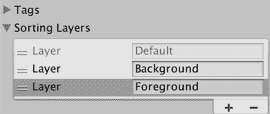

1.  从 Project 面板（在 `Sprites` 文件夹中）将 `background_blue sprite` 拖动到 **Game** 或 **Hierarchy** 面板中，以创建当前场景的 GameObject。将此 GameObject 的 `Position` 设置为 (`0`,`0`,`0`）。它应该完全覆盖游戏面板（分辨率为 `800 x 600`）。

1.  将 GameObject background-blue 的 **Sorting Layer** 设置为 **Background**（在 **Sprite Renderer** 组件中）：

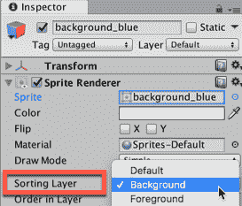

1.  将 sprite star 从 **Project** 面板（在 `Sprites` 文件夹中）拖动到 **Game** 或 **Hierarchy** 面板中，以创建当前场景的 GameObject：

    +   创建一个新的标签，Star，并将此标签分配给 GameObject star（标签的创建方式与创建排序层相同）。

    +   将 GameObject star 的排序层设置为前景（在 Sprite Renderer 组件中）。

    +   向 GameObject star 添加一个 Box Collider 2D（添加组件 | Physics 2D | Box Collider 2D）并检查 Is Trigger，如图所示：

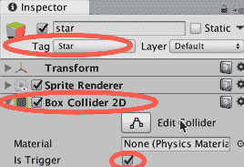

1.  从 **Project** 面板（在 `Sprites` 文件夹中）将 `girl1 sprite` 拖动到 **Game** 或 **Hierarchy** 面板中，以在当前场景中创建玩家的角色 GameObject。将此 GameObject 重命名为 `player-girl1`。

1.  将 GameObject `player-girl1` 的排序层设置为前景。

1.  向 GameObject `player-girl1` 添加一个 Physics | Box Collider 2D 组件。

1.  向 GameObject `player-girl1` 添加一个 Physics 2D | Rigid Body 2D 组件。将其重力比例设置为零（这样它就不会因为模拟重力而掉落屏幕），如图所示：

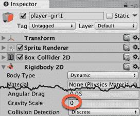

1.  为你的脚本创建一个新的文件夹名为 `_Scripts`。

1.  在 `_Scripts` 文件夹中创建以下 C# 脚本 PlayerMove，并将其作为组件添加到 **Hierarchy** 中的 GameObject player-girl1：

```cs
using UnityEngine; 
using System.Collections; 

public class PlayerMove : MonoBehaviour { 
  public float speed = 10; 
  private Rigidbody2D rigidBody2D;
  private Vector2 newVelocity;

void Awake(){ 
rigidBody2D = GetComponent<Rigidbody2D>(); 
} 

void Update() {
  float xMove = Input.GetAxis("Horizontal");
  float yMove = Input.GetAxis("Vertical");

  float xSpeed = xMove * speed;
  float ySpeed = yMove * speed;

  newVelocity = new Vector2(xSpeed, ySpeed);
}

void FixedUpdate() {
  rigidBody2D.velocity = newVelocity;
}

}
```

1.  保存场景（命名为主场景并将其保存到名为 _Scenes 的新文件夹中）。

# 它是如何工作的...

你在场景中使用了 girl1 精灵创建了一个玩家角色，并添加了一个`PlayerMove`类脚本的实例。你还创建了一个带有星号标签的星形 GameObject（一个拾取物），它有一个 2D 盒子碰撞器，当玩家的角色碰到它时会触发碰撞。当你运行游戏时，`player-girl1`角色应该使用`W A S D`键、箭头键或摇杆来移动。存在一个`newVelocity`变量，它在`Update()`方法中根据输入每帧更新。然后这个`Vector2`值在`FixedUpdate()`方法中应用，成为 GameObject 的新速度。

Unity 将用户输入（如按键、箭头键和游戏控制器控制）映射到其`Input`类。`Input`类的两个特殊属性是水平轴和垂直轴——通过`Input.GetAxis("Horizontal")`和`Input.GetAxis("Vertical")`方法访问。

**管理你的输入映射**：您可以通过菜单管理从不同的用户输入方法（键、鼠标、控制器等）到轴的映射：**编辑** | **项目设置** | **输入**

目前，如果`player-SpaceGirl`角色碰到星星，不会发生任何事情，因为这部分还没有被编写脚本。

你已经向场景中添加了一个背景（GameObject background-blue），由于它位于最远的排序层**背景**，所以它将位于所有内容的后面。您希望出现在背景前面的项目（到目前为止是玩家角色和星星）被放置在**前景**排序层上。

我们可以在[`docs.unity3d.com/Manual/class-TagManager.html`](http://docs.unity3d.com/Manual/class-TagManager.html)了解更多关于 Unity 标签和层次的信息。

# 显示携带和不携带文本的单个对象拾取物

通常，最简单的库存情况是显示文本来告诉玩家他们是否携带了一个物品（或者没有）。我们将向 SpaceGirl 迷你游戏添加检测带有**星**标签的 GameObject 碰撞的能力，并在屏幕上显示一条消息，说明是否收集了星星：


在配方的末尾，在*还有更多...*部分，我们将学习如何调整此配方以维护收集星星的**整数**总数，适用于有很多星星可以收集的游戏版本。

# 准备工作

对于这个配方，我们在`03_02`文件夹中准备了一个名为 Fonts 的文件夹。

此配方假设您是从本章的第一个配方中设置的`Simple2Dgame_SpaceGirl`项目开始的。因此，复制该项目，并在副本上工作。

# 如何做到这一点...

要显示文本以通知用户携带单个拾取物的状态，请按照以下步骤操作：

1.  从一个新的`Simple2Dgame_SpaceGirl`迷你游戏副本开始。

1.  添加一个 UI Text 对象（**创建** | **UI** | **文本**）。将其重命名为 Text-carrying-star。将其文本更改为 Carrying star: false。

1.  将提供的 Fonts 文件夹导入到您的项目中。

1.  在**检查器**面板中，将 Text-carrying-star 的字体设置为**Xolonium-Bold**，并将其颜色设置为黄色。水平垂直居中文本，将**高度**设置为`50`，并将**字体大小**设置为`32`。

1.  编辑其 Rect Transform，在按住*Shift* + *Alt*（以设置中心点和位置）的同时，选择顶部拉伸框：

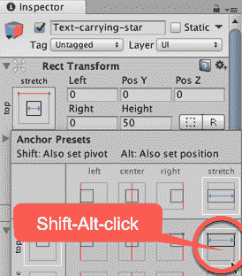

1.  您的文本现在应位于**游戏**面板的中间顶部，其宽度应拉伸以匹配整个面板，如本食谱介绍中的截图所示。

1.  在`_Scripts`文件夹中创建以下 C#脚本类`PlayerInventory`：

```cs
using UnityEngine; 

public class PlayerInventory : MonoBehaviour { 
   private PlayerInventoryDisplay playerInventoryDisplay; 
   private bool carryingStar = false;  

   void Awake() { 
         playerInventoryDisplay = GetComponent<PlayerInventoryDisplay>(); 
   } 

   void Start() { 
         playerInventoryDisplay.OnChangeCarryingStar( carryingStar); 
   }  

   void OnTriggerEnter2D(Collider2D hit) { 
         if (hit.CompareTag("Star")) { 
               carryingStar = true; 
               playerInventoryDisplay.OnChangeCarryingStar( carryingStar); 
               Destroy(hit.gameObject); 
         } 
   } 
} 
```

1.  在`_Scripts`文件夹中创建以下 C#脚本类`PlayerInventoryDisplay`：

```cs
using UnityEngine; 
using UnityEngine.UI;

[RequireComponent(typeof(PlayerInventory))] 
public class PlayerInventoryDisplay : MonoBehaviour  { 
   public Text starText; 
   public void OnChangeCarryingStar(bool carryingStar) { 
         string starMessage = "no star :-("; 
         if(carryingStar) 
               starMessage = "Carrying star :-)"; 
         starText.text = starMessage; 
   } 
} 
```

1.  在**层次结构**中向`player-SpaceGirl`GameObject 添加脚本类`PlayerInventoryDisplay`的实例。

注意，由于`PlayerInventoryDisplay`类包含`RequireComponent()`，因此会自动将脚本类`PlayerInventory`的实例添加到 GameObject `player-SpaceGirl`中。

1.  从**层次结构**视图中选择`player-SpaceGirl`GameObject。然后，从**检查器**中访问玩家库存显示（脚本）组件，并将**星星文本**公共字段填充为 GameObject Text-carrying-star，如截图所示。

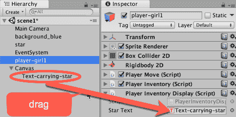

1.  当您播放场景时，将角色移动到星星后，星星应该消失，屏幕上的**UI Text**消息应更改为 Carrying star :-):


# 它是如何工作的...

您创建了一个**UI Text** GameObject Text-carrying-star，用于向玩家显示一个文本消息，说明是否携带星星。您创建了两个脚本类，并将每个实例作为组件添加到玩家的`player-SpaceGirl`角色 GameObject 中：

+   脚本类`PlayerInventory`检测玩家与星星的碰撞，更新内部变量以表示是否携带星星，并在检测到每次碰撞时请求更新 UI 显示。

+   脚本类`PlayerInventoryDisplay`通过更新 Text-carrying-star UI Text GameObject 显示的文本消息来处理与用户的通信。

一种称为**模型-视图-控制器模式**（**MVC**）的游戏设计模式（最佳实践方法）将更新 UI 的代码与更改玩家和游戏变量（如分数和库存项目列表）的代码分开。尽管这个食谱只有一个变量和一个更新 UI 的方法，但良好的游戏架构可以扩展以应对更复杂的游戏，因此，即使在这个游戏开始阶段，如果我们要使最终的游戏架构具有良好的结构和可维护性，那么多写一些代码和额外的脚本类通常是值得的。

这种设计模式的另一个优点是，将信息通过 UI 传达给用户的方法可以改变（例如，从文本到图标——见下一道菜谱！），而无需对脚本类`PlayerInventory`中的代码进行任何更改。

# 玩家库存脚本类

`playerInventoryDisplay`变量是对类`PlayerInventoryDisplay`的实例对象的引用。

布尔变量`carryingStar`表示玩家在任何时候是否携带星星；它被初始化为 false。

`Method Awake()`缓存了对兄弟组件`playerInventoryDisplay`的引用。

当场景开始时，通过`Start()`方法，我们调用脚本组件`playerInventoryDisplay`的`OnChangeCarryingStar(...)`方法，传入`carryingStar`的初始值（为 false）。这确保了我们不是依赖于在**设计时**输入到**UI Text**对象 Text-carrying-star 中的文本，因此用户看到的 UI 总是由我们的**运行时**方法设置的。这避免了在代码中而不是在**检查器**面板中更改要显示给用户的单词时出现的问题——这会导致场景首次运行时和从脚本更新后屏幕文本不匹配。

在 Unity 游戏设计中，一个黄金法则是在一个以上的地方避免重复内容，因此我们避免需要维护相同内容的两个或多个副本。每个副本都是当某些但不是所有副本的值发生变化时可能出现维护问题的机会。

最大化使用预制件是这一原则在行动中的另一个例子。这也被称为 DRY 原则——不要重复自己。

每当玩家的角色与任何将其**触发**设置为 true 的对象发生碰撞时，都会向碰撞涉及的双方对象发送`OnTriggerEnter2D()`事件消息。`OnTriggerEnter2D()`消息作为参数传递，该参数是刚刚碰撞的对象内部`Collider2D`组件的引用。

我们玩家的`OnTriggerEnter2D()`方法测试与对象碰撞的标签字符串，以查看它是否有**星星**值。由于我们创建的 GameObject 星星设置了触发器，并且有标签**星星**，这个方法内部的 if 语句将检测与星星的碰撞并完成以下三个动作：

+   布尔（标志）变量`carryingStar`被设置为 true

+   脚本组件`playerInventoryDisplay`的`OnChangeCarryingStar(...)`方法被调用，传入`carryingStar`的更新值

+   刚刚发生碰撞的 GameObject 被销毁——也就是说，星星

布尔变量通常被称为标志。

使用布尔（true/false）变量来表示游戏状态中的某些功能是否为真或假是非常常见的。程序员通常将这些变量称为标志。因此，程序员可能会将 carryingStar 变量称为携带星星标志。

# 玩家库存显示脚本类

公共`Text`变量`starText`是对**UI Text**对象 Text-carrying-star 的引用。其值已在设计时通过拖放设置。

`OnChangeCarryingStar`(carryingStar)方法使用字符串变量`starMessage`的值更新 starText 的文本属性。此方法接受一个输入布尔参数`carryingStar`。字符串`starMessage`的默认值告诉用户玩家没有携带星星，但 if 语句测试`carryingStar`的值，如果为真，则消息将更改为通知玩家他们正在携带星星。

# 更多内容...

这里有一些细节您可能不想错过。

# 收集多个物品并显示携带的总数

通常，玩家可以收集多个拾取物品。在这种情况下，我们可以使用整数来表示收集的总数，并使用 UI Text 对象向用户显示此总数。让我们修改配方，让 SpaceGirl 能够收集大量的星星！


要将此配方转换为显示收集到的星星总数的配方，请执行以下操作：

1.  制作三到四个额外的**星形**GameObject，并将它们分散在场景中。这样玩家可以收集多个星星，而不仅仅是收集一个。

使用键盘快捷键 *Ctrl* + *D*（Windows）或 *CMD* + *D*（Mac）快速复制 GameObject。

1.  将 C#脚本类`PlayerInventory`的内容更改为以下内容：

```cs
using UnityEngine; 
public class PlayerInventory : MonoBehaviour { 
   private PlayerInventoryDisplay playerInventoryDisplay; 
   private int totalStars = 0; 

   void Awake() { 
         playerInventoryDisplay = GetComponent<PlayerInventoryDisplay>(); 
   }  

   void Start() { 
        playerInventoryDisplay.OnChangeStarTotal(totalStars); 
   } 

   void OnTriggerEnter2D(Collider2D hit) { 
         if (hit.CompareTag("Star")) { 
            totalStars++; 
            playerInventoryDisplay.OnChangeCarryingStar(totalStars); 
            Destroy(hit.gameObject); 
         } 
   } 
} 
```

1.  将 C#脚本类`PlayerInventoryDisplay`的内容更改为以下内容：

```cs
using UnityEngine; 
using UnityEngine.UI; 

[RequireComponent(typeof(PlayerInventoryTotal))] 
public class PlayerInventoryDisplay : MonoBehaviour { 
   public Text starText; 
   public void OnChangeStarTotal(int numStars) { 
         string starMessage = "total stars = " + numStars; 
         starText.text = starMessage; 
   } 
}
```

如您所见，在`PlayerInventory`中，我们现在每次与星星 GameObject 发生碰撞时，将 totalStars 增加 1。在`PlayerInventoryDisplay`中，我们在屏幕上显示一个简单的文本消息“total stars =”，后面跟着由`OnChangeStarTotal(...)`方法接收的整数总数。

现在当您运行游戏时，应该看到星星总数从零开始，并且每次玩家的角色击中星星时，总数都会增加 1。

# 选项 - 将所有责任合并到一个脚本中

玩家库存（他们携带的内容）与如何向用户显示库存的分离是游戏设计模式（最佳实践方法）的一个例子，称为**模型-视图-控制器**（**MVC**），其中我们将更新 UI 的代码与更改玩家和游戏变量（如分数和库存项目列表）的代码分开。尽管此配方只有一个变量和一个更新 UI 的方法，但良好的游戏架构可以扩展以应对更复杂的游戏，因此，如果我们要使最终游戏架构具有良好的结构和可维护性，那么编写更多代码和额外的脚本类通常是值得的。

然而，对于*非常简单的游戏*，我们可能会选择在单个脚本类中结合状态和该状态的显示。以本食谱中此方法的示例，移除脚本组件`PlayerInventory`和`PlayerInventoryDisplay`，并创建以下 C#脚本类`PlayerInventoryCombined`，并将其实例添加到 GameObject `player-SpaceGirl`的**层次结构**中：

```cs
using UnityEngine.UI; 
public class PlayerInventoryCombined : MonoBehaviour { 
   public Text starText; 
   private bool carryingStar = false; 

   void Start() { 
         UpdateStarText(); 
   } 

   void OnTriggerEnter2D(Collider2D hit) { 
         if (hit.CompareTag("Star")){ 
               carryingStar = true; 
               UpdateStarText(); 
               Destroy(hit.gameObject); 
         } 
   } 

   private void UpdateStarText() { 
         string starMessage = "no star :-("; 
         if (carryingStar) 
            starMessage = "Carrying star :-)"; 
         starText.text = starMessage; 
   } 
} 
```

玩家的体验没有区别，变化只是我们游戏代码的架构结构。

# 显示携带和不携带图标的单个物体拾取

图形图标是通知玩家他们正在携带物品的有效方式。在本食谱中，如果没有携带星星，屏幕左上角将显示一个灰色填充的图标，位于封闭的圆圈中：


然后，在拾取到星星后，将显示一个黄色填充的星星图标。在许多情况下，图标比文本消息更清晰（它们不需要阅读和思考），并且可以在屏幕上比指示玩家状态和库存项目的文本消息更小。

本食谱还说明了前一个食谱中描述的 MVC 设计模式的益处——我们正在改变与用户通信的方式（通过图标而不是文本使用**视图**），但我们可以在无需更改的情况下使用脚本类 PlayerInventory（**模型-控制器**），它检测玩家星星碰撞并维护一个布尔标志，告诉我们是否正在携带星星。

# 准备工作

本食谱假设您是从本章第一食谱中设置的 Simple2Dgame_SpaceGirl 项目开始的。

对于这个食谱，我们在`03_03`文件夹中准备了一个名为`_Scripts`的文件夹。

# 如何操作...

要切换单个物体拾取的携带和不携带图标，请按照以下步骤操作：

1.  从`Simple2Dgame_SpaceGirl`迷你游戏的新副本开始。

1.  从提供的文件中导入`_Scripts`文件夹（这包含从上一个食谱中复制的脚本类`PlayerInventory`，我们可以将其原封不动地用于本食谱）。

1.  在场景中添加一个**UI Image**对象（**创建** | **UI** | **Image**）。将其重命名为`Image-star-icon`。

    +   在**层次结构**中选择 Image-star-icon，将`icon_nostar_100`精灵（在`Sprites`文件夹中）从**项目**面板拖到**检查器**（在 Image（脚本）组件中的**源图像**字段）。

1.  点击**图像**组件的**设置原生大小**按钮。这将调整**UI Image**的大小以适应`icon_nostar_100`精灵文件的实际像素宽度和高度：

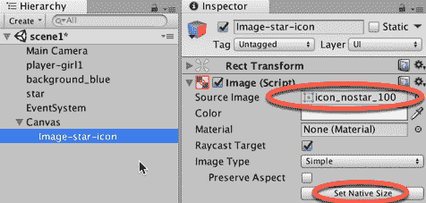

1.  将图像图标放置在游戏面板的顶部和左侧，在 Rect Transform 中。在按住*SHIFT*和*ALT*的同时选择左上方的框组件（以设置枢轴和位置）。

1.  创建以下 C#脚本类 PlayerInventoryDisplay，并将其实例添加到 Hierarchy 中的 GameObject player-SpaceGirl：

```cs
using UnityEngine; 
using UnityEngine.UI;

[RequireComponent(typeof(PlayerInventory))] 
public class PlayerInventoryDisplay : MonoBehaviour  { 
   public Image imageStarGO; 
   public Sprite iconNoStar; 
   public Sprite iconStar;

   public void OnChangeCarryingStar(bool carryingStar) { 
        if (carryingStar) 
            imageStarGO.sprite = iconStar; 
        else 
            imageStarGO.sprite = iconNoStar; 
    } 
} 
```

1.  从层级视图中选择 GameObject player-SpaceGirl。然后，从检查器中访问 PlayerInventoryDisplay（脚本）组件，并将星图像公共字段填充为 UI Image 对象 Image-star-icon。

1.  从项目面板中将 `icon_nostar_100` 精灵填充到图标无星公共字段中，然后从项目面板中将 `icon_star_100` 精灵填充到图标星公共字段中，如图所示：

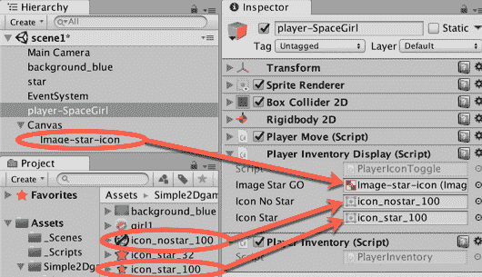

1.  播放场景。你应该在左上角看到无星图标（一个在封闭圆圈中的灰色填充图标），直到你拾取星，此时它将变为显示携带星图标（黄色填充星）。

# 它是如何工作的...

在脚本类 `PlayerInventoryDisplay` 中，图像变量 `imageStarGO` 是对 UI Image 对象 `Image-star-icon` 的引用。精灵变量 `iconStar` 和 `iconNoStar` 是对项目面板中 Sprite 文件的引用 - 这些精灵用于告诉玩家是否携带了星。

每当 `PlayerInventory` 对象调用方法 `OnChangeCarryingStar(carryingStar)` 时，此方法使用 `if` 语句将 **UI Image** 设置为与接收到的 bool 参数值对应的精灵。

# 使用多个状态图标显示同一对象的多个拾取

如果要收集的项目有一个小的、固定的总数而不是文本总数，一个有效的 UI 方法是显示占位符图标（空或灰色图片）来显示用户还有多少个此类项目需要收集，并且每次拾取一个项目时，占位符图标就会被一个全色收集图标所替换。

在这个菜谱中，我们使用灰色填充的星形图标作为占位符，并使用黄色填充的星形图标来表示每个收集到的星，如图所示：


# 准备工作

本菜谱假设您是从本章第一个菜谱中设置的 `Simple2Dgame_SpaceGirl` 项目开始的。

# 如何操作...

要显示多个拾取的同一类型对象的库存图标，请按照以下步骤操作：

1.  从一个新的 `Simple2Dgame_SpaceGirl` 小游戏副本开始。

1.  在 `_Scripts` 文件夹中创建 C# 脚本类 `PlayerInventory`：

```cs
using UnityEngine; 

public class PlayerInventory : MonoBehaviour { 
   private PlayerInventoryDisplay playerInventoryDisplay; 
   private int totalStars = 0; 

   void Awake() { 
         playerInventoryDisplay = GetComponent<PlayerInventoryDisplay>(); 
   }  

   void Start() { 
        playerInventoryDisplay.OnChangeStarTotal(totalStars); 
   }  

   void OnTriggerEnter2D(Collider2D hit) { 
         if (hit.CompareTag("Star")) { 
            totalStars++; 
            playerInventoryDisplay.OnChangeCarryingStar(totalStars); 
            Destroy(hit.gameObject); 
         } 
   } 
} 
```

1.  在 **层级** 面板中选择 GameObject 星，然后复制此 GameObject 三次。现在场景中有四个星 GameObject。将这些新的星 GameObject 移动到屏幕的不同部分。

1.  将以下 C# 脚本 `PlayerInventoryDisplay` 添加到 GameObject `player-SpaceGirl` 中（**层级**）：

```cs
using UnityEngine; 
using System.Collections; 
using UnityEngine.UI; 

public class PlayerInventoryDisplay : MonoBehaviour { 
    public Image[] starPlaceholders; 
    public Sprite iconStarYellow; 
    public Sprite iconStarGrey;

    public void OnChangeStarTotal(int starTotal){ 
       for (int i = 0;i < starPlaceholders.Length; ++i){ 
          if (i < starTotal) 
              starPlaceholders[i].sprite = iconStarYellow; 
          else 
             starPlaceholders[i].sprite = iconStarGrey; 
        } 
    } 
}
```

1.  在层级面板中选择画布，并添加一个新的 UI Image 对象（创建 | UI | 图像）。将其重命名为 Image-star0。

1.  在层级面板中选择 Image-star0。

1.  从项目面板中，将精灵 `icon_star_grey_100`（在 Sprites 文件夹中）拖动到图像（脚本）组件的检查器中的源图像字段。

1.  点击此图像（脚本）组件的“设置原生大小”按钮。这将调整 UI 图像的大小以适应精灵文件 `icon_star_grey_100` 的物理像素宽度和高度。

1.  现在，我们将图标放置在游戏面板的左上角。编辑 UI 图像的 Rect Transform 组件，在按住 *Shift* + *Alt*（设置枢轴和位置）的同时，选择左上角的框。现在 UI 图像应该位于游戏面板的左上角。

1.  在层次结构面板中复制 Image-star0 三个更多次，命名为 Image-star1、Image-star2 和 Image-star3。

1.  在检查器面板中，将 Image-star1 的 Pos X 位置（在 Rect Transform 组件中）更改为 `100`，将 Image-star2 更改为 `200`，将 Image-star3 更改为 `300`：

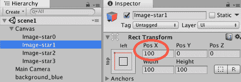

1.  在 **层次结构** 中选择 GameObject player-SpaceGirl。然后，从 **检查器** 中访问 **Player Inventory Display**（脚本）组件，并将公共字段 Star Placeholders 的 Size 属性设置为 `4`。

1.  接下来，用 **UI 图像** 对象 Image-star0/1/2/3 填充公共字段 **Star Placeholders** 的 Element 0/1/2/3 数组值。

1.  现在，从项目面板中用精灵 `icon_star_100` 和 `icon_star_grey_100` 填充图标 **Star Yellow** 和 **Icon Star Grey** 公共字段，如图所示：


1.  现在，当你播放场景时，你应该首先看到四个灰色的占位星形图标，每次你撞击一个星形时，顶部下一个图标应该变为黄色。

# 它是如何工作的...

四个**UI 图像**对象 Image-star0/1/2/3 已在屏幕顶部创建 — 使用灰色占位图标初始化。灰色和黄色图标精灵文件已调整大小为 100 x 100 像素，这使得在设计时它们的水平排列定位更容易，因为它们的坐标是 (0,0)，(100,0)，(200,0) 和 (300,0)。在一个更复杂的游戏屏幕，或者一个房地产宝贵的场景中，图标的实际大小可能会更小 — 这是一个由游戏图形设计师做出的决定。

在脚本类 `PlayerInventory` 中，int 变量 `totalStars` 表示到目前为止收集了多少颗星；它初始化为零。变量 `playerInventoryDisplay` 是指向管理我们的库存显示的脚本组件的引用 — 这个变量在场景开始之前在 `Awake()` 方法中缓存。

在场景开始时运行的 `Start()` 方法调用 `PlayerInventoryDisplay` 组件的 `OnChangeStarTotal(...)` 方法，以确保屏幕上的图标显示与 totalStars 的起始值相匹配。

在 `OnTriggerEnter2D()` 方法中，每当玩家的角色撞击带有 Star 标签的对象时，totalStars 计数器增加 1。除了销毁被击中的 GameObject，还会调用 `PlayerInventoryDisplay` 组件的 `OnChangeStarTotal(...)` 方法，传递新的星形总数整数。

脚本类 `PlayerInventoryDisplay` 的 `OnChangeStarTotal(...)` 方法引用了四个 **UI 图像**，并遍历图像引用数组中的每个项目，将指定数量的图像设置为黄色，其余的设置为灰色。此方法为公共方法，允许从脚本类 `PlayerInventory` 的实例中调用。

# 还有更多...

这里有一些细节你不希望错过：

# 通过改变平铺图像的大小来揭示多个对象拾取的图标

另一种可以采取的方法来显示越来越多的图像是使用平铺图像。通过使用宽度为 400 的平铺灰色星星图像（显示灰色星星图标的四个副本），在平铺黄色星星图像后面，其宽度是收集到的星星数量的 100 倍，也可以达到与之前食谱中相同的视觉效果。

如果黄色星星图像的宽度小于下面的灰色星星图像，那么我们将看到任何剩余位置的灰色星星。例如，如果我们携带 3 个星星，我们将使黄色星星图像的宽度为 3 x 100 = 300 像素宽。这将显示 3 个黄色星星，并从下面的灰色星星图像中露出 100 像素，即 1 个灰色星星。

要使用平铺图像显示多个对象拾取的灰色和黄色星星图标，让我们通过以下步骤调整我们的食谱，通过以下步骤说明这项技术：

1.  在 **层次** 面板中，删除整个 **画布** GameObject（因此删除所有四个 **UI 图像**）。

1.  在你的场景中添加一个新的 **UI 图像** 对象（**创建** | **UI** | **图像**）。将 GameObject 重命名为 Image-stars-gray。

1.  确保在 **层次** 中选择 Image-stars-gray。从 **项目** 面板，将 Sprites 文件夹中的精灵 `icon_star_grey_100` 拖动到检查器（在 **图像（脚本）** 组件中）的 **源图像** 字段。

1.  点击此图像（脚本）组件的 **设置原生大小** 按钮。这将调整 **UI 图像** 以适应精灵文件 `icon_star_grey_100` 的物理像素宽度和高度。

1.  现在将图标放置在屏幕的 **顶部** 和 **左侧**。编辑 **UI 图像的** **矩形** **变换** 组件，在按住 *Shift* + *Alt*（以设置枢轴和位置）的同时，选择左上角的框。现在 UI 图像应该位于 **游戏** 面板的左上角。

1.  在检查器面板中，将 Image-stars-grey 的 **宽度**（在矩形变换组件中）更改为 `400`。同时，将 **图像类型**（在 **图像（脚本）** 组件中）设置为 **平铺**，如图所示：

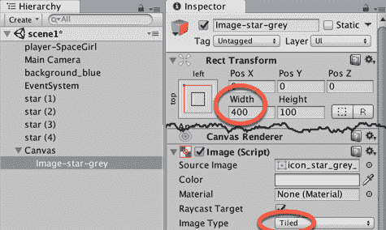

对于这样一个简单的游戏，我们选择简洁而不是内存效率。你会看到一个提示，建议使用具有 Wrap 模式重复和清除打包标签的高级纹理。虽然更节省内存，但对于像这个食谱中这样的小而简单的平铺来说，操作会更复杂。

1.  在**层级**面板中复制 Image-stars-grey，并将其命名为**Image-stars-yellow**。

1.  在层级面板中选择**Image-stars-yellow**后，从**项目**面板中，将精灵`icon_star_100`（位于` Sprites`文件夹中）拖动到检查器（位于**图像（脚本）**组件中）的**源图像**字段。

1.  将 Image-stars-yellow 的宽度设置为 0（在**矩形变换**组件中）。因此，现在我们有了黄色星星平铺图像在灰色平铺图像之上，但由于其宽度为零，我们目前看不到任何黄色星星。

1.  用以下代码替换现有的 C#脚本`PlayerInventoryDisplay`：

```cs
using UnityEngine; 
using UnityEngine.UI; 

[RequireComponent(typeof(PlayerInventory))] 
public class PlayerInventoryDisplay : MonoBehaviour { 
   public Image iconStarsYellow; 

   public void OnChangeStarTotal(int starTotal) { 
         float newWidth = 100 * starTotal; 
        iconStarsYellow.rectTransform.SetSizeWithCurrentAnchors( RectTransform.Axis.Horizontal, newWidth ); 
   } 
} 
```

1.  从**层级**视图中选择 GameObject player-SpaceGirl。然后，从**检查器**中访问**玩家库存显示** **（脚本）**组件，并将 UI 图像对象 Image-stars-yellow 填充到图标星星黄色公共字段中。

UI 图像 Image-stars-gray 是一个平铺图像，宽度足够（`400px`）以显示灰色精灵`icon_star_grey_100`四次。UI 图像 Image-stars-yellow 是一个平铺图像，位于灰色图像之上，初始宽度设置为零，因此看不到任何黄色星星。

每次拾取一颗星星时，都会从`PlayerInventory`脚本对象调用脚本组件`PlayerInventoryDisplay`的`OnChangeStarTotal()`方法，传递收集到的新的整数星星数量。通过将这个数字乘以黄色精灵图像的宽度（100 px），我们得到为**UI 图像**Image-stars-yellow 设置的正确宽度，以便用户现在可以看到相应的黄色星星数量。任何尚未收集的星星仍然会以尚未覆盖的灰色星星的形式出现。

实际上，通过调用`SetSizeWithCurrentAnchors(...)`方法来完成更改 UI 图像 Image-stars-yellow 宽度的任务。第一个参数是轴，因此我们传递常量`RectTransform.Axis.Horizontal`，以便它将更改宽度。第二个参数是那个轴的新大小，因此我们传递一个值，它是迄今为止收集的星星数量的 100 倍（变量`newWidth`）。

# 使用面板来视觉上勾勒出库存 UI 区域和单个项目。

在玩游戏时，我们会看到四种类型的对象：

+   具有某些视觉元素的游戏对象，例如 2D 和 3D 对象。

+   位于**世界空间**中的 UI 元素，因此它们出现在场景中的 GameObject 旁边。

+   位于**屏幕空间** - **相机**中的 UI 元素，因此它们出现在与相机固定距离的位置（但可能被比这些 UI 元素更靠近相机的 GameObject 遮挡）。

+   位于**屏幕空间** - **叠加层**中的 UI 元素。这些总是出现在其他三种视觉元素之上，非常适合**抬头显示**（**HUD**）元素，例如库存。

有时我们希望从视觉上清楚地表明哪些元素是 UI HUD 的一部分，哪些是场景中的视觉对象。Unity 中的**UI 面板**带有不透明或半透明背景图像，这是一种简单而有效的方法来实现这一点。

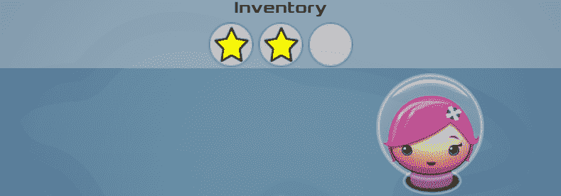

面板还可以用于显示带有形状或颜色背景的位置（槽位），指示物品可能放置的位置或可以收集的数量。如图所示，在本食谱中，我们将创建一个带有一些标题文本的面板和三个库存槽位，其中两个槽位将填充星星图标，向玩家传达还有一颗星星可以收集/携带。

# 准备工作

本食谱假设您正在使用本章第一个食谱中设置的`Simple2Dgame_SpaceGirl`项目。所需的字体可以在`03_02`文件夹中找到。

# 如何操作...

要使用面板从视觉上勾勒出库存区域和单个项目，请按照以下步骤操作：

1.  从一个新的`Simple2Dgame_SpaceGirl`迷你游戏副本开始。

1.  在**层次结构**面板中，创建一个**UI 面板**（**创建** | **UI** | **面板**），并将其重命名为 Panel-background。

1.  现在，将 Panel-background 放置在游戏面板的顶部，拉伸画布的水平宽度。编辑 UI **Image 的 Rect Transform**组件，在按住*Shift* + *Alt*（以设置中心点和位置）的同时，选择顶部拉伸框。

1.  面板仍然会占据整个游戏窗口。现在，在**检查器**中，将 Panel-background 的**高度**（在**Rect Transform**组件中）更改为 100。

1.  添加一个 UI Text 对象（**创建** | **UI** | **文本**），并将其重命名为 Text-inventory。对于其 Text（脚本）组件，将文本更改为 Inventory。

1.  在**层次结构**面板中，将子**UI Text**对象 Text-inventory 添加到 Panel-background 面板中。

1.  在**检查器面板**中，还将 Text-inventory 的字体设置为 Xolonium-Bold（在字体文件夹中）。水平居中文本，对于对齐选择垂直居中，将其**高度**设置为 50，并将**字体大小**设置为 23。

1.  编辑 Text-inventory 的**Rect Transform**，在按住*Shift* + *Alt*（以设置中心点和位置）的同时，选择顶部拉伸框。现在文本应位于 UI 面板对象 Panel-background 的顶部中心，其宽度应拉伸以匹配整个面板。

1.  现在文本应位于 UI 面板对象 Panel-background 的顶部中心，其宽度应拉伸以匹配整个面板。

1.  创建一个新的 UI 面板（**创建** | **UI** | **面板**），并将其重命名为 Panel-inventory-slot。

1.  编辑 Panel-inventory-slot 的 Rect Transform，在按住*Shift* + *Alt*（以设置中心点和位置）的同时，选择顶部中心框。将宽度和高度都设置为`70`，并将 Pos Y 设置为`-30`。请参见以下截图：


1.  确保在 Hierarchy 中选择了 GameObject Panel-inventory-slot。在图像（脚本）组件中，将源图像从 **UI 面板**的默认背景更改为圆形 **旋钮**图像（这是 Unity UI 系统内置的图像之一）。如图所示，你现在应该在我们的库存 HUD 矩形区域的标题文本下方看到一个圆形。这个圆形从视觉上告诉用户，库存中有一个可以收集物品的空间：


1.  想象一下玩家已经收集了一个星星。现在让我们在我们的库存槽圆圈面板中添加一个黄色星星图标图像。向场景中添加一个 UI 图像对象（**创建** | **UI** | **图像**）。将其重命名为 Image-icon。将子 GameObject **Image-icon** 添加到面板 Panel-inventory-slot。

子 GameObject 可以通过将其设置为 **不活动** 来隐藏。通过为我们的星星图标创建一个新的 **UI 图像** GameObject，并将其添加为 Panel-inventory-slot GameObject 的子项，我们现在可以在 **图像**被启用时显示星星图标，通过使其不活动来隐藏它。这是一个通用方法，这意味着只要我们有 **图像** GameObject 的引用，我们就不必像在之前的某些食谱中那样进行额外的图像交换工作。这意味着我们可以开始编写更通用的代码，该代码将适用于不同的库存面板，如钥匙、星星、金钱等。

1.  在 **Hierarchy** 中选择 Image-icon，将精灵 `icon_star_100`（在 `Sprites` 文件夹中）从 **项目**面板拖动到检查器（在 **图像（脚本**）组件）中的 **源图像**字段。

1.  编辑 Image-icon 的 **矩形变换**，在按住 *Shift* + *Alt*（以设置枢轴和位置）的同时，选择拉伸-拉伸框。现在星星图标应该被拉伸到完美的大小，以适应 `70x70` 的父面板，所以我们看到圆圈内的星星。


1.  保存并运行场景并玩游戏。你应该在屏幕顶部看到一个清晰定义的矩形，其中包含标题文本 Inventory。在库存矩形区域内，你可以看到一个圆形槽，目前显示一个星星。

1.  让我们向玩家显示 3 个槽位。首先，将面板 Panel-inventory-slot 的 Pos X 水平位置更改为 -70。这将使其位于中心左侧，为下一个槽位腾出空间，并在我们完成时允许我们居中三个槽位。

1.  复制面板 Panel-inventory-slot，如果需要，将副本重命名为 panel Panel-inventory-slot (1)。将此副本的 Pos X 设置为 0。

1.  再次复制 Panel-inventory-slot 面板，如果需要的话，将副本重命名为 panel Panel-inventory-slot (2)。将这个副本的 Pos X 设置为 70。现在选择这个第三个面板的子 Image-star-icon 并使其不活动（在**检查器**顶部取消勾选其活动复选框，位于 GameObject 名称的左侧）。这个面板的星形现在应该被隐藏，并且只有槽面板的圆形背景是可见的。

# 它是如何工作的...

我们创建了一个简单的面板（Panel-background），其中包含一个标题 UI Text 作为游戏画布顶部的子 GameObject，显示了一个灰色背景矩形和标题文本“库存”。这向玩家表明，屏幕的这一部分是库存 HUD 将被显示的地方。

为了说明如何使用它来指示玩家携带星星，我们在库存中添加了一个带有圆形背景图像的小面板，用于一个槽位，并在其中添加了一个星形图标子 GameObject。然后我们再次复制了槽面板两次，将它们定位在 70 像素的距离。然后我们禁用了（使不活动）第三个槽位的星形图标，因此显示了一个空槽的圆形。

我们的场景向用户展示了一个显示，表明可能的三颗星中有两颗正在被携带。这个配方是一个很好的起点，用于在 Unity 中创建更通用的库存 UI，我们将在本章的一些后续配方中基于它进行构建。

我们将在第十二章控制与选择位置中学习如何限制玩家的移动，防止他们的角色移动到像这样的 HUD 物品的矩形内。

# 创建一个 C#库存槽 UI 显示脚本组件

在上一个配方中，我们开始使用 UI 面板和图像来创建一个更通用的用于显示库存槽的 GameObject，以及图像来指示其中存储的内容。在这个配方中，我们将进一步探讨图形的使用，并创建一个 C#脚本类来处理每个库存槽对象。


正如我们在截图中所见，在这个配方中，我们将创建一个 UI（和脚本）用于有三个星星位置和一个有钥匙的三个位置的库存，使用彩色和灰色图标来指示收集了多少。

# 准备工作

这个配方是对上一个配方的一个改编。因此，请复制上一个配方的项目，并在这个副本上工作。

对于这个配方，我们在`03_06`文件夹中准备了一个名为`_Scripts`的文件夹。

# 如何做到这一点...

要创建一个 C#库存槽显示脚本组件，请按照以下步骤操作：

1.  从提供的文件中导入`_Scripts`文件夹（这包含了一个从之前的配方中复制来的脚本类`PlayerInventory`，我们可以在这个配方中直接使用它）。

1.  删除三个库存槽 GameObject 中的两个：Panel-inventory-slot (1) 和 (2)。因此，只剩下 Panel-inventory-slot。

1.  首先，我们将创建一个用于三个星星槽的面板。在**层次结构**面板中，创建一个 UI 面板（**创建** | **UI** | **面板**），并将其重命名为 Panel-stars。

1.  现在，我们将 Panel-stars 放置在**游戏**面板的左上角，并使其适应我们的一般库存矩形的左侧。编辑 UI **图像的矩形变换**组件，在按住*SHIFT*和*ALT*（以设置枢轴和位置）的同时，选择左上角的框。现在将高度设置为 60，宽度设置为 300。现在，我们将通过将 Pos X 设置为 10 和 Pos Y 设置为-30 来将此框从左上角移开。

1.  添加一个**UI 文本**对象（**创建** | **UI** | **文本**），并将其重命名为 Text-title。对于其**文本** **（脚本）**组件，将文本更改为“星星”。将此 UI 文本对象作为子对象添加到面板 Panel-stars 中。

1.  编辑 Text-title 的**矩形变换**，在按住*Shift* + *Alt* （以设置枢轴和位置）的同时，选择左中部的框。现在文本应位于**UI 面板**对象 Panel-stars 的左中部。

1.  在**检查器**面板中，还将 Text-title 的字体设置为**Xolonium-Bold**（位于“字体”文件夹中）。水平居中文本，垂直居中文本，将其**高度**设置为`50`，并将**字体大小**设置为`32`。选择黄色文本颜色。将**垂直溢出**设置为溢出，并将**对齐**垂直设置为居中。现在，我们将通过将 Pos X 设置为 10 来将此框从非常左侧边缘移开。

1.  将现有的 GameObject Panel-inventory-slot 作为子对象添加到 Panel-stars。编辑其**矩形变换**，在按住*Shift* + *Alt* （以设置枢轴和位置）的同时，选择左中部的框。

1.  将 Panel-inventory-slot 的大小调整为`50 x 50`像素。将其 Pos X 设置为 140。现在它应该看起来在黄色星星文本的右侧：


1.  将 GameObject Image-icon 重命名为 Image-icon-grey。然后复制此 GameObject，将其命名为 Image-icon-color。这两个都应该成为 Panel-inventory-slot 的子 GameObject。在层次结构中，顺序应该是第一个子对象是 Image-icon-grey，第二个子对象是 Image-icon-color。如果这不是这个顺序，那么交换它们。

1.  选择“Image-icon-grey”，并将精灵`icon_star_grey_100`（位于`Sprites`文件夹中）从**项目**面板拖动到**检查器**（位于**图像（脚本）**组件中的**源图像**字段）。现在，如果你禁用 GameObject **Image-icon-color**，你应该在槽面板的圆圈中看到灰色星星图标。

1.  在`_Scripts`文件夹中创建以下 C#脚本`PickupUI`，并将其作为组件添加到**层次结构**中 Panel-inventory-slot 的 GameObject：

```cs
using UnityEngine; 
using System.Collections; 

public class PickupUI : MonoBehaviour { 
   public GameObject iconColor; 
   public GameObject iconGrey; 

   void Awake() { 
         DisplayEmpty(); 
   }  

   public void DisplayColorIcon() { 
         iconColor.SetActive(true); 
         iconGrey.SetActive(false); 
   }  

   public void DisplayGreyIcon() { 
         iconColor.SetActive(false); 
         iconGrey.SetActive(true); 
   } 

   public void DisplayEmpty() { 
         iconColor.SetActive(false); 
         iconGrey.SetActive(false); 
   } 
} 
```

1.  在**Hierarchy**中选择 Panel-inventory-slot。在**Inspector**中，对于 Pickup UI (Script)组件，通过从 Hierarchy 拖动 Image-icon-color 来填充**Icon Color**公共字段。同样，通过从 Hierarchy 拖动 Image-icon-grey 来填充 Icon Grey 公共字段。现在，Panel-inventory-slot 中的脚本组件**PickupUI**有对这个库存槽 GameObject 的彩色和灰色图标的引用。

1.  复制 GameObject Panel-inventory-slot，并将新复制的 GameObject 的 Pos X 设置为 190。

1.  将 GameObject Panel-inventory-slot 第二次复制，对于新复制的 GameObject，将其 Pos X 设置为 240。你现在应该能看到所有三个星星库存图标整齐地排列在黄色“Stars”标题文本的右侧：


1.  将以下 C#脚本 PlayerInventoryDisplay 添加到**Hierarchy**中的 GameObject player-SpaceGirl：

```cs
using UnityEngine; 
using System.Collections; 
using UnityEngine.UI; 

[RequireComponent(typeof(PlayerInventory))] 
public class PlayerInventoryDisplay : MonoBehaviour  { 
   public PickupUI[] slots = new PickupUI[1]; 
   public void OnChangeStarTotal(int starTotal) { 
       int numInventorySlots = slots.Length; 
       for(int i = 0; i < numInventorySlots; i++){ 
             PickupUI slot = slots[i]; 
             if(i < starTotal) 
                   slot.DisplayColorIcon(); 
             else 
                   slot.DisplayGreyIcon(); 
       } 
   } 
} 
```

1.  从**Hierarchy**中选择 GameObject player-SpaceGirl。然后在**Inspector**中的**Player Inventory Display (Script)**组件中执行以下操作：

    +   将公共数组槽的大小设置为 3。

    +   将**Element 0**公共字段填充为 GameObject Panel-inventory-slot。

    +   将**Element 1**公共字段填充为 GameObject Panel-inventory-slot (1)。

    +   将**Element 2**公共字段填充为 GameObject Panel-inventory-slot (2)：

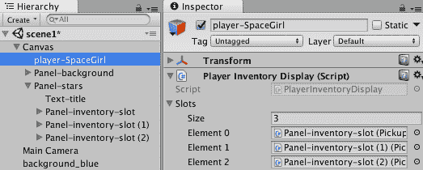

1.  最后，在场景中再复制两个 GameObject star，并将它们移动到适当的位置。因此，现在有三个标记为 Star 的 GameObject 供玩家收集。

1.  当你运行游戏，玩家的角色击中每个星星 GameObject 时，它应该从场景中移除，下一个空闲的库存星星图标应该从灰色变为黄色。

# 它是如何工作的...

我们创建了一个面板（Panel-stars），用于显示大标题文本“Stars”以及三个库存槽面板，以显示可以收集多少星星，以及在任何游戏时刻已经收集了多少星星。每个星星面板槽是一个带有圆形旋钮背景图像的**UI 面板**，然后是两个子元素，一个显示灰色图标图像，另一个显示彩色图标图像。当彩色图标图像 GameObject 被禁用时，它将被隐藏，从而揭示灰色图标。当彩色和灰色图像都被禁用时，将显示一个空圆圈，这可能被用来向用户指示库存中的通用位置是空的且可用。

脚本类 `PickupUI` 有两个公共变量，它们是该 GameObject 相关的灰色和彩色图标的引用。在场景开始之前（方法 `Awake()`），脚本隐藏灰色和彩色图标并显示一个空圆圈。此脚本类声明了三个公共方法（公开，以便在游戏运行时从另一个脚本对象调用）。这些方法隐藏/显示适当的图标以显示相关的库存面板 UI 对象，无论是空的、灰色的还是彩色的。这些方法被清楚地命名为 `DisplayEmpty()`、`DisplayGreyIcon()` 和 `DisplayColorIcon()`。

脚本类 `PlayerInventory` 维护一个整数总计 `starTotal`，表示收集了多少颗星星（初始化为零）。每次玩家角色与对象碰撞时，如果该对象被标记为星星，则调用 `AddStar()` 方法。此方法增加总计并发送一条消息，将新总计传递给其兄弟脚本组件 `PlayerInventoryDisplay` 的 `OnChangeStarTotal(...)` 方法。

脚本类 `PlayerInventoryDisplay` 拥有一个指向 `PickupUI` 对象的公共数组，以及一个单独的公共方法 `OnChangeStarTotal(...)`. 此方法遍历其 `PickupUI` 脚本对象的数组，在循环计数器小于携带的星星数量时，将这些对象设置为显示彩色图标，之后将它们设置为显示灰色图标。这导致显示的彩色图标与携带的星星数量相匹配。

注意：看起来我们可以通过假设插槽始终显示灰色（没有星星）并每次拾取黄色星星时只更改一个插槽为黄色来简化我们的代码。但如果游戏中发生某些情况（例如，撞击黑洞或被外星人射击）导致我们掉落一个或多个星星，这可能会导致问题。`PlayerInventoryDisplay` C# 脚本类不对哪些插槽可能或可能没有之前显示为灰色、黄色或空做出任何假设。每次调用时，它都确保显示适当数量的黄色星星，并且所有其他插槽都显示为灰色星星。

为三个星星的 UI 面板 GameObject 插槽添加了一个 `PickupUI` 脚本组件，并且每个插槽都链接到其灰色和彩色图标。

在场景中添加了几个星星 GameObject（所有标记为星星）。在 GameObject player-SpaceGirl 的 `PlayerInventoryDisplay` 脚本组件中的 `PickupUI` 对象引用数组被填充了三个 UI 面板中每个星星的 `PickupUI` 脚本组件的引用。

# 还有更多...

这里有一些你不想错过的细节。

# 修改游戏以添加第二个用于钥匙收集的库存面板

我们为星星对象的集合创建了一个出色的显示面板。现在我们可以重用这项工作，来创建第二个面板以显示游戏中关键对象的集合。

要修改游戏以添加第二个用于钥匙收集的库存面板，请执行以下操作：

1.  复制 GameObject Panel-stars，将副本命名为 Panel-keys。

1.  在层次结构中选择 Panel-keys，执行以下操作：

    +   将子 **Text-title** 的 **Text (Script)** 从星星改为键。

    +   在**矩形变换**中，选择右上角，将 Pos X 设置为 -10（以远离右侧边缘）并将 Pos Y 设置为 -30（以垂直对齐到面板键）。

    +   对于所有三个面板库存槽的子 Image-icon-grey GameObject，将 **Image (Script)** 的 Source Image 更改为：icon_key_grey_100。

    +   对于所有三个面板库存槽的子 Image-icon-color GameObject，将 **Image (Script)** 的 Source Image 更改为：icon_key_green_100。

    +   对于所有三个面板库存槽的子 Image-icon-grey GameObject 和 Image-icon-color GameObject，在 **Rect Transform** 中将缩放设置为 (0.75, 0.75, 1)。这是为了让键图像完全适合背景面板圆形图像。

1.  从 GameObject player-SpaceGirl 中移除脚本组件：PlayerInventory 和 PlayerInventoryDisplay。

1.  在 `_Scripts` 文件夹中创建以下 C# 脚本 PlayerInventoryKeys：

```cs
using UnityEngine; 

public class PlayerInventoryKeys : MonoBehaviour { 
   private int starTotal = 0; 
   private int keyTotal = 0; 
   private PlayerInventoryDisplayKeys playerInventoryDisplay; 

   void Awake() { 
         playerInventoryDisplay = GetComponent<PlayerInventoryDisplayKeys>(); 
   } 

   void Start() { 
         playerInventoryDisplay.OnChangeStarTotal(starTotal); 
         playerInventoryDisplay.OnChangeKeyTotal(keyTotal); 
   } 

   void OnTriggerEnter2D(Collider2D hit) { 
         if(hit.CompareTag("Star")){ 
               AddStar(); 
               Destroy(hit.gameObject); 
         } 

         if(hit.CompareTag("Key")){ 
               AddKey(); 
               Destroy(hit.gameObject); 
         } 
   } 

   private void AddStar() { 
         starTotal++; 
         playerInventoryDisplay.OnChangeStarTotal(starTotal); 
   } 

   private void AddKey() { 
         keyTotal++; 
         playerInventoryDisplay.OnChangeKeyTotal(keyTotal); 
   } 
} 
```

1.  将以下 C# 脚本 `PlayerInventoryDisplayKeys` 添加到 **层次结构** 中的 GameObject player-SpaceGirl：

```cs
using UnityEngine; 

[RequireComponent(typeof(PlayerInventoryKeys))] 
public class PlayerInventoryDisplayKeys : MonoBehaviour  { 
   public PickupUI[] slotsStars = new PickupUI[1]; 
   public PickupUI[] slotsKeys = new PickupUI[1]; 

   public void OnChangeStarTotal(int starTotal) { 
         int numInventorySlots = slotsStars.Length; 
         for(int i = 0; i < numInventorySlots; i++){ 
               PickupUI slot = slotsStars[i]; 
               if(i < starTotal) 
                     slot.DisplayColorIcon(); 
               else 
                     slot.DisplayGreyIcon(); 
         } 
   } 

   public void OnChangeKeyTotal(int keyTotal) { 
         int numInventorySlots = slotsKeys.Length; 
         for(int i = 0; i < numInventorySlots; i++){ 
               PickupUI slot = slotsKeys[i]; 
               if(i < keyTotal) 
                     slot.DisplayColorIcon(); 
               else 
                     slot.DisplayGreyIcon(); 
         } 
   } 
}
```

1.  在**层次结构**中选择 GameObject player-SpaceGirl，为其 PlayerInventoryDisplayKeys 脚本组件设置 slotsKeys 和 slotsStars 都为 3（使这些数组的每个大小为 3）。然后从层次结构中拖动相应的库存槽 GameObject 来填充这些数组。

1.  通过从 **项目** 面板拖动 sprite 图像 icon-key-green-100 的副本到场景中创建一个新的 GameObject key。然后添加一个 **Box Collider** 组件（**物理 2D**）并勾选其 Is Trigger 设置。在其 **Sprite Renderer** 组件中，将排序层设置为前景。创建一个新的 **标签**：Key，并将此标签添加到该 GameObject。

1.  将 GameObject key 复制两次，将它们移动到场景中的不同位置（这样玩家可以看到所有三个星星和所有三个键）。

如您所见，我们已经复制并调整了用于携带星星的库存的视觉 UI 面板和组件，以给我们第二个用于携带键的库存。同样，我们添加了检测带有 Key 标签的对象的代码，并将更新库存显示脚本的代码添加到通知键数量发生变化时更新键的 UI 面板。

# 使用 UI Grid Layout Groups 自动填充面板

到目前为止，本章中的配方是为每种情况手工制作的。虽然这样做是可以的，但更通用和自动化的库存用户界面方法有时可以节省时间和精力，同时仍然达到相同质量的视觉和可用性效果。

可能会有很多从 **Hierarchy** 面板拖动槽到数组中，例如在之前的配方中用于脚本组件 `PlayerInventoryDisplay`。这需要一些工作（在错误顺序或重复拖动同一项时可能会出错）。另外，如果我们更改槽的数量，我们可能需要全部重新做，或者如果我们增加数量，我们可能需要记住拖动更多的槽。更好的方法是，将脚本类 `PlayerInventoryDisplay` 的第一个任务设置为场景开始时在 **Run-Time** 创建所需数量的灰色星形（或键或任何）图标 GameObject 作为 Panel-slot-grid 的子项，并同时在同一时间填充显示脚本组件的数组。


在这个配方中，我们将通过利用 Unity 的 Grid Layout Group 组件提供的自动尺寸和布局功能，开始探索一种更工程化的库存 UI 方法。本配方末尾的一些增强功能包括添加一个交互式滚动条，如截图所示。

# 准备工作

本配方基于之前的配方进行修改。因此，请复制之前配方的项目，并在副本上工作。

# 如何操作...

要自动使用 UI Grid Layout Groups 填充面板，请按照以下步骤操作：

1.  在名为 Prefabs 的新文件夹中创建一个名为 panel-inventory-slot 的新空预制体。

1.  从 **Hierarchy** 面板中，将 GameObject Panel-inventory-slot 拖动到您新创建的空预制体 panel-inventory-slot 中。现在这个预制体应该变成蓝色，表示它已被填充。

1.  在 **Hierarchy** 面板中，删除三个 GameObjects Panel-inventory-slot / (1) / (2)。

1.  将 Text-title 从 Panel-stars 中移除。设置 **Panel-stars** 的 Pos-X 位置为 130 - 这样面板现在就在文本 Stars 的右侧。

1.  在 Hierarchy 面板中选择 Panel-stars 面板，添加一个网格布局组组件（**添加组件** | **布局** | **网格布局组**）。将 **Cell Size** 设置为 `50 x 50`，间距设置为 `5 x 5`。同时，将 **Child Alignment** 设置为居中（这样我们的图标在远左和右端将有均匀的间距），如下截图所示：

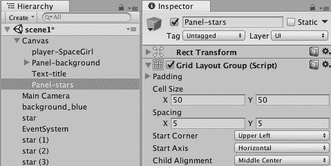

1.  将 GameObject player-SpaceGirl 中的 C# 脚本 `PlayerInventoryDisplay` 替换为以下代码：

```cs
using UnityEngine; 
using System.Collections; 
using UnityEngine.UI; 

[RequireComponent(typeof(PlayerInventory))] 
public class PlayerInventoryDisplay : MonoBehaviour  { 
   const int NUM_INVENTORY_SLOTS = 5; 
   public GameObject panelSlotGrid; 
   public GameObject starSlotPrefab; 
   private PickupUI[] slots = new PickupUI[NUM_INVENTORY_SLOTS]; 

   void Awake() {
         float width = 50 + (NUM_INVENTORY_SLOTS * 50); 
         panelSlotGrid.GetComponent<RectTransform>().SetSizeWithCurrentAnchors( RectTransform.Axis.Horizontal, width ); 

         for(int i=0; i < NUM_INVENTORY_SLOTS; i++){ 
               GameObject starSlotGO = (GameObject) 
               Instantiate(starSlotPrefab); 
               starSlotGO.transform.SetParent(panelSlotGrid.transform); 
               starSlotGO.transform.localScale = new Vector3(1,1,1); 
               slots[i] = starSlotGO.GetComponent<PickupUI>(); 
         } 
   } 

   public void OnChangeStarTotal(int starTotal) { 
         for(int i = 0; i < NUM_INVENTORY_SLOTS; i++){ 
               PickupUI slot = slots[i]; 
               if(i < starTotal) 
                     slot.DisplayColorIcon(); 
               else 
                     slot.DisplayGreyIcon(); 
         } 
   } 
} 
```

1.  确保在 **Hierarchy** 中选择 GameObject **player-girl1**。然后从 **Project** 面板将 GameObject **Panel-stars** 拖动到 **Inspector** 中的 **Player Inventory Display (Script)** 变量 **Panel-slot-grid**。

1.  在 **Hierarchy** 中选择 GameObject player-girl1，从 **Project** 面板将 prefab panel-inventory-slot 拖动到 **Player Inventory Display (Script)** 变量 Star Slot Prefab，在检查器中。步骤 7 和 8 如下截图所示：


1.  编辑脚本类 `PlayerInventoryDisplay`，将常量 `NUM_INVENTORY_SLOTS` 设置为 10 或 15 个槽位。这样一些槽位只能在使用水平滚动条时看到。

1.  保存场景并开始游戏。当你收集星星时，你应该会看到库存显示中更多的灰色星星变为黄色。

# 它是如何工作的...

我们取了一个包含旋钮圆形背景和灰色和彩色星星图像的子对象的面板，并使用它创建了一个 **Prefab** 面板-库存槽位。然后我们从场景中移除了星星面板 GameObject，因为我们的脚本类 PlayerInventoryDisplay 在场景开始时会创建所需数量的这些。这种方法节省了大量拖放操作，节省了 **设计时** 努力并消除了在场景设计更改时可能的一个序列/对象引用错误来源。

C# 脚本类 `PlayerInventoryDisplay` 有两个属性：

+   一个定义我们库存槽位数量的常量整数 (`NUM_INVENTORY_SLOTS`)，在这个游戏中我们将其设置为 5。

+   一个 `(slots)` 数组，包含对 `PickupUI` 脚本组件的引用。这些中的每一个将成为我们 `Panel-stars` 中五个 `Panel-inventory-slot` GameObject 中的脚本组件的引用。

`Awake()` 方法用于在 `PlayerInventoryDispay` 中创建预制实例，这样我们知道这将在 `PlayerInventory` 中的 `Start()` 方法之前执行，因为场景中的所有 GameObject 的 `Awake()` 方法完成之前，场景中不会执行任何 `Start()` 方法。`Awake()` 方法首先计算 `Panel-stars` 的宽度（50 + (50 * 库存槽位数量))。然后，使用 `SetSizeWithCurrentAnchors()` 方法调整面板大小以具有该宽度。然后，循环运行库存中的槽位数量，每次从预制中创建一个新的星星槽位 GameObject，将其作为子对象添加到 `Panel-stars`，并在数组槽位中添加对图标槽位 GameObject 的引用。当 `OnChangeStarTotal(...)` 方法传递我们携带的星星数量时，它遍历每个五个槽位。当当前槽位小于我们的星星总数时，通过调用当前槽位的 `DisplayYellow()` 方法（PickupUI 脚本组件）显示黄色星星。一旦循环计数器等于或大于我们的星星总数，那么所有剩余的槽位都通过 `DisplayGrey()` 方法显示为灰色星星。

我们的玩家角色 GameObject，player-girl1，有一个非常简单的 `PlayerInventory` 脚本。这个脚本只是检测与带有标签 Star 的对象的碰撞，当发生碰撞时，它会移除与之碰撞的星 GameObject，并调用其 `playerInventoryMode`l 脚本组件的 `AddStar()` 方法。每次调用 `AddStar()` 方法时，它都会将携带的星星总数增加（加 1），然后调用脚本组件 `playerInventoryDisplay` 的 `OnChangeStarTotal(...)` 方法。此外，当场景开始时，会调用 `OnChangeStarTotal(...)` 方法，以便设置库存的 UI 显示，显示我们最初没有携带任何星星。

公共数组已被改为私有，不再需要通过手动拖放来填充。当你运行游戏时，它将像以前一样运行，现在我们的库存网格面板中的图像数组填充现在是自动化的。`Awake()` 方法创建新的预制实例（数量由常量 `NUM_INVENTORY_SLOTS` 定义），并立即将其作为子对象添加到 Panel-slot-grid。由于我们有一个网格布局组组件，它们的放置在我们的面板中自动整齐有序。

当 GameObject 改变其父对象时（为了保持子对象大小相对于父对象的大小），会重置 GameObject 变换组件的缩放属性。因此，在 GameObject 被添加为另一个 GameObject 的子对象后，立即将其局部缩放重置为 (1,1,1) 是一个好主意。我们在 starSlotGO 的 for 循环中紧随 `SetParent(...)` 语句之后执行此操作。

# 还有更多...

这里有一些你不想错过的细节。

# 根据带有标签 Star 的 GameObject 数量自动推断库存槽位数量

而不是手动在脚本类 PlayerInventoryDisplay 中更改整型常量 `NUM_INVENTORY_SLOTS` 以匹配场景中创建的用于玩家收集的 GameObject 数量，让我们让我们的脚本计算有多少 GameObject 被标记为 Star，并使用这个数量来调整和填充指向库存 UI 槽位引用的数组。

我们只需要将数组大小从常量改为变量，并在我们的 `Awake()` 方法中将其设置在其他任何内容之前。语句 `GameObject.FindGameObjectsWithTag("Star")` 获取一个引用数组，指向所有带有标签 Star 的 GameObject，其长度就是我们想要的数组大小：

1.  将 GameObject player-SpaceGirl 中的 C# 脚本 `PlayerInventoryDisplay` 替换为以下代码：

```cs
using UnityEngine; 
using System.Collections; 
using UnityEngine.UI; 

[RequireComponent(typeof(PlayerInventory))] 
public class PlayerInventoryDisplay : MonoBehaviour  { 
   private int numInventorySlots; 
   private PickupUI[] slots; 
   public GameObject panelSlotGrid; 
   public GameObject starSlotPrefab; 

   void Awake() { 
         GameObject[] gameObjectsTaggedStar = GameObject.FindGameObjectsWithTag("Star"); 
         numInventorySlots = gameObjectsTaggedStar.Length; 
         slots = new PickupUI[numInventorySlots]; 
         float width = 50 + (numInventorySlots * 50); 
         panelSlotGrid.GetComponent<RectTransform>().SetSizeWithCurrentAnchors( RectTransform.Axis.Horizontal, width);  

         for(int i=0; i < numInventorySlots; i++){ 
               GameObject starSlotGO = (GameObject) 
               Instantiate(starSlotPrefab); 
               starSlotGO.transform.SetParent(panelSlotGrid.transform); 
               starSlotGO.transform.localScale = new Vector3(1,1,1); 
               slots[i] = starSlotGO.GetComponent<PickupUI>(); 
         } 
   } 

   public void OnChangeStarTotal(int starTotal) { 
         for(int i = 0; i < numInventorySlots; i++){ 
               PickupUI slot = slots[i]; 
               if(i < starTotal) 
                     slot.DisplayColorIcon(); 
               else 
                     slot.DisplayGreyIcon(); 
         } 
   } 
} 
```

1.  添加或删除一些 GameObject 星星重复项，以便总数不再是 5。

1.  运行场景。你应该会看到当场景开始时，Panel-star 的大小和内容会根据带有标签 Star 的 GameObject 数量进行匹配。

# 在库存槽位显示中添加水平滚动条

我们如何应对许多库存槽位，多于提供空间的情况？一个解决方案是添加一个滚动条，以便用户可以左右滚动，一次查看五个，例如，如图所示。


让我们在游戏中添加一个水平滚动条。这可以通过不进行任何 C# 代码更改，完全通过 Unity 5 UI 系统来实现。

要为我们的库存显示实现水平滚动条，我们需要做以下几步：

1.  将 Panel-background 的高度增加到 110 像素。

1.  在 **Inspector** 面板中，将 `Panel-slot-grid` 的组件 **Grid Layout Group (Script)** 的 **Child Alignment** 属性设置为 Upper Left。然后，将此面板稍微向右移动，以便库存图标在屏幕上居中。

1.  在 **Canvas** 中添加一个 **UI Panel**，命名为 `Panel-scroll-container`，并通过将其 **Image (Script)** 组件的颜色设置为红色来使其着色。

1.  在 **Hierarchy** 面板中，将 `Panel-slot-grid` 拖动，使其成为 `Panel-scroll-container` 的子项。

1.  调整 Panel-scroll-container 的大小和位置，使其正好位于 Panel-slot-grid 之后。将它的 **Rect Transform** 设置为 top-left，**Pos X** 为 130，**Pos Y** 为 -30，**Width** 为 300 和 **Height** 为 60。因此，你现在应该看到一个红色矩形在 `Panel-slot-grid` 库存面板后面。

1.  将一个 **UI Mask** 添加到 `Panel-scroll-container`，现在你应该只能看到 `Panel-slot-grid` 中适合这个红色着色面板矩形的部分。

一种工作流程是将此遮罩组件临时设置为不活动状态，以便在需要时可以看到并处理 Panel-slot-grid 中未看到的部分。

1.  在 **Canvas** 中添加一个 **UI Scrollbar**，命名为 Scrollbar-horizontal。将其移动到红色着色的 `Panel-scroll-container` 下方，并调整大小以与以下截图中的相同：


1.  将 UI **Scroll Rect** 组件添加到 Panel-scroll-container 中。取消选中此 **Scroll Rect** 组件的 **Vertical** 属性。

1.  在 **Inspector** 面板中，将 Scrolbar-horizontal 拖动到 Panel-scroll-container 的 Scroll Rect 组件的 Horizontal Scrollbar 属性。

1.  在 **Inspector** 面板中，将 Panel-slot-grid 拖动到 Panel-scroll-container 的 **Scroll Rect** 组件的 **Content** 属性，如图所示：


1.  现在，确保 Panel-scroll-container 的遮罩组件设置为活动状态，这样我们就不会看到 Panel-slot-grid 的溢出部分，并取消选中此遮罩组件的 **Show Mask Graphic** 选项（这样我们就不会再看到红色矩形）。

现在，你应该有一个可以工作的可滚动库存系统。

# 根据库存中的槽位数量自动调整网格单元格大小

考虑一种情况，我们希望更改槽位数量。使用滚动条等方法的替代方案是在 **Grid Layout Group** 组件中更改单元格大小。我们可以通过代码来自动执行此操作，以确保单元格大小更改以确保 `NUM_INVENTORY_SLOTS` 将沿画布顶部的面板宽度适应。

要实现本配方中 **Grid Layout Group** 单元格大小的自动调整，我们需要执行以下操作：

+   在 `Awake()` 方法中注释掉第三条语句：

```cs
// panelSlotGrid.GetComponent<RectTransform>().SetSizeWithCurrentAnchors( 
// RectTransform.Axis.Horizontal, width);
```

+   将以下方法 Start() 添加到 GameObject player-SpaceGirl 中的 C# 脚本 PlayerInventoryDisplay，代码如下：

```cs
void Start() { 
  float panelWidth = panelSlotGrid.GetComponent<RectTransform>().rect.width; 
  print ("slotGrid.GetComponent<RectTransform>().rect = " + panelSlotGrid.GetComponent<RectTransform>().rect); 

  GridLayoutGroup gridLayoutGroup = panelSlotGrid.GetComponent<GridLayoutGroup>(); 
  float xCellSize = panelWidth / NUM_INVENTORY_SLOTS; 
  xCellSize -= gridLayoutGroup.spacing.x; 
  gridLayoutGroup.cellSize = new Vector2(xCellSize, xCellSize); 
} 
```

我们在 `Start()` 方法中编写代码，而不是在 `Awake()` 方法中添加代码，以确保 GameObject Panel-slot-grid 的 `RectTransform` 已完成尺寸调整（在本配方中，它根据游戏面板的宽度进行拉伸）。虽然我们无法知道场景开始时 **Hierarchy** GameObjects 的创建顺序，但我们可以依赖 Unity 的行为，即每个 GameObject 都会发送 `Awake()` 消息，并且只有当所有相应的 `Awake()` 方法执行完毕后，才会发送 `Start()` 消息。因此，`Start()` 方法中的任何代码都可以安全地假设每个 GameObject 都已初始化。


上面的截图显示了 `NUM_INVENTORY_SLOTS` 的值已更改为 15，并且单元格大小相应地更改，以便所有 15 个现在都能水平地适应我们的面板。请注意，单元格之间的间距从计算出的可用宽度中减去，并除以槽位数量 `(xCellSize -= gridLayoutGroup.spacing.x)`，因为每个显示的项目之间也需要这个间距。

# 通过脚本化的 PickUp 对象的动态 List<> 将不同对象的多个拾取项显示为文本列表

当处理不同类型的拾取项时，一种方法是用 C# List 维护当前库存中项目的灵活长度数据结构。在本配方中，我们将向您展示，每次拾取一个项目时，都会将一个新的对象添加到这样的 List 集合中。通过遍历 List，每次库存更改时都会生成项目文本显示。我们引入一个非常简单的 PickUp 脚本类，演示如何将拾取的信息存储在脚本组件中，在碰撞时提取，并存储在我们的 List 中。


# 准备工作

此配方假设您是从本章第一道菜谱中设置的 `Simple2Dgame_SpaceGirl` 项目开始的。您需要的字体可以在 `03_02` 文件夹中找到。

# 如何操作...

要显示不同对象类型的多个拾取项的库存总数文本，请按照以下步骤操作：

1.  从 `Simple2Dgame_SpaceGirl` 小游戏的全新副本开始。

1.  编辑标签，将 Star 改为 Pickup。确保星形 GameObject 现在具有 Pickup 标签。


1.  将以下 C#脚本**PickUp**添加到层次结构中的 GameObject 星号：

```cs
using UnityEngine; 
using System.Collections; 

public class PickUp : MonoBehaviour { 
  public string description; 
}
```

1.  在检查器中，将组件拾取（脚本）的 GameObject 星号的描述属性更改为文本`star`：


1.  在层次结构面板中选择 GameObject 星号，并复制此 GameObject，将其重命名为 heart。

1.  在检查器中，将组件`Pick Up`（脚本）的 GameObject heart 的描述属性更改为文本 heart。同时，将健康 heart 图像从项目面板（在精灵文件夹中）拖动到 GameObject heart 的精灵属性中。现在玩家应该能在屏幕上看到这个拾取物品的心形图像。

1.  在**层次结构**面板中选择 GameObject 星号，并复制此 GameObject，将其重命名为 key。

1.  在检查器中，将组件拾取（脚本）的 GameObject 键的描述属性更改为文本键。同时，将项目面板（在精灵文件夹中）中的`icon_key_green_100`图像拖动到 GameObject 键的精灵属性中。现在玩家应该能在屏幕上看到这个拾取物品的钥匙图像。

1.  将每个拾取 GameObject 复制一个或两个，并将它们排列在屏幕周围，以便星号、heart 和 key 拾取 GameObject 各有两个或三个。

1.  在`_Scripts`文件夹中创建以下 C#脚本`PlayerInventory`。

```cs
using UnityEngine; 
using System.Collections; 
using UnityEngine.UI; 
using System.Collections.Generic; 

public class PlayerInventory : MonoBehaviour { 
   private PlayerInventoryDisplay playerInventoryDisplay; 
   private List<PickUp> inventory = new List<PickUp>(); 

   void Awake() { 
         playerInventoryDisplay = GetComponent<PlayerInventoryDisplay>(); 
   } 

   void Start() { 
         playerInventoryDisplay.OnChangeInventory(inventory); 
   } 

   void OnTriggerEnter2D(Collider2D hit) { 
         if(hit.CompareTag("Pickup")){ 
               PickUp item = hit.GetComponent<PickUp>(); 
               inventory.Add( item ); 
               playerInventoryDisplay.OnChangeInventory(inventory); 
               Destroy(hit.gameObject); 
         } 
   } 
} 
```

1.  添加一个 UI 文本对象（**创建** | **UI** | **文本**）。将其重命名为 Text-inventory-list。将文本更改为“the quick brown fox jumped over the lazy dog the quick brown fox jumped over the lazy dog”，或另一个长列表的胡言乱语，以测试你将在下一步更改的溢出设置。

1.  在文本（脚本）组件中，确保**水平溢出**设置为 Wrap，并将**垂直溢出**设置为**溢出**。这将确保文本将换行到第二行或第三行（如果需要），并且如果有大量拾取物品，文本不会隐藏。

1.  在**检查器**面板中，将其字体设置为**Xolonium-Bold**（在字体文件夹中）并将颜色设置为黄色。对于**对齐**属性，水平居中文本并确保文本垂直居顶，将**字体大小**设置为`28`，并选择黄色文本颜色。

1.  编辑其**矩形变换**并将其**高度**设置为 50。然后，按住*Shift* + *Alt*（以设置枢轴和位置），选择顶部拉伸框。现在文本应位于**游戏**面板的中间顶部，其宽度应拉伸以匹配整个面板的宽度。

1.  您的文本现在应出现在游戏面板的顶部。

1.  将以下 C#脚本`PlayerInventoryDisplay`添加到**层次结构**中的 GameObject player-girl1：

```cs
using UnityEngine; 
using System.Collections; 
using UnityEngine.UI; 
using System.Collections.Generic; 

[RequireComponent(typeof(PlayerInventory))] 
public class PlayerInventoryDisplay : MonoBehaviour { 
   public Text inventoryText; 

   public void OnChangeInventory(List<PickUp> inventory) { 
         // (1) clear existing display 
         inventoryText.text = ""; 

         // (2) build up new set of items  
         string newInventoryText = "carrying: "; 
         int numItems = inventory.Count; 
         for(int i = 0; i < numItems; i++){ 
               string description = inventory[i].description; 
               newInventoryText += " [" + description+ "]"; 
         } 

         // if no items in List then set string to message saying inventory is empty 
         if(numItems < 1) 
               newInventoryText = "(empty inventory)"; 

         // (3) update screen display 
         inventoryText.text = newInventoryText; 
   } 
} 
```

1.  从**层次结构**中选择 GameObject player-girl1。然后，从**检查器**中访问**玩家库存显示（脚本）**组件，并将**库存文本**公共字段填充为 UI 文本对象 Text-inventory-list。

1.  玩这个游戏。每次你拿起一颗星星、一把钥匙或一颗心时，你携带的更新列表应以携带 [钥匙] [心] 的形式显示。

# 它是如何工作的...k

在脚本类 `PlayerInventory` 中，变量库存是一个 C# List<>。这是一个灵活的数据结构，可以进行排序、搜索，并在游戏运行时动态地添加和删除项目。尖括号中的 `<PickUp>` 表示变量库存将包含 `PickUp` 对象的列表。在这个菜谱中，我们的 `PickUp` 类只有一个字段，即一个字符串描述，但我们在后面的菜谱中会添加更复杂的数据项到 `PickUp` 类中。这个变量库存初始化为一个空的 C# `PickUp` 对象列表。

在场景开始之前，脚本类 `Player` 的 `Awake()` 方法会缓存对 `PlayerInventoryDisplay` 脚本组件的引用。

当场景开始时，`Start()` 方法会调用 `PlayerInventoryDisplay` 脚本组件的 `OnChangeInventory(...)` 方法。这样，场景开始时显示给用户的文本与变量库存的初始值相对应（对于某些游戏，库存可能不为空。例如，玩家可能带着一些钱、一把基础武器或一张地图开始游戏）。

当 `OnTriggerEnter2D(...)` 方法检测到与标记为拾取的物品发生碰撞时，被击中的物品的 `PickUp` 对象组件将被添加到我们的库存列表中。同时，还会调用 `playerInventoryDisplay` 的 `OnChangeInventory(...)` 方法来更新玩家的库存显示，并将更新后的库存列表作为参数传递。

脚本类 `playerInventoryDisplay` 有一个公共变量，与 UI 文本对象 Text-inventory-list 相链接。`OnChangeInventory(...)` 方法首先将 UI 文本设置为空，然后遍历库存列表，构建每个物品描述的字符串（[钥匙]，[心]，等等）。如果没有物品在列表中，则字符串设置为文本（空库存）。最后，将 **UI Text** 对象 Text-inventory-list 的文本属性设置为这个字符串表示的变量库存中的内容。

# 还有更多...

这里有一些你不想错过的细节。

# 按字母顺序对库存列表中的物品进行排序

将库存列表中的单词按字母顺序排序会很好，这不仅为了整洁和一致性（因此，在游戏中，如果我们捡起一把钥匙和一颗心，无论它们的拾取顺序如何，看起来都一样），而且还因为相同类型的物品将一起列出，这样我们可以轻松地看到我们携带了多少每种物品。

要在库存列表中对物品进行字母排序，我们需要做以下几步：

1.  将以下 C# 代码添加到脚本类 `PlayerInventoryDisplay` 中 `OnChangeInventory(...)` 方法的开头：

```cs
public void OnChangeInventory(List<PickUp> inventory){ 
    inventory.Sort( 
        delegate(PickUp p1, PickUp p2){ 
           return p1.description.CompareTo(p2.description); 
        } 
    ); 

   // rest of the method as before ... 
} 
```

1.  你现在应该能看到所有物品按字母顺序列出。

这段 C#代码利用了 C# List.Sort(...)方法，这是集合的一个特性，其中每个项目都可以与下一个项目进行比较，如果顺序错误（如果 CompareTo(...)方法返回 false），则进行交换。更多信息请参阅[ https://msdn.microsoft.com/en-us/library/3da4abas(v=vs.110).aspx](https://msdn.microsoft.com/en-us/library/3da4abas(v=vs.110).aspx)。

# 通过动态字典<>中的 PickUp 对象和枚举拾取类型显示不同对象的多个拾取作为文本总计

虽然之前的菜谱工作得很好，但任何旧文本可能已经被输入到拾取的描述中，或者可能输入错误（星号，Sstar，starr 等）。一个更好的方法是通过使用 C#枚举来限制游戏属性为预定义（枚举）列表中的一个可能值，这样可以大大减少输入字符串错误的机会。此外，这意味着我们可以编写代码来适当地处理预定义的可能值集合。在这个菜谱中，我们将通过引入三种可能的拾取类型（星号，心形，钥匙）来改进我们的通用`PickUp`类，并编写库存显示代码，计算携带每种类型拾取的数量，并通过屏幕上的**UI Text**对象显示这些总计。我们还从使用**List**切换到使用**Dictionary**，因为 Dictionary 数据结构专门设计用于键值对，非常适合将数值总计与枚举拾取类型关联起来。


在这个菜谱中，我们将通过引入一个脚本类库存管理器，将控制器（用户收集事件）逻辑与存储的库存数据分离，从而管理额外的复杂性。然后，我们的玩家控制器简化为仅两个方法（Awake，获取库存管理器的引用，以及`OnTriggerEnter2D`，通过与库存管理器通信来响应碰撞）。

# 准备工作

这个菜谱是对之前的菜谱的改编。因此，复制之前菜谱的项目，并在这个副本上工作。

# 如何做到这一点...

要通过动态字典显示不同对象的多个拾取作为文本总计，请按照以下步骤操作：

1.  将脚本类`PickUp`的内容替换为以下代码：

```cs
using UnityEngine; 

public class PickUp : MonoBehaviour { 
   public enum PickUpType { 
         Star, Key, Heart 
   } 

   public PickUpType type; 
} 
```

1.  从 GameObject `player-SpaceGirl`中移除脚本类`PlayerInventory`的实例。

1.  创建一个新的 C#脚本类`PlayerController`，包含以下代码，并将其实例作为组件添加到 GameObject `player-girl1`中：

```cs
using UnityEngine; 

public class PlayerController : MonoBehaviour { 
   private InventoryManager inventoryManager; 

   void Awake() { 
         inventoryManager = GetComponent<InventoryManager>(); 
   } 

   void OnTriggerEnter2D(Collider2D hit) { 
         if(hit.CompareTag("Pickup")){ 
```

`PickUp item = hit.GetComponent<PickUp> ();`

```cs
               inventoryManager.Add(item); 
               Destroy(hit.gameObject); 
         } 
   } 
} 
```

1.  将脚本类`PlayerInventoryDisplay`的内容替换为以下代码：

```cs
using UnityEngine; 
using UnityEngine.UI; 
using System.Collections.Generic; 

[RequireComponent(typeof(PlayerController))] 
[RequireComponent(typeof(InventoryManager))] 
public class PlayerInventoryDisplay : MonoBehaviour { 
   public Text inventoryText; 

   public void OnChangeInventory(Dictionary<PickUp.PickUpType, int> inventory) { 
         inventoryText.text = ""; 
         string newInventoryText = "carrying: "; 

         foreach (var item in inventory) { 
               int itemTotal = item.Value; 
               string description = item.Key.ToString(); 
               newInventoryText += " [ " + description + " " + itemTotal + " ]"; 
         } 

         int numItems = inventory.Count; 
         if (numItems < 1) 
               newInventoryText = "(empty inventory)"; 

         inventoryText.text = newInventoryText; 
   } 
} 
```

1.  将以下 C#脚本`InventoryManager`的实例添加到 Hierarchy 中的 GameObject `player-SpaceGirl`：

```cs
using UnityEngine; 
using System.Collections.Generic; 

public class InventoryManager : MonoBehaviour { 
   private PlayerInventoryDisplay playerInventoryDisplay; 
   private Dictionary<PickUp.PickUpType, int> items = new Dictionary<PickUp.PickUpType, int>(); 

   void Awake() { 
         playerInventoryDisplay = GetComponent<PlayerInventoryDisplay>(); 
   } 

   void Start() { 
         playerInventoryDisplay.OnChangeInventory(items); 
   } 

   public void Add(PickUp pickup) { 
         PickUp.PickUpType type = pickup.type; 
         int oldTotal = 0; 

         if(items.TryGetValue(type, out oldTotal)) 
               items[type] = oldTotal + 1; 
         else 
               items.Add (type, 1); 

         playerInventoryDisplay.OnChangeInventory(items); 
   } 
} 
```

1.  在 **层次**（或 **场景**）面板中，依次选择每个拾取 GameObject，并在 **检查器**面板的下拉菜单中选择其对应的 **类型**。正如你所看到的，公共变量如果是枚举类型，将自动限制为可能的值集合，作为 **检查器**面板中的组合框下拉菜单。

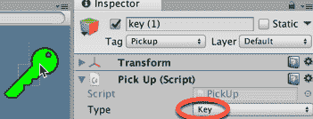

1.  玩游戏。首先，你应该在屏幕上看到一个消息，说明库存为空，然后当你拾取每种拾取类型的单个或多个物品时，你会看到你收集到的每种类型的文本总数。

# 它是如何工作的...

场景中的每个拾取 GameObject 都有一个 `PickUp` 类的脚本组件。每个 `Pickup` GameObject 的 `PickUp` 对象有一个单一属性，即拾取类型，它必须是 `Star`、`Key` 或 `Heart` 的枚举集合中的一个。使用枚举类型意味着值必须是这三个列出的值之一，因此不可能出现像上一个配方中通用文本字符串类型那样的拼写错误或输入错误。

之前，脚本类 `PlayerInventory` 脚本有两个职责集：

+   维护所携带物品的内部记录

+   检测碰撞，更新状态，并要求显示类通知玩家所携带物品的变化

在这个配方中，我们将这两组职责分别分离到独立的脚本类中：

+   脚本类 `InventoryManager` 将维护所携带物品的内部记录（并在每次物品携带发生变化时要求显示类通知玩家）。

+   脚本类 `Player` 将检测碰撞，并要求 `InventoryManager` 更新所携带的内容。

添加这个额外的软件层既将玩家碰撞检测行为与库存的内部存储方式分开，也防止任何单个脚本类因为尝试处理过多的不同职责而变得过于复杂。这个配方是 **模型-视图-控制器**（**MVC**）设计模式低耦合的一个例子。我们设计代码不依赖于或对游戏的其他部分做出太多假设，以降低游戏其他部分的变化破坏我们的库存显示代码的可能性。显示（视图）与我们所携带的逻辑表示（库存管理器模型）分离，模型的变化是通过玩家（控制器）调用的公共方法进行的。

玩家脚本类通过其 `Awake()` 方法获取对 `InventoryManager` 组件的引用，并且每次玩家的角色与拾取 GameObject 发生碰撞时，它都会调用库存管理器的 `Add(...)` 方法，传递与碰撞对象关联的 `PickUp` 对象。

在脚本类 `InventoryManager` 中，玩家携带的库存被表示为一个 C# **字典**。字典由一系列 *键值对* 组成，其中键是可能的 `PickUp.PickUpType` 枚举 **值** 之一，值是携带该类型拾取的整数总计。声明字典时，指定将用于键的类型，然后指定将存储为该键值的类型（或脚本类）。以下是声明我们的字典变量 `items` 的语句：

```cs
items = new Dictionary<PickUp.PickUpType, int>() 
```

C# 字典提供了 `TryGetValue(...)` 方法，该方法接收一个键的参数，并传递一个与字典值相同数据类型的变量的引用。当调用库存管理器的 `Add(...)` 方法时，会测试拾取对象的类型，以查看是否已经在字典项中存在该类型的总计。如果在字典中找到了给定类型的项总计，则将字典中该项目的值增加。如果没有找到给定类型的条目，则将在字典中添加一个新元素，其总计为 1。

**`TryGetValue` 引用参数调用** 注意在此语句中参数 `oldTotal` 前的 C# `out` 关键字的使用：

`items.TryGetValue(type, out oldTotal)`

表示正在将实际变量 `oldTotal` 的引用传递给方法 `TryGetValue(...)`，而不仅仅是其值的副本。这意味着该方法可以更改变量的值。

如果在字典中找到了给定类型的条目，则方法返回 `true`，并且如果找到，则将 `oldTotal` 的值设置为该键的值。

`Add(...)` 方法的最后一个动作是调用玩家 GameObject 的脚本组件 `PlayerInventoryDisplay` 中的 `OnChangeInventory(...)` 方法，以更新屏幕上显示的文本总计。

脚本类 `PlayerInventoryDisplay` 的 `OnChangeInventory(...)` 方法首先初始化字符串变量 `newInventoryText`，然后遍历字典中的每个项目，将当前项目的类型名称和总计作为字符串附加到 `newInventoryText` 上。最后，将 UI 文本对象的文本属性更新为 `newInventoryText` 中的完整文本，向玩家显示拾取总计。

在 Unity 技术教程中了解更多关于在 Unity 中使用 C# 列表和字典的信息，请访问 [`unity3d.com/learn/tutorials/modules/intermediate/scripting/lists-and-dictionaries`](https://unity3d.com/learn/tutorials/modules/intermediate/scripting/lists-and-dictionaries)。
