# 第四章：播放并操作声音

在本章中，我们将涵盖以下主题：

+   使用单个**AudioSource**播放不同的单次声音效果

+   播放并控制各自带有自己的**AudioSource**的不同声音

+   通过 C#脚本在运行时创建即时**AudioSource**组件

+   在播放声音前延迟

+   防止正在播放的音频剪辑重新开始

+   在对象自动销毁前等待音频播放完成

+   通过 dspTime 的精确调度创建节拍器

+   将音频音调与动画速度匹配

+   使用混响区域模拟声学环境

+   使用音频混音器添加音量控制

+   使用快照制作动态配乐

+   使用 ducking 平衡游戏中的音频

+   从样本频谱数据中进行音频可视化

+   同步同时和顺序音乐以创建简单的 140 bpm 音乐循环管理器

# 简介

声音是游戏体验的重要组成部分。实际上，无法过分强调它对玩家沉浸于虚拟环境中的重要性。想想你最喜欢的赛车游戏中引擎的轰鸣声，模拟游戏中的遥远城市嘈杂声，或者恐怖游戏中的缓慢声音。想想这些声音如何将你带入游戏。

# 整体概念

在继续介绍食谱之前，让我们首先回顾一下 Unity 中不同的声音功能是如何工作的。需要音频的项目需要一个或多个音频文件，在 Unity 中称为**AudioClips**，这些文件位于你的**项目**文件夹中。在撰写本文时，Unity 2017 支持四种音频文件格式：`.wav`、`.ogg`、`.mp3`和`.aif`。这些类型的文件在 Unity 为目标平台构建时会被重新编码。它还支持四种格式的跟踪模块：.xm、**.mod**、**.****it**和**.s3m**。

一个场景或预制 GameObject 可以拥有一个**AudioSource**组件——该组件可以在设计时链接到一个**AudioClip**声音文件，或者在运行时通过脚本进行链接。在任何场景中，都有一个 GameObject 内的活动**AudioListener**组件。当你创建一个新的场景时，其中一个自动添加到*Main Camera*中。可以将**AudioListener**想象成一个模拟的数字“耳朵”，因为 Unity 播放的声音是基于播放的**AudioSources**和活动**AudioListener**之间的关系。

简单的声音，如拾取效果和背景配乐音乐，可以定义为**2D 声音**。然而，Unity 支持**3D 声音**，这意味着播放的**AudioSources**和活动**AudioListener**之间的位置和距离决定了声音在响度和左右平衡方面的感知方式。

您也可以通过`AudioSettings.dspTime`来设计同步声音播放和调度——这是一个基于音频系统样本的值，因此它比`Time.time`值要精确得多。此外，`dspTime`将与场景一起暂停/挂起，因此在使用`dspTime`时无需重新安排逻辑。本章中的一些食谱展示了这种方法。

近年来，Unity 为游戏音频添加了一个强大的新功能：**AudioMixer**。**AudioMixer**彻底改变了玩家体验声音元素以及游戏开发者与之交互的方式。它允许我们以与音乐家和制作人他们在数字音频工作站（**D.A.W.**）中（如**GarageBand**或**ProTools**）相同的方式混音和排列音频。它允许您将**AudioSource**剪辑路由到特定通道，这些通道可以单独调整音量并经过定制效果和滤波器处理。您可以使用多个**AudioMixers**，将混音器的输出发送到父混音器，并将混音偏好保存为**快照**。您还可以从脚本中访问混音器参数。以下图表示了 Unity 音频混音的主要概念及其关系：

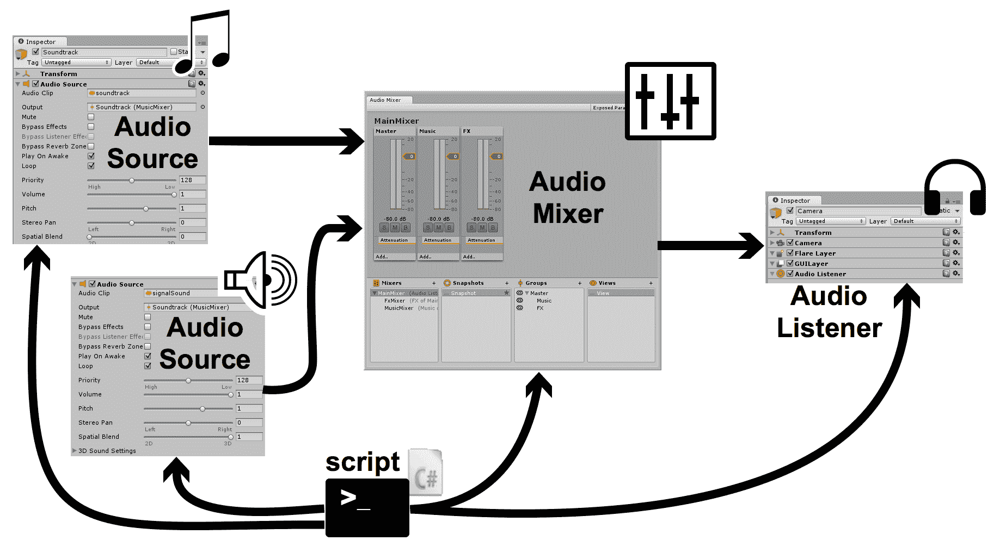

上面的图表示了 Unity 音频混音的主要概念及其关系：

利用许多示例项目中新的 AudioMixer 功能，本章充满了希望帮助您为项目实现更好、更高效的声音设计的食谱，增强玩家的沉浸感，将他们带入游戏环境，甚至改善游戏玩法。

# 未来音频功能

这些食谱展示了在运行时管理音频和引入动态效果的脚本和 Unity 音频系统方法。当效果和音乐的音频环境可以根据游戏中的上下文微妙地改变时，游戏可以变得更加引人入胜——无论您选择的效果是混响区域、降低某些声音的音量以暂时降低其重要性，还是允许用户控制音频音量。

最后，随着 3D VR 游戏播放时引入环绕声音频，特殊音频的可行性现在变得更加有趣——根据声音是在听者上方还是下方，以及它们与音频源的距离，提供丰富的音频体验。环绕声音频的一些参考资源包括：

+   维基百科提供了一些关于环绕声的历史：[`en.wikipedia.org/wiki/Ambisonics`](https://en.wikipedia.org/wiki/Ambisonics)。

+   在 Unity 文档中了解 Unity 和环绕声音频：[ https://docs.unity3d.com/Manual/AmbisonicAudio.html](https://docs.unity3d.com/Manual/AmbisonicAudio.html)。

+   Google 关于特殊音频和环绕声的参考页面：[`developers.google.com/vr/concepts/spatial-audio`](https://developers.google.com/vr/concepts/spatial-audio)。

+   关于特殊音频和环绕声的 Occulus 参考页面：[`developer.oculus.com/downloads/package/oculus-ambisonics-starter-pack/`](https://developer.oculus.com/downloads/package/oculus-ambisonics-starter-pack/)。

+   Robert Hernadez 在 Medium.com 上发表了一篇很好的文章，解释了如何记录和编辑环绕声音频：[`medium.com/@webjournalist/spatial-audio-how-to-hear-in-vr-10914a41f4ca`](https://medium.com/@webjournalist/spatial-audio-how-to-hear-in-vr-10914a41f4ca)。

# 使用单个**AudioSource**组件播放不同的单次音效

在 Unity 中播放声音的基本操作非常简单（将**AudioSource**组件添加到 GameObject 并链接到**AudioClip**音效文件）。对于简单的音效，如短暂的拾取确认声音，有一个单一的**AudioSource**组件并重复使用它来播放不同的音效非常有用——这正是本食谱中我们将要做的。

# 准备工作

尝试使用任何时长小于一秒的短音频片段。我们在`04_01`文件夹中包含了几个经典的《吃豆人》游戏音效剪辑。

# 如何做到这一点...

要使用相同的**AudioSource**组件播放多个声音，请执行以下操作：

1.  创建一个新的 Unity 2D 项目并导入音效剪辑文件。

1.  在新文件夹`_Scripts`中创建一个名为`PlaySound`s 的 C#脚本类，并添加以下代码，然后将其实例作为脚本组件添加到**主相机**：

```cs
using UnityEngine; 

[RequireComponent(typeof(AudioSource))] 
public class PlaySounds : MonoBehaviour  
{ 
    public AudioClip clipEatCherry; 
    public AudioClip clipExtraLife; 

    private AudioSource audioAudioSource; 

    void Awake() { 
        audioAudioSource = GetComponent<AudioSource>(); 
    } 

    void Update() { 
        if (Input.GetKey(KeyCode.UpArrow))
            audioAudioSource.PlayOneShot(clipEatCherry); 

        if (Input.GetKey(KeyCode.DownArrow)) 
            audioAudioSource.PlayOneShot(clipExtraLife); 
    } 
}
```

1.  确保在**层次结构**中选择**主相机**GameObject。然后，在**检查器**面板中，将**项目**面板中的 Pacman Eating Cherry 音效剪辑拖动到`PlaySounds (Script)`脚本组件中的公共 Pacman Eating Cherry **AudioClip**变量中。为 Pacman Extra Life 音效剪辑重复此步骤。这些步骤在截图中有说明：

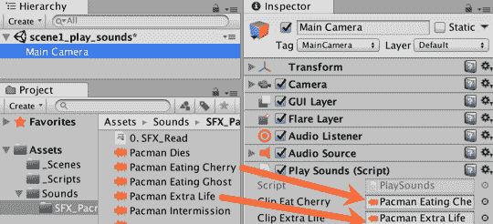

1.  运行场景，并按*上*和*下*箭头键播放不同的音效。

# 它是如何工作的...

您已创建了一个 C#脚本类`PlaySounds`。该脚本类包含一个`RequireComponent`属性，声明任何包含此类脚本对象组件的 GameObject 必须有一个兄弟`AudioSource`组件（如果脚本组件添加时不存在此类组件，则会自动添加一个）。

`PlaySounds`脚本类有两个公共`AudioClip`属性：`Pacman Eating Cherry`和`Pacman Extra Life`。在**设计时**，我们将**项目**面板中的`AudioClip`音效文件与这些公共属性关联。

在运行时，`Update()`方法在每一帧都会执行。此方法检查*上*和*下*数组键是否被按下，如果是，则相应地播放吃樱桃或额外生命的声音——向**AudioSource**组件发送一个带有适当`AudioClip`音效文件链接的`PlayOneShot()`消息。

注意：使用**PlayOneShot**播放的声音无法暂停/查询

虽然`PlayOneShot()`方法非常适合短时、单次音效，但其局限性在于无法查询播放中的声音状态（是否已结束，播放到什么位置等）。也无法暂停/重新播放使用`PlayOneShot()`播放的声音。对于这种详细的声音控制，每个声音都需要自己的 AudioSource 组件。

在 Unity 文档中了解更多关于`PlayOneShot()`方法的信息：[`docs.unity3d.com/ScriptReference/AudioSource.PlayOneShot.html`](https://docs.unity3d.com/ScriptReference/AudioSource.PlayOneShot.html)。

# 还有更多...

有一些细节你不希望错过。

# 在 3D 世界空间中的静态点播放声音

与`PlayOneShot()`类似的是`PlayClipAtPoint()` **AudioSource**方法。这允许你在 3D 世界空间中的特定点播放声音剪辑。请注意，这是一个静态类方法 - 因此你不需要**AudioSource**组件来使用此方法 - **AudioSource**组件将在你给出的位置创建，并且只要**AudioClip**声音在播放，它就会存在。Unity 将在声音播放完毕后自动删除**AudioSource**组件。你所需要的只是一个`Vector3`（x,y,z）位置对象，以及要播放的**AudioClip**文件的引用：

```cs
Vector3 location = new Vector3(10, 10, 10); 
AudioSource.PlayClipAtPoint(soundClipToPlay, location); 
```

# 播放和控制具有各自 AudioSource 组件的不同声音

虽然在先前的配方（使用单个**AudioSource**的`PlayOneShot(...)`）中对于单次音效来说是个不错的选择，但当需要进一步控制播放中的声音时，每个声音都需要在它自己的**AudioSource**组件中播放。在这个配方中，我们将创建两个独立的**AudioSource**组件，并使用不同的箭头键暂停/恢复每个。

# 准备工作

尝试使用两个几秒钟长的音频剪辑。我们在文件夹`04_02`中包含了两个免费的音乐剪辑。

# 如何做到...

要播放不同的声音，每个声音都有自己的 AudioSource 组件，请执行以下操作：

1.  创建一个新的 Unity 2D 项目并导入音频剪辑文件。

1.  在场景中创建一个包含**AudioSource**组件的 GameObject，该组件链接到 186772__dafawe__medieval **AudioClip**。这可以通过将音乐剪辑从**Project**面板拖动到**Hierarchy**或**Scene**面板来完成。将这个新 GameObject 重命名为 music1_medieval。

1.  重复前面的步骤创建另一个名为 music2_arcade 的 GameObject，其中包含一个**AudioSource**组件，链接到 251461__joshuaempyre__arcade-music-loop。

1.  对于创建的两个 AudioSources，取消选中 Play Awake 属性 - 因此这些声音不会在场景加载时立即播放。

1.  创建一个名为 Manager 的空 GameObject。

1.  在名为`_Scripts`的新文件夹中创建一个 C#脚本类，名为 MusicManager，包含以下代码，并将其实例作为脚本组件添加到 Manager GameObject 中：

```cs
using UnityEngine; 

public class MusicManager : MonoBehaviour  { 
    public AudioSource audioSourceMedieval; 
    public AudioSource audioSourceArcade; 

    void Update() { 
        if (Input.GetKey(KeyCode.RightArrow)){ 
            if (audioSourceMedieval.time > 0) 
                audioSourceMedieval.UnPause(); 
            else 
                audioSourceMedieval.Play(); 
        } 

        if (Input.GetKey(KeyCode.LeftArrow)) 
            audioSourceMedieval.Pause(); 

        if (Input.GetKey(KeyCode.UpArrow)){ 
            if (audioSourceArcade.time > 0) 
                audioSourceArcade.UnPause(); 
            else 
                audioSourceArcade.Play(); 
        } 

        if (Input.GetKey(KeyCode.DownArrow)) 
            audioSourceArcade.Pause(); 
    } 
} 
```

1.  确保在**层次结构**中选中了**Manager**游戏对象。在**检查器**面板中，将场景面板中的 music1_medieval **游戏对象**拖动到`MusicManager (脚本)`脚本组件中的公共`Audio Source Medieval` AudioSource 变量中。重复此步骤，将 GameObject music2_arcade 拖动到公共`Audio Source Arcade`变量中。

1.  运行场景，并按*上*和*下*箭头键以开始/恢复和暂停中世纪声音片段。按*右*和*左*箭头键以开始/恢复和暂停街机声音片段。

# 它是如何工作的...

您创建了一个 C#脚本类，`MusicManager`，并将此类的实例作为组件添加到 Manager 游戏对象中。您还在场景中创建了两个**游戏对象**，分别命名为 music1_medieval 和 music2_arcade，每个都包含一个与不同音乐片段链接的**AudioSource**组件。

脚本类有两个公共**AudioSource**属性：`Music Medieval`和`Music Arcade`。在**设计时**，我们将**游戏对象**music1_medieval 和 music2_arcade 的**AudioSource**组件与这些公共属性关联。

在**运行时**，`Update()`方法在每一帧执行。此方法检查*上/下/右/左*数组键是否被按下。如果检测到*上*箭头键，则向中世纪音乐音频源发送`Play()`或`UnPause()`消息。如果片段尚未播放（其时间属性为零），则发送`Play()`消息。如果按下*下*箭头键，则向中世纪音乐音频源发送`Pause()`消息。

通过检测 RIGHT/LEFT 数组键来以相应的方式控制街机音乐片段。

每个与自己的**AudioSource**组件关联的**AudioClip**声音文件允许同时播放和管理每个声音。

# 通过 C#脚本在运行时创建即时 AudioSource 组件

在之前的配方中，对于每个我们想要管理的声音片段，在场景中我们必须在**设计时**手动创建带有**AudioSource**组件的**游戏对象**。然而，使用 C#脚本，我们可以在**运行时**创建自己的包含**AudioSources**的**游戏对象**，正好在它们需要的时候。这种方法类似于内置的**AudioSource PlayClipAtPoint()**方法，但创建的**AudioSource**组件完全受我们的程序控制——尽管我们随后必须负责在不再需要时销毁此组件。

这段代码受到了 2011 年在在线**Unity Answers**论坛中由用户 Bunny83 发布的部分代码的启发。Unity 有一个伟大的在线社区，互相帮助并分享添加游戏功能的有意思的方法。了解更多关于这篇帖子，请访问[`answers.unity3d.com/questions/123772/playoneshot-returns-false-for-isplaying.html`](http://answers.unity3d.com/questions/123772/playoneshot-returns-false-for-isplaying.html)。

# 准备工作

这个菜谱是对上一个菜谱的改进。因此，请复制用于上一个菜谱的项目，并在这个副本上工作。

# 如何做到这一点...

要通过 C# 脚本在运行时创建即时 AudioSource 组件，请执行以下操作：

1.  从场景中删除 music1_medieval 和 music-loop GameObjects – 在这个菜谱中，我们将在 **运行时** 创建这些对象！

1.  将 `MusicManager` C# 脚本类重构如下（注意，`Update()` 方法未更改）：

```cs
using UnityEngine; 

public class MusicManager : MonoBehaviour { 
    public AudioClip clipMedieval; 
    public AudioClip clipArcade; 

    private AudioSource audioSourceMedieval; 
    private AudioSource audioSourceArcade; 

    void Awake() { 
        audioSourceMedieval = CreateAudioSource(clipMedieval, true); 
        audioSourceArcade = CreateAudioSource(clipArcade, false); 
    } 

    private AudioSource CreateAudioSource(AudioClip audioClip, bool startPlayingImmediately) { 
        GameObject audioSourceGO = new GameObject(); 
           audioSourceGO.transform.parent = transform; 
        audioSourceGO.transform.position = transform.position; 
        AudioSource newAudioSource = audioSourceGO.AddComponent<AudioSource>() as AudioSource; 
        newAudioSource.clip = audioClip; 
        if(startPlayingImmediately) 
            newAudioSource.Play(); 

        return newAudioSource; 
    } 

    void Update(){ 
        if (Input.GetKey(KeyCode.RightArrow)){ 
            if (audioSourceMedieval.time > 0) 
                audioSourceMedieval.UnPause(); 
            else 
                audioSourceMedieval.Play(); 
        } 

        if (Input.GetKey(KeyCode.LeftArrow)) 
            audioSourceMedieval.Pause(); 

        if (Input.GetKey(KeyCode.UpArrow)){ 
            if (audioSourceArcade.time > 0) 
                audioSourceArcade.UnPause(); 
            else 
                audioSourceArcade.Play();             
        } 

        if (Input.GetKey(KeyCode.DownArrow)) 
            audioSourceArcade.Pause(); 
   } 
} 
```

1.  确保在 **Hierarchy** 中选择了 `MainCamera` **GameObject**。在 **Inspector** 面板中，将项目面板中的 **AudioClip** 186772__dafawe__medieval 声音剪辑拖放到 `MusicManager (Script)` 脚本组件中的公共 `Clip Medieval` **AudioClip** 变量中。使用 **AudioClip** 251461__joshuaempyre__arcade-music-loop 对 `Clip Arcade` 变量重复此过程。

1.  运行场景，并按 *UP* 和 *DOWN* 箭头键以开始/恢复和暂停中世纪声音剪辑。按 *RIGHT* 和 *LEFT* 箭头键以开始/恢复和暂停街机声音剪辑。

# 它是如何工作的...

这个菜谱的关键特性是新的 `CreateAudioSource(...)` 方法。该方法接受一个声音剪辑文件的引用和一个布尔值（true/false），表示声音是否应该立即开始播放。该方法执行以下操作：

+   创建一个新的 **GameObject**（与创建它的 GameObject 具有相同的父级和位置）

+   在新的 **GameObject** 中添加一个新的 **AudioSource** 组件

+   将新 AudioSource 组件的音频剪辑设置为提供的 AudioClip 参数

+   如果布尔参数为 true，则立即向 **AudioSource** 组件发送 `Play()` 消息以开始播放声音剪辑

+   返回 AudioSource 组件的引用

`MusicManager` 脚本类的其余部分与上一个菜谱中的非常相似。有两个公共 `AudioClip` 变量，`clipMedieval` 和 `clipArcade`，它们在 **设计时** 通过拖放设置，以链接到 **Sounds Project** 文件夹中的声音剪辑文件。

`audioSourceMedieval` 和 `audioSourceArcade AudioSource` 变量现在是私有的。这些值在 `Awake(`) 方法中设置，通过调用并存储由 `CreateAudioSource(...)` 方法返回的值，使用 **clipMedieval** 和 `clipArcade` AudioClip 变量。

为了说明布尔参数的工作方式，中世纪音乐的 **AudioSource** 被创建为立即播放，而街机音乐将在按下 *UP* 键后才开始播放。播放/恢复/暂停两个音频剪辑与上一个菜谱中的相同 – 通过在（未更改的）`Update()` 方法中的箭头键检测逻辑。

# 还有更多...

有一些细节你不希望错过。

# 将 CreateAudioSource(...) 方法作为对 MonoBehavior 类的扩展

由于`CreateAudioSource(...)`方法是一个通用方法，可以被许多不同的游戏脚本类使用，它自然不会位于`MusicManager`类中。此类通用生成方法的最佳位置是将它们作为静态（类）方法添加到它们工作的组件类中 – 在这种情况下，如果能将此方法添加到`MonoBehavior`类本身中那就太好了 – 这样任何脚本组件都可以在运行时创建**AudioSource** GameObject。

我们需要做的就是创建一个类（通常命名为`ExtensionMethods`），其中包含一个静态方法，如下所示：

```cs
using UnityEngine; 

public static class ExtensionMethods { 
    public static AudioSource CreateAudioSource(this MonoBehaviour parent, AudioClip audioClip, bool startPlayingImmediately) 
    { 
         GameObject audioSourceGO = new GameObject("music-player"); 
         audioSourceGO.transform.parent = parent.transform; 
         audioSourceGO.transform.position = parent.transform.position; 
         AudioSource newAudioSource = audioSourceGO.AddComponent<AudioSource>() as AudioSource; 
         newAudioSource.clip = audioClip; 

         if (startPlayingImmediately) 
               newAudioSource.Play(); 

         return newAudioSource; 
    } 
} 
```

如我们所见，我们在扩展方法中添加了一个额外的第一个参数，指定我们要将此方法添加到哪个类。由于我们已经将其添加到`MonoBehavior`类中，因此现在我们可以在我们的脚本类中使用此方法，就像它是内置的。因此，我们的`MusicManager`类中的`Awake()`方法如下所示：

```cs
void Awake() { 
   audioSourceMedieval = this.CreateAudioSource(clipMedieval, true); 
   audioSourceArcade = this.CreateAudioSource(clipArcade, false); 
} 
```

就这样 – 我们现在可以从`MusicManager`类中删除该方法，并在任何我们的`MonoBehavior`脚本类中使用此方法。

# 在播放声音之前延迟

有时我们不想立即播放声音，而是在短暂的延迟后播放。例如，我们可能想要等待一秒钟或两秒钟再播放声音，以表示毒药的效果稍微延迟或玩家进入了一个削弱玩家的法术。对于此类情况，**AudioSource**提供了`PlayDelayed(...)`方法。这个配方说明了对于我们不希望立即开始播放声音的情况的一个简单方法。

# 准备工作

尝试使用两个几秒钟长的音频剪辑。我们在`04_04`文件夹中包含了两个免费的音频剪辑。

# 如何做到这一点...

要安排在给定延迟后播放声音，请执行以下操作：

1.  创建一个新的 Unity 2D 项目并导入音频剪辑文件。

1.  在场景中创建一个包含**AudioSource**组件的**GameObject**，该组件连接到**Pacman 开场曲**的**AudioClip**。这可以通过一次操作完成，即从项目面板拖动音乐剪辑到**Hierarchy**或**Scene**面板中。

1.  重复前面的步骤创建另一个**GameObject**，其中包含一个连接到**Pacman 死亡**剪辑的**AudioSource**。

1.  对于创建的两个**AudioSources**，取消选中“Play Awake”属性 – 因此这些声音不会在场景加载时立即播放。

1.  在屏幕上创建一个名为**Button-music**的**UI Button**，将其文本更改为“立即播放音乐”。

1.  在屏幕上创建一个名为**Button-dies**的**UI Button**，将其文本更改为“1 秒后播放死亡声音”。

1.  创建一个名为 SoundManager 的空**GameObject**。

1.  在新文件夹`_Scripts`中创建一个名为`DelayedSoundManager`的 C#脚本类，包含以下代码，并将其作为脚本组件添加到 SoundManager **GameObject**：

```cs
using UnityEngine; 

public class DelayedSoundManager : MonoBehaviour { 
    public AudioSource audioSourcePacmandMusic; 
    public AudioSource audioSourceDies; 

    public void ACTION_PlayMusicNow() { 
        audioSourcePacmandMusic.Play(); 
    } 

    public void ACTION_PlayDiesSoundAfterDelay() { 
        float delay = 1.0F; 
        audioSourceDies.PlayDelayed(delay); 
    } 
} 
```

1.  在层次结构面板中选择 Button-music **GameObject**，创建一个新的点击事件处理程序，将 SoundsManager **GameObject** 拖入对象槽，并选择 ACTION_PlayMusicNow() 方法。

1.  在层次结构面板中选择 Button-dies GameObject，创建一个新的点击事件处理程序，将 SoundsManager GameObject 拖入对象槽，并选择 ACTION_PlayDiesSoundAfterDelay() 方法。

# 它是如何工作的...

您向场景中添加了两个 **GameObjects**，包含连接到音乐和死亡音效剪辑的 `AudioSources`。您创建了一个 C# 脚本类，`DelayedSoundManager`，并将其实例添加到一个空 **GameObject** 中。您将您的脚本组件中的两个公共变量与您的 **GameObjects** 中的两个 `AudioSources` 关联起来。

您创建了两个按钮：

+   按钮音乐，点击动作用于调用 `DelayedSoundManager.ACTION_PlayMusicNow()` 方法

+   按钮失效，点击动作用于调用 `DelayedSoundManager.PlayDiesSoundAfterDelay()` 方法。

`DelayedSoundManager.ACTION_PlayMusicNow()` 方法立即向连接到 **Pacman 开场曲 AudioClip** 的音频源发送 Play() 消息。然而，`DelayedSoundManager.PlayDiesSoundAfterDelay()` 方法向连接到 **Pacman 死亡 AudioClip** 的音频源发送 PlayDelayed(...) 消息，传递值为 1.0，使 Unity 等待 1 秒后再播放音频片段。

# 防止音频片段在播放时重新启动

在游戏中，可能有多个不同的事件会导致特定的声音效果开始播放。如果声音已经在播放，那么在几乎所有情况下，我们都不希望重新启动声音。这个配方包括一个测试，以确保只有当音频源组件当前未播放时，才会发送 `Play()` 消息。

# 准备工作

尝试使用任何时长为一秒或更长的音频片段。我们已将 engineSound 音频剪辑包含在 `04_05` 文件夹中。

# 如何做到这一点...

要防止 **AudioClip** 重新启动，请按照以下步骤操作：

1.  创建一个新的 Unity 2D 项目并导入音频剪辑文件。

1.  在场景中创建一个包含 **AudioSource** 组件的 GameObject，该组件连接到 `AudioClip engineSound`。这可以通过从项目面板拖动音乐剪辑到层次结构或场景面板的单一步骤完成。

1.  取消选中 engineSound GameObject 的 **AudioSource** 组件的 Play Awake 属性 - 因此，当场景加载时，此声音不会开始播放。

1.  创建一个名为 **Button-play-sound** 的 UI 按钮，将其文本更改为播放声音。通过设置其 Rect **Transform** 属性位置为中间中心，将按钮放置在屏幕中央。

1.  在一个名为 `_Scripts` 的新文件夹中创建一个 C# 脚本类 `WaitToFinishBeforePlaying`，包含以下代码，并将其作为脚本组件添加到 Main Camera GameObject 中：

```cs
using UnityEngine; 
using UnityEngine.UI; 

public class WaitToFinishBeforePlaying : MonoBehaviour  { 
   public AudioSource audioSource; 
   public Text buttonText; 

   void Update() { 
         string statusMessage = "Play sound"; 
         if(audioSource.isPlaying ) 
               statusMessage = "(sound playing)"; 

         buttonText.text = statusMessage; 
   } 

   public void ACTION_PlaySoundIfNotPlaying() { 
         if( !audioSource.isPlaying ) 
               audioSource.Play(); 
   } 
} 
```

1.  在**层次结构**面板中选择主摄像机，将 engineSound 拖动到检查器面板中的公共 Audio Source 变量，并将 Button-play-sound 的 Text 子组件拖动到公共 ButtonText。

1.  在**层次结构**面板中选择 Button-play-sound，创建一个新的 on-click 事件处理器，将 Main Camera 拖动到对象槽中，并选择`ACTION_PlaySoundIfNotPlaying()`函数。

# 工作原理...

**Audio Source**组件有一个公共可读属性，**isPlaying**，它是一个布尔值 true/false 标志，指示声音是否正在播放。在本配方中，当声音未播放时，按钮文本设置为显示播放声音，当正在播放时显示（`sound playing`）。当按钮被点击时，会调用`ACTION_PlaySoundIfNotPlaying()`方法。此方法使用`if`语句，确保只有当 Audio Source 组件的**isPlaying**为 false 时，才向 Audio Source 组件发送`Play()`消息，并适当地更新按钮的文本。

# 参考以下内容

本章中关于**在音频播放完成后自动销毁对象**的配方。

# 在对象自动销毁前等待音频播放完成

可能会发生某些事件（例如拾取对象或杀死敌人），我们希望通过播放音频片段并关联一个视觉对象（例如爆炸粒子系统或事件位置的临时对象）来通知玩家。然而，一旦音频片段播放完成，我们希望将视觉对象从场景中移除。本配方提供了一种简单的方法，将播放音频片段的结束与包含对象的自动销毁链接起来。

# 准备工作

尝试使用任何时长为一秒或更长的音频片段。我们已在`04_06`文件夹中包含了`engineSound`音频片段。

# 如何操作...

要在销毁其父 GameObject 之前等待音频播放完成，请按照以下步骤操作：

1.  创建一个新的 Unity 2D 项目并导入音频片段文件。

1.  在场景中创建一个包含**AudioSource**组件并链接到**AudioClip** `engineSound`的 GameObject。这可以通过将音乐片段从项目面板拖动到**层次结构**或**场景**面板中一步完成。将此 GameObject 重命名为 AudioObject。

1.  取消勾选**engineSound** GameObject 的 AudioSource 组件的 Play Awake 属性，这样当场景加载时，这个声音不会立即开始播放。

1.  在新文件夹`_Scripts`中创建一个 C#脚本类，名为`AudioDestructBehaviour`，并包含以下代码，然后将其实例作为脚本组件添加到 AudioObject GameObject 中：

```cs
using UnityEngine; 
using UnityEngine; 

public class AudioDestructBehaviour : MonoBehaviour { 
   private AudioSource audioSource; 

   void Awake() { 
         audioSource = GetComponent<AudioSource>(); 
   } 

   private void Update() { 
         if( !audioSource.isPlaying ) 
               Destroy(gameObject); 
   } 
} 
```

1.  在**检查器**面板中禁用（取消选中）AudioObject 的`AudioDestructBehaviour`脚本组件（当需要时，将通过 C#代码重新启用）：

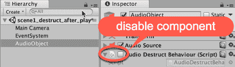

1.  在 `_Scripts` 文件夹中创建一个名为 `ButtonActions` 的 C# 脚本类，包含以下代码，并将其实例作为脚本组件添加到主摄像机 GameObject 中：

```cs
using UnityEngine; 

public class ButtonActions : MonoBehaviour { 
   public AudioSource audioSource; 

   public AudioDestructBehaviour audioDestructScriptedObject; 

   public void ACTION_PlaySound() { 
         if( !audioSource.isPlaying ) 
               audioSource.Play(); 
   } 

   public void ACTION_DestroyAfterSoundStops(){ 
         audioDestructScriptedObject.enabled = true; 
   } 
} 
```

1.  在 **Hierarchy** 面板中选择主摄像机，将 AudioObject 拖入

    **Inspector** 面板中的公共音频源变量。

1.  在 **Hierarchy** 面板中选择主摄像机，将 AudioObject 拖入

    **Inspector** 面板中的公共音频销毁脚本对象变量。

1.  创建一个名为 **Button-play-sound** 的 UI 按钮，将其文本更改为 Play Sound。通过设置其 **Rect Transform** 属性为中间中心，将按钮放置在屏幕中央。 

1.  在 **Hierarchy** 面板中选择 Button-play-sound，创建一个新的点击事件处理器，将主摄像机拖入对象槽中，并选择 `ACTION_PlaySound()` 函数。

1.  创建第二个 UI 按钮，命名为 Button-destroy-when-finished-playing，将其文本更改为 Destroy When Sound Finished。通过将按钮的 **Rect Transform** 属性设置为中间中心，并将按钮向下拖动一点，将按钮放置在屏幕中央（位于另一个按钮下方）。

1.  在 **Hierarchy** 面板中选择 Button-destroy-when-finished-playing，创建一个新的点击事件处理器，将主摄像机拖入对象槽中，并选择 `ACTION_DestroyAfterSoundStops()` 函数。

1.  运行场景。点击 **Play Sound** 按钮将每次播放引擎声音。然而，一旦点击了 **Destroy When Sound Finished** 按钮，一旦引擎声音播放完毕，你将看到 AudioObject GameObject 从 **Hierarchy** 面板中消失，因为该 GameObject 已经自我销毁。

# 它是如何工作的...

你创建了一个名为 ButtonActions 的脚本类，并将其实例作为一个组件添加到了主摄像机 **GameObject** 中。这个类有两个公共变量，一个指向 **AudioSource**，另一个指向 AudioDestructBehaviour 脚本组件的实例。

命名为 **AudioObject** 的 GameObject 包含一个 **AudioSource** 组件，该组件存储和管理音频剪辑的播放。**AudioObject** 还包含一个脚本组件，它是 `AudioDestructBehaviour` 类的实例。此脚本最初是禁用的。当启用时，该对象中的每一帧（通过其 `Update()` 方法）都会测试音频源是否正在播放（`!audio.isPlaying`）。一旦发现音频未播放，该 GameObject 将被销毁。

创建了两个 UI 按钮。**Button-play-sound** 按钮会调用 **Main Camera** 中脚本组件的 `ACTION_PlaySound()` 方法。此方法将开始播放音频剪辑，如果它尚未播放的话。

第二个按钮，**Button-destroy-when-finished-playing**，调用 Main Camera 中脚本组件的`ACTION_``DestoryAfterSoundStops()`方法。此方法启用**AudioObject** GameObject 中的**AudioDestructBehaviour**脚本组件 – 因此**AudioObject GameObject**将在其**AudioSource**声音播放完毕后销毁。

# 参见

本章中*防止音频剪辑在播放时重新启动*的配方。

# 通过精确安排声音播放时间创建节拍器

在需要精确安排声音播放时间的情况下，我们应该使用`AudioSource.PlayScheduled(...)`方法。此方法使用`AudioSettings.dspTime`值，该值基于通过 Unity 音频系统播放的音乐数据，非常精确。`dspTime`值的另一个优点是它独立于图形渲染帧率：

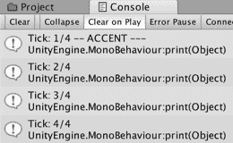

注意，当游戏暂停或挂起时，`dspTime`值会自动冻结 – 因此使用此方法安排的音乐将完美地暂停和恢复，与场景游戏玩法同步。在这个配方中，我们将通过精确安排两个不同声音播放的时间来创建节拍器。请注意，这个配方基于 Unity 文档中`AudioSource.PlayScheduled(...)`方法的某些示例：[`docs.unity3d.com/ScriptReference/AudioSource.PlayScheduled.html`](https://docs.unity3d.com/ScriptReference/AudioSource.PlayScheduled.html)。

# 准备工作

对于这个配方，我们在`04_07`文件夹中提供了两个节拍器声音剪辑。

# 如何做到这一点...

要在给定延迟后播放声音，请执行以下操作：

1.  创建一个新的 Unity 2D 项目并导入提供的声音剪辑文件。

1.  在场景中创建一个包含与**metronome_tick AudioClip**链接的**AudioSource**组件的 GameObject。这可以通过将音乐剪辑从项目面板拖动到**Hierarchy**或**Scene**面板的单个步骤来完成。

1.  重复前面的步骤创建另一个 GameObject，包含一个与 metronome_tick_accent 剪辑链接的**AudioSource**。

1.  对于创建的两个**AudioSources**，取消选中 Play Awake 属性 – 因此这些声音不会在场景加载时立即开始播放。

1.  创建一个名为 MetronomeManager 的空 GameObject。

1.  在新的文件夹`_Scripts`中创建一个名为 Metronome 的 C#脚本类，包含以下代码，并将其作为脚本组件添加到 MetronomeManager GameObject 中：

```cs
using UnityEngine; 

public class Metronome : MonoBehaviour { 
    public AudioSource audioSourceTickBasic; 
    public AudioSource audioSourceTickAccent; 

    public double bpm = 140.0F; 
    public int beatsPerMeasure = 4; 

    private double nextTickTime = 0.0F; 
    private int beatCount; 
    private double beatDuration; 

    void Start() { 
        beatDuration = 60.0F / bpm; 
        beatCount = beatsPerMeasure; // so about to do a beat 
        double startTick = AudioSettings.dspTime; 
        nextTickTime = startTick; 
    } 

    void Update() { 
        if (IsNearlyTimeForNextTick()) 
            BeatAction(); 
    } 

    private bool IsNearlyTimeForNextTick() { 
        float lookAhead = 0.1F; 
        if ((AudioSettings.dspTime + lookAhead) >= nextTickTime) 
            return true; 
        else 
            return false; 
    } 

    private void BeatAction() { 
        beatCount++; 
        string accentMessage = ""; 

        if (beatCount > beatsPerMeasure) 
            accentMessage = AccentBeatAction(); 
        else 
            audioSourceTickBasic.PlayScheduled(nextTickTime); 

        nextTickTime += beatDuration; 
        print("Tick: " + beatCount + "/" + signatureHi + accentMessage); 
    } 

    private string AccentBeatAction() { 
        audioSourceTickAccent.PlayScheduled(nextTickTime); 
        beatCount = 1; 
        return " -- ACCENT ---"; 
    } 
} 
```

1.  在 Hierarchy 中选择 MetronomeManager GameObject。将 metronome_tick 从 Hierarchy 拖动到**Inspector**中的 Audio Source Tick Basic 公共变量，用于 Metronome (Script)组件。

1.  将 metronome_tick_accent 从 Hierarchy 拖动到 Inspector 中的 Audio Source Tick Accent 公共变量，用于 Metronome (Script)组件：

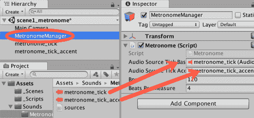

1.  播放场景。你将在（控制台）中看到并听到定时的节拍声，每个计数的第一拍将播放强调（并且更响亮）的声音。

1.  尝试更改 Bpm（每分钟节拍数）设置，以加快或减慢节拍器的速度。或者更改每个强调节拍之间的节拍数，以计数到 3、4 或 6 个节拍。

# 它是如何工作的...

你在场景中添加了两个 **GameIObjects**，包含与基本和强调节拍器的“tick”音乐剪辑链接的 AudioSources。你创建了一个 Metronome C# 脚本类并将其添加到一个空 GameObject 中。你将你的 GameObject 中的两个 **AudioSources** 与脚本组件中的两个公共变量关联起来。

`Start()` 方法计算每个节拍的持续时间（基于 bpm），初始化节拍计数（因此第一个节拍是强调节拍），然后设置 `nextTickTime`，下一个 tick 的时间为当前的 dspTime。

`IsNearlyTimeForNextTick()` 方法返回一个布尔值 true/false，表示是否接近安排下一个 tick 的时间。返回的值基于当前 `dspTime` 是否在 `nextTickTime` 的 1/10^(th) 秒内。如果是，则返回 true。

`Update()` 方法是一个单行 if 语句。如果接近下一个节拍的时间，则调用 `BeatAction()` 方法。

`BeatAction()` 方法执行以下操作：

+   将节拍数加 1

+   将 `accentMessage` 字符串初始化为空（默认值）

+   IF:

    下一个节拍应该是 1（强调），存储 `AccentBeatAction()` 和返回的字符串在 `accentMessage`

+   ELSE（如果不是强调下一个节拍）：

    安排基本的节拍声音

+   计算下一个节拍时间（当前节拍时间 + 每个节拍的持续时间）

+   它在控制台中显示节拍计数信息（包括任何强调信息的字符串）

`AccentBeatAction()` 方法执行三件事：它安排强调节拍声音，重置节拍计数为 1，并返回一个字符串，与节拍信息一起显示（带有文本表示下一个是强调节拍：-- ACCENT ---）。

# 还有更多...

有一些细节你不希望错过。

# 为基本和强调节拍创建即时 AudioSource GameObjects

我们可以通过使用在 *Creating just-in-time AudioSource components at runtime through C# scripting* 菜谱中提出的扩展方法来减少节拍器的 Design-Time 工作量。

首先，将 `ExtensionMethods.cs` C# 脚本类复制到你的节拍器项目中。然后，删除场景中包含 **AudioSource** 组件的两个 **GameObjects**，而是为每个 `AudioClip ()` 声明两个公共变量。最后，我们只需要编写一个 `Awake()` 方法，该方法将在场景中创建所需的 GameObjects，包含基于 **AudioClip** 变量的 **AudioSource**（并且使基本的节拍比强调的节拍更轻）：

```cs
void Awake() { 
   audioSourceTickBasic = this.CreateAudioSource(clipTickBasic, false); 
   audioSourceTickBasic.volume = 0.5F; 

   audioSourceTickAccent = this.CreateAudioSource(clipTickAccent, false); 
   audioSourceTickAccent.volume = 1.00F; 
} 
```

# 通过数据而不是 AudioClips 创建节拍声音

Unity 文档中关于`dspTime`的说明提供了一个有趣的创建节拍器基本和重音节的方法——尽管是编辑音频数据样本本身。查看他们的脚本节拍器在[`docs.unity3d.com/ScriptReference/AudioSettings-dspTime.html`](https://docs.unity3d.com/ScriptReference/AudioSettings-dspTime.html)。

# 将音频音调与动画速度匹配

许多在加速时音调更高，在减速时音调更低的文物。汽车引擎、风扇冷却器、唱机...等等。如果你想在可以动态改变速度的动画对象中模拟这种音效，请遵循这个食谱。

# 准备工作

对于这个食谱，你需要一个动画 3D 对象和一个音频剪辑。请使用`04_08`文件夹中可用的`animatedRocket.fbx`和`engineSound.wav`文件。

# 如何做到这一点...

要根据动画对象的速度更改音频剪辑的音调，请按照以下步骤操作：

1.  创建一个新的 Unity 3D 项目。

1.  在项目面板中创建一个新的 Models 文件夹，并将提供的 animatedRocket.fbx 文件导入到其中。

1.  在项目面板中创建一个新的 Sounds 文件夹，并将提供的音频剪辑 engineSound.wav 导入到其中。

1.  在项目面板中选择 animatedRocket 文件。在 animatedRocket 导入设置的检查器中，单击动画按钮。在动画中选择（唯一的）Take 001 剪辑，并确保选中 Loop Time 选项。单击应用按钮以保存更改。请参阅截图以了解这些设置：

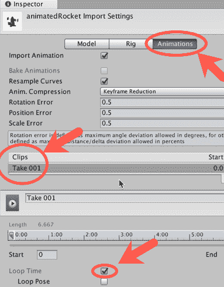

我们不需要检查**Loop Pose**选项的原因是因为我们的动画已经以无缝的方式循环。如果它没有，我们可以检查该选项以自动创建从动画最后一帧到第一帧的无缝过渡。

1.  通过从**项目**面板拖动到场景或**层次结构**面板，将`animatedRocket`的实例添加到场景中的 GameObject。

1.  将一个 AudioSource 组件添加到 engineSound GameObject 中。

1.  在**层次结构**中选择 engineSound，将 engineSound AudioClip 文件从**项目**面板拖动到 Audio Source 组件的**检查器**中的**音频剪辑**参数。确保选中 Loop 选项，取消选中 Play On Awake 选项：

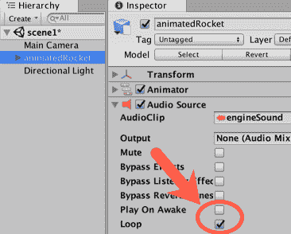

1.  为我们的模型创建一个 Animator Controller。在项目面板中选择 Models 文件夹，并使用创建菜单创建一个名为 Rocket Controller 的新**Animator** Controller 文件。

1.  双击项目面板中的 Rocket Controller 文件以打开**Animator**面板。通过选择菜单选项：创建状态 | 空状态（如图所示）来创建一个新状态：

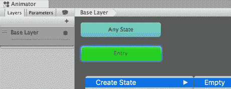

1.  将这个新状态重命名为 spin（在其**检查器**属性中），并在运动字段中将 Take 001 设置为它的动作：

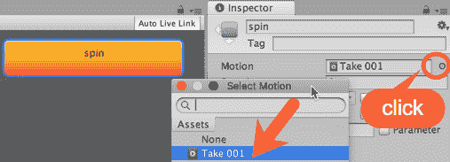

1.  在 **层次结构** 面板中选择 animatedRocket。从项目面板中的 `Models` 文件夹将 Rocket Controller 拖动到 **检查器** 中 Animator 组件的控制器参数。确保在 **检查器** 中未选中应用根运动选项：

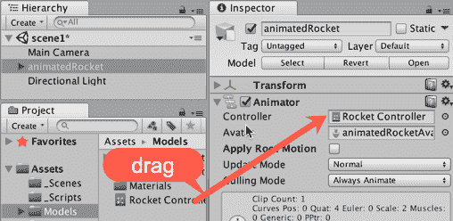

1.  在 `_Scripts` 文件夹中创建一个 C# 脚本类 `ChangePitch`，包含以下代码，并将其作为脚本组件添加到 `animatedRocket` GameObject 中：

```cs
using UnityEngine; 

public class ChangePitch : MonoBehaviour{ 
   public float acceleration = 0.05f; 
   public float minSpeed = 0.0f; 
   public float maxSpeed = 2.0f; 
   public float animationSoundRatio = 1.0f; 

   private float speed = 0.0f; 
   private Animator animator; 
   private AudioSource audioSource; 

    private void Awake() { 
        animator = GetComponent<Animator>(); 
        audioSource = GetComponent<AudioSource>(); 
    } 

    void Start() { 
         speed = animator.speed; 
        AccelerateRocket (0); 
   }      

   void Update() { 
         if (Input.GetKey (KeyCode.Alpha1)) 
            AccelerateRocket(acceleration); 

         if (Input.GetKey (KeyCode.Alpha2)) 
            AccelerateRocket(-acceleration); 
   } 

   public void AccelerateRocket(float acceleration) { 
         speed += acceleration; 
         speed = Mathf.Clamp(speed,minSpeed,maxSpeed); 
         animator.speed = speed; 
         float soundPitch = animator.speed * animationSoundRatio; 
         audioSource.pitch = Mathf.Abs(soundPitch); 
   } 
} 
```

1.  播放场景，并通过按键盘上的数字键 1（加速）和 2（减速）来改变动画速度。音调将相应地改变。

# 它是如何工作的...

你创建了一个 C# 脚本类，**ChangePitch**，并将其实例添加到 **animatedRocket** GameObject 中。它声明了几个变量，其中最重要的是 `acceleration`。

它的 `Awake()` 方法缓存了对 Animator 和 **AudioSource** 兄弟组件的引用。`Start()` 方法从 **Animator** 设置初始速度，并调用 `AccelerateRocket(...)` 方法，传递 0 来计算音频源的音调。

在每一帧中，`Update()` 方法测试键盘键 1 和 2。当检测到时，它们将调用 `AccelerateRocket(...)` 方法，传递适当的加速度的正值或负值。

`AccelerateRocket(...)` 方法通过接收到的参数增加变量速度。`Mathf.Clamp()` 命令将新的速度值限制在最小和最大速度之间。然后，它根据新的速度绝对（正值）值改变 **Animator** 速度和 **Audio Source** 音调。该值随后再次被限制以避免出现负数。如果你希望反转动画，请查看此菜谱提供的解决方案中的代码文件。

请注意，将动画速度和因此音调设置为 0 将导致声音停止，这清楚地表明停止对象的动画也会阻止引擎声音播放。

# 还有更多...

这里有一些关于如何微调和自定义这个菜谱的信息。

# 改变动画/声音比率

如果你希望音频剪辑的音调更多地或更少地受动画速度的影响，请更改检查器中的公共动画/声音比率参数的值。

# 从其他脚本访问函数

`AccelerateRocket(...)` 函数被设置为公共，以便可以从其他脚本访问。例如，我们在 `_Scripts` 文件夹中包含了 `ExternalChangePitch.cs` 脚本。为了说明如何从另一个脚本控制 **ChangePitch** 脚本组件，请执行以下操作：

1.  将此脚本附加到 **主摄像机** GameObject。从层次结构面板中将 **animatedRocket** GameObject 拖动到公共 **Change Pitch Scripted Component** 变量中。

1.  运行场景。

1.  使用 *上* 和 *下* 方向键来控制动画速度（以及音调）。

# 允许反向动画（负速度！）

在动画器面板中，创建一个新的浮点参数，**速度**，初始化为 1.0。在**动画器**面板中选择**旋转状态**，勾选**速度参数乘数**选项并选择**速度**参数。在检查器中，将**最小速度**设置为-2，以允许动画使用负速度。

在**ChangePitch** C#脚本中，将**AccelerateRocket**方法替换为以下内容：

```cs
public void AccelerateRocket(float acceleration) { 
   speed += acceleration;  
   speed = Mathf.Clamp(speed, minSpeed, maxSpeed); 

   animator.SetFloat("Speed", speed); 
   float soundPitch = speed * animationSoundRatio; 
   audioSource.pitch = Mathf.Abs(soundPitch); 
} 
```

现在当你使用键 1（加速）和 2（减速）时，你实际上可以将速度减速到零然后继续反向动画。

# 使用 Reverb Zones 模拟声学环境

一旦你创建了你的级别几何形状并且场景看起来正是你想要的，你可能希望你的声音效果与那种外观相匹配。声音的行为取决于其投影的环境，因此使其相应地产生回声可能是一个好主意。在这个菜谱中，我们将通过使用 Reverb Zones 来处理这种声学效果。

# 准备工作

对于这个菜谱，我们准备了`ReverbZone.unitypackage`文件，其中包含一个名为**reverbScene**的基本级别和一个预制件，Signal。该包位于`04_09`文件夹中。

# 如何做到这一点...

按照以下步骤模拟隧道的声学景观：

1.  创建一个新的 Unity 3D 项目。

1.  将提供的**Unity**包**ReverbZone**导入到你的项目中。

1.  从项目面板中，打开**reverbScene**——它在`ReverbZones`文件夹中的`_Scenes`文件夹中。这个场景为你提供了一个隧道，和一个可控制的角色（*W A S D*键和*Shift*键用于奔跑）。

1.  从项目面板中，将 Signal 预制件拖放到层次结构中——它在`ReverbZones`文件夹中的`_Prefabs`文件夹中。这将向场景添加一个发声对象。将其放置在隧道的中心：

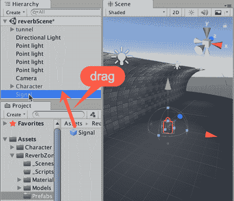

1.  将**Signal**游戏对象复制五次并分布在整个隧道中（在每个入口外留一个副本）：


1.  在层次结构面板中，使用**创建菜单** | **音频** | **音频混响区域**来向场景添加一个**混响区域**。然后将这个新游戏对象放置在隧道的中心。

如果已经有一个 GameObject 位于你想要放置另一个 GameObject 的位置，请使用菜单 GameObject | Move To View。由于我们的 Signal GameObject 位于隧道的中间，我们可以双击该 GameObject，然后单击 Reverb Zone 并移动到视图——将 Reverb Zone 对象移动到相同的位置。

1.  选择**混响区域**游戏对象。在检查器面板中，将**混响区域**组件参数更改为以下值：**最小距离** = `6`，**最大距离** = `18`，和**预设** = `StoneCorridor`：

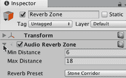

1.  播放场景。当你穿过隧道时，你会在混响区域区域内听到音频回声。

# 它是如何工作的...

一旦定位，音频混响区域将对其半径内的所有音频源应用音频过滤器。

# 更多内容...

这里有一些更多选项供您尝试。

# 将音频混响区域组件附加到音频源

您可以不创建音频混响区域 GameObject，而是通过**组件** | **音频** | **音频混响区域**菜单将其附加到发声对象（在我们的案例中，是 Signal）作为组件。在这种情况下，混响区域将围绕其父 GameObject 单独设置。

# 创建自己的混响设置

Unity 自带几个**混响预设**。我们使用了**石质走廊**，但您的场景可能需要更不强烈（例如房间）或更激进（例如精神错乱）的预设。如果这些预设仍然无法重现您心中的效果，请将其更改为用户预设，并根据您的意愿编辑其参数。

# 使用音频混音器添加音量控制

声音音量调整可能是一个非常重要的功能，尤其是如果您的游戏是独立游戏。毕竟，玩家不得不访问**操作系统**音量控制可能会非常令人沮丧。在这个配方中，我们将使用音频混音器功能为音乐和音效创建独立的音量控制。

# 准备工作

对于这个配方，我们提供了一个名为`VolumeControl.unitypackage`的 Unity 包，其中包含一个具有配乐音乐和音效的初始场景。文件位于`04_10`文件夹中。

# 如何做到这一点...

要将音量控制滑块添加到您的场景中，请按照以下步骤操作：

1.  创建一个新的 Unity 3D 项目。

1.  将提供的**Unity**包，**音量**，导入到您的项目中。

1.  从**项目**面板文件夹中打开**音量**场景，**音量控制** | `_Scenes`。

1.  播放场景，并使用*W A S D*键（按*Shift*键跑步）走向隧道中半透明的绿色墙。您将能够听到：

    +   一个循环的音乐配乐

    +   钟声响起

    +   当角色与墙壁碰撞时发出机器人语音

1.  在**项目**面板中，使用创建菜单添加一个**音频混音器**文件。将此新文件重命名为**主混音器**。

1.  双击**主混音器**以打开**音频混音器**面板。

1.  在**音频混音器**面板的**分组**部分，突出显示**主**，然后单击+（加号）以向**主**组添加子项。将此子项命名为**音乐**。重复这些操作以添加名为**FX**的**主**的第二个子项：

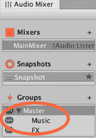

1.  在**音频混音器**面板的**混音器**部分，突出显示**主混音器**，然后单击+（加号）以向**混音器**组添加新项。将此重命名为**音乐混音器**（您可能需要通过项目面板重命名，因为您已通过此过程创建了一个新的音频混音器文件）。

1.  将**音乐混音器**拖放到**主混音器**（将其作为子项），并在弹出对话框窗口中选择音乐作为其输出。

1.  在**音频混音器**面板的**混音器**部分，突出显示**主混音器**，然后单击+（加号）以向**混音器**组添加新项。将此命名为**FxMixer**。

1.  将（拖动）**FxMixer**拖放到**主混音器**上，并在弹出对话框窗口中选择 FX 作为其输出。

1.  选择 MusicMixer。选择其主组并添加一个名为 Soundtrack 的子项。

1.  选择**FxMixer**，并为其**主**组添加两个子项：一个命名为 Speech，另一个命名为 Bells：

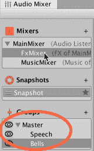

1.  在**层级**面板中选择**DialogueTrigger**GameObject。在**检查器**中，将它的**音频源**组件输出轨道更改为**FxMixer** | **Speech**：

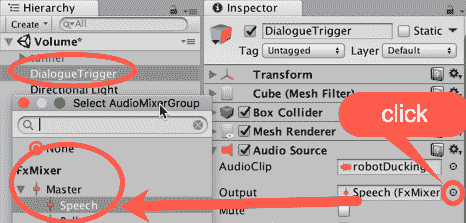

1.  在**层级**面板中选择**Soundtrack**GameObject。在**检查器**中，将它的音频源组件**输出**轨道更改为**MusicMixer** | **Soundtrack**。

1.  从**项目**面板的**预制体**文件夹中选择**Signal**。在**检查器**中，将它的音频源组件输出轨道更改为 FxMixer | Bells。

1.  在**音频混合器**面板中选择**主混合器**，并选择其**主**轨道。在**检查器**面板中，右键单击**衰减**组件中的**音量**。从弹出上下文菜单中选择**暴露**（主）**音量**到脚本：

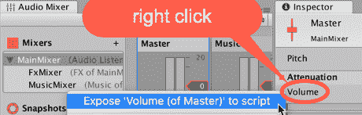

1.  重复此操作以将**音量**暴露给**音乐**和 FX 组的脚本。

1.  在**音频混合器**面板的右上角，你应该看到**暴露参数**（三个）。点击下拉图标，并按以下名称重命名：MyExposedParam 为 OverallVolume；MyExposedParam1 为 MusicVolume，MyExposedParam2 为 FxVolume。注意三个参数的顺序可能不匹配你添加它们的顺序，所以请确保右侧灰色条目的名称正确对应：

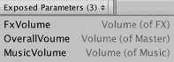

1.  在**层级**面板中，使用**创建**下拉菜单将**UI 面板**添加到场景（菜单：**创建** | **UI** | **面板**）。Unity 将自动为该面板添加一个 Canvas 父级。

1.  在**层级**面板中，创建一个 UI Slider 到场景（菜单：**创建** | **UI** | **Slider**）。将其设置为**面板**对象的子项。将此滑块重命名为**Slider-overall**。将滑块的 Min Value 设置为`0.000025`（或`2.5e-05`）。

1.  复制它并将其新副本重命名为 Slider-music。在**检查器**面板中，**Rect Transform**组件，将它的 Pos Y 参数更改为`-40`。

1.  复制 Slider-music 并将其新副本重命名为**Slider-fx**。将它的**Pos Y**参数更改为`-70`：

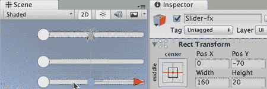

1.  在`_Scripts`文件夹中创建一个 C#脚本类，**VolumeControl**，包含以下代码，并将其作为脚本组件添加到**主相机**GameObject：

```cs
using UnityEngine; 
using UnityEngine.Audio; 

public class VolumeControl : MonoBehaviour { 
    public GameObject panel; 
   public AudioMixer myMixer; 
   private bool isPaused = false; 

   void Start(){ 
        panel.SetActive(false); 

        ON_CHANGE_OverallVol(0.01F); 
        ON_CHANGE_MusicVol(0.01F); 
        ON_CHANGE_FxVol(0.01F); 
   } 

   void Update() { 
         if (Input.GetKeyUp (KeyCode.Escape)) { 
               panel.SetActive(!panel.activeInHierarchy); 

               if(isPaused) 
                     Time.timeScale = 1.0f; 
               else 
                     Time.timeScale = 0.0f; 

               isPaused = !isPaused; 
         }            
   }      

    public void ON_CHANGE_OverallVol(float vol) { 
        myMixer.SetFloat("OverallVolume", Mathf.Log10(vol) * 20f); 
    } 

   public void ON_CHANGE_MusicVol(float vol) { 
         myMixer.SetFloat ("MusicVolume", Mathf.Log10(vol) * 20f); 
   } 

   public void ON_CHANGE_FxVol(float vol) { 
         myMixer.SetFloat ("FxVolume", Mathf.Log10(vol) * 20f); 
   } 
} 
```

1.  在**主相机**选项卡中选择**层级**面板，将**面板**GameObject 拖入检查器以设置公共**面板**变量。

1.  在**层级**面板中选择**主相机**，将**主混合器**从项目面板拖入检查器以设置公共 My Mixer 变量。

1.  选择**OverallSlider**组件。在**On Value Changed**列表下方，点击加号以添加一个动作。从**Hierarchy**面板中，将 Main Camera 拖入对象槽，并使用下拉菜单选择 VolumeControl | ON_CHANGE_OverallVol 选项。  为了测试目的，将适当的选择器从仅运行时更改为编辑器和运行时。

1.  使用 MusicSlider 和 FxSlider 重复前面的步骤，但这次，从下拉菜单中选择 ON_CHANGE_MusicVol 和 ON_CHANGE_FxVol 选项，分别。

1.  播放场景。您可以通过按键盘上的*ESCAPE*键来访问滑块，并从那里调整音量设置。

# 它是如何工作的...

**音频混音器**功能的工作方式与**数字音频工作站**类似，例如**Logic**和**Sonar**。通过音频混音器，您可以通过将它们路由到特定的组来组织和管理工作元素，这些组可以具有可以调整的独立音频轨道，从而允许调整音量级别和音效。

通过将我们的音频剪辑组织并路由到两个组（音乐和音效），我们建立了 MainMixer 作为音量统一的控制器。然后，我们使用音频混音器公开**MainMixer**中每个轨道的音量级别，使它们可供我们的脚本访问。

此外，我们设置了一个基本的用户界面，包含三个滑块，当使用时，将它们的浮点值（介于 0.000025 和 1 之间）作为参数传递到脚本中的三个特定函数：ON_CHANGE_MusicVol、ON_CHANGE_FxVol 和 ON_CHANGE_OverallVol。这些函数反过来使用 SetFloat 命令在运行时有效地更改音量级别。然而，在传递新的音量级别之前，脚本将线性值（介于 0.000025 和 1 之间）转换为音频混音器使用的分贝级别。这种转换是通过 log(x) * 20 数学函数计算的。

关于将线性值转换为分贝级别以及相反的问题的完整解释，请查看 Aaron Brown 在[`www.playdotsound.com/portfolio-item/decibel-db-to-float-value-calculator-making-sense-of-linear-values-in-audio-tools/`](http://www.playdotsound.com/portfolio-item/decibel-db-to-float-value-calculator-making-sense-of-linear-values-in-audio-tools/)上的优秀文章。

如果其中一个滑块似乎不起作用，请检查`SetFloat(...)`的第一个参数名称是否与**AudioMixer**中暴露的参数匹配——任何拼写差异都意味着更改滑块的 on-change 函数将不会在**Audio Mixer**中更改值。例如，如果命名的暴露参数被错误地命名为“**OveralVolume**”（缺少一个“l”），则由于拼写不匹配，此响应滑块更改的语句将不起作用：

```cs
myMixer.SetFloat ("OverallVolume ", Mathf.Log10(vol) * 20f); 
```

`VolumeControl`脚本包含代码，根据玩家是否按*ESCAPE*键激活/停用音量控制滑块来启用和禁用 UI 和**EventSystem**。

由于我们的 VolumeControl 脚本设置了音乐和效果音轨的最大音量级别，因此在设计时不应手动更改 MainMixer 的任何音轨音量。对于一般调整，请使用辅助的 MusicMixer 和 FxMixer 混音器。

# 更多内容...

这里有一些关于音频混音器的额外信息。

# 播放音频制作

对于公开的参数有许多创意用途。例如，我们可以向音频通道添加效果，如**失真**、**镶边**和**合唱**，使用户能够操作虚拟音表/混音板。

# 参见

本章中关于*使用快照制作动态音轨*的配方。

本章中关于*在游戏中平衡音频与 ducking*。

# 使用快照制作动态音轨

动态音轨是根据游戏中玩家发生的情况而变化的音轨，音乐上反映了角色的冒险地点或时刻。在这个配方中，我们将实现一个音轨，它将改变两次；第一次是在进入隧道时，第二次是在出来时。为了实现这一点，我们将使用**音频混音器**的**快照**功能。

快照是一种保存您的**音频混音器**状态的方法，保留音量级别、音频效果等的偏好设置。我们可以通过 C#脚本访问这些状态，创建混音之间的过渡，并为玩家旅程的每个时刻提供所需的音效氛围。

# 准备工作

对于这个配方，我们准备了一个基本的游戏关卡，包含在名为`DynamicSoundtrack`的 Unity 包中，以及两个`.ogg`格式的音轨音频剪辑：`Theme01_Percussion`和`Theme01_Synths`。所有这些文件都可以在`04_11`文件夹中找到。

# 如何操作...

要制作动态音轨，请遵循以下步骤：

1.  创建一个新的 Unity 3D 项目。

1.  将提供的 Unity 包 DynamicSoundtrack 以及两个`.ogg`文件导入到您的项目中。

1.  从**项目**面板文件夹打开 Dynamic 场景，DynamicSoundtrack | _Scenes。

1.  在项目面板中，使用创建菜单添加一个音频混音器文件。将此新文件重命名为 Mixer-music。双击它以打开音频混音器面板。

1.  在音频混音器面板的组部分，突出显示主组并单击+（加号）以向主组添加子项。将此子项命名为 Percussion。重复这些操作以向主组添加第二个子项，命名为 Synths：

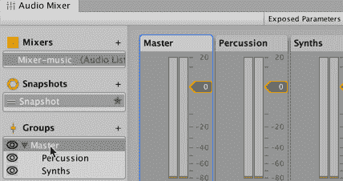

1.  从**层次结构**视图中创建一个新的**空**GameObject。将其命名为 Music。

1.  在场景中创建一个包含**AudioSource**组件的 GameObject，该组件链接到 Theme01_Percussion **AudioClip**。这可以通过将音乐剪辑从项目面板拖动到**层次结构**或场景面板的单一步骤完成。将此新 GameObject 作为子对象添加到**Music**GameObject 的**层次结构**中。

1.  确保在**层次结构**中选择了 Theme01_Percussion 游戏对象。在**音频源**组件的检查器中，将输出更改为 Percussion（**音乐混合器**），确保**唤醒时播放**选项被选中，选中**循环**选项，并确保其**空间混合**设置为 2D：

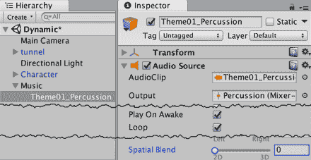

1.  对 Theme01_Synths 的**AudioClip**重复前两个步骤——将**输出**设置为 Synths（**音乐混合器**）。

1.  打开**音频混合器**并播放场景。我们现在将使用混合器为场景的开始设置音轨。在场景播放时，点击**音频混合器**顶部的**编辑**在播放模式按钮，如图所示。将**合成器**轨道的音量降低到**-30 dB**：

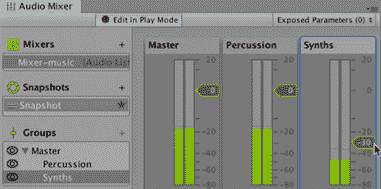

1.  选择打击乐轨道。点击**衰减**的添加..按钮，并添加一个**高通**效果。从**检查器**视图，将**高通**效果的**截止**频率更改为**544.00 Hz**：

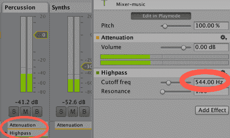

1.  到目前为止的每一次更改，都分配给了当前的快照。从快照视图，在当前快照上右键单击并重命名为 Start。点击+（加号）符号以复制当前快照，并将此副本重命名为 Tunnel：

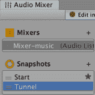

1.  选择**隧道**快照，并选择打击乐组的**高通**效果。在检查器中，将**截止频率**设置为**10.00** Hz：

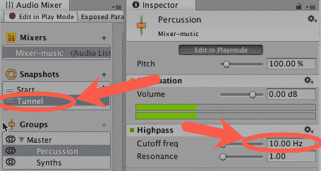

1.  在**隧道**和**开始**快照之间切换。你将能够听到差异。

1.  复制**隧道**快照，将其重命名为**OtherSide**，并选择它。

1.  将**合成器**轨道的音量提升到 0 dB。

1.  现在我们有了三个**快照**，是时候创建触发器以在它们之间进行转换了。

1.  停止运行场景（以便将**层次结构**中的更改存储到场景中）。

1.  在**层次结构**中创建一个**Cube**游戏对象（菜单：**创建** | **3D 对象** | **立方体**）。将其命名为 Cube-tunnel-trigger。

1.  在检查器中，访问 Cube-tunnel-trigger 游戏对象的 Box Collider 组件，并检查**是触发器**选项。取消选中其**网格渲染器**组件。调整其大小和位置以适应场景隧道内部。你可能发现场景线框视图对立方体碰撞器的定位很有用：

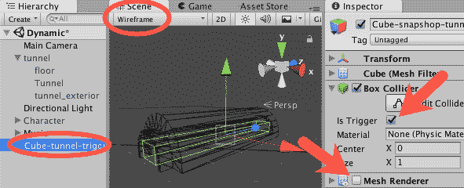

1.  将立方体**Cube-tunnel-trigger**复制两次，并将它们重命名为**cube Cube-start-trigger**和**cube Cube-otherside-trigger**。调整它们的大小和位置，使它们占据隧道入口（人物所在的位置）和出口之后的空间：

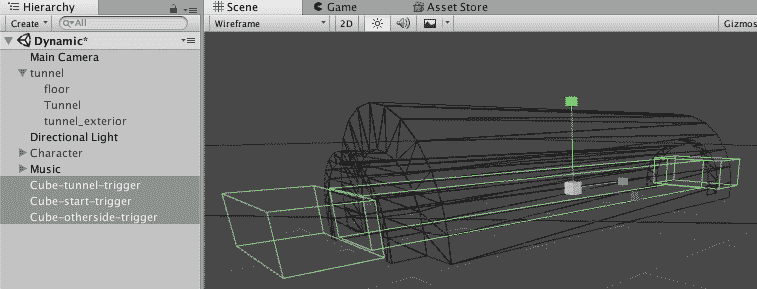

1.  在 _Scripts 文件夹中创建一个 C#脚本类，`SnapshotTrigger`，包含以下代码：

```cs
using UnityEngine; 
using UnityEngine.Audio; 

public class SnapshotTrigger : MonoBehaviour { 
   public AudioMixerSnapshot snapshot; 
   public float crossfade; 

   private void OnTriggerEnter(Collider other) { 
         snapshot.TransitionTo (crossfade); 
   } 
} 
```

1.  将`SnapshotTrigger`实例添加到所有三个触发立方体（隧道触发立方体、起点触发立方体和另一侧触发立方体）。

1.  选择**隧道触发立方体**。从**快照触发器（脚本）组件的**检查器中，将快照设置为**隧道**，并将**交叉淡入**设置为 2：

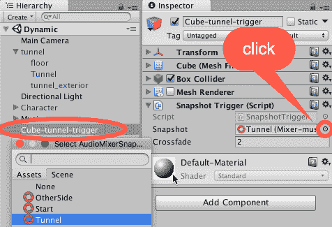

1.  通过将它们的**快照**分别设置为**开始**和**另一侧**来更改**起点触发立方体**和**另一侧触发立方体**，同时将**交叉淡入**设置为`2`。

1.  测试场景。背景音乐将在角色从起点移动到隧道，然后从另一侧出来时改变。

# 它是如何工作的...

快照功能允许你保存**音频混音器**状态（包括所有音量级别和每个滤波器设置），这样你就可以在**运行时**更改这些混音偏好，使音频设计更适合特定的位置或游戏设置。对于这个菜谱，我们为玩家旅程中的不同时刻创建了三个**快照**：

+   在进入隧道之前

+   隧道内

+   隧道外

我们使用了**高通**滤波器来使初始**快照**不那么强烈。我们还提高了合成音轨的音量，以强调隧道外的开阔环境。我们的目标是让音频混音的变化帮助为游戏设定正确的氛围。

为了激活我们的快照，我们放置了**触发**碰撞体，其中包含我们的**快照触发器**脚本组件，我们设置了所需的快照和过渡（交叉淡入）到下一个快照所需的时间（秒）。实际上，我们脚本中的功能非常直接——`snapshot.TransitionTo(crossfade)`代码行简单地开始一个持续`crossfade`秒的过渡到所需的快照。

# 还有更多...

这里有一些关于如何微调和自定义这个菜谱的信息。

# 减少对多个音频剪辑的需求

你可能已经注意到，当**高通滤波器的截止频率**设置为`10.00 Hz`时，`Theme01_Percussion`音频剪辑听起来有多么不同。这是因为高通滤波器，正如其名称所暗示的，切断了音频信号的较低频率。在这种情况下，它将低音鼓衰减到不可听见的水平，同时保持摇铃可听。通过**低通滤波器**可以达到相反的效果。一个主要的好处是

在同一个音频剪辑中拥有两个独立音轨的机会。

# 处理音频文件格式和压缩率

为了避免音频质量下降，你应该使用适合目标平台的适当文件格式导入你的声音剪辑。如果你不确定使用哪种格式，请查看 Unity 关于此主题的文档，链接为[`docs.unity3d.com/Manual/AudioFiles.html`](http://docs.unity3d.com/Manual/AudioFiles.html)。

# 将快照应用于背景噪声

尽管我们已经将快照应用到我们的音乐音轨上，背景噪音也可以受益匪浅。如果你的角色穿越了显著不同的地方，从开阔空间过渡到室内环境，你应该考虑将快照应用到你的环境音频混音中。但是，请注意为音乐和环境创建单独的**音频混音器**——除非你不在乎音乐和环境的混音。

与同一快照绑定的声音

# 使用效果进行创意

在这个菜谱中，我们提到了高通和低通滤波器。然而，有许多效果可以使音频片段听起来截然不同。实验吧！尝试应用如失真、镶边和合唱等效果。实际上，我们鼓励你尝试每一个效果，玩转它们的设置。这些效果的创意使用可以为单个音频片段带来不同的表现。

# 参见

本章中的**添加音量控制与音频混音器**菜谱。

本章中的**平衡音轨音量与 Ducking**菜谱。

# 使用 Ducking 平衡游戏内音频

背景音乐在建立正确氛围方面可能很重要，但有时其他音频片段应该被强调，音乐音量在片段播放期间降低。这种效果被称为** ducking**。你可能需要它来产生戏剧效果（模拟爆炸发生后听力受损），或者你可能想确保玩家听到作为音频速度剪辑呈现的特定信息。在这个菜谱中，我们将学习如何在播放特定声音消息时通过 ducking 来强调一段对话。为了达到这种效果，我们将使用**音频混音器**在轨道之间传递信息。

# 准备工作

对于这个菜谱，我们提供了`soundtrack.mp3`音频剪辑和一个名为 Ducking.unitypackage 的 Unity 包，其中包含一个初始场景。所有这些文件都位于`04_12`文件夹内。

# 如何操作...

要将音频 Ducking 应用到你的音轨上，请按照以下步骤操作：

1.  创建一个新的**Unity 3D**项目。

1.  将提供的**Unity**包**Ducking**和`soundtrack.mp3`文件导入到你的项目中。

1.  从**项目**面板文件夹中打开 Ducking 场景，**Ducking** | `_Scenes`。

1.  通过播放场景并使用*W、A、S*和*D*键（按*Shift*键跑步）进入运行时，走向隧道中半透明的绿色墙。当角色与绿色墙碰撞时，你会听到机器人 Ducking 语音音频剪辑播放（“这是你的船长在说话...”）。然后停止场景播放以返回设计时。

1.  在场景中创建一个**GameObject**，其中包含一个与音轨**AudioClip**链接的**AudioSource**组件。这可以通过将音乐剪辑从**项目**面板拖动到**层次结构**或**场景**面板来完成。

1.  确保在**层次结构**中选择 GameObject 音轨。在**检查器**中，对于**音频源**组件，确保已勾选**唤醒时播放**选项，勾选**循环**选项，并确保其**空间混合**设置为 2D（如果需要，请参阅前一个菜谱中关于打击乐器 GameObject 相同操作的截图）。

1.  再次播放场景。音轨音乐应该正在播放。然后停止场景播放以返回到**设计时间**。

1.  在**项目**面板中，使用**创建**菜单添加一个**音频混音器**文件。将这个新文件重命名为**MainMixer**。

1.  双击**MainMixer**以打开**音频混音器**面板。

1.  在**音频混音器**面板的**组**部分，高亮显示**主**并点击+（加号）来向**主**组添加一个子项。将此子项命名为音乐。重复这些操作以添加主组的第二个子项，命名为 FX。向**主**组添加第三个子项，命名为输入：

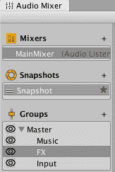

1.  在音频混音器视图中，通过点击+（加号）来添加一个新的**混音器**，将一个新的**混音器**添加到项目中。将其命名为**MusicMixer**。将其拖入**MainMixer**（成为其子项）并选择**音乐**组作为其输出：

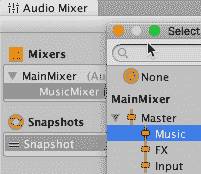

1.  重复上一步，将另一个名为**FxMixer**的子项添加到项目中，选择 FX 组作为输出。

1.  选择**MusicMixer**。选择其**主**组并添加一个名为`Soundtrack`的子项：


1.  选择**FxMixer**并添加一个名为**Bells**的子项。

1.  从**层次结构**视图中选择**DialogueTrigger GameObject**。在**检查器**中，将输出轨道更改为**MainMixer** | **输入**，对于**音频源**组件：

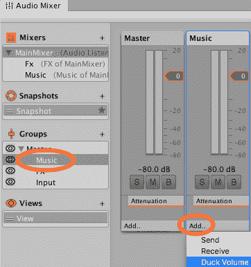

1.  选择**Soundtrack** GameObject。在**检查器**中，对于**音频** **源**组件，将其输出轨道更改为**MusicMixer** | **Soundtrack**。

1.  从项目面板中的**降低音量** | **预制件**文件夹中选择信号预制件。在**检查器**中，将其**音频源**组件**输出**设置为**FxMixer** | **Bells**。

1.  打开**音频混音器**窗口。选择**MainMixer**，选择音乐轨道控制器，右键点击**衰减**，并使用上下文菜单，添加**降低音量**效果：

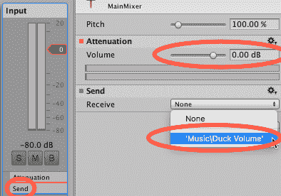

1.  选择输入轨道，右键点击**衰减**，并使用上下文菜单，添加**发送**。

1.  在仍然选择输入轨道的情况下，转到**检查器**视图，并将**发送**中的接收设置更改为**音乐\降低音量**，并将其**发送**级别设置为 0.00 db。

1.  选择**音乐**轨道。从**检查器**视图，按照以下方式更改**降低音量**的设置：**阈值**：`-40.00 db`，**比率**：`300.00%`，**攻击时间**：`100.00 ms`，**释放时间**：`200.00 ms`：

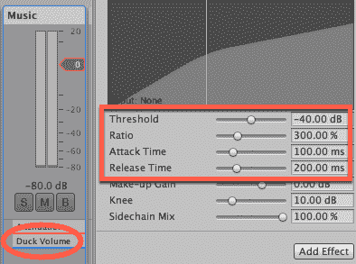

1.  再次测试场景。进入触发对象将导致配乐音量显著降低，两秒后恢复到原始音量。

# 它是如何工作的...

在这个菜谱中，除了音乐和音效之外，我们还创建了一个名为“输入”的组，我们将触发鸭音量效果的音频剪辑路由到我们的音乐轨道。鸭音量效果会在接收到比其阈值设置更响亮的输入时改变轨道的音量。在我们的情况下，我们将输入轨道作为输入，并调整设置，以便在接收到输入后的 0.1 秒内降低音量，在输入停止后的 2 秒后恢复到原始值。音量降低的量由我们的 300.00%比率确定。调整设置值将更好地了解每个参数对最终结果的影响。此外，确保在触发声音播放时可视化图形。您将能够看到输入声音如何通过阈值，触发效果。

轨道组织得很好，其他声音剪辑（除语音外）不会影响音乐的音量——但每个音乐剪辑都会受到发送到输入轨道的音频剪辑的影响。

# 参见

本章中的*使用音频混音器添加音量控制*菜谱。

本章中的*使用快照制作动态配乐*菜谱。

# 从样本频谱数据中进行的音频可视化

Unity 音频系统允许我们通过`AudioSource.GetSpectrumData(...)`方法访问音乐数据——这给了我们使用这些数据来展示所听到的整体声音的运行时可视化（来自**AudioListener**），或者由单个**AudioSources**播放的个别声音。

截图显示了使用 Unity 提供的示例脚本绘制的线条([`docs.unity3d.com/ScriptReference/AudioSource.GetSpectrumData.html`](https://docs.unity3d.com/ScriptReference/AudioSource.GetSpectrumData.html))：

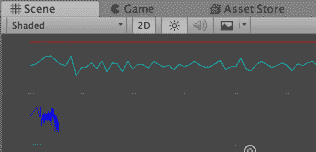

然而，在那段示例代码中，他们使用`Debug.DrawLine()`只会在在 Unity 编辑器中运行游戏时（不是最终构建）出现在场景面板中，因此游戏玩家看不到。在这个菜谱中，我们将使用相同的频谱数据，并在游戏面板中创建一个**运行时**音频频谱可视化。我们将通过创建一排 512 个小立方体来实现这一点，然后根据播放的**AudioSource**组件的 512 个音频数据样本在每个帧中改变它们的高度。

# 准备工作

对于这个菜谱，我们在`04_13`文件夹中提供了几个 140 bmp 采样免费音乐剪辑。

# 如何做...

要安排在给定延迟后播放声音，请执行以下操作：

1.  创建一个新的 3D 项目并导入提供的音频剪辑文件。

1.  在检查器中，将主相机的背景设置为黑色。

1.  将主相机变换位置设置为（224，50，-200）。

1.  将主摄像机 Camera 组件的设置设置为：投影 = 透视，视场角 60，裁剪平面 0.3 - 300。

1.  将 **DirectionalLight** 添加到场景中。

1.  在场景中创建一个新的空 GameObject，命名为 visualizer。向此 GameObject 添加 **AudioSource** 组件，并将其 **AudioClip** 设置为提供的 140 个 bmp 循环之一。

1.  在新的文件夹 _Scripts 中创建一个 C# 脚本类，**SpectrumCubes**，包含以下代码，并将其作为脚本组件添加到 visualizer GameObject 中：

```cs
using UnityEngine; 

public class SpectrumCubes : MonoBehaviour  
{ 
    const int NUM_SAMPLES = 512; 
    public Color displayColor; 
    public float multiplier = 5000; 
    public float startY; 
    public float maxHeight = 50; 
    private AudioSource audioSource; 
    private float[] spectrum = new float[NUM_SAMPLES]; 
    private GameObject[] cubes = new GameObject[NUM_SAMPLES]; 

    void Awake() { 
        audioSource = GetComponent<AudioSource>(); 
        CreateCubes(); 
    } 

    void Update() { 
        audioSource.GetSpectrumData(spectrum, 0, FFTWindow.BlackmanHarris); 
        UpdateCubeHeights(); 
    } 

    private void UpdateCubeHeights() { 
        for (int i = 0; i < NUM_SAMPLES; i++) 
        { 
            Vector3 oldScale = cubes[i].transform.localScale; 
            Vector3 scaler = new Vector3(oldScale.x, HeightFromSample(spectrum[i]), oldScale.z); 
            cubes[i].transform.localScale = scaler; 
            Vector3 oldPosition = cubes[i].transform.position; 
            float newY = startY + cubes[i].transform.localScale.y / 2; 
            Vector3 newPosition = new Vector3(oldPosition.x, newY, oldPosition.z); 
            cubes[i].transform.position = newPosition; 
        } 
    } 

    private float HeightFromSample(float sample) { 
        float height = 2 + (sample * multiplier); 
        return Mathf.Clamp(height, 0, maxHeight); 
    } 

    private void CreateCubes() { 
        for (int i = 0; i < NUM_SAMPLES; i++) { 
            GameObject cube = GameObject.CreatePrimitive(PrimitiveType.Cube); 
            cube.transform.parent = transform; 
            cube.name = "SampleCube" + i; 

            Renderer cubeRenderer = cube.GetComponent<Renderer>(); 
            cubeRenderer.material = new Material(Shader.Find("Specular")); 
            cubeRenderer.sharedMaterial.color = displayColor; 

            float x = 0.9f * i; 
            float y = startY; 
            float z = 0; 
            cube.transform.position = new Vector3(x, y, z); 

            cubes[i] = cube; 
        } 
    } 

} 
```

1.  在 **Hierarchy** 中选择 **visualizer** GameObject，点击从 **Inspector Display Color** 公共变量中选择一个可视化颜色用于 **SpectrumCubes** (脚本) 组件。

1.  运行场景——您应该看到立方体上下跳动，展示正在播放的声音的音谱的运行时可视化。

# 它是如何工作的...

您创建了一个 C# 脚本类 `SpectrumCubes`。您创建了一个具有 **AudioSource** 组件的 GameObject，以及您脚本类的实例。所有工作都是由 `SpectrumCubes` C# 脚本类中的方法完成的，所以以下各节将解释这些方法。

# void Awake() 方法

此方法缓存了对同级 **AudioSource** 组件的引用，然后调用 `CreateCubes()` 方法。

# void CreateCubes() 方法

此方法循环样本数量（默认为 512），沿 X 轴创建一个 3D 立方体 GameObject，逐行排列。每个立方体以 "Cube<i>"（其中 "i" 从 0 到 511）命名，然后将其作为父对象添加到 visualizer GameObject（因为脚本方法在此 GameObject 中运行）。然后，每个立方体的渲染器颜色设置为公共 displayColor 参数的值。然后，立方体根据循环次数在 X 轴上定位，位置值为公共 startY 参数（因此多个可视化可以位于屏幕的不同部分），Z = 0。最后，将新立方体 GameObject 的引用存储在 cubes[] 数组中。

# void Update() 方法

此方法中的每一帧通过调用 `GetSpectrumData(...)` 更新 `spectrum[]` 数组中的值。在我们的示例中，使用了 `FFTWindow.BlackmanHarris` 频率窗口技术。然后调用 `UpdateCubeHeights()` 方法。

# void UpdateCubeHeights() 方法

此方法循环每个立方体，将其高度设置为对应于 `spectrum[]` 数组中音频数据值的缩放值。立方体的 Y 值通过 `HeightFromSample(spectrum[i])` 方法返回的值进行缩放。然后，立方体从 `startY` 的值向上移动（其变换位置被设置），移动距离为其高度的一半——这样所有的缩放都会向上（而不是上下）进行——这是为了使我们的立方体光谱的底部保持平坦的线条。

# float HeightFromSample(float) 方法

方法 `HeightFromSample(float)` 进行简单的计算（样本值乘以公共参数乘数），然后加上两个最小值之和。函数返回的值是此结果，限制在`maxHeight`公共参数内（通过`Mathf.Clamp(...)`方法）。

# 更多内容...

有些细节你不希望错过。

# 向第二个 AudioSource 添加可视化

脚本编写得很容易在场景中添加多个可视化。因此，为了在场景中为第二个**AudioClip**创建第二个可视化器，请执行以下操作：

1.  复制可视化 GameObject。

1.  将不同的 AudioClip 从**项目**面板拖动到新 GameObject 的**音频源**组件中。

1.  将**检查器**中的起始**Y**公共参数设置为 60（这样新的一行立方体将位于原始行上方）。

1.  在**检查器**中，为**SpectrumCubes (脚本)**组件选择不同的显示颜色公共变量：

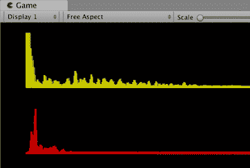

# 尝试不同的 FFT（快速傅里叶变换）窗口类型

对于音频数据的频率分析，有几种不同的方法，我们的食谱目前使用的是`FFTWindow.BlackmanHarris`版本。从 Unity 的`FFTWindow`文档页面（[`docs.unity3d.com/ScriptReference/FFTWindow.html`](https://docs.unity3d.com/ScriptReference/FFTWindow.html)）学习（并尝试！）一些其他方法。

# 同步同时和顺序音乐以创建简单的 140 bpm 音乐循环管理器

通过精确调度声音使用`dspTime`食谱创建节拍器，展示了如何通过使用`AudioSource.PlayScheduled(...)`方法和`AudioSettings.dspTime`值来安排声音播放时间，创建节拍器。我们还需要精确调度音频开始时间的另一种情况是确保从一首音乐轨道平滑过渡到另一首，或者确保同时播放的音乐轨道同步进行。

在这个食谱中，我们将创建一个简单的 4 轨 140 bpm 音乐管理器，在固定时间后开始播放新的声音——结果是轨道完美匹配，重叠的部分同步进行：


# 准备工作

对于这个食谱，我们在`04_14`文件夹中提供了几个 140 bmp 采样免费音乐片段。

# 如何做到这一点...

要创建一个音乐循环管理器，请执行以下操作：

1.  创建一个新的 Unity 3D 项目并导入提供的音频剪辑文件。

1.  在场景中创建四个包含**AudioSource**组件的 GameObject，这些组件连接到 140 bpm 文件提供的不同**AudioClip**循环。这可以通过从**项目**面板将音乐剪辑拖动到**层次结构**或场景面板的单步操作来完成。

1.  在检查器中，取消选中所有四个**AudioSource**组件的**在唤醒时播放**参数（这样它们就不会在我们告诉它们之前开始播放）。

1.  在场景中添加一个新的空**GameObject**，命名为**musicScheduler**。

1.  在一个新文件夹 `_Scripts` 中创建一个 C#脚本类 **LoopScheduler**，包含以下代码，并将其作为脚本组件添加到 **musicScheduler** GameObject 中：

```cs
using UnityEngine; 

public class LoopScheduler : MonoBehaviour { 
    public float bpm = 140.0F; 
    public int numBeatsPerSegment = 16; 
    public AudioSource[] audioSources = new AudioSource[4]; 
    private double nextEventTime; 
    private int nextLoopIndex = 0; 
    private int numLoops; 
    private float numSecondsPerMinute = 60F; 
    private float timeBetweenPlays; 

    void Start() { 
        numLoops = audioSources.Length; 
timeBetweenPlays = numSecondsPerMinute / bpm * numBeatsPerSegment; 
        nextEventTime = AudioSettings.dspTime; 
    } 

    void Update() { 
        double lookAhead = AudioSettings.dspTime + 1.0F; 
        if (lookAhead > nextEventTime) 
            StartNextLoop(); 

        PrintLoopPlayingStatus(); 
    } 

    private void StartNextLoop() { 
        audioSources[nextLoopIndex].PlayScheduled(nextEventTime); 
        nextEventTime += timeBetweenPlays; 

        nextLoopIndex++; 
        if (nextLoopIndex >= numLoops) 
            nextLoopIndex = 0; 
    } 

    private void PrintLoopPlayingStatus(){ 
        string statusMessage = "Sounds playing: "; 
        int i = 0; 

        while (i < numLoops) { 
            statusMessage += audioSources[i].isPlaying + " "; 
            i++; 
        } 

        print(statusMessage); 
    } 
} 
```

1.  在 **Hierarchy** 中选择 **musicScheduler** GameObject，将每个音乐循环 GameObject 拖放到 **Loop Scheduler (Script)** 组件中 **AudioSources** 公共数组变量的四个可用槽位中：

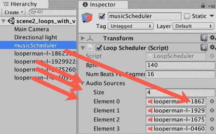

1.  运行场景 - 每个剪辑应该依次在相同的时间延迟后开始。如果你选择了一个或两个较长的剪辑，它们将在下一个剪辑开始时继续播放 - 由于它们都是 140 bpm 的声音剪辑，所以它们会完美重叠。

# 它是如何工作的...

你在场景中添加了四个包含与 140 bpm 音乐片段链接的 `AudioSources` 的 `GameObjects`。你创建了一个 C#脚本类 `LoopScheduler`，并将其实例添加到一个空 `GameObject` 中。你将你的 `GameObjects` 中的四个 `AudioSources` 与脚本组件中公共 `AudioSource` 数组变量的四个槽位关联起来。

你使用的音乐剪辑的数量可以通过更改公共数组变量的大小来轻松更改。

`Start()` 方法计算数组的长度以设置 `numLoops` 变量。然后它计算在开始每个剪辑之前需要延迟的秒数（这是根据每分钟节拍和每小节节拍固定的）。最后，它将当前时间设置为开始第一个循环的时间。

`Update()` 方法决定是否是时候安排下一个循环，通过测试当前时间加上 1 秒前瞻是否超过了开始下一个循环的时间。如果是这样，就会调用 `StartNextLoop()` 方法。无论我们是否已经开始下一个循环，都会调用 `PrintLoopPlayingStatus()` 方法将用户正在播放或未播放的循环显示到控制台。

`PrintLoopPlayingStatus()` 方法遍历数组中的每个 `AudioSource` 引用，创建一个包含真和假的字符串，然后将其打印出来。

`StartNextLoop()` 方法向下一个要播放的 `AudioSource` 发送 `PlayScheduled(...)` 消息，传递 `nextEventTime` 值。然后它为下一个事件时间添加播放之间的时间。然后计算下一个循环索引的下一个值（如果超过了数组的末尾，则加一，然后再次重置为 0）。

# 还有更多...

有些细节是你不想错过的。

# 为正在播放的四个循环添加视觉呈现

观看循环声音的视觉呈现非常有趣。要为四个 `AudioSources` 添加视觉呈现，你只需要做以下几步：

1.  从上一个菜谱中导入 **SpectrumCubes.cs** C# 脚本文件到这个项目中。

1.  将主相机的变换位置设置为 (224, 50, -200)。

1.  将主相机的相机组件设置为以下设置：投影 = 投影透视，视野 60，裁剪平面 0.3 - 300。

1.  在场景中添加一个 **Directional Light GameObject**。

1.  对于包含你的**AudioSources**的每个四个**GameObjects**，添加一个 Spectrum Cubes 脚本类的实例。

1.  在**Spectrum Cubes (脚本)**组件的**检查器**中，更改每个**AudioSource GameObject**的显示颜色。

1.  将四个**GameObjects**组件的 Spectrum Cubes（脚本）的起始 Y 值设置为-50、0、50、100。对于大多数屏幕尺寸，这应该允许你看到所有四个可视化光谱：
