# 第七章：使用相机

在本章中，我们将介绍以下食谱：

+   创建本章的基本场景

+   创建画中画效果

+   在多个相机之间切换

+   从屏幕内容制作纹理

+   调整望远镜相机的缩放

+   显示小地图

+   创建游戏中的监控相机

+   与 Unity 的多用途相机装置协同工作

+   使用 Cinemachine ClearShot 切换相机以保持玩家在画面中

+   允许玩家切换到 Cinemachine FreeLook 相机

# 简介

作为开发者，我们永远不应该忘记关注**相机**。毕竟，它们是我们玩家看到我们游戏窗口。在本章中，我们将探讨一些有趣的使用**相机**的方法，这些方法可以增强玩家的体验。

# 整体情况

**场景**可以包含多个**相机**。通常，我们有一个主**相机**（新场景默认提供）。对于**第一人称**视角的游戏，我们直接控制**相机**的位置和旋转，因为它充当我们的眼睛。在**第三人称**视角的游戏中，我们的主要**相机**跟随一个动画 3D 角色（通常是从上方/后方/肩上），并且可能缓慢而平滑地改变其位置和旋转，就像有人拿着**相机**移动以保持我们的视线一样。

透视**相机**前方有一个三角形金字塔形状的空间体积，称为**视锥体**。空间内的物体被投影到一个平面上，这决定了我们从**相机**看到的内容。我们可以通过指定裁剪平面和视野来控制这个空间体积。裁剪平面定义了物体之间的最小和最大距离，以确定它们是否可见。视野由金字塔形状的宽窄决定：

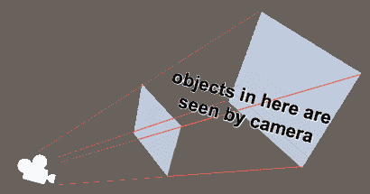

相机可以通过多种方式定制：

+   它们可以排除特定层上的对象以进行渲染

+   它们可以被设置为正交模式（即，没有透视）进行渲染

+   它们的**视野**（**FOV**）可以被调整以模拟广角或窄角镜头

+   它们可以被渲染在其他相机之上或屏幕的特定区域（视口）内

+   它们可以被渲染成纹理文件

列表还在继续。以下截图展示了这些相机功能中的几个。相同的场景有一个透视**相机**，输出到占据整个游戏屏幕（从 0,0 到 1,1）的视口。在其上方是一个用于正交**相机**的第二个视口，显示相同场景内容的 2D 俯视图。这个视口只是屏幕的右上四分之一 `(0, 0.5)` 到 `(0.5, 1.0)`。"幽灵"角色在一个被第二**正交**相机忽略（裁剪）的层上：

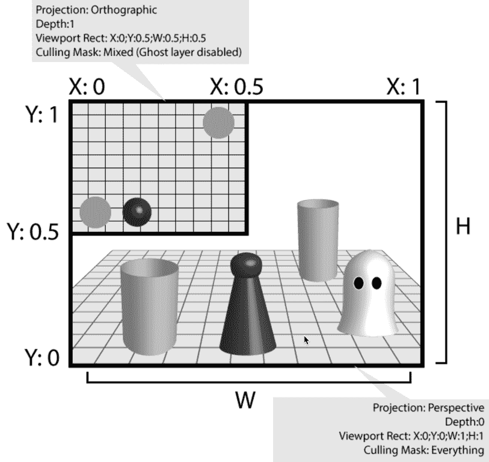

**相机** 有一个深度属性。Unity 使用这个属性来确定相机的渲染顺序。Unity 从最低的深度数字开始渲染相机，然后逐步增加到最高的。这是为了确保那些没有渲染到整个屏幕的相机在渲染到整个屏幕的相机之后被渲染。你将在包括画中画食谱在内的几个食谱中看到这一点。

# Cinemachine

由 Adam Myhill 开发，现在作为 Unity 包免费提供，**Cinemachine** 是一个强大的自动相机控制系统。它为 Unity 开发者提供了很多帮助，包括游戏运行时的相机控制和电影场景或完整动画电影的制作。我们以如何使用 **Cinemachine** 添加一些运行时相机控制到你的游戏中的示例结束本章。

Cinemachine 的核心概念是在场景中设置一组虚拟相机和一个 Cinemachine Brain 组件，该组件决定应该使用哪个虚拟相机的属性来控制场景的 **主相机**。

在 [`www.cinemachineimagery.com/`](http://www.cinemachineimagery.com/) 了解更多关于 Cinemachine 的历史和发展。

# 创建本章的基本场景

本章中的所有食谱都以相同的基本场景开始，包括一个 3D 迷宫、一些对象和一个可由键盘控制的 3D 角色。在这个食谱中，你将创建一个包含此类场景的项目，该场景可以复制并适应后续的每个食谱。

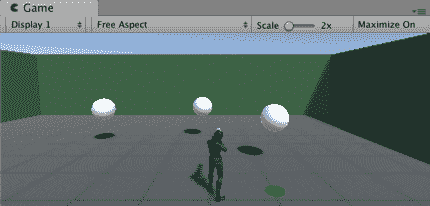

# 准备工作

对于这个食谱，我们准备了一个名为 `CamerasChapter.unity` 的 Unity 包，其中包含本章所需的所有资源。该包位于 `06_01` 文件夹中。

# 如何做到这一点...

要创建本章的基本场景，只需按照以下步骤操作：

1.  创建一个新的 3D 项目。

1.  将 CamerasChapter 包导入到你的 Unity 项目中。

1.  在项目面板中，你会在 `Prefabs` 文件夹中找到三个预制体（`maze-floor-walls`，`maze-objects`，`character-MsLazer`）。通过将预制体从项目面板拖动到层次或场景面板中，为这三个预制体创建 GameObject。

1.  你现在应该有一个带有地板、一些墙壁、一些 **球体** 对象、一个绿色重生点和可由键盘控制的 character-MsLazer 3D 角色的迷宫。

1.  让我们将场景的 **主相机** 附接到角色上，这样你就可以在迷宫中移动角色时始终看到这个第三人称控制器角色。将主相机作为 `character-MsLazer` 的子对象。

1.  在检查器中，将主相机位置设置为（0，3，-5），并将旋转设置为（5，0，0）。

1.  现在，当你使用箭头键在迷宫中移动角色时，**主相机**应自动跟随角色移动和旋转，并且你应该能够始终看到角色的背面。

1.  保存并运行场景。当你移动角色时，**主相机** 应该随着角色移动。

# 它是如何工作的...

通过克隆预制体，你将迷宫和一些对象添加到了一个空场景中。你还将一个键盘控制器角色添加到了场景中。

通过将**主相机**作为子对象附加到角色 GameObject，**主相机**始终相对于角色保持相同的位置和旋转。因此，随着角色的移动，**主相机**也会移动**，为游戏动作提供了一个简单、肩上视角**。

# 创建画中画效果

在许多情况下，显示多个视口可能很有用。例如，你可能想显示在不同地点同时发生的事件，或者你可能想为热座多人游戏有一个单独的窗口：

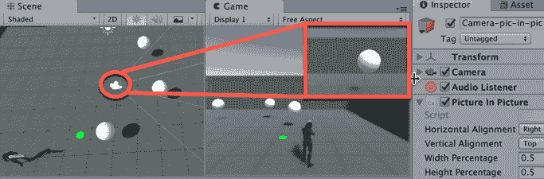

# 准备工作

这个配方是在本章第一个配方创建的场景的基础上添加的，所以请复制那个项目文件夹，并使用该副本进行这个配方的操作。

# 如何操作...

要创建画中画显示，只需按照以下步骤操作：

1.  在场景中添加一个名为`Camera-pic-in-pic`的新相机。选择菜单：创建 | 相机。

1.  在检查器中，对于`相机`组件，将深度属性设置为`1`。

1.  取消选中或删除相机的音频监听器组件，因为场景中应该只有一个活动的音频监听器。

1.  创建一个新的 C#脚本类名为`PictureInPicture`，并将实例对象作为组件添加到`Camera-pic-in-pic`GameObject：

```cs
    using UnityEngine;
     public class PictureInPicture : MonoBehaviour {
         public enum HorizontalAlignment {
             Left, Center, Right
         };

         public enum VerticalAlignment {
             Top, Center, Bottom
         };

         public HorizontalAlignment horizontalAlignment = HorizontalAlignment.Left;
         public VerticalAlignment verticalAlignment = VerticalAlignment.Top;
         public float widthPercentage = 0.5f;
         public float heightPercentage = 0.5f;
         private Camera camera;

         void Start(){
             camera = GetComponent<Camera>();
         }

         void Update() {
             Vector2 origin = CalcOrigin();
             Vector2 size = new Vector2(widthPercentage, heightPercentage);
             Rect newCameraRect = new Rect(origin, size);
             camera.rect = newCameraRect;
         }

         private Vector2 CalcOrigin() {
             float originX = 0;
             float originY = 0;

             switch (horizontalAlignment) {
                 case HorizontalAlignment.Right:
                     originX = 1 - widthPercentage;
                     break;

                 case HorizontalAlignment.Center:
                     originX = 0.5f - (0.5f * widthPercentage);
                     break;

                 case HorizontalAlignment.Left:
                 default:
                     originX = 0;
                     break;
             }

             switch (verticalAlignment) {
                 case VerticalAlignment.Top:
                     originY = 1 - heightPercentage;
                     break;

                 case VerticalAlignment.Center:
                     originY = 0.5f - (0.5f * heightPercentage);
                     break;

                 case VerticalAlignment.Bottom:
                 default:
                     originY = 0;
                     break;
             }

             return  new Vector2(originX, originY);
         }
     }
```

1.  在检查器中，更改一些画中画（脚本）参数：选择顶部和右侧作为垂直和水平对齐。选择 0.25 作为垂直和水平百分比。

1.  播放你的场景。在游戏面板中，你的画中画**相机**的视口应该在屏幕的左上角可见，占据屏幕的四分之一（25%）。

# 它是如何工作的...

在这个例子中，你添加了一个第二个**相机**，以便从不同的视角显示场景。

默认主相机的默认`深度`为`0`。你将我们的`Camera-pic-in-pic`的深度设置为`1`，因此**主相机**首先渲染，覆盖整个游戏窗口，然后我们的第二个相机（画中画）最后渲染，位于主相机渲染之上。

画中画脚本更改相机的标准化视口矩形，从而根据用户的偏好调整视口的尺寸和位置。垂直和水平对齐的四个值，加上`宽度`和`高度`百分比，用于在游戏面板的（0,0）-（1.0, 1.0）**标准化**坐标中创建一个矩形。**相机**的`rect`属性被设置为计算出的新矩形。

# 还有更多...

以下是你可能更改的画中画的一些方面。

# 在屏幕上更改画中画视口的尺寸和位置

你可以通过设置水平和垂直百分比值来更改画中画矩形的**大小**。

垂直对齐和水平对齐选项可以用来改变视口的垂直和水平对齐。使用它们将其放置在所需的位置，例如左上角、右下角、中心中心等。

# 添加对景深和宽高比的进一步控制

你可以向代码中添加额外的公共变量，并对应地进行**视野**、**宽高比**等**相机**调整：

```cs
    [Range(20f, 150f)]
     public float verticalFieldOfView = 90f;

     [Range(0.25f, 2f)]
     public float ascectRatio = 1f;

     void Update()
     {
         Vector2 origin = CalcOrigin();
         Vector2 size = new Vector2(widthPercentage, heightPercentage);
         Rect newCameraRect = new Rect(origin, size);
         camera.rect = newCameraRect;
         camera.fieldOfView = verticalFieldOfView;
         camera.aspect = ascectRatio;
      }
```

相机视野是指相机捕捉到的世界范围；通常，我们将其视为视野的宽窄。更多信息请参阅[`en.wikipedia.org/wiki/Field_of_view`](https://en.wikipedia.org/wiki/Field_of_view)和[`docs.unity3d.com/ScriptReference/Camera-fieldOfView.html`](https://docs.unity3d.com/ScriptReference/Camera-fieldOfView.html)。

相机宽高比是矩形宽度与高度的关系。它是通过宽度除以高度来计算的。更多信息请参阅[`docs.unity3d.com/ScriptReference/Camera-aspect.html`](https://docs.unity3d.com/ScriptReference/Camera-aspect.html)和[`en.wikipedia.org/wiki/Aspect_ratio_(image)`](https://en.wikipedia.org/wiki/Aspect_ratio_(image))。

# 在检查器中手动更改相机视口属性

一旦你熟悉了使用(0,0)到(1.0, 1.0)的标准化视口坐标系，你就可以直接在检查器中手动编辑**相机视口**设置，而不需要使用任何 C#脚本类：

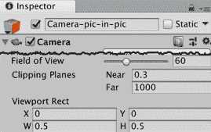

# 参见

本章中的**显示迷你图**配方。

# 在多个相机之间切换

在许多游戏类型中，从多种相机中选择是一个常见功能：赛车、体育、大亨/策略等。在本配方中，你将学习如何通过使用键盘让玩家能够从许多相机中进行选择。

# 准备工作

本配方是在本章第一配方创建的场景基础上进行的，因此请复制那个项目文件夹，并使用该副本来完成本配方的操作。

# 如何操作...

要实现可切换的相机，请按照以下步骤操作：

1.  在场景中创建一个新的相机，命名为 Camera-1（创建 | 相机）。将其位置设置为(`0,0,0`)。将此相机的标签设置为**主相机**。

1.  复制 Camera-1，将副本命名为 Camera-2。将其位置设置为(`0, 0, -15`)，并将其旋转设置为(`20, 0, 0`)。

1.  禁用 Camera-1 和 Camera-2 的相机和 AudioListener 组件。

1.  创建一个名为 switchboard 的空 GameObject（创建 | 创建空对象）。

1.  创建一个名为`CameraSwitch`的新 C#脚本类，包含以下内容，并将其作为组件添加到 switchboard GameObject 中：

```cs
  using UnityEngine;    
  public class CameraSwitch : MonoBehaviour  {
         public Camera[] cameras = new Camera[3];
         public bool changeAudioListener = true;

         void  Update() {
             if (Input.GetKeyDown("0")) {
                 EnableCamera(cameras[0], true);
                 EnableCamera(cameras[1], false);
                 EnableCamera(cameras[2], false);
             }

             if (Input.GetKeyDown("1")) {
                 EnableCamera(cameras[0], false);
                 EnableCamera(cameras[1], true);
                 EnableCamera(cameras[2], false);
             }

             if (Input.GetKeyDown("2")) {
                 EnableCamera(cameras[0], false);
                 EnableCamera(cameras[1], false);
                 EnableCamera(cameras[2], true);
             }
         }

         private void EnableCamera(Camera cam, bool enabledStatus) {
             cam.enabled = enabledStatus;

             if(changeAudioListener)
                 cam.GetComponent<AudioListener>().enabled = enabledStatus;
         }
     }
```

1.  确保在层次结构中选择**开关板**GameObject。在相机切换（脚本）组件的检查器中，将**相机**数组的大小设置为`3`。然后，将场景中的相机拖动并填充到**相机**槽中，包括**主相机**和 MsLazer 角色的子对象：

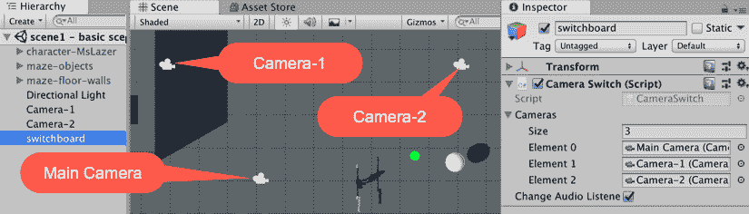

1.  保存并播放场景。按下键*0*、*1*和*2*应在三个**相机**之间切换。

# 它是如何工作的...

每帧，都会对三个快捷键（0、1 或 2）中的每一个进行测试。如果按下了这些键中的任何一个，则相应的**相机**被启用，而其他两个**相机**被禁用。

如果公共布尔属性`changeAudioListener`已被勾选，则所选相机内的`AudioListener`被启用，而其他两个**相机**中的`AudioListeners`被禁用。

# 更多内容...

这里有一些关于如何尝试调整这个食谱的想法。

# 使用单个启用的相机

解决这个问题的另一种方法是将所有辅助相机禁用，并通过脚本类将它们的位置和旋转分配给**主相机**（如果你想要保存其变换设置，你需要复制**主相机**并将其添加到列表中）。这与`Cinemachine`包实现的将虚拟**相机**属性应用于**主相机**的方法类似（参见本章最后两个食谱，了解更多关于`Cinemachine`的信息）。

# 参见

本章中创建游戏内监控相机食谱。

# 从屏幕内容制作纹理

如果你想要你的游戏或玩家在游戏中捕捉快照并将其作为纹理应用，这个食谱将向你展示如何操作。如果你计划实现游戏内照片库或在关卡结束时显示关键时刻的快照，这将非常有用（赛车游戏和特技模拟大量使用此功能）。对于这个特定的例子，我们将捕捉屏幕的一个框架区域并将其打印在显示器的右上角：

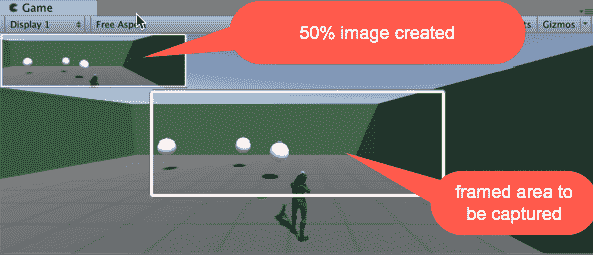

# 准备工作

这个食谱增加了本章第一个食谱中创建的场景，所以请复制那个项目文件夹，并使用该副本来完成这个食谱的工作。

# 如何操作...

要从屏幕内容创建纹理，请按照以下步骤操作：

1.  在层次结构中，通过选择以下内容从**层次结构**面板菜单创建一个新的**UI Image**，命名为**Image-frame**：创建 | UI | Image。由于这是在此场景中创建的第一个 UI GameObject，应自动创建新的 Canvas 和`EventSystem`GameObject，Image-frame UI 应成为 Canvas GameObject 的子对象。

1.  从检查器面板中，找到 frame GameObject 的 Image（脚本）组件，并将其**源图像**设置为`InputFieldBackground`。同时，取消选中**填充中心**选项。

Sprite `InputFieldBackground`是 Unity 附带的一部分，并且已经为了调整大小而切片。

1.  为图像框架设置锚点：**最小**(`0.25`)，(`0.25`)；**最大**(`0.75`)，(`0.750`)。

1.  将位置（左：`0`，上：`0`，位置 Z：`0`）和大小（宽度：`0`，高度：`0`）归零。

1.  **图像框架**GameObject 应出现在屏幕中央，占据屏幕的一半：

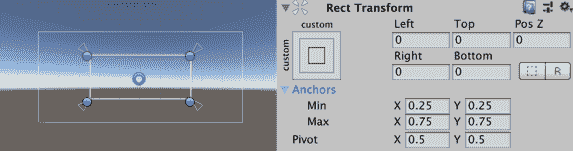

1.  在层次结构中，通过从**层次结构**面板菜单中选择以下内容创建一个新的**UI 原始图像**名为**原始图像-照片**：**创建** | **UI** | **原始图像**。确保其**纹理**对于其**原始图像（脚本）**组件为**无**。

1.  在**检查器**中，现在禁用整个**原始图像-照片**GameObject。

1.  将**宽度**和**高度**设置为`1`。为**原始图像-照片**设置锚点：**最小**(`0`)，(`1`)；**最大**(`0`)，(`1`)。

1.  将**原点**设置为`(0, 1)`。并通过将**左**设置为`0`，**上**设置为`0`，**Z**设置为`0`来归零位置。

1.  创建一个新的 C#脚本类名为`TextureFromCamera`，并将实例对象作为组件添加到**主相机**GameObject（`MsLazer`的子对象）中：

```cs
    using UnityEngine;
     using UnityEngine.UI;
     using System.Collections;

     public class TextureFromCamera : MonoBehaviour {
         public GameObject imageFrame;
         public GameObject rawImagePhoto;
         public float ratio = 0.25f;

         void  LateUpdate ()  {
             if (Input.GetKeyUp(KeyCode.Mouse0))
             {
                 rawImagePhoto.SetActive (false);
                 StartCoroutine(CaptureScreen());
                 rawImagePhoto.SetActive (true);
             }
         }

         IEnumerator CaptureScreen () {
             RectTransform frameTransform = imageFrame.GetComponent<RectTransform> ();
             Rect framing = frameTransform.rect;
             Vector2 pivot = frameTransform.pivot;
             Vector2 origin = frameTransform.anchorMin;
             origin.x *= Screen.width;
             origin.y *= Screen.height;
             float xOffset = pivot.x * framing.width;
             origin.x += xOffset;
             float yOffset = pivot.y * framing.height;
             origin.y += yOffset;
             framing.x += origin.x;
             framing.y += origin.y;
             Texture2D texture = new Texture2D((int)framing.width, (int)framing.height);

             yield return new WaitForEndOfFrame();
             texture.ReadPixels(framing, 0, 0);
             texture.Apply();
             Vector3 photoScale = new Vector3 (framing.width * ratio, framing.height * ratio, 1);
             rawImagePhoto.GetComponent<RectTransform> ().localScale = photoScale;
             rawImagePhoto.GetComponent<RawImage>().texture = texture;
         }
     }
```

1.  在**检查器**中，找到**屏幕纹理**组件，并将**原始图像照片**字段填充为**GameObject** **原始图像-照片**；并将**图像框架**字段设置为**图像框架**GameObject。

1.  播放**场景**。每次您点击鼠标，您都会在矩形框架内捕获屏幕的快照，并且快照应该显示在屏幕的左上角。

# 它是如何工作的...

首先，我们创建了一个用于捕获快照的 UI 框架，以及一个位于屏幕左上角的 UI 原始图像，用于应用快照纹理。

每帧，C#脚本类`TextureFromCamera`的`LateUpdate()`方法都会执行。每次发生这种情况时，都会进行测试以查看是否点击了鼠标按钮。如果是，则禁用 UI 原始图像（这样以前的快照就不会出现在新的快照中），并调用`CaptureScreen()`协程方法。

我们在这里使用`LateUpdate()`来确保在捕获图像之前所有渲染都已经完成。

协程`CaptureScreen()`计算一个`Rect`区域，从该区域复制屏幕像素，并将它们应用于要由**UI 原始图像**元素显示的纹理，该元素也被调整大小以适应纹理。

`Rect`的大小是根据屏幕尺寸和框架的 Rect Transform 设置计算的，特别是其原点，锚点，宽度和高度。然后，通过`ReadPixels()`命令捕获该区域的屏幕像素，并将其应用于纹理，然后将纹理应用于原始图像照片，该照片本身被调整大小以适应照片大小和原始像素之间的所需比例。

`CaptureScreen()`方法是一个协程，它允许它等待直到帧的结束（`yield return new WaitForEndOfFrame()`），然后再尝试从**相机**捕获图像的副本。

# 还有更多...

除了将纹理显示为 UI 元素外，你还可以以其他方式使用它。

# 将你的纹理应用到材质上

你可以通过在`CaptureScreen`方法的末尾添加类似`GameObject.Find("MyObject").renderer.material.mainTexture = texture`的行，将你的纹理应用到现有对象的材质上。

# 使用你的纹理作为截图

你可以将你的纹理编码为 PNG 图像文件并保存。这可以在 Unity 文档页面中关于编码 PNG 图像的部分找到：[`docs.unity3d.com/ScriptReference/ImageConversion.EncodeToPNG.html`](https://docs.unity3d.com/ScriptReference/ImageConversion.EncodeToPNG.html)。

# 相关内容

在第十章“与外部资源文件和设备一起工作”，保存和加载数据文件中，有关从游戏中保存截图的菜谱。

# 缩放望远镜相机

在这个菜谱中，我们将创建一个望远镜相机，每当按下左鼠标按钮时，它就会放大。

# 准备工作...

这个菜谱增加了本章第一个菜谱中创建的场景，所以请复制那个项目文件夹，并使用该副本来完成这个菜谱的工作。

# 如何操作...

要创建一个望远镜相机，请按照以下步骤操作：

1.  创建一个新的 C#脚本类名为`TelescopicView`，并将一个实例对象作为组件添加到**主相机**（`MsLazer`的子对象）：

```cs
  using UnityEngine;

     public class TelescopicView : MonoBehaviour {
         public float zoom = 2.0f;
         public float speedIn = 100.0f;
         public float speedOut = 100.0f;
         private float initFov;
         private float currFov;
         private float minFov;
         private float addFov;

         void Start() {
             initFov = Camera.main.fieldOfView;
             minFov = initFov / zoom;
         }

         void Update() {
             if (Input.GetKey(KeyCode.Mouse0))
                 ZoomView();
             else
                 ZoomOut();
         }

         void ZoomView(){
             currFov = Camera.main.fieldOfView;
             addFov = speedIn * Time.deltaTime;

             if (Mathf.Abs(currFov - minFov) < 0.5f)
                 currFov = minFov;
             else if (currFov - addFov >= minFov)
                 currFov -= addFov;

             Camera.main.fieldOfView = currFov;
         }

         void ZoomOut() {
             currFov = Camera.main.fieldOfView;
             addFov = speedOut * Time.deltaTime;

             if (Mathf.Abs(currFov - initFov) < 0.5f)
                 currFov = initFov;
             else if (currFov + addFov <= initFov)
                 currFov += addFov;

             Camera.main.fieldOfView = currFov;
         }
     }
```

1.  播放关卡。当你点击并按住右鼠标按钮时，你应该会看到一个动画缩放效果。

# 它是如何工作的...

缩放效果实际上是由相机**视野**（**FOV**）属性值的改变引起的；较小的值会导致较小区域的更近距离视图，而较大的值会扩大 FOV。

`TelescopicView`脚本类通过在按下左鼠标按钮时减少视野（FOV）来改变相机的视野。当不按住右鼠标按钮时，它还会增加 FOV 值，直到达到原始值。

FOV 的缩放限制可以从`minFov = initFov / zoom`代码中推断出来。这意味着 FOV 的最小值等于其原始值除以缩放量。例如，如果我们的**相机**原始 FOV 为 60，我们将**望远镜视图缩放**设置为`2.0`，则允许的最小 FOV 将是 60/2 = 30。

# 还有更多...

有一些细节你不希望错过。

# 在缩放时添加晕影效果

在游戏中，通常在相机缩放的同时应用视觉晕影效果。晕影是指图像边缘变得不那么明亮或更加模糊（通常是椭圆形或圆形）。这曾经是旧相机和镜头的一个意外（并且通常是希望避免的）效果，但可以在游戏中有意应用，以帮助玩家专注于屏幕中央的内容，并在游戏中的某个特定点增加更强烈的氛围：

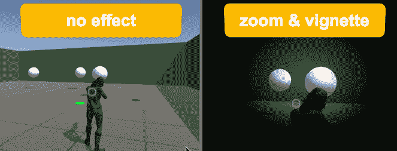

要添加晕影效果，请执行以下操作：

1.  打开资产商店面板，然后下载并导入 Unity Technologies 发布的免费后处理堆栈资产。

1.  在检查器中，选择主摄像机 GameObject（`MsLazer`的子对象）。然后，添加一个后处理行为组件。转到添加组件 | 效果 | 后处理行为。

1.  在项目面板中，通过选择项目面板菜单中的创建 | 后处理配置文件，创建一个名为`my-vignette`的新后处理配置文件。

1.  在项目面板中选择`my-vignette`文件，在检查器中勾选 my-vignette 效果并单击一次以显示其属性。设置其属性如下：

    +   中心：(X: 0.5, Y: 0.5)

    +   强度：0.75

    +   平滑度：0.5

    +   圆度：1

1.  在**检查器**中选择**主摄像机**，从**项目**面板中将`my-vignette`文件拖到**检查器**中，以填充**后处理行为**组件的**配置文件**属性。

1.  你现在应该看到**游戏**面板摄像机视图边缘的暗模糊晕影圆形效果。

1.  在**检查器**中，选择**主摄像机**并禁用其**后处理行为**组件（在**检查器**中取消勾选此组件）。**我们将在脚本中仅当缩放效果开启时启用此效果**。

1.  在`TelescopicView`脚本类顶部添加一个新的 using 语句：

```cs
using UnityEngine.PostProcessing;
```

1.  在`TelescopicView`脚本类中添加一个新的私有变量：

```cs
private PostProcessingBehaviour postProcessingBehaviour;
```

1.  在`TelescopicView`脚本类的`Start()`方法末尾添加一个语句以获取并存储对**后处理行为**组件的引用：

```cs
    void Start() {
         initFov = Camera.main.fieldOfView;
         minFov = initFov / zoom;
         postProcessingBehaviour = GetComponent<PostProcessingBehaviour>();
     }
```

1.  在脚本类`TelescopicView`的`Update()`方法中添加语句，以在鼠标按键按下时启用后处理行为，在未按下时禁用它：

```cs
    void Update() {
         if (Input.GetKey(KeyCode.Mouse0)) {
             postProcessingBehaviour.enabled = true;
             ZoomView();
         }
         else {
             ZoomOut();
             postProcessingBehaviour.enabled = false;
         }
     }
```

1.  播放场景。当鼠标按钮被点击并保持时，你应该会看到除了缩放效果外，还有一个动画晕影效果。

在 Unity 文档中了解更多关于晕影效果和后处理堆栈的信息：

+   [`docs.unity3d.com/Manual/PostProcessing-Vignette.html`](https://docs.unity3d.com/Manual/PostProcessing-Vignette.html)

+   [`docs.unity3d.com/Manual/PostProcessing-Stack.html`](https://docs.unity3d.com/Manual/PostProcessing-Stack.html)

# 进一步了解 Unity 后处理堆栈的版本 2

在打印时，Unity 发布了他们后处理堆栈的实验性版本 2。

要添加晕影效果，请执行以下操作：

1.  在**检查器**中选择**主摄像机**（`MsLazer`的子对象）。在**检查器**中创建一个名为`PostProcessing`的新**层**，并将**主摄像机**的**层**设置为**PostProcessing**。

1.  从 Unity GitHub 账户[`github.com/Unity-Technologies/PostProcessing`](https://github.com/Unity-Technologies/PostProcessing)下载 ZIP 文件。

1.  然后，将文件夹解压到项目 Assets 文件夹中。

1.  将后处理层组件添加到 **主相机**。在 **检查器** 中通过点击 **添加组件** | **渲染** | **后处理层** 来完成此操作。将此组件的 **层** 属性设置为 **后处理**。

1.  现在，通过点击 **添加组件** | **渲染** | **后处理体积** 来添加一个 **后处理体积组件**。检查 Is Global 属性。创建一个新的配置文件（点击新建按钮）。然后，点击添加效果...按钮，从下拉菜单中选择 Vignette。

1.  在 `TelescopicView` 脚本类顶部添加一个 using 语句：

```cs
using UnityEngine.Rendering.PostProcessing;
```

1.  向 `TelescopicView` 脚本类添加两个额外的属性：

```cs
private Vignette vignetteEffect;
 public float vMax = 1f;
```

1.  将以下语句添加到脚本类 `TelescopicView` 的 `Start()` 方法末尾，以便在 Post-Processing Volume 组件中获取 Vignette 效果的引用：

```cs
    void Start() {
         initFov = Camera.main.fieldOfView;
         minFov = initFov / zoom;

         PostProcessVolume volume = GetComponent<PostProcessVolume>();
         volume.profile.TryGetSettings<Vignette>(out vignetteEffect);
     }
```

1.  将以下语句添加到脚本类 `TelescopicView` 的 `Update()` 方法末尾，以便更新 Vignette 设置：

```cs
   void Update()
     {
         if (Input.GetKey(KeyCode.Mouse0))
             ZoomView();
         else
             ZoomOut();

         float currDistance = currFov - initFov;
         float totalDistance = minFov - initFov;
         float vMultiplier = currDistance / totalDistance;

         float vAmount = vMax * vMultiplier;
         vAmount = Mathf.Clamp(vAmount, 0, vMax);
         vignetteEffect.intensity.Override(vAmount);
     }
```

1.  播放场景。当鼠标按钮被点击并按住时，你应该会看到一个动画的 Vignette 效果，除了缩放效果。

在以下位置了解更多关于这个新版本的信息：

+   项目 Wiki：[`github.com/Unity-Technologies/PostProcessing/wiki`](https://github.com/Unity-Technologies/PostProcessing/wiki)

+   下载它的 Unity GitHub 账户：[`github.com/Unity-Technologies/PostProcessing`](https://github.com/Unity-Technologies/PostProcessing)

+   关于 Juan Sebastian Munoz Arango 使用 Post Processing Stack v2 编写的文章：[`www.pencilsquaregames.com/changing-parameters-through-scripting-on-unitys-post-processing-stack-v2/`](http://www.pencilsquaregames.com/changing-parameters-through-scripting-on-unitys-post-processing-stack-v2/)

# 显示小地图

在许多游戏中，更宽的视野对于导航和信息非常有价值。小地图对于在第一人称或第三人称模式下提供玩家可能需要的额外视角非常有用。在这个配方中，我们首先创建一个简单的方形小地图，它出现在屏幕的右上角；然后，你将学习如何将其变为圆形并添加旋转罗盘效果：

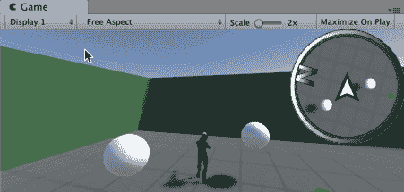

# 准备中...

这个配方是在本章第一个配方创建的场景基础上添加的，所以请复制那个项目文件夹，并使用该副本来完成这个配方的制作。

# 如何做到这一点...

要创建小地图，请按照以下步骤操作：

1.  从 **层次结构** 面板中创建一个新的 UI Panel 对象（创建 | UI | Panel），命名为 `Panel-miniMap`。由于这是在这个场景中创建的第一个 UI GameObject，应该会自动创建新的 Canvas 和 `EventSystem` GameObject，UI Panel 应该是 Canvas GameObject 的子对象。

1.  在 **检查器** 中选择 `Panel-miniMap` GameObject，执行以下操作：

    +   在 Rect Transform 中，设置对齐方式为右上角（在按住 Shift 和 Alt 键的同时点击右上角框）

    +   在矩形变换中，将宽度设置为`128`，高度设置为`128`

1.  我们将创建一个渲染纹理文件，我们的缩略图相机将复制其视图。在**项目**面板中，创建一个新的渲染纹理并将其命名为`RenderTextureMap`。在**检查器**中，确保其大小设置为 256 x 256。

1.  在**检查器**中，选择 GameObject 面板-minimap 并添加一个新的子 UI 原始图像，命名为`RawImage-TextureMap`（创建 | UI | 原始图像）。

1.  对于 UI `RawImage-TextureMap` GameObject，将源图像字段填充为`RenderTextureMap`图像。这意味着当我们的缩略图相机更新其视图到渲染纹理时，**相机**所看到的内容将自动显示在这个 UI 原始图像中。

1.  在确保 UI 原始`Image-RenderTextureMap`是`Panel-minimap`的子项后，通过在矩形变换中选择**拉伸**来使它填充整个面板，同时按住 Shift 和 Alt 键：

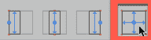

1.  从**层次**面板中，创建一个新的相机**（创建** | **相机**）**，并将其重命名为`Camera-minimap`。取消选中（或移除）相机的**音频监听器**组件，因为在**场景**中应该只有一个活动的**音频监听器**。

1.  在层次结构子项`Camera-minimap`到`character-MsLazer`角色。然后，在**检查器**中，设置其属性如下：

    +   位置：`(0, 10, 0)`

    +   旋转：`(90, 0, 0)`

    +   清除标志：仅深度

    +   投影：正交

    +   相机：大小：5（默认）

    +   深度：1（或更高）

    +   目标纹理：`RenderTextureMap`

1.  播放场景。你应该能够在屏幕右上角看到正方形缩略图的功能：


# 它是如何工作的...

缩略图的主要元素是一个 UI 原始图像元素`(RawImage-TextureMap)`，显示名为`RenderTextureMap`的渲染纹理文件的内容。

你在场景中创建了一个第二个相机`(Camera-minimap)`，并将其目标纹理设置为`RenderTextureMap`文件；这意味着相机的视图在每一帧更新`RenderTextureMap`的内容，然后这些内容再通过 UI `RawImage-TextureMap`显示给用户。

`Camera-minimap`是一个正交相机，从俯视角度跟随玩家的角色。你在这个新相机中移除/禁用了`AudioListener`组件，因为**场景**中应该只有一个活动的`AudioListener`，而默认的**主相机**GameObject 中已经有一个了。

你将这个新相机子类化到`character-MsLazer`角色上，因此它随着角色移动。你将其定位在角色上方 10 个单位（Y = 10），并使其向下指向角色（X 旋转 90 度）。

# 更多内容...

如果你想对你的缩略图进行更多实验，请继续阅读。

# 使用 UI 遮罩使缩略图呈圆形

要使缩略图在 UI 中突出，一种方法是将它做成圆形。我们可以通过添加基于圆形的 UI 遮罩来轻松实现这一点：

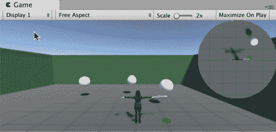

使缩略图在 UI 中突出显示的一个好方法是将其呈现为圆形形状，请执行以下操作：

1.  在 **项目** 面板中，选择 `Textures` 文件夹中的 circleMask 文件，并在 **检查器** 中确保纹理类型为 **精灵** **（2D 和 UI）**。

要将纹理类型更改为 **精灵（2D 和 UI）**，在 **项目** 面板中选择文件，然后在 **检查器** 中将其 **纹理类型** 更改为 **精灵（2D 和 UI）** 并点击 **应用** 以确认更改。

1.  确保在 **层次结构** 中选择 `Panel-miniMap` GameObject。在 **检查器** 中为 **Image (Script)** 组件，将源图像字段填充为 circleMask 纹理，点击颜色属性，并将 Alpha 值设置为 `255`：

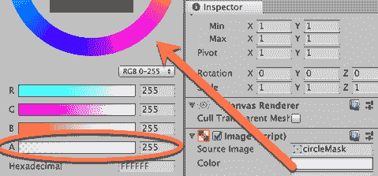

1.  现在，在 **检查器** 中为 `Panel-miniMap` 添加一个遮罩组件，通过选择菜单：添加组件 | UI | 遮罩。取消选中显示遮罩图形属性（它将变为不可见）。

圆形图像作为缩略图的遮罩，因此只有 `circleMask` 区域内的图像将被显示，从而形成一个圆形缩略图。

# 隐藏缩略图中心玩家角色图像并显示三角形标记

在大多数缩略图中，缩略图中心是玩家角色的位置，因此我们不需要在缩略图中显示玩家角色。让我们创建一个名为 `Player` 的层，并将 `character-MsLazer` 放置在该 **层** 上。然后我们可以通过创建一个忽略 **Player** **层** 的 **剔除遮罩** 来提高效率并减少视觉杂乱。我们可以在我们的缩略图中心显示一个简单的 **2D 精灵**，向上指，以表明我们的玩家相对于缩略图显示始终向上：

1.  创建一个新的用户层名为 `Player`。

1.  在层次结构中选择 `character-MsLaser` GameObject（玩家角色），并将 **层** 属性设置为 **Player**（在 **更改子项** 弹出对话框中点击是）。

1.  在 **层次结构** 中选择 `Camera-minimap`，在 **检查器** 中为 **Camera** 的 **剔除遮罩** 属性取消选择 **Layer Player**。此属性现在应显示为 **混合...**，这意味着 **Player** **层** 上的 GameObject 将被我们的 `Camera-minimap` 忽略。

1.  让我们在 **面板** 的中心添加一个三角形标记 2D 图像。创建一个新的 UI Image 作为 `Panel-minimap` 的子项；将此重命名为 `Image-marker`。在 **检查器** 中，将源图像属性设置为纹理资产文件 `triangleMarker`。点击设置原生大小按钮。

1.  运行场景。而不是以玩家角色的自上而下视角，你现在应该看到在缩略图中心的一个三角形（始终向上指）：

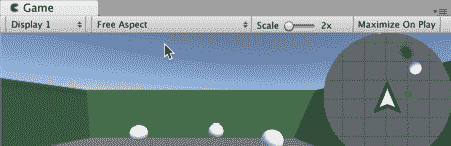

而不是只在中心有一个代表玩家的三角形图像，你可以通过使用**Layers**进一步创建，例如，彩色的 3D 对象，在正交投影中看起来像圆形、正方形等。这涉及到为要在小地图中显示的对象创建一个**Layer**，以及另一个（例如**Player**）将被小地图相机忽略的**Layer**。Unity 的骑士们发布了一个简短的教程，解释了如何做到这一点：[`blog.theknightsofunity.com/implementing-minimap-unity/`](http://blog.theknightsofunity.com/implementing-minimap-unity/)。

# 旋转罗盘风格的图像

有时我们想在我们的最小地图周围有一个罗盘风格的图像，这样我们就可以看到玩家角色的当前航向（前进方向）和原始面向之间的任何差异。

要在我们的最小地图周围添加一个旋转的罗盘风格图像，请执行以下操作：

1.  让我们在面板的中心添加一个罗盘风格的圆形图像（字母 N 向上指）。为此，创建一个新的 UI Image 作为**Panel-minimap**的子对象；将此重命名为**Image-compass**。在**Inspector**中，将**Source Image**属性设置为 Texture compass。

1.  确保在`Panel-minimap`游戏对象的子对象层级中，**Image-compass**和**Image-marker**都位于**RawImage-TextureMap**下方；这确保了三角形标记和罗盘圆圈图像在相机纹理之后（即在相机视图图像之上）被绘制：

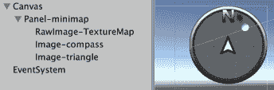

1.  创建一个 C#脚本类 MiniMap，并将一个`instance-object`作为组件添加到`Camera-minimap:`。

```cs
    using UnityEngine;

     public class MiniMap : MonoBehaviour {
         public GameObject mapUI;
         private Transform target;

         void Start() {
             target = GameObject.FindGameObjectWithTag("Player").transform;
         }

         void Update() {
             Vector3 compassAngle = new Vector3();
             compassAngle.z = target.transform.eulerAngles.y;
             mapUI.transform.eulerAngles = compassAngle;
         }
     }
```

1.  播放场景。你应该能够在屏幕的右上角看到小地图正在工作。当你旋转玩家角色的方向时，你会看到围绕小地图的“N”北指示器也在旋转（但方向相反）。

每一帧，罗盘 UI Image 都会旋转以匹配场景中玩家 3D 角色的旋转。

# 调整地图的范围更大或更小

由于我们的 Camera-minimap 是正交的，改变位于角色上方的**Camera**的高度将不会产生影响（因为距离不会改变对象在正交相机上的投影）。然而，在**Inspector**中更改**Camera**组件的 Size 属性将控制世界投影到**Camera**上的区域大小。

尝试将大小增加到 20，你的小地图将显示你角色周围更多的迷宫区域：

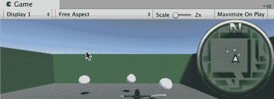

当增加小地图的范围时，你可能希望将小地图中心的三角标记图像缩小。你可以通过将其 Rect Transform 居中，然后设置较小的宽度和高度（例如 16 x 16）来实现这一点。

# 将你的小地图适应到其他风格

您可以轻松修改这个菜谱，使其成为赛车游戏电路图的俯视或等距视图。在**检查器**中，取消`Camera-minimap` GameObject 的子对象；这将防止它跟随场景中的任何**角色**。

# 创建游戏中的监控摄像头

在上一个菜谱中，我们将最小地图**摄像头**的输出渲染到**渲染纹理**中，并在**UI 原始图像**中显示该图像的内容。我们可能希望捕获和输出**摄像头**运行时视图的另一个例子是模拟游戏中的监控**摄像头**，例如**闭路电视**（**CCTV**）系统。在这个菜谱中，我们将使用**渲染纹理**创建一个在场景中其他地方传输视频到 3D 监控器的游戏内监控摄像头：

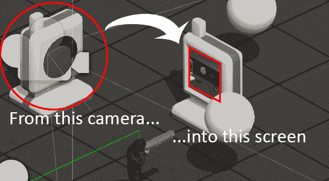

# 准备工作

这个菜谱增加了本章第一个菜谱中创建的场景，所以请复制那个项目文件夹，并使用该副本来完成这个菜谱的工作。

对于这个菜谱，我们还准备了两个 3D 模型（FBX 文件），用于监控器和`cctv-camera`对象。这些 3D 模型文件可以在`06_07`文件夹中找到。

# 如何操作...

要创建游戏中的监控**摄像头**，请按照以下步骤操作：

1.  将监控器和`cctv-camera`模型导入到您的 Unity 项目中。

1.  通过从**项目**面板拖动它们到**层次结构**面板来创建监控器和`cctv-camera`模型的克隆。

1.  在**检查器**中，为 monitor GameObject 设置以下属性：

    +   位置：(`-3, 0, 6`)

    +   旋转：(`0, 180, 0`)

    +   缩放：(`1,1,1`)

1.  在**检查器**中，为`cctv-camera` GameObject 设置以下属性：

    +   位置：(`-6, 0, 1`)

    +   旋转：(`0, 90, 0`)

1.  从**项目**面板创建一个新的**渲染纹理**文件，并将其重命名为`screenRenderTexture`。在**检查器**中，将其**大小**更改为**512 x 512**。

1.  在场景中添加一个新的**摄像头**（菜单：创建 | 摄像头），命名为`Camera-surveillance`。将这个新的 GameObject 作为`cctv-camera`的子对象。取消选中（或移除）摄像头的**音频监听器**组件，因为场景中应该只有一个活动的**音频监听器**。

1.  在**检查器**中，为`Camera-surveillance` GameObject 设置以下属性：

    +   位置：(`0, 2, 0`)

    +   旋转：(`0, 0, 0`)

    +   剪裁平面：近：`0.6`

    +   目标纹理：`screenRenderTexture`。

1.  创建一个新的**材质**，命名为`m_renderTexture`，并将其**漫反射纹理**设置为`screenRenderTexture`。

1.  在**层次结构**中，找到 monitor GameObject 的屏幕子对象，并将其**网格渲染器材质**设置为`m_renderTexture`。

1.  播放您的场景。您应该能够在监控器的屏幕上实时看到`cctc-camera`前的动作：

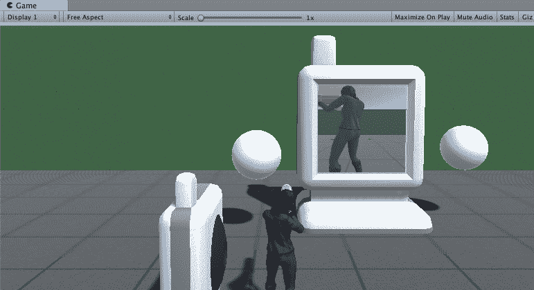

# 它是如何工作的...

我们通过将监控相机作为应用到屏幕上的**渲染纹理**的来源，实现了最终结果。为了便于重新定位，将相机设置为 3D 模型的子项。此外，重新调整了其**近裁剪**平面，以避免显示相机 3D 模型几何形状的一部分，并禁用了其**音频源**组件，以免与主相机的组件冲突。

最后，我们的**渲染纹理**被应用到监视器 GameObject 的材料上。

# 还有更多...

如果你想对你的小地图进行更多实验，请继续阅读。

# 使用后处理添加颗粒、灰度效果到 CCTV

为游戏中的电视系统添加一个很好的效果是带有颗粒（视觉噪声）的灰度**后处理**。这增加了廉价、老式 CCTV 系统的感觉，例如可能用于安全系统，并添加一种威胁性的电影黑帮效果：

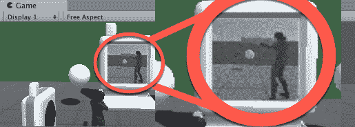

要添加晕影效果，请执行以下操作：

1.  打开**资产商店**面板，然后下载并导入 Unity Technologies 发布的免费**后处理堆栈**资产。

1.  在**项目**面板中，通过转到创建 | 后处理配置文件创建一个新的**后处理**配置文件文件。将此新配置文件命名为`film-noir.`。

1.  在**层次结构**中，选择`cctv-camera`GameObject 的`Camera-surveillance`子项。通过选择菜单：**添加组件** | **效果** | **后处理行为**，为此**相机**添加一个**后处理行为**组件。

1.  将`film-noir`文件从**项目**面板拖动到**检查器**中，以填充**后处理行为**组件的**配置文件**属性。

1.  在**检查器**中，为**后处理配置文件**`film-noir`文件设置以下属性：

    +   选择**色彩分级**选项，并将基本：饱和度设置为零

    +   选择**颗粒**选项，取消选择**彩色**，并设置**强度（1）**、**发光贡献（1）**和**大小（3）**的最大值。

1.  运行场景。

通过处理从**相机**生成的图像，监视器中的图像现在应该是来自`cctv-camera.`的老式颗粒、灰度视频流。图像被转换为灰度，因为颜色饱和度为零，并且还应用了颗粒效果。

# 使用 Unity 的多功能相机装置

Unity 提供了一些**相机**装置，可以使设置场景更快，并有助于测试想法。在这个菜谱中，你将使用一个第三人称角色和默认 Unity 资产包中的多功能相机装置，快速创建一个带有相机的场景，该相机在角色移动时自动跟随角色，并在角色改变方向时平滑旋转：

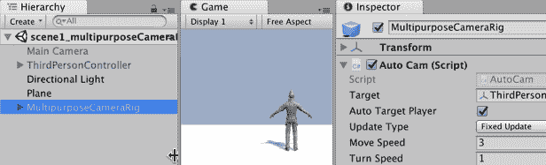

# 如何做到这一点...

要使用 Unity 的多功能相机装置，只需遵循以下步骤：

1.  创建一个新的 Unity 3D 场景。

1.  导入**Characters**和**Cameras Asset Packages**：使用菜单：**Assets** | **Import Package ...** | **Cameras & Characters**。

1.  现在，你应该在你的**项目**面板中有一个`Standard Assets`文件夹，其中包含`Cameras`和`Characters`文件夹（以及可能的一些其他文件夹，如`CrossPlatformInput`、`Editor`等）。

1.  在你的**场景**中创建一个 3D 平面。

1.  将`ThirdPersonController Prefab`的副本添加到你的场景中。通过将`ThirdPersonController Prefab`从`Standard Assets` | `Characters` | `ThirdPersonController` | `Prefabs`文件夹拖动到**场景**中完成此操作。

1.  在**层次结构**中选择 GameObject `ThirdPersonController`，在**检查器**中使用**Player**标签标记此 GameObject。

1.  将`MultipurposeCameraRig Prefab`的副本添加到你的场景中。通过将`MultipurposeCameraRig` Prefab 从`Standard Assets` | `Cameras` | `Prefabs`文件夹拖动到场景中完成此操作。

1.  禁用**Main** Camera GameObject。

1.  运行**场景**。当你移动角色在**场景**中时，**相机**应该平滑地跟随后面。

# 它是如何工作的...

你已将`ThirdPersonController`添加到场景并标记为**Player**。你已将`MultipurposeCameraRig`添加到**场景**中。相机架上的代码会自动寻找标记为 Player 的目标 GameObject，并从上方和后方定位以跟随此 GameObject。

你可以通过更改`MultipurposeCameraRig`在**检查器**组件**Auto Cam (Script)**中的公共属性来调整相机跟随和转向的速度。

# 使用 Cinemachine ClearShot 切换相机以保持玩家在画面中

Unity 的新特性是`Cinemachine`组件集：

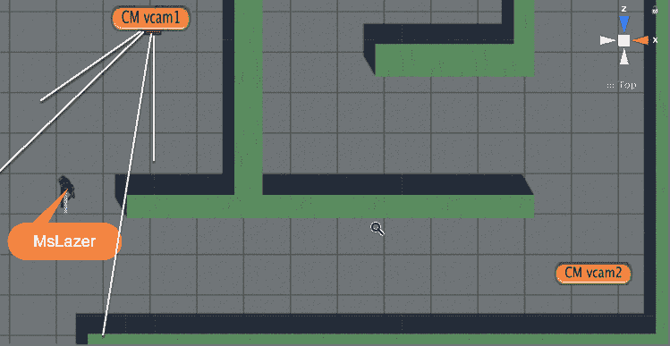

# 准备工作

此配方添加到本章第一个配方创建的场景中，因此复制该项目文件夹，并使用该副本完成此配方的操作。

# 如何操作...

要使用**Cinemachine ClearShot**切换相机以保持玩家在画面中，只需遵循以下步骤：

1.  打开提供的场景，其中包含一个 3D 迷宫和`character-MsLazer`。

1.  将`Main Camera`从`character-MsLazer`中解除关联，因为我们需要这个相机空闲，以便`Cinemachine`可以控制它。

1.  使用 Unity Package Manager 安装`Cinemachine`包（以获取最新版本）。

1.  在场景中添加一个**Cinemachine ClearShot**相机 GameObject（菜单：**Cinemachine** | **Create ClearShot Camera**）。你应该在层次结构中看到一个名为 CM Clearshot 1 的新 GameObject。将这个新 GameObject 的位置设置为（0,0,0）。

1.  CM Clearshot 1 应该有一个子 GameObject，Cinemachine Virtual Camera CM vcam 1。将这个虚拟相机，CM vcam 1 的位置设置为（10, 4, -10）。

1.  你还会看到已经添加了一个到**Main Camera**的 Cinemachine Brain 组件，在**层次结构**中，你会在**Main Camera**名称旁边看到 Cinemacine Brain 图标（一半灰色齿轮，一半红色相机）：

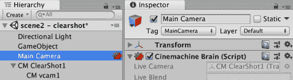

1.  在`character-MsLazer`的层级中定位`mixamorig:neck` GameObject。我们将使用`character-MsLazer`的这一部分作为我们的`Cinemachine`相机将用来定位的部分。

1.  选择**CM Clearshot 1**，然后在**检查器**中，将**Cinemachine ClearShot**组件的**Look At**属性填充为对`mixamorig:neck` GameObject 的引用（将 GameObject 从层级拖动到**检查器**中的属性）：**

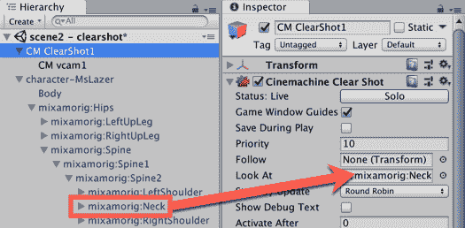

1.  运行**场景**。当您在场景中移动`character-MsLazer`时，主相机（由`Cinemachein`大脑控制）应该旋转以始终面向角色。然而，有时墙壁会遮挡视线。

1.  通过在层级中选择 CM Clearshot 1，创建第二个子虚拟相机，然后在检查器中点击`Cinemachine` Clear Shot 组件的**虚拟相机子代**属性的+按钮。您应该看到一个名为 CM vcam 2 的新虚拟相机子代被创建。将 CM vcam 2 的**位置**设置为（27, 4, -18）。

1.  运行**场景**。最初，CM vcam 1 拥有最佳的拍摄角度，因此将使用这个相机的位置来引导**主相机**。但是，如果您将`character-MsLazer`沿着走廊移动到 CM vcam 2，`Cinemachine`将切换控制到 CM vcam 2。

# 它是如何工作的...

在**场景**中添加了一个 Cinemachine Brain 组件。它控制**主相机**并使用一个或多个**虚拟 Cinemachine 相机**的属性来决定应用于**主相机**的属性。您添加了一个**Cinemachine ClearShot** GameObject，其目的是告诉**Cinemachine Brain**哪个其**虚拟相机**子代拥有最佳的拍摄角度。

您将`ClearShot`组件的**Look At**属性设置为`character-MsLazer`的颈部组件；此 GameObject 的位置被`ClearShot`组件用于对每个**虚拟相机**的拍摄质量进行排名。

# 还有更多...

我们只是刚刚触及了 Cinemachine 所能提供的表面。以下是一些学习更多知识的建议。

# Unity Cinemachine 教程

在 Unity 网站的“学习”部分，您可以找到许多介绍 Unity 不同动画功能的视频教程。有一个专门的类别是**Cinemachine**教程，它提供了 Cinemachine 功能和用途的全面概述：[`unity3d.com/learn/tutorials/s/animation`](https://unity3d.com/learn/tutorials/s/animation)。

# 威尔·戈尔茨坦（Will Goldstone）的 ClearShot 教程

这个配方受到了 YouTube 上威尔·戈尔茨坦（Will Goldstone）的 ClearShot 教程的启发：[`www.youtube.com/watch?v=kLcdrDljakA`](https://www.youtube.com/watch?v=kLcdrDljakA)。

# 亚当·迈希尔（Adam Myhill）的 Cinemachine 博客文章

Adam Myhill 的博客文章（他是**Cinemachine**的创造者）中包含大量关于许多不同 Cinemachine 功能的信息和视频链接：[`blogs.unity3d.com/2017/08/25/community-stories-cinemachine-and-timeline/`](https://blogs.unity3d.com/2017/08/25/community-stories-cinemachine-and-timeline/)。

# 阅读已安装的 Cinemachine 文档

**Cinemachine**的后续版本（2.1+）包含与包一起安装的文档。显示**Cinemachine**关于面板（菜单：**Cinemachine** | **About**），然后点击**Documentation**按钮：

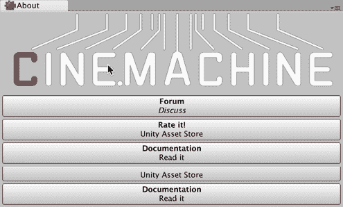

您也可以在网上找到文档，链接为[`docs.unity3d.com/Packages/com.unity.cinemachine@2.1/manual/index.html`](https://docs.unity3d.com/Packages/com.unity.cinemachine@2.1/manual/index.html)。

# 允许玩家切换到 Cinemachine FreeLook 相机

总是给玩家提供选择和控制他们的游戏体验是件好事。在这个配方中，我们将设置一个鼠标可控制的**Cinemachine FreeLook**相机，并允许玩家切换到它。

# 准备工作

此配方在先前的配方基础上添加内容，因此请复制那个项目文件夹，并使用该副本进行此配方的操作。

# 如何操作...

要探索 Cinemachine，只需遵循以下步骤：

1.  确保在**Main Camera**中的**Cinemachine Brain**组件的**Default Blend**属性设置为 Ease In Out。这意味着我们在切换相机之间将会有平滑的过渡。

1.  将一个**Cinemachine FreeLook**相机 GameObject 添加到场景中（菜单：**Cinemachine** | **Create FreeLook Camera**）。**您应该会在**“Hierarchy”**中看到一个名为`CM FreeLook 1`的新 GameObject。将**Cinemachine** **Free Look (Script)**组件的**Priority**属性设置为零。

1.  在**MsLazer**中的**Hierarchy**内找到`mixamorig:neck` GameObject。我们将使用**MsLazer**角色的这部分作为我们的**Cinemachine**相机将用来定位和以恒定距离跟随的部分。

1.  选择**CM FreeLook 1**，并在**Inspector**中填充**Cinemachine** **Free Look (Script)**组件的**Look At**和**Follow**属性，以引用`mixamorig:neck` GameObject（从**Hierarchy**拖动 GameObject 到**Inspector**中的属性）。**

1.  创建一个新的`FreeLookSwitcher` C# Script 类，包含以下代码，并将一个实例对象作为组件添加到**CM FreeLook 1** GameObject 中：

```cs
    using UnityEngine;
     using Cinemachine;

     public class FreeLookSwitcher : MonoBehaviour {
         private CinemachineFreeLook cinemachineFreeLook;

         private void Start() {
             cinemachineFreeLook = GetComponent<CinemachineFreeLook>();
         }

         void Update ()  {
             if (Input.GetKeyDown("1"))
                 cinemachineFreeLook.Priority = 99;

             if (Input.GetKeyDown("2"))
                 cinemachineFreeLook.Priority = 0;
         }
     }
```

1.  运行**Scene**。当在迷宫中移动时，最初**Cinemachine ClearShot**相机将由**Cinemachine** Brain 选择。但是，按下*1*键将使其切换到跟随玩家角色的**FreeLook**相机。按下*2*键将切换回**ClearShot**相机。

# 它是如何工作的...

你添加了一个**FreeLook Cinemachine**游戏对象，但优先级为零，因此最初会被忽略。当按下*1*键时，脚本将**Priority**提升到`99`（比**ClearShot**相机的默认值 10 高得多），因此**Cinemachine**脑部将使**FreeLook**虚拟相机控制**Main Camera**。按下*2*键将**FreeLook**组件的**Priority**降低回**zero**，因此将再次使用**ClearShot**相机。

从**FreeLook**到**ClearShot**以及返回的过渡应该是平滑的，因为你已经将**Main Camera**中的**Cinemachine Brain**组件的**Default Blend**属性设置为**Ease In Out**。
