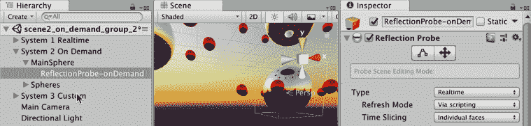

# 第八章：灯光与效果

在本章中，我们将涵盖以下主题：

+   使用 cookie 纹理模拟多云天气的方向光

+   为聚光灯创建并应用 cookie 纹理

+   向场景添加自定义反射贴图

+   使用投影仪创建激光瞄准

+   使用线渲染器增强激光瞄准

+   使用程序化 Skybox 和方向光设置环境

+   使用反射探针反射周围物体

+   使用材质发射烘焙来自发光灯的光线到场景物体上

+   使用光照贴图和光照探针照亮场景

# 简介

无论您是试图制作外观更好的游戏还是想添加有趣的功能，灯光和效果都可以提升您的项目并帮助您交付更高品质的产品。现代游戏引擎，包括 Unity，使用复杂的数学和物理建模来模拟光源与**场景**中物体之间的光线交互。

对于视觉上逼真的虚拟游戏**场景**，游戏引擎必须模拟光源、光线如何直接从这些光源照射到表面上，以及光线随后如何间接地从这些表面反弹到场景中的其他物体上，然后再次反弹到其他物体上，依此类推。对于包含许多物体和光源的丰富、复杂**场景**，每帧从头开始计算一切是不可能的，因此需要预先计算来模拟这些光源和表面之间的相互作用。

在本章中，我们将探讨使用灯光和效果的创意方式，并查看 Unity 的一些关键**光照**功能，例如程序化 Skyboxes、反射发射**材质**、探针、光照探针、自定义反射源和**全局光照**（**GI**）。

# 整体概念

在 Unity 中创建光源有许多方法。以下是对最常见方法的快速概述。

# 灯光

灯光作为具有灯光组件的 GameObject 放置到场景中。它们可以在实时、烘焙或混合模式下工作。在其他属性中，用户可以设置它们的范围、颜色、强度和阴影类型。有四种类型的灯光：

+   **方向光**：这通常用于模拟阳光

+   **聚光灯**：这就像一个圆锥形聚光灯

+   **点光**：这是一种类似灯泡的全向光

+   **区域光**：这是一种仅烘焙的灯光类型，从矩形实体向所有方向发射，允许实现平滑、逼真的着色

以下截图展示了不同类型的灯光及其场景面板图标：


# 环境光照

Unity 的环境光照通常是通过结合 Skybox**材质**和场景中定义的**方向光**的阳光来实现的。这种组合创建了一种环境光，它被集成到场景的环境中，并且可以设置为实时或烘焙到**光照贴图**中。

环境光照并不来自任何特定位置，因为它在整个场景中均匀分布。环境光可以用来影响场景的整体亮度：


# 发光材料

当应用于静态物体时，具有发射颜色或图的材料将在**实时**和**烘焙**模式下在附近的表面上投射光线，如下面的截图所示：


# 投影仪

如其名所示，投影仪可以通过将材料及其**纹理**图投影到其他物体上来模拟投影光和阴影：


# 光照贴图

光照贴图基本上是从**场景**的光照信息生成的**纹理**图，并将其应用于场景中的静态物体，以避免使用处理密集型的**实时**光照。

在**场景**中预计算光照被称为光照贴图**烘焙**。静态的（不可移动的）场景部分（灯光和其他物体）可以在游戏运行之前将它们的照明“烘焙”（预计算）。然后，在**运行时**，由于可以使用预计算的光照贴图而不是在**运行时**每帧重新计算，因此游戏性能得到提高（尽管这需要更多的内存来存储预计算）。

Unity 提供了两个光照贴图器，Enlighten 和较新的 Progressive 光照贴图器。Enlighten 可以很好地用于预计算的实时全局光照（环境光照）。Progressive 光照贴图器建议用于烘焙光照贴图。

# 光探针

光探针是一种在**场景**的特定点采样光照的方法，以便在没有使用**实时**光照的情况下将其应用于动态物体。**移动**（动态）的物体可以使用光探针，以便它们的照明随烘焙光源在**场景**中的位置变化而变化。

# 灯光设置窗口

灯光窗口，（菜单：窗口 | 渲染 | 灯光设置），是设置和调整场景照明功能（如光照贴图、全局光照、雾等）的中心：


# 光照探索器面板

当在 Unity 中处理灯光和光照时，一个有用的工具是光照探索器面板，它允许编辑和查看当前场景中所有灯光的属性。光照探索器面板列出了单个面板中的所有灯光，这使得单独处理每个灯光或同时更改多个灯光的设置变得容易。当处理涉及大量灯光游戏对象的场景时，它是一个节省时间的强大工具。

要显示光照探索器面板，请选择以下菜单：窗口 | 渲染 | 光照探索器：


# 棕色纸板

灯光可以应用 cookie **纹理**。cookie 是用于在**场景**中投射阴影或轮廓的**纹理**。它们是通过使用 cookie 纹理作为光源和被渲染表面之间的遮罩来产生的。它们的名称和用途来源于在剧院和电影制作中使用的物理设备 cucoloris（昵称 cookie），用于产生暗示环境效果的阴影，如移动的云彩、监狱窗户的栅栏或被丛林树叶遮挡的阳光。

# 色彩空间（伽玛和线性）

Unity 现在提供了两种色彩空间的选择：伽玛（默认）和线性。您可以通过以下菜单选择您想要的色彩空间：编辑 | 项目设置 | 玩家。虽然线性空间具有显著的优势，但并非所有硬件（尤其是移动系统）都支持它，因此您选择哪种将取决于您部署的平台。

# 进一步的资源

本章旨在向您介绍 Unity 的一些照明功能，并提供一些关于灯光和效果的技巧。在您学习本章中的食谱时，您可能希望从以下这些来源中了解更多关于本章主题的信息：

+   Unity 照明手册条目：[`docs.unity3d.com/Manual/Lighting.html`](https://docs.unity3d.com/Manual/Lighting.html)

+   Unity 的**全局照明**（**GI**）页面：

    +   [`docs.unity3d.com/Manual/GIIntro.html`](https://docs.unity3d.com/Manual/GIIntro.html)

    +   [`docs.unity3d.com/Manual/GlobalIllumination.html`](http://docs.unity3d.com/Manual/GlobalIllumination.html)

+   Unity 关于 cookie **纹理**的信息可以在他们的手册页面找到：[`docs.unity3d.com/Manual/Cookies.html`](https://docs.unity3d.com/Manual/Cookies.html)

+   另一个关于 Unity 和 cookie **纹理**的来源是 Unity 的*CgProgramming WikiBook*：[`en.wikibooks.org/wiki/Cg_Programming/Unity/Cookies`](https://en.wikibooks.org/wiki/Cg_Programming/Unity/Cookies)

+   Unity 手册关于选择色彩空间：[`unity3d.com/learn/tutorials/topics/graphics/choosing-color-space`](https://unity3d.com/learn/tutorials/topics/graphics/choosing-color-space)

+   Unity 手册关于照明探索器面板的信息：[`docs.unity3d.com/Manual/LightingExplorer.html`](https://docs.unity3d.com/Manual/LightingExplorer.html)

+   关于线性伽玛照明工作流程的信息：[`docs.unity3d.com/Manual/LinearRendering-LinearOrGammaWorkflow.html`](https://docs.unity3d.com/Manual/LinearRendering-LinearOrGammaWorkflow.html)

+   LMHPoly 关于在 Unity 中改善照明的 7 个技巧的文章：[`lmhpoly.com/7-tips-for-better-lighting-in-unity/`](https://lmhpoly.com/7-tips-for-better-lighting-in-unity/)

# 使用 cookie 纹理模拟多云天气的方向光

正如许多第一人称射击游戏和生存恐怖游戏中可以看到的那样，灯光和阴影可以为场景增添许多真实感，极大地帮助创造适合游戏的氛围。在这个菜谱中，我们将使用 cookie **纹理**创建一个多云的户外环境。Cookie **纹理**充当灯光的遮罩。它通过调整灯光投影到 cookie 纹理的 alpha 通道的强度来工作。这可以实现轮廓效果（想想蝙蝠信号），或者在这个特定案例中，细微的变化，给灯光带来过滤后的质感。

# 准备工作

如果您无法访问图像编辑器，或者希望跳过**纹理**映射的详细说明，以便专注于实现，我们已经在`07_01`文件夹中提供了准备好的 cookie 图像文件 cloudCookie.tga。

# 如何做到这一点...

要模拟多云的户外环境，请按照以下步骤操作：

1.  在您的图像编辑器中创建一个新的 512 x 512 像素图像。

1.  使用黑色作为前景色和白色作为背景色，应用云彩滤镜 - 在 Photoshop 中，选择以下菜单：滤镜 | 渲染 | 云彩：


了解 alpha 通道很有用，但您可以在没有它的情况下得到相同的结果。跳过步骤 3 到 7，将图像保存为 cloudCookie.png，并在步骤 9 更改纹理类型时，保留灰度中的 Alpha 选中。

1.  选择您的整个图像并复制它。

1.  打开通道窗口（在 Photoshop 中，可以通过以下菜单操作：窗口 | 通道。

1.  应该有三个通道：红色、绿色和蓝色。创建一个新的通道。这将是一个 alpha 通道。

1.  在通道窗口中，选择 Alpha 1 通道并将您的图像粘贴进去：


1.  将您的图像文件保存为 cloudCookie.PSD 或 TGA。

1.  将您的图像文件导入 Unity 并在项目面板中选择它。

1.  在**检查器**中，将其纹理类型更改为 Cookie，其灯光类型更改为方向。然后，按照以下方式点击应用：


1.  让我们在场景中添加一束光。由于我们想要模拟阳光，最佳选项是创建一个**方向光**。选择层次菜单：创建 | 光 | 方向光。

1.  我们需要一个表面来真正看到灯光效果。您可以在场景中添加一个 3D 平面（菜单：游戏对象 | 3D 对象 | 平面），或者创建一个 3D 地形（菜单：游戏对象 | 3D 对象 | 地形）。

1.  在检查器中，将灯光的变换位置重置为（`0, 0, 0`）及其旋转重置为（`90, 0, 0`）。

1.  在 Cookie 字段中，选择您之前导入的 cloudCookie 纹理。将 Cookie Size 字段更改为 15，或您认为更适合场景尺寸的值。将阴影类型设置为无阴影：


1.  创建一个新的 C#脚本类名为 ShadowMover，并将实例对象作为组件添加到**方向光**：

```cs
 public class ShadowMover : MonoBehaviour {
         public float windSpeedX = 2;
         public float windSpeedZ = 2;

         private float lightCookieSize;
         private Vector3 startPosition;
         private float limitX;
         private float limitZ;
         private Vector3 windMovement;

         void Start() {
             startPosition = transform.position;
             lightCookieSize = GetComponent<Light>().cookieSize;
             limitX = Mathf.Abs(startPosition.x) + lightCookieSize;
             limitZ = Mathf.Abs(startPosition.z) + lightCookieSize;
             windMovement = new Vector3(windSpeedX, 0, windSpeedZ);
         }

         void Update() {
             Vector3 position = transform.position + (Time.deltaTime 
             * windMovement);
             position.x = WrapValue(position.x, limitX,     
             startPosition.x);
             position.z = WrapValue(position.z, limitZ,         
             startPosition.z);
             transform.position = position;
         }

         private float WrapValue(float n, float limit, float  
         startValue) {
             float absoluteValue = Mathf.Abs(n);
             if (absoluteValue > limit)
                 return startValue;
             else
                 return n;
         }
     }
```

1.  选择方向光。在检查器中，将参数风速 X 和风速 Z 更改为不同的值。

1.  播放你的场景。现在阴影将会移动。

# 它是如何工作的...

脚本类提供了两个公共值，用于 X 和 Z 方向的速度（模拟风速）。

当场景开始时，首先，存储方向光的初始位置。然后，从同级光组件中读取饼干的大小，并用于计算最大 X 和 Z 值。最后，创建一个 Vector3，用于在秒内移动我们的光，基于 X 和 Z 窗口速度（Y 为零，因为我们不需要在 Y 轴上移动方向光）。

`WrapValue(...)` 方法被定义，它返回一个值。如果第一个参数（正数）的值超过第二个参数（限制），则返回第三个参数（初始值）。否则，返回第一个参数的值。这允许我们确保如果一个值（例如，我们的 X 或 Z 坐标）超出了限制，我们可以将其“包裹”回起始值。

`Update()` 方法在每一帧执行。计算光的下一个位置（当前位置加上当前帧每秒风速向量的比例）。使用我们的 `WrapValue(...)` 方法设置这个新位置的 X 和 Z 值，这样我们知道它们的限制值不会超过。最后，将光的位置设置为这个新位置，`Vector3`。

我们没有启用阴影的原因是因为 X 轴的光角度必须是 90 度（否则当光重置到原始位置时会有明显的间隙）。如果你想在场景中实现动态阴影，请添加第二个 **方向光**。

# 创建并应用饼干纹理到聚光灯上

饼干纹理可以很好地与 Unity **聚光灯**一起工作，以模拟来自投影仪、窗户等处的阴影。一个例子是监狱窗户的栅栏。

在这个菜谱中，我们将创建并应用一个适合与 Unity **聚光灯**一起使用的饼干**纹理**：


# 准备工作

如果你没有访问图像编辑器的权限，或者希望跳过**纹理**映射的详细说明，以便专注于实现，我们在 `07_02` 文件夹中提供了名为 spotCookie.tif 的准备好的饼干图像文件。

# 如何做...

要创建并应用饼干纹理到聚光灯上，请按照以下步骤操作：

1.  在你的图像编辑器中，创建一个 512 x 512 灰度像素图像。

1.  通过将画笔工具颜色设置为黑色并在图像的四周边缘绘制，确保边界完全为黑色。然后，绘制一些交叉的线条。保存你的图像，命名为 spotCookie：


1.  将你的图像文件导入 Unity 并在项目面板中选择它。

1.  在检查器中，将其纹理类型更改为 Cookie，并将光类型更改为聚光灯，然后将 Alpha 源设置为从灰度。然后，按照以下方式点击应用：


1.  创建一个包含以下内容的场景：

    +   一个平坦的 3D 地形或平面作为我们的地面

    +   一个 3D 立方体或平面，拉伸以充当墙壁

    +   墙壁前面的两到三个其他 3D 对象

1.  将**主摄像机**定位为显示“墙壁”前面的 3D 对象。

1.  现在，通过选择以下菜单将聚光灯添加到场景中：创建 | 光 | 聚光灯。

1.  将聚光灯定位为主摄像机指向的方向——你可能需要将 Y 值旋转 180 度。

1.  将阴影类型设置为无阴影，并将你的 spotCookie **纹理**从项目面板拖动到 Cookie 槽中。

1.  播放你的场景。你现在应该看到聚光灯投射出阴影，就像光线穿过木条或金属板的网格一样。

# 它是如何工作的...

我们创建了一个用于 Unity 聚光灯的灰度纹理——边缘完全为黑色——这样光线就不会“溢出”到我们的聚光灯发射边缘。纹理中的黑色线条被 Unity 用来在从聚光灯发出的光中创建阴影，从而产生一些直的木棍或金属杆的光束效果。

你可以在 Unity 教程页面了解更多关于创建聚光灯 cookie 的信息：[`docs.unity3d.com/Manual/HOWTO-LightCookie.html`](http://docs.unity3d.com/Manual/HOWTO-LightCookie.html)。

# 向场景添加自定义反射图

Unity 的标准着色器从场景的反射源获取反射，这是在照明窗口的场景部分中配置的。每种材质的反射程度由其金属值或光泽值定义，具体取决于正在使用的着色器。这种方法可以节省大量时间，允许你快速将相同的反射图分配给场景中的每个对象。它还有助于保持场景的整体外观协调一致。在本菜谱中，我们将学习如何利用反射源功能：


# 准备工作

对于这个菜谱，我们将准备一个反射立方体贴图，这基本上是将环境投影到材质上的反射。它可以由六个或，如本菜谱所示，一个单独的图像文件制作。

为了帮助我们完成这个菜谱，我们提供了一个 Unity 包（batteryPrefab.unitypackage），其中包含一个由 3D 对象和基本材质（使用 TIFF 作为漫反射图）组成的预制件，以及一个用于反射图的 JPG 文件。所有这些文件都在`07_03`文件夹中。

# 如何做到这一点...

要给材质添加反射性和光泽度，请按照以下步骤操作：

1.  将 batteryPrefab.unitypackage 包导入新项目。然后，从**项目**面板中选择 Assets 文件夹中的 battery_prefab 对象。

1.  从检查器中展开**材质**组件，观察资产预览窗口。多亏了高光贴图，材质已经具有反射外观。然而，它看起来像是在反射场景的默认天空盒，如下面的截图所示：


1.  导入 CustomReflection.jpg 图像文件。确保在项目面板中选中此资产。

1.  在其导入设置检查器中，设置以下属性：

    +   **纹理类型**: 默认

    +   **纹理形状**: 立方体

    +   **映射**: 纬度-经度布局（圆柱形）

    +   **卷积类型**: 无

    +   **修复边缘接缝**: 已勾选

    +   **过滤模式**: 三线性

    +   现在，点击应用按钮，如下所示：


1.  让我们将场景的天空盒替换为我们新创建的立方体贴图，作为场景的反射贴图（菜单：窗口 | 渲染 | 灯光设置）。

1.  选择**场景**部分，并使用下拉菜单将反射源更改为自定义。最后，将新创建的 CustomReflection 纹理作为立方体贴图分配，如下所示：


1.  查看电池 _prefab 对象上的新反射。

# 它是如何工作的...

材质的高光贴图提供了反射外观，包括反射的强度和光滑度。然而，反射中看到的图像是由我们创建的立方体贴图提供的。

# 更多...

反射立方体贴图可以通过多种方式实现，并且具有不同的映射属性。

# 映射坐标

我们应用的圆柱形映射非常适合我们使用的照片。然而，根据反射图像的生成方式，基于立方体或球体贴图的映射可能更合适。此外，请注意，修复边缘接缝选项将尝试使图像无缝。

# 锐利反射

你可能已经注意到，与原始图像相比，反射有些模糊；这是因为我们勾选了光泽反射框。为了获得更清晰的反射效果，取消选中此选项；在这种情况下，你还可以将过滤模式选项保留为默认（双线性）。

# 最大尺寸

在 512 x 512 像素时，我们的反射贴图可能在低端机器上运行良好。然而，如果你的游戏中反射贴图的质量不是很重要，并且原始图像的尺寸很大（比如说，4096 x 4096），你可能想将导入设置菜单中的纹理最大尺寸从高数值降低。

# 使用投影仪创建激光瞄准

虽然使用 UI 元素，如准星，是允许玩家瞄准的有效方法，但用投影激光点替换（或结合）它可能是一个更有趣的方法。在这个菜谱中，我们将使用灯光投影仪来实现这个概念：


# 准备工作

为了帮助您完成这个食谱，在 `07_04` 文件夹中，我们提供了一个 Unity 包（laserAssets.unitypackage），其中包含一个包含一个手持激光指示器的角色示例场景，以及一个名为 LineTexture 的纹理图。

# 如何操作...

要使用 Projector 创建激光点瞄准，请按照以下步骤操作：

1.  开始一个新的 3D 项目。

1.  我们将导入 **Unity 标准资产** 中的 Projectors 组件。如果您在安装 Unity 时没有安装 **标准资产**，请访问 **资产商店** 并现在安装免费的 **标准资产**。

1.  将 `laserAssets.unitypackage` 导入到一个新项目中。然后，打开名为 basic_scene_MsLaser 的场景。这是一个基本场景，包含一个在迷宫中的玩家角色，可以使用标准箭头键或 WASD 进行移动。

1.  从 Effects Unity 标准资产包文件夹导入 **Projectors** 内容：


1.  从 **检查器** 中，找到 ProjectorLight 着色器（在 Assets | Standard Assets | Effects | Projectors | Shaders 文件夹内部）。复制文件，并将新副本命名为 ProjectorLaser。

1.  打开 ProjectorLaser。从代码的第一行开始，将 Shader `"Projector/Light"` 更改为 Shader `"Projector/Laser"`。然后，找到 `Blend DstColor One` 并将其更改为 `Blend One One`。保存并关闭文件：


编辑激光着色器的目的是通过将其混合类型更改为叠加来增强其效果。着色器编程是一个复杂的话题，超出了本书的范围。然而，如果您想了解更多，请查看 Unity 关于该主题的文档，可在 [`docs.unity3d.com/Manual/SL-Reference.html`](http://docs.unity3d.com/Manual/SL-Reference.html) 找到，以及由 Packt 出版的名为 *Unity Shaders and Effects Cookbook* 的书籍。

1.  创建一个名为 m_laser 的新材质。在检查器中，将其着色器更改为 Projector/Laser。

1.  在 **项目** 面板中找到 Falloff Texture（在 Effects | Projectors | Textures 内部）。

1.  在您的图像编辑器中打开它，除了第一列和最后一列像素应该是黑色之外，将其他所有内容涂成白色。将更改后的图像文件保存为 Falloff_laser 并返回 Unity：


1.  在 **项目** 面板中选择 m_laser 资产。在检查器中，将主颜色设置为红色（RGB：255, 0, 0）。然后，从纹理槽中拖动 **Texture** Light 到 Cookie 槽中，并将 **Texture** Falloff_laser 拖动到 Falloff 槽中（这些 **纹理** 在您导入的文件夹中，Effects | Projectors | Textures 内部）：


1.  从**层次结构**中找到并选择 pointerPrefab 对象（MsLaser | mixamorig:Hips | mixamorig:Spine | mixamorig:Spine1 | mixamorig:Spine2 | mixamorig:RightShoulder | mixamorig:RightArm | mixamorig:RightForeArm | mixamorig:RightHand | pointerPrefab）。然后，创建一个新的子 GameObject（菜单：创建 | 创建空子对象）。将这个新子对象重命名为 laserProjector：


1.  选择激光投影仪对象。然后，从**检查器**中点击添加组件按钮，导航到效果 | 投影仪。接着，从新的投影仪组件中，将正交选项设置为 true，并将正交大小设置为`0.1`。最后，从材质槽中选择 m_laser。

1.  运行场景。您将能够看到激光瞄准点。

# 它是如何工作的...

在这个食谱中，瞄准点的尺寸已经被夸大了。如果您需要激光指针更真实的厚度，请将**投影仪**组件的正交大小更改为更小的值，如 0.025。

激光瞄准效果是通过使用投影仪实现的。投影仪可以用来模拟光线、阴影等，它是一个将材质（及其纹理）投影到其他游戏对象的组件。通过将投影仪附加到激光指针对象上，我们确保它始终面向正确的方向。为了获得所需的鲜艳外观，我们编辑了投影仪材质的 Shader 代码，使其更亮。

# 更多内容...

这里有一些增强这个食谱的方法。

# 通过 Raycast 击中限制激光范围以限制远裁剪平面

我们的目标激光应该突出显示它击中的第一个对象——它不应该穿过前面的所有对象。项目的远裁剪平面定义了投影仪停止的距离。我们可以使用一个简单的脚本来发射 Raycast，并使用击中第一个对象的距离作为设置此远裁剪平面的指南：

```cs
using UnityEngine;

     public class LaserAim : MonoBehaviour  {
         private Projector projector;
         private float margin = 0.5f;

         void Start () {
             projector = GetComponent<Projector> ();
         }

         void Update ()  {
             RaycastHit hit;
             Vector3 forward =         
             transform.TransformDirection(Vector3.forward);

             if (Physics.Raycast(transform.position, forward, out hit))
                 projector.farClipPlane = hit.distance + margin;
         }
     }
```

如果 Raycast 击中一个对象，我们将**投影仪**的远裁剪平面设置为该距离，再加上 0.5 个 Unity 单位的小边距（例如，它可能是一个曲面）。

我们通过设置其远裁剪平面在接收投影的第一个对象的大致同一水平上，编写了一个脚本，以防止投影穿过对象。负责此操作的代码行如下：

```cs
projector.farClipPlane = hit.distance + margin 
```

# 进一步阅读

在 Unity 手册页面了解有关投影仪的更多信息：[`docs.unity3d.com/Manual/class-Projector.html`](https://docs.unity3d.com/Manual/class-Projector.html)。

# 使用 Line Renderer 增强激光瞄准

让我们通过显示从角色的激光枪到投影激光目标的光束来改进之前的食谱。我们将通过编写一个每帧重绘的 Line Renderer 脚本来实现激光束：


# 准备工作

此配方基于之前的配方，因此复制该项目并使用其副本进行工作。您还需要一个用于光束颜色的**纹理**；在`07_05`文件夹中提供了一个名为 beam.psd 的纹理。

# 如何做到这一点...

要使用 Line Renderer 增强激光瞄准，请按照以下步骤操作：

1.  我们的 Line Renderer 需要一个**材质**来工作。创建一个新的材质，命名为 m_beam。

1.  在**检查器**中，将 m_beam 的着色器设置为 Particles/Additive。同时，将其色调颜色设置为红色（**RGB**：`255;0;0`）。

1.  导入光束图像文件。然后，将其设置为 m_beam 的粒子**纹理**，如下所示：


1.  创建一个新的 C#脚本类名为 LaserBeam，并将实例对象作为组件添加到游戏对象的激光投影器中：

```cs
public class LaserBeam : MonoBehaviour  {
     public float lineWidth = 0.2f;
     public Color regularColor = new Color (0.15f, 0, 0, 1);
     public Material beamMaterial;

     private Vector3 lineEnd;
     private LineRenderer line;

     void Start () {
         line = gameObject.AddComponent<LineRenderer>();
         line.material = beamMaterial;
         line.material.SetColor("_TintColor", regularColor);
         line.SetVertexCount(2);
         line.SetWidth(lineWidth, lineWidth);
     }

     void Update () {
         RaycastHit hit;
         Vector3 forward = 
         transform.TransformDirection(Vector3.forward);

         if (Physics.Raycast (transform.position, forward, out hit))
             lineEnd =  hit.point;
         else
             lineEnd = transform.position + forward * 10f;

         line.SetPosition(0, transform.position);
         line.SetPosition(1, lineEnd);
     }
 }
```

1.  选择激光投影器游戏对象。从检查器中，找到激光束（脚本）组件并将 m_beam 材质从项目面板拖动到光束材质中。

1.  播放场景。红色激光束应该从激光枪到被光束击中的第一个物体形成一条线。

# 它是如何工作的...

激光瞄准效果是通过使用动态 Line Renderer 实现的，它通过代码在每一帧创建和更新。

在本配方中，激光束的宽度被夸大了。如果您需要更逼真的厚度，请将激光束（脚本）组件的线宽字段更改为 0.05。同时，记得通过设置激光束组件的常规颜色更亮来使光束更不透明。您可能还想匹配激光瞄准投影器的大小，因此将投影器组件的正交大小设置为更小的值，例如 0.025。

关于 Line Renderer，我们选择通过代码动态创建它，而不是手动将组件添加到游戏对象中。

# 还有更多...

这里有一些增强此配方的方法。

# 当按下火焰键时更改光束颜色

当玩家执行某些操作时，提供音频或视觉反馈总是好的。所以，当玩家按下**火焰**按钮（例如，鼠标按钮）时，让我们改变光束的颜色。请执行以下操作：

1.  为火焰光束颜色添加一个新的公共变量：

```cs
public Color firingColor = new Color (0.31f, 0, 0, 1);
```

1.  添加一个新的方法来设置颜色变化（使用正弦波值）：

```cs
private void SetupColor() {
         float lerpSpeed = Mathf.Sin (Time.time * 10f);
         lerpSpeed = Mathf.Abs(lerpSpeed);
         Color lerpColor = Color.Lerp(regularColor, firingColor, 
         lerpSpeed);
         line.material.SetColor("_TintColor", lerpColor);
     }
```

1.  在`Update()`方法的末尾添加语句以检测当按下/释放火焰按钮时触发颜色变化：

```cs
void Update ()  {
         // … (as before)

         if(Input.GetButton("Fire1"))
             SetupColor();

         if(Input.GetButtonUp("Fire1"))
             line.material.SetColor("_TintColor", regularColor);
     }
```

# 设置程序化 Skybox 和方向光的环境

除了传统的六边形和 Cubemap Skyboxes 之外，Unity 还提供了一种第三种类型的 skybox：程序化 Skybox。易于创建和设置，程序化 Skybox 可以与方向光结合使用，为场景提供环境光照。在本配方中，我们将了解程序化 Skybox 的不同参数：


# 如何做到这一点...

要使用程序化天空盒和 **方向光** 设置环境照明，请按照以下步骤操作：

1.  在 Unity 项目内创建一个新的 **场景**。观察到一个新的场景已经包括两个对象：主摄像机和一个方向光。

1.  在场景中创建一个名为 Plane-ground 的 3D 平面；定位在 (0, 0, 0) 并缩放到 (`20, 20, 20`)。

1.  向你的场景添加一些 3D 立方体，如下所示：


1.  创建一个名为 m_skybox 的新 **材质** 资产文件。在检查器中，将着色器从标准更改为 Skybox/程序化。

1.  打开照明窗口（窗口 | 渲染 | 照明设置），并访问场景部分。在环境照明子部分，将 m_skybox 材质填充到天空盒槽中，并将场景的默认方向光填充到太阳槽中。确保实时全局照明选项被勾选（来自实时照明），并且环境环境模式设置为实时。

1.  从 **项目** 面板中选择 m_skybox。然后，从检查器中设置太阳大小为 0.05 和大气厚度为 1.4。通过改变天空色调颜色到 RGB：148；128；128，并将地面颜色设置为类似于场景立方体地板颜色的值（例如 RGB：202；202；202）进行实验。如果你觉得场景太亮，尝试将曝光级别降低到 0.85，如下所示：


1.  选择方向光并将其旋转设置为 5, 170, 0。同时确保其光模式设置为实时（不是烘焙或混合）。

1.  运行场景 – 它应该类似于黎明环境。

# 它是如何工作的...

最终，Unity 本地程序化天空盒的外观取决于构成它们的五个参数：

+   太阳大小：绘制到天空盒上的明亮黄色太阳的大小是根据方向光在 X 和 Y 轴上的旋转定位的。

+   大气厚度：这模拟了此天空盒的大气密度。较低的值（小于 1.0）适合模拟外太空设置。中等值（大约 1.0）适合地球环境。略高于 1.0 的值在模拟空气污染和其他戏剧性设置时可能很有用。夸张的值（例如，大于 2.0）可以帮助说明极端条件或甚至外星环境。

+   天空色调：这是用于着色天空盒的颜色。它对于微调或创建风格化环境很有用。

+   地面：这是地面的颜色。它真的会影响场景的全局照明。因此，选择一个接近关卡地形和/或几何形状（或中性）的值。

+   曝光：这决定了进入天空盒的光量。较高的级别模拟过曝，而较低的值模拟欠曝。

需要注意的是，天空盒的外观将响应场景的方向光，扮演太阳的角色。在这种情况下，围绕 X 轴旋转光线可以创建黎明和日落场景，而围绕 Y 轴旋转则会改变太阳的位置，改变场景的方位点。

关于环境照明，也请注意，尽管我们使用了天空盒作为环境光源，但我们也可以选择渐变或单色，在这种情况下，场景的照明就不会附着于天空盒的外观。

最后，关于环境照明，请注意，我们已经将环境光漫反射设置为实时。这样做的原因是为了允许由旋转的方向光促进的实时光漫反射变化。如果我们不需要在运行时进行这些变化，我们可以选择烘焙的替代方案。

# 还有更多...

这里有一些增强这道菜谱的方法。

# 通过脚本旋转方向光设置和升起太阳

通过使用代码更改方向光的旋转，让事情变得更加有趣。这将给我们的场景带来动态的日出/日落效果。

创建一个新的 C#脚本类名为 RotateLight，并将一个实例对象作为组件添加到方向光游戏对象：

```cs
using UnityEngine;
     using System.Collections;
     public class RotateLight : MonoBehaviour {
       public float speed = -1.0f;
       void Update () {
         transform.Rotate(Vector3.right * speed * Time.deltaTime);
       }
     }
```

现在，当你运行场景时，你会看到太阳升起/落下，照明颜色相应地改变。

# 添加光晕

让我们在场景中添加一个光晕效果。

对于这一步，你需要导入 Unity 的标准资产效果包，你应该在安装 Unity 时安装了它，但你也可以通过 Unity 资产商店将其添加到单个项目中。

1.  从效果 Unity 标准资产包文件夹导入光晕内容。

1.  选择方向光。在检查器中，对于灯光组件，将光晕槽填充为太阳光晕（从项目面板，效果 | 灯光光晕 | 光晕文件夹）。

1.  在照明窗口的场景部分，找到其他设置子部分。然后，将光晕淡入速度设置为 1，光晕强度设置为 0.46，如下所示：


1.  播放场景。应该已经将光晕效果应用于场景的照明。

# 使用反射探针反射周围对象

如果你想让你的场景环境通过具有反射材料（如具有高金属或高镜面级别的材料）的 Game Objects 反射，那么你可以通过使用反射探头来实现这种效果。它们允许通过使用立方体贴图实现实时、烘焙或自定义反射。

实时反射在处理方面可能会很昂贵；在这种情况下，你应该优先考虑烘焙反射，除非确实有必要显示动态对象被反射（例如，类似镜子的对象）。尽管如此，还有一些方法可以优化实时反射。在这个食谱中，我们将测试反射探针的三个不同配置：

+   实时反射（持续更新）

+   实时反射（通过脚本按需更新）

+   烘焙反射（来自编辑器）

# 准备工作

对于这个食谱，我们准备了一个基本场景，其中包括三组反射对象：一组是持续移动的，一组是静态的，还有一组在交互时移动。包含场景的`reflectionProbes.unitypackage`包可以在`07_07`文件夹中找到。

# 如何操作...

要使用反射探针反射周围的对象，请按照以下步骤操作：

1.  导入 Unity 包`reflectionProbes.unitypackage`。然后，打开名为 reflective_objects 的场景。这是一个包含三组反射对象的基本场景。

1.  确保项目的质量设置已启用实时反射探针。通过选择菜单：编辑 | 项目设置 | 质量，并确保要使用的质量设置中已选中实时反射探针选项。

1.  播放场景。观察到一个系统是动态的，一个是静态的，还有一个在按下键时随机旋转。

1.  停止场景。

1.  首先，让我们为场景创建一个持续更新的实时反射探针（菜单：创建 | 光 | 反射探针）。将其命名为 ReflectionProbe-real-time。

1.  将 ReflectionProbe-real-time 设置为游戏对象系统 1 实时 | MainSphere 的子对象。然后，在检查器中，将其变换位置设置为（0, 0, 0）：


1.  在检查器中，找到反射探针组件。将类型设置为实时，刷新模式设置为每帧，时间切片设置为无时间切片，如下所示：


1.  播放场景。现在，系统 1 实时上的反射将实时更新。停止场景。

1.  注意，唯一显示实时反射的对象是系统 1 实时 | MainSphere。原因是反射探针的盒子大小。从反射探针组件中，将其大小更改为（25, 10, 25）。请注意，现在小红色球体也会受到影响。然而，重要的是要注意所有对象都显示相同的反射。由于我们的反射探针的起点与 MainSphere 的位置相同，所有反射对象都将从这个视角显示反射：


1.  如果你想要消除 Reflection Probe 内反射对象的反射，例如小红色球，选择这些对象，从 Mesh Renderer 组件中，将 Reflection Probes 设置为关闭，如下所示：


1.  向场景中添加一个新的 Reflection Probe。这次，将其命名为 ReflectionProbe-onDemand，并使其成为 System 2 On Demand | MainSphere GameObject 的子对象。然后，在检查器中，将变换位置更改为(0,0,0)。

1.  现在，前往 Reflection Probe 组件。将类型设置为实时，刷新模式设置为通过脚本，时间切片设置为单个面，如下所示：



1.  创建一个新的 C#脚本类名为 UpdateProbe，并将实例对象作为组件添加到 ReflectionProbe-onDemand GameObject：

```cs
 using UnityEngine;
 using System.Collections;

 public class UpdateProbe : MonoBehaviour {
    private ReflectionProbe probe;

    void Awake () {
       probe = GetComponent<ReflectionProbe> ();
       probe.RenderProbe();
    }

    public void RefreshProbe(){
       probe.RenderProbe();
    }
 }
```

1.  现在，找到名为 RandomRotation 的脚本类，它附加到 System 2 On Demand | Spheres 对象上，并将其替换为以下内容：

```cs
using UnityEngine;

public class RandomRotation : MonoBehaviour {
   private GameObject probe;
   private UpdateProbe updateProbe;

   void Awake() {
      probe = GameObject.Find("ReflectionProbe-onDemand");
      updateProbe = probe.GetComponent<UpdateProbe>();
   }

   void Update () {
      if (Input.anyKeyDown) {
          Vector3 newRotation = transform.eulerAngles;
          newRotation.y = Random.Range(0F, 360F);
          transform.eulerAngles = newRotation;
          updateProbe.RefreshProbe();
      }
   }
}
```

1.  保存脚本并测试你的场景。观察每当按下键时 Reflection Probe 是如何更新的。

1.  停止场景。向场景中添加第三个 Reflection Probe。将其命名为 ReflectionProbe-custom，并使其成为 System 3 On Custom | MainSphere GameObject 的子对象。然后，在检查器中，将变换位置更改为(0,0,0)。

1.  前往 Reflection Probe 组件。将类型设置为 Custom，然后点击 Bake 按钮，如下所示：


1.  将会弹出一个保存文件对话框。将文件保存为 ReflectionProbe-custom-reflectionHDR.exr。

1.  注意，反射贴图不包括红色球在其上的反射。要更改这一点，你有两种选择：将 System 3 On Custom | Spheres GameObject（及其所有子对象）设置为 Reflection Probe Static，如下所示：


1.  或者检查 ReflectionProbe-custom GameObject 的 Reflection Probe 组件中的 Dynamic Objects 选项。注意，使用此选项时，你也会在 System 3 Custom 的 MainSphere 上的反射中看到其他两个大球及其红色球带的反射。

1.  选择 ReflectionProbe-custom GameObject，然后再次点击 Bake 按钮。你现在应该能看到红色球在其上的反射。

1.  如果你希望在编辑场景时动态烘焙你的反射立方体贴图，可以将 Reflection Probe 类型设置为 baked，打开照明窗口（菜单：窗口 | 渲染 | 照明设置），访问场景部分，并检查自动生成选项，如下所示：


此模式不会包括动态对象在反射中，所以请确保将 System 3 Custom | Spheres 和 System 3 Custom | MainSphere 设置为 Reflection Probe Static。

# 它是如何工作的...

反射探针元素类似于全向摄像机，它渲染 Cubemaps 并将它们应用到其约束内的对象上。在创建反射探针时，了解不同类型的工作方式很重要：

+   **实时反射探针**：**Cubemaps**在运行时更新。实时反射探针有三种不同的刷新模式：在唤醒时（Cubemap 在场景开始前烘焙一次）；每帧（Cubemap 不断更新）；通过脚本（每当使用 RenderProbe 函数时更新 Cubemap）。由于 Cubemaps 有六个面，反射探针具有时间切片功能，因此每个面可以独立更新。有三种不同类型的时间切片：一次性更新所有面（一次渲染所有面，并在 6 帧内计算米普图。在 9 帧内更新探针）；单独更新面（每个面在多帧内渲染。在 14 帧内更新探针。结果可能有点不准确，但这是在帧率影响方面最经济的解决方案）；无时间切片（探针在一帧内渲染，米普图在一帧内计算。它提供高精度，但也是帧率影响中最昂贵的）。

+   烘焙：当编辑屏幕时，Cubemaps 会被烘焙。Cubemaps 可以是手动或自动更新，这取决于是否勾选了自动生成选项（可以在光照设置窗口的场景部分找到）。

+   自定义：自定义反射探针可以是手动从场景烘焙（甚至包括动态对象），或者从预制的 Cubemap 创建。

# 还有更多...

有许多其他设置可以调整，例如重要性、强度、盒子投影、分辨率、HDR（高动态范围）等。为了全面了解每个设置，我们强烈建议您阅读 Unity 关于该主题的文档，该文档可在[`docs.unity3d.com/Manual/class-ReflectionProbe.html`](http://docs.unity3d.com/Manual/class-ReflectionProbe.html)找到。

# 使用材质发射将发光灯的光线烘焙到场景对象上

除了灯光之外，其他对象如果它们的材质具有发射属性（例如纹理和/或着色颜色），也可以发光。在这个配方中，我们将创建一个通过其发射纹理发出绿色光的灯。场景中的灯和其他 3D 对象将被烘焙，以创建场景的预计算光照图：


# 准备工作

对于这个配方，我们在`07_08`文件夹中的`lamp.unitypackage` Unity 包中提供了一个 3D 灯模型（lamp），以及一个绿色纹理（lamp_emission）。

# 如何操作...

要使用材质发射创建发光灯，请按照以下步骤操作：

1.  创建一个新的 3D 项目。你应该从一个包含主摄像机和方向光的**场景**开始。

1.  导入包含 3D 灯模型（灯）以及绿色纹理（lamp_emission）的 Unity 包`lamp.unitypackage`。

1.  在项目面板中选择了 3D 模型资产灯后，在检查器中勾选其生成光照图 UV 选项，并点击应用按钮以确认更改：


1.  在项目面板中，选择材质 m_lamp。勾选发射选项，然后将纹理 lamp_emission 分配给其发射颜色属性。将全局光照下拉菜单设置为烘焙。这将使灯对象发出绿色光，并将其烘焙到光照图中：


1.  此外，对于**材质**m_lamp，点击 HDR 颜色框，并增加这个发光材质的强度到 1 或 2（这是一个你可能需要调整以获得场景所需设置的值）：


1.  添加一些 3D 游戏对象以创建一个简单的 3D 场景，包含一个 3D 平面（地面）和三个 3D 立方体。调整 3D 立方体的位置和大小，使有一个大立方体位于 3D 平面的后方，一个中等大小的立方体位于中间，一个小立方体位于前方。

1.  现在，将 3D 灯模型的一个实例从项目面板拖动到场景中，放置在最近的 3D 立方体前方：


1.  你可能需要调整主相机的位置和旋转，以便可以看到灯和位于 3D 平面上方的三个 3D 立方体。

1.  烘焙光照仅适用于静态对象，因此，除了主摄像机外，选择层级中的所有内容，并在检查器面板右上角勾选静态选项：


1.  现在，在层级中选择方向光，并将其光模式下拉菜单属性更改为烘焙：


1.  我们现在可以将**方向光**分配为环境光照太阳光源。打开光照设置窗口（选择菜单：窗口 | 渲染 | 光照设置），并将**方向光**从**层级**拖动到场景环境属性中的太阳槽中。同时，将环境光照环境模式下拉菜单设置为烘焙。在调试设置中，取消自动生成，并点击生成光照按钮以“烘焙”环境光和绿色灯发射光到场景中：


1.  几秒钟内（取决于你电脑的速度和场景的复杂度），你将在 Unity 编辑器应用程序窗口的右下角看到光照烘焙过程的进度条：


1.  播放你的**场景**。你应该能看到**场景**对象既被方向光照亮，也被来自灯的绿色纹理发出的光照亮。

1.  改变方向光的旋转，并尝试将其光强度和间接乘数设置为 0.5。同时，调整材质 m_lamp 的 HDR 强度，并重新烘焙光照贴图，以使灯的发射更加突出（并且**方向光**的作用更小）。

# 它是如何工作的...

你已经为一个游戏对象（灯）添加了一个发射**材质**，并根据场景中的静态对象（包括灯、**方向光**、3D 平面和立方体）烘焙了光照贴图。环境的全局光照环境光照来自方向光的设置。

光照贴图基本上是包含场景灯光/阴影、全局光照、间接光照以及具有发射材质的物体的纹理贴图。它们可以由 Unity 的光照引擎自动生成或在需要时生成。然而，有一些需要注意的点，如下所示：

+   将所有非移动对象和灯光设置为烘焙为静态

+   将游戏灯光设置为烘焙

+   将场景的环境全局光照设置为烘焙

+   将发射材质的全局光照选项设置为烘焙

+   为所有 3D 网格（特别是导入的网格）生成光照 UV

+   可以从光照设置窗口手动构建光照贴图，或者检查自动生成选项

# 使用光照贴图和光探针照明简单场景

光照贴图是实时照明的优秀替代品，因为它们可以在不占用处理器资源的情况下为环境提供所需的外观。然而，有一个缺点——由于无法将光照贴图烘焙到动态对象上，游戏中的重要元素（如玩家角色本身）的照明可能看起来很假，无法与周围区域的强度相匹配。解决方案？光探针。

光探针通过采样它们放置位置的光强度来工作。一旦启用光探针，动态对象将根据它们周围最近的探针进行插值来照明：


# 准备工作

对于这个配方，我们准备了一个基本的 Unity 包（rollerballLevel.unitypackage），包括一个包含发射灯（来自上一个配方！）的游戏环境，以及游戏对象，使其成为一个适合 RollerBall 游戏的合适关卡。游戏对象是静态的，方向光和发射材质被设置为烘焙，因此场景已经被设置为烘焙光照贴图场景。

包含场景的 rollerBallLevel.unitypackage 包位于`07_09`文件夹中。你还可以找到创建 RollerBall 材质所需的两个 PNG 图像（RollerBallAlbedo.png 和 RollerBallSpecularGloss.png）。

该场景的几何形状是使用 ProBuilder 创建的，这是由 ProCore 开发的扩展，现在是 Unity 2018 的一部分免费提供。ProBuilder 是一个出色的关卡设计工具，可以显著加快简单和复杂关卡设计的设计过程。你可以在[`www.procore3d.com`](http://www.procore3d.com)和[`blogs.unity3d.com/2018/02/15/probuilder-joins-unity-offering-integrated-in-editor-advanced-level-design/`](https://blogs.unity3d.com/2018/02/15/probuilder-joins-unity-offering-integrated-in-editor-advanced-level-design/)了解更多信息。

# 如何操作...

要使用 Reflection Probes 反射周围对象，请按照以下步骤操作：

1.  将 rollerBallLevel.unitypackage 导入到一个新项目中。然后，打开名为 scene0_level_baked 的场景。该场景具有一个基本环境，包括一个方向光和一些绿色的发射灯。

1.  将 Standard Assets 导入到你的项目中。我们需要三个包，如下所示：

    +   相机

    +   角色（我们需要 RollerBall，所以在导入时可以取消选中 FirstPersonCharacter 和 ThirdPersonCharacter）

    +   效果（我们只需要 Projectors 资产，所以在导入时可以取消选中除该文件夹外的所有其他文件夹）

1.  将 RollerBall prefab 从**Project**面板（Standard Assets | Characters | RollerBall | Prefabs）拖入场景。

1.  将 FreeLookCameraRig prefab 从**Project**面板（Standard Assets | Cameras | Prefabs）拖入场景。如果这没有自动针对 RollerBall 角色，那么将 RollerBall GameObject 从**Hierarchy**拖入**Inspector**中的 Free Look Cam (Script) Target 槽位。

1.  让我们在 RollerBall 上添加一点颜色，通过为这个 GameObject 创建并应用一个新的**材质**。创建一个新的名为 m_rollerballColor 的材质，并设置 Specular 设置。将 Albedo Texture 设置为 RollerBallAlbedo，其色调为 127/127/127。将 Specular Texture 设置为 RollerBallSpecularGloss。

1.  在**Hierarchy**中选中 GameObject RollerBall。将 m_rollerballColor **材质**应用到 RollerBall GameObject 上。现在应该是一个双色球。

1.  现在我们需要确保 RollerBall GameObject 将动态地受到 Light Probes 的影响，因此在 Hierarchy 中仍然选中 GameObject RollerBall，对于 Light Probes 选项的 Mesh Renderer 组件，从下拉菜单中选择 Blend Probes 选项：


1.  现在，我们需要为场景创建 Light Probes。选择 Hierarchy 菜单：Create | Light | Light Probe Group。这将为你提供一个基本的包含八个 Light Probes 的组，成对排列以形成一个立方体体积。

重要提示：即使你正在处理一个平坦的水平面，你也不应该将所有探针放置在同一水平面上，因为 Light Probe Groups 将形成一个体积，以便正确计算插值。

1.  要便于操作探针，在层次面板的搜索字段中输入**探针**。这将隔离新创建的光探针组，使其成为场景中唯一的可编辑对象：


1.  通过选择窗口 | 布局 | 4 分割来将视口布局更改为 4 分割。然后，设置视口为顶部、前面、右侧和透视。可选地，将顶部、前面和右侧视图更改为线框模式。最后，确保它们设置为正交视图，如下面的截图所示。这将使您更容易定位光探针：


1.  将初始光探针放置在关卡顶部房间的角落。要移动探针，只需点击并拖动它们，如下所示：


1.  选择隧道入口左侧的四探针。然后，复制它们（使用*Ctrl/Cmd + D*键）。最后，将新探针稍微向右拖动，直到它们不再位于墙投射的阴影上方，如下所示：


1.  重复最后一步，这次复制隧道入口旁边的探针，并将它们向内移动到组中。要删除选定的探针，可以使用光探针组组件上的相应按钮，或者使用*Ctrl/Cmd + Backspace*键：


1.  复制并重新定位距离隧道最近的前四个探针，重复此操作五次，并使每个复制的探针组与隧道投射的阴影相吻合：


1.  使用添加探针按钮将三个探针放置在场景中光照良好的区域：


1.  现在，在 L 形墙投射的阴影内添加光探针：


1.  由于滚球能够跳跃，将较高的探针放置得更高，以便它们能够采样场景中阴影区域的上方光线：


1.  在场景上放置过多的光探针可能会占用大量内存。尝试通过从玩家无法访问的区域移除探针来优化光探针组。此外，通过移除与同一光照条件下其他探针距离过近的探针，避免在连续光照条件区域过度拥挤：


1.  要检查哪些光探针在任何位置影响滚球，请将滚球游戏对象在场景中移动。一个多面体会指示在该位置正在插值的探针，如下所示：


1.  从灯光设置窗口的底部，点击生成灯光按钮，等待灯光图烘焙完成。

1.  测试场景。滚球的光照将根据光照探头进行：


1.  持续添加探头，直到完全覆盖水平面。

# 它是如何工作的...

光探头通过在它们放置的点采样场景的照明来工作。启用了使用光探头功能的动态对象，其光照由四个光探头之间的插值确定，定义了它周围的体积（或者，如果没有适合定义动态对象周围体积的探头，则使用最近探头的三角剖分）。

更多关于这个主题的信息可以在 Unity 的文档中找到，请参阅[`docs.unity3d.com/Manual/LightProbes.html`](http://docs.unity3d.com/Manual/LightProbes.html)。

# 还有更多...

如果您能腾出一些处理能力，可以将光探头的使用与混合光照交换。

执行以下操作：

1.  从您的场景中删除光照探头组。

1.  选择**方向光**，从光照组件中，将烘焙更改为混合。

1.  将阴影类型设置为软阴影，强度设置为 0.5，如下截图所示：


1.  最后，点击生成光照按钮，等待光照图烘焙完成。**实时**光照/阴影将被投射到/来自动态对象，例如滚球。
